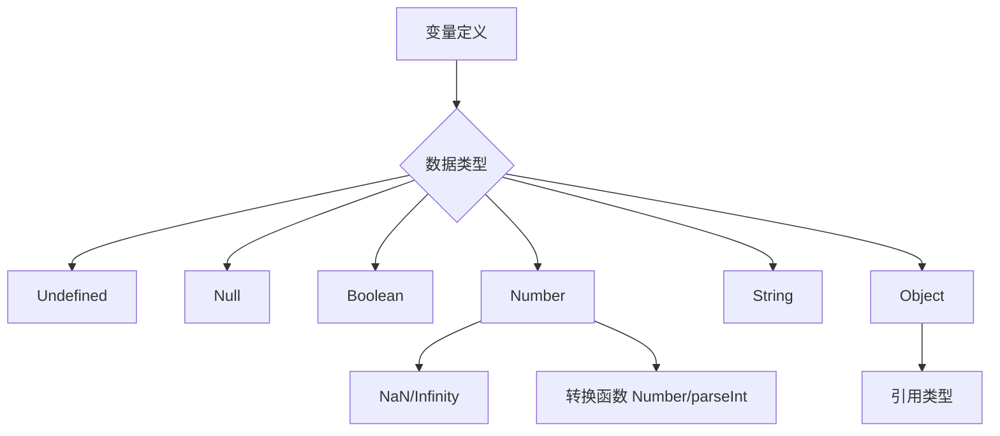
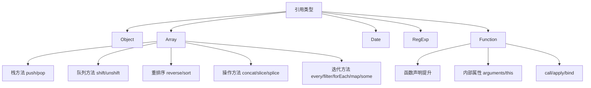
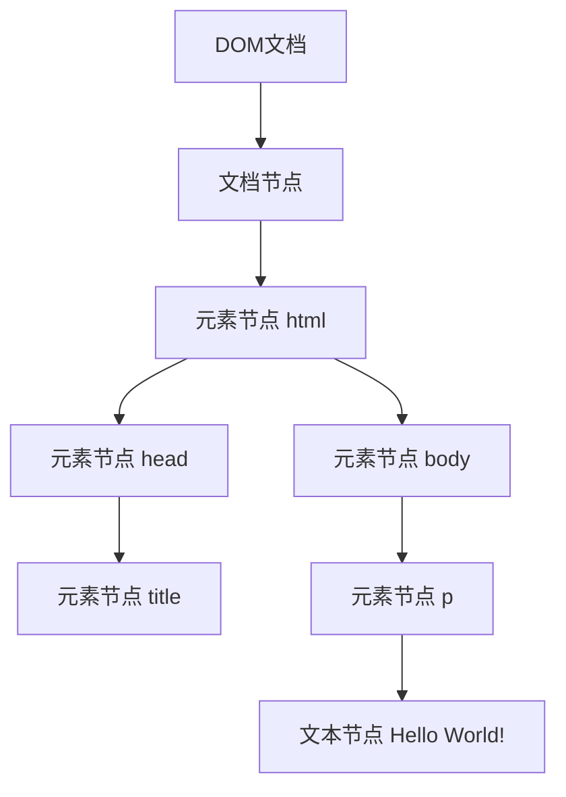
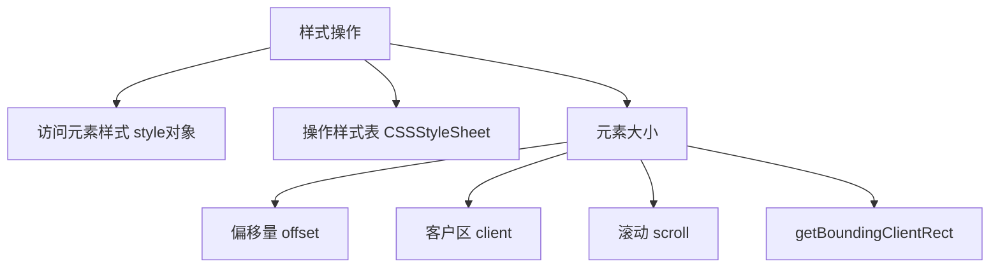
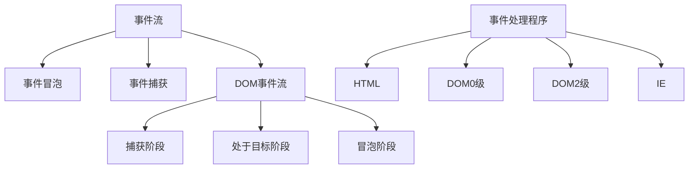
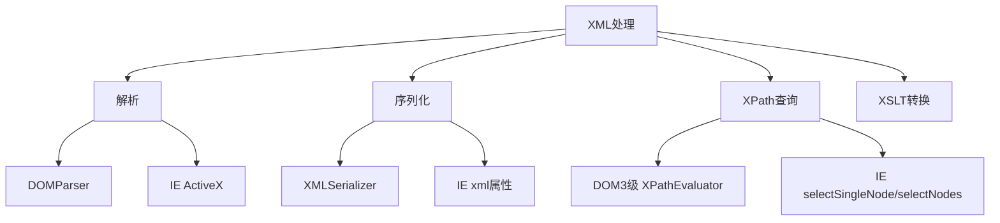
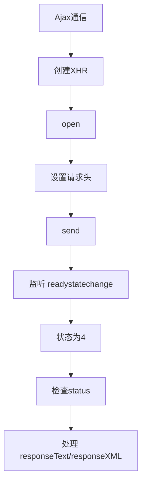
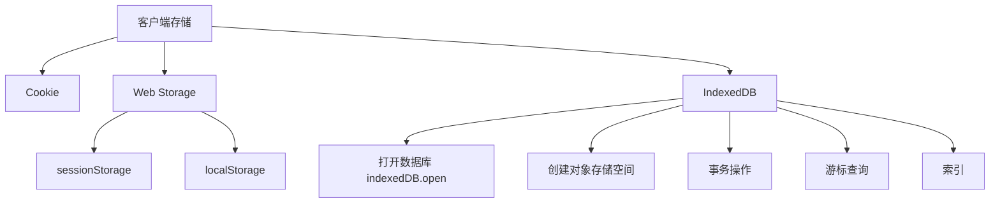

# 《JavaScript高级程序设计（第3版）》章节总结

## 书籍信息

- **书名：** JavaScript高级程序设计（第3版）
- **作者：** [美] Nicholas C. Zakas 著；李松峰、曹力 译
- **PDF 状态：** 完整
- **OCR 状态：** 良好（文本可识别，部分页眉和页码存在错位，但正文连贯）

## 目录说明

- 目录识别情况：完整识别，共25章及附录A-D。
- 章节对应依据：严格按原书PDF目录顺序整理。
- OCR 修复说明：部分页码与正文分隔线需人工对齐，未影响核心内容提取。

## 全书核心主题

本书系统讲解了JavaScript语言的核心语法、面向对象编程、DOM/BOM操作、事件模型、Ajax通信、错误处理、XML处理、JSON以及HTML5相关API。它不仅涵盖了从变量、作用域、引用类型到函数、对象、继承等语言本质，还深入探讨了高级编程技巧如闭包、防篡改对象、函数节流等。此外，本书还涉及了客户端检测、离线应用、数据存储、Canvas绘图、Web Workers等现代Web开发关键技术，旨在帮助开发者全面深入地掌握JavaScript，构建复杂、高性能的Web应用程序。

---

## 第1章：JavaScript简介

### 核心论点

本章主要解决“JavaScript是什么、从何而来、由哪些部分组成”的问题。作者认为，一个完整的JavaScript实现应由核心（ECMAScript）、文档对象模型（DOM）和浏览器对象模型（BOM）三部分组成。

### 关键概念/事件

- **JavaScript起源：** 由Brendan Eich在1995年为Netscape Navigator 2开发，原名LiveScript，后因Java热潮改名。
- **ECMAScript：** ECMA-262定义的语言基础，规定了语法、类型、关键字、操作符、对象等核心内容，与Web浏览器无依赖关系。
- **DOM（文档对象模型）：** 针对XML但扩展用于HTML的API，将整个页面映射为多层节点结构，允许开发者控制页面内容和结构。
- **BOM（浏览器对象模型）：** 支持访问和操作浏览器窗口，处理与浏览器本身的交互，如弹出窗口、导航、屏幕信息等。
- **DOM级别：** DOM1级（核心和HTML模块）、DOM2级（扩充了事件、样式、遍历等）、DOM3级（引入加载保存、验证模块）。

### 逻辑推演/叙事脉络

从JavaScript的诞生背景（解决表单验证）讲起，介绍其历史演进。然后明确区分JavaScript与ECMAScript的关系，指出JavaScript不仅包含ECMAScript，还包括DOM和BOM。接着分别阐述ECMAScript的不同版本、DOM的发展历程和各级别功能，以及BOM的基本概念。最后总结了当前主流浏览器对这三部分的支持情况，为后续章节学习奠定基础。

### 经典金句/数据

> “JavaScript是一种专为与网页交互而设计的脚本语言，由下列三个不同的部分组成：ECMAScript、DOM、BOM。” (p.27)

---

## 第2章：在HTML中使用JavaScript

### 核心论点

本章主要解决“如何将JavaScript代码嵌入HTML页面并确保其高效执行”的问题。作者强调应合理放置`<script>`元素、区分嵌入与外部文件，并利用`defer`和`async`属性优化加载性能。

### 关键概念/事件

- **`<script>`元素：** 核心方法，包含`async`（异步下载）、`defer`（延迟执行）、`src`（外部文件）、`type`（内容类型，默认为text/javascript）等属性。
- **标签位置：** 传统做法放在`<head>`中会阻塞页面渲染；最佳实践是放在`<body>`内容之后，确保先显示页面再加载脚本。
- **延迟与异步脚本：** `defer`让脚本在文档完全解析后按顺序执行；`async`允许脚本异步下载，执行顺序不定，适用于互不依赖的脚本。
- **文档模式：** 混杂模式（quirks mode）与标准模式（standards mode）影响CSS和部分JavaScript行为，应尽量使用标准模式触发（如`<!DOCTYPE html>`）。
- **`<noscript>`元素：** 在浏览器不支持或禁用脚本时显示替代内容。

### 逻辑推演/叙事脉络

首先介绍`<script>`元素的6个属性及其用法。然后指出将脚本放在`<head>`中会导致页面显示延迟，从而提出将脚本放在页面底部的改进方案。接着详细解释`defer`和`async`属性的作用与区别。之后引入文档模式的概念，强调标准模式的重要性。最后介绍`<noscript>`作为后备方案。

### 经典金句/数据

> “由于浏览器会先解析完不使用defer属性的`<script>`元素中的代码，然后再解析后面的内容，所以一般应该把`<script>`元素放在页面最后，即主要内容后面，`</body>`标签前面。” (p.36)

---

## 第3章：基本概念

### 核心论点

本章系统讲解ECMAScript的基本语法、数据类型、操作符、语句和函数，解决“如何编写符合规范的JavaScript代码”的问题。作者强调JavaScript的松散类型、区分大小写以及动态特性。

### 关键概念/事件

- **语法：** 区分大小写；标识符采用驼峰格式；注释分单行(`//`)和块级(`/* ... */`)；严格模式通过`"use strict"`启用。
- **变量：** 松散类型，使用`var`定义，可保存任何类型数据；省略`var`会创建全局变量（不推荐）。
- **数据类型：** 5种简单类型：Undefined, Null, Boolean, Number, String；1种复杂类型：Object。
- **`typeof`操作符：** 返回“undefined”、“boolean”、“string”、“number”、“object”（对象或null）、“function”。
- **数值转换：** `Number()`, `parseInt()`, `parseFloat()`。
- **函数：** 使用`function`关键字定义；参数在内部通过`arguments`对象访问，且与命名参数同步；无函数签名，不支持重载。

### 逻辑推演/叙事脉络

从语法细节（区分大小写、标识符、注释、严格模式）入手。深入讲解变量的松散特性。重点剖析6种数据类型，特别是Undefined和Null的区别、Number类型的浮点误差和NaN、String的不可变性。然后系统介绍各类操作符（包括一元、位操作、布尔、乘性/加性/关系/相等操作符等）。接着讲解`if`、`do-while`、`for`、`for-in`、`switch`等语句。最后阐述函数的定义、参数机制（`arguments`对象）及其“无重载”特性。

### 流程图

### 经典金句/数据

> “ECMAScript函数不介意传递进来多少个参数，也不在乎传递来参数是什么数据类型。……参数在内部是用一个数组来表示的。” (p.64)
> `alert(0.1 + 0.2); // 0.30000000000000004` (浮点误差示例) (p.28)

---

## 第4章：变量、作用域和内存问题

### 核心论点

本章探讨JavaScript中变量、作用域和内存管理的核心机制，解决“如何理解变量的动态性、如何优化内存使用”的问题。作者区分了基本类型与引用类型，阐述了执行环境与作用域链，并介绍了垃圾收集的原理。

### 关键概念/事件

- **基本类型与引用类型：** 基本类型值（Undefined, Null, Boolean, Number, String）保存在栈内存中；引用类型值（对象）保存在堆内存中，变量保存的是指针。
- **复制变量值：** 基本类型复制独立副本；引用类型复制指针，两个变量指向同一对象。
- **传递参数：** 所有参数按值传递。基本类型传递值的副本；引用类型传递内存地址的副本，导致函数内修改对象会反映到外部。
- **执行环境与作用域链：** 全局环境（window对象）和函数环境。作用域链用于保证对变量和函数的有序访问，标识符解析沿链向上搜索。
- **垃圾收集：** 主要采用标记清除（mark-and-sweep）；引用计数（reference counting）存在循环引用问题（常见于IE的COM对象）。解除引用（设为null）可优化内存。

### 逻辑推演/叙事脉络

先区分基本类型和引用类型在内存中的存储差异。通过复制变量值和传递参数的例子，说明按值传递的本质。然后建立执行环境的概念，解释作用域链如何工作，并指出没有块级作用域这一特点。最后讲解垃圾收集机制的原理（标记清除为主），并给出优化内存的建议（解除引用）。

### 经典金句/数据

> “ECMAScript中所有函数的参数都是按值传递的。” (p.70)
> “JavaScript具有自动垃圾收集机制，执行环境会负责管理代码执行过程中使用的内存。” (p.78)

---

## 第5章：引用类型

### 核心论点

本章详细介绍了ECMAScript中的各种引用类型（即对象定义），解决“如何创建和操作对象、数组、日期、正则表达式和函数”的问题。作者展示了Object、Array、Date、RegExp、Function等内置类型的使用方法。

### 关键概念/事件

- **Object类型：** 创建方式：`new Object()` 或对象字面量 `{...}`；访问属性用点表示法或方括号表示法。
- **Array类型：** 动态大小；可存储任意类型数据；常用方法：`push/pop`（栈）、`shift/unshift`（队列）、`sort/reverse`（排序）、`concat/slice/splice`（操作）、`indexOf/lastIndexOf`（位置）以及`every/filter/forEach/map/some`（迭代）。
- **Date类型：** `new Date()`；`Date.parse()` 和 `Date.UTC()` 创建日期；常用方法：`getTime()`, `getFullYear()`, `getMonth()`等。
- **RegExp类型：** 字面量 `/pattern/flags` 或 `new RegExp()`；支持`g`（全局）、`i`（不区分大小写）、`m`（多行）标志；主要方法：`exec()` 和 `test()`。
- **Function类型：** 函数是对象，函数名是指针；支持函数声明提升；内部有`arguments`（含`callee`属性）和`this`；`caller`属性指向调用当前函数的函数；`apply`和`call`用于在特定作用域中调用函数；`bind`创建绑定函数。

### 逻辑推演/叙事脉络

先介绍Object的两种创建方式和属性访问。然后重点讲解Array的创建、检测、转换、栈/队列方法、重排序、操作方法、位置方法、迭代方法和归并方法。接着讲解Date的创建和常用方法。之后阐述RegExp的创建、实例属性和方法、构造函数属性。最后深入分析Function类型——函数声明与表达式的区别、内部属性、call/apply/bind方法。

### 流程图

### 经典金句/数据

> “函数实际上是对象，每个函数都是Function类型的实例。” (p.110)
> `alert(friend instanceof Array); // true` (p.72)

---

## 第6章：面向对象的程序设计

### 核心论点

本章解决“如何在JavaScript中实现面向对象编程（封装、继承、多态）”的问题。作者基于ECMAScript支持对象、但不支持类的特点，详细介绍了创建对象的各种模式以及实现继承的多种方式，并推荐了寄生组合式继承。

### 关键概念/事件

- **理解对象：** 属性类型（数据属性：[[Configurable]], [[Enumerable]], [[Writable]], [[Value]]；访问器属性：[[Get]], [[Set]]）；定义多个属性用`Object.defineProperties()`；读取特性用`Object.getOwnPropertyDescriptor()`。
- **创建对象模式：** 工厂模式（解决创建多个相似对象）；构造函数模式（识别对象类型）；原型模式（共享属性和方法）；组合构造函数与原型模式（最广泛）；动态原型模式；寄生构造函数模式；稳妥构造函数模式。
- **继承：** 原型链（基本思想，但存在引用类型共享问题）；借用构造函数（解决传递参数）；组合继承（结合原型链和借用构造函数）；原型式继承（`Object.create()`）；寄生式继承；寄生组合式继承（最理想，只调用一次超类型构造函数）。

### 逻辑推演/叙事脉络

先讲解属性类型和如何操作特性。然后从最简单的工厂模式开始，逐步演进到构造函数模式（识别类型但方法不共享）、原型模式（共享但属性易污染），引出最经典的组合模式。接着介绍动态原型等模式。在继承部分，从原型链的基本原理讲起，分析其问题后引入借用构造函数，再结合二者形成组合继承。最后提出寄生组合式继承作为最高效的方案。

### 经典金句/数据

> “开发人员普遍认为寄生组合式继承是引用类型最理想的继承范式。” (p.174)

---

## 第7章：函数表达式

### 核心论点

本章解决“如何利用函数表达式（特别是闭包）创建私有变量和模块化代码”的问题。作者重点讲解了闭包的原理、作用域链的影响以及如何模仿块级作用域。

### 关键概念/事件

- **函数声明与函数表达式：** 函数声明有提升；函数表达式无提升，需先赋值。
- **递归：** `arguments.callee` 用于递归调用自身；严格模式下可使用命名函数表达式。
- **闭包：** 有权访问另一个函数作用域中变量的函数。闭包会让包含函数的活动对象保存在内存中。
- **闭包与变量：** 闭包只能取得包含函数中任何变量的最后一个值，可借助匿名函数强制绑定。
- **`this`对象：** 匿名函数的`this`通常指向window，可以将外部`this`保存到变量（如`that`）中供闭包使用。
- **模仿块级作用域：** 通过立即执行函数表达式`(function(){...})()`创建私有作用域。
- **私有变量：** 通过在函数内定义变量和闭包特权方法实现私有性。包括：构造函数模式、静态私有变量、模块模式（为单例创建私有变量）、增强的模块模式。

### 逻辑推演/叙事脉络

先区分函数声明和函数表达式的行为差异。讲解递归时推荐使用`arguments.callee`。然后深入闭包的核心：作用域链的工作机制，展示闭包导致的内存占用问题。接着分析闭包常见的陷阱（循环变量问题、`this`指向问题）。之后通过立即执行函数模仿块级作用域。最后系统介绍私有变量的几种实现方式（构造函数、静态私有变量、模块模式等）。

### 经典金句/数据

> “闭包是指有权访问另一个函数作用域中的变量的函数。” (p.178)
> “由于闭包会携带包含它的函数的作用域，因此会比其他函数占用更多的内存。” (p.181)

---

## 第8章：BOM

### 核心论点

本章解决“如何通过JavaScript操作浏览器窗口及浏览器功能”的问题。作者详细介绍了BOM的核心——`window`对象，以及`location`、`navigator`、`history`等对象。

### 关键概念/事件

- **`window`对象：** 双重角色：JavaScript访问浏览器的接口 + ECMAScript的Global对象。
- **全局作用域：** 所有全局变量和函数都是`window`对象的属性和方法，但全局变量不能通过`delete`删除（而直接属性可以）。
- **窗口关系与框架：** `top`（最外层窗口）、`parent`（直接上层框架）、`self`（回指`window`）；可通过`frames`集合访问框架。
- **窗口位置与大小：** `screenLeft/screenTop`（IE/Safari/Opera/Chrome）与`screenX/screenY`（Firefox/Chrome/Safari）；`innerWidth/innerHeight`（视口大小）；`resizeTo/resizeBy`调整窗口。
- **导航与打开窗口：** `window.open()`；弹出窗口屏蔽检测；超时与间歇调用：`setTimeout`/`setInterval`。
- **`location`对象：** 提供当前文档信息并允许导航。属性：`href`, `host`, `search`, `hash`等；方法：`assign()`, `replace()`, `reload()`。
- **`navigator`对象：** 识别浏览器，检测插件（`plugins`数组或`ActiveXObject`）。
- **`history`对象：** `go()`, `back()`, `forward()`；`length`属性。

### 逻辑推演/叙事脉络

从`window`对象作为全局对象和浏览器接口的双重身份开始。讲解全局变量与`window`属性的细微差别。然后讨论框架关系：`top`、`parent`、`self`。接着介绍窗口位置和大小的跨浏览器获取方法。之后说明如何导航、打开新窗口以及使用定时器。最后分别介绍了`location`、`navigator`、`history`对象的常用属性和方法。

### 经典金句/数据

> “BOM 的核心对象是 window，它表示浏览器的一个实例。” (p.193)
> `location.href = "http://www.wrox.com";` (与显式调用`assign()`效果一样) (p.208)

---

## 第9章：客户端检测

### 核心论点

本章解决“如何根据浏览器能力和缺陷编写跨浏览器代码”的问题。作者指出应优先使用能力检测，其次为怪癖检测，用户代理检测应作为最后的选择。

### 关键概念/事件

- **能力检测（特性检测）：** 先检测最常用特性，且检测实际要用的功能。例如检测`document.getElementById`是否存在而非仅检测`document.all`。更可靠的方式是检测属性是否为函数（`typeof`）。
- **怪癖检测：** 识别浏览器特殊行为（bug）。例如检测IE8及更早版本中实例属性不会在`for-in`中出现的问题。
- **用户代理检测：** 检测`navigator.userAgent`字符串。需了解各浏览器（IE、Firefox、WebKit、Opera等）用户代理字符串的历史和伪装行为。
- **检测顺序建议：** 先使用能力检测，再使用怪癖检测，最后才考虑用户代理检测。
- **用户代理检测技术：** 识别呈现引擎（IE、Gecko、WebKit、KHTML、Opera）、平台（Windows、Mac、Unix）、移动设备（iPhone、Android等）及游戏系统（Wii、PS）。

### 逻辑推演/叙事脉络

从能力检测的概念和重要性入手，指出应先检测常用特性，避免错误假设。然后介绍怪癖检测作为补充。之后用较长篇幅回顾用户代理字符串的历史，展示各浏览器（IE、Firefox、Opera等）的发展演变。接着给出具体的检测技术：识别呈现引擎、浏览器、平台、Windows操作系统、移动设备和游戏系统。最后给出了完整的检测脚本示例和使用建议。

### 经典金句/数据

> “在实际开发中，应该将能力检测作为确定下一步解决方案的依据，而不是用它来判断用户使用的是什么浏览器。” (p.220)
> 到2008年，五大主流Web浏览器（IE、Firefox、Safari、Chrome和Opera）全部做到了与ECMA-262兼容。 (p.22)

---

## 第10章：DOM

### 核心论点

本章解决“如何通过JavaScript操作HTML/XML文档的结构和内容”的问题。作者系统讲解了DOM的节点层次、各种节点类型以及常见操作技术。

### 关键概念/事件

- **节点层次：** 文档节点为根，文档元素是最外层元素（HTML中为`<html>`）。
- **`Node`类型：** `nodeType`属性标识节点类型；`nodeName`和`nodeValue`；节点关系：`childNodes`, `parentNode`, `previousSibling`, `nextSibling`；操作节点：`appendChild()`, `insertBefore()`, `replaceChild()`, `removeChild()`。
- **`Document`类型：** 代表整个HTML页面（`document`对象）；子节点快捷方式：`documentElement`, `body`；查找元素：`getElementById()`, `getElementsByTagName()`；文档写入：`write()`, `writeln()`。
- **`Element`类型：** 用于表现HTML或XML元素；`tagName`属性；操作特性：`getAttribute()`, `setAttribute()`, `removeAttribute()`；`attributes`属性。
- **`Text`类型：** 文本节点；`data`或`nodeValue`获取内容；`splitText()`分割；`normalize()`合并相邻文本节点。
- **操作技术：** 动态脚本、动态样式、操作表格、`NodeList`（动态集合，应减少访问次数）。

### 逻辑推演/叙事脉络

先介绍DOM的树形节点层次。然后详细讲解`Node`类型的属性和方法（是所有节点的基础）。之后分别深入`Document`、`Element`、`Text`等常见节点类型的特性。接着介绍`Comment`、`CDATASection`、`DocumentType`、`DocumentFragment`、`Attr`等类型。最后总结DOM操作技术：动态加载脚本和样式、操作表格的简化方法以及处理`NodeList`的性能问题。

### 流程图

### 经典金句/数据

> “`NodeList`对象是有生命、有呼吸的对象，而不是在我们第一次访问它们的某个瞬间拍摄下来的一张快照。” (p.249)

---

## 第11章：DOM扩展

### 核心论点

本章介绍已成为标准或事实标准的DOM扩展，解决“如何利用现代选择器API和HTML5扩展高效操作DOM”的问题。重点包括Selectors API、元素遍历、HTML5新增特性及专有扩展。

### 关键概念/事件

- **Selectors API：** `querySelector()`返回第一个匹配元素；`querySelectorAll()`返回`NodeList`（快照）；`matchesSelector()`检查元素是否匹配（需加前缀）。
- **元素遍历：** `childElementCount`, `firstElementChild`, `lastElementChild`, `previousElementSibling`, `nextElementSibling`（解决空白文本节点问题）。
- **HTML5扩展：** `getElementsByClassName()`；`classList`属性（`add/remove/contains/toggle`）；焦点管理（`activeElement`, `hasFocus()`）；`readyState`属性；`head`属性；`charset`属性；自定义数据属性（`dataset`）；插入标记（`innerHTML`, `outerHTML`, `insertAdjacentHTML()`）；`scrollIntoView()`。
- **专有扩展：** 文档模式（`document.documentMode`）；`children`属性（IE，只包含元素子节点）；`contains()`方法（判断后代节点）；`innerText`/`outerText`；滚动方法（`scrollByLines`, `scrollByPages`等）。

### 逻辑推演/叙事脉络

先介绍Selectors API的核心方法及其跨浏览器使用。然后说明元素遍历规范解决的空白节点问题。接着用较大篇幅讲述HTML5带来的各种实用扩展：从类操作到焦点管理、从字符集到自定义数据、从插入标记到滚动。最后简述仍为专有的扩展（如IE的`children`、`contains`等）。

### 经典金句/数据

> “jQuery的核心就是通过CSS选择符查询DOM文档取得元素的引用。” (p.286)
> `div.classList.remove("disabled");` (p.291)

---

## 第12章：DOM2和DOM3

### 核心论点

本章探讨DOM2和DOM3对DOM API的增强，解决“如何处理XML命名空间、操作元素样式、遍历文档及操作范围”的问题。重点包括样式操作、元素大小计算、遍历和范围选择。

### 关键概念/事件

- **DOM变化：** 引入XML命名空间支持；`createElementNS()`等命名空间方法。
- **样式操作：** 访问元素样式通过`style`对象；`cssText`, `length`, `item()`, `getPropertyValue()`, `removeProperty()`；计算样式`getComputedStyle()`（IE用`currentStyle`）。
- **操作样式表：** `CSSStyleSheet`类型；`disabled`属性；`cssRules`/`rules`集合；`insertRule()`/`addRule()`；`deleteRule()`/`removeRule()`。
- **元素大小：** 偏移量（`offsetHeight`/`offsetWidth`/`offsetLeft`/`offsetTop`）；客户区大小（`clientWidth`/`clientHeight`）；滚动大小（`scrollHeight`/`scrollWidth`/`scrollLeft`/`scrollTop`）；`getBoundingClientRect()`。
- **遍历：** `NodeIterator`（简单深度优先遍历）；`TreeWalker`（更高级，支持向各方向移动）。
- **范围：** `createRange()`；选择简单范围（`selectNode`, `selectNodeContents`）；操作范围（`deleteContents`, `extractContents`, `cloneContents`）。

### 逻辑推演/叙事脉络

首先介绍DOM2和DOM3在命名空间方面的变化。然后转向样式操作，包括读取和修改内联样式、计算样式、以及操作样式表。接着讲解如何获取元素的各种尺寸信息（偏移、客户区、滚动）。之后介绍DOM遍历模块的两种类型（`NodeIterator`和`TreeWalker`）。最后讲解范围（Range）的创建和使用，以及IE8及更早版本中的文本范围。

### 流程图

### 经典金句/数据

> “`getComputedStyle()`方法返回一个`CSSStyleDeclaration`对象，其中包含当前元素的所有计算的样式。” (p.315)

---

## 第13章：事件

### 核心论点

本章全面讲解JavaScript事件机制，解决“如何处理浏览器事件、实现交互”的问题。作者详细说明了事件流、事件处理程序注册、事件对象、各类事件以及性能优化。

### 关键概念/事件

- **事件流：** 事件冒泡（IE）和事件捕获（Netscape）。DOM事件流包括：捕获阶段、处于目标阶段、冒泡阶段。
- **事件处理程序：** HTML事件处理程序（内联onclick）；DOM0级（`element.onclick=...`）；DOM2级（`addEventListener/removeEventListener`）；IE事件处理程序（`attachEvent/detachEvent`）。跨浏览器方案需封装`addHandler`/`removeHandler`。
- **事件对象：** DOM中`event`对象包含`type`, `target`, `currentTarget`, `preventDefault()`, `stopPropagation()`等；IE中为`window.event`，有`srcElement`, `returnValue`, `cancelBubble`。
- **事件类型：** UI事件（load, unload, resize, scroll）；焦点事件（focus, blur）；鼠标与滚轮事件（click, mouseover, mouseout, mousewheel）；键盘与文本事件（keydown, keypress, keyup, textInput）；变动事件；HTML5事件（contextmenu, beforeunload, DOMContentLoaded, pageshow/pagehide, hashchange）。
- **设备事件：** orientationchange, MozOrientation, deviceorientation, devicemotion。
- **触摸与手势：** touchstart/touchmove/touchend/touchcancel；gesturestart/gesturechange/gestureend。
- **内存与性能：** 事件委托（利用冒泡减少处理程序）；移除空事件处理程序。
- **模拟事件：** DOM中`createEvent()` + `dispatchEvent()`；IE中`createEventObject()` + `fireEvent()`。

### 逻辑推演/叙事脉络

先介绍事件流的概念（冒泡和捕获）。然后讲解如何注册和移除事件处理程序，并提供跨浏览器封装。接着详细介绍事件对象在不同浏览器中的差异及统一方法。之后按类别列举各种事件（UI、焦点、鼠标、键盘、HTML5、设备、触摸等）。再讨论事件处理的内存和性能问题（委托、移除）。最后介绍如何手动模拟事件。

### 流程图

### 经典金句/数据

> “事件委托利用了事件冒泡，只指定一个事件处理程序，就可以管理某一类型的所有事件。” (p.402)

---

## 第14章：表单脚本

### 核心论点

本章解决“如何使用JavaScript增强表单交互、验证用户输入以及实现富文本编辑”的问题。作者详细说明了表单基础、文本框脚本、选择框脚本、表单序列化以及富文本编辑技术。

### 关键概念/事件

- **表单基础：** `HTMLFormElement`属性（`action`, `method`, `elements`等）；提交与重置；`elements`集合。
- **文本框脚本：** `input`和`textarea`；`select()`方法；`select`事件；取得选中文本（`selectionStart/selectionEnd`或IE的`document.selection`）；`setSelectionRange()`；过滤输入。
- **剪贴板操作：** `beforecopy/copy/beforecut/cut/beforepaste/paste`事件；`clipboardData`对象（`getData/setData`）。
- **约束验证API：** `required`属性；新输入类型（email, url, number等）；`pattern`属性；`checkValidity()`方法；`validity`属性；`novalidate`属性。
- **选择框脚本：** `select`和`option`；属性：`selectedIndex`, `options`, `multiple`等；动态添加/移除选项。
- **表单序列化：** 按规则（禁用字段不发送、只发送勾选的复选/单选按钮等）将表单数据拼接为URL编码字符串。
- **富文本编辑：** 使用`iframe`的`designMode`属性或`contenteditable`属性；`document.execCommand()`执行格式化；选区操作。

### 逻辑推演/叙事脉络

先介绍表单和表单字段的基础属性和方法。然后深入文本框：选择文本、过滤输入、操作剪贴板。接着介绍HTML5的约束验证API。之后讲解选择框的动态操作。再给出表单序列化的通用函数。最后详细介绍富文本编辑的两种实现方式（`designMode`和`contenteditable`）以及操作方法。

### 经典金句/数据

> “在文本框的内容变化时，可以通过侦听键盘事件以及检测插入的字符，来允许或禁止用户输入某些字符。” (p.444)

---

## 第15章：使用Canvas绘图

### 核心论点

本章介绍Canvas 2D绘图和WebGL基础，解决“如何在浏览器中动态绘制图形、图像和动画”的问题。作者展示了Canvas的基本用法、2D上下文的绘图方法以及WebGL的基本概念。

### 关键概念/事件

- **基本用法：** `<canvas>`元素需设置width/height；`getContext('2d')`获取2D上下文；`toDataURL()`导出图像。
- **2D上下文：** 填充和描边（`fillStyle`, `strokeStyle`）；绘制矩形（`fillRect`, `strokeRect`, `clearRect`）；路径（`beginPath`, `arc`, `lineTo`, `moveTo`, `closePath`, `fill`, `stroke`）；文本（`fillText`, `strokeText`, `measureText`）；变换（`rotate`, `scale`, `translate`, `transform`）；图像（`drawImage`）；阴影（`shadowColor`, `shadowBlur`, `shadowOffsetX/Y`）；渐变（`createLinearGradient`, `createRadialGradient`）；模式（`createPattern`）；图像数据（`getImageData`, `putImageData`, `createImageData`）；合成（`globalAlpha`, `globalCompositeOperation`）。
- **WebGL：** 基于OpenGL ES 2.0的3D上下文（`experimental-webgl`）。类型化数组（`ArrayBuffer`, `DataView`, 类型化视图）；视口；缓冲区；着色器（顶点着色器和片段着色器，GLSL语言）；纹理。

### 逻辑推演/叙事脉络

先介绍Canvas元素的基本属性和兼容性检测。然后深入2D上下文的绘图方法：从简单图形（矩形、路径）到文本、变换、图像、阴影、渐变、模式，再到像素级操作（图像数据）和合成。最后介绍WebGL的基本概念：类型化数组、缓冲区、着色器、纹理等，并指出WebGL尚处于实验性阶段。

### 经典金句/数据

> “`<canvas>`元素最早是由苹果公司推出的，主要用在其Dashboard微件中。” (p.445)

---

## 第16章：HTML5脚本编程

### 核心论点

本章介绍HTML5中新增的JavaScript API，解决“如何实现跨文档通信、原生拖放、多媒体控制及历史状态管理”的问题。作者重点讲解了postMessage、拖放API、`<audio>`/`<video>`和`history.pushState`。

### 关键概念/事件

- **跨文档消息传递（XDM）：** `postMessage()`方法（传消息和目标域）；`message`事件（`data`, `origin`, `source`）；安全验证来源。
- **原生拖放：** 拖放事件（`dragstart`, `drag`, `dragend`, `dragenter`, `dragover`, `dragleave`, `drop`）；自定义放置目标（取消`dragenter`和`dragover`默认行为）；`dataTransfer`对象（`setData`, `getData`）；`dropEffect`和`effectAllowed`；`draggable`属性。
- **媒体元素：** `<audio>`和`<video>`；属性（`autoplay`, `buffered`, `currentTime`, `duration`, `paused`等）；事件（`loadstart`, `progress`, `canplay`, `ended`等）；自定义播放器（调用`play()`/`pause()`）；检测编解码器（`canPlayType()`）；`Audio`类型。
- **历史状态管理：** `history.pushState()`（状态对象、标题、URL）；`popstate`事件（`event.state`）；`replaceState()`更新当前状态。

### 逻辑推演/叙事脉络

先介绍XDM的用法和安全准则。然后详细讲解原生拖放的事件流程和dataTransfer对象。接着介绍`<audio>`和`<video>`的属性和事件，并展示如何自定义播放器。最后说明历史状态管理API如何在不加载新页面的情况下改变浏览器URL。

### 经典金句/数据

> “postMessage()方法接收两个参数：一条消息和一个表示消息接收方来自哪个域的字符串。” (p.480)

---

## 第17章：错误处理与调试

### 核心论点

本章解决“如何优雅地处理JavaScript运行时错误、调试代码以及区分致命与非致命错误”的问题。作者介绍了`try-catch`、`throw`、错误类型以及浏览器调试工具的使用。

### 关键概念/事件

- **浏览器错误报告：** IE、Firefox（含Firebug）、Safari、Opera、Chrome各自控制台。
- **`try-catch`语句：** 捕获异常；`finally`子句无论如何都会执行；错误类型（`Error`, `EvalError`, `RangeError`, `ReferenceError`, `SyntaxError`, `TypeError`, `URIError`）。
- **抛出错误：** `throw new Error("msg")`；自定义错误类型（继承Error）。
- **`error`事件：** `window.onerror`捕获未被`try-catch`处理的错误；参数（消息、URL、行号）。
- **区分错误类型：** 非致命错误（不影响主要任务，可恢复）；致命错误（应用无法继续）。
- **记录错误到服务器：** 使用`Image`对象发送请求（避免跨域限制）。
- **调试技术：** 向控制台记录消息（`console.log`等）；记录到当前页面；抛出错误。

### 逻辑推演/叙事脉络

先概述各浏览器如何报告错误。然后详细讲解`try-catch`的使用、错误类型、`finally`以及何时抛出自定义错误。接着介绍`window.onerror`事件。之后讨论如何区分致命和非致命错误以及记录错误日志。最后介绍现代调试技术和常见IE错误。

### 经典金句/数据

> “在开发JavaScript代码的过程中，重点关注函数和可能导致函数执行失败的因素。” (p.505)
> “最适合采用事件委托技术的事件包括click、mousedown、mouseup、keydown、keyup和keypress。” (p.404)

---

## 第18章：JavaScript与XML

### 核心论点

本章解决“如何在浏览器中解析、操作和转换XML数据”的问题。作者比较了DOM2级核心、DOMParser/XMLSerializer以及IE的ActiveX实现，并介绍了XPath和XSLT的跨浏览器处理。

### 关键概念/事件

- **浏览器对XML DOM的支持：** DOM2级`createDocument()`；`DOMParser`（解析XML字符串）；`XMLSerializer`（序列化DOM）；IE的ActiveX对象（`MSXML2.DOMDocument`）。
- **跨浏览器解析/序列化：** 封装`parseXml()`和`serializeXml()`函数。
- **XPath：** DOM3级XPath（`XPathEvaluator`, `evaluate()`）；IE的`selectSingleNode()`和`selectNodes()`；跨浏览器实现。
- **XSLT：** IE通过`transformNode()`和XSL处理器；其他浏览器通过`XSLTProcessor`；跨浏览器转换。

### 逻辑推演/叙事脉络

先介绍DOM2级Core创建XML文档的方法。然后对比DOMParser/XMLSerializer与IE ActiveX的实现，并给出跨浏览器解析序列化函数。接着讲解XPath的DOM3级标准和IE的实现，最后实现跨浏览器的XPath查询。最后部分讨论XSLT的跨浏览器使用。

### 流程图

### 经典金句/数据

> “交付出东西的人才是赢家。” (p.20)

---

## 第19章：E4X（ECMAScript for XML）

### 核心论点

本章介绍ECMAScript for XML（E4X）扩展，解决“如何在JavaScript中以原生语法简化XML操作”的问题。作者重点说明了E4X的类型、一般用法及语法变化，并指出Firefox是当时唯一主要支持的浏览器。

### 关键概念/事件

- **E4X类型：** `XML`（XML结构中独立部分）、`XMLList`（XML对象集合）、`Namespace`（命名空间映射）、`QName`（限定名）。
- **创建XML对象：** 构造函数或XML字面量（如`var x = <root/>`）；`toXMLString()`和`toString()`。
- **访问元素和特性：** 使用点语法（`employee.name`）；特性用`@`前缀（`employee.@position`）；`child()`、`attribute()`方法；`delete`删除。
- **查询：** 双点（`..`）访问后代；条件过滤（`.(@position=="Salesperson")`）；`parent()`。
- **构建与操作：** 嵌入变量`{}`；`appendChild`、`insertChildBefore`等；`setNamespace`。
- **解析与序列化设置：** `ignoreComments`, `ignoreProcessingInstructions`, `prettyIndent`等。
- **语言变化：** `for-each-in`循环；`isXMLName()`；`typeof`返回"xml"。

### 逻辑推演/叙事脉络

先介绍E4X新增的四种类型及其关系。然后通过大量示例展示如何访问XML元素、特性、文本等。接着讲解如何在E4X中进行查询、构建和操作XML结构。之后说明解析和序列化的设置选项。最后介绍命名空间的处理以及E4X带来的语言语法变化，并指出其浏览器支持情况。

### 经典金句/数据

> “E4X本身不是一门语言，它只是ECMAScript语言的可选扩展。” (p.546)
> 到2011年底，Firefox还是唯一一个支持E4X的浏览器。 (p.561)

---

## 第20章：JSON

### 核心论点

本章解决“如何在JavaScript中高效解析和序列化JSON数据”的问题。作者介绍了JSON语法、`JSON`对象的方法以及序列化/解析时的自定义选项。

### 关键概念/事件

- **JSON语法：** 支持简单值（字符串/数值/布尔值/null）、对象（键必须双引号）、数组。不支持undefined、函数、变量。
- **`JSON`对象：** `stringify()`（序列化为JSON字符串）；`parse()`（解析JSON字符串为JS值）。
- **序列化选项：** 过滤器（数组或函数）；字符串缩进；`toJSON()`方法（自定义序列化）。
- **解析选项：** 还原函数（reviver），用于在返回前处理键值对。

### 逻辑推演/叙事脉络

先对比JSON与XML，强调JSON作为轻量级数据格式的优势。然后分别讲解JSON支持的三种值类型（简单值、对象、数组）。接着详细介绍`JSON.stringify()`和`JSON.parse()`的用法，包括如何通过过滤器和`toJSON`控制序列化结果，以及通过还原函数控制解析结果。

### 经典金句/数据

> “JSON 是一种数据格式，不是一种编程语言。” (p.562)

---

## 第21章：Ajax与Comet

### 核心论点

本章解决“如何通过JavaScript实现与服务器的异步通信（Ajax）以及服务器推送（Comet）”的问题。作者重点讲解了`XMLHttpRequest`对象的使用、CORS跨域技术以及WebSocket等高级通信方式。

### 关键概念/事件

- **`XMLHttpRequest`对象：** 创建（IE的ActiveX及其他浏览器的原生XHR）；用法：`open()`, `send()`, `abort()`；`readyState`属性（0-4）和`readystatechange`事件；`status`和`statusText`。
- **HTTP头部：** `setRequestHeader()`（必须在`open`之后`send`之前）；`getResponseHeader()`/`getAllResponseHeaders()`。
- **GET与POST：** GET需正确编码查询字符串；POST需设置`Content-Type`。
- **XMLHttpRequest 2级：** `FormData`；超时设置（`timeout`和`ontimeout`）；`overrideMimeType()`。
- **进度事件：** `loadstart`, `progress`, `error`, `abort`, `load`, `loadend`；`onprogress`可计算已接收字节。
- **CORS（跨源资源共享）：** IE的`XDomainRequest`；其他浏览器XHR支持CORS；Preflighted Requests；带凭据的请求。
- **其他跨域技术：** 图像Ping（单向）；JSONP（通过`<script>`）。
- **Comet：** 长轮询和HTTP流。SSE（`EventSource`）；WebSocket（全双工，自定义协议）。
- **安全：** CSRF攻击防范。

### 逻辑推演/叙事脉络

先介绍XHR对象的创建和跨浏览器兼容。然后讲解XHR的用法（同步/异步），详解`readyState`和HTTP状态。接着说明如何设置和获取HTTP头部。之后区别GET和POST请求。再介绍XHR2级的新特性（FormData, 超时, 重写MIME）。然后是进度事件。之后重点解决跨域问题：CORS、图像Ping、JSONP。最后讨论Comet技术（长轮询、SSE、WebSocket）和安全问题。

### 流程图

### 经典金句/数据

> “Ajax技术的核心是XMLHttpRequest对象（简称XHR）。” (p.571)

---

## 第22章：高级技巧

### 核心论点

本章探讨JavaScript中的高级函数技术和对象控制方法，解决“如何写出更安全、高效、可维护的代码”的问题。内容包括安全的类型检测、惰性载入、函数绑定/柯里化、防篡改对象、高级定时器和自定义事件。

### 关键概念/事件

- **安全的类型检测：** 利用`Object.prototype.toString.call(value)`返回`[object NativeConstructorName]`，可跨全局作用域检测数组、函数等。
- **作用域安全的构造函数：** 检查`this instanceof`，否则`new`调用自身，避免意外修改全局对象。
- **惰性载入函数：** 在函数第一次调用时重写自身，避免重复执行分支逻辑。两种方式：函数内重写或立即执行函数返回适当函数。
- **函数绑定：** 创建在指定环境中执行的函数（`bind()`）。结合柯里化可预填参数。
- **柯里化：** 创建已经设置好一个或多个参数的函数（`curry()`）。
- **防篡改对象：** 不可扩展对象（`preventExtensions`）、密封对象（`seal`，不可配置）、冻结对象（`freeze`，只读）。
- **高级定时器：** 定时器并非精确；避免`setInterval`的多个队列问题，使用链式`setTimeout`。数组分块（`chunk`）和函数节流（`throttle`）。
- **自定义事件：** 观察者模式；`EventTarget`类型（`handlers`, `addHandler`, `fire`, `removeHandler`）。
- **拖放：** 封装拖放功能，结合自定义事件。

### 逻辑推演/叙事脉络

先从安全的类型检测入手，解决`typeof`和`instanceof`的局限。然后讲解作用域安全的构造函数和惰性载入函数提高性能。接着深入函数绑定和柯里化。之后介绍ECMAScript5的防篡改对象。再讨论高级定时器技术（数组分块、节流）。最后通过自定义事件和拖放示例展示如何应用这些技巧。

### 经典金句/数据

> “惰性载入表示函数执行的分支仅会发生一次。” (p.600)

---

## 第23章：离线应用与客户端存储

### 核心论点

本章解决“如何在离线状态下运行Web应用以及如何在客户端持久存储数据”的问题。作者介绍了离线检测、应用缓存、cookie、Web Storage和IndexedDB。

### 关键概念/事件

- **离线检测：** `navigator.onLine`属性；`online`/`offline`事件。
- **应用缓存：** `manifest`文件（列出需缓存的资源）；`applicationCache`对象（`status`属性及`checking`, `downloading`, `updateready`等事件）；`swapCache()`更新。
- **`cookie`：** 限制（每个域20-50个，总大小4095B）；构成（名称、值、域、路径、失效时间、安全标志）；读写`document.cookie`；子cookie。
- **IE用户数据：** `userData`行为；`save()`/`load()`。
- **Web Storage：** `sessionStorage`（会话级）和`localStorage`（持久化）；API（`setItem`, `getItem`, `removeItem`, `clear`, `key`）；`storage`事件。
- **IndexedDB：** 异步API；数据库（`indexedDB.open`），对象存储空间，事务，游标查询，键范围，索引。

### 逻辑推演/叙事脉络

先介绍如何检测在线/离线状态。然后讲解应用缓存清单和API。接着回顾cookie的用途、限制和操作。再介绍IE的userData。之后重点讲解Web Storage（`sessionStorage`和`localStorage`）的用法和事件。最后详细阐述IndexedDB的架构和操作（数据库、对象存储、事务、游标、索引等）。

### 流程图

### 经典金句/数据

> “每个域的cookie总数是有限的，不过浏览器之间各有不同。IE6以及更低版本限制每个域名最多20个cookie。” (p.629)

---

## 第24章：最佳实践

### 核心论点

本章总结JavaScript开发的最佳实践，解决“如何编写可维护、高性能、易部署的代码”的问题。内容涵盖代码约定、松散耦合、性能优化和部署流程。

### 关键概念/事件

- **可维护性：** 代码约定（可读性、命名、变量类型透明）；松散耦合（解耦HTML/JavaScript、CSS/JavaScript、应用逻辑/事件处理程序）；编程实践（尊重对象所有权、避免全局量、避免与`null`比较、使用常量）。
- **性能：** 注意作用域（避免全局查找、避免`with`）；选择正确方法（避免不必要的属性查找、优化循环、展开循环、避免双重解释）；最小化语句数；优化DOM交互（最小化现场更新、使用`innerHTML`、事件代理、注意`HTMLCollection`）。
- **部署：** 构建过程（合并文件、验证、压缩）；HTTP压缩。

### 逻辑推演/叙事脉络

先强调可维护代码的重要性和特征。然后从代码约定（命名、注释、变量类型透明）开始。接着讲解如何实现松散耦合（HTML/CSS/JS分离、逻辑与事件分离）。再给出编程实践建议（全局量、常量等）。之后转向性能优化：作用域、算法、循环、DOM交互等。最后讨论部署流程（构建、验证、压缩）。

### 经典金句/数据

> “jQuery 是改变JavaScript编写方式的工具。” (p.21)
> “一般来说，最好是将所有JavaScript代码放在外部文件中，以便压缩和缓存。” (p.681)

---

## 第25章：新兴的API

### 核心论点

本章介绍当时处于草案或刚起步的HTML5相关API，解决“如何利用新API实现更高效的动画、页面可见性检测、地理定位、文件操作、性能测量和Web Workers”的问题。

### 关键概念/事件

- **`requestAnimationFrame()`：** 用于动画，告知浏览器在重绘屏幕前调用函数。Mozilla的`mozRequestAnimationFrame`，WebKit/IE带前缀。
- **Page Visibility API：** `document.hidden`/`document.visibilityState`；`visibilitychange`事件；用于暂停后台页面活动。
- **Geolocation API：** `navigator.geolocation`；`getCurrentPosition()`（成功回调、失败回调、选项）；`watchPosition()`/`clearWatch()`。
- **File API：** `File`对象（`name`, `size`, `type`, `lastModifiedDate`）；`FileReader`（`readAsText`, `readAsDataURL`, `readAsBinaryString`, `readAsArrayBuffer`）；事件（`progress`, `error`, `load`）。对象URL（`createObjectURL`, `revokeObjectURL`）；读取拖放的文件；通过XHR上传。
- **Web Timing：** `window.performance`；`performance.navigation`和`performance.timing`属性（记录页面加载各阶段时间戳）。
- **Web Workers：** 后台线程；`Worker`对象；`postMessage`传递消息；Worker全局作用域（不能访问DOM）；`importScripts`加载其他脚本；专用Worker与共享Worker。

### 逻辑推演/叙事脉络

先介绍`requestAnimationFrame`解决早期动画循环精度问题。然后介绍Page Visibility API优化资源使用。接着讲解Geolocation API获取地理位置。之后详细讲解File API：读取文件、部分内容、对象URL、拖放上传。再介绍Web Timing测量页面性能指标。最后介绍Web Workers实现多线程后台任务。

### 经典金句/数据

> “支持离线Web应用开发是HTML5的另一个重点。” (p.626)
> “IndexedDB设计的操作完全是异步进行的。” (p.643)

---

## 附录

### 附录A：ECMAScript Harmony（未来版本特性）

介绍了ECMAScript 6（Harmony）计划中的新特性，包括常量（`const`）、块级作用域（`let`）、剩余/分布参数、默认参数值、生成器（`yield`）、迭代器、数组领悟、解构赋值、代理（`Proxy`）、映射与集合（`Map`, `Set`, `WeakMap`）、结构类型（`StructType`）、数组类型（`ArrayType`）、类语法（`class`, `extends`, 私有成员, getter/setter）以及模块（`module`, `import`）。

### 附录B：严格模式

详细说明严格模式的编译指示（`"use strict"`）及其限制：禁止意外创建全局变量、禁止删除变量、对象属性名唯一、函数参数名唯一、`arguments`行为变化、禁止`with`、禁止八进制字面量等。

### 附录C：JavaScript库

分类介绍了通用库（YUI, Prototype, Dojo, MooTools, jQuery, MochiKit, Underscore.js）、互联网应用库（Backbone.js, Rico, qooxdoo）、动画特效库（script.aculo.us, moo.fx, Lightbox）和加密库（JavaScript MD5, JavaScrypt）。

### 附录D：JavaScript工具

介绍了校验器（JSLint, JSHint, JavaScript Lint）、压缩器（JSMin, Dojo ShrinkSafe, YUI Compressor）、单元测试（JsUnit, YUI Test, DOH, qUnit）、文档生成器（JsDoc Toolkit, YUI Doc, AjaxDoc）和安全执行环境（ADsafe, Caja）。

---

# 核心总结

《JavaScript高级程序设计（第3版）》是一本全面、深入的JavaScript权威指南。它从语言基础（变量、类型、作用域）讲起，逐步深入到面向对象、函数式编程、DOM/BOM操作、事件模型、Ajax通信、错误处理、XML/JSON数据处理，再到HTML5相关的Canvas、离线存储、Web Workers等现代API。本书不仅传授了JavaScript语法和API，更强调最佳实践（可维护性、性能优化、安全编码）和跨浏览器策略。其叙述逻辑清晰，案例丰富，是中级开发者向高级进阶的经典必读书目。