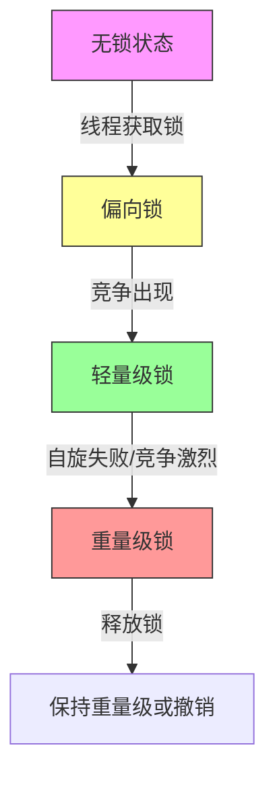
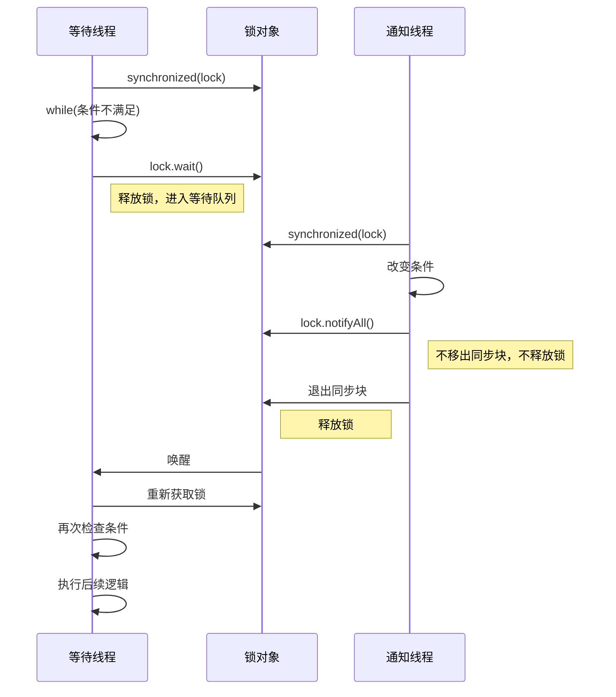
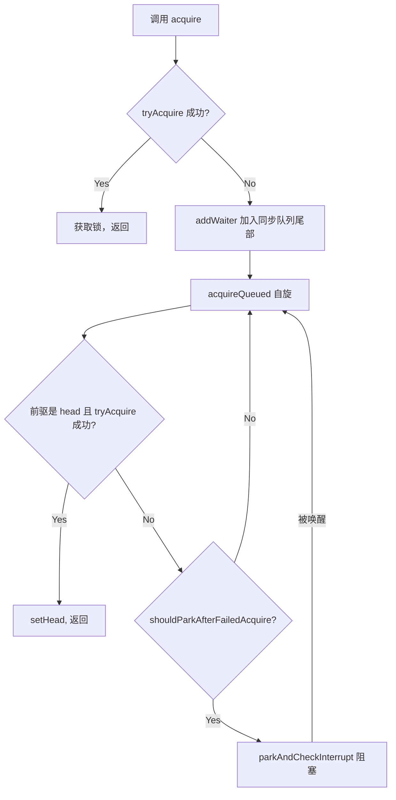
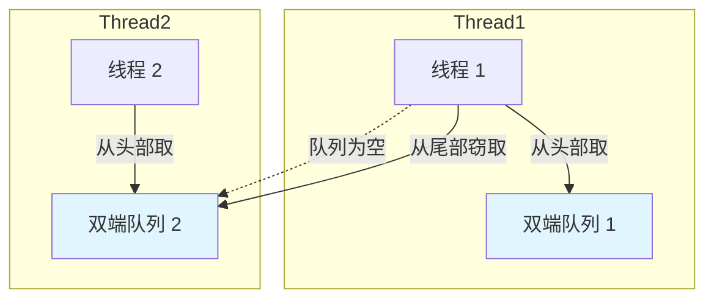
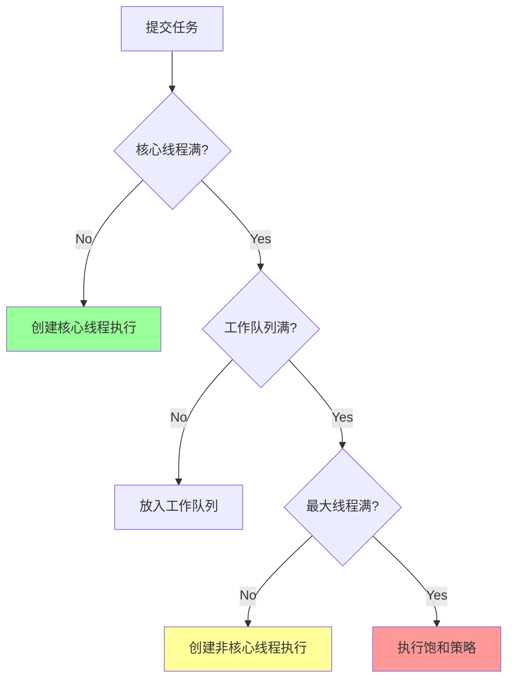
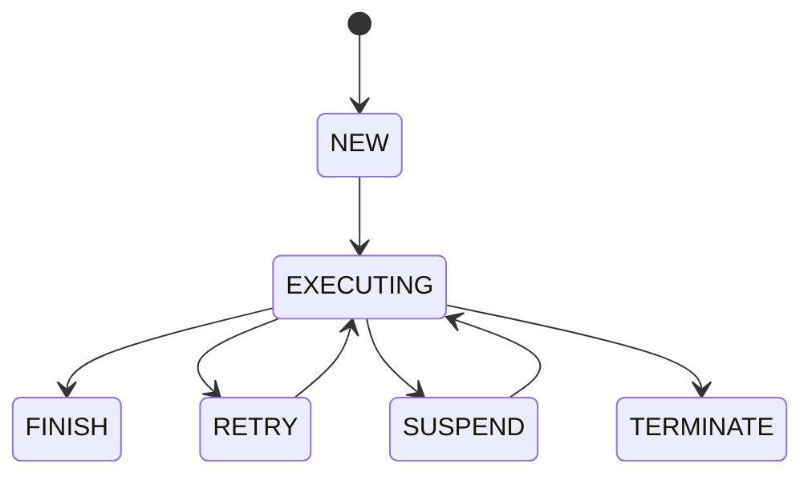

# 《Java并发编程的艺术》章节总结

## 书籍信息

- **书名**：Java并发编程的艺术
- **作者**：方腾飞、魏鹏、程晓明
- **出版社**：机械工业出版社
- **PDF 状态**：文本完整，OCR 识别质量高，无乱码或缺失。
- **知识截止**：基于 JDK 7/8 时代的并发编程最佳实践与底层原理。

## 目录说明

- **目录识别情况**：全书共 11 章，结构清晰，从挑战、底层原理、内存模型、基础API、锁、容器、原子类、工具类、线程池、Executor框架到实战。
- **章节对应依据**：严格遵循原书目录顺序。
- **OCR 修复说明**：无需修复，内容完整。

## 全书核心主题

本书深入剖析了 Java 并发编程的底层实现原理，不仅局限于 Java API 层面，更深入到 JVM 甚至 CPU 指令集层面。全书围绕“如何正确、高效地进行并发编程”这一核心，系统讲解了 Java 内存模型（JMM）、volatile 与 synchronized 的实现机制、锁的升级过程、并发容器（如 ConcurrentHashMap）的设计思想、原子操作类、并发工具类（CountDownLatch, CyclicBarrier, Semaphore等）以及线程池和 Executor 框架的原理与应用。旨在帮助开发者从“知其然”到“知其所以然”，掌握解决并发挑战（上下文切换、死锁、资源限制）的能力，并具备线上并发问题排查与优化的实战技巧。

---

## 第1章：并发编程的挑战

### 1. 核心论点

本章主要讨论并发编程并非简单的“多线程即快”，而是面临上下文切换、死锁和资源限制三大挑战。作者观点是：必须理解这些挑战的根源，并通过无锁编程、CAS、合理配置线程数等手段来优化，而非盲目增加线程。

### 2. 关键概念/事件

- **上下文切换（Context Switch）**：CPU 在任务保存和加载状态时的开销，多线程不一定比串行快，尤其在任务量小时。
- **死锁（Deadlock）**：两个或多个线程互相等待对方释放锁，导致系统不可用。
- **资源限制**：硬件（带宽、CPU、磁盘IO）或软件（数据库连接数）资源有限，过度并发反而降低性能。
- **减少上下文切换的方法**：无锁并发编程、CAS 算法、使用最少线程、协程。

### 3. 逻辑推演/叙事脉络

首先通过对比串行与并发执行累加操作的实验，证明多线程在低负载下因创建和切换开销可能更慢。接着介绍如何使用 `vmstat` 等工具度量上下文切换。随后分析死锁产生的原因及避免方法（如避免嵌套锁、使用定时锁）。最后探讨资源限制对并发的影响，提出通过集群并行或资源池化来解决，并强调根据资源瓶颈调整并发度。

### 4. 经典金句/数据

> “并发编程的目的是为了让程序运行得更快，但是，并不是启动更多的线程就能让程序最大限度地并发执行。”

> “当并发执行累加操作不超过百万次时，速度会比串行执行累加操作要慢。”

---

## 第2章：Java并发机制的底层实现原理

### 1. 核心论点

本章深入底层，揭示 Java 并发机制依赖于 JVM 实现和 CPU 指令。核心观点是：理解 volatile、synchronized 和原子操作的硬件级实现（如缓存一致性协议、Lock 前缀指令、对象头 Mark Word），是掌握并发编程的关键。

### 2. 关键概念/事件

- **volatile 可见性原理**：通过 Lock 前缀指令将缓存行写回内存，并使其他处理器缓存无效（MESI 协议）。
- **缓存行填充（Cache Line Padding）**：Doug Lea 在 LinkedTransferQueue 中通过追加字节填满 64 字节缓存行，避免伪共享（False Sharing）。
- **synchronized 锁升级**：无锁 -> 偏向锁 -> 轻量级锁（自旋/CAS） -> 重量级锁（OS Mutex）。锁只能升级不能降级。
- **原子操作实现**：处理器通过总线锁或缓存锁保证原子性；Java 通过循环 CAS 实现原子操作。
- **CAS 三大问题**：ABA 问题（使用版本号解决）、循环时间长开销大、只能保证一个共享变量原子性。

### 3. 逻辑推演/叙事脉络

首先分析 volatile 如何通过 CPU 的 Lock 指令和缓存一致性协议保证可见性，并引出缓存行填充优化。接着详细拆解 synchronized 的对象头结构（Mark Word）及锁升级过程，解释为何 Java 6 后 synchronized 不再“重量级”。最后探讨原子操作的硬件基础（总线锁/缓存锁）及 Java 中 CAS 的实现与局限，引出 Atomic 包的使用。

### 4. 流程图（如存在）

#### 锁升级流程

### 5. 经典金句/数据

> “volatile 是轻量级的 synchronized，它在多处理器开发中保证了共享变量的‘可见性’。”

> “锁可以升级但不能降级，意味着偏向锁升级成轻量级锁后不能降级成偏向锁。”

---

## 第3章：Java内存模型

### 1. 核心论点

本章揭开 Java 内存模型（JMM）的神秘面纱，核心观点是：JMM 定义了线程与主内存的抽象关系，通过 happens-before 规则和内存屏障，屏蔽了不同处理器内存模型的差异，为程序员提供一致的内存可见性保证。

### 2. 关键概念/事件

- **JMM 抽象结构**：线程本地内存与主内存，通信需经过主内存刷新与读取。
- **重排序（Reordering）**：编译器、指令级并行、内存系统重排序。as-if-serial 语义保证单线程结果不变。
- **happens-before 规则**：程序顺序、监视器锁、volatile、传递性、start/join 规则。
- **volatile 内存语义**：volatile 写-读具有与锁释放-获取相同的内存语义（刷新本地内存/失效本地内存）。
- **双重检查锁定（DCL）**：旧 JMM 下 DCL 不安全，JDK 5+ 需将实例声明为 volatile 以禁止重排序。
- **final 域安全性**：构造函数内 final 域写不会重排序到构造函数外，保证初始化安全。

### 3. 逻辑推演/叙事脉络

首先介绍 JMM 的基础概念及重排序对多线程的影响。接着引入 happens-before 规则作为判断可见性的标准。详细分析 volatile 和 synchronized 的内存语义实现（内存屏障插入策略）。最后探讨 final 域的特殊重排序规则，并以此解决双重检查锁定（DCL）的单例模式线程安全问题，对比基于 volatile 和基于类初始化的两种解决方案。

### 4. 流程图（如存在）

#### volatile 写-读建立的 happens-before 关系

### 5. 经典金句/数据

> “happens-before 仅仅要求前一个操作（执行的结果）对后一个操作可见，且前一个操作按顺序排在第二个操作之前。”

> “在 JSR-133 之前的旧内存模型中，volatile 的写-读没有锁的释放-获取所具有的内存语义。”

---

## 第4章：Java并发编程基础

### 1. 核心论点

本章介绍 Java 并发编程的基础设施，包括线程生命周期、中断机制、等待/通知范式及 ThreadLocal。核心观点是：掌握线程的基本操作和通信机制是构建复杂并发应用的前提，应优先使用 JDK 提供的成熟机制而非自行造轮子。

### 2. 关键概念/事件

- **线程状态**：NEW, RUNNABLE, BLOCKED, WAITING, TIMED_WAITING, TERMINATED。
- **中断（Interrupt）**：协作机制，非强制停止。`InterruptedException` 抛出时会清除中断标志。
- **等待/通知范式**：`wait()` 释放锁并等待，`notify()/notifyAll()` 通知等待线程。需在同步块中使用，并用 while 循环检查条件。
- **Thread.join()**：基于等待/通知机制实现，等待线程终止。
- **ThreadLocal**：线程封闭技术，每个线程拥有独立变量副本，避免共享竞争。

### 3. 逻辑推演/叙事脉络

从线程的定义和优势入手，介绍线程优先级（不建议依赖）和状态变迁。重点讲解如何安全地启动和终止线程（中断 vs stop/suspend 废弃原因）。深入剖析等待/通知机制的经典范式及其超时变体。最后介绍 ThreadLocal 的原理及应用场景（如用户会话、事务管理）。

### 4. 流程图（如存在）

#### 等待/通知经典范式

### 5. 经典金句/数据

> “Daemon 线程中的 finally 块并不一定会执行，因此不能依靠 finally 块来确保执行关闭或清理资源的逻辑。”

> “等待/通知机制依托于同步机制，其目的就是确保等待线程从 wait() 方法返回时能够感知到通知线程对变量做出的修改。”

---

## 第5章：Java中的锁

### 1. 核心论点

本章详解 `java.util.concurrent.locks` 包，核心观点是：Lock 接口提供了比 synchronized 更灵活的锁控制（如尝试获取、超时、中断）。AbstractQueuedSynchronizer (AQS) 是并发包的基石，通过 FIFO 队列和 CAS 管理同步状态。

### 2. 关键概念/事件

- **Lock 接口**：显式获取/释放锁，支持公平/非公平、可中断、超时。
- **AQS (AbstractQueuedSynchronizer)**：核心框架，使用 int state 表示同步状态，FIFO 队列管理等待线程。
- **ReentrantLock**：基于 AQS 的可重入锁，支持公平/非公平。非公平锁吞吐量更高。
- **ReadWriteLock**：读写分离，读共享、写独占。`ReentrantReadWriteLock` 通过高低位切割 state 维护读写状态。
- **LockSupport**：底层阻塞/唤醒工具，比 `Object.wait/notify` 更灵活，不需要持有锁。
- **Condition**：配合 Lock 使用，实现多路等待/通知，替代 `Object` 的单一等待集。

### 3. 逻辑推演/叙事脉络

首先对比 Lock 与 synchronized 的差异。深入剖析 AQS 的设计原理（模板方法模式、同步队列、独占/共享模式）。在此基础上分析 ReentrantLock 的重入与公平性实现。接着介绍读写锁的设计（状态切割、锁降级）。最后讲解 LockSupport 和 Condition 的底层实现及使用方法，特别是 Condition 的等待队列与 AQS 同步队列的交互。

### 4. 流程图（如存在）

#### AQS 独占式获取同步状态流程

### 5. 经典金句/数据

> “公平性锁保证了锁的获取按照 FIFO 原则，而代价是进行大量的线程切换。非公平性锁虽然可能造成线程‘饥饿’，但极少的线程切换，保证了其更大的吞吐量。”

> “锁降级是指把持住（当前拥有的）写锁，再获取到读锁，随后释放（先前拥有的）写锁的过程。”

---

## 第6章：Java并发容器和框架

### 1. 核心论点

本章介绍 JDK 提供的线程安全容器和并行框架。核心观点是：ConcurrentHashMap 通过分段锁（JDK7）或 CAS+synchronized（JDK8，书中主要讲JDK7原理）实现高并发；阻塞队列是生产者-消费者模式的最佳实践；Fork/Join 利用工作窃取算法提升并行计算效率。

### 2. 关键概念/事件

- **ConcurrentHashMap**：分段锁技术（Segment），减少锁竞争。Get 操作通常无锁（volatile 读）。
- **ConcurrentLinkedQueue**：基于 CAS 的非阻塞线程安全队列，head/tail 节点更新采用滞后策略（HOPS）以减少 CAS 次数。
- **阻塞队列（BlockingQueue）**：支持阻塞插入和移除。ArrayBlockingQueue（有界数组）、LinkedBlockingQueue（有界链表）、SynchronousQueue（不存储元素）、DelayQueue（延时）。
- **Fork/Join 框架**：分治法，工作窃取算法（Work-Stealing），双端队列减少竞争。
- **CopyOnWriteArrayList**：写时复制，适用于读多写少场景。

### 3. 逻辑推演/叙事脉络

首先分析 HashMap 和 HashTable 的并发缺陷，引出 ConcurrentHashMap 的分段锁设计及其初始化、定位、扩容机制。接着介绍非阻塞队列 ConcurrentLinkedQueue 的 CAS 实现细节。随后系统梳理 7 种阻塞队列的特性及应用场景。最后详解 Fork/Join 框架的设计原理、工作窃取算法及异常处理。

### 4. 流程图（如存在）

#### Fork/Join 工作窃取流程

### 5. 经典金句/数据

> “ConcurrentHashMap 的 get 操作的高效之处在于整个 get 过程不需要加锁，除非读到的值是空才会加锁重读。”

> “工作窃取算法的优点：充分利用线程进行并行计算，减少了线程间的竞争。”

---

## 第7章：Java中的13个原子操作类

### 1. 核心论点

本章介绍 `java.util.concurrent.atomic` 包。核心观点是：原子类通过 CAS 和 Unsafe 类提供无锁的线程安全变量更新，性能优于传统锁，适用于细粒度原子操作。

### 2. 关键概念/事件

- **原子更新基本类型**：AtomicInteger, AtomicLong, AtomicBoolean。基于 `compareAndSwapInt/Long`。
- **原子更新数组**：AtomicIntegerArray 等。内部复制数组，保证原子性。
- **原子更新引用**：AtomicReference, AtomicStampedReference（解决 ABA 问题）。
- **原子更新字段**：AtomicIntegerFieldUpdater 等。基于反射，要求字段 volatile public。
- **Unsafe 类**：提供底层 CAS 操作和内存管理能力。

### 3. 逻辑推演/叙事脉络

首先介绍 AtomicInteger 的 `getAndIncrement` 实现原理（循环 CAS）。接着分类介绍四类原子操作类：基本类型、数组、引用、字段。特别强调 AtomicStampedReference 如何通过版本号解决 ABA 问题，以及原子字段更新器的使用约束。

### 4. 经典金句/数据

> “Atomic 包里的类基本都是使用 Unsafe 实现的包装类。”

> “ABA 问题的解决思路就是使用版本号。在变量前面追加上版本号，每次变量更新的时候把版本号加 1。”

---

## 第8章：Java中的并发工具类

### 1. 核心论点

本章介绍四个高级并发工具类。核心观点是：CountDownLatch、CyclicBarrier、Semaphore 和 Exchanger 提供了比原生 wait/notify 更语义化、更易用的流程控制和线程协作手段。

### 2. 关键概念/事件

- **CountDownLatch**：一次性计数器，允许一个或多个线程等待其他线程完成操作。
- **CyclicBarrier**：可循环使用的屏障，让一组线程到达屏障后同时继续执行。支持 BarrierAction。
- **Semaphore**：信号量，控制同时访问特定资源的线程数量（流量控制）。
- **Exchanger**：线程间数据交换，两个线程在同步点交换数据。

### 3. 逻辑推演/叙事脉络

逐一介绍四个工具类的构造、方法及典型应用场景。对比 CountDownLatch（一次性）和 CyclicBarrier（可重置）的区别。通过数据库连接池限流示例说明 Semaphore 的用法。通过数据校对示例说明 Exchanger 的用法。

### 4. 经典金句/数据

> “CountDownLatch 的计数器只能使用一次，而 CyclicBarrier 的计数器可以使用 reset() 方法重置。”

> “Semaphore 可以用于做流量控制，特别是公用资源有限的应用场景，比如数据库连接。”

---

## 第9章：Java中的线程池

### 1. 核心论点

本章详解 ThreadPoolExecutor。核心观点是：线程池通过复用线程降低资源消耗，提高响应速度和管理性。合理配置核心参数（corePoolSize, maximumPoolSize, Queue, Handler）是发挥线程池效能的关键。

### 2. 关键概念/事件

- **ThreadPoolExecutor 核心参数**：corePoolSize, maximumPoolSize, keepAliveTime, workQueue, threadFactory, handler。
- **执行流程**：核心线程 -> 工作队列 -> 最大线程 -> 饱和策略。
- **饱和策略**：AbortPolicy（抛异常）, CallerRunsPolicy（调用者运行）, DiscardOldestPolicy, DiscardPolicy。
- **线程池监控**：taskCount, completedTaskCount, largestPoolSize, poolSize, activeCount。
- **合理配置**：CPU 密集型（N+1），IO 密集型（2N），混合型拆分。

### 3. 逻辑推演/叙事脉络

首先阐述线程池的三大好处。详细解析 ThreadPoolExecutor 的 execute 方法执行逻辑流程图。介绍如何创建线程池（推荐手动创建而非 Executors 工厂方法，以避免 OOM 风险）。讨论向线程池提交任务（execute vs submit）及关闭线程池的方法。最后给出线程池参数配置的指导原则和监控方法。

### 4. 流程图（如存在）

#### ThreadPoolExecutor 执行流程

### 5. 经典金句/数据

> “建议使用有界队列。有界队列能增加系统的稳定性和预警能力。”

> “CPU 密集型任务应配置尽可能小的线程，如配置 Ncpu + 1 个线程的线程池。”

---

## 第10章：Executor框架

### 1. 核心论点

本章介绍 Executor 框架的整体结构。核心观点是：Executor 框架将任务的提交与执行解耦，通过 ThreadPoolExecutor 和 ScheduledThreadPoolExecutor 提供灵活的异步执行和定时任务处理能力。FutureTask 实现了异步结果的获取。

### 2. 关键概念/事件

- **两级调度模型**：应用层 Executor 调度任务到固定线程，OS 内核调度线程到 CPU。
- **Executor 成员**：Runnable/Callable（任务），ExecutorService（执行），Future（结果）。
- **FixedThreadPool**：固定线程数，无界队列 LinkedBlockingQueue。
- **CachedThreadPool**：无限线程，同步队列 SynchronousQueue，空闲回收。
- **ScheduledThreadPoolExecutor**：基于 DelayQueue 实现定时/周期任务。
- **FutureTask**：基于 AQS 实现，支持取消、超时获取结果。

### 3. 逻辑推演/叙事脉络

首先介绍 Executor 框架的结构和两级调度模型。详细分析三种常见线程池（Fixed, Single, Cached）的实现原理及潜在风险（如 OOM）。深入讲解 ScheduledThreadPoolExecutor 如何利用 DelayQueue 实现定时任务。最后剖析 FutureTask 的状态迁移及基于 AQS 的实现细节。

### 4. 经典金句/数据

> “CachedThreadPool 是大小无界的线程池...极端情况下，CachedThreadPool 会因为创建过多线程而耗尽 CPU 和内存资源。”

> “FutureTask 除了实现 Future 接口外，还实现了 Runnable 接口。”

---

## 第11章：Java并发编程实践

### 1. 核心论点

本章聚焦实战，包括生产者-消费者模式、线上问题定位、性能测试和异步任务池设计。核心观点是：理论需结合实践，通过合理的架构模式（如生产者-消费者）和工具（jstack, jstat, top）解决实际问题，并设计健壮的异步处理系统。

### 2. 关键概念/事件

- **生产者-消费者模式**：通过阻塞队列解耦生产和消费，平衡处理能力。
- **线上问题定位**：使用 top 查看 CPU/内存，jstack dump 线程分析死锁/高 CPU，jstat 查看 GC。
- **性能测试**：单机 QPS 基准测试，瓶颈分析（DB 连接、CPU、线程池）。
- **异步任务池设计**：持久化任务状态，支持重试、挂起、隔离，解决线程池任务丢失问题。

### 3. 逻辑推演/叙事脉络

首先通过 Yuna 工具案例展示生产者-消费者模式如何提升邮件处理性能。接着介绍多生产者-多消费者及线程池结合的复杂场景。然后详细讲解线上高 CPU、死锁等问题的排查步骤和工具使用。通过性能测试案例说明如何定位系统瓶颈。最后提出一个基于数据库持久化的异步任务池设计方案，以弥补原生线程池在集群环境和容错性上的不足。

### 4. 流程图（如存在）

#### 异步任务池状态流转

### 5. 经典金句/数据

> “生产者和消费者模式是通过一个容器来解决生产者和消费者的强耦合问题。”

> “任务必须无状态：任务不能在执行任务的机器中保存数据...所以上传的文件必须存在其他的集群里，比如 OSS 或 SFTP。”