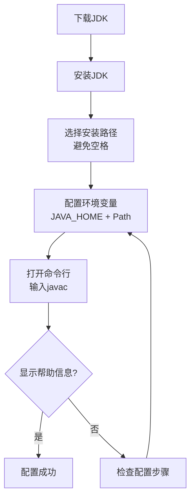
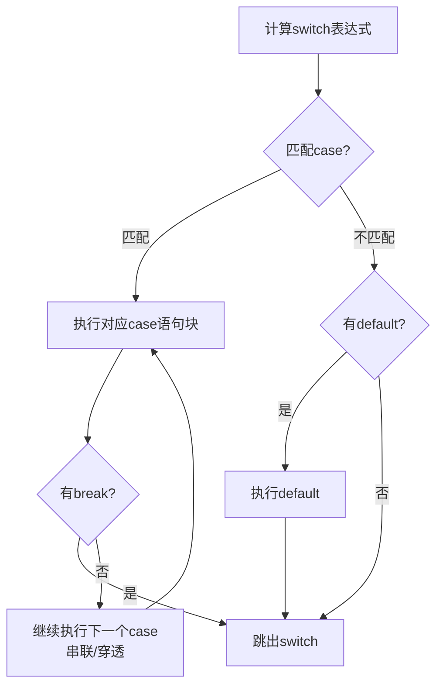
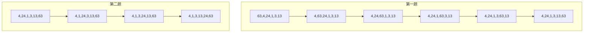
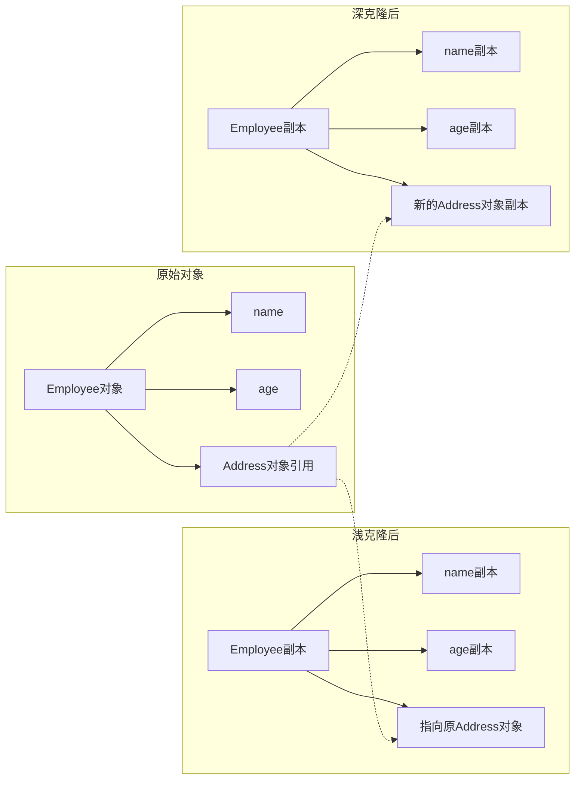
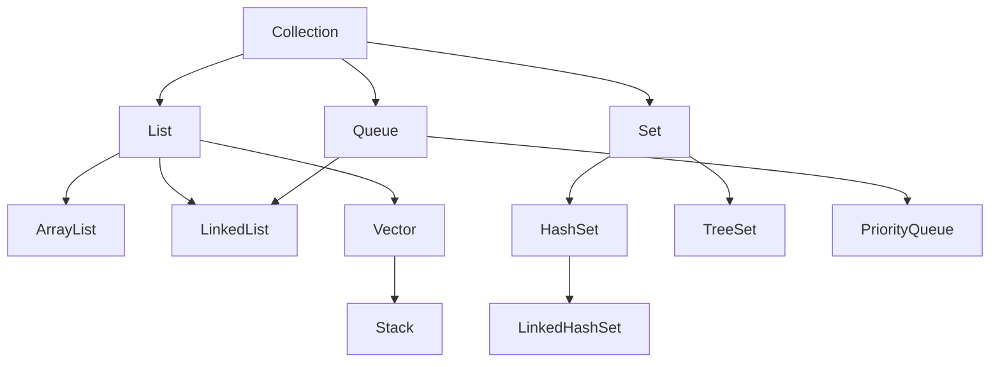
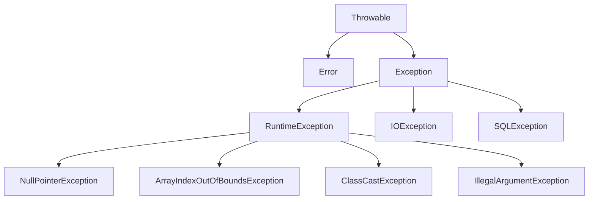
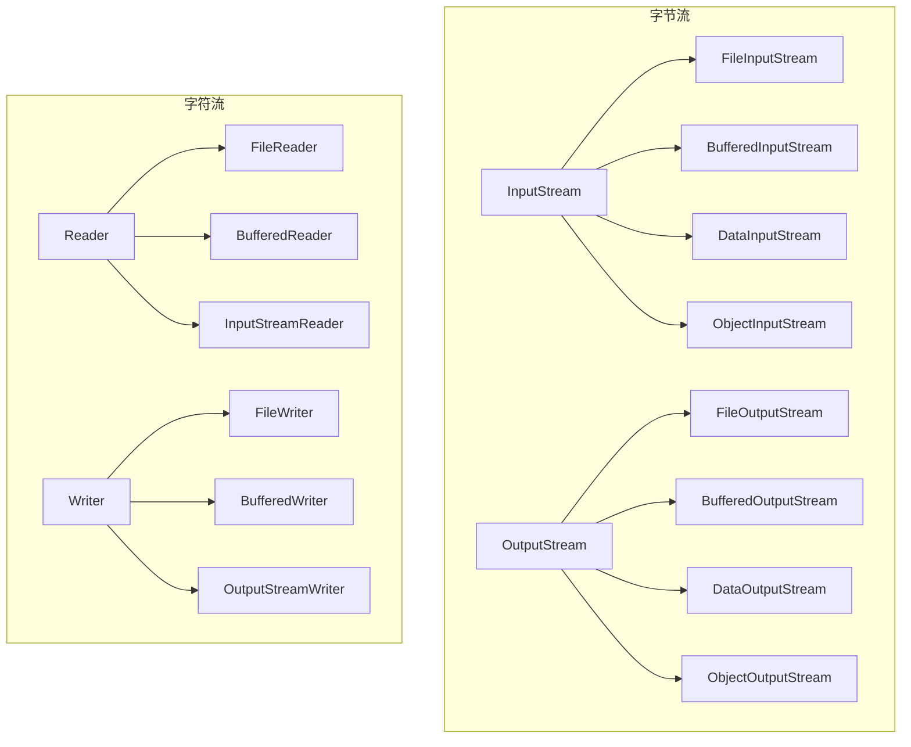
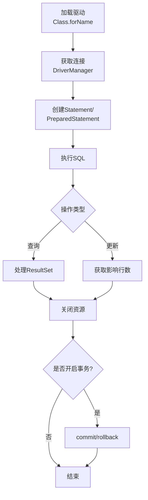

# 《Java必须知道的300个问题》章节总结

## 书籍信息

- **书名**：Java必须知道的300个问题
- **作者**：明日科技
- **PDF 状态**：扫描版PDF，文本可识别
- **OCR 状态**：基本完整，部分页面格式略有错位但内容可读

## 目录说明

- 目录识别情况：完整识别，共17章
- 章节对应依据：按原书目录顺序整理
- OCR 修复说明：部分代码块中的缩进和换行已做规范化处理

## 全书核心主题

本书以问题驱动的形式，系统梳理了Java程序员在日常开发中常见的300个疑难问题。内容涵盖Java语言基础、面向对象编程、集合框架、字符串处理、异常处理、I/O操作、多线程、网络编程、数据库操作等核心知识领域。每个问题按照“问题阐述→专家解答→专家点评”的结构组织，帮助读者理解问题本质、掌握解决方案并拓展相关知识。

---

## 第1章：Java语言概述

### 核心论点

本章主要解决“Java是什么”以及“如何开始学习Java”的问题。作者认为：学习Java需要从了解其特性入手，选择正确的学习分支，搭建合适的开发环境，并通过大量实践掌握这门语言。

### 关键概念/事件

- **Java三大分支**：Java SE（标准版，桌面应用）、Java EE（企业版，企业级网站）、Java ME（微型版，手机游戏）
- **JDK vs JRE**：JDK是Java开发工具箱，用于开发；JRE是Java运行环境，仅用于运行程序
- **环境变量配置**：需要配置JAVA_HOME和Path变量，才能在命令行中使用javac和java命令
- **跨平台原理**：Java虚拟机（JVM）屏蔽了不同操作系统之间的差异

### 逻辑推演

本章从Java语言特性入手，说明其“简单、面向对象、跨平台、多线程”等优势。接着引导读者选择学习分支——建议从Java SE开始。然后详细讲解JDK的下载、安装和配置步骤，最后通过命令行测试验证配置是否成功。整个逻辑是从“为什么学”到“如何开始学”的递进。

### 流程图

#### JDK安装与配置流程



### 经典金句/数据

> “万丈高楼平地起”——学习Java必须从基础知识开始，打好地基才能盖高楼。
> 
> “编程语言不是看书就能学会的，一定要避免眼高手低。” (p.5)

---

## 第2章：Eclipse开发工具

### 核心论点

本章回答“如何选择合适的Java开发工具”的问题。作者认为：初学者应从记事本等简单工具开始掌握基础语法，进阶后使用Eclipse等IDE提升开发效率。

### 关键概念/事件

- **记事本/EditPlus**：适合初学者，手动编译运行，有助于理解Java程序运行机制
- **Eclipse**：开源免费的主流IDE，插件丰富，支持多语言开发
- **NetBeans**：Sun公司开发，能最先支持Java新特性
- **WindowBuilder插件**：Eclipse的Swing可视化开发插件，可拖拽设计GUI界面

### 逻辑推演

本章首先区分了“Java新人”和“Java牛人”的不同工具选择。新人适合记事本、EditPlus等轻量级工具，牛人则适合Eclipse、NetBeans等IDE。接着详细讲解Eclipse的下载（免费）、安装（解压即用）、汉化（通过Babel项目）和插件安装（以WindowBuilder为例）的完整流程。

### 流程图

#### Eclipse插件安装流程（以WindowBuilder为例）


### 经典金句/数据

> “工欲善其事，必先利其器。良好的开发工具能够大幅度提升程序的开发效率。” (p.10)

---

## 第3章：Java语言基础

### 核心论点

本章集中解答Java语言基础语法中的常见疑惑。作者强调：理解数据类型、运算符、表达式等基础概念的细节差异，是写出正确Java程序的前提。

### 关键概念/事件

1. **char与汉字**：Java使用Unicode字符集，char占16位（2字节），可以存储汉字
2. **goto保留字**：Java保留goto关键字但未使用，可用带标签的break/continue实现跳转
3. **变量与常量**：常量用final修饰，值不可变；变量值可变
4. **浮点数精度**：基本类型浮点数运算不精确（如3-2.6=0.3999999999999999），应使用BigDecimal
5. **自增/自减运算符**：++i（先加后用）与i++（先用后加）有本质区别
6. **位运算效率**：2*16的最有效率写法是2<<4（左移运算）
7. **&&与&**：&&是短路逻辑与，效率更高；&是位与运算

### 逻辑推演

本章以问答形式串联Java基础知识点。从数据类型（char能否存汉字）开始，到关键字（goto）、变量常量区别、浮点数精度问题、运算符优先级和用法，再到类型转换陷阱（如short s = s+1的编译错误）、位运算效率等。每个问题都配有代码示例和错误分析，帮助读者理解细节差异。

### 经典金句/数据

> “在Java语言中，整数的默认类型是int型，浮点数的默认类型是double型。” (p.16)
> 
> “由于在计算机中，位运算的效率是最高的，所以要想找出最有效率的运算方法，应该从位运算入手。” (p.13)
> 
> 浮点数精度示例：3-2.6 = 0.3999999999999999 而非 0.4 (p.9)

---

## 第4章：流程控制

### 核心论点

本章讨论条件判断和循环控制语句的正确使用方法。作者指出：if-else、switch、for、while等语句有各自的适用场景和易错点，掌握这些细节能避免常见的程序逻辑错误。

### 关键概念/事件

1. **闰年判断公式**：year%4==0 && year%100!=0 || year%400==0
2. **if语句的大括号**：if后若有多条语句必须使用{}，否则只控制第一条语句
3. **switch的穿透现象**：case后若没有break，会继续执行下一个case
4. **while vs do-while**：do-while至少执行一次循环体
5. **死循环**：while后误加分号会导致死循环；死循环有时是故意的（如线程轮询）
6. **break vs continue**：break退出整个循环，continue结束本次循环
7. **带标签的break**：可跳出多层嵌套循环

### 流程图

#### switch-case执行流程



### 经典金句/数据

> “使用if语句不加大括号，在很大程度上是由于在开始学习编程时养成的坏习惯。” (p.23)
> 
> 杨辉三角公式：两侧数值为1，其他位置 triangle[i][j]=triangle[i-1][j]+triangle[i-1][j-1] (p.30)
> 
> 李白买酒结果：壶中原有酒0.96875斗 (p.28)

---

## 第5章：数组

### 核心论点

本章解答数组的声明、初始化、遍历、复制和排序等问题。作者强调：数组是固定长度的数据结构，理解其内存分配和操作方法是高效使用数组的关键。

### 关键概念/事件

1. **数组声明**：type[] arrayName 或 type arrayName[]
2. **数组初始化**：静态初始化（int[] arr={1,2,3}）和动态初始化（new int[3]）
3. **默认初始值**：int→0，double→0.0，boolean→false，引用类型→null
4. **二维数组**：本质是“元素为一维数组的一维数组”，行数=length，列数=arr[0].length
5. **数组复制**：Arrays.copyOfRange()方法
6. **排序算法**：冒泡排序、选择排序、直接插入排序、快速排序
7. **二分查找**：使用Arrays.binarySearch()前必须先排序

### 流程图

#### 冒泡排序过程（6个元素）



### 经典金句/数据

> “存储相同的数据量，二维数组所占的内存空间要远远超过一维数组。” (p.36)——因为二维数组的每个一维数组都是独立的对象。
> 
> 使用简易for循环时，循环变量代表的是数组元素的值，而不是下标。(p.38)

---

## 第6章：面向对象入门

### 核心论点

本章介绍面向对象编程的基本概念。作者解释：类是对象的模板，对象是类的实例；封装、继承、多态是面向对象的三大特征。

### 关键概念/事件

1. **封装**：将数据和操作数据的方法结合成类，使用访问修饰符控制权限
2. **继承**：子类继承父类的非私有成员，Java只支持单继承
3. **多态**：同一方法在不同类中有不同实现
4. **抽象类与抽象方法**：用abstract修饰，不能实例化，抽象方法必须由子类实现
5. **构造方法**：与类同名，无返回值，用于初始化对象
6. **方法重载**：同一类中多个同名方法，参数列表不同
7. **静态成员**：用static修饰，属于类而非实例，可通过类名直接访问
8. **访问修饰符**：private（本类）、默认（本包）、protected（本包+子类）、public（所有）

### 逻辑推演

本章从面向对象的起源（从现实世界分类思想抽象而来）讲起，说明面向过程编程的三大问题（重用性差、可维护性差、不能满足需求变化），从而引出面向对象的必要性。接着依次讲解类与对象的关系、封装的意义、继承的层次、多态的灵活性，以及构造方法、重载、静态成员等具体技术点。

### 经典金句/数据

> “对象 = 算法 + 数据结构，程序 = 对象 + 对象 + ……” (p.42)
> 
> “抽象类只能作为其他类的基类，它不能直接实例化。” (p.44)
> 
> 静态成员变量能被类的多个实例共享，当一个实例改变其值，其他实例看到的是改变后的值。(p.47)

---

## 第7章：面向对象进阶

### 核心论点

本章深入讨论面向对象的高级特性，包括值传递与引用传递、方法重写、克隆、内部类、反射等。作者强调：理解这些进阶概念才能写出灵活、可扩展的Java程序。

### 关键概念/事件

1. **值传递 vs 引用传递**：Java只有值传递，对象参数传递的是引用的副本
2. **方法重写**：子类重新定义父类方法，要求方法名、参数、返回值相同
3. **super关键字**：调用父类被隐藏的成员变量和被重写的方法
4. **final/finally/finalize**：final修饰不可变，finally异常处理必执行，finalize垃圾回收方法
5. **浅克隆 vs 深克隆**：浅克隆只复制基本类型，深克隆需处理引用类型（实现Cloneable或序列化）
6. **内部类**：定义在类内部的类，可以访问外部类的私有成员
7. **匿名内部类**：没有名字的内部类，用于一次性使用
8. **反射**：运行时获取类信息、创建对象、调用方法、访问字段

### 流程图

#### 浅克隆与深克隆对比



### 经典金句/数据

> “Java语言中没有引用传递，只有值传递。” (p.52)——方法接收的是对象内存引用的副本，而非对象本身。
> 
> “重写体现了子类补充或者改变父类方法的能力。” (p.54)
> 
> equals()方法必须满足：自反性、对称性、传递性、一致性、非空性。(p.62)

---

## 第8章：字符串与包装类

### 核心论点

本章解答字符串处理中的常见问题。作者强调：String是不可变类，字符串操作要注意性能；正则表达式是验证字符串格式的强大工具。

### 关键概念/事件

1. **自动装包/拆包**：基本类型与包装类自动转换（JDK5.0+）
2. **String不可继承**：String是final类
3. **== vs equals()**：==比较内存地址，equals()比较内容（String类已重写）
4. **null vs ""**：null未分配内存，空字符串已分配长度为0的内存
5. **字符串格式化**：String.format()配合%t（日期时间）、%d（整数）、%s（字符串）等转换符
6. **正则表达式验证**：手机号（1[3,8]\\d{9}）、IP地址等
7. **String vs StringBuilder**：StringBuilder可变，频繁拼接时效率更高

### 经典金句/数据

> “StringBuilder对象是一个可变的字符序列，大大提高了频繁增加字符串的效率。” (p.77)——100万次拼接，StringBuilder比String快数千倍。
> 
> 手机号正则：\\1[3,8]\\d{9} (p.71)
> 
> IP地址正则：^(\\d{1,2}|1\\d\\d|2[0-4]\\d|25[0-5])\\.(\\d{1,2}|1\\d\\d|2[0-4]\\d|25[0-5])\\.(\\d{1,2}|1\\d\\d|2[0-4]\\d|25[0-5])\\.(\\d{1,2}|1\\d\\d|2[0-4]\\d|25[0-5])$ (p.72)

---

## 第9章：Java集合类框架

### 核心论点

本章系统讲解Java集合框架的使用。作者认为：集合类比数组更灵活，应优先使用；理解不同集合实现类的特性是正确选择和使用的前提。

### 关键概念/事件

1. **数组 vs 集合**：现代Java中集合类效率不再低于数组，且更灵活
2. **数组与集合转换**：Arrays.asList()（数组→List）、Collection.toArray()（集合→数组）
3. **Collection vs Collections**：Collection是接口，Collections是工具类
4. **List实现类**：ArrayList（数组实现，随机访问快）、LinkedList（链表实现，插入删除快）、Vector（线程安全）
5. **Set实现类**：HashSet（无序）、TreeSet（有序）、LinkedHashSet（保持插入顺序）
6. **Map实现类**：HashMap、TreeMap、Hashtable
7. **遍历方式**：普通for、增强for、Iterator
8. **Iterator vs ListIterator**：ListIterator支持双向遍历和元素修改

### 流程图

#### Collection接口继承层次



### 经典金句/数据

> “数组具有一些难以弥补的缺陷，例如，长度确定后不能再次修改，不能从数组中删除元素。通常推荐使用集合类代替数组。” (p.81)
> 
> “当从列表中删除一个元素时，后面的元素会向前移动填充空位。” (p.83)——删除多个元素时要注意索引变化。

---

## 第10章：常用数学工具类

### 核心论点

本章讲解Java中数学运算相关的工具类。作者指出：基本类型的浮点数运算存在精度问题，商业计算应使用BigDecimal。

### 关键概念/事件

1. **数制转换**：二进制、八进制、十进制、十六进制
2. **原码、反码、补码**：计算机使用补码存储整数
3. **浮点数存储**：IEEE 754标准
4. **Math vs StrictMath**：Math允许平台相关优化，StrictMath保证完全可重复结果
5. **随机数**：Math.random()、Random类、ThreadLocalRandom
6. **BigInteger**：任意精度整数运算
7. **BigDecimal**：任意精度定点数运算，解决浮点数精度问题
8. **舍入模式**：ROUND_HALF_UP（四舍五入）、ROUND_CEILING、ROUND_FLOOR等

### 经典金句/数据

> “为了得到精确的计算结果，对于浮点数的运算一般不使用基本数据类型来实现，而是使用BigDecimal类来实现。” (p.10)
> 
> BigDecimal构造方法应使用字符串参数：new BigDecimal("2.6") 而非 new BigDecimal(2.6) (p.10)

---

## 第11章：异常处理

### 核心论点

本章解答Java异常处理的机制和最佳实践。作者强调：异常是程序运行时的错误，合理使用try-catch-finally和throw/throws可以增强程序的健壮性。

### 关键概念/事件

1. **异常分类**：Throwable → Error（不可恢复）和 Exception
2. **Exception分类**：RuntimeException（非受检异常）和 checked异常（受检异常）
3. **try-catch-finally**：catch捕获异常，finally确保资源释放
4. **throws**：声明方法可能抛出的异常
5. **throw**：手动抛出异常
6. **自定义异常**：继承Exception或RuntimeException

### 流程图

#### Java异常体系结构



### 经典金句/数据

> “finally用于异常处理，它用来修饰一个代码块，即使前面的代码处理异常，该代码块中的代码也会执行。通常用于释放资源。” (p.55)

---

## 第12章：输入/输出

### 核心论点

本章讲解Java I/O流的使用。作者认为：理解流的分类（字节流/字符流、输入流/输出流、节点流/处理流）是掌握I/O操作的基础。

### 关键概念/事件

1. **流的分类**：字节流（InputStream/OutputStream）vs 字符流（Reader/Writer）
2. **文件复制**：使用FileInputStream和FileOutputStream
3. **缓冲流**：BufferedInputStream/BufferedReader提高效率
4. **数据流**：DataInputStream/DataOutputStream读写基本类型
5. **对象流**：ObjectInputStream/ObjectOutputStream实现对象序列化
6. **transient关键字**：修饰的字段不参与序列化
7. **NIO**：Channel、Buffer、Selector，非阻塞I/O
8. **内存映射文件**：MappedByteBuffer

### 流程图

#### Java I/O流体系结构



### 经典金句/数据

> “transient关键字修饰的字段不参与序列化。” (p.104)
> 
> 新IO（NIO）的核心对象：Channel（通道）、Buffer（缓冲区）、Selector（选择器）。(p.107)

---

## 第13章：枚举类型与泛型

### 核心论点

本章介绍JDK5.0引入的两个重要特性：枚举和泛型。作者指出：枚举提供类型安全的常量定义；泛型提供编译时类型安全检查，消除强制类型转换。

### 关键概念/事件

1. **枚举定义**：enum关键字，可以包含构造方法、字段和方法
2. **枚举优势**：类型安全、可添加行为、支持switch
3. **泛型**：参数化类型，如List<String>
4. **类型参数命名**：E（元素）、K（键）、V（值）、T（类型）
5. **通配符**：? extends T（上界）、? super T（下界）
6. **类型擦除**：泛型信息在编译后被移除

### 经典金句/数据

> “泛型是如何提高程序健壮性的？——将运行时错误提前到编译时。” (p.116)
> 
> “类型通配符? extends T表示T的任何子类型，? super T表示T的任何父类型。” (p.118)

---

## 第14章：Swing入门

### 核心论点

本章讲解Java Swing图形界面编程。作者认为：Swing是Java桌面应用开发的基础，掌握常用控件和布局管理器是开发GUI程序的前提。

### 关键概念/事件

1. **Swing控件**：JFrame（窗体）、JPanel（面板）、JButton（按钮）、JTextField（文本框）、JTextArea（文本域）
2. **布局管理器**：FlowLayout、BorderLayout、GridLayout、GridBagLayout
3. **事件处理**：ActionListener、MouseListener等
4. **JTree**：树形控件，可显示文件结构
5. **JTable**：表格控件，支持分页、编辑
6. **JDialog**：对话框，用于信息提示、输入等
7. **系统托盘**：TrayIcon类
8. **外观**：UIManager设置LookAndFeel

### 流程图

#### Swing事件处理机制


### 经典金句/数据

> “WindowBuilder插件主要用于Swing程序的开发，它的功能非常强大，能大幅提升Swing开发效率。” (p.12)

---

## 第15章：多线程

### 核心论点

本章讲解Java多线程编程。作者强调：多线程可以提高程序响应性和资源利用率，但也带来线程安全、死锁等问题，需要同步机制来解决。

### 关键概念/事件

1. **创建线程**：继承Thread类或实现Runnable接口
2. **线程状态**：新建、就绪、运行、阻塞、死亡
3. **线程同步**：synchronized关键字、Lock接口
4. **线程死锁**：多个线程互相等待对方释放资源
5. **Callable和Future**：有返回值的线程
6. **线程池**：ExecutorService，避免频繁创建销毁线程
7. **SwingWorker**：Swing中的后台线程，避免界面卡顿
8. **后台线程**：setDaemon(true)，JVM退出时不等待

### 流程图

#### 线程生命周期

```mermaid
graph LR
    A[新建<br/>new] -->|start()| B[就绪<br/>Runnable]
    B -->|获得CPU| C[运行<br/>Running]
    C -->|yield()| B
    C -->|sleep()/wait()/阻塞I/O| D[阻塞<br/>Blocked]
    D -->|条件满足| B
    C -->|run()结束| E[死亡<br/>Dead]
```

### 经典金句/数据

> “同步和异步有何不同？同步是线程等待任务完成，异步是线程继续执行，任务完成后回调通知。” (p.162)
> 
> “死循环通常应用于与线程有关的程序中。” (p.26)——如服务器持续监听客户端连接。

---

## 第16章：网络通信

### 核心论点

本章介绍Java网络编程。作者认为：理解TCP/IP协议和Socket编程是实现网络通信的基础，多线程下载、断点续传等是常见应用场景。

### 关键概念/事件

1. **网络分类**：LAN（局域网）、WAN（广域网）、MAN（城域网）
2. **网络拓扑**：总线型、星型、环型、网状
3. **OSI七层模型**：物理层、数据链路层、网络层、传输层、会话层、表示层、应用层
4. **TCP/IP**：传输控制协议（可靠）和用户数据报协议（不可靠）
5. **IP地址分类**：A类(1-126)、B类(128-191)、C类(192-223)
6. **Socket编程**：ServerSocket和Socket
7. **多线程下载**：分段下载，每段一个线程
8. **断点续传**：记录已下载位置，支持恢复下载

### 流程图

#### Socket通信模型

```mermaid
graph TD
    subgraph 服务端
        A[创建ServerSocket<br/>指定端口] --> B[调用accept()<br/>阻塞等待]
        B --> C[获取客户端Socket]
        C --> D[获取输入/输出流]
        D --> E[读写数据]
        E --> F[关闭Socket]
    end
    subgraph 客户端
        G[创建Socket<br/>指定IP和端口] --> H[获取输入/输出流]
        H --> I[读写数据]
        I --> J[关闭Socket]
    end
    B -.-> G
```

### 经典金句/数据

> “TCP是面向连接的可靠协议，UDP是无连接的不可靠协议。” (p.165)
> 
> IP地址范围：A类1.0.0.0~126.255.255.255，B类128.0.0.0~191.255.255.255，C类192.0.0.0~223.255.255.255 (p.166)

---

## 第17章：数据库操作

### 核心论点

本章讲解Java通过JDBC操作数据库。作者指出：JDBC是Java访问数据库的标准API，掌握Statement/PreparedStatement、事务控制、结果集处理等是数据库编程的核心。

### 关键概念/事件

1. **JDBC驱动类型**：JDBC-ODBC桥、本地API驱动、网络协议驱动、纯Java驱动
2. **连接数据库**：DriverManager.getConnection(url, user, password)
3. **Statement vs PreparedStatement**：后者预编译、防SQL注入、性能更好
4. **事务控制**：setAutoCommit(false)、commit()、rollback()
5. **存储过程调用**：CallableStatement
6. **结果集**：ResultSet，可滚动、可更新的结果集
7. **BLOB/CLOB**：存储二进制大对象和文本大对象
8. **数据库元数据**：DatabaseMetaData、ResultSetMetaData

### 流程图

#### JDBC操作数据库流程



### 经典金句/数据

> “PreparedStatement可以防止SQL注入攻击，因为它是预编译的，参数占位符不会被当作SQL语句的一部分。” (p.173)
> 
> MySQL乱码问题解决：在连接URL中指定useUnicode=true&characterEncoding=UTF-8 (p.176)

