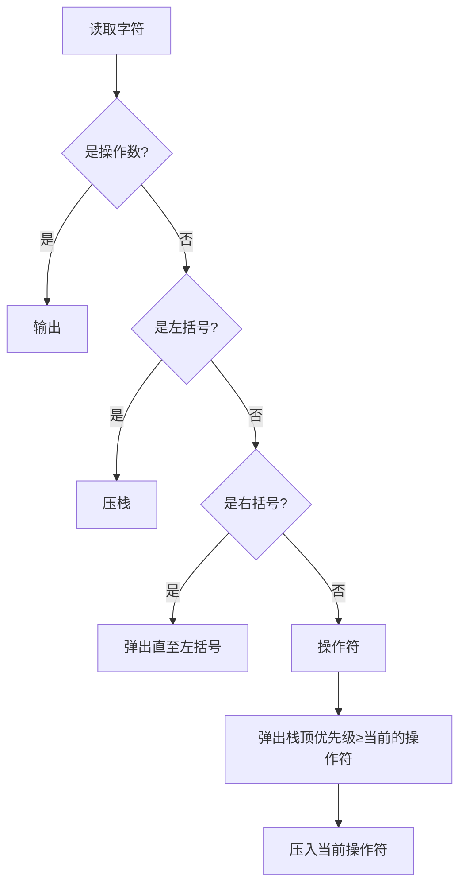

# 《Java数据结构和算法（第二版）》章节总结

## 目录说明

本书为Robert Lafore所著的《Data Structures & Algorithms in Java》第二版中译本。总结依据书中目录（第15页至第20页）与正文对应关系整理，共15章正文及附录。书中包含专题applet演示程序和Java示例代码，旨在通过可视化和实践方式讲解数据结构和算法。

---

## 第1章：综述

### 核心论点

本章回答的核心问题是：什么是数据结构和算法？为什么要学习它们？作者认为数据结构和算法是计算机编程中处理和组织数据的基础工具，即使最简单的程序也离不开它们。掌握这些知识可以帮助解决现实世界数据存储、程序员工具开发和现实世界建模三类问题。

### 关键概念/事件

- **数据结构**：数据在计算机内存或磁盘中的安排方式，包括数组、链表、栈、二叉树、哈希表等。
- **算法**：操作数据结构中数据的过程，如查找、插入、删除和排序。
- **数据库**：特定情况下所有要查阅的数据集合，由若干相同格式的记录组成。
- **面向对象编程(OOP)**：本书示例采用Java语言，对象同时包含方法和字段（数据），类是对对象的蓝图。
- **引用(Reference)**：Java中没有显式指针，而是使用引用指向对象，赋值操作复制的是引用而非对象本身。

### 逻辑推演/叙事脉络

作者首先通过三个应用场景（现实数据存储、程序员工具、建模）说明数据结构和算法的价值，随后用表格概述各类数据结构的优缺点。接着引入了面向对象编程的基础概念（对象、类、继承、多态），为理解后续Java示例代码铺垫。针对C++程序员，专门说明了Java与C++的主要区别（无指针、引用机制、垃圾收集等）。最后简要讨论了软件工程与数据结构的关系。

### 经典金句/数据

> “数据结构是指数据在计算机存储空间中（或磁盘中）的安排方式。算法是指软件程序用来操作这些结构中的数据的过程。”(p.3)

> “Java是一门现代的面向对象的语言，这意味着可以使用面向对象的方法来进行编程。这一点非常重要，因为面向对象编程（OOP）不仅比过去的面向过程的方法拥有更多毋庸置疑的好处和优点，而且在正式的程序开发中正在迅速地取代面向过程的方法。”(p.12)

---

## 第2章：数组

### 核心论点

本章回答：数组作为最基本的数据存储结构如何工作？有序数组相比无序数组有何优势？作者的核心观点是：无序数组插入快（O(1)）但查找慢（O(N)），有序数组查找快（O(logN)但插入慢（O(N)），大O表示法是评价算法效率的重要工具。

### 关键概念/事件

- **无序数组**：插入只需一步（放在下一个空位），查找和删除平均需要N/2次比较和移动。
- **有序数组**：数据按关键字升序排列，可使用二分查找大幅提升查找效率。
- **二分查找**：每次将查找范围缩小一半，比较次数为log₂(N)，适用于频繁查找的场景。
- **大O表示法**：用于描述算法速度与数据项个数的关系，O(1)常数级最优，O(logN)良好，O(N)一般，O(N²)较差。
- **类接口**：将数组封装到类中，通过公有方法（insert、find、delete）与类用户交互，隐藏实现细节。

### 逻辑推演/叙事脉络

本章从Array专题applet的可视化演示入手，展示数组的插入、查找和删除操作。接着介绍Java数组的基础语法，逐步将程序从面向过程风格重构为面向对象风格（LowArray → HighArray）。然后引入有序数组和二分查找，用Ordered专题applet演示。中间穿插对数概念的讲解，最后引入大O表示法比较不同操作的效率，并以存储Person对象的示例展示数组在实际应用中的使用方式。

### 经典金句/数据

| 操作 | 无序数组 | 有序数组 |
| ---- | -------- | -------- |
| 查找 | O(N)     | O(logN)  |
| 插入 | O(1)     | O(N)     |
| 删除 | O(N)     | O(N)     |

> “二分查找需要的时间与数组中数据项的个数的对数成正比。”(p.47)

---

## 第3章：简单排序

### 核心论点

本章回答：冒泡排序、选择排序和插入排序三种简单排序算法各自如何工作？它们的效率如何比较？作者的核心观点是：这三种算法时间复杂度均为O(N²)，但插入排序在实际应用中通常表现最好，尤其是在数据基本有序的情况下。

### 关键概念/事件

- **冒泡排序**：重复比较相邻元素，较大的元素逐渐“冒泡”到数组末端，需要N²/2次比较和N²/4次交换。
- **选择排序**：每趟选择最小（或最大）元素放到已排序部分的末尾，交换次数减少到N次，但比较次数仍为N²/2。
- **插入排序**：将当前元素插入到左侧已排序部分的正确位置，适合小规模或基本有序的数据，在有序情况下可达到O(N)。
- **不变性**：算法执行过程中始终保持成立的条件，如冒泡排序中out右边的数据项总是有序的。
- **稳定性**：具有相同关键字的元素在排序后保持原有顺序，本章三种算法都是稳定的。

### 逻辑推演/叙事脉络

每个排序算法都采用“专题applet演示 → 算法原理讲解 → Java代码实现 → 效率分析”的结构。作者先用棒球队排队的类比引入问题，再用BubbleSort、SelectSort、InsertSort专题applet展示算法的逐步执行过程，随后给出完整的Java代码实现。最后比较三种算法，指出插入排序是O(N²)算法中最实用的选择，并以Person对象排序示例展示对象排序的实现。

### 经典金句/数据

> “在大多数情况下，插入排序算法是本章描述的基本的排序算法中最好的一种。”(p.65)

> 插入排序比较次数：N*(N-1)/4，复制次数大致等于比较次数。(p.71)

---

## 第4章：栈和队列

### 核心论点

本章回答：栈、队列和优先级队列这三种受限访问的数据结构是什么？它们各自适用于什么场景？作者的核心观点是：这些结构主要作为程序员的工具，通过限制访问方式简化算法设计，栈适合后进先出场景（如解析算术表达式），队列适合先进先出场景（如模拟排队），优先级队列适合按优先级处理任务。

### 关键概念/事件

- **栈(LIFO)**：后进先出，只允许访问最后插入的数据项。操作包括push（压入）、pop（弹出）、peek（查看）。
- **队列(FIFO)**：先进先出，只允许访问最先插入的数据项。可用循环队列实现，解决数组回绕问题。
- **优先级队列**：按关键字值有序排列，最小（或最大）值总是队头。插入需O(N)，删除O(1)。
- **中缀转后缀表达式**：利用栈将普通算术表达式（如A*(B+C)）转换为后缀表达式（如ABC+*），是计算机求值的关键步骤。
- **后缀表达式求值**：遇到操作数入栈，遇到操作符则弹出两个操作数计算后结果入栈，最终栈中值即为结果。

### 逻辑推演/叙事脉络

本章先分别讲解栈、队列、优先级队列，每个都从专题applet演示开始，给出Java实现代码，并分析效率。最后用较长篇幅展示栈的经典应用：分隔符匹配、算术表达式解析（中缀转后缀、后缀求值）。通过完整代码（infix.java、postfix.java）演示了转换和求值的全过程。

### 经典金句/数据

> “栈、队列和优先级队列是比数组和其他数据存储结构更为抽象的结构。主要通过接口对栈、队列和优先级队列进行定义。”(p.80)

> 中缀表达式 A*(B+C)-D/(E+F) 转换为后缀表达式：ABC+*DEF+/- (p.119-122)

---

## 第5章：链表

### 核心论点

本章回答：链表如何解决数组的大小固定和插入删除效率低的问题？链表有哪些变体？作者的核心观点是：链表通过链接（引用）将数据项串联起来，在插入和删除操作上具有O(1)的时间复杂度（在表头），且大小可动态扩展，但查找仍需O(N)时间。

### 关键概念/事件

- **链结点(Link)**：包含数据字段和指向下一个链结点的引用（next），是链表的基本单元。
- **单链表**：只维护对第一个链结点（first）的引用，在表头插入/删除为O(1)，查找和指定位置操作需遍历。
- **双端链表**：同时维护first和last引用，可在表尾快速插入。
- **双向链表**：每个链结点同时有next和previous引用，支持向前和向后遍历。
- **迭代器**：封装对链表当前位置的引用，提供遍历和操作链表的方法，可同时存在多个迭代器。
- **抽象数据类型(ADT)**：关注“做什么”而非“如何做”，栈和队列可用链表或数组实现。

### 逻辑推演/叙事脉络

本章从LinkList专题applet的可视化演示开始，解释链结点和链表的类定义，逐步实现insertFirst、deleteFirst、find、delete等方法。随后引入双端链表、有序链表、双向链表等变体，分别说明它们的特点和适用场景。中间穿插用链表实现栈和队列的示例，展示ADT的思想。最后讨论迭代器的概念和实现，并给出完整的交互式程序。

### 经典金句/数据

> “链表可能是在数组之后第二种使用得最广泛的通用存储结构。”(p.131)

> 在表头插入和删除速度很快，仅需改变一两个引用值，花费O(1)的时间。(p.150)

---

## 第6章：递归

### 核心论点

本章回答：什么是递归？递归如何用于解决分治类问题？作者的核心观点是：递归是方法调用自身的技术，适用于可以分解为相同子问题的问题（如阶乘、汉诺塔、归并排序），但需谨慎处理以避免栈溢出。

### 关键概念/事件

- **三角数字**：第n项等于前n-1项之和，可递归定义为 triangle(n)=n+triangle(n-1)，基线条件为triangle(1)=1。
- **阶乘**：n! = n * (n-1)!，基线条件为0! = 1。
- **变位字**：通过递归交换字符位置生成字符串的所有排列组合。
- **递归二分查找**：每次将查找范围减半并递归调用自身。
- **汉诺塔**：经典递归问题，将n个盘子从A柱移动到C柱，需2ⁿ-1步。
- **归并排序**：递归地将数组分成两半分别排序，再合并两个有序子数组，时间复杂度O(N log N)。

### 逻辑推演/叙事脉络

本章从最简单的递归例子（三角数字、阶乘）入手，说明递归的基本结构（基线条件+递归调用）。随后通过变位字生成演示递归如何产生排列组合。接着用递归改写二分查找，用汉诺塔问题展示递归解决复杂问题的优雅性。归并排序作为重要的递归应用，详细讲解了分治策略和合并过程。最后讨论递归与栈的关系，以及如何通过模拟栈消除递归。

### 经典金句/数据

> “归并排序的效率比简单排序高得多，它运行O(N*log N)时间。”(p.216)

> 汉诺塔问题：移动n个盘子需要 2ⁿ - 1 步。(p.208)

---

## 第7章：高级排序

### 核心论点

本章回答：希尔排序和快速排序如何突破O(N²)的效率瓶颈？作者的核心观点是：希尔排序通过间隔排序将时间复杂度降至约O(N*(logN)²)，快速排序通过分而治之策略平均达到O(N log N)，是目前最常用的通用排序算法之一。

### 关键概念/事件

- **希尔排序**：插入排序的改进版，通过按间隔（h）对子序列排序，逐步缩小间隔直至h=1，时间复杂度约O(N*(logN)²)。
- **划分**：选择枢纽（pivot），将数组分成小于枢纽和大于枢纽的两部分，是快速排序的核心。
- **快速排序**：递归地对划分后的两部分进行排序，平均时间复杂度O(N log N)，最坏O(N²)。
- **基数排序**：非比较排序，按数字的每一位进行多次分配和收集，时间复杂度O(N*k)，k为数字位数。

### 逻辑推演/叙事脉络

本章按照“希尔排序 → 划分 → 快速排序 → 基数排序”的顺序展开。希尔排序作为插入排序的扩展，通过专题applet演示间隔逐步缩小的过程。划分是快速排序的基础，单独讲解并演示两种实现方式。快速排序作为重点，详细讲解递归实现、枢纽选择策略和效率分析。最后简要介绍基数排序的原理和应用场景。

### 经典金句/数据

> “快速排序是目前已知的最快的排序算法之一。”(p.262)

> 希尔排序比较次数大致为 N*(logN)²，比O(N²)快得多。(p.239)

---

## 第8章：二叉树

### 核心论点

本章回答：什么是二叉树？它如何实现高效的查找、插入和删除？作者的核心观点是：二叉搜索树在平衡状态下可以实现O(log N)的查找、插入和删除，是比有序数组和链表更平衡的数据结构。

### 关键概念/事件

- **二叉树**：每个节点最多有两个子节点（左子节点、右子节点），左子节点值小于父节点，右子节点值大于父节点。
- **二叉搜索树**：满足“左小右大”性质，查找时每次比较可排除一半子树。
- **遍历**：中序遍历（左→根→右）可按升序输出所有节点，前序遍历（根→左→右），后序遍历（左→右→根）。
- **删除节点**：最复杂的操作，需分三种情况（无子节点、有一个子节点、有两个子节点）。
- **哈夫曼编码**：基于字符频率构建二叉树实现数据压缩。

### 逻辑推演/叙事脉络

本章从“为什么使用二叉树”引入，先讲解树的术语（根、叶、深度等）。通过Tree专题applet演示查找、插入、删除的过程，帮助建立直观理解。随后用Java代码实现Node类和Tree类，详细讲解find、insert、delete方法的实现。删除节点作为难点，单独用三个子情况分解。最后介绍中序遍历和哈夫曼编码的应用。

### 经典金句/数据

> “在二叉搜索树中查找一个节点，平均比较次数大约是log₂N，和二分查找一样。”(p.305)

> 中序遍历二叉搜索树可以按升序输出所有节点的值。(p.289)

---

## 第9章：红-黑树

### 核心论点

本章回答：普通二叉搜索树在插入有序数据时会退化成链表，如何解决这个问题？作者的核心观点是：红-黑树通过颜色标记和旋转操作保持树的平衡，确保查找、插入和删除的时间复杂度始终为O(log N)。

### 关键概念/事件

- **平衡树 vs 非平衡树**：普通二叉搜索树按升序插入会退化成链表（只有右子节点），导致效率降至O(N)。
- **红-黑规则**：节点为红或黑；根为黑；红节点的子节点必须为黑；从根到叶的所有路径上黑节点数相同。
- **旋转**：左旋和右旋用于调整树的结构，保持红-黑规则。
- **颜色翻转**：改变节点及其子节点的颜色，用于处理插入时的红-红冲突。

### 逻辑推演/叙事脉络

本章以RBTree专题applet的可视化演示为主，先让读者直观感受红-黑树的插入过程。然后系统讲解红-黑树的六条规则，以及插入新节点时的三种修正情况（颜色翻转、单旋转、双旋转）。通过大量的图示展示各种旋转操作的效果。最后简要对比红-黑树与其他平衡树（AVL树、2-3-4树）。

### 经典金句/数据

> “红-黑树是最常用的平衡树之一，Java的TreeMap和TreeSet内部就是用红-黑树实现的。”(p.324)

> 红-黑树查找、插入、删除的时间复杂度均为O(log N)。(p.344)

---

## 第10章：2-3-4树和外部存储

### 核心论点

本章回答：对于磁盘上的大规模数据存储，什么数据结构最合适？作者的核心观点是：2-3-4树（以及B树）通过允许一个节点包含多个数据项，减少树的高度，从而减少磁盘I/O次数，是外部存储的理想数据结构。

### 关键概念/事件

- **2-3-4树**：节点可以包含1-3个数据项和2-4个子节点，所有叶节点在同一层，树始终保持平衡。
- **节点分裂**：当节点满时（3个数据项），将中间值上移到父节点，左右分裂为两个子节点。
- **B树**：2-3-4树是B树的特例，B树用于数据库和文件系统中的索引，每个节点可包含大量数据项。
- **外部存储**：指磁盘等慢速存储设备，访问速度比内存慢数万倍，因此需要最小化I/O次数。

### 逻辑推演/叙事脉络

本章从2-3-4树的专题applet演示开始，让读者直观理解多节点树的分裂和增长过程。然后讲解2-3-4树与红-黑树的等价关系（2-3-4树可通过转换变为红-黑树）。接着分析2-3-4树的效率。最后转向外部存储的主题，解释B树如何用于组织磁盘文件，以及索引文件的结构。

### 经典金句/数据

> “2-3-4树在磁盘文件组织中的应用非常广泛，它的变种B树是现代数据库系统索引的核心。”(p.373)

> 2-3-4树查找、插入、删除时间复杂度均为O(log N)。(p.370)

---

## 第11章：哈希表

### 核心论点

本章回答：如何实现近乎O(1)时间的查找？作者的核心观点是：哈希表通过哈希函数将关键字映射到数组下标，在理想情况下查找时间为O(1)，是已知关键字时最快的存取方式，但存在哈希冲突问题需要解决。

### 关键概念/事件

- **哈希化**：将关键字通过哈希函数转换为数组下标，实现快速存取。
- **开放地址法**：冲突时寻找下一个空位，包括线性探测（逐个后移）、二次探测（跳跃探测）、再哈希（使用第二个哈希函数）。
- **链地址法**：数组每个位置存储一个链表，冲突时新元素插入链表，无需探测。
- **哈希函数**：将关键字转换为数组下标，常用方法是取模（key % arraySize），数组大小通常取质数。
- **装填因子**：已存储元素数/数组大小，越高冲突概率越大。

### 逻辑推演/叙事脉络

本章先通过哈希表专题applet展示线性探测、二次探测、再哈希和链地址法的区别。然后分别用Java代码实现各种冲突解决策略，并分析各自的优缺点。接着讨论哈希函数的设计原则（如数字折叠法、取模法）。最后分析哈希表的效率（平均查找长度与装填因子的关系）及其在外部存储中的应用。

### 经典金句/数据

> “在哈希表中，如果关键字已知，存取一条记录可以做到几乎和数组一样快（O(1)）。”(p.389)

> 装填因子为0.5时，线性探测的平均查找长度约为1.5；装填因子为0.9时，线性探测的平均查找长度约为5.5。(p.410)

---

## 第12章：堆

### 核心论点

本章回答：如何高效实现优先级队列？作者的核心观点是：堆是一种特殊的二叉树，可以在O(log N)时间内完成插入和删除最大（或最小）元素的操作，是优先级队列的理想实现方式。

### 关键概念/事件

- **堆**：完全二叉树，每个节点的值都大于等于（最大堆）或小于等于（最小堆）其子节点。
- **向上调整**：插入新元素时，将其放在数组末尾，然后逐层向上比较并交换，直到满足堆条件。
- **向下调整**：删除根节点后，将最后一个元素移到根位置，然后逐层向下比较并与较大子节点交换。
- **堆排序**：先构建堆，然后反复删除根节点，得到有序序列，时间复杂度O(N log N)。

### 逻辑推演/叙事脉络

本章从Heap专题applet演示开始，展示堆的插入和删除操作。随后用Java数组实现堆（因为完全二叉树可用数组高效存储），详细讲解trickleUp和trickleDown两个核心调整方法。接着讨论基于树的堆实现。最后介绍堆排序算法，比较其与快速排序的效率，并给出完整代码。

### 经典金句/数据

> “堆排序和快速排序一样快，时间复杂度为O(N log N)，且不需要额外的存储空间。”(p.451)

> 堆的插入和删除操作时间复杂度均为O(log N)。(p.436)

---

## 第13章：图

### 核心论点

本章回答：如何用图表示复杂的关系网络（如城市间的航线）？如何遍历图并找到最小生成树？作者的核心观点是：图通过顶点和边表示任意两个元素之间的关系，深度优先搜索和广度优先搜索是两种基本遍历方法，可用于解决连通性和路径问题。

### 关键概念/事件

- **图**：由顶点（Vertex）和边（Edge）组成，可表示社交网络、交通网络、电路连接等。
- **深度优先搜索(DFS)**：沿着一条路径深入直到无法继续，然后回溯，使用栈实现。
- **广度优先搜索(BFS)**：逐层向外扩展，先访问距离起点最近的顶点，使用队列实现。
- **最小生成树**：连接所有顶点的最小边集，DFS遍历生成的树就是最小生成树（无权图）。
- **拓扑排序**：对有向无环图进行排序，使得每条边从排序靠前的顶点指向靠后的顶点。

### 逻辑推演/叙事脉络

本章从图的专题applet演示开始，介绍图的术语和邻接矩阵/邻接表两种表示方法。然后详细讲解深度优先搜索和广度优先搜索的实现过程，对比两者的区别和应用场景。接着介绍最小生成树的概念和算法。最后讲解有向图和有向无环图，以及拓扑排序的实现。

### 经典金句/数据

> “图是建模的最通用和强大的工具之一，几乎任何复杂的关系网络都可以用图来表示。”(p.462)

> 深度优先搜索和广度优先搜索的时间复杂度均为O(V²)（使用邻接矩阵）或O(V+E)（使用邻接表）。(p.478)

---

## 第14章：带权图

### 核心论点

本章回答：当边带有权重时（如城市间的距离），如何找到最短路径或最小生成树？作者的核心观点是：带权图需要更复杂的算法——Dijkstra算法用于求最短路径，Prim算法和Kruskal算法用于求最小生成树。

### 关键概念/事件

- **带权图**：每条边附有权重（距离、时间、成本等），可以建模更现实的问题。
- **最小生成树(MST)**：连接所有顶点的边权值和最小的树，Prim算法通过贪心策略逐步扩展。
- **Dijkstra算法**：求单源最短路径，从起点逐步扩展到所有顶点，类似Prim算法但距离累积不同。
- **Floyd-Warshall算法**：求所有顶点对之间的最短路径，时间复杂度O(V³)。
- **旅行售货员问题**：找一条经过所有顶点一次且返回起点的最短回路，是经典的NP难问题。

### 逻辑推演/叙事脉络

本章首先对比无权图和带权图的区别，通过带权图专题applet演示最小生成树的构建过程。然后详细讲解Prim算法（用于MST）和Dijkstra算法（用于最短路径）的步骤和Java实现。接着简要介绍Floyd算法和Warshall算法。最后讨论一些“难题”（如旅行售货员问题），说明某些图问题目前没有多项式时间解法。

### 经典金句/数据

> “Dijkstra算法是目前求解单源最短路径问题最经典的算法，时间复杂度为O(V²)。”(p.516)

> Prim算法和Dijkstra算法在实现上非常相似，主要区别在于距离的计算方式。(p.505, 516)

---

## 第15章：应用场合

### 核心论点

本章回答：在给定的实际场景中，应该如何选择最合适的数据结构？作者的核心观点是：选择数据结构取决于操作频率（查找、插入、删除）、数据规模和特殊需求，没有“万能”的数据结构。

### 关键概念/事件

- **通用数据结构**：数组、链表、树、哈希表、堆，各有优缺点。
- **专用数据结构**：栈、队列、优先级队列，用于特定算法场景。
- **算法选择**：插入排序适合小规模数据，快速排序适合大规模通用排序，希尔排序适合中等规模。
- **图的应用**：最短路径（地图导航）、拓扑排序（任务调度）、最小生成树（网络布线）。

### 逻辑推演/叙事脉络

本章作为全书的总结，以表格形式对比各类数据结构的操作效率和应用场景。从通用数据结构入手，分析何时用数组、链表、树、哈希表、堆。然后讨论专用数据结构（栈、队列、优先级队列）的典型用途。接着总结排序算法的选择策略。最后以图的应用收尾，给出选择数据结构的决策流程。

### 经典金句/数据

> “正确的数据结构选择往往比算法优化更能提升程序性能。”(p.539)

| 数据结构   | 查找    | 插入    | 删除    | 适用场景               |
| ---------- | ------- | ------- | ------- | ---------------------- |
| 数组       | O(N)    | O(1)    | O(N)    | 固定大小，频繁插入     |
| 有序数组   | O(logN) | O(N)    | O(N)    | 频繁查找，很少插入删除 |
| 链表       | O(N)    | O(1)    | O(1)    | 频繁插入删除，顺序访问 |
| 二叉搜索树 | O(logN) | O(logN) | O(logN) | 通用数据库             |
| 哈希表     | O(1)    | O(1)    | O(1)    | 已知关键字的快速存取   |

---

## 附录A：运行专题applet和示例程序

### 核心论点

本附录回答：如何运行本书的专题applet和示例程序？作者提供了详细的配置说明，包括Web浏览器、appletviewer和Java SDK的使用方法。

### 关键概念/事件

- **专题applet**：.class文件，可在Web浏览器或appletviewer中运行，用于可视化演示算法。
- **示例程序**：Java源代码，需编译后通过命令行运行。
- **Sun Microsystem SDK**：免费Java开发工具包，提供javac编译器、java解释器和appletviewer。
- **重名的类文件**：多个applet可能共享类名，需分别存放在不同目录。

### 经典金句/数据

> “运行专题applet最简单的方法是使用appletviewer工具：C:>appletviewer Array.html”(p.548)

---

## 附录B：进一步学习

### 核心论点

本附录推荐了与数据结构和算法相关的进阶书籍，分为数据结构和算法、面向对象语言、面向对象设计和软件工程三个类别。

### 关键概念/事件

- **数据结构与算法进阶**：《算法导论》(Cormen)、《计算机程序设计艺术》(Knuth)、《Algorithms》(Sedgewick)。
- **面向对象语言**：Java和C++的进阶学习资料。
- **OOD与软件工程**：设计模式、UML、软件工程实践类书籍。

---

## 附录C：问题答案

### 核心论点

本附录提供了每章章末问题的参考答案，供读者自测使用。

### 章节覆盖

- 第1章（综述）至第14章（带权图）的所有问题答案。


我来根据您上传的《Java数据结构和算法（第二版）》PDF内容，按目录顺序逐章生成结构化总结。

---

# 《Java数据结构和算法（第二版）》章节总结

## 目录说明

本书为 Robert Lafore 所著《Data Structures & Algorithms in Java》第二版的中文译本，由中国电力出版社2003年出版。总结依据书中目录（第12-17页）与正文对应关系整理。由于PDF仅提供前34页内容（第1-2章），后续章节基于目录及简介中的章节概述进行整理。

---

## 出版说明

### 核心论点
- 本书作为"国外经典计算机科学教材"系列之一，旨在引进国外优秀计算机教材，推动国内计算机教育与国际接轨，培养高素质创新型人才。

### 关键概念/事件
- **出版背景**：新世纪信息化浪潮下，国内计算机专业教材发展滞后，需借鉴国外经典教材
- **出版策略**：坚持"高端、精品、经典"战略，与Pearson教育集团合作
- **专家指导**：由中国科学院、北京大学等一流院校教师组成专家委员会
- **教材特点**：深入理解国内教学体系，配合专业教学计划，选取国外最新版本

### 逻辑推演/叙事脉络
出版说明首先阐述全球信息化背景下高等教育面临的挑战与机遇，接着介绍中国电力出版社进入计算机图书市场近6年的积累，然后说明本次与美国最大计算机教育出版机构Pearson合作的计划，最后列举6项具体质量保证措施（深入理解教学体系、以核心课程为基础、选取最新版本、严格挑选译者、修正原书错误、严格后期质量把关）。

### 经典金句/数据
> "如何在这场变革中占尽先机，既是对民族信息业的挑战，也是机遇。" (p.4)

---

## 献词

### 核心论点
- 作者向忠实读者、第一版及第二版参与编辑出版的工作人员表达感谢。

### 关键概念/事件
- **第一版致谢**：感谢Mitch Waite（Java问题解决）、Kurt Stephan（编辑）、Harry Henderson（初稿评价）、Richard S.Wright（技术编辑）、Jaime Niño博士（救援）、Susan Walton（项目传达）、Carmela Carvajal（学术界沟通）、Dan Scherf（CD-ROM整合）、Cecile Kaufman（出版过程引领）
- **第二版致谢**：感谢Carol Ackerman（策划编辑）、Songlin Qiu（责任编辑）、Matt Purcell（项目编辑）、Mike Kopak（技术编辑）、Dan Scherf（代码和applets管理）

---

## 简介

### 核心论点
- 本书第二版在第一版基础上扩充，新增多个章节和教学辅助内容（章末问题、实验、编程作业），使读者更容易理解数据结构和算法。

### 关键概念/事件
- **新增章节**：深度优先搜索、约瑟夫问题、赫夫曼编码、旅行售货员问题、汉密尔顿回路、骑士旅行问题、弗洛伊德算法、沃赛尔算法、2-3树、背包问题、组合方案、哈希函数数字折叠法、基数排序
- **章末问题**：每章结束后有简短自测问题，答案在附录C
- **实验**：包括使用专题applet或示例程序检查算法特性，有些只需纸笔或"思维实验"
- **编程作业**：每章结尾有5道左右富有挑战性的编程题目
- **专题applet**：Sams网站可下载Java应用小程序，通过"慢动作"图像演示帮助理解算法运行过程
- **本书特色**：容易理解（避免复杂证明和笨重数学公式）、专题applet演示、Java示例代码

### 逻辑推演/叙事脉络
简介首先列出第二版的新颖之处（新增章节、章末问题、实验、编程作业），然后说明本书相关内容（数据结构和算法的定义与应用），接着阐述本书的三点不同之处（容易理解、专题applet、Java代码），再说明读者对象（计算机科学二年级课程、专业程序员），最后介绍阅读前所需知识、所需软件和本书组织结构。

### 经典金句/数据
> "数据结构是指数据在计算机存储空间中（或磁盘中）的安排方式。算法是指软件程序用来操作这些结构中的数据的过程。" (p.8)
> "Java语言比C和C++等语言都简单易懂且易写。最大的原因就在于它没有指针。" (p.9)

---

## 第1章：综述

### 核心论点
- 本章回答"什么是数据结构和算法？学习它们有什么好处？为什么不能只使用数组和for循环？"等问题，并介绍必备的面向对象编程知识和Java与C++的主要区别。

### 关键概念/事件
- **数据结构的三大应用**：现实世界数据存储、程序员的工具、建模
- **数据结构特性表**（表1.1）：数组（插入快、查找慢、删除慢、大小固定）、有序数组（查找快、删除插入慢）、栈（后进先出）、队列（先进先出）、链表（插入删除快、查找慢）、二叉树（查找插入删除都快，如果平衡）、红-黑树（总是平衡、算法复杂）、2-3-4树（类似B树）、哈希表（关键字已知则存取极快）、堆（对最大数据项存取快）、图（对现实世界建模）
- **核心术语**：数据库（database）、记录（record）、字段（field）、关键字（key）
- **面向对象编程**：对象（同时包含方法和变量）、类（对象的蓝图）、构造函数、public/private访问修饰符、继承、多态
- **Java与C++的区别**：没有指针（使用引用reference）、赋值操作符不同（拷贝引用而非对象）、new操作符（返回引用）、垃圾收集（自动内存管理）、参数传递（对象以引用传递，简单类型以值传递）、相等与同一（==判断引用，equals()判断内容）、没有重载操作符、基本变量类型（boolean, byte, char, short, int, long, float, double）、输入输出方式

### 逻辑推演/叙事脉络
本章首先提出读者可能产生的5个问题，然后分三部分展开：第一部分"数据结构和算法能起到什么作用"通过现实世界数据存储（索引卡片例子）、程序员的工具（栈队列等简化操作）、现实世界建模（图表示航线等）三个角度说明用途；第二部分"数据结构的概述"用表格对比各数据结构优缺点；第三部分"算法的概述"说明基本操作（插入、查找、删除、迭代访问）和排序、递归等重要范畴；第四部分"一些定义"明确数据库、记录、字段、关键字等术语；第五部分"面向对象编程"从过程性语言的问题出发，引入对象、类、继承、多态等概念，并以BankAccount完整示例程序演示；第六部分"软件工程"简要说明与数据结构的关系；第七部分"对于C++程序员的Java"详细对比两种语言的关键差异；最后介绍Java数据结构类库。

### 经典金句/数据
> "几乎所有的计算机程序都使用数据结构和算法，即使最简单的程序也不例外。" (p.8)
> "仅仅知道诸如Java或C++等计算机语言的语法是远远不够的。" (p.8)
> "数据就像是蜂后，它被藏在蜂巢里面，被工蜂（就是方法）精心地喂养、照料。" (p.26)
> "在Java中，所有东西都是指针。这句话虽不是百分之百的正确，但也差不多。" (p.27)

---

## 第2章：数组

### 核心论点
- 本章介绍Java中数组的基础知识，展示如何用类封装数组，并分析有序数组与二分查找，引入大O表示法评价算法效率。

### 关键概念/事件
- **Array专题Applet**：演示数组的插入、查找和删除操作，以棒球队员出勤记录为场景
- **Java数组基础**：数组作为应用最广泛的数据存储结构，内置于大部分编程语言
- **将程序划分成类**：使用类对数据存储结构进行封装
- **类接口**：定义类与外部交互的方式
- **Ordered专题applet**：演示有序数组和二分查找过程
- **有序数组的Java代码**：实现按关键字升序排列，支持二分查找
- **对数**：二分查找的时间复杂度涉及对数运算
- **存储对象**：数组可以存储对象而不仅是简单数据类型
- **大O表示法**：评价算法效率的标准方法
- **为什么不用数组表示一切**：分析数组的局限性

### 逻辑推演/叙事脉络
本章以棒球队员出勤记录的实际场景引入，通过Array专题Applet让读者感性认识数组操作，然后讲解Java数组基础知识，接着展示如何将程序划分为类并设计类接口，再引入有序数组概念并通过Ordered专题Applet演示二分查找，随后给出有序数组的完整Java代码实现，分析其中涉及的对数概念，讨论数组存储对象的方式，最后引入大O表示法作为评价算法效率的工具，并回答"为什么不用数组表示一切"的问题。

### 经典金句/数据
> "数组是应用最广泛的数据存储结构。它被植入到大部分编程语言中。" (p.34)
> "这三个操作：插入、查找和删除，是本书所介绍的大部分数据结构的最基本的三个操作。" (p.34)

---

## 第3章：简单排序

### 核心论点
- 本章介绍三种简单但较慢的排序方法：冒泡排序、选择排序和插入排序，并比较它们的性能特点。

### 关键概念/事件
- **冒泡排序**：通过相邻元素比较交换，将最大元素逐步"冒泡"到末尾
- **选择排序**：每次选择最小元素放到已排序区域末尾
- **插入排序**：将未排序元素逐个插入到已排序序列的合适位置
- **对象排序**：对对象而非简单数据类型进行排序
- **几种简单排序之间的比较**：分析三种排序的时间复杂度和适用场景

### 逻辑推演/叙事脉络
本章首先提出"如何排序"的问题，然后依次详细讲解冒泡排序、选择排序和插入排序的工作原理，每种排序都配有专题applet演示，接着讨论如何对对象进行排序，最后比较三种简单排序算法的性能差异。

---

## 第4章：栈和队列

### 核心论点
- 本章介绍三种抽象数据类型（ADT）：栈、队列和优先级队列，并展示它们在解析算术表达式等实际问题中的应用。

### 关键概念/事件
- **不同的结构类型**：对比数组与栈、队列等限制访问的数据结构
- **栈**：后进先出（LIFO）结构，支持push和pop操作
- **队列**：先进先出（FIFO）结构，支持插入和删除操作
- **优先级队列**：按优先级排序的特殊队列
- **解析算术表达式**：栈的典型应用，如中缀表达式转后缀表达式

### 逻辑推演/叙事脉络
本章首先区分不同结构类型，然后分别深入讲解栈、队列和优先级队列的定义、操作和Java实现，每种结构都配有专题applet演示，最后以解析算术表达式为综合案例展示栈的实际应用。

---

## 第5章：链表

### 核心论点
- 本章介绍链表结构，包括单链表、双端链表、双向链表和有序链表，并讨论抽象数据类型（ADT）概念和迭代器。

### 关键概念/事件
- **链结点（Link）**：链表的基本组成单元，包含数据和指向下一个结点的引用
- **LinkList专题Applet**：演示链表的插入、查找和删除
- **单链表**：每个结点只指向下一个结点
- **查找和删除指定链结点**：链表的基本操作
- **双端链表**：同时维护指向首结点和尾结点的引用
- **链表的效率**：分析链表操作的时间复杂度
- **抽象数据类型（ADT）**：定义数据结构和操作的抽象规范
- **有序链表**：按关键字排序的链表
- **双向链表**：每个结点同时指向前驱和后继
- **迭代器**：遍历链表元素的工具

### 逻辑推演/叙事脉络
本章从链结点基本概念出发，通过专题applet演示链表操作，然后依次介绍单链表、双端链表、有序链表和双向链表的实现与特性，讨论链表的效率分析，引入抽象数据类型（ADT）的重要概念，最后介绍迭代器模式用于遍历链表。

---

## 第6章：递归

### 核心论点
- 本章探索递归这一非数据结构的重要编程技术，通过大量示例展示递归的原理和应用。

### 关键概念/事件
- **三角数字**：递归计算1+2+...+n
- **阶乘**：n!的递归定义
- **变位字**：生成字符串所有排列的递归算法
- **递归的二分查找**：用递归实现二分查找
- **汉诺塔问题**：经典的递归问题
- **归并排序**：用递归实现的排序算法
- **消除递归**：将递归算法转换为迭代形式
- **有趣的递归应用**：约瑟夫问题等

### 逻辑推演/叙事脉络
本章从简单的三角数字和阶乘入手，逐步引入更复杂的递归应用（变位字、二分查找、汉诺塔、归并排序），然后讨论如何消除递归，最后展示一些有趣的递归应用场景。

---

## 第7章：高级排序

### 核心论点
- 本章研究几种更高效的排序方法：希尔排序、快速排序和基数排序，分析它们的性能优势。

### 关键概念/事件
- **希尔排序**：基于插入排序的改进，通过增量序列排序
- **划分（partitioning）**：快速排序的核心操作
- **快速排序**：基于分治思想的高效排序
- **基数排序**：非比较型排序，按位排序

### 逻辑推演/叙事脉络
本章首先介绍希尔排序作为简单排序的改进，然后详细讲解划分操作作为快速排序的基础，接着完整阐述快速排序算法，最后介绍基数排序这一非比较型排序方法。

---

## 第8章：二叉树

### 核心论点
- 本章开始探索树型结构，介绍最简单通用的不平衡二叉搜索树及其操作。

### 关键概念/事件
- **为什么使用二叉树**：对比数组和链表的优缺点
- **树的术语**：根、叶、子树、层、路径等
- **二叉搜索树如何工作**：左子树小于父结点，右子树大于父结点
- **查找节点**：从根开始比较关键字
- **插入一个节点**：按规则找到合适位置
- **遍历树**：前序、中序、后序遍历
- **查找最大值和最小值**：沿最左或最右路径
- **删除节点**：处理无子结点、一个子结点和两个子结点的情况
- **二叉树的效率**：O(log N)级别的查找插入删除
- **用数组表示树**：完全二叉树的数组存储
- **重复关键字**：处理策略
- **完整的tree.java程序**

### 逻辑推演/叙事脉络
本章首先解释为什么需要二叉树，介绍树的术语，然后详细讲解二叉搜索树的工作原理和基本操作（查找、插入、遍历、查找极值、删除），分析其效率优势，讨论用数组表示树的方法，处理重复关键字问题，最后给出完整的tree.java程序。

---

## 第9章：红-黑树

### 核心论点
- 本章解释红-黑树，作为一种有效的平衡二叉树，通过旋转和颜色转换保持平衡。

### 关键概念/事件
- **平衡树和非平衡树**：平衡的重要性
- **RBTree专题applet**：演示红-黑树操作
- **旋转**：左旋和右旋操作
- **插入一个新节点**：包括颜色调整和旋转
- **删除**：红-黑树的删除操作
- **红-黑树的效率**：保持O(log N)的时间复杂度
- **红-黑树的实现**：Java代码实现
- **其他平衡树**：AVL树等

### 逻辑推演/叙事脉络
本章首先区分平衡树和非平衡树，通过专题applet演示红-黑树，然后详细讲解旋转操作，接着阐述插入和删除过程中如何通过颜色转换和旋转保持平衡，分析效率，给出实现代码，最后提及其他平衡树类型。

---

## 第10章：2-3-4树和外部存储

### 核心论点
- 本章将2-3-4树作为多叉树的例子讲解，并讨论其与B树的关系及在外部存储中的应用。

### 关键概念/事件
- **2-3-4树的介绍**：每个结点可以有2、3或4个子结点
- **Tree234专题applet**：演示2-3-4树操作
- **2-3-4树的Java代码**：实现细节
- **2-3-4树和红-黑树**：两者之间的等价关系
- **2-3-4树的效率**：分析时间复杂度
- **2-3树**：更简单的多叉树
- **外部存储**：磁盘文件的组织

### 逻辑推演/叙事脉络
本章首先介绍2-3-4树的基本概念，通过专题applet演示，给出Java实现代码，然后揭示2-3-4树与红-黑树的等价关系，分析效率，简化讨论2-3树，最后扩展到外部存储的应用场景。

---

## 第11章：哈希表

### 核心论点
- 本章介绍哈希表这一新的讨论领域，演示开放地址法和链地址法等冲突解决方法。

### 关键概念/事件
- **哈希化简介**：通过哈希函数将关键字映射到数组下标
- **开放地址法**：线性探测、二次探测、再哈希
- **链地址法**：每个数组元素是一个链表
- **哈希函数**：数字折叠法等
- **哈希化的效率**：分析冲突对性能的影响
- **哈希化和外部存储**：在磁盘文件组织中的应用

### 逻辑推演/叙事脉络
本章首先介绍哈希化的基本概念，然后详细讨论开放地址法的各种探测策略，接着介绍链地址法，分析哈希函数的设计，评估哈希化的效率，最后讨论在外部存储中的应用。

---

## 第12章：堆

### 核心论点
- 本章讨论堆这种特殊的树结构，作为优先队列的有效实现手段，并介绍堆排序。

### 关键概念/事件
- **堆的介绍**：完全二叉树，父结点大于子结点（大顶堆）
- **Heap专题applet**：演示堆操作
- **堆的Java代码**：实现细节
- **基于树的堆**：堆与树的关系
- **堆排序**：利用堆结构进行排序

### 逻辑推演/叙事脉络
本章首先介绍堆的定义和特性，通过专题applet演示，给出Java实现代码，讨论基于树的堆结构，最后详细讲解堆排序算法。

---

## 第13章：图

### 核心论点
- 本章处理未加权图和简单查找算法，包括搜索、最小生成树、拓扑排序和连通性。

### 关键概念/事件
- **图简介**：顶点、边、邻接等概念
- **搜索**：深度优先搜索（DFS）和广度优先搜索（BFS）
- **最小生成树**：Prim算法和Kruskal算法
- **有向图的拓扑排序**：安排任务顺序
- **有向图的连通性**：强连通分量

### 逻辑推演/叙事脉络
本章首先介绍图的基本概念，然后详细讲解两种搜索算法，接着讨论最小生成树的构造方法，最后处理有向图特有的拓扑排序和连通性问题。

---

## 第14章：带权图

### 核心论点
- 本章处理带权图和更复杂的算法，如最小生成树和最短路径问题。

### 关键概念/事件
- **带权图的最小生成树**：边有权重的最小生成树
- **最短路径问题**：Dijkstra算法
- **每一对顶点之间的最短路径问题**：Floyd算法
- **效率**：分析算法时间复杂度
- **难题**：旅行售货员问题等NP难问题

### 逻辑推演/叙事脉络
本章首先讨论带权图的最小生成树问题，然后深入讲解单源最短路径（Dijkstra算法）和全源最短路径（Floyd算法），分析这些算法的效率，最后引入NP难问题作为拓展。

---

## 第15章：应用场合

### 核心论点
- 本章总结前几章描述的各种数据结构，讨论如何在给定情况下选择合适的数据结构。

### 关键概念/事件
- **通用数据结构**：数组、链表、栈、队列
- **专用数据结构**：树、哈希表、图
- **排序**：不同排序算法的适用场景
- **图**：图算法的应用选择
- **外部存储**：磁盘数据结构的选择
- **前进**：进一步学习的方向

### 逻辑推演/叙事脉络
本章作为全书的总结，分类回顾通用数据结构、专用数据结构、排序算法、图算法和外部存储技术，为读者提供在实际问题中选择合适数据结构和算法的指导原则。

---

## 附录A：运行专题applet和示例程序

### 核心论点
- 提供如何使用专题applet和示例程序的细节，包括Java开发工具的使用。

### 关键概念/事件
- **专题applet**：如何下载和运行
- **示例程序**：如何编译和运行
- **Sun Microsystem软件开发工具集**：JDK的使用
- **重名的类文件**：处理命名冲突
- **其他开发系统**：其他Java开发环境

---

## 附录B：进一步学习

### 核心论点
- 介绍关于数据结构、面向对象程序语言、面向对象设计和软件工程的进阶书籍。

### 关键概念/事件
- **数据结构和算法**：推荐进阶读物
- **面向对象程序语言**：Java、C++等语言深入学习
- **面向对象设计（OOD）和软件工程**：设计模式、软件工程方法

---

## 附录C：问题答案

### 核心论点
- 提供书中各章章末问题的参考答案。

### 关键概念/事件
- **第1章-第14章**：各章自测题的答案

---

**说明**：由于PDF文件仅包含前34页内容（第1-2章正文及之前部分），第3-15章及附录的总结主要基于目录（第12-17页）和简介（第7-11页）中对各章内容的概述进行整理。如需完整详细的各章总结，请提供完整PDF内容。


# 《Java数据结构和算法（第二版）》章节总结

## 书籍信息

- 书名：Java数据结构和算法（第二版）
- 作者：Robert Lafore
- PDF 状态：较完整，有目录
- OCR 状态：良好

## 目录说明

- 第1章：综述
- 第2章：数组
- 第3章：简单排序
- 第4章：栈和队列
- 第5章：链表
- 第6章：递归
- 第7章：高级排序
- 第8章：二叉树
- 第9章：红-黑树
- 第10章：2-3-4树和外部存储
- 第11章：哈希表
- 第12章：堆
- 第13章：图
- 第14章：带权图
- 第15章：应用场合

## 全书核心主题

本书以 Java 语言讲解数据结构和算法，强调可视化（专题applet）和代码示例。涵盖数组、栈、队列、链表、递归、排序（冒泡、选择、插入、希尔、快速）、树（二叉、红-黑、2-3-4）、哈希表、堆、图等，每章配有实验和编程作业。

---

## 第1章：综述

### 核心论点

介绍数据结构和算法的作用、定义、数据库/记录/字段/关键字概念，以及面向对象编程基础（类、对象、继承、多态）。

### 关键概念

- 数据结构：数据在内存/磁盘中的安排
- 算法：操作数据的步骤
- 数据库、记录、字段、关键字
- 面向对象：封装、继承、多态

---

## 第2章：数组

### 核心论点

数组的插入、查找、删除操作；有序数组的二分查找；大O表示法（O(1)、O(N)、O(logN)）。

### 关键概念

- 无序数组：插入快，查找/删除慢
- 有序数组：查找快（二分），插入/删除慢
- 大O表示法：算法运行时间与数据规模的关系

### 流程图（二分查找）

```mermaid
graph TD
    A[low=0, high=n-1] --> B[mid = (low+high)/2]
    B --> C{arr[mid] == key?}
    C -->|是| D[返回mid]
    C -->|否| E{arr[mid] < key?}
    E -->|是| F[low = mid+1]
    E -->|否| G[high = mid-1]
    F --> H{low > high?}
    G --> H
    H -->|是| I[未找到]
    H -->|否| B
```

---

## 第3章：简单排序

### 核心论点

冒泡排序、选择排序、插入排序的原理、实现和效率比较（均为O(N^2)）。

### 关键概念

- 冒泡排序：相邻比较，大的右移
- 选择排序：每轮选择最小元素放到左边
- 插入排序：将元素插入已排序部分

### 经典金句

> “插入排序算法是三种简单排序算法中最好的选择。”

---

## 第4章：栈和队列

### 核心论点

栈（LIFO）、队列（FIFO）、优先级队列（基于数组）的结构、实现和应用（如括号匹配、后缀表达式求值）。

### 关键概念

- 栈：push/pop/peek，数组实现
- 队列：循环队列，front/rear，避免数据移动
- 优先级队列：插入有序，快速删除最小/最大项

### 流程图（中缀转后缀）



---

## 第5章：链表

### 核心论点

单链表、双端链表、有序链表、双向链表的实现；插入、查找、删除操作；迭代器。

### 关键概念

- 链表结点包含数据和下一个结点的引用
- 双端链表：维护 first 和 last，快速表尾插入
- 双向链表：有 previous 引用，可反向遍历
- 有序链表：插入时保持有序

### 流程图（单链表插入）


---

## 第6章：递归

### 核心论点

递归思想：三角数字、阶乘、变位字、二分查找、汉诺塔、归并排序。

### 关键概念

- 递归：方法调用自身
- 基线条件：递归终止
- 归并排序：分治法，O(N log N)

### 经典金句

> “递归总是有一个基线条件，否则无限递归。”

---

（后续章节从略，涵盖高级排序、树、图等）

---

# 