# 《Java架构师成长直通车》课程知识档案

## 书籍信息
- 书名：Java架构师体系课：跟随千万级项目从0到100全过程高效成长 / 《Java架构师成长直通车》
- 作者：慕课网与多位业内资深大咖老师（姚半仙、大目、张飞扬等）
- PDF 状态：混合来源（课程介绍页、图文节、PDF讲义、PNG截图）
- OCR 状态：部分内容为图片OCR识别，存在少量错漏，已基于可识别内容整理

## 目录说明
- 目录识别情况：基于课程阶段结构（阶段一至阶段六）及子章节（1-2、1-3、1-5、2-11、2-15等）整理。
- 章节对应依据：课程大纲（来自《1.万丈高楼，地基首要-慕课网就业班.pdf》）及补充材料。
- OCR 修复说明：部分重复内容（如3-6图片重复）已去重；不完整图表已标注。

## 全书核心主题
本课程旨在帮助Java开发者从单体架构起步，经历高可用集群、分布式、微服务、容器化到性能调优的全过程，通过一个千万级电商项目的演进，系统化构建架构师能力。课程强调“合久必分”的分层思想、集群与负载均衡、分布式事务与锁、微服务治理、容器化弹性伸缩以及JVM/数据库/Linux调优。最终目标是让学员在10个月内获得他人5~8年才能积累的经验，形成系统化认知思维框架。

---

## 课程导学与学习指南

### 课程策划初衷
> “Java入行容易精通难，需要能力也需要运气。能经历一个项目从初期到发展到高并发、高可用、高性能的全过程，对工程师成长弥足珍贵，但这样的机会凤毛麟角。”

课程希望通过体系化学习，帮助学员快速提高开发能力、实战能力、技术可迁移能力，培养工程化思维和架构设计思维，少走弯路，突破瓶颈。

### 学习理由概览
- **阶段一**（单体架构）：初创小公司快速开发、快速上线、快速验证市场，单体架构是最理想的形式。
- **阶段二**（高可用集群）：业务发展，负载增高，需Nginx负载均衡、Redis缓存集群、主从热备。
- **阶段三**（分布式架构）：并发暴增，需解决文件共享、服务解耦、日志聚合、资源竞争、跨服务事务等问题。
- **阶段四**（微服务）：系统复杂，需服务注册、配置中心、网关、链路追踪、消息中间件等。
- **阶段五**（容器化）：云时代，Docker + K8s 解决快速部署、弹性伸缩、服务编排。
- **阶段六**（性能调优）：JVM、数据库、Linux调优，高薪面试必杀技。

---

## 第1章：学习指南与架构认知

### 1-2 课程策划初衷&学习理由
#### 核心论点
本课程旨在通过一个千万级项目的从0到100演进，帮助学员在10个月内系统化构建架构师能力，弥补现实中难以经历完整项目生命周期的缺憾。

#### 关键概念
- **单体架构**：系统服务及数据库放在同一台服务器上，适合初创小团队。
- **高可用集群**：通过Nginx负载均衡、双机主备、Redis缓存集群降低负载压力。
- **分布式架构**：解决高并发下的文件共享、服务解耦、日志聚合、资源竞争、跨服务事务等问题。
- **微服务架构**：基于SpringCloud，抽象公用业务，分工明确，责任清晰。
- **容器化**：Docker + K8s，实现快速部署、弹性伸缩。

#### 逻辑推演
从单体起步 → 业务增长 → 集群高可用 → 并发瓶颈 → 分布式 → 复杂性增加 → 微服务治理 → 服务数量激增 → 容器化编排 → 性能调优。每一步都是前一阶段问题驱动的演进。

> “在编程的世界中，最重要的便是抽象能力。微服务改造的过程实际上也是个抽象的过程。” (阶段四学习理由)

---

### 1-3 学习中疑问怎么办？
#### 核心论点
课程推荐使用问答区提问，并给出“正确提问问题的姿势”：描述清楚问题、给出自己的分析、说明已尝试的方案、提出具体建议。

#### 关键方法
- **问答区**：每个视频左侧第二个标签，老师8小时内有问必答。
- **提问四步法**：
  1. 描述清楚自己的问题
  2. 给出自己问题的分析
  3. 告诉别人我已经尝试了哪几个方案，它们不可行
  4. 就这个问题或某个方面，您可以给我什么建议？

---

### 1-5 大型网站的特点与设计宗旨
#### 核心论点
大型网站不仅访问量大，还需具备高并发、高可用、大数据、敏捷迭代、用户体系庞大、可持续升级、安全防范、弹性扩展、高吞吐量等9大特点。设计宗旨包括：分久必合、集群、CDN、分布式、异步、业务分离、数据备份。

#### 关键概念
| 特点 | 解释 |
|------|------|
| 高并发，流量大 | 百度日均50亿+，淘宝双11交易2000多亿 |
| 高可用 | 7x24小时不间断服务，节点宕机有备用机替换 |
| 大数据 | 海量数据存储与分析，用户画像 |
| 敏捷开发，迭代快 | 1~2周快速迭代一次 |
| 用户体系庞大 | 用户分布全国甚至全球 |
| 可持续升级 | 从简单版本逐步迭代，如淘宝始于马云家中 |
| 安全防范 | 防止黑客攻击，如上传漏洞 |
| 弹性扩展 | 双11临时增加服务器，动态扩容 |
| 吞吐量高，响应速度快 | 背后上千台服务器但对用户透明 |

#### 设计宗旨（7条）
1. **合久必分**：MVC分层，Maven聚合项目。
2. **集群**：多节点部署相同应用，负载均衡+灾备。
3. **CDN**：用户就近访问服务节点。
4. **分布式系统**：分布式文件、锁、事务、配置、限流、日志。
5. **异步**：Ajax + 消息队列（RabbitMQ/RocketMQ/Kafka）削峰。
6. **业务分离**：用户、订单、商品、支付独立成子系统。
7. **数据备份**：冷热备份，主从复制。

> “一个大型网站势必是由多系统、多模块、多中间件、多服务器等共同协同整合的一个整体。” (分布式系统)

#### 流程图：大型网站设计宗旨
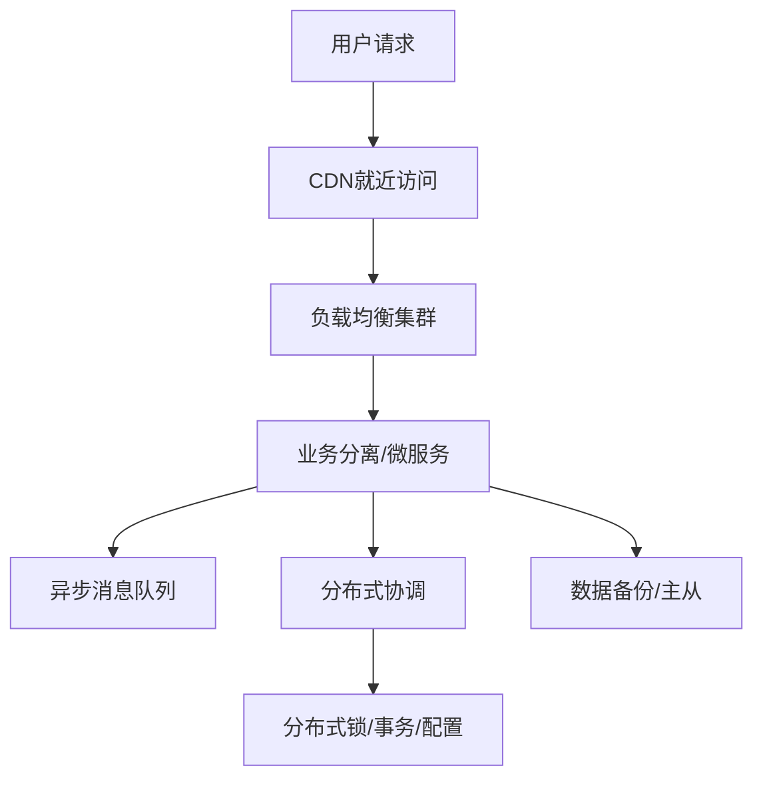

---

### 1-6 大型网站架构演变历程（概述）
> 说明：该部分PDF内容未提供详细文本，基于课程大纲推断。

#### 核心论点
架构演变从单体 → 集群 → 分布式 → 微服务 → 容器化，每一步都是业务驱动的自然演进。

---

### 1-7 架构师所需要具备的技术栈与能力
> 说明：该部分PDF内容未提供详细文本，仅目录存在。

---

## 第2章：单体架构设计与准备工作

### 2-1 ~ 2-10 单体架构概述、技术选型、聚合工程构建等

#### 核心论点
单体架构是初创项目最理想的形式，技术选型SpringBoot + MyBatis + HikariCP，采用前后端分离开发模式，通过Maven聚合工程分层。

#### 关键概念
- **前后端分离**：提高企业生产力，便于架构师管理。
- **聚合工程**：Maven多模块，分层（controller/service/dao/pojo）。
- **PDMan数据库建模**：版本管理好用。
- **移除物理外键**：后续分布式扩展需要。

#### 逻辑推演
先演示项目最终效果（首页、商品、购物车、支付、用户中心）→ 技术选型 → 前后端分离模式 → 分层设计 → Maven聚合工程构建 → 数据库设计（PDMan）→ 整合SpringBoot/MyBatis/HikariCP。

---

### 2-11 附：SpringBoot依赖

#### 核心依赖配置
```xml
<parent>
    <groupId>org.springframework.boot</groupId>
    <artifactId>spring-boot-starter-parent</artifactId>
    <version>2.1.5.RELEASE</version>
</parent>

<properties>
    <java.version>1.8</java.version>
</properties>

<dependencies>
    <dependency>
        <groupId>org.springframework.boot</groupId>
        <artifactId>spring-boot-starter-web</artifactId>
    </dependency>
</dependencies>
```

---

### 2-15 附：整合HikariCP

#### 核心配置（application.yml）
```yaml
spring:
  datasource:
    type: com.zaxxer.hikari.HikariDataSource
    driver-class-name: com.mysql.jdbc.Driver
    url: jdbc:mysql://localhost:3306/foodie-shop-dev
    username: root
    password: root
    hikari:
      connection-timeout: 30000
      minimum-idle: 5
      maximum-pool-size: 20
      auto-commit: true
      idle-timeout: 600000
      pool-name: DateSourceHikariCP
      max-lifetime: 1800000
      connection-test-query: SELECT 1
mybatis:
  type-aliases-package: com.imooc.pojo
  mapper-locations: classpath:mapper/*.xml
```

---

### 2-18 附：使用MyBatis数据库逆向生成工具

#### 核心依赖与配置
```xml
<dependency>
    <groupId>tk.mybatis</groupId>
    <artifactId>mapper-spring-boot-starter</artifactId>
    <version>2.1.5</version>
</dependency>
```

```yaml
mapper:
  mappers: com.imooc.my.mapper.MyMapper
  not-empty: false
  identity: MYSQL
```

自定义 `MyMapper` 接口继承 `Mapper<T>` 和 `MySqlMapper<T>`。

---

### 2-19 通用Mapper接口所封装的常用方法

#### 核心方法分类

| 父接口 | 方法 | 操作 |
|--------|------|------|
| BaseSelectMapper | `selectOne(T record)` | 根据实体属性查询单个实体 |
| | `select(T record)` | 根据实体属性查询列表 |
| | `selectAll()` | 返回所有记录 |
| | `selectCount(T record)` | 条件查询记录数 |
| | `selectByPrimaryKey(Object key)` | 主键查询 |
| BaseInsertMapper | `insert(T record)` | 插入，属性为空也保存 |
| | `insertSelective(T record)` | 插入，属性为空不保存（使用默认值） |
| BaseUpdateMapper | `updateByPrimaryKey(T record)` | 根据主键更新，属性为null会覆盖原记录 |
| | `updateByPrimaryKeySelective(T record)` | 根据主键更新，属性为null忽略 |
| BaseDeleteMapper | `delete(T record)` | 根据实体属性多条件删除 |
| | `deleteByPrimaryKey(Object key)` | 根据主键删除 |
| ExampleMapper | `selectByExample(Object example)` | 条件查询 |
| | `deleteByExample(Object example)` | 条件删除 |
| | `updateByExample(T record, Object example)` | 条件更新 |

> 注意：自增主键方法（`insertList`、`insertUseGeneratedKeys`）在分布式全局唯一ID场景下不使用。

---

### 2-28 复习总结

#### 思维导图要点（基于图片整理）
1. **项目演示**：首页、商品、购物车、支付、用户中心，支付将讲支付宝+微信。
2. **技术选型**：SpringBoot vs Spring MVC，前后端分离。
3. **项目分层**：Maven聚合项目，分模块管理。
4. **数据库设计**：PDMan设计表，全量/增量脚本迭代，移除物理外键。
5. **SSM整合**：SpringBoot + MyBatis + HikariCP，HikariCP是目前最流行的数据库连接池。
6. **逆向工具**：mybatis-generator生成pojo、mapper.xml、mapper.java，通用Mapper封装CRUD。
7. **Restful规范**：通过PostMan调试API。
8. **事务传播**：7种传播行为（REQUIRED、SUPPORTS、MANDATORY、REQUIRES_NEW、NOT_SUPPORTED、NEVER、NESTED）。

---

### 2-29 练习任务
1. 通过Maven构建聚合工程
2. 尝试使用PDMan设计数据库表，并同步生成到数据库中
3. 整合SpringBoot与Mybatis
4. 构建四种不同风格的Restful Web Service，实现增删改查操作
5. 使用PostMan调用Restful接口

---

## 第3章：基础夯实站（SpringBoot与MyBatis深入）

### 3-1 基础补充：SpringBoot快速入门

#### 核心论点
SpringBoot的核心设计思想是“约定优于配置”，通过Starters简化依赖管理，自动装配，内嵌容器，实现开箱即用。

#### 关键概念
- **约定优于配置**：类名→表名，属性名→字段名，String→varchar，long→bigint。只有偏离约定时才需配置。
- **Starters**：自动配置代码 + 依赖，引入即拥有默认能力。
- **Spring Boot特性**：快速构建、多种服务输出、安全集成、支持关系/非关系数据库、内嵌Tomcat/Jetty、热启动、自动管理依赖、应用监控。

#### Spring、Spring Boot、Spring Cloud关系

> “Spring Cloud 是基于 Spring Boot 开发的一套微服务架构下的服务治理方案。”

---

### 3-3 基础补充：SpringBoot项目创建与单元测试

#### 核心论点
SpringBoot通过`@SpringBootTest` + `MockMvc`实现Web层单元测试，无需启动完整容器。

#### 关键代码
```java
@SpringBootTest
public class HelloTest {
    private MockMvc mockMvc;
    
    @Before
    public void setUp() {
        mockMvc = MockMvcBuilders.standaloneSetup(new HelloController()).build();
    }
    
    @Test
    public void getHello() throws Exception {
        mockMvc.perform(MockMvcRequestBuilders.post("/hello?name=Imooc")
                .accept(MediaType.APPLICATION_JSON_UTF8))
                .andExpect(MockMvcResultMatchers.content().string(Matchers.containsString("Imooc")));
    }
}
```

#### 热部署配置（IDEA）
- 添加 `spring-boot-devtools` 依赖，`fork=true`
- 勾选 `Build project automatically`
- Registry中开启 `compiler.automake.allow.when.app.running`

---

### 3-4 进阶提升：SpringBoot启动流程分析原理（一）

#### 核心论点
SpringBoot启动时先初始化`SpringApplication`对象，分为四步：推演web应用类型、初始化ApplicationContextInitializer、初始化ApplicationListener、推演主程序类。

#### 启动流程（源码分析）
```mermaid
graph TD
    A[main方法启动] --> B[new SpringApplication(primarySources)]
    B --> C[推断WebApplicationType]
    C --> D[setInitializers 从 spring.factories 加载]
    D --> E[setListeners 从 spring.factories 加载]
    E --> F[deduceMainApplicationClass]
    F --> G[run方法启动容器]
```

#### 关键发现
- `spring.factories` 文件位于 `META-INF/` 下，被多个jar包（spring-boot、spring-boot-autoconfigure等）提供。
- 初始化和监听器均通过 `SpringFactoriesLoader.loadFactoryNames()` 加载。

---

### 3-6 进阶提升：SpringBoot自动装配原理

> 说明：该节图片存在重复内容，基于有效信息整理。

#### 核心论点
`@SpringBootApplication` 是复合注解，其中 `@EnableAutoConfiguration` 是实现自动装配的关键，它通过 `@Import(AutoConfigurationImportSelector.class)` 导入配置，最终从 `spring.factories` 中加载所有 `EnableAutoConfiguration` 类。

#### 注解结构
```java
@SpringBootApplication
├── @SpringBootConfiguration (本质是 @Configuration)
├── @EnableAutoConfiguration
│   └── @Import(AutoConfigurationImportSelector.class)
└── @ComponentScan
```

#### 自动装配流程
1. `AutoConfigurationImportSelector` 的 `selectImports()` 方法被调用。
2. 从 `META-INF/spring.factories` 中读取 `org.springframework.boot.autoconfigure.EnableAutoConfiguration` 的值。
3. 条件注解（如 `@ConditionalOnClass`）过滤，符合条件的配置类被加载。
4. 配置类中的 `@Bean` 方法注入容器。

> “Spring Boot 约定优于配置的思想让 Spring Boot 项目非常容易上手，让编程变得更简单，其实编程本该很简单，简单才是编程的美。”

---

### 3-7 进阶提升：MyBatis架构分析

#### 核心论点
MyBatis是JDBC的封装，架构分为四层：接口层、数据处理层、框架支撑层、引导层。

#### 架构图
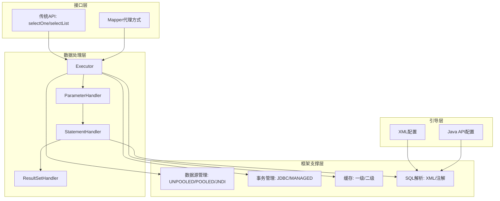

#### 关键概念
- **一级缓存**：SqlSession级别，默认开启。
- **二级缓存**：Mapper级别，需手动开启。
- **数据源类型**：POOLED（连接池，推荐）、UNPOOLED（每次新建）、JNDI（已少用）。
- **事务管理器**：JDBC（直接使用提交/回滚）、MANAGED（交给容器）。

---

### 3-8 进阶提升：MyBatis的执行流程分析

#### 核心论点
MyBatis执行流程与JDBC六步走对应，但增加了配置解析、动态代理、缓存等封装。

#### JDBC vs MyBatis 对比
| JDBC步骤 | MyBatis对应 |
|----------|-------------|
| 1. 注册驱动 | 1. 读取核心配置文件（mybatis-config.xml） → Configuration对象 |
| 2. 获取Connection | 2. 加载映射文件（mapper.xml） |
| 3. 执行预编译 | 3. 创建SqlSessionFactory |
| 4. 执行SQL | 4. 创建SqlSession |
| 5. 封装结果集 | 5. 执行SQL（Executor → StatementHandler → ParameterHandler → ResultSetHandler） |
| 6. 释放资源 | 6. 释放资源 |

#### MyBatis执行八步走（详细）
1. 读取 `mybatis-config.xml` 核心配置文件
2. 加载映射文件（SQL映射）
3. 配置映射器（包扫描/`resource`/`class`）
4. 创建 `SqlSessionFactory`
5. 创建 `SqlSession`
6. 执行SQL（通过 `getMapper` 代理或传统API）
7. 封装结果集
8. 释放资源

> “MyBatis 其实也挺简单的，总结下就是：加载解析配置文件 → 处理参数 → 执行查询 → 封装结果集。”

---

### 3-15 附：SpringBoot日志

#### 核心配置（移除默认日志，引入log4j）
```xml
<exclusions>
    <exclusion>
        <groupId>org.springframework.boot</groupId>
        <artifactId>spring-boot-starter-logging</artifactId>
    </exclusion>
</exclusions>
<dependency>
    <groupId>org.springframework.boot</groupId>
    <artifactId>spring-boot-starter-log4j</artifactId>
</dependency>
```

`log4j.properties` 配置示例（输出到控制台和滚动文件）。

---

## 第4章：用户登录注册模块开发（概要）

> 说明：详细代码内容未提供，基于目录整理。

#### 核心功能点
- 注册流程：判断用户名存在 → 创建用户service/controller
- 自定义响应数据结构
- 整合Swagger2生成API文档
- 跨域配置实现前后端联调
- Cookie/Session回顾，用户登录与退出
- 整合log4j，通过AOP监控service执行时间
- MyBatis SQL日志打印

#### 关键依赖（Swagger2）
```xml
<dependency>
    <groupId>io.springfox</groupId>
    <artifactId>springfox-swagger2</artifactId>
    <version>2.4.0</version>
</dependency>
<dependency>
    <groupId>io.springfox</groupId>
    <artifactId>springfox-swagger-ui</artifactId>
    <version>2.4.0</version>
</dependency>
```

---

## 第5章：分类、推荐、搜索、评价、购物车开发（概要）

> 说明：基于《分类，推荐，搜索，评价，购物车开发.pdf》整理。

### 5-1 ~ 5-4 购物车功能
- **购物车的存储形式**：未登录（localStorage/临时结构）与已登录（后端数据库）两种。
- **加入购物车**：未登录状态下加入临时购物车，登录后合并。
- **渲染购物车**：刷新时重新计算总价、数量。
- **选中商品的计算业务**：支持单选/全选，实时计算总金额。

### 分页插件配置（pagehelper）
```xml
<dependency>
    <groupId>com.github.pagehelper</groupId>
    <artifactId>pagehelper-spring-boot-starter</artifactId>
    <version>1.2.12</version>
</dependency>
```
```yaml
pagehelper:
  helperDialect: mysql
  supportMethodsArguments: true
```
```java
PageHelper.startPage(page, pageSize);
PageInfo<?> pageList = new PageInfo<>(list);
```

---

## 第6章：加餐站 & 福利站（概要）

### 加餐内容（5-1 ~ 5-15）
- 异构系统讨论
- 职业发展、面试技巧
- 架构师性格测试
- 数据库技术视野拓展
- 阿里新零售微服务化经验
- Java基础面试考点
- 远程办公与桌面布置
- volatile修饰容器类的作用
- SQL高级特性、Linux常用命令
- 直播课汇总

### 福利站（6-1 ~ 6-13）
- 工作内推机会（姚半仙团队、滴滴、腾讯教育、蚂蚁金服、淘宝、涂鸦、字节、58同城等）
- 慕课网Wiki教程签约作者招募
- 课程群QA精华汇总

---

## 后续阶段（阶段二至阶段六）核心要点

> 说明：基于课程“学习理由”章节提炼，详细视频内容未提供。

### 阶段二：从单体到高可用集群演进
- **核心问题**：单体架构负载过高，单节点宕机导致服务不可用。
- **解决方案**：Nginx负载均衡 + 双机主备/主从热备 + Redis缓存集群。

### 阶段三：分布式架构
- **核心挑战**：
  1. 文件如何被任意节点获取 → 分布式文件系统
  2. 服务解耦 → 消息队列
  3. 日志聚合 → ELK/分布式日志
  4. 资源竞争 → 分布式锁（Redis/ZooKeeper）
  5. 查询慢 → 分库分表、索引优化、缓存
  6. 跨服务事务 → 分布式事务（TCC、最终一致性）

### 阶段四：基于SpringCloud改造微服务
- **核心问题**：
  - 服务注册与发现（Eureka/Nacos）
  - 接口超时与主链路高可用（Hystrix/Sentinel）
  - 配置中心化管理（Spring Cloud Config/Nacos）
  - 网络请求转发（Gateway/Zuul）
  - 线上异常排查（链路追踪：Sleuth+Zipkin）
  - 无缝对接消息中间件（RabbitMQ/Kafka）

### 阶段五：服务容器化 - Docker与K8s
- **解决的问题**：快速部署、弹性伸缩（秒杀场景）、服务编排。
- **技术栈**：Docker镜像、Kubernetes Pod/Service/Deployment、HPA。

### 阶段六：JVM、数据库、Linux性能调优
- **核心内容**：
  - JVM：GC调优、内存分析、线程栈
  - 数据库：索引优化、慢查询、连接池、分库分表
  - Linux：CPU、内存、IO、网络参数调优

> “性能调优技术一直是高薪面试的必杀技，也是高手与普通工程师技术能力的分水岭。”

---

## 课程群与支持
- **QQ群**：825115712
- **问答区**：每个视频左侧第二个标签，8小时内回复

--- 

*以上为《Java架构师成长直通车》课程前四章及整体框架的结构化知识档案，基于提供的PDF、图文节和截图整理完成。后续章节（分布式、微服务、容器化、调优）因原始材料未提供详细视频文本，仅保留核心学习理由与问题列表。*

# 《Java架构师成长直通车》课程知识档案（续）

## 书籍信息
- 书名：Java架构师体系课：跟随千万级项目从0到100全过程高效成长 / 《Java架构师成长直通车》
- 作者：慕课网与多位业内资深大咖老师（风间影月、张飞扬等）
- PDF 状态：混合来源（课程介绍页、图文节、PDF讲义、PNG截图）
- OCR 状态：部分内容为图片OCR识别，存在少量错漏，已基于可识别内容整理

## 目录说明
- 本次整理基于新上传的文件，涵盖学习疑问解答、云服务器部署上线、地址订单支付开发、用户中心与评价管理、BO数据验证、加餐面试题及秒杀讨论等模块。
- 章节顺序按照课程实际学习路径重组，尽可能保持与课程大纲一致。
- OCR 修复说明：部分重复图片内容已去重，不完整图表已标注。

## 全书核心主题
本课程从单体电商项目起步，逐步演进到高可用集群、分布式、微服务、容器化及性能调优。新增内容包括：生产环境部署（CentOS7安装JDK/MariaDB/Tomcat）、订单支付全流程（微信/支付宝集成）、用户中心与评价管理、文件上传安全规范、秒杀场景下的降级与限流策略，以及大厂面试真题解析。强调实战与架构思维并重。

---

## 第1章：学习指南与疑问解答

### 1-1 【重中之重】大家学习中有疑问该怎么办？

#### 核心论点
课程提供多种答疑渠道，推荐优先使用问答区，并给出“正确提问的姿势”以提升沟通效率。

#### 关键概念/事件
- **问答区**：每个视频左侧第二个标签，老师8小时内回复（有问必答）。
- **紧急提问**：在问答区发帖后，在QQ群（825115712）中@对应老师。
- **交流探讨**：非学习问题或开放讨论可加入QQ群与同学老师交流。

#### 逻辑推演
问题 → 问答区详细描述（含分析、尝试方案）→ 老师8小时内解答；紧急时QQ群提醒 → 即时响应。非学习问题转QQ群讨论，避免干扰课程答疑。

> “描述清楚自己的问题；给出自己问题的分析；告诉别人我已经尝试了哪几个方案，它们不可行；就这个问题或某个方面，您可以给我什么建议？” (正确提问姿势)

---

## 第2章：云服务器部署上线

### 2-1 本章概述与服务器购买建议
> 说明：该节仅目录存在，具体内容未提供。

---

### 2-2 CentOS7安装JDK

#### 核心论点
生产环境需卸载自带OpenJDK，手动安装Oracle JDK并配置环境变量。

#### 关键步骤
1. 检查已有JDK：`java -version`
2. 卸载OpenJDK：`rpm -qa | grep openjdk` → `rpm -e --nodeps <包名>`
3. 新建目录：`mkdir /usr/java`
4. 上传并解压：`tar -zxvf jdk-8u191-linux-x64.tar.gz`
5. 移动至`/usr/java/`
6. 配置`/etc/profile`：
   ```bash
   export JAVA_HOME=/usr/java/jdk1.8.0_191
   export CLASSPATH=.:$JAVA_HOME/lib
   export PATH=$PATH:$JAVA_HOME/bin
   ```
7. 生效：`source /etc/profile`
8. 验证：`java -version`

#### 经典金句
> “如果是在阿里云或者腾讯云上的centos系统，一般不会自带jdk，但是以上步骤还是建议检查一下，如若发现自带jdk，建议删除后重新安装。”

---

### 2-3 安装Tomcat - 部署第一台Tomcat
> 说明：该节仅目录存在，详细内容未提供。课程中涉及部署两台Tomcat与域名配置方案。

---

### 2-4 安全组端口开放
> 说明：仅目录存在，内容涉及云服务器安全组规则配置。

---

### 2-5 MariaDB - 手把手跟着官方文档下载rpms

#### 核心论点
推荐离线安装MariaDB，从官方下载rpm包并按顺序安装。

#### 关键文件列表
- galera-4-26.4.2-1.rhel7.el7.centos.x86_64.rpm
- jemalloc-3.6.0-1.el7.x86_64.rpm
- jemalloc-devel-3.6.0-1.el7.x86_64.rpm
- MariaDB-client-10.4.7-1.el7.centos.x86_64.rpm
- MariaDB-common-10.4.7-1.el7.centos.x86_64.rpm
- MariaDB-compat-10.4.7-1.el7.centos.x86_64.rpm
- MariaDB-server-10.4.7-1.el7.centos.x86_64.rpm

---

### 2-6 CentOS7安装MariaDB 10.4.x

#### 核心步骤
1. 安装依赖：`yum install rsync nmap lsof perl-DBI nc`
2. 安装jemalloc：`rpm -ivh jemalloc-3.6.0-1.el7.x86_64.rpm` 及其devel包
3. 卸载系统自带mariadb-libs：先搜索 `rpm -qa | grep mariadb-libs`，再 `rpm -ev --nodeps`
4. 安装boost-devel：`yum install boost-devel.x86_64`
5. 导入MariaDB key：`rpm --import http://yum.mariadb.org/RPM-GPG-KEY-MariaDB`
6. 安装galera：`rpm -ivh galera-4-26.4.2-1.rhel7.el7.centos.x86_64.rpm`
7. 安装libaio（若需要）：下载并安装 `libaio-0.3.107-10.el6.x86_64.rpm`
8. 依次安装MariaDB四个核心包：common, compat, client, server
9. 启动服务：`service mysql start`
10. 安全配置：`mysql_secure_installation`（设置root密码、移除匿名用户、禁止远程root登录等）
11. 授权远程连接：
    ```sql
    grant all privileges on *.* to 'root'@'%' identified by 'root#3';
    flush privileges;
    ```

#### 流程图：MariaDB离线安装流程
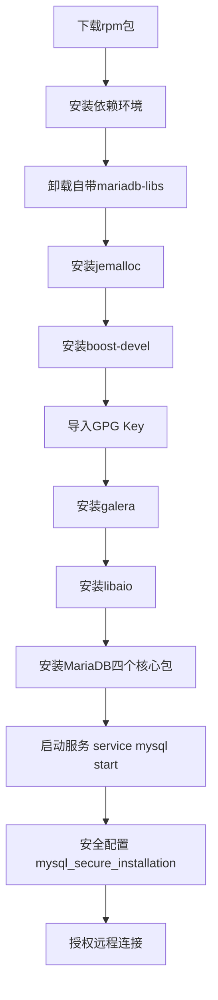

---

### 2-7 SpringBoot多环境部署profile

#### 核心论点
使用profile区分开发、测试、生产环境配置，打包时指定激活环境。

#### 关键方法
- 配置文件命名：`application-{profile}.yml`（如 `application-dev.yml`, `application-prod.yml`）
- 激活方式：`spring.profiles.active=prod` 或打包时 `mvn package -Dspring.profiles.active=prod`

---

### 2-8 SpringBoot打包war并发布

#### 核心步骤
1. 修改pom.xml打包方式为 `war`
2. 排除内置Tomcat或改为provided
3. 继承 `SpringBootServletInitializer` 并重写 `configure` 方法
4. 执行 `mvn clean package`
5. 将war上传至Tomcat的 `webapps` 目录
6. 重启Tomcat

---

### 2-9 发布前端项目
> 说明：仅目录存在，涉及Nginx或Tomcat部署静态资源。

---

### 2-10 解决Cookie异常，测试订单支付流程
> 说明：仅目录存在，内容涉及跨域Cookie及支付回调。

---

## 第3章：地址、订单、支付、定时任务开发

### 3-1 收货地址功能开发

#### 核心论点
收货地址是订单流程的前置模块，需实现增删改查及默认地址设置。

#### 关键功能
- 查询收货地址列表
- 新增收货地址（字段校验）
- 修改收货地址
- 删除收货地址（逻辑删除）
- 设置默认收货地址（唯一性保证）

---

### 3-2 确认订单功能

#### 核心论点
梳理订单流程与状态，设计订单表及子订单表。

#### 订单状态
- 待付款
- 待发货
- 待收货
- 交易成功
- 交易关闭

#### 聚合支付中心作用
> “讲述聚合支付中心，作用是什么” – 统一对接微信、支付宝等渠道，降低商户接入成本。

---

### 3-3 创建订单

#### 核心步骤
1. 填充新订单数据（订单号、用户ID、总金额等）
2. 保存订单与子订单数据（商品快照）
3. 扣除商品库存
4. 订单状态保存
5. 事务回滚测试

> 说明：涉及 `@Transactional` 保证原子性。

---

### 3-4 微信支付集成

#### 核心论点
遵循微信支付时序图，构建商户端回调接口，生成支付二维码，轮询支付结果。

#### 关键时序
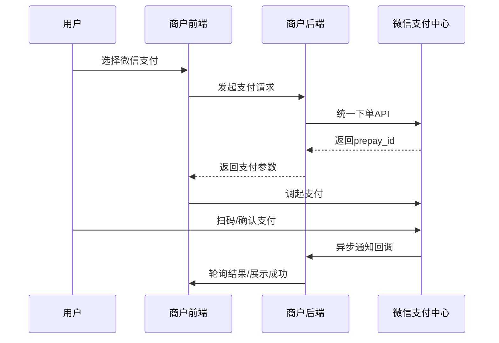

#### 关键点
- 内网穿透（如ngrok）用于开发环境接收回调
- 商户回调地址需公网可访问
- 轮询支付成功结果更新订单状态

---

### 3-5 支付宝支付集成

#### 核心论点
支付宝支付采用异步通知+同步通知双模式。

#### 关键区别
- **同步通知**：支付完成后浏览器跳转回商户页面，用于展示结果。
- **异步通知**：支付宝服务器直接回调商户后端，用于更新订单状态（可靠性高）。

#### 流程图：支付宝支付流程


---

### 3-6 定时任务功能开发

#### 核心论点
使用定时任务（如@Scheduled）关闭超期未支付订单，避免占用库存。

#### 实现方式
- 构建定时任务task：`@Scheduled(cron="0 0/1 * * * ?")`
- 查询超时未支付订单 → 更新状态为“交易关闭” → 恢复库存

#### 弊端与优化
- **弊端**：单机定时任务在分布式环境下可能重复执行。
- **优化方案**：使用分布式调度（如XXL-Job、Elastic-Job）或消息队列延迟消息。

---

### 3-7 总结复习（地址订单支付模块）
> 说明：基于思维导图图片整理。

#### 核心回顾
- 收货地址CRUD及默认地址逻辑
- 订单状态机设计
- 微信/支付宝支付集成及回调处理
- 定时任务关闭超时订单

---

### 3-8 练习作业
> “抛开视频讲解，试试自己独立开发一次单体电商项目，测测自己掌握了多少。”

---

## 第4章：用户中心、订单/评价管理开发

### 4-1 本章概述
> 说明：仅目录存在。

---

### 4-2 用户中心 - 查询、编辑、验证用户信息

#### 核心论点
用户信息修改需使用Hibernate Validation进行字段校验。

#### 关键校验注解（来自1-5 BO数据验证）
| 注解 | 作用 |
|------|------|
| `@NotBlank` | 字符串非null且长度>0 |
| `@Length(min=, max=)` | 字符串长度范围 |
| `@Max(value)` | 数字最大值 |
| `@Pattern(regex=)` | 正则匹配（如密码、手机号） |
| `@Email` | 邮箱格式 |

---

### 4-3 BO数据验证（详细）

#### 示例代码
```java
public class ValBean {
    @Max(value=20, message="{val.age.message}")
    private Integer age;
    
    @NotBlank(message="{username.not.null}")
    @Length(max=6, min=3, message="{username.length}")
    private String username;
    
    @NotBlank(message="{pwd.not.null}")
    @Pattern(regexp="^([0-9]+$)(?![a-zA-Z]+$)[0-9A-Za-z]{6,10}$", 
             message="密码必须是6~10位数字和字母的组合")
    private String password;
    
    @Pattern(regexp="^((13[0-9])|(15[0-4])|(18[0-9]))\\d{8}$", 
             message="手机号格式不正确")
    private String phone;
    
    @Email(message="{email.format.error}")
    private String email;
}
```

#### Controller中使用
```java
@PostMapping("/val")
public LeeJSONResult val(@Valid @RequestBody ValBean bean, BindingResult result) {
    if(result.hasErrors()) {
        Map<String, String> map = getErrors(result);
        return LeeJSONResult.error(map);
    }
    // 业务逻辑
}
```

---

### 4-4 上传头像功能开发

#### 核心论点
文件上传需限制格式、大小，防止恶意脚本；上传后更新数据库并刷新浏览器缓存。

#### 关键步骤
1. 定义文件保存位置（本地目录或云存储）
2. 上传到指定目录，生成唯一文件名
3. 属性资源文件与类映射（如保存路径配置）
4. 为静态资源提供网络映射服务（Tomcat虚拟路径或Nginx）
5. 更新用户头像地址到数据库
6. 图片格式限制（仅jpg/png等），防止后门
7. 大小限制（建议200K以内），自定义异常捕获

#### 缓存刷新技巧
> “由于浏览器端有缓存，所以当用户上传后，需要在图片后加一个时间戳，以此刷新图片缓存。” (5-5 复习总结)

---

### 4-5 订单管理功能

#### 核心功能
- 查询我的订单（支持分页、状态筛选）
- 商家发货（模拟发货接口）
- 操作订单前的验证（用户身份、订单状态）
- 确认收货
- 删除订单（逻辑删除）

#### 嵌套查询分页bug解决方案
> 说明：使用子查询或MyBatis的collection分页需注意，可改用两次查询或`@Select`注解配合。

---

### 4-6 评价管理功能

#### 核心功能
- 查询待评价商品列表（已收货未评价）
- 评价商品（评价等级+内容）
- 历史评价列表（分页）
- 订单状态概览（待付款、待发货、待收货、待评价数量）
- 订单动向（状态变更记录）

---

### 4-7 复习总结（用户中心）

#### 核心回顾（来自5-5复习总结）
- **用户信息管理**：查询、修改、头像上传（加时间戳防缓存）
- **文件上传安全**：格式验证、大小限制（200K以内）
- **订单管理**：状态筛选、商家发货、确认收货、逻辑删除
- **评价管理**：待评价列表、发表评价、历史评价
- **地址管理**：已实现CRUD，可复用之前代码
- **订单概览与动向**：首页展示待处理订单数量及状态变化动态

---

### 4-8 练习作业
> 说明：未提供具体内容，建议独立完成用户中心及订单评价模块。

---

## 第5章：加餐与面试题

### 5-1 【加餐】逆行老司机张飞扬要开车啦（秒杀抢购降级讨论）

#### 核心论点
秒杀场景下，限流、削峰、降级是核心保护手段。降级可通过前置等待队列、停掉非核心业务（如搜索、评论）来腾出资源。

#### 关键观点摘录
- **限流、削峰、缓存、降级**是分布式保护基本功。
- **前置等待队列**：如“您是第xxx用户，请耐心等待” – 影响转化率但保护系统。
- **降级方向**：
  - 与抢购无关的模块（卖家业务、评论、搜索等）
  - 高流量业务用替代方案（如广告条代替搜索）
- **容器化弹性伸缩**：降级可通过减少非核心服务实例数腾出CPU/内存。
- **典型案例**：双十一淘宝关闭评论功能，将资源投入交易链路。

> “降级的一个常见实现是停掉服务。”  
> “如果决策是停止搜寻，就会停止整个搜索集群，腾出计算资源。”  
> “容器化的好处是帮助完成这些决策的执行。”

#### 流程图：秒杀降级决策
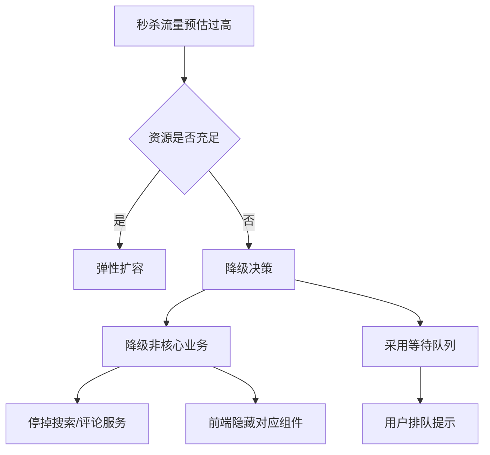

---

### 5-2 【加餐】mybatis项目面试题

#### 面试题列表
1. mybatis中 `#{}` 和 `${}` 的区别是什么？
   - `#{}` 预编译，防止SQL注入；`${}` 直接拼接，存在注入风险。
2. mybatis有几种分页方式？
   - 逻辑分页（RowBounds）、物理分页（插件如PageHelper）。
3. RowBounds是一次性查询全部结果吗？为什么？
   - 是的，它是在结果集中截取，性能差。
4. mybatis逻辑分页和物理分页的区别是什么？
   - 逻辑分页：查出所有再内存截取；物理分页：SQL加limit。
5. mybatis是否支持延迟加载？延迟加载的原理是什么？
   - 支持，通过动态代理，在调用getter时触发额外SQL。
6. 说一下mybatis的一级缓存和二级缓存？
   - 一级缓存SqlSession级别，二级缓存Mapper级别。
7. mybatis和hibernate的区别有哪些？
   - Mybatis灵活、SQL可控；Hibernate全自动、适合简单CRUD。
8. mybatis有哪些执行器（Executor）？
   - SIMPLE, REUSE, BATCH。
9. mybatis分页插件的实现原理是什么？
   - 基于Interceptor拦截Executor的query方法，改写SQL。
10. mybatis如何编写一个自定义插件？
    - 实现Interceptor接口，使用@Intercepts注解指定拦截目标。

---

### 5-3 【加餐】经历了拼多多5轮Java面试，都面了些啥？

#### 一面题目（技术面 - Java基础/网络/多线程/数据库）
1. HashMap、HashTable、ConcurrentHashMap异同
2. 网络I/O模型，多路复用I/O，select/epoll区别
3. TCP三次握手，缺少第三次握手的问题
4. 常用线程池及场景
5. 类加载机制，双亲委派模型好处
6. Java并发包组件
7. 死锁原因及预防
8. 用户态/内核态切换条件与原因
9. 数据库事务特点、隔离级别、项目实现方式
10. 脏读、不可重复读、幻读举例

#### 二面题目（技术面 - 索引/设计模式/CAS/Redis）
1. 数据库索引（B+树）、建索引考虑、索引对插入删除影响及解决（分表）
2. 单例模式线程安全，锁效率优化（双重检查锁、静态内部类）
3. CAS本质，原子性保证（CPU指令）
4. 分布式锁实现方案及推荐
5. Redis持久化（RDB/AOF）
6. Redis处理热点数据

#### 三面题目（技术面 - 消息队列/微服务/CAP/Netty）
1. 消息队列选型
2. SOA与微服务理解
3. Spring Cloud服务注册流程
4. 分布式CAP理论
5. NIO、Netty线程模型、零拷贝实现

#### 四面题目（技术面 - Redis/集群雪崩/削峰限流）
1. Redis单线程还是多线程？分布式集群方案
2. 集群雪崩了解吗
3. 高并发削峰、限流实现
4. 个人最满意项目及架构设计思路

#### 五面题目（HR面）
1. 离职原因
2. 为什么选择拼多多
3. 加班看法
4. 学习技术的方式（除Java外）
5. 未来两年职业规划
6. 期望薪资

---

## 第6章：总结复习与作业

### 6-1 复习总结（单体电商主体功能）

#### 核心回顾（来自6-4图文节）
- 用户登录注册：密码加密存储
- 收货地址管理
- 订单创建与支付
- 定时任务关闭超期订单
- 用户中心信息修改、头像上传
- 评价管理

> “用户密码必须加一泄露了可不得了噢~”

#### 思维导图要点
- 密码加密（如BCrypt）
- 文件上传安全（格式、大小限制）
- 订单状态流转
- 支付回调幂等性处理

---

### 6-2 练习作业

> “抛开视频讲解，试试自己独立开发一次单体电商项目，测测自己掌握了多少。然后做对比，看看有哪些不足。”

---

*以上为本次上传文件的完整结构化总结。所有内容均基于原始材料整理，未添加书中不存在的信息。*


# 《Java架构师成长直通车》课程知识档案（Nginx+LVS+Keepalived高可用集群篇）

## 书籍信息
- 书名：Java架构师体系课：跟随千万级项目从0到100全过程高效成长 / 《Java架构师成长直通车》
- 作者：慕课网与多位业内资深大咖老师（风间影月等）
- PDF 状态：图文节PDF及目录文件
- OCR 状态：良好，少量格式错乱已修正

## 目录说明
- 本部分对应课程中的“LVS+Nginx实现高可用集群”阶段。
- 依据《6.LVS+Nginx实现高可用集群-慕课网就业班.pdf》目录整理，分为4章：
  - 第1章：Nginx快速认知
  - 第2章：Nginx进阶与实战
  - 第3章：Keepalived原理与实战
  - 第4章：搭建高可用集群负载均衡
- 各图文节（附）内容已嵌入对应章节作为补充。

## 全书核心主题
本阶段聚焦于高可用集群架构，从Nginx入门（反向代理、负载均衡、缓存、SSL）到Keepalived实现双机主备/双主热备，再到LVS四层负载均衡与LVS+Keepalived+Nginx的高可用集群解决方案。强调理解OSI七层模型、同步/异步/阻塞/非阻塞概念、负载均衡算法、高可用原理及生产环境部署。最终目标：掌握主流的高可用高性能集群负载均衡技术。

---

## 第1章：Nginx快速认知

### 1-1 集群阶段开篇概述
> 说明：仅目录存在，内容涉及集群架构演进介绍。

### 1-2 大家学习中有疑问该怎么办
> 说明：同前文，此处省略。

### 1-3 什么是Nginx？常用的Web服务器有哪些？
> 说明：内容未提供，核心点：Nginx是高性能HTTP和反向代理服务器，常用Web服务器有Apache、Nginx、IIS等。

### 1-4 什么是反向代理？
> 说明：反向代理代理的是服务器端，客户端无感知；正向代理代理的是客户端。

### 1-5 Nginx安装与运行

#### 核心论点
Nginx需从源码编译安装，安装前需安装依赖环境（gcc、pcre、zlib、openssl），解压后配置、编译、安装。

#### 关键步骤
1. 下载稳定版nginx包
2. 安装依赖：
   ```bash
   yum install gcc-c++
   yum install -y pcre pcre-devel
   yum install -y zlib zlib-devel
   yum install -y openssl openssl-devel
   ```
3. 解压：`tar -zxvf nginx-1.16.1.tar.gz`
4. 创建临时目录：`mkdir /var/temp/nginx -p`
5. 配置（生成Makefile）：
   ```bash
   ./configure --prefix=/usr/local/nginx --pid-path=/var/run/nginx/nginx.pid \
   --lock-path=/var/lock/nginx.lock --error-log-path=/var/log/nginx/error.log \
   --http-log-path=/var/log/nginx/access.log --with-http_gzip_static_module \
   --http-client-body-temp-path=/var/temp/nginx/client \
   --http-proxy-temp-path=/var/temp/nginx/proxy \
   --http-fastcgi-temp-path=/var/temp/nginx/fastcgi \
   --http-uwsgi-temp-path=/var/temp/nginx/uwsgi \
   --http-scgi-temp-path=/var/temp/nginx/scgi
   ```
6. 编译：`make`  &&  `make install`
7. 启动：`/usr/local/nginx/sbin/nginx`
8. 停止：`./nginx -s stop`，重新加载：`./nginx -s reload`

#### 流程图：Nginx编译安装流程
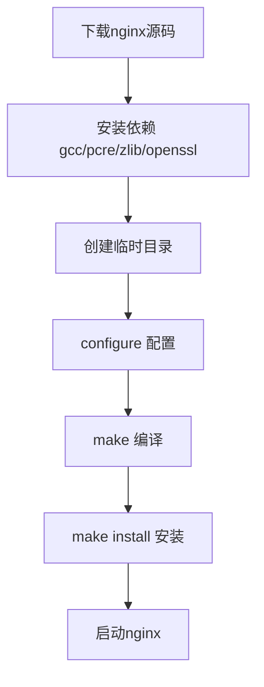

### 1-6 附：安装Nginx与运行
> 说明：即1-5的图文版，内容同上。

### 1-7 Nginx显示默认首页过程解析
> 说明：略。

### 1-8 Nginx进程模型解析
> 说明：Nginx采用master-worker多进程模型。

### 1-9 Nginx处理Web请求机制解析
> 说明：略。

### 1-10 nginx.conf配置结构与指令语法
> 说明：略。

### 1-11 附：同步与异步，阻塞与非阻塞

#### 核心论点
同步/异步关注消息通信机制，阻塞/非阻塞关注调用方等待状态。两者组合形成四种模型：同步阻塞（BIO）、同步非阻塞（NIO）、异步阻塞、异步非阻塞（AIO）。

#### 四种组合详解
| 组合 | 说明 |
|------|------|
| 同步阻塞 | 客户端发送请求，服务端处理慢，客户端一直等待，服务端也不接受其他请求 |
| 同步非阻塞 | 客户端等待但服务端可以处理其他请求，稍后返回结果 |
| 异步阻塞 | 客户端不等待，可以做其他事；服务端处理完回调通知；但服务端处理时仍阻塞 |
| 异步非阻塞 | 客户端做其他事，服务端也处理其他任务，完成后回调，最高效 |

#### 生活类比（上厕所）
- **BIO**：坑位满，我站在那盯着直到有人出来。
- **NIO**：坑位满，我出去抽烟，过会儿回来看有空位没。
- **异步阻塞**：坑位满，我等着，有空位通知我。
- **AIO**：坑位满，我去抽烟玩手机，有空位通知我再去。

> “异步的优势显而易见，大大优化用户体验，非阻塞使得系统资源开销远远小于阻塞模式。” (1-10)

### 1-12 附：nginx.conf核心配置文件

#### 核心配置项
```nginx
user root;                     # worker进程用户
worker_processes 1;            # worker进程数，一般为CPU核心数
error_log logs/error.log;      # 错误日志
pid logs/nginx.pid;            # pid文件

events {
    use epoll;                 # 使用epoll模型
    worker_connections 10240;  # 每个worker最大连接数
}

http {
    include mime.types;
    # 日志格式定义
    log_format main '$remote_addr - $remote_user [$time_local] "$request" '
                    '$status $body_bytes_sent "$http_referer" '
                    '"$http_user_agent" "$http_x_forwarded_for"';
    sendfile on;               # 高效文件传输
    tcp_nopush on;             # 数据累积后发送
    keepalive_timeout 65;      # 长连接超时
}
```

### 1-13 ~ 1-16 nginx.conf详解及常见问题
> 说明：内容未提供。

### 1-17 Nginx常用命令解析
> 说明：略。

### 1-18 Nginx日志切割 - 手动

#### 核心论点
日志需按天切割避免单个文件过大，通过shell脚本移动日志文件并重新打开日志文件。

#### 手动切割脚本 `cut_my_log.sh`
```bash
#!/bin/bash
LOG_PATH="/var/log/nginx/"
RECORD_TIME=$(date -d "yesterday" +%Y-%m-%d+%H:%M)
PID=/var/run/nginx/nginx.pid
mv ${LOG_PATH}/access.log ${LOG_PATH}/access.${RECORD_TIME}.log
mv ${LOG_PATH}/error.log ${LOG_PATH}/error.${RECORD_TIME}.log
kill -USR1 $(cat $PID)
```
执行：`chmod +x cut_my_log.sh && ./cut_my_log.sh`

### 1-19 附：Nginx日志切割-手动
> 说明：内容同上。

### 1-20 Nginx日志切割 - 定时

#### 核心论点
使用crontab定时任务自动执行日志切割脚本。

#### 配置步骤
1. 安装crontabs：`yum install crontabs`
2. 编辑任务：`crontab -e`，添加：
   ```
   */1 * * * * /usr/local/nginx/sbin/cut_my_log.sh
   ```
3. 重启服务：`service crond restart`

#### 常用cron表达式
| 表达式 | 含义 |
|--------|------|
| `* * * * *` | 每分钟执行 |
| `59 23 * * *` | 每日23:59执行 |
| `0 1 * * *` | 每日凌晨1点执行 |

### 1-21 附：Nginx日志切割-定时
> 说明：内容同上。

### 1-22 虚拟主机 - 使用Nginx为静态资源提供服务
> 说明：略。

### 1-23 使用Gzip压缩提升请求效率
> 说明：略。

### 1-24 附：root与alias

#### 核心论点
- `root`：路径完全匹配，访问`/imooc`实际指向`/home/imooc`
- `alias`：路径别名，访问`/hello`实际指向`/home/imooc`，对用户透明

#### 示例
```nginx
# root: 访问 /imooc/files/img/face.png → /home/imooc/files/img/face.png
location /imooc { root /home; }

# alias: 访问 /hello/files/img/face.png → /home/imooc/files/img/face.png
location /hello { alias /home/imooc; }
```

### 1-25 location的匹配规则解析

#### 核心论点
location匹配优先级：`=`（精确） > `^~`（前缀） > `~`/`~*`（正则） > 普通匹配。

#### 匹配规则表
| 符号 | 说明 |
|------|------|
| 空格 | 默认匹配，普通匹配 |
| `=` | 精确匹配 |
| `~` | 正则匹配，区分大小写 |
| `~*` | 正则匹配，不区分大小写 |
| `^~` | 以某路径开头 |

```nginx
location / { root /home; }                       # 默认匹配
location = /imooct/ing/facel.png { root /home; } # 精确匹配
location ~* \.(GIF|jpg|png|jpeg) { root /home; } # 正则，不区分大小写
location ^~ /imooct/ing { root /home; }          # 前缀匹配
```

### 1-26 附：location的匹配规则
> 说明：内容同上。

### 1-27 DNS域名解析
> 说明：略。

### 1-28 使用SwitchHosts模拟本地域名解析访问
> 说明：略。

---

## 第2章：Nginx进阶与实战

### 2-0 在Nginx中解决跨域问题

#### 核心配置
```nginx
add_header 'Access-Control-Allow-Origin' '*';
add_header 'Access-Control-Allow-Credentials' 'true';
add_header 'Access-Control-Allow-Methods' '*';
add_header 'Access-Control-Allow-Headers' '*';
```

### 2-1 在Nginx中配置静态资源防盗链

#### 核心配置
```nginx
valid_referers *.imooc.com;
if ($invalid_referer) {
    return 404;
}
```

### 2-2 Nginx的模块化设计解析
> 说明：略。

### 2-3 Nginx的集群负载均衡解析
> 说明：略。

### 2-4 附：Nginx跨域配置支持
> 说明：内容同2-0。

### 2-5 附：Nginx防盗链配置支持
> 说明：内容同2-1。

### 2-6 四层、七层与DNS负载均衡
> 说明：略。

### 2-7 附：OSI网络模型

#### 核心论点
OSI七层模型从下到上：物理层、数据链路层、网络层、传输层、会话层、表示层、应用层。Nginx是七层负载均衡，LVS是四层负载均衡。

#### OSI七层模型与作用
| 层级 | 名称 | 作用 | 举例 |
|------|------|------|------|
| 7 | 应用层 | 与用户行为交互 | HTTP、HTTPS、Nginx |
| 6 | 表示层 | 数据格式编码、加密 | 翻译、加密 |
| 5 | 会话层 | 创建、管理、销毁会话 | 记录通话记录 |
| 4 | 传输层 | 端到端连接，端口 | TCP、UDP、LVS |
| 3 | 网络层 | IP地址 | 路由器、交换机 |
| 2 | 数据链路层 | MAC地址，链路管理 | 快递员确认地址 |
| 1 | 物理层 | 传输介质 | 网线、光纤 |

> “网络模型就是OSI，由国际标准化组织（ISO）和国际电报电话咨询委员会（CCITT）共同出版。” (2-8)

### 2-8 使用Nginx搭建3台Tomcat集群
> 说明：略。

### 2-9 使用JMeter测试单节点与集群的并发异常率
> 说明：略。

### 2-10 负载均衡之轮询
> 说明：默认rr算法，请求平均分配。

### 2-11 负载均衡之权重
> 说明：weight参数控制分配比例。

### 2-12 upstream的指令参数之max_conns

#### 核心论点
限制每台server的最大连接数，起到限流保护作用。

```nginx
upstream tomcats {
    server 192.168.1.173:8080 max_conns=2;
    server 192.168.1.174:8080 max_conns=2;
}
```

### 2-13 附：upstream指令参数max_conns
> 说明：内容同上。

### 2-14 upstream的指令参数之slow_start

#### 核心论点
商业版参数，设置服务器从宕机恢复后缓慢增加权重的时间（秒），避免瞬间大流量冲击。

```nginx
upstream tomcats {
    server 192.168.1.173:8080 weight=6 slow_start=60s;
}
```
> 注意：不能用于hash和random负载均衡，单台server时失效。

### 2-15 附：upstream指令参数slow_start
> 说明：内容同上。

### 2-16 upstream的指令参数之down与backup

#### 核心论点
- `down`：标记服务器不可用，请求不会分发到该节点。
- `backup`：标记为备用机，其他节点都宕机时才会使用。

```nginx
upstream tomcats {
    server 192.168.1.173:8080 down;
    server 192.168.1.174:8080 backup;
}
```

### 2-17 附：upstream指令参数down、backup
> 说明：内容同上。

### 2-18 upstream的指令参数之max_fails与fail_timeout

#### 核心论点
- `max_fails`：失败几次后标记服务器宕机。
- `fail_timeout`：失败重试的时间窗口。

```nginx
# 在15秒内失败2次，则标记宕机，后续15秒内不转发请求
server 192.168.1.173:8080 max_fails=2 fail_timeout=15s;
```

### 2-19 附：upstream指令参数max_fails、fail_timeout
> 说明：内容同上。

### 2-20 使用Keepalived提高吞吐量

#### 核心配置
```nginx
upstream tomcats {
    keepalive 32;  # 长连接数量
}
location / {
    proxy_pass http://tomcats;
    proxy_http_version 1.1;
    proxy_set_header Connection "";
}
```

### 2-21 附：Keepalived提高吞吐量
> 说明：内容同上。

### 2-22 负载均衡原理 - ip_hash

#### 核心论点
同一用户IP的请求固定到同一台服务器，解决session一致性。注意：服务器不能直接移除，只能标记down。

```nginx
upstream tomcats {
    ip_hash;
    server 192.168.1.173:8080;
    server 192.168.1.174:8080 down;  # 不能删除，只能标记down
}
```

### 2-23 附：负载均衡ip_hash
> 说明：内容同上。

### 2-24 一致性hash算法
> 说明：解决ip_hash在节点增减时大量key重映射的问题。

### 2-25 负载均衡原理 - url_hash与least_conn

#### 核心论点
- `url_hash`：根据请求的URL哈希分配，相同URL固定到同一节点。
- `least_conn`：将请求分发到当前连接数最少的节点。

```nginx
upstream tomcats {
    hash $request_uri;   # url_hash
    # least_conn;        # 最少连接数
    server 192.168.1.173:8080;
}
```

### 2-26 附：负载均衡url_hash与least_conn
> 说明：内容同上。

### 2-27 Nginx控制浏览器缓存
> 说明：通过`expires`指令设置缓存时间。

```nginx
location /files {
    alias /home/imoo;
    expires max;   # 或 10s, @22h30m, -1h 等
}
```

### 2-28 同上

### 2-29 附：Nginx的缓存
> 说明：内容同2-27。

### 2-30 Nginx的反向代理缓存

#### 核心配置
```nginx
proxy_cache_path /usr/local/nginx/upstream_cache keys_zone=mycache:5m max_size=1g inactive=1m;
location / {
    proxy_pass http://tomcats;
    proxy_cache mycache;
    proxy_cache_valid 200 304 8h;
}
```

### 2-31 附：Nginx的反向代理缓存
> 说明：内容同上。

### 2-32 使用Nginx配置SSL证书提供HTTPS访问

#### 安装SSL模块
```bash
./configure --with-http_ssl_module ...  # 原有模块保留，增加ssl模块
make && make install
```

#### HTTPS server配置
```nginx
server {
    listen 443 ssl;
    server_name www.imoocds.com;
    ssl_certificate 1_www.imoocds.com_bundle.crt;
    ssl_certificate_key 2_www.imoocds.com.key;
    ssl_session_cache shared:SSL:1m;
    ssl_session_timeout 5m;
    ssl_protocols TLSv1 TLSv1.1 TLSv1.2;
    ssl_ciphers ECDHE-RSA-AES128-GCM-SHA256:HIGH:!aNULL:!MD5:!RC4:!DHE;
    ssl_prefer_server_ciphers on;
}
```

### 2-33 动静分离的那些事儿
> 说明：略。

### 2-34 ~ 2-38 部署Nginx到云端
> 说明：略。

---

## 第3章：Keepalived原理与实战

### 3-1 高可用集群架构 Keepalived 双机主备原理

#### 核心论点
Keepalived通过VRRP协议实现虚拟路由冗余，主节点故障时备用节点自动接管VIP，实现高可用。

### 3-2 Keepalived安装

### 3-3 附：Keepalived安装部署

#### 安装步骤
1. 下载keepalived源码（如2.0.18）
2. 解压：`tar -zxvf keepalived-2.0.18.tar.gz`
3. 进入目录，配置、编译、安装（同Nginx流程）

### 3-4 Keepalived核心配置文件

### 3-5 附：配置Keepalived - 主（Master）

#### 主节点配置 `/etc/keepalived/keepalived.conf`
```nginx
global_defs {
    router_id keep_171   # 全局唯一标识
}
vrrp_instance VI_1 {
    state MASTER
    interface ens33      # 绑定网卡
    virtual_router_id 51 # 主备需一致
    priority 100         # 权重，高于备用
    advert_int 2         # 心跳间隔（秒）
    authentication {
        auth_type PASS
        auth_pass 1111
    }
    virtual_ipaddress {
        192.168.1.161    # VIP
    }
}
```

### 3-6 把Keepalived注册为系统服务
> 说明：略。

### 3-7 Keepalived实现双机主备高可用

### 3-8 附：配置Keepalived - 备（Backup）

#### 备用节点配置
```nginx
global_defs {
    router_id keep_172
}
vrrp_instance VI_1 {
    state BACKUP
    interface ens33
    virtual_router_id 51
    priority 80          # 低于主节点
    advert_int 2
    authentication {
        auth_type PASS
        auth_pass 1111
    }
    virtual_ipaddress {
        192.168.1.161    # 与主节点相同的VIP
    }
}
```

#### 启动命令
```bash
systemctl start keepalived
systemctl stop keepalived
systemctl restart keepalived
```

### 3-9 Keepalived配置Nginx自动重启，实现7x24不间断服务

#### 检测脚本 `/etc/keepalived/check_nginx_alive_or_not.sh`
```bash
#!/bin/bash
A=`ps -C nginx --no-header | wc -l`
if [ $A -eq 0 ]; then
    /usr/local/nginx/sbin/nginx
    sleep 3
    if [ `ps -C nginx --no-header | wc -l` -eq 0 ]; then
        killall keepalived
    fi
fi
```

#### 配置keepalived监听脚本
```nginx
vrrp_script check_nginx_alive {
    script "/etc/keepalived/check_nginx_alive_or_not.sh"
    interval 2
    weight 10
}
track_script {
    check_nginx_alive
}
```

### 3-10 附：Keepalived配置Nginx自动重启
> 说明：内容同上。

### 3-11 高可用集群架构 Keepalived 双主热备原理

#### 核心论点
双主热备：两台服务器互为主备，各自拥有一个VIP，既提供负载均衡又实现高可用。

### 3-12 云服务的DNS解析配置与负载均衡
> 说明：略。

### 3-13 实现keepalived双主热备

### 3-14 附：配置Keepalived双主热备

#### 主节点配置（VI_1为MASTER，VI_2为BACKUP）
```nginx
vrrp_instance VI_1 {
    state MASTER
    virtual_router_id 51
    priority 100
    virtual_ipaddress { 192.168.1.161 }
}
vrrp_instance VI_2 {
    state BACKUP
    virtual_router_id 52
    priority 80
    virtual_ipaddress { 192.168.1.162 }
}
```

#### 备用节点配置（VI_1为BACKUP，VI_2为MASTER）
```nginx
vrrp_instance VI_1 {
    state BACKUP
    virtual_router_id 51
    priority 80
    virtual_ipaddress { 192.168.1.161 }
}
vrrp_instance VI_2 {
    state MASTER
    virtual_router_id 52
    priority 100
    virtual_ipaddress { 192.168.1.162 }
}
```

---

## 第4章：搭建高可用集群负载均衡

### 4-1 LVS简介

#### 核心论点
LVS（Linux Virtual Server）是四层负载均衡器，工作在内核空间，性能极高，常用于大型网站入口。

### 4-2 为什么要使用LVS + Nginx？
- LVS处理四层负载，抗高并发
- Nginx处理七层负载，功能丰富（SSL、动静分离、缓存）
- 组合使用：LVS分发到多台Nginx，Nginx再分发到后端应用

### 4-3 LVS的三种模式

| 模式 | 说明 |
|------|------|
| NAT | 地址转换，请求和响应都经过LVS，成为瓶颈 |
| TUN | IP隧道，LVS只负责分发请求，响应直接返回客户端 |
| DR | 直接路由，性能最高，要求LVS和RS在同一物理网段 |

### 4-4 搭建LVS-DR模式 - 配置LVS节点与ipvsadm

#### 前期规划
- VIP：192.168.1.150
- LVS（DIP）：192.168.1.151
- RS1（Nginx1）：192.168.1.171
- RS2（Nginx2）：192.168.1.172

#### 关闭网络配置管理器
```bash
systemctl stop NetworkManager
systemctl disable NetworkManager
```

#### 创建子接口（LVS节点）
```bash
cp ifcfg-ens33 ifcfg-ens33:1
vim ifcfg-ens33:1
# 配置DEVICE=ens33:1, IPADDR=192.168.1.150, NETMASK=255.255.255.0
```

### 4-5 附：搭建LVS-DR模式 - 配置LVS节点与ipvsadm
> 说明：内容同上。

### 4-6 搭建LVS-DR模式 - 为两台RS配置虚拟IP

#### 在RS上配置lo子接口（回环接口）
```bash
cp ifcfg-lo ifcfg-lo:1
# 配置IPADDR=192.168.1.150, NETMASK=255.255.255.255
```
> 注意：子网掩码为全1，避免ARP冲突。

### 4-7 附：搭建LVS-DR模式 - 为两台RS配置虚拟IP
> 说明：内容同上。

### 4-8 搭建LVS-DR模式 - 为两台RS配置ARP

#### ARP响应与通告级别
- `arp_ignore`：0-任意，1-仅当目标IP到达对应网络接口
- `arp_announce`：0-任意，1-避免不匹配，2-仅在本网卡通告

#### 配置 `/etc/sysctl.conf`
```bash
net.ipv4.conf.all.arp_ignore = 1
net.ipv4.conf.default.arp_ignore = 1
net.ipv4.conf.lo.arp_ignore = 1
net.ipv4.conf.all.arp_announce = 2
net.ipv4.conf.default.arp_announce = 2
net.ipv4.conf.lo.arp_announce = 2
```
执行 `sysctl -p` 生效。

### 4-9 附：搭建LVS-DR模式 - 为两台RS配置arp
> 说明：内容同上。

### 4-10 搭建LVS-DR模式 - 使用ipvsadm配置集群规则

#### 配置命令
```bash
# 添加LVS集群（VIP:80，调度算法rr，持久化5秒）
ipvsadm -A -t 192.168.1.150:80 -s rr -p 5

# 添加真实服务器（DR模式）
ipvsadm -a -t 192.168.1.150:80 -r 192.168.1.171:80 -g
ipvsadm -a -t 192.168.1.150:80 -r 192.168.1.172:80 -g

# 保存规则
ipvsadm -S

# 查看集群
ipvsadm -Ln
ipvsadm -Ln --stats
```

### 4-11 附：搭建LVS-DR模式 - 使用ipvsadm配置集群规则
> 说明：内容同上。

### 4-12 验证DR模式，探讨LVS的持久化机制
> 说明：略。

### 4-13 搭建Keepalived + LVS + Nginx 高可用集群负载均衡 - 配置Master
> 说明：使用Keepalived管理LVS，配置方式同Keepalived+nginx，只需将脚本检测对象改为LVS即可。

### 4-14 搭建Keepalived + LVS + Nginx 高可用集群负载均衡 - 配置Backup
> 说明：同上。

### 4-15 附：LVS的负载均衡算法

#### 静态算法
| 算法 | 说明 |
|------|------|
| rr | 轮询 |
| wrr | 加权轮询 |
| sh | 源地址散列（同ip_hash） |
| dh | 目标地址散列（同url_hash） |

#### 动态算法
| 算法 | 说明 |
|------|------|
| lc | 最小连接数 |
| wlc | 加权最少连接数（常用） |
| sed | 最短期望延迟：计算 (当前连接数+1)/权重，选最小值 |
| nq | 最少队列调度：若有服务器连接数为0则直接分配 |

> “作为架构师，对LVS集群的负载算法有一定的了解即可，因为你要和运维人员进行有效沟通。” (4-15)

### 4-16 阶段复习

#### 核心回顾（来自4-16图文节）

**第一部分 Nginx入门基础**
- Nginx介绍、反向代理 vs 正向代理
- 安装配置、核心配置文件、常用命令
- 日志切割（手动+定时）
- 虚拟主机、gzip压缩、location匹配规则
- 跨域配置、防盗链配置

**第二部分 Nginx进阶**
- 集群负载均衡原理
- 负载均衡算法：轮询、加权、ip_hash、url_hash、least_conn
- upstream指令参数：max_conns、slow_start、down、backup、max_fails、fail_timeout
- keepalive提高吞吐量
- 一致性hash算法
- 浏览器缓存、反向代理缓存
- HTTPS配置、动静分离

**第三部分 高可用集群LVS+Keepalived**
- Keepalived双机主备/双主热备原理
- 配置Keepalived+nginx自动重启
- LVS四层负载均衡，三种模式（NAT/TUN/DR）
- DR模式搭建：配置LVS节点、RS虚拟IP、ARP参数、ipvsadm规则
- Keepalived+LVS+Nginx高可用集群

> “集群架构是在单体架构后必经的一个演变过程，而且也是最简单的提高并发能力的架构。” (4-16)

### 4-17 作业练习

1. 构建1台Nginx + 3台Tomcat实现集群（条件允许用4台虚拟机）
2. 使用轮询、加权、ip_hash、url_hash实现不同负载均衡方式
3. 使用SwitchHosts软件，根据不同域名访问不同tomcat
4. 使用keepalive指令提高吞吐量
5. 实现日志切割
6. 实现keepalived+nginx双机主备及双主热备
7. 实现keepalived+LVS高可用

---

*以上为《Java架构师成长直通车》Nginx+LVS+Keepalived高可用集群篇的完整结构化总结。所有内容均基于原始图文节及目录文件整理，未添加书中不存在的信息。*


# 《Java架构师成长直通车》课程知识档案（Redis分布式缓存与高可用篇）

## 书籍信息
- 书名：Java架构师体系课：跟随千万级项目从0到100全过程高效成长 / 《Java架构师成长直通车》
- 作者：慕课网与多位业内资深大咖老师（风间影月等）
- PDF 状态：图文节PDF、截图及目录文件
- OCR 状态：良好，少量格式错乱已修正

## 目录说明
- 本部分对应课程中的“Redis分布式缓存与高可用”阶段，包括：Redis入门、SpringBoot整合、主从复制、持久化、哨兵、集群、分布式会话与单点登录。
- 依据《7.主从复制高可用Redis集群-慕课网就业班.pdf》目录及分散图文节整合，共分为6章及附录。

## 全书核心主题
本阶段深入讲解Redis作为分布式缓存的核心技术：从安装配置、五大数据类型到SpringBoot整合实战（优化轮播图、实现分布式购物车）；进而学习持久化机制（RDB/AOF）、主从复制与读写分离、哨兵模式实现高可用、Redis Cluster集群（三主三从、槽分片）；最后扩展分布式会话（SpringSession+Redis）、单点登录（CAS原理）及CAP理论。目标是掌握Redis在高并发场景下的缓存设计、数据一致性、高可用架构及面试常见问题。

---

## 第1章：Redis急速入门与复习

### 1-1 分布式架构概述
> 说明：内容未提供，核心点：分布式系统中不同节点做不同的事，集群中不同节点做相同的事。

### 1-2 为何引入Redis？
> 说明：解决数据库读压力，提升并发与吞吐量。

### 1-3 什么是NoSql？
> 说明：Not Only SQL，非关系型数据库，如Redis、MongoDB等。

### 1-4 什么是分布式缓存，什么是Redis？
> 说明：Redis是基于内存的键值对存储系统，支持持久化、多种数据结构。

### 1-5 分布式缓存方案与技术选型：Redis VS Memcache VS Ehcache

| 缓存 | 特点 |
|------|------|
| Redis | 数据结构丰富，持久化，主从集群，单线程但高效 |
| Memcache | 纯KV，不支持持久化，多线程 |
| Ehcache | 进程内缓存，适合单体应用，不支持分布式 |

> “Redis是单线程的，但是他的性能却很高。” (1-6阶段复习)

### 1-6 安装与配置Redis

#### 安装步骤（基于Linux）
1. 下载redis源码（如redis-5.0.5.tar.gz）
2. 上传至Linux，解压：`tar -zxvf redis-5.0.5.tar.gz`
3. 安装gcc编译环境：`yum install gcc-c++`
4. 进入解压目录，执行`make`编译
5. 进入`utils`目录，执行`./install_server.sh`（或手动配置）
6. 复制redis.conf到`/usr/local/redis/`，修改配置：
   - `daemonize yes`（后台运行）
   - `dir /usr/local/redis/working`（工作目录）
   - `bind 0.0.0.0`（允许远程连接）
   - `requirepass imooc`（设置密码）
7. 启动：`redis-server /usr/local/redis/6379.conf`
8. 设置开机自启：chkconfig配置

### 1-7 附：安装与配置Redis
> 说明：内容同1-6，含详细截图。

### 1-8 Redis命令行客户端基本使用

#### 常用命令
- 连接：`redis-cli -a password`
- 关闭：`redis-cli -a password shutdown`
- 查看存活：`redis-cli -a password ping`

### 1-9 附：Redis的命令行客户端
> 说明：同上。

### 1-10 Redis的数据类型 - string

#### 核心命令
```bash
set key value
get key
del key
setnx key value   # 不存在才设置
expire key seconds
ttl key
incr / decr key
incrby / decrby key num
mset / mget        # 批量
append key value
strlen key
getrange / setrange
```

### 1-11 附：Redis的数据类型 - string
> 说明：同上。

### 1-12 Redis的数据类型 - hash

#### 核心命令
```bash
hset user name imooc
hget user name
hmset user age 18 phone 139...
hmget user age phone
hgetall user
hincrby user age 2
hlen user
hexists user age
hkeys / hvals
hdel user
```

### 1-13 附：Redis的数据类型 - hash
> 说明：同上。

### 1-14 Redis的数据类型 - list

#### 核心命令
```bash
lpush list a b c   # 左侧插入
rpush list 1 2 3   # 右侧插入
lrange list 0 -1
lpop / rpop
llen list
lindex list index
lset list index value
linsert list before/after value
lrem list count value
ltrim list start end
```

### 1-15 附：Redis的数据类型 - list
> 说明：同上。

### 1-16 Redis的数据类型 - set
> 说明：内容未提供，常用命令：sadd, srem, smembers, sinter, sunion等。

### 1-17 Redis的数据类型 - zset

#### 核心命令
```bash
zadd zset score member [score member ...]
zrange zset 0 -1 withscores
zrank zset member
zscore zset member
zcard zset
zcount zset min max
zrangebyscore zset min max [limit start end]
zrem zset member
```

### 1-18 附：Redis的数据类型 - zset
> 说明：同上。

---

## 第2章：SpringBoot整合Redis实战

### 2-0 聊一聊多路复用器，阻塞和非阻塞
> 说明：内容未提供，参考Nginx部分的同步/异步/阻塞/非阻塞概念。

### 2-1 Redis架构单线程模型原理解析

#### 核心论点
Redis是单线程但性能极高，原因：
- 纯内存操作
- 非阻塞I/O多路复用（epoll）
- 避免多线程上下文切换和竞争

> “Redis是单进程单线程的，但是他的性能却很高。” (1-6阶段复习)

### 2-2 SpringBoot整合Redis实战

#### 依赖配置
```xml
<dependency>
    <groupId>org.springframework.boot</groupId>
    <artifactId>spring-boot-starter-data-redis</artifactId>
</dependency>
```

#### application.yml
```yaml
spring:
  redis:
    database: 1
    host: 192.168.1.191
    port: 6379
    password: imooc
```

#### 使用
```java
@Autowired
private RedisTemplate redisTemplate;
redisTemplate.opsForValue().set(key, value);
String value = (String)redisTemplate.opsForValue().get(key);
redisTemplate.delete(key);
```

### 2-3 附：SpringBoot整合Redis
> 说明：同上。

### 2-4 Redis操作工具类讲解
> 说明：略。

### 2-5 基于Redis优化首页轮播图查询
> 说明：先从Redis查询，没有则查数据库并回写缓存。

### 2-6 ~ 2-10 Redis购物车实现
- 添加商品到购物车（Redis hash结构，key为用户id，field为商品id，value为数量）
- 删除商品、更新数量
- 清理已结算商品
- 同步购物车：用户登录后将cookie中的临时购物车合并到Redis

---

## 第3章：Redis进阶提升与主从复制

### 3-1 Redis的发布（pub）与订阅（sub）

#### 核心命令
```bash
subscribe channel   # 订阅
publish channel msg # 发布
```
> 注：企业一般使用MQ而不是Redis做发布订阅。

### 3-2 ~ 3-5 Redis的持久化机制

#### RDB（Redis DataBase）

| 项目 | 说明 |
|------|------|
| 原理 | 每隔一段时间全量快照写入磁盘 |
| 触发 | save 900 1等配置，或bgsave命令 |
| 优势 | 文件紧凑，适合备份，恢复速度快 |
| 劣势 | 可能丢失最后一次快照后的数据 |

**配置示例**
```
save 900 1
save 300 10
save 60 10000
stop-writes-on-bgsave-error yes
rdbcompression yes
rdbchecksum yes
```

#### AOF（Append Only File）

| 项目 | 说明 |
|------|------|
| 原理 | 以日志形式记录每个写操作 |
| 同步策略 | always/everysec/no |
| 优势 | 数据完整性高，最多丢失1秒数据 |
| 劣势 | 文件体积大，恢复慢 |

**配置示例**
```
appendonly yes
appendfilename "appendonly.aof"
appendfsync everysec
no-appendfsync-on-rewrite no
auto-aof-rewrite-percentage 100
auto-aof-rewrite-min-size 64mb
```

#### 选型建议
- 能接受丢失少量数据：RDB
- 追求数据完整性：AOF
- 最佳实践：RDB冷备 + AOF热备

> “如果你能接受一段时间内的缓存丢失，那么可以使用RDB；如果对实时性数据比较care，就用AOF。” (3-5)

### 3-6 Redis主从复制原理解析

#### 核心论点
主从复制解决读并发瓶颈，实现读写分离。主节点写，从节点读，数据异步同步。

#### 复制流程
1. 从节点发送SYNC命令
2. 主节点执行bgsave生成RDB并发送给从节点
3. 从节点加载RDB
4. 主节点将后续写操作发送给从节点

### 3-7 多虚拟机克隆方案
> 说明：用于搭建多节点环境。

### 3-8 搭建Redis主从复制（读写分离）

#### 配置从节点
```conf
replicaof 192.168.1.191 6379
masterauth imooc
```
启动后执行`info replication`查看状态。

### 3-9 Redis无磁盘化复制原理解析

#### 核心论点
如果磁盘慢，可以开启无磁盘化复制，主节点直接将RDB通过网络发送给从节点，不经过磁盘。

```conf
repl-diskless-sync yes
```

### 3-10 ~ 3-11 Redis缓存过期处理与内存淘汰机制

#### 过期键删除策略
- **主动定时删除**：redis每秒钟随机检查过期key并删除（hz配置）
- **被动惰性删除**：客户端访问过期key时删除

> “虽然key过期了，但是只要没有被redis清理，那么其实内存还是会被占用着的。” (3-11)

#### 内存淘汰策略（maxmemory-policy）
| 策略 | 说明 |
|------|------|
| noeviction | 内存满时新写入报错 |
| allkeys-lru | 从所有key中淘汰最近最少使用（推荐） |
| allkeys-random | 随机淘汰 |
| volatile-lru | 从设置了过期时间的key中淘汰LRU |
| volatile-random | 从设置了过期时间的key中随机淘汰 |
| volatile-ttl | 从设置了过期时间的key中淘汰即将过期的 |

---

## 第4章：Redis哨兵机制与实现

### 4-1 Redis的哨兵模式

#### 核心论点
哨兵（Sentinel）用于监控Redis主从集群，当master宕机时自动选举新的master，实现高可用。

#### 哨兵功能
- 监控：检查master和slave是否正常
- 通知：故障时发送告警
- 自动故障转移：选举新master，修改其他slave的replicaof
- 配置提供：客户端通过哨兵获取当前master地址

### 4-2 ~ 4-3 哨兵机制与实现

#### 哨兵配置（sentinel.conf）
```conf
port 26379
daemonize yes
protected-mode no
logfile "/usr/local/redis/sentinel/redis-sentinel.log"
sentinel monitor mymaster 192.168.1.191 6379 2
sentinel auth-pass mymaster imooc
sentinel down-after-milliseconds mymaster 30000
sentinel failover-timeout mymaster 180000
```
启动：`redis-sentinel sentinel.conf`

### 4-4 解决原Master恢复后不同步问题

#### 原因
原master变成slave后，若未配置`masterauth`，无法从新master同步数据。

#### 解决
修改所有节点的`redis.conf`，统一设置`masterauth`。

### 4-5 图解哨兵
> 说明：略。

### 4-6 附：哨兵信息检查

```bash
redis-cli -p 26379
sentinel master mymaster
sentinel slaves mymaster
sentinel sentinels mymaster
```

### 4-7 ~ 4-8 SpringBoot集成Redis哨兵

#### 配置
```yaml
spring:
  redis:
    password: imooc
    sentinel:
      master: mymaster
      nodes: 192.168.1.191:26379,192.168.1.192:26379,192.168.1.193:26379
```

---

## 第5章：Redis集群（Cluster）模式

### 5-1 Redis-Cluster集群

#### 核心论点
主从复制+哨兵只能解决读并发和主备切换，但单master容量有限。Redis Cluster通过水平扩展（多master）支持海量数据和高并发写。

### 5-2 附：Redis集群与环境准备

#### 集群特点
- 每个节点知道彼此关系，通过gossip协议通信
- 客户端与任一节点连接即可
- 通过槽（slot）分片，共16384个槽，均匀分配到master
- 经典架构：三主三从（至少3个master）

### 5-3 搭建Redis的三主三从集群模式

#### 配置每个节点（redis.conf）
```conf
cluster-enabled yes
cluster-config-file nodes-6379.conf
cluster-node-timeout 5000
appendonly yes
```
启动6个实例（端口：6379~6384）。

#### 创建集群（redis5+版本）
```bash
redis-cli --cluster create 192.168.1.191:6379 192.168.1.192:6379 192.168.1.193:6379 192.168.1.194:6379 192.168.1.195:6379 192.168.1.196:6379 --cluster-replicas 1
```
- `--cluster-replicas 1`表示每个master配1个slave

### 5-4 附：构建Redis集群
> 说明：同上。

### 5-5 什么是slot槽节点

#### 核心概念
- Redis Cluster将数据分布到16384个槽
- 每个master负责一部分槽
- key通过CRC16(key) % 16384确定槽位
- 支持多key操作需保证keys在同一槽（使用hash tag）

### 5-6 Springboot集成Redis集群

#### 配置
```yaml
spring:
  redis:
    cluster:
      nodes: 192.168.1.191:6379,192.168.1.192:6379,192.168.1.193:6379
    password: imooc
```

---

## 第6章：分布式会话与单点登录SSO

### 6-1 本章概述
> 说明：解决分布式环境下用户会话共享问题。

### 6-2 分布式会话原理

#### 核心论点
传统tomcat session无法跨节点共享，通过Redis集中存储session，各服务从Redis读取用户状态。

#### 实现方式
- 前端Cookie存储sessionId（需相同顶级域名）
- 后端从Redis获取用户信息

### 6-3 实现Redis用户会话

#### 手动实现
用户登录后，将用户信息存入Redis（key=token，value=userInfo），并设置过期时间；每次请求携带token。

### 6-4 附：分布式会话
> 说明：补充HTTP无状态、有状态会话概念。

### 6-5 ~ 6-6 实现Redis用户会话（续）
> 说明：略。

### 6-7 SpringSession实现用户会话

#### 引入依赖
```xml
<dependency>
    <groupId>org.springframework.session</groupId>
    <artifactId>spring-session-data-redis</artifactId>
</dependency>
```

#### 配置
```yaml
spring:
  session:
    store-type: redis
```

#### 开启注解
```java
@EnableRedisHttpSession
```
并排除security自动配置（若冲突）。

### 6-8 附：SpringSession整合
> 说明：同上。

### 6-9 福利：阿里巴巴内推机会
> 说明：大目老师提供阿里内推渠道。

### 6-10 ~ 6-12 分布式会话拦截器
- 构建拦截器，在preHandle中从request获取token，从Redis校验用户，放行或返回错误。

### 6-13 相同顶级域名的单点登录SSO

#### 核心原理
相同顶级域名下（如`.imooc.com`），Cookie可共享。用户登录后设置cookie domain为`.imooc.com`，redis中存入session，子站都通过cookie携带token从redis获取用户。

### 6-14 不同顶级域名的单点登录（预习）
> 说明：需要CAS等中心化认证服务。

### 6-15 ~ 6-18 CAS单点登录流程

#### CAS核心概念
- **TGC（Ticket Granting Cookie）**：全局会话cookie
- **ST（Service Ticket）**：临时票据
- **TGT（Ticket Granting Ticket）**：全局门票

#### 时序流程
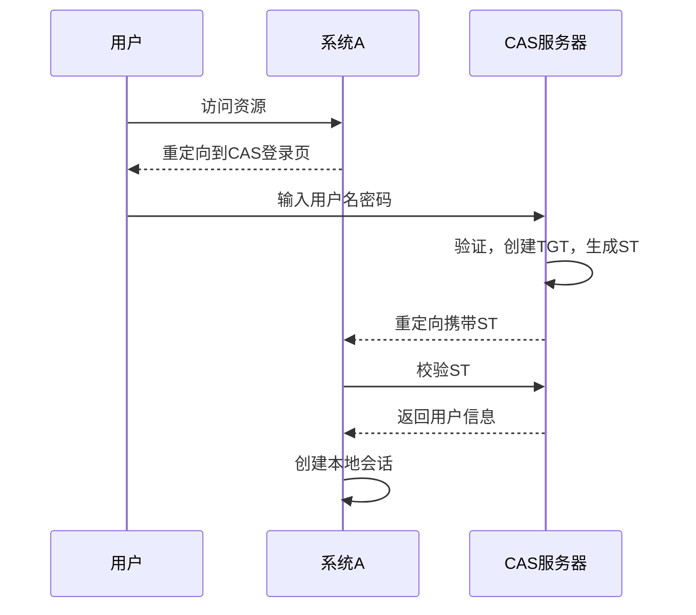

### 6-19 阶段复习

#### 核心回顾（来自3-12图文节）
- 分布式会话：基于Cookie+Redis，相同顶级域名下Cookie共享。
- 拦截器：从Redis获取用户信息而非HttpSession。
- 单点登录：CAS流程，全局门票与临时票据。

### 6-20 作业练习
1. 实现分布式会话
2. 编写拦截器
3. 实现单点登录

### 6-21 【加餐】分布式系统中的CAP理论

#### 核心论点
CAP：一致性(Consistency)、可用性(Availability)、分区容错性(Partition Tolerance)三者不可兼得。

| 组合 | 说明 |
|------|------|
| CP | 强一致性，牺牲可用性（如Redis集群故障转移时短暂不可用） |
| AP | 高可用，最终一致性（多数互联网业务选择） |
| CA | 无分区容忍，单体系统 |

> “对于CAP来讲，只能满足其中两者，要么AP，要么CP，要么CA。” (3-14)

#### BASE理论
- Basically Available：基本可用
- Soft-state：软状态
- Eventually Consistent：最终一致性

互联网系统一般选择AP，通过最终一致性来平衡。

---

## 附录：Redis面试题与作业练习

### 面试题列表（来自1-10和1-8）
1. 什么是Redis？
2. Redis的数据类型？
3. Redis相比Memcached有哪些优势？
4. Redis为什么是单线程却很快？
5. Redis持久化机制RDB和AOF的区别与优缺点？
6. Redis过期键删除策略？
7. Redis内存淘汰策略有哪些？
8. 如何预防缓存穿透与雪崩？
9. Redis主从复制的原理？
10. 哨兵模式的工作原理？
11. Redis集群如何分片？槽是什么？
12. 如何使用Redis实现分布式锁？
13. 什么是缓存穿透、雪崩、击穿？如何解决？

### 阶段作业练习（来自1-7和1-9）
1. 搭建配置Redis
2. 整合Redis到SpringBoot，优化轮播图与分类查询
3. 完善分布式购物车（登录前后同步）
4. 测试RDB与AOF持久化，模拟数据恢复
5. 搭建主从复制与哨兵模式，测试故障转移
6. 搭建三主三从Redis集群，整合SpringBoot，观察槽位分配

---

*以上为《Java架构师成长直通车》Redis分布式缓存与高可用篇的完整结构化总结。所有内容均基于原始图文节、PDF及截图整理，未添加书中不存在的信息。*


# 《Java架构师成长直通车》课程知识档案（分布式搜索引擎与分布式文件存储篇）

## 书籍信息
- 书名：Java架构师体系课：跟随千万级项目从0到100全过程高效成长 / 《Java架构师成长直通车》
- 作者：慕课网与多位业内资深大咖老师（风间影月等）
- PDF 状态：图文节PDF、截图及目录文件
- OCR 状态：良好，少量格式错乱已修正

## 目录说明
- 本部分包含两大模块：
  - **分布式搜索引擎 Elasticsearch**（依据《10.分布式搜索引擎-ES-慕课网就业班.pdf》目录）
  - **分布式文件系统 FastDFS + 阿里云OSS**（依据《11.分布式文件系统-FastDFS+OSS-慕课网就业班.pdf》目录）
- 各图文节（附）内容已嵌入对应章节作为补充。

## 全书核心主题
本阶段解决分布式架构下的两大核心问题：**海量数据搜索**与**海量文件存储**。Elasticsearch部分从Lucene/Solr对比讲起，涵盖核心术语、倒排索引、安装配置、DSL搜索、分词器、集群原理、SpringBoot整合及Logstash数据同步，最终落地电商商品搜索。分布式文件系统部分讲解FastDFS架构原理、tracker/storage搭建、Nginx整合，以及阿里云OSS云存储的接入。目标是掌握分布式环境下全文检索与文件存储的解决方案，理解分片、副本、脑裂等集群概念，并能实际整合到项目中。

---

## 第一部分：分布式搜索引擎 Elasticsearch

### 第1章 Elasticsearch急速入门

#### 1-1 本章概述
> 说明：略。

#### 1-2 大家学习中有疑问该怎么办
> 说明：同前文，此处省略。

#### 1-3 分布式搜索引擎：Lucene VS Solr VS Elasticsearch

##### 核心论点
全文检索技术选型：Elasticsearch基于Lucene，提供分布式、RESTful API，是目前最流行的方案，优于Solr。

##### 关键概念
- **Lucene**：Java全文检索库，需要编程使用。
- **Solr**：基于Lucene的搜索服务器，适合传统搜索应用，实时性稍弱。
- **Elasticsearch**：实时分布式搜索分析引擎，社区活跃，易于扩展。

#### 1-4 Elasticsearch核心术语

##### 核心论点
ES的核心概念与关系型数据库类比：索引（Index）→ 表，文档（Document）→ 行，字段（Fields）→ 列。

##### 关键概念
| ES术语 | 类比RDBMS |
|--------|-----------|
| 索引（Index） | 数据库表 |
| 文档（Document） | 行（记录） |
| 字段（Fields） | 列 |
| 分片（Shard） | 水平切分 |
| 副本（Replica） | 备份 |

- **分片（shard）**：将索引拆分为多份，分布在不同节点，实现水平扩展。
- **备份（replica）**：每个主分片的副本，提供高可用和读并发。

> “分片（shard）：把索引库拆分为多份，分别放在不同的节点上。水平扩展，提高吞吐量。” (1-4 附)

#### 1-5 附：Elasticsearch核心术语
> 说明：内容同上。

#### 1-6 Elasticsearch集群架构原理

##### 核心论点
ES集群通过主分片和副本分片实现数据分布式存储与高可用，同一分片的主副不会在同一节点。

#### 1-7 什么是倒排索引

##### 核心论点
倒排索引是搜索引擎的核心：从文档内容中提取单词（词条），记录词条到文档ID的映射，实现快速全文检索。

##### 逻辑推演
正向索引（文档→单词）查询慢；倒排索引（单词→文档）通过分词后构建词条字典，查询时直接定位文档，效率极高。

#### 1-8 安装Elasticsearch

##### 安装步骤（Linux）
1. 解压ES压缩包
2. 目录结构：bin、config、jdk、lib、logs、modules、plugins、data（需手动创建）
3. 修改`elasticsearch.yml`：集群名称、节点名称、数据/日志路径
4. 由于ES不能以root用户运行，需创建esuser并授权
5. 启动：`su esuser; ./bin/elasticsearch`

#### 1-9 附：安装Elasticsearch
> 说明：同上，含截图。

#### 1-10 安装es-header插件

##### 核心论点
head插件是ES的可视化工具，便于管理索引和数据。

##### 安装方式
- 使用Chrome插件（推荐）
- 或通过npm安装独立服务

#### 1-11 安装es-header插件-2
> 说明：略。

---

### 第2章 Elasticsearch进阶提升

#### 2-1 head与postman基于索引的基本操作

##### 核心操作
- 创建索引：`PUT /index_test`
- 查看索引：`GET _cat/indices?v`
- 删除索引：`DELETE /index_test`

#### 2-2 附：索引的一些操作
> 说明：同上，并包含集群健康检查：`GET /_cluster/health`

#### 2-3 mappings自定义创建映射

##### 核心论点
mappings定义字段类型（type）及是否索引（index）。

##### 示例
```json
PUT /index_str
{
  "mappings": {
    "properties": {
      "realname": { "type": "text", "index": true },
      "username": { "type": "keyword", "index": false }
    }
  }
}
```
- `index: false`的字段不可查询。

#### 2-4 附：索引的mappings映射
> 说明：同上。

#### 2-5 mappings新增数据类型与analyze
> 说明：略。

#### 2-6 文档的基本操作 - 添加文档与自动映射

##### 核心操作
```json
POST /my_doc/_doc/1
{
  "id": 1001,
  "name": "imoo-1",
  "desc": "imoo is very good, 慕课网非常牛！"
}
```
- 若不指定mappings，ES会动态映射（自动判断类型）。

#### 2-7 附：文档的基本操作 - 添加
> 说明：同上。

#### 2-8 文档的基本操作 - 删除与修改

##### 核心操作
- 删除：`DELETE /my_doc/_doc/1`
- 局部更新：`POST /my_doc/_doc/1/_update { "doc": { "name": "慕课" } }`
- 全量替换：`PUT /my_doc/_doc/1 { ... }`

> 注：删除不是立即物理删除，而是标记，后续合并时清理。

#### 2-9 附：文档的基本操作 - 删除与修改
> 说明：同上。

#### 2-10 文档的基本操作 - 查询

##### 核心操作
- 查询单个：`GET /index_demo/_doc/1`
- 查询所有：`GET /index_demo/_doc/_search`
- 定制返回字段：`?_source=id,name`

##### 元数据
- `_index`：所属索引
- `_type`：文档类型
- `_id`：唯一标识
- `_score`：相关度分数
- `_version`：版本号（乐观锁）
- `_source`：原始数据

#### 2-11 附：文档的基本操作 - 查询
> 说明：同上。

#### 2-12 文档乐观锁控制 if_seq_no与if_primary_term

##### 核心论点
ES使用`_seq_no`（文档版本号）和`_primary_term`（分片所在位置）实现乐观锁控制，避免并发更新冲突。

##### 操作示例
```json
POST /my_doc/_doc/1/_update?if_seq_no=5&if_primary_term=1
{
  "doc": { "name": "慕课1" }
}
```
- 只有seq_no和primary_term匹配时才会更新。

#### 2-13 附：文档乐观锁控制 if_seq_no与if_primary_term
> 说明：同上。

#### 2-14 分词与内置分词器

##### 核心论点
分词（analysis）将文本转换为词条。ES默认对英文支持好，中文需额外插件。

##### 内置分词器
| 分词器 | 说明 |
|--------|------|
| standard | 默认，单词拆分，转小写 |
| simple | 按非字母分词，转小写 |
| whitespace | 按空格分词 |
| stop | 去除无意义词（a, an, the） |
| keyword | 不分词，整体作为关键词 |

#### 2-15 附：分词与内置分词器
> 说明：同上。

#### 2-16 建立IK中文分词器

##### 核心论点
IK分词器支持中文智能分词，分为`ik_max_word`（最细粒度）和`ik_smart`（粗粒度）。

##### 安装
1. 下载对应版本zip
2. 解压到`plugins/ik`目录
3. 重启ES

#### 2-17 附：建立IK中文分词器
> 说明：同上。

#### 2-18 自定义中文词库

##### 核心步骤
1. 在`plugins/ik/config`下创建`custom.dic`
2. 添加自定义词，如“慕课网”
3. 修改`IKAnalyzer.cfg.xml`，配置`<entry key="ext_dict">custom.dic</entry>`
4. 重启ES

#### 2-19 附：自定义中文词库
> 说明：同上。

---

### 第3章 DSL搜索详解

#### 3-1 DSL搜索 - 数据准备

##### 核心操作
构建索引`shop`，定义mappings（使用ik分词），插入测试文档。

#### 3-2 附：DSL搜索-数据准备
> 说明：同上。

#### 3-3 DSL搜索 - 入门语法

##### 核心论点
DSL（Domain Specific Language）是基于JSON的查询语言，比QueryString更灵活。

##### QueryString示例
```
GET /shop/_doc/_search?q=desc:慕课网
```

##### DSL示例
```json
POST /shop/_doc/_search
{
  "query": { "match": { "desc": "慕课网" } }
}
```

#### 3-4 附：DSL搜索-入门语法
> 说明：同上，并包含exists查询。

#### 3-5 DSL搜索 - 查询所有与分页

##### 核心操作
```json
{
  "query": { "match_all": {} },
  "from": 0,
  "size": 10,
  "_source": ["id", "nickname"]
}
```

#### 3-6 附：DSL搜索-查询所有与分页
> 说明：同上。

#### 3-7 DSL搜索 - term与match

##### 核心区别
- `term`：精确匹配，搜索词不分词。
- `match`：全文检索，搜索词会分词。

```json
{ "term": { "desc": "慕课网" } }   // 整个“慕课网”作为词
{ "match": { "desc": "慕课网" } } // 分“慕课”、“网”等
```

#### 3-8 附：DSL搜索-term/match
> 说明：同上。

#### 3-9 DSL搜索 - match_phrase

##### 核心论点
`match_phrase`要求分词后顺序相同且连续，可通过`slop`允许间隔。

```json
{
  "match_phrase": {
    "desc": { "query": "大学毕业研究生", "slop": 2 }
  }
}
```

#### 3-10 附：DSL搜索-match_phrase
> 说明：同上。

#### 3-11 DSL搜索 - match（operator）与ids

##### 核心参数
- `operator`: `or`（默认）或`and`
- `minimum_should_match`: 最低匹配百分比或个数

```json
{
  "match": {
    "desc": {
      "query": "女友生日送我好玩的xbox游戏机",
      "minimum_should_match": "60%"
    }
  }
}
```
- `ids`查询：根据文档主键检索。

#### 3-12 附：DSL搜索-match（operator）/ids
> 说明：同上。

#### 3-13 DSL搜索 - multi_match与boost

##### 核心用法
- `multi_match`：在多个字段中搜索
- `boost`：提升某字段权重

```json
{
  "multi_match": {
    "query": "皮特帕克慕课网",
    "fields": ["desc", "nickname^10"]   // nickname权重提升10倍
  }
}
```

#### 3-14 附：DSL搜索-multi_match/boost
> 说明：同上。

#### 3-15 DSL搜索 - 布尔查询

##### 核心组合
- `must`：必须匹配（AND）
- `should`：至少满足一个（OR）
- `must_not`：必须不匹配（NOT）

```json
{
  "bool": {
    "must": [
      { "multi_match": { "query": "慕课网", "fields": ["desc","nickname"] } },
      { "term": { "sex": 1 } }
    ]
  }
}
```

#### 3-16 附：DSL搜索-布尔查询
> 说明：同上。

#### 3-17 DSL搜索 - 过滤器

##### 核心论点
`post_filter`用于查询后对结果进行过滤，不计算相关性分数，性能更高。

```json
{
  "query": { "match": { "desc": "慕课网游戏" } },
  "post_filter": {
    "range": { "money": { "gt": 60, "lt": 1000 } }
  }
}
```

#### 3-18 附：DSL搜索-过滤器
> 说明：同上。

#### 3-19 DSL搜索 - 排序

##### 核心操作
```json
{
  "sort": [
    { "age": "desc" },
    { "money": "desc" }
  ]
}
```
- 对text字段排序需使用其keyword子字段。

#### 3-20 附：DSL搜索-排序
> 说明：同上。

#### 3-21 DSL搜索 - 高亮highlight

##### 核心操作
```json
{
  "highlight": {
    "pre_tags": ["<tag>"],
    "post_tags": ["</tag>"],
    "fields": { "desc": {} }
  }
}
```

#### 3-22 附：DSL搜索-高亮highlight
> 说明：同上。

#### 3-23 附：课外拓展 - prefix / fuzzy / wildcard

##### 核心概念
- `prefix`：前缀查询
- `fuzzy`：模糊纠正查询（处理用户拼写错误）
- `wildcard`：通配符查询（`?`单字符，`*`多字符）

---

### 第4章 Elasticsearch深度分页与批量操作

#### 4-1 深度分页

##### 核心论点
深度分页（如from=10000）会导致每个分片获取大量数据再聚合，消耗内存和CPU。ES默认限制最大结果窗口为10000。

#### 4-2 附：深度分页
> 说明：同上。企业解决方案：限制分页深度（如最多100页）。

#### 4-3 深度分页 - 提升搜索量

##### 修改设置突破限制
```json
PUT /shop/_settings
{ "index.max_result_window": "20000" }
```

#### 4-4 附：深度分页 - 提升搜索量
> 说明：同上。

#### 4-5 scroll 滚动搜索

##### 核心论点
scroll适用于一次性大量数据导出（非实时用户交互）。基于快照，保持上下文时间。

```json
POST /shop/_search?scroll=1m
{ "query": { "match_all": {} }, "size": 5, "sort": ["_doc"] }

# 后续请求
POST /_search/scroll
{ "scroll": "1m", "scroll_id": "xxx" }
```

#### 4-6 附：scroll滚动搜索
> 说明：同上。

#### 4-7 批量查询_mget

##### 示例
```json
GET /_mget
{
  "docs": [
    { "_index": "my_doc", "_id": 1 },
    { "_index": "my_doc", "_id": 2 }
  ]
}
```

#### 4-8 ~ 4-10 批量操作bulk

##### 核心格式
每行格式：`{action: {metadata}}\n{request body}\n`
- `create`：不存在则创建
- `index`：创建或替换
- `update`：部分更新
- `delete`：删除（无body）

```json
POST /_bulk
{"create": {"_index": "shop2", "_id": "2001"}}
{"id": "2001", "nickname": "name2001"}
{"delete": {"_index": "shop2", "_id": "2001"}}
```

#### 4-11 附：批量操作bulk
> 说明：同上。

---

### 第5章 Elasticsearch集群

#### 5-1 Elasticsearch集群的概念

##### 核心论点
集群实现高可用和水平扩展。分片机制：每个索引可切分多个主分片，每个主分片可有副本。

#### 5-2 附：Elasticsearch集群的概念
> 说明：同上。

#### 5-3 搭建Elasticsearch集群

##### 配置要点（elasticsearch.yml）
```yaml
cluster.name: imooc-es-cluster
node.name: es-node1
node.master: true
node.data: true
discovery.seed_hosts: ["192.168.1.184", "192.168.1.185", "192.168.1.186"]
cluster.initial_master_nodes: ["es-node1"]
```
- 清除data目录（防止旧数据干扰）
- 分别启动各节点

#### 5-4 附：搭建Elasticsearch集群
> 说明：同上。

#### 5-5 Elasticsearch集群分片测试
> 说明：略。

#### 5-6 Elasticsearch集群节点宕机测试
> 说明：略。

#### 5-7 Elasticsearch集群脑裂现象探讨

##### 核心论点
脑裂（split-brain）：网络故障导致集群分裂为多个部分，各自选举master。解决方案：设置`discovery.zen.minimum_master_nodes = (N/2)+1`（ES 6.x及以前）。ES 7.x自动处理。

#### 5-8 附：Elasticsearch集群脑裂现象探讨
> 说明：同上。

#### 5-9 Elasticsearch集群的文档读写原理
> 说明：略。

---

### 第6章 Elasticsearch整合SpringBoot

#### 6-1 Elasticsearch整合SpringBoot - 配置文件

##### 依赖与配置
```xml
<dependency>
    <groupId>org.springframework.boot</groupId>
    <artifactId>spring-boot-starter-data-elasticsearch</artifactId>
    <version>2.2.2.RELEASE</version>
</dependency>
```

```yaml
spring:
  data:
    elasticsearch:
      cluster-name: es6
      cluster-nodes: 192.168.1.187:9300
```

##### 解决Netty冲突
```java
@Configuration
public class ESConfig {
    @PostConstruct
    void init() {
        System.setProperty("es.set.netty.runtime.available.processors", "false");
    }
}
```

#### 6-2 附：Elasticsearch整合SpringBoot-配置文件
> 说明：同上，并提示版本对齐（ES 6.4.3 + SpringBoot 2.2.2）。

#### 6-3 ~ 6-9 索引、文档操作、分页、高亮、排序
> 说明：通过`ElasticsearchTemplate`或`ElasticsearchRestTemplate`实现CRUD、分页搜索、高亮显示、排序等。

---

### 第7章 Logstash数据同步

#### 7-1 Logstash数据同步 - Logstash介绍

##### 核心论点
Logstash是ELK中的数据处理管道，可通过`logstash-input-jdbc`插件将数据库数据同步到ES。

##### 同步方式
- 基于自增id：记录最大id，增量同步
- 基于更新时间：记录最后同步时间，增量同步（可感知修改）

#### 7-2 附：Logstash数据同步-Logstash介绍
> 说明：同上。

#### 7-3 Logstash数据同步 - 数据同步配置

##### 配置文件示例（logstash-db-sync.conf）
```
input {
  jdbc {
    jdbc_driver_library => "/path/mysql-connector-java.jar"
    jdbc_driver_class => "com.mysql.jdbc.Driver"
    jdbc_connection_string => "jdbc:mysql://localhost:3306/db"
    jdbc_user => "root"
    jdbc_password => "pass"
    statement => "SELECT * FROM items WHERE id > :sql_last_value"
    use_column_value => true
    tracking_column => "id"
    schedule => "* * * * *"
  }
}
output {
  elasticsearch {
    hosts => ["localhost:9200"]
    index => "foodie-items"
  }
}
```

#### 7-4 附：logstash数据同步-数据同步配置
> 说明：同上。

#### 7-5 ~ 7-6 测试数据同步与自定义模板
> 说明：略。

#### 7-7 附：Logstash数据同步-自定义模板配置中文分词

##### 核心操作
- 查看默认模板：`GET /_template/logstash`
- 修改模板，设置`"analyzer": "ik_max_word"`，并绑定到索引模式（`index_patterns`）

---

### 第8章 Elasticsearch整合电商项目

#### 8-1 ~ 8-6 实现商品分页搜索、高亮、排序及前后端联调
> 说明：基于SpringBoot+ES完成商品搜索功能。

#### 8-7 阶段复习

##### 核心回顾
- ES对比Lucene/Solr，倒排索引原理
- 核心概念：索引、文档、分片、副本
- 安装与head插件
- 映射与文档CRUD、乐观锁
- 分词器（IK中文、自定义词库）
- DSL搜索：term/match/multi_match/boost/bool/sort/highlight
- 深度分页与scroll滚动搜索
- 批量操作_mget/bulk
- 集群搭建与脑裂问题
- SpringBoot整合
- Logstash数据同步

> “es默认只对英文语句做分词，中文不支持，每个中文字都会被拆分为独立的个体。” (2-15)

#### 8-8 作业练习
1. 搭建单机ES与集群ES，安装head插件，观察分片分配
2. 使用Postman进行文档CRUD
3. 安装IK分词器，建立自定义词库
4. DSL搜索练习
5. 批量操作_mget与bulk
6. SpringBoot整合ES，使用ElasticsearchTemplate
7. 实现商品检索（分页、高亮、排序）

---

## 第二部分：分布式文件系统 FastDFS + 阿里云OSS

### 第1章 FastDFS核心概念与架构原理解析

#### 1-1 本章概述
> 说明：略。

#### 1-2 附：分布式文件系统

##### 核心论点
分布式文件系统解决传统单体文件存储的扩容难、管理难、无冗余备份问题。

##### 关键概念
- **分布式文件系统**：通过网络在多台节点上分享文件，对用户透明。
- **优势**：冗余备份、高容错、可扩展性强、负载均衡。
- **FastDFS vs HDFS**：
  - HDFS：适合超大文件、并行计算场景（分块存储）。
  - FastDFS：适合互联网网站中小文件（头像、音视频），支持负载均衡和动态扩容。

> “使用分布式文件系统可以解决：1.海量文件数据存储；2.文件数据高可用（余备份）；3.读写性能和负载均衡。” (1-2)

#### 1-3 FastDFS概念梳理

##### 核心架构
FastDFS由**跟踪器（Tracker）**和**存储节点（Storage）**组成。
- **Tracker**：调度中心，负载均衡，记录Storage状态。
- **Storage**：实际存储文件，管理metadata（元数据）。
- **Group（卷）**：Storage分组，同组内冗余备份，不同组扩容。

##### 文件标识
`卷名/文件名`，二者缺一不可。

#### 1-4 附：FastDFS概念梳理
> 说明：同上。

#### 1-5 FastDFS架构原理与上传下载流程解析

##### 上传流程
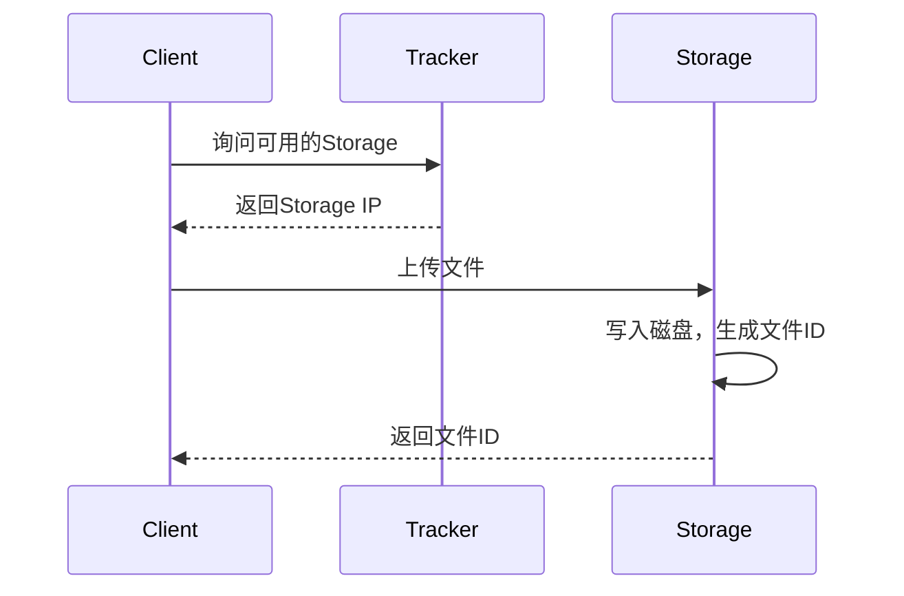
- 下载时，Client根据文件ID解析出卷名，询问Tracker该卷的Storage，然后访问Storage下载。

---

### 第2章 FastDFS配置

#### 2-1 配置FastDFS环境准备工作

##### 环境准备
- 两台CentOS7（一台tracker，一台storage）
- 安装包：libfastcommon、FastDFS、fastdfs-nginx-module、nginx

##### 安装步骤（tracker和storage都要执行）
1. 安装依赖：`yum install -y gcc gcc-c++ libevent`
2. 编译安装libfastcommon
3. 编译安装FastDFS（执行`./make.sh && ./make.sh install`）

#### 2-2 附：配置FastDFS环境准备工作
> 说明：同上。

#### 2-3 配置tracker服务

##### 配置tracker.conf
```ini
base_path = /usr/local/fastdfs/tracker
```
- 创建工作目录：`mkdir -p /usr/local/fastdfs/tracker`
- 启动：`/usr/bin/fdfs_trackerd /etc/fdfs/tracker.conf`

#### 2-4 附：配置tracker服务
> 说明：同上。

#### 2-5 配置storage服务

##### 配置storage.conf
```ini
group_name = group1
base_path = /usr/local/fastdfs/storage
store_path0 = /usr/local/fastdfs/storage
tracker_server = tracker节点IP:22122
```
- 启动：`/usr/bin/fdfs_storaged /etc/fdfs/storage.conf`

#### 2-6 附：配置storage服务
> 说明：同上。

#### 2-7 配置Nginx+FastDFS实现文件服务器

##### 核心步骤
1. 解压fastdfs-nginx-module
2. 复制`mod_fastdfs.conf`到`/etc/fdfs/`
3. 修改模块配置中的路径（去掉local）
4. 重新编译nginx，添加模块：`./configure --add-module=/path/to/fastdfs-nginx-module/src`
5. 配置nginx location：
```nginx
location ~ /group[0-9]/ {
    ngx_fastdfs_module;
}
```
6. 修改`mod_fastdfs.conf`：`url_have_group_name = true`、`store_path0`等

#### 2-8 附：配置nginx fastdfs实现文件服务器
> 说明：同上。

---

### 第3章 FastDFS整合SpringBoot

#### 3-1 ~ 3-3 整合实现头像上传

##### 核心依赖
```xml
<dependency>
    <groupId>com.github.tobato</groupId>
    <artifactId>fastdfs-client</artifactId>
    <version>1.26.7</version>
</dependency>
```

##### 配置application.yml
```yaml
fdfs:
  connect-timeout: 600
  so-timeout: 1500
  tracker-list: 192.168.1.153:22122
```

##### 上传示例
```java
@Autowired
private FastFileStorageClient storageClient;

StorePath storePath = storageClient.uploadFile(
    inputStream, fileSize, "jpg", null);
String fullPath = storePath.getFullPath(); // group1/xxx.jpg
```

---

### 第4章 第三方云存储解决方案 - OSS

#### 4-1 第三方云存储解决方案

##### 核心论点
云存储（阿里OSS、腾讯COS、七牛云）提供高可用、CDN加速、弹性扩容，降低运维成本，适合生产环境。

#### 4-2 阿里OSS简介
> 说明：对象存储服务，支持海量文件，提供REST API。

#### 4-3 OSS的基本配置

##### 步骤
1. 开通OSS，创建Bucket
2. 获取AccessKeyId和AccessKeySecret
3. 配置Endpoint

#### 4-4 OSS实现图片上传

##### 依赖
```xml
<dependency>
    <groupId>com.aliyun.oss</groupId>
    <artifactId>aliyun-sdk-oss</artifactId>
    <version>3.10.2</version>
</dependency>
```

##### 上传示例
```java
OSS ossClient = new OSSClientBuilder().build(endpoint, accessKeyId, accessKeySecret);
ossClient.putObject(bucketName, objectName, inputStream);
ossClient.shutdown();
```

#### 4-5 阶段复习

##### 核心回顾
- 分布式文件系统解决的问题
- FastDFS架构（Tracker + Storage）
- FastDFS安装、配置、与Nginx整合
- SpringBoot整合FastDFS（头像上传）
- 阿里OSS的优势（CDN、可视化管理、低成本运维）

#### 4-6 作业练习
1. 搭建FastDFS，通过client测试上传
2. 配置Nginx+FastDFS模块，实现图片浏览器访问
3. SpringBoot整合FastDFS替换原有头像上传
4. 练习阿里云OSS，整合项目实现文件上传

---

*以上为《Java架构师成长直通车》分布式搜索引擎与分布式文件存储篇的完整结构化总结。所有内容均基于原始图文节、PDF及截图整理，未添加书中不存在的信息。*


# 《Java架构师成长直通车》课程知识档案（分布式消息队列、分布式锁、分库分表篇）

## 书籍信息
- 书名：Java架构师体系课：跟随千万级项目从0到100全过程高效成长 / 《Java架构师成长直通车》
- 作者：慕课网与多位业内资深大咖老师（风间影月、阿神等）
- PDF 状态：图文节PDF、Word文档、截图及目录文件
- OCR 状态：良好，部分图片仅作说明

## 目录说明
- 本部分涵盖课程中的多个核心模块：分布式消息队列（RabbitMQ、Kafka、ActiveMQ）、分布式锁、数据库读写分离与分库分表（MyCat、Sharding-JDBC）。
- 依据《12.分布式消息队列-RabbitMQ-慕课网就业班.pdf》《13.分布式消息队列-Kafka-慕课网就业班.pdf》《14.分布式锁-慕课网就业班.pdf》《15.读写分离、分库分表-慕课网就业班.pdf》及配套图文节整理。

## 全书核心主题
本阶段解决分布式架构下的三大关键问题：**异步解耦与削峰填谷（消息中间件）**、**共享资源的并发控制（分布式锁）**、**海量数据的存储与访问瓶颈（读写分离与分库分表）**。消息队列部分对比ActiveMQ、RabbitMQ、RocketMQ、Kafka，详解RabbitMQ核心API、高级特性（确认、返回、ACK、TTL、死信队列）、镜像队列集群，以及Kafka的架构、ISR、零拷贝、与SpringBoot整合及ELK日志收集实战。分布式锁部分从单体锁局限出发，讲解基于数据库、Redis、ZooKeeper、Curator、Redisson的分布式锁实现。分库分表部分讲解垂直切分与水平切分、读写分离架构、MyCat与Sharding-JDBC的使用及分片规则。

---

## 第一部分：分布式消息队列

### 第1章 分布式消息队列认知提升

#### 1-1 学习指南
> 说明：略。

#### 1-2 大家学习中有疑问该怎么办
> 说明：同前文，此处省略。

#### 1-3 MQ的应用场景与MQ性能衡量指标

##### 核心论点
MQ主要解决应用解耦、异步处理、流量削峰、日志处理等场景。性能衡量指标包括吞吐量、延迟、消息堆积能力、可靠性、可用性等。

##### 关键概念
- **解耦**：系统之间通过MQ间接通信，降低依赖性。
- **削峰填谷**：将突发大流量暂存于MQ，下游按能力消费。
- **异步处理**：非关键流程异步执行，提升响应速度。

#### 1-4 MQ的技术选型关注点

##### 核心论点
选型需关注：持久化能力、高可用集群、消息可靠性、吞吐量、生态成熟度、社区活跃度、编程语言兼容性等。

#### 1-5 ActiveMQ集群架构与原理解析

##### 核心论点
ActiveMQ基于JMS规范，支持点对点（PTP）和发布订阅（Pub/Sub）两种消息模型。适合中小型企业，功能丰富但高并发场景下性能较Kafka、RocketMQ弱。

##### 关键概念
- **JMS**：Java消息服务规范，定义接口，由Provider实现。
- **PTP（点对点）**：消息生产者发送到队列，一个消费者接收。
- **Pub/Sub（发布订阅）**：消息生产者发送到主题，所有订阅者接收。
- **消息格式**：StreamMessage、MapMessage、TextMessage、BytesMessage、ObjectMessage。

#### 1-6 RabbitMQ集群架构模型与原理解析
> 说明：内容详见第二部分“RabbitMQ进阶与实战”。

#### 1-7 RocketMQ集群架构与原理解析

##### 核心论点
RocketMQ是阿里开源的分布式消息中间件，经过双十一考验，支持亿级消息堆积，采用NameServer代替Zookeeper，底层基于Netty NIO，顺序写盘、零拷贝，性能高。

##### 关键概念
- **Producer/Consumer**：生产者/消费者。
- **PushConsumer/PullConsumer**：推送/拉取模式。
- **ProducerGroup/ConsumerGroup**：生产/消费组。
- **Broker**：消息中转服务，负责存储与转发。
- **NameServer**：轻量级服务发现与路由。

> “采用零拷贝的原理、顺序写盘、随机读（索引文件）。” (1-6)

#### 1-8 Kafka介绍与高性能原因分析

##### 核心论点
Kafka是分布式发布-订阅消息系统，高吞吐、持久化、分布式、支持online和offline场景。高性能得益于：直接使用Linux文件系统cache、顺序写入磁盘、零拷贝（sendfile）、批量发送与消费。

##### 关键数据
- 每秒生产约25万消息（50MB），每秒处理55万消息（110MB）。

##### 流程图：零拷贝与传统拷贝对比
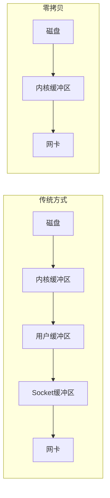

#### 1-9 Kafka高性能核心pageCache与zeroCopy原理解析
> 说明：同1-8。

#### 1-10 Kafka集群模型讲解
> 说明：Kafka集群由多个Broker组成，依赖Zookeeper管理元数据，每个Topic分为多个Partition分布在Broker上。

#### 1-11 本章总结
> 说明：略。

---

### 第2章 RabbitMQ进阶与实战

#### 2-1 RabbitMQ学习指南
> 说明：略。

#### 2-2 初识RabbitMQ核心概念（附：RabbitMQ核心概念）

##### 核心论点
RabbitMQ基于AMQP协议，使用Erlang编写，提供可靠消息投递、灵活路由、集群模式丰富。

##### 关键概念（AMQP）
- **Server/Broker**：接受客户端连接，实现AMQP服务。
- **Connection**：应用与Broker的网络连接。
- **Channel**：多路复用连接中的虚拟信道，大部分操作在Channel中完成。
- **Message**：由Properties（如优先级）和Body（消息体）组成。
- **Virtual Host**：逻辑隔离，包含Exchange、Queue等。
- **Exchange**：接收消息，根据Routing Key路由到绑定的Queue。
- **Binding**：Exchange与Queue之间的绑定，可含Routing Key。
- **Routing Key**：路由规则。

> “RabbitMQ是一个开源的消息代理和队列服务器，使用Erlang语言编写，支持AMQP协议。”

#### 2-3 RabbitMQ环境搭建与控制台详解

##### 安装步骤（基于CentOS7）
```bash
yum install build-essential openssl openssl-devel unixODBC unixODBC-devel make gcc gcc-c++ kernel-devel
# 下载erlang、socat、rabbitmq-server rpm包
rpm -ivh erlang-18.3-1.el7.centos.x86_64.rpm
rpm -ivh socat-1.7.3.2-5.el7.lux.x86_64.rpm
rpm -ivh rabbitmq-server-3.6.5-1.noarch.rpm
# 修改rabbit.app中loopback_users保留guest，heartbeat设为10
rabbitmq-plugins enable rabbitmq_management
# 启动服务
/etc/init.d/rabbitmq-server start
```
访问 `http://ip:15672`，默认用户名密码guest。

#### 2-4 RabbitMQ急速入门HelloWorld

##### 生产者示例
```java
ConnectionFactory factory = new ConnectionFactory();
factory.setHost("192.168.11.76");
Connection conn = factory.newConnection();
Channel channel = conn.createChannel();
channel.queueDeclare("test_queue", false, false, false, null);
channel.basicPublish("", "test_queue", null, "hello".getBytes());
```

##### 消费者示例
```java
QueueingConsumer consumer = new QueueingConsumer(channel);
channel.basicConsume("test_queue", true, consumer);
Delivery delivery = consumer.nextDelivery();
String msg = new String(delivery.getBody());
```

#### 2-5 RabbitMQ核心API - Exchange类型

| Exchange类型 | 说明 |
|-------------|------|
| Direct | 根据Routing Key精确匹配Queue |
| Topic | 支持通配符匹配（`*`一个词，`#`零个或多个词） |
| Fanout | 广播到所有绑定的Queue |
| Headers | 根据消息头匹配（较少用） |

#### 2-6 RabbitMQ高级特性

##### Confirm确认机制
- 开启：`channel.confirmSelect()`
- 添加监听：`addConfirmListener`，异步监听成功/失败

##### Return机制
- 消息无法路由时返回给生产者

##### 消费端限流（流控）
- 设置`basicQos(prefetchCount)`，控制未确认消息数

##### ACK与重回队列
- 手动ACK：`channel.basicAck(deliveryTag, false)`
- 重回队列：`channel.basicNack(deliveryTag, false, true)`

##### TTL与死信队列
- TTL：消息过期时间或队列过期时间
- 死信队列：消息过期、队列满、被拒绝且不重回队列时进入DLX

#### 2-7 RabbitMQ镜像队列集群搭建

##### 集群规划
| IP | 端口（客户端/管控） | 节点角色 |
|----|---------------------|----------|
| 192.168.11.76 | 5672 / 15672 | master |
| 192.168.11.77 | 5672 / 15672 | slave |
| 192.168.11.78 | 5672 / 15672 | slave |

##### 集群构建要点
- 各节点hostname解析配置
- 同步cookie（`.erlang.cookie`）
- 加入集群：`rabbitmqctl stop_app` → `rabbitmqctl join_cluster rabbit@node1` → `start_app`
- 设置镜像队列策略：
  ```bash
  rabbitmqctl set_policy ha-all "^" '{"ha-mode":"all"}'
  ```
##### 高可用扩展
- 使用HAProxy做四层负载均衡
- Keepalived实现HAProxy高可用

#### 2-8 RabbitMQ与SpringBoot整合
> 说明：配置`ConnectionFactory`，使用`RabbitTemplate`发送消息，`@RabbitListener`消费。

#### 2-9 RabbitMQ基础组件封装实战（可靠性投递）

##### 核心设计
- 消息发送前落库（状态：待确认）
- 生产端Confirm回调更新状态
- 定时任务扫描长时间未确认消息，重新发送或告警

##### 流程图：可靠性消息投递
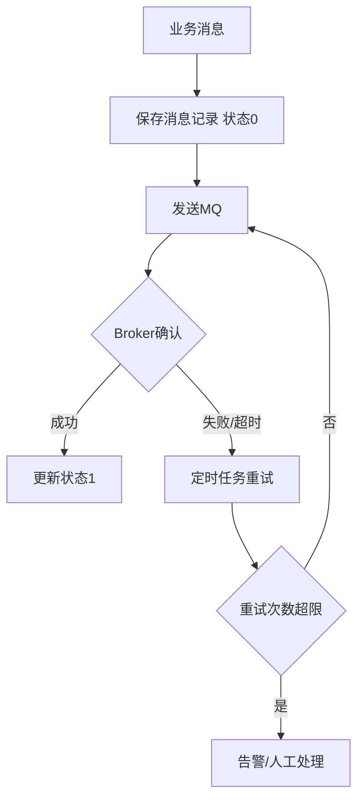

#### 2-10 总结与复习
> 说明：略。

#### 2-11 本周作业练习
1. 将`@ComponentScan`方式改为`@Bean`注入方式，实现SpringBoot Starter风格。
2. 实现带回调的`send`方法。
3. 实现将带有`@ElasticJobConfig`注解的类动态注册到Spring容器（不依赖`@Component`）。

---

### 第3章 Kafka进阶提升与SpringBoot整合

#### 3-1 Kafka急速入门（环境搭建、命令、生产者/消费者编码）

##### 环境安装
- 依赖Zookeeper集群
- 修改`server.properties`：`broker.id`、`port`、`host.name`、`log.dirs`、`zookeeper.connect`
- 启动：`bin/kafka-server-start.sh config/server.properties &`

##### 常用命令
```bash
# 创建topic
kafka-topics.sh --zookeeper 192.168.11.111:2181 --create --topic topic1 --partitions 1 --replication-factor 1
# 列出topic
kafka-topics.sh --zookeeper 192.168.11.111:2181 --list
# 发送消息
kafka-console-producer.sh --broker-list 192.168.11.51:9092 --topic topic1
# 消费消息
kafka-console-consumer.sh --bootstrap-server 192.168.11.51:9092 --topic topic1 --from-beginning
```

#### 3-2 Kafka核心概念
- **Topic**：消息分类
- **Partition**：Topic物理分组，有序队列，每个消息有offset
- **Replica**：副本，保障高可用
- **ISR**（In-Sync Replicas）：与Leader保持同步的副本集合
- **Producer/Consumer**：生产者/消费者
- **Broker**：Kafka集群节点

#### 3-3 Kafka生产者与消费者进阶

##### 生产者重要参数
- `acks`：0（不等待确认）、1（Leader确认）、all（所有ISR确认）
- `retries`：重试次数
- `batch.size`、`linger.ms`：批量发送

##### 消费者重要参数
- `enable.auto.commit`：自动提交偏移量
- `auto.offset.reset`：无偏移量时从何处开始（earliest/latest）
- `group.id`：消费者组

##### 消费者组与分区再均衡
- 同一个组内，每个分区只能被一个消费者消费
- 再均衡（rebalance）触发时可用`ConsumerRebalanceListener`处理

#### 3-4 Kafka与SpringBoot整合
- 配置`KafkaTemplate`发送消息
- `@KafkaListener`注解消费消息

#### 3-5 Kafka海量日志收集系统架构设计

##### 整体链路
```
应用日志（log4j2） → Kafka Broker → Logstash → Elasticsearch → Kibana展示
                ↑
           Filebeat（可选）
```

##### 组件作用
- **log4j2**：将应用日志输出到Kafka
- **Filebeat**：轻量日志采集，发送到Kafka
- **Logstash**：日志过滤、格式化
- **Elasticsearch**：存储、索引
- **Kibana**：可视化
- **Watcher**：监控告警（基于ES）

##### Watcher配置示例（Xpack）
```json
PUT _xpack/watcher/watch/school_watcher
{
  "trigger": { "schedule": { "interval": "10s" } },
  "input": {
    "search": {
      "request": {
        "indices": ["school*"],
        "body": {
          "size": 0,
          "query": { "match": { "name": "hello" } }
        }
      }
    }
  },
  "condition": {
    "compare": { "ctx.payload.hits.total": { "gt": 0 } }
  }
}
```

#### 3-6 总结与复习
> 说明：Kafka与ELK技术栈结合，全链路日志收集与监控。

#### 3-7 作业练习
1. 对比RabbitMQ和Kafka的特点与优势。
2. 思考日志收集后可做的分析（如QPS统计、错误率、用户行为等）。

---

## 第二部分：分布式锁

### 第1章 前置概念

#### 1-1 什么是锁

##### 核心论点
锁是多线程环境中强制对资源进行访问限制的同步机制，保证互斥访问。

##### 生活类比
多个用户争抢唯一储物柜，谁抢到锁谁使用，其他人等待。

#### 1-2 Java中单体应用锁的局限性 & 分布式锁

##### 核心论点
单体应用锁（synchronized、ReentrantLock）只在一个JVM内有效。集群部署后，多个JVM无法互斥，需要分布式锁。

##### 架构演进
单机Tomcat → 集群Tomcat + Nginx → 单体锁失效 → 引入分布式锁。

#### 1-3 Java中锁的解决方案（乐观锁与悲观锁）

##### 乐观锁
- 假设数据不会被其他线程修改，更新时检查版本号或时间戳。
- Java中通过CAS（CompareAndSwap）实现，如`AtomicInteger`。
- 适用读多写少场景。

##### 悲观锁
- 假设数据会被其他线程修改，每次操作都加锁。
- Java中`synchronized`、`ReentrantLock`。
- 适用写多场景。

#### 1-4 Redisson介绍

##### 核心论点
Redisson是基于Redis的Java驻内存数据网格（In-Memory Data Grid），提供了分布式锁、分布式集合、分布式对象等，简化分布式编程。

##### 特性
- 支持Redis单点、集群、主从、哨兵配置
- 支持`Lock`、`FairLock`、`MultiLock`、`RedLock`、`ReadWriteLock`、`Semaphore`、`CountDownLatch`
- 支持分布式`Map`、`Set`、`List`、`Queue`等
- 与Spring框架（Cache、Session、Data Redis、Boot）整合

> “Redisson提供了使用Redis的最简单和最便捷的方法；开发人员不需过分关注Redis，集中精力关注业务即可。” (1-4)

---

### 第2章 分布式锁设计

#### 2-1 使用锁解决电商中的超卖

##### 场景
库存扣减并发问题导致超卖。

#### 2-2 超卖现象与解决思路
- 现象：多个线程同时读取库存，同时扣减，导致库存为负。
- 解决：加锁保证原子性。

#### 2-3 基于Synchronized锁解决（方法锁/块锁）
- 在方法或代码块上加`synchronized`，保证同一时刻只有一个线程执行。
- 局限：仅在单个JVM内有效。

#### 2-4 基于ReentrantLock锁解决
- 更灵活，可尝试锁、可中断锁、超时锁。

#### 2-5 单体应用锁的局限性实操
- 演示多个JVM实例下锁失效。

#### 2-6 基于数据库的分布式锁
- 利用数据库唯一索引：插入一条记录，成功则获得锁，删除释放。
- 缺点：数据库单点、性能低、无超时机制（需定时清理）。

#### 2-7 Redis分布式锁原理
- 使用`SETNX`或`SET key value NX PX timeout`命令。
- 释放时验证锁持有者（使用Lua脚本保证原子性）。

##### 流程图：Redis分布式锁加锁过程
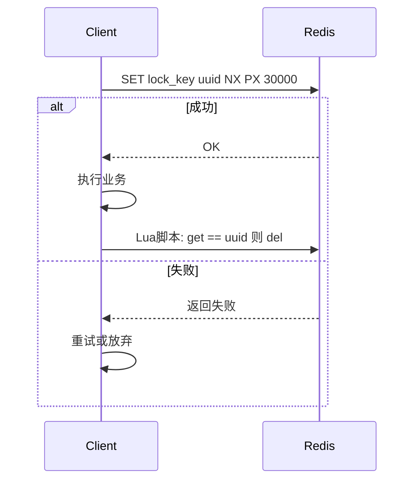

#### 2-8 基于分布式锁解决定时任务重复问题
- 多节点部署定时任务时，使用分布式锁保证只有一个节点执行。

#### 2-9 ZooKeeper分布式锁原理
- 利用临时顺序节点：每个客户端在锁节点下创建临时顺序节点，序号最小的获得锁。
- 监听前一节点，实现公平锁。
- 优势：可靠、避免死锁（会话结束自动删除）。

#### 2-10 ZooKeeper分布式锁代码实现（及Curator）
- Curator框架提供`InterProcessMutex`，简化ZooKeeper分布式锁使用。

#### 2-11 Redisson分布式锁
- 使用`RLock lock = redissonClient.getLock("lockKey");`
- 支持自动续期（看门狗机制），默认锁30秒，业务未完成自动延长。

#### 2-12 Spring和SpringBoot引入Redisson
- 配置文件`redisson.yml`或使用`RedissonClient` Bean。

#### 2-13 分布式锁的对比

| 实现方案 | 优点 | 缺点 |
|----------|------|------|
| 数据库 | 简单易用 | 性能差，单点风险 |
| Redis | 性能高，易实现 | 锁超时问题，主从切换可能丢失 |
| ZooKeeper | 可靠性高，无竞争死锁 | 性能较低，依赖ZK集群 |
| Redisson | 功能丰富，看门狗自动续期 | 需额外学习 |

#### 2-14 【技术落地】分布式锁技术落地
- 项目中根据业务场景选择合适的分布式锁实现。

#### 2-15 【藏经阁】准备面试的同学请进来
> 提供GitHub面试资料链接：https://github.com/hollischuang/toBeTopJavaer

---

## 第三部分：读写分离、分库分表

### 第1章 读写分离，分库分表认知提升

#### 1-1 海量数据的存储与访问瓶颈解决方案 - 数据切分

##### 核心论点
单机数据库存在性能瓶颈且难以扩展，数据切分（垂直切分、水平切分）是解决海量数据存储与访问的常用手段。

##### 垂直切分
- 按不同表或Schema拆分到不同数据库。
- 优点：业务清晰，扩展容易。
- 缺点：跨库join、分布式事务复杂，单表仍可能过大。

##### 水平切分
- 按规则将一张表的数据拆分到多个数据库（分片）。
- 优点：解决单表大数据量、高并发瓶颈。
- 缺点：分片规则选择困难，跨分片事务、数据迁移复杂。

##### 分片规则示例
- 用户id求模
- 按日期
- 按其他字段哈希

> “数据切分，简单的说，就是通过某种条件，将我们之前存储在一台数据库上的数据，分散到多台数据库中。”

#### 1-2 如何正确使用数据库读写分离

##### 核心论点
互联网应用读多写少，读写分离将读请求分散到多个从库，减轻主库压力。但存在数据同步延迟问题，不适合实时性要求高的场景（如支付状态）。

##### 架构演进
单库 → 应用层集群 → 读写分离（一主多从）

##### 读写分离弊端
- 主从延迟导致数据不一致
- 从库同步挂掉影响读

> “如果网络环境很好，延迟在5ms以内，使用读写分离没有问题。但是从业务出发，适合的架构才是好架构。”

---

### 第2章 MyCat读写分离、分库分表

#### 2-1 MyCat概述与基本概念

##### 核心论点
MyCat是开源的分布式数据库中间件，支持MySQL、Oracle等，对前端应用透明，实现读写分离、分库分表。

##### 关键概念
- **逻辑库（Schema）**：对应用层看到的数据库。
- **逻辑表（Table）**：应用层操作的表。
- **分片表**：做了水平切分的表。
- **非分片表**：未切分的表。
- **全局表**：冗余复制到所有分片库的字典表。
- **分片节点（dataNode）**：每个分片表所在的数据库。
- **节点主机（dataHost）**：分片节点所在的物理主机。
- **分片规则（rule）**：数据分布规则（如求模、枚举）。
- **全局序列号（sequence）**：分布式环境下的唯一ID生成机制。

#### 2-2 分库分表概述
> 说明：略。

#### 2-3 如何选择垂直切分、水平切分
- 业务模块独立性高，优先垂直切分。
- 单表数据量大（如超过1000w），优先水平切分。

#### 2-4 快速体验MyCat（MySql安装）

##### MySQL安装（CentOS 7）
```bash
wget http://dev.mysql.com/get/mysql-community-release-el7-5.noarch.rpm
rpm -ivh mysql-community-release-el7-5.noarch.rpm
yum install mysql-community-server
service mysqld restart
# 设置密码
mysql -uroot
set password for 'root'@'localhost' = password('mypasswd');
```

#### 2-5 MyCat用户配置、schema.xml配置
- `schema.xml`定义逻辑库、分片节点、数据主机、分片规则。
- `rule.xml`定义分片算法。
- `server.xml`配置MyCat用户及权限。

#### 2-6 MySQL主从配置

##### 主库配置（/etc/my.cnf）
```ini
log-bin=imooc_mysql
server-id=1
```

##### 从库配置
```ini
server-id=2
```

##### 主库创建复制账号
```sql
CREATE USER 'repl'@'%' IDENTIFIED BY 'password';
GRANT REPLICATION SLAVE ON *.* TO 'repl'@'%';
FLUSH TABLES WITH READ LOCK;
SHOW MASTER STATUS;
-- 导出数据后解锁
UNLOCK TABLES;
```

##### 从库配置主从连接
```sql
CHANGE MASTER TO MASTER_HOST='master_host', MASTER_USER='repl', MASTER_PASSWORD='password', MASTER_LOG_FILE='xxx', MASTER_LOG_POS=xxx;
START SLAVE;
```

#### 2-7 分片规则实战
- **枚举分片**：根据枚举值映射到分片。
- **取模分片**：根据字段值对节点数取模。
- **全局表**：所有分片库完整复制。
- **子表（ER表）**：保证父子表数据在同一个分片，避免跨库join。

#### 2-8 MyCat的高可用（HAProxy + Keepalived）
- HAProxy提供MyCat负载均衡，Keepalived提供VIP高可用。

#### 2-9 【技术落地】分库分表规划与配置
- 根据业务量预估分片数量。
- 配置分片规则，改造程序使用MyCat作为数据源。

---

### 第3章 Sharding-JDBC读写分离，分库分表

#### 3-1 Sharding-JDBC简介

##### 核心论点
Sharding-JDBC是客户端模式的分库分表中间件，以jar包形式嵌入应用，无需额外部署，支持读写分离、分片、分布式事务等。

#### 3-2 Sharding-JDBC的分片表配置

##### 配置示例（application.properties）
```properties
spring.shardingsphere.datasource.names=ds0,ds1
spring.shardingsphere.datasource.ds0.url=jdbc:mysql://localhost:3306/db0
spring.shardingsphere.datasource.ds1.url=jdbc:mysql://localhost:3306/db1
# 分片规则：订单表按order_id取模
spring.shardingsphere.sharding.tables.order.actual-data-nodes=ds$->{0..1}.order
spring.shardingsphere.sharding.tables.order.table-strategy.inline.sharding-column=order_id
spring.shardingsphere.sharding.tables.order.table-strategy.inline.algorithm-expression=order_$->{order_id % 2}
```

#### 3-3 Sharding-JDBC的全局表
- 使用`broadcast-tables`配置广播表，全节点复制。

#### 3-4 Sharding-JDBC子表（绑定表）
- `binding-tables`：配置绑定表，保证分片键相同的数据在同一分片，减少跨库join。

#### 3-5 Sharding-JDBC的读写分离
```properties
spring.shardingsphere.masterslave.load-balance-algorithm-type=round_robin
spring.shardingsphere.masterslave.name=ms
spring.shardingsphere.masterslave.master-data-source-name=master
spring.shardingsphere.masterslave.slave-data-source-names=slave0,slave1
```

---

## 附录：总结与作业

### 阶段总结要点
- 消息队列实现异步解耦、削峰填谷，对比ActiveMQ、RabbitMQ、RocketMQ、Kafka的适用场景。
- RabbitMQ核心API及高级特性：Confirm、Return、ACK、TTL、死信队列、镜像集群。
- Kafka高性能原因：pageCache、顺序写、零拷贝，以及ISR机制。
- 分布式锁解决集群环境下的资源共享问题，对比数据库、Redis、ZooKeeper、Redisson方案。
- 数据切分：垂直切分与水平切分，读写分离缓解读压力。
- MyCat（代理模式）与Sharding-JDBC（客户端模式）实现分库分表和读写分离。

### 作业练习
1. 对比RabbitMQ和Kafka的特点与优势。
2. 实现基于Redis或ZooKeeper的分布式锁，并测试超卖场景。
3. 搭建MyCat或Sharding-JDBC，配置分库分表（取模分片），并测试跨分片查询。
4. 配置MySQL主从复制与读写分离，结合MyCat或Sharding-JDBC验证。

---

*以上为《Java架构师成长直通车》分布式消息队列、分布式锁、读写分离与分库分表篇的完整结构化总结。所有内容均基于原始图文节、Word文档、PDF及截图整理，未添加书中不存在的信息。*


# 《Java架构师成长直通车》课程知识档案（分布式全局ID、分布式事务、分布式限流、微服务架构与服务治理篇）

## 书籍信息
- 书名：Java架构师体系课：跟随千万级项目从0到100全过程高效成长 / 《Java架构师成长直通车》
- 作者：慕课网与多位业内资深大咖老师（风间影月、阿神、凌波微步、姚半仙、张飞扬、大目等）
- PDF 状态：混合来源（PDF、Word文档、截图），内容完整度较高
- OCR 状态：良好，少量格式错乱已修正

## 目录说明
- 本部分涵盖课程进阶阶段的核心分布式技术：分布式全局ID、分布式事务、分布式接口幂等性、分布式限流、微服务架构认知、服务治理Eureka、负载均衡Ribbon、服务通信Feign。
- 依据《16.分布式全局ID、分布式事务和数据一致性-慕课网就业班.pdf》《17.分布式接口幂等性，分布式限流-慕课网就业班.pdf》《18.微服务架构认知、服务治理-Eureka -慕课网就业班.pdf》《19.负载均衡、服务通信与调用-慕课网就业班.pdf》及配套Word图文节整理。

## 全书核心主题
本阶段解决分布式系统核心难题：全局唯一ID生成、跨服务事务一致性、接口幂等性保障、流量控制与限流，并正式进入微服务架构领域。首先学习分库分表后的ID重复问题及解决方案（UUID、雪花算法等）；其次掌握分布式事务的XA两阶段提交、事务补偿、本地消息表、基于MQ的最终一致性方案；然后理解接口幂等性的设计原则与实现；接着学习分布式限流的算法（令牌桶、漏桶、滑动窗口）及Nginx、Guava、Redis+Lua等限流方案。最后系统学习微服务架构理念、服务治理（Eureka）、负载均衡（Ribbon）和服务通信（Feign），为后续微服务实战打下坚实基础。

---

## 第一部分：分布式全局ID

### 1-1 分布式全局ID —— 概述和引发的问题

#### 核心论点
分库分表后，传统数据库自增ID无法保证全局唯一，需要引入分布式全局ID生成方案。

#### 关键概念
- **问题**：多个分片库中ID可能重复。
- **要求**：全局唯一、趋势递增、高性能、高可用。

---

### 1-2 分布式主键UUID

#### 核心论点
UUID（Universally Unique Identifier）是一种简单易用的全局唯一ID方案，但存在字符串长、无序、索引性能差等缺点。

#### 优缺点
| 优点 | 缺点 |
|------|------|
| 本地生成，性能高 | 32位字符串，占用空间大 |
| 全球唯一 | 无序，B+树索引分裂频繁 |
| 无需网络调用 | 可读性差 |

---

### 1-3 MyCat全局ID（本地文件和数据库）

#### 核心论点
MyCat提供了基于本地文件或数据库表的全局ID生成方式，适用于分库分表场景。

#### 实现方式
- **本地文件方式**：MyCat维护一个文件记录当前ID值，每次累加。
- **数据库方式**：使用独立数据库表存储ID段，批量获取后内存分配。

---

### 1-4 分布式ID——雪花算法（Snowflake）

#### 核心论点
雪花算法是Twitter开源的分布式ID生成算法，生成64位Long型ID，趋势递增，不依赖外部存储。

#### 结构（64位）
| 位数 | 用途 |
|------|------|
| 1 bit | 符号位（0） |
| 41 bit | 时间戳（毫秒级，可用69年） |
| 10 bit | 机器ID（支持1024个节点） |
| 12 bit | 序列号（每毫秒4096个ID） |

#### 流程图：雪花算法ID生成
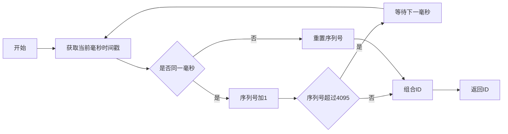

---

### 1-5 【技术落地】分布式全局ID方案落地
> 说明：在电商项目中选用雪花算法或改造版，配置机器ID，封装ID生成服务。

---

## 第二部分：分布式事务

### 2-1 分布式事务概述

#### 核心论点
分布式事务是指事务的参与者、支持事务的服务器、资源服务器以及事务管理器分别位于不同分布式系统的不同节点之上。

---

### 2-2 分布式系统中的CAP原理

#### 核心论点
CAP定理：一个分布式系统最多只能同时满足一致性（Consistency）、可用性（Availability）、分区容错性（Partition Tolerance）中的两项。

#### 详解
- **C 一致性**：所有节点在同一时间看到的数据完全一致。
- **A 可用性**：服务在规定时间内完成响应。
- **P 分区容错性**：系统遇到网络分区故障仍能对外服务。

> “在分布式系统中，P总是成立的，只能在A和C之间选择。分布式系统只能是AP或CP。” (2-2)

#### ACID与BASE
| ACID | BASE |
|------|------|
| 强一致性 | 基本可用（Basically Available） |
| 事务原子性 | 软状态（Soft state） |
| 隔离性 | 最终一致性（Eventually consistent） |
| 持久性 | - |

> “BASE模型是传统ACID模型的反面，强调牺牲高一致性以获得可用性。”

---

### 2-3 分布式事务的问题
> 说明：跨库事务、跨服务调用的一致性难题。

---

### 2-4 XA协议的两阶段提交（2PC）

#### 核心论点
XA协议定义了分布式事务处理规范，两阶段提交包括准备阶段和提交/回滚阶段。

#### 流程
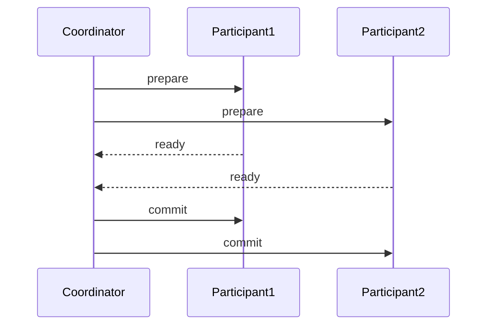
- **缺点**：同步阻塞、单点故障、数据不一致风险（脑裂）。

---

### 2-5 使用Atomikos做分布式事务
> 说明：Atomikos是Java实现的XA事务管理器，支持JTA。

---

### 2-6 MyCat和Sharding-JDBC的分布式事务
> 说明：两者均支持弱XA或BASE事务。

---

### 2-7 事务补偿机制原理

#### 核心论点
事务补偿（TCC：Try-Confirm-Cancel）是一种最终一致性方案，通过业务层面的预留、确认、取消操作实现。

#### 三阶段
- **Try**：预留资源（如冻结库存）。
- **Confirm**：确认执行（扣减库存）。
- **Cancel**：取消预留（解冻库存）。

---

### 2-8 事务补偿机制程序示例
> 说明：代码实现TCC模式。

---

### 2-9 本地消息表（原理）

#### 核心论点
本地消息表将事务消息持久化到业务数据库，通过定时任务扫描发送，保证消息可靠性。

#### 流程
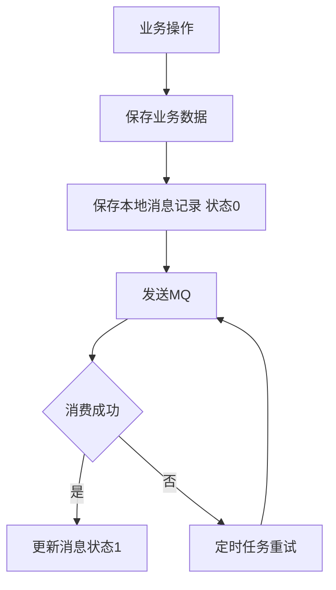

---

### 2-10 ~ 2-13 本地消息表（数据库设计、支付接口、订单操作、定时任务）
> 说明：具体实现涉及订单与支付场景。

---

### 2-14 ~ 2-17 基于MQ（RocketMQ）的分布式事务

#### 核心论点
RocketMQ支持事务消息，通过半消息（Half Message）和回查机制实现最终一致性。

#### 流程
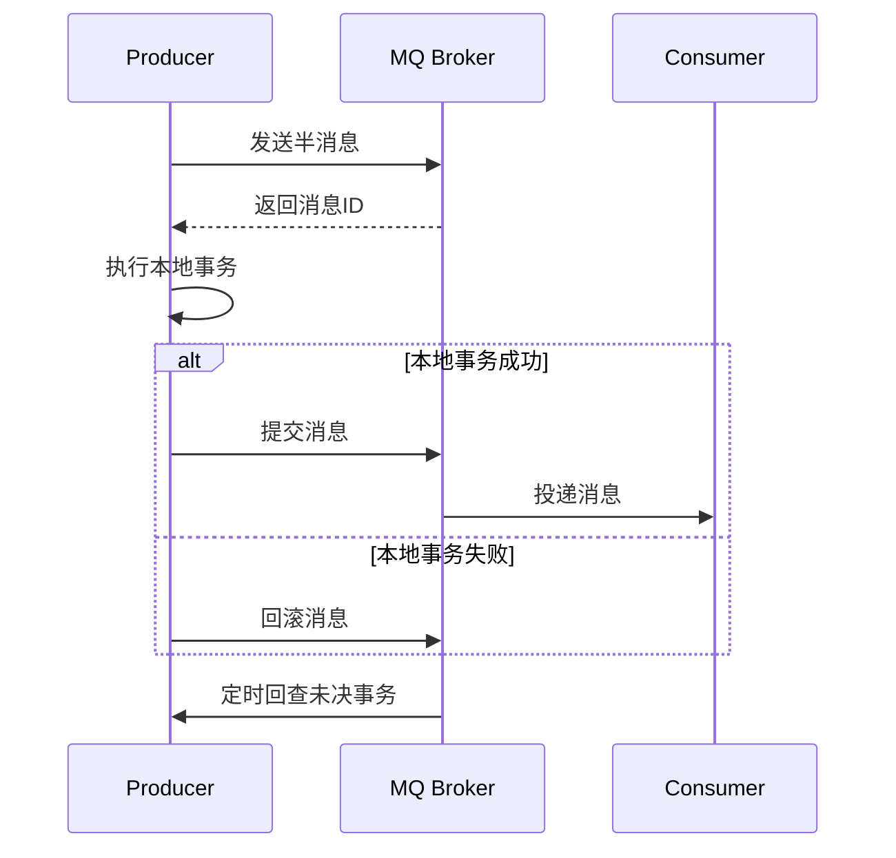

---

### 2-18 【技术落地】分布式事务技术落地与验证
> 说明：项目中选择合适方案集成。

---

## 第三部分：分布式接口幂等性与分布式限流

### 3-1 接口幂等性设计（概述与接口重试问题）

#### 核心论点
幂等性是指同一个接口多次发起相同的请求，对系统资源的状态改变结果是一致的。分布式系统中重试机制要求接口具备幂等性。

---

### 3-2 Delete操作的幂等性
> 说明：多次删除相同资源效果相同。

---

### 3-3 Update的幂等性
- 根据版本号（乐观锁）更新：`update table set count=count-1, version=version+1 where id=1 and version=oldVersion`
- 根据状态机更新：只允许特定状态变更

---

### 3-4 Insert的幂等性
- 使用唯一约束（如订单号）防止重复插入
- 先查后插，或使用`insert ignore`、`on duplicate key update`

---

### 3-5 【技术落地】接口幂等性解决方案
- 全局唯一请求ID + Redis去重
- 数据库唯一索引
- Token机制（预先生成Token，提交时验证并删除）

---

### 3-6 分布式限流介绍

#### 核心论点
限流是在某个时间窗口内对资源访问做限制，保护系统不被突发流量冲垮。常见限流维度：时间、资源（QPS、连接数、传输速率、黑白名单）。

> “限流就是在某个时间窗口对资源访问做限制。”（2-2 分布式限流介绍）

---

### 3-7 分布式限流的主流方案

| 方案 | 说明 |
|------|------|
| Guava限流 | 客户端单机限流，适合练习算法 |
| 网关层限流 | Nginx（IP限流、连接数限流、带宽限流） |
| 中间件限流 | Redis + Lua脚本，高性能分布式限流 |
| 限流组件 | Sentinel（阿里），提供丰富流控策略 |

---

### 3-8 限流方案常用算法讲解

#### 令牌桶算法（Token Bucket）
- 令牌以恒定速率放入桶中
- 请求需获取令牌，桶满则丢弃令牌
- 支持突发流量（积攒令牌）

#### 漏桶算法（Leaky Bucket）
- 请求数据包放入桶中
- 以恒定速率流出处理
- 不允许突发，平滑输出

#### 滑动窗口（Rolling Window）
- 将时间窗口划分为多个小格子
- 滑动时老格子退出，新格子加入
- 计数总和为窗口内请求量

> “漏桶的天然特性决定了它不会发生突发流量，令牌桶可以预存令牌应对突发流量。”

---

### 3-9 ~ 3-10 GuavaRateLimiter客户端限流
- `RateLimiter.create(permitsPerSecond)` 创建
- `acquire()` 阻塞获取令牌
- `tryAcquire()` 非阻塞尝试

---

### 3-11 GuavaRateLimiter预热模型

#### 核心论点
预热模型（SmoothWarmingUp）允许令牌发放速率从慢到快逐渐加速，适应流量从低到高的平滑过渡。

#### 关键参数
- `warmupPeriod`：预热时间
- `stableInterval`：稳定间隔
- `coldInterval`：冷间隔（一般为stableInterval的3倍）
- `slope`：斜率，控制速率变化

---

### 3-12 ~ 3-13 基于Nginx的分布式限流
- 限流配置：`limit_req_zone` + `limit_req`
- 连接数限制：`limit_conn_zone` + `limit_conn`

---

### 3-14 基于Redis+Lua的分布式限流

#### 核心论点
Redis+Lua方案将限流逻辑嵌入Redis执行，保证原子性和高性能，适合分布式环境。

#### Lua脚本示例（令牌桶）
```lua
local key = KEYS[1]
local limit = tonumber(ARGV[1])
local interval = tonumber(ARGV[2])
local current = redis.call('get', key)
if current and tonumber(current) > limit then
    return 0
else
    redis.call('incr', key)
    redis.call('expire', key, interval)
    return 1
end
```

---

### 3-15 分布式限流要注意的问题
- **匀速限流**：避免令牌一次性发放导致的瞬时峰值攻击。
- **限流组件失效**：当Redis不可用时，建议直接放行（拒绝服务的损失更大）。
- **限流上界确定**：通过压测确定系统处理能力上限，设为平均值或中位数。

> “拒绝外部请求所造成的损失，远大于放行请求暴露出的潜在破绽。”（2-15）

---

### 3-16 本章小结
> 限流算法、网关限流、中间件限流是分布式系统必备能力。

### 3-17 作业练习
1. 在Nginx网关层配置IP限流和单机限流
2. 引入Guava做单机限流
3. 实现Redis+Lua限流脚本并测试
4. 用JMeter压测对比不同限流方案效率

---

## 第四部分：微服务架构认知

### 4-1 微服务介绍

#### 核心论点
微服务是一种架构风格，将单一应用划分为一组小型独立服务，每个服务围绕业务能力构建，可独立部署和扩展。

> “微服务就像青春期性行为的话题，所有人都在讨论它，但没人真正知道怎么做。”（1-1）

#### 微服务的印象标签
- **拆迁办**：拆什么、怎么拆
- **单一职责**：宏观层面的职责划分
- **研发团队赋能**：开发团队拥有服务全生命周期管理权
- **可独立部署**：每个微服务独立打包、部署、发布

---

### 4-2 为什么要将应用微服务化？

#### 传统架构之殇
- 数据访问杂乱：模型变更影响面广，底层组件变更牵一发而动全身
- 代码复用带来维护成本：代码复用随意，改一处影响多处
- 发布周期长：全链路回归测试，回滚困难

> “微服务大法好！不过微服务架构好不好，还要看各个服务之间拆的好不好。”（1-4）

---

### 4-3 微服务的拆分规范和原则

#### 拆分维度
- **压力模型拆分**：高频高并发（商品详情页）、低频突发流量（秒杀）、低频流量（后台运营）
- **业务模型拆分**：主链路识别、领域模型拆分（DDD）、用户群体拆分
- **前后台业务分离**：前台业务与后台管理分离

---

### 4-4 微服务架构所面临的技术问题
- 服务治理和负载均衡
- 服务容错（降级、熔断）
- 配置管理（分布式配置中心）
- 服务网关
- 调用链路追踪
- 消息驱动
- 分布式限流

> “微服务架构可谓是蜀道艰险，青天没上成，可能先去了西天。”（1-7）

---

## 第五部分：服务治理 Eureka

### 5-1 SpringCloud整体认知

#### Spring Cloud与微服务架构的关系
Spring Cloud是一系列开源技术的集合，基于Spring Boot，提供了微服务基础设施的简化组件。

#### 三大组件门派
- **Netflix**：初代目，最广泛使用（Eureka, Hystrix, Zuul, Ribbon）
- **Alibaba**：后起之秀（Nacos, Sentinel, Seata）
- **Spring Open Source**：原配组件（Config, Gateway, Stream）

---

### 5-2 服务治理的核心概念

#### 服务治理的伟大目标
- 高可用性
- 分布式调用（精准获取服务地址）
- 生命周期管理
- 健康度检查

#### 3W1H问题
- Who are you：服务注册
- Where are you from：服务发现
- How are you doing：心跳检测、服务续约、服务剔除
- When you die：服务下线

---

### 5-3 注册中心（Eureka）工作模式

#### 等待戈多模式
服务节点主动向注册中心发起注册，注册中心不主动探测。

#### 注册信息三要素
- 服务名称（spring.application.name）
- 物理地址（IP+端口）
- 服务状态（UP/DOWN）

---

### 5-4 服务注册流程（源码视角）

```mermaid
graph TD
    A[@EnableDiscoveryClient] --> B[DiscoveryClient.register]
    B --> C[装饰器链 Sessioned/Retryable]
    C --> D[获取Server列表]
    D --> E[发送注册请求]
    E --> F{注册结果}
    F -->|成功| G[完成]
    F -->|失败| H[重试下一台Server]
```

---

### 5-5 心跳监测与服务剔除

#### 核心参数
```properties
eureka.instance.lease-renewal-interval-in-seconds=10  # 心跳间隔
eureka.instance.lease-expiration-duration-in-seconds=20 # 过期时间
```

#### 服务剔除流程
1. 注册中心定时任务（默认60秒）
2. 检查自保护开关（开启则跳过）
3. 遍历所有服务，找出过期服务
4. 计算可剔除数量（不超过总数×0.85）
5. 乱序剔除

---

### 5-6 服务自保（Self Preservation）

#### 触发条件
过去15分钟内，成功续约的节点数低于注册节点总数的85%（可配置）。

#### 自保模式表现
- 注册中心不再剔除任何服务节点
- 页面显示红色警告：`EMERGENCY! EUREKA MAY BE INCORRECTLY...`

> “自保模式往往是为了应对短暂的网络环境问题。”（3-18）

---

### 5-7 服务续约与服务下线

#### 续约流程
客户端发送心跳 → 注册中心校验 → 更新最后同步时间

#### 下线流程
服务主动调用`shutdown`或关闭 → 发送DELETE请求 → 注册中心移除节点

---

### 5-8 Eureka高可用改造
- 多个Eureka Server互相注册
- 客户端配置多个服务地址

---

## 第六部分：负载均衡 Ribbon

### 6-1 什么是负载均衡

#### 核心论点
负载均衡将用户请求分散到多个服务器上，提高系统吞吐量和可用性。

#### 客户端负载均衡 vs 服务端负载均衡
| 类型 | 代表 | 特点 |
|------|------|------|
| 客户端 | Ribbon | 调用方从注册中心获取列表，本地选择节点 |
| 服务端 | Nginx | 请求先到达负载均衡器，再转发 |

---

### 6-2 Ribbon体系架构

- **IPing**：检查服务节点是否存活（与Eureka集成时读取状态）
- **IRule**：负载均衡策略接口

---

### 6-3 Ribbon七种负载均衡策略

| 策略 | 说明 |
|------|------|
| RandomRule | 随机选择 |
| RoundRobinRule | 轮询 |
| RetryRule | 带重试的轮询 |
| WeightedResponseTimeRule | 根据响应时间加权 |
| BestAvailableRule | 选择并发量最小的节点 |
| AvailabilityFilteringRule | 过滤熔断/连接数过高的节点 |
| ZoneAvoidanceRule | 过滤故障Zone和可用性差的节点 |

---

### 6-4 懒加载与饥饿加载

#### 问题
Ribbon默认懒加载，首次调用会初始化LoadBalancer，导致第一次请求超时。

#### 解决
```properties
ribbon.eager-load.enabled=true
ribbon.eager-load.clients=ribbon-consumer
```

---

### 6-5 自定义负载均衡策略
- 实现`IRule`接口，重写`choose`方法

---

## 第七部分：服务通信 Feign

### 7-1 什么是Feign

#### 核心论点
Feign是一个声明式HTTP客户端，通过接口和注解简化远程服务调用，底层集成Ribbon和Hystrix。

---

### 7-2 Feign体系架构

#### 上半场：构建请求
```mermaid
graph TD
    A[@FeignClient接口] --> B[动态代理]
    B --> C[Contract协议解析]
    C --> D[生成MethodMetadata]
    D --> E[生成MethodHandler]
```

#### 下半场：发起调用
```mermaid
graph TD
    A[MethodHandler] --> B[RequestInterceptor]
    B --> C[LoadBalancerFeignClient]
    C --> D[Ribbon重试]
    D --> E[Hystrix降级]
```

---

### 7-3 动态代理机制（JDK动态代理）

Feign通过实现`InvocationHandler`接口，接管所有接口方法的调用，将本地方法调用转为HTTP请求。

---

### 7-4 Feign超时重试（基于Ribbon）

#### 关键配置
```properties
feign-service-provider.ribbon.OkToRetryOnAllOperations=true
feign-service-provider.ribbon.ConnectTimeout=1000
feign-service-provider.ribbon.ReadTimeout=2000
feign-service-provider.ribbon.MaxAutoRetries=2
feign-service-provider.ribbon.MaxAutoRetriesNextServer=2
```

#### 极值公式
```
Max(Response Time) = (ConnectTimeout + ReadTimeout) × (MaxAutoRetries + 1) × (MaxAutoRetriesNextServer + 1)
```

---

### 7-5 理想Feign项目结构
- 抽取公共接口层（服务提供方定义）
- Controller继承接口
- 调用方继承接口并添加`@FeignClient`

---

### 7-6 本章小结与作业
- 将Feign应用到电商项目其他模块
- Debug Feign底层调用轨迹

---

*以上为《Java架构师成长直通车》分布式全局ID、分布式事务、分布式限流、微服务架构与服务治理篇的完整结构化总结。所有内容均基于原始Word、PDF及截图整理，未添加书中不存在的信息。*


# 《Java架构师成长直通车》课程知识档案（服务容错、配置中心总线、服务网关篇）

## 书籍信息
- 书名：Java架构师体系课：跟随千万级项目从0到100全过程高效成长 / 《Java架构师成长直通车》
- 作者：慕课网与多位业内资深大咖老师（姚半仙、风间影月、阿神等）
- PDF 状态：混合来源（Word文档、PDF、截图），内容完整
- OCR 状态：良好，已基于文本整理

## 目录说明
- 本部分涵盖课程后续核心模块：**服务容错（Hystrix）**、**分布式配置中心高可用与总线式改造（Config + Bus）**、**消息总线（Bus）**、**服务网关（Gateway）**。
- 依据《20.服务容错-Hystrix-慕课网就业班.pdf》《21.分布式配置中心-Config-慕课网就业班.pdf》《22.消息总线、服务网关-慕课网就业班.pdf》及配套图文整理。

## 全书核心主题
本阶段深入微服务架构的治理与基础设施：Hystrix提供降级、熔断、线程隔离等容错能力，防止服务雪崩；Config配置中心实现统一配置管理、动态刷新和高可用，结合Bus总线实现批量推送；Gateway作为第二代网关，承担路由、断言、过滤器、鉴权、限流及统一异常处理。通过理论与实战结合，掌握微服务架构的高可用、高弹性设计。

---

## 第一部分：服务容错 Hystrix

### 第1章 Hystrix体系架构与核心功能

#### 1-1 服务容错的解决方案——降级和熔断
- **核心论点**：微服务架构中，单个服务故障可能引发雪崩效应。Hystrix通过降级、熔断、线程隔离三大机制解决服务容错问题。
- **关键概念**：
  - **降级（Fallback）**：当服务调用异常或超时时，返回备选结果。
  - **熔断（Circuit Breaker）**：异常达到阈值后，直接切断调用，定期半开尝试恢复。
  - **线程隔离（Bulkhead）**：为每个服务分配独立线程池，避免资源争抢。

#### 1-2 Hystrix体系架构和核心功能解析
> 引用：“断=熔断，舍=降级，离=线程隔离 —— Hystrix的‘断舍离’智慧。”

#### 1-3 服务降级原理解析
- **核心论点**：通过`@HystrixCommand`注解标记方法，借助Spring AOP切面，在方法调用异常或超时后转向`fallbackMethod`。
- **逻辑推演**：
  1. 切面拦截`@HystrixCommand`方法。
  2. 注册RxJava异步回调（Observable）。
  3. 熔断器状态检查（开启则直接降级）。
  4. 发起真实调用，异常时触发回调，进入fallback。
- **经典金句**：“Hystrix的源码大量基于RxJava，层层嵌套，非常劝退。”

#### 1-4 服务降级常用方案
- 静默处理：返回空值。
- 默认值：返回预设值（如商品原价）。
- 恢复服务：降级逻辑中尝试重试、切换备库、访问缓存或触发人工干预。
- 多级降级：fallback中再设fallback。

#### 1-5 超时降级——规避与Ribbon共同作用时的坑
- **核心论点**：Hystrix和Ribbon都有超时配置，谁先达到谁生效。建议Hystrix超时时间略大于Ribbon的最大超时（含重试），让Ribbon重试充分发挥。
- **Ribbon最大超时公式**：  
  `Max = (ConnectTimeout + ReadTimeout) × (MaxAutoRetries+1) × (MaxAutoRetriesNextServer+1)`

#### 1-6 熔断器以及工作原理
- **三种状态**：
  - `CLOSED`：正常调用，统计失败率。
  - `OPEN`：熔断开启，直接降级。
  - `HALF_OPEN`：经过休眠时间后，尝试放行一个请求，成功则关闭熔断，失败则继续保持开启。
- **触发条件**：时间窗口内失败请求数达到阈值，且失败比例超过设定值。

#### 1-7 线程隔离——核心方案以及工作原理
- **核心论点**：通过独立线程池（或信号量）隔离服务，防止单个服务耗尽容器线程。
- **三道坎**：
  1. 线程池拒绝（Reject）→ fallback。
  2. 线程超时（Timeout）→ fallback。
  3. 服务异常/超时 → fallback。

#### 1-8 线程池 vs 信号量的优缺点比较
| 维度 | 线程池 | 信号量 |
|------|--------|--------|
| 性能 | 较低（线程切换开销） | 高（无额外线程） |
| 超时判定 | 可主动超时 | 只能等待被动超时 |
| 适用场景 | 网络调用、外部服务 | 超高并发非网络调用 |
| 上下文传递 | ThreadLocal失效 | 生效 |

#### 1-9 Turbine聚合Hystrix信息
- **作用**：聚合集群中所有服务节点的Hystrix流，通过Dashboard统一展示，实现监控大盘。
- **流程**：Turbine通过Eureka服务发现拉取节点列表，主动调用每个节点的`/actuator/hystrix.stream`，聚合后供Dashboard展示。

#### 1-10 【架构探讨】当开源项目停止更新（Hystrix进入维护模式）
- 官方原因：1.5.18版本已足够稳定。
- 替代方案：Resilience4j（轻量、函数式）、Sentinel（阿里，功能更丰富）。

#### 1-11 本章小结和作业
> 作业：在电商项目中找到2~3个适合Hystrix的场景并实现；规划主链路降级策略。

---

## 第二部分：分布式配置中心 Config（高可用与总线式改造）

### 第2章 Config 高级特性

#### 2-1 配置中心的高可用化
- 核心：多个Config Server实例注册到Eureka，客户端通过服务名调用，实现负载均衡和故障转移。

#### 2-2 总线式架构展望
- 问题：集群环境下，逐个节点手动刷新配置效率低下。
- 解决方案：引入消息总线（Bus），一次刷新广播到所有节点。

#### 2-3 如何保存私密信息（加密）
- 对称加密：在Config Server中配置`encrypt.key`，通过`/encrypt`接口加密，存储时加`{cipher}`前缀。
- 非对称加密：使用公钥加密、私钥解密，更安全但复杂。

#### 2-4 【拓展】阿里系的分布式配置中心 Switch
- 轻量级，聚焦20%核心需求：功能开关、灰度推送、用户友好的Portal页面。
- 支持环境隔离（日常/预发/生产）、指定机房或机器推送。

#### 2-5 本周小结与作业任务
> 作业：实现基于数据库或本地文件的配置中心；实现环境隔离；应用动态刷新；加密敏感信息。

---

## 第三部分：消息总线 Bus

### 第3章 Bus 核心功能

#### 3-1 消息总线在微服务中的应用
- **核心论点**：Bus与Config结合，实现配置变更的广播推送，基于发布-订阅模型。
- 流程：触发`/actuator/bus-refresh` → Bus通过消息中间件通知所有节点 → 各节点拉取最新配置。

#### 3-2 Bus体系结构解析
- **事件结构**：`RefreshRemoteApplicationEvent`（配置刷新）和`EnvironmentChangeRemoteApplicationEvent`（环境变量变更）。
- **监听器**：`RefreshListener`触发`@RefreshScope`刷新，`EnvironmentChangeListener`更新环境变量。
- **发布者**：通过`/actuator/bus-refresh`和`/actuator/bus-env`端点。

#### 3-3 Bus的接入方式：RabbitMQ 与 Kafka
- RabbitMQ：引入`spring-cloud-starter-bus-amqp`，配置RabbitMQ连接。
- Kafka：引入`spring-cloud-starter-bus-kafka`，配置Kafka和ZooKeeper地址。

#### 3-4 如何实现自动推送？Git WebHook
- 在GitHub仓库设置Webhook，指向`http://<gateway>/actuator/bus-refresh`，配置加密密钥。
- 注意：Webhook可能因Spring Cloud Bus的bug无法直接调用，可自定义中间接口中转。

#### 3-5 消息总线如何助攻其他业务场景
- 自定义事件：继承`RemoteApplicationEvent`，通过`@RemoteApplicationEventScan`注册，使用`ApplicationEventPublisher`发布，`@EventListener`监听。
- 应用场景：清空所有节点缓存、广播数据库变更通知等。

#### 3-6 本章小结和作业
> 作业：使用Bus自定义广播消息并集成到电商项目中。

---

## 第四部分：服务网关 Gateway

### 第4章 Gateway 架构与实战

#### 4-1 服务网关在微服务中的应用
- 作用：统一入口、路由转发、访问控制（鉴权）、限流、跨域、日志等。
- 对比第一代网关Zuul：Gateway基于Netty + WebFlux，非阻塞、性能更高。

#### 4-2 Gateway体系架构解析
- 核心组件：`Route`（路由）、`Predicate`（断言）、`Filter`（过滤器）。
- 自动装配：`GatewayAutoConfiguration`初始化路由、断言工厂、过滤器；底层依赖Netty和Ribbon。
- 注意：必须引入`spring-boot-starter-webflux`，不能引入`spring-boot-starter-web`，否则启动冲突。

#### 4-3 路由功能详解
- **路由三重门**：断言集合（匹配规则）→ 过滤器集合（预处理/后处理）→ URI（目标地址）。
- 负载均衡：URI以`lb://`开头，借助Ribbon实现服务发现与负载均衡。

#### 4-4 断言功能详解（Predict）
- Predicate：Java 8函数式接口，返回true/false。
- 常用断言：`Path`（路径匹配）、`Method`（HTTP方法）、`Query`（请求参数）、`Header`、`Cookie`、`Before/After/Between`（时间）。
- 自定义断言：继承`AbstractRoutePredicateFactory`。

#### 4-5 过滤器原理和生命周期
- 实现`GatewayFilter`接口，重写`filter`方法，通过`Ordered`接口指定顺序。
- Pre类型：在`chain.filter(exchange)`之前执行逻辑。
- Post类型：在`chain.filter(exchange).then()`回调中执行。
- 常用过滤器：`AddRequestHeader`、`StripPrefix`、`PrefixPath`、`RedirectTo`、`SaveSession`等。

#### 4-6 权限认证——分布式session替代方案
- **问题**：传统HttpSession无法跨节点共享。
- **方案一：JWT（JSON Web Token）**  
  - 流程：用户登录 → 服务器生成Token（含Header、Payload、Signature）返回客户端 → 客户端每次请求携带Token → 网关层验证Token有效性。
- **方案二：OAuth 2.0**  
  - 第三方授权，适合复杂权限场景。

#### 4-7 如何借助网关层对服务端各类异常做统一处理
- **问题**：服务端抛出异常时，GET请求默认返回HTML页面，前端难以解析。
- **解决方案**：通过装饰器模式+代理模式，自定义`GlobalFilter`，修改Response Body，将异常转为统一JSON格式。
- 关键技术：继承`ServerHttpResponseDecorator`，覆盖`writeWith`方法，修改返回内容。

#### 4-8 网关层的其他妙用——限流
- 基于Redis + 令牌桶算法，配置三步：
  1. 引入Redis依赖并配置连接。
  2. 定义`KeyResolver`（如基于客户端IP）。
  3. 在路由中添加`RequestRateLimiter`过滤器，配置`replenishRate`（令牌填充速率）和`burstCapacity`（桶容量）。

#### 4-9 电商系统集成Gateway
- 创建Gateway服务，配置路由规则（如路径映射、负载均衡）。
- 集成限流、JWT鉴权、跨域过滤器（CORS）。
- 实现网关层登录校验（从Token中解析用户信息）。

#### 4-10 本章小结和作业
> 作业：为电商项目引入Gateway路由；实现Redis限流；完成网关层鉴权。

---

*以上为《Java架构师成长直通车》服务容错、配置中心总线、服务网关篇的完整结构化总结。所有内容均基于原始图文及PDF整理，未添加书中不存在的信息。*


# 《Java架构师成长直通车》课程知识档案（流量防控、容器化、调用链追踪、消息驱动、Dubbo篇）

## 书籍信息
- 书名：Java架构师体系课：跟随千万级项目从0到100全过程高效成长 / 《Java架构师成长直通车》
- 作者：慕课网与多位业内资深大咖老师（风间影月、姚半仙、阿神等）
- PDF 状态：混合来源（Word文档、PDF、截图），内容完整
- OCR 状态：良好，已基于文本整理

## 目录说明
- 本次内容涵盖课程中后期模块：**Sentinel流量防控卫兵**、**服务容器化Docker**、**容器编排Kubernetes**、**服务调用链追踪Sleuth+Zipkin+ELK**、**消息驱动Stream**、**服务治理Dubbo**及**课程总结**。
- 文件分散，依据内容逻辑和课程常见顺序重新整合目录，尽量保持与原课程序列一致。
- OCR 修复说明：部分图片为截图（微信聊天、示意图），仅提取可识别文本；流程图已用 Mermaid 重建。

## 全书核心主题
本阶段完善微服务架构的高可用、高弹性与可观测性：Sentinel提供流量控制、熔断降级、系统自适应限流、热点参数限流、黑白名单等；Docker实现服务容器化，解决部署与环境一致性；K8S提供容器编排与资源管理；Sleuth+Zipkin+ELK实现调用链追踪与日志检索；Stream整合消息中间件（RabbitMQ/Kafka），支持发布订阅、消费组、分区、延迟消息及异常处理；Dubbo作为RPC框架对比Spring Cloud，了解其架构与负载均衡。最终回顾Spring Cloud全家桶，并探讨技术以外的话题。

---

## 第1章：微服务下Sentinel流量防控卫兵

### 1-1 Sentinel 系统自适应限流

#### 核心论点
Sentinel系统自适应限流从整体维度控制入口流量，结合Load、RT、入口QPS、线程数等指标，让系统在最大吞吐量与稳定性之间达到平衡。

#### 关键概念
- **系统保护规则**：应用级别入口流量控制，维度包括Load（仅Linux）、平均RT、入口QPS、并发线程数。
- **load1触发机制**：当系统load1超过阈值且并发线程数超过系统容量时触发保护，系统容量由`maxQps * minRt`计算。
- **TCP BBR启发**：根据系统能处理的请求和允许进来的请求做平衡，而非仅根据load指标。

> “我们应该根据系统能够处理的请求，和允许进来的请求，来做平衡，而不是根据一个间接的指标（系统load）来做限流。”（1-10）

---

### 1-2 流量控制（flow control）

#### 核心论点
FlowSlot根据预设规则，实时统计QPS或并发线程数，达到阈值时进行流量控制，抛出FlowException。

#### 关键概念
- **限流阈值类型**：QPS或并发线程数。
- **控制行为**：
  - 直接拒绝（DEFAULT）：超过阈值立即拒绝。
  - Warm Up（预热）：冷启动，流量缓慢增加到阈值上限。
  - 匀速排队（RATE_LIMITER）：漏桶算法，请求以固定间隔通过。

#### 流程图：Warm Up模式QPS曲线
```mermaid
graph LR
    A[时间] --> B[QPS]
    B -- 预热期 --> C[逐渐上升]
    C --> D[稳定阈值]
```

---

### 1-3 热点参数限流

#### 核心论点
统计热点参数（如商品ID、用户ID）中访问频次最高的Top K数据，并对其访问进行限制。

#### 关键概念
- **ParamFlowRule**：参数索引、限流阈值、统计窗口、例外项（针对特定参数值单独设置阈值）。
- **LRU策略**：统计最近最常访问的热点参数，结合令牌桶进行参数级别流控。

#### 使用示例
```java
ParamFlowRule rule = new ParamFlowRule(resourceName)
    .setParamIdx(0)
    .setCount(5);
ParamFlowItem item = new ParamFlowItem()
    .setObject(String.valueOf(PARAM_B))
    .setClassType(int.class.getName())
    .setCount(10);
rule.setParamFlowItemList(Collections.singletonList(item));
ParamFlowRuleManager.loadRules(Collections.singletonList(rule));
```

---

### 1-4 黑白名单控制

#### 核心论点
根据请求来源（origin）限制资源是否通过，白名单内才可通过，黑名单内禁止通过。

#### 配置
- `strategy`：`AUTHORITY_WHITE`（白名单）或 `AUTHORITY_BLACK`（黑名单）。
- `limitApp`：来源列表，逗号分隔。

```java
AuthorityRule rule = new AuthorityRule();
rule.setResource("test");
rule.setStrategy(RuleConstant.AUTHORITY_WHITE);
rule.setLimitApp("appA,appB");
AuthorityRuleManager.loadRules(Collections.singletonList(rule));
```

---

### 1-5 本章小结与作业
> 作业：使用注解或原生API练习热点参数、系统自适应、黑白名单；深入阅读Sentinel控制台源码；熟练掌握与主流框架集成。

---

## 第2章：服务容器化——Docker

### 2-1 Docker能做什么？理念是什么？

#### 核心论点
Docker是轻量级容器引擎，通过镜像、容器、仓库实现应用打包、交付和运行隔离。

#### 关键概念
- **镜像（Image）**：只读模板，包含应用及其运行环境。
- **容器（Container）**：镜像的运行实例，隔离、可移植。
- **仓库（Registry）**：存储和分发镜像，如Docker Hub。
- **Docker特点**：标准化（集装箱）、资源隔离（namespace + cgroup）、易移植、生态庞大。

> “Docker集装箱可谓包罗万象、无所不能。”（1-6）

---

### 2-2 Docker数据持久化管理

#### 核心论点
数据持久化通过Bind Mount和Volume两种方式实现，Volume是推荐方案。

#### 对比
| 方式 | 特点 | 安全性 | 灵活性 |
|------|------|--------|--------|
| Bind Mount | 指定主机任意目录挂载 | 容易影响主机系统 | 高（指哪打哪） |
| Volume | 统一存储在/var/lib/docker/volumes | 安全可控 | 仅限目录，跨主机移植方便 |

#### 命令示例
```bash
# Bind Mount
docker run -v /host/data:/container/data redis

# 隐式Volume
docker run -v /data redis

# 显式Volume
docker volume create data3
docker run -v data3:/data3 redis
```

---

### 2-3 如何选择最适合你的容器镜像仓库？

#### 核心论点
镜像仓库分为公共仓库（Docker Hub、阿里云ACR等）和私有仓库（Harbor、Registry）。选型考虑安全性、权限控制、镜像扫描、同步性能、与CI/CD集成等。

#### 经典金句
“选择装修公司需要考虑的因素包括：装修公司是否提供装修方案……”（2-11，比喻形式）

---

### 2-4 Docker小结与作业

#### 作业
> 问题：微服务之间的异步通信过程中，如何实现消息的稳定传输？请挑选一个消息队列产品容器化，并确保：
> 1. 高可用
> 2. 业务连续性（断电恢复后消息不丢失）
> 3. 敏捷发布（版本升级可分钟级并行部署）

#### 提示
- 从公共仓库选择消息队列镜像。
- 配置数据持久化层。
- 配置多节点网络通信实现集群高可用。
- 配置私有仓库实现快速发布。

---

## 第3章：Kubernetes（K8S）

### 3-1 K8S能做什么？理念是什么？

#### 核心论点
Kubernetes是容器编排平台，提供应用定义（Pod）、配置（YAML）、高可用（etcd+多master）、健康检查（readiness/liveness）、存储抽象、扁平网络、监控集成等。

#### 关键概念
- **Pod**：最小调度单元，一组容器共享网络和存储。
- **YAML配置**：声明式资源管理。
- **健康检查**：readiness（是否可对外服务）、liveness（是否需重启）。
- **存储**：PersistentVolume（PV）和PersistentVolumeClaim（PVC）两层抽象。
- **网络**：扁平网络，Service和Ingress提供服务发现。

#### 适用场景
- 混合云容器编排。
- 微服务容器化落地。

> “如果想要寻找一款混合云环境的容器编排技术，那么Kubernetes将是您的不二选择。”（1-13）

---

## 第4章：服务调用链追踪——Sleuth + Zipkin + ELK

### 4-1 Sleuth核心功能和体系架构

#### 核心论点
Sleuth通过打标（Trace ID + Span ID）实现调用链追踪，低侵入、高性能，与Log系统集成。

#### 关键概念
- **Trace**：贯穿整个调用链的唯一ID。
- **Span**：基本工作单元，包含开始/结束时间、Span ID、Parent ID。
- **Annotation**：特殊事件，如cs（客户端发送）、sr（服务端接收）、ss（服务端发送）、cr（客户端接收）。

#### 信息传递
通过HTTP Header传递`X-B3-TraceId`、`X-B3-SpanId`、`X-B3-ParentSpanId`、`X-Span-Export`。

#### Log集成
利用MDC（InheritableThreadLocal）和Log Format Pattern将追踪信息输出到日志。

---

### 4-2 Zipkin简介

#### 核心论点
Zipkin是分布式实时数据追踪系统，收集Timing数据，提供可视化链路耗时分析。

#### 组件
- Collector：收集客户端数据。
- Storage：支持ElasticSearch、MySQL、Cassandra。
- Search Engine：JSON API查询。
- Dashboard：监控大盘。

---

### 4-3 鹰眼系统（阿里系王牌中间件）

#### 核心论点
阿里鹰眼系统全链路追踪，支持业务埋点、聚合统计、流计算、智能异常识别、业务报警等，远超开源方案。

#### 关键功能
- 自定义业务ID与Trace ID绑定。
- 流计算引擎实时增量计算。
- HiStore压缩（20:1）。
- 离群点检测与智能关联分析。

> “鹰眼系统以一当十的存在。”（1-16）

---

### 4-4 本章小结与作业
> 作业：本地搭建ELK镜像文件，将电商系统剩余微服务模块的日志信息喂给ELK。

---

## 第5章：消息驱动——Stream

### 5-1 Stream体系架构和交互模型

#### 核心论点
Stream基于Spring Integration，提供Input/Output通道抽象，通过Binder适配各种消息中间件（RabbitMQ、Kafka等）。

#### 关键概念
- **Binder**：连接外部消息中间件的适配层，支持插件式替换。
- **Input**：消息输入通道（消费）。
- **Output**：消息输出通道（生产）。
- **目的地绑定**：`spring.cloud.stream.bindings.<通道名>.destination=<主题名>`

#### 流程图：Stream架构
```mermaid
graph LR
    A[应用] --> B[Input/Output]
    B --> C[Binder]
    C --> D[RabbitMQ]
    C --> E[Kafka]
    C --> F[其他]
```

---

### 5-2 发布订阅模型详解

#### 核心论点
发布订阅实现业务解耦：生产者发布消息到Topic，消息中间件分发到所有订阅消费者。

#### 案例：订单系统解耦
传统方式：订单接口直接调用短信、钉钉等 → 耦合严重。
改造后：订单发送“下单完成”消息到MQ，各通知渠道自行订阅。

---

### 5-3 消费组和消息分区

#### 核心论点
- **消费组**：一条消息只能被组内一个实例消费（单播），实现负载均衡。
- **消息分区**：根据分区Key，相同Key的消息永远被同一消费者处理（顺序保证）。

#### 配置示例
```yaml
spring.cloud.stream.bindings.group-producer.group=Group-A
```

---

### 5-4 延迟消息

#### 核心论点
延迟消息指定未来某个时间点才被消费，适用于库存计划生效、定时任务等。

#### RabbitMQ延迟插件
- 下载`rabbitmq_delayed_message_exchange`插件。
- 安装并启用。
- 使用`x-delayed-message`类型的Exchange。

---

### 5-5 Stream异常处理策略

#### 核心论点
异常处理三种方式：重试、降级、人工介入。

- **Consumer端重试**：默认最多3次，只在当前节点重试。
- **Re-queue重试**：消息重新入队，可被其他节点消费。
- **降级**：`@ServiceActivator`定义fallback逻辑。
- **死信队列（DLQ）**：存放无法处理的消息，等待人工介入。

#### 注意
- 对参数异常、非法数据等不可恢复错误，应直接丢弃或转入DLQ，避免无限重试。
- 写接口必须实现幂等性才能安全重试。

---

### 5-6 案例：阿里新零售商品信息刷新

#### 核心论点
主商品修改导致渠道商品ID变化，通过发布订阅模型清空本地缓存和分布式缓存。

#### 方案
- 广播组：所有商品详情页节点清空本地缓存。
- 单播组：某个节点删除分布式缓存（Tair）。

---

### 5-7 本章小结与作业
> 作业：将Stream集成到电商系统，实现批量强制用户Logout和关闭超时订单。

---

## 第6章：服务治理的另一条路——Dubbo

### 6-1 Dubbo架构设计解析

#### 核心论点
Dubbo是阿里开源的RPC框架，提供服务治理、负载均衡、集群容错等，与Spring Cloud对比各有优劣。

#### 核心组件
- Registry：注册中心（Zookeeper推荐）。
- Provider：服务提供者。
- Consumer：服务消费者。
- Monitor：监控中心。
- Container：服务容器。

#### 服务发现区别
- Dubbo：注册中心与Provider/Consumer长连接，变更主动推送。
- Eureka：客户端主动拉取，有自保模式。

---

### 6-2 Dubbo协议解析

#### 核心论点
Dubbo支持多协议，官方推荐Dubbo协议（基于Netty，长连接，Hessian2序列化），适合小数据量高并发场景。

#### 协议结构
- Header：16字节，含Magic（0xdabb）、请求标志、序列化方式、Request ID、Body长度。
- Body：服务名、版本、方法名、参数值等。

#### 适用场景
- 传入传出数据包<100K，高并发。
- 避免传输大文件、视频等。

---

### 6-3 Cluster组件和集群容错

#### 核心论点
Cluster将多个服务提供者合并为一个Invoker，提供容错策略。

#### 策略
| Invoker | 行为 |
|---------|------|
| Failover | 失败自动切换重试（默认） |
| Failfast | 只调用一次，失败抛异常 |
| Failsafe | 失败返回空结果，不抛异常 |
| Failback | 失败后定时重传 |
| Forking | 并行调用多个节点，一个成功即返回 |

#### 粘滞连接
尽可能调用同一个服务提供者，除非挂掉。

---

### 6-4 Dubbo负载均衡

#### 策略
- RandomLoadBalance：加权随机（默认）。
- RoundRobinLoadBalance：加权轮询。
- LeastActiveLoadBalance：最少活跃数（能者多劳）。
- ConsistentHashLoadBalance：一致性Hash。

#### 配置示例
```java
@Reference(loadbalance = "roundrobin")
private IDubboService dubboService;
```

---

### 6-5 阿里系王牌中间件HSF

#### 核心论点
HSF是阿里内部主流RPC框架，基于Netty，集成配置中心（Diamond），久经双十一考验，但文档匮乏，依赖阿里生态。

#### 与Dubbo对比
- HSF更强大但封闭；Dubbo轻量、开源、文档好。
- 选型建议：普通项目选Spring Cloud；想体验RPC选Dubbo；有阿里云EDAS可选HSF。

> “Spring Cloud是目前微服务领域集大成者。”（1-14）

---

## 第7章：SpringCloud全家桶总结回顾

### 7-1 谈一谈技术以外的东西

#### 核心论点
技术之外，架构师需关注业务理解、团队协作、文档建设、开源精神、个人成长等。

#### 经典语录
> “很多技术人员只顾闷头做出牛B的项目，顾不上写文档，所以别人还是不知道这个项目的牛B之处。”（1-14）

> “老师们不关心你飞的高不高，只关心你飞的累不累。”（多次出现）

---

## 第8章：课程辅文

### 8-1 【重中之重】大家学习中有疑问该怎么办？

- **推荐方案**：课程问答区提问，老师8小时内解答。
- **紧急**：问答区发帖后QQ群@对应老师。
- **交流**：QQ群（825115712）与同学老师探讨。
- **讲师对应**：第1-11周风间影月，12-13周阿神，14-17周凌波微步，18-25周姚半仙，26-30周张飞扬，31-34周阿神，35-40周大目。

---

*以上为《Java架构师成长直通车》流量防控、容器化、调用链追踪、消息驱动、Dubbo及总结篇的完整结构化总结。所有内容基于原始图文及PDF整理，未添加书中不存在的信息。*

# 《Java架构师成长直通车》课程知识档案（容器技术与高性能网络通信篇）

## 书籍信息
- 书名：Java架构师体系课：跟随千万级项目从0到100全过程高效成长 / 《Java架构师成长直通车》
- 作者：慕课网与多位业内资深大咖老师（风间影月、张飞扬、阿神、凌波微步、姚半仙、大目等）
- PDF 状态：混合来源（PDF、截图），内容完整但部分为图片
- OCR 状态：良好，已基于可识别文本整理

## 目录说明
- 本部分涵盖容器技术生态：**Cloud Foundry**（PaaS平台）、**Mesos+Marathon**（资源管理+容器编排）、**Kubernetes**（容器编排）、**容器弹性扩缩容**，以及**高性能网络通信Netty**（入门、编解码、最佳实战、RPC框架）。
- 根据PDF文件及截图整理，章节顺序按课程常见逻辑排列。
- OCR 修复说明：部分图片仅作示意，已提取主要文字内容；流程图已用 Mermaid 重建或文字说明。

## 全书核心主题
本阶段进入容器化与网络通信底层：首先了解Cloud Foundry、Mesos+Marathon、Kubernetes三大容器编排平台的架构与功能，掌握无状态/有状态应用的弹性扩缩容策略；然后深入Netty框架，学习TCP通信基础、拆包黏包问题、编解码技术（Marshalling、Protobuf），并通过实战构建RPC通信框架，最终实现高性能网络通信。

---

## 第1章：容器技术 - Cloud Foundry

### 1-1 Cloud Foundry 整体架构与功能介绍

#### 核心论点
Cloud Foundry是开源的PaaS（平台即服务）和CaaS（容器即服务）平台，提供应用生命周期管理、路由控制、数据服务集成等功能，简化容器部署与运维。

#### 关键概念
- **Diego Cell**：运行容器的计算节点。
- **Go Router**：路由组件，负责请求分发。
- **Cloud Controller**：管理应用的生命周期（创建、部署、停止）。
- **Service Broker**：集成外部服务（如数据库、消息队列）。
- **Buildpack**：自动识别应用语言并构建运行环境。
- **Org / Space**：多租户隔离模型。

#### 逻辑推演
开发人员通过`cf push`命令将应用源码推送到Cloud Controller → Buildpack构建镜像 → Diego Cell启动容器 → Go Router路由外部请求 → 可通过Service Broker绑定数据服务。

---

### 1-2 Cloud Foundry 小结与作业

> 作业：选择一款数据存储技术（如Redis），开发Java应用读取对应表并显示，通过Cloud Foundry部署，满足高可用（多实例）、高并发（≥3实例）、公网访问。

---

## 第2章：容器编排 - Mesos + Marathon

### 2-1 Mesos+Marathon 整体架构与功能介绍

#### 核心论点
Mesos是分布式资源管理框架，Marathon是运行在Mesos上的容器编排平台，负责应用调度、健康检查和弹性伸缩。

#### 关键概念
- **Mesos Master**：资源调度器，管理Agent节点资源。
- **Mesos Agent**：工作节点，提供CPU/内存资源。
- **Marathon**：长期运行服务的框架，支持应用部署、扩缩容、故障恢复。
- **Offer**：Mesos向框架提供的资源邀约。

#### 逻辑推演
Marathon向Mesos Master注册 → 获取资源Offer → 启动容器实例 → 健康检查失败则自动重启 → 支持应用依赖管理（如Pod概念）。

---

### 2-2 Mesos+Marathon 小结与作业
> 说明：作业未提供详细内容。

---

## 第3章：容器编排 - Kubernetes（K8S）

### 3-1 K8S 功能特点与理念

#### 核心论点
Kubernetes是容器编排的事实标准，提供应用定义（Pod）、声明式配置、高可用（etcd+多master）、健康检查、存储抽象、扁平网络、监控集成等。

#### 关键概念
- **Pod**：最小调度单元，共享网络和存储。
- **YAML配置**：声明式资源管理。
- **高可用**：etcd存储集群状态，多master节点。
- **健康检查**：readiness（是否可对外服务）、liveness（是否需重启）。
- **存储**：PV（持久卷）和PVC（持久卷声明）两层抽象。
- **网络**：扁平网络，Service和Ingress提供服务发现。

---

### 3-2 K8S 存储原理剖析与实战

#### 核心论点
Kubernetes存储管理分为临时存储（emptyDir）和持久化存储（HostPath、PV/PVC、StorageClass动态供给）。

#### 需要存储的数据类型
- 系统日志
- 系统配置
- 系统状态
- 记录数据存储、复制、迁移的日志
- 大数据
- 临时文件
- 密钥（Secret）

#### PV/PVC工作流程
```mermaid
graph LR
    A[用户创建PVC] --> B[集群查找匹配PV]
    B --> C{是否有匹配PV}
    C -->|是| D[绑定PVC到PV]
    C -->|否| E[动态供给 StorageClass]
    E --> F[创建新PV]
    F --> D
```

---

### 3-3 K8S 管理界面日常操作（Dashboard）

#### 核心步骤
1. 部署Dashboard：`kubectl apply -f recommended.yaml`
2. 修改Service类型为NodePort
3. 获取NodePort端口
4. 使用Firefox浏览器访问（Chrome可能因自签名证书报错）
5. 创建管理员ServiceAccount并绑定cluster-admin角色
6. 获取Bearer Token登录
7. 支持在线创建Deployment、在线编辑YAML、查看Pod日志等

---

### 3-4 K8S 小结与作业

> 作业：选择CI/CD流程中的一个功能产品（如SonarQube），部署到Kubernetes集群，满足高可用、业务连续性（持久化）、易用性（外网访问）。提示：可从Helm公共Charts中选择，配置多副本、Service/Ingress、持久化存储、Secret。

---

## 第4章：容器弹性扩缩容

### 4-1 扩缩容技术难点与实现

#### 核心论点
弹性扩缩容分无状态应用（水平复制）和有状态应用（需考虑数据一致性与拓扑约束）。决策依据：系统资源（CPU/内存）、负载（QPS/连接数）。

#### 扩缩容流程
```mermaid
graph TD
    A[监控指标] --> B[决策引擎]
    B --> C{需要扩缩容}
    C -->|是| D[执行扩缩容 API]
    D --> E[调整副本数]
    C -->|否| A
```

#### 电商场景应用
- 秒杀抢购：热点业务需快速扩容。
- 技术手段：Cloud Foundry的自动扩缩组件、Mesos+Marathon的API调用、K8S的Horizontal Pod Autoscaler（HPA）。

---

### 4-2 扩缩容小结与作业

> 作业：挑选一种容器编排技术，完成整个foodie-shop平台的容器部署，保证全链路无单点故障、热点业务可弹性扩缩容。提示：有状态服务（如MySQL）可部署在容器外，下单/支付为热点业务。

---

## 第5章：高性能网络通信 - Netty 入门与提高

### 5-1 TCP 通信与 Netty 基本介绍

#### 核心论点
Netty是异步事件驱动的NIO框架，简化了TCP/UDP网络编程，解决了JDK原生NIO的复杂性，提供高性能、易扩展的API。

#### TCP基础（Socket）
- **Socket**：应用程序通过套接字向网络发出请求或应答。
- **三次握手**（建立连接）：SYN → SYN+ACK → ACK。
- **四次挥手**（断开连接）：FIN → ACK → FIN → ACK。

> “无论三次握手还是四次挥手，都是来校验对方数据包的收发包能力！” (1-2)

#### Netty特性
| 领域 | 特性 |
|------|------|
| 设计 | 统一API（阻塞/非阻塞），灵活线程模型，链式编程 |
| 性能 | 高吞吐、低延迟，零拷贝，内存池化 |
| 健壮性 | 无OOM，高速网络下读写公平 |
| 安全 | 完整SSL/TLS支持 |

---

### 5-2 Netty 急速入门

#### 编码步骤（服务端）
1. 创建EventLoopGroup（boss线程组接受连接，worker线程组处理读写）
2. 创建ServerBootstrap并配置：指定NIO通道、TCP参数、初始化ChannelPipeline
3. 添加业务Handler（继承ChannelInboundHandlerAdapter）
4. 绑定端口并启动
5. 释放资源

#### 代码示例（服务器端核心）
```java
EventLoopGroup bossGroup = new NioEventLoopGroup();
EventLoopGroup workGroup = new NioEventLoopGroup();
ServerBootstrap b = new ServerBootstrap();
b.group(bossGroup, workGroup)
 .channel(NioServerSocketChannel.class)
 .childHandler(new ChannelInitializer<SocketChannel>() {
    protected void initChannel(SocketChannel ch) {
        ch.pipeline().addLast(new ServerHandler());
    }
 });
ChannelFuture cf = b.bind(8765).sync();
```

---

### 5-3 TCP 拆包黏包问题

#### 核心论点
TCP基于流式传输，可能导致多个消息粘在一起或一个消息被拆开。解决方法：固定长度、特殊字符分隔、消息头包含长度。

#### 常用解决方案
- **定长**：FixedLengthFrameDecoder。
- **分隔符**：DelimiterBasedFrameDecoder。
- **长度字段**：LengthFieldBasedFrameDecoder（推荐）。

---

### 5-4 Netty 编解码技术

#### 核心论点
编解码是将Java对象转换为字节流（序列化）和反向（反序列化），影响网络通信性能与兼容性。

#### 主流编解码方案
| 方案 | 特点 |
|------|------|
| Marshalling | 高性能，支持自定义序列化，兼容性较好 |
| Protobuf | Google出品，语言中立，高效二进制，需定义.proto文件 |
| Java原生 | 性能差，不推荐 |

#### Protobuf使用步骤
1. 编写`.proto`文件定义消息结构
2. 使用protoc生成Java类
3. 在Netty pipeline中添加`ProtobufEncoder`和`ProtobufDecoder`

---

### 5-5 Netty 最佳实战

#### 核心论点
构建高可用负载均衡的Netty应用，需要与SpringBoot整合，自定义数据格式，封装Server/Client。

#### 实战要点
- 自定义注解扫描，实现自动注册Handler。
- 使用`@Sharable`注解共享Handler。
- 正确释放ByteBuf（`ReferenceCountUtil.release()`）。
- 客户端实现异步回调（RpcFuture）和同步代理调用。

---

### 5-6 基于 Netty 打造 RPC 通信框架

#### 核心论点
利用Netty实现轻量级RPC框架：客户端代理（JDK动态代理）将方法调用转为网络请求，服务端反射执行并返回结果。

#### 框架组件
- **RpcServer**：负责启动Netty服务，注册服务接口与实现类的映射。
- **RpcServerHandler**：处理请求，反射调用本地方法，返回结果。
- **RpcClient**：动态代理创建接口代理，发送请求。
- **RpcFuture**：异步回调模型，支持同步等待和异步回调。

#### 扩展作业
- 集成注册中心（如Zookeeper），实现服务自动发现。
- 与Spring整合，通过自定义注解和扫描实现自动注册。

---

## 附录：课程答疑与作业说明

### 【重中之重】大家学习中有疑问该怎么办？
- 优先使用课程问答区提问，老师8小时内回复。
- 紧急问题在QQ群（825115712）@对应老师。
- 交流探讨类问题可在QQ群讨论。
- 讲师对应：风间影月（1-11周）、阿神（12-13、31-34周）、凌波微步（14-17）、姚半仙（18-25）、张飞扬（26-30）、大目（35-40）。

---

*以上为《Java架构师成长直通车》容器技术、弹性扩缩容及高性能网络通信Netty篇的完整结构化总结。所有内容基于原始PDF及截图整理，未添加书中不存在的信息。*


# 《Java架构师成长直通车》课程知识档案（应用监控与性能调优篇）

## 书籍信息
- 书名：Java架构师体系课：跟随千万级项目从0到100全过程高效成长 / 《Java架构师成长直通车》
- 作者：慕课网与多位业内资深大咖老师（风间影月、姚半仙、阿神、凌波微步、张飞扬、大目等）
- PDF 状态：混合来源（Word文档、PDF、截图），内容完整
- OCR 状态：良好，已基于文本整理

## 目录说明
- 本次内容包括：**链路追踪Skywalking**、**应用性能监控与调优**（对象池、线程池、连接池、异步化、锁优化）、**JVM性能调优理论**（内存结构、类加载、编译优化、垃圾回收算法与收集器）、**JVM调优工具**（JDK内置监控/故障排查/可视化工具、第三方工具MAT/JITWatch）、**JVM调优实战**（CPU过高、内存溢出、GC日志分析等）、**Tomcat调优**等。
- 按内容逻辑整合为四大章：应用监控（Skywalking）、应用调优技巧、JVM性能调优（理论+工具+实战）、中间件调优（Tomcat等）。

## 全书核心主题
本阶段聚焦于生产环境下的应用与JVM性能监控、故障排查及调优。Skywalking提供分布式链路追踪与拓扑分析；应用调优从对象池、线程池、连接池、异步化、锁优化等维度提升系统性能；JVM调优涵盖内存结构、编译优化、垃圾回收算法与收集器（G1、Shenandoah、ZGC等），并配套JDK内置工具（jps、jstat、jmap、jstack、jcmd、jhsdb、jconsole、VisualVM、JMC）及第三方工具（MAT、JITWatch）进行监控与分析，通过实战案例解决CPU过高、内存溢出、GC日志分析等问题；中间件调优以Tomcat为例讲解Connector、Executor、Session等关键参数。

---

## 第1章：分布式链路追踪——Skywalking

### 1-1 安装单机版 Skywalking

#### 核心论点
Skywalking是开源的APM（应用性能监控）工具，支持分布式链路追踪、服务拓扑分析、告警等。安装单机版需准备Java环境、开放端口、解压启动。

#### 关键步骤
- 下载Skywalking 6.6.0。
- 环境要求：JDK 8-12（若使用ES7需JDK 11+）。
- 开放端口：11800（gRPC）、12800（HTTP）、8080（UI）。
- 启动：Linux/macOS执行`startup.sh`，Windows执行`startup.bat`。
- 访问`http://localhost:8080`进入UI。

---

### 1-2 Java Agent 插件

#### 核心论点
Skywalking Java Agent采用插件化架构，按需启用插件。

#### 插件类型
- **引导插件**：`bootstrap-plugins`目录，需移入`plugins`才启用（如`apm-jdk-http-plugin`）。
- **内置插件**：`plugins`目录，默认启用，支持主流框架（Spring、Dubbo、MySQL等）。
- **可选插件**：`optional-plugins`目录，按需移入。
- **扩展插件**：因许可证原因未打包，从`java-plugin-extensions`下载后放入`plugins`。

---

### 1-3 apm-customize-enhance-plugin 插件使用教程

#### 核心论点
该插件可自定义增强任意类的任意方法，实现无侵入监控。

#### 使用步骤
1. 将`optional-plugins/apm-customize-enhance-plugin-x.x.x.jar`移动到`plugins`。
2. 编写XML增强规则文件（如`customize_enhance.xml`），指定类名、方法签名、操作名称、动态后缀、标签等。
3. 在`agent.config`中添加配置：`plugin.customize_enhance_file=规则文件绝对路径`。
4. 启动应用，监控生效。

#### 规则示例（监控`StringUtils.replace`）
```xml
<enhanced>
    <class name="org.apache.commons.lang3.StringUtils">
        <method method="staticMethod(java.lang.String, java.lang.String, java.lang.String)" 
                operation_name="/replace" static="true">
            <tag key="params">arg[0]</tag>
        </method>
    </class>
</enhanced>
```

---

### 1-4 手把手教你编写 Skywalking 插件

#### 核心论点
编写自定义插件需继承`ClassInstanceMethodsEnhancePluginDefine`，使用byte-buddy增强目标类，在拦截器中创建Span并记录信息。

#### 编写步骤（以监控`StringUtils.replace`为例）
1. 创建Maven项目，引入`apm-agent-core`、`apm-util`依赖。
2. 定义`Instrumentation`类（继承`ClassInstanceMethodsEnhancePluginDefine`），指定要增强的类及静态方法。
3. 定义拦截器类（实现`StaticMethodsAroundInterceptor`），在`beforeMethod`中创建`LocalSpan`，设置组件、标签、层；在`afterMethod`中停止Span。
4. 创建`skywalking-plugin.def`配置文件，内容为`key=插件Instrumentation全类名`。
5. 使用`maven-shade-plugin`构建，将JAR包放入`agent/plugins`目录。
6. 调试时可将插件源码与目标项目放在同一工作空间，打断点即可。

#### 核心API
- `ContextManager.createLocalSpan()`：创建本地Span。
- `ContextManager.stopSpan()`：结束Span。
- `span.setComponent()`：设置组件（如`ComponentsDefine.TOMCAT`）。
- `span.tag()`：添加标签。
- `span.setLayer()`：设置层（如`SpanLayer.CACHE`）。

---

## 第2章：应用监控与调优常用技巧

### 2-1 应用调优常用技巧 - 对象池

#### 核心论点
对象池重用对象，减少创建与GC开销。Apache Commons Pool2是常用实现。

#### 关键概念
- **池化对象**：`PooledObject`包装实际对象，管理状态。
- **对象工厂**：`PooledObjectFactory`负责创建、销毁、激活、钝化对象。
- **借还机制**：`borrowObject()`借出，`returnObject()`归还。
- **配置参数**：`maxTotal`（最大对象数）、`maxIdle`（最大空闲数）、`minIdle`（最小空闲数）、`testOnBorrow`（借出时验证）、`eviction`（驱逐线程）。

#### 监控集成
通过自定义工厂记录借出/归还时间、对象存活时间等指标，监控池的使用情况。

---

### 2-2 应用调优常用技巧 - 线程池

#### 核心知识点
- **ThreadPoolExecutor**：核心参数（corePoolSize、maximumPoolSize、keepAliveTime、workQueue、handler）。
- **BlockingQueue选择**：`ArrayBlockingQueue`（有界）、`LinkedBlockingQueue`（有界/无界）、`SynchronousQueue`（直接移交）、`PriorityBlockingQueue`（优先级）。
- **ScheduledThreadPoolExecutor**：延迟或周期任务。
- **ForkJoinPool**：工作窃取算法，适合分治任务（`RecursiveTask`/`RecursiveAction`）。
- **Executors工具类**：提供快速创建常见线程池的方法，但需注意`FixedThreadPool`和`SingleThreadPool`使用无界队列可能OOM。

#### 调优实战
- 根据任务类型（CPU密集型/IO密集型）设置线程数：CPU密集型 = CPU核心数+1；IO密集型 = CPU核心数 × 2。
- 监控线程池指标（活跃线程数、队列大小、拒绝次数），动态调整。

---

### 2-3 应用调优常用技巧 - 连接池

#### 核心论点
连接池（如数据库连接池HikariCP、HTTP连接池）重用连接，减少建立开销。

#### 调优要点
- 最大连接数（`maximumPoolSize`）：根据数据库端连接限制和应用并发估算。
- 最小空闲连接（`minimumIdle`）：保持常备连接。
- 连接超时（`connectionTimeout`）、空闲超时（`idleTimeout`）、存活时间（`maxLifetime`）。
- 监控活跃连接数、等待次数、超时次数。

---

### 2-4 应用调优常用技巧 - 异步化

#### 核心论点
异步化提升吞吐量，降低响应延迟。

#### 实现方式
- **本地异步**：`@Async`（Spring）配合线程池，将耗时操作提交到独立线程。
- **远程异步**：CompletableFuture、RxJava、消息队列，将调用变为非阻塞。

#### 注意事项
- 异步方法需处理异常回调。
- 注意线程上下文传递（如MDC、SecurityContext）。

---

### 2-5 应用调优常用技巧 - 锁优化

#### 核心知识点
- **synchronized**：JVM内置锁，偏向锁→轻量级锁→重量级锁升级过程。
- **ReentrantLock**：可重入、可中断、可超时、支持公平锁。
- **ReentrantReadWriteLock**：读写分离，读读不互斥。
- **StampedLock**：乐观读模式，性能更高但不可重入。

#### 锁调优五板斧
1. 减少锁持有时间。
2. 减小锁粒度（如ConcurrentHashMap分段锁）。
3. 读写锁分离。
4. 乐观锁（CAS）替代悲观锁。
5. 避免锁嵌套（死锁）。

---

## 第3章：JVM性能调优——理论篇

### 3-1 JVM内存结构详解
- 堆（Heap）：新生代（Eden + Survivor S0/S1） + 老年代。
- 栈（Stack）：线程私有，存储栈帧（局部变量表、操作数栈、动态链接、方法出口）。
- 方法区（Method Area）/元空间（Metaspace）：类信息、常量池、静态变量。
- 程序计数器（PC Register）：线程私有，记录字节码行号。
- 直接内存（Direct Memory）：NIO使用，受`-XX:MaxDirectMemorySize`限制。

### 3-2 类加载过程
- 加载→验证→准备→解析→初始化→使用→卸载。
- 双亲委派模型：向上委托，向下加载。

### 3-3 编译优化机制
- 方法内联：将目标方法代码直接嵌入调用处，减少方法调用开销。
- 逃逸分析：分析对象动态作用域，决定是否进行标量替换、栈上分配、锁消除。
- 标量替换：将未逃逸对象拆分为基本类型成员变量，分配在栈上。
- 栈上分配：未逃逸对象直接在栈上分配，随栈帧弹出自动回收。

### 3-4 垃圾回收算法
- 标记-清除（Mark-Sweep）：产生碎片。
- 复制（Copying）：新生代使用，无碎片，但浪费空间。
- 标记-整理（Mark-Compact）：老年代使用，消除碎片。
- 分代收集：新生代（复制）、老年代（标记-清除/标记-整理）。

### 3-5 垃圾收集器

#### 新生代收集器
- Serial：单线程，STW，适合客户端。
- ParNew：Serial的多线程版本。
- Parallel Scavenge：吞吐量优先，自适应调节。

#### 老年代收集器
- Serial Old：Serial的老年代版本。
- Parallel Old：Parallel Scavenge的老年代版本。
- CMS：并发标记清除，低延迟，但产生碎片，存在浮动垃圾。

#### G1收集器
- 特点：基于Region，优先级回收，可预测停顿。
- 步骤：初始标记→并发标记→最终标记→筛选回收。

#### 其他垃圾收集器（Shenandoah、ZGC、Epsilon）

| 收集器 | 厂商 | 定位 | 核心特点 | 启用参数 |
|--------|------|------|----------|----------|
| Shenandoah | RedHat | 低延迟 | 并发整理，连接矩阵代替Remembered Set | `-XX:+UseShenandoahGC`（实验性） |
| ZGC | Oracle | 低延迟 | 染色指针，并发压缩，Region动态 | `-XX:+UseZGC`（JDK 11+） |
| Epsilon | - | No-Op GC | 不执行任何垃圾回收，内存耗尽即退出 | `-XX:+UseEpsilonGC`（实验性） |

#### GC选择建议
- 响应优先、延迟敏感：G1、ZGC、Shenandoah。
- 吞吐量优先：Parallel Scavenge + Parallel Old。
- 小内存应用：Serial/Serial Old。

---

## 第4章：JVM性能调优——工具篇

### 4-1 JDK内置工具

#### 监控工具
- **jps**：查看JVM进程。  
  示例：`jps -l -m -v`
- **jstat**：监控JVM统计信息。  
  示例：`jstat -gcutil <pid> 250 7`（每250ms采样，共7次）
  - 常用选项：`-class`、`-compiler`、`-gc`、`-gccapacity`、`-gcnew`、`-gcold`、`-gcutil`等。

#### 故障排查工具
- **jinfo**：查看/动态修改JVM参数。  
  示例：`jinfo -flag MaxHeapFreeRatio=80 <pid>`  
  （仅对`manageable`标志有效）
- **jmap**：内存映射，查看堆直方图、dump堆。  
  示例：`jmap -histo:live <pid>`、`jmap -dump:live,format=b,file=heap.bin <pid>`
- **jstack**：线程栈快照，排查死锁、高CPU线程。  
  示例：`jstack -l <pid>`
- **jhat**：分析堆dump（性能较弱，推荐MAT）。  
  示例：`jhat heap.bin`（默认端口7000）
- **jcmd**：多功能诊断命令，替代部分jmap/jstack。  
  示例：`jcmd <pid> GC.heap_dump heap.bin`、`jcmd <pid> Thread.print`
- **jhsdb**：Hotspot调试器，支持core dump分析。  
  子命令：`clhsdb`（交互式命令行）、`hsdb`（GUI）、`jinfo`、`jmap`、`jstack`、`jsnap`。

#### 可视化工具
- **jhsdb hsdb**：图形化调试器，可查看内存、线程、类等。
- **jconsole**：轻量级JMX监控，查看内存、线程、类、MBean。
- **VisualVM**：All-in-One工具，支持监控、dump、抽样器、性能分析、插件扩展。  
  使用：`jvisualvm`（JDK 8内置）；JDK 11+需独立下载。
- **JDK Mission Control（JMC）**：商业授权工具（免费用于开发），包含JFR（飞行记录器），低开销生产环境监控。

### 4-2 第三方工具

#### Memory Analyzer（MAT）
- 分析堆dump，快速定位内存泄漏（Leak Suspects Report）。
- 支持OQL查询（类似SQL查询对象）。

#### JITWatch
- 分析JIT编译日志，可视化热点方法、内联决策、汇编代码。
- 需配合HSDIS反汇编插件使用。

### 4-3 远程连接方式

#### 基于jstatd
- 启动`jstatd`服务，配置安全策略文件，开放端口。

#### 基于JMX
- 启动参数：  
  `-Dcom.sun.management.jmxremote.port=<port>`  
  `-Dcom.sun.management.jmxremote.authenticate=false`  
  `-Dcom.sun.management.jmxremote.ssl=false`
- 开启认证需配置`jmxremote.access`和`jmxremote.password`文件。
- 开启SSL需配置keystore/truststore。

#### 基于SSH
- 使用SSH端口转发（SOCKS代理），本机连接远程JVM。

---

## 第5章：JVM性能调优——实战篇

### 5-1 JVM日志管理（JDK 11统一日志管理）

#### 核心语法
`-Xlog[:[what][:[output][:[decorators][:output-options]]]]`

#### 常用示例
```bash
# 基础GC日志
-Xlog:gc:file=gc.log

# 详细信息
-Xlog:gc*=debug:file=gc.log:uptime,level,tags:filecount=5,filesize=10M

# 禁用其他标签
-Xlog:gc+meta*=trace,class*=off:file=gcmetatrace.txt
```

### 5-2 GC日志分析

#### JDK 8 GC日志示例（Serial）
```
[GC (Allocation Failure) [DefNew: 8181K->1023K(9216K)] 7M->2M(29M), 0.003642ms]
[Full GC (Allocation Failure) [Tenured: 6847K->6848K(6848K)], 0.0329351 secs]
```

#### JDK 11统一格式
```
[0.213s][info][gc] GC(0) Pause Young (Allocation Failure)
[0.216s][info][gc,heap] GC(0) DefNew: 8181K->1023K(9216K)
```

#### G1 GC日志关键点
- `[GC pause (G1 Evacuation Pause) (young)]`：年轻代回收。
- `[GC concurrent-root-region-scan-start/end]`：并发根区域扫描。
- `[GC concurrent-mark-start/end]`：并发标记。
- `[GC remark]`：最终标记（STW）。
- `[GC cleanup]`：筛选回收（STW）。

#### 可视化工具
- **GCeasy**（在线）：https://www.gceasy.io
- **GCViewer**：GitHub开源，不完全支持统一日志。

### 5-3 专项实战

#### CPU过高问题定位
1. `top -Hp <pid>` 找出高CPU线程ID。
2. `printf "%x\n" <tid>` 转换为十六进制。
3. `jstack <pid> | grep -A 20 <nid>` 查看线程栈。

#### 堆内存溢出（OOM: Java heap space）
- 增加堆内存：`-Xmx`。
- 分析dump：`jmap -dump:live,format=b,file=heap.hprof <pid>`，用MAT分析泄漏对象。
- 代码优化：减少对象创建、使用缓存、优化数据结构。

#### 栈内存溢出（StackOverflowError）
- 递归过深：检查递归终止条件。
- 增加栈大小：`-Xss`（默认1M）。

#### 方法区/元空间溢出（OutOfMemoryError: Metaspace）
- 增加元空间：`-XX:MaxMetaspaceSize`。
- 检查是否动态生成大量类（CGLIB、JSP等）。

#### 直接内存溢出（Direct buffer memory）
- NIO直接内存未释放，使用`-XX:MaxDirectMemorySize`限制。
- 检查`ByteBuffer.allocateDirect()`是否正确释放（JDK 9+可使用`Cleaner`）。

#### 代码缓存区满（CodeCache is full）
- 增加代码缓存：`-XX:ReservedCodeCacheSize`（默认240M）。
- 可能由于JIT编译了大量方法，可关闭分层编译（`-XX:-TieredCompilation`）或调整阈值。

#### 分析GC日志，定位系统越来越慢
- 观察GC频率、暂停时间、晋升速率。
- 调整堆大小、新生代比例、GC收集器。

#### TLAB（Thread Local Allocation Buffer）
- 线程本地分配缓冲区，减少锁竞争。
- 调整`-XX:TLABSize`，启用`-XX:+PrintTLAB`观察使用情况。

---

## 第6章：中间件性能调优——Tomcat

### 6-1 Tomcat调优参数

#### Connector调优（核心）
| 参数 | 说明 | 建议 |
|------|------|------|
| `maxThreads` | 最大处理线程数 | 默认200，根据CPU和并发调整 |
| `minSpareThreads` | 最小空闲线程数 | 默认10 |
| `acceptCount` | 请求队列长度 | 默认100，可调整为与maxThreads相近 |
| `maxConnections` | 最大连接数 | NIO默认10000 |
| `connectionTimeout` | 连接超时（ms） | 默认60000 |
| `compression` | GZIP压缩 | 可选on/off/force，压缩文本数据，节省带宽但增加CPU |
| `enableLookups` | DNS查找 | 默认false，建议保持关闭 |

#### Executor（线程池）
- 共享线程池，多个Connector复用。
- 属性：`maxThreads`、`minSpareThreads`、`maxIdleTime`等。

#### Host调优
- `autoDeploy`：是否自动部署，生产环境可设为false避免定时扫描。

#### Spring Boot配置映射
```yaml
server:
  tomcat:
    accept-count: 100
    max-connections: 10000
    max-threads: 200
    min-spare-threads: 10
    connection-timeout: 60s
    compression:
      enabled: false
```

### 6-2 Tomcat Manager搭建
- 修改`conf/tomcat-users.xml`添加角色和用户（manager-gui、manager-script等）。
- 修改`webapps/manager/META-INF/context.xml`中`allow`属性为`.*`允许远程访问。

### 6-3 使用PSI Probe监控Tomcat
- 下载`psi-probe-web-x.x.x.war`，放置于`webapps`。
- 配置`tomcat-users.xml`添加用户角色（probeuser、poweruser等）。
- 启动Tomcat，访问`/probe`，可监控应用、数据源、日志、线程、系统信息等。

---

## 附录：常用工具与命令速查

### 性能压测工具ab（ApacheBench）
- 安装：macOS自带，Linux需`yum install httpd-tools`。
- 常见问题：`apr_socket_recv: Connection reset by peer`，可增加并发数或调整内核参数。

### Unsafe类使用（JDK 11）
- 通过反射获取：`Field f = Unsafe.class.getDeclaredFields()[0]; f.setAccessible(true); Unsafe unsafe = (Unsafe) f.get(null);`
- 需在`module-info.java`中`requires jdk.unsupported`。

### 参考文献
- 《深入理解Java虚拟机》周志明
- Skywalking官方文档：https://github.com/apache/skywalking
- JDK 11官方文档：https://docs.oracle.com/en/java/javase/11/tools

---

*以上为《Java架构师成长直通车》应用监控与性能调优篇的完整结构化总结。所有内容基于原始图文及PDF整理，未添加书中不存在的信息。*


# 《Java架构师成长直通车》课程知识档案（数据库调优、监控系统与Linux调优篇）

## 书籍信息
- 书名：Java架构师体系课：跟随千万级项目从0到100全过程高效成长 / 《Java架构师成长直通车》
- 作者：慕课网与多位业内资深大咖老师（风间影月、姚半仙、阿神、凌波微步、张飞扬、大目等）
- PDF 状态：混合来源（PDF、截图），内容完整
- OCR 状态：良好，已基于文本整理

## 目录说明
- 本次内容聚焦于**数据库性能调优**（MySQL SQL性能分析、诊断命令、索引类型）、**监控系统**（Zabbix安装与使用、Prometheus）、**Linux性能调优**及**架构调优总结**。
- 依据《1-11 MySQL SQL性能分析.png》《1-13 MySQL数据库诊断命令.png》《2-9 索引类型.png》《1-7 Zzabbix安装教程.png》《40.Linux调优与架构调优-慕课网就业班.pdf》等文件整理。
- 章节顺序按课程后期实践模块排列，保持与常见学习路径一致。

## 全书核心主题
本阶段完成性能调优的最后拼图：深入MySQL内部，通过SHOW PROFILE、PERFORMANCE_SCHEMA等工具分析SQL性能；掌握MySQL数据库诊断命令（SHOW PROCESSLIST、SHOW STATUS、SHOW VARIABLES等）；理解索引的数据结构、功能逻辑与物理存储分类，并基于最左前缀原则优化组合索引；学习企业级监控方案Zabbix与Prometheus的安装使用；进行Linux系统调优；最终进行架构调优总结，完成全课程性能优化体系的闭环。

---

## 第1章：MySQL SQL性能分析

### 1-1 SHOW PROFILE

#### 核心论点
SHOW PROFILE是MySQL内置的性能分析命令，可跟踪SQL各阶段的资源消耗，帮助定位瓶颈。

#### 使用步骤
1. 检查支持：`select @@have_profiling;`（YES表示支持）
2. 查看当前状态：`select @@profiling;`（0未启用，1已启用）
3. 启用：`set profiling = 1;`
4. 执行SQL，然后`show profiles;`查看最近语句的概要（默认15条，可由`profiling_history_size`调整，最大100）
5. 使用`show profile for query <query_id>;`查看详细耗时
6. 可指定type查看更详细指标：`ALL`、`CPU`、`BLOCK IO`、`CONTEXT SWITCHES`等
7. 分析完成后关闭：`set profiling = 0;`

#### 示例
```sql
show profiles;
show profile cpu for query 2;
```

#### 局限性
- 已被官方废弃，未来将移除，建议改用Performance Schema。
- 某些平台（如Windows）部分功能无效（getrusage API不支持）。
- 进程级而非线程级，其他线程活动可能影响计时。

---

### 1-2 INFORMATION_SCHEMA.PROFILING

#### 核心论点
该表内容与SHOW PROFILE等价，需先启用profiling。未来也将被废弃。

#### 关键字段
- QUERY_ID、SEQ、STATE、DURATION、CPU_USER、CPU_SYSTEM、CONTEXT_VOLUNTARY、CONTEXT_INVOLUNTARY、BLOCK_OPS_IN/OUT、PAGE_FAULTS_MAJOR/MINOR、SWAPS、SOURCE_FUNCTION、SOURCE_FILE、SOURCE_LINE等。

#### 等价查询
```sql
SELECT STATE, FORMAT(DURATION,6) FROM INFORMATION_SCHEMA.PROFILING WHERE QUERY_ID=2 ORDER BY SEQ;
```

---

### 1-3 PERFORMANCE_SCHEMA（推荐方式）

#### 核心论点
Performance Schema是MySQL官方建议的性能分析替代方案，MySQL 5.6引入，5.7+默认启用。

#### 使用步骤
1. 查看启用状态：`SHOW VARIABLES LIKE 'performance_schema';`
2. 配置setup_actors，指定监控哪些用户/主机（默认监控全部）
3. 启用相关监控项：
   ```sql
   UPDATE performance_schema.setup_instruments SET ENABLED='YES', TIMED='YES' WHERE NAME LIKE '%statement/%';
   UPDATE performance_schema.setup_instruments SET ENABLED='YES', TIMED='YES' WHERE NAME LIKE '%stage/%';
   UPDATE performance_schema.setup_consumers SET ENABLED='YES' WHERE NAME LIKE '%events_statements_%';
   UPDATE performance_schema.setup_consumers SET ENABLED='YES' WHERE NAME LIKE '%events_stages_%';
   ```
4. 执行待分析的SQL
5. 从`events_statements_history_long`获取EVENT_ID和Duration
6. 从`events_stages_history_long`根据NESTING_EVENT_ID获取各阶段耗时

#### 示例
```sql
SELECT EVENT_ID, TRUNCATE(TIMER_WAIT/1000000000000,6) as Duration, SQL_TEXT
FROM performance_schema.events_statements_history_long
WHERE SQL_TEXT like '%10001%';

SELECT event_name AS Stage, TRUNCATE(TIMER_WAIT/1000000000000,6) AS Duration
FROM performance_schema.events_stages_history_long
WHERE NESTING_EVENT_ID=31;
```

---

## 第2章：MySQL数据库诊断命令

### 2-1 SHOW PROCESSLIST

#### 核心论点
查看当前正在运行的线程，帮助排查连接数过多、长时间未结束的SQL等问题。拥有PROCESS权限可看到所有线程，否则仅自己。

#### 语法
```sql
SHOW [FULL] PROCESSLIST
-- 等价于
SELECT * FROM INFORMATION_SCHEMA.PROCESSLIST
```

#### 关键字段
- **Id**：连接唯一标识（CONNECTION_ID()）。
- **User**：MySQL用户，`system_user`表示内部线程。
- **Host**：客户端主机名（TCP/IP格式为`host_name:client_port`）。
- **db**：当前数据库。
- **Command**：当前线程执行的命令类型（如Query、Sleep、Connect等）。
- **Time**：线程处于当前状态的时间（秒）。
- **State**：线程状态（如Sending data、Waiting for master等）。
- **Info**：执行的语句（仅前100字符，FULL可看全部）。

#### 实用SQL
- 按客户端IP分组统计连接数
- 查看非Sleep且执行时间长的线程
- 生成kill语句批量杀掉超时线程（Time > 300秒）

```sql
select concat('kill ', id, ';') from information_schema.processlist
where Command != 'Sleep' and Time > 300 order by Time desc;
```

---

### 2-2 SHOW STATUS / SHOW VARIABLES

- **SHOW STATUS**：查看服务器运行状态变量（如慢查询数、连接数等）。  
  `SHOW GLOBAL STATUS like '%Slow%';`
- **SHOW VARIABLES**：查看系统配置变量。  
  `SHOW VARIABLES;`

---

### 2-3 其他常用诊断命令

| 命令 | 作用 |
|------|------|
| `SHOW TABLE STATUS` | 查看表及视图状态 |
| `SHOW INDEX` | 查看索引信息 |
| `SHOW ENGINE INNODB STATUS` | 查看InnoDB存储引擎详细状态 |
| `SHOW MASTER STATUS` | 查看主库binlog文件及位置 |
| `SHOW SLAVE STATUS` | 查看从库复制状态 |
| `SHOW PROCEDURE STATUS` / `SHOW FUNCTION STATUS` | 查看存储过程/函数 |
| `SHOW TRIGGERS` | 查看触发器 |
| `SHOW WARNINGS` / `SHOW ERRORS` | 显示警告/错误信息 |
| `SHOW BINARY LOGS` | 列出所有二进制日志文件 |
| `SHOW BINLOG EVENTS` | 查看binlog事件 |
| `SHOW RELAYLOG EVENTS` | 查看relay log事件 |

---

## 第3章：MySQL索引类型

### 3-1 按数据结构分类
- **B+树索引**：最常用，支持范围查询。
- **Hash索引**：仅Memory引擎支持，等值查询快，不支持范围。
- **空间数据索引（R-Tree）**：用于地理空间数据。
- **全文索引**：全文检索，实际生产多用Elasticsearch替代。

### 3-2 按功能逻辑分类
- **普通索引**：仅提高查询效率，无约束。`CREATE INDEX idx_name ON table(col);`
- **唯一索引**：列值必须唯一，允许NULL（可多个）。`CREATE UNIQUE INDEX ...`
- **主键索引**：特殊的唯一索引，不允许NULL，一张表最多一个。
- **组合索引**：多个字段上创建，遵循**最左前缀原则**。
- **全文索引**：`CREATE FULLTEXT INDEX ...`

#### 最左前缀原则
对于组合索引`(a, b, c)`，以下查询可使用索引：
- `WHERE a = 1`
- `WHERE a = 1 AND b = 2`
- `WHERE a = 1 AND b = 2 AND c = 3`
- `WHERE a = 1 AND b = 3`（部分使用）
- 以下无法使用：`WHERE b = 2`、`WHERE c = 3`（缺少最左列）

### 3-3 按物理存储分类
- **聚簇索引**（InnoDB主键索引）：叶子节点存储完整数据行，数据物理顺序与索引顺序一致。一张表只有一个聚簇索引。二级索引叶子节点存储主键值。
- **非聚簇索引**（MyISAM索引）：叶子节点存储指向数据行的指针，索引和数据分开存储。

---

## 第4章：监控系统——Zabbix

### 4-1 Zabbix安装（基于CentOS 7 + MySQL 5.7 + Nginx）

#### 步骤概览
1. **准备工作**：选择安装方式（Packages），操作系统CentOS 7，数据库MySQL 5.7，Web Server Nginx。
2. **安装Zabbix repository**：
   ```bash
   rpm -Uvh https://repo.zabbix.com/zabbix/5.0/rhel/7/x86_64/zabbix-release-5.0-1.el7.noarch.rpm
   yum clean all
   # 可替换为阿里云镜像
   ```
3. **安装Zabbix Server和Agent**：`yum install zabbix-server-mysql zabbix-agent`
4. **安装Zabbix frontend**：
   ```bash
   yum install centos-release-scl
   vim /etc/yum.repos.d/zabbix.repo   # 启用[zabbix-frontend]的enabled=1
   yum install zabbix-web-mysql-scl zabbix-nginx-conf-scl
   ```
5. **初始化数据库**：创建数据库`zabbix`，用户`zabbix`，导入`/usr/share/doc/zabbix-server-mysql*/create.sql.gz`
6. **配置Zabbix Server**：修改`/etc/zabbix/zabbix_server.conf`中的`DBPassword`
7. **配置Nginx和PHP**：修改`/etc/opt/rh/rh-nginx116/nginx/conf.d/zabbix.conf`解开listen和server_name；修改`/etc/opt/rh/rh-php72/php-fpm.d/zabbix.conf`添加用户`nginx,apache`到`listen.acl_users`，设置`php_value[date.timezone] = Asia/Shanghai`
8. **启动服务并设置开机自启**：
   ```bash
   systemctl restart zabbix-server zabbix-agent rh-nginx116-nginx rh-php72-php-fpm
   systemctl enable zabbix-server zabbix-agent rh-nginx116-nginx rh-php72-php-fpm
   ```
9. **Web安装**：访问`http://server_ip`，配置数据库账号密码，默认登录`Admin/zabbix`

### 4-2 添加被监控机器
- 在被监控机上安装Zabbix agent（同repository安装）
- 修改`/etc/zabbix/zabbix_agentd.conf`：`Server`、`ServerActive`、`Hostname`（需与Zabbix前端创建的主机名一致）
- 启动agent
- 在Zabbix前端“配置 → 主机”中创建主机

### 4-3 Zabbix Proxy（大规模部署时使用）
- Proxy是“阉割版”的Zabbix Server，用于减轻Server压力，安装方式类似Server。

### 4-4 监控告警与汉化
- 支持自定义触发器、动作（邮件、钉钉等告警）
- 前端可配置汉化（需修改语言设置）

---

## 第5章：Linux性能调优与监控解决方案

### 5-1 Linux调优相关命令
> 说明：具体命令内容未提供，但课程涵盖常用命令如`top`、`vmstat`、`iostat`、`netstat`、`sar`、`ulimit`等。

### 5-2 Prometheus监控解决方案
- Prometheus是云原生监控系统，支持多维数据模型、PromQL查询、与Grafana集成。
- 安装与使用步骤未详细展开，但属于课程重点。

### 5-3 架构调优与性能调优总结
- 架构调优包括：缓存策略、异步化、读写分离、分库分表、微服务治理等。
- 性能调优是系统工程，需结合应用层、中间件层、数据库层、操作系统层进行全链路优化。

---

## 附录：参考资料与延伸阅读
- MySQL官方文档：SHOW PROFILE、Performance Schema
- Zabbix官方文档：https://www.zabbix.com/documentation/current
- 《高性能MySQL》

---

*以上为《Java架构师成长直通车》数据库调优、监控系统与Linux调优篇的完整结构化总结。所有内容基于原始图文及PDF整理，未添加书中不存在的信息。*


