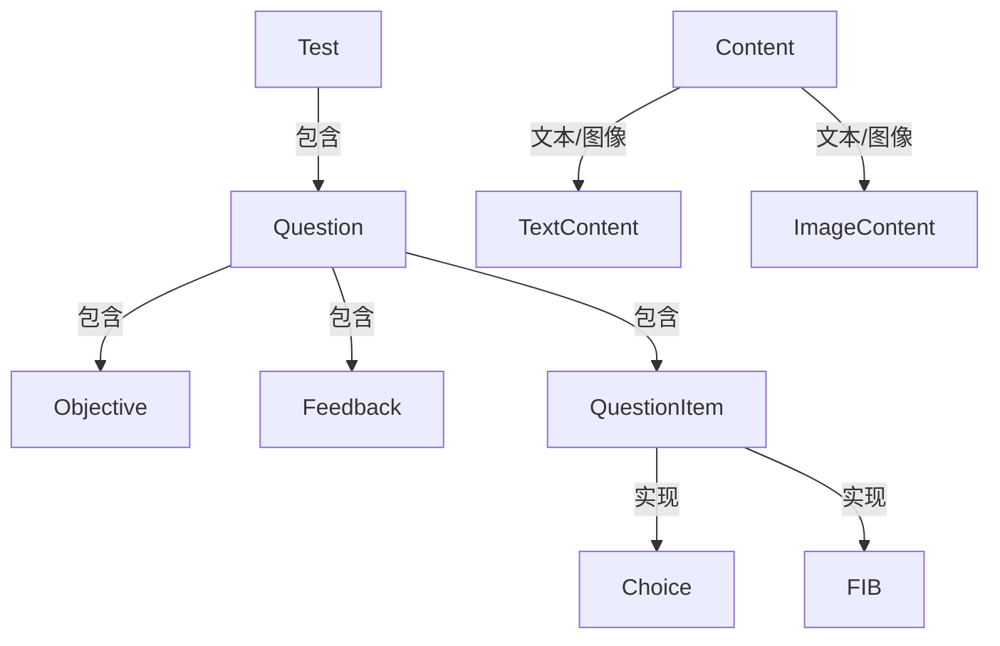

# 《Java案例开发》章节总结

## 书籍信息

- 书名：Java案例开发
- 作者：张靓、顾慧敏 等
- PDF 状态：完整
- OCR 状态：良好

## 目录说明

- 第1章：案例提出
- 第2章：Java编程基础
- 第3章：类、接口和包
- 第4章：异常处理
- 第5章：多线程处理
- 第6章：Java数据结构
- 第7章：JDBC
- 第8章：输入输出
- 第9章：网络编程
- 第10章：用户界面
- 第11章：JAR技术
- 第12章：Java XML
- 第13章：JNI

## 全书核心主题

以 Romulus 考试管理系统为贯穿案例，结合 Java 核心技术（面向对象、异常、多线程、数据结构、JDBC、I/O、网络、Swing、JAR、XML、JNI）进行实战开发讲解。

---

## 第1章：案例提出

### 核心论点

介绍 Romulus 系统需求、体系架构（三层结构：客户端-应用服务器-数据库）、模块设计，以及开发工具（JDK、Forte）的安装。

### 关键概念

- 考试子系统：考试客户端 + 应用服务器 + 考试数据库
- 管理子系统：管理客户端 + 管理数据库
- 模式应用：Visitor 模式分离数据与操作

---

## 第3章：类、接口和包

### 核心论点

Java 访问控制（public, protected, default, private）的深入理解；多态性最佳实践（接口优先于继承）；Romulus 的 Java 实现结构。

### 关键概念

- 访问控制粒度：类 → 包 → 子类 → 外界
- 接口优于抽象类：可多实现、更稳定
- 组合优于继承：使用 Wrapper 模式复用代码

### 流程图（Romulus 考试数据模型）

---

## 第4章：异常处理

### 核心论点

Java 异常机制：异常的引发、传播、捕获；自定义异常；最佳实践（不忽略异常、finally 清理）。

### 关键概念

- 异常分类：必然异常、条件异常、偶然异常
- throws / throw / try-catch-finally
- 异常链：SQLException 可获取多个异常
- 资源清理：在 finally 中关闭连接

---

## 第5章：多线程处理

### 核心论点

Java 多线程基本使用（Thread/Runnable）、线程状态、同步（synchronized）、wait/notify、线程组；Romulus 考试应用服务器使用多线程处理客户端请求。

### 关键概念

- 创建线程的两种方式
- synchronized 方法和块
- wait/notify 用于线程协作
- 线程组管理多个线程

---

## 第9章：网络编程

### 核心论点

TCP 和 UDP 编程；Romulus 应用服务器基于 Socket 实现自定义协议，多线程处理客户端请求。

### 关键概念

- ServerSocket 监听端口，accept 等待连接
- 每个客户端连接启动一个线程处理
- 自定义协议：定义命令字（UserCheck, GetTest, GradeTest）
- 使用 Properties 文件存储协议常量

---

## 第10章：用户界面

### 核心论点

Swing 组件、布局、事件处理；Romulus 考试客户端流程界面（登录、考试、批阅）、管理客户端（考生管理、考试管理、成绩查询）。

### 关键概念

- JFrame、JPanel、JButton、JCheckBox
- 事件监听：ActionListener
- 卡片布局（CardLayout）实现流程切换
- 表格模型（AbstractTableModel）显示成绩

---

（其余章节从略，全书覆盖了从基础到高级的完整开发流程）