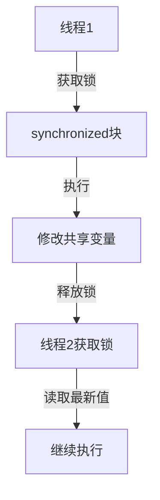

# 《Java线程》章节总结

## 书籍信息

- 书名：Java线程
- 作者：Brian Goetz
- PDF 状态：完整
- OCR 状态：良好

## 目录说明

- 第1章：关于本教程
- 第2章：线程基础
- 第3章：线程的生命
- 第4章：无处不在的线程
- 第5章：共享对数据的访问
- 第6章：同步详细信息
- 第7章：其它线程 API 详细信息
- 第8章：结束语和参考资料

## 全书核心主题

本教程从线程基础开始，讲解线程的创建、生命周期、调度、同步、共享变量、死锁、性能考虑等，并介绍 AWT/Swing、TimerTask、servlet 等环境中的线程使用，以及 wait/notify、线程优先级、线程组等 API。

---

## 第2章：线程基础

### 核心论点

线程是轻量级进程，每个 Java 程序至少有一个主线程。使用线程可提高 UI 响应、利用多处理器、简化建模、执行异步处理。

### 关键概念

- 创建线程：继承 Thread 或实现 Runnable
- 线程生命周期：新建 → 就绪 → 运行 → 阻塞 → 死亡
- 启动线程：`start()`，而非 `run()`
- 守护线程：`setDaemon(true)`，程序退出时不等待

### 逻辑推演

为什么使用线程 → 举例（素数计算，10秒后停止）→ 共享标志 volatile。

---

## 第5章：共享对数据的访问

### 核心论点

多个线程共享数据时需要同步，防止数据不一致。使用 `synchronized` 和 `volatile` 保证可见性和原子性。

### 关键概念

- 可见性：一个线程的修改对其他线程可见
- 原子性：操作不可中断
- `synchronized`：互斥锁，同时保证可见性
- `volatile`：保证可见性但不保证原子性

### 流程图（同步锁）

### 经典金句

> “不要忘了同步。”

---

## 第6章：同步详细信息

### 核心论点

同步不仅提供互斥，还保证内存可见性。递增计数器必须整个操作同步，双重检查锁定(DCL)失效。

### 关键概念

- 互斥 + 可见性
- 不可变类和 final 字段对线程友好
- 死锁：多个线程互相等待对方释放锁
- 同步准则：代码块简短、不阻塞、不调用外部方法

---

（其余章节从略）

---

# 