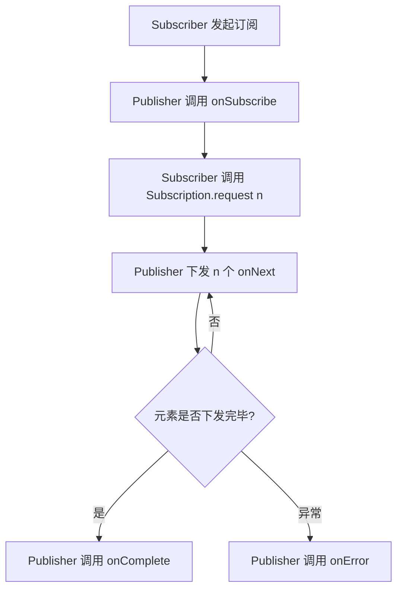
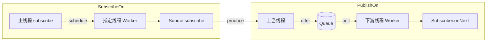
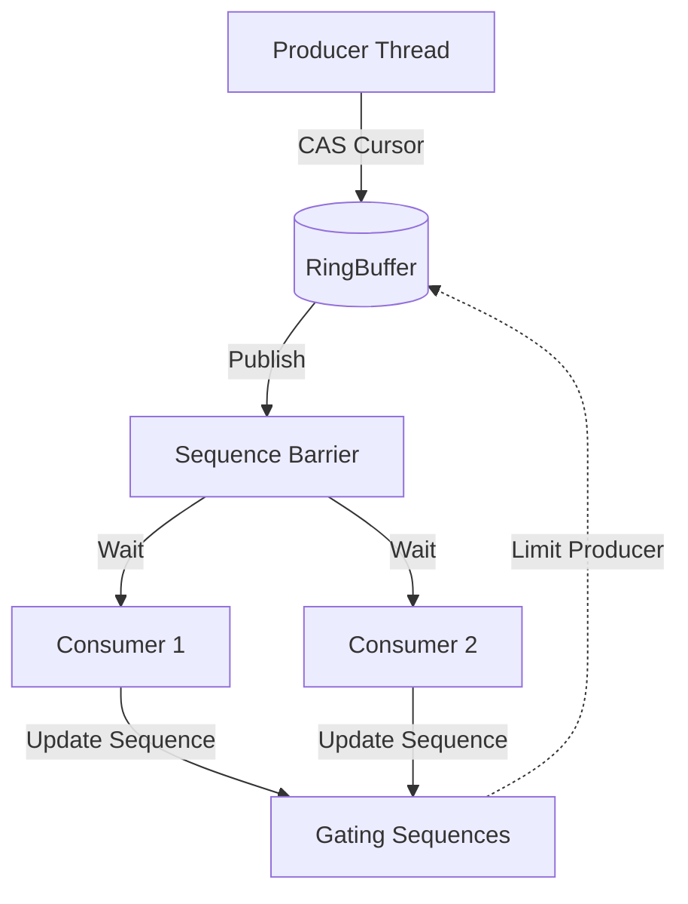

# 《Java编程方法论：响应式Spring Reactor 3设计与实现》章节总结

## 书籍信息
- **书名**：Java编程方法论：响应式Spring Reactor 3设计与实现
- **作者**：知秋
- **出版社**：电子工业出版社
- **出版时间**：2020年9月
- **ISBN**：9787121394768
- **PDF 状态**：完整文本可识别
- **OCR 状态**：良好，内容清晰

## 目录说明
本书共10章，结构清晰。基于提供的文本内容，已完整覆盖从第1章到第10章的核心内容，包括前言、推荐序及正文各章节。

## 全书核心主题
本书专注于解读 Spring Reactor 3 的代码设计与实现，旨在帮助中高级 Java 开发工程师深入理解响应式编程（Reactive Programming）的本质。全书从接口设计入手，逐步深入到 Flux 源与 Subscriber 的交互细节、调度器（Scheduler）的设计、常用操作符（Operator）的实现原理、Processor 的复杂场景应用、Context 上下文管理、测试库（reactor-test）的设计以及调试技巧。作者通过源码级分析，揭示了 Reactor 如何利用背压（Backpressure）、非阻塞 I/O 和函数式编程思想来构建高并发、低延迟的响应式系统，并对比了 Reactor 与 RxJava 的异同，强调了 Reactor 在 Spring 5+ 生态中的核心地位。

---

## 第1章：响应式编程概述

### 核心论点
本章旨在澄清响应式编程的基本概念，区分并发与并行，并解释背压机制。作者认为响应式编程是从命令式编程向声明式异步编程的重大转变，其核心价值在于通过统一的抽象简化异构服务集成，并通过背压机制实现资源的高效利用。

### 关键概念/事件
- **并发与并行**：并发是时间片轮转执行任务，并行是多核 CPU 同时执行任务。响应式编程通过调度 API 轻松实现事件的异步分发。
- **背压（Back Pressure）**当上游生产速度大于下游消费速度时，下游通过逆向压力信号控制上游发送速率，避免内存溢出。Reactor 中使用队列作为缓冲容器。
- **Reactive Streams 规范**：JDK 9 Flow API 的基础，定义了 Publisher、Subscriber、Subscription 和 Processor 四个核心接口。
- **Reactor vs RxJava**：Reactor 3 基于 JDK 8+ `java.util.function`，更贴合 Spring Framework 5；RxJava 2 兼容 Java 6+，自行定义函数式接口。Flux 对标 Flowable，Mono 对标 Single/Maybe。

### 逻辑推演/叙事脉络
本章首先通过生活实例（如听到名字做出反应）引入事件驱动和消费者视角的概念。接着辨析并发与并行的关系，指出多线程并不等于高性能，反而可能带来上下文切换开销。随后重点阐述背压机制，用“吸管喝饮料”和“大坝蓄水”比喻数据流控制。最后通过对比 Reactor 和 RxJava 的架构差异，确立 Reactor 3 在 Java 8+ 环境下的首选地位，并简要介绍 Reactor 的核心模块（Core, IPC, Addons）。

### 经典金句/数据
> “Reactive Programming supports more declarative, concise, deterministic ways to express complex, multithreaded algorithms.” —— Josh Long
> “响应式编程是从命令式编程到声明式异步编程的重大转变，是企业级应用架构的一次重大升级。”

---

## 第2章：对Flux的探索

### 核心论点
本章深入解析 Flux 作为多元素生产者的订阅逻辑、创建方式及内部优化机制。核心观点是 Flux 通过装饰器模式增强 Subscriber，并利用 `QueueSubscription` 和融合（Fusion）技术优化异步边界的数据传输性能。

### 关键概念/事件
- **订阅流程**：`subscribe()` -> `onSubscribe()` (请求数量) -> `onNext()` (元素下发) -> `onComplete()/onError()`。
- **LambdaSubscriber**：将 Lambda 表达式包装为标准 Subscriber，使用 `AtomicReferenceFieldUpdater` 优化原子操作性能。
- **Flux.create & Flux.push**：`create` 支持多线程生产者，内部使用 `SerializedSink` 保证线程安全；`push` 仅适用于单线程生产者，性能更高。
- **Flux.generate**：同步、逐一产生元素，状态由 `SynchronousSink` 管理，不支持异步多线程请求。
- **QueueSubscription & Fusion**：通过 `requestFusion` 协商 SYNC/ASYNC/NONE 模式，减少队列拷贝，提升吞吐量。

### 逻辑推演/叙事脉络
首先分析 `Flux.subscribe` 的底层逻辑，引出 `CoreSubscriber` 和 `LambdaSubscriber` 的实现细节，特别是原子类字段更新器的技法。接着探讨多种 Flux 创建方式（`create`, `generate`, `just`, `fromArray` 等），重点对比 `create` 与 `push` 在线程安全性上的取舍。随后深入 `generate` 的同步限制及其原因。最后引入 `QueueSubscription` 接口，解释其在背压处理和请求融合（Request Fusion）中的作用，为后续调度器章节做铺垫。

### 流程图（如存在）

### 经典金句/数据
> “FluxArray 就是这样一个例子，从生产源角度来说，它通过继承 Flux<T> 来对外表示自己的生产源身份；而从功能增强处理的角度来说，其依靠的是内部类对所传入的 Subscriber 进行包装增强。”

---

## 第3章：调度器

### 核心论点
本章详解 Reactor 的线程调度机制，核心在于理解 `publishOn`（切换消费线程）和 `subscribeOn`（切换生产线程）的区别，以及 `Schedulers.elastic` 等调度器的内部实现。作者强调调度器是解决非阻塞异步编程中线程模型映射的关键。

### 关键概念/事件
- **Schedulers 类型**：`immediate`（当前线程）、`single`（单线程复用）、`elastic`（弹性线程池，适合 I/O）、`parallel`（固定大小，适合 CPU 密集型）。
- **ElasticScheduler**：基于缓存的 `ScheduledExecutorService`，闲置线程超时销毁，通过 `CachedService` 管理生命周期。
- **publishOn**：改变下游操作执行的线程。内部使用队列缓冲元素，通过 `Worker` 调度任务。涉及请求融合优化。
- **subscribeOn**：改变上游源初始订阅和元素生产的线程。注意 `requestOnSeparateThread` 参数对背压请求阻塞的影响。
- **ParallelFlux**：将数据流分割为多个并行子流，每个子流独立调度，最后合并。

### 逻辑推演/叙事脉络
首先介绍各类 Scheduler 的特性，重点剖析 `ElasticScheduler` 的懒加载、线程缓存和任务包装机制（`DirectScheduleTask`）。接着深入 `publishOn` 源码，解释其如何通过队列解耦上下游线程，并利用 `requestFusion` 优化连续 publishOn 的性能。然后分析 `subscribeOn`，特别指出在背压请求可能阻塞时，需配置 `requestOnSeparateThread=false` 以避免死锁或性能下降。最后简述 `ParallelFlux` 的并行处理模型。

### 流程图（如存在）

### 经典金句/数据
> “publishOn 方法切换的是元素消费操作执行时所在的线程……而 subscribeOn 方法切换的是源中元素生产逻辑执行时所在的线程。”

---

## 第4章：对Reactor操作的解读

### 核心论点
本章分类讲解常用 Operator 的实现原理与应用场景，强调代码重用和逻辑清晰。核心观点是通过 `transform`/`transformDeferred` 封装通用逻辑，利用 `buffer`/`window`/`groupBy` 进行批处理，以及正确选择 `merge`/`flatMap`/`concatMap` 处理多源合并。

### 关键概念/事件
- **transform vs transformDeferred**：`transform` 在组装时立即执行函数；`transformDeferred`（原 compose）在订阅时延迟执行，适用于动态逻辑。
- **批处理**：`buffer`（收集为 List）、`window`（收集为 Flux）、`groupBy`（按键分组为 GroupedFlux）。
- **合并操作**：`merge`（按时间顺序合并）、`mergeSequential`（按源订阅顺序合并）、`flatMap`（异步映射合并）、`concatMap`（有序映射合并）。
- **ConnectableFlux**：`publish` 和 `replay` 实现热数据源共享。`refCount` 自动管理连接，但早期版本存在 Bug（断开重连问题）。

### 逻辑推演/叙事脉络
从简单的 `filter` 和 `map` 入手，引出 `transform` 的操作封装能力，并对比 `transformDeferred` 的延迟特性。接着详细对比三种批处理操作 `buffer`、`window` 和 `groupBy` 的数据结构和行为差异。随后分析多源合并策略，通过图示和 Demo 区分 `merge`、`flatMap` 和 `concatMap` 的并发性和顺序性保证。最后讨论 `ConnectableFlux` 的热数据源特性及 `refCount` 的实现缺陷与修复方案。

### 经典金句/数据
> “transformDeferred 就是将通用操作放在一个包装过的 subscriber 中执行，其在编译的时候并不会替换 transformer，只有在真正产生订阅关系的时候，才会执行 transformer 这个 Function 对象所定义的代码逻辑。”

---

## 第5章：对Processor的探索

### 核心论点
Processor 既是 Publisher 又是 Subscriber，用于桥接非响应式世界或实现复杂的状态机。本章警告应尽量避免使用 Processor，因其复杂性易导致错误，并详细分析了 `UnicastProcessor`、`DirectProcessor`、`EmitterProcessor` 和 `ReplayProcessor` 的特性。

### 关键概念/事件
- **UnicastProcessor**：仅支持单个 Subscriber，支持背压，内部使用队列缓冲。
- **DirectProcessor**：不支持背压，无缓冲，多 Subscriber 广播。若 Subscriber 未请求即发送数据会报错或丢弃。
- **EmitterProcessor**：支持多 Subscriber 和背压，内部有缓冲队列。`autoCancel` 特性可在无订阅者时清空缓存。
- **ReplayProcessor**：缓存历史元素，新 Subscriber 可重放历史数据。使用链表结构的 Buffer 实现高效存储。

### 逻辑推演/叙事脉络
首先定义 Processor 的双重角色及使用风险。依次剖析四种主要 Processor：`UnicastProcessor` 的单订阅限制与背压实现；`DirectProcessor` 的无缓冲广播特性及终止状态管理；`EmitterProcessor` 的多订阅支持与自动取消机制；`ReplayProcessor` 的历史回放机制及其内部 `UnboundedReplayBuffer` 的链表结构设计。通过 Demo 展示常见误用（如重复订阅导致的异常）。

### 经典金句/数据
> “在正常的情况下，应该尽量避免使用 Processor，因为其确实不好用……能力越强，责任也就越大，做出来的东西在逻辑上就可能越复杂，不容易驾驭。”

---

## 第6章：TopicProcessor及Reactor中匹配Disruptor的实现代码

### 核心论点
本章深入分析基于 LMAX Disruptor 理念实现的 `TopicProcessor`，这是一种高性能、支持多 Subscriber 广播的异步 Processor。核心在于利用环形队列（RingBuffer）和无锁 CAS 操作实现高吞吐和低延迟。

### 关键概念/事件
- **RingBuffer**：环形数组结构，通过序列号（Sequence）管理读写指针，避免垃圾回收。
- **WaitStrategy**：等待策略（如 `PhasedOffLiteLock`），平衡 CPU 占用和延迟，涉及自旋、yield 和 LockSupport.park。
- **MultiProducerRingBuffer**：支持多线程生产，通过 CAS 竞争游标（Cursor）和 gatingSequences 防止覆盖未消费数据。
- **EventLoopGroup 设计**：借鉴 Netty，分为 `BossEventLoopGroup`（处理上游请求）和 `WorkerEventLoopGroup`（处理下游订阅者分发）。

### 逻辑推演/叙事脉络
介绍 `TopicProcessor` 的设计背景（借鉴 Disruptor）。解析其核心组件：Slot（数据槽）、Sequence（序列号）、RingBuffer（环形队列）。深入 `MultiProducerRingBuffer` 的生产逻辑，解释如何通过 `gatingSequences` 追踪最慢消费者以防止数据覆盖。分析消费者的等待策略 `WaitStrategy` 及其性能调优。最后阐述 `TopicProcessor` 如何模拟 Netty 的 EventLoop 模型，分离上游请求任务和下游元素分发任务，并讨论冷数据源的处理逻辑。

### 流程图（如存在）

### 经典金句/数据
> “TopicProcessor 算是一个相对复杂的 Processor，Reactor 借鉴了 Disruptor 并发框架库，并基于自身实际情况，设计了一套匹配实现代码。”

---

## 第7章：对WorkQueueProcessor的解读

### 核心论点
`WorkQueueProcessor` 与 `TopicProcessor` 类似，但采用负载均衡（Round-Robin）模式而非广播模式，即每个元素只发送给一个 Subscriber。本章解析其共享消费进度的机制及与 `TopicProcessor` 的区别。

### 关键概念/事件
- **负载均衡**：所有 Subscriber 共享同一个 `workSequence`，通过 CAS 竞争获取下一个元素，实现负载分担。
- **非公平性**：由于线程调度不确定性，不保证严格的 Round-Robin，可能出现某个 Subscriber 连续获取多个元素。
- **资源效率**：相比 `TopicProcessor`，`WorkQueueProcessor` 维护的限制序列更少，资源消耗更低。
- **冷数据源**：同样支持在上游结束后转为冷数据源，重放历史数据（若配置允许）。

### 逻辑推演/叙事脉络
对比 `WorkQueueProcessor` 与 `TopicProcessor` 的核心差异：广播 vs 负载均衡。解析 `WorkQueueProcessor` 如何通过共享 `workSequence` 实现元素的分发，以及由此带来的非公平性问题。分析其 `requestTask` 逻辑，指出其简化了序列号限制管理。最后再次探讨冷热数据源的转换逻辑，并通过 Demo 展示其行为特征。

### 经典金句/数据
> “WorkQueueProcessor 中的模式更类似于 round-robin 模式，但不保证是公平的 round-robin 模式……订阅者数量越多，挂起的线程数量也就越多。”

---

## 第8章：Reactor中特供的Context

### 核心论点
为解决异步线程切换中 `ThreadLocal` 失效的问题，Reactor 3.1 引入了 `Context`。本章阐述 Context 的设计初衷、不可变性特性及其在订阅链中的传递机制，强调其是订阅者级别的上下文存储。

### 关键概念/事件
- **Context vs ThreadLocal**：ThreadLocal 绑定线程，Context 绑定订阅关系（Subscription Chain）。
- **不可变性**：Context 是 immutable 的，每次 `put` 操作都会生成新的 Context 实例（类似 Tuple 结构）。
- **subscriberContext**：用于在订阅链下游设置 Context，向上游传递。
- **Mono.subscriberContext()**：用于在当前步骤读取 Context。

### 逻辑推演/叙事脉络
首先指出在响应式流中线程切换导致 ThreadLocal 数据丢失或泄露的问题。引出 Context 作为解决方案，解释其基于订阅者而非线程的设计哲学。通过源码分析 Context 的不可变实现（Context0, Context1... ContextN）。演示如何使用 `subscriberContext` 写入数据和 `Mono.subscriberContext()` 读取数据，并结合实战 Demo（如权限校验 ID 传递）展示其应用场景。

### 经典金句/数据
> “Context 是以订阅者为主体来设计的，用于维护整个订阅过程上下文中产生的额外信息……Context 具有不可变性。一旦不再使用获得的对象，就可以将其抛弃，而不是在该对象的基础上修改内部值。”

---

## 第9章：Reactor中的测试

### 核心论点
本章介绍 `reactor-test` 模块，重点讲解 `StepVerifier` 和 `TestPublisher` 的使用。核心观点是通过声明式 API 验证异步流的信号序列、时间和上下文，利用虚拟时钟测试时间相关逻辑，使用 `PublisherProbe` 验证执行路径。

### 关键概念/事件
- **StepVerifier**：链式 API，用于定义期望的信号序列（expectNext, expectError, thenAwait 等）。
- **虚拟时钟**：`withVirtualTime` 允许快速测试涉及延时的流，无需真实等待。
- **TestPublisher**：手动控制信号发出的热数据源，支持违规模式测试（如允许 null、允许溢出）。
- **PublisherProbe**：用于检测某条执行路径是否被触发（特别是 Mono<Void> 场景）。

### 逻辑推演/叙事脉络
首先介绍 `StepVerifier` 的基本用法，包括验证正常信号、错误信号和完成信号。深入解析其内部脚本（Script）执行机制。接着介绍时间测试，利用虚拟时钟加速延时操作。随后讲解 `TestPublisher` 的创建与违规模式配置，用于测试边缘情况。最后引入 `PublisherProbe`，解决空值流（Void）执行路径难以断言的问题，并展示其内部基于原子类的实现原理。

### 经典金句/数据
> “StepVerifier 主要进行了两方面的测试：针对上游及通过一系列操作得到的新源的测试……针对自定义的一系列操作的测试。”

---

## 第10章：Reactor中的调试

### 核心论点
响应式堆栈跟踪通常难以阅读，本章介绍 Reactor 提供的调试辅助工具。核心观点是通过启用全局调试模式（Hooks.onOperatorDebug）或局部检查点（checkpoint）来丰富异常堆栈信息，定位错误发生的具体操作符位置。

### 关键概念/事件
- **Hooks.onOperatorDebug()**：全局启用，捕获操作符组装时的堆栈快照，异常时附加 Suppressed 异常信息。
- **checkpoint()**：局部启用，在特定操作符后添加标记，异常时显示该标记名称，性能开销较小。
- **log()**：记录订阅、请求、元素下发、完成/错误等生命周期事件，用于运行时监控。
- **AssemblySnapshotException**：包装后的异常类型，包含操作链的快照信息。

### 逻辑推演/叙事脉络
首先说明响应式调试的难点（堆栈断裂）。介绍全局调试模式 `Hooks.onOperatorDebug` 的原理：在操作符组装时捕获堆栈，异常发生时通过 `addSuppressed` 附加详细信息。分析异常日志的结构，解释如何阅读 Suppressed 部分。接着介绍轻量级的 `checkpoint` 方法，适用于已知可疑区域。最后简述 `log` 操作符在实时监控中的作用。

### 经典金句/数据
> “千万要在测试源实例化之前定义 Hooks.onOperatorDebug，否则调试模式在产生订阅时不会生效。”
> “如果我们能大概定位疑似有问题的具体操作，就可以不用花那么高的性能成本……即通过 checkpoint 方式来对特定的操作链启用调试模式。”