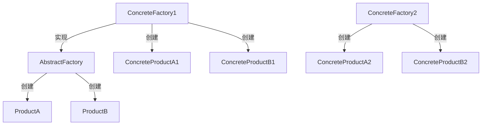

# 《Java设计模式之抽象工厂模式》章节总结

## 书籍信息

- 书名：Java设计模式之抽象工厂模式
- 作者：未明确
- PDF 状态：仅几页，内容简短
- OCR 状态：完整

## 目录说明

- 仅包含抽象工厂模式的基本介绍和一个简单实例

## 全书核心主题

介绍抽象工厂模式的概念、创建过程、适用场景及简单代码示例。

---

## 第1章：抽象工厂模式

### 核心论点

抽象工厂模式提供一个创建一系列相关或相互依赖对象的接口，而无需指定具体类。适用于多系列对象创建。

### 关键概念

- 产品族：一组不同产品系列的组合
- 具体工厂：继承自抽象工厂，负责创建具体产品
- 开闭原则（OCP）：增加产品族符合，增加新产品不符合

### 流程图



### 代码示例（Java）

```java
interface IPlant { }
class PlantA implements IPlant { }
class PlantB implements IPlant { }
interface IFruit { }
class FruitA implements IFruit { }
class FruitB implements IFruit { }
interface AbstractFactory {
    IPlant createPlant();
    IFruit createFruit();
}
class FactoryA implements AbstractFactory {
    public IPlant createPlant() { return new PlantA(); }
    public IFruit createFruit() { return new FruitA(); }
}
// 同理 FactoryB
```

### 经典金句

> “增加新的产品族时，需要增加具体工厂类，符合OCP原则。增加新产品时，需要修改具体工厂类和增加产品类，不符合OCP原则。”

---

# 