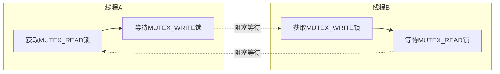
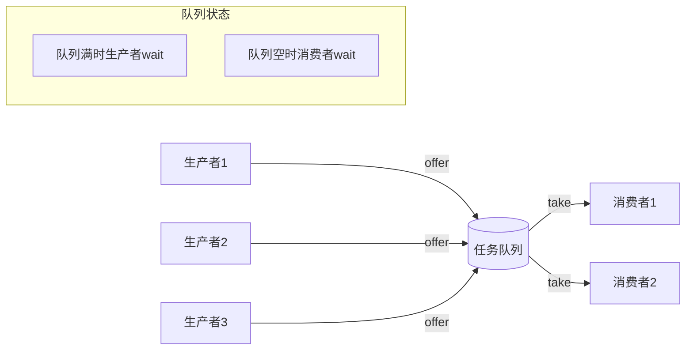
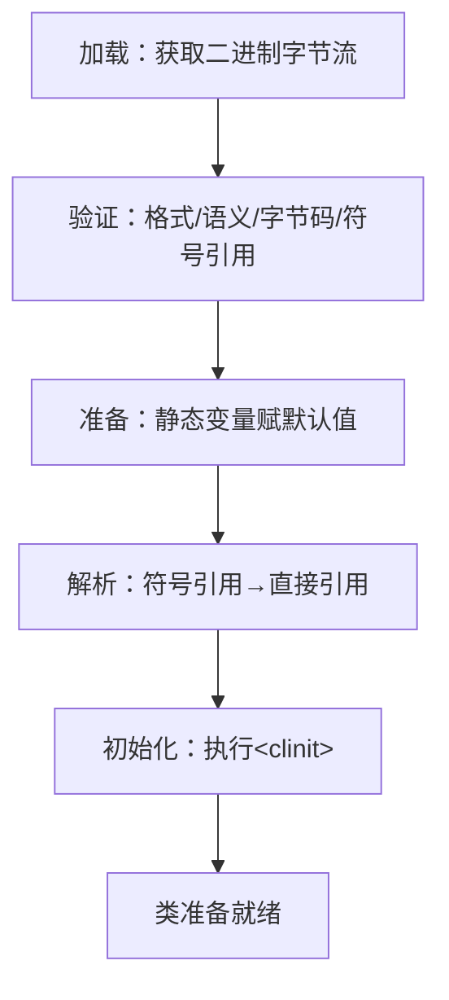
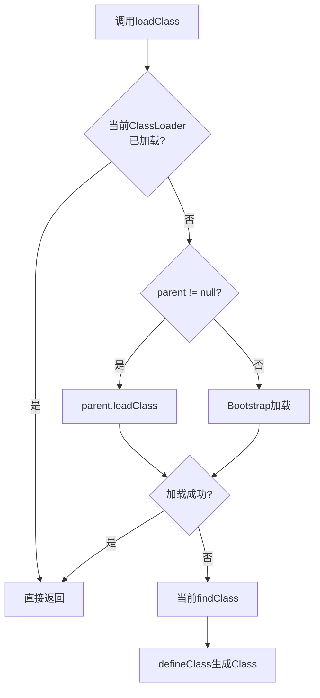
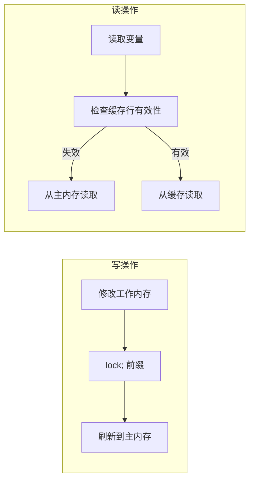
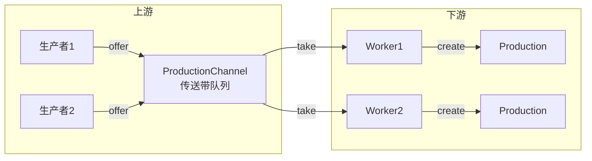
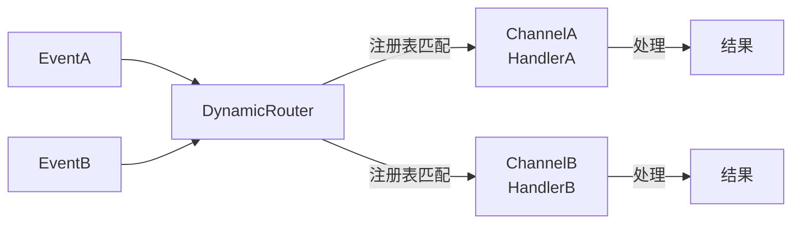

# 《Java高并发编程详解：多线程与架构设计》章节总结

## 书籍信息
- **书名**：Java高并发编程详解：多线程与架构设计
- **作者**：汪文君 (Alex Wang)
- **出版社**：机械工业出版社
- **出版时间**：2018年6月第1版
- **ISBN**：978-7-111-59993-7
- **定价**：89.00元

## 内容概述
本书是Java多线程与高并发编程领域的专著，共分为四个部分：第一部分深入讲解多线程基础（Thread API、线程安全、数据同步、线程间通信等）；第二部分详细阐述Java ClassLoader的原理与机制；第三部分深入剖析volatile关键字的语义与JMM；第四部分系统介绍15种多线程设计架构模式。全书注重实战与原理结合，通过大量案例和源码分析帮助读者掌握高并发程序设计技巧。

---

## 第一部分：多线程基础

---

## 第1章：快速认识线程

### 1. 核心论点

**问题**：如何理解线程的概念、生命周期及其在Java中的基本使用方式？

**观点**：线程是程序执行的路径，每个线程都有自己的局部变量表、程序计数器和生命周期。掌握线程的生命周期（NEW→RUNNABLE→RUNNING→BLOCKED→TERMINATED）是学习多线程编程的基础。

### 2. 关键概念

- **进程与线程**：进程是操作系统中执行的一个任务，每个进程内部至少有一个线程。线程是轻量级的进程。
- **线程生命周期五状态**：
  - NEW：Thread对象创建但未启动
  - RUNNABLE：调用start()后，等待CPU调度
  - RUNNING：获得CPU执行权，正在运行
  - BLOCKED：因等待锁、sleep、IO操作等进入阻塞
  - TERMINATED：线程结束生命周期
- **模板设计模式在Thread中的应用**：Thread的start()方法定义了算法结构（调用start0()），run()方法由子类实现具体逻辑。
- **策略模式在Thread中的应用**：Thread与Runnable的分离——Thread负责线程控制，Runnable负责业务执行单元。

### 3. 逻辑推演

作者从“并行运行”的实际需求出发，通过“听音乐+看新闻”的例子演示了单线程无法并发执行的问题，引入Thread解决。接着详细剖析了线程的五个生命周期状态及其转换条件，分析了start()方法的源码（调用start0() JNI方法），说明了模板设计模式在Thread中的应用。最后通过营业大厅叫号机案例，演示了多线程共享资源时的数据不一致问题，为后续线程安全章节做铺垫。

### 4. 经典金句

> “创建线程只有一种方式那就是构造Thread类，而实现线程的执行单元则有两种方式：第一种是重写Thread的run方法，第二种是实现Runnable接口的run方法。”

> “线程的生命周期将会贯穿始终，只有清晰地掌握生命周期各个阶段的切换，才能更好地理解线程的阻塞以及唤醒机制。”

### 5. 流程图

#### 线程生命周期状态图

```mermaid
graph TD
    NEW["NEW（新建）<br/>Thread对象创建"] -->|start()| RUNNABLE["RUNNABLE（可执行）<br/>等待CPU调度"]
    RUNNABLE -->|获得CPU时间片| RUNNING["RUNNING（运行中）<br/>正在执行"]
    RUNNING -->|yield()/时间片用完| RUNNABLE
    RUNNING -->|wait()/sleep()/IO阻塞| BLOCKED["BLOCKED（阻塞）"]
    BLOCKED -->|唤醒/超时/notify| RUNNABLE
    RUNNING -->|stop()/异常/正常结束| TERMINATED["TERMINATED（终止）"]
    BLOCKED -->|stop()/JVM Crash| TERMINATED
```

---

## 第2章：深入理解Thread构造函数

### 1. 核心论点

**问题**：Thread构造函数中有哪些容易被忽视的细节？线程命名、父子关系、ThreadGroup、栈内存（stackSize）与JVM内存结构有何关联？

**观点**：线程的命名、父子关系、所属ThreadGroup、栈内存大小都深刻影响着线程的行为和JVM的线程创建能力。理解这些构造函数细节有助于编写更健壮的多线程程序。

### 2. 关键概念

- **线程命名**：默认命名规则为`"Thread-" + nextThreadNum()`；强烈推荐为线程起有意义的名称以便排查问题。
- **线程父子关系**：任何线程都由另一个线程创建，父线程是执行new Thread()的线程；子线程从父线程继承守护属性、优先级和ThreadGroup。
- **Thread与ThreadGroup**：未显式指定ThreadGroup时，子线程加入父线程所在的Group。
- **stackSize参数**：指定线程栈内存大小，越大则递归深度越深，越小则可创建的线程数量越多（进程内存=堆内存+线程数×栈内存）。
- **守护线程**：当JVM中只有守护线程运行时，JVM进程退出；守护线程用于后台任务（如GC）。

### 3. 逻辑推演

作者从Thread构造函数源码入手，分析了线程命名的默认规则（Thread-0、Thread-1...）和setName()的时机（仅在线程NEW状态有效）。通过init()方法源码，论证了父子关系和ThreadGroup的继承规则。通过实验数据（Windows vs Ubuntu）展示了stackSize对递归深度的影响。结合JVM内存结构图，推导出线程数量与栈内存、堆内存的反比关系公式。最后通过对比实验，说明了守护线程的特性及其应用场景。

### 4. 经典金句

> “一个线程的创建肯定是由另一个线程完成的。被创建线程的父线程是创建它的线程。”

> “在JVM中到底可以创建多少个线程，与堆内存、栈内存的大小有着直接的关系。”

> “守护线程经常用作执行一些后台任务，当希望关闭某些线程的时候，或者退出JVM进程的时候，一些线程能够自动关闭，此时就可以考虑用守护线程。”

---

## 第3章：Thread API的详细介绍

### 1. 核心论点

**问题**：Thread类提供的核心API（sleep、yield、优先级、interrupt、join）的作用、区别及使用注意事项是什么？

**观点**：熟练掌握Thread的API是学好多线程编程的前提。sleep与yield有本质区别（阻塞vs提示、释放锁vs不释放、可中断vs不可中断）；interrupt机制是可中断方法的核心；join可用于实现任务局部并行化。

### 2. 关键概念

- **sleep()**：使当前线程进入指定毫秒数的休眠，不释放monitor锁；推荐使用`TimeUnit`替代`Thread.sleep()`。
- **yield()**：提示调度器“我愿意放弃当前CPU资源”，但调度器可能忽略；不会释放锁。
- **线程优先级**：范围1~10（默认5），但不能大于所在ThreadGroup的最大优先级；仅为hint，不保证调度顺序。
- **interrupt机制**：
  - `interrupt()`：设置中断标志，可打断可中断方法（sleep/wait/join等）
  - `isInterrupted()`：检查中断标志，不清除
  - `interrupted()`：静态方法，检查并清除中断标志
- **join()**：使当前线程等待目标线程结束，可中断、可超时。

### 3. 逻辑推演

作者先通过对比实验说明了sleep与yield的本质区别（sleep保证休眠、yield仅提示；sleep释放CPU不释放锁、yield可能让出CPU）。通过源码分析线程优先级的限制机制（受父Group maxPriority约束）。通过大量代码示例详细演示了interrupt、isInterrupted、interrupted的区别，重点说明了可中断方法捕获InterruptedException后会清除中断标志。最后通过“航班信息查询”案例，演示了join方法实现多任务并发查询、汇总结果的实战应用。

### 4. 经典金句

> “可中断方法捕获到了中断信号之后，为了不影响线程中其他方法的执行，将线程的interrupt标识复位是一种很合理的设计。”

> “join方法会使当前线程永远地等待下去，直到期间被另外的线程中断，或者join的线程执行结束。”

### 5. 流程图

#### 线程中断处理流程

```mermaid
graph TD
    A[线程执行可中断方法<br/>sleep/wait/join] --> B{其他线程调用<br/>interrupt()?}
    B -->|是| C[中断标志被设置]
    C --> D[可中断方法抛出<br/>InterruptedException]
    D --> E[中断标志被清除]
    E --> F[catch块处理异常]
    B -->|否| G[方法正常执行完成]
```

---

## 第4章：线程安全与数据同步

### 1. 核心论点

**问题**：多线程环境下共享资源为何会出现数据不一致？synchronized关键字如何保证线程安全？死锁的原因及如何诊断？

**观点**：synchronized提供排他性锁机制，通过monitorenter/monitorexit指令保证同一时刻只有一个线程访问共享资源。正确使用synchronized需要理解this monitor和class monitor的区别，避免锁交叉导致的死锁。

### 2. 关键概念

- **数据不一致的三个表现**：号码被略过、号码重复出现、号码超过最大值。
- **synchronized关键字**：
  - 同步方法：`public synchronized void method()`
  - 同步代码块：`synchronized(object) {...}`
- **monitor原理**：每个对象关联一个monitor，计数器为0时线程可获得锁（计数器+1），重入时计数器累加，释放时计数器-1。
- **this monitor vs class monitor**：
  - this monitor：synchronized修饰实例方法，锁的是当前实例（this）
  - class monitor：synchronized修饰静态方法，锁的是Class对象
- **死锁的六种原因**：交叉锁、内存不足、一问一答式数据交换、数据库锁、文件锁、死循环（假死）。

### 3. 逻辑推演

作者通过营业大厅叫号机程序引入数据不一致问题，用时序图分析了“略过”“重复”“超限”三种情况的根本原因（多线程同时对共享变量index操作）。引入synchronized关键字后，通过jstack和javap分析monitorenter/monitorexit指令，揭示了同步的底层原理。重点对比了this monitor（实例锁）和class monitor（类锁）的区别。最后通过DeadLock示例演示交叉锁死锁，介绍jstack和jvisualvm的诊断方法。

### 4. 经典金句

> “synchronized关键字提供了一种锁的机制，能够确保共享变量的互斥访问，从而防止数据不一致问题的出现。”

> “使用synchronized关键字同步类的不同实例方法，争抢的是同一个monitor的lock，而与之关联的引用则是ThisMonitor的实例引用。”

> “多个锁的交叉很容易引起线程出现死锁的情况，程序并没有任何错误输出，但就是不工作。”

### 5. 流程图

#### 交叉锁死锁示意图



---

## 第5章：线程间通信

### 1. 核心论点

**问题**：多个线程如何协同工作、互相通信？wait/notify机制的原理是什么？如何弥补synchronized的缺陷？

**观点**：wait/notify是实现线程间通信的核心机制，wait使线程释放monitor并进入wait set，notify唤醒wait set中的线程。生产者消费者模式是多线程通信的最佳范例。通过自定义BooleanLock可以弥补synchronized不可中断、无法超时的缺陷。

### 2. 关键概念

- **同步阻塞 vs 异步非阻塞**：同步阻塞导致客户端长时间等待，异步非阻塞通过任务队列+工作线程池提高吞吐量。
- **wait/notify机制**：
  - `wait()`：释放monitor锁，进入wait set等待
  - `notify()`/`notifyAll()`：唤醒wait set中的线程
  - 必须在synchronized块中调用
- **wait set（线程休息室）**：每个对象monitor关联一个wait set，调用wait()的线程进入该集合。
- **生产者消费者模式**：生产者向队列offer数据，消费者从队列take数据，队列满/空时线程挂起。
- **BooleanLock（自定义显式锁）**：具备synchronized的排他性，额外支持可中断和超时功能。

### 3. 逻辑推演

作者首先对比了同步阻塞与异步非阻塞两种消息处理架构，引出线程间通信的需求。通过EventQueue示例演示wait/notify的基本用法，然后分析多线程环境下（多个生产者/消费者）出现的两类数据不一致问题（队列空时removeFirst、队列满时addLast），解决方案是将if改为while、notify改为notifyAll。最后指出synchronized的两个缺陷（不可中断、无超时），并基于wait/notify实现了BooleanLock。

### 4. 经典金句

> “wait和sleep方法都可以使线程进入阻塞状态，但wait会释放monitor的锁，而sleep不会。”

> “必须在同步方法中使用wait和notify方法，因为执行wait和notify的前提条件是必须持有同步方法的monitor的所有权。”

> “BooleanLock除了具备synchronized关键字的访问共享资源的语义之外，还增加了可中断以及可超时等特点。”

### 5. 流程图

#### 生产者消费者模型



---

## 第6章：ThreadGroup详细讲解

### 1. 核心论点

**问题**：ThreadGroup的作用是什么？它与Thread之间是什么关系？ThreadGroup提供了哪些API？

**观点**：ThreadGroup不是用来管理线程的，而是针对线程的一种组织方式。线程会自动加入父线程所在的Group，ThreadGroup之间也存在父子关系。

### 2. 关键概念

- **ThreadGroup与Thread的关系**：每个线程都属于一个ThreadGroup，默认加入父线程所在的Group。
- **enumerate方法**：复制Thread或ThreadGroup数组到指定数组中，支持递归复制子Group。
- **interrupt()**：中断ThreadGroup中所有active线程（递归子Group）。
- **destroy()**：销毁ThreadGroup（必须无active线程）。
- **守护ThreadGroup**：设置daemon=true后，当Group中无active线程时自动destroy。

### 3. 逻辑推演

作者从ThreadGroup的创建入手，通过代码演示了父子Group的层级关系。重点分析了enumerate方法的源码（递归复制active线程），并通过实验对比递归与非递归的结果差异。分析了ThreadGroup的interrupt方法源码，说明其会递归中断所有子Group中的线程。通过destroy和setDaemon的示例，说明了ThreadGroup的生命周期管理。

---

## 第7章：Hook线程以及捕获线程执行异常

### 1. 核心论点

**问题**：如何捕获线程运行时的异常？Hook线程的作用是什么？

**观点**：UncaughtExceptionHandler接口提供了线程运行时异常的回调机制，可在线程级别或全局级别设置。Hook线程在JVM收到退出信号时执行，可用于资源释放、防止程序重复启动。

### 2. 关键概念

- **UncaughtExceptionHandler**：线程出现未捕获异常时的回调接口。
- **异常处理优先级**：线程自己的Handler → 所在ThreadGroup的Handler → 全局默认Handler → System.err输出。
- **Hook线程**：通过`Runtime.getRuntime().addShutdownHook()`注入，JVM退出时执行。

### 3. 逻辑推演

作者通过Thread源码分析，揭示了dispatchUncaughtException方法的调用链：线程异常 → getUncaughtExceptionHandler() → uncaughtException()。ThreadGroup实现了UncaughtExceptionHandler接口，会递归向上传递。通过PreventDuplicated示例（创建.lock文件防止重复启动），演示了Hook线程在进程收到kill信号时删除锁文件的实战应用。

### 4. 经典金句

> “Hook线程只有在收到退出信号的时候会被执行，如果在kill的时候使用了参数-9，那么Hook线程不会得到执行，进程将会立即退出。”

---

## 第8章：线程池原理以及自定义线程池

### 1. 核心论点

**问题**：线程池的核心要素是什么？如何从零实现一个功能完善的线程池？

**观点**：一个完整的线程池应具备任务队列、线程数量管理（init/core/max）、拒绝策略、线程工厂等要素。通过自定义线程池可以深入理解JUC中ExecutorService的原理。

### 2. 关键概念

- **线程池五大要素**：任务队列、线程数量管理（init≤core≤max）、拒绝策略、线程工厂、任务队列容量限制。
- **拒绝策略三种实现**：Discard（丢弃）、Abort（抛异常）、Runner（调用者线程执行）。
- **线程池动态维护**：任务积压时扩容（core→max），空闲时回收至core数量。

### 3. 逻辑推演

作者从线程池原理图入手，抽象出线程池的五大要素。通过接口定义（ThreadPool、RunnableQueue、ThreadFactory、DenyPolicy）和实现类（LinkedRunnableQueue、BasicThreadPool、InternalTask）逐步构建完整线程池。重点分析了线程池自动维护线程数量的逻辑：当队列有积压且activeCount < coreSize时扩容至coreSize；当activeCount > coreSize且队列为空时回收至coreSize。最后通过测试验证了线程池的功能和性能。

### 4. 经典金句

> “线程数量和系统性能是一种抛物线的关系，也就是说当线程数量达到某个数值的时候，性能反倒会降低很多。”

> “笔者实现的线程池还存在诸多缺点：BasicThreadPool和Thread不应该是继承关系、销毁功能未返回未处理的任务、缺少Builder模式构造等。”

---

## 第二部分：Java ClassLoader

---

## 第9章：类的加载过程

### 1. 核心论点

**问题**：一个Java类从.class文件到内存中可用的Class对象经历了哪些阶段？主动使用与被动使用的区别是什么？

**观点**：类的加载分为加载、连接（验证、准备、解析）、初始化三个阶段。JVM采用懒加载（lazy）机制，只有在主动使用时才会初始化类。`<clinit>()`方法由JVM保证线程安全，只会执行一次。

### 2. 关键概念

- **类加载三阶段**：
  - 加载：获取二进制字节流，生成Class对象
  - 连接：验证（格式/语义/字节码/符号引用）、准备（静态变量赋默认值）、解析（符号引用→直接引用）
  - 初始化：执行`<clinit>()`，静态变量赋真实值
- **主动使用六种场景**：new、访问静态变量/方法、反射、初始化子类、main方法所在类、MethodHandle。
- **`<clinit>()`**：由编译器收集静态变量赋值和静态代码块生成，JVM保证同步执行。

### 3. 逻辑推演

作者以Singleton类的诡异输出问题开场（静态变量顺序影响结果），引发对类加载过程的探究。详细解释了加载阶段获取二进制流的多种方式（文件/网络/动态生成/数据库）。连接阶段的验证（魔术因子0xCAFEBABE、版本号、元数据、字节码、符号引用）、准备（默认初始值，final static例外）、解析（类/字段/方法/接口）。初始化阶段执行`<clinit>()`，父类`<clinit>()`优先执行。最后用Singleton示例解释了输出差异的原因。

### 4. 经典金句

> “JVM对类的初始化是一个延迟的机制，即使用的是lazy的方式，当一个类在首次使用的时候才会被初始化。”

> “如果在静态代码块中对后面的静态变量进行访问，则无法通过编译，因为`<clinit>()`中语句的执行顺序取决于源文件中的出现顺序。”

### 5. 流程图

#### 类加载完整流程



---

## 第10章：JVM类加载器

### 1. 核心论点

**问题**：JVM内置了哪些类加载器？双亲委托机制是什么？如何自定义类加载器？

**观点**：Bootstrap、ExtClassLoader、AppClassLoader构成三层类加载体系，通过双亲委托机制保证核心类库的安全。自定义类加载器需继承ClassLoader并重写findClass方法。

### 2. 关键概念

- **三大内置类加载器**：
  - Bootstrap（根加载器）：C++实现，加载rt.jar，getClassLoader()返回null
  - ExtClassLoader（扩展类加载器）：加载`jre/lib/ext/*`
  - AppClassLoader（系统类加载器）：加载classpath下的类
- **双亲委托机制**：先委托父类加载器加载，父类无法加载时才由自己加载。
- **破坏双亲委托**：重写loadClass方法可以打破委托模型，用于热部署等场景。
- **类加载器命名空间**：不同类加载器加载的同一个类在JVM中是不同的。

### 3. 逻辑推演

作者通过代码获取Bootstrap、Ext、App的加载路径，验证了三大加载器的职责范围。深入分析ClassLoader.loadClass()源码，揭示了双亲委托机制的执行流程（findLoadedClass → parent.loadClass → findClass）。通过指定parent=null或扩展类加载器作为父加载器，演示了如何绕过AppClassLoader。通过BrokerDelegateClassLoader示例（重写loadClass），演示了破坏双亲委托的方法。最后解释了类的卸载条件（所有实例被GC、ClassLoader被回收、Class无引用）。

### 4. 经典金句

> “对于任意一个class，都需要由加载它的类加载器和这个类本身确立其在JVM中的唯一性，这也就是运行时包。”

> “同一个class实例在同一个类加载器命名空间之下是唯一的，但不同类加载器加载同一个class会产生多个实例。”

### 5. 流程图

#### 双亲委托机制流程



---

## 第11章：线程上下文类加载器

### 1. 核心论点

**问题**：为什么需要线程上下文类加载器？它是如何解决SPI加载问题的？

**观点**：线程上下文类加载器是为了解决JDK核心类库（Bootstrap加载）无法加载第三方SPI实现（AppClassLoader加载）的问题而设计的，本质上破坏了双亲委托机制（父委托子）。

### 2. 关键概念

- **线程上下文类加载器**：通过`Thread.getContextClassLoader()`/`setContextClassLoader()`操作。
- **SPI加载困境**：JDBC等SPI接口由Bootstrap加载，但实现类由AppClassLoader加载，双亲委托导致无法加载。
- **解决方案**：在SPI实现中调用`Thread.currentThread().getContextClassLoader()`获取AppClassLoader，使用它加载实现类。

### 3. 逻辑推演

作者以JDBC驱动加载为例，分析了DriverManager.getConnection()的源码：通过线程上下文类加载器加载数据库驱动实现类。揭示了JDK官方亲自打破双亲委托机制的事实——允许父类加载器委托子类加载器加载SPI实现。这种设计虽然解决了问题，但被一些人认为是Java设计中的缺陷。

### 4. 经典金句

> “线程上下文类加载器不仅破坏了类加载器的父委托机制，而且还反其道而行之，允许‘子委托机制’，有人甚至认为它是Java设计中存在的一个缺陷。”

---

## 第三部分：深入理解volatile关键字

---

## 第12章：volatile关键字的介绍

### 1. 核心论点

**问题**：volatile关键字解决了什么问题？它与CPU缓存模型、Java内存模型有何关联？

**观点**：volatile保证了共享变量的可见性和有序性，但不保证原子性。理解volatile需要掌握CPU缓存一致性问题（MESI协议）和Java内存模型（JMM）的知识。

### 2. 关键概念

- **CPU缓存模型**：CPU与主存之间增加L1/L2/L3缓存，解决速度不匹配问题。
- **缓存一致性问题**：多核CPU各自缓存中同一变量的副本可能不一致。
- **MESI协议**：Intel缓存一致性协议，写操作时通知其他CPU置缓存行为无效。
- **JMM（Java内存模型）**：规定每个线程有私有工作内存，共享变量存于主内存，线程操作工作内存副本后刷新到主内存。

### 3. 逻辑推演

作者通过VolatileFoo示例（一个线程修改init_value，另一个线程读取）演示了不加volatile时Reader线程无法感知变化的现象。加入volatile后Reader线程能感知到变化。进而引出问题根源：JMM中线程工作内存的副本与主内存不同步。为此，作者介绍了CPU缓存模型、MESI协议和JMM的抽象结构，为第13章深入分析volatile做铺垫。

### 4. 经典金句

> “volatile关键字只能修饰类变量和实例变量，对于方法参数、局部变量以及实例常量、类常量都不能进行修饰。”

---

## 第13章：深入volatile关键字

### 1. 核心论点

**问题**：volatile如何保证可见性和有序性？它的底层实现原理是什么？与synchronized有何区别？

**观点**：volatile通过“lock;”前缀指令（内存屏障）实现可见性和禁止指令重排序。它比synchronized更轻量，但不具备原子性。

### 2. 关键概念

- **并发编程三大特性**：
  - 原子性：操作要么全部执行，要么全部不执行
  - 可见性：一个线程修改共享变量，其他线程立即看到
  - 有序性：代码执行顺序与编写顺序一致
- **volatile的语义**：
  - 保证可见性（写操作立即刷新到主内存，读操作从主内存读取）
  - 保证有序性（禁止指令重排序）
  - 不保证原子性（i++不是原子操作）
- **内存屏障**：volatile通过“lock;”前缀实现，确保屏障前后的指令不会重排序。
- **Happens-Before原则**：程序次序、锁定、volatile变量、传递、线程启动/中断/终结、对象终结等规则。

### 3. 逻辑推演

作者系统阐述了并发编程的三大特性（原子性、可见性、有序性），分析了JMM如何保证这些特性（原子性仅保证基本读写、可见性通过volatile/synchronized/Lock、有序性通过volatile/synchronized/Lock）。深入剖析volatile的底层实现：通过OpenJDK unsafe.cpp源码，发现volatile变量操作带有“lock;”前缀，相当于内存屏障。最后对比volatile与synchronized的五大维度（原子性、可见性、有序性、阻塞、使用场景）。

### 4. 经典金句

> “volatile关键字不保证操作的原子性，i++操作在字节码层面包含三个步骤：读取、加1、写入。”

> “lock;前缀相当于是一个内存屏障：确保指令重排序时不会跨屏障、强制刷新工作内存至主内存、使其他CPU的缓存失效。”

### 5. 流程图

#### volatile内存屏障示意图



---

## 第14章：7种单例设计模式的设计

### 1. 核心论点

**问题**：如何设计一个线程安全、高性能、支持懒加载的单例模式？

**观点**：饿汉式线程安全但无法懒加载；懒汉式支持懒加载但不安全；同步方法可解决但性能差；Double-Check可能因指令重排序导致空指针；Holder方式和枚举方式是最佳实践。

### 2. 关键概念

- **饿汉式**：类加载时创建实例，线程安全，无法懒加载。
- **懒汉式**：使用时创建，线程不安全。
- **懒汉式+同步方法**：线程安全，但性能差。
- **Double-Check**：双重检查锁，因指令重排序可能返回未初始化对象。
- **Volatile+Double-Check**：用volatile禁止重排序，解决空指针问题。
- **Holder方式**：利用类加载机制实现懒加载和线程安全（推荐）。
- **枚举方式**：天然线程安全，可配合Holder实现懒加载。

### 3. 逻辑推演

作者从三个维度（线程安全、高性能、懒加载）评估七种单例实现。重点剖析了Double-Check的空指针问题：JVM可能先初始化instance再初始化conn/socket，导致其他线程拿到未完全初始化的对象。解决方案是用volatile禁止重排序。Holder方式利用`<clinit>()`的同步特性，既实现了懒加载又保证了高性能。枚举方式被《Effective Java》推荐，天然防反射攻击和序列化破坏。

### 4. 经典金句

> “Double-Check的方式在多线程的情况下有可能会引起空指针异常，原因在于JVM运行时指令重排序。”

> “Holder方式的单例设计是最好的设计之一，也是目前使用比较广的设计之一。”

---

## 第四部分：多线程设计架构模式

---

## 第15章：监控任务的生命周期

### 1. 核心论点

**问题**：如何监控线程中任务的执行状态（开始、运行中、结束、异常），并获取返回值？

**观点**：通过将观察者模式与Thread结合，设计ObservableThread，可以在任务执行的各个阶段触发回调，解决Runnable无法返回结果的问题。

### 2. 关键概念

- **Observable接口**：定义生命周期枚举（STARTED/RUNNING/DONE/ERROR）和start/interrupt方法。
- **TaskLifecycle接口**：定义四个回调方法（onStart/onRunning/onFinish/onError）。
- **Task函数式接口**：替代Runnable，支持返回值。
- **事件源与监听者**：ObservableThread.run()作为事件源，TaskLifecycle作为回调监听者。

### 3. 逻辑推演

作者指出Thread无法直接获取任务状态和返回值的缺陷。通过引入观察者模式，定义TaskLifecycle监听任务生命周期。ObservableThread继承Thread并实现Observable，在run()方法中分别触发STARTED、RUNNING、DONE/ERROR事件。update()方法负责事件通知，异常时特殊处理。最终实现了可监控、可获取返回值的线程。

---

## 第16章：SingleThreadExecution设计模式

### 1. 核心论点

**问题**：如何保证同一时刻只有一个线程访问共享资源？交叉锁导致的死锁如何避免？

**观点**：synchronized是实现SingleThreadExecution的核心，但使用时需注意锁的粒度。交叉锁死锁可通过将多个资源封装成一个锁对象来解决。

### 2. 关键概念

- **SingleThreadExecution**：同一时刻只有一个线程访问共享资源（类似独木桥）。
- **继承异常**：子类若破坏了父类的同步方式，会导致线程不安全。
- **交叉锁死锁**：线程A持有锁1等待锁2，线程B持有锁2等待锁1。

### 3. 逻辑推演

作者通过机场安检案例（FlightSecurity），演示了多线程环境下登机牌和身份证交叉赋值导致的数据不一致问题，用synchronized解决。通过吃面案例（EatNoodleThread），演示了交叉锁死锁的形成过程。解决方案是将leftTool和rightTool封装成TablewarePair，用一个锁同步整个pair。

### 4. 经典金句

> “synchronized的排他性是以性能的牺牲为代价的，因此在保证线程安全的前提下应尽量缩小synchronized的作用域。”

---

## 第17章：读写锁分离设计模式

### 1. 核心论点

**问题**：如何优化读多写少场景下的锁性能？

**观点**：读操作之间不冲突，无需互斥。读写锁分离设计允许多个线程同时读，写操作时互斥，可显著提升读多写少场景的性能。

### 2. 关键概念

- **读写冲突矩阵**：读-读不冲突，读-写冲突，写-写冲突。
- **ReadWriteLock接口**：创建readLock和writeLock。
- **ReadLock**：无写操作且无等待的写线程时才能获取。
- **WriteLock**：无读操作且无写操作时才能获取。
- **preferWriter偏好**：控制是否优先让写线程获得锁（防止写饥饿）。

### 3. 逻辑推演

作者通过表格枚举了读写操作的冲突关系，提出读写锁分离的思路。设计ReadWriteLockImpl作为工厂，ReadLock和WriteLock作为锁实现。ReadLock在获取时检查writingWriters和waitingWriters；WriteLock检查readingReaders和writingWriters。释放时调整preferWriter偏好以平衡读写机会。性能测试表明：读多写少场景下读写锁性能优于synchronized，但JDK1.8的StampedLock性能更好。

### 4. 经典金句

> “如果对某个资源读的操作明显多于写的操作，那么多线程读时并不加锁，很明显对程序性能的提升会有很大的帮助。”

---

## 第18章：不可变对象设计模式

### 1. 核心论点

**问题**：如何在不使用锁的情况下保证线程安全？

**观点**：不可变对象的设计思想是——对象一旦创建就不可修改，每次操作返回新对象。这样多线程访问时无需同步，天然线程安全。

### 2. 关键概念

- **不可变对象**：对象状态不可修改，如String、Integer、Stream。
- **final修饰**：类用final防止继承，属性用final防止修改。
- **防御性复制**：返回集合时使用`Collections.unmodifiableList()`或克隆副本。

### 3. 逻辑推演

作者以非线程安全的IntegerAccumulator为例，演示了多线程下数据不一致的问题。解决方案一是加同步锁，但影响性能。方案二是设计为不可变对象：用final修饰init，add()方法返回新的IntegerAccumulator实例而非修改自身。最终实现了无锁的线程安全累加器。

### 4. 经典金句

> “不可变对象最核心的地方在于不给外部修改共享资源的机会，这样就会避免多线程情况下的数据冲突。”

---

## 第19章：Future设计模式

### 1. 核心论点

**问题**：如何避免因耗时任务导致调用线程阻塞？

**观点**：Future设计模式提供凭据式的解决方案——提交任务后立即返回Future凭据，调用者可在未来通过get()获取结果，期间可执行其他任务。

### 2. 关键概念

- **Future接口**：get()（阻塞获取结果）、done()（判断是否完成）。
- **FutureTask**：Future的实现，包含result和isDone标志，利用wait/notify实现阻塞。
- **FutureService**：提交任务，内部创建新线程执行，返回Future。
- **Callback回调**：增强版支持任务完成后主动回调，无需阻塞调用get()。

### 3. 逻辑推演

作者用“定做西服拿凭据”的类比引入Future模式。定义Future接口和FutureTask（内部用wait/notify实现阻塞）。FutureServiceImpl在submit时创建新线程执行Task，完成后调用future.finish()唤醒等待线程。增强版增加了Callback接口，任务完成后主动回调，调用者无需调用get()。

### 4. 经典金句

> “Future模式直译是‘未来’的意思，主要是将一些耗时的操作交给一个线程去执行，从而达到异步的目的。”

---

## 第20章：Guarded Suspension设计模式

### 1. 核心论点

**问题**：当条件不满足时，如何安全地挂起线程直到条件满足？

**观点**：Guarded Suspension模式在临界条件不满足时（如队列空/满）挂起线程，等待条件满足时再唤醒。它是生产者消费者、Worker Thread等模式的基础。

### 2. 关键概念

- **Guarded Suspension**：条件不满足时挂起线程（wait），条件满足时唤醒（notify）。
- **与Balking的区别**：Balking在条件不满足时放弃，Guarded Suspension在条件不满足时等待。

### 3. 逻辑推演

作者以队列为例，展示offer时队列满、take时队列空导致线程挂起的逻辑。通过while循环判断条件，不满足时wait()，满足时执行操作并notifyAll()。这种模式是BlockingQueue的核心实现思想。

---

## 第21章：线程上下文设计模式

### 1. 核心论点

**问题**：如何在线程间传递共享数据且避免资源竞争？如何解决上下文传递的代码冗余？

**观点**：ThreadLocal为每个线程提供独立的数据副本，实现线程级别的单例。线程上下文设计可将贯穿多个方法调用的数据存储在线程本地，避免参数层层传递。

### 2. 关键概念

- **上下文（Context）**：贯穿系统或阶段生命周期的对象，包含全局信息。
- **ThreadLocal**：为每个线程存储独立的数据副本，线程间隔离。
- **initialValue()**：初始化线程本地变量的值（懒加载）。
- **ThreadLocalMap**：Thread内部维护的Map，Key为ThreadLocal（WeakReference），Value为存储的数据。
- **内存泄漏**：ThreadLocal被GC后，Entry的Key为null但Value仍有引用链（Thread Ref → ThreadLocalMap → Entry → Value），导致无法回收。

### 3. 逻辑推演

作者首先解释上下文的概念（ApplicationContext、ActionContext），说明多步骤调用中传递context的冗余问题。引入ThreadLocal，分析其set/get源码：获取当前线程的ThreadLocalMap，以当前ThreadLocal为Key存储Value。重写initialValue()可实现默认初始值。重点分析内存泄漏问题：ThreadLocal被置为null后，Entry的Key变为null但Value仍被引用，只有线程结束时才会释放。建议使用remove()清理。

### 4. 经典金句

> “ThreadLocal又被称为‘线程保险箱’，能够将指定的变量和当前线程进行绑定，线程之间彼此隔离，持有不同的对象实例，从而避免了数据资源的竞争。”

---

## 第22章：Balking设计模式

### 1. 核心论点

**问题**：当条件不满足时，如何优雅地放弃当前操作？

**观点**：Balking模式在条件不满足（如状态未改变）时放弃执行，避免重复操作。常用于文档自动保存、资源初始化等场景。

### 2. 关键概念

- **Balking（犹豫）**：监控到共享变量变化，但发现其他线程已开始处理，于是放弃。
- **典型场景**：Word文档自动保存，若文档未改变则放弃保存。

### 3. 逻辑推演

作者通过Word文档自动保存案例（Document类）：changed标志记录文档是否被编辑。save()方法检查changed，若为false则直接返回（Balking），若为true则执行保存。AutoSaveThread定期调用save()，用户手动保存也会调用save()，两者通过changed标志避免重复保存。

### 4. 经典金句

> “Balking模式在日常的开发中很常见，比如在系统资源的加载或者某些数据的初始化时，在整个系统生命周期中资源可能只被加载一次，我们就可以采用balking模式加以解决。”

---

## 第23章：Latch设计模式

### 1. 核心论点

**问题**：如何等待多个子任务全部完成后才继续执行主任务？

**观点**：Latch（门阀）模式设置一个计数器，每个子任务完成后计数器减一，主任务在计数器归零前被挂起。支持无限等待和超时等待两种模式。

### 2. 关键概念

- **Latch**：计数器limit，await()等待limit归零，countDown()将limit减一。
- **无限等待**：limit>0时while循环wait()。
- **超时等待**：wait(timeout)，超时后抛出WaitTimeoutException。

### 3. 逻辑推演

作者用“程序员出游集合”的类比引入Latch模式。定义Latch抽象类，CountDownLatch实现await()和countDown()。await()在limit>0时进入wait，countDown()使limit减一并在limit==0时notifyAll()。超时版本使用System.nanoTime()计算剩余等待时间。增强版在limit归零后执行回调Runnable。

---

## 第24章：Thread-Per-Message设计模式

### 1. 核心论点

**问题**：如何提高系统的并发处理能力？

**观点**：Thread-Per-Message模式为每个消息/请求分配一个线程（或交给线程池）处理，实现异步并发。但直接为每个请求创建线程可能导致资源耗尽，应结合线程池使用。

### 2. 关键概念

- **Thread-Per-Message**：每个任务一个线程，提高吞吐量。
- **缺陷**：线程数量有限，频繁创建销毁开销大。
- **优化方案**：使用线程池替代直接创建线程。

### 3. 逻辑推演

作者通过电话接线员类比，演示Operator为每个请求创建新线程处理。指出直接创建线程的问题（栈内存溢出、频繁创建销毁开销）。重构为使用BasicThreadPool（或ExecutorService）提交任务。通过聊天程序服务端（ChatServer）演示了Thread-Per-Message在网络编程中的应用：每个客户端连接创建一个ClientHandler提交给线程池。

---

## 第25章：Two Phase Termination设计模式

### 1. 核心论点

**问题**：如何在线程/进程结束时安全地释放资源？

**观点**：Two Phase Termination模式将线程结束分为两个阶段：第一阶段受理终止请求，第二阶段执行资源释放。通过finally块或Hook线程确保资源释放。

### 2. 关键概念

- **两阶段终止**：第一阶段（请求终止）→ 第二阶段（资源释放/真正结束）。
- **finally释放**：在run()的finally块中释放资源（socket、文件句柄）。
- **Hook线程**：JVM退出时执行，用于进程级资源释放。

### 3. 逻辑推演

作者指出线程结束时需要释放资源的场景（socket、文件句柄、数据库连接）。在ClientHandler的run()方法中加入finally块，调用release()关闭socket。对于进程关闭，使用Runtime.addShutdownHook()注入Hook线程。知识扩展中详细介绍了四种引用类型（Strong/Soft/Weak/Phantom），并用LRUCache对比Strong和Soft的内存表现。

### 4. 经典金句

> “PhantomReference提供了一种比finalize()方法更好的跟踪引用被释放的机制，可以在对象被回收前进行最后的清理动作。”

---

## 第26章：Worker-Thread设计模式

### 1. 核心论点

**问题**：如何模拟工厂流水线的工作模式？

**观点**：Worker-Thread模式通过传送带（任务队列）和工作线程（工人）实现任务的有序处理。与Producer-Consumer的区别在于：Worker-Thread中工作线程与通道是聚合关系，且产品自带“说明书”（create方法）。

### 2. 关键概念

- **Worker-Thread角色**：流水线工人（Worker）、传送带（ProductionChannel）、产品说明书（InstructionBook）。
- **与Producer-Consumer的区别**：
  - Producer-Consumer：Queue与Producer/Consumer是依赖关系，产品无自带方法
  - Worker-Thread：Channel与Worker是聚合关系，产品自带create()加工方法

### 3. 逻辑推演

作者用工厂流水线类比：Production是待加工产品，继承InstructionBook（模板方法create()定义加工步骤firstProcess+secondProcess）。ProductionChannel是传送带（存放产品的队列），Worker是工人（从传送带take产品，调用create()加工）。测试代码模拟8个上游工人放产品、5个工人加工的场景。

### 4. 流程图

#### Worker-Thread模式结构



---

## 第27章：Active Objects设计模式

### 1. 核心论点

**问题**：如何将普通接口的方法调用转换为异步消息，实现调用线程与执行线程分离？

**观点**：Active Objects模式通过动态代理+消息队列+Worker Thread，将接口方法调用封装成Message提交到队列，由独立的线程异步执行。支持返回值（Future）和回调。

### 2. 关键概念

- **Active Object**：拥有独立线程、可接受异步消息、可返回结果的对象。
- **核心组件**：
  - ActiveMessage：封装方法调用信息（方法、参数、service实例、Future）
  - ActiveMessageQueue：存放ActiveMessage的队列
  - ActiveDaemonThread：从队列取Message并执行
  - `@ActiveMethod`：标记需要异步执行的方法
- **动态代理**：通过Proxy.newProxyInstance生成代理，invoke时判断是否有`@ActiveMethod`注解。

### 3. 逻辑推演

作者以System.gc()为例说明Active Objects（调用线程和执行线程不同）。先实现标准版：为每个方法定义MethodMessage（如FindOrderDetailsMessage），重写execute()调用真实service。OrderServiceProxy将方法参数封装成Message并offer到ActiveMessageQueue，ActiveDaemonThread执行。通用版用动态代理简化：`@ActiveMethod`标记异步方法，ActiveInvocationHandler在invoke时构建ActiveMessage，使用反射执行。

### 4. 经典金句

> “Active Objects模式既能够完整地保留接口方法的调用形式，又能让方法的执行异步化，这也是其他接口异步调用模式无法同时做到的。”

---

## 第28章：Event Bus设计模式

### 1. 核心论点

**问题**：如何实现进程内部的消息发布-订阅机制，降低模块间耦合？

**观点**：Event Bus模式模仿消息中间件的设计，允许对象注册为Subscriber（用`@Subscribe`标记回调方法），通过post发送Event，Event Bus自动路由到匹配的Subscriber方法。支持同步和异步两种推送方式。

### 2. 关键概念

- **Event Bus三大组件**：
  - Bus：对外API（register/unregister/post）
  - Registry：维护Subscriber注册表（topic → Subscriber列表）
  - Dispatcher：负责Event广播到Subscriber
- **@Subscribe注解**：标记回调方法，可指定topic。
- **同步vs异步**：同步使用SEQ_EXECUTOR_SERVICE（直接执行），异步使用ThreadPoolExecutor。

### 3. 逻辑推演

作者类比消息中间件（ActiveMQ、Kafka），设计进程内Event Bus。Bus接口定义register/unregister/post方法。Registry通过ConcurrentHashMap维护topic与Subscriber队列的关系，扫描被`@Subscribe`注解的方法。Dispatcher遍历匹配的Subscriber，用反射调用方法。同步版本直接调用，异步版本提交到线程池。实战案例：结合WatchService监控目录变化，将文件事件作为Event发布到Event Bus。

### 4. 经典金句

> “EventBus中的Subscriber不需要继承任何类或者实现任何接口，在使用EventBus时只需要持有Bus的引用即可。”

### 5. 流程图

#### Event Bus架构图

```mermaid
graph TD
    Pub[Publisher] -->|post event| Bus[Bus]
    Bus --> Registry[Registry<br/>topic → Subscriber列表]
    Registry --> Dispatcher[Dispatcher]
    Dispatcher -->|同步/异步| S1[Subscriber1<br/>@Subscribe]
    Dispatcher --> S2[Subscriber2<br/>@Subscribe]
    Dispatcher --> S3[Subscriber3<br/>@Subscribe]
```

---

## 第29章：Event Driven设计模式

### 1. 核心论点

**问题**：如何设计松耦合、易扩展的事件驱动架构？

**观点**：EDA将系统拆分为Event、Handler、Event Loop三部分。通过DynamicRouter实现Event到Handler的动态路由，支持同步和异步两种模式。EDA天然松耦合，易于扩展和测试。

### 2. 关键概念

- **EDA三要素**：
  - Event/Message：需要处理的数据
  - Handler/Channel：处理Event的方式
  - Event Loop/DynamicRouter：维护Event与Handler的映射
- **DynamicRouter**：注册（registerChannel）和分发（dispatch）Event。
- **同步 vs 异步EDA**：
  - 同步：EventDispatcher + HashMap（非线程安全）
  - 异步：AsyncEventDispatcher + ConcurrentHashMap + AsyncChannel（线程池处理）

### 3. 逻辑推演

作者从简单的switch-case Event Loop入手，抽象出Message、Channel、DynamicRouter三个接口。同步版本EventDispatcher用HashMap维护映射，dispatch时根据Message类型找到Channel并调用。异步版本升级为ConcurrentHashMap，AsyncChannel用线程池处理Message（final dispatch + abstract handle）。实战案例：聊天程序定义UserOnlineEvent、UserChatEvent、UserOfflineEvent，对应的Channel输出用户状态和消息。

### 4. 经典金句

> “EDA的设计除了松耦合特性之外，扩展性也是非常强的，Channel非常容易扩展和替换，Dispatcher统一负责Event的调配。”

### 5. 流程图

#### EDA架构图



---

## 全书总结

《Java高并发编程详解》系统全面地覆盖了Java多线程编程的四大知识领域：

1. **线程基础**：从Thread API到线程安全、数据同步、线程间通信，再到自定义线程池，打牢并发编程的根基。

2. **ClassLoader机制**：深入类的加载过程、双亲委托机制及其破坏、线程上下文类加载器，揭示JDBC等SPI的加载原理。

3. **volatile关键字**：结合CPU缓存模型和JMM，透彻分析volatile的可见性、有序性语义及其底层实现（内存屏障）。

4. **多线程设计模式**：15种架构模式覆盖了从监控任务生命周期（Observer+Thread）、读写锁分离、不可变对象、Future、Guarded Suspension、ThreadLocal、Balking、Latch、Thread-Per-Message、Two Phase Termination、Worker-Thread、Active Objects、Event Bus到EDA的完整知识体系。

本书的突出特点是理论与实践并重，每章都有可运行的代码示例，关键原理辅以源码分析（JDK源码、unsafe.cpp），设计模式配有Mermaid流程图。适合有一定Java基础、希望深入掌握并发编程的开发者阅读。