# 《Kafka技术内幕》章节总结

## 书籍信息
- 书名：Kafka技术内幕：图文详解Kafka源码设计与实现
- 作者：郑奇煌
- PDF状态：完整（共四个PDF文件，涵盖全书10章及前言、目录等）
- OCR状态：可识别文本，部分图表依赖文字描述重建

## 目录说明
- 目录识别情况：原书目录清晰，共10章，外加前言、附录（附录未在PDF中提供）
- 章节对应依据：按照PDF中页码顺序和目录结构整理
- OCR修复说明：部分图表无法直接恢复，已根据文字描述使用Mermaid重建核心逻辑

## 全书核心主题
本书以Kafka 0.10版本源码为基础，图文并茂地分析了Kafka的核心组件：生产者、消费者、协调者、存储层、控制器、连接器、流处理等。作者围绕Kafka作为分布式流平台的三要素（消息系统、存储系统、流处理系统）展开，深入剖析了从客户端到服务端的网络通信、分区与副本机制、延迟操作、状态机、元数据管理等关键技术。后半部分介绍了基于Kafka构建数据流管道（MirrorMaker、uReplicator、Kafka Connect）以及Kafka Streams流处理框架的两种API（低级Processor和高级DSL）。最后简要介绍了高级特性（配额、新消息格式、事务处理）。

---

## 第1章：Kafka入门

### 1. 核心论点
本章解决“Kafka是什么、为什么设计成流式数据平台”的问题。作者认为：Kafka不仅是消息系统，更是集消息系统、存储系统、流处理系统于一体的分布式流平台。通过分区模型、消费模型和分布式模型的设计，实现了高吞吐量、持久化、容错和流处理能力。

### 2. 关键概念
- **流式数据平台**：具备消息发布订阅、持久化存储、实时流处理三大功能。
- **分区（Partition）**：主题的物理分片，每个分区是有序、不可变的记录序列，偏移量单调递增。
- **消费组（Consumer Group）**：统一队列模式和发布-订阅模型，一个分区只能被组内一个消费者消费。
- **ISR（In-Sync Replicas）**：与主副本保持同步的副本集合，用于保证消息不丢失。
- **零拷贝（Zero-Copy）**：利用操作系统`transferTo()`方法，减少数据在内核与用户空间之间的拷贝，提升网络传输效率。

### 3. 逻辑推演
作者首先提出Kafka从“消息系统”演变为“流式数据平台”的三大特征：消息系统、存储系统、流处理系统。然后分别阐述分区模型（日志文件结构）、消费模型（拉取模式、消费者控制偏移量）、分布式模型（分区副本、主副本读写、故障容错）。接着分析设计思路：利用操作系统页缓存和顺序读写提高性能；生产者批量发送、消费者拉取；副本机制与ISR保证数据一致性。最后通过单机和分布式实验验证这些概念。

### 4. 流程图

#### Kafka流式数据平台核心API

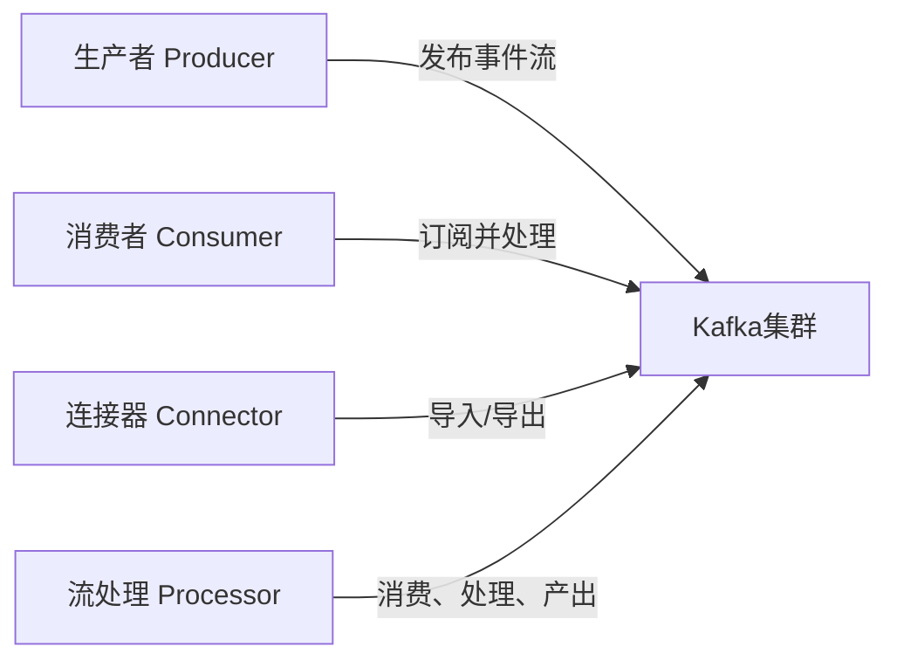

#### 消息系统两种模型

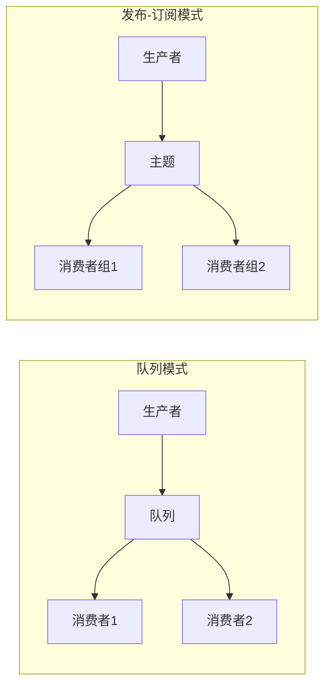

### 5. 经典金句/数据
> “Kafka自LinkedIn开源以来就以高性能、高吞吐量、分布式的特性著称。”（前言）
> “任何消息队列要做到发布消息和消费消息的解耦合，实际上都要扮演一个存储系统的角色。”（p.11）
> “Kafka采用拉取模型，由消费者自己记录消费状态。”（p.13）

---

## 第2章：生产者

### 1. 核心论点
本章解决“生产者如何将消息高效、可靠地发送到Kafka服务端”的问题。作者认为：生产者客户端通过记录收集器（RecordAccumulator）批量缓存消息，由发送线程（Sender）按照目标节点分组，利用选择器（Selector）和Kafka通道（KafkaChannel）实现异步非阻塞网络通信。

### 2. 关键概念
- **记录收集器（RecordAccumulator）**：按分区缓存消息，每个分区对应一个双端队列，队列元素是批记录（RecordBatch）。
- **发送线程（Sender）**：从收集器获取数据，按主副本节点分组，创建客户端请求并交给NetworkClient。
- **NetworkClient**：管理客户端与多个服务端节点的连接、发送请求、接收响应，调用选择器轮询。
- **选择器（Selector）**：使用Java NIO，单线程管理多个SocketChannel，监听读写事件。
- **KafkaChannel**：封装传输层（TransportLayer），读写Send和NetworkReceive对象。

### 3. 逻辑推演
从生产者示例（同步/异步发送）入手，分析消息选择分区（有key则哈希取模，无key则轮询）。然后进入RecordAccumulator追加消息流程：获取分区队列，取最后一个批记录，若写满则新建。发送线程drain数据，按节点分组创建ClientRequest。NetworkClient通过ready()连接节点，send()将请求暂存到通道，poll()真正发送并接收响应。最后分析选择器如何通过事件驱动读写KafkaChannel，完成请求-响应全过程。

### 4. 流程图

#### 生产者消息发送流程

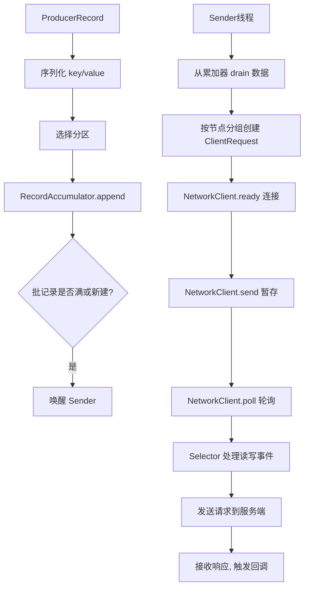

### 5. 经典金句/数据
> “生产者将消息直接发送给分区主副本所在的消息代理节点，并不需要经过任何的中间路由层。”（p.17）
> “Kafka使用选择器模式，用单个线程就可以管理多个网络连接通道。”（p.35）

---

## 第3章：消费者：高级API和低级API

### 1. 核心论点
本章解决“消费者如何使用高级API（基于ZK）和低级API（SimpleConsumer）消费消息”的问题。作者认为：高级API通过消费者连接器（ZookeeperConsumerConnector）封装了分区再平衡、偏移量提交、拉取线程管理等复杂逻辑；低级API提供更细粒度的控制，但需要自行处理主副本查找、偏移量管理和故障转移。

### 2. 关键概念
- **消费者连接器（ZookeeperConsumerConnector）**：消费组入口，管理队列、消息流、拉取线程管理器。
- **再平衡（Rebalance）**：消费者加入或离开消费组时，重新分配分区，所有消费者执行同步。
- **分区信息对象（PartitionTopicInfo）**：包含队列、拉取偏移量（fetchedOffset）、消费偏移量（consumedOffset）。
- **拉取线程管理器（ConsumerFetcherManager）**：管理多个拉取线程，每个线程向主副本拉取消息，填充到队列。
- **偏移量提交**：可提交到ZK或内部主题（_consumer_offsets），服务端协调者（GroupCoordinator）处理。

### 3. 逻辑推演
从高级API示例开始，创建消费者连接器时注册ZK监听器（会话超时、消费者增减、分区变化）。再平衡操作为每个消费者分配分区，释放旧所有权，启动拉取线程。拉取线程管理器通过LeaderFinderThread找出有主副本的分区，创建拉取线程。拉取线程构建FetchRequest，获取消息后存入PartitionTopicInfo的队列。消费者迭代器从队列中读取消息，更新消费偏移量。最后分析低级API示例：手动查找主副本、获取偏移量、发送拉取请求、处理异常。

### 4. 流程图

#### 消费者高级API消息流

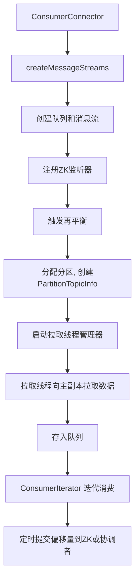

### 5. 经典金句/数据
> “一个分区只会被分配给一个消费者线程。”（p.68）
> “Kafka采用消费组保证了‘一个分区只可被消费组中的一个消费者所消费’。”（p.62）
> “新API中提交偏移量采用了‘两阶段提交’思想，通过提交日志保证任务配置的原子性。”（p.534，实际在第八章，但此处概括）

---

## 第4章：新消费者

### 1. 核心论点
本章解决“新版消费者（Java实现）如何基于订阅状态和轮询模型消费消息”的问题。作者认为：新消费者去除了对ZK的依赖，通过订阅状态（SubscriptionState）管理分区分配和偏移量，采用单线程轮询（poll）方式拉取消息，并使用异步请求、监听器、组合模式等实现高效网络通信。

### 2. 关键概念
- **订阅状态（SubscriptionState）**：记录分配给消费者的分区及其状态（拉取偏移量position、已提交偏移量committed）。
- **消费者网络客户端（ConsumerNetworkClient）**：封装NetworkClient，支持异步请求和延迟任务（心跳、自动提交）。
- **拉取器（Fetcher）**：构建FetchRequest，处理响应，将结果存入分区记录集。
- **异步请求（RequestFuture）**：支持监听器、组合、链式调用，实现非阻塞请求-响应。
- **心跳任务（HeartbeatTask）**：定期向协调者发送心跳，维持组成员身份。

### 3. 逻辑推演
从新消费者示例出发，调用subscribe()订阅主题，然后循环poll()。pollOnce()内部先确保协调者已知并分配分区，再为缺失拉取偏移量的分区更新位置（从协调者获取提交偏移量或根据策略重置）。然后通过Fetcher构建FetchRequest，使用ConsumerNetworkClient异步发送，并在回调中将响应数据存入records。最后fetchedRecords()返回ConsumerRecords，并更新订阅状态的position。消费者还通过定时任务自动提交偏移量，并发送心跳维持会话。

### 4. 流程图

#### 新消费者轮询流程

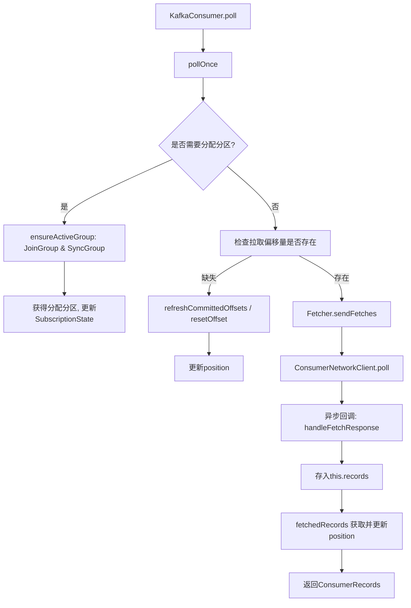

### 5. 经典金句/数据
> “新消费者内部没有使用多线程的拉取线程，它是一个单线程的应用程序。”（p.160）
> “Kafka轮询和定时提交任务的关系保证了提交偏移量总是代表上一次已处理的消息。”（p.201）

---

## 第5章：协调者

### 1. 核心论点
本章解决“服务端协调者（GroupCoordinator）如何管理消费组成员、处理再平衡和心跳”的问题。作者认为：协调者通过消费组元数据（GroupMetadata）和成员元数据（MemberMetadata），结合延迟操作和状态机，实现了加入组、同步组、心跳监控等组管理协议，保证分区分配的可靠性。

### 2. 关键概念
- **加入组请求（JoinGroup）**：消费者向协调者申请加入，协调者收集成员，选举主消费者。
- **同步组请求（SyncGroup）**：主消费者将分区分配结果发送给协调者，协调者分发给所有消费者。
- **延迟加入（DelayedJoin）**：当消费组进入PreparingRebalance状态时创建，等待所有成员重新加入，超时后踢出未响应成员。
- **消费组状态机**：Stable → PreparingRebalance → AwaitingSync → Stable，以及Dead状态。
- **延迟心跳（DelayedHeartbeat）**：每个成员一个，超时后认为消费者失败，触发再平衡。

### 3. 逻辑推演
首先分析消费者发送JoinGroup请求，协调者创建或更新GroupMetadata和MemberMetadata。协调者检查状态，若为Stable或AwaitingSync则触发prepareRebalance，进入PreparingRebalance并创建DelayedJoin。延迟完成条件：所有旧成员都重新发送了JoinGroup请求。完成时协调者选择统一协议，返回响应给所有成员，进入AwaitingSync。主消费者执行分区分配后发送SyncGroup请求，协调者保存分配结果到内部主题，然后返回Assignment给每个成员，状态转为Stable。心跳请求定时触发，延迟心跳超时会移除成员并触发再平衡。最后通过示例说明不同顺序加入组时的状态转换次数。

### 4. 流程图

#### 加入组与同步组交互

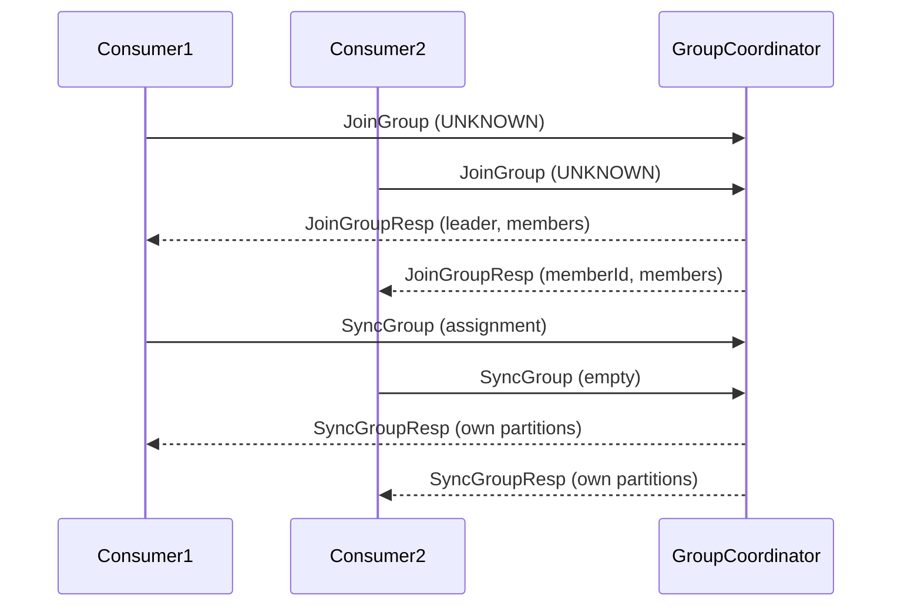

#### 消费组状态机

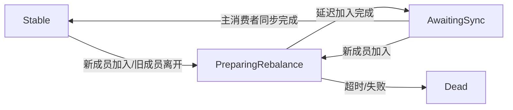

### 5. 经典金句/数据
> “协调者并不执行分区分配，而是由主消费者执行，然后将分配结果同步回协调者。”（p.221）
> “再平衡超时时间取所有消费者会话超时时间的最大值。”（p.278）

---

## 第6章：存储层

### 1. 核心论点
本章解决“Kafka如何将消息持久化到磁盘，如何高效读写，以及副本间如何同步”的问题。作者认为：每个分区对应一个日志（Log），日志由多个日志分段（LogSegment）组成，每个分段包含数据文件（FileMessageSet）和索引文件（OffsetIndex）。利用顺序追加、零拷贝、稀疏索引实现高吞吐。副本管理器（ReplicaManager）处理生产请求和拉取请求，通过延迟操作（DelayedProduce/DelayedFetch）实现ISR同步和消费者长轮询。

### 2. 关键概念
- **日志（Log）**：对应一个分区，管理多个LogSegment，维护nextOffsetMetadata。
- **日志分段（LogSegment）**：数据文件（.log）和偏移量索引（.index），基准偏移量为文件名。
- **偏移量索引（OffsetIndex）**：稀疏索引，存储相对偏移量到物理位置的映射，使用内存映射。
- **副本管理器（ReplicaManager）**：管理本节点所有分区，处理appendMessages和fetchMessages。
- **LEO（Log End Offset）**：副本本地日志的最新偏移量。
- **HW（High Watermark）**：消费者可见的最大偏移量，取ISR中最小的LEO。
- **延迟操作（DelayedOperation）**：当生产请求需要等待ISR应答或拉取请求需要等待足够数据时创建，通过延迟缓存（Purgatory）管理，支持超时和外部事件完成。

### 3. 逻辑推演
从消息集追加到日志开始：分析验证、分配绝对偏移量、滚动创建分段、写入数据文件和索引。读取日志：根据起始偏移量找到日志分段，查索引文件获得近似物理位置，再搜索数据文件精确定位。然后分析副本管理器处理生产请求：追加到本地日志后，若acks=-1则创建DelayedProduce，等待备份副本拉取并更新ISR和HW，完成时回调。拉取请求：若fetchMinBytes不足则创建DelayedFetch，等到新消息或超时后再次读取。最后分析日志管理（清理策略：删除与压缩）和延迟缓存的实现（时间轮、监视器）。

### 4. 流程图

#### 消息追加与ISR同步

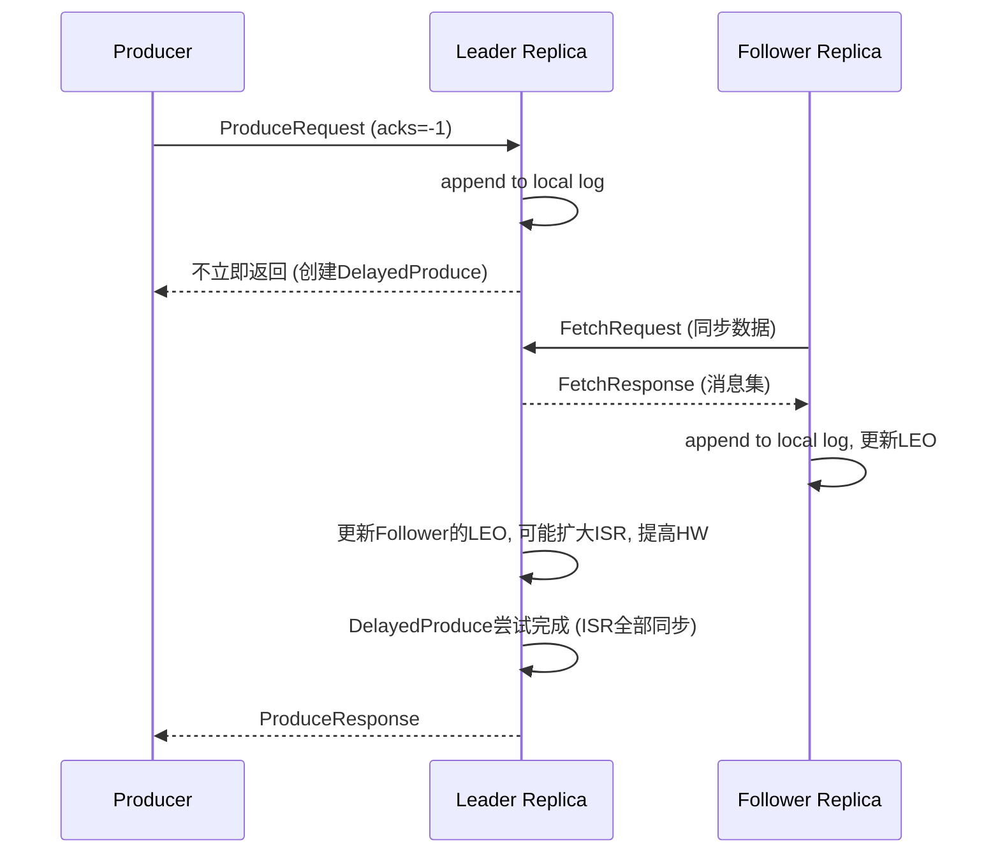

### 5. 经典金句/数据
> “Kafka直接使用提交日志作为最终的存储格式。”（p.293）
> “索引文件采用稀疏索引，每个索引条目占8字节，可放入内存。”（p.313）
> “延迟操作有两种完成方式：外部事件触发完成或超时完成。”（p.375）

---

## 第7章：控制器

### 1. 核心论点
本章解决“Kafka控制器如何管理分区副本的分配、主副本选举、代理节点上下线以及重新分配分区”的问题。作者认为：控制器通过ZK监听器感知集群变化，利用分区状态机和副本状态机维护分区和副本的状态，并发送LeaderAndIsrRequest、UpdateMetadataRequest等指令给代理节点，实现分布式协调。

### 2. 关键概念
- **控制器（KafkaController）**：集群中只有一个Active控制器，负责管理分区、副本、监听ZK事件。
- **分区状态机（PartitionStateMachine）**：管理分区状态（NonExistent, New, Online, Offline），处理分区创建、主副本选举。
- **副本状态机（ReplicaStateMachine）**：管理副本状态（New, Online, Offline, ReplicaDeletionStarted等），处理副本上下线。
- **LeaderAndIsr请求**：控制器发送给代理节点，通知分区的主副本和ISR信息。
- **重新分配分区（Reassign Partitions）**：通过更新ZK的/admin/reassign_partitions节点触发，分为两个阶段：先将新副本加入AR和ISR，待同步后切换为主副本并移除旧副本。
- **删除主题**：通过/admin/delete_topics节点触发，标记副本状态为ReplicaDeletionStarted，发送StopReplica请求，完成删除。

### 3. 逻辑推演
控制器启动时通过ZK选举，成为Active后初始化上下文，启动状态机，注册监听器（BrokerChangeListener, TopicChangeListener等）。当代理节点上线时，触发onBrokerStartup，将节点上所有副本状态转为Online，触发分区状态转换。代理节点下线时，处理没有主副本的分区，重新选举主副本。创建主题时，监听器创建分区和副本，状态机转为Online，发送LeaderAndIsr请求。重新分配分区时，监听器调用onPartitionReassignment，先扩大AR和ISR，等待新副本同步后，切换主副本并缩小AR。删除主题时，状态机转为DeletionStarted，发送StopReplica请求，最后删除日志。

### 4. 流程图

#### 控制器主副本选举流程

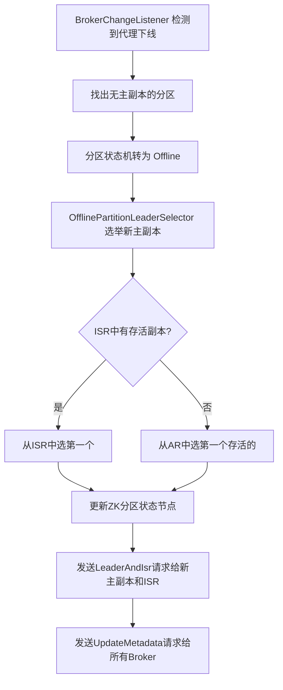

### 5. 经典金句/数据
> “控制器通过ZK的领导选举机制，每个代理节点都会参与竞选主控制器。”（p.403）
> “重新分配分区分成两个阶段，通过监听ISR变化来继续第二阶段。”（p.440）

---

## 第8章：基于Kafka构建数据流管道

### 1. 核心论点
本章解决“如何使用MirrorMaker、uReplicator和Kafka Connect在不同数据源或Kafka集群间同步数据”的问题。作者认为：MirrorMaker内置生产者和消费者实现集群间复制；uReplicator基于Apache Helix动态分配分区，支持自动扩展；Kafka Connect通过Connector和Task抽象，简化了与外部系统的导入导出，支持单机和分布式模式。

### 2. 关键概念
- **MirrorMaker**：内置消费者从源集群消费，生产者发送到目标集群，可配置多个消费者线程。
- **uReplicator**：Uber开源，使用Helix管理消费者任务分配，支持动态添加主题和故障转移。
- **Kafka Connect**：框架，定义SourceConnector/SinkConnector和SourceTask/SinkTask，由Worker管理生命周期。
- **Worker**：单机模式下单个Worker管理所有连接器和任务；分布式模式下多个Worker通过协调者分配任务。
- **配置存储（ConfigBackingStore）**：分布式模式下使用内部主题（connect-configs）存储连接器和任务配置，通过两阶段提交（提交日志）保证原子性。

### 3. 逻辑推演
先通过单机模拟MirrorMaker同步数据，分析其原理：每个MirrorMaker线程包含一个消费者和一个生产者，关闭自动提交，定时提交偏移量。然后介绍uReplicator，利用Helix的OnlineOffline状态模型，控制器分配分区给Worker节点，Worker动态添加/删除分区。最后详细分析Kafka Connect：从示例（文件源到文件目标）开始，说明自定义SourceConnector和SourceTask需要实现的方法。深入Connector模型（Connector和Task）和Worker模型（Worker、Herder、配置存储）。分布式模式下，Worker通过WorkerCoordinator加入组，获取分配的任务，启动WorkerSourceTask和WorkerSinkTask，源任务使用生产者写入Kafka，目标任务使用消费者拉取并写入目标系统。

### 4. 流程图

#### Kafka Connect 分布式架构

```mermaid
graph TD
    A[User REST API] --> B[DistributedHerder]
    B --> C[ConfigBackingStore (Kafka topic)]
    C --> D[WorkerCoordinator 加入组]
    D --> E[再平衡, 获取Assignment]
    E --> F[Worker 启动 Connector 和 Tasks]
    F --> G[WorkerSourceTask 轮询 SourceTask.poll()]
    G --> H[Producer 发送到 Kafka]
    F --> I[WorkerSinkTask 消费 Kafka]
    I --> J[SinkTask.put() 写入目标系统]
```

### 5. 经典金句/数据
> “MirrorMaker的最佳实践是在多个物理节点上启动多个MirrorMaker进程，使用相同的group.id。”（p.497）
> “Kafka Connect将故障容错、分区扩展、偏移量管理、发送语义等问题抽象出来。”（p.506）
> “连接器的配置和任务的配置通过两阶段提交保证原子性。”（p.534）

---

## 第9章：Kafka流处理

### 1. 核心论点
本章解决“如何使用Kafka Streams API构建流处理应用”的问题。作者认为：Kafka流处理基于生产者和消费者，通过流实例（KafkaStreams）、流线程（StreamThread）和流任务（StreamTask）实现分布式并行处理。低级Processor API允许自定义处理器，高级DSL提供声明式操作（KStream/KTable、连接、窗口）。状态存储（StateStore）和变更日志主题（changelog）保证了有状态操作的一致性。

### 2. 关键概念
- **KafkaStreams**：流处理应用程序入口，管理多个StreamThread。
- **StreamTask**：每个任务对应一个输入主题分区的子集（多个主题的相同分区号），包含ProcessorTopology。
- **KStream**：记录流（record stream），每条记录独立。
- **KTable**：变更流（changelog stream），相同键只保留最新值，有状态存储。
- **状态存储（StateStore）**：本地存储（RocksDB或内存），用于聚合、窗口等操作，变更日志写入changelog主题用于容错。
- **重新分区（Repartition）**：聚合或连接前，若键改变，自动创建内部主题，确保相同键进入同一分区。
- **时间窗口**：支持跳跃窗口、滚动窗口、会话窗口，基于事件时间或摄入时间。

### 3. 逻辑推演
从低级Processor示例开始，构建拓扑（addSource, addProcessor, addStateStore, addSink），创建KafkaStreams并启动。分析StreamThread运行机制：消费者订阅源主题，拉取数据，分配给对应的StreamTask，每个任务依次处理记录，调用ProcessorNode链。状态存储通过StateManager注册，写入时同时写入changelog。备份任务（StandbyTask）读取changelog恢复本地状态。高级DSL：KStream通过map/filter等转换，groupByKey后调用count/aggregate，内部触发重新分区，使用KTable存储结果。KTable与KStream的转换。连接操作（KStream-KStream需窗口，KTable-KTable不需窗口）。窗口操作：跳跃窗口、会话窗口的实现原理（通过WindowStore存储分段数据）。

### 4. 流程图

#### Kafka Streams 线程模型

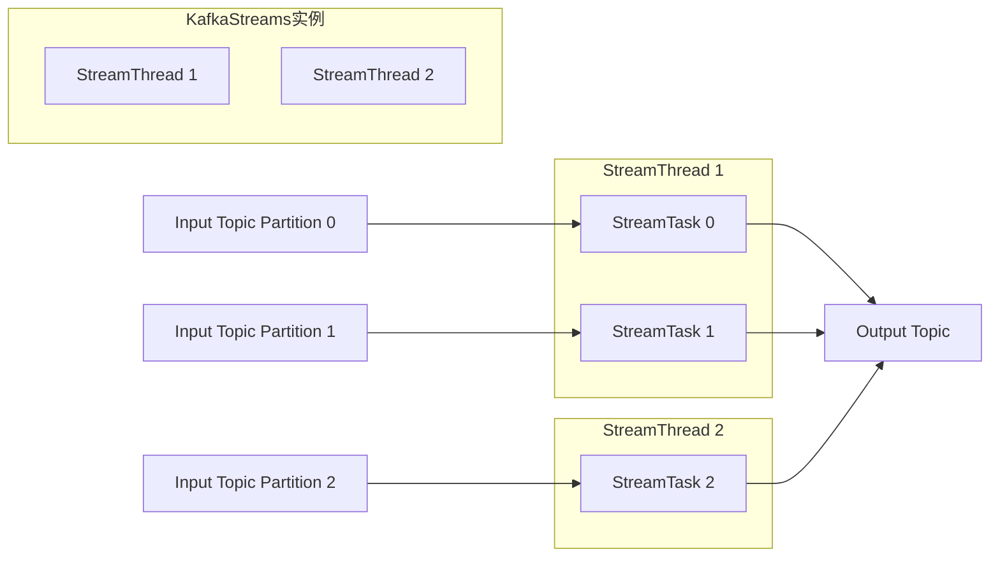

#### 聚合操作的重新分区

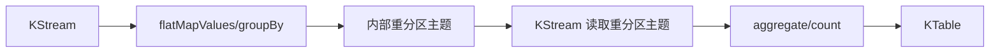

### 5. 经典金句/数据
> “Kafka流处理将输入主题的分区分配给流实例上的不同流线程，每个流任务对应一个分区。”（p.581）
> “KTable类似于关系型数据库的表，KStream类似于提交日志。”（p.638）
> “重新分区保证了相同键的所有消息进入同一个流任务，从而正确聚合。”（p.644）

---

## 第10章：高级特性介绍

### 1. 核心论点
本章概要介绍Kafka的客户端配额、新消息格式（v2）以及事务处理。作者认为：配额机制通过延迟响应来控制客户端使用率；0.11版本的消息格式（v2）采用批记录结构，压缩更高，并支持时间戳索引；事务处理通过事务协调者、事务日志和控制消息，实现了跨分区原子写入和“正好一次”语义。

### 2. 关键概念
- **配额（Quota）**：基于字节速率和请求速率的限制，超出配额时服务端延迟响应。
- **时间戳索引（TimeIndex）**：允许根据时间戳快速定位偏移量。
- **幂等生产者**：通过PID和序列号去重，实现单分区内正好一次。
- **事务**：支持多分区原子写入，引入事务协调者、事务日志、控制消息、事务ID等。
- **恰好一次语义（Exactly-once）**：生产端幂等+事务，消费端隔离级别read_committed。

### 3. 逻辑推演
配额部分：说明两种配额类型和计算延迟时间的方法。消息格式：对比v0/v1/v2的差异，v2引入批记录头部，减少开销，支持时间戳索引。事务部分：介绍生产者事务API，事务协调者处理InitPid、AddPartitionsToTxn、EndTxn等请求，写入控制标记到用户主题，消费者通过隔离级别控制是否读取未提交消息。最后提到流处理中的exactly_once配置。

### 4. 流程图

#### 事务流程

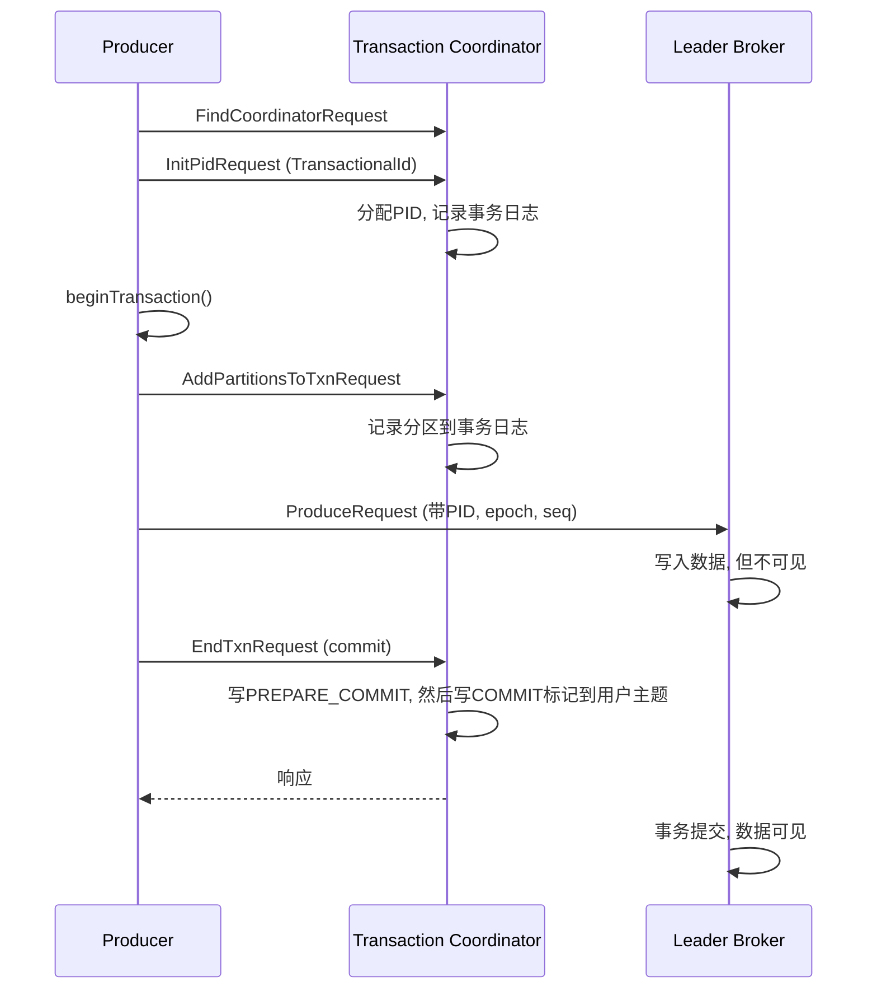

### 5. 经典金句/数据
> “0.11版本的消息格式占用更少的磁盘空间，几乎是v1版本的一半。”（p.694）
> “事务协调者类似于消费组的协调者，每个生产者都会分配一个事务协调者。”（p.701）

---

## 结语
本书从源码层面详细剖析了Kafka的各个核心模块，既有宏观架构图，又有微观代码实现。通过大量流程图和示例，帮助读者深入理解Kafka的设计思想，是Kafka开发人员和架构师的宝贵参考资料。