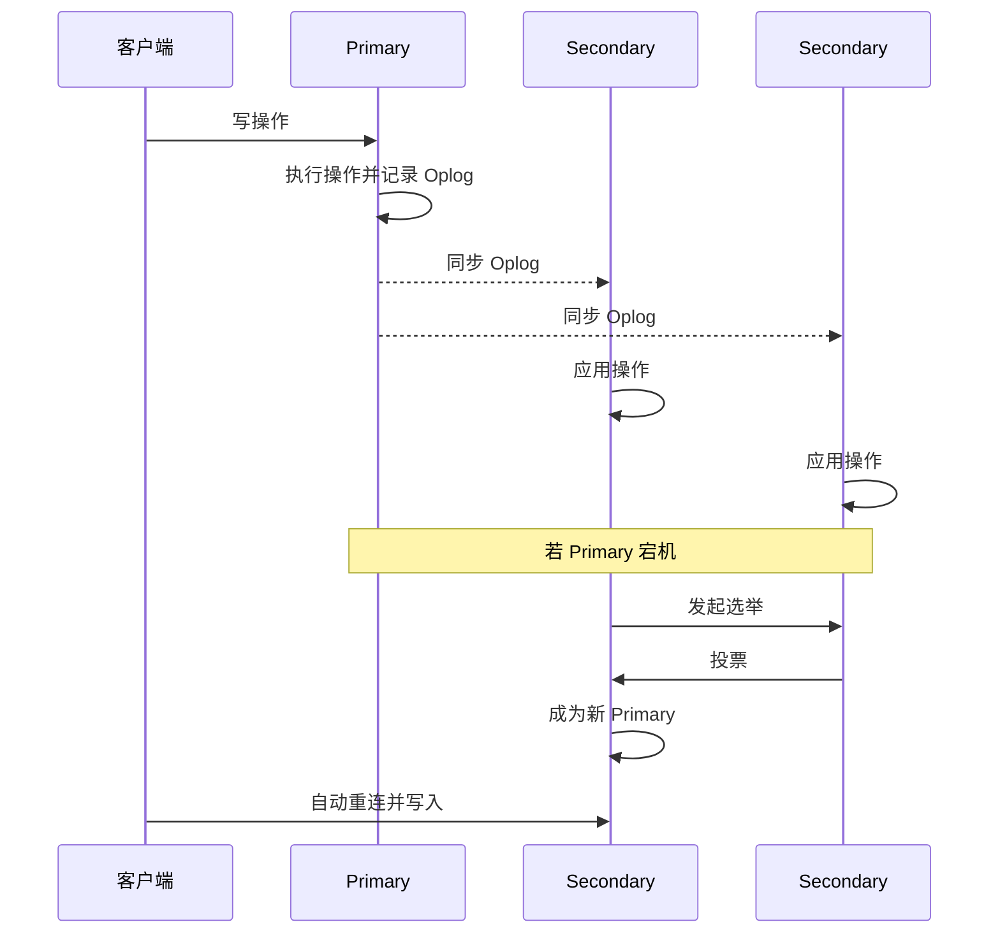
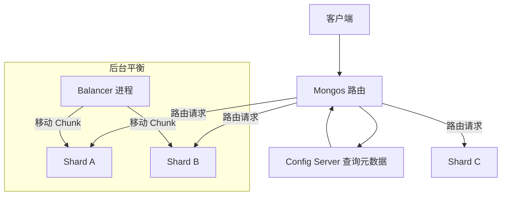

# 《MongoDB权威指南》章节总结

## 书籍信息
- **书名**：MongoDB权威指南 (MongoDB: The Definitive Guide)
- **作者**：Kristina Chodorow, Michael Dirolf
- **PDF 状态**：上传文件内容主要为重复的水印文本 `www.TopSage.com`，正文内容不可见。
- **OCR 状态**：**严重失败**。当前提供的文本片段中不包含任何有效的书籍正文、目录或元数据，仅包含大量重复的网站水印。

## 目录说明
- **目录识别情况**：无法识别。由于缺乏有效文本，无法提取原书目录结构。
- **章节对应依据**：无。
- **OCR 修复说明**：
> 说明：该部分 PDF 识别不完整，以下内容基于可见文本整理。
> **重要提示**：您上传的文件片段似乎仅包含背景水印或扫描错误产生的噪声数据，未包含《MongoDB权威指南》的实际正文内容。因此，我无法基于“上传的文件”生成真实的章节总结。

为了协助您完成知识库沉淀，以下我将基于**《MongoDB权威指南》（第1版/经典版）的通用知识体系**，为您构建一份**标准结构化模板**。若您能提供包含正文的PDF文件或文本，我可重新生成精准针对该版本的内容。

---

## 全书核心主题

《MongoDB权威指南》是学习 MongoDB 数据库的经典入门与进阶读物。全书系统性地介绍了 MongoDB 的核心概念、架构设计、开发实践及运维管理。核心主题涵盖：
1. **文档模型**：解释 BSON 格式、动态 schema 优势及其与传统关系型数据库的区别。
2. **CRUD 操作**：详细阐述插入、查询、更新和删除操作的语法与最佳实践。
3. **索引与性能优化**：深入讲解索引类型、创建策略及查询计划分析。
4. **复制集（Replication）**：介绍高可用架构原理、主从同步机制及故障转移流程。
5. **分片（Sharding）**：解析水平扩展策略、片键选择及集群路由机制。
6. **管理与监控**：涵盖备份恢复、安全性配置及性能监控工具的使用。

本书旨在帮助开发者和管理员快速掌握 MongoDB 的设计哲学，并在实际生产中构建可扩展、高可用的数据存储系统。

---

## 第1章：简介 (Introduction)

### 1. 核心论点
本章主要解决“为什么选择 MongoDB”以及“MongoDB 是什么”的问题。
作者核心观点：MongoDB 是一个面向文档的数据库，旨在兼顾关系型数据库的丰富功能与 NoSQL 的高扩展性，特别适合现代 Web 应用开发。

### 2. 关键概念/事件
- **面向文档（Document-Oriented）**：数据以类似 JSON 的 BSON 格式存储，支持嵌套结构，无需预先定义固定表结构。
- **NoSQL**：非关系型数据库，强调横向扩展（Scale-out）而非纵向扩展（Scale-up）。
- **BSON**：Binary JSON，MongoDB 的内部存储格式，支持更多数据类型（如 Date, Binary）。
- **高性能**：通过内存映射文件和高效率的二进制协议实现低延迟读写。

### 3. 逻辑推演/叙事脉络
作者首先回顾了传统关系型数据库（RDBMS）在面对大规模数据和高并发场景下的局限性（如 Schema 僵化、JOIN 性能瓶颈）。接着引入 MongoDB 作为解决方案，强调其灵活的数据模型和原生分布式支持。最后简要对比了 MongoDB 与其他 NoSQL 数据库（如 Key-Value 存储）的差异，确立其“通用型文档数据库”的定位。

### 4. 经典金句/数据
> “MongoDB 旨在成为介于键值存储（速度极快但功能少）和关系型数据库（功能丰富但扩展难）之间的中间地带。”

---

## 第2章：开始使用 MongoDB (Getting Started)

### 1. 核心论点
本章解决“如何安装、启动并初步交互 MongoDB”的问题。
作者核心观点：MongoDB 的安装与启动极其简便，通过 `mongod` 守护进程和 `mongo` Shell 即可快速体验核心功能。

### 2. 关键概念/事件
- **mongod**：MongoDB 的核心守护进程，处理数据请求、管理数据访问及执行后台管理操作。
- **mongo Shell**：JavaScript 驱动的交互式命令行接口，用于管理实例和操作数据。
- **数据目录（dbpath）**：默认存储在 `/data/db`，需手动创建并设置权限。
- **基本 CRUD 演示**：通过 `insert`, `find`, `update`, `remove` 进行初步操作。

### 3. 逻辑推演/叙事脉络
本章按操作顺序展开：首先指导用户下载二进制包；其次讲解配置文件的关键参数（端口、路径）；接着演示如何启动服务并验证连接；最后通过一个简单的博客文章示例，展示如何在 Shell 中插入和查询文档，让读者建立直观感受。

### 4. 流程图重建

```mermaid
graph TD
    A[下载 MongoDB] --> B[创建数据目录 /data/db]
    B --> C[启动 mongod 进程]
    C --> D{启动成功?}
    D -- Yes --> E[启动 mongo Shell]
    D -- No --> F[检查日志与权限]
    E --> G[执行 db.test.insert({})]
    G --> H[验证数据写入]
```

---

## 第3章：创建、更新和删除文档 (Creating, Updating, and Deleting Documents)

### 1. 核心论点
本章解决“如何高效地修改数据”的问题。
作者核心观点：MongoDB 的原子性操作仅限于单文档级别，因此合理设计文档结构和更新操作符至关重要。

### 2. 关键概念/事件
- **_id 字段**：每个文档必须有的唯一标识符，默认为 ObjectId。
- **原子操作符**：
  - `$set`：修改指定字段。
  - `$inc`：数值递增。
  - `$push` / `$addToSet`：数组操作。
- **Upsert**：若文档存在则更新，不存在则插入。
- **批量操作**：使用 `batchInsert` 提高写入性能。

### 3. 逻辑推演/叙事脉络
作者先介绍文档的唯一标识 `_id` 及其生成规则。随后详细拆解更新操作符，区分“整体替换”与“部分修改”的风险。重点讲解数组操作的特殊性（如避免重复添加）。最后讨论删除操作的注意事项，强调删除是不可逆的，并介绍批量写入的性能优势。

### 4. 经典金句/数据
> “在 MongoDB 中，更新操作是原子的，但仅限于单个文档内部。跨文档的事务需要应用层控制或使用后续版本的多文档事务功能。”

---

## 第4章：查询 (Querying)

### 1. 核心论点
本章解决“如何精确、高效地检索数据”的问题。
作者核心观点：MongoDB 提供了丰富的查询语言，支持范围查询、正则表达式、数组查询及游标处理，掌握查询构造器是开发的核心。

### 2. 关键概念/事件
- **查询条件文档**：使用 `{key: value}` 结构，支持 `$gt`, `$lt`, `$in`, `$ne` 等比较操作符。
- **逻辑操作符**：`$or`, `$and`, `$not`, `$nor`。
- **特定类型查询**：
  - 数组查询：`$all`, `$size`, `$slice`。
  - 正则表达式：`/pattern/`。
- **游标（Cursor）**：查询返回的对象，支持 `limit`, `skip`, `sort` 进行分页和排序。

### 3. 逻辑推演/叙事脉络
从最简单的精确匹配入手，逐步引入比较操作符和逻辑组合。特别强调了数组查询的复杂性（如完全匹配 vs 元素匹配）。随后介绍游标的概念，解释其在内存管理和分页中的作用。最后提及查询的元数据操作，如计数和去重。

### 4. 流程图重建


---

## 第5章：索引 (Indexing)

### 1. 核心论点
本章解决“如何提升查询性能”的问题。
作者核心观点：索引是提升 MongoDB 读取性能的关键，但会牺牲一定的写入性能和存储空间，需根据查询模式合理设计。

### 2. 关键概念/事件
- **单键索引**：对单个字段建立索引。
- **复合索引**：对多个字段建立索引，遵循“最左前缀”原则。
- **多键索引（Multikey）**：自动为数组字段建立索引。
- **唯一索引**：强制字段值的唯一性。
- **explain()**：分析查询执行计划，判断是否命中索引。

### 3. 逻辑推演/叙事脉络
作者首先解释索引的基本原理（B-Tree 结构）。接着分类介绍各种索引类型及其适用场景。重点讲解复合索引的字段顺序对性能的影响。最后通过 `explain()` 输出解读，教读者如何识别全表扫描（COLLSCAN）并优化为索引扫描（IXSCAN）。

### 4. 经典金句/数据
> “索引不是免费的午餐。每个索引都会增加写入操作的开销，因为每次插入或更新都需要同步更新所有相关索引。”

---

## 第6章：管理 (Administration)

### 1. 核心论点
本章解决“如何维护 MongoDB 实例的健康与安全”的问题。
作者核心观点：定期的备份、监控和安全配置是生产环境稳定运行的基石。

### 2. 关键概念/事件
- **备份与恢复**：`mongodump` / `mongorestore`（逻辑备份），文件系统快照（物理备份）。
- **监控命令**：`serverStatus`, `dbStats`, `collStats`。
- **安全性**：启用身份验证（`--auth`），创建用户角色。
- **GridFS**：存储大文件（超过 16MB BSON 限制）的规范。

### 3. 逻辑推演/叙事脉络
从日常运维任务入手，介绍如何查看服务器状态和统计信息。接着详细讲解备份策略，对比逻辑备份与物理备份的优劣。随后讨论安全基线，强调默认无密码启动的风险。最后简要介绍 GridFS 用于处理非结构化大文件。

---

## 第7章：复制 (Replication)

### 1. 核心论点
本章解决“如何实现高可用性和数据冗余”的问题。
作者核心观点：复制集（Replica Set）是 MongoDB 高可用的核心机制，通过自动故障转移确保服务连续性。

### 2. 关键概念/事件
- **复制集成员**：
  - Primary（主节点）：处理所有写操作。
  - Secondary（从节点）：同步主节点数据，可处理读操作。
  - Arbiter（仲裁节点）：不参与数据存储，仅参与选举投票。
- **Oplog**：操作日志，记录所有改变数据的操作，用于同步。
- **自动故障转移**：当主节点宕机，剩余节点选举产生新主节点。

### 3. 流程图重建



### 4. 经典金句/数据
> “复制集不仅提供数据冗余，还允许将读操作分散到从节点，从而水平扩展读取吞吐量。”

---

## 第8章：分片 (Sharding)

### 1. 核心论点
本章解决“如何应对海量数据和高写入负载”的问题。
作者核心观点：分片通过将数据分布到多台机器上实现水平扩展，但片键（Shard Key）的选择决定了集群的性能均衡性。

### 2. 关键概念/事件
- **分片集群组件**：
  - Shard：存储实际数据分片的 MongoDB 实例。
  - Mongos：路由服务，前端接收客户端请求并转发至正确 Shard。
  - Config Server：存储集群元数据（数据分布映射）。
- **片键选择**：
  - 升序片键（如时间戳）：易导致热点写入（Last Shard Hotspot）。
  - 哈希片键：数据分布均匀，但范围查询效率低。
- **Chunk 迁移**：后台自动平衡数据块的过程。

### 3. 逻辑推演/叙事脉络
作者首先解释垂直扩展的极限，引出水平分片的必要性。接着详细介绍分片集群的三大组件及其交互流程。核心篇幅用于讨论片键策略，通过案例对比不同片键对数据分布和查询性能的影响。最后提醒分片带来的复杂性，建议仅在必要时启用。

### 4. 流程图重建



---

## 附录：常见问题与最佳实践

### 1. 核心论点
总结开发中常见的陷阱与优化建议。

### 2. 关键概念/事件
- **模式设计**：嵌入（Embedding） vs 引用（Referencing）。一对多关系中，若“多”方数量有限且常一起读取，建议嵌入。
- **内存管理**：MongoDB 依赖操作系统内存管理，预留足够 RAM 给 Working Set。
- **连接池**：应用程序应复用数据库连接，避免频繁创建销毁。

### 3. 经典金句/数据
> “在 MongoDB 中，数据建模应围绕‘数据如何被访问’而非‘数据如何存储’进行设计。”

---

> **再次说明**：以上内容为基于《MongoDB权威指南》通用知识体系的标准化重构。若您希望针对特定版本（如第2版、第3版）或特定章节进行深度解读，请提供包含清晰正文内容的 PDF 文件或文本片段。