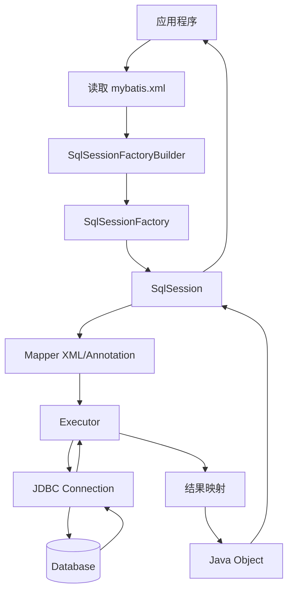
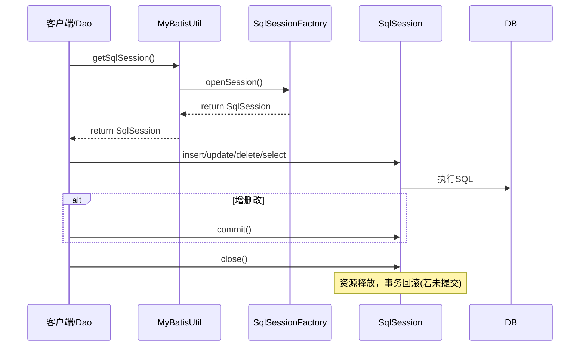
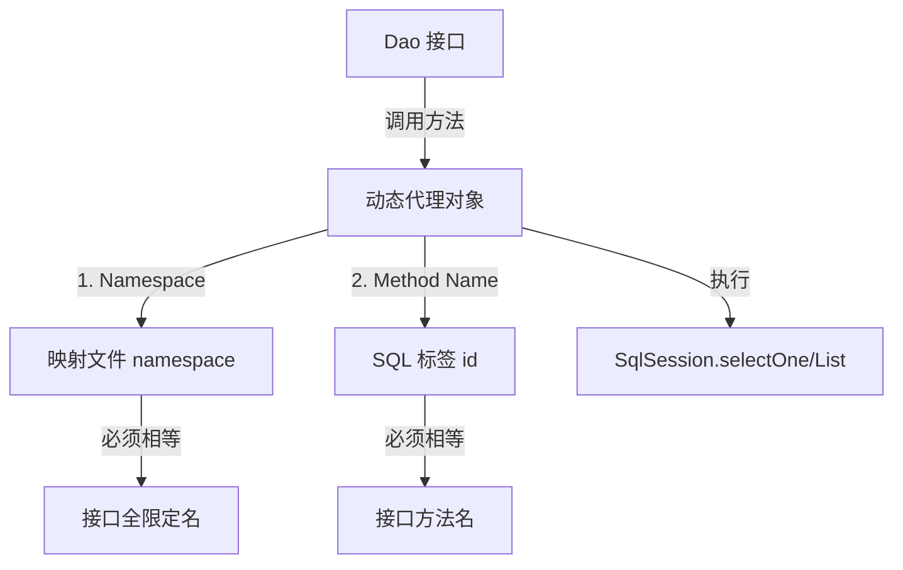
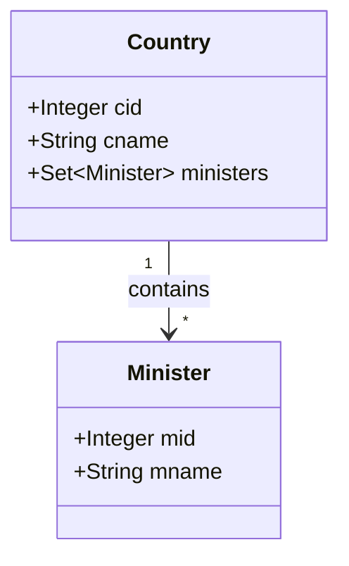
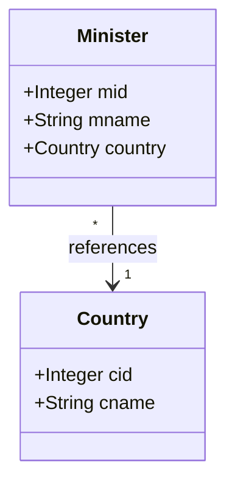
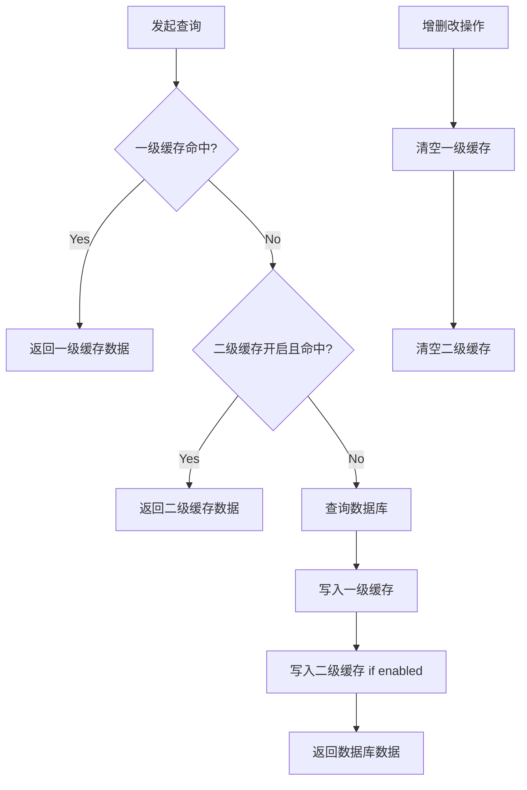
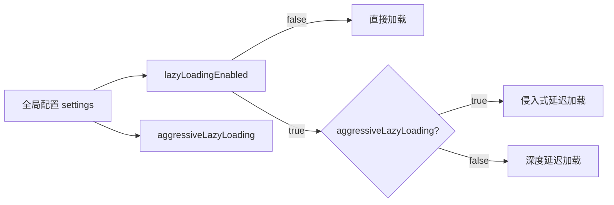
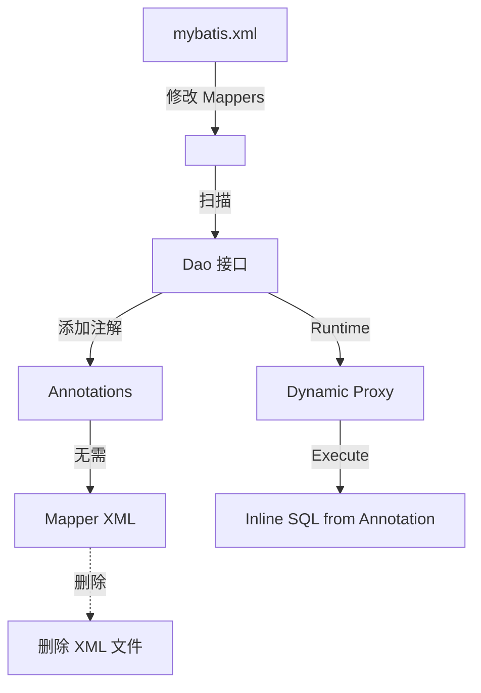

# 《MyBatis3框架技术》章节总结

## 书籍信息

- **书名**：MyBatis3框架技术讲义
- **作者/主讲**：Reyco·郭 (动力节点 POWER NODE)
- **PDF 状态**：文本可提取，包含部分截图和代码示例
- **OCR 状态**：大部分文本清晰，部分代码片段和表格存在轻微格式错位，已进行人工校正和结构化重组。

## 目录说明

- **目录识别情况**：文档结构清晰，分为5个主要章节，涵盖入门、CRUD操作、关联查询、缓存机制及注解开发。
- **章节对应依据**：严格遵循原文档的第1章至第5章顺序。
- **OCR 修复说明**：修正了部分XML标签闭合错误、Java代码中的拼写错误（如 `SqISession` -> `SqlSession`），并统一了代码块格式。

## 全书核心主题

本书是一份针对 MyBatis 3 框架的技术讲义，旨在帮助开发者从 JDBC 过渡到 ORM 框架的使用。全书核心围绕 MyBatis 作为“半自动”ORM 框架的特性展开，强调 SQL 与代码的分离、灵活性与高性能。内容从环境搭建、核心 API（SqlSessionFactory, SqlSession）详解入手，深入讲解单表 CRUD 操作、动态 SQL 的构建、复杂关联关系（一对一、一对多、多对多）的映射处理，以及一级/二级缓存机制的原理与应用。最后介绍了基于注解的开发模式作为 XML 配置的替代方案。本书注重实战，通过大量代码示例和底层源码分析，揭示了 MyBatis 的工作原理及最佳实践。

---

## 第1章：MyBatis入门

### 1. 核心论点

本章主要解决“什么是 MyBatis 以及如何搭建第一个 MyBatis程序”的问题。
作者核心观点是：MyBatis 是一个优秀的持久层框架，它封装了 JDBC 的繁琐过程，让开发者专注于 SQL 本身，通过 XML 或注解将 SQL 与 Java 对象映射，实现了 SQL 语句与代码的分离。

### 2. 关键概念 / 关键事件

- **框架 (Framework)**：可被应用开发者定制的应用骨架，规定了应用的体系结构、协作构件间的依赖关系和控制流程。
- **MyBatis vs Hibernate**：Hibernate 是“全自动”ORM，自动生成 SQL；MyBatis 是“半自动”ORM，需程序员编写 SQL，灵活性更高，适合复杂查询。
- **核心 Jar 包**：`mybatis-3.x.x.jar` 及其 `lib` 目录下的依赖包。
- **主配置文件 (`mybatis.xml`)**：配置数据源、事务管理器、别名及映射文件注册。
- **映射文件 (`mapper.xml`)**：定义 SQL 语句及其与 Java 对象的映射关系。
- **SqlSession**：执行持久化操作的核心接口，代表一次数据库会话，线程不安全。

### 3. 逻辑推演 / 叙事脉络

本章首先定义框架概念，介绍 MyBatis 的历史渊源（从 iBatis 演变而来）及其与 Hibernate 的区别。接着，通过一个“将 Student 信息写入数据库”的需求，逐步演示了 MyBatis 程序的构建步骤：导入 Jar 包 -> 定义实体类 -> 创建数据库表 -> 定义 Dao 接口 -> 编写映射文件 -> 编写主配置文件 -> 实现 Dao 类 -> 测试。随后，引入了工具类 `MyBatisUtil` 以简化 `SqlSessionFactory` 和 `SqlSession` 的获取，并讲解了如何通过 `.properties` 文件管理数据库连接参数。最后，详细解析了主配置文件的各个标签（properties, typeAliases, environments, mappers）及核心 API 的生命周期和使用规范。

### 4. 经典金句 / 数据

> “MyBatis 并不会为程序员自动生成 SQL 语句。具体的 SQL 需要程序员自己编写……因此，MyBatis 成为了‘全自动’ORM 的一种有益补充。”

> “SqlSession 接口对象是线程不安全的，所以每次数据库会话结束前，需要马上调用其 close() 方法，将其关闭。”

### 5. 流程图重建

#### MyBatis 工作原理示意图



#### SqlSession 生命周期与管理



---

## 第2章：单表的CURD操作

### 1. 核心论点

本章主要解决“如何使用 MyBatis 进行基本的增删改查操作”的问题。
作者核心观点是：通过 `SqlSession` 的 API 配合映射文件中的 SQL 标签，可以实现灵活的 CRUD；同时，利用 `<selectKey>` 获取自增主键，利用 `resultMap` 解决字段名与属性名不一致问题，并利用 Mapper 动态代理简化 Dao 层开发。

### 2. 关键概念 / 关键事件

- **#{} 与 ${}**：`#{}` 是预编译占位符（PreparedStatement），防止 SQL 注入；`${}` 是字符串拼接（Statement），存在注入风险，仅用于系统内部参数。
- **<selectKey>**：用于在插入后获取数据库生成的主键（如 MySQL 的 `last_insert_id()`）。
- **resultType vs resultMap**：`resultType` 要求字段名与属性名一致；`resultMap` 允许自定义映射关系，解决不一致问题。
- **Mapper 动态代理**：无需编写 Dao 实现类，MyBatis 根据接口全限定名和方法名自动查找 SQL，前提是 namespace 等于接口全名，id 等于方法名。
- **动态参数接收**：单个参数直接引用；多个参数可使用 `Map` 或 `@Param`（虽文中未详述 @Param，但提到了 Map 和索引 #{0}, #{1}）。

### 3. 逻辑推演 / 叙事脉络

本章首先通过自定义 Dao 实现类的方式，逐一讲解 Insert（含获取主键）、Delete、Update、Select（List, Map, One, Like）的实现细节，重点对比了 `#` 和 `$` 的区别及 SQL 注入风险。接着，针对数据库字段名与 Java 属性名不一致的场景，提出了两种解决方案：SQL 别名和 `resultMap`。随后，引入 Mapper 动态代理机制，消除了 Dao 实现类的样板代码，并规定了接口与映射文件的命名规范。最后，讲解了多条件查询的处理方式（Map 封装或多参数索引）。

### 4. 经典金句 / 数据

> “#为占位符，而$为字符串拼接符……一般情况下，动态参数的值是由用户输入的，则不能使用拼接符$，因为有可能会出现 SQL 注入。”

> “Mapper 动态代理方式无需程序员实现 Dao 接口。接口是由 MyBatis 结合映射文件自动生成的动态代理实现的。”

### 5. 流程图重建

#### #{} 与 ${} 执行区别

```mermaid
graph LR
    UserInput[用户输入] --> Check{使用哪种符号?}
    Check -->|#{}| PreCompile[预编译 PreparedStatement]
    PreCompile --> Safe[安全, 防止注入]
    Check -->|${}| StringConcat[字符串拼接 Statement]
    StringConcat --> Risk[存在 SQL 注入风险]
```

#### Mapper 动态代理匹配规则



---

## 第3章：关联关系查询

### 1. 核心论点

本章主要解决“如何处理数据库表之间的关联关系（一对多、多对一、多对多、自关联）”的问题。
作者核心观点是：通过 `<resultMap>` 中的 `<association>`（多对一/一对一）和 `<collection>`（一对多/多对多）标签，结合嵌套查询（N+1）或嵌套结果（Join），可以灵活映射复杂的对象图结构。

### 2. 关键概念 / 关键事件

- **<association>**：用于处理“多对一”或“一对一”关系，映射单个对象。属性包括 `property`, `javaType`, `column`, `select`。
- **<collection>**：用于处理“一对多”或“多对多”关系，映射集合对象。属性包括 `property`, `ofType`, `column`, `select`。
- **嵌套查询 (Nested Select)**：分步执行 SQL，先查主表，再根据外键查关联表。可能产生 N+1 问题，但支持延迟加载。
- **嵌套结果 (Nested Results)**：使用 Join 语句一次性查出所有数据，通过 resultMap 映射层级结构。效率高，但不支持针对关联对象的独立延迟加载控制。
- **自关联**：同一张表内存在父子关系（如新闻栏目），可通过递归查询或自连接处理。

### 3. 逻辑推演 / 叙事脉络

本章依次讲解了一对多、多对一、自关联和多对多四种场景。每种场景都提供了两种实现方式：多表连接查询（Join）和多表单独查询（Sub-select）。在一对多中，使用 `<collection>`；在多对一中，使用 `<association>`。特别强调了在双向关联中 `toString()` 方法可能导致递归栈溢出的问题。最后，通过新闻栏目案例演示了自关联的递归查询实现。

### 4. 经典金句 / 数据

> “由于日常工作中最常见的关联关系是一对多、多对一与多对多……一对一关联查询的实现方式与多对一的实现方式是相同的。”

> “在定义双向关联的实体的 toString() 方法时，只让一方的 toString() 方法中可以输出对方，不要让双方均可输出对方。否则将会出现输出时的递归现象，程序报错。”

### 5. 流程图重建

#### 一对多关联映射结构 (Collection)



#### 多对一关联映射结构 (Association)



---

## 第4章：查询缓存

### 1. 核心论点

本章主要解决“如何利用缓存提高 MyBatis 查询性能”的问题。
作者核心观点是：MyBatis 提供一级缓存（SqlSession 级别，默认开启）和二级缓存（Namespace 级别，需配置）。合理配置缓存策略（如延迟加载、逐出策略）和选择合适的缓存实现（如 Ehcache）能显著减少数据库压力。

### 2. 关键概念 / 关键事件

- **一级缓存**：基于 `PerpetualCache` 的 HashMap，作用域为 `SqlSession`。相同 SQL 和参数在同一个 Session 中只查一次 DB。增删改操作会清空缓存。
- **二级缓存**：作用域为 `Namespace`，生命周期与应用同步。需实体实现 `Serializable` 接口，并在 mapper 中添加 `<cache/>`。
- **延迟加载 (Lazy Loading)**：
    - **直接加载**：立即查询关联对象。
    - **侵入式延迟**：访问主对象任何属性时加载关联对象。
    - **深度延迟**：仅当真正访问关联对象属性时才加载。
- **Ehcache 集成**：第三方缓存实现，支持更丰富的缓存策略（磁盘溢出、TTL 等），需引入 `ehcache.xml` 和相应 Jar 包。

### 3. 逻辑推演 / 叙事脉络

本章首先证明了一级缓存的存在性及其失效条件（增删改、不同 Session、不同 SQL ID）。接着引入二级缓存，讲解其配置方法（全局开关、局部 `<cache>` 标签）、实体序列化要求及命中率监控。随后，详细阐述了三种延迟加载策略及其在全局设置 `lazyLoadingEnabled` 和 `aggressiveLazyLoading` 中的配置组合。最后，介绍了如何集成 Ehcache 以替代内置缓存，提升缓存管理能力。

### 4. 经典金句 / 数据

> “MyBatis 的延迟加载只是对关联对象的查询有迟延设置，对于主加载对象都是直接执行查询语句的。”

> “二级缓存中的数据不是为了在多个查询之间共享……而是为了延长该查询结果的保存时间，提高系统性能。”

### 5. 流程图重建

#### 缓存查询流程



#### 延迟加载策略配置矩阵



---

## 第5章：MyBatis注解式开发

### 1. 核心论点

本章主要解决“如何使用注解替代 XML 映射文件”的问题。
作者核心观点是：MyBatis 支持使用注解（如 `@Select`, `@Insert`）直接写在 Dao 接口方法上，从而省略 XML 文件。但官方建议复杂 SQL 仍使用 XML，注解适用于简单场景。

### 2. 关键概念 / 关键事件

- **常用注解**：`@Select`, `@Insert`, `@Update`, `@Delete`。
- **@SelectKey**：用于获取插入后的主键，对应 XML 中的 `<selectKey>`。
- **注解局限性**：复杂动态 SQL、结果映射（ResultMap）在注解中配置较为繁琐，可读性不如 XML。
- **配置变更**：使用注解时，主配置文件中需使用 `<package name="..."/>` 扫描接口，而非 `<mapper resource="..."/>`。

### 3. 逻辑推演 / 叙事脉络

本章首先介绍了 Java 注解的基础知识（Target, Retention 等）。然后，逐一展示了如何用注解替换常见的 CRUD XML 标签。特别指出了 `@SelectKey` 的属性配置。最后，说明了在使用注解时，需要删除对应的 XML 文件，并修改主配置文件以扫描 Dao 接口包。作者强调，虽然注解简洁，但对于发挥 MyBatis 全部功能，XML 仍是首选。

### 4. 经典金句 / 数据

> “mybatis 官方文档中指出，若要真正想发挥 mybatis 功能，还是要用映射文件。即 mybatis 官方并不建议通过注解方式来使用 mybatis。”

> “mybatis 的注解，主要是用于替换映射文件。而映射文件中无非存放着增、删、改、查的 SQL 映射标签。”

### 5. 流程图重建

#### 注解开发配置流程

