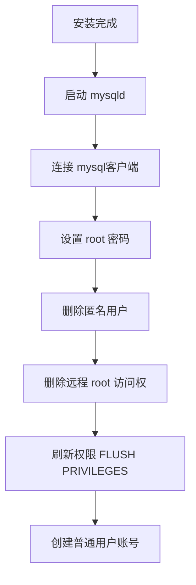
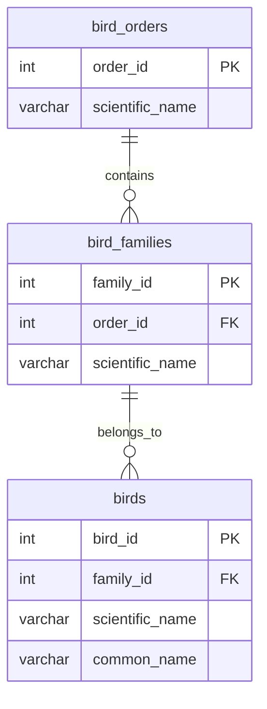
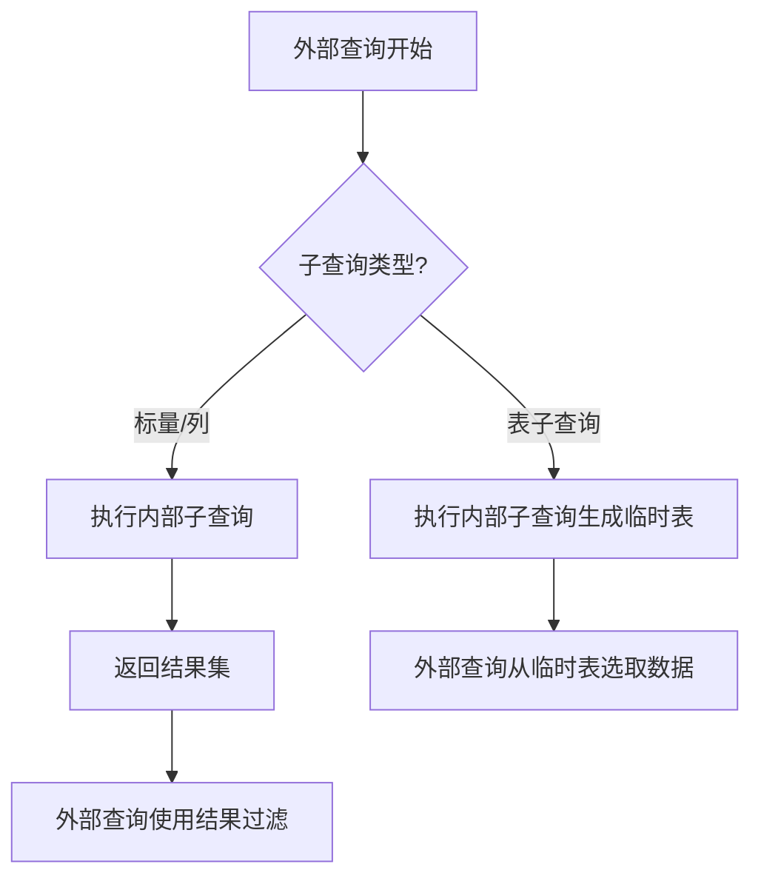
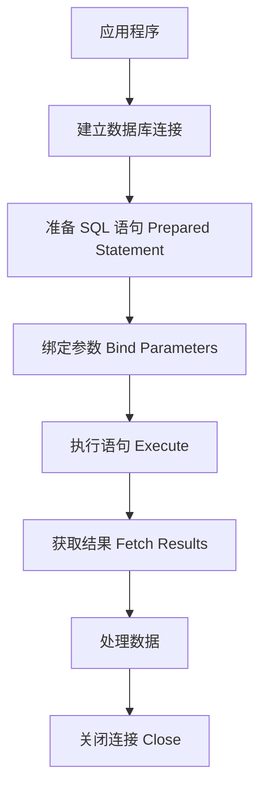

# 《MySQL与MariaDB学习指南》章节总结

## 书籍信息
- **书名**：MySQL与MariaDB学习指南 (Learning MySQL and MariaDB)
- **作者**：[美] Russell J.T. Dyer
- **译者**：袁志鹏
- **出版社**：人民邮电出版社 (O'Reilly Media, Inc. 授权)
- **PDF 状态**：完整文本识别
- **OCR 状态**：良好，部分特殊字符（如乱码）已根据上下文修正

## 目录说明
- **目录识别情况**：清晰，包含五大部分共16章。
- **章节对应依据**：严格遵循原书目录结构，从入门安装到高级API编程。
- **OCR 修复说明**：修复了部分因编码问题导致的乱码（如页眉页脚中的特殊符号），保留了所有代码示例和SQL语句的完整性。

## 全书核心主题
本书旨在帮助读者从零开始掌握 MySQL 和 MariaDB 数据库的核心知识与实践方法。全书以虚构的“观鸟网站”为案例，由浅入深地讲解了数据库的安装、结构设计、数据操作（增删改查）、内置函数使用、数据库管理（用户权限、备份恢复、批量导入）以及通过多种编程语言（C, Perl, PHP, Python, Ruby）的 API 与数据库交互。作者强调命令行操作的重要性，提倡通过实践巩固理论，并详细对比了 MySQL 与 MariaDB 的异同，指出 MariaDB 作为开源分支的优势。本书不仅适合初学者快速上手，也为开发者提供了处理复杂查询、优化性能及保障数据安全的实用指南。

---

## 序言 & 前言

### 核心论点
MySQL 和 MariaDB 是互联网发展的基石，具有极高的稳定性和扩展性。MariaDB 作为 MySQL 的分支，继承了其精神并增加了更多功能，且由基金会管理，保证了真正的开源自由。

### 关键概念
- **MySQL 起源**：由 Michael "Monty" Widenius 于 1995年创建，旨在提供免费、高效的开源数据库。
- **MariaDB 诞生**：出于对 Oracle 收购 Sun (MySQL母公司后) 的担忧，Monty 创建了 MariaDB，以其女儿命名，确保代码始终开源。
- **开源优势**：透明、安全、社区驱动，避免商业软件的黑箱操作和高昂成本。

### 经典金句
> “如果你在路上遇到岔路口，走小路（岔路）。” —— Yogi Berra (被 Monty 引用，象征选择非主流但正确的技术路线)

> “MariaDB 是由始至终、全心全意地开源的……它比 MySQL 更加遵守开源规则。”

---

## 第一部分：软件

## 第1章：入门

### 核心论点
本章介绍了 MySQL 和 MariaDB 的价值及其在开源社区中的地位，强调了学习这两者对计算机职业生涯的重要性。

### 关键概念
- **价值主张**：速度快、稳定性高、扩展性强，支持海量数据和高并发。
- **社区资源**：官方论坛、邮件列表、在线文档是解决问题的重要途径。
- **双重许可**：MySQL 采用 GPL 和商业许可，MariaDB 完全遵循 GPL。

### 逻辑推演
作者首先阐述了 MySQL 的历史地位及其对互联网基础设施的贡献，随后引出 MariaDB 作为更纯粹开源替代品的出现。最后指导读者如何利用社区资源（论坛、文档）进行学习和求助。

### 经典金句
> “世界上 80%以上的网站都在用 MySQL……如果没有免费又可靠的 MySQL，许多成功的网站和企业，可能根本无法诞生。”

---

## 第2章：安装 MySQL 和 MariaDB

### 核心论点
安装过程因操作系统而异，但核心步骤一致：获取软件、选择发行版、执行安装并进行安全配置（设置 root 密码、删除匿名用户）。

### 关键概念
- **安装包类型**：二进制包（推荐，简单）、源码包（灵活，需编译）、AMP 包（LAMP/MAMP/WAMP，集成环境）。
- **守护进程**：`mysqld` 是核心服务器进程，`mysqld_safe` 用于监控和重启。
- **安全初始化**：必须为 root 设置强密码，删除匿名账户，限制远程访问。

### 逻辑推演
本章按操作系统（Linux, Mac, Windows, FreeBSD/Solaris）分别介绍安装方法。重点在于安装后的安全配置，包括修改配置文件 (`my.cnf`/`my.ini`) 和初始化用户权限。

### 流程图：安装后安全配置



### 经典金句
> “MySQL 的 root 跟操作系统的 root 是完全不同的两个概念……它只在 MySQL 和 MariaDB 中有意义。”

---

## 第3章：基础知识与 mysql 客户端

### 核心论点
`mysql`命令行客户端是与数据库交互最基础、最强大的工具。通过它，用户可以执行 SQL 语句来探索数据库结构、插入数据和进行简单查询。

### 关键概念
- **mysql 客户端**：文本界面，支持命令历史、自动补前缀、帮助系统 (`help`)。
- **基本 SQL 操作**：`SHOW DATABASES`, `USE`, `CREATE TABLE`, `INSERT`, `SELECT`, `UPDATE`, `DESCRIBE`。
- **数据类型初探**：`INT` (整数), `TEXT` (文本), `CHAR` (定长字符)。

### 逻辑推演
从连接服务器开始，介绍如何查看现有数据库，创建测试表和数据库，插入少量数据，并通过 `SELECT` 和 `UPDATE` 进行基本的数据检索和修改。强调了分号 `;` 作为语句结束符的重要性。

### 经典金句
> “使用 GUI 学不到什么东西……文本式 mysql 则会驱使你更多地思考和记忆。”

---

## 第二部分：数据库结构

## 第4章：创建数据库和表

### 核心论点
良好的数据库设计始于合理的表结构规划。本章以“观鸟网站”为例，演示如何创建数据库、定义表结构、选择合适的数据类型及索引。

### 关键概念
- **规范化设计**：将数据拆分到多个表中（如 `birds`, `bird_families`, `bird_orders`），通过 ID 关联，减少冗余。
- **数据类型选择**：
    - `INT AUTO_INCREMENT PRIMARY KEY`：唯一标识符。
    - `VARCHAR(n)`：变长字符串，节省空间。
    - `TEXT`：大段文本。
    - `BLOB`：二进制数据（如图片）。
- **字符集与校对**：`CHARACTER SET utf8`, `COLLATE utf8_general_ci` 支持多语言。

### 逻辑推演
首先创建 `rookery` 数据库，然后建立主表 `birds` 和参考表 `bird_families`, `bird_orders`。详细解释了主键、自增、唯一索引的作用，并展示了如何使用 `SHOW CREATE TABLE` 查看底层结构。

### 流程图：表关系示意



### 经典金句
> “最好还是拆成多个表。太多列的表，用起来麻烦，访问速度也慢。”

---

## 第5章：更改表

### 核心论点
数据库设计是一个迭代过程，`ALTER TABLE` 允许在不丢失数据的情况下修改表结构，如添加/删除列、修改数据类型、重命名表和调整索引。

### 关键概念
- **ALTER TABLE 子句**：
    - `ADD COLUMN`：增加列，可指定位置 (`AFTER`, `FIRST`)。
    - `CHANGE COLUMN`：重命名或修改列定义。
    - `MODIFY COLUMN`：仅修改列定义。
    - `DROP COLUMN`：删除列。
- **索引管理**：索引独立于列存在，修改列名前需先处理相关索引。
- **动态列 (MariaDB)**：`COLUMN_CREATE`, `COLUMN_GET` 允许在 BLOB 中存储键值对，类似 NoSQL特性。

### 逻辑推演
通过实际案例演示如何为 `birds` 表添加新列（如 `wing_id`），修改列类型（如将 `endangered` 从 BIT 改为 ENUM），以及如何安全地重命名表和列。强调了备份的重要性。

### 经典金句
> “它不是用石头或者木头造的，而是用数码造的，所以它能随意变换。”

---

## 第三部分：数据处理基础

## 第6章：插入数据

### 核心论点
`INSERT` 语句是将数据写入数据库的主要方式。本章介绍了多种插入技巧，包括批量插入、从其他表插入、处理重复数据以及设置插入优先级。

### 关键概念
- **INSERT 语法**：
    - `INSERT INTO table VALUES (...)`
    - `INSERT INTO table (col1, col2) VALUES (...)`：指定列，更安全。
    - `INSERT ... SELECT`：从查询结果插入。
- **处理重复**：
    - `IGNORE`：忽略错误行。
    - `REPLACE`：删除旧行并插入新行。
    - `ON DUPLICATE KEY UPDATE`：更新现有行。
- **优先级**：`LOW_PRIORITY`, `DELAYED` (已弃用), `HIGH_PRIORITY`。

### 逻辑推演
从简单的单行插入开始，逐步过渡到批量插入鸟种数据。展示了如何处理外键关联（先插父表，再插子表），以及如何从外部 CSV 或临时表导入数据。

### 经典金句
> “REPLACE 所做的替换，是先把原本的整行删除掉，然后再插入新的那行。”

---

## 第7章：查询数据

### 核心论点
`SELECT` 是数据库中最常用的语句。本章深入讲解如何构建复杂查询，包括条件过滤、排序、限制结果集、表连接以及使用正则表达式。

### 关键概念
- **基本子句**：`WHERE` (过滤), `ORDER BY` (排序), `LIMIT` (分页/限制), `GROUP BY` (分组).
- **表连接 (JOIN)**：
    - `FROM t1, t2 WHERE t1.id = t2.id` (隐式连接)
    - `JOIN ... ON` (显式连接，推荐)
    - `LEFT JOIN`：保留左表所有行。
- **模式匹配**：
    - `LIKE '%pattern%'`：简单通配符。
    - `REGEXP 'pattern'`：正则表达式，更强大。
- **聚合初步**：`COUNT(*)` 统计行数。

### 逻辑推演
从单表查询开始，引入多表连接以获取鸟种及其科、目信息。展示了如何使用 `AS` 别名美化输出，如何利用 `GROUP BY` 和 `COUNT` 进行统计，以及如何使用 `REGEXP` 进行高级文本搜索。

### 流程图：查询执行逻辑


### 经典金句
> “如果想查出某些列，可以用逗号分隔。如果想查询所有列，可以用星号通配符。”

---

## 第8章：更新和删除数据

### 核心论点
`UPDATE` 和 `DELETE` 用于修改和移除数据。由于这些操作不可逆（除非有备份或事务），必须谨慎使用 `WHERE` 子句，并建议先在测试环境中验证。

### 关键概念
- **UPDATE**：
    - `SET col = val`：修改值。
    - 支持多表更新：`UPDATE t1, t2 SET ... WHERE t1.id = t2.id`。
    - `ORDER BY` 和 `LIMIT`：控制更新范围和顺序。
- **DELETE**：
    - `DELETE FROM table WHERE ...`
    - 多表删除：`DELETE t1, t2 FROM t1 JOIN t2 ...`。
- **安全实践**：先用 `SELECT` 验证 `WHERE` 条件，再执行更新/删除。

### 逻辑推演
通过修改会员信息和清理重复数据的案例，演示了 `UPDATE` 的多种用法。接着介绍了 `DELETE` 的基本语法和多表删除技巧，强调了事务和备份在防止数据丢失中的作用。

### 经典金句
> “一条 UPDATE 语句可以修改表中所有的行，一条 DELETE 语句就可以删除表中所有的行。”

---

## 第9章：表连接和子查询

### 核心论点
复杂的业务需求往往需要结合多个表的数据。本章深入探讨 `JOIN` 的高级用法、`UNION` 合并结果集以及子查询（标量、列、行、表子查询）的应用场景。

### 关键概念
- **JOIN 类型**：`INNER JOIN`, `LEFT JOIN`, `RIGHT JOIN`。
- **UNION**：合并两个 `SELECT` 的结果集，自动去重（`UNION ALL` 不去重）。
- **子查询类型**：
    - **标量子查询**：返回单个值，用于 `WHERE col = (SELECT ...)`。
    - **列子查询**：返回一列多行，用于 `WHERE col IN (SELECT ...)`。
    - **表子查询**：返回临时表，用于 `FROM (SELECT ...) AS derived_table`。
- **性能考量**：子查询在某些情况下性能不如 `JOIN`，需使用 `EXPLAIN` 分析。

### 逻辑推演
通过统计不同科/目的鸟种数量，展示了 `UNION` 和表子查询的结合使用。通过查找特定条件的会员，演示了标量和列子查询。最后讨论了子查询与 `JOIN` 的性能权衡。

### 流程图：子查询执行流程



### 经典金句
> “子查询便于组合和拆解，有助于解决问题……但如果你使用的是有着庞大访问量的大型数据库，那么子查询就不太适合了。”

---

## 第四部分：内置函数

## 第10章：字符串函数

### 核心论点
字符串函数用于格式化、搜索、提取和转换文本数据。它们在数据清洗、报表生成和模糊搜索中至关重要。

### 关键概念
- **拼接与格式化**：`CONCAT()`, `CONCAT_WS()`, `LOWER()`, `UPPER()`, `QUOTE()`.
- **修剪与填充**：`TRIM()`, `LTRIM()`, `RTRIM()`, `LPAD()`, `RPAD()`.
- **提取与搜索**：
    - `SUBSTRING()`, `LEFT()`, `RIGHT()`: 提取子串。
    - `LOCATE()`, `POSITION()`: 查找子串位置。
    - `REPLACE()`, `INSERT()`: 替换文本。
- **比较与长度**：`STRCMP()`, `CHAR_LENGTH()`, `LENGTH()`.

### 逻辑推演
通过处理会员姓名、鸟种名称等案例，展示了如何使用各种字符串函数清洗数据（如去除空格）、格式化输出（如大小写转换）以及进行复杂的文本匹配。

### 经典金句
> “QUOTE() 函数接受字符串输入，然后将其用单引号包围……还会对某些字符进行转义。”

---

## 第11章：日期和时间函数

### 核心论点
日期和时间处理是数据库的常见需求。MySQL 提供了丰富的数据类型和函数来存储、格式化、计算和比较时间值。

### 关键概念
- **数据类型**：`DATE`, `TIME`, `DATETIME`, `TIMESTAMP`, `YEAR`.
- **当前时间**：`NOW()`, `CURDATE()`, `CURTIME()`, `UNIX_TIMESTAMP()`.
- **提取与格式化**：
    - `YEAR()`, `MONTH()`, `DAY()`, `HOUR()`, `MINUTE()`, `SECOND()`.
    - `DATE_FORMAT()`, `TIME_FORMAT()`: 使用格式代码如 `%Y-%m-%d`.
- **计算与比较**：
    - `DATE_ADD()`, `DATE_SUB()`: 加减时间间隔。
    - `DATEDIFF()`, `TIMEDIFF()`: 计算差值。
    - `CONVERT_TZ()`: 时区转换。

### 逻辑推演
从获取当前时间开始，演示如何格式化日期显示，如何计算会员过期日，如何处理时区差异，以及如何利用时间函数进行复杂的日期运算（如计算上一季度）。

### 经典金句
> “DATE_FORMAT() 和 TIME_FORMAT()……你只需指定自己想要的格式的代码即可。”

---

## 第12章：聚合函数和数值函数

### 核心论点
聚合函数用于对数据集进行统计分析（计数、求和、平均等），数值函数用于数学运算和数字格式化。

### 关键概念
- **聚合函数**：
    - `COUNT()`: 计数。
    - `SUM()`, `AVG()`, `MIN()`, `MAX()`: 统计运算。
    - `GROUP_CONCAT()`: 将组内值拼接成字符串。
    - `WITH ROLLUP`: 在 `GROUP BY` 中添加汇总行。
- **数值函数**：
    - `ROUND()`, `CEILING()`, `FLOOR()`, `TRUNCATE()`: 舍入与截断。
    - `ABS()`, `SIGN()`: 绝对值与符号。
    - `RAND()`: 随机数。

### 逻辑推演
通过统计鸟种数量、计算会员测试平均耗时等案例，展示了聚合函数与 `GROUP BY` 的配合使用。接着介绍了数值函数在数据处理中的应用，如百分比计算和随机抽奖。

### 经典金句
> “GROUP_CONCAT() 可以把一个组所有的值拼接成一个以逗号分隔的串。”

---

## 第五部分：数据库管理

## 第13章：用户账号和权限

### 核心论点
安全性是数据库管理的核心。通过精细化的用户账号管理和权限授予，可以限制访问范围，保护敏感数据，防止误操作。

### 关键概念
- **用户账号结构**：`'user'@'host'`，主机部分限制登录来源。
- **权限管理**：
    - `GRANT privilege ON db.table TO user`: 授予权限。
    - `REVOKE privilege ON db.table FROM user`: 回收权限。
    - `SHOW GRANTS`: 查看权限。
- **权限层级**：全局 (`*.*`)、数据库 (`db.*`)、表 (`db.table`)、列 (`table(col)`).
- **特殊权限**：`FILE` (导入导出), `SUPER`, `GRANT OPTION`.
- **角色 (MariaDB)**：`CREATE ROLE`, `SET ROLE`，简化权限分配。

### 逻辑推演
从创建基本用户开始，逐步演示如何授予最小必要权限（如只读、只写），如何创建管理员账号（备份、恢复、导入），以及如何回收权限和删除用户。强调了密码安全和主机限制的重要性。

### 流程图：权限授予流程

```mermaid
graph TD
    A[创建用户 CREATE USER] --> B[设置密码 IDENTIFIED BY]
    B --> C[授予权限 GRANT]
    C --> D{权限类型?}
    D -->|全局| E[ON *.*]
    D -->|库级| F[ON db.*]
    D -->|表级| G[ON db.table]
    D -->|列级| H[ON db.table(col)]
    E & F & G & H --> I[刷新权限 FLUSH PRIVILEGES]
```

### 经典金句
> “应该给每个账号仅授予必要的权限。这种做法可能很乏味，却很安全。”

---

## 第14章：数据库的备份与恢复

### 核心论点
定期备份是防止数据丢失的最后防线。`mysqldump` 是最常用的逻辑备份工具，结合二进制日志可实现时间点恢复。

### 关键概念
- **mysqldump**：
    - `--all-databases`: 全库备份。
    - `--databases db1 db2`: 指定库备份。
    - `--single-transaction`: InnoDB 一致性备份。
    - `--lock-tables`: MyISAM 一致性备份。
- **恢复策略**：
    - 全库恢复：`mysql < dump.sql`.
    - 单表恢复：编辑 dump 文件或导入临时库后复制。
    - 时间点恢复：结合 `mysqlbinlog` 和二进制日志。
- **备份策略**：全量备份 + 增量备份，异地存储，定期验证恢复。

### 逻辑推演
介绍了 `mysqldump` 的基本用法和生成的 dump 文件结构。演示了如何恢复整个数据库、单个表以及特定行。最后详细介绍了如何利用二进制日志进行精确的时间点恢复，并制定了完整的备份策略。

### 经典金句
> “备份工具还有很多……但 mysqldump 是最流行的备份工具，所以，作为管理员新手，你应该熟悉使用它的方法。”

---

## 第15章：批量导入数据

### 核心论点
对于大量数据，手动插入效率低下。`LOAD DATA INFILE` 提供了高速批量导入文本文件（如 CSV）的能力，支持自定义分隔符和格式处理。

### 关键概念
- **LOAD DATA INFILE**：
    - `FIELDS TERMINATED BY ','`: 指定字段分隔符。
    - `ENCLOSED BY '"'`: 指定包裹符。
    - `LINES TERMINATED BY '\n'`: 指定行结束符。
    - `IGNORE 1 LINES`: 跳过表头。
    - `SET col = func(...)`: 导入时转换数据。
- **mysqlimport**：命令行工具，封装了 `LOAD DATA INFILE`。
- **导出数据**：`SELECT ... INTO OUTFILE`。

### 逻辑推演
以导入康奈尔大学鸟类清单 CSV 文件为例，演示了如何处理复杂的 CSV 格式（含引号、逗号嵌入字段）。展示了如何跳过表头、处理错误数据、以及在导入过程中清洗数据。

### 经典金句
> “只要整理好它的格式，并保存在文本文件中，你就可以用 LOAD DATA INFILE 语句来导入数据。”

---

## 第16章：应用编程接口

### 核心论点
通过 API，应用程序可以使用编程语言（C, Perl, PHP, Python, Ruby）与数据库交互，实现自动化和 Web 集成。同时需注意防范 SQL 注入攻击。

### 关键概念
- **API 类型**：
    - **C API**：底层，高性能，需编译。
    - **Perl DBI**：成熟，灵活，使用占位符防注入。
    - **PHP mysqli**：Web 开发主流，支持预处理语句。
    - **Python Connector**：纯 Python 实现，易用。
    - **Ruby MySQL/Ruby**：Ruby 社区常用。
- **SQL 注入防护**：使用预处理语句（Prepared Statements）和占位符 (`?`)，严禁字符串拼接 SQL。
- **连接流程**：连接 -> 准备语句 -> 绑定参数 -> 执行 -> 获取结果 -> 关闭。

### 逻辑推演
分别介绍了五种流行语言的 API 基本用法，包括连接数据库、执行查询、处理结果集。重点强调了在所有 API 中使用预处理语句以防止 SQL 注入的重要性。

### 流程图：API 交互通用流程



### 经典金句
> “为了避免 SQL 注入这种问题，我们应该在 API 中查询参数的位置上，使用占位符，而非字符串拼接。”