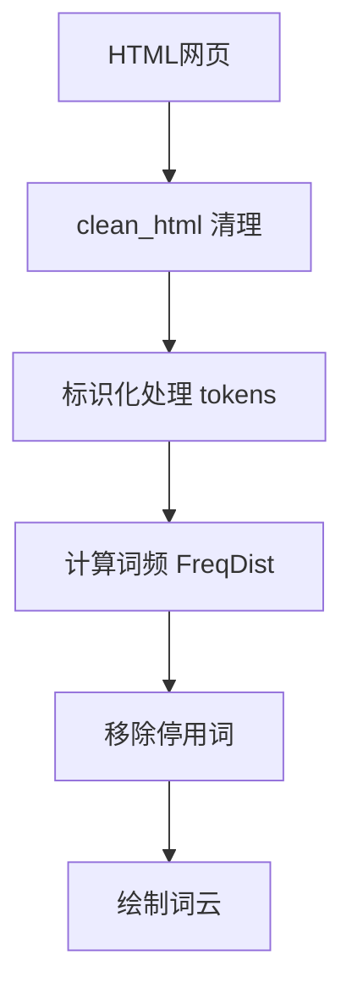
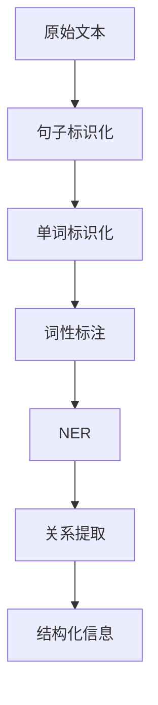
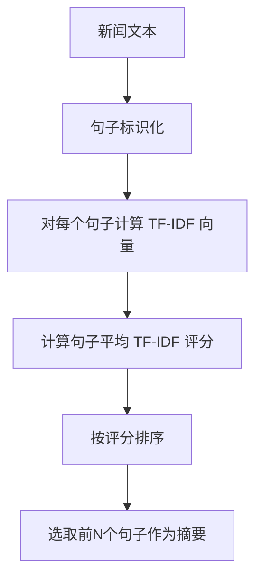
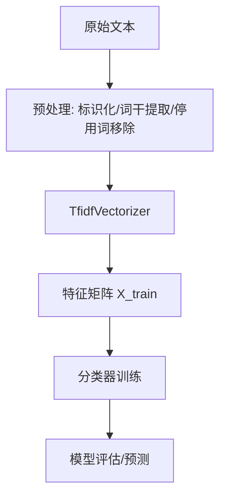
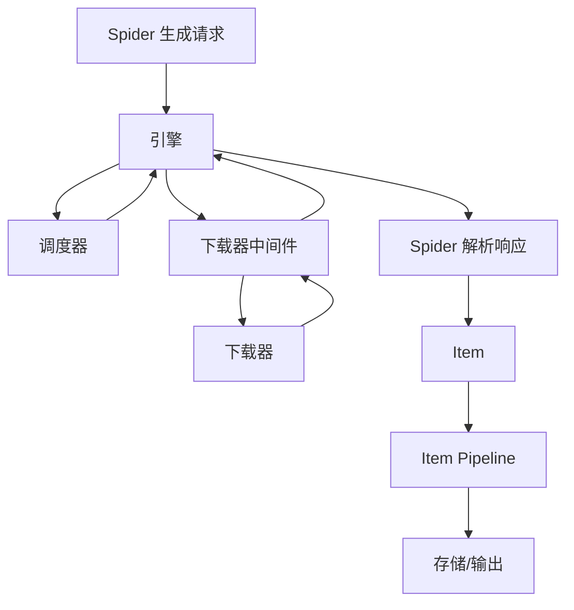
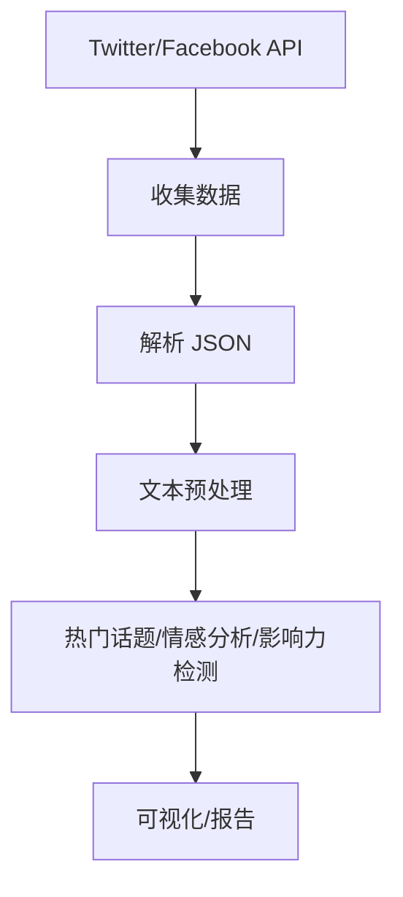
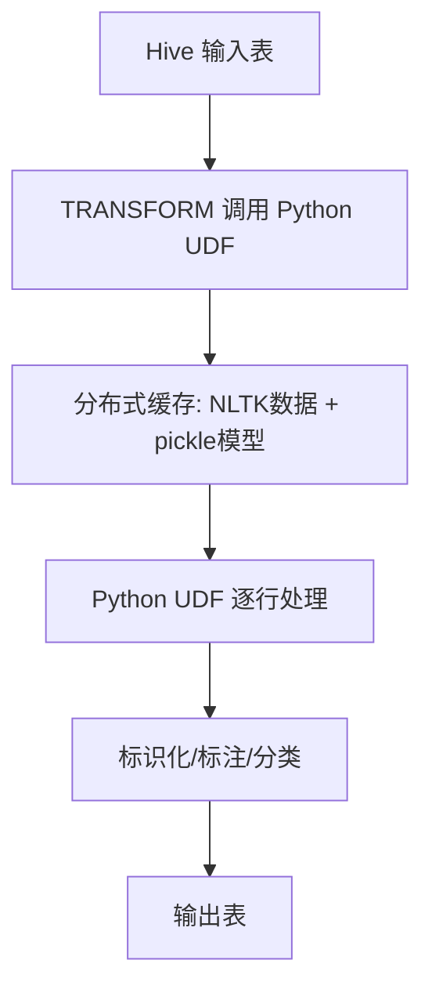

# 《NLTK基础教程：用NLTK和Python库构建机器学习应用》章节总结

## 书籍信息

- 书名：《NLTK基础教程：用NLTK和Python库构建机器学习应用》
- 作者：[印度] Nitin Hardeniya
- 译者：凌杰
- PDF 状态：文字版
- OCR 状态：良好

## 目录说明

- 目录识别情况：完整
- 章节对应依据：原书目录结构（第1章至第10章）

## 全书核心主题

本书介绍如何使用NLTK库及相关的Python库（NumPy、SciPy、pandas、matplotlib、scikit-learn、gensim、Scrapy等）构建NLP和机器学习应用。前半部分涵盖NLP预处理（标识化、词干提取、词性标注、NER、文本解析）；后半部分聚焦实际应用（文本分类、Web爬虫、社交媒体挖掘、大规模文本挖掘）。

---

## 第1章：自然语言处理简介

### 核心论点

本章介绍NLP的基本概念和NLTK库的安装与基本使用。通过构建一个单词云（word cloud）的实例，展示NLTK处理文本的简单与高效。

### 关键概念

- **NLP应用示例**：拼写校正、搜索引擎、语音引擎（Siri）、垃圾邮件分类、机器翻译、IBM Watson。
- **NLP工具**：GATE、Mallet、Open NLP、UIMA、Stanford toolkit、Genism、NLTK。
- **Python基础**：列表、字符串、正则表达式、字典、函数定义。
- **NLTK基础**：clean_html()清理HTML、FreqDist()统计词频、plot()绘图、停用词移除。

### 流程图

**NLTK 处理流程（单词云示例）**



### 经典金句/数据

> “NLP多数情况下指的是计算机上各种大同小异的语言处理应用，以及用NLP技术所构建的实际应用程序。” (p.1)

> “如果你还没有接触过NLP，推荐阅读《Speech and Language Processing》和《Statistical Natural Language Processing》的前几章。” (p.2)

---

## 第2章：文本的歧义及其清理

### 核心论点

本章解决“文本预处理”的问题。包括语句分离、标识化处理、词干提取、词形还原、停用词移除、罕见词移除、拼写纠错。这些步骤是任何NLP任务的基础。

### 关键概念

- **语句分离**：sent_tokenize()，基于PunktSentenceTokenizer。
- **标识化处理**：word_tokenize()、regexp_tokenize()、WordPunctTokenizer。
- **词干提取**：PorterStemmer（最常用）、LancasterStemmer、SnowballStemmer（支持多语言）。
- **词形还原**：WordNetLemmatizer，利用Wordnet语义词典，考虑词性。
- **停用词移除**：stopwords.words('english')，NLTK支持22种语言。
- **拼写纠错**：Peter Norvig的拼写检查算法。

### 经典金句/数据

> “词干提取是一种较为粗糙的规则处理过程，词形还原是一种更条理化的方法，它涵盖了词根所有的文法和变化形式。” (p.23)

---

## 第3章：词性标注

### 核心论点

本章解决“如何对文本进行词性标注（POS）和命名实体识别（NER）”的问题。介绍NLTK中的各种标注器：默认标注器、N-gram标注器（Unigram、Bigram、Trigram）、正则表达式标注器、Brill标注器、Stanford标注器，以及基于NLTK的NER系统（ne_chunk、Stanford NER）。

### 关键概念

- **POS标注器**：pos_tag()，基于Penn Treebank标记集（NN名词、VB动词、JJ形容词等）。
- **顺序性标注器**：DefaultTagger、UnigramTagger、BigramTagger、TrigramTagger。可组合成Backoff链（Trigram→Bigram→Unigram→Default）。
- **Brill标注器**：基于转换规则，从初始标注开始迭代修正错误。
- **NER**：ne_chunk()（基于NLTK预训练模型），Stanford NER（精度更高）。
- **NER标签**：PERSON、ORGANIZATION、LOCATION、GPE（地缘政治实体）等。

### 流程图

**N-gram 标注器组合链**

```mermaid
graph TD
    A[待标注单词] --> B[TrigramTagger]
    B -->|未找到| C[BigramTagger]
    C -->|未找到| D[UnigramTagger]
    D -->|未找到| E[DefaultTagger(NN)]
    B -->|找到| F[返回标签]
    C -->|找到| F
    D -->|找到| F
    E --> F
```

### 经典金句/数据

> “UnigramTagger的准确率约83%，BigramTagger约83.5%，TrigramTagger约83.3%。” (p.35)

> “正则表达式标注器准确率约30%，可作为Backoff使用。” (p.37)

---

## 第4章：文本结构解析

### 核心论点

本章解决“如何解析文本的语法结构”的问题。介绍浅解析（语块分解）和深解析（完整语法树）的区别，以及多种解析器（递归下降、移位-归约、图表解析、正则表达式解析器、依存性解析器）。

### 关键概念

- **CFG（上下文无关语法）**：由一组规则（如S→NP VP）定义，用于生成合法的句子结构。
- **递归下降解析器**：自上而下，从左向右读取输入，匹配语法规则。
- **移位-归约解析器**：自下而上，将单词归约为短语，最终归约为S。
- **图表解析**：使用动态规划，保存中间结果，避免重复计算。
- **依存性解析**：将单词用定向链路串联，描述语法依存关系。Stanford Parser支持依存性解析。
- **语块分解**：浅解析，将句子分割成名词短语(NP)、动词短语(VP)等语块，通过正则表达式定义语块规则。

### 流程图

**信息提取管道**



### 经典金句/数据

> “浅解析比较适合于信息提取和文本挖掘，深解析更适合于对话系统和文本综述。” (p.44)

---

## 第5章：NLP应用

### 核心论点

本章通过构建一个新闻摘要器，展示如何将前面的预处理技术整合成实际应用。同时介绍其他NLP应用：机器翻译、信息检索、语音识别、文本分类、信息提取、问答系统、对话系统、词义消歧、主题建模等。

### 关键概念

- **信息摘要方法**：方法一（基于实体和名词密度评分），方法二（基于TF-IDF评分）。
- **机器翻译**：直接翻译（字典法）、语法翻译、统计型机器翻译（SMT，如Google Translate）。
- **信息检索**：布尔检索、向量空间模型（VSM）、概率模型。
- **语音识别**：声学模型+词汇模型+语言模型。
- **文本分类**：特征工程→词汇文档矩阵(TDM)→分类器（朴素贝叶斯、SVM等）。
- **主题建模**：LDA、LSI，从语料库中发现隐含主题。

### 流程图

**信息摘要器（基于TF-IDF）流程**



### 经典金句/数据

> “Google Translate是典型的SMT应用，它会从不同语言的语料库中学习到相关信息。” (p.62)

---

## 第6章：文本分类

### 核心论点

本章解决“如何用机器学习方法对文本进行分类”的问题。使用scikit-learn库配合NLTK的预处理，构建文本分类管道。介绍朴素贝叶斯、决策树、SGD、逻辑回归、支持向量机、随机森林等算法，以及文本聚类和主题建模（LDA/LSI）。

### 关键概念

- **文本分类流程**：文本清理 → 向量化（TF-IDF） → 分类器训练 → 评估。
- **向量化器**：CountVectorizer（词频）、TfidfVectorizer（TF-IDF）。
- **朴素贝叶斯**：基于条件概率，假设特征独立，计算快，适合文本分类基准。
- **SGDClassifier**：线性模型，支持多种损失函数（log→逻辑回归，hinge→线性SVM）。
- **文本聚类**：KMeans、MiniBatchKMeans。
- **主题建模**：gensim库实现LDA和LSI，从文档中发现隐含主题。

### 流程图

**文本分类管道**



### 经典金句/数据

> “朴素贝叶斯分类器在垃圾邮件检测上的准确率约97%。” (p.77)

> “使用SGDClassifier（线性SVM）得到最好的分类结果，精确率98%。” (p.82)

---

## 第7章：Web爬虫

### 核心论点

本章解决“如何从Web中收集文本数据”的问题。使用Scrapy库编写Web爬虫，包括定义Spider、使用XPath选择器、定义Item Pipeline、处理登录和网站地图。

### 关键概念

- **Scrapy架构**：引擎 → 调度器 → 下载器 → 蜘蛛 → 项目管道。
- **选择器（Selector）**：xpath()、css()、extract()、re()。
- **Spider类型**：BaseSpider（基础）、CrawlSpider（带规则）、SitemapSpider（基于sitemap.xml）。
- **Item Pipeline**：数据清理、去重、格式转换、存储（JSON/CSV/数据库）。
- **XPath常用表达式**：//div[@class="topic"]、//title/text()、//ul/li/a/@href。

### 流程图

**Scrapy 数据流**



### 经典金句/数据

> “Google无疑是当前最大的网页爬虫之一，它爬取的对象是整个万维网。” (p.88)

---

## 第8章：NLTK与其他Python库的搭配运用

### 核心论点

本章介绍NLP和数据科学中的核心Python库：NumPy（数值计算）、SciPy（科学计算）、pandas（数据处理）、matplotlib（可视化）。这些库是NLTK和scikit-learn等高级库的基础。

### 关键概念

- **NumPy**：ndarray多维数组，支持向量化运算、矩阵操作（点积、转置、重塑）、随机数生成。
- **SciPy**：线性代数（linalg）、稀疏矩阵（CSR/CSC）、优化（optimize）、积分（integrate）。
- **pandas**：DataFrame数据结构，读取CSV/Excel/JSON/SQL，数据清洗（处理缺失值、列转换、过滤），分组聚合。
- **matplotlib**：绘图（折线图、散点图、条形图、3D图），子图布局。

### 经典金句/数据

> “NumPy是NLTK、scikit-learn、pandas等其他相关库实现其一些算法的基础之一。” (p.105)

> “pandas是Python中最令人兴奋的库之一，尤其是对于那些喜欢R语言的人来说。” (p.117)

---

## 第9章：Python中的社交媒体挖掘

### 核心论点

本章解决“如何从社交媒体（Twitter、Facebook）收集和分析数据”的问题。使用Tweepy访问Twitter API，使用facebook-sdk访问Facebook Graph API，进行热门话题提取、影响力检测、地理位置可视化。

### 关键概念

- **Twitter API**：需要创建开发者应用获取consumer_key和access_token。Stream API可跟踪关键词，获取实时推文。
- **推文JSON结构**：包含text、user、geo、place、entities（hashtags、user_mentions）等字段。
- **热门话题提取**：统计词频或提取名词（POS过滤）作为候选主题。
- **影响力检测**：基于关注者/好友比例（Klout分数）。
- **Facebook Graph API**：需要access_token，可搜索用户、页面、地点、事件，获取帖子内容。
- **投诉分类**：用已标注的帖子训练分类器，识别投诉内容。

### 流程图

**社交媒体挖掘流程**



### 经典金句/数据

> “用不到100行的代码，可以构建一个非常小巧简单的IE引擎。” (p.55)

---

## 第10章：大规模文本挖掘

### 核心论点

本章解决“如何在Hadoop等大数据平台上使用NLTK和scikit-learn”的问题。方法包括：Python流操作（MapReduce）、Hive/Pig UDF、流封装器（mrjob、Dumbo等）、PySpark。

### 关键概念

- **Python流操作**：通过Hadoop Streaming运行Python编写的mapper和reducer。
- **Hive UDF**：在Hive中编写Python UDF，利用分布式缓存分发NLTK数据和模型。适用于高度可并行化的任务（标识化、词性标注、停用词移除）。
- **Scikit-learn大规模评分**：在本地训练模型，序列化为pickle/joblib文件，在Hive UDF中加载并对海量数据进行评分。
- **PySpark**：使用Spark的MLlib进行大规模文本分类（TF-IDF + 逻辑回归/朴素贝叶斯）。

### 流程图

**Hadoop上使用NLTK UDF**



### 经典金句/数据

> “NLTK中的大多数操作都是高度可并行化的，如词性标注、标识化处理、词形还原、停用词移除、NER。” (p.143)