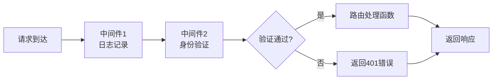
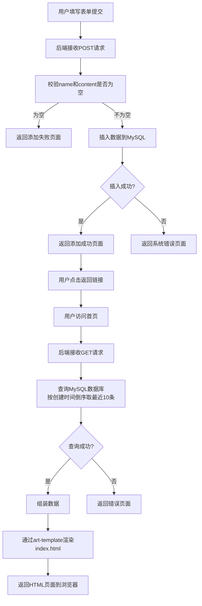
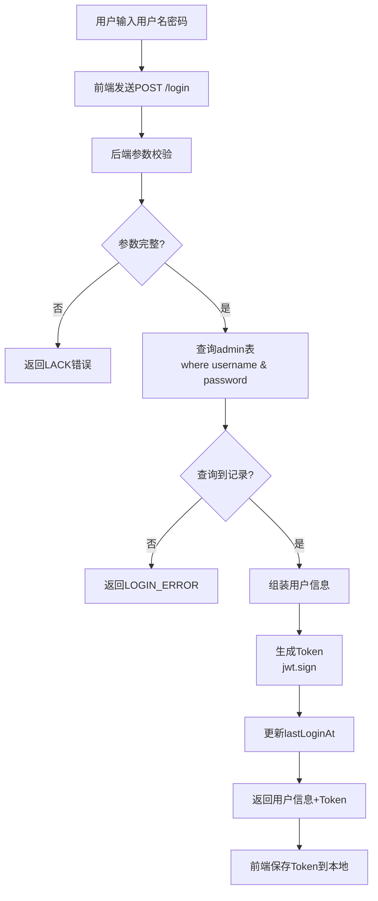
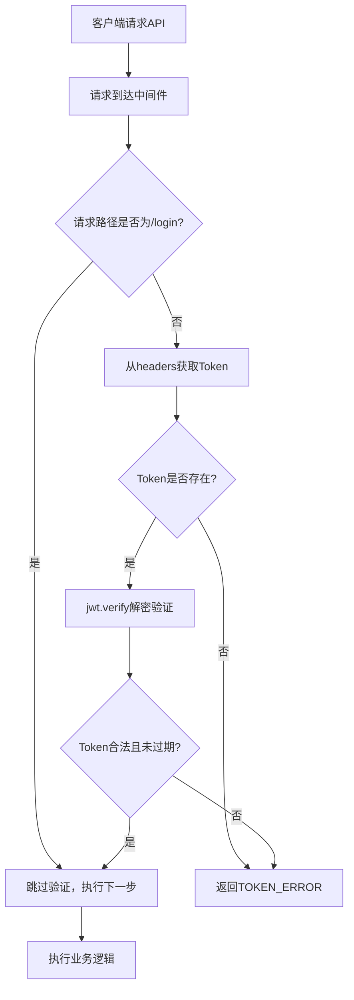
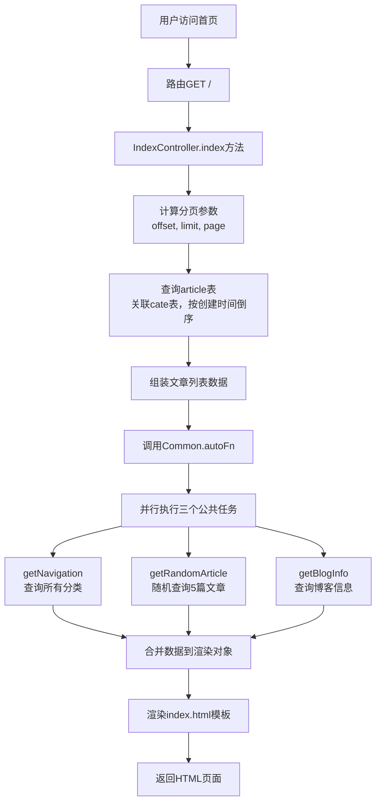
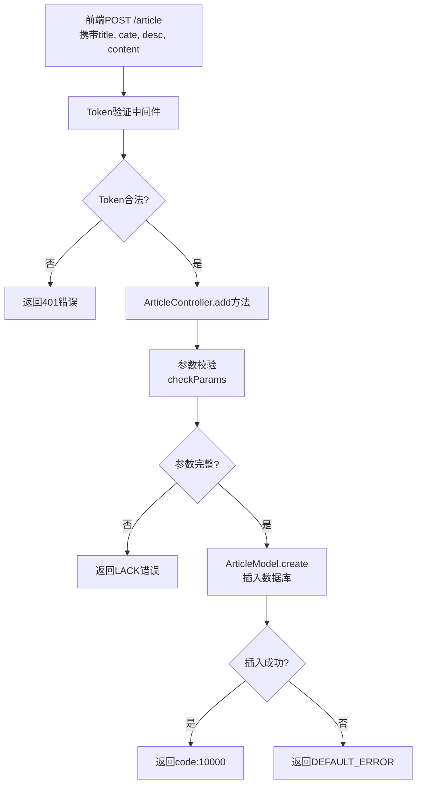
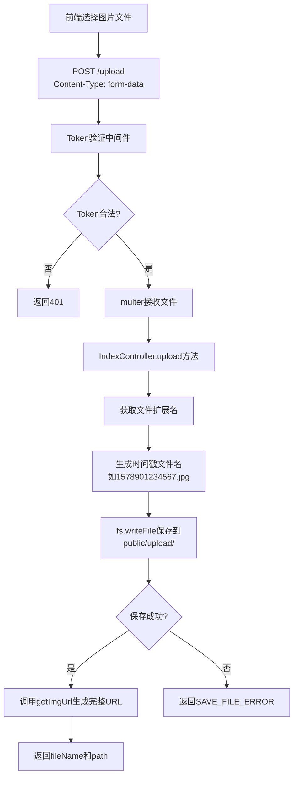
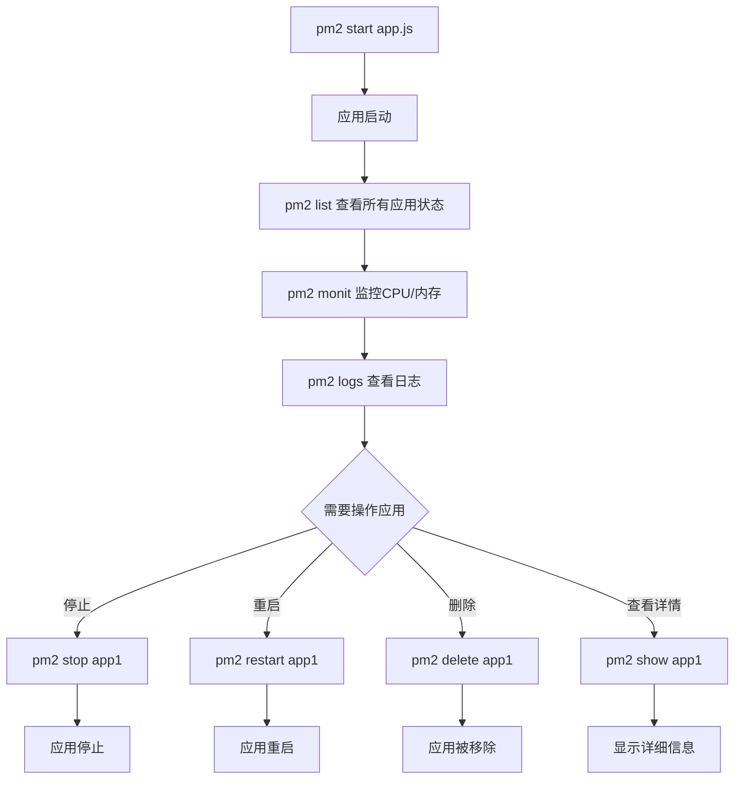

# 《Node.js+Express+Vue.js 项目开发实战》章节总结

## 书籍信息
- **书名**：Node.js+Express+Vue.js 项目开发实战
- **作者**：张旭
- **出版信息**：机械工业出版社，2020年出版
- **PDF 状态**：完整（基于扫描版识别）
- **OCR 状态**：已识别文本，存在少量页码标注，整体可读性良好

## 全书核心主题

本书是一本面向Node.js初学者的实战型教程，以Express框架为核心工具，通过三个完整的商业项目（许愿墙、博客管理系统、装修小程序管理系统）的从零到一开发过程，系统讲解了Node.js后端开发的完整知识体系。

作者采用“理论+实战”的编写策略，第1章作为技术铺垫，详细介绍了Express框架的安装、项目创建、路由配置、模板引擎更换等基础技能；第2-5章通过三个难度递进的商业项目，分别展示了“后端渲染架构”（许愿墙）和“前后端分离架构”（许愿墙后台、博客系统、小程序系统）两种主流的Web开发模式；第6章补充了Node.js项目部署的实践知识，包括PM2进程管理工具的使用。

本书的核心价值在于：它不满足于讲解零散的技术点，而是以项目开发流程为主线，完整呈现了从需求分析、系统设计、数据库设计到代码实现的真实开发过程，帮助读者建立“解决问题”而非“学习语法”的工程思维。书中独创的基于Express框架的目录结构设计（controllers、models、constant、config分层）也具有一定的参考价值。

---

## 第1章：安装和使用Express

### 核心论点

**问题**：初学者如何快速上手Node.js最流行的Web开发框架Express？

**观点**：通过Express Generator工具可以快速创建项目骨架，掌握路由（Router）、中间件（Middleware）、请求对象（Request）和响应对象（Response）四大核心概念，即可进行基础的Web应用开发。

### 关键概念

- **Express**：Node.js平台最流行的Web应用开发框架，为Web和移动应用提供一组强大的功能，具有精简、灵活的特点。
- **路由（Router）**：定义应用程序端点（URI）如何响应客户端请求的机制，支持GET、POST、PUT、DELETE等HTTP方法，支持完整匹配、模糊匹配和正则表达式匹配。
- **中间件（Middleware）**：处理函数的集合，可以访问请求对象（req）、响应对象（res）和下一个中间件函数（next），常用于身份验证、日志记录等通用处理。
- **art-template**：Express默认使用jade模板引擎，为便于新手入门，可替换为语法更简洁高效的art-template模板引擎。
- **nodemon**：开发辅助工具，监听文件变化自动重启Node.js应用，避免手动重启的低效。

### 逻辑推演

本章从环境准备开始，首先指导读者通过npm安装Express Generator工具（`npm install -g express-generator`），然后使用`express hello`命令创建一个完整的项目骨架。接着，作者详细分析了Express默认项目的目录结构（bin、node_modules、public、routes、views、app.js），并逐行解读了app.js主文件的配置逻辑（视图引擎设置、中间件注册、路由挂载、错误处理）。

在掌握项目结构后，本章转入路由的学习：先演示了GET请求路由的编写和页面渲染（`res.render()`），再通过自定义`/world`路由展示路由定义的灵活性，接着介绍了模糊匹配（如`/wes?t`）和正则表达式匹配的规则，最后引入了中间件概念——将其定义为“在路由处理方法之前再加一个方法”，用于实现通用的拦截逻辑（如身份验证）。

在模板引擎部分，作者指导读者将jade替换为art-template，并系统讲解了数据渲染（`{{变量}}`）、条件渲染（`{{if}}...{{/if}}`）和循环渲染（`{{each list as item}}`）三种页面模板的核心语法。

最后，本章详细梳理了Express中处理请求和响应的核心对象：Request对象的url、query、body、params、headers、cookies等属性，以及Response对象的render、send、json、status、redirect等方法，为后续实战项目打下基础。

### 流程图

#### Express应用请求处理流程

```mermaid
graph TD
    A[客户端发起HTTP请求] --> B[Express应用接收请求]
    B --> C[静态资源中间件<br/>express.static]
    C --> D{路由匹配}
    D -->|匹配成功| E[执行路由对应的中间件函数]
    D -->|匹配失败| F[404错误处理]
    E --> G{中间件中是否调用了next()?}
    G -->|是| H[执行下一个中间件]
    G -->|否| I[返回响应]
    H --> I
    F --> J[渲染错误页面]
    J --> I
    I --> K[响应返回客户端]
```

#### 中间件执行流程示意



### 经典金句/数据

> “Express是一个精简、灵活的Node.js的Web应用程序开发框架，为Web和移动应用程序提供了一组强大的功能。” (p.10)

> “路由是指应用程序的端点（URI）如何响应客户端请求。通俗来说，就是定义什么路径来访问。” (p.21)

> “Express提供了一个很好的工具，即中间件。可以在中间件中定义一个验证方法，然后在需要验证的接口路由上添加验证中间件，完成接口的验证。” (p.31)

> “Express其实就是一个路由和中间件合成的Web框架。” (p.31)

> Express最新版本号是4.16.0（截至本书完稿） (p.11)

---

## 第2章：许愿墙（Node.js+Express+art-template+MySQL）

### 核心论点

**问题**：如何开发一个“用户提交愿望、页面动态展示”的许愿墙应用？

**观点**：采用“后端渲染架构”（后端从数据库查询数据，通过模板引擎渲染HTML页面后返回浏览器），配合MySQL数据库存储愿望数据，即可实现包含“展示最近10条愿望”和“提交表单添加愿望”两大功能的前后台联动应用。

### 关键概念

- **后端渲染**：前端开发人员完成页面结构和样式后交给后端，后端从数据库取出数据，通过模板引擎将数据以变量方式嵌入HTML模板，最终输出完整页面到浏览器渲染。
- **async模块**：Node.js异步流程控制工具库，通过`async.auto()`方法管理多个异步任务的依赖关系和执行顺序（如“先验证参数，再执行数据库插入”）。
- **Sequelize ORM**：Node.js平台的ORM框架，将MySQL数据库表映射为JavaScript对象，通过`Model.findAll()`、`Model.create()`等方法操作数据库，避免手写SQL语句。
- **MVC目录结构**：作者提出的Express项目分层方案——`routes/`存放路由定义、`controllers/`存放业务逻辑、`models/`存放数据库映射、`constant/`存放常量定义、`config.js`存放配置信息。
- **data-*属性传值**：在后端渲染架构中，将后端数据通过自定义属性（如`data-list="{{list}}"`）传递给前端JavaScript，实现动态渲染（如愿望便签的随机颜色和位置）。

### 逻辑推演

本章从许愿墙的产品需求出发：展示最近10条愿望（便签形式、随机颜色和位置、可拖拽和关闭）、用户可提交表单添加愿望、需进行表单验证（禁止空姓名或空内容）。作者确定采用“后端渲染方案”——前端已写好HTML/CSS/JS，后端负责动态数据注入。

首先，作者在MySQL中创建`wish`数据库和`wish`数据表（字段：id、name、content、created_at、updated_at），并添加10条模拟数据用于测试。然后通过`express wish`命令创建项目，安装依赖包（art-template、express-art-template、async、mysql2、sequelize），将端口改为3001，更换模板引擎为art-template。

在项目架构设计上，作者搭建了一个清晰的分层目录：
- `routes/index.js`：定义两个路由（GET `/` 首页，POST `/add` 提交表单）
- `controllers/index.js`：实现业务逻辑（`getList`查询愿望列表，`add`添加愿望）
- `models/wish.js`：定义Wish Model映射wish表
- `constant/constant.js`：统一定义返回码（如10000成功、188系统错误、199参数缺失）
- `config.js`：配置数据库连接信息（支持开发/生产环境切换）
- `db.js`：实例化Sequelize对象

核心逻辑实现：
1. **渲染愿望列表**：在`getList`方法中，使用`WishModel.findAll({ limit: 10, order: [['created_at', 'DESC']] })`查询最近10条记录，将查询结果组装成数组后，通过`res.render('index', { list })`传递给前端模板。
2. **添加愿望**：在`add`方法中，使用`async.auto`定义两个依次执行的任务——`checkParams`（调用公共方法校验name和content是否为空）和`add`（调用`WishModel.create()`插入数据库）。成功或失败后渲染`result.html`提示页面。

最终实现了从数据库读取数据→模板渲染→表单提交→数据校验→数据库写入的完整闭环。

### 系统流程图



### 数据库表结构

| 字段名 | 类型 | 作用 |
|--------|------|------|
| id | INT（主键，自增） | 愿望唯一标识 |
| name | VARCHAR(20) | 许愿者姓名 |
| content | VARCHAR | 许愿内容 |
| created_at | DATETIME | 创建时间（自动生成） |
| updated_at | DATETIME | 更新时间（自动生成） |

### 经典金句/数据

> “展示最近10条用户的许愿信息就是需要拿出来最近10条的用户许愿信息，然后交给前端页面渲染出来。” (p.95)

> “这里后端要做两件事情：第一件是接收前端提交的表单数据；第二件是处理数据，通过SQL语句将数据保存在指定的MySQL数据库的数据表中。” (p.95-96)

> “在项目开发过程中，为了便于更换数据库域名等信息，需要将数据库的连接信息放在一个专内存配置信息的文件中。” (p.122)

> “define方法用来实现数据库表的映射……通过Sequelize的Model对象的findAll方法查询。” (p.125)

---

## 第3章：许愿墙后台管理系统（Node.js+Express+Vue.js+MySQL）

### 核心论点

**问题**：如何为许愿墙开发一个配套的后台管理系统，实现对用户愿望的查看、管理？

**观点**：采用“前后端分离架构”，后端提供RESTful API接口（返回JSON数据），前端（Vue.js）通过AJAX调用接口并渲染页面，通过Token机制实现登录验证和接口权限控制。

### 关键概念

- **前后端分离**：前端和后端是独立的项目，后端提供REST风格API接口，前端专注页面编写和数据渲染，通过JSON格式交互。这是互联网项目开发的业界标准方式。
- **Token（令牌）机制**：用户登录成功后，后端生成一个加密Token返回给前端，前端在后续请求的Header中携带Token，后端通过中间件验证Token合法性（是否伪造、是否过期），实现接口权限控制。
- **jsonwebtoken**：Node.js的JWT（JSON Web Token）库，用于生成和验证Token。`jwt.sign()`加密生成Token，`jwt.verify()`解密验证Token。
- **RESTful API**：遵循REST架构风格的API设计，使用HTTP方法表示操作类型（GET查询、POST新增、PUT修改、DELETE删除），资源通过URL路径标识。
- **公共方法提取**：将常用方法（对象克隆`clone`、参数校验`checkParams`、统一返回`autoFn`）提取到`common.js`中，提高代码复用性。

### 逻辑推演

本章承接第2章的许愿墙项目，开发一个供运营人员使用的后台管理系统。产品需求包含4大模块（登录、首页、许愿管理、管理员管理）共14个功能点。作者确定采用“前后端分离架构”——前端已用Vue.js开发完毕，后端需要提供11个API接口。

项目创建与配置：使用`express wish-admin-api`创建项目，端口改为3002，安装依赖（async、mysql2、sequelize、dateformat、jsonwebtoken），同样建立分层目录结构（routes、controllers、models、constant）。

**Token机制设计**：
- 在`controllers/token.js`中定义`encrypt`（使用jsonwebtoken签名）和`decrypt`（验证和解密Token）方法
- 在`routes/middleware/verify.js`中定义验证中间件：判断请求路径是否为`/login`，若不是则从请求头获取Token并调用`Token.decrypt()`验证
- 在需要权限的模块路由上挂载该中间件（如`app.use('/wish', verifyMiddleware.verifyToken, wishRouter)`）

**登录接口开发**（`controllers/index.js`的`login`方法）：
1. 参数校验（username、password）
2. 使用`AdminModel.findOne({ where: { username, password } })`查询数据库
3. 验证成功则生成Token并返回用户信息（id、username、name、role、lastLoginAt）
4. 异步更新该管理员的`lastLoginAt`字段为当前时间

**许愿管理接口**（`controllers/wish.js`）：
- `list`：分页查询，支持按name筛选，使用`findAndCountAll`返回列表和总数
- `info`：根据id查询单条愿望（`findByPk`）
- `add`：参数校验后`create`插入数据
- `update`：根据id更新name和content
- `remove`：根据id删除数据（`destroy`）

**管理员管理接口**（`controllers/admin.js`）：结构与许愿管理类似，管理字段包括username、password、name、role、lastLoginAt。

所有接口均通过`Common.autoFn`方法统一处理异步任务和错误返回，确保返回格式统一为`{ code: 10000, msg: '', data: {} }`。

### 系统流程图

#### 登录验证流程



#### Token验证中间件流程



#### 许愿列表查询流程

```mermaid
graph TD
    A[前端请求GET /wish<br/>携带page, rows, name] --> B[参数校验]
    B --> C[计算offset = rows*(page-1)<br/>limit = rows]
    C --> D[构建where条件<br/>若name存在则添加name筛选]
    D --> E[Sequelize查询<br/>findAndCountAll]
    E --> F{查询成功?}
    F -->|是| G[遍历结果组装数据<br/>格式化日期]
    F -->|否| H[返回DEFAULT_ERROR]
    G --> I[返回{list, count}]
```

### 数据库表结构（新增admin表）

| 字段名 | 类型 | 作用 |
|--------|------|------|
| id | INT（主键，自增） | 管理员唯一标识 |
| username | VARCHAR(20) | 用户名 |
| password | VARCHAR(36) | 密码 |
| name | INT | 姓名 |
| role | VARCHAR(20) | 角色（如超级管理员、普通管理员） |
| lastLoginAt | DATETIME | 上次登录时间 |
| created_at | DATETIME | 创建时间 |
| updated_at | DATETIME | 更新时间 |

### 经典金句/数据

> “前后端分离已成为互联网项目开发的业界标准使用方式，前后端分离会为以后的大型分布式架构、弹性计算架构、微服务架构、多端化服务打下坚实的基础。” (p.144)

> “核心思想是前端HTML页面通过AJAX调用后端的REST风格API接口并使用JSON数据进行交互。” (p.144)

> “接口验证是否登录是通过一个令牌Token来判断的。在前端登录的时候会颁发一个令牌Token给前端，前端将Token保存起来，在后续的请求中都必须携带这个Token。” (p.153)

> “Token是否合法的判断依据是是否伪造及是否过期。验证Token的方法可以放在Express中间件中去做。” (p.153-154)

> “前后端分离项目中，后端的主要工作在于开发API接口。” (p.212)

---

## 第4章：博客管理系统（Node.js+Express+art-template+Vue.js+MySQL）

### 核心论点

**问题**：如何开发一套完整的博客系统（包含前台展示和后台管理）？

**观点**：将系统拆分为两个独立子系统——前台展示采用“后端渲染架构”（便于SEO和首屏加载），后台管理采用“前后端分离架构”（便于维护和扩展），共用同一个数据库，分别开发即可实现完整的博客内容管理功能。

### 关键概念

- **前台展示系统**：面向普通访客，功能包括首页文章列表（分页）、分类导航、文章详情页、关于我们页面、侧边栏随机文章推荐。采用后端渲染，直接从数据库查询数据渲染到模板。
- **后台管理系统**：面向管理员，功能包括登录验证、文章管理（增删改查、按标题搜索）、分类管理、博客信息配置、管理员管理。采用前后端分离，提供RESTful API。
- **联表查询（关联查询）**：在Sequelize中使用`include`参数实现跨表查询，如查询文章时同时获取所属分类的名称（`include: [{ model: CateModel }]`）。
- **随机查询**：使用MySQL的`RAND()`函数或Sequelize的`db.random()`方法实现随机排序，用于侧边栏随机推荐文章。
- **分页逻辑**：前端传入`page`（当前页码）和`rows`（每页条数），后端计算`offset = rows * (page - 1)`和`limit = rows`，使用`findAndCountAll`同时返回数据和总条数。

### 逻辑推演

本章分为两大板块：前台展示系统（4.1-4.6）和后台管理系统（4.7-4.12）。

**前台展示系统**（端口3003）：
1. 数据库设计：创建`blog`数据库，设计三张表——`cate`（分类：id、name）、`article`（文章：id、title、desc、content、cate）、`info`（博客信息：id、title、subtitle、about）。
2. 项目创建：使用`express blog`创建项目，安装依赖，更换art-template模板引擎。
3. 公共方法设计（`controllers/common.js`）：定义了`autoFn`（统一渲染方法）、`getNavigation`（获取所有分类用于导航栏）、`getRandomArticle`（随机查询5篇文章用于侧边栏）、`getBlogInfo`（查询id=1的博客基本信息）。所有页面的渲染都通过`autoFn`统一处理，它会先执行当前页面的查询任务，再自动调用公共方法获取导航、侧边栏、博客信息，最后统一渲染。
4. 首页（`index`方法）：分页查询所有文章（按创建时间倒序），关联查询所属分类名称，计算出总页数，渲染`index.html`模板。
5. 分类页（`cate`方法）：根据URL参数`cateId`筛选文章，分页查询指定分类下的文章。
6. 文章页（`article`方法）：根据`articleId`查询单篇文章详情，关联查询分类信息。
7. 关于我们页（`about`方法）：查询`info`表id=1的数据。

**后台管理系统**（端口3004）：
采用前后端分离架构，提供18个API接口，包括：
- 登录接口（Token机制，与第3章相同）
- 分类管理接口（列表分页查询、单条查询、新增、修改、删除；新增时支持`dropList`参数返回所有分类用于下拉框）
- 文章管理接口（列表分页查询支持按标题筛选、单条查询、新增、修改、删除；查询时关联cate表获取分类名称）
- 博客信息管理接口（查询和修改id=1的博客信息）
- 管理员管理接口（列表分页、单条、新增、修改、删除）
- Token验证中间件（除登录外所有接口需验证）

所有接口在`controllers`层使用`Common.autoFn`统一处理异步任务和错误返回，确保API返回格式统一。

### 系统流程图

#### 前台首页渲染流程



#### 后台文章管理接口流程（以新增为例）



### 数据库表结构

**cate表（分类）**

| 字段名 | 类型 | 作用 |
|--------|------|------|
| id | INT（主键，自增） | 分类ID |
| name | VARCHAR(20) | 分类名称 |
| created_at | DATETIME | 创建时间 |
| updated_at | DATETIME | 更新时间 |

**article表（文章）**

| 字段名 | 类型 | 作用 |
|--------|------|------|
| id | INT（主键，自增） | 文章ID |
| title | VARCHAR(30) | 文章标题 |
| desc | VARCHAR | 文章摘要 |
| content | TEXT | 文章内容 |
| cate | INT | 所属分类ID（外键关联cate表） |
| created_at | DATETIME | 创建时间 |
| updated_at | DATETIME | 更新时间 |

**info表（博客信息）**

| 字段名 | 类型 | 作用 |
|--------|------|------|
| id | INT（主键，自增） | 主键 |
| title | VARCHAR(20) | 博客名称 |
| subtitle | VARCHAR(30) | 副标题 |
| about | TEXT | 关于我们内容 |
| created_at | DATETIME | 创建时间 |
| updated_at | DATETIME | 更新时间 |

### 经典金句/数据

> “侧边栏展示的是10条随机文章的标题，只需要从MySQL数据库中随机查询出10篇文章数据即可。使用MySQL自带的rand()方法就可随机查询出数据。” (p.284)

> “在公共方法common.js文件中定义了3个公共方法：克隆方法clone、校验参数方法checkParams和返回统一方法autoFn。” (p.334)

> “定义过中间件之后，在需要Token验证的路由中添加这个中间件。” (p.459)

> “文章所属于分类，一个分类包含多篇文章，将文章表和分类表进行关联。Article.belongsTo(CateModel, {foreignKey: 'cate', constraints: false});” (p.467)

---

## 第5章：装修小程序管理系统（Node.js+Express+Vue.js+MySQL）

### 核心论点

**问题**：如何为微信小程序开发一套完整的内容管理系统（包含小程序端API和后台管理）？

**观点**：小程序端（前台展示）和后台管理系统均采用“前后端分离架构”，小程序通过HTTP请求调用API接口获取JSON数据并渲染页面。后台管理系统提供30+个API接口，涵盖活动管理、分类管理、文章管理、案例管理、预约管理、企业信息管理、管理员管理等模块，并增加图片上传接口支持图文内容管理。

### 关键概念

- **小程序API设计**：小程序端（前台）需要8个接口——活动列表、分类列表、文章列表（分页，按分类筛选）、文章详情、案例列表（支持首页推荐和分页两种模式）、案例详情、企业信息、预约提交。
- **后台管理系统API**：提供31个接口，包括登录、上传图片，以及各模块的CRUD操作（活动、分类、文章、案例、预约、企业信息、管理员），部分模块支持下拉列表查询（`dropList`参数返回全部数据）。
- **multer中间件**：Express中处理文件上传的中间件，通过`uploadMiddleware.single('img')`接收单个图片文件，将文件保存在`public/upload/`目录，返回文件路径供前端使用。
- **预约状态管理**：预约记录包含status字段（0=待处理，1=已联系，2=已确认），支持修改状态，便于运营人员跟踪客户跟进进度。
- **统一图片URL生成**：在公共方法中定义`getImgUrl(req, imgName)`，根据当前请求的域名协议和主机名，拼接出完整的图片访问URL（如`http://localhost:3006/upload/1578901234567.jpg`）。

### 逻辑推演

本章是全书中接口数量最多、业务最复杂的项目，分为前台小程序端（5.1-5.6）和后台管理系统（5.7-5.12）。

**前台小程序端**（端口3005，项目名decorate-api）：
1. 数据库设计：创建`decorate`数据库，设计6张表——
   - `event`（活动）：id、name、img、url、articleId
   - `cate`（分类）：id、name、img
   - `article`（文章）：id、title、desc、cover、content、cate
   - `case`（案例）：id、name、img、desc、content
   - `order`（预约）：id、name、phone、type、orderDate、message
   - `company`（企业信息）：id、name、address、tel、intro、longitude、latitude
2. 接口开发（8个）：
   - `eventList`：查询所有活动，返回`{list}`
   - `cateList`：查询所有分类，返回`{list}`
   - `articleList`：分页查询指定分类下的文章（参数cateId、page、rows）
   - `article`：根据articleId查询文章详情
   - `caseList`：支持两种模式——若`from=index`则只返回2条最新案例（首页用），否则分页返回所有案例
   - `caseInfo`：根据caseId查询案例详情
   - `company`：查询id=1的企业信息
   - `order`：接收name、phone、type、orderDate、message参数，插入预约记录

**后台管理系统**（端口3006，项目名decorate-admin-api）：
1. 核心差异：相比前几章的后台系统，本章增加了**图片上传接口**，因为活动、分类、文章、案例都需要上传图片。
2. 图片上传实现：
   - 安装multer包：`npm install multer -S`
   - 在`routes/index.js`中配置：`const uploadMiddleware = multer()`
   - 定义上传路由：`router.post('/upload', verifyMiddleware.verifyToken, uploadMiddleware.single('img'), IndexController.upload)`
   - `upload`方法逻辑：获取上传文件的扩展名，使用时间戳作为新文件名，通过`fs.writeFile`将文件保存到`public/upload/`目录，调用`Common.getImgUrl`返回可访问的URL
3. 各模块接口（31个）：
   - 登录、上传图片
   - 活动管理（5个接口：列表分页查询、单条查询、新增、修改、删除）
   - 分类管理（5个接口，支持`dropList`下拉列表查询）
   - 文章管理（5个接口，列表查询支持按标题筛选）
   - 案例管理（5个接口）
   - 预约管理（2个接口：列表分页查询、修改预约状态）
   - 企业信息管理（2个接口：查询和修改id=1的企业信息）
   - 管理员管理（5个接口）

所有接口都使用Token验证中间件（除登录和上传图片接口需验证Token，登录接口除外）。

### 系统流程图

#### 图片上传流程



#### 小程序端文章列表查询流程

```mermaid
graph TD
    A[小程序请求GET /article<br/>cateId=1&page=1&rows=4] --> B[参数校验<br/>cateId, page, rows]
    B --> C[计算offset和limit]
    C --> D[查询article表<br/>where: {cate: cateId}<br/>按创建时间倒序]
    D --> E[关联查询cate表<br/>获取分类名称]
    E --> F[组装数据<br/>id, title, desc, cover, cateName]
    F --> G[返回JSON<br/>{list, count}]
```

#### 预约管理流程（前台+后台）

```mermaid
graph TD
    subgraph 小程序端
        A[用户填写预约表单] --> B[提交POST /order]
        B --> C[参数校验name, phone, type, orderDate]
        C --> D[插入order表<br/>status默认为0]
        D --> E[返回成功提示]
    end
    
    subgraph 后台管理端
        F[管理员登录] --> G[访问预约列表页面]
        G --> H[GET /order?page=1&rows=10]
        H --> I[分页查询order表]
        I --> J[展示预约列表]
        J --> K[管理员点击"已联系"]
        K --> L[PUT /order/status<br/>更新status=1]
        L --> M[更新成功提示]
    end
```

### 数据库表结构（decorate数据库）

**event表（活动）**

| 字段名 | 类型 | 作用 |
|--------|------|------|
| id | INT（主键，自增） | 活动ID |
| name | VARCHAR(20) | 活动名称 |
| img | VARCHAR | 活动图片 |
| url | VARCHAR | 活动链接 |
| articleId | INT | 关联的文章ID |

**cate表（分类）**

| 字段名 | 类型 | 作用 |
|--------|------|------|
| id | INT（主键，自增） | 分类ID |
| name | VARCHAR(20) | 分类名称 |
| img | VARCHAR | 分类图片 |

**article表（文章）**

| 字段名 | 类型 | 作用 |
|--------|------|------|
| id | INT（主键，自增） | 文章ID |
| title | VARCHAR(30) | 文章标题 |
| desc | VARCHAR | 文章摘要 |
| cover | VARCHAR | 封面图 |
| content | TEXT | 文章内容 |
| cate | INT | 所属分类ID |

**case表（案例）**

| 字段名 | 类型 | 作用 |
|--------|------|------|
| id | INT（主键，自增） | 案例ID |
| name | VARCHAR(20) | 案例名称 |
| img | VARCHAR | 案例图片 |
| desc | VARCHAR | 案例描述 |
| content | TEXT | 案例内容 |

**order表（预约）**

| 字段名 | 类型 | 作用 |
|--------|------|------|
| id | INT（主键，自增） | 预约ID |
| name | VARCHAR(30) | 姓名 |
| phone | VARCHAR(20) | 电话 |
| type | VARCHAR(20) | 装修类型 |
| orderDate | DATE | 预约时间 |
| message | VARCHAR | 留言 |
| status | INT | 状态（0待处理，1已联系，2已确认） |

**company表（企业信息）**

| 字段名 | 类型 | 作用 |
|--------|------|------|
| id | INT（主键，自增） | 主键 |
| name | VARCHAR(50) | 企业名称 |
| address | VARCHAR | 地址 |
| tel | VARCHAR(30) | 电话 |
| intro | TEXT | 简介 |
| longitude | DECIMAL(6) | 经度 |
| latitude | DECIMAL(6) | 纬度 |

### 经典金句/数据

> “由于小程序的特殊性，系统设计实现方案只能通过前后端分离的方式，通过HTTP协议传输JSON格式数据。” (p.576)

> “上传接口会接收前端传入的文件流，然后处理成文件并保存到指定的目录中。如果保存成功则会返回包含文件名和文件路径的包含成功信息的JSON数据。” (p.712)

> “Token是否合法的判断依据为是否伪造及是否过期。验证Token的方法可以放在Express中间件中去做。” (p.712-713)

> “预约管理模块可以修改预约状态，单击预约列表中的某一条预约信息可进行修改。” (p.691)

---

## 第6章：Node.js部署

### 核心论点

**问题**：如何将开发完成的Node.js项目部署到生产服务器，并保证稳定运行？

**观点**：在Linux服务器上安装Node.js环境，通过Git拉取项目代码，安装依赖包后，使用PM2进程管理工具启动项目（而非简单的`node app.js`），可以实现自动重启、负载均衡、日志管理、性能监控等功能，确保Node.js应用在生产环境稳定运行。

### 关键概念

- **PM2**：Node.js的进程管理工具，可以简化Node.js应用管理的繁琐任务，如性能监控、自动重启、负载均衡等。允许永久保持应用程序处于活动状态，无需停机即可重新加载。
- **软链接（ln -s）**：在Linux中创建命令的全局软链接，将`/opt/node-v10.16.0-linux-x64/bin/node`链接到`/usr/local/bin/node`，使`node`命令在任何目录下都可执行。
- **Git部署**：使用`git clone`从远程仓库拉取项目代码到服务器，生产环境通常通过Git进行版本控制和代码更新。
- **nohup命令**：`nohup command &`可以在后台执行命令，使进程不会因终端关闭而停止，但存在不稳定、无法管理的缺点，因此推荐使用PM2。
- **PM2配置文件（pm2.json）**：将PM2的启动参数（应用名称、启动脚本、实例数量、日志路径、环境变量等）写入JSON配置文件，通过`pm2 start pm2.json`启动，便于版本控制和团队协作。

### 逻辑推演

本章从生产环境部署的实际需求出发，按步骤讲解部署流程：

1. **安装Node.js**：
   - 从官网下载Linux二进制包（`node-v10.16.0-linux-x64.tar.xz`）
   - 上传到服务器（如`/opt`目录），使用`tar -xvf`解压
   - 建立软链接使node和npm命令全局可用：`ln -s /opt/node-v10.16.0-linux-x64/bin/node /usr/local/bin/node`

2. **提取项目代码**：
   - 安装Git（CentOS用`yum install git`，Ubuntu用`apt-get install git`）
   - 进入存放代码的目录（如`/home/www`），执行`git clone <项目git地址>`

3. **启动项目的问题**：
   - 直接使用`node app.js`启动，命令行窗口关闭后服务即停止
   - 使用`nohup node app.js &`可以在后台运行，但存在不稳定、无法管理的缺点

4. **PM2进程管理**：
   - 全局安装：`npm install pm2 -g`
   - 常用命令：`pm2 start`（启动）、`pm2 list`（查看列表）、`pm2 show`（查看详情）、`pm2 monit`（监控资源）、`pm2 logs`（查看日志）、`pm2 stop`（停止）、`pm2 restart`（重启）、`pm2 delete`（删除）
   - 启动时可配置参数：`-i 4`（启动4个实例做负载均衡）、`--name app1`（指定应用名）、`--watch`（文件变化自动重启）

5. **PM2配置文件**：
   - 在项目根目录创建`pm2.json`，配置应用名称、启动脚本、实例数量、日志路径、环境变量等
   - 执行`pm2 start pm2.json`启动
   - 示例配置包含：name、script、cwd、watch、exec_mode（cluster模式）、instances（实例数）、error_file/out_file（日志路径）、env（环境变量）等参数

### PM2常用命令流程图



### PM2配置文件参数说明

| 参数名 | 作用 |
|--------|------|
| name | 应用名称，用于标识 |
| script | 启动脚本路径（如bin/www） |
| cwd | 项目根目录 |
| watch | 是否监听文件变化自动重启 |
| ignore_watch | 忽略监听的文件/目录 |
| exec_mode | 执行模式（cluster_mode集群模式） |
| instances | 启动实例数量（0表示根据CPU核数自动） |
| error_file | 错误日志输出路径 |
| out_file | 标准输出日志路径 |
| log_date_format | 日志时间格式 |
| autorestart | 是否自动重启 |
| env | 生产环境变量（NODE_ENV、PORT等） |

### 经典金句/数据

> “PM2是Node.js的进程管理工具，可以利用它来简化很多Node.js应用管理的繁琐任务，如性能监控、自动重启和负载均衡等，而且使用非常简单。” (p.1014)

> “PM2允许用户永久保持应用程序处于活动状态，而无需停机即可重新加载它们。” (p.1014)

> “在团队协作项目开发过程中，一般会使用版本控制工具Git，当项目开发完成之后，需要将项目代码放到服务器上，最好的方式是通过Git提取。” (p.1009)

> “对于上线部署，目前的大部分公司都采用云服务器的方式，其中最常见的就是阿里云，大部分的服务器操作系统都是Linux。” (p.1004)

---

## 附录：全书技术栈速查表

| 技术 | 版本/说明 | 使用章节 |
|------|-----------|----------|
| Node.js | 10.14.0 | 全本书 |
| Express | 4.16.0 | 全本书 |
| art-template | 4.13.2 | 第2、4章（后端渲染） |
| Vue.js | 2.5.21 | 第3、4、5章（后台管理前端） |
| MySQL | 5.6 | 第2-5章 |
| Sequelize | ORM框架 | 第2-5章 |
| async | 异步流程控制 | 第2-5章 |
| jsonwebtoken | Token生成与验证 | 第3、4、5章（后台） |
| multer | 文件上传 | 第5章（后台） |
| PM2 | 进程管理 | 第6章 |
| Git | 版本控制 | 第6章 |

---

> 说明：本书第1-5章为实战开发内容，第6章为部署内容。以上总结基于PDF OCR识别文本整理，保留了原书章节顺序、核心代码逻辑、系统设计思路和关键技术点。流程图根据书中描述和代码逻辑重建，数据库表结构基于各章的表结构定义整理。