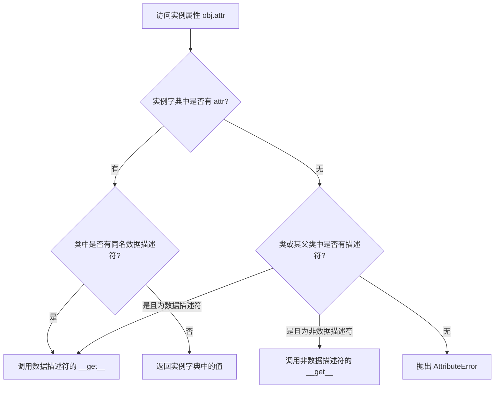
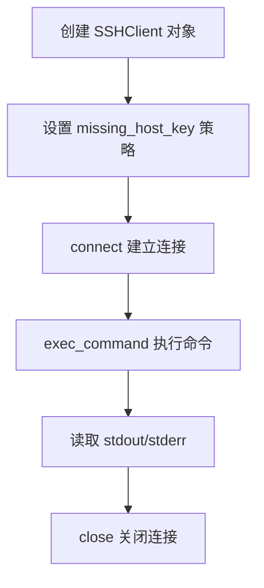
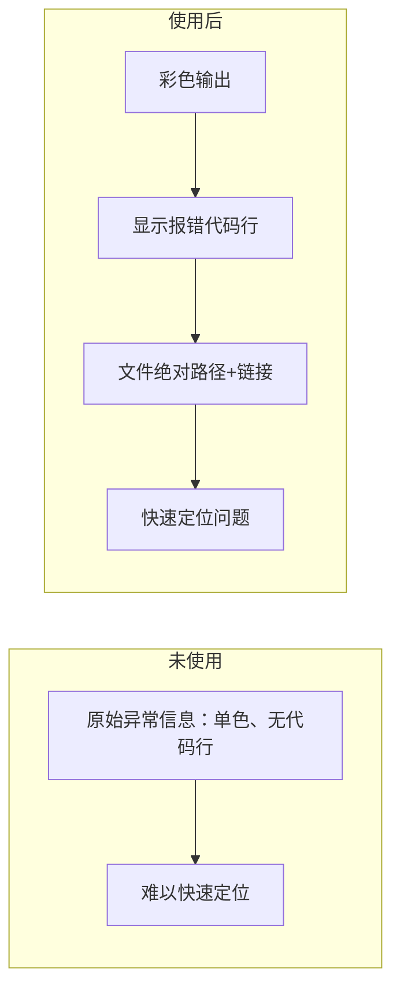

# 《Python 黑魔法指南 v2.0》章节总结

## 书籍信息

- **书名**：Python 黑魔法指南 v2.0
- **作者**：王炳明
- **PDF 状态**：扫描/图片型PDF + 文本层，部分页面为OCR识别，存在少量错漏（如个别字符乱码）。
- **OCR 状态**：主要文字可识别，部分图片内容无法完整恢复，命令行截图中的输出需要依赖描述。

## 目录说明

- **目录识别情况**：原书有明确目录大纲，分为七章，每章下设若干小节（如1.1～1.30等）。本总结按原章节顺序整理。
- **章节对应依据**：基于PDF中“目录大纲”页及正文标题。
- **OCR 修复说明**：部分代码输出中的中文乱码（如Unicode转义序列）已根据上下文整理，图表采用Mermaid重建或文字描述。

## 全书核心主题

本书汇集了大量 Python 编程中的“黑魔法”技巧，涵盖冷知识、命令行妙用、炫技操作、进阶概念、开发技巧、编码习惯以及实用第三方模块。作者通过大量短小精悍的代码示例，展示了 Python 语言中鲜为人知的特性（如省略号、小整数池、字符串驻留等）、高效写法（链式比较、海象运算符、列表合并八法）、调试与重试机制、远程连接等。全书旨在提升 Python 开发者的编程效率与代码优雅度，适合中高级 Python 开发者阅读。

---

## 第一章：魔法冷知识

### 核心论点

- **问题**：Python 中有哪些不起眼但能提升代码简洁性或解释怪异行为的冷知识？
- **观点**：省略号（...）可以用作占位符或 NumPy 语法糖；反斜杠续行有边界情况；小整数池和字符串驻留影响 `is` 比较结果；字典在 Python 3.6+ 中保持插入顺序等。

### 关键概念

- **省略号 (Ellipsis)**：Python 内置单例对象，可用 `...` 表示，布尔值为 `True`，常用于 NumPy 切片占位或替代 `pass`。
- **小整数池**：`[-5, 256]` 范围内的整数被提前创建，相同值引用同一对象。
- **字符串驻留 (intern)**：Python 自动对部分字符串（不含空格、长度≤20等）共享相同对象，提高效率。
- **链式比较**：`a < b < c` 等价于 `a < b and b < c`，可简化区间判断。
- **字典有序**：Python 3.6+ 中字典保留键的插入顺序，3.7+ 成为语言特性。

### 逻辑推演

本章从省略号开始，展示其类型、单例性及实际用途（替代 `pass`）。接着通过修改 `sys.ps1`/`sys.ps2` 改变交互式提示符。然后演示链式比较、逻辑运算符短路特性、列表合并的 `sum` 技巧、字典有序性等。之后深入小整数池和字符串驻留机制，通过多个 `is` 对比案例说明边界条件（如赋值方式、长度限制）。最后介绍 `site-packages` vs `dist-packages` 区别、`argument`/`parameter` 术语、Shebang `#!/usr/bin/env python` 作用、`dict()` 与 `{}` 性能差异、有趣的 `__hello__` 和 `this` 模块、`try...finally...` 中 `return` 优先级、字符串 `count("")` 返回长度+1、Python2 中 `print()` 语法兼容、西里尔字母伪装等。

### 经典金句

> “Python 中一切皆对象，省略号也不例外。”
> 
> “小整数池 `[-5, 256]` 的对象是提前建立好的，不会被垃圾回收。”
> 
> “字典居然是可以排序的？在 Python 3.6+ 中字典已经是有序的。”

---

## 第二章：魔法命令行

### 核心论点

- **问题**：如何利用 Python 命令行工具提升日常开发效率？
- **观点**：Python 内置模块和命令行参数提供了许多便捷功能，如快速美化 JSON、启动 HTTP 服务器、查看模块搜索路径、调试脚本等。

### 关键概念

- **交互式下划线 `_`**：在 REPL 中保存上一次执行结果（非 `print` 输出）。
- **`python -m site`**：查看完整的包搜索路径（包括用户环境目录）。
- **`python -m json.tool`**：格式化 JSON 文件或标准输入。
- **`python -m http.server`**：快速启动当前目录的 HTTP 文件服务器（Python3）。
- **`python -m pydoc -p <port>`**：启动本地文档服务器。
- **`python -m pip install` 指定 Python 版本**：使用 `python3.8 -m pip install pkg` 确保安装到正确环境。
- **`python -i script.py`**：脚本执行后进入交互模式，便于调试。
- **`python -q`**：静默进入 REPL，不显示版本信息。
- **`PYTHONSTARTUP` 环境变量**：指定 REPL 启动时自动执行的脚本。
- **`usercustomize.py`**：放在用户 site-packages 目录下，每次 Python 启动时自动加载。

### 逻辑推演

本章从 REPL 中的 `_` 变量说起，接着介绍 `python -m site` 快速查看路径。然后演示 `json.tool` 美化 JSON、`http.server` 共享文件、`pydoc` 开启文档服务。针对多 Python 版本环境，推荐使用 `pythonX.Y -m pip install` 明确安装目标。`-i` 参数让脚本跑完后进入 REPL，而 `-q` 消除启动信息。通过 `PYTHONSTARTUP` 可以在 REPL 启动时执行自定义代码（如打印欢迎语）。最后介绍 `usercustomize.py` 机制，甚至可以植入“平安经”等幽默内容。

### 经典金句

> “使用 `python -m json.tool` 可以让你优雅地查看 JSON 文件。”
> 
> “最正确且优雅的装包方法：`python3.8 -m pip install requests`。”

---

## 第三章：炫技魔法操作

### 核心论点

- **问题**：如何用 Pythonic 的方式实现列表合并、字典合并、条件判断、子串查找等常见操作？
- **观点**：Python 提供了多种炫酷的写法（如 `*` 解包、`itertools.chain`、字典推导式、海象运算符等），简洁高效，但应适度使用以免降低可读性。

### 关键概念

- **列表合并八法**：`+`、`itertools.chain`、`*` 解包、`extend`、列表推导式、`heapq.merge`、`__add__` 魔法方法、`yield from`。
- **字典合并八法**：`update`、`**` 解包、`itertools.chain`、`ChainMap`、`|` 操作符（Python 3.9）、字典推导式等。
- **花式导包**：`import`、`__import__`、`importlib`、`imp`、`execfile`、`exec`、`import_from_github_com`、远程导入。
- **条件语句七种写法**：传统 `if-else`、三元表达式、`and-or` 短路、元组索引、`lambda` 立即执行、`dict.get`、`eval`（不推荐）。
- **子串判断七法**：`in`、`find`、`index`、`count`、`__contains__`、`operator.contains`、正则。
- **海象运算符 `:=`**：赋值表达式，可在 `if`、`while`、推导式中使用，避免重复计算。

### 逻辑推演

本章详细列举了同一功能的多种实现方式，强调 Python 的灵活性。例如合并列表时，`+` 最直观但会生成新列表，`extend` 原地修改，`heapq.merge` 额外排序，`yield from` 可自定义生成器。合并字典时，Python 3.9 的 `|` 操作符最为简洁。导包方式从基础到高级，甚至支持从 GitHub 直接导入。条件判断的多种写法体现了 Python 的表达力，但作者建议优先使用传统写法保持可读性。海象运算符是 Python 3.8 新特性，能在表达式内赋值，简化循环和推导式中的重复调用。

### 流程图

#### 海象运算符在列表推导式中的优化流程

```mermaid
graph TD
    A[原始列表推导式] --> B[每次迭代调用 get_bmi(m) 两次]
    B --> C[浪费性能]
    C --> D[使用 := 将结果赋值给变量]
    D --> E[仅在判断时计算一次，在结果中复用]
    E --> F[提升效率]
```

### 经典金句

> “这些骚操作，还真是活久见……这六种写法里，我最推荐使用的是第一种。”
> 
> “海象运算符可以让你在推导式中避免重复计算。”

---

## 第四章：魔法进阶扫盲

### 核心论点

- **问题**：如何深入理解装饰器、描述符、上下文管理器等 Python 高级特性？
- **观点**：这些机制是实现代码复用、属性控制、资源管理的关键，掌握它们能让代码更优雅、更 Pythonic。

### 关键概念

- **装饰器**：函数或类，用于修改被装饰对象的行为。支持无参、有参、类装饰器、`functools.wraps` 保留元信息。
- **描述符**：实现 `__get__`、`__set__`、`__delete__` 的类，用于控制属性访问。数据描述符优先于实例字典，非数据描述符次之。
- **上下文管理器**：实现 `__enter__` 和 `__exit__` 的类，或使用 `contextlib.contextmanager` 装饰生成器。常用于资源管理（文件、锁）和异常处理。
- **Property 实现**：描述符的经典应用，可以自定义属性的获取和设置逻辑。
- **staticmethod/classmethod**：也是描述符，通过 `__get__` 返回绑定或未绑定的方法。

### 逻辑推演

本章从装饰器的基本模式开始，逐步演示带参数装饰器、类装饰器、使用偏函数构造装饰器、装饰器装饰类。然后引入描述符，以成绩管理为例展示如何通过描述符统一字段验证逻辑，避免重复的 property 代码。详细区分数据描述符和非数据描述符的查找优先级。接着自己实现一个 `TestProperty` 描述符来模拟 `@property` 的内部原理，并解释 `@staticmethod` 和 `@classmethod` 的描述符本质。最后讲解上下文管理器的协议，以及 `contextlib` 简化写法，并给出 `with` 处理异常的示例。

### 流程图

#### 描述符查找顺序



### 经典金句

> “描述符是 Python 语言独有的特性，它不仅在应用层使用，在语言的基础设施中也有涉及。”
> 
> “上下文管理器的三个好处：提高代码复用率、优雅度、可读性。”

---

## 第五章：魔法开发技巧

### 核心论点

- **问题**：日常开发中有哪些能提升效率的 Python 小技巧？
- **观点**：利用标准库和第三方库可以简化代码，如 `itertools.product` 替代多层循环、`functools.lru_cache` 缓存结果、`timeit` 测量性能、`atexit` 注册退出回调等。

### 关键概念

- **嵌套上下文管理器简写**：`with A(), B():`
- **多层循环扁平化**：`itertools.product` 生成笛卡尔积。
- **`for` 死循环**：`for i in iter(int, 1): pass`，利用 `iter(callable, sentinel)`。
- **异常上下文控制**：`raise ... from None` 隐藏原始异常。
- **`lru_cache`**：函数结果缓存，减少重复计算。
- **流式读取大文件**：`iter(partial(fp.read, block_size), '')`。
- **延迟调用**：`contextlib.ExitStack` 模拟 Golang `defer`。
- **`timeit`**：精确测量小段代码执行时间。
- **重定向标准输出**：临时替换 `sys.stdout`。
- **`atexit`**：注册程序退出时执行的函数。
- **`inspect.getsource`**：运行时获取函数源代码。
- **Tenacity 重试库**：装饰器实现灵活重试策略。
- **`pip install --user`**：用户级安装，避免权限问题。
- **`str.splitlines()`**：处理换行符更干净。
- **切片反转**：`[::-1]` 通杀字符串和列表。
- **`print(..., file=f)`**：直接输出到文件。
- **`sys.setrecursionlimit`**：调整递归深度。
- **`for...else` / `try...else`**：`else` 在循环未 break 或 try 无异常时执行。
- **`functools.singledispatch`**：单分派泛函数。

### 逻辑推演

本章汇集大量实用技巧，每一条都配有简短示例。例如使用 `product` 替代三层 `for`，代码更简洁；使用 `lru_cache` 自动缓存递归结果（如斐波那契数列）；使用 `iter` 配合 `partial` 分块读取大文件避免内存爆炸；使用 `ExitStack` 实现多个资源的延迟清理；使用 `timeit` 精确测量性能而不需手动 `time.time`；使用 `tenacity` 优雅处理网络请求重试；使用 `singledispatch` 实现根据第一个参数类型分派不同函数。

### 经典金句

> “自带的缓存机制不用白不用——`functools.lru_cache`。”
> 
> “让你晕头转向的 else 用法：`for...else` 在循环正常结束时执行 `else`。”

---

## 第六章：良好编码习惯

### 核心论点

- **问题**：哪些编码习惯能避免常见陷阱并提升代码性能？
- **观点**：不要直接调用类的私有方法（可通过 `_ClassName__method` 绕过但不推荐）；默认参数不要用可变对象；优先使用增量赋值（`+=`）而非重新赋值；Python 2 下慎用 `pprint`，推荐 `json.dumps` 美化输出。

### 关键概念

- **私有方法名称修饰**：Python 会将 `__method` 重命名为 `_ClassName__method`，但仍可调用，但不应依赖。
- **可变默认参数陷阱**：默认参数在函数定义时计算并复用，导致多次调用共享同一对象。
- **增量赋值 vs 普通赋值**：`a += b` 尽量原地修改（如列表 `extend`），比 `a = a + b` 性能好。
- **`json.dumps` 替代 `pprint`**：尤其在 Python 2 中，`json.dumps` 通过 `ensure_ascii=False` 和 `indent` 参数能更好显示中文和双引号。

### 逻辑推演

本章针对常见编码错误给出建议。首先指出私有方法虽然被名称修饰，但仍可通过 `_ClassName__method` 调用，但违反封装原则。然后通过列表追加的经典案例说明可变默认参数的问题：函数定义时创建的列表对象会被所有调用共享。对比 `a = a + [1]` 和 `a += [1]` 的区别，前者创建新列表，后者原地扩展。最后花费大量篇幅对比 `pprint` 和 `json.dumps` 在格式化输出上的优劣，指出 Python 2 中 `pprint` 对中文支持差、输出单引号等问题，并给出自定义 `PrettyPrinter` 的解决方案，但最终推荐直接使用 `json.dumps`。

### 经典金句

> “默认参数最好不为可变对象，否则你会踩到意想不到的坑。”
> 
> “Python 2 下的 pprint，真的不要再用了。——用 `json.dumps` 它不香吗？”

---

## 第七章：神奇的魔法模块

### 核心论点

- **问题**：有哪些第三方 Python 模块能极大简化特定场景下的开发工作？
- **观点**：`paramiko` 是 SSH 连接的完美方案，`pretty-errors` 让异常信息更美观，`tenacity` 提供了强大的重试机制（已在第五章介绍，本章再次强调）。

### 关键概念

- **`paramiko`**：实现 SSHv2 协议，支持用户名密码、密钥认证，可执行远程命令、SFTP 传输，支持连接复用。
- **`pretty-errors`**：美化 Python 异常 traceback，支持颜色、代码上下文、链接跳转等。
- **`tenacity`**：重试库，支持条件重试、等待策略、停止条件、回调等（第五章已详述）。

### 逻辑推演

本章重点推荐 `paramiko` 作为远程服务器管理的最佳工具，对比了直接使用 `subprocess` 调用 `ssh` 命令的痛点（需额外安装 sshpass、输出混杂、连接无法复用）。`paramiko` 提供了四种连接方式（密码/密钥、SSHClient/Transport），并支持执行多个命令和 SFTP 文件传输。接着介绍 `pretty-errors`，通过安装和配置，可以让异常输出带有颜色、显示代码片段、文件绝对路径等，大大提升调试体验。最后再次提及 `tenacity`（第五章已有详细示例），强调其重试机制的全面性。

### 流程图

#### paramiko 远程执行命令流程



#### pretty-errors 配置效果对比



### 经典金句

> “paramiko 是 SSH 的完美解决方案，利用它还可以实现 sftp 文件传输。”
> 
> “pretty-errors 让代码 BUG 变得酷炫，调试体验大幅提升。”

---

# Prompt 汇总

> 说明：本书未包含明确的 Prompt 模板，故本节为空。书中示例多为代码片段和命令行操作，而非面向 AI 的提示词。若需提取“重试条件”、“装饰器模式”等作为 Prompt 设计的参考，可归类为代码模式而非自然语言 Prompt。