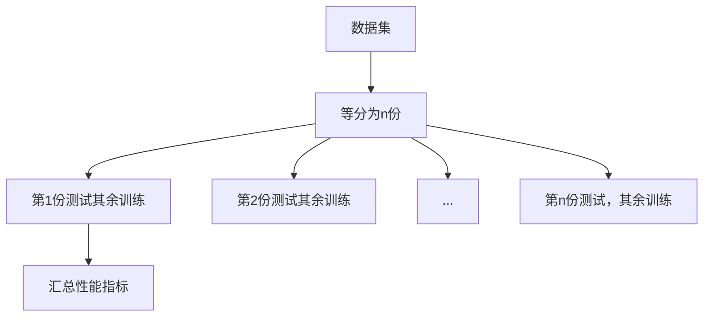
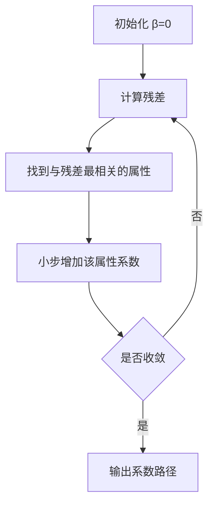
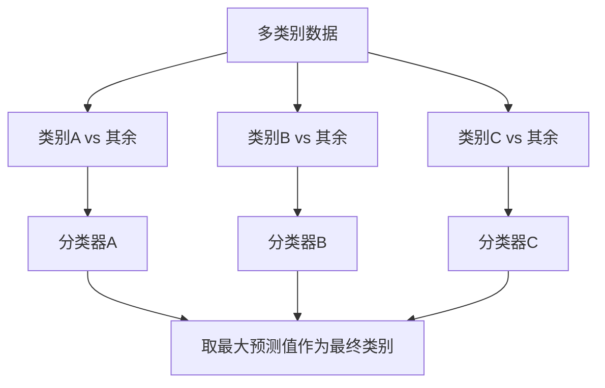
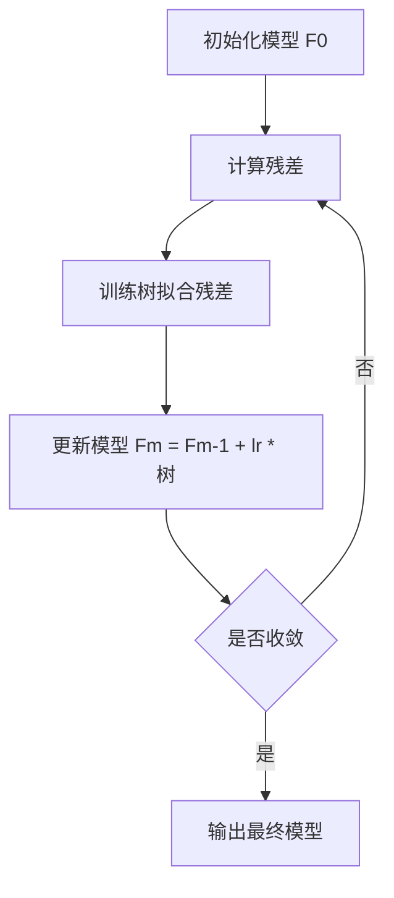

# 《Python机器学习》

## 书籍信息

- **书名**：Python机器学习：预测分析核心算法
- **作者**：[美] Michael Bowles
- **PDF 状态**：完整扫描版
- **OCR 状态**：可识别

## 全书核心主题

本书专注于两类核心的“算法族”——惩罚线性回归和集成方法，通过代码实例展示如何使用Python解决实际的预测分析问题，并强调通过理解数据来驱动模型选择。

---

## 第1章：关于预测的两类核心算法

### 1. 核心论点

本章解决“在面对众多机器学习算法时如何选择”的问题。作者认为，惩罚线性回归和集成方法在当前的应用中占据了主导地位，因为它们具有最佳或接近最优的性能。

### 2. 关键概念

- **函数逼近问题**：有监督学习的核心，即构建输入到输出的映射函数。
- **惩罚线性回归**：在最小二乘法基础上增加惩罚项，控制过拟合（如岭回归、Lasso）。
- **集成方法**：组合多个基学习器（通常是决策树）来提高性能（如随机森林、梯度提升）。
- **特征工程**：选择哪些变量用于预测的过程，占开发时间的80-90%。

### 3. 逻辑推演

引用Caruana等人的研究，证明了所提两类算法在多个数据集上的优越性。对比了两类算法的特性：惩罚线性回归训练快、预测快、适合高维数据；集成方法性能好、适合复杂问题。最后，概述了构建预测模型的标准流程。

### 4. 经典金句

> “本书集中于机器学习领域，只关注那些最有效和获得广泛使用的算法。”

---

## 第2章：通过理解数据来了解问题

### 1. 核心论点

本章解决“拿到一个新数据集后第一步该做什么”的问题。作者认为，通过统计分析和可视化来“解剖”数据，是构建有效预测模型的关键前提。

### 2. 关键概念

- **数据类型**：数值型 vs 类别型。
- **Pandas**：用于数据分析和处理（DataFrame）。
- **平行坐标图**：可视化高维数据点，用于观察类别分离。
- **散点图矩阵**：展示属性之间的相关性。
- **热图**：用颜色表示相关系数矩阵。
- **箱线图**：识别异常值。

### 3. 逻辑推演

依次分析了四种类型的数据集：分类问题（岩石vs水雷）、回归问题（鲍鱼年龄、红酒口感）和多分类问题（玻璃分类）。对每个数据集，展示了如何检查缺失值、统计特征、使用平行坐标图观察属性与标签的关系，以及使用热图观察多重共线性。

### 4. 流程图（数据分析流程）

---

## 第3章：预测模型的构建

### 1. 核心论点

本章解决“如何平衡模型复杂度、问题复杂度和数据规模”的问题。作者引入了偏差-方差权衡，并介绍了交叉验证等评估技术。

### 2. 关键概念

- **偏差 vs 方差**：简单模型高偏差（欠拟合），复杂模型高方差（过拟合）。
- **过拟合**：模型记住了噪声而非信号。
- **样本外误差**：在新数据上的性能，是评估模型的黄金标准。
- **n折交叉验证**：将数据分为n份，轮流用n-1份训练，1份验证。
- **ROC/AUC**：评估二分类器性能的曲线和面积。
- **混淆矩阵**：展示TP, FP, FN, TN。

### 3. 逻辑推演

通过合成数据（同心圆）直观展示简单问题vs复杂问题。演示线性模型在复杂问题上的不足，以及集成模型在复杂问题上的优势。通过红酒和岩石数据集的代码示例，介绍前向逐步回归和岭回归如何控制过拟合，并计算AUC和混淆矩阵来评估分类器。

### 4. 流程图（n折交叉验证）

---

## 第4章：惩罚线性回归模型

### 1. 核心论点

本章深入讲解惩罚线性回归的数学原理和求解算法。作者认为，L1（Lasso）和L2（岭）惩罚项的不同几何形状导致了系数向量的稀疏性差异。

### 2. 关键概念

- **L2惩罚（岭回归）**：`λ * β²`，系数趋近于0但不为0。
- **L1惩罚（套索）**：`λ * |β|`，可将系数压缩至0。
- **ElasticNet**：L1和L2惩罚的线性组合。
- **最小角度回归(LARS)**：一种高效求解套索路径的算法。
- **坐标下降法**：Glmnet算法采用的迭代优化方法。

### 3. 逻辑推演

从OLS公式出发，加入惩罚项。通过等高线图（圆形 vs 菱形）直观解释为何L1能产生稀疏解。然后分别用LARS算法和Glmnet算法（坐标下降）求解红酒口感预测问题，并展示如何使用交叉验证选择最佳惩罚参数`λ`。

### 4. 流程图（LARS算法流程）

---

## 第5章：使用惩罚线性方法来构建预测模型

### 1. 核心论点

本章解决“在实际项目中如何应用惩罚线性回归”的问题。作者通过红酒口感、岩石水雷和玻璃分类的完整代码实例，演示了从数据预处理到模型部署的全过程。

### 2. 关键概念

- **Scikit-learn**：`linear_model.LassoCV`, `ElasticNetCV`。
- **数据归一化**：对惩罚回归至关重要。
- **一对多(OvR)**：将多分类问题拆分为多个二分类问题。
- **基扩展**：添加原始特征的幂或交互项，拟合非线性关系。

### 3. 逻辑推演

首先用`LassoCV`对红酒数据进行交叉验证，找到最佳`alpha`，并在全数据集上训练。对于岩石水雷二分类问题，通过将标签编码为0/1，用`ElasticNet`处理，并计算AUC。对于玻璃多分类问题，采用“一对多”策略，为每个类别训练一个回归器。

### 4. 流程图（一对多策略）

---

## 第6章：集成方法

### 1. 核心论点

本章解决“集成方法为何强大”以及“如何工作”的问题。作者分别介绍了Bagging、随机森林和梯度提升三种主流方法的核心机制。

### 2. 关键概念

- **二元决策树**：通过递归分割建立树状模型。
- **Bagging**：对数据行进行有放回抽样，训练多棵树，然后平均预测。
- **随机森林**：在Bagging基础上，对决策树的每个节点随机选择属性子集。
- **梯度提升**：每次迭代训练新树来拟合当前模型的残差（负梯度）。
- **偏差-方差分解**：Bagging减少方差，Boosting同时减少偏差和方差。

### 3. 逻辑推演

从二元决策树的基本原理（选择最佳分割点）开始。Bagging通过对数据采样减少方差。随机森林通过在节点随机选择属性进一步增加了树的多样性。梯度提升则采用了完全不同的思路，它是通过迭代拟合残差来逼近真实函数，从而减少偏差。

### 4. 流程图（梯度提升迭代过程）

---

## 第7章：用Python构建集成模型

### 1. 核心论点

本章解决“如何使用Scikit-learn中的集成方法工具包”的问题。作者通过红酒、鲍鱼、岩石水雷和玻璃数据集的完整代码，展示了随机森林和梯度提升的实际应用。

### 2. 关键概念

- **`RandomForestRegressor` / `RandomForestClassifier`**：参数`n_estimators`, `max_depth`, `max_features`。
- **`GradientBoostingRegressor` / `GradientBoostingClassifier`**：参数`learning_rate`, `subsample`。
- **特征重要性**：`model.feature_importances_`。
- **分层抽样**：处理类别不均衡问题。
- **`roc_auc_score`**：计算AUC值。
- **`confusion_matrix`**：输出混淆矩阵。

### 3. 逻辑推演

通过代码清单，逐一演示了随机森林和梯度提升在红酒（回归）、鲍鱼（含类别特征）、岩石水雷（二分类）和玻璃（多分类）上的应用。对于类别特征，展示了“独热编码”。对于不平衡数据，演示了分层抽样。最后，对比了算法的性能与训练时间。

### 4. 经典金句

> “集成方法相对易于使用。它们不需要调很多参数。”

---

### 算法对比总结

根据书中最后的对比表，可提炼出核心结论：

1.  **性能**：集成方法（随机森林、梯度提升）通常优于惩罚线性回归。
2.  **速度**：惩罚线性回归训练速度通常比集成方法快一个数量级。
3.  **适用场景**：
    *   当特征数远多于样本数（如基因数据）时，**惩罚线性回归**效果最佳。
    *   当数据充足、问题复杂时，**集成方法**效果最佳。