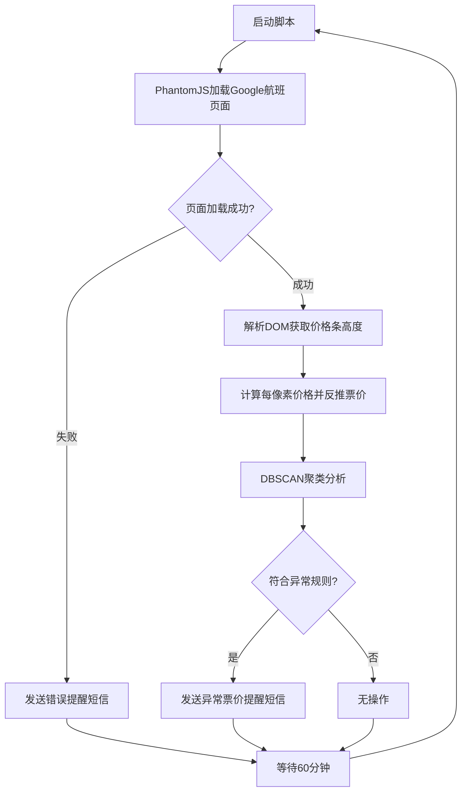
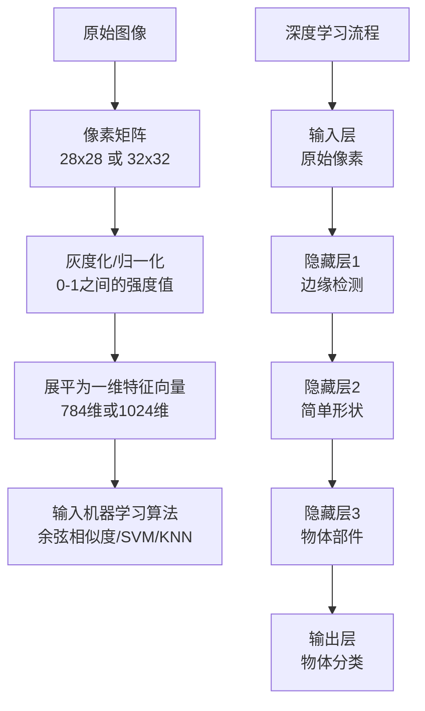
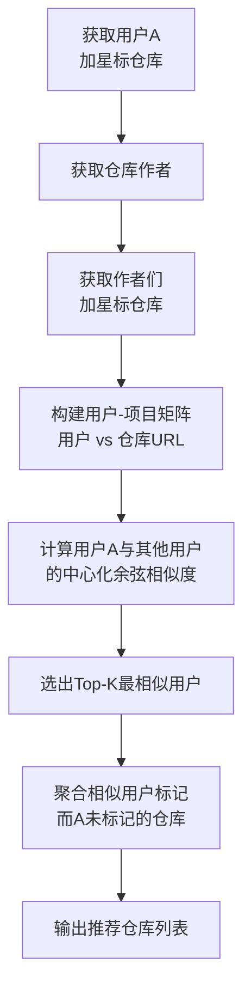

# 《Python机器学习实践指南》章节总结

## 书籍信息
- **书名：** Python机器学习实践指南 (Python Machine Learning Blueprints)
- **作者：** [美] Alexander T. Combs
- **译者：** 黄申
- **出版信息：** 人民邮电出版社，2017年5月
- **内容简介：** 本书通过10个章节，结合机器学习与Python语言，通过易于理解的项目详细讲述了如何构建真实的机器学习应用程序，涵盖聚类、推荐引擎、自然语言处理、深度学习等多个领域。

## 目录说明
- **目录识别情况：** PDF目录结构清晰完整，从第1章至第10章，包含前言、译者序、作者简介等前置内容。
- **章节对应依据：** 严格按照PDF页码顺序提取的章节目录。
- **OCR状态：** 文本可识别，但部分图表、代码块可能存在格式偏差。本书为文字版PDF，内容连贯。

## 全书核心主题
本书旨在教授读者如何使用Python生态系统（NumPy, Pandas, Scikit-learn, Matplotlib等）构建实用的机器学习应用。全书遵循标准的数据科学工作流程：获取数据 → 检查与探索 → 清理与准备 → 建模 → 评估 → 部署。通过从房地产价格预测、异常机票发现、IPO市场预测、个性化新闻源、病毒式内容预测、股票交易策略、图像相似度引擎、聊天机器人到推荐引擎的十个项目，读者将逐步掌握将机器学习应用于现实问题的方法。

---

## 第1章：Python机器学习的生态系统

### 1. 核心论点
本章主要解决“如何为机器学习项目准备开发环境和理解核心工作流程”的问题。作者认为，掌握数据科学的标准工作流（获取、检查、清理、建模、评估、部署）以及Python科学栈中的关键库（Pandas、Matplotlib、Scikit-learn等），是构建成功机器学习应用的基础。

### 2. 关键概念
- **数据科学工作流程：** 机器学习项目的六步标准流程。
- **Jupyter Notebook：** 交互式计算环境，适合数据探索和可视化。
- **Pandas DataFrame：** 表格型数据结构，是数据清洗和操作的核心。
- **Scikit-learn：** 统一的API接口，涵盖分类、回归、聚类、降维等算法。
- **安斯库姆四重奏：** 强调数据可视化重要性的经典案例。

### 3. 逻辑推演
作者首先提出了机器学习项目的标准工作流程（获取→检查→清理→建模→评估→部署），并指出数据质量决定了模型质量。接着，针对每一步介绍了对应的Python库：获取阶段推荐Requests库；检查阶段推荐Jupyter和Pandas；准备阶段详细介绍Pandas的Map、Apply、Applymap和GroupBy方法；建模与评估阶段重点介绍了Statsmodels和Scikit-learn；部署阶段则取决于应用场景。最后，建议使用Anaconda发行版来一键安装环境。

### 4. 经典金句/数据
> “数据项目成功与否，很大程度上依赖于你所获数据的质量，以及它是如何被处理的。”
> “只有进入模型的数据质量好了，模型的质量才能有保障。”

---

## 第2章：构建应用程序，发现低价的公寓

### 1. 核心论点
本章解决“如何利用回归模型评估公寓租金是否合理”的问题。作者认为，通过线性回归模型，即使只用邮政编码和卧室数量两个特征，也可以解释约三分之一的租金价格差异，帮助租房者做出更明智的决策。

### 2. 关键概念
- **Import.io：** 可视化网页抓取工具，用于规避复杂的爬虫代码。
- **数据清洗：** 处理缺失值、转换数据类型、解析混合字段（如将“1 bd·1 ba”拆分为独立列）。
- **线性回归：** 监督式机器学习算法，用于预测连续数值。
- **Patsy：** 允许使用R风格公式构建模型的库。
- **虚拟变量：** 将分类特征（如邮政编码）转换为数值特征的编码方式。

### 3. 逻辑推演
1. **获取数据：** 使用Import.io从Zillow抓取曼哈顿公寓数据。
2. **数据清洗：** 将单一房源与多单元房源分开处理，从`propertyinfo_value`中解析出卧室数、浴室数、面积，从地址中解析邮编和楼层。
3. **数据分析：** 使用`describe()`查看统计数据，发现数据稀疏性问题。
4. **可视化：** 使用Folium库生成基于邮政编码的租金热图。
5. **建模：** 使用Statsmodels构建线性回归模型 `Rent ~ Zip + Beds`，得出调整后R²为0.283，卧室数量显著影响租金，特定邮编（如哈林区）租金显著低于切尔西区。
6. **预测：** 利用模型预测特定邮编和卧室数量下的租金价格。

---

## 第3章：构建应用程序，发现低价的机票

### 1. 核心论点
本章解决“如何实时监控并发现异常低价的错误机票”的问题。作者认为，通过结合Selenium/PhantomJS抓取动态页面、DOM解析推断价格、DBSCAN聚类算法识别异常值，以及IFTTT发送实时提醒，可以构建一个24/7运行的票价监控系统。

### 2. 关键概念
- **Selenium & PhantomJS：** 自动化无头浏览器，用于抓取AJAX动态加载的页面。
- **DBSCAN：** 基于密度的空间聚类算法，适合带有噪声的数据，无需预先指定聚类数量。
- **IFTTT：** “If This Then That”自动化服务，通过Maker频道接收Web请求并触发短信。
- **错误票价：** 航空公司因系统错误而发布的极低价格（如遗漏燃油附加费）。

### 3. 逻辑推演
1. **数据源选择：** 使用Google航班探索器，因其能按价格排序展示多月票价。
2. **数据抓取：** 使用Selenium+PhantomJS加载页面，由于价格数据通过JS渲染，无法直接获取文本，作者通过解析价格条的高度来反推价格。
3. **异常检测：** 使用DBSCAN聚类，设置`eps=1.5`，`min_samples=1`，将票价分组。定义规则：存在多于1个聚类、最低价聚类数量小于总数10%、且与次低聚类差价超过100美元时，触发警报。
4. **部署：** 整合代码为Python脚本，使用`schedule`库每60分钟运行一次，通过IFTTT发送短信。

### 方法流程图

---

## 第4章：使用逻辑回归预测IPO市场

### 1. 核心论点
本章解决“如何预测IPO在首日是否值得买入”的问题。作者认为，通过特征工程（加入大盘走势、承销商信息、日期特征等）和逻辑回归分类器，可以构建一个远优于“买入所有IPO”基准策略的预测模型。

### 2. 关键概念
- **IPO：** 首次公开募股，私人公司上市的过程，研究表明IPO长期被系统性低估。
- **逻辑回归：** 使用逻辑函数（Sigmoid）输出概率的二元分类算法。
- **特征工程：** 创建和转换特征以提升模型表现的过程。
- **信息泄露：** 模型中使用了当时无法获取的未来信息（如收盘价），导致评估结果无效。
- **随机森林：** 用于评估特征重要性的集成算法。

### 3. 逻辑推演
1. **数据获取与清洗：** 从IPOScoop下载历史IPO数据，修正格式错误和日期异常。
2. **探索性分析：** 发现第一天平均收益为正，但开盘到收盘的收益显著低于发行价到收盘的收益，表明大部分利润被配售者获得。
3. **特征工程：** 加入标普500一周变化、标普500隔夜变化、主承销商、承销商数量、星期几、月份等特征。
4. **建模：** 使用2015年之前的数据训练逻辑回归模型，预测2015年IPO开盘到收盘涨幅是否超过1美元。
5. **评估：** 模型在测试集上准确率达82%，将交易次数从147次降至6次，平均收益从0.23美元提升至2.99美元。
6. **特征重要性：** 使用随机森林的特征重要性发现，“开盘价差距百分比”和“开盘价美元变化”是最重要的预测因子。

---

## 第5章：创建自定义的新闻源

### 1. 核心论点
本章解决“如何从海量新闻中筛选出用户真正感兴趣的内容”的问题。作者认为，通过Pocket收藏文章构建训练集、Embed.ly提取文章内容、TF-IDF向量化文本、线性支持向量机分类，以及IFTTT+RSS+Google表单自动化，可以构建一个每日发送的个性化新闻简报系统。

### 2. 关键概念
- **监督学习训练集：** 使用Pocket给文章打标签（“y”感兴趣/“n”不感兴趣）。
- **自然语言处理：** 将文本转换为数值表示，包括词袋模型、停用词、取词干/词形还原、TF-IDF。
- **支持向量机：** 寻找最大化分类间隔的超平面的线性分类器。
- **迁移学习（本章未深入但为后续铺垫）：** 此处表现为使用Embed.ly通用提取服务，避免为每个网站单独写爬虫。

### 3. 逻辑推演
1. **构建训练集：** 安装Pocket扩展，阅读文章时打上“y”或“n”标签，积累数百个样本。
2. **获取数据：** 使用Pocket API和OAuth授权，下载已标记文章的URL。
3. **提取内容：** 使用Embed.ly API将URL转换为HTML正文，再用BeautifulSoup提取纯文本。
4. **文本向量化：** 使用TfidfVectorizer，设置ngram_range=(1,3)，去除英文停用词，过滤低频词。
5. **分类：** 使用LinearSVC训练分类器。
6. **自动化：** 创建IFTTT Recipe，将RSS源新文章自动添加到Google表单；编写定时脚本读取表单、调用模型预测、通过IFTTT发送邮件、清空表单。

### 经典金句/数据
> “如果模型只能操作数值型的数据，那么我们如何将文本转换成数值的表示？这是自然语言处理的重点。”

---

## 第6章：预测你的内容是否会广为流传

### 1. 核心论点
本章解决“什么样的内容更容易被广泛分享”的问题。作者认为，通过分析病毒式内容的特征（图片数量、标题模式、主题等），并使用随机森林回归模型，可以预测内容的传播潜力。

### 2. 关键概念
- **病毒式传播动因：** 为他人提供实用价值（利他主义）、关联自我身份（自我认同）、通过共同情感与他人联系（公社动机）。
- **情感与分享：** 高唤醒度的负面情绪（如愤怒）比低唤醒度情绪（如悲伤）更易引发分享。
- **随机森林回归：** 用于预测连续数值（如分享次数）的集成算法。
- **K-Means聚类：** 用于将图像颜色归并为可管理的类别。

### 3. 逻辑推演
1. **数据获取：** 使用Selenium从Ruzzit.com抓取高分享内容，获取标题、链接、Facebook分享数等。
2. **内容提取：** 使用Embed.ly获取文章全文、图片数量、首图主要颜色。
3. **探索性分析：**
   - 图像：多数病毒式内容包含5张图片；首图颜色多为棕灰等柔和色调。
   - 标题：中位长度11个字；常见二元组包括(donald, trump)、(die, at)；BuzzFeed占主导地位。
   - 正文：内容比标题更严肃，涉及政治、种族、恐怖主义。
4. **建模：** 使用图片数量、字数、网站名称、标题n元语法作为特征，预测Facebook分享数。
5. **评估：** 基础模型误差率约64%，加入标题特征后改善至约64.1%。

---

## 第7章：使用机器学习预测股票市场

### 1. 核心论点
本章解决“如何开发和测试机器学习交易策略”的问题，并重点警示“数据挖掘谬误”的风险。作者认为，市场存在“红色皇后竞赛”效应，策略会随着被发现而失效；通过支持向量回归和动态时间规整可以构建预测模型，但必须严格避免过拟合和虚假信号。

### 2. 关键概念
- **有效市场假说：** 弱式（过去价格无效）、半强式（公开信息无效）、强式（所有信息无效）。
- **动量策略：** 买入过去表现最好的股票，持有一段时间后重复。
- **数据挖掘谬误：** 测试足够多的随机策略，总有一个看似表现优异，但实为偶然。
- **动态时间规整：** 衡量两个时间序列之间相似性的算法。

### 3. 逻辑推演
1. **基准分析：** 分析SPY ETF（2010-2016），发现隔夜回报（持有过夜）远优于盘中回报（日内交易）。
2. **警示：** 演示了如何从1000次随机信号中选出“最佳策略”，其夏普比率是买入持有策略的三倍——这是数据挖掘谬误，并非真实策略。
3. **SVR模型：** 使用前20个交易日收盘价预测次日收盘价。测试发现，该模型实际为“逆向指标”，即预测上涨时市场反而下跌。翻转信号后，模型在特定时段获得33.6点收益。
4. **DTW模型：** 将16年数据切分为5天区间，计算各区间形态的距离。当找到与历史上盈利形态高度相似的当前形态时，买入。该模型盈利/亏损比和平均回报均优于其他模型。

### 经典金句/数据
> “如果你测试足够多的策略，事实是你偶然会遇到一些似乎是很棒的策略。这就是所谓的数据挖掘谬误。”
> “隔夜策略和盘中策略有着几乎相同的平均回报，其波动性明显较小。因此，隔夜策略的夏普比率要高于盘中策略的。”

---

## 第8章：建立图像相似度的引擎

### 1. 核心论点
本章解决“如何比较图像相似度及理解深度学习原理”的问题。作者认为，通过将图像像素展开为向量并使用余弦相似度或卡方核，可以实现基础的相似度查找；而深度学习通过多层神经元堆叠，能够学习从简单线条到复杂物体（如人脸）的层次化表示。

### 2. 关键概念
- **图像向量化：** 将像素强度（灰度值或RGB值）展开为特征向量。
- **余弦相似度 & 卡方核：** 用于计算两个向量（图像）之间相似度的度量方法。
- **视觉词包：** 将图像中的像素聚类为“视觉词汇”，形成直方图表示。
- **感知器：** 模拟神经元的人工神经网络基础单元。
- **迁移学习：** 利用大规模预训练深度学习网络的低层特征，应用到新的任务中。

### 3. 逻辑推演
1. **图像表示：** 以MNIST手写数字为例，每个28x28图像展开为784维向量。
2. **相似度计算：** 使用余弦相似度找到与目标数字最相似的图像，结果合理（如“0”找到另一个“0”）。
3. **深度学习原理：** 感知器通过调整权重学习逻辑函数（如AND函数）；堆叠多层神经元形成深度网络，低层识别边缘，高层识别完整物体。
4. **迁移学习应用：** 使用GraphLab Create加载CIFAR-10数据集，该数据集已包含预训练的深度特征。提取用户照片的深度特征，使用K-最近邻模型在猫的图像中查找最相似的图像，找到“灵兽”。

### 方法流程图

---

## 第9章：打造聊天机器人

### 1. 核心论点
本章解决“如何从零构建一个可用的聊天机器人”的问题。作者认为，基于检索的模型（如AIML）虽然简单但仍是主流；基于序列到序列的神经网络模型（如Google的研究）则代表了更先进的未来方向。通过TF-IDF和余弦相似度匹配用户输入与历史对话中的最相似问题，可以快速构建一个“搞怪”风格的聊天机器人。

### 2. 关键概念
- **图灵测试：** 如果机器表现出智能行为，我们就应认为它具有智能。
- **ELIZA：** 1960年代的心理治疗师模拟程序，基于正则表达式和规则匹配，代码不足200行。
- **AIML：** 人工智能标记语言，基于XML的聊天机器人规则定义格式。
- **序列到序列模型：** Google研究的神经网络模型，将输入序列（如问题）映射到输出序列（如答案），从电影对白中学习对话。

### 3. 逻辑推演
1. **历史回顾：** 从ELIZA（规则匹配）到Cleverbot（数据库检索），再到Tay（社交机器人灾难），展示了聊天机器人的演进。
2. **设计模式：** 基于检索的模型（预定义回复）是目前主流；基于生成的模型（神经网络）是未来方向。
3. **数据获取：** 从notsocleverbot.com抓取用户与Cleverbot的奇葩对话。
4. **构建模型：** 将对话解析为（问题，答案）对；对新用户输入，使用TF-IDF向量化并在问题库中查找余弦相似度最高的问题，返回对应答案。
5. **部署：** 使用Twilio API接收短信，Flask框架搭建Web服务器，实现通过短信与机器人对话。

### 经典金句/数据
> “机器人的行为越像一个真实的人，它就会越像真人一样被对待。” —— Mat Webb

---

## 第10章：构建推荐引擎

### 1. 核心论点
本章解决“如何基于用户历史行为推荐新项目”的问题。作者认为，协同过滤（基于相似用户或相似项目）和基于内容的过滤（基于项目特征）是两大主流方法，混合系统通常表现更优。通过GitHub API获取用户加星标的数据，可以构建一个基于用户的协同过滤推荐引擎，发现可能感兴趣的代码库。

### 2. 关键概念
- **协同过滤：** 基于“趣味相投的人品味相似”的假设，分为基于用户的过滤和基于项目的过滤。
- **效用矩阵：** 用户-项目评分矩阵，推荐引擎的核心数据结构。
- **中心化余弦相似度（Pearson相关系数）：** 通过减去用户均值来处理不同评分标准，避免缺失值默认填充为0带来的偏差。
- **基于内容的过滤：** 将项目分解为特征向量，推荐与用户历史喜好特征相似的项目（如Pandora的音乐基因组）。
- **混合系统：** 结合协同过滤和基于内容过滤，弥补各自的不足。

### 3. 逻辑推演
1. **协同过滤原理：**
   - 基于用户：找到与目标用户评分最相似的其他用户，加权聚合他们的评分来预测。
   - 基于项目：找到与目标项目最相似的其他项目，加权聚合目标用户对这些项目的评分来预测。
2. **对比分析：** 基于项目的过滤通常优于基于用户的过滤，因为用户可能在某些小众领域兴趣不一致。
3. **混合系统优势：** 协同过滤不需要特征但冷启动难；基于内容过滤不需要其他用户但特征设计难。
4. **实践构建：**
   - 使用GitHub API获取自己加星标的代码库及其作者。
   - 获取这些作者加星标的所有代码库，构建用户-项目矩阵。
   - 计算自己与其他用户的Pearson相关系数，找到最相似的3位用户。
   - 从相似用户加星标而自己未加星标的库中，选择至少被2位相似用户标记的库作为推荐。

### 方法流程图

