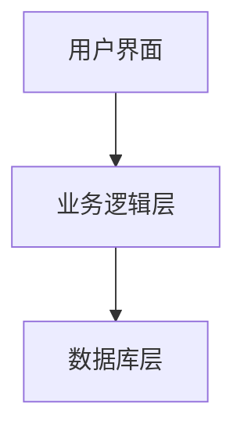
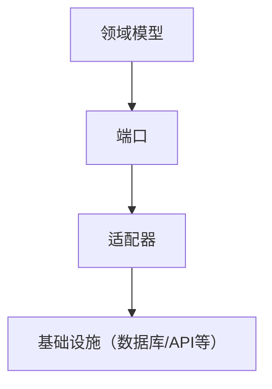
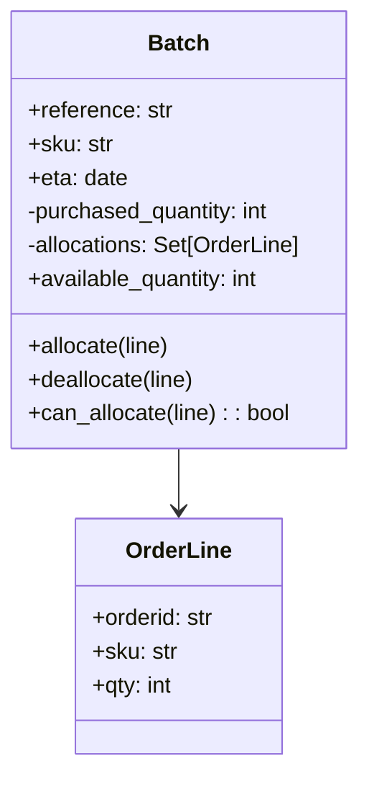
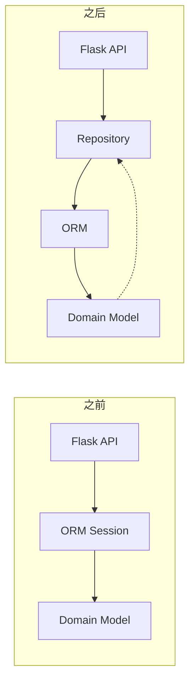
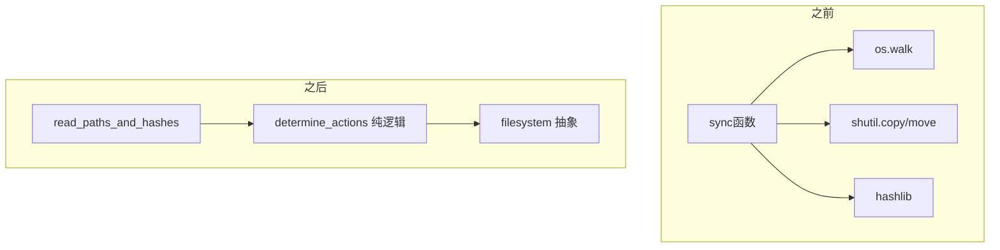
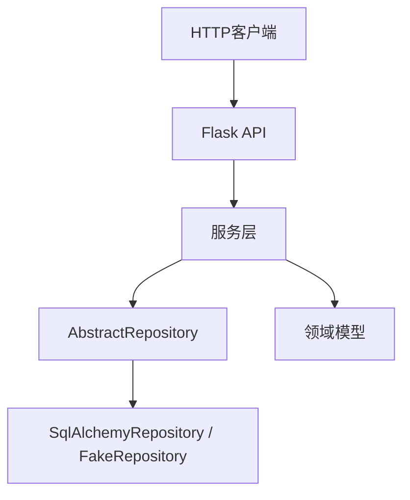
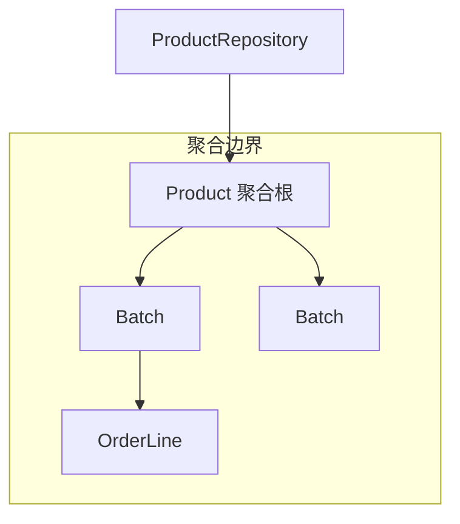
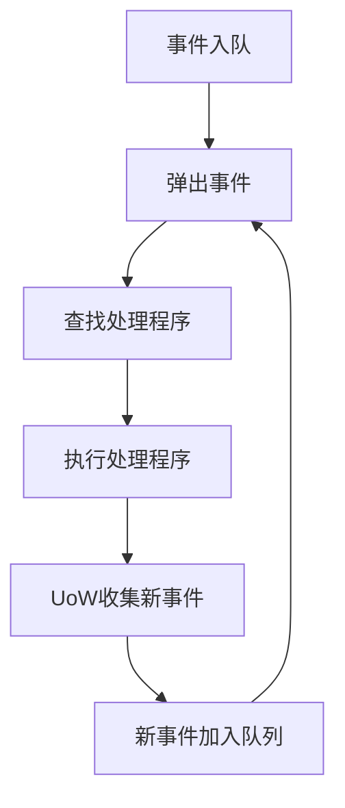
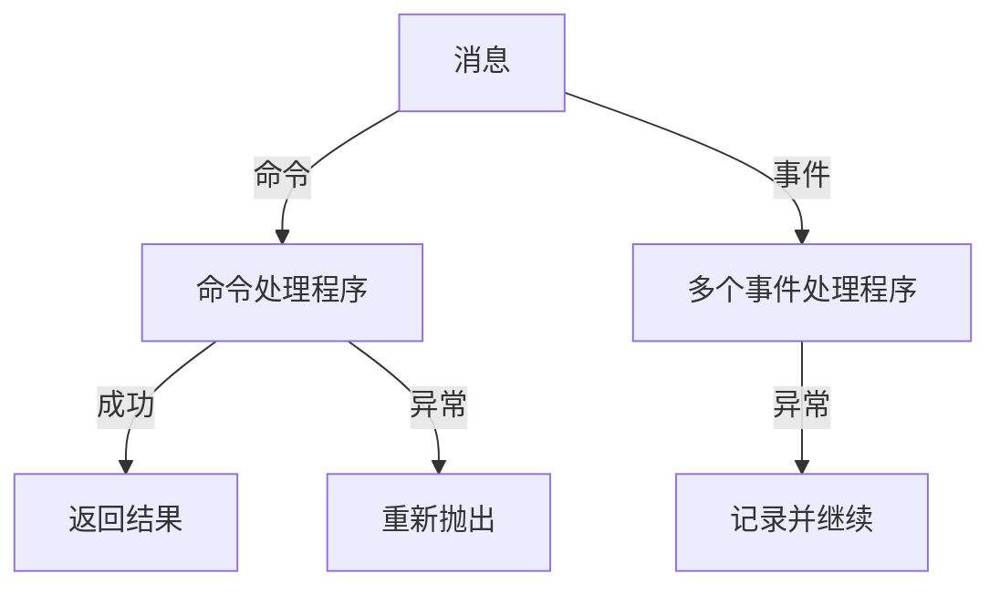
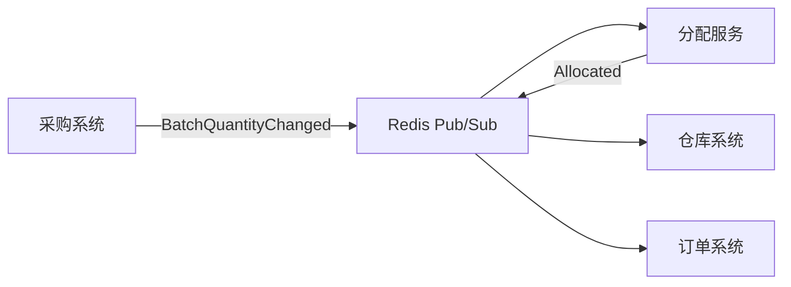

# 《Architecture Patterns with Python》章节总结

## 书籍信息
- **书名**：Architecture Patterns with Python (Python的架构模式)
- **作者**：Harry J.W. Percival & Bob Gregory
- **PDF 状态**：基于OCR提取的文本，存在部分页码标记和格式丢失，但主体内容可识别。
- **OCR 状态**：可读性较好，少数地方有字符错位或缺失，已尽量保留原意。

## 目录说明
- 目录识别情况：从文本中提取了前言、介绍、第一部分（第1-7章）、第二部分（第8-13章）、结语、附录A-E及索引。
- 章节对应依据：按照原文出现的标题层级和页码顺序整理。
- OCR 修复说明：部分标题和副标题的格式（如加粗、斜体）无法保留，但层级关系清晰；流程图和图表以文字描述或Mermaid重建。

## 全书核心主题
本书围绕如何通过经典的架构模式（如领域模型、存储库、服务层、工作单元、聚合、事件驱动、CQRS、依赖注入等）来构建易于测试、可维护和可扩展的Python应用程序。作者强调使用依赖倒置原则将业务逻辑与基础设施解耦，通过TDD驱动领域建模，并引入事件驱动架构实现微服务集成。全书分为两部分：第一部分构建支持领域建模的架构（聚焦单体应用内的分层与模式），第二部分转向事件驱动架构（处理跨服务通信、CQRS和依赖注入）。核心目标是避免“大泥球”反模式，保持代码的清晰和可演化性。

---

## 前言

### 核心论点
问题：如何构建易于测试、核心业务逻辑受单元测试覆盖、最小化集成/端到端测试的应用程序？  
观点：通过六边形架构（端口与适配器）、功能核心-命令式外壳等模式，结合TDD、DDD和事件驱动架构，可以管理复杂性、解决业务问题。

### 关键概念/事件
- **TDD（测试驱动开发）**：帮助构建正确代码，支持重构而无回归。
- **DDD（领域驱动设计）**：聚焦构建良好的业务模型，避免基础设施限制。
- **事件驱动架构**：通过消息集成松耦合（微）服务，管理多应用程序或业务领域。
- **六边形架构/端口与适配器**：将领域置于内部，外部通过适配器连接基础设施。
- **MADE.com案例**：作者工作的电商公司，用本书技术构建供应链系统。

### 逻辑推演
作者从自己在Python测试驱动开发书籍后的困惑出发，遇到Bob后学习到架构模式。他们以MADE.com的真实业务（优化库存分配）为例，说明为何需要这些模式。Python虽然简单，但项目规模增大时，最明显的方式并不利于管理复杂性。本书介绍的技术在其他语言中已存在，但对Python社区较新。第一部分构建支持领域建模的架构（领域模型、存储库、服务层、工作单元、聚合），第二部分转向事件驱动架构（事件、消息总线、CQRS、依赖注入）。

### 经典金句/数据
> “大泥球是软件的自然状态，就像荒野是你花园的自然状态一样。而防止崩溃需要付出能量和厘清方向。” (p.14)
> “管理复杂性，解决业务问题” (p.9)
> “测试驱动开发（TDD）帮助我们构建正确的代码……领域驱动设计（DDD）要求我们将精力集中在构建业务领域的良好模型上……” (p.10)

---

## 介绍

### 核心论点
问题：为什么我们的设计会出错，形成“大泥球”？  
观点：封装、抽象和分层是避免混乱的工具；依赖倒置原则（DIP）是关键——高层模块（业务逻辑）不应依赖低层模块（基础设施），两者都应依赖抽象。领域模型是所有业务逻辑的归宿。

### 关键概念/事件
- **大泥球反模式**：软件系统因缺乏结构而变成一团混乱的依赖关系。
- **封装与抽象**：通过识别任务并分配给定义良好的对象/函数来简化行为。
- **分层架构**：将代码分成用户界面、业务逻辑、数据库层，但容易塌陷。
- **依赖倒置原则（DIP）**：高层模块和低层模块都应依赖抽象；抽象不应依赖细节。
- **领域模型**：业务逻辑的核心，应独立于基础设施。

### 逻辑推演
作者指出，大多数开发者在设计新系统时从数据库模式开始，导致业务逻辑分散。正确做法是让行为驱动存储。第一部分将介绍通过TDD构建丰富的对象模型，然后使用存储库、服务层、工作单元和聚合模式解耦技术问题。第二部分介绍事件驱动架构、消息总线、CQRS等。最终目标是实现健康的测试金字塔（多单元测试、少端到端测试）。

### 流程图
#### 分层架构示意图（三层）


#### 洋葱架构（依赖向内流动）


### 经典金句/数据
> “计算机科学中的所有问题都可以通过增加另一个间接层来解决。” ——David Wheeler (p.18)
> “大多数开发人员从未见过领域模型，只见过数据模型。” ——Cyrille Martraire (p.18)

---

## 第一部分：构建支持领域建模的架构

---

## 第1章：领域模型

### 核心论点
问题：如何用代码对业务流程建模，并使其高度兼容TDD？  
观点：使用领域模型模式，包括实体、值对象和领域服务。通过单元测试驱动模型设计，保持模型纯净、无外部依赖。

### 关键概念/事件
- **领域模型**：捕获业务问题中流程与规则的地图，使用通用语言（Ubiquitous Language）。
- **值对象**：由属性唯一标识的不可变对象（如OrderLine），实现值相等。
- **实体**：具有长期身份的对象（如Batch），身份相等而非值相等。
- **领域服务**：不属于实体或值对象的无状态函数（如allocate）。
- **领域异常**：表达领域概念（如OutOfStock）。

### 逻辑推演
作者以库存分配系统为例，与领域专家对话提炼出“批次”、“订单行”、“分配”等概念。通过单元测试逐步构建Batch和OrderLine类，实现分配逻辑。从简单的可用数量减法，发展到跟踪分配集合。引入值对象OrderLine，实体Batch。最终实现领域服务allocate，使用Python魔术方法（如__gt__）支持排序。领域异常OutOfStock用于缺货情况。

### 流程图
#### 领域模型初始结构


### 经典金句/数据
> “领域模型是业务所有者对其业务的心理地图。” (p.23)
> “每当我们有一个有数据但没有身份的业务概念时，我们通常选择使用 Value Object 模式来表示它。” (p.32)
> “并非所有东西都必须是对象：领域服务函数” (p.35)

---

## 第2章：存储库模式

### 核心论点
问题：如何将领域模型与持久化存储解耦，使其不依赖ORM？  
观点：使用存储库模式作为持久化存储的抽象，让领域模型保持纯净；ORM应依赖于领域模型，而不是相反。

### 关键概念/事件
- **存储库模式**：提供内存中集合的幻觉，隐藏数据访问细节。
- **依赖倒置应用于数据访问**：ORM导入领域模型，而非领域模型导入ORM。
- **SQLAlchemy经典映射**：单独定义表结构，显式映射到领域类。
- **伪造存储库**：使用集合实现的简单版本，用于单元测试。
- **端口与适配器**：AbstractRepository是端口，SqlAlchemyRepository和FakeRepository是适配器。

### 逻辑推演
作者展示“正常”ORM方式导致模型依赖ORM。然后通过SQLAlchemy经典映射反转依赖。接着引入存储库抽象，定义add/get方法。编写集成测试验证真实存储库。伪造存储库用set实现，简化测试。最后讨论权衡：增加间接层但有解耦好处。

### 流程图
#### 存储库模式前后对比


### 经典金句/数据
> “如果你的应用程序只是一个简单的CRUD数据库包装器，则不需要领域模型或存储库。” (p.57)
> “存储库模式是永久存储的简单抽象。” (p.58)

---

## 第3章：短插曲：耦合和抽象

### 核心论点
问题：什么是好的抽象？抽象如何帮助测试和解耦？  
观点：通过选择正确的抽象层次，将业务逻辑与I/O细节分离，可以实现边缘到边缘测试，减少对mock.patch的依赖。

### 关键概念/事件
- **耦合与内聚**：高内聚、低耦合是目标；抽象降低耦合。
- **功能核心、命令式外壳（FCIS）**：将有状态部分与纯逻辑部分分离。
- **依赖注入（DI）**：显式传递依赖而非隐式导入。
- **伪造对象 vs 模拟**：伪造是真实工作的假实现，模拟用于验证交互。
- **边缘到边缘测试**：调用整个系统但伪造I/O。

### 逻辑推演
通过文件同步示例，展示直接I/O耦合导致测试缓慢且脆弱。重构为：先收集路径和哈希（I/O），然后纯逻辑决定操作（determine_actions），最后执行操作。测试变为对determine_actions的单元测试。进一步使用依赖注入将读取器和文件系统作为参数，方便伪造。作者反对过度使用mock.patch，认为它不改进设计且导致脆弱测试。

### 流程图
#### 重构前后对比


### 经典金句/数据
> “设计可测试性实际上意味着设计可扩展性。” (p.69)
> “我们将TDD视为首先是一种设计实践，其次才是一种测试实践。” (p.70)

---

## 第4章：第一个用例：Flask API和服务层

### 核心论点
问题：如何将领域模型连接到真实世界（API、数据库）并保持可测试性？  
观点：引入服务层（用例层）来编排工作流，使Flask端点和领域模型解耦，并使用FakeRepository进行快速单元测试。

### 关键概念/事件
- **服务层**：编排操作（从存储库获取、验证、调用领域服务、提交），是系统的入口点。
- **端到端测试 vs 服务层测试**：E2E测试少量，服务层测试覆盖主要工作流。
- **FakeRepository**：内存集合，用于服务层单元测试。
- **依赖倒置实践**：服务层依赖抽象存储库，具体实现由外部注入。
- **应用服务 vs 领域服务**：应用服务处理编排，领域服务处理无状态的业务逻辑。

### 逻辑推演
先编写端到端测试（使用真实数据库和Flask），直接实现导致Flask端点臃肿。然后提取服务层，将分配逻辑放入services.allocate。使用FakeRepository和FakeSession编写快速单元测试。服务层函数依赖AbstractRepository，Flask注入SqlAlchemyRepository。最终E2E测试只保留正常路径和异常路径。服务层使测试金字塔健康（单元测试多，E2E少）。

### 流程图
#### 服务层在架构中的位置


### 经典金句/数据
> “添加服务层确实为我们带来了很多好处：Flask端点变薄，为领域定义清晰API，测试金字塔健康。” (p.87)
> “DIP的实际应用” (p.87)

---

## 第5章：高档和低档的TDD

### 核心论点
问题：应该针对领域模型还是服务层编写测试？  
观点：通过“高档”（服务层测试）获得低耦合、高覆盖率；“低档”（领域模型测试）获得高反馈和设计指引。根据情况换挡。

### 关键概念/事件
- **测试金字塔**：单元测试 > 集成测试 > 端到端测试。
- **高档 vs 低档**：高档=服务层测试，低档=领域模型测试。
- **解耦服务层测试**：使用基元类型（字符串、整数）而非领域对象作为参数，并引入add_batch服务来设置数据。
- **Fixture工厂**：将领域依赖集中到帮助函数。
- **每个功能一个E2E测试**，其余用服务层单元测试覆盖。

### 逻辑推演
作者展示将领域模型测试重写为服务层测试的利弊：减少耦合，但失去设计反馈。建议启动项目或处理复杂问题时用低档，日常用高档。进一步将服务层API改为基元类型，并添加add_batch服务，使服务层测试完全不依赖领域模型。最后改进E2E测试，使用API添加批次，消除直接SQL。

### 经典金句/数据
> “测试应该帮助我们无畏地更改系统。” (p.91)
> “我们使用的隐喻是换挡。在启动旅程时，自行车需要处于低档位……一旦我们开始行动，我们可以通过换成高档位来更快、更高效地行动。” (p.93)
> “针对每个功能编写一个端到端测试……大部分测试应针对服务层进行编写……保持一小部分针对域模型编写的测试。” (p.99)

---

## 第6章：工作单元模式

### 核心论点
问题：如何实现原子操作（事务）抽象，使服务层与数据库完全解耦？  
观点：工作单元（UoW）模式结合上下文管理器，提供对原子操作的抽象，简化事务管理并默认安全回滚。

### 关键概念/事件
- **工作单元（UoW）**：记录业务操作中更改的对象，并在提交时一次性持久化。
- **上下文管理器**：Python的with语句，用于定义UoW范围，自动回滚未提交的更改。
- **UoW与存储库协作**：UoW提供访问存储库的入口，并管理会话。
- **显式提交 vs 隐式提交**：作者偏好显式提交，使代码路径清晰。
- **集成测试UoW**：测试提交/回滚行为。

### 逻辑推演
之前服务层依赖session和repository，UoW整合两者。定义AbstractUnitOfWork，实现__enter__和__exit__。具体实现SqlAlchemyUnitOfWork使用SQLAlchemy会话。FakeUnitOfWork用于测试。服务层现在只依赖uow。通过示例（重新分配、更改批次数量）展示UoW如何保证原子性。最后整理测试，保留最必要的集成测试。

### 流程图
#### UoW上下文管理器流程
```mermaid
graph TD
    A[服务层调用] --> B[with uow:]
    B --> C[获取存储库]
    C --> D[修改聚合]
    D --> E{是否成功?}
    E -->|是| F[uow.commit()]
    E -->|否| G[退出时自动rollback]
    F --> H[持久化所有更改]
```

### 经典金句/数据
> “不要模拟你不拥有的东西” (p.108)
> “默认行为是不更改任何内容……任何异常，任何从UoW范围的早期退出都会导致安全状态。” (p.111)
> “Unit of Work 模式是关于数据完整性的抽象” (p.115)

---

## 第7章：聚合和一致性边界

### 核心论点
问题：如何在不影响性能的前提下维护数据不变量（不超卖）？  
观点：使用聚合模式定义一致性边界，每个聚合对应一个存储库，并通过版本号实现乐观并发控制。

### 关键概念/事件
- **聚合**：一组相关对象，作为数据更改的单元，根实体负责封装和一致性。
- **不变量**：每次操作后必须成立的条件（如可用数量≥0）。
- **并发控制**：乐观锁（版本号）vs 悲观锁（SELECT FOR UPDATE）。
- **Product聚合**：包装特定SKU的所有批次，提供allocate方法。
- **一个聚合 = 一个仓库**：存储库只返回聚合根。

### 逻辑推演
从业务不变量（不超卖、订单行只分配一次）出发，引出并发问题。聚合提供一致性边界，选择Product作为聚合（按SKU分组）。修改模型：Product拥有批次列表，allocate作为方法。存储库改为ProductRepository。性能考虑：预期每个产品批次不多。实现版本号乐观锁定，测试并发更新失败。也可使用REPEATABLE READ隔离级别或SELECT FOR UPDATE。

### 流程图
#### 聚合边界示意图


### 经典金句/数据
> “聚合是一组相关对象，我们将其作为数据更改的一个单元处理。” ——Eric Evans (p.118)
> “仓库应仅返回聚合的规则是我们强制执行聚合是进入我们域模型的唯一方式的主要地方。” (p.123)
> “选择正确的聚合是关键，这是你可能会随时间重新审视的决策。” (p.132)

---

## 第二部分：事件驱动架构

---

## 第8章：事件和消息总线

### 核心论点
问题：如何将核心用例与副作用（如发送邮件）解耦，避免代码混乱？  
观点：引入领域事件和消息总线，让模型记录事件，服务层或UoW将事件发布到总线，由处理程序响应。

### 关键概念/事件
- **领域事件**：表示已发生事实的值对象（如OutOfStock）。
- **消息总线**：将事件映射到处理程序的发布-订阅系统。
- **单一职责原则**：分配函数不应同时负责发送邮件。
- **UoW收集事件**：UoW在提交后收集聚合的事件并发布。
- **存储库跟踪seen对象**：存储库记录加载的聚合，供UoW收集事件。

### 逻辑推演
新需求：缺货时发送邮件。直接放在Flask端点、模型或服务层都违反SRP。解决方案：模型引发领域事件（如OutOfStock），服务层（或UoW）将事件传递给消息总线，消息总线调用处理程序（如send_out_of_stock_notification）。作者展示三种选项：1) 服务层显式传递事件；2) 服务层自己引发事件；3) UoW自动收集并发布。最终选择选项3，使服务层最干净。

### 流程图
#### 事件流经系统
```mermaid
graph TD
    A[API] --> B[服务层]
    B --> C[UoW]
    C --> D[存储库]
    D --> E[领域模型]
    E -- 引发事件 --> F[UoW收集事件]
    F --> G[消息总线]
    G --> H[事件处理程序]
    H --> I[外部服务(邮件等)]
```

### 经典金句/数据
> “领域事件为我们提供了处理系统工作流的方法。” (p.150)
> “当X时，就Y”这些神奇的词语经常告诉我们关于我们可以在系统中具体实现的事件。” (p.150-151)

---

## 第9章：深入了解消息总线

### 核心论点
问题：如何让消息总线成为系统的主要入口点，所有请求都通过事件处理？  
观点：将服务层函数重构为事件处理程序，消息总线管理事件队列并自动处理新事件，实现完全事件驱动的架构。

### 关键概念/事件
- **事件作为输入**：API调用转换为事件（如AllocationRequired），而非直接调用服务。
- **处理程序统一**：所有处理程序签名一致(event, uow)。
- **消息总线管理队列**：处理一个事件可能产生新事件，加入队列继续处理。
- **临时结果返回**：API需要返回批次引用，消息总线暂时返回结果（待CQRS解决）。
- **新需求实现**：BatchQuantityChanged事件触发重新分配，通过AllocationRequired事件复用现有分配逻辑。

### 逻辑推演
为实现批量数量更改后重新分配，作者将服务层函数（allocate, add_batch）改为事件处理程序。消息总线现在接收事件、处理、收集UoW的新事件并加入队列。API也改为发送事件。实现BatchQuantityChanged处理程序，它调用product.change_batch_quantity，后者取消分配并发出AllocationRequired事件，该事件再由allocate处理程序处理。所有测试基于事件编写。可选使用FakeMessageBus隔离测试处理程序。

### 流程图
#### 消息总线处理队列


### 经典金句/数据
> “处理程序和服务是相同的东西，因此更简单。” (p.173)
> “我们使用事件作为捕获系统输入的数据结构，以及用于内部工作包的交接。” (p.163)

---

## 第10章：命令和命令处理程序

### 核心论点
问题：如何区分意图（命令）和事实（事件），并实现不同的错误处理策略？  
观点：命令表示请求（祈使语气），应快速失败并返回错误；事件表示已发生事实（过去式），错误不应中断其他处理程序。

### 关键概念/事件
- **命令 vs 事件**：命令有单个收件人，期望结果；事件广播给多个侦听器，发送者不关心成功/失败。
- **命令处理程序**：每个命令只有一个处理程序，异常冒泡。
- **事件处理程序**：多个处理程序，异常被捕获并记录，继续处理其他。
- **错误恢复**：使用重试库（tenacity）对事件处理进行重试。

### 逻辑推演
将原有事件（AllocationRequired等）重命名为命令（Allocate, CreateBatch），保留事件（OutOfStock, Allocated）用于内部通信。消息总线根据消息类型分发：命令调用单个处理程序并重新抛出异常；事件调用所有处理程序并捕获异常。通过VIP客户示例说明：创建订单必须成功（命令），更新历史和发送邮件可以异步且允许失败。

### 流程图
#### 命令与事件处理路径差异


### 经典金句/数据
> “命令捕捉意图……事件捕捉有关过去发生的事情的事实。” (p.174)
> “命令应该修改单个聚合并完全成功或失败……命令成功与否并不需要事件处理程序成功。” (p.179)

---

## 第11章：事件驱动架构：使用事件集成微服务

### 核心论点
问题：如何将内部事件驱动扩展到微服务之间的集成？  
观点：使用异步消息传递（如Redis Pub/Sub）替代同步HTTP调用，实现时间解耦和弱连接，避免分布式大泥球。

### 关键概念/事件
- **分布式泥球反模式**：基于名词的微服务（订单服务、批次服务）导致紧密耦合。
- **异步消息传递**：服务通过发布/订阅事件通信，而非直接RPC。
- **Redis Pub/Sub**：轻量级消息代理，用于示例。
- **内部事件 vs 外部事件**：区分仅内部使用的事件和需要广播给其他服务的事件。
- **出站事件**：如Allocated事件，发布到Redis供下游监听。

### 逻辑推演
展示基于名词的服务（订单、批次、仓库）导致的复杂依赖和错误级联。改用事件驱动：每个服务只关心自己的一致性边界，通过事件通知变化。实现Redis适配器：入站消费change_batch_quantity事件，转换为命令；出站发布Allocated事件到line_allocated通道。添加端到端测试验证整个流程。

### 流程图
#### 事件驱动的微服务集成


### 经典金句/数据
> “避免分布式泥球反模式……使用异步消息传递来集成我们的系统。” (p.190)
> “事件可以来自外部，但也可以在外部发布。” (p.196)
> “事件通知很好，因为它意味着低耦合度……然而……很难看到这样的流程。” ——Martin Fowler (p.196)

---

## 第12章：命令查询责任分离（CQRS）

### 核心论点
问题：读操作和写操作的需求不同，如何优化？  
观点：将读取与写入分离（CQRS），写入使用领域模型保证一致性，读取使用简单查询（甚至原生SQL或专门读模型）提高性能和可扩展性。

### 关键概念/事件
- **CQRS**：命令查询责任分离，读写使用不同模型。
- **Post/Redirect/Get**：HTTP中分离写和读的常见模式。
- **读模型**：可为非规范化视图、Redis缓存等，通过事件处理程序保持最新。
- **SELECT N+1问题**：ORM读取时可能产生大量查询，CQRS可通过直接SQL避免。
- **事件更新读模型**：监听Allocated事件，更新allocations_view表或Redis。

### 逻辑推演
指出领域模型复杂，不适合简单读取。展示几种读取实现：1) 使用存储库（笨拙）；2) 使用ORM（仍复杂）；3) 使用原生SQL（简单但硬编码）；4) 使用独立读模型+事件更新。最终推荐使用事件处理程序维护读模型（如表或Redis），使读取极快且易于扩展。测试仍使用消息总线设置，不依赖实现细节。

### 流程图
#### CQRS架构
```mermaid
graph TD
    Client[客户端] -->|命令| WriteAPI[写API]
    Client -->|查询| ReadAPI[读API]
    WriteAPI --> Service[服务层/命令处理程序]
    Service --> Domain[领域模型]
    Domain --> Event[领域事件]
    Event --> ReadModel[读模型更新处理程序]
    ReadModel --> Redis[读存储(Redis/表)]
    ReadAPI --> Redis
```

### 经典金句/数据
> “域模型不是数据模型……你的域类将具有用于修改状态的多个方法，而你不需要任何这些方法进行只读操作。” (p.206)
> “如果你决定需要一个读模型，事件处理程序是管理更新的好方法。” (p.212)

---

## 第13章：依赖注入（和引导）

### 核心论点
问题：如何管理显式依赖，避免在入口点重复初始化代码？  
观点：使用引导脚本（组合根）集中创建依赖项，并通过闭包、偏函数或类进行手动依赖注入，避免框架。

### 关键概念/事件
- **显式依赖 vs 隐式依赖**：显式依赖更易测试，但增加参数传递。
- **组合根/引导脚本**：应用程序启动时组装所有依赖的地方。
- **手动DI技术**：闭包、functools.partial、可调用类。
- **依赖注入框架**：可选（如Inject, Punq），但手动通常足够。
- **适配器作为抽象**：使用ABC定义通知、发布等接口，提供真实和伪造实现。

### 逻辑推演
对比隐式导入（如email.send）与显式依赖（函数参数）。显式依赖更易测试但传递麻烦。引入bootstrap.py，它创建UoW、通知、发布器等依赖，并通过inspect.signature或手动偏函数注入到处理程序。消息总线改为类，持有已注入的处理程序。测试中可覆盖bootstrap默认值（如使用FakeUnitOfWork）。最后以通知适配器为例，展示ABC、真实实现（EmailNotifications）、伪造实现（FakeNotifications）及集成测试（使用MailHog）。

### 流程图
#### 引导脚本组装依赖
```mermaid
graph TD
    A[bootstrap()] --> B[创建UoW]
    A --> C[创建notifications]
    A --> D[创建publish]
    B --> E[注入到处理程序]
    C --> E
    D --> E
    E --> F[返回消息总线实例]
    F --> G[API/消费者使用总线]
```

### 经典金句/数据
> “显式优于隐式。” ——Python之禅 (p.219)
> “设置依赖注入只是你启动应用程序时需要执行的许多典型设置/初始化活动之一。” (p.236)

---

## 结语

### 核心论点
问题：如何将本书模式应用到现有混乱系统中？  
观点：逐步分离责任，识别聚合和有界上下文，通过“绞杀者模式”从旧系统过渡到新的事件驱动微服务。

### 关键概念/事件
- **分离纠缠的责任**：先构建服务层，将用例集中。
- **识别聚合和有界上下文**：用标识符替代直接对象引用，避免复杂对象图。
- **绞杀者模式**：在旧系统边缘构建新系统，逐步替换功能。
- **事件拦截**：从旧系统引发事件，新系统消费事件构建自己的模型。
- **说服利益相关者**：用TDD kata、行走骨架证明价值。

### 逻辑推演
给出案例研究：一个过度复杂的系统（权限、配额、文档管理），通过引入服务层、提取聚合、使用标识符打破链接，最终用事件驱动微服务替换。建议从小处开始，解决具体问题，逐步改进。

### 经典金句/数据
> “你要解决什么问题？软件太难更改吗？性能不可接受吗？” (p.237)
> “Bob称之为架构税。” (p.237)
> “阅读Michael C. Feathers的《有效处理遗留代码》” (p.240)

---

## 附录A：总结图表和表格

> 说明：该附录主要汇总各模式及其作用，PDF中以表格形式呈现。以下基于文本重建。

### 模式及其作用（表格A-1）
| 模式 | 作用 |
|------|------|
| 领域模型 | 捕获业务规则和逻辑，是系统的核心 |
| 值对象/实体 | 区分有无身份的对象 |
| 存储库 | 持久化存储的抽象，提供内存集合幻觉 |
| 服务层 | 编排用例，隔离领域和基础设施 |
| 工作单元 | 原子操作抽象，管理事务 |
| 聚合 | 一致性边界，封装相关对象 |
| 领域事件 | 记录发生的事实，触发副作用 |
| 消息总线 | 将事件/命令映射到处理程序 |
| 命令 | 表示意图，快速失败 |
| CQRS | 分离读写，优化查询 |
| 依赖注入 | 管理依赖，提高可测试性 |

---

## 附录B：项目结构模板

> 说明：附录B描述示例代码的项目结构、Docker配置、环境变量管理等。

### 核心内容
- **目录树**：src/allocation/（domain, adapters, entrypoints, service_layer）和tests/（unit, integration, e2e）。
- **配置管理**：使用config.py函数读取环境变量，支持本地和容器内不同端口。
- **Docker Compose**：定义app、postgres、redis、mailhog等服务，通过环境变量配置连接。
- **安装包**：使用setup.py将src安装为可编辑包。
- **Makefile**：封装常用命令（build, test等）。

---

## 附录C：更换基础架构：使用CSV完成所有任务

> 说明：演示如何用CSV文件替代数据库，复用服务层和领域模型。

### 核心内容
- 实现CsvRepository和CsvUnitOfWork，读取batches.csv和allocations.csv，写入allocations.csv。
- CLI脚本（allocate_from_csv）只需九行代码，调用services.allocate。
- 证明存储库和UoW模式使更换基础设施极其容易。

---

## 附录D：使用Django的存储库和工作单元模式

> 说明：展示如何将本书模式适配到Django。

### 核心内容
- **DjangoRepository**：使用Django模型的自定义方法（to_domain, update_from_domain）进行转换。
- **DjangoUnitOfWork**：使用transaction.set_autocommit(False)管理事务，手动更新seen对象。
- **Django视图**：薄包装器，调用服务层。
- **挑战**：Django缺少经典映射，需要手动翻译层；紧密耦合使测试更复杂。
- **建议**：可先添加logic.py分离业务逻辑；或使用“大模型”方法，但注意可扩展性。

---

## 附录E：验证

> 说明：讨论验证的分类和位置。

### 核心内容
- **三种验证类型**：
  - 语法：消息结构（字段存在、类型），放在系统边缘（消息类）。
  - 语义：消息含义（如SKU是否存在），放在服务层或消息总线（前提条件）。
  - 语用学：业务规则（如不能超卖），放在领域模型。
- **宽容读者模式**：只读取需要的字段，忽略额外字段，提高健壮性。
- **Postel定律**：接受时宽容，发送时严格。
- **实现示例**：使用schema库验证JSON，在消息总线中捕获ValidationError，在服务层使用ensure模块检查前提条件。

---

## 索引

> 说明：PDF中的索引页未完全提取，但主题词包括：聚合、CQRS、依赖注入、事件、消息总线、存储库、服务层、工作单元等。可按需查阅原书。

--- 

> 文档结束：本总结基于OCR文本，尽力还原原书结构与核心内容。部分图表已用Mermaid重建，引用语句已标注页码（如有）。如需进一步细化某章，可继续提供。