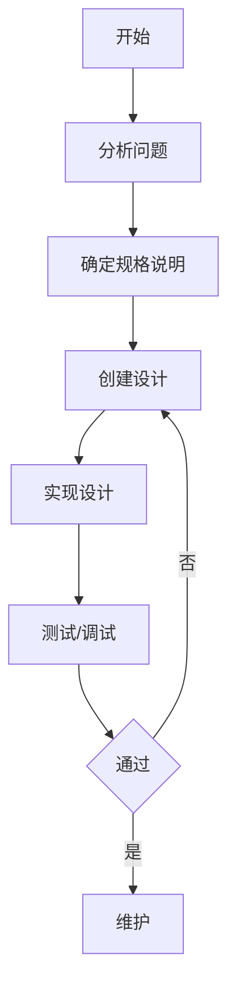
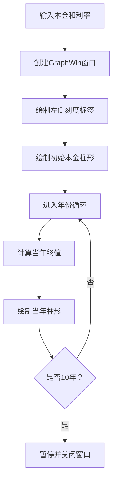
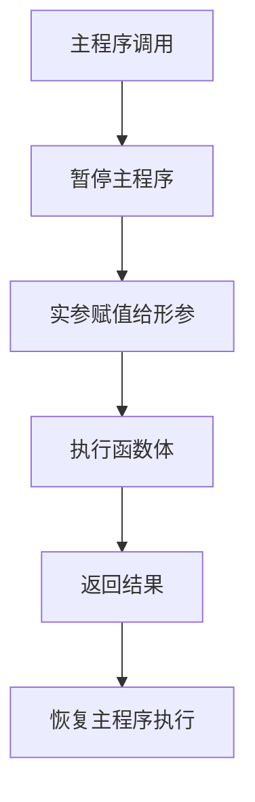
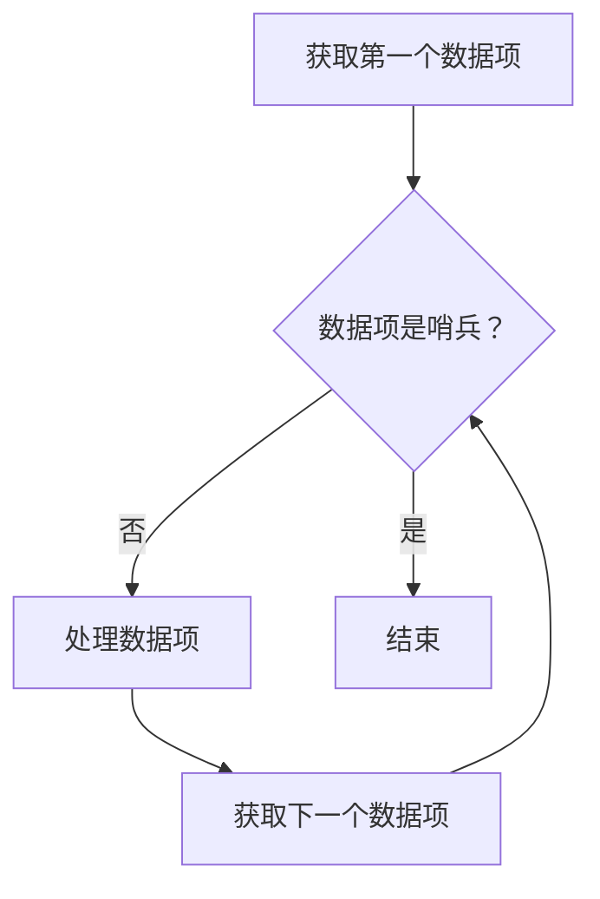
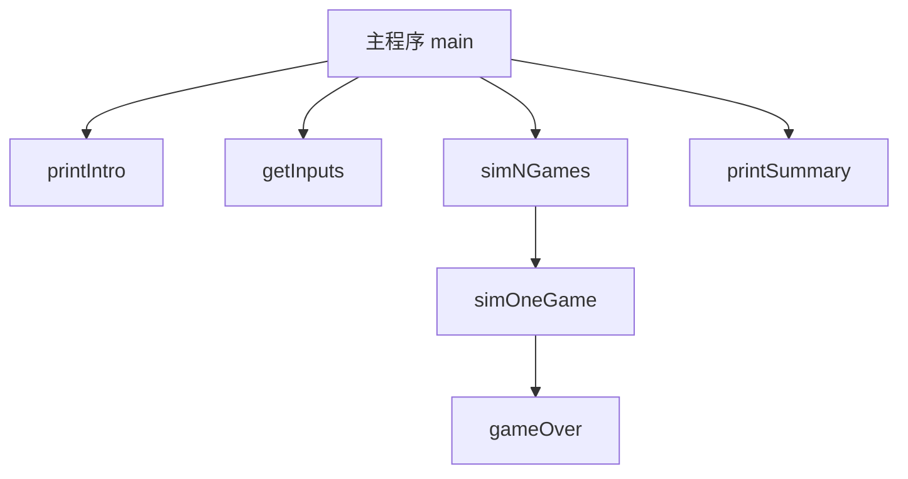
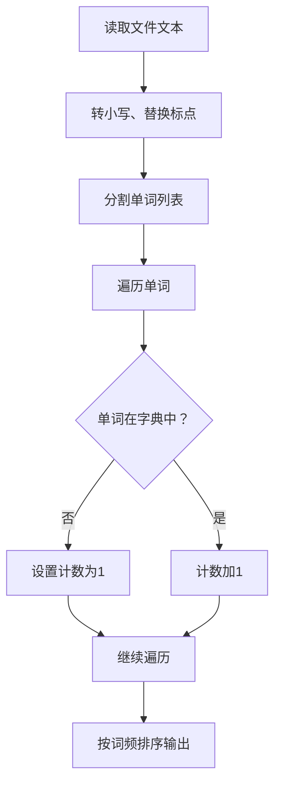
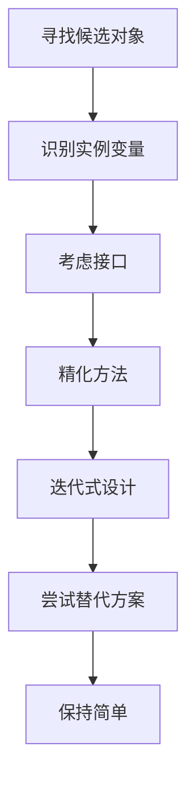
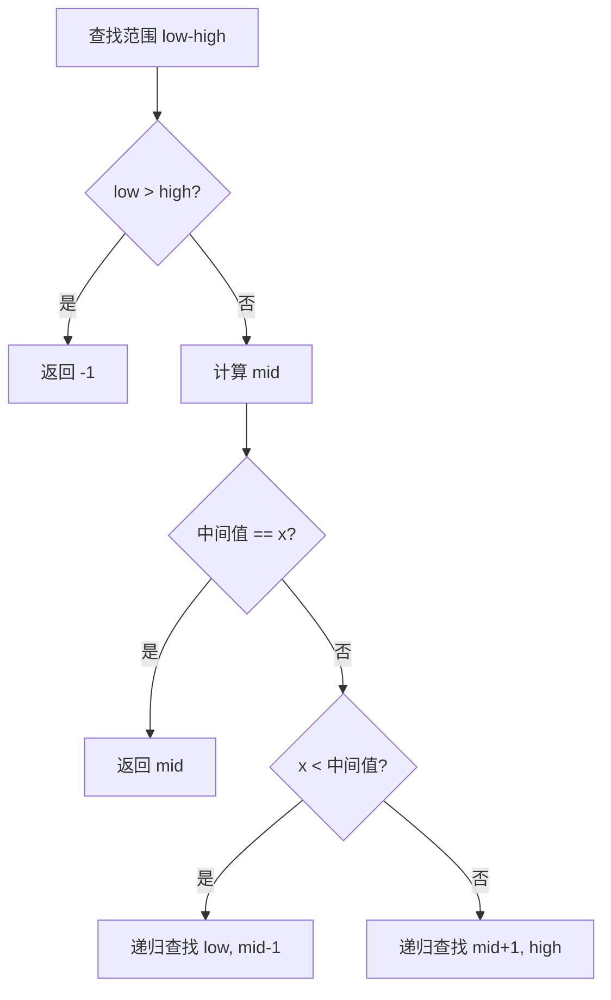

# 《Python程序设计（第3版）》

## 书籍信息

- **书名**：Python程序设计（第3版）
- **作者**：[美] 约翰·策勒 (John Zelle)
- **PDF 状态**：完整扫描版
- **OCR 状态**：可识别，存在少量页码标注

## 全书核心主题

本书作为大学计算机科学专业的入门教材，采用传统的教学方法，强调解决问题、设计和编程是计算机科学的核心技能。通过Python语言，逐步介绍计算机基础、程序设计、数字计算、对象图形、字符串处理、函数、判断循环结构以及模拟设计等高级主题，旨在让学生掌握编程基础并理解计算思维。

---

## 第1章：计算机和程序

### 1. 核心论点

本章主要解决“什么是计算机”以及“计算机科学的研究范畴”的问题。作者认为：计算机是一种通用信息处理机器，而计算机科学的根本问题在于研究“可以计算什么”。

### 2. 关键概念

- **计算机定义**：在可改变的程序控制下，存储和操纵信息的机器。
- **程序**：一组详细的、描述计算步骤的指令，主宰硬件行为。
- **算法**：用于解决特定问题的步骤序列描述，如同“菜谱”。
- **硬件 vs 软件**：硬件是物理机器，软件是程序指令。
- **编程语言**：用于编写计算机指令的形式化符号系统。

### 3. 逻辑推演

文章从“程序的力量”引出软件的重要性，接着介绍计算机科学的本质是算法设计、分析与实验。随后深入硬件基础（CPU、内存、存储器），过渡到高级语言与机器语言的区别，最后通过“混沌程序”示例展示了计算模型的局限性（对初始值的极端敏感性）。

### 4. 经典金句

> “计算机科学不是研究计算机的。计算机之于计算机科学，正如望远镜之于天文学。”

> “没有软件，计算机只是昂贵的镇纸。”

---

## 第2章：编写简单程序

### 1. 核心论点

本章解决“如何系统化地开发程序”的问题。作者提出了标准软件开发过程的六个步骤，并介绍了Python的基本输入输出、变量和确定循环。

### 2. 关键概念

- **软件开发过程**：分析 → 规格说明 → 创建设计 → 实现 → 测试/调试 → 维护。
- **IPO模式**：输入(Input)、处理(Process)、输出(Output)。
- **标识符**：用于命名变量、函数等的名称（字母/下划线开头，后跟字母、数字、下划线）。
- **表达式**：产生或计算新数据值的代码片段。

### 3. 逻辑推演

作者通过“温度转换器”示例，演示了从问题分析到代码实现的完整流程。接着详细解释了Python的语法元素：变量命名、运算符优先级、`print`和`input`函数、赋值语句（包括同时赋值），以及用于计数的`for`循环结构。

### 4. 流程图

### 5. 经典金句

> “计算机是非常实在的，必须告诉它们要做什么，直至最后的细节。”

---

## 第3章：数字计算

### 1. 核心论点

本章讨论计算机如何表示和操作数字。作者强调了数据类型（`int`与`float`）的区别，并指出了计算机算术在精度和范围上的物理局限性。

### 2. 关键概念

- **数据类型**：决定了值可进行的操作（如整数`int`与浮点数`float`）。
- **类型转换**：`int()`, `float()`, `round()`。
- **math库**：提供数学函数（如`sqrt`, `sin`等）。
- **累积器模式**：通过循环累加或累乘来计算结果（如阶乘）。
- **算术局限性**：整数溢出（32位限制）与浮点数精度问题。

### 3. 逻辑推演

首先区分整型和浮点型的适用场景及效率，接着展示如何使用`math`库处理平方根等复杂运算。通过“阶乘”例子引入累积器模式。最后，深入计算机底层，解释二进制表示如何导致数值表示的不精确和溢出问题。

### 4. 经典金句

> “如果不需要小数值，就用 int。”

> “浮点值总是近似值。”

---

## 第4章：对象和图形

### 1. 核心论点

本章介绍面向对象编程的基本概念，并通过`graphics`库演示如何使用对象进行图形编程。

### 2. 关键概念

- **对象**：结合数据（实例变量）和操作（方法）的主动数据类型。
- **类与实例**：类是模板，实例是具体的对象。
- **构造函数**：创建新实例的特殊操作（如`Point(50,60)`）。
- **方法**：对象能执行的操作（如`draw`, `move`）。
- **别名**：两个变量引用同一个对象的现象。
- **坐标变换**：`setCoords`方法用于简化图形绘制坐标。

### 3. 逻辑推演

从面向对象的概念出发，通过`graphics`库的交互式操作引入`GraphWin`、`Point`、`Circle`等对象。通过“绘制终值图表”的案例，详细说明了如何通过创建对象、设置坐标、调用方法来进行图形化数据展示。

### 4. 流程图（终值图表绘制逻辑）

---

## 第5章：序列：字符串、列表和文件

### 1. 核心论点

本章解决文本和序列数据的处理问题。作者介绍了字符串、列表和文件的基本操作，并展示了它们作为序列类型的通用特性（索引、切片、连接）。

### 2. 关键概念

- **序列操作**：索引(`[]`)、切片(`[:]`)、连接(`+`)、重复(`*`)、长度(`len()`)。
- **字符串方法**：`split`, `join`, `upper`, `lower`等。
- **列表 vs 元组**：列表可变，元组不可变。
- **字符串格式化**：`format()`方法用于生成格式良好的输出。
- **文件处理**：`open`, `read`, `readline`, `write`。

### 3. 逻辑推演

从字符串的基础操作（索引、切片）开始，过渡到列表作为序列的通用性。通过“用户名生成器”和“月份缩写”说明字符串处理；通过“编码/解码器”说明字符的底层表示。最后，介绍文件的读写，包括批处理应用和文件对话框的使用。

### 4. 经典金句

> “字符串是不可变的，但列表可以变。”

---

## 第6章：定义函数

### 1. 核心论点

本章解决代码复用和模块化的问题。作者认为，函数是构建复杂程序的重要工具，能够减少代码重复并增加程序的可读性和可维护性。

### 2. 关键概念

- **函数**：程序内的“子程序”。
- **参数**：形参（定义）与实参（调用）。
- **作用域**：变量的局部性。
- **返回值**：通过`return`传递信息。
- **参数传递**：Python采用“按值传递”。

### 3. 逻辑推演

通过“Happy Birthday”歌词重复问题引入函数的必要性。详细解释了函数定义、调用以及参数传递的机制（形参与实参的匹配）。通过“终值图形程序”的重构，展示了如何使用函数消除重复代码（`drawBar`）和组织程序逻辑（`createLabeledWindow`）。

### 4. 流程图（函数调用流程）

---

## 第7章：判断结构

### 1. 核心论点

本章解决程序根据不同情况选择不同执行路径的问题。作者介绍了`if`、`if-else`和`if-elif-else`结构，以及异常处理机制。

### 2. 关键概念

- **控制结构**：改变程序顺序流程的语句。
- **布尔表达式**：求值为`True`或`False`的条件。
- **单路判断**：`if`。
- **两路判断**：`if-else`。
- **多路判断**：`if-elif-else`。
- **异常处理**：`try-except`。

### 3. 逻辑推演

从“温度警告”程序引出条件判断。通过“二次方程求解”问题，依次展示了简单`if`防止错误、`if-else`处理互斥情况、以及`if-elif-else`处理多分支情况（如判别式大于、小于、等于0）。最后引入异常处理作为另一种防御性编程方式。

### 4. 经典金句

> “Python程序中常见的错误是在条件中使用‘=’，而实际需要使用的是‘==’。”

---

## 第8章：循环结构和布尔值

### 1. 核心论点

本章深入探讨循环（确定与不确定）以及控制循环的布尔逻辑。作者详细介绍了`while`循环的几种常见模式。

### 2. 关键概念

- **确定循环**：`for`循环，通常用于计数。
- **不确定循环**：`while`循环，条件为真时继续。
- **交互式循环**：用户控制是否继续。
- **哨兵循环**：遇到特殊值结束。
- **嵌套循环**：循环内部包含循环。
- **布尔运算符**：`and`, `or`, `not`。
- **DeMorgan定律**：用于简化否定条件。

### 3. 逻辑推演

先回顾`for`循环，然后引出不定循环`while`。通过“求平均值”问题的多次改进，依次讲解了交互式循环、哨兵循环和文件结束循环。通过“文件数字读取”案例引入嵌套循环。最后，讲解布尔代数的规则以及如何在循环中利用布尔表达式控制流程。

### 4. 流程图（哨兵循环）

---

## 第9章：模拟与设计

### 1. 核心论点

本章解决如何通过计算机模拟来解决现实世界问题。作者重点介绍了自顶向下的设计（逐步求精）方法，并通过“短柄壁球”模拟案例演示了该过程。

### 2. 关键概念

- **模拟**：对现实世界过程建模。
- **伪随机数**：通过确定性算法生成的随机序列（`random`模块）。
- **自顶向下设计**：将大问题分解为小问题，逐步细化。
- **关注点分离**：通过接口隔离不同部分的实现细节。
- **单元测试**：独立测试程序组件。

### 3. 逻辑推演

从“短柄壁球”的现实问题出发，提出模拟需求。接着详细展示了自顶向下的设计过程：从顶层`main`函数开始，逐步定义`simNGames`, `simOneGame`, `gameOver`等函数。在实现阶段，强调自底向上的单元测试策略，并最终通过模拟结果解释了“能力微小差异导致比赛结果巨大差异”的现象。

### 4. 流程图（自顶向下设计）

---

## 第10章：定义类

### 1. 核心论点

本章讲解如何编写自定义类来组织数据和功能。作者通过`Projectile`（炮弹模拟）和`Student`（数据处理）等实例，演示了面向对象编程的封装特性。

### 2. 关键概念

- **类定义**：`class`关键字。
- **`__init__`方法**：构造函数，初始化实例变量。
- **`self`参数**：指向实例本身的引用。
- **封装**：将实现细节隐藏在类定义内部。
- **模块化**：将类放在单独的文件（模块）中。
- **控件编程**：自定义GUI组件（如`Button`, `DieView`）。

### 3. 逻辑推演

先回顾对象概念，然后通过“炮弹飞行”程序暴露原有函数式编程的复杂性（参数过多），引出封装为`Projectile`类的必要性。随后通过`MSDie`骰子类和`Student`类演示类的构造和方法。最后，通过构建`Button`和`DieView`控件，展示了面向对象在GUI编程中的应用，并优化了“掷骰子”程序。

### 4. 经典金句

> “对象知道一些事情，并且可以做一些事情。”

---

## 第11章：数据集合

### 1. 核心论点

本章解决如何高效地存储和操作大量同类型数据的问题。作者介绍了列表（动态数组）、元组以及字典（映射）的使用。

### 2. 关键概念

- **列表**：可变序列，支持索引和切片。
- **列表方法**：`append`, `sort`, `pop`等。
- **列表作为数组**：存储批量数据。
- **记录的列表**：如学生对象的列表。
- **排序**：通过`key`参数指定排序依据。
- **字典**：无序的键-值对映射。

### 3. 逻辑推演

从“统计问题”（均值、中位数、标准差）出发，说明存储数据集合的必要性。介绍列表的基本操作和作为数组的使用方法。通过“学生GPA排序”案例，讲解如何对对象列表进行排序（`key=Student.gpa`）。最后通过“词频统计”案例，引入字典数据结构来解决非顺序映射问题。

### 4. 流程图（字典词频统计）

---

## 第12章：面向对象设计

### 1. 核心论点

本章讨论如何系统地进行面向对象设计（OOD）。作者提供了7条直观指导原则，并通过“壁球模拟”和“骰子扑克”案例演示了寻找候选对象、定义接口和实现类的过程。

### 2. 关键概念

- **OOD过程**：寻找候选对象 → 识别实例变量 → 考虑接口 → 精化方法 → 迭代设计。
- **封装**：将数据与操作打包。
- **多态**：同一消息在不同对象上表现为不同行为。
- **继承**：子类从父类借用行为。
- **模型-视图**：分离核心逻辑与用户界面。

### 3. 逻辑推演

先给出OOD的7条直觉指导。在“壁球模拟”案例中，识别出`Player`, `RBallGame`, `SimStats`等候选对象，并逐步实现它们。在“骰子扑克”案例中，重点展示了如何通过接口分离模型（`PokerApp`）与视图（`TextInterface`, `GraphicsInterface`），体现了多态和封装的强大。

### 4. 流程图（OOD设计过程）

---

## 第13章：算法设计与递归

### 1. 核心论点

本章探讨算法的效率分析以及递归这一强大的问题解决技术。作者对比了线性查找与二分查找、选择排序与归并排序的效率，并介绍了递归在解决复杂问题（如汉诺塔）中的应用。

### 2. 关键概念

- **算法分析**：评估步骤数与问题规模（n）的关系。
- **线性查找 vs 二分查找**：O(n) vs O(log n)。
- **递归**：函数调用自身的编程技术。
- **归并排序**：分而治之的排序算法，O(n log n)。
- **难解问题**：需要指数级时间的问题（如汉诺塔）。
- **停机问题**：不可解问题的典型代表。

### 3. 逻辑推演

从“查找”问题出发，对比了线性查找和二分查找的效率。引入递归定义（如阶乘）和递归函数。通过“字符串反转”、“重组词”、“快速指数”和“二分查找”递归实现，演示了递归的用法。接着比较选择排序（O(n²)）和归并排序（O(n log n)）的效率。最后，通过汉诺塔问题说明“难解性”，通过停机问题说明“不可解性”。

### 4. 流程图（二分查找递归逻辑）

### 5. 经典金句

> “计算机科学不仅仅是‘编程’。任何计算机专业人士最重要的计算机，仍然是双耳之间那个。”