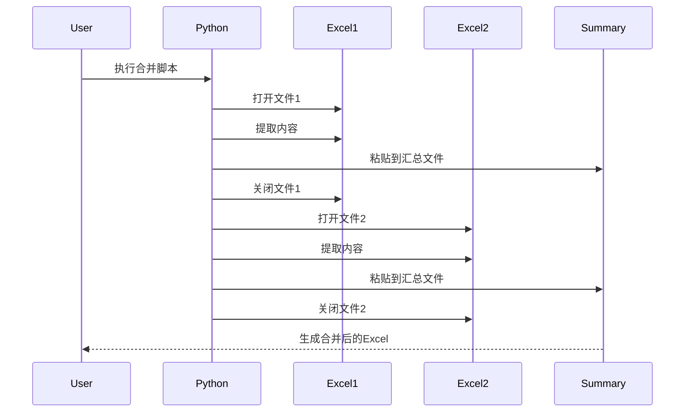
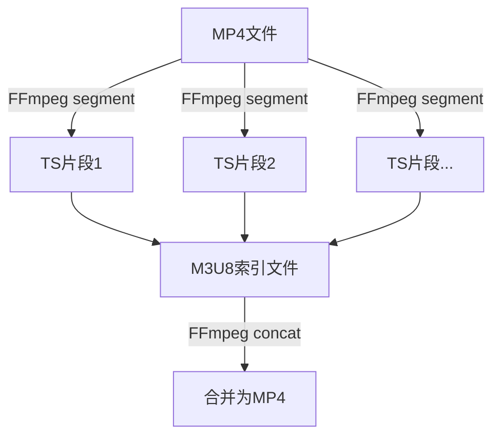
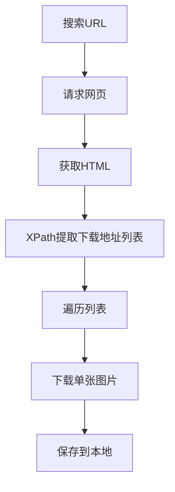
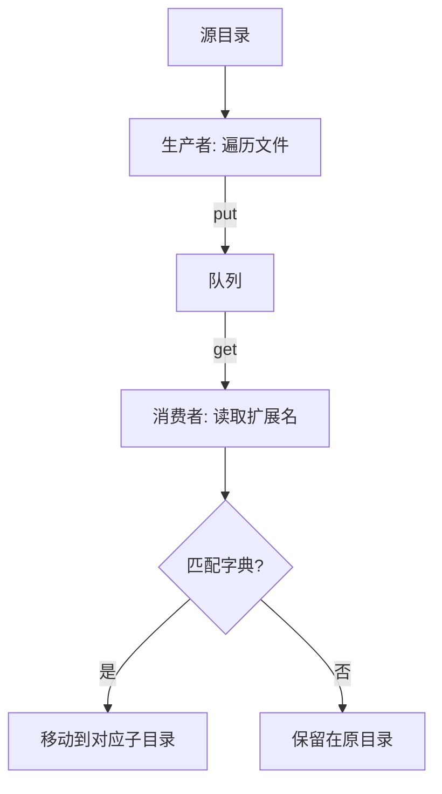

# 《Python自动化办公实战课》章节总结

## 书籍信息
- 书名：Python自动化办公实战课
- 作者：尹会生
- PDF 状态：多文件整合，内容完整
- OCR 状态：基本可读，存在少量格式偏差（如特殊符号、多余换行等），但不影响核心内容提取

## 目录说明
- 目录识别情况：基于专栏课程顺序整理，包含开篇词、导读、01-11讲以及春节特别放送1-3。
- 章节对应依据：按照原专栏发布顺序排列。
- OCR 修复说明：部分代码块中的特殊符号（如“≡”代替“=”）已根据上下文纠正；部分注释行中的乱码已忽略或合理推断。

## 全书核心主题
本书是一套完整的Python自动化办公实战指南，旨在帮助读者利用Python解决日常工作中重复、机械、低效的任务。作者从冯·诺依曼计算机结构出发，将办公自动化场景划分为输入、运算、控制、存储、输出五大模块，覆盖了Excel、Word、图片、文本、视频等多种文件格式的批量处理，以及搜索、排序、替换、分词、并行计算等核心编程技巧。全书以“发现问题 → 分析问题 → 编写Python代码 → 提升效率”为主线，每讲均提供可直接运行的代码示例，适合零基础或初级Python用户学习。通过本书，读者能够掌握批量合并拆分文件、图片转文字、文档合并、数据统计、正则搜索、文件索引、排序、多进程并行等实用技能，最终实现工作效率的10倍提升。

---

## 开篇词：重复工作这么多，怎样才能提高工作效率？

### 1. 核心论点
**问题**：日常工作中存在大量重复、机械的手工劳动（如Excel拆分合并、批量重命名、手动下载等），耗费时间且容易出错。  
**观点**：引入计算机底层逻辑（冯·诺依曼结构），使用Python编程替代手工操作，通过封装、批量控制、定时运行等方式，可以成倍提升工作效率。

### 2. 关键概念/事件
- **冯·诺依曼结构**：计算机由运算器、控制器、存储器、输入设备、输出设备五部分组成。办公自动化可对应这五个维度进行问题拆解。
- **Python的优势**：语法简洁、扩展库丰富（如操作Word只需`import docx`）、跨平台。
- **零基础学习路径**：先看导读掌握基础语法 → 动手操作 → 抄写代码 → 遇到问题回头复习。
- **课程交付**：每节课提供一个可运行的小程序，调整路径和参数即可应用于实际场景。

### 3. 逻辑推演/叙事脉络
作者从个人工作经历（维护微博私信平台）出发，说明手动批量替换200台服务器配置的低效。然后提出用Python程序替代手动操作，并进一步实现批量控制、定时运行和并行执行。接着解释为什么选择Python（简洁、库丰富、跨平台）。最后给出课程的整体设计框架——按输入、运算、控制、存储、输出五大模块组织30个常见场景，并强调即使无Python基础也能学会。

### 4. 经典金句/数据
> “代码封装得越‘高级’，解决的问题就越具体；越深入计算机底层，解决的问题就越通用。”
> “通过三个月的学习，让自己成为10x职场人！”

---

## 导读：入门Python的必备知识

### 1. 核心论点
**问题**：没有编程基础的读者如何快速入门Python以学习本课程？  
**观点**：只需掌握环境配置、变量、数据类型、流程控制、使用函数库这五大基础，就能看懂和修改课程代码。

### 2. 关键概念/事件
- **运行环境**：安装Python解释器，使用终端执行`python3 xxx.py`。
- **变量**：存储数据的抽象概念，命名规则（字母/数字/下划线，首字符不能是数字，不能是关键字，区分大小写）。
- **运算符**：赋值运算符`=`，算术运算符`+ - * / %`。
- **数据类型**：数字、字符串、元组、列表、集合、字典。字符串需加引号；布尔值`True/False`首字母大写。
- **流程控制**：顺序、分支（`if...elif...else`，注意冒号和缩进）、循环（`while`和`for`）。
- **函数库**：标准库（如`math`）直接`import`；扩展库需先用`pip3 install`安装再导入。

### 3. 逻辑推演/叙事脉络
从配置Python环境开始，演示如何运行第一个脚本。然后介绍变量定义与赋值，以及`print`输出。接着展示数字、字符串、布尔等基本数据类型，并强调字符串引号和布尔首字母大写。之后讲解分支结构（`if`）和循环结构（`while`/`for`），重点说明缩进规则。最后介绍如何导入标准库和安装扩展库。整体呈现“从零到能看懂代码”的递进。

### 4. 经典金句/数据
> “变量名只能是字母、数字或下划线，第1个字母不能是数字。”
> “缩进方式必须一致，要么使用Tab、要么使用4个空格。”

---

## 第1章：拆分与合并：如何快速地批量处理内容相似的Excel？

### 1. 核心论点
**问题**：需要批量合并多个Excel文件（如调查问卷）或拆分一个Excel为多个文件（如工资条）时，手动操作极其耗时。  
**观点**：使用Python的`xlrd`和`xlwt`库，通过循环和行列坐标控制，可以自动化实现合并与拆分，将重复工作交给程序。

### 2. 关键概念/事件
- **xlrd库**：读取Excel文件，支持`.xls`和`.xlsx`（但注意高版本xlrd可能不支持`.xlsx`，建议使用`openpyxl`或降级xlrd）。
- **xlwt库**：写入Excel文件（仅支持`.xls`格式）。
- **循环遍历**：使用`for`循环读取目录下所有`.xlsx`文件，逐个处理。
- **追加写入**：先获取已有内容行数，再向下移动一行写入，避免覆盖。
- **时序图**：可视化识别重复操作（打开文件→提取内容→粘贴到汇总→关闭文件），帮助将手工步骤转化为Python代码。

### 3. 逻辑推演/叙事脉络
作者首先提出批量合并和批量拆分的两类场景（问卷调查汇总、工资单拆分）。然后介绍如何用Python操作单个Excel（读取`cell_value`、写入`write`）。接着以合并调查问卷为例，给出时序图识别重复事件，再用`for`循环遍历文件，读取每个文件的特定单元格内容，存入列表，最后写入新的Excel文件。对于拆分，以工资条为例，说明按行读取、每行加上表头后另存为新文件。整个逻辑强调“找到重复→编写自动化→批量循环”。

### 4. 流程图（时序图）


### 5. 经典金句/数据
> “对于编程语言来说，文件合并的步骤可以分解为读取第一个文件，读取第二个文件，将第一个文件的内容追加到第二个文件下方。”
> “画时序图：以时间顺序来排列程序中的事件的图表，很容易看出重复操作。”

---

## 第2章：善用Python扩展库：如何批量合并多个文档？

### 1. 核心论点
**问题**：需要将多个Word文档合并成一个，或将Word与Txt、图片、Excel等文件合并（如批量制作邀请函）。手工操作繁琐且易出错。  
**观点**：使用`python-docx`扩展库，可以轻松提取Word中的文字、段落、表格，并实现与纯文本、图片、Excel的合并与替换。

### 2. 关键概念/事件
- **python-docx库**：专门用于编辑Word文档，支持打开、读取段落（`paragraphs`）、文字（`text`）、添加段落（`add_paragraph`）、添加图片（`add_picture`）等。
- **自定义函数**：使用`def`定义可复用的代码块，减少重复。
- **替换函数**：`replace()`可实现字符串替换，配合字典可实现批量一对一替换。
- **Excel+Word批量生成邀请函**：遍历Excel每一行，将对应字段替换Word中的占位符（如`<姓名>`），再按姓名另存为新文件。

### 3. 逻辑推演/叙事脉络
先演示手工合并Word的四个步骤（打开→复制→粘贴→保存），然后展示用`python-docx`读取段落文本并合并成新文件的代码。接着说明如何将合并逻辑封装为自定义函数，支持任意多个文件。然后分别讲解Word与Txt合并（需统一字体格式）、与图片合并（`add_picture`）、与Excel合并（以邀请函为例，读取Excel数据→遍历段落→替换关键字→保存新文件）。最后总结不同类型文件合并时的兼容性考量。

### 4. 经典金句/数据
> “python-docx扩展库降低了用户使用Python的复杂度，你不需要研究docx文件的底层实现细节。”
> “自定义函数可以提高代码的重复利用率，还能提高代码的可读性。”

---

## 第3章：图片转文字：如何提高识别准确率？

### 1. 核心论点
**问题**：图片中的文字（如聊天截图、发票扫描件）需要转成可编辑文本，但手动校对费时，离线识别中文准确率低。  
**观点**：在线识别（百度AI）准确率高达99%，适合非敏感内容；离线识别（Tesseract）保密性好但中文准确率不足50%，可通过手工标注训练模型提升。

### 2. 关键概念/事件
- **在线识别**：使用百度云`baidu-aip`库，通过`APP_ID`、`API_KEY`、`SECRET_KEY`认证，调用`client.basicGeneral()`识别图片。
- **离线识别**：使用`pytesseract`库（依赖Tesseract OCR引擎），配合图像预处理（灰度、二值化）提高准确率。
- **二值化**：通过阈值将图片转为黑白，减少干扰。
- **模型训练**：使用`jTessBoxEditorFX`工具对每个字进行人工纠正，生成新训练模型，适用于单一场景（如发票、车牌）。
- **数据类型转换**：识别结果通常是字典（`words_result`），需转换为列表再提取文本。

### 3. 逻辑推演/叙事脉络
先对比在线识别和离线识别的优缺点（准确率、安全性、实时性）。然后给出在线识别的三步：安装SDK→注册用户→申请应用，并展示代码。接着演示离线识别：打开图片→转灰度→二值化→`pytesseract.image_to_string`。解释为什么中文识别差（模型小、缺少标注），并介绍手工标注工具和流程。最后说明如何对识别结果进行数据清洗（字典→列表）和保存文件，实现全自动化。

### 4. 流程图（图像识别步骤）


### 5. 经典金句/数据
> “在线识别准确率高达99%，离线识别中文不足50%。”
> “识别成功后的文字处理工作：从字典到列表的转换，再保存至文件。”

---

## 春节特别放送1：实体水果店转线上销售的数据统计问题

### 1. 核心论点
**问题**：水果店老板需要统计全年每种水果的总销售额，以及每月销售数量排名Top3的水果。数据以Excel文件形式存储（每月一个文件，每天一个sheet）。  
**观点**：这是一个典型的Excel批量统计问题，可以通过Python的循环、字典、排序等知识解决。

### 2. 关键概念/事件
- **数据组织**：每个Excel文件代表一个月，每个sheet代表一天，包含水果名称、数量、重量、销售金额、销售时间。
- **统计要求**：
  1. 全年每种水果的总销售额（累加）。
  2. 每月销售数量排名Top3的水果（排序+取前3）。

### 3. 逻辑推演/叙事脉络
作者给出了题目背景和数据结构样例，要求读者运用第一模块（Excel操作、循环、字典）的知识自行解决。这是对前几讲学习成果的检验，为后续揭晓答案做铺垫。

---

## 春节特别放送2：用自顶至底的思路解决数据统计问题

### 1. 核心论点
**问题**：如何系统化地解决水果店数据统计问题？  
**观点**：采用自顶至底的思路，将大问题拆解为小步骤：先遍历所有文件和sheet，再提取每一行的水果名称和销售金额，最后用字典累加或排序。

### 2. 关键概念/事件
- **自顶至底**：先关注总体（全年总销售额），再分解为月销售额累加，月销售额又分解为日销售额累加。
- **字典**：用于记录每种水果的累计销售额，键为水果名称，值为金额。
- **排序**：对每月数据按销售数量从大到小排序，取前3。

### 3. 逻辑推演/叙事脉络
作者以第一题为例，演示如何自顶至底拆解：总体目标→按月累加→按日累加→读取每个sheet每一行→提取水果名称和金额→用字典累加。第二题类似，但需要每月单独排序而非全年累加。强调使用`for`循环和列表/字典数据类型。

---

## 春节特别放送3：揭晓项目作业的答案

### 1. 核心论点
**问题**：给出水果店数据统计问题的完整Python代码实现。  
**观点**：通过`xlrd`读取Excel，`defaultdict`累加金额，`Counter`实现排序和Top3提取，并注意中文字典key的兼容性处理（转英文）。

### 2. 关键概念/事件
- **defaultdict(int)**：自动初始化为0的字典，避免手动赋值。
- **中英文映射**：避免字典直接使用中文key导致的问题，用`tran_dict`做转换。
- **Counter**：`collections.Counter`可对字典按值排序，`most_common(3)`取前3。
- **三个循环**：遍历文件 → 遍历sheet → 遍历行（从第2行开始）。

### 3. 逻辑推演/叙事脉络
首先给出完整代码，逐段解释：导入库、获取文件路径、定义中英文映射函数、三层循环读取数据、累加销售额并输出。对于第二题，强调每月统计后需清空`total`字典，再使用`Counter`排序并输出Top3。最后提醒注意数据类型转换和路径处理。

### 4. 经典金句/数据
> “使用defaultdict可以在字典初始化时得到默认值0，不用手动赋值。”
> “统计完每一个月的数据后，需要把total变量重新初始化，否则下个月会累加。”

---

## 第4章：函数与字典：如何实现多次替换？

### 1. 核心论点
**问题**：需要批量进行多个“一对一”替换（如标点符号、城市拼音转中文）或“多对一”替换（如年龄范围映射到年龄段）。  
**观点**：用字典+自定义函数替代多个`replace()`，用逻辑判断（`if-elif`）处理范围映射，提高代码可读性和复用性。

### 2. 关键概念/事件
- **一对一替换**：城市拼音→中文，使用字典作为映射表，自定义函数接收拼音返回中文。
- **多对一替换**：年龄范围→年龄段（0-6岁→少年），使用`if-elif-else`逻辑判断。
- **lambda表达式**：简化只有一行语句的自定义函数。
- **封装为函数**：将替换逻辑放入函数，便于复用。

### 3. 逻辑推演/叙事脉络
先介绍字符串`replace()`函数的基本用法及局限性（多个替换时代码冗长）。然后提出字典+自定义函数方案，演示如何用一个函数封装所有映射关系，并通过循环批量执行替换。接着讲解多对一替换场景，用`if`条件判断年龄范围，并同样封装为函数。最后总结三种替换方式的选择：单个替换用`replace()`；多对一用逻辑判断；一对一大量映射用字典。

### 4. 经典金句/数据
> “字典的取值方式：dict1[‘abc’]=123，如果字典只使用一次，可以不用起变量名。”
> “lambda表达式替代简单函数的定义和调用，让代码更简洁。”

---

## 第5章：图像处理库：如何实现长图拼接？

### 1. 核心论点
**问题**：需要将多张图片拼接成长图（如微博长图文），或对视频进行拆分/合并（MP4转TS片段）。  
**观点**：使用Python的`subprocess`模块调用外部命令行工具（ImageMagick的`composite`、FFmpeg），避免记忆复杂参数，并实现批量自动化。

### 2. 关键概念/事件
- **subprocess库**：`run()`执行外部命令，`Popen`获取命令输出。
- **ImageMagick**：图片处理软件，`composite`命令可拼接图片。
- **FFmpeg**：视频处理工具，可实现MP4切分为TS片段（生成M3U8索引）以及TS合并为MP4。
- **命令行参数封装**：将命令和参数放入Python列表，通过循环批量执行。

### 3. 逻辑推演/叙事脉络
先解释Python如何调用外部命令（`subprocess.run`和`Popen`），以`ls`命令为例。然后以长图拼接为例，用`Path`遍历图片文件，构造`composite`命令参数列表，调用`run()`执行。接着讲解视频拆分：使用FFmpeg的`segment`参数，将MP4切分为多个TS文件和M3U8索引。最后说明这种封装的好处：不用记复杂参数，便于批量处理。

### 4. 流程图（视频拆分与合并）


### 5. 经典金句/数据
> “Python被称作最佳的‘胶水语言’，因为它能轻易‘粘合’可执行程序。”
> “使用Python调用composite的好处：你不用记住程序使用的繁杂的命令行参数。”

---

## 第6章：jieba分词：如何基于感情色彩进行单词数量统计？

### 1. 核心论点
**问题**：需要自动分析产品评论的情感倾向（正向/负向），并统计关键词。  
**观点**：使用`jieba`进行中文分词，结合停用词过滤或词性筛选优化结果，再用`snownlp`进行情感分析，最后统计正负向评论数量。

### 2. 关键概念/事件
- **jieba分词**：基于词库和HMM模型，`cut()`函数返回词语列表。
- **停用词**：标点符号、语气词等无关词，可通过列表过滤删除。
- **词性标注**：`jieba.posseg`可获取每个词的词性（形容词a、名词n、动词v等），保留需要的词性（如形容词）。
- **snownlp**：情感分析库，`sentiments`属性返回0~1的值，越接近1越正向。
- **模型训练**：可通过`train()`和`save()`扩展snownlp的词典，加入网络用语或emoji。

### 3. 逻辑推演/叙事脉络
先说明情感分析的必要性和难点（中文无空格）。然后演示jieba分词及结果。接着介绍两种优化方法：删除停用词（自定义列表）和根据词性保留（如只保留形容词）。再使用snownlp对分词结果进行情感打分，根据阈值（如0.7）判断正负向并计数。最后提到可训练自定义模型提升准确率。

### 4. 经典金句/数据
> “snownlp对否定词划分不够准确，例如‘不喜欢’会被分为‘不’和‘喜欢’，所以需要先用jieba分词。”
> “sentiments的值接近1表示正向，接近0表示负向。”

---

## 第7章：快速读写文件：如何实现跨文件的字数统计？

### 1. 核心论点
**问题**：需要统计多个文件（如Word文档章节）的中文、英文、标点符号等字数，文件类型可能是txt或Word。  
**观点**：使用Python的文件读写函数（`open`、`read`）和数据类型（列表、字典）实现跨文件统计，并可根据需要分别统计不同类型字符。

### 2. 关键概念/事件
- **文件读取**：`open(file, encoding='utf-8')`，使用`with`自动关闭。
- **路径处理**：`__file__`获取当前脚本路径，`pathlib`拼接目录。
- **统计单个文件**：`len(content.rstrip())`。
- **统计多个文件**：`for`循环遍历文件列表，结果存入列表，最后用`sum()`求和。
- **分类统计**：遍历每个字符，用`string.ascii_letters`判断英文，`.isdigit()`判断数字，`.isspace()`判断空格，`.isalpha()`判断中文（注意中文字符也会返回True，需结合其他方法），其余为特殊字符。
- **存储结构**：用字典的键表示类型，值为列表（每个文件的计数）。

### 3. 逻辑推演/叙事脉络
先实现单个文件字数统计：打开文件→读取内容→`len()`统计。然后扩展到多个文件：用`pathlib`遍历目录，`for`循环依次处理，将每个文件的字数存入列表，最后求和。进一步细化需求：分别统计中文、英文、数字、空格、标点符号的数量。通过`for`循环遍历每个字符，用`if-elif`分支判断并累加不同计数器。最后将每个文件的统计结果存入字典（如`{'count_en': [7,7], ...}`），便于跨文件汇总。

### 4. 经典金句/数据
> “Python丰富的数据类型可以让你更灵活地处理工作中的数据。”
> “with语句块结束之后，不必手动调用close()函数关闭文件，减少资源浪费。”

---

## 第8章：正则表达式：如何提高搜索内容的精确度？

### 1. 核心论点
**问题**：需要从文档中搜索具有某种模式的内容（如手机号、带区号的电话号码），但不能使用具体数字。  
**观点**：使用Python的`re`库（正则表达式），通过元字符描述模式，实现精确匹配（固定长度）和模糊匹配（不定长度），并支持提取和替换。

### 2. 关键概念/事件
- **re.search()**：返回匹配的`re`对象，包含`span`（位置）和`group()`（内容）。
- **元字符**：
  - `[]`：匹配单个字符范围，如`[0-9]`、`[a-zA-Z]`。
  - `{}`：指定匹配次数，如`{11}`、`{3,4}`。
  - `+`：1次到无限次。
  - `*`：0次到无限次。
  - `?`：0次或1次。
  - `.`：匹配任意单个字符。
  - `^`：从开头匹配，`$`：从结尾匹配。
  - `|`：或，`()`：分组。
- **提取**：`group(0)`获取整个匹配内容。
- **替换**：`re.sub(pattern, replacement, string)`。

### 3. 逻辑推演/叙事脉络
先给出两个场景（手机号、电话号码），引出按模式搜索的必要性。然后介绍`re.search()`的基本用法和返回对象。接着分类讲解精确匹配元字符（`[]`和`{}`）和模糊匹配元字符（`+*?.`）。再演示如何提取匹配内容（`group`）和替换（`sub`）。最后强调正则表达式在多种编程语言中的通用性。

### 4. 经典金句/数据
> “正则表达式就是利用元字符进行模式匹配工作的。”
> “`[0-9]{11}`表示匹配11个数字。”

---

## 第9章：扩展搜索：如何快速找到想要的文件？

### 1. 核心论点
**问题**：Windows自带搜索速度慢，因为搜索范围过大且需要实时扫描硬盘。  
**观点**：使用Python的`pathlib`库的`glob()`和`rglob()`进行文件搜索，并通过指定搜索路径（配置文件）和建立索引文件（空间换时间）两种方式大幅提升效率。

### 2. 关键概念/事件
- **pathlib.glob()**：支持通配符（`*`、`?`、`[]`、`**`），返回迭代器。
- **rglob()**：从路径末尾向前匹配，适合按扩展名搜索（如`*.xlsx`）。
- **配置文件（.ini）**：使用`configparser`读取，可按“节”区分不同搜索范围（工作/娱乐）。
- **索引文件**：预先遍历所有文件路径保存到文本文件（如`search.db`），搜索时直接在该文件中用正则查找，速度极快。
- **时效性**：索引文件需定期更新（如加入开机启动脚本）。

### 3. 逻辑推演/叙事脉络
先分析Windows搜索慢的两个原因（搜索范围大、文件数量多）。然后给出基础搜索方法：`glob()`和`rglob()`的基本用法。接着提出优化方案一：指定搜索路径——将搜索目录写入`.ini`配置文件，用`configparser`读取，循环对每个目录执行搜索。方案二：建立索引——先遍历所有指定目录，将所有文件路径写入`search.db`，然后编写`locate.py`脚本从该文件搜索关键字。最后说明索引文件需要定期更新以保证准确性。

### 4. 流程图（索引文件搜索流程）


### 5. 经典金句/数据
> “空间换时间：将原本搜索硬盘的时间拆分为建立索引的时间+从索引文件查找的时间。”
> “索引文件适合文件变化频率较低的场景。”

---

## 第10章：按指定顺序给词语排序，提高查找效率

### 1. 核心论点
**问题**：需要从大量数据中提取TopN（如用户在线时长前3、销售排名前5）。  
**观点**：使用Python内置的`sorted()`函数，支持默认排序和自定义排序（通过`key`和`reverse`参数），可对列表、元组、字典等可迭代对象进行排序，高效获取TopN。

### 2. 关键概念/事件
- **sorted()**：返回新列表，不修改原对象。参数：`iterable`、`key`、`reverse`。
- **默认排序**：从小到大，数字按大小，字符串按字母顺序。混合类型需统一（如`str(1)`）。
- **sort() vs sorted()**：`sort()`是列表的方法，原地修改返回`None`；`sorted()`通用且返回新列表。
- **自定义排序**：
  - `reverse=True`实现从大到小。
  - `key`参数接收一个函数，用于提取比较关键字（如`lambda d: d[0]`）。
- **对列表+元组排序**：`key=lambda x: x[2]`按元组第三个元素排序。
- **对字典排序**：先用`items()`转换为列表+元组，再按`d[0]`（键）或`d[1]`（值）排序，最后可用`dict()`转回。

### 3. 逻辑推演/叙事脉络
先提出TopN需求，介绍`sorted()`函数定义。然后演示默认排序及注意事项（区分大小写、数字字符串混合、`sort()`区别）。接着讲解自定义排序：`reverse`实现降序，通过切片提取TopN。再深入`key`参数，以`lambda`表达式为例，展示如何对包含元组的列表按指定字段排序。最后讲解字典的排序方法（`items()`转换）。结尾给出性能建议：海量数据转元组可提升查找效率，`collections.OrderedDict`可自动维护有序字典。

### 4. 经典金句/数据
> “sorted()函数不会对原有的列表进行修改，它会把排序好的结果存入到一个新的列表中。”
> “lambda表达式通常在函数只有一行语句，且不需要强调函数名称的时候使用。”

---

## 第11章：通过程序并行计算，避免CPU资源浪费

### 1. 核心论点
**问题**：大量计算任务（如图片批量处理、视频转码）如果串行执行，无法充分利用CPU多核，效率低下。  
**观点**：使用`multiprocessing.Pool`实现并行计算，根据逻辑CPU数量设置进程数，可成倍提升计算密集型任务的效率。

### 2. 关键概念/事件
- **进程 vs 线程**：多进程适合计算密集型，多线程适合I/O密集型。
- **Pool.map()**：将可迭代参数分配到多个进程并行执行函数，返回结果列表。
- **with Pool(n) as p**：自动管理进程池的打开和关闭。
- **获取CPU核心数**：`psutil.cpu_count()`（第三方库）或`os.cpu_count()`。
- **进程ID记录**：使用`os.getpid()`和`multiprocessing.Queue`收集进程ID，再用`set`去重。
- **时间统计**：`time.time()`前后相减。

### 3. 逻辑推演/叙事脉络
先说明为什么需要并行计算（CPU多核未被利用）。然后演示`Pool.map`并行计算平方的例子。接着讲解如何自动设置并行度（逻辑CPU数或两倍），并记录进程ID以验证并行执行。再对比串行和并行的执行时间，强调计算密集型任务的性能提升。最后介绍多线程模型（`multiprocessing.dummy.Pool`）适用于I/O密集型任务（如批量网页访问），并留下思考题：并行访问几十个网站。

### 4. 流程图（并行计算模型）
```mermaid
graph TD
    A[主进程] -->|Pool(8)| B[进程1]
    A -->|Pool(8)| C[进程2]
    A -->|Pool(8)| D[进程...]
    B --> E[计算结果]
    C --> E
    D --> E
    E --> F[汇总结果列表]
```

### 5. 经典金句/数据
> “并行度设置为逻辑CPU数量的两倍，或等于逻辑CPU数量（长时间任务）。”
> “多进程模型适合计算密集型应用，多线程模型适合I/O密集型应用。”

---

*本书目录共包含11个主要技术章节及开篇词、导读、春节特别放送三篇。以上为全部结构化总结。*


# 《Python自动化办公实战课》章节总结

## 书籍信息
- 书名：Python自动化办公实战课
- 作者：尹会生
- PDF 状态：多文件整合，内容完整
- OCR 状态：基本可读，存在少量格式偏差（如特殊符号、多余换行等），但不影响核心内容提取

## 目录说明
- 目录识别情况：基于专栏课程顺序整理，包含开篇词、导读、01-30讲、春节特别放送1-3、结束语。
- 章节对应依据：按照原专栏发布顺序排列。
- OCR 修复说明：部分代码块中的特殊符号（如“≡”代替“=”）已根据上下文纠正；部分注释行中的乱码已忽略或合理推断。

## 全书核心主题
本书是一套完整的Python自动化办公实战指南，旨在帮助读者利用Python解决日常工作中重复、机械、低效的任务。作者从冯·诺依曼计算机结构出发，将办公自动化场景划分为输入、运算、控制、存储、输出五大模块，覆盖了Excel、Word、图片、文本、视频等多种文件格式的批量处理，以及搜索、排序、替换、分词、并行计算等核心编程技巧。全书以“发现问题 → 分析问题 → 编写Python代码 → 提升效率”为主线，每讲均提供可直接运行的代码示例，适合零基础或初级Python用户学习。通过本书，读者能够掌握批量合并拆分文件、图片转文字、文档合并、数据统计、正则搜索、文件索引、排序、多进程并行等实用技能，最终实现工作效率的10倍提升。

---

## 开篇词：重复工作这么多，怎样才能提高工作效率？

### 1. 核心论点
**问题**：日常工作中存在大量重复、机械的手工劳动（如Excel拆分合并、批量重命名、手动下载等），耗费时间且容易出错。  
**观点**：引入计算机底层逻辑（冯·诺依曼结构），使用Python编程替代手工操作，通过封装、批量控制、定时运行等方式，可以成倍提升工作效率。

### 2. 关键概念/事件
- **冯·诺依曼结构**：计算机由运算器、控制器、存储器、输入设备、输出设备五部分组成。办公自动化可对应这五个维度进行问题拆解。
- **Python的优势**：语法简洁、扩展库丰富（如操作Word只需`import docx`）、跨平台。
- **零基础学习路径**：先看导读掌握基础语法 → 动手操作 → 抄写代码 → 遇到问题回头复习。
- **课程交付**：每节课提供一个可运行的小程序，调整路径和参数即可应用于实际场景。

### 3. 逻辑推演/叙事脉络
作者从个人工作经历（维护微博私信平台）出发，说明手动批量替换200台服务器配置的低效。然后提出用Python程序替代手动操作，并进一步实现批量控制、定时运行和并行执行。接着解释为什么选择Python（简洁、库丰富、跨平台）。最后给出课程的整体设计框架——按输入、运算、控制、存储、输出五大模块组织30个常见场景，并强调即使无Python基础也能学会。

### 4. 经典金句/数据
> “代码封装得越‘高级’，解决的问题就越具体；越深入计算机底层，解决的问题就越通用。”
> “通过三个月的学习，让自己成为10x职场人！”

---

## 导读：入门Python的必备知识

### 1. 核心论点
**问题**：没有编程基础的读者如何快速入门Python以学习本课程？  
**观点**：只需掌握环境配置、变量、数据类型、流程控制、使用函数库这五大基础，就能看懂和修改课程代码。

### 2. 关键概念/事件
- **运行环境**：安装Python解释器，使用终端执行`python3 xxx.py`。
- **变量**：存储数据的抽象概念，命名规则（字母/数字/下划线，首字符不能是数字，不能是关键字，区分大小写）。
- **运算符**：赋值运算符`=`，算术运算符`+ - * / %`。
- **数据类型**：数字、字符串、元组、列表、集合、字典。字符串需加引号；布尔值`True/False`首字母大写。
- **流程控制**：顺序、分支（`if...elif...else`，注意冒号和缩进）、循环（`while`和`for`）。
- **函数库**：标准库（如`math`）直接`import`；扩展库需先用`pip3 install`安装再导入。

### 3. 逻辑推演/叙事脉络
从配置Python环境开始，演示如何运行第一个脚本。然后介绍变量定义与赋值，以及`print`输出。接着展示数字、字符串、布尔等基本数据类型，并强调字符串引号和布尔首字母大写。之后讲解分支结构（`if`）和循环结构（`while`/`for`），重点说明缩进规则。最后介绍如何导入标准库和安装扩展库。整体呈现“从零到能看懂代码”的递进。

### 4. 经典金句/数据
> “变量名只能是字母、数字或下划线，第1个字母不能是数字。”
> “缩进方式必须一致，要么使用Tab、要么使用4个空格。”

---

## 第1章：拆分与合并：如何快速地批量处理内容相似的Excel？

### 1. 核心论点
**问题**：需要批量合并多个Excel文件（如调查问卷）或拆分一个Excel为多个文件（如工资条）时，手动操作极其耗时。  
**观点**：使用Python的`xlrd`和`xlwt`库，通过循环和行列坐标控制，可以自动化实现合并与拆分，将重复工作交给程序。

### 2. 关键概念/事件
- **xlrd库**：读取Excel文件，支持`.xls`和`.xlsx`（注意高版本xlrd可能不支持`.xlsx`，建议使用`openpyxl`或降级xlrd）。
- **xlwt库**：写入Excel文件（仅支持`.xls`格式）。
- **循环遍历**：使用`for`循环读取目录下所有`.xlsx`文件，逐个处理。
- **追加写入**：先获取已有内容行数，再向下移动一行写入，避免覆盖。
- **时序图**：可视化识别重复操作（打开文件→提取内容→粘贴到汇总→关闭文件），帮助将手工步骤转化为Python代码。

### 3. 逻辑推演/叙事脉络
作者首先提出批量合并和批量拆分的两类场景（问卷调查汇总、工资单拆分）。然后介绍如何用Python操作单个Excel（读取`cell_value`、写入`write`）。接着以合并调查问卷为例，给出时序图识别重复事件，再用`for`循环遍历文件，读取每个文件的特定单元格内容，存入列表，最后写入新的Excel文件。对于拆分，以工资条为例，说明按行读取、每行加上表头后另存为新文件。整个逻辑强调“找到重复→编写自动化→批量循环”。

### 4. 流程图（时序图）


### 5. 经典金句/数据
> “对于编程语言来说，文件合并的步骤可以分解为读取第一个文件，读取第二个文件，将第一个文件的内容追加到第二个文件下方。”
> “画时序图：以时间顺序来排列程序中的事件的图表，很容易看出重复操作。”

---

## 第2章：善用Python扩展库：如何批量合并多个文档？

### 1. 核心论点
**问题**：需要将多个Word文档合并成一个，或将Word与Txt、图片、Excel等文件合并（如批量制作邀请函）。手工操作繁琐且易出错。  
**观点**：使用`python-docx`扩展库，可以轻松提取Word中的文字、段落、表格，并实现与纯文本、图片、Excel的合并与替换。

### 2. 关键概念/事件
- **python-docx库**：专门用于编辑Word文档，支持打开、读取段落（`paragraphs`）、文字（`text`）、添加段落（`add_paragraph`）、添加图片（`add_picture`）等。
- **自定义函数**：使用`def`定义可复用的代码块，减少重复。
- **替换函数**：`replace()`可实现字符串替换，配合字典可实现批量一对一替换。
- **Excel+Word批量生成邀请函**：遍历Excel每一行，将对应字段替换Word中的占位符（如`<姓名>`），再按姓名另存为新文件。

### 3. 逻辑推演/叙事脉络
先演示手工合并Word的四个步骤（打开→复制→粘贴→保存），然后展示用`python-docx`读取段落文本并合并成新文件的代码。接着说明如何将合并逻辑封装为自定义函数，支持任意多个文件。然后分别讲解Word与Txt合并（需统一字体格式）、与图片合并（`add_picture`）、与Excel合并（以邀请函为例，读取Excel数据→遍历段落→替换关键字→保存新文件）。最后总结不同类型文件合并时的兼容性考量。

### 4. 经典金句/数据
> “python-docx扩展库降低了用户使用Python的复杂度，你不需要研究docx文件的底层实现细节。”
> “自定义函数可以提高代码的重复利用率，还能提高代码的可读性。”

---

## 第3章：图片转文字：如何提高识别准确率？

### 1. 核心论点
**问题**：图片中的文字（如聊天截图、发票扫描件）需要转成可编辑文本，但手动校对费时，离线识别中文准确率低。  
**观点**：在线识别（百度AI）准确率高达99%，适合非敏感内容；离线识别（Tesseract）保密性好但中文准确率不足50%，可通过手工标注训练模型提升。

### 2. 关键概念/事件
- **在线识别**：使用百度云`baidu-aip`库，通过`APP_ID`、`API_KEY`、`SECRET_KEY`认证，调用`client.basicGeneral()`识别图片。
- **离线识别**：使用`pytesseract`库（依赖Tesseract OCR引擎），配合图像预处理（灰度、二值化）提高准确率。
- **二值化**：通过阈值将图片转为黑白，减少干扰。
- **模型训练**：使用`jTessBoxEditorFX`工具对每个字进行人工纠正，生成新训练模型，适用于单一场景（如发票、车牌）。
- **数据类型转换**：识别结果通常是字典（`words_result`），需转换为列表再提取文本。

### 3. 逻辑推演/叙事脉络
先对比在线识别和离线识别的优缺点（准确率、安全性、实时性）。然后给出在线识别的三步：安装SDK→注册用户→申请应用，并展示代码。接着演示离线识别：打开图片→转灰度→二值化→`pytesseract.image_to_string`。解释为什么中文识别差（模型小、缺少标注），并介绍手工标注工具和流程。最后说明如何对识别结果进行数据清洗（字典→列表）和保存文件，实现全自动化。

### 4. 流程图（图像识别步骤）


### 5. 经典金句/数据
> “在线识别准确率高达99%，离线识别中文不足50%。”
> “识别成功后的文字处理工作：从字典到列表的转换，再保存至文件。”

---

## 春节特别放送1：实体水果店转线上销售的数据统计问题

### 1. 核心论点
**问题**：水果店老板需要统计全年每种水果的总销售额，以及每月销售数量排名Top3的水果。数据以Excel文件形式存储（每月一个文件，每天一个sheet）。  
**观点**：这是一个典型的Excel批量统计问题，可以通过Python的循环、字典、排序等知识解决。

### 2. 关键概念/事件
- **数据组织**：每个Excel文件代表一个月，每个sheet代表一天，包含水果名称、数量、重量、销售金额、销售时间。
- **统计要求**：
  1. 全年每种水果的总销售额（累加）。
  2. 每月销售数量排名Top3的水果（排序+取前3）。

### 3. 逻辑推演/叙事脉络
作者给出了题目背景和数据结构样例，要求读者运用第一模块（Excel操作、循环、字典）的知识自行解决。这是对前几讲学习成果的检验，为后续揭晓答案做铺垫。

---

## 春节特别放送2：用自顶至底的思路解决数据统计问题

### 1. 核心论点
**问题**：如何系统化地解决水果店数据统计问题？  
**观点**：采用自顶至底的思路，将大问题拆解为小步骤：先遍历所有文件和sheet，再提取每一行的水果名称和销售金额，最后用字典累加或排序。

### 2. 关键概念/事件
- **自顶至底**：先关注总体（全年总销售额），再分解为月销售额累加，月销售额又分解为日销售额累加。
- **字典**：用于记录每种水果的累计销售额，键为水果名称，值为金额。
- **排序**：对每月数据按销售数量从大到小排序，取前3。

### 3. 逻辑推演/叙事脉络
作者以第一题为例，演示如何自顶至底拆解：总体目标→按月累加→按日累加→读取每个sheet每一行→提取水果名称和金额→用字典累加。第二题类似，但需要每月单独排序而非全年累加。强调使用`for`循环和列表/字典数据类型。

---

## 春节特别放送3：揭晓项目作业的答案

### 1. 核心论点
**问题**：给出水果店数据统计问题的完整Python代码实现。  
**观点**：通过`xlrd`读取Excel，`defaultdict`累加金额，`Counter`实现排序和Top3提取，并注意中文字典key的兼容性处理（转英文）。

### 2. 关键概念/事件
- **defaultdict(int)**：自动初始化为0的字典，避免手动赋值。
- **中英文映射**：避免字典直接使用中文key导致的问题，用`tran_dict`做转换。
- **Counter**：`collections.Counter`可对字典按值排序，`most_common(3)`取前3。
- **三个循环**：遍历文件 → 遍历sheet → 遍历行（从第2行开始）。

### 3. 逻辑推演/叙事脉络
首先给出完整代码，逐段解释：导入库、获取文件路径、定义中英文映射函数、三层循环读取数据、累加销售额并输出。对于第二题，强调每月统计后需清空`total`字典，再使用`Counter`排序并输出Top3。最后提醒注意数据类型转换和路径处理。

### 4. 经典金句/数据
> “使用defaultdict可以在字典初始化时得到默认值0，不用手动赋值。”
> “统计完每一个月的数据后，需要把total变量重新初始化，否则下个月会累加。”

---

## 第4章：函数与字典：如何实现多次替换？

### 1. 核心论点
**问题**：需要批量进行多个“一对一”替换（如标点符号、城市拼音转中文）或“多对一”替换（如年龄范围映射到年龄段）。  
**观点**：用字典+自定义函数替代多个`replace()`，用逻辑判断（`if-elif`）处理范围映射，提高代码可读性和复用性。

### 2. 关键概念/事件
- **一对一替换**：城市拼音→中文，使用字典作为映射表，自定义函数接收拼音返回中文。
- **多对一替换**：年龄范围→年龄段（0-6岁→少年），使用`if-elif-else`逻辑判断。
- **lambda表达式**：简化只有一行语句的自定义函数。
- **封装为函数**：将替换逻辑放入函数，便于复用。

### 3. 逻辑推演/叙事脉络
先介绍字符串`replace()`函数的基本用法及局限性（多个替换时代码冗长）。然后提出字典+自定义函数方案，演示如何用一个函数封装所有映射关系，并通过循环批量执行替换。接着讲解多对一替换场景，用`if`条件判断年龄范围，并同样封装为函数。最后总结三种替换方式的选择：单个替换用`replace()`；多对一用逻辑判断；一对一大量映射用字典。

### 4. 经典金句/数据
> “字典的取值方式：dict1['abc']=123，如果字典只使用一次，可以不用起变量名。”
> “lambda表达式替代简单函数的定义和调用，让代码更简洁。”

---

## 第5章：图像处理库：如何实现长图拼接？

### 1. 核心论点
**问题**：需要将多张图片拼接成长图（如微博长图文），或对视频进行拆分/合并（MP4转TS片段）。  
**观点**：使用Python的`subprocess`模块调用外部命令行工具（ImageMagick的`composite`、FFmpeg），避免记忆复杂参数，并实现批量自动化。

### 2. 关键概念/事件
- **subprocess库**：`run()`执行外部命令，`Popen`获取命令输出。
- **ImageMagick**：图片处理软件，`composite`命令可拼接图片。
- **FFmpeg**：视频处理工具，可实现MP4切分为TS片段（生成M3U8索引）以及TS合并为MP4。
- **命令行参数封装**：将命令和参数放入Python列表，通过循环批量执行。

### 3. 逻辑推演/叙事脉络
先解释Python如何调用外部命令（`subprocess.run`和`Popen`），以`ls`命令为例。然后以长图拼接为例，用`Path`遍历图片文件，构造`composite`命令参数列表，调用`run()`执行。接着讲解视频拆分：使用FFmpeg的`segment`参数，将MP4切分为多个TS文件和M3U8索引。最后说明这种封装的好处：不用记复杂参数，便于批量处理。

### 4. 流程图（视频拆分与合并）


### 5. 经典金句/数据
> “Python被称作最佳的‘胶水语言’，因为它能轻易‘粘合’可执行程序。”
> “使用Python调用composite的好处：你不用记住程序使用的繁杂的命令行参数。”

---

## 第6章：jieba分词：如何基于感情色彩进行单词数量统计？

### 1. 核心论点
**问题**：需要自动分析产品评论的情感倾向（正向/负向），并统计关键词。  
**观点**：使用`jieba`进行中文分词，结合停用词过滤或词性筛选优化结果，再用`snownlp`进行情感分析，最后统计正负向评论数量。

### 2. 关键概念/事件
- **jieba分词**：基于词库和HMM模型，`cut()`函数返回词语列表。
- **停用词**：标点符号、语气词等无关词，可通过列表过滤删除。
- **词性标注**：`jieba.posseg`可获取每个词的词性（形容词a、名词n、动词v等），保留需要的词性（如形容词）。
- **snownlp**：情感分析库，`sentiments`属性返回0~1的值，越接近1越正向。
- **模型训练**：可通过`train()`和`save()`扩展snownlp的词典，加入网络用语或emoji。

### 3. 逻辑推演/叙事脉络
先说明情感分析的必要性和难点（中文无空格）。然后演示jieba分词及结果。接着介绍两种优化方法：删除停用词（自定义列表）和根据词性保留（如只保留形容词）。再使用snownlp对分词结果进行情感打分，根据阈值（如0.7）判断正负向并计数。最后提到可训练自定义模型提升准确率。

### 4. 经典金句/数据
> “snownlp对否定词划分不够准确，例如‘不喜欢’会被分为‘不’和‘喜欢’，所以需要先用jieba分词。”
> “sentiments的值接近1表示正向，接近0表示负向。”

---

## 第7章：快速读写文件：如何实现跨文件的字数统计？

### 1. 核心论点
**问题**：需要统计多个文件（如Word文档章节）的中文、英文、标点符号等字数，文件类型可能是txt或Word。  
**观点**：使用Python的文件读写函数（`open`、`read`）和数据类型（列表、字典）实现跨文件统计，并可根据需要分别统计不同类型字符。

### 2. 关键概念/事件
- **文件读取**：`open(file, encoding='utf-8')`，使用`with`自动关闭。
- **路径处理**：`__file__`获取当前脚本路径，`pathlib`拼接目录。
- **统计单个文件**：`len(content.rstrip())`。
- **统计多个文件**：`for`循环遍历文件列表，结果存入列表，最后用`sum()`求和。
- **分类统计**：遍历每个字符，用`string.ascii_letters`判断英文，`.isdigit()`判断数字，`.isspace()`判断空格，`.isalpha()`判断中文（注意中文字符也会返回True，需结合其他方法），其余为特殊字符。
- **存储结构**：用字典的键表示类型，值为列表（每个文件的计数）。

### 3. 逻辑推演/叙事脉络
先实现单个文件字数统计：打开文件→读取内容→`len()`统计。然后扩展到多个文件：用`pathlib`遍历目录，`for`循环依次处理，将每个文件的字数存入列表，最后求和。进一步细化需求：分别统计中文、英文、数字、空格、标点符号的数量。通过`for`循环遍历每个字符，用`if-elif`分支判断并累加不同计数器。最后将每个文件的统计结果存入字典（如`{'count_en': [7,7], ...}`），便于跨文件汇总。

### 4. 经典金句/数据
> “Python丰富的数据类型可以让你更灵活地处理工作中的数据。”
> “with语句块结束之后，不必手动调用close()函数关闭文件，减少资源浪费。”

---

## 第8章：正则表达式：如何提高搜索内容的精确度？

### 1. 核心论点
**问题**：需要从文档中搜索具有某种模式的内容（如手机号、带区号的电话号码），但不能使用具体数字。  
**观点**：使用Python的`re`库（正则表达式），通过元字符描述模式，实现精确匹配（固定长度）和模糊匹配（不定长度），并支持提取和替换。

### 2. 关键概念/事件
- **re.search()**：返回匹配的`re`对象，包含`span`（位置）和`group()`（内容）。
- **元字符**：
  - `[]`：匹配单个字符范围，如`[0-9]`、`[a-zA-Z]`。
  - `{}`：指定匹配次数，如`{11}`、`{3,4}`。
  - `+`：1次到无限次。
  - `*`：0次到无限次。
  - `?`：0次或1次。
  - `.`：匹配任意单个字符。
  - `^`：从开头匹配，`$`：从结尾匹配。
  - `|`：或，`()`：分组。
- **提取**：`group(0)`获取整个匹配内容。
- **替换**：`re.sub(pattern, replacement, string)`。

### 3. 逻辑推演/叙事脉络
先给出两个场景（手机号、电话号码），引出按模式搜索的必要性。然后介绍`re.search()`的基本用法和返回对象。接着分类讲解精确匹配元字符（`[]`和`{}`）和模糊匹配元字符（`+*?.`）。再演示如何提取匹配内容（`group`）和替换（`sub`）。最后强调正则表达式在多种编程语言中的通用性。

### 4. 经典金句/数据
> “正则表达式就是利用元字符进行模式匹配工作的。”
> “`[0-9]{11}`表示匹配11个数字。”

---

## 第9章：扩展搜索：如何快速找到想要的文件？

### 1. 核心论点
**问题**：Windows自带搜索速度慢，因为搜索范围过大且需要实时扫描硬盘。  
**观点**：使用Python的`pathlib`库的`glob()`和`rglob()`进行文件搜索，并通过指定搜索路径（配置文件）和建立索引文件（空间换时间）两种方式大幅提升效率。

### 2. 关键概念/事件
- **pathlib.glob()**：支持通配符（`*`、`?`、`[]`、`**`），返回迭代器。
- **rglob()**：从路径末尾向前匹配，适合按扩展名搜索（如`*.xlsx`）。
- **配置文件（.ini）**：使用`configparser`读取，可按“节”区分不同搜索范围（工作/娱乐）。
- **索引文件**：预先遍历所有文件路径保存到文本文件（如`search.db`），搜索时直接在该文件中用正则查找，速度极快。
- **时效性**：索引文件需定期更新（如加入开机启动脚本）。

### 3. 逻辑推演/叙事脉络
先分析Windows搜索慢的两个原因（搜索范围大、文件数量多）。然后给出基础搜索方法：`glob()`和`rglob()`的基本用法。接着提出优化方案一：指定搜索路径——将搜索目录写入`.ini`配置文件，用`configparser`读取，循环对每个目录执行搜索。方案二：建立索引——先遍历所有指定目录，将所有文件路径写入`search.db`，然后编写`locate.py`脚本从该文件搜索关键字。最后说明索引文件需要定期更新以保证准确性。

### 4. 流程图（索引文件搜索流程）


### 5. 经典金句/数据
> “空间换时间：将原本搜索硬盘的时间拆分为建立索引的时间+从索引文件查找的时间。”
> “索引文件适合文件变化频率较低的场景。”

---

## 第10章：按指定顺序给词语排序，提高查找效率

### 1. 核心论点
**问题**：需要从大量数据中提取TopN（如用户在线时长前3、销售排名前5）。  
**观点**：使用Python内置的`sorted()`函数，支持默认排序和自定义排序（通过`key`和`reverse`参数），可对列表、元组、字典等可迭代对象进行排序，高效获取TopN。

### 2. 关键概念/事件
- **sorted()**：返回新列表，不修改原对象。参数：`iterable`、`key`、`reverse`。
- **默认排序**：从小到大，数字按大小，字符串按字母顺序。混合类型需统一（如`str(1)`）。
- **sort() vs sorted()**：`sort()`是列表的方法，原地修改返回`None`；`sorted()`通用且返回新列表。
- **自定义排序**：
  - `reverse=True`实现从大到小。
  - `key`参数接收一个函数，用于提取比较关键字（如`lambda d: d[0]`）。
- **对列表+元组排序**：`key=lambda x: x[2]`按元组第三个元素排序。
- **对字典排序**：先用`items()`转换为列表+元组，再按`d[0]`（键）或`d[1]`（值）排序，最后可用`dict()`转回。

### 3. 逻辑推演/叙事脉络
先提出TopN需求，介绍`sorted()`函数定义。然后演示默认排序及注意事项（区分大小写、数字字符串混合、`sort()`区别）。接着讲解自定义排序：`reverse`实现降序，通过切片提取TopN。再深入`key`参数，以`lambda`表达式为例，展示如何对包含元组的列表按指定字段排序。最后讲解字典的排序方法（`items()`转换）。结尾给出性能建议：海量数据转元组可提升查找效率，`collections.OrderedDict`可自动维护有序字典。

### 4. 经典金句/数据
> “sorted()函数不会对原有的列表进行修改，它会把排序好的结果存入到一个新的列表中。”
> “lambda表达式通常在函数只有一行语句，且不需要强调函数名称的时候使用。”

---

## 第11章：通过程序并行计算，避免CPU资源浪费

### 1. 核心论点
**问题**：大量计算任务（如图片批量处理、视频转码）如果串行执行，无法充分利用CPU多核，效率低下。  
**观点**：使用`multiprocessing.Pool`实现并行计算，根据逻辑CPU数量设置进程数，可成倍提升计算密集型任务的效率。

### 2. 关键概念/事件
- **进程 vs 线程**：多进程适合计算密集型，多线程适合I/O密集型。
- **Pool.map()**：将可迭代参数分配到多个进程并行执行函数，返回结果列表。
- **with Pool(n) as p**：自动管理进程池的打开和关闭。
- **获取CPU核心数**：`psutil.cpu_count()`（第三方库）或`os.cpu_count()`。
- **进程ID记录**：使用`os.getpid()`和`multiprocessing.Queue`收集进程ID，再用`set`去重。
- **时间统计**：`time.time()`前后相减。

### 3. 逻辑推演/叙事脉络
先说明为什么需要并行计算（CPU多核未被利用）。然后演示`Pool.map`并行计算平方的例子。接着讲解如何自动设置并行度（逻辑CPU数或两倍），并记录进程ID以验证并行执行。再对比串行和并行的执行时间，强调计算密集型任务的性能提升。最后介绍多线程模型（`multiprocessing.dummy.Pool`）适用于I/O密集型任务（如批量网页访问），并留下思考题：并行访问几十个网站。

### 4. 流程图（并行计算模型）
```mermaid
graph TD
    A[主进程] -->|Pool(8)| B[进程1]
    A -->|Pool(8)| C[进程2]
    A -->|Pool(8)| D[进程...]
    B --> E[计算结果]
    C --> E
    D --> E
    E --> F[汇总结果列表]
```

### 5. 经典金句/数据
> “并行度设置为逻辑CPU数量的两倍，或等于逻辑CPU数量（长时间任务）。”
> “多进程模型适合计算密集型应用，多线程模型适合I/O密集型应用。”

---

## 第12章：文本处理函数：三招解决数据对齐问题

### 1. 核心论点
**问题**：Excel中数字、日期、文字因格式不统一导致无法对齐，影响数据展示和美观。  
**观点**：使用`format()`对齐数字，`split()`和`join()`处理日期，`strip()`清除文字空格，可以自动化实现数据对齐。

### 2. 关键概念/事件
- **format()函数**：控制小数位数、对齐方式（`<`左对齐、`>`右对齐、`^`居中）、宽度。
- **split()和join()**：拆分字符串为列表，再按分隔符合并，用于处理日期或复合字段。
- **strip()**：删除字符串首尾空格，常用于清理文本数据。
- **f-string**：Python 3.6+ 的字符串格式化方式，可在字符串中嵌入变量。

### 3. 逻辑推演/叙事脉络
分析Excel默认对齐规则（数值右对齐、文本左对齐）。然后分三招讲解：第一招使用`format()`统一数字小数位数；第二招通过`split()`拆分日期为年/月/日，分别补齐长度后再用`join()`合并；第三招用`strip()`删除文本前后空格。强调组合使用这些函数可以实现对不规整数据的自动化清洗。

### 4. 经典金句/数据
> “使用split()和join()函数配合，可以减少处理的复杂度。”
> “f-string和format()函数都具有对字符串输出格式调整的功能。”

---

## 第13章：Excel插件：如何扩展Excel的基本功能？

### 1. 核心论点
**问题**：需要清理数据（如合并多个文件、拆分单元格）时，Excel自带功能不够自动化，重复操作多。  
**观点**：使用PowerQuery插件，通过“获取数据 → 转换 → 加载”三步，可以自动化完成文件合并、列拆分等数据清理工作，且新增数据后只需刷新即可重复处理。

### 2. 关键概念/事件
- **PowerQuery**：Excel内置插件，用于数据查询和转换。
- **三步流程**：获取数据（从文件夹/文件）→ 转换（添加列、拆分列、删除列等）→ 加载（返回Excel）。
- **M语言**：PowerQuery的脚本语言，可实现更复杂的转换逻辑。
- **刷新功能**：当源数据增加或变化时，一键刷新即可自动应用之前的清理步骤。

### 3. 逻辑推演/叙事脉络
以合并半年销售数据为例，逐步演示：新建查询→从文件夹导入→编辑查询→添加自定义列（`Excel.Workbook`）→展开表→展开数据列→删除多余列→修改数据类型→关闭并加载。再以拆分日期/姓名为例演示拆分列功能。最后强调PowerQuery的自动化在于“一次设置，多次刷新”，比Python更适合一次性或临时的数据清理需求。

### 4. 经典金句/数据
> “PowerQuery不需要编程就能实现多个文件的合并，操作也更加简单。”
> “每一步操作之后，你都能通过图形界面及时观察每一步骤的执行结果。”

---

## 第14章：VBA脚本编程：如何扩展Excel，实现文件的批量打印？

### 1. 核心论点
**问题**：Excel默认只能手动逐个打印工作表，无法批量打印。  
**观点**：使用宏（VBA脚本）可以录制打印操作，并通过编写VBA代码实现循环遍历所有工作表，自动打印或输出为PDF。

### 2. 关键概念/事件
- **宏**：录制Excel操作并重放，实现半自动化。
- **VBA脚本**：宏的底层实现，可扩展宏的功能，支持循环、条件判断等。
- **对象模型**：`Application`、`Workbook`、`Worksheet`等，通过属性和方法控制Excel。
- **PrintOut方法**：参数包括`Copies`（份数）、`PrintToFile`（打印到文件）、`PrToFileName`（输出文件名）。
- **FileDialog对象**：弹出文件夹选择对话框，用于动态指定保存路径。

### 3. 逻辑推演/叙事脉络
先演示录制一个打印当前工作表的宏，并指定快捷键。然后分析宏生成的VBA代码，理解`ActiveWindow.SelectedSheets.PrintOut`的含义。接着改造代码：增加`For Each sht In ActiveWorkbook.Worksheets`循环遍历所有工作表；增加`FileDialog`选择输出目录；增加`PrintToFile`和`PrToFileName`参数，自动以工作表名称命名PDF。最后强调通过VBA可将半自动的宏升级为全自动批量工具。

### 4. 经典金句/数据
> “VBA脚本可以扩展宏的默认功能，让批量操作从半自动化到自动化。”
> “改造后的代码会自动依次选择每个工作表，并自动输出为‘工作表名称.PDF’。”

---

## 第15章：PowerShell脚本：如何实现文件批量处理的自动化？

### 1. 核心论点
**问题**：Windows系统中需要批量重命名、按扩展名搜索文件等操作，使用Python可能受限于权限或依赖。  
**观点**：PowerShell是Windows原生脚本环境，无需安装第三方软件，通过一行命令即可实现批量重命名和扩展名搜索。

### 2. 关键概念/事件
- **PowerShell**：Windows命令行解释器，支持命令和脚本。
- **管道符（|）**：将左侧命令的输出作为右侧命令的输入。
- **Cmdlet**：PowerShell的命令类型，如`New-Item`、`Rename-Item`、`Where-Object`。
- **变量**：以`$`开头，如`$_`表示当前对象。
- **循环**：`foreach`遍历集合。
- **比较运算符**：`-eq`（等于）、`-ne`（不等于）、`-like`（通配符匹配）等。

### 3. 逻辑推演/叙事脉络
先介绍PowerShell的优势（开箱即用、与Windows深度集成）。然后以批量创建10个文本文件为例，演示`foreach`循环和`New-Item`。接着实现批量重命名：`dir *.txt | foreach { Rename-Item $_ -NewName ("new_" + $_.BaseName + "_new.txt") }`，解释管道、`$_`、`BaseName`。再实现按扩展名搜索：`dir | foreach { $_.extension } | Get-Unique`，以及`Where-Object`过滤多个扩展名。最后鼓励读者通过官方文档学习更多Cmdlet。

### 4. 经典金句/数据
> “PowerShell在Windows上能做到开箱即用，而Python还需要安装解释器和配置环境。”
> “通过管道符连接多个命令，可以实现复杂文件操作的自动化。”

---

## 第16章：循环与文件目录管理：如何实现文件的批量重命名？

### 1. 核心论点
**问题**：需要批量重命名文件（如批量修改图片名称），且希望支持跨平台和命令行参数。  
**观点**：使用Python的`os`库遍历目录，结合`rename()`函数实现批量重命名，并通过重构代码（函数、`__name__`、argparse）提高可读性和复用性。

### 2. 关键概念/事件
- **os.listdir()**：获取目录下所有文件名。
- **os.rename()**：重命名文件。
- **os.path.join()**：拼接路径，跨平台。
- **重构**：将代码封装为函数，使用`if __name__ == '__main__':`作为程序入口，使用`argparse`处理命令行参数。
- **argparse**：解析`-p/--path`和`-e/--ext`等参数，实现脚本的灵活配置。

### 3. 逻辑推演/叙事脉络
先实现基础批量重命名：遍历目录，筛选扩展名，构造新旧路径，调用`rename`。然后指出代码可读性问题，进行重构：将重命名逻辑放入`rename()`函数；使用`if __name__ == '__main__':`明确入口；增加`argparse`，支持通过命令行指定目录和扩展名。最后强调重构后的脚本更易维护和复用。

### 4. 经典金句/数据
> “正确的做法是，你要把每一组功能相同或相近的代码写入到一个函数中。”
> “`if __name__ == '__main__':`可以让你快速定位代码是从哪一行开始执行的。”

---

## 第17章：不同操作系统下，如何通过网络同步文件？

### 1. 核心论点
**问题**：需要在不同操作系统（Windows/Mac/Linux）之间快速传输大文件，传统方式（网盘、微信）慢且有大小限制。  
**观点**：使用Python内置的`http.server`模块一行代码即可启动HTTP文件服务器，实现跨平台的文件浏览和下载；使用`Flask`模块可简易实现文件上传。

### 2. 关键概念/事件
- **http.server**：Python标准库，`python -m http.server 8080`启动，浏览器访问`http://IP:8080`即可下载文件。
- **GET vs POST**：GET用于下载，POST用于上传。
- **Flask**：第三方Web框架，通过`@app.route`装饰器定义路由，`request.files`获取上传文件，`file.save()`保存。
- **HTML表单**：用于提供文件选择界面。

### 3. 逻辑推演/叙事脉络
先展示一行命令启动HTTP服务器，解释`-m`参数的作用和模块查找路径。然后说明HTTP协议的基本原理（服务端、客户端、IP+端口）。接着实现文件上传：用Flask编写一个简单的Web应用，提供HTML表单，通过POST方法接收文件并保存到服务器。最后总结这种方法的优势：跨平台、无需安装额外软件、适合局域网快速传输。

### 4. 经典金句/数据
> “使用Python实现文件上传和下载，传输速度快，不受文件大小限制，且跨操作系统。”
> “`http.server`模块能够让浏览器访问到服务端，列出文件目录并下载。”

---

## 第18章：http库：如何批量下载在线内容，解放鼠标（上）？

### 1. 核心论点
**问题**：需要从网页批量下载图片（如训练AI的动物图片），手动下载极其耗时。  
**观点**：使用`requests-html`库模拟HTTP请求，获取网页源码，通过XPath提取图片下载地址，再循环下载，实现批量自动化。

### 2. 关键概念/事件
- **requests-html**：第三方HTTP客户端库，支持GET/POST请求，内置HTML解析器。
- **XPath**：在HTML中定位元素的查询语言，比正则表达式更方便。
- **GET请求**：`session.get(url)`获取网页源码。
- **提取链接**：`result.html.xpath('//figure[@itemprop="image"]/a[@rel="nofollow"]/@href')`。
- **二进制保存**：`open(file, 'wb')`和`result.content`保存图片。

### 3. 逻辑推演/叙事脉络
先拆解需求为四个功能：访问网页、下载一张图片、找到多张图片地址、批量下载。然后依次实现：使用`requests-html`发送GET请求，得到HTML；分析图片下载地址的规律，发现URL末尾加`/download`；通过浏览器调试工具定位图片链接，编写XPath表达式提取所有下载地址；最后用for循环调用下载函数保存每张图片。强调XPath比正则表达式更易学、更强大。

### 4. 流程图（批量下载流程）


### 5. 经典金句/数据
> “XPath比正则表达式更方便进行网页内容搜索。”
> “批量下载的思路：把请求网页和下载图片两个功能组合起来，通过XPath找到所有下载地址。”

---

## 第19章：http库：如何批量下载在线内容，解放鼠标（下）？

### 1. 核心论点
**问题**：某些网站会检测非浏览器请求（如`requests-html`被屏蔽），或需要执行JavaScript才能加载内容。  
**观点**：使用`selenium`库控制真实浏览器（如Chrome），模拟用户点击、输入等操作，实现自动化登录和签到。

### 2. 关键概念/事件
- **selenium**：Web自动化测试工具，可控制浏览器执行各种操作。
- **WebDriver**：连接Python和浏览器的中间件，需下载与浏览器版本匹配的驱动。
- **常用操作**：`find_element_by_xpath()`定位元素，`send_keys()`输入文本，`click()`点击，`execute_script()`执行JavaScript。
- **应用场景**：自动登录、自动签到、爬取动态网页。

### 3. 逻辑推演/叙事脉络
先说明`requests-html`的局限性（无法执行JS、可能被反爬）。然后安装selenium和ChromeDriver，演示如何打开浏览器访问京东。接着以京东自动签到为例，讲解模拟登录的步骤：打开登录页→切换到密码登录选项卡→输入用户名密码→点击登录。每个步骤对应一个selenium函数。最后实现签到：访问签到页面→点击签到按钮。强调selenium可以处理复杂的交互逻辑，适合需要模拟真实用户的场景。

### 4. 经典金句/数据
> “selenium通过WebDriver组件，把Python与浏览器连接起来，让Python控制浏览器的行为。”
> “使用selenium可以解决网页加密和JavaScript执行的问题，弥补requests-html的缺憾。”

---

## 第20章：不同文件混在一起，怎么快速分类？

### 1. 核心论点
**问题**：一个文件夹中包含多种类型的文件（图片、文档、视频等），需要按扩展名自动分类到不同子目录。  
**观点**：使用生产者消费者模式，将遍历文件（生产者）和移动文件（消费者）解耦，通过队列缓冲，实现高效的文件自动分类。

### 2. 关键概念/事件
- **分类规则**：用字典定义，键为目录名（如`music`），值为扩展名元组（如`('mp3','wav')`）。
- **生产者消费者模式**：一个线程生产任务（遍历文件），另一个线程消费任务（移动文件），中间用队列缓冲。
- **os.walk()**：递归遍历目录，返回`(root, dirs, files)`。
- **队列（Queue）**：存放待分类的文件路径。
- **shutil.move()**：移动文件到目标目录。

### 3. 逻辑推演/叙事脉络
先设计分类规则（字典），然后按照生产者消费者模式实现：创建队列 → `write_to_q`函数遍历目录，将文件路径写入队列（生产者） → `classify_from_q`函数从队列取出文件，根据扩展名匹配字典，调用`shutil.move()`移动（消费者）。强调这种模式的好处：解耦遍历和移动逻辑，避免一次性加载所有文件路径导致内存问题，且可扩展为多线程。

### 4. 流程图（生产者消费者模式）


### 5. 经典金句/数据
> “设计模式是众多软件开发人员经过相当长的时间，对某一场景进行大量试错总结出来的经验。”
> “使用生产者消费者模式，可以解耦生产数据和消费数据的逻辑，避免进度相互依赖。”

---

## 第21章：SQLite文本数据库：如何进行数据管理（上）？

### 1. 核心论点
**问题**：需要持久化存储结构化数据（如通讯录），文本文件不易查询，Excel体积大且不支持SQL。  
**观点**：使用SQLite数据库，通过SQL语句实现数据的增删改查，比文本和Excel更高效、更节省空间。

### 2. 关键概念/事件
- **SQLite**：轻量级嵌入式数据库，支持SQL92标准，文件体积小，查询速度快。
- **四个操作步骤**：连接数据库 → 创建游标 → 执行SQL → 关闭游标和连接。
- **CREATE TABLE**：定义表结构，字段类型（INTEGER、TEXT等），约束（PRIMARY KEY、NOT NULL）。
- **INSERT**：插入数据，可使用占位符`?`防止SQL注入。
- **SELECT**：查询数据，`fetchone()`取一条，`fetchall()`取全部。
- **异常处理**：使用`try-except-finally`确保资源关闭。

### 3. 逻辑推演/叙事脉络
先对比SQLite与文本/Excel的优势（查询快、空间小、支持SQL）。然后以通讯录为例，演示创建数据库和表：`sqlite3.connect` → `cursor` → `CREATE TABLE` → `commit` → `close`。接着演示插入数据（`INSERT`）和查询数据（`SELECT`）。强调使用`with`或`finally`确保连接关闭，以及使用参数化查询防止SQL注入。

### 4. 经典金句/数据
> “SQLite的处理速度和文件体积上要比文本文件和Excel更有优势。”
> “实现数据库的操作需要掌握四个步骤：连接、游标、执行SQL、关闭。”

---

## 第22章：SQLite文本数据库：如何进行数据管理（下）？

### 1. 核心论点
**问题**：随着代码复杂度增加，重复的数据库连接和操作代码需要更好的封装。  
**观点**：使用类（class）封装SQLite的增删改查操作，通过`__init__`自动建立连接，提供`get_one_phone`、`set_one_phone`、`delete_one_content`等方法，提高代码复用性和可读性。

### 2. 关键概念/事件
- **类与对象**：`class OptSqlite`定义类，`__init__`初始化属性（连接、游标），`self`指向实例。
- **封装**：将数据库操作的方法（增删改查）集中到一个类中，隐藏实现细节。
- **继承**：可省略`(object)`或显式继承。
- **实例化**：`my_query = OptSqlite("contents.db")`。
- **方法**：`get_all_contents()`使用`fetchall()`返回所有记录。

### 3. 逻辑推演/叙事脉络
先对比函数与类的区别（封装性、作用域、可扩展性）。然后定义`OptSqlite`类：`__init__`连接数据库并创建游标；`new_table`创建表；`get_one_phone`和`get_all_contents`查询；`set_one_phone`实现“有则更新，无则插入”的upsert逻辑；`delete_one_content`删除记录。最后强调使用类后，调用方只需知道方法名和参数，无需关心数据库细节。

### 4. 经典金句/数据
> “类能够在封装和调用上提供比函数更灵活的方式，因此功能复杂、代码数量增多时，很多软件都采用了类方式实现。”
> “`__init__`方法有两个作用：为实例接收参数，以及实例化时立即运行该方法中的代码。”

---

## 第23章：怎么用数据透视表更直观地展示汇报成果？

### 1. 核心论点
**问题**：向领导展示数据时，静态表格不够直观，且难以根据需求快速调整统计维度。  
**观点**：使用Excel的数据透视表（PivotTable）可以自由拖拽字段，实时生成不同维度的汇总结果；使用PowerPivot插件可支持多表关联和超大容量数据。

### 2. 关键概念/事件
- **数据透视表**：交互式报表，可随意组合行、列、值字段，动态计算汇总（求和、平均值、最大值等）。
- **数据预处理**：必须为“一维表”格式（每一列是一个属性，每一行是一条记录）。
- **PowerPivot**：Excel插件，支持从多个表导入数据建立数据模型，突破Excel的行数限制。
- **时序数据**：适合做透视表的格式之一，第一列为时间，其他列各为一个指标。

### 3. 逻辑推演/叙事脉络
以计算机硬件利用率数据为例，演示如何插入数据透视表：选中数据区域 → “插入” → “数据透视表” → 将字段拖入行、列、值区域。展示如何按主机、类型、时间分析最大利用率。然后介绍PowerPivot：从多个表导入数据模型，建立表间关系，再创建透视表。最后对比Python的Pandas库的`pivot_table`函数，建议根据场景选择（Excel适合临时快速分析，Pandas适合重复性编程任务）。

### 4. 经典金句/数据
> “数据透视表是一种能够随意对数据明细表进行分类汇总，并能随时调整汇总结果的交互式报表。”
> “PowerPivot扩展了数据透视表在数据维度、容量和自定义公式三方面的功能。”

---

## 第24章：条形、饼状、柱状图最适合用在什么场景下？

### 1. 核心论点
**问题**：需要根据数据特点选择合适的图表类型，并批量生成风格统一的图表。  
**观点**：使用Python的seaborn库（基于matplotlib），通过设置风格、图表类型、调色板等参数，可快速生成美观的统计图表，适用于数据探索和报告输出。

### 2. 关键概念/事件
- **seaborn**：基于matplotlib的统计图表库，默认样式美观。
- **散点图（scatterplot）**：展示两个变量之间的关系，适合观察分布。
- **折线图（lineplot）**：展示数据随时间变化的趋势。
- **直方图（histplot）**：展示数据分布情况。
- **pairplot**：多变量矩阵散点图，适合探索数据集中的关系。
- **图表分类**：关系类、分布类、线性关系类、结构化多图。

### 3. 逻辑推演/叙事脉络
先安装seaborn并导入。以鸢尾花数据集为例，使用`pairplot`绘制散点图矩阵，通过`hue`参数区分品种。讲解如何设置背景风格（`darkgrid`、`whitegrid`等）和调色板（`palette`）。然后指导读者如何通过官方文档选择适合的图表类型（根据分类或图例）。最后说明不同场景下的图表选择原则：趋势用折线图，占比用饼图，比较用柱状图，相关性用散点图。

### 4. 经典金句/数据
> “图表比直接展示数据多了很多优势，但是使用Excel制作一张精美的图表需要消耗大量的时间。”
> “选择图表最核心的思路还是要基于场景，而不能基于个人的喜好或结果的美观性。”

---

## 第25章：图表库：想要生成动态图表，用Echarts就够了

### 1. 核心论点
**问题**：静态图表无法承载交互信息（如鼠标悬停显示数据），需要动态图表增强表现力。  
**观点**：使用pyecharts（基于Echarts的Python库），只需少量代码即可生成交互式HTML图表，支持地图、折线图等多种动态效果。

### 2. 关键概念/事件
- **pyecharts**：Python与Echarts的桥接库，生成HTML文件，支持鼠标交互。
- **Map**：地图图表，可绘制全国疫情分布图，根据数值显示颜色深浅。
- **数据采集**：通过requests获取JSON数据，解析为Python字典，再转换为嵌套元组格式。
- **链式调用**：`add()`添加数据，`set_global_opts()`设置全局选项（标题、视觉映射），`render()`输出HTML。
- **版本注意**：v0.5.x与v1.x不兼容，需根据Python版本选择。

### 3. 逻辑推演/叙事脉络
先安装pyecharts。以疫情地图为例，演示获取数据（抓取腾讯疫情接口），解析JSON，提取省份和确诊人数，转换为嵌套元组。然后创建`Map`对象，调用`add()`添加数据，`set_global_opts`设置标题和颜色区间（`pieces`参数），`render()`保存为HTML。展示生成的动态地图，支持鼠标悬停显示具体数字。最后提示pyecharts基于Echarts，可参考Echarts官方图例选择图表类型。

### 4. 经典金句/数据
> “动态图表展示的结果相当于静态图表和数据这两者的混合，所以容纳的内容信息也就更丰富。”
> “pyecharts绘制疫情地图，一张图就能容纳每个省份的详细信息，鼠标悬停即可显示。”

---

## 第26章：快速提取图片中的色块，模仿一张大师的照片

### 1. 核心论点
**问题**：制作PPT或海报时需要参考名画或优秀设计的配色，但手动取色效率低。  
**观点**：使用Pillow库将图片转换为8位深度，统计调色板中颜色使用次数，提取出现最多的RGB颜色，自动生成色块，快速获得配色方案。

### 2. 关键概念/事件
- **位深度**：8位图片使用调色板（256种颜色），24位图片直接存储RGB值。8位图像更易统计颜色使用频率。
- **convert('P')**：将图片转换为8位调色板模式。
- **getcolors()**：返回颜色使用次数列表，格式为`[(count, index), ...]`。
- **getpalette()**：获取调色板列表，每三个元素为一个RGB值。
- **排序和提取**：`sorted`按次数降序，取前5个索引，通过索引从调色板取出RGB值。
- **paste()**：将色块绘制到原图上，便于视觉验证。

### 3. 逻辑推演/叙事脉络
以莫奈《日出·印象》为例，演示提取主色调的步骤：打开图片 → 转换为8位 → 获取颜色次数列表并排序 → 取前5个索引 → 从调色板查RGB → 用`paste()`绘制色块到图片上保存。解释为什么使用8位而不是24位（计算效率高、避免浮点溢出）。最后强调将非数字化的颜色转化为可统计的数字，是计算机处理图像的基础思想。

### 4. 经典金句/数据
> “一张图片内颜色数量的单位称为位（bits），位深度决定图片的颜色丰富程度。”
> “8位图像的调色板可以用一个整数空间存储三个整数的RGB值，方便统计颜色使用次数。”

---

## 第27章：zipfile压缩库：如何给数据压缩&加密备份？

### 1. 核心论点
**问题**：需要定期备份文件夹，且希望压缩包能加密以保证数据安全。  
**观点**：使用`zipfile`库实现无密码压缩；对于加密需求，调用7zip命令行工具通过Python的`os.popen()`实现有密码压缩。

### 2. 关键概念/事件
- **zipfile**：Python标准库，支持创建、读取ZIP文件，但不支持加密。
- **yield生成器**：遍历目录时逐个返回文件路径，避免一次性加载所有文件导致内存不足。
- **按日期命名**：使用`datetime.date.today().strftime('%Y%m%d')`生成文件名。
- **7zip加密**：`7z.exe a -tzip 文件名.zip -p密码 目录`。
- **os.popen()**：执行外部命令并获取输出。

### 3. 逻辑推演/叙事脉络
先实现无密码压缩：定义`getAllFiles`生成器遍历目录，`genZipfilename`生成日期文件名，`zipWithoutPassword`用`ZipFile`写入。然后讲解有密码压缩：安装7zip，配置环境变量，编写`zipWithPassword`函数用`os.popen`调用7z命令。最后提供完整脚本，支持备份单个目录并加密。强调yield的优点（惰性求值，适合大目录）。

### 4. 经典金句/数据
> “yield返回的对象被称作生成器对象，必须使用for循环迭代访问，才能依次获取数据。”
> “zipfile默认不支持密码压缩功能，可以使用7zip命令行工具来扩展。”

---

## 第28章：Celery库：让计算机定时执行任务，解放人力

### 1. 核心论点
**问题**：需要定时执行重复性任务（如每日备份、每周报表），手动设置闹钟效率低且容易遗忘。  
**观点**：Windows任务计划适合单机简单定时；Celery + Redis可实现分布式定时任务，配置一次，多机同步，支持复杂的周期调度。

### 2. 关键概念/事件
- **Windows任务计划**：图形界面，设置触发器（每天/每周/每月）和操作（运行程序）。
- **Celery**：分布式任务队列，包含Beat（任务生产者）、Worker（任务消费者）、Broker（消息中间件）、Backend（结果存储）。
- **Redis**：用作Broker和Backend，存储任务调度信息。
- **crontab函数**：在Celery中设置执行时间，参数`minute`、`hour`、`day_of_week`等。
- **装饰器@app.task**：将普通函数标记为Celery任务。

### 3. 逻辑推演/叙事脉络
先演示Windows任务计划：打开任务计划程序 → 创建基本任务 → 设置触发器 → 设置操作（运行Python脚本）。然后介绍Celery的组件架构。安装Redis和Celery，编写任务文件（`tasks/jobs/test1.py`中的`run1`函数加`@app.task`），编写配置文件`config.py`（设置`broker_url`、`beat_schedule`）。最后启动`celery -A tasks beat`和`celery -A tasks worker`，观察定时执行。强调Celery适合需要在多台计算机上同步执行定时任务的场景。

### 4. 流程图（Celery架构）


### 5. 经典金句/数据
> “定时运行的程序必须是‘非交互程序’，且不能将结果输出到字符终端。”
> “Celery可以将定时任务配置一次，让多台计算机同时运行，修改时只需更新一处。”

---

## 第29章：网络和邮件库：定时收发邮件，减少手动操作

### 1. 核心论点
**问题**：需要定期检查收件箱中的特定邮件（如故障报警），或周期性发送周报/月报。  
**观点**：使用`imaplib`登录IMAP服务器接收邮件，通过正则匹配主题；使用`yagmail`发送邮件，配合Celery实现定时发送。

### 2. 关键概念/事件
- **IMAP协议**：支持双向同步，可标记已读、移动邮件等。
- **imaplib**：Python内置库，`IMAP4_SSL`连接，`login`认证，`select`选择文件夹，`search`搜索未读邮件，`fetch`下载邮件内容。
- **email库**：解析MIME邮件，`message_from_string`解码，`get('subject')`获取主题，`decode_header`处理编码。
- **yagmail**：第三方库，简化SMTP发送，`SMTP`连接，`send`发送（收件人、主题、正文、附件）。
- **标记已读**：`conn.store(mailid, '+FLAGS', '\\Seen')`，避免重复处理。

### 3. 逻辑推演/叙事脉络
先实现接收：连接IMAP服务器 → 选择收件箱 → 搜索未读邮件 → 遍历邮件ID → fetch内容 → 解析MIME → 提取主题 → 正则判断是否包含“故障”。提醒标记已读和空ID判断。然后实现发送：使用yagmail连接SMTP服务器 → 构造正文（可用f-string模板） → 调用`send`。最后建议将发送功能与Celery结合，实现每周自动发送周报。

### 4. 经典金句/数据
> “使用Python实现邮件客户端，能够在收取邮件后对主题等元素自行判断，并与正则表达式、IM通知等其他工具组合。”
> “处理完邮件后应将服务器上的邮件标记为已读，避免重复处理。”

---

## 第30章：怎么快速把任意文件格式转成PDF，并批量加水印？

### 1. 核心论点
**问题**：Word、Excel、PPT文件在跨平台分享时可能出现格式错乱或字体缺失，需要转换为PDF保证样式统一；同时需要为PDF添加水印保护版权。  
**观点**：使用`win32com`库调用Office组件的VBA接口，将docx/xlsx/pptx等转换为PDF；使用`PyPDF2`库合并水印页到原PDF每一页，实现批量加水印。

### 2. 关键概念/事件
- **win32com**：仅限Windows，通过COM接口控制Office应用程序。
- **DispatchEx**：启动Office进程（`Word.Application`、`Excel.Application`、`PowerPoint.Application`）。
- **ExportAsFixedFormat**：Word/Excel/PPT中另存为PDF的方法。
- **PyPDF2**：PDF读写库，`PdfFileReader`读取，`PdfFileWriter`写入，`mergePage`合并水印。
- **水印PDF**：提前用Word制作并导出为PDF。

### 3. 逻辑推演/叙事脉络
先安装`pypiwin32`，导入`win32com.client`。以Word为例：`DispatchEx("Word.Application")` → `Documents.Open` → `ExportAsFixedFormat`（参数`FileFormat=17`表示PDF） → `Close` → `Quit`。Excel和PPT类似，参数略有差异。然后实现PDF水印：用`PdfFileReader`打开水印文件和目标PDF，遍历目标PDF每一页，调用`mergePage(watermarkpage)`，将合并后的页写入`PdfFileWriter`，最后保存。提供完整脚本，可批量处理文件夹中的所有Office文件。

### 4. 经典金句/数据
> “pywin32库调用Office组件中的VBA实现Office组件的大部分功能。”
> “给PDF文件增加水印的原理是把只带有水印的PDF文件，和需要增加水印的PDF文件合并即可。”

---

## 结束语：和我一起成为10X效率职场人

### 1. 核心论点
**问题**：如何从学习具体技巧到真正拥有提升效率的计算机思维？  
**观点**：通过“模仿 → 理解 → 连接”三个阶段，将日常任务拆解为输入、运算、控制、存储、输出五个基本单元，用代码串联全流程，实现10倍效率提升。

### 2. 关键概念/事件
- **三个阶段**：
  1. 模仿：抄写和运行课程代码，熟悉基本操作。
  2. 理解：用计算机底层逻辑（冯·诺依曼结构）拆解任务。
  3. 连接：将拆解后的单元转化为代码，实现端到端自动化。
- **计算机思维**：将完整任务拆解为计算机可操作的基本单元（输入、运算、控制、存储、输出）。
- **学以致用**：将课程知识应用到实际工作场景（如自动签到、定时周报）。

### 3. 逻辑推演/叙事脉络
作者回顾课程内容，提出效率提升的根本不是小技巧，而是计算机思维。以“漏斗模型分析游戏玩家留存率”为例，演示如何拆解：数据提取（输入）→ 内存处理（运算）→ 图形展示（输出）。强调通过三个阶段逐步内化思维：先模仿代码，再理解底层逻辑，最后连接各个模块形成自动化流程。鼓励读者持续练习，将知识转化为肌肉反应，最终成为10X效率职场人。

### 4. 经典金句/数据
> “提高办公效率，根本的解决方法不在于学习多少小技巧或小软件，而在于理解底层逻辑，加快人和计算机的交互过程。”
> “通过编程提高效率的三个阶段：先模仿，再理解，最后连接。”