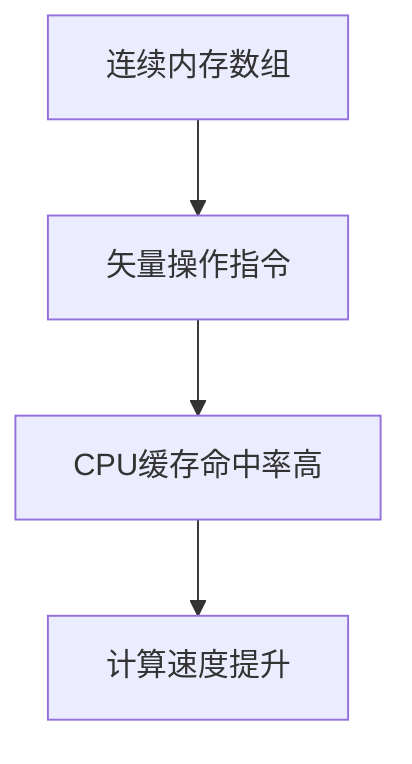
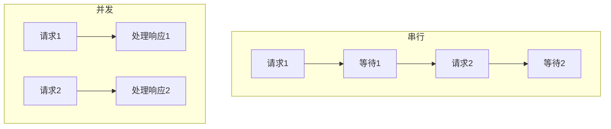

# 《Python高性能编程》

## 书籍信息

- **书名**：Python高性能编程
- **作者**：[美] Micha Gorelick, Ian Ozsvald
- **PDF 状态**：完整扫描版
- **OCR 状态**：可识别

## 全书核心主题

本书聚焦于如何提升Python代码的运行速度和内存效率。通过理解计算机底层架构、识别性能瓶颈、利用数据结构特性和并行计算，最终实现高性能的Python应用程序。

---

## 第1章：理解高性能Python

### 1. 核心论点

本章解决“Python代码为什么慢”以及“如何从根本上理解性能问题”的问题。作者认为高性能编程的核心是理解数据如何在底层硬件（CPU、内存、总线）上移动。

### 2. 关键概念

- **计算单元**：CPU/GPU，关注时钟速度和每周期指令数（IPC）。
- **存储单元**：L1/L2缓存、RAM、硬盘，速度与容量成反比。
- **通信层**：总线速度。
- **阿姆达尔定律**：并行计算的瓶颈在于其必须顺序执行的部分。
- **全局解释器锁(GIL)**：导致Python多线程无法利用多核优势。

### 3. 逻辑推演

从计算机的三大基本组件（计算、存储、连接）讲起，分析现代CPU的发展瓶颈（多核趋势）。通过一个简单的素数判断代码，对比了“理想计算模型”与“Python虚拟机”的实际执行差异，指出了动态类型、内存碎片和GIL是Python性能的主要障碍。

### 4. 经典金句

> “沉重数据的概念指的是移动数据需要花费时间，而这就是我们需要避免的。”

> “原生Python在性能上欠缺的功能会被迅速开发出来。”

---

## 第2章：通过性能分析找到瓶颈

### 1. 核心论点

本章解决“如何科学地找到代码慢的原因”的问题。作者强调必须基于性能分析数据进行优化，而非依靠直觉。

### 2. 关键概念

- **cProfile**：内置分析工具，提供函数级别的调用统计。
- **line_profiler**：逐行分析代码执行时间和调用次数。
- **memory_profiler**：诊断内存用量随时间的变化。
- **heapy**：调查堆上的对象数量和大小。
- **dis模块**：查看CPython字节码，了解底层执行逻辑。

### 3. 逻辑推演

以“Julia集合”计算为例，先使用`time`和`cProfile`确定耗时函数，再用`line_profiler`定位到具体的慢代码行（如`while`循环和`abs`函数）。通过修改代码（如交换条件顺序）验证性能提升。随后使用`memory_profiler`发现`range`导致的内存浪费，并改用`xrange`优化。

### 4. 经典金句

> “人有时候懒点比较好。先进行性能分析让你能够迅速定位需要被解决的瓶颈。”

> “优化应该总是基于性能分析的结果。”

---

## 第3章：列表和元组

### 1. 核心论点

本章解决如何选择和使用序列数据结构的问题。作者详细解释了列表（动态数组）和元组（静态数组）在内存分配和性能上的本质区别。

### 2. 关键概念

- **数组**：数据在内存中的连续存储。
- **O(1)索引**：知道起始位置，即可直接计算出任意元素的地址。
- **列表**：动态数组，支持`append`，会预分配额外空间（超额分配）以提高效率。
- **元组**：静态数组，不可变，非常轻量级。
- **超额分配公式**：`M = (N >> 3) + (N < 9 ? 3 : 6)`。

### 3. 逻辑推演

从数组的内存布局讲起，说明O(1)访问的原理。对比列表（可变）和元组（不可变）的设计哲学。通过分析列表`append`操作的内存分配策略，解释了为什么列表可以高效扩展而元组不行。最后通过初始化速度对比，展示了元组由于资源缓存机制而比列表快得多。

> 说明：该部分PDF识别可能不完整，部分细节未完全提取。

---

## 第4章：字典和集合

### 1. 核心论点

本章解决无序数据的快速查找问题。作者通过剖析散列表的工作原理，解释了字典和集合为何能实现O(1)的查询和插入。

### 2. 关键概念

- **散列表**：通过散列函数将键映射到内存地址。
- **负载因子**：散列表的填充程度（通常不超过2/3）。
- **散列冲突**：不同键产生相同散列值，通过“嗅探”解决。
- **熵**：衡量散列函数分布均匀程度的指标。
- **命名空间查找**：局部变量 > 全局变量 > 内置变量。

### 3. 逻辑推演

通过“电话簿查询”案例对比列表(O(n))和字典(O(1))的性能差异。深入讲解散列表的插入、查找和删除机制，以及散列冲突的解决。通过一个自定义的糟糕散列函数示例，证明了散列函数熵的重要性。最后，通过分析Python的命名空间管理，指出了如何通过将全局变量本地化来加速循环内的函数调用。

### 4. 经典金句

> “字典和集合使用散列表来获得 O(1) 的查询和插入。”

---

## 第5章：迭代器和生成器

### 1. 核心论点

本章解决大数据处理时的内存占用问题。作者认为生成器通过“延迟估值”机制，允许处理无限序列而无需一次性加载所有数据到内存。

### 2. 关键概念

- **迭代器**：实现`__iter__`和`__next__`方法的对象。
- **生成器**：使用`yield`的函数，返回一个迭代器。
- **延迟估值**：仅在需要时才计算下一个值。
- **itertools**：标准库中用于构建复杂迭代器的工具集。

### 3. 逻辑推演

对比`range`（返回列表）和`xrange`（返回生成器）的内存差异。通过“异常检测”的大数据分析案例，演示了如何使用生成器逐步读取文件、按天分组数据并过滤异常值，而无需将整个数据集加载到内存中。最后介绍了`itertools`模块（如`islice`, `groupby`）的使用。

### 4. 流程图（生成器流水线）

---

## 第6章：矩阵和矢量计算

### 1. 核心论点

本章解决数值计算中的性能瓶颈问题。作者指出，Python列表的内存碎片化是效率低下的根源，并介绍了`numpy`如何通过连续内存布局和矢量化操作解决这一问题。

### 2. 关键概念

- **内存碎片**：Python列表存储的是指针，数据分散在内存中。
- **numpy数组**：同质、连续内存，支持矢量化操作。
- **perf工具**：分析CPU缓存命中/失效、指令数、缺页错误。
- **就地操作**：`+=`等操作减少内存分配。
- **numexpr**：多核加速的矢量化表达式编译器。

### 3. 逻辑推演

从“2阶扩散方程”的纯Python实现开始，通过`line_profiler`发现内存分配是瓶颈。引入`numpy`后，通过`perf`分析发现缓存失效大幅降低。进一步优化，通过预分配数组和就地操作减少内存分配。最后，通过自定义`roll_add`函数（利用复杂索引）和`numexpr`，进一步榨取性能。

### 4. 流程图（NumPy矢量化示意）

---

## 第7章：编译成C

### 1. 核心论点

本章解决如何通过编译突破Python动态类型的性能限制。作者介绍了Cython、Numba、PyPy等多种工具，并指导何时使用哪种工具。

### 2. 关键概念

- **Cython**：Python与C的混合体，需类型注解，编译为C扩展。
- **Numba**：针对`numpy`代码的即时(JIT)编译器（装饰器`@jit`）。
- **PyPy**：替代CPython的解释器，内置JIT，对纯Python代码透明加速。
- **提前编译(AOT) vs 即时编译(JIT)**。
- **外部函数接口(FFI)**：`ctypes`, `cffi`, `f2py`。

### 3. 逻辑推演

以“Julia集合”为例，展示Cython通过添加类型注解（`cdef int i, double complex z`）将执行时间从11秒降至0.25秒。对比了Shed Skin（自动类型推断）和Numba（简单装饰器）的使用。最后讨论了PyPy作为透明替代品的优势，并提供了一个工具选择矩阵。

### 4. 经典金句

> “让你的代码运行得更快的最简单的办法就是让它做更少的工作。”

---

## 第8章：并发

### 1. 核心论点

本章解决I/O密集型任务的效率问题。作者认为，在I/O等待期间，通过并发（而非并行）可以执行其他计算，从而隐藏延迟。

### 2. 关键概念

- **并发 vs 并行**：并发是交替执行，并行是同时执行。
- **事件循环**：管理待执行任务的调度器。
- **回调 vs Future**：异步编程的两种模式。
- **Gevent**：基于协程（greenlet）和猴子补丁，使用简单。
- **Tornado**：基于回调的异步网络库。
- **AsyncIO**：Python 3.4+的标准异步库，使用`async/await`。

### 3. 逻辑推演

通过“Web爬虫”示例，展示了串行请求的高延迟。然后分别使用Gevent（通过信号量控制并发数）、Tornado（回调或协程）和Asyncio（`async/await`）重构爬虫，实现了显著的性能提升。

### 4. 流程图（并发请求处理）

---

# 