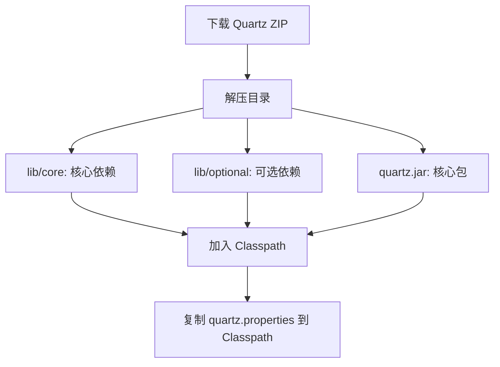
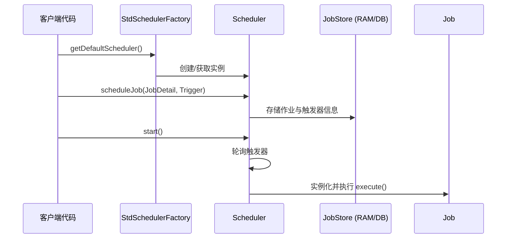
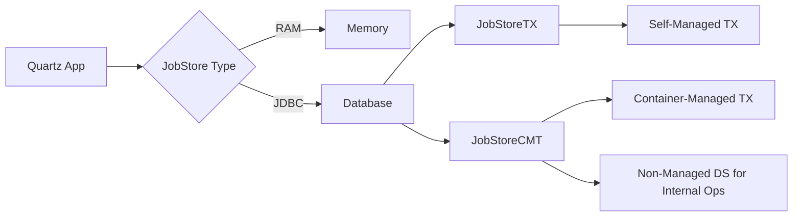
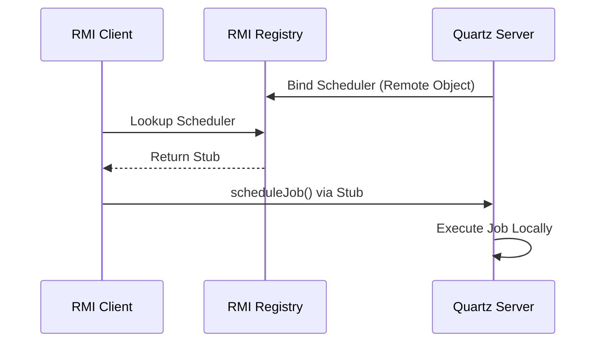
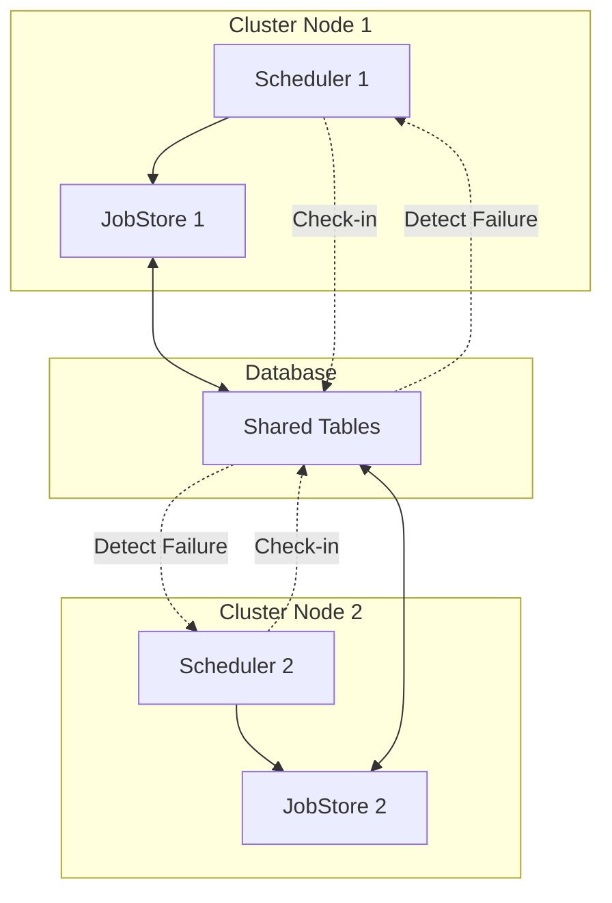

# 《Quartz Job Scheduling Framework 中文版》章节总结

## 书籍信息
- **书名**：Quartz Job Scheduling Framework 中文版 (基于原版 *Quartz Job Scheduling Framework* by Chuck Cavaness)
- **作者**：Chuck Cavaness (原著), Unmi (隔叶黄莺) (译者)
- **PDF 状态**：文本提取完整，结构清晰
- **OCR 状态**：高质量，无需大量修复
- **版本说明**：基于 Quartz 1.x 系列版本（文中多次提及 1.5/1.6），部分 API（如 `JobDetail`, `Trigger`）在 Quartz 2.x+ 中已有重大变更，阅读时需注意版本差异。

## 目录说明
- **目录识别情况**：完整识别，包含译者序、14个主章节及附录。
- **章节对应依据**：严格遵循提供的 PDF 文本结构。
- **OCR 修复说明**：代码块中的换行与缩进已根据 Java 语法规范进行逻辑重整，以确保可读性。

## 全书核心主题
本书是 Quartz 作业调度框架的经典入门与进阶指南。全书系统性地介绍了 Quartz 的核心概念、架构设计、配置方式以及高级特性。内容从基础的 Hello World 示例出发，深入讲解了 Scheduler（调度器）、Job（作业）、Trigger（触发器）三大核心组件的生命周期与交互机制。书中详细对比了内存存储（RAMJobStore）与持久化存储（JDBC JobStore）的区别与配置，阐述了集群环境下的高可用与负载均衡实现原理。此外，本书还涵盖了监听器、插件、RMI 远程调用、Web 应用集成以及与工作流引擎（OSWorkflow）的结合使用。对于希望构建稳定、可扩展的企业级定时任务系统的 Java 开发者而言，本书提供了从理论到实践的全方位指导。

---

## 写在最前面的（译者序）

### 核心论点
本章主要阐述译者翻译本书的初衷与收获。
作者认为：翻译过程不仅是对技术的二次深化理解，更是提升英文阅读与技术写作能力的有效途径。

### 关键概念/事件
- **技术精细化**：通过逐字翻译，迫使译者深入理解每一处技术细节，而非浅尝辄止。
- **社区互动**：译作发布后获得的反馈与答疑，进一步巩固了对 Quartz 的掌握。
- **能力跃迁**：从依赖词典到流畅阅读，翻译过程显著提升了技术文档的处理效率。

### 逻辑推演/叙事脉络
译者回顾了从 2007 年开始翻译的过程，指出最初因语言障碍和技术深度感到艰难。但随着坚持，发现翻译带来了两大好处：一是对 Quartz 技术把握更精细，因为必须理解透彻才能表达清楚；二是阅读与翻译速度大幅提升。译者感谢社区的支持与纠错，并说明了 CHM 文件的生成方式及其优缺点。

### 经典金句/数据
> “阅读可以是眼观六路，一知半解的，完全转换成中文就要字句斟酌... 本身未能理解个相当，何以能用中文向他人解译的清楚呢？”

---

## 第1章：企业应用中的作业调度

### 核心论点
本章主要讨论作业调度在企业应用中的重要性及其核心价值。
作者认为：作业调度通过自动化处理批量任务，显著提高了资源利用率，降低了人为错误，并提供了良好的伸缩性。

### 关键概念/事件
- **作业调度 (Job Scheduling)**：在预定时间自动执行后台任务（批处理），无需用户交互。
- **企业应用场景**：包括密码过期提醒、文件传输（FTP）、销售报表生成等。
- **替代方案对比**：对比了 JDK Timer、商业调度软件与 Quartz，指出 Quartz 在灵活性和功能上的优势。

### 逻辑推演/叙事脉络
首先定义什么是作业调度，回顾其从大型机时代的发展。接着分析为什么需要作业调度，列举了资源效率、错误率和伸缩性三个优点。随后通过三个典型企业场景（邮件提醒、文件传输、报表生成）展示其实际应用。最后简要区分作业调度与工作流的不同，并罗列了其他可选方案，引出 Quartz 的优势。

### 经典金句/数据
> “人之所以称之为人，因为我们犯错误的频度远高于电脑。”
> “随着业务流程复杂性的提升，自动化流程也更能显现出它的有益之处来。”

---

## 第2章：Quartz起步

### 核心论点
本章主要介绍 Quartz 框架的历史、下载、安装及社区资源。
作者认为：Quartz 从一个个人项目发展为成熟的开源框架，拥有活跃的社区和广泛的采用率，是 Java 领域作业调度的事实标准。

### 关键概念/事件
- **发展历程**：由 James House 于 1998 年构思，2001 年在 SourceForge 发布。
- **核心依赖**：Commons Logging, Commons Collections, Commons BeanUtils 等。
- **构建方式**：支持从二进制包直接引用 JAR，或通过 Maven/Ivy 管理，也可从源码构建。

### 逻辑推演/叙事脉络
介绍 Quartz 的起源和发展里程碑。指导读者如何下载发行版，解压目录结构（docs, examples, lib）。详细说明如何将必要的 JAR 包加入 Classpath，并强调版本冲突的风险。最后介绍如何从 CVS 获取源码并使用 Ant 构建，以及社区论坛和资源的重要性。

### 流程图/图表处理



---

## 第3章：Hello Quartz

### 核心论点
本章主要通过实例演示如何创建、调度和部署一个简单的 Quartz 作业。
作者认为：Quartz 的使用可以通过编程式（代码配置）和声明式（XML/Properties 配置）两种方式实现，推荐在复杂系统中使用声明式以解耦配置与代码。

### 关键概念/事件
- **Job 接口**：所有作业必须实现 `org.quartz.Job` 接口及 `execute` 方法。
- **JobDetail**：定义作业的实例属性，如名称、组、关联的 Job 类及 JobDataMap。
- **Trigger**：定义作业执行的时间表，主要类型有 SimpleTrigger 和 CronTrigger。
- **Scheduler**：调度器核心，负责注册 JobDetail 和 Trigger，并启动调度。

### 逻辑推演/叙事脉络
首先创建一个简单的 `ScanDirectoryJob`，实现 Job 接口。接着展示如何通过 `StdSchedulerFactory` 获取 Scheduler 实例。然后分两部分讲解调度：
1. **编程式**：在代码中创建 JobDetail 和 SimpleTrigger，设置参数，调用 `scheduler.scheduleJob`。
2. **声明式**：配置 `quartz.properties` 启用 `JobInitializationPlugin`，编写 `quartz_jobs.xml` 定义 Job 和 Trigger。
最后讨论打包应用时的依赖管理。

### 流程图/图表处理



### 经典金句/数据
> “Quartz Application 指代任何使用到 Quartz 框架的软件程序... Quartz Job 是指执行一些作业的特定的 Java 类。”

---

## 第4章：部署 Job

### 核心论点
本章深入探讨 Quartz 的核心组件及其生命周期管理。
作者认为：理解 Scheduler、JobDetail、Trigger、JobDataMap 以及线程模型是掌握 Quartz 的关键，特别是状态保持（StatefulJob）与并发控制机制。

### 关键概念/事件
- **SchedulerFactory**：`DirectSchedulerFactory`（编程配置）与 `StdSchedulerFactory`（配置文件）。
- **JobDataMap**：用于在 Job 实例间传递参数和状态。
- **StatefulJob**：有状态作业，禁止并发执行，且 JobDataMap 的修改会持久化。
- **Calendar**：用于排除特定时间段（如节假日），不与 Trigger 混淆。
- **线程模型**：`QuartzSchedulerThread` 为主线程，工作者线程池执行具体 Job。

### 逻辑推演/叙事脉络
详细介绍 Scheduler 的创建、启动、暂停（Standby）和关闭。解析 JobDetail 的作用，强调 Job 实例每次执行都是新建的，因此无状态。引入 JobDataMap 传递数据。对比无状态 Job 与有状态 Job（StatefulJob）的区别，重点说明有状态 Job 的串行执行特性。介绍 InterruptableJob 用于中断长时间运行的任务。最后简述 Java 线程基础及 Quartz 内部的线程池工作机制。

### 流程图/图表处理

```mermaid
graph TD
    subgraph Scheduler Lifecycle
    A[New] -->|start()| B[Started]
    B -->|standby()| C[Standby]
    C -->|start()| B
    B -->|shutdown()| D[Shutdown]
    end
    
    subgraph Job Execution
    E[Trigger Fires] --> F[Get Worker Thread]
    F --> G[Instantiate Job]
    G --> H[Execute Job]
    H --> I[Update Trigger/Job State]
    I --> F
    end
```

---

## 第5章：Cron触发器及相关内容

### 核心论点
本章专门讲解 CronTrigger 及其表达式语法。
作者认为：CronTrigger 提供了比 SimpleTrigger 更强大的日历级调度能力，适用于复杂的周期性任务（如“每月最后一个周五”）。

### 关键概念/事件
- **Cron 表达式**：由 7 个子表达式组成（秒、分、时、日、月、周、年）。
- **特殊字符**：`*` (所有), `?` (不指定), `-` (范围), `,` (列表), `/` (递增), `L` (最后), `W` (工作日), `#` (第几个周几)。
- **TriggerUtils**：工具类，简化 Trigger 的创建（如 `makeDailyTrigger`）。

### 逻辑推演/叙事脉络
回顾 Unix Cron 的历史。详细解析 Quartz Cron 表达式的 7 个域及其允许值和特殊字符含义，通过大量示例（Cookbook）展示常见写法的意义。介绍如何设置 Start/End Time 限制 Trigger 的有效区间。展示如何在 XML 配置中使用 CronTrigger。最后介绍如何使用 TriggerUtils 快速创建常用 Trigger。

### 经典金句/数据
> “?号只能用在日和周域上，但是不能在这两个域上同时使用。”
> “L说明了某域上允许的最后一个值... W字符代表着平日(Mon-Fri)。”

---

## 第6章：Job存储和持久化

### 核心论点
本章讨论 Quartz 的数据存储机制，重点在于持久化配置。
作者认为：生产环境应使用 JDBC JobStore（JobStoreTX 或 JobStoreCMT）以实现作业信息的持久化和集群支持，而 RAMJobStore 仅适用于测试或非持久化场景。

### 关键概念/事件
- **RAMJobStore**：内存存储，速度快但重启丢失数据，不支持集群。
- **JDBC JobStore**：基于数据库存储，支持持久化和集群。
- **JobStoreTX**：独立事务管理，适用于非 J2EE 容器环境。
- **JobStoreCMT**：容器管理事务，适用于 J2EE/EJB 环境，需配置两个数据源。
- **DriverDelegate**：针对不同数据库方言的代理类。

### 逻辑推演/叙事脉络
对比 RAMJobStore 和 JDBC JobStore 的优劣。详细介绍 JDBC JobStore 所需的 12 张数据库表结构。分步讲解配置 JobStoreTX：选择 DriverDelegate，配置数据源（Driver, URL, User, Password），设置表前缀。接着讲解 JobStoreCMT 的特殊配置，特别是 Non-Managed TX DataSource 的作用。最后提及性能优化建议（索引）和自定义 JobStore 的可能性。

### 流程图/图表处理



---

## 第7章：实现 Quartz监听器

### 核心论点
本章介绍 Quartz 的扩展点——监听器机制。
作者认为：通过实现 JobListener、TriggerListener 和 SchedulerListener，可以在不修改核心代码的情况下，对作业生命周期事件进行监控、日志记录或动态干预。

### 关键概念/事件
- **全局 vs 非全局监听器**：全局监听所有事件，非全局仅监听特定 Job/Trigger。
- **JobListener**：监听 `jobToBeExecuted`, `jobWasExecuted` 等。
- **TriggerListener**：监听 `triggerFired`, `vetoJobExecution` (可否决执行) 等。
- **SchedulerListener**：监听调度器级别事件，如 Job 添加/删除、错误发生。
- **FileScanListener**：专门用于监测文件变化的监听器。

### 逻辑推演/叙事脉络
定义监听器作为扩展点的概念。分别详细介绍三种监听器接口的方法及其调用时机。通过代码示例展示如何实现一个简单的 Listener，并演示如何将其注册为全局或非全局监听器。特别指出 TriggerListener 中的 `vetoJobExecution` 可用于动态取消作业执行。最后介绍 FileScanJob 与 FileScanListener 的配合使用，以及在 XML 中声明监听器的方法。

### 经典金句/数据
> “全局监听器是主动意识的... 非全局监听器一般是被动意识的... 更适合于修改或增加 Job 执行的工作。”

---

## 第8章：使用 Quartz插件

### 核心论点
本章讲解如何通过插件机制扩展 Quartz 功能。
作者认为：插件提供了比监听器更高级的初始化钩子，适合用于加载外部配置、初始化资源或在调度器启动/关闭时执行特定逻辑。

### 关键概念/事件
- **SchedulerPlugin 接口**：包含 `initialize`, `start`, `shutdown` 三个生命周期方法。
- **JobInitializationPlugin**：内置插件，从 XML 文件加载 Job 定义。
- **LoggingJobHistoryPlugin**：内置插件，记录作业执行历史日志。
- **ShutdownHookPlugin**：注册 JVM 关闭钩子，确保优雅关闭。

### 逻辑推演/叙事脉络
介绍 Plugin 接口的三个方法及其调用时机。展示如何创建一个自定义插件（如从目录加载多个 Job XML 文件的 `JobLoaderPlugin`）。详细说明在 `quartz.properties` 中配置插件的格式（`org.quartz.plugin.NAME.class`）及参数传递机制。介绍如何处理多个插件的加载顺序问题（ParentPlugin 模式）。最后罗列并解释几个常用的内置插件及其配置。

---

## 第9章：使用 Quartz的远程方式

### 核心论点
本章介绍如何通过 RMI 实现 Quartz 的远程调度。
作者认为：RMI 允许将 Quartz Scheduler 暴露为远程服务，使得分布式系统中的其他节点可以远程部署、管理和触发作业，实现了调度中心与执行节点的分离。

### 关键概念/事件
- **RMI 架构**：Registry, Server (Export), Client (Proxy)。
- **服务端配置**：`org.quartz.scheduler.rmi.export=true`，配置 Registry 主机/端口。
- **客户端配置**：`org.quartz.scheduler.rmi.proxy=true`，指向远程 Registry。
- **安全性**：需配置 `RMISecurityManager` 和安全策略文件。

### 逻辑推演/叙事脉络
简述 RMI 基本原理。分步指导配置 Quartz RMI 服务端：修改 properties 文件开启 export，设置 SecurityManager，启动 Server。接着指导配置客户端：设置 proxy 为 true，指向服务端 Registry。展示客户端代码如何像本地一样获取 Scheduler 并部署 Job。最后说明测试方法及注意事项（如 instanceName 必须一致）。

### 流程图/图表处理



---

## 第10章：J2EE中使用 Quartz

### 核心论点
本章探讨 Quartz 在 J2EE 环境下的集成策略。
作者认为：Quartz 既可作为独立的 J2SE 客户端调用 EJB，也可部署在 Web 容器中利用容器资源。选择取决于对事务管理、资源访问及部署复杂度的需求。

### 关键概念/事件
- **J2SE 客户端模式**：独立运行，通过 JNDI 调用 EJB 或发送 JMS 消息。使用 `EJBInvokerJob`。
- **Web 容器部署**：作为 WAR 部署，使用 `QuartzInitializerServlet` 或 `ServletContextListener` 初始化。
- **EJBInvokerJob**：内置 Job，用于反射调用 EJB 方法。
- **事务集成**：在容器内可使用 JobStoreCMT 参与全局事务。

### 逻辑推演/叙事脉络
首先讨论为什么在已有 J2EE 定时器服务下还需要 Quartz（灵活性、复杂性）。介绍两种部署模型：
1. **外部 J2SE 客户端**：简单，隔离性好，通过 `EJBInvokerJob` 调用远程 EJB。
2. **内部 Web 应用**：集成度高，可利用容器数据源和 Mail Session。通过 `QuartzInitializerServlet` 在 Web 启动时初始化 Scheduler。
详细展示 `web.xml` 配置及 `EJBInvokerJob` 的参数设置（JNDI Name, Method, Args 等）。

---

## 第11章：Quartz集群

### 核心论点
本章详解 Quartz 集群的配置与工作原理。
作者认为：集群通过共享数据库实现高可用（故障转移）和负载均衡（随机竞争），是大规模生产环境的必备特性，但需注意时钟同步和数据库锁性能。

### 关键概念/事件
- **集群原理**：节点间不直接通信，通过数据库表（QRTZ_SCHEDULER_STATE）检入（Check-in）来感知彼此状态。
- **故障转移**：当节点宕机，其他节点检测到检入超时，接管其未完成的 Recoverable Jobs。
- **负载均衡**：基于数据库锁的竞争机制，随机分配触发权。
- **配置要点**：`isClustered=true`，相同的 `instanceName`，唯一的 `instanceId`（推荐 AUTO）。

### 逻辑推演/叙事脉络
定义集群及其带来的高可用性和伸缩性好处。解释 Quartz 集群的独特架构（基于 DB 感知）。详细列出配置步骤：统一 instanceName，唯一 instanceId，启用 isClustered，配置 clusterCheckinInterval。讨论运行时行为：节点启动、检入、故障检测与恢复。最后提供 Cookbook，解答常见问题（如时钟同步、特定节点执行、非集群与集群混用禁忌）。

### 流程图/图表处理



---

## 第12章：Quartz Cookbook

### 核心论点
本章提供一系列常见场景的代码片段和解决方案。
作者认为：通过具体的代码示例，可以快速解决开发中遇到的典型问题，如动态更新 Job、列出所有作业、单次触发等。

### 关键概念/事件
- **动态更新 Job**：使用 `scheduler.addJob(jobDetail, true)` 替换现有 Job。
- **单次触发**：使用 `TriggerUtils.makeImmediateTrigger(0, 0)`。
- **列出作业**：遍历 `scheduler.getJobGroupNames()` 和 `getJobNames()`。
- **参数化 Job**：通过 JobDataMap 传递配置，避免硬编码。

### 逻辑推演/叙事脉络
以食谱形式罗列多个独立的小节。每节针对一个具体问题（如“如何停止 Scheduler”、“如何触发一次”、“如何替换已部署的 Job”），提供简短的背景说明和核心代码片段。重点展示了如何利用 JobDataMap 使 Job 更具通用性，以及如何通过 API 动态管理 Scheduler 中的元数据。

---

## 第13章：Quartz和 Web应用

### 核心论点
本章指导如何将 Quartz 集成到 Web 应用程序中。
作者认为：通过 `QuartzInitializerServlet` 或 `ServletContextListener`，可以在 Web 容器启动时自动初始化 Scheduler，并通过 Web 界面提供友好的作业管理功能。

### 关键概念/事件
- **QuartzInitializerServlet**：内置 Servlet，负责在 Web 启动时创建 Scheduler 并存入 ServletContext。
- **ServletContextListener**：替代方案，更轻量，手动控制初始化与销毁。
- **ActionUtil**：辅助类，方便在 Struts 等框架中从 Request/Session 获取 Scheduler。
- **Quartz Web App**：官方提供的示例 Web 应用，用于管理 Job/Trigger。

### 逻辑推演/叙事脉络
介绍 Web 集成的必要性（GUI 管理）。详细说明 `QuartzInitializerServlet` 的配置（web.xml 中的 init-params：config-file, shutdown-on-unload, start-scheduler-on-load）。解释 Scheduler 工厂如何存储在 ServletContext 中以便后续访问。介绍替代方案 `ServletContextListener`。最后简要介绍官方的 Quartz Web 管理应用的下载、构建和功能概览。

---

## 第14章：工作流中使用 Quartz

### 核心论点
本章探讨 Quartz 与工作流引擎（OSWorkflow）的集成。
作者认为：Quartz 擅长时间调度，OSWorkflow 擅长流程状态流转。两者结合，可以用 Quartz 触发工作流的启动，从而实现基于时间的复杂业务流程自动化。

### 关键概念/事件
- **Job 串联 vs 工作流**：Job 串联是简单的线性调用，缺乏状态管理；工作流提供状态机、条件分支和持久化。
- **OSWorkflow**：开源工作流引擎，基于 XML 定义流程。
- **集成模式**：Quartz Job 作为触发器，调用 OSWorkflow API 启动流程实例。
- **FunctionProvider**：OSWorkflow 中的执行单元，替代 Quartz Job 的业务逻辑。

### 逻辑推演/叙事脉络
首先澄清 Job 串联不等于工作流。介绍 OSWorkflow 的基本概念（Steps, Actions, Functions）。展示如何定义一个简单的工作流 XML。重点讲解集成点：创建一个特殊的 Quartz Job (`WorkflowJob`)，它从 JobDataMap 读取工作流名称，调用 OSWorkflow 引擎启动流程。业务逻辑从 Quartz Job 迁移到 OSWorkflow 的 FunctionProvider 中。最后总结这种分离带来的好处：调度与业务逻辑解耦。

### 流程图/图表处理


---

## 附录 A：Quartz配置参考

### 核心论点
本章是 Quartz 配置属性的速查手册。
作者认为：集中罗列所有可用的配置项及其默认值，有助于开发者快速查阅和调试 `quartz.properties` 文件。

### 关键概念/事件
- **Scheduler 属性**：instanceName, instanceId, threadName 等。
- **ThreadPool 属性**：class, threadCount, threadPriority 等。
- **JobStore 属性**：class, driverDelegateClass, dataSource, tablePrefix, isClustered 等。
- **DataSource 属性**：driver, URL, user, password, maxConnections 等。
- **Plugin/Listener 属性**：动态配置插件和监听器的类及参数。

### 逻辑推演/叙事脉络
按模块分类列出配置属性表格。每个表格包含属性名、是否必须、类型、默认值和描述。涵盖 Scheduler 核心、线程池、RMI、JobStore (TX/CMT)、数据源、插件和监听器。特别强调了集群和数据源配置的细节。

### 经典金句/数据
> “org.quartz.jobStore.isClustered: 设置为 true 打开集群特性。如果你有多个 Quartz 实例在用同一套数据库时，这个属性就必须设置为 true。”