# 《Rust编程之道》章节总结

## 书籍信息
- **书名**：Rust编程之道
- **作者**：张汉东
- **PDF 状态**：完整（分为 part1 和 part2，内容连续）
- **OCR 状态**：可识别文本层，部分图表需重建

## 目录说明
- **目录识别情况**：完整识别第1章至第13章及附录A、B
- **章节对应依据**：基于PDF原始页码和文本层
- **OCR 修复说明**：无显著错漏，部分图表逻辑已通过 Mermaid 重建

## 全书核心主题
本书从Rust语言的设计哲学出发，系统阐述了Rust的内存安全、零成本抽象和实用性三大设计原则。通过深入类型系统、所有权机制、内存管理、并发安全、模块化编程、元编程等核心内容，帮助读者建立对Rust语言的系统性认知。书中强调Rust并非简单堆砌特性，而是通过高度一致的类型系统和所有权模型，有机融合了面向对象、函数式和泛型编程范式，最终实现内存安全与高性能的统一。

---

## 第1章：新时代的语言

### 1. 核心论点
本章回答“Rust为什么诞生”以及“Rust的核心设计哲学是什么”的问题。作者认为：Rust是一门追求安全、并发和性能的现代系统级编程语言，其设计哲学是内存安全、零成本抽象和实用性。

### 2. 关键概念
- **内存安全**：通过所有权系统、借用和生命周期，在编译期杜绝空指针、悬垂指针、缓冲区溢出等内存错误。
- **零成本抽象**：通过泛型和trait实现抽象，且抽象在编译期展开为底层代码，无运行时开销。
- **实用性**：Rust具备工业级产品开发能力，提供Cargo包管理器、友好的错误信息、混合编程范式等。

### 3. 逻辑推演
- 从C/C++的历史难题（内存不安全、线程不安全）引出Rust的诞生背景。
- 介绍Graydon Hoare对Rust的期望：安全、无GC、特性一致性。
- 提出三条设计哲学，并分别阐述其在语言架构中的体现。
- 说明Rust语言架构分为安全内存管理层、类型系统层、所有权系统层和混合编程范式层。
- 展望Rust的发展前景和社区现状。

### 4. 经典金句
> “未来的互联网除了关注性能，还一定会高度关注安全性和并发性。” (p.27)

> “Rust是一门哲学内涵丰富的编程语言。通过了解Rust遵循什么样的设计哲学，就可以系统地掌握这门语言的核心。” (p.26)

---

## 第2章：语言精要

### 1. 核心论点
本章解决“Rust的基本语法构成是什么”的问题。作者核心观点：Rust是一门表达式语言，一切皆表达式，掌握表达式的求值机制是理解Rust语法的基础。

### 2. 关键概念
- **语句与表达式**：语句分为声明语句和表达式语句；表达式总是返回值，分号结尾时返回单元值()。
- **变量与绑定**：let创建不可变绑定，mut创建可变绑定；所有权转移（move）和复制（copy）的区别。
- **函数与闭包**：fn定义函数，函数指针fn类型，闭包可捕获环境变量。
- **模式匹配**：match、if let、while let等表达式。
- **基本数据类型**：布尔、数字、字符、数组、切片、字符串、原生指针、never类型。
- **复合数据类型**：元组、结构体（具名、元组、单元）、枚举体。

### 3. 逻辑推演
- 从语句和表达式入手，说明Rust的表达式求值机制。
- 依次介绍变量、函数、闭包、流程控制、基本类型、复合类型、集合类型、智能指针、泛型和trait、错误处理等语法要素。
- 强调Rust的类型安全和内存安全在语法层面的体现（如数组越界编译报错、Option消除空指针）。

### 4. 经典金句
> “Rust中的语法可以分成两大类：语句和表达式。语句是指要执行的一些操作和产生副作用的表达式。表达式主要用于计算求值。” (p.38)

> “当分号后面什么都没有时自动补单元值()的特点，我们可以将Rust中的语句看作计算结果均为()的特殊表达式。” (p.39)

---

## 第3章：类型系统

### 1. 核心论点
本章解决“Rust的类型系统如何保证内存安全和抽象能力”的问题。作者认为：类型系统是Rust安全基石的“法律”，trait是Rust实现零成本抽象的基石。

### 2. 关键概念
- **类型系统的作用**：排查错误、抽象、文档、优化效率、类型安全、内存安全。
- **类型大小**：Sized类型、DST（动态大小类型）、ZST（零大小类型）、底类型（!）。
- **泛型**：参数化多态，编译期单态化，零成本抽象。
- **trait**：接口抽象、泛型约束、抽象类型（trait对象和impl Trait）、标签trait（Sized、Copy、Send、Sync）。
- **类型转换**：Deref解引用、as操作符、From/Into。

### 3. 逻辑推演
- 从通用概念（类型系统分类、多态形式）出发。
- 介绍Rust类型系统概述（类型大小、类型推导）。
- 深入泛型和trait，展示trait的四种用法。
- 讲解类型转换的机制。
- 指出当前trait系统的不足（孤儿规则局限性、代码复用效率、抽象表达能力）。

### 4. 流程图

#### Rust概念层次结构
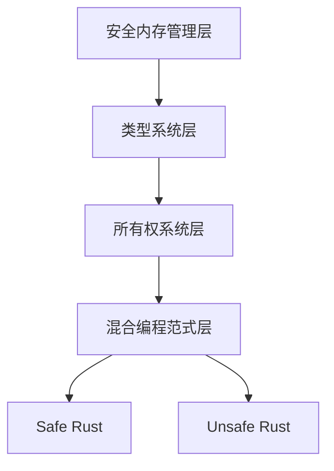

#### trait 对象结构
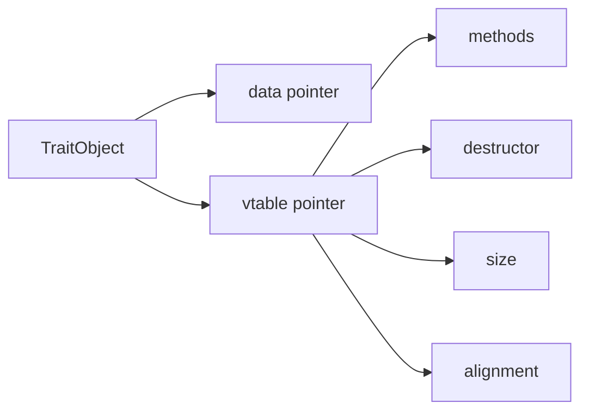

### 5. 经典金句
> “trait是Rust的灵魂。Rust中所有的抽象，比如接口抽象、OOP范式抽象、函数式范式抽象等，均基于trait来完成。” (p.87)

> “类型安全的语言还可以保证内存安全，避免诸如空指针、悬垂指针和缓存区溢出导致的内存安全问题。” (p.77)

---

## 第4章：内存管理

### 1. 核心论点
本章解决“Rust如何在没有GC的情况下实现内存安全”的问题。作者认为：Rust通过栈默认分配、智能指针（Box<T>）和RAII机制，结合所有权系统，实现自动、确定性的内存管理。

### 2. 关键概念
- **栈与堆**：栈存储函数调用信息，自动分配释放；堆存储动态数据，需要手动或自动管理。
- **内存布局与对齐**：基本类型自然对齐，结构体按最大成员对齐。
- **RAII**：资源获取即初始化，通过析构函数（Drop trait）自动释放资源。
- **智能指针**：Box<T>、Rc<T>、RefCell<T>等，实现Deref和Drop。
- **内存泄漏 vs 内存安全**：内存泄漏不属于内存安全范畴，Rust允许但不会轻易造成内存泄漏。

### 3. 逻辑推演
- 对比手动内存管理（C/C++）和自动GC的优缺点。
- 解释栈和堆的工作原理及内存对齐规则。
- 展示Rust中变量初始化检查、所有权转移导致的未初始化变量。
- 引入智能指针和RAII，说明Box<T>如何自动释放堆内存。
- 通过循环引用示例展示内存泄漏，并解释Weak<T>解决方式。
- 强调内存安全的定义（不包括内存泄漏）。

### 4. 流程图

#### 函数调用栈帧
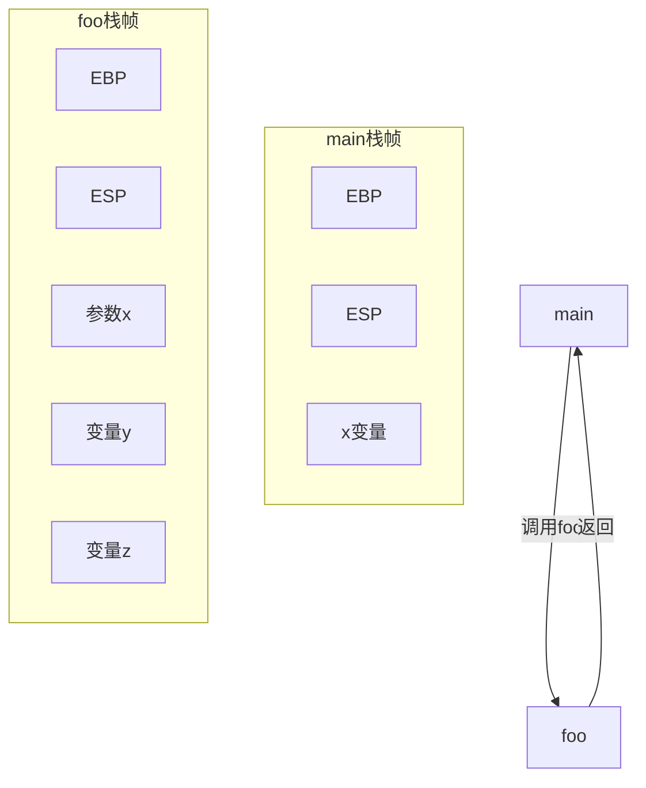

#### 循环引用导致内存泄漏
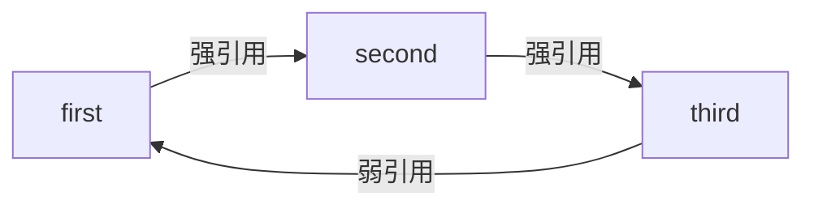

### 5. 经典金句
> “Rust中的变量必须初始化以后才可使用，否则无法通过编译器检查。” (p.139)

> “内存泄漏并不在内存安全概念范围内。Rust保证不出现空指针和悬垂指针、没有缓冲区溢出、不能访问未定义内存。” (p.139)

---

## 第5章：所有权系统

### 1. 核心论点
本章解决“所有权机制如何实现内存安全和并发安全”的问题。作者认为：所有权系统是Rust内存管理的“法律”，每个值有唯一所有者，通过移动语义、借用和生命周期参数保证安全。

### 2. 关键概念
- **所有权**：每个值有唯一所有者，所有者负责释放资源；所有权可转移（move）或借用（borrow）。
- **复制语义 vs 移动语义**：实现Copy的类型按位复制，未实现Copy的类型默认移动。
- **借用规则**：共享不可变（&T），可变不共享（&mut T）；借用的生命周期不能长于出借方。
- **生命周期参数**：显式标注引用生命周期，防止悬垂指针；'static静态生命周期。
- **智能指针与所有权**：Rc<T>共享所有权，RefCell<T>内部可变性，Cow<T>写时复制。

### 3. 逻辑推演
- 从值语义和引用语义区分开始，引入Copy trait。
- 解释所有权转移（move）和复制（copy）的底层机制。
- 详细说明借用规则及借用检查器的作用。
- 引入生命周期参数，讲解显式标注、省略规则和静态生命周期。
- 展示智能指针（Rc、RefCell、Cow）如何扩展所有权模型。
- 介绍Send和Sync标签trait保证并发安全。
- 讨论NLL（非词法作用域生命周期）改进。

### 4. 流程图

#### 所有权转移
```mermaid
graph LR
    x[Box::new(5)] -->|所有权转移| y[let y = x]
    style x fill:#f9f,stroke:#333
    style y fill:#9f9,stroke:#333
```

#### 借用规则（读写锁模型）
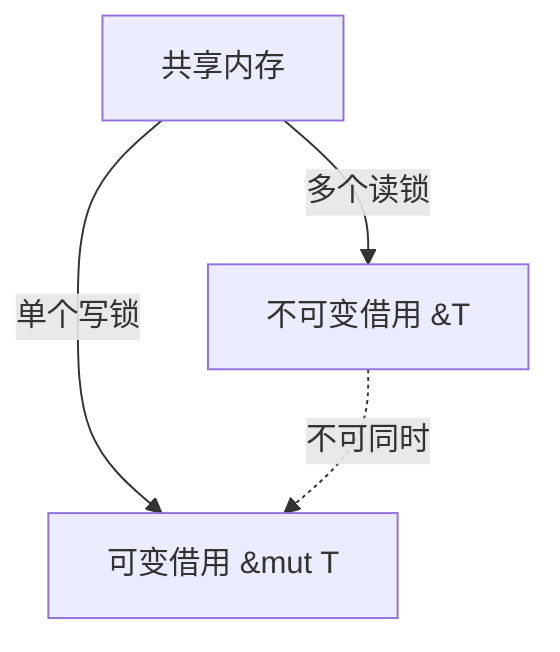

### 5. 经典金句
> “所有权系统让每个值都有了明确的权属界限，它们的行为也有了明确的权属界限，这样内存安全就有了基本的保障。” (p.144)

> “共享不可变，可变不共享。” (p.158)

---

## 第6章：函数、闭包与迭代器

### 1. 核心论点
本章解决“Rust如何支持函数式编程范式”的问题。作者认为：函数是一等公民，闭包是捕获环境变量的匿名函数，迭代器是惰性计算的高效抽象，三者共同体现Rust的零成本抽象。

### 2. 关键概念
- **函数**：fn定义，支持泛型、模式匹配、高阶函数（函数作为参数/返回值）。
- **闭包**：捕获环境变量，实现Fn/FnMut/FnOnce trait，底层为匿名结构体。
- **迭代器**：Iterator trait，惰性求值，消费器和适配器模式。
- **高阶函数**：以函数为参数或返回值的函数。

### 3. 逻辑推演
- 从函数定义、参数模式匹配、返回值、泛型函数讲起。
- 区分方法与函数。
- 通过高阶函数示例展示函数指针和闭包的区别。
- 深入闭包的实现原理（三个Fn trait + 匿名结构体）。
- 讲解迭代器 trait、迭代器适配器（map、filter等）和消费器（collect、sum等）。
- 展示如何自定义迭代器。

### 4. 流程图

#### 闭包实现原理
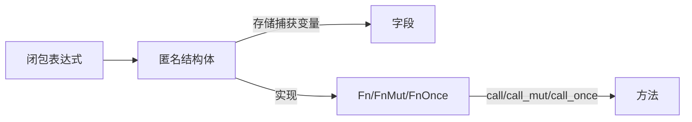

#### 迭代器惰性计算


### 5. 经典金句
> “闭包是一种语法糖。闭包和普通函数的差别就是闭包可以捕获环境中的自由变量。” (p.198)

> “Rust中的函数是一等公民，这意味着函数自身就可以作为函数的参数和返回值使用。” (p.44)

---

## 第7章：结构化编程

### 1. 核心论点
本章解决“Rust如何支持面向对象风格的编程”的问题。作者认为：Rust通过结构体、枚举体、trait和方法来模拟OOP，遵循组合优于继承的原则，并提供了建造者模式、访问者模式等经典设计模式。

### 2. 关键概念
- **结构体**：具名结构体、元组结构体、单元结构体，通过impl实现方法。
- **枚举体**：无参数枚举、类C枚举、带参数枚举，是代数数据类型的基础。
- **析构顺序**：Drop trait，RAII机制。
- **设计模式**：建造者模式、访问者模式、RAII模式。

### 3. 逻辑推演
- 展示如何定义结构体和实现方法（&self、&mut self）。
- 介绍枚举体的三种形式及其应用（如Option<T>）。
- 讲解析构函数Drop的执行顺序和drop flag。
- 通过示例实现建造者模式（链式调用）、访问者模式（trait对象）、RAII模式（智能指针）。

### 4. 流程图

#### 建造者模式
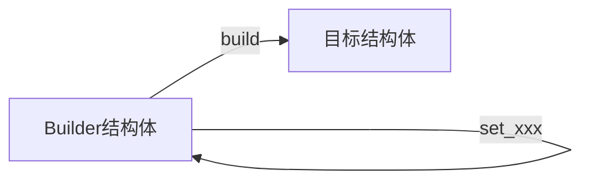

### 5. 经典金句
> “Rust中并没有传统面向对象语言中的继承的概念。Rust通过trait将类型和行为明确地进行了区分，充分贯彻了组合优于继承和面向接口编程的编程思想。” (p.70)

---

## 第8章：字符串与集合类型

### 1. 核心论点
本章解决“Rust中字符串和集合类型的设计与使用”的问题。作者认为：出于内存安全考虑，Rust将字符串分为&str和String；集合类型（Vec、HashMap等）注重性能和容量管理。

### 2. 关键概念
- **字符编码**：UTF-8，Rust字符串是有效的UTF-8字节序列。
- **字符串类型**：&str（字符串切片）和String（可增长字符串）。
- **字符串操作**：修改、查找（contains、find、matches等）、转换。
- **集合类型**：Vec<T>（动态数组）、VecDeque、LinkedList、HashMap、BTreeMap、HashSet、BTreeSet、BinaryHeap。
- **容量**：capacity与len的区别，理解环形缓冲区的逻辑容量。

### 3. 逻辑推演
- 从字符编码讲起，说明Rust中char（4字节）和字符串UTF-8的关系。
- 区分&str（不可变、可静态）和String（可变、堆分配）。
- 介绍字符串的查找方法（Pattern trait）和正则表达式支持。
- 依次介绍各种集合类型的特点和常用操作。
- 深入HashMap的实现原理（SipHash、开放定址法、罗宾汉算法）。
- 通过VecDeque的CVE漏洞说明理解容量的重要性。

### 4. 流程图

#### HashMap插入过程
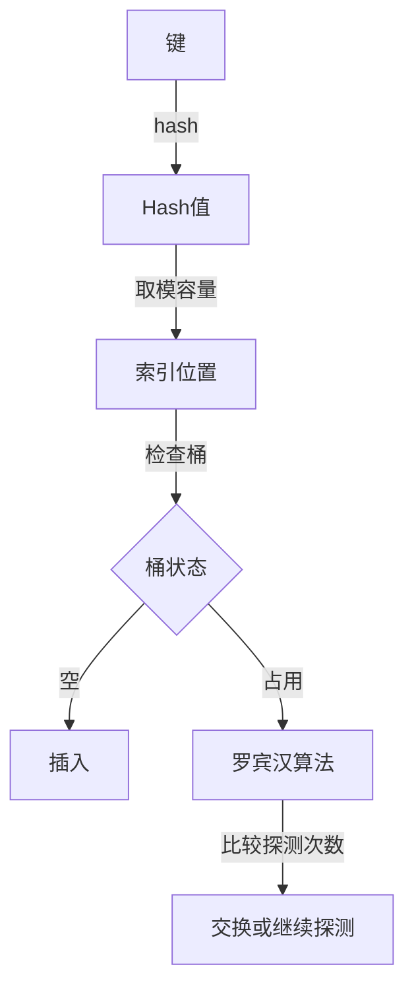

### 5. 经典金句
> “Rust出于内存安全的考虑，将字符串划分为几种相互配对的类型，其中最常用的是&str和String。” (p.270)

> “Rust虽然可以保证内存安全，但无法保证逻辑安全。” (p.292)

---

## 第9章：构建健壮的程序

### 1. 核心论点
本章解决“Rust如何通过错误处理机制构建健壮系统”的问题。作者认为：Rust将非正常情况分为失败、错误和异常，通过断言、Option<T>和Result<T,E>分层处理，消除空指针并提供编译期安全检查。

### 2. 关键概念
- **失败**：违反契约，使用断言（assert!、debug_assert!）快速失败。
- **错误**：可合理解决的问题，使用Option<T>（有/无）和Result<T,E>（正常/错误）。
- **异常**：不可预料的问题，使用恐慌（panic!）和catch_unwind。
- **组合子**：map、and_then、unwrap_or等用于优雅处理Option/Result。
- **问号操作符**：简化错误传播的语法糖。
- **第三方库**：failure库提供工程化错误处理。

### 3. 逻辑推演
- 区分失败、错误、异常三类非正常情况。
- 展示断言消除失败，以及panic!快速失败。
- 详细介绍Option<T>的使用和组合子方法（map、and_then）。
- 详细介绍Result<T,E>的使用，包括自定义错误类型、问号操作符。
- 展示main函数返回Result和catch_unwind捕获恐慌。
- 引入failure库统一错误处理。

### 4. 流程图

#### 分层错误处理
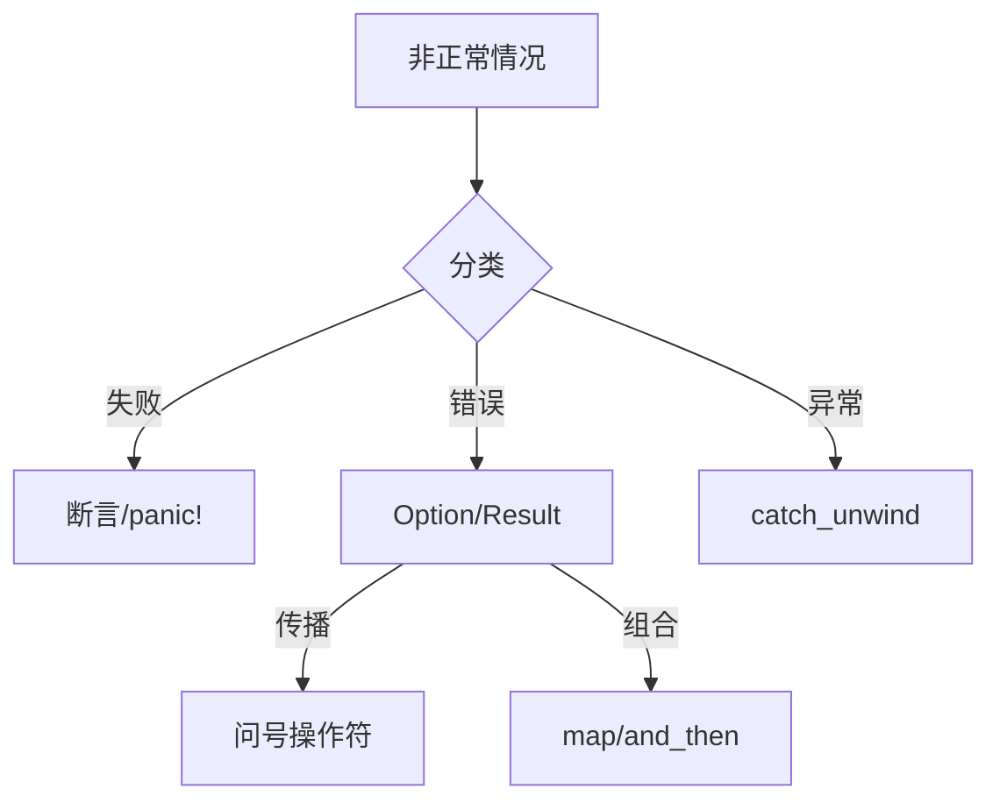

### 5. 经典金句
> “Rust并不提供传统语言的异常处理机制，而是从函数式语言中借鉴了基于返回值的错误处理机制。” (p.319)

> “对于开发者来说，真正的快乐不仅仅是写代码时的‘酸爽’，更应该是代码部署到生产环境之后的‘安稳’。” (p.9)

---

## 第10章：模块化编程

### 1. 核心论点
本章解决“Rust如何组织代码和依赖管理”的问题。作者认为：Cargo是Rust的包管理利器，模块系统与文件系统映射，通过pub控制可见性，实现模块化编程。

### 2. 关键概念
- **Cargo**：包管理器，处理依赖、构建、测试、发布。
- **包（crate）**：编译和分发单元，分为二进制包和库包。
- **模块**：mod关键字，默认私有，pub公开。
- **可见性**：pub、pub(crate)、pub(super)、pub(self)。
- **Rust 2018模块系统**：新路径规则，crate关键字，同名目录模式。

### 3. 逻辑推演
- 介绍Cargo创建包、管理依赖、Cargo.toml配置。
- 展示如何使用第三方包（regex、lazy_static）。
- 讲解模块系统在Rust 2015和2018中的区别。
- 通过实现CSV处理工具完整演示从零到发布的模块化过程。
- 添加单元测试、集成测试、文档测试和基准测试。
- 总结可见性规则。

### 4. 流程图

#### Cargo工作流
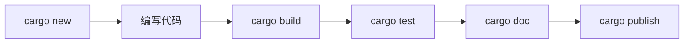

#### 模块可见性层级
```mermaid
graph TD
    Root[crate根] -->|pub| Outer[outer_mod]
    Outer -->|pub| Inner[inner_mod]
    Outer -->|pub(crate)| OuterFn[outer_mod_fn]
    Inner -->|pub(super)| SuperFn[super_mod_visible_fn]
    Inner -->|pub(self)| InnerFn[inner_mod_visible_fn]
```

### 5. 经典金句
> “在Rust中代码以包、模块、结构体和Enum等复合类型、函数等分成不同层次结构的项。这些项默认是私有的，但是可以通过pub关键字来改变它们的可见性。” (p.358)

---

## 第11章：安全并发

### 1. 核心论点
本章解决“Rust如何保证线程安全和数据并行”的问题。作者认为：通过Send和Sync标签trait，Rust在编译期消除数据竞争；所有权系统使得多线程编程默认安全；同时支持async/await异步并发和SIMD数据并行。

### 2. 关键概念
- **并发 vs 并行**：并发是应对多事件，并行是同时执行。
- **线程安全**：竞态条件、数据竞争、临界区。
- **Send/Sync**：标记trait，决定类型是否可在线程间传递/共享。
- **同步原语**：Mutex、RwLock、屏障、条件变量、原子类型。
- **Channel**：多生产者单消费者（mpsc），用于线程间通信。
- **异步并发**：生成器、Future、async/await、Pin。
- **数据并行**：SIMD，向量化。

### 3. 逻辑推演
- 区分并发和并行，回顾线程安全通用概念。
- 介绍线程管理（spawn、join、Builder、TLS）。
- 详细讲解Send/Sync如何保证线程安全。
- 展示Mutex、RwLock、原子类型的使用和死锁示例。
- 通过Channel实现CSP模型，举例工作量证明。
- 介绍线程池实现原理和Rayon并行迭代器。
- 深入异步并发：生成器→Future→async/await，解释Pin的必要性。
- 介绍SIMD基础和在Rust中的使用。

### 4. 流程图

#### CSP并发模型
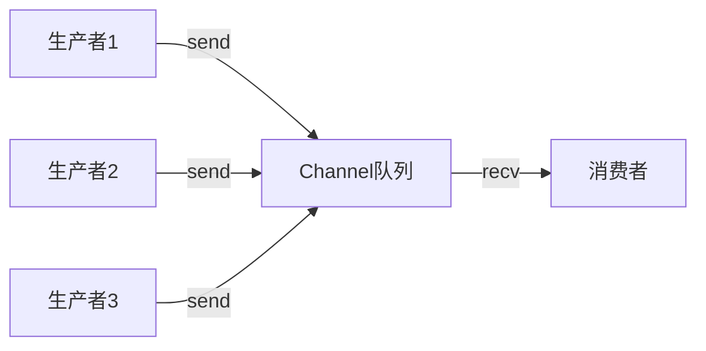

#### 线程池工作窃取
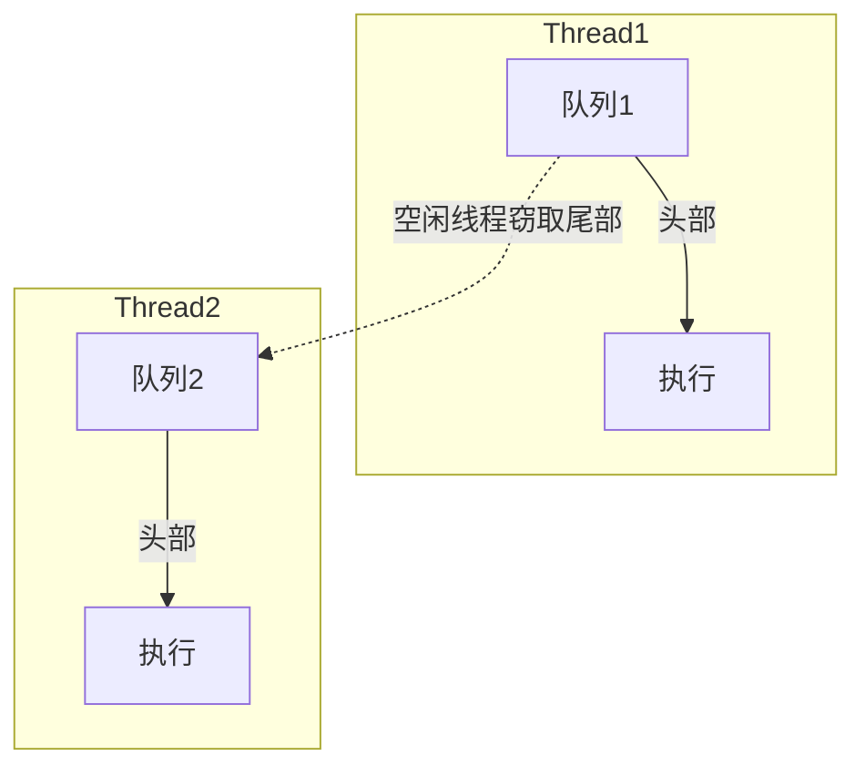

#### async/await 原理
```mermaid
graph LR
    async[async块] --> Gen[Generator<Yield=()>]
    Gen --> GenFuture[GenFuture]
    GenFuture -->|实现| Future[Future]
    Future -->|poll| Resume[调用resume]
```

### 5. 经典金句
> “不要通过共享内存来通信，而应该使用通信来共享内存。” (p.388)

> “Rust依靠严谨的类型系统和所有权机制，帮助开发者在编译时就能发现多线程并发程序中出现的数据竞争问题，从而保证线程安全。” (p.434)

---

## 第12章：元编程

### 1. 核心论点
本章解决“Rust如何通过宏实现元编程”的问题。作者认为：宏系统（声明宏、过程宏）允许在编译时生成代码，是Rust语法扩展和DSL的有力工具。

### 2. 关键概念
- **反射**：std::any::Any，有限的运行时类型识别。
- **声明宏**：macro_rules!，基于模式匹配的代码生成。
- **过程宏**：自定义派生属性、自定义属性、Bang宏，基于TokenStream。
- **编译过程**：词条流 → AST → HIR → MIR → LLVM IR。
- **syn/quote**：第三方库，解析和生成Rust代码。
- **编译器插件**：更底层的元编程，不稳定。

### 3. 逻辑推演
- 介绍反射能力（Any、TypeId、downcast）。
- 讲解宏的起源和Rust宏分类。
- 深入声明宏的工作机制（宏解析器、模式匹配、卫生性）。
- 通过hashmap!示例展示声明宏实现技巧。
- 介绍过程宏的三类（derive、attribute、bang）及其实现方法。
- 使用syn和quote库简化过程宏开发。
- 简要介绍编译器插件。

### 4. 流程图

#### 宏展开过程
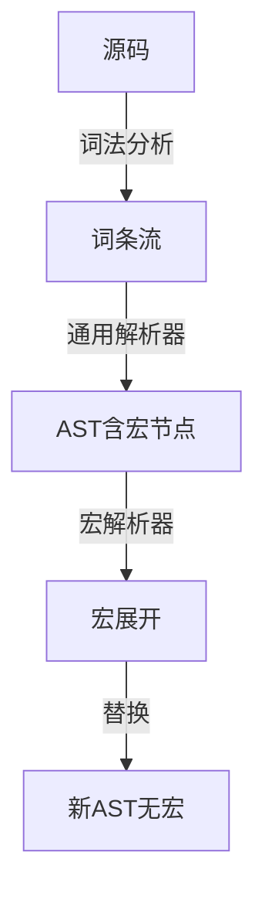

#### 过程宏工作流


### 5. 经典金句
> “元编程就是支持用代码生成代码的一种方式。” (p.435)

> “Rust的宏系统按定义的方式可以分为两大类：声明宏和过程宏。” (p.441)

---

## 第13章：超越安全的边界

### 1. 核心论点
本章解决“如何编写Unsafe Rust以及与其它语言交互”的问题。作者认为：Unsafe Rust用于绕过编译器安全检查，但开发者需自行保证安全；FFI允许Rust与C/C++等语言交互，WebAssembly拓宽了Rust的应用场景。

### 2. 关键概念
- **Unsafe Rust**：unsafe关键字，允许解引用原生指针、调用不安全函数、修改可变静态变量、实现不安全trait。
- **安全抽象**：基于Unsafe构建安全接口（如Vec、Box的内部实现）。
- **FFI**：外部函数接口，通过extern "C"声明，使用bindgen生成绑定。
- **WebAssembly**：Rust编译为Wasm，用于前端和高性能计算。
- **未定义行为**：数据竞争、悬垂指针、重复释放等。

### 3. 逻辑推演
- 介绍Unsafe Rust的语法和五种允许的操作。
- 讲解如何基于Unsafe构建安全抽象，包括原生指针操作、型变、未绑定生命周期、Drop检查等。
- 强调Unsafe代码必须遵守的三大原则（最小化、隔离、文档化）。
- 通过示例展示Rust与C/C++交互（调用C库、导出C函数）。
- 介绍Rust与Ruby、Python等动态语言的交互。
- 讲解WebAssembly基础及Rust开发Wasm的工具链（wasm-pack、wasm-bindgen）。

### 4. 流程图

#### FFI调用流程
```mermaid
graph LR
    Rust[Rust代码] -->|extern "C"| C_API[C API]
    C_API -->|调用| C_Lib[C库]
    C_Lib -->|返回| C_API
    C_API -->|返回值| Rust
```

#### Rust to WebAssembly
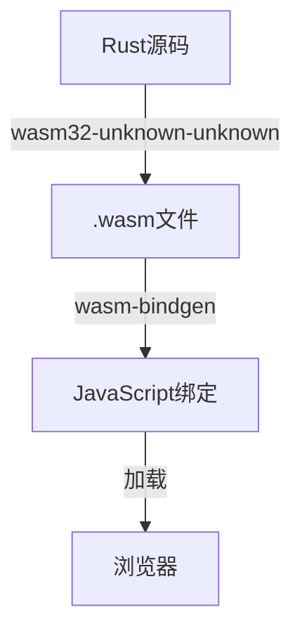

### 5. 经典金句
> “Safe Rust保证的是编译器在编译时最大化地保障内存安全，阻止未定义行为的发生。Unsafe Rust用来提醒开发者，此时开发的代码有可能引起未定义行为，请谨慎！” (p.31)

> “Unsafe Rust是Rust语言的另一面，它提供了与底层系统交互的能力，但将安全责任交给了开发者。” (p.477)

---

## 附录A：Rust开发环境指南
（内容略，主要介绍安装Rust、配置IDE、使用Cargo等）

## 附录B：Rust如何调试代码
（内容略，介绍gdb、lldb、Rust内置调试等）