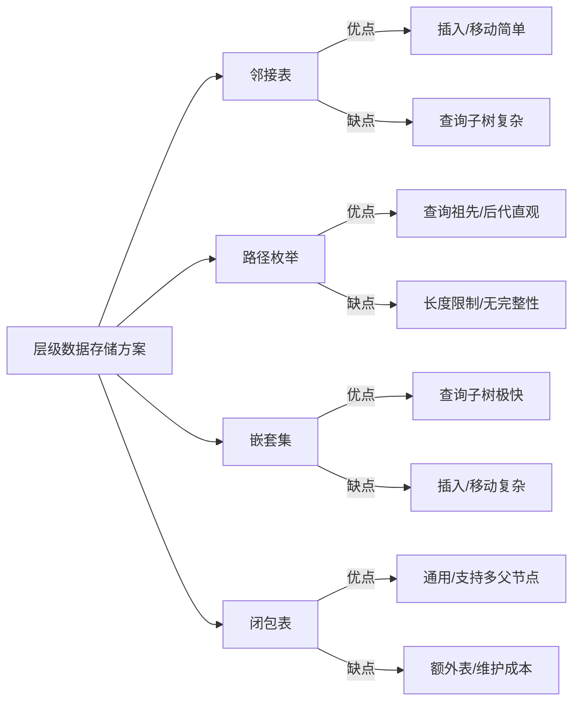
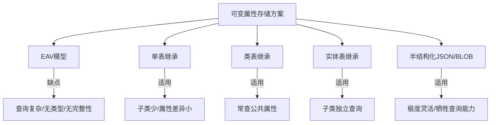
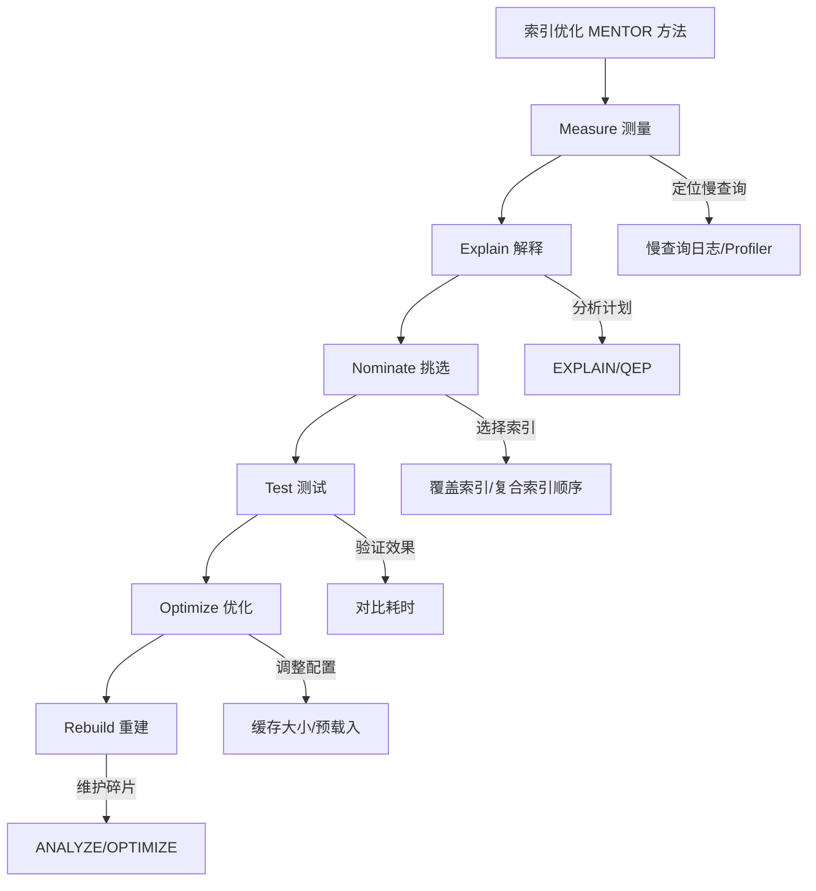
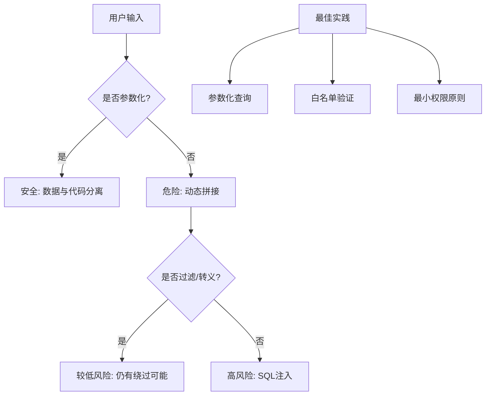
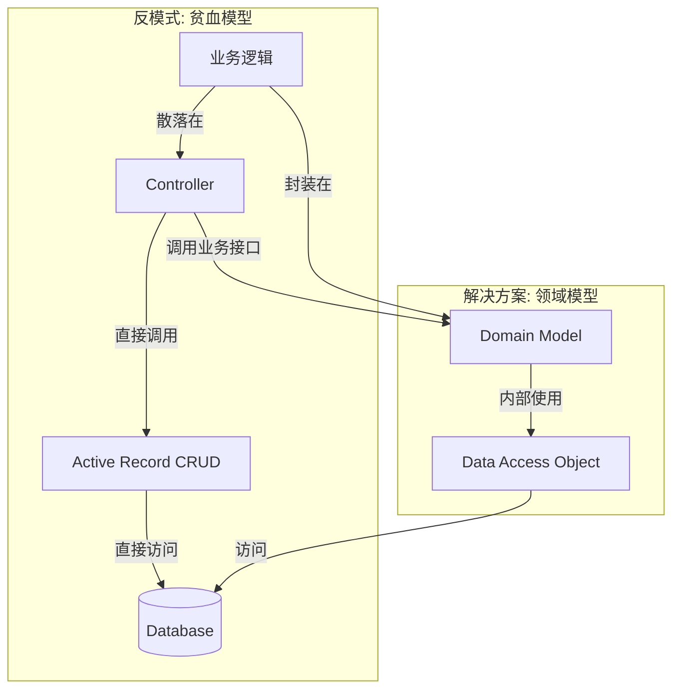

# 《SQL反模式》章节总结

## 书籍信息

- **书名**：SQL反模式 (SQL Antipatterns: Avoiding the Pitfalls of Database Programming)
- **作者**：[美] Bill Karwin
- **译者**：谭振林, Push Chen
- **出版社**：人民邮电出版社
- **PDF 状态**：完整文本识别，结构清晰
- **OCR 状态**：良好，少量排版噪点已清洗

## 目录说明

- **目录识别情况**：完全识别。本书分为五个部分：逻辑数据库设计、物理数据库设计、查询、应用程序开发、附录。
- **章节对应依据**：严格遵循原书目录，共25章及附录。
- **OCR 修复说明**：已修正部分代码片段中的换行错误和特殊字符乱码，确保 SQL 语句可读性。

## 全书核心主题

本书旨在帮助软件开发人员和数据库管理员识别并避免在 SQL 数据库设计与开发中常见的陷阱（即“反模式”）。作者通过具体的案例，展示了开发人员常采用的错误解决方案及其引发的新问题，并提供了经过验证的正确解决手段（设计模式）。

全书核心观点包括：
1. **规范化与灵活性的平衡**：虽然非规范化有时能提升性能，但应首先遵循规范化原则以确保数据完整性，仅在必要时进行受控的非规范化。
2. **利用数据库特性**：充分利用 SQL 标准特性（如外键约束、事务、数据类型）来保证数据质量，而非依赖应用层代码。
3. **正确理解 SQL 语义**：深入理解 NULL、GROUP BY、JOIN 等核心概念的底层逻辑，避免语义误解导致的逻辑错误。
4. **安全与维护**：重视 SQL 注入防护、密码存储安全以及数据库代码的版本控制和测试，将数据库视为软件工程的重要组成部分。

本书适合具备一定 SQL 基础，希望提升数据库设计质量和查询性能的开发者阅读。

---

## 第1章：引言

### 核心论点

本章介绍了“反模式”的概念，即那些看似能解决问题但实际引发更多问题的常见做法。作者强调 SQL 是一门声明式语言，与传统过程式或面向对象编程语言有显著差异，开发者需转变思维以高效使用 SQL。

### 关键概念/事件

- **反模式 (Antipattern)**：一种广泛使用的、试图解决问题但通常导致不良后果的方法。
- **阻抗失配 (Impedance Mismatch)**：面向对象应用程序与关系型数据库在数据结构上的不一致，常导致开发者回避高效 SQL 而依赖 ORM。
- **本书结构**：分为逻辑设计、物理设计、查询、应用开发四大部分，每章遵循“目标-反模式-识别-合理使用-解决方案”的结构。

### 逻辑推演/叙事脉络

作者从自身拒绝一个简化 SQL 解析工作的经历入手，引出 SQL 的复杂性。接着定义反模式，说明本书的目标读者（初学者到资深人员），并概述了各部分内容及反模式的分解结构。最后介绍了范例数据库（Bug 跟踪系统）及术语规约。

### 经典金句/数据

> “所谓专家，就是在一个很小的领域里把所有错误都犯过了的人。” —— 尼尔斯·玻尔

> “SQL 是一门声明式的编程语言... SQL 使用集合（set）作为根本的数据结构，而面向对象的语言使用的是对象（object）。”

---

## 第一部分：逻辑型数据库设计反模式

## 第2章：乱穿马路 (Jaywalking)

### 核心论点

**问题**：如何在单列中存储多个值（如多对多关系）？
**观点**：避免使用逗号分隔列表存储多值属性。应创建交叉表（关联表）来实现多对多关系，以确保查询效率、数据完整性和可扩展性。

### 关键概念/事件

- **逗号分隔列表**：将多个 ID 以字符串形式存入单列，导致查询困难、无法使用索引、难以维护完整性。
- **交叉表 (Cross-Table)**：包含两个外键的独立表，用于规范化多对多关系。
- **反规范化风险**：虽可出于性能考虑反规范化，但需谨慎，优先保证规范化设计。

### 逻辑推演/叙事脉络

通过产品联系人需求变更的案例，展示使用逗号分隔列表带来的查询复杂化（需正则匹配）、聚合困难、更新繁琐及长度限制问题。随后提出解决方案：创建独立的交叉表，通过 JOIN 查询实现高效检索，并利用外键约束保证引用完整性。

### 流程图/方法论图

```mermaid
graph TD
    subgraph 反模式: 逗号分隔
    A[Products表] -->|account_id: "1,2,3"| B(字符串解析困难)
    B --> C[无法使用索引]
    B --> D[完整性无法保证]
    end

    subgraph 解决方案: 交叉表
    E[Products表] -->|1:N| F[Contacts交叉表]
    G[Accounts表] -->|1:N| F
    F -->|N:1| E
    F -->|N:1| G
    H[高效JOIN查询] --> F
    I[外键约束] --> F
    end
```

### 经典金句/数据

> “每个值都应该存储在各自的行与列中。”

---

## 第3章：单纯的树 (Naive Trees)

### 核心论点

**问题**：如何高效存储和查询层级数据（如评论回复、组织架构）？
**观点**：邻接表（Parent-ID）虽简单，但查询深层后代效率低且复杂。应根据读写频率选择路径枚举、嵌套集或闭包表等替代方案。

### 关键概念/事件

- **邻接表 (Adjacency List)**：每行记录父节点 ID。优点：插入/移动简单；缺点：查询子树需递归或多次 JOIN。
- **路径枚举 (Path Enumeration)**：存储完整路径字符串（如 `1/4/6/`）。优点：查询祖先/后代简单；缺点：长度限制，完整性难保。
- **嵌套集 (Nested Sets)**：使用左右值编码节点。优点：查询子树极快；缺点：插入/移动节点开销大，需重新计算左右值。
- **闭包表 (Closure Table)**：独立表存储所有祖先-后代关系。优点：查询灵活，支持多父节点；缺点：需额外存储空间和维护成本。

### 逻辑推演/叙事脉络

从评论系统的树形结构需求出发，指出邻接表在查询任意深度后代时的局限性（需递归或固定深度 JOIN）。依次介绍三种替代方案：路径枚举通过字符串前缀匹配简化查询；嵌套集通过数值范围快速定位子树但写入复杂；闭包表通过空间换时间，提供最通用的解决方案。最后对比各方案优劣，建议根据具体场景选择。

### 流程图/方法论图



### 经典金句/数据

> “需要合理的设计两者的模型来配合你的工作。”

---

## 第4章：需要 ID (ID Required)

### 核心论点

**问题**：是否每张表都需要一个名为 `id` 的自增主键？
**观点**：主键是必要的，但不必总是伪主键（Surrogate Key）。应优先考虑自然键或组合键，避免冗余。若使用伪主键，应赋予有意义的名称（如 `bug_id`）而非通用的 `id`。

### 关键概念/事件

- **伪主键 (Surrogate Key)**：无业务意义的自增整数，常用于简化 ORM 映射。
- **自然键 (Natural Key)**：具有业务意义的唯一标识（如邮箱、ISBN）。
- **组合键 (Composite Key)**：由多列组成的主键，常见于交叉表。
- **通用 `id` 列的危害**：导致 JOIN 时列名冲突，掩盖业务含义，使 SQL 可读性降低。

### 逻辑推演/叙事脉络

通过交叉表中出现重复数据的案例，指出盲目使用 `id` 伪主键可能导致忽略真正的唯一性约束（如 `bug_id` + `product_id`）。批评“每张表必加 `id`”的教条，主张根据数据特性选择主键类型。建议使用有意义的列名（如 `account_id`）以提高代码清晰度，并拥抱组合键和外键的自然关联。

### 经典金句/数据

> “规范仅仅在它有帮助时才是好的。”

> “列名 id 并不会使查询变得更加清晰。但如果列名叫做 bug_id 或者 account_id，事情就会变得更加简单。”

---

## 第5章：不用钥匙的入口 (Keyless Entry)

### 核心论点

**问题**：是否可以省略外键约束以简化架构或提升性能？
**观点**：不应无视引用完整性约束。外键约束是防止数据不一致的最有效手段，其性能开销远小于应用层手动维护完整性的成本和风险。

### 关键概念/事件

- **引用完整性 (Referential Integrity)**：确保外键值在父表中存在。
- **应用层检查的缺陷**：并发环境下易产生竞态条件，代码复杂且易出错。
- **级联操作 (Cascade)**：利用 `ON DELETE/UPDATE CASCADE` 自动处理关联数据，简化应用逻辑。

### 逻辑推演/叙事脉络

通过设备预约冲突的案例，展示缺乏外键约束导致的数据不一致及后续昂贵的监控脚本维护成本。反驳“外键影响性能”的观点，指出外键能避免应用层额外的 SELECT 检查和锁表操作。强调数据库应作为数据完整性的最后一道防线，推荐使用外键约束及级联操作。

### 经典金句/数据

> “通过使用约束来帮助数据库防止错误。”

> “软件行业中每千行代码的平均缺陷数约为 15~50个。在其他条件相同的情况下，越少的代码，意味着越少的缺陷。”

---

## 第6章：实体—属性—值 (Entity-Attribute-Value, EAV)

### 核心论点

**问题**：如何支持动态可变属性的存储？
**观点**：避免使用 EAV 模型（将属性名和值存为行）。应根据子类型数量选择单表继承、类表继承或实体表继承，或在极端灵活需求下使用半结构化数据（JSON/XML）。

### 关键概念/事件

- **EAV 模型**：三列结构（实体ID, 属性名, 属性值）。缺点：查询复杂、无法利用 SQL 类型系统、完整性难保、报表困难。
- **单表继承 (Single Table Inheritance)**：所有子类属性存于一张表，空值表示不适用。适用于子类少、属性差异小的场景。
- **类表继承 (Class Table Inheritance)**：基类表存公共属性，子类表存特有属性并通过主键关联。适用于需频繁查询公共属性的场景。
- **实体表继承 (Concrete Table Inheritance)**：每个子类一张独立表，包含所有属性。适用于子类间查询独立的场景。

### 逻辑推演/叙事脉络

通过 Bug 和 FeatureRequest 的不同属性需求，展示 EAV 模型在查询、类型约束、完整性保障方面的巨大缺陷。随后引入面向对象的继承概念在数据库中的映射，详细对比三种继承映射策略的优缺点，最后提及 JSON/BLOB 作为高灵活性替代方案，但指出其查询局限性。

### 流程图/方法论图



### 经典金句/数据

> “为元数据使用元数据。”

> “如果你明白在你的项目中使用 EAV 设计的风险和你要做的额外工作，并且谨慎地使用它，它的副作用会变得较小。”

---

## 第7章：多态关联 (Polymorphic Associations)

### 核心论点

**问题**：如何让一个子表（如评论）关联多个不同类型的父表（如 Bug 或 Feature）？
**观点**：避免使用多态关联（存储父表名+ID）。应通过反向引用、交叉表或共用超级表（基类表）来实现，以维持引用完整性。

### 关键概念/事件

- **多态关联**：子表包含 `parent_type` 和 `parent_id`。缺点：无法定义外键约束，查询复杂（需 UNION 或 OUTER JOIN），数据完整性依赖应用层。
- **反向引用**：为每个父表创建独立的交叉表或外键列。
- **共用超级表 (Supertype Table)**：创建基类表（如 Issues），所有父表继承自基类，子表关联基类。优点：可定义外键，查询统一。

### 逻辑推演/叙事脉络

以评论系统为例，指出多态关联导致无法使用外键约束，且查询时需动态判断父表类型，逻辑复杂。提出三种解决方案：1. 为每个父表建立独立关联（反向引用）；2. 使用交叉表；3. 引入基类表（Issues），将多态转化为单一关联。推荐基类表方案，因其既保持完整性又简化查询。

### 经典金句/数据

> “在每个表与表的关系中，都有一个引用表和一个被引用表。”

---

## 第8章：多列属性 (Multicolumn Attributes)

### 核心论点

**问题**：如何处理一个属性可能有多个值的情况（如多个标签、多个电话）？
**观点**：避免创建多个列（tag1, tag2...）来存储多值。应创建从属表（一对多关系），每行存储一个值。

### 关键概念/事件

- **多列属性**：预设固定数量的列存储多值。缺点：查询需搜索多列，扩展需修改表结构，无法保证唯一性。
- **从属表 (Dependent Table)**：独立表存储多值，通过外键关联主表。优点：支持无限多值，查询简单（单列匹配），易于维护。

### 逻辑推演/叙事脉络

通过标签系统案例，展示多列设计在查询（需 OR 连接多列）、添加/删除值（需判断空列）及扩展性上的弊端。提出标准解决方案：创建 Tags 从属表，每行一个标签。此举符合第一范式，简化查询并消除扩展限制。

### 经典金句/数据

> “将具有同样意义的值存在同一列中。”

---

## 第9章：元数据分裂 (Metadata Splitting)

### 核心论点

**问题**：如何通过拆分表或列来优化性能或管理数据？
**观点**：避免按数据值（如年份）拆分表或列（克隆表/列）。应使用数据库内置的水平/垂直分区功能，或通过标准化设计（从属表）解决。

### 关键概念/事件

- **克隆表/列**：按年份创建 `Bugs_2009`, `Bugs_2010` 或列 `bugs_fixed_2009`。缺点：元数据与数据混淆，查询需 UNION，维护困难，易出错。
- **水平分区 (Horizontal Partitioning)**：数据库底层按规则物理拆分表，逻辑上仍为单表。
- **垂直分区 (Vertical Partitioning)**：将大字段（BLOB）或少用列拆分到独立表，提升主表查询效率。
- **标准化**：将重复列（如年度统计）转为行存储（从属表）。

### 逻辑推演/叙事脉络

通过按年拆分 Bug 表的案例，指出手动分表导致查询复杂（需 UNION）、维护困难（每年新建表）及完整性问题。推荐利用数据库自带的分区特性（透明管理）或垂直分区（分离大字段）。对于列分裂，建议转为行存储（从属表），避免元数据膨胀。

### 经典金句/数据

> “别让数据繁衍元数据。”

---

## 第二部分：物理数据库设计反模式

## 第10章：取整错误 (Rounding Errors)

### 核心论点

**问题**：如何精确存储和计算货币或高精度小数？
**观点**：避免使用 FLOAT/DOUBLE 类型存储精确数值。应使用 NUMERIC/DECIMAL 类型，以避免二进制浮点数精度丢失导致的计算误差。

### 关键概念/事件

- **FLOAT 精度问题**：基于 IEEE 754 标准，十进制小数在二进制中可能无限循环，导致舍入误差。不适合货币计算。
- **NUMERIC/DECIMAL**：定点数类型，精确存储指定精度和小数位数的十进制数。
- **近似相等比较**：若必须用浮点数，需使用阈值（epsilon）进行比较，而非直接等于。

### 逻辑推演/叙事脉络

通过计算项目成本的案例，展示 FLOAT 类型在累加和比较时产生的微小误差，导致财务数据不准确。解释 IEEE 754 标准的局限性，推荐在需要精确计算的场景（如金融）使用 NUMERIC/DECIMAL 类型，确保存储值与输入值完全一致。

### 经典金句/数据

> “尽可能不要使用浮点数。”

> “10.0乘以 0.1未必就是 1.0。”

---

## 第11章：每日新花样 (Daily New Flavors)

### 核心论点

**问题**：如何限制列的有效值集合（如状态、类型）？
**观点**：避免在列定义中使用 ENUM 或 CHECK 约束硬编码候选值。应创建检查表（Lookup Table），通过外键关联，以支持动态维护和扩展。

### 关键概念/事件

- **ENUM/CHECK 硬编码**：将候选值写入元数据。缺点：修改需 ALTER TABLE，锁表风险高，获取候选值列表复杂，可移植性差。
- **检查表 (Lookup Table)**：独立表存储候选值。优点：动态增删改无需改结构，查询简单，支持额外属性（如是否启用），可移植性好。

### 逻辑推演/叙事脉络

通过冰激凌口味或 Bug 状态变更的需求，展示 ENUM/CHECK 在添加新值时的繁琐（需修改表结构）及获取候选值列表的困难。提出使用检查表方案，通过外键约束保证有效性，同时支持动态管理和废弃标记，提升系统灵活性。

### 经典金句/数据

> “在验证固定集合的候选值时使用元数据。在验证可变集合的候选值时使用数据。”

---

## 第12章：幽灵文件 (Ghost Files)

### 核心论点

**问题**：如何存储图片或多媒体大文件？
**观点**：避免将文件存储在文件系统而仅在数据库存路径。除非有明确性能或备份优势，否则应将文件存入数据库 BLOB 字段，以保证事务一致性、备份完整性和安全性。

### 关键概念/事件

- **文件系统存储**：数据库存路径，文件存磁盘。缺点：事务不一致（删记录未删文件）、备份不同步、权限管理缺失、路径失效风险。
- **BLOB 存储**：文件二进制数据存入数据库。优点：事务原子性、备份一致、权限可控、无孤儿文件。
- **折中方案**：若文件极大，可使用数据库特有的外部存储特性（如 Oracle BFILE, SQL Server FILESTREAM）。

### 逻辑推演/叙事脉络

通过灾难恢复中图片丢失的案例，揭示文件系统存储在备份、事务、权限方面的隐患。对比 BLOB 存储的优势，指出其在一致性管理上的便利。同时也承认在特定场景（如静态资源、批处理）下文件系统存储的合理性，但强调需自行解决一致性问题。

### 经典金句/数据

> “存储在数据库之外的数据不由数据库管理。”

---

## 第13章：乱用索引 (Index Shotgun)

### 核心论点

**问题**：如何优化数据库查询性能？
**观点**：避免无规划地添加或删除索引。应采用 MENTOR 方法（测量、解释、挑选、测试、优化、重建）科学地管理索引，避免索引不足或过多。

### 关键概念/事件

- **无索引/索引不足**：导致全表扫描，性能低下。
- **索引过多**：增加写入开销，占用空间，优化器选择困难。
- **无效查询**：如函数包裹列、前导模糊查询、OR 条件等导致索引失效。
- **MENTOR 方法**：
    - **M**easure：定位慢查询。
    - **E**xplain：分析执行计划。
    - **N**ominate：挑选候选索引。
    - **T**est：测试性能提升。
    - **O**ptimize：调整缓存和配置。
    - **R**ebuild：定期重建碎片化索引。

### 逻辑推演/叙事脉络

通过 DBA 与开发者的对话，引出索引管理的混乱现状。分析三种常见错误：无索引、索引过多、查询无法利用索引。详细介绍 MENTOR 六步法，强调基于数据和执行计划而非猜测来优化索引。特别指出覆盖索引和索引碎片维护的重要性。

### 流程图/方法论图



### 经典金句/数据

> “了解你的数据，了解你的查询请求，然后 MENTOR 你的索引。”

---

## 第三部分：查询反模式

## 第14章：对未知的恐惧 (Fear of the Unknown)

### 核心论点

**问题**：如何正确处理 NULL 值？
**观点**：避免将 NULL 当作普通值或使用特殊值（如 -1, ''）替代 NULL。应理解 NULL 的三值逻辑（True/False/Unknown），使用 `IS NULL` 或 `COALESCE` 进行处理。

### 关键概念/事件

- **NULL 的特性**：不等于任何值（包括自身），任何与 NULL 的运算结果通常为 NULL（Unknown）。
- **特殊值替代的危害**：需额外代码处理，干扰聚合计算（如 AVG），语义混淆。
- **正确处理**：使用 `IS NULL` / `IS NOT NULL` 判断；使用 `COALESCE()` 提供默认值；在布尔逻辑中注意 `UNKNOWN` 的影响。

### 逻辑推演/叙事脉络

通过拼接姓名时因中间名为 NULL 导致全名为空的案例，揭示 NULL 在表达式和布尔逻辑中的特殊行为。批判使用特殊值替代 NULL 的做法，指出其带来的复杂性和潜在错误。推荐使用标准 SQL 的 NULL 处理函数和谓词，并在设计时对非空列施加 `NOT NULL` 约束。

### 经典金句/数据

> “使用 NULL 来表示任意类型的悬空值。”

> “NULL 也是可关联的吗？... 事实是大多数编程语言都没有完美地实现计算机科学的那些理论。无论如何 SQL 都支持 NULL。”

---

## 第15章：模棱两可的分组 (Ambiguous Groups)

### 核心论点

**问题**：如何在 GROUP BY 查询中获取非分组列的值（如每组最大值的对应 ID）？
**观点**：避免在 SELECT 中引用非分组且非聚合的列（违反单值规则）。应使用子查询、JOIN 或窗口函数来明确获取所需行。

### 关键概念/事件

- **单值规则**：GROUP BY 后，SELECT 中的列必须是分组列或聚合函数结果。
- **MySQL/SQlite 的陷阱**：允许非标准语法，但返回结果不确定（通常为物理存储的第一行）。
- **解决方案**：
    - **关联子查询**：查找最大值对应的行。
    - **衍生表 JOIN**：先分组求最大值，再 JOIN 原表获取详细信息。
    - **窗口函数**：使用 `ROW_NUMBER()` 等（若数据库支持）。

### 逻辑推演/叙事脉络

通过获取每个产品最新 Bug 的案例，指出直接在 GROUP BY 查询中选择 `bug_id` 的错误（结果不确定或报错）。分析单值规则的必要性。提供多种标准 SQL 解决方案：子查询、衍生表 JOIN、以及利用窗口函数，强调明确性和可预测性。

### 经典金句/数据

> “遵循单值规则，避免获得模棱两可的查询结果。”

---

## 第16章：随机选择 (Random Selection)

### 核心论点

**问题**：如何高效地从大表中随机选取记录？
**观点**：避免使用 `ORDER BY RAND()`，因其需全表排序，性能极差。应根据主键连续性采用随机主键查找、偏移量选择或专用采样功能。

### 关键概念/事件

- **ORDER BY RAND() 的性能问题**：全表扫描、临时表排序，复杂度 O(N log N)。
- **随机主键法**：生成随机 ID 直接查找。要求主键连续，否则需重试或查找下一个。
- **偏移量法**：`COUNT(*)` 获取总数，生成随机偏移量，使用 `LIMIT 1 OFFSET ?`。
- **专用采样**：如 SQL Server `TABLESAMPLE`，Oracle `SAMPLE`。

### 逻辑推演/叙事脉络

通过广告随机展示变慢的案例，分析 `ORDER BY RAND()` 在大数据量下的性能瓶颈。提出替代方案：基于主键的随机查找（高效但需处理空洞）、基于偏移量的随机选择（均匀分布但需两次查询）、以及数据库特有的采样功能。建议根据数据特征选择合适方案。

### 经典金句/数据

> “有些查询是无法优化的，换种方法试试看。”

---

## 第17章：可怜人的搜索引擎 (Poor Man's Search Engine)

### 核心论点

**问题**：如何实现高效的全文搜索？
**观点**：避免使用 `LIKE '%keyword%'` 或正则表达式进行全文搜索，因其无法利用索引且性能低下。应使用数据库内置全文索引或第三方搜索引擎（如 Lucene, Sphinx）。

### 关键概念/事件

- **LIKE/Regex 的局限**：前导通配符导致索引失效，全表扫描，不支持词形变化、相关性排序。
- **数据库全文索引**：MySQL FullText, Oracle Text, PostgreSQL TSVECTOR。支持分词、索引、相关性评分。
- **第三方搜索引擎**：Lucene, Solr, Sphinx。独立于数据库，功能强大，支持分布式、高并发。
- **反向索引自建**：通过关键词交叉表模拟，但维护复杂。

### 逻辑推演/叙事脉络

通过知识库搜索需求，展示 LIKE 匹配在性能和准确性上的不足。介绍数据库自带的全文搜索扩展，指出其优势（集成度高）和劣势（非标准、配置复杂）。进一步推荐第三方搜索引擎作为高性能、跨平台的首选方案，并简要提及自建反向索引的可行性与局限。

### 经典金句/数据

> “你不必使用 SQL 来解决所有问题。”

---

## 第18章：意大利面条式查询 (Spaghetti Query)

### 核心论点

**问题**：如何简化复杂的 SQL 查询？
**观点**：避免试图用单个复杂查询完成所有任务（导致笛卡儿积、难以维护）。应“分而治之”，拆分为多个简单查询或在应用层组合结果。

### 关键概念/事件

- **笛卡儿积风险**：多表 JOIN 若无正确关联条件，结果集爆炸。
- **复杂查询的弊端**：难写、难读、难调试、优化困难。
- **分而治之**：拆分为多个简单查询，在应用层合并。优点：逻辑清晰、易于优化、避免笛卡儿积。
- **UNION 标记**：若需单结果集，可使用 UNION 合并子查询结果。

### 逻辑推演/叙事脉络

通过统计项目信息的复杂需求，展示单一大查询如何因无意间的笛卡儿积导致结果错误。批判“越少查询越好”的误区，指出复杂查询的执行开销和维护成本往往更高。推荐将任务拆解为多个简单查询，或在应用层处理逻辑，强调代码的可读性和可维护性。

### 经典金句/数据

> “简约律：当你有两个相互竞争的理论能得出同样的结论，那么简单的那个更好。”

---

## 第19章：隐式的列 (Implicit Columns)

### 核心论点

**问题**：是否应使用 `SELECT *` 和隐式列列表？
**观点**：避免在生产代码中使用 `SELECT *` 和隐式 INSERT 列列表。应显式列出所需列，以提高代码健壮性、性能和可维护性。

### 关键概念/事件

- **SELECT * 的危害**：网络传输浪费、应用层列名冲突、表结构变更导致程序错误。
- **隐式 INSERT 的风险**：列顺序依赖，新增列导致插入失败或数据错位。
- **显式列名的优势**：防错（Poka-yoke）、减少带宽、明确意图、适应结构变更。

### 逻辑推演/叙事脉络

通过 PHP 数组键名冲突和 INSERT 失败的案例，揭示隐式列引用的脆弱性。指出 `SELECT *` 在性能和重构上的弊端。强烈建议在正式代码中显式指定列名，即使输入繁琐，也能换取长期的稳定性和清晰度。

### 经典金句/数据

> “随便拿，但是拿了就必须吃掉。”

---

## 第四部分：应用程序开发反模式

## 第20章：明文密码 (Plain-Text Passwords)

### 核心论点

**问题**：如何安全存储和验证用户密码？
**观点**：严禁明文存储密码。应使用单向哈希函数（如 SHA-256, bcrypt）加盐（Salt）存储，并提供重置而非恢复密码的功能。

### 关键概念/事件

- **明文存储风险**：数据库泄露即密码泄露，邮件传输不安全。
- **哈希函数**：单向不可逆，固定长度输出。推荐 SHA-256 及以上，避免 MD5/SHA-1。
- **加盐 (Salting)**：在哈希前拼接随机串，防御彩虹表攻击。
- **密码重置**：发送临时令牌或临时密码，而非原密码。

### 逻辑推演/叙事脉络

通过社工攻击获取明文密码的案例，警示明文存储的严重安全隐患。介绍哈希算法原理及加盐技术，强调在应用层哈希后再存入数据库，避免 SQL 日志泄露。最后提出密码重置的最佳实践，彻底摒弃“找回密码”功能。

### 经典金句/数据

> “如果密码对你可读，那对攻击者也如此。”

---

## 第21章：SQL注入 (SQL Injection)

### 核心论点

**问题**：如何防止 SQL 注入攻击？
**观点**：绝不信任用户输入。应使用参数化查询（Prepared Statements）隔离代码与数据，辅以输入过滤和白名单验证。

### 关键概念/事件

- **SQL 注入原理**：恶意输入改变 SQL 语法结构。
- **参数化查询**：占位符机制，确保输入仅作为数据处理，无法改变逻辑。
- **输入过滤**：白名单验证（如排序字段映射），剔除非法字符。
- **存储过程误区**：若内部仍拼接字符串，同样存在注入风险。

### 逻辑推演/叙事脉络

通过经典注入案例（如 `' OR 1=1 --`），展示动态拼接 SQL 的危险性。指出转义字符的局限性，强烈推荐参数化查询作为核心防御手段。补充输入验证、白名单映射等辅助措施，强调代码审查和安全意识的重要性。

### 流程图/方法论图



### 经典金句/数据

> “让用户输入内容，但永远别让用户输入代码。”

---

## 第22章：伪键洁癖 (Pseudokey Neatness)

### 核心论点

**问题**：是否需要保持主键连续无断档？
**观点**：无需刻意填补主键断档。主键仅需唯一且非空，连续性无业务意义。强行重编号会导致并发问题、数据不一致和高昂维护成本。

### 关键概念/事件

- **主键断档原因**：删除、回滚、插入失败。属正常现象。
- **重编号的危害**：并发竞态、外键级联更新复杂、历史数据引用失效。
- **GUID/UUID**：替代自增整数，解决分布式唯一性问题，但牺牲性能和可读性。
- **行号 vs 主键**：展示层行号可用 `ROW_NUMBER()`，不应与主键混淆。

### 逻辑推演/叙事脉络

通过会计报表对主键连续的执念，展示重编号带来的技术灾难。解释主键的本质是唯一标识而非序号。指出自增主键断档的不可避免性及无害性。建议在展示层使用行号满足连续需求，或在极端分布式场景下考虑 GUID，但需权衡利弊。

### 经典金句/数据

> “将伪键当做行的唯一性标识，但它们不是行号。”

---

## 第23章：非礼勿视 (See No Evil)

### 核心论点

**问题**：如何处理数据库 API 返回的错误和异常？
**观点**：绝不忽略数据库操作的返回值和异常。应建立完善的错误处理机制，记录日志，优雅降级，以便快速定位问题。

### 关键概念/事件

- **忽略返回值的后果**：静默失败，问题难以追踪，用户体验差。
- **调试技巧**：打印最终生成的 SQL 语句，而非仅看代码逻辑。
- **异常处理**：捕获连接、语法、约束违规等异常，提供友好提示。

### 逻辑推演/叙事脉络

通过用户报告“查询无结果”实为语法错误的案例，批评忽略错误返回的开发习惯。强调检查 API 返回值和捕获异常的重要性。建议在实际调试中输出最终 SQL 语句，以快速发现拼接错误。提倡建立健壮的错误处理文化。

### 经典金句/数据

> “发现并解决代码中的问题已经很困难了，就别再盲目地干了。”

---

## 第24章：外交豁免权 (Diplomatic Immunity)

### 核心论点

**问题**：数据库代码是否应遵循软件工程最佳实践？
**观点**：数据库代码（Schema, SP, Trigger）不应享有“外交豁免权”。应与应用程序代码一样，纳入版本控制、文档化和自动化测试体系。

### 关键概念/事件

- **技术债务**：缺乏文档、测试和版本控制的数据库代码难以维护。
- **版本控制**：存储 DDL 脚本、迁移脚本、初始数据。
- **自动化测试**：单元测试约束、触发器、存储过程；集成测试验证 Schema 变更。
- **文档化**：ER 图、数据字典、业务逻辑说明。

### 逻辑推演/叙事脉络

通过接手无文档、无版本控制的遗留系统案例，揭示忽视数据库工程化的惨痛代价。呼吁将数据库开发纳入标准软件工程流程：版本控制管理变更，文档记录设计意图，测试保证质量。介绍迁移工具（如 Rails Migrations）在同步代码与数据库结构中的作用。

### 经典金句/数据

> “数据库和程序都需要采用软件开发的最佳实践，包括文档、测试和版本控制。”

---

## 第25章：魔豆 (Magic Beans)

### 核心论点

**问题**：如何正确使用 MVC 框架中的模型层？
**观点**：避免将模型层简化为活动记录（Active Record）的 CRUD 封装。应构建富含业务逻辑的领域模型（Domain Model），将数据访问细节隐藏在内。

### 关键概念/事件

- **活动记录模式 (Active Record)**：对象与表行一一对应，暴露 CRUD。缺点：业务逻辑分散，测试依赖数据库，耦合度高。
- **领域模型 (Domain Model)**：封装业务逻辑和数据访问，提供高层次接口。优点：解耦，易测试，内聚性强。
- **抽象泄露**：ORM 试图隐藏 SQL，但在复杂查询时泄露底层细节，导致复杂度转移而非消除。

### 逻辑推演/叙事脉络

通过开发效率低下的案例，指出过度依赖 Active Record 导致业务逻辑分散在控制器中，测试复杂。对比领域模型模式，强调模型应封装业务规则和数据访问，向控制器提供语义化接口。提倡将数据访问对象（DAO）作为模型的内部实现细节，而非模型本身。

### 流程图/方法论图



### 经典金句/数据

> “将模型和表解耦。”

---

## 第五部分：附录

## 附录 A：规范化规则

### 核心论点

规范化是减少数据冗余、保证数据一致性的理论基础。应理解各范式的定义及应用场景，而非盲目追求高阶范式或完全否定规范化。

### 关键概念/事件

- **第一范式 (1NF)**：原子性，无重复组。
- **第二范式 (2NF)**：消除部分依赖（针对复合主键）。
- **第三范式 (3NF)**：消除传递依赖。
- **博伊斯-科德范式 (BCNF)**：所有决定因素均为候选键。
- **第四范式 (4NF)**：消除多值依赖。
- **第五范式 (5NF)**：消除连接依赖。
- **规范化与性能**：规范化首要目标是 correctness，性能优化可通过受控的非规范化实现。

### 逻辑推演/叙事脉络

简述关系理论基础，逐一解释各范式规则及违规后果（冗余、异常）。澄清关于规范化的常见误解（如“规范化导致慢”），强调先规范化后优化的原则。

### 经典金句/数据

> “规范化有助于我们正确地存储数据，避免陷入麻烦。”

---

## 附录 B：参考书目

列出本书引用的相关书籍和文章，包括《反模式》、《高性能 MySQL》、《领域驱动设计》等，供读者深入学习。