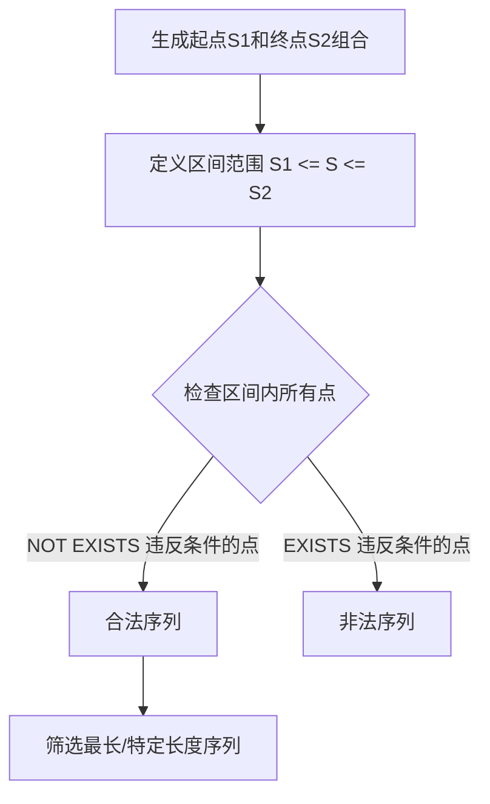

# 《SQL进阶教程》章节总结

## 书籍信息

- **书名**：SQL进阶教程 (達人に学ぶSQL徹底指南書)
- **作者**：[日] MICK
- **译者**：吴炎昌
- **出版社**：人民邮电出版社
- **PDF 状态**：完整文本可识别
- **OCR 状态**：良好，部分日文乱码已忽略，核心内容清晰

## 目录说明

- **目录识别情况**：目录结构清晰，分为三大部分：第1章“神奇的SQL”、第2章“关系数据库的世界”、第3章“附录（习题解答与参考文献）”。
- **章节对应依据**：严格遵循原书目录层级，从1-1节至2-10节，以及附录部分。
- **OCR 修复说明**：原文中存在的少量日文编码错误（如`හਁᇇ๦्ก`等）已剔除，不影响正文逻辑。

## 全书核心主题

本书旨在帮助具备半年以上SQL使用经验的初级工程师向中级进阶。全书分为两部分：
1.  **实践篇**：深入讲解SQL的高级技巧，包括CASE表达式、自连接、三值逻辑与NULL、HAVING子句、外连接、关联子查询、集合运算、EXISTS谓词、数列处理及性能优化。重点在于打破面向过程的思维定式，建立面向集合和声明式的SQL思维。
2.  **理论篇**：探讨关系数据库的历史、关系模型的本质（为何叫“关系”而非“表”）、封闭性、指针与地址的抽象、GROUP BY与PARTITION BY的数学基础（群论中的“类”）、从面向过程到声明式思维的转变、递归集合与冯·诺依曼自然数定义、三值逻辑的历史背景（人类逻辑学 vs 神逻辑学）、NULL的处理策略以及SQL中的层级概念。

本书核心理念是：**SQL不仅是查询语言，更是基于集合论和谓词逻辑的声明式编程语言。** 理解其背后的数学原理（集合论、谓词逻辑、群论）是掌握高级SQL技巧的关键。

---

## 第1章：神奇的SQL

### 1-1 CASE表达式

#### 核心论点
CASE表达式是SQL中实现条件分支的核心工具，它不仅是简单的值转换，更是将“行结构”数据转换为“列结构”数据（交叉表）、在UPDATE中进行原子性多条件更新、以及在聚合函数内部进行逻辑判断的关键技术。

#### 关键概念/事件
- **简单CASE vs 搜索CASE**：简单CASE用于等值判断，搜索CASE支持更复杂的谓词条件（如BETWEEN, LIKE, 子查询）。推荐统一使用搜索CASE以增强表达能力。
- **行列转换**：利用`SUM(CASE WHEN ... THEN ... ELSE 0 END)`将行数据 pivot 为列数据，生成交叉表。
- **CHECK约束中的蕴含式**：利用CASE表达逻辑蕴含（P→Q），例如“如果是女性，则工资<=20万”，避免使用逻辑与（AND）导致男性员工无法插入的问题。
- **原子性更新**：在UPDATE语句中使用CASE表达式，可以一次性完成多个互斥条件的更新，避免因多次UPDATE导致的数据状态不一致（如主键交换、薪资调整）。

#### 逻辑推演/叙事脉络
作者首先介绍CASE的基本语法，强调其标准性和可移植性优于数据库特有函数（如DECODE, IF）。接着通过实例展示其强大功能：
1.  **重分组统计**：在GROUP BY中使用CASE，动态定义分组依据。
2.  **交叉表制作**：新手用WHERE过滤，高手用SELECT中的CASE聚合，实现行转列。
3.  **约束定义**：结合CHECK约束，处理复杂的条件依赖关系。
4.  **更新操作**：解决多条件更新的竞态条件问题，确保数据一致性。
5.  **聚合嵌套**：在SELECT子句的CASE中嵌套聚合函数，或在聚合函数中嵌套CASE，实现复杂的条件统计（如“只加入一个社团”vs“加入多个社团取主社团”）。

#### 经典金句/数据
> “新手用WHERE子句进行条件分支，高手用SELECT子句进行条件分支。”
> “新手用HAVING子句进行条件分支，高手用SELECT子句进行条件分支。”

---

### 1-2 自连接的用法

#### 核心论点
自连接（Self-Join）是将同一张表视为两个不同集合进行操作的技术，常用于生成排列组合、删除重复行、查找局部不一致数据以及实现非窗口函数的排序（位次计算）。它是体现SQL“面向集合”特性的典型技术。

#### 关键概念/事件
- **非等值自连接**：使用`<`, `>`, `<>`等运算符进行自连接，用于生成排列（有序对）、组合（无序对）或查找匹配项。
- **删除重复行**：利用ROWID和自连接（或关联子查询），保留每组重复数据中ROWID最大（或最小）的一行，删除其余行。
- **查找局部不一致**：如查找“家庭ID相同但住址不同”的记录，通过自连接比较同一组内的不同行。
- **冯·诺依曼型递归集合与排序**：通过自连接计算“比当前行值大的行数+1”来生成位次（RANK），体现了集合的嵌套包含关系。

#### 逻辑推演/叙事脉络
1.  **排列与组合**：通过交叉连接生成笛卡尔积，再添加不等值条件（`<>`去重元素，`>`去重顺序）得到排列和组合。
2.  **删除重复**：将表看作P1和P2两个集合，找出P1中ROWID小于P2中同名同价记录的最大ROWID的行并删除。
3.  **数据一致性检查**：自连接比较同一组内不同行的属性差异。
4.  **排序实现**：在没有窗口函数的环境下，利用自连接计算每个元素在集合中的相对位置（位次），揭示了排序本质上是集合元素的计数问题。

#### 流程图（Mermaid）

```mermaid
graph TD
    A[原始表 Products] --> B{操作类型}
    B -->|生成排列| C[自连接 P1, P2 WHERE P1.name <> P2.name]
    B -->|生成组合| D[自连接 P1, P2 WHERE P1.name > P2.name]
    B -->|删除重复| E[DELETE P1 WHERE P1.rowid < MAX(P2.rowid) GROUP BY name, price]
    B -->|计算位次| F[SELECT COUNT(*) + 1 FROM Products P2 WHERE P2.price > P1.price]
```

#### 经典金句/数据
> “自连接里的‘自’这个词也没有太大的意义……只要被赋予了不同的名称，即便是相同的表也应该当作不同的表（集合）来对待。”

---

### 1-3 三值逻辑和NULL

#### 核心论点
SQL采用三值逻辑（True, False, Unknown）而非二值逻辑，根源在于NULL的存在。NULL不是值，而是“缺失信息”的标记。理解三值逻辑的真值表及其对谓词运算（特别是NOT IN, EXISTS, ALL）的影响，是避免SQL逻辑错误的关键。

#### 关键概念/事件
- **两种NULL**：“未知”（Unknown，存在但不知）和“不适用”（Not Applicable，属性无意义）。SQL将其混同为一种NULL。
- **IS NULL vs = NULL**：对NULL使用比较谓词（=, <, >）结果永远为Unknown。必须使用`IS NULL`或`IS NOT NULL`。
- **排中律不成立**：`age = 20 OR age <> 20` 无法选出年龄为NULL的行，因为结果为Unknown。需显式添加`OR age IS NULL`。
- **NOT IN 陷阱**：如果子查询结果包含NULL，`NOT IN` 整体结果可能为Unknown，导致查询返回空集。应优先使用`NOT EXISTS`。
- **ALL谓词与极值函数**：当子查询为空集或含NULL时，`ALL`与`MIN/MAX`行为不同。`ALL`在空集时返回True（全称量化特性），而极值函数返回NULL。

#### 逻辑推演/叙事脉络
1.  **理论基础**：介绍Codd对NULL的分类及三值逻辑真值表。强调Unknown在AND/OR中的优先级。
2.  **实践陷阱**：
    *   CASE表达式中`WHEN NULL`无效，需用`WHEN col IS NULL`。
    *   `NOT IN`子查询含NULL时导致全表过滤失败，解析为`AND (col <> NULL)`即`AND Unknown`。
    *   `NOT EXISTS`不受NULL影响，因为它只返回True/False。
    *   `ALL`谓词在空集时的行为符合逻辑学全称量化定义（真空真），而极值函数返回NULL，两者不等价。

#### 经典金句/数据
> “NULL既不是值也不是变量。NULL只是一个表示‘没有值’的标记。”
> “在SQL的世界里，排中律是不成立的。”

---

### 1-4 HAVING子句的力量

#### 核心论点
HAVING子句用于对“集合”本身进行条件筛选，而非对单个行（WHERE的作用）。它是实现关系除法、查找缺失编号、求众数/中位数、以及检查集合性质（如是否包含NULL、是否连续）的强大工具。

#### 关键概念/事件
- **寻找缺失编号**：`HAVING COUNT(*) <> MAX(seq)` 判断编号是否连续（假设起始为1）。
- **求众数**：`HAVING COUNT(*) >= ALL (SELECT COUNT(*) ...)` 或结合极值函数，找出出现频率最高的值。
- **求中位数**：利用自连接和HAVING，将集合分为上下两半，交集部分的平均值即为中位数。
- **关系除法**：通过`HAVING COUNT(*) = (SELECT COUNT(*) FROM Items)` 找出包含所有指定物品的店铺（购物篮分析）。
- **精确关系除法**：结合外连接和COUNT，找出恰好包含指定物品且无多余物品的集合。

#### 逻辑推演/叙事脉络
1.  **集合视角**：强调HAVING操作对象是GROUP BY生成的子集。
2.  **应用案例**：
    *   **缺失编号**：比较集合元素个数与最大编号。
    *   **统计指标**：用HAVING替代复杂的排序和循环，求众数和中位数。
    *   **集合性质检查**：利用`COUNT(*) = COUNT(col)` 检查列是否不含NULL。
    *   **关系除法**：将“包含所有”转化为“连接后的行数等于目标集合行数”，或通过差集（EXCEPT/NOT EXISTS）实现。

#### 流程图（Mermaid）

```mermaid
graph TD
    A[原始表] --> B[GROUP BY 生成子集]
    B --> C[HAVING 筛选集合]
    C -->|COUNT(*) = MAX(seq)| D[检查连续性]
    C -->|COUNT(*) = COUNT(col)| E[检查无NULL]
    C -->|COUNT(item) = Total_Items| F[关系除法: 包含所有]
```

#### 经典金句/数据
> “WHERE子句用来调查集合元素的性质，而HAVING子句用来调查集合本身的性质。”

---

### 1-5 外连接的用法

#### 核心论点
外连接不仅用于保留未匹配行，更是进行行列转换（生成交叉表、嵌套侧栏）、实现集合运算（差集、异或）以及优化一对多连接聚合性能的重要手段。

#### 关键概念/事件
- **行列转换（行→列）**：以主表为基准，对外连接多个子查询（每个子查询代表一列），生成交叉表。
- **行列转换（列→行）**：使用UNION ALL将多列数据 unpivot 为多行。
- **嵌套式表侧栏**：先生成维度表的笛卡尔积（CROSS JOIN）作为主表，再左连接数据表，确保所有维度组合都出现在结果中。
- **连接即乘法**：在一对多连接中，先连接后聚合，避免生成中间视图，利用索引提升性能。
- **全外连接与集合运算**：
    *   `A LEFT OUTER JOIN B WHERE B.key IS NULL` 实现差集 A-B。
    *   `FULL OUTER JOIN WHERE A.key IS NULL OR B.key IS NULL` 实现异或集。

#### 逻辑推演/叙事脉络
1.  **格式转换**：展示如何用外连接生成交叉表，对比标量子查询和CASE聚合方法的优劣。
2.  **嵌套侧栏**：指出多次外连接可能导致NULL传播问题，提出“先 CROSS JOIN 维度表生成完整骨架，再 LEFT JOIN 数据”的最佳实践。
3.  **性能优化**：解释“先连接后聚合”在一对多场景下的优势，避免临时表和无索引扫描。
4.  **集合运算**：从维恩图角度解析外连接，展示如何用外连接替代INTERSECT, EXCEPT, UNION。

#### 经典金句/数据
> “从行数来看，表连接可以看成乘法。因此，当表之间是一对多的关系时，连接后行数不会增加。”

---

### 1-6 用关联子查询比较行与行

#### 核心论点
SQL默认无序，但通过关联子查询（或自连接）可以引入“相对顺序”概念，实现行间比较（如同比/环比）、累计值计算、移动平均以及时间区间重叠检测。

#### 关键概念/事件
- **行间比较**：`WHERE sale = (SELECT sale FROM Sales S2 WHERE S2.year = S1.year - 1)` 实现与上一行比较。
- **处理间断序列**：当序列不连续时，使用`MAX(year) WHERE year < current_year` 找到“过去最临近”的行进行比较。
- **累计值与移动平均**：利用关联子查询`SUM(prc_amt) WHERE date <= current_date` 计算累计值；增加行数限制实现移动平均。
- **时间区间重叠**：使用`BETWEEN`或`OVERLAPS`谓词，结合EXISTS检测两个时间段是否有交集。

#### 逻辑推演/叙事脉络
1.  **基本比较**：通过`year-1`或自连接`year = year-1`实现相邻行比较。
2.  **复杂比较**：针对非连续数据，使用极值函数找到逻辑上的“前一行”。
3.  **累积计算**：将累计值定义为“当前行及之前所有行的和”，通过关联子查询实现。
4.  **区间重叠**：定义重叠的逻辑条件（开始时间在对方区间内 或 结束时间在对方区间内），使用EXISTS高效检测。

#### 经典金句/数据
> “SQL的做法是添加比较对象数据的集合，通过关联子查询（或者自连接）一行一行地偏移处理。”

---

### 1-7 用SQL进行集合运算

#### 核心论点
SQL支持标准的集合运算（UNION, INTERSECT, EXCEPT），利用这些运算可以简洁地实现表比较、关系除法（差集法）以及查找相等子集等复杂逻辑。

#### 关键概念/事件
- **幂等性**：`S UNION S = S` 和 `S INTERSECT S = S`。利用此性质比较两张表是否相等：`(A UNION B) EXCEPT (A INTERSECT B)` 为空则相等。
- **关系除法（差集法）**：`NOT EXISTS (SELECT skill FROM Skills EXCEPT SELECT skill FROM EmpSkills WHERE emp = E.emp)`。若需求技能集合减去员工技能集合为空，则该员工满足条件。
- **查找相等子集**：生成所有供应商组合，检查它们的零件集合是否互为子集且数量相等。
- **高效删除重复行**：`DELETE WHERE rowid IN (SELECT rowid FROM T EXCEPT SELECT MAX(rowid) FROM T GROUP BY key)`，利用差集找出需删除的行。

#### 逻辑推演/叙事脉络
1.  **集合运算基础**：介绍UNION, INTERSECT, EXCEPT及ALL选项对性能和重复行的影响。
2.  **表比较**：利用幂等性原理，通过并集与交集的差来判断表相等性。
3.  **关系除法**：将“包含所有”转化为“差集为空”，比HAVING计数法更直观且易于处理精确匹配。
4.  **相等子集**：通过非等值连接生成组合，再用HAVING验证集合相等性（互相包含且基数相同）。

#### 经典金句/数据
> “UNION和INTERSECT都具有幂等性这一重要性质，而EXCEPT不具有幂等性。”

---

### 1-8 EXISTS谓词的用法

#### 核心论点
EXISTS谓词是SQL中实现谓词逻辑“存在量化”的工具，其否定形式NOT EXISTS可实现“全称量化”。EXISTS参数为集合（子查询），属于二阶谓词，性能通常优于IN，且能正确处理NULL。

#### 关键概念/事件
- **存在量化 vs 全称量化**：
    *   EXISTS：存在至少一行满足条件。
    *   NOT EXISTS：不存在不满足条件的行 ≡ 所有行都满足条件（全称量化）。
- **查询“不存在”的数据**：如查找缺席会议的人，先生成所有人与会议的笛卡尔积，再EXCEPT掉实际出席记录，或用NOT EXISTS检查。
- **全称量化应用**：查询“所有科目都及格”的学生，转化为“不存在不及格科目”的学生。
- **列方向量化**：使用`ALL(col1, col2...)`或`ANY(...)`对同一行的多列进行全称或存在量化判断。

#### 逻辑推演/叙事脉络
1.  **理论背景**：介绍谓词逻辑中的量词，SQL仅实现了存在量词（EXISTS），全称量词需通过双重否定（NOT EXISTS）实现。
2.  **实践应用**：
    *   **缺席者查询**：展示如何用NOT EXISTS或差集找出缺失的组合。
    *   **全称条件**：将“所有...都...”转换为“没有...不...”。
    *   **HAVING vs EXISTS**：对比两者在实现全称量化时的优劣，EXISTS性能更好（短路评估），HAVING代码更易读。
    *   **列量化**：介绍ALL/ANY谓词在单行多列比较中的应用。

#### 经典金句/数据
> “SQL中没有与全称量词相当的谓词，可以使用NOT EXISTS代替。”
> “EXISTS因接受的参数是集合这样的一阶实体而被称为二阶谓词。”

---

### 1-9 用SQL处理数列

#### 核心论点
SQL处理有序集合（数列、日期）的核心方法是：1. 生成起点和终点的组合；2. 描述区间内所有元素需满足的条件（通常用NOT EXISTS实现全称量化）。

#### 关键概念/事件
- **生成连续编号**：利用数字表（0-9）的笛卡尔积生成任意长度的连续序列视图。
- **查找缺失编号**：生成的连续序列视图 EXCEPT 实际数据表。
- **连续空位查询**：
    *   生成起点S1和终点S2（S2 = S1 + N - 1）。
    *   检查S1到S2之间所有座位状态均为“未预订”（NOT EXISTS 状态!=未预订）。
    *   考虑换排情况：增加“行ID相同”的条件。
- **最长连续序列**：生成所有合法序列，筛选出长度最大的。
- **单调递增区间**：检查区间内任意两点，若时间点早则股价低（NOT EXISTS 早期股价 >= 晚期股价）。

#### 逻辑推演/叙事脉络
1.  **序列生成**：利用交叉连接构建数字序列。
2.  **模式匹配**：定义“序列”的三个条件（内部连续、前驱中断、后继中断）。
3.  **全称量化实现**：将“区间内所有点满足P”转化为“不存在区间内点不满足P”。
4.  **扩展应用**：从简单的连续空位到复杂的单调递增区间，展示该方法论的通用性。

#### 流程图（Mermaid）



#### 经典金句/数据
> “要在SQL中表达全称量化时，需要将全称量化命题转换成存在量化命题的否定形式，并使用NOT EXISTS谓词。”

---

### 1-10 HAVING子句又回来了

#### 核心论点
HAVING子句是理解SQL面向集合思维的最佳入口。通过特征函数（CASE表达式）和聚合函数，可以在HAVING中描述复杂的集合性质，如“全员待命”、“无重复值”、“连续编号”等。

#### 关键概念/事件
- **全称量化集合表达**：`HAVING COUNT(*) = SUM(CASE WHEN status='待命' THEN 1 ELSE 0 END)` 表示所有成员状态均为待命。
- **极值函数技巧**：`HAVING MIN(status) = MAX(status) = '待命'` 也可实现上述逻辑，且性能可能更优。
- **多重集合检测**：`HAVING COUNT(col) <> COUNT(DISTINCT col)` 检测列中是否存在重复值。
- **复杂条件分支**：在SELECT中使用CASE结合聚合函数，返回详细的集合状态描述（如“存在缺失编号”、“连续”等）。
- **空集处理**：在计算平均值时，注意空集返回NULL而非0，避免逻辑错误（如ELSE NULL而非ELSE 0）。

#### 逻辑推演/叙事脉络
1.  **回归HAVING**：重申HAVING对集合性质的判断能力。
2.  **特征函数应用**：通过CASE标记行，再聚合统计，实现复杂的集合条件筛选（如比例、比较男女平均分）。
3.  **NULL处理细节**：强调在聚合中处理空集时，应保留NULL以区分“值为0”和“无数据”。
4.  **总结方法论**：实体对应一行用WHERE，对应多行用HAVING。

#### 经典金句/数据
> “如果一个实体对应着一行数据 → 那么就是元素，所以使用WHERE子句。”
> “如果一个实体对应着多行数据 → 那么就是集合，所以使用HAVING子句。”

---

### 1-11 让SQL飞起来

#### 核心论点
SQL性能优化的核心是减少排序、避免全表扫描、减少中间表生成。关键技巧包括：用EXISTS/JOIN替代IN子查询、灵活使用ALL选项避免排序、索引友好写法、以及先连接后聚合。

#### 关键概念/事件
- **EXISTS vs IN**：子查询参数时，EXISTS通常更快（短路评估，可利用索引，无临时表）。
- **避免排序**：
    *   使用`UNION ALL`代替`UNION`。
    *   使用`EXISTS`代替`DISTINCT`去重。
    *   在极值函数（MAX/MIN）参数列上加索引。
- **索引友好写法**：
    *   避免在索引列上进行运算或函数调用（如`SUBSTR(col,1,1)`）。
    *   避免`IS NULL`（部分DB不支持索引）。
    *   避免否定形式（`<>`, `NOT IN`）和`OR`（可能导致索引失效）。
    *   联合索引遵循最左前缀原则。
- **减少中间表**：优先使用HAVING而非子查询过滤聚合结果；先连接后聚合以避免生成庞大中间视图。

#### 逻辑推演/叙事脉络
1.  **子查询优化**：对比IN, EXISTS, JOIN的性能差异。
2.  **排序开销**：列举隐含排序的操作（GROUP BY, DISTINCT, 集合运算），给出避免策略。
3.  **索引利用**：详细列出导致索引失效的常见写法及修正方案。
4.  **执行流程优化**：强调减少中间结果集的大小，推荐“先连接后聚合”和“HAVING前置过滤”。

#### 经典金句/数据
> “性能优化的核心思想只有一个，那就是找出性能瓶颈所在，重点解决它。”
> “在SQL中排序无法显式地指定，但是请注意很多运算都会暗中进行排序。”

---

### 1-12 SQL编程方法

#### 核心论点
SQL代码应具备高可读性，因为它是声明式语言，逻辑凝练。良好的编程风格包括：有意义的命名、适当的注释与缩进、关键字大写、前置逗号、避免通配符、使用标准SQL语法以提高可移植性。

#### 关键概念/事件
- **命名规范**：表、列、索引、约束均应名副其实，避免无意义符号。
- **注释与缩进**：SQL难以调试，注释至关重要。子查询和多列列表应缩进。
- **前置逗号**：将逗号置于列名前，便于注释/取消注释最后一列，且对齐美观。
- **避免通配符**：`SELECT *` 降低可读性，阻碍索引覆盖，易受表结构变更影响。
- **标准SQL**：避免使用数据库特有函数（DECODE, NVL等），优先使用CASE, COALESCE等标准语法。
- **FROM子句起步**：建议从FROM开始写SQL，自底向上构建逻辑，符合集合思维。

#### 逻辑推演/叙事脉络
1.  **风格重要性**：SQL是沟通工具，可读性优于微小的效率提升。
2.  **具体规范**：逐一介绍命名、注释、缩进、大小写、逗号位置等最佳实践。
3.  **可移植性**：强调使用标准SQL，避免厂商锁定。
4.  **思维转变**：提倡从FROM子句开始编写，先确定数据源，再逐步添加过滤和聚合，符合面向集合的思考方式。

#### 经典金句/数据
> “代码要清晰，不要为了‘效率’牺牲可读性。”
> “从FROM子句开始写的方法就可以称为自底向上法。”

---

## 第2章：关系数据库的世界

### 2-1 关系数据库的历史

#### 核心论点
关系数据库由E.F. Codd于1969/1970年提出，其核心贡献是定义了关系代数和关系演算，并采用一阶谓词逻辑作为基础。Codd最初曾考虑二阶谓词逻辑，但因复杂性放弃。

#### 关键概念/事件
- **Codd的两篇论文**：1969年内部报告（奠定主键、关系定义基础）和1970年ACM论文（正式提出关系模型，强调数据独立性）。
- **数据独立性**：逻辑层与物理层分离，用户无需关心存储地址（指针）。
- **范式**：1970年论文提出第一范式（原子性），后续论文完善第二、第三范式。
- **一阶 vs 二阶**：SQL基于一阶谓词逻辑（量化行），未实现二阶逻辑（量化表/关系）。

#### 经典金句/数据
> “Codd最具决定性的重要思想就是把数据看成关系的集合，然后再把关系看成（真）命题的集合。”

---

### 2-2 为什么叫“关系”模型

#### 核心论点
“关系”源于数学集合论中的“二元关系”（笛卡尔积的子集），而非日常用语中的“关联”。关系具有严格数学定义：无重复元组、无序、属性原子性。

#### 关键概念/事件
- **关系 vs 表**：关系是集合（无重复、无序），表是多重集合（允许重复、有序）。
- **定义域（Domain）**：属性的取值集合，类似数据类型。
- **关系值 vs 关系变量**：表名是变量，表中数据是某一时刻的值。
- **高阶关系**：理论上可存在“关系的关系”（嵌套表），但当前SQL仅支持一阶。

#### 经典金句/数据
> “关系中的元组没有从上往下的顺序，而表中的行有从上往下的顺序。”

---

### 2-3 开始于关系，结束于关系

#### 核心论点
关系模型具有“封闭性”（Closure Property），即关系运算的输入和输出都是关系。这使得SQL可以像UNIX管道一样组合操作，支持子查询和视图。

#### 关键概念/事件
- **封闭性**：SELECT, UNION, JOIN等操作的结果仍是表（关系）。
- **代数结构**：关系对并、差、交封闭（群/环），若包含除法则构成域。
- **泛关系主义**：一切皆关系，类似于UNIX的“一切皆文件”。

#### 经典金句/数据
> “Theory is practical.”（理论即实用。）

---

### 2-4 地址这一巨大的怪物

#### 核心论点
关系模型的核心动机之一是摆脱“地址”（指针/物理位置）的束缚，实现基于内容的数据访问。SQL不使用变量和指针，从而避免了面向过程语言中的地址依赖。

#### 关键概念/事件
- **数据独立性目标**：用户只关心数据内容，不关心存储位置。
- **指针的隐藏**：物理层仍有指针，但对用户透明。
- **函数式语言类比**：SQL与Lisp/Haskell等函数式语言相似，均试图摆脱冯·诺依曼架构的地址依赖。

#### 经典金句/数据
> “精巧的数据结构搭配笨拙的代码，远远好过笨拙的数据结构搭配精巧的代码。”

---

### 2-5 GROUP BY和PARTITION BY

#### 核心论点
GROUP BY和PARTITION BY的数学基础是群论中的“划分”（Partition）和“类”（Class）。它们将集合分割为互不相交的子集，用于聚合或窗口计算。

#### 关键概念/事件
- **划分（Partition）**：满足非空、并集为原集、互不相交三个性质的子集集合。
- **类（Class）**：划分出的子集。
- **剩余类**：如模运算生成的集合，可用于随机抽样。

#### 经典金句/数据
> “SQL和关系数据库中大量引入了集合论、群论中的成果。”

---

### 2-6 从面向过程思维向声明式思维、面向集合思维转变的7个关键点

#### 核心论点
掌握SQL需摒弃面向过程思维（循环、赋值、顺序），建立面向集合思维。关键转变包括：用CASE代替IF，用GROUP BY/子查询代替循环，视表为无序集合，理解EXISTS量化，重视HAVING，画维恩图而非流程图。

#### 关键概念/事件
1.  **CASE表达式**：以表达式为单位进行条件分支，类似函数式编程。
2.  **无循环**：用GROUP BY和关联子查询替代循环和控制中断。
3.  **无序性**：表中行无顺序，依赖ORDER BY仅用于展示。
4.  **集合视角**：自连接体现集合的自由组合。
5.  **量化**：EXISTS/NOT EXISTS实现存在/全称量化。
6.  **HAVING价值**：针对集合设置条件。
7.  **画圆**：用维恩图（集合图）思考SQL逻辑，而非流程图。

#### 经典金句/数据
> “不要画长方形和箭头，去画圆。” —— Joe Celko

---

### 2-7 SQL和递归集合

#### 核心论点
SQL中的位次计算、累计值等有序操作，背后是冯·诺依曼自然数定义的递归集合思想。自然数被定义为集合的集合，SQL通过计算集合元素个数来实现排序和累积。

#### 关键概念/事件
- **冯·诺依曼定义**：0={}, 1={0}, 2={0,1}... 自然数是递归集合。
- **SQL实现**：`COUNT(*)` 计算集合元素个数，对应自然数值。
- **历史背景**：弗雷格、策梅洛、冯·诺依曼对自然数集合定义的不同尝试。

#### 经典金句/数据
> “从魔术到科学”的理解过程，对于系统工程师和程序员来说，才是至上的乐趣。

---

### 2-8 人类的逻辑学

#### 核心论点
SQL采用三值逻辑是为了反映人类认知的局限性（未知），而非神的完美认知（二值逻辑）。三值逻辑诞生于20世纪初对古典逻辑学的批判，是人类逻辑学的体现。

#### 关键概念/事件
- **卢卡西维茨**：提出三值逻辑，引入“可能”值，反映对未来不确定性的认知。
- **神的逻辑 vs 人的逻辑**：二值逻辑假设全知全能，三值逻辑承认无知和未知。
- **NULL的哲学意义**：NULL代表人类认知的缺失，而非客观世界的不存在。

#### 经典金句/数据
> “进入此门者，先适当地抛开命题的真假吧。”

---

### 2-9 消灭NULL委员会

#### 核心论点
NULL带来三值逻辑复杂性、性能下降和存储开销。最佳策略是尽量避免NULL，通过默认值（如0、空字符串、异常编号、最大/最小日期）替代。仅在真正“未知”且无法赋予默认值时允许NULL。

#### 关键概念/事件
- **NULL的危害**：三值逻辑陷阱、索引失效、NULL传播、宿主语言处理不一致。
- **消除策略**：
    *   编号：使用异常编号（如-1, 9999, 'UNKNOWN'）。
    *   名字：使用“无名氏”或空串。
    *   数值：使用0代替。
    *   日期：使用极大/极小日期代替。

#### 经典金句/数据
> “我们可以把NULL视为一种药品：适当使用可能有益，但滥用会导致毁灭。” —— Joe Celko

---

### 2-10 SQL中的层级

#### 核心论点
SQL严格区分“元素”（行，0阶）和“集合”（行的集合，1阶）。聚合后不能引用非聚合列，因为这混淆了层级。单元素集合仍是集合，其属性需通过聚合函数获取。

#### 关键概念/事件
- **层级隔离**：WHERE处理行（0阶），HAVING处理集合（1阶）。
- **聚合限制**：SELECT中只能出现聚合键、聚合函数或常量，防止将个体属性误用于群体。
- **单元素集合**：即使组内只有一行，也视为集合，需用MAX/MIN等聚合函数提取值。

#### 经典金句/数据
> “SQL的世界其实是层级分明的等级社会。将低阶概念的属性用在高阶概念上会导致秩序的混乱，必须遭到惩罚。”

---

## 第3章：附录

### 3-1 习题解答

本章提供了第1章各节练习题的详细解答，包括：
- **CASE表达式**：多列最大值、行列转换汇总、自定义排序。
- **自连接**：可重组合、分地区排序、更新位次。
- **HAVING子句**：缺失编号检查、特征函数应用、购物篮分析扩展。
- **外连接**：先连接后聚合优化、子女人数统计、MERGE语句模拟。
- **关联子查询**：简化多行比较、OVERLAPS谓词、累计最大值/最小值/平均值含义。
- **集合运算**：改进表比较、精确关系除法。
- **EXISTS谓词**：数组表全称量化、ALL谓词替代、求质数。
- **数列处理**：缺失编号的其他解法、面向集合的序列求法。
- **HAVING进阶**：多字段重复检测、多条件特征函数。

### 3-2 参考文献

推荐进阶阅读书目：
- **实践类**：Joe Celko《SQL权威指南》、《SQL解惑》、《SQL编程风格》、《SQL Hacks》。
- **理论类**：C.J. Date《深度探索关系数据库》、户田山和久《逻辑学的创立》、远山启《无限与连续》。

---

## 后记

作者受高野丰《root寄语》启发，认为看似枯燥的数据库领域背后隐藏着深刻的原理和乐趣。本书旨在引导读者发现SQL和关系数据库世界的乐趣，从被动使用转向主动探索和理解。