# 《SaaS产品方法论：入门、实战与进阶》章节总结

## 书籍信息
- 书名：SaaS产品方法论：入门、实战与进阶
- 作者：饶森林
- 出版社：机械工业出版社
- 出版时间：2024年7月
- ISBN：9787111758631
- PDF/Epub状态：基于epub文件，内容完整可识别
- OCR状态：数字文本，无识别错误

## 目录说明
- 目录识别情况：完整，包含前言、第1-12章、后记、推荐阅读
- 章节对应依据：按照原书目录顺序逐章整理
- OCR修复说明：无需修复

## 全书核心主题
本书系统阐述SaaS产品的从0到1建设全过程及持续迭代方法。作者基于7年SaaS产品经验，围绕SaaS的核心理念“软件即服务”展开，强调多租户、可扩展、可配置、持续收费等特点。全书按照产品战略规划、调研、需求管理、设计、研发、测试、上线、运营、数据分析、AI结合、未来展望的逻辑顺序，提供了完整的方法论和实操建议。核心观点包括：SaaS产品必须持续满足用户场景需求，重视续费率和客户成功，通过标准化与可配置平衡实现规模化，并借助数据分析与AI提升效率。

---

## 前言
### 核心论点
问题：为何写作本书？作者希望通过系统分享SaaS产品工作的方法论，帮助行业从业者。核心观点：SaaS产品需要持续迭代，产品经理应关注场景、需求优先级和客户成功。

### 关键概念/事件
- 写作背景：作者在“人人都是产品经理”论坛发表文章获得认可，受编辑邀请成书。
- 受众分层：产品经理、运营人员、业务管理人员可根据兴趣选择阅读重点。
- 致谢：感谢团队和行业平台的支持。

### 逻辑推演/叙事脉络
作者从个人实践经验出发，认识到SaaS产品工作缺乏系统的方法论，决定将自己七年的总结整理成书。书中按照产品从战略到上线的全过程展开，并补充运营、数据、AI等进阶内容，最后展望平台生态。

### 经典金句/数据
> “从事SaaS产品工作有7年的时间了……认为我的文章对于SaaS产品工作很有帮助，这让我有了继续写下去的动力。”
> 字数：138千字。

---

## 第1章：了解SaaS及SaaS产品
### 核心论点
问题：SaaS是什么？它与传统软件有何本质区别？作者观点：SaaS是一种服务而非产品，其核心是多租户、按需付费、持续服务，具有可扩展、可配置、持续收费等特点。

### 关键概念/事件
- SaaS定义：Software as a Service，软件即服务，用户通过浏览器使用，无须安装。
- 软件发展阶段：单机应用 → 局域网应用 → 互联网应用。
- 架构形式：C/S（客户端/服务器）与B/S（浏览器/服务器）。
- 产品与服务区别：以自行车为例，购买是产品，共享单车是服务（所有权不转移）。
- 多租户：多用户共享同一套软件，数据相互隔离。
- PaaS：平台即服务，为开发者提供定制开发能力（如Salesforce的Force.com）。
- XaaS：一切皆服务，包括IaaS、PaaS、SaaS。

### 逻辑推演/叙事脉络
作者从Salesforce的创业故事引入，解释SaaS的起源。然后从网络角度和架构角度划分软件发展历程，突出SaaS的互联网特性。通过自行车比喻阐明“产品”与“服务”的产权差异。接着分别从客户和服务商两个视角总结SaaS的优缺点：客户关注互联、免基础设施、按需付费、持续服务；服务商关注可扩展、多租户、可配置、持续收费。最后对比SaaS与传统软件，并讨论PaaS与SaaS的关系，指出PaaS不是SaaS的必要基础。

### 流程图

#### 软件发展的3个阶段（图1-1）
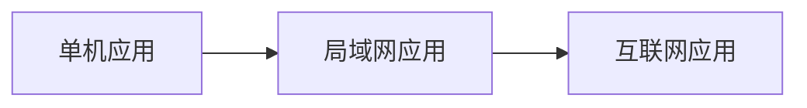

#### 客户角度看SaaS特点（图1-2）
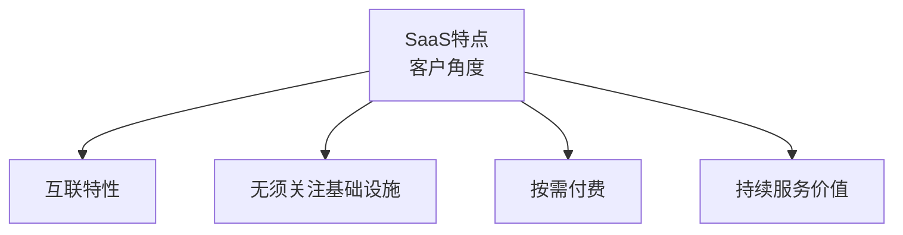

#### 服务商角度看SaaS特点（图1-3）
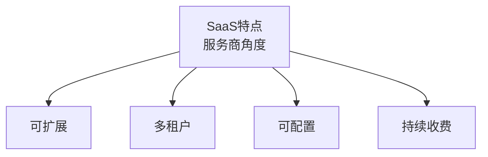

#### XaaS的三种云服务（图1-4）
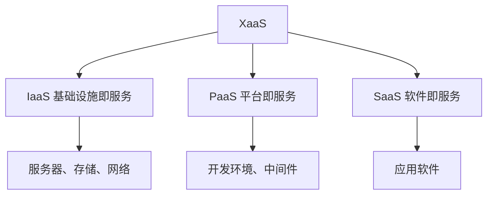

#### SaaS平台的6个优势（图1-5）
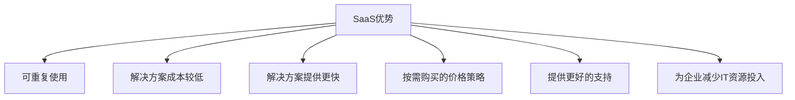

#### SaaS平台的7个局限性（图1-6）
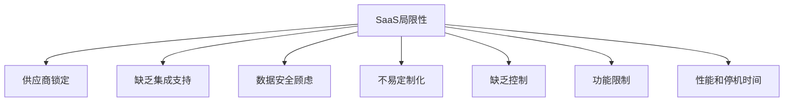

### 经典金句/数据
> “SaaS是一种服务，这是同传统软件产品最大的区别。”
> Salesforce市值（2021年8月）约2660亿美元，超过Oracle。
> “多租户设计模式能够显著降低软件使用的边际成本。”

---

## 第2章：SaaS产品战略规划
### 核心论点
问题：如何制定SaaS产品的战略与规划？作者观点：战略决定方向（做什么），规划决定步骤（怎么做）。需综合考虑外部环境、公司战略、目标用户、产品定位、商业模式、产品生命周期，并遵循迭代开发、最小闭环等原则。

### 关键概念/事件
- 产品战略6方面：外部环境、公司战略、目标用户、产品定位、商业模式、产品生命周期。
- 产品规划5步骤：明确业务目标、调研用户需求、制订实现方案、确定优先级、确定里程碑。
- 建设流程：需求调研→需求管理→产品设计→产品评审→研发→测试→上线→运营→循环。
- 迭代开发 vs 瀑布开发：迭代适合需求不明确、快速响应变化；SaaS通常采用固定周期迭代（如3-4周）。
- 敏捷开发：重视响应变更和客户价值，但SaaS仍需完整文档。
- 4个建设原则：需求环节（用户场景优先、多数人高价值需求优先、持续/重复场景才产品化）；设计环节（最小场景闭环、操作效率优先、基于现有场景抽象不增新概念）；研发环节（满足场景需求、稳定优先、提示易懂）；运营环节（不下线功能、适时提醒）。

### 逻辑推演/叙事脉络
作者首先强调战略的重要性，然后分解产品战略的六个信息维度，引导读者收集信息。接着给出产品规划的五步法，从业务目标拆解到里程碑设定。以代账发票产品为例演示了全过程。随后介绍通用建设流程，并区分迭代开发、瀑布开发和敏捷开发。最后提出SaaS产品建设的四大环节共11条原则，并介绍SWOT、PEST、波士顿矩阵、波特五力、竞争战略等实用工具。

### 流程图

#### 制定产品战略（图2-1）
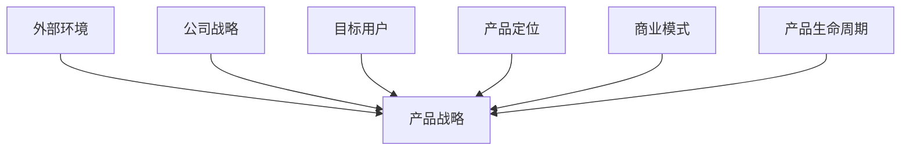

#### 产品规划过程（图2-2）
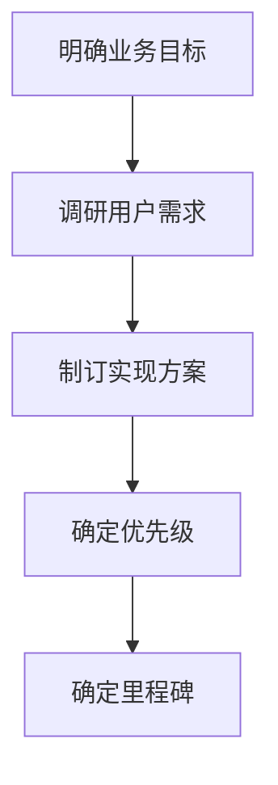

#### 产品建设流程（图2-3）
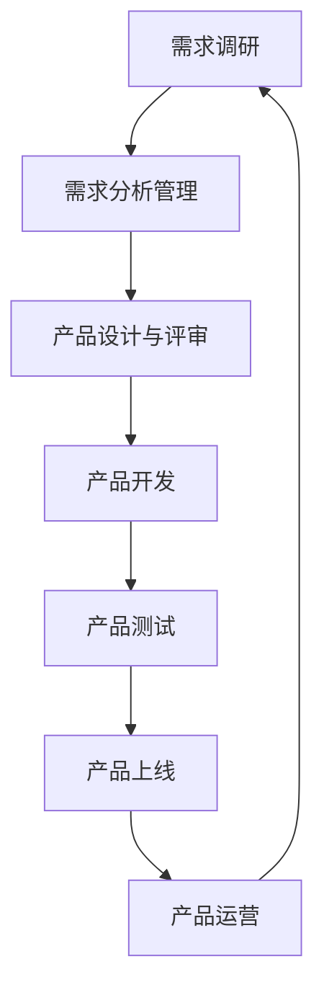

#### SaaS产品建设的原则（图2-4）
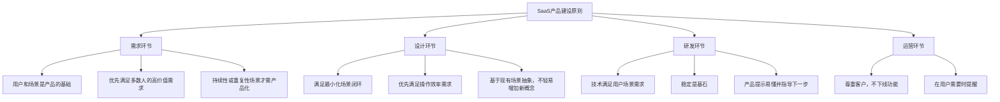

### 经典金句/数据
> “没有战略的企业就像一艘没有舵的船，只会在原地转圈。”——乔尔·罗斯
> “战略的本质问题是取舍。”
> 代账发票产品案例：半年左右从“追随者”向“领跑者”转变。
> “稳定是产品建设的基石，稳定应始终居于主要地位。”

---

## 第3章：产品调研
### 核心论点
问题：如何有效开展SaaS产品调研？作者观点：调研要“求真的态度”，通过需求调研（用户访谈、观察）和竞品分析，理解真实用户场景，而非依赖二手信息。

### 关键概念/事件
- 需求调研方法：用户访谈（灵活、深入、真实但耗时）、产品体验（直观但场景不足）、问卷调查（高效但无法深入）。
- 竞品分析维度：用户群体、用户场景、产品功能（角色、逻辑、清单、交互、迭代过程）、商业模式。
- 5W2H法：Who、Where、What、When、Why、How、How much。
- 分层设计问题：战略层（高层）、战术层（中层）、执行层（基层）。
- 调研执行：切入→观察（人、场、事、流）→提问→倾听→感受→记录→合理帮助。
- 典型用户：样本典型性非常重要，避免非典型用户误导。
- 数据会说谎：满意度调研可能只覆盖了忠诚用户。

### 逻辑推演/叙事脉络
作者先定义产品调研，区分市场调研与产品调研。然后详细展开需求调研的全过程：确定目标、制定计划、选择对象、设计问题（5W2H、分层）、执行（观察、提问、倾听等）、汇总、反馈。接着讨论竞品分析：目的、选取竞品（领导者、对标、替代品、上下游）、信息获取渠道、分析维度。对比三种调研方式的优缺点。最后给出SaaS调研注意事项：寻找典型用户、用户的回答并非真相、数据可能说谎。

### 经典金句/数据
> “凡事都要脚踏实地去作，不驰于空想，不骛于虚声。”——李大钊
> “我们需要为市场匹配一个产品，而不是为产品匹配一个市场。”
> 用户访谈优点：灵活、深入、真实；缺点：耗时长、范围窄、对人的要求高。
> “用户的回答并非真相……用户不知道自己想要什么。”

---

## 第4章：需求管理
### 核心论点
问题：如何管理SaaS产品的纷繁需求？作者观点：需求管理是持续决策过程，需对需求分类（功能性/非功能性、业务/用户/产品需求），评估优先级（ICE方法：影响、自信、容易），并控制需求变更。

### 关键概念/事件
- 需求 = 预期 - 现状。
- 需求层次：业务需求（功能健全）、用户需求（好用）、产品需求（战略和可持续发展）。
- 需求来源：调研、用户反馈（测试/客户/运营）、公司战略、产品研究、政策标准。
- KANO模型：必备型、期望型、魅力型、无差异型、反向型。
- Better-Worse系数：Better(增加满意) = (A+O)/(A+O+M+I)；Worse(消除不满意) = -1*(O+M)/(A+O+M+I)。
- ICE方法：Impact(影响力)×Confidence(自信程度)×Easy(实现难易) 综合评分排序。
- 需求变更管理：原因（前期不明确、业务不了解、业务变化）；应对（小步快跑、深入场景、可配置设计）；流程（申请→分析→决策→实施→验收）。

### 逻辑推演/叙事脉络
作者先定义需求，区分“需要”与“需求”。然后分类需求（业务、用户、产品），并说明来源。重点给出需求优先级评估方法：先用KANO模型做产品价值分类，再结合影响力、复杂度、紧急度、经济价值，形成ICE总分。强调需求记录原则：来源可追溯、场景可还原、可实现、风险可管控。最后讨论需求变更的原因及管理流程，以及需求反馈的重要性。

### 流程图

#### KANO模型（图4-1）
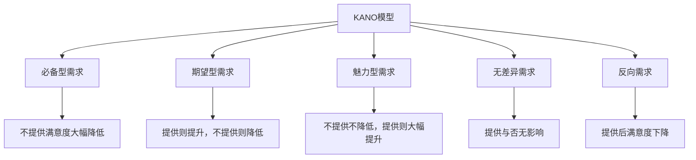

#### KANO评分对照表（图4-2）
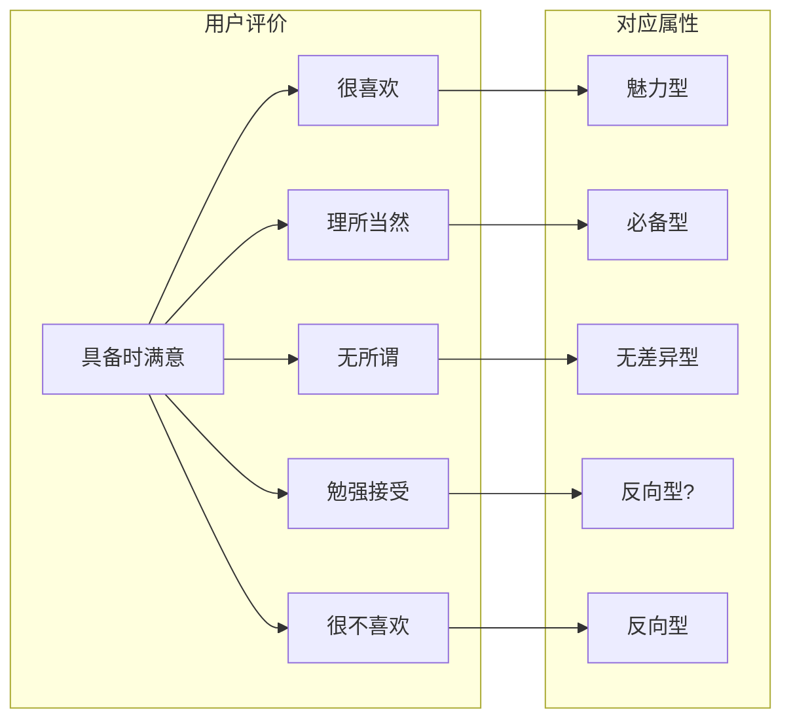

#### Better-Worse系数分析（图4-3）—— 象限图
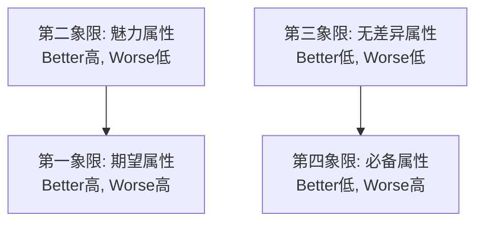

### 经典金句/数据
> “管理就是决策。”——赫伯特·西蒙
> “需求是产品不断迭代的动力之源。”
> KANO模型：必备属性优先处理，期望属性尽力满足，魅力属性提升竞争力。
> ICE评分表示例：需求影响力、自信程度、实现难易综合排序。

---

## 第5章：产品设计与评审
### 核心论点
问题：如何做好SaaS产品的设计并顺利通过评审？作者观点：设计要遵循一致性、高效、简单、可信任、延续性原则；产品架构需模块化、渐进式；需求文档要清晰全面；评审需提前沟通、控制争议、明确会后任务。

### 关键概念/事件
- 设计原则：一致性、高效、简单、可信任、延续性。
- 产品架构：对产品的结构性描述，包括前端、业务管理、运营管理、基础支撑。
- 模块化设计：低耦合高内聚，通过归类抽象和标准化接口实现复用。
- 渐进式设计：不追求一步到位，先解决核心问题，后扩展，但需预留扩展性。
- MVP（最小化可用产品）与渐进式架构的区别：MVP强调每个迭代完成最小功能闭环，可能需重构；渐进式架构尽可能在原有基础上扩展。
- 需求文档（PRD）重要部分：产品概述、功能说明、字段说明、按钮说明、业务逻辑、权限说明、特殊需求。
- 产品评审：确定与会人员、会前沟通（意见领袖）、会议预约、文档准备；会中明确范围、处理争议、把控效果；会后调整方案、评估工作量、制定进度表。
- UI设计要点：颜色、字体、按钮、组件、输入框、点选、表格、弹窗规范。

### 流程图

#### 业务架构设计框架（图5-1）—— 简化
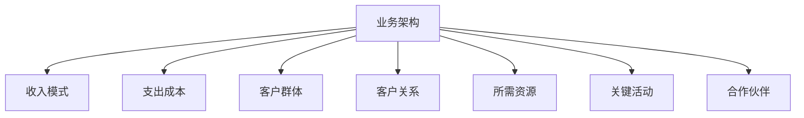

#### 产品结构示例（图5-3）
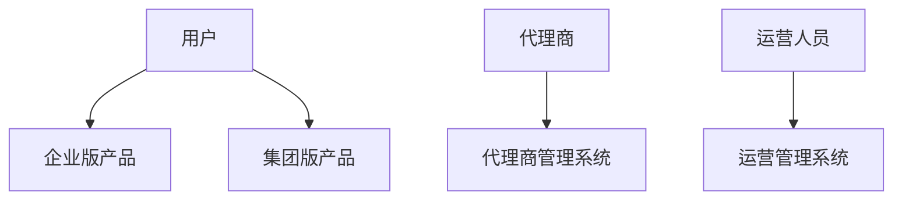

#### 产品架构示例（图5-4）
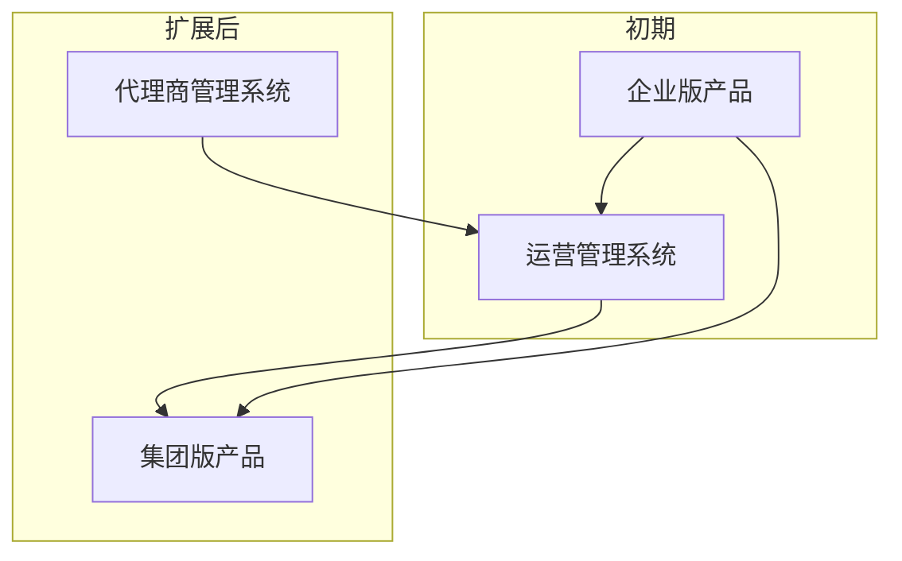

#### MVP演进（图5-5）
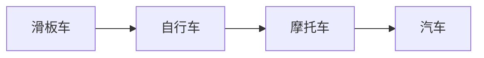

#### 运营管理子系统流程（图5-6）- 泳道图简化
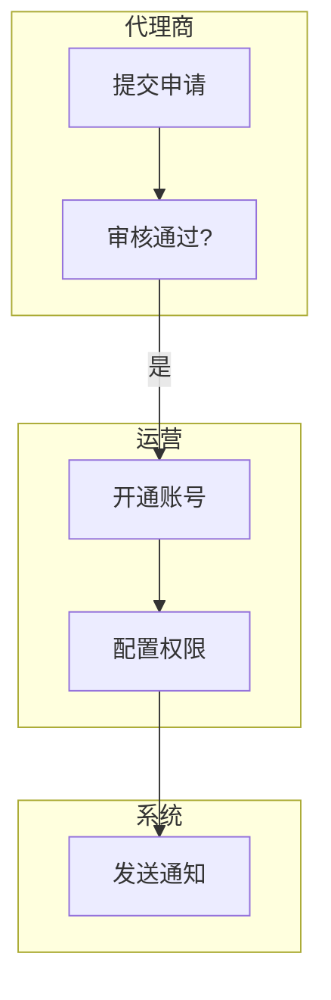

#### 通用规范示例（图5-7）—— 文本描述
### 经典金句/数据
> “为什么我们要了解人类的思维？因为产品是为人们的使用而设计的。”——唐纳德·诺曼
> “在人（指用户）和设计之间，人是不会出错的，错的只有设计。”
> “SaaS产品作为企业的生产工具，提升效率是核心使命之一。”
> 模块化设计案例：H5开票页被几百家第三方平台集成。

---

## 第6章：产品研发
### 核心论点
问题：SaaS产品研发管理的关键点有哪些？作者观点：研发需评估实现难度、工作量、合理性、扩展规划；技术架构要注重兼容性、高可用性、可扩容；采用敏捷开发，固定迭代周期，做好任务排期、进度跟进和风险管理。

### 关键概念/事件
- 需求评估注意事项：实现难度、工作量、合理性、扩展规划。
- 技术架构：基础设施层、数据资源层、服务层、应用层、展现层，以及安全/标准/运维规范。
- 多租户数据隔离方案：独立数据库、共享数据库独立Schema、共享数据库共享表。
- 技术选型原则：优先开源、成熟流行、熟悉的技术、充分调研、用发展视角。
- 概要设计与详细设计：系统内方法设计、前后端接口设计、对外接口设计（安全性、原子性、兼容性、高性能）。
- 敏捷开发特点：迭代周期稳定、持续交付价值、团队自我管理。
- 任务排期三要素：需求范围、可用资源、开发进度。
- 风险管理：识别、分析、应对、跟进。

### 流程图

#### 技术架构示例（图6-1）
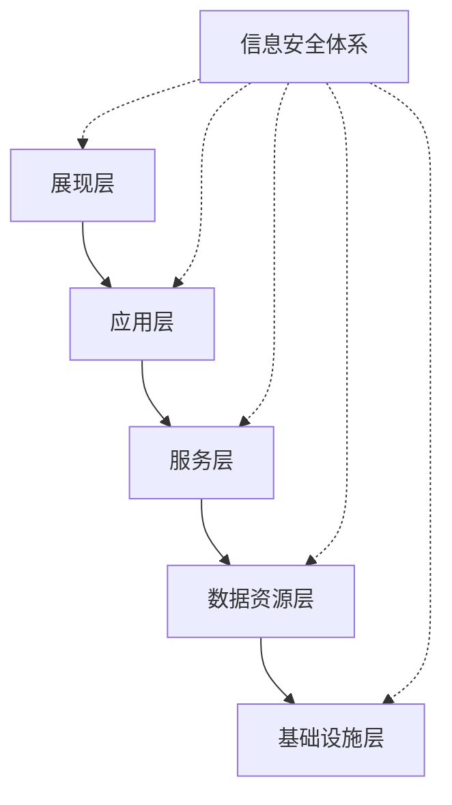

#### 前后端工作侧重点（表6-1）
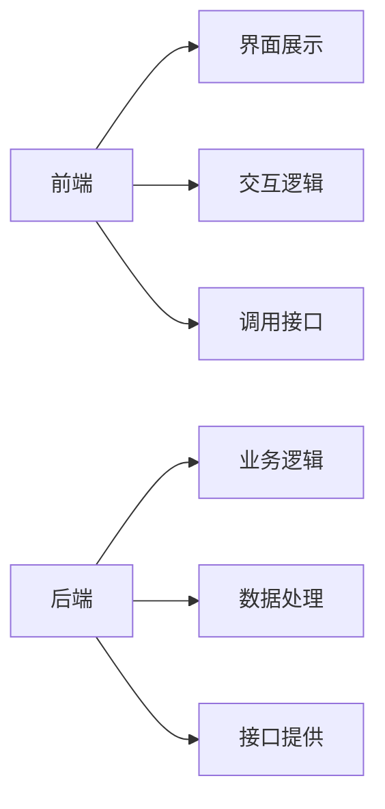

### 经典金句/数据
> “在研发中，没有捷径可走。”——比尔·盖茨
> “SaaS平台对安全性问题需要高度重视。”
> 三种数据隔离方案：独立数据库安全性最高但成本高；共享数据库共享表成本最低但隔离级别低。
> “敏捷开发不是具体的工作方式，而是一套原则和价值观。”

---

## 第7章：产品测试
### 核心论点
问题：SaaS产品测试有哪些特殊要求？作者观点：测试是一种思维方式，需覆盖功能、性能、自动化。SaaS对场景覆盖、兼容性、性能要求更高，应使用KANO、边界值等方法设计用例。

### 关键概念/事件
- 测试分类：功能测试（界面、逻辑、易用性、兼容性）、性能测试（稳定性、负载、压力、容量）、自动化测试（接口、Web、移动端）。
- 功能测试流程：计划→编写用例→评审→执行→总结。
- 性能测试流程：场景分析→脚本编写→环境准备→执行→报告。
- 自动化测试适用场景：需求变动不频繁、产品周期长、脚本可重复使用。
- SaaS测试特殊要求：场景覆盖高（多租户、多配置）、兼容性高（平台、业务、接口）、性能要求高（随用户增长）。

### 流程图

#### 测试用例执行流程（图7-2）
```mermaid
graph TD
    A[执行测试用例] --> B{实际结果与预期一致?}
    B -->|是| C[通过]
    B -->|否| D[提交Bug]
    D --> E[研发修复]
    E --> F[回归测试]
    F --> B
```

#### 性能测试流程（图7-3）
```mermaid
graph TD
    A[测试场景分析] --> B[测试脚本编写] --> C[测试环境准备] --> D[性能测试执行] --> E[测试报告总结]
```

### 经典金句/数据
> “软件测试是一种思维方式，不只是一种任务。”——卡尼尔
> “自动化测试的重点不是为了寻找新Bug，而是为了验证原有系统是不是能正常工作。”
> “SaaS产品的性能测试是一个持续的过程。”

---

## 第8章：产品上线
### 核心论点
问题：如何平稳发布SaaS产品？作者观点：上线前需验收、预发布、灰度发布，做好通知和培训，确保稳定性。原则是“不要过度承诺，但要超值交付”。

### 关键概念/事件
- 上线流程：验收→发版申请→预发布→正式发布→线上验证→上线通知→培训。
- 产品经理验收：对比功能清单与评审差异，关注交互和自定义部分。
- 业务验收：可选，目的是验证用户需求满足度。
- 预发布方案：部分节点升级、预发布环境、灰度发布、定向升级。
- 上线通知：提前发升级公告，说明影响范围。
- 产品培训：增量培训，准备资料，组织讲师。

### 流程图

#### 产品上线主要流程（图8-1）
```mermaid
graph TD
    A[测试完成] --> B[产品验收]
    B --> C[发版申请]
    C --> D[预发布环境验证]
    D --> E{验证通过?}
    E -->|是| F[正式发布]
    E -->|否| G[问题修复]
    G --> D
    F --> H[线上验证]
    H --> I[上线完成]
```

### 经典金句/数据
> “不要过度承诺，但要超值交付。”——迈克尔·戴尔
> “产品上线阶段已经是产研交付和客户验收的交接时刻。”

---

## 第9章：产品运营
### 核心论点
问题：SaaS产品如何有效运营？作者观点：运营是“养孩子”，包括获客、最佳实践总结、流程管理、售后服务。核心指标是转化率、续费率、客单价。需通过平台引流、代理商拓客，产品要简单、稳定、标准化。

### 关键概念/事件
- 运营工作内容：对接渠道、活动分享、流程处理、售后服务。
- 获客策略：平台引流（与ERP、收银系统合作）、代理商拓客。
- 最佳实践：“从客户中来，到客户中去”——通过种子用户提炼方案，再推广给更多客户。
- 运营流程：组织建设（售前、售后、运营团队）、运营所需产品建设、主要流程（合同、订单、续费、退款等）。
- 售后服务：主动服务（监控异常主动联系）和被动服务（客服入口），服务评价（解决问题+满意度）。
- 案例复盘（发票产品线）：从0到数十万客户，团队未大幅扩张。教训：模式未经验证不扩张，产品不成熟不推广。

### 流程图

#### 主要运营流程（表9-1）—— 文本提炼
- 客户注册开通流程
- 订单审核流程
- 合同审核流程
- 续费流程
- 退款流程
- 发票申请流程
- 工单处理流程
- 代理商入驻流程
- 代理商结算流程
- 数据变更流程
- 异常处理流程
- 投诉处理流程

### 经典金句/数据
> “一个市场的客户是有差异的，他们有不同的需要，寻求不同的利益。企业必须对市场进行细分。”——温德尔·史密斯
> “产品和运营之间的关系：产品负责‘生孩子’，运营负责‘养孩子’。”
> 案例：发票产品线对接数百家大中型ERP平台。
> 教训：“模式未经验证，团队扩张无意义”“产品不成熟时慎重扩张”。

---

## 第10章：SaaS产品数据分析
### 核心论点
问题：数据分析在SaaS产品中如何应用？作者观点：数据分析用于产品指标（使用率、响应效率）、经营指标（CAC、LTV、NDR等）、用户画像。需构建指标体系（原子/复合/派生指标）和标签体系，搭建数据仓库，最终赋能业务。

### 关键概念/事件
- 产品指标示例：开票时长、功能使用率、开票方式统计。
- 经营指标：CAC（获客成本）、CRC（客户留存成本）、MRR/ARR、签约额、TCV/ACV、CRR/DRR、CCR/RCR、NDR、LTV等。
- 用户画像：企业客户画像（基本信息、经营信息、行为信息等标签）。
- 指标设计：原子指标、复合指标、派生指标；指标字典表。
- 标签设计：基础标签、规则标签、模型标签；标签体系设计过程。
- 数据仓库分层：ODS贴源层→DWD明细层→DWM中间层→DWS服务层→DWT主题层→ADS应用层。
- 数据分析方法：逻辑树、多维度拆解、假设检验、RFM、漏斗分析、因果分析、对比分析。
- 数据分析感悟：需求识别、MVP、结合调研、赋能业务。

### 流程图

#### 数据应用体系的层级划分（图10-3）
```mermaid
graph TD
    A[业务系统] --> B[数据采集]
    B --> C[数据仓库]
    C --> D[数据应用]
    D --> E[报表/用户画像/机器学习/推荐系统]
```

#### 数据仓库分层（图10-5）
```mermaid
graph TD
    A[数据源] --> B[ODS贴源层]
    B --> C[DWD明细层]
    C --> D[DWM中间层]
    D --> E[DWS服务层/宽表]
    E --> F[DWT主题层]
    F --> G[ADS应用层]
```

#### 推荐系统的构建过程（图10-6）
```mermaid
graph TD
    A[数据来源] --> B[特征工程]
    B --> C[推荐算法训练]
    C --> D[推荐模型]
    D --> E[预测/推断]
    E --> F[推荐结果]
```

#### 营销漏斗（图10-7）
```mermaid
graph TD
    A[获取用户] --> B[激活用户]
    B --> C[留存用户]
    C --> D[收入]
    D --> E[传播]
```

#### 决策流程参考图（图10-8）
```mermaid
graph TD
    A[业务问题] --> B[数据采集]
    B --> C[数据分析]
    C --> D[洞察建议]
    D --> E[业务决策]
    E --> F[执行]
    F --> A
```

### 经典金句/数据
> “一些最好的理论是在收集数据之后，因为这样你就会意识到另一个现实。”——罗伯特·希勒
> “数据分析的终极意义——赋能业务。”
> 获客成本CAC = (市场+销售费用总和)/新获取客户数量。
> 金额净留存率NDR = 上期订阅客户本期贡献MRR/上期订阅客户上期贡献MRR。

---

## 第11章：SaaS与AI
### 核心论点
问题：AI如何与SaaS结合？作者观点：AI在计算机视觉、自然语言处理、机器学习等方面可赋能SaaS产品，提升产品能力（如OCR、税收编码匹配）、营销、智能客服、数据分析。需应对数据隐私、技术集成、数据质量挑战。

### 关键概念/事件
- AI主要能力：计算机视觉（图像识别、视频监控、医学影像）、自然语言处理（理解、生成、翻译、情感分析）、语音识别。
- AI学习方式：监督学习、无监督学习、半监督学习、强化学习；深度学习。
- AI在SaaS应用场景：
  - 产品能力提升：图像识别提高票据处理效率；机器学习匹配税收分类编码（从规则到神经网络模型）。
  - SaaS营销：个性化推荐、产品使用指引、快速帮助。
  - 智能客服：基于大模型的微调。
  - 数据分析：预处理、探索、预测、决策。
- 挑战与应对：
  - 数据隐私与安全：数据脱敏、加密、访问控制、企业专有模型。
  - 技术集成：了解AI技术栈，与外部公司合作。
  - 数据质量问题：清洗、预处理、人工标注。

### 流程图

#### 税收分类编码机器学习匹配流程（文本描述）
```mermaid
graph TD
    A[数据收集与处理] --> B[特征工程]
    B --> C[模型选择与训练]
    C --> D[模型评估与调整]
    D --> E[模型部署]
    E --> F[业务系统调用]
    F --> G[用户反馈调整]
    G --> A
```

### 经典金句/数据
> “我相信人工智能将改变人类的未来，但必须牢记，人工智能是为了服务人类，而不是取代人类。”——埃隆·马斯克
> “AI将会像互联网一样，成为整个社会的基础设施。”
> 税收分类编码仅4000余种，商品品类多达数百万种，传统规则无法穷举，AI匹配准确率显著提升。

---

## 第12章：SaaS平台展望
### 核心论点
问题：SaaS平台未来如何发展？作者观点：企业的根本需求是开源、节流、合规。SaaS行业面临“慢”、过度定制、场景化要求高的特点。未来将形成“企业操作系统”，实现一站式服务和数据流转。中小型企业需要生态平台，大中型企业需要PaaS和开放API。

### 关键概念/事件
- 企业需求：开源（增收）、节流（降本增效）、合规（降低风险）。
- 企业服务特点：“慢”（决策、实施、见效慢）、过度定制、场景化要求高。
- 企业选择服务的痛点：产品选择困难、报价不透明、数据不流转、产品体验不够好。
- SaaS行业困境：市场需要培育、重视程度低、盈利周期长、人才缺乏。
- 对SaaS平台建设的建议：技术场景化、产品即服务（系统驱动人）、打造公信力。
- 未来预测：中小型企业需要一站式服务（企业操作系统）；大中型企业需要PaaS平台和API开放生态。

### 流程图

#### 企业操作系统生态示意图（文本描述）
```mermaid
graph TD
    A[企业操作系统] --> B[交易类服务<br/>商城/物流/支付/营销]
    A --> C[管理类服务<br/>采购/报销/发票/财税/HR/协同]
    B --> D[数据流转]
    C --> D
    D --> E[统一组织架构/登录/评价体系]
```

### 经典金句/数据
> “企业之所以会存在，就是为了要向顾客提供满意的商品和服务。”——彼得·德鲁克
> “SaaS本质上是一种能力的复用，具备边际效应。”
> “我们现在要做的，就是打造符合市场需求的SaaS产品。”

---

## 后记
### 核心论点
作者回顾写作过程（历时两年），回应市场对SaaS的质疑，认为SaaS的边际效应规律决定其最终会被市场接受。以自己的细分领域（财税SaaS）为例，已实现良好盈利水平，证明SaaS模式的可行性。

### 关键概念/事件
- 写作耗时两年，认知不断调整。
- 面对“中国SaaS水土不服”的观点，作者认为这是发展必经阶段。
- 相信规律的魅力：SaaS复用性带来边际成本递减。
- 作者所在财税SaaS细分领域已实现良好盈利，续费率可观。

### 经典金句/数据
> “我相信规律的魅力。SaaS本质上是一种能力的复用，具备边际效应。”
> “选择好方向，为市场匹配一个好的产品，坚持做下去，平台发展自然会逐步进入良性的循环。”

---

## 推荐阅读
- 《To B增长实战：获客、营销、运营与管理》（ISBN: 978-7-111-71013-4）
- 《To B增长实战：高阶思维与实战技能全解》（ISBN: 978-7-111-74427-6）

---

> 注：本书所有流程图基于原文描述重建，部分复杂图表（如UI设计示例中的颜色搭配、字体规范等）因无法以Mermaid准确还原，已省略或转为文本说明。完整图表请参考原书。


