# 《SaaS产品经理从菜鸟到专家：技能树详解与商业实战进阶》章节总结

## 书籍信息
- **书名**：SaaS产品经理从菜鸟到专家：技能树详解与商业实战进阶
- **作者**：王戴明
- **出版信息**：清华大学出版社，2022年5月第1版
- **PDF状态**：可识别，内容完整
- **OCR状态**：良好，部分图表需重建

## 目录说明
- **目录识别情况**：完整识别，共5章+后记
- **章节对应依据**：按原书页码顺序逐章整理
- **OCR修复说明**：部分流程图、表格已按原文逻辑重建为Mermaid格式

## 全书核心主题
本书围绕如何成为一名优秀的SaaS产品经理展开，理论与实践并重。作者王戴明基于自身从Oracle到SaaS创业公司的转型经历，系统阐述了SaaS产品经理所需的六大素养、五大技能，并通过完整案例演示了从0到1规划SaaS标准化产品的全过程。最后进阶部分深入探讨SaaS战略、策略、护城河与陷阱，培养产品经理与CEO平等对话的商业思维能力。核心理念是：优秀的SaaS产品经理是最接近CEO的人，必须具备产品热情、究竟精神、结构化思维和商业意识。

---

## 第1章：SaaS基础知识

### 1. 核心论点
本章解决“什么是SaaS”以及“为什么要选择SaaS行业”的问题。作者认为：SaaS是一种创新的B端软件商业模式，其核心是“只租不卖”的订阅制；中国SaaS市场正处于高速增长期，是产品经理实现职业价值的黄金赛道。

### 2. 关键概念
- **SaaS定义**：客户不需要购买软件所有权，而仅根据使用量（使用时长、账号数等）付费；大部分SaaS软件通过互联网直接访问，客户主要使用标准功能。
- **传统B端软件模式**：一次性售卖软件 + 实施上线（大量定制开发）+ 售后运维；厂商80%收入为一次性收入。
- **SaaS模式**：出租软件使用权 + 实施上线（少量定制）+ 配套服务（帮助客户用好软件）；厂商每年获得平衡收入，客户按年付费。
- **SaaS真相**：贝尼奥夫并没有发明“更好的”商业模式，SaaS模式对标准化产品能力提出了极高要求。
- **LTV（客户生命周期总价值）**：SaaS公司盈利的关键指标，需要追求最大化客户生命周期价值。

### 3. 逻辑推演
作者首先对比传统B端软件与SaaS模式在商业模式、交付成本、持续收入等方面的差异，指出传统ERP存在忽视一线用户、高昂交付成本、难以持续收入三大缺陷。然后以Salesforce为鼻祖，梳理SaaS从萌芽到爆发的发展历程。接着分析中国SaaS市场：2020年全球公有云服务中美国占57.2%，中国仅占6.2%，但未来5年将以29.5%的年复合增长率增长。最后给出行业选择建议：不只看行业规模，更要看公司核心竞争力。

### 4. 经典金句/数据

> “SaaS是B端软件领域的一种创新商业模式，客户不需要购买软件的所有权，而只是根据使用量付费。”（p.29）

> “选择SaaS公司就像参与创业，最重要的不是谁走得快，而是谁走得远。”（p.39）

> “Salesforce市值超越Oracle，标志着SaaS模式正式颠覆了传统B端软件模式。”（p.33）

> 中国SaaS市场未来5年CAGR 29.5%（IDC数据）（p.34）

---

## 第2章：SaaS产品经理的6大素养

### 1. 核心论点
本章回答“优秀的SaaS产品经理需要具备哪些核心素养”的问题。作者认为：热情、究竟精神、自以为非、学习能力、结构化思维、沟通能力是六大关键素养，这些素养可以通过刻意练习培养。

### 2. 关键概念
- **热情**：把产品当作自己的小孩，愿意为产品成长牺牲个人时间。
- **究竟精神**：两层含义——刨根问底寻求真相；追求极致的工作结果到能力范围内的最好。
- **自以为非**：出现问题时下意识反问“是不是我哪里做得不好”，保持敬畏心。
- **系统学习**：制定目标→策略与计划→资源准备→计划执行，一次性把该学的知识点学到位。
- **127学习法则**：有效学习=10%知识+20%练习+70%实践。
- **结构化思维**：通过梳理事物的结构来引导思维和表达，把散乱的信息“串成项链”。
- **沟通的“心-脑-手”模型**：先打开对方心扉（心），再传递观点（脑），最后促使行动（手）。

### 3. 逻辑推演
作者以自己从Oracle转型SaaS的经历为引，提出六大素养。热情促进成长并征服客户，可通过“把产品视为人生作品、和客户做朋友、定期监测数据”培养。究竟精神用于识别伪需求和培养架构能力，可通过“凡事多问为什么、问自己是否做到极致”培养。自以为非用于弥补缺点和保持敬畏心。学习能力方面提出系统学习、知行合一、保持质疑、克服惰性四种方式，以及阅读、研究成熟系统、客户调研、复盘四种自学方法。结构化思维可通过阅读经典管理书籍、掌握经典思维模型（PDCA、4P、客户生命周期）、使用辅助工具（思维脑图、流程图）、日常运用来培养。沟通能力强调打开对方心扉是前提。

### 4. 流程图

#### 客户生命周期模型
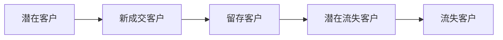

#### PDCA循环
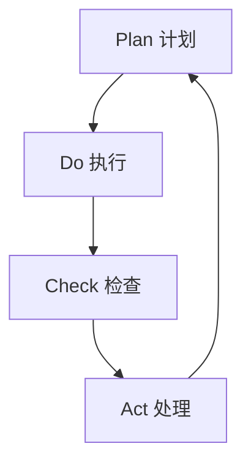

#### 4P营销模型
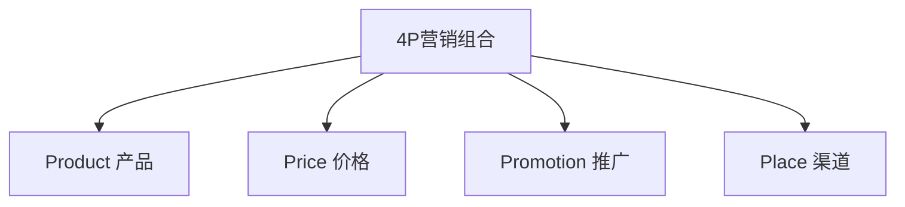

### 5. 经典金句/数据

> “所谓热情，就是把产品当作自己的小孩。”（p.51）

> “做SaaS就是画好棋盘，正确落子。”（p.56）

> “真正好的书籍是值得我们反复阅读的。我读了8遍《启示录：打造用户喜爱的产品》。”（p.67）

> “到达目的地的最短距离，往往不是一条直线。”（p.81）

---

## 第3章：SaaS产品经理的5大技能

### 1. 核心论点
本章回答“SaaS产品经理需要掌握哪些专业技能”的问题。作者认为：竞品分析、业务调研、方案编写、产品规划、团队管理是五大核心技能，其中团队管理是从“自己设计”到“团队设计”的关键跃迁。

### 2. 关键概念
- **竞品分析五层模型**：战略层（定位）、资源层（资金/客户/数据）、能力层（PaaS/技术/创新）、场景层（功能覆盖）、感受层（体验/效率/美观）。
- **业务调研六要素**：组织架构和岗位、业务概况、业务详细说明、管理报表、现有系统、用户期望。
- **方案编写三原则**：聚焦重点（MVP）、保持究竟精神、长远规划。
- **产品规划五部分**：复盘、机会分析、目标、策略、计划与资源。
- **管理的本质**：与人打交道的艺术，必须学会借助他人力量实现目标。

### 3. 逻辑推演
竞品分析：不要简单复制功能，要从战略层→资源与能力层→场景与感受层逐层分析。业务调研：按“组织架构→经营策略→整体流程→详细流程”思路，确保全面、清晰、重点突出。方案编写：整体方案需包含方案概要、整体流程图、系统架构图、多组织架构设计；详细方案需包含需求合理性分析、成功指标、方案要点、详细流程图、原型图。产品规划：正确方法应包含机会分析、目标、策略、计划与资源，策略是填平“目标”与“计划”鸿沟的关键。团队管理：处理好与自己的关系（接受依赖他人、接受挫败感、管理时间）、与下属的关系（建立信任、帮助员工、激励员工）、与上级的关系（理解目标、为结果负责、培养团队）、与其他部门的关系（搞好关系、了解对方利益）。

### 4. 流程图

#### 竞品分析五层模型
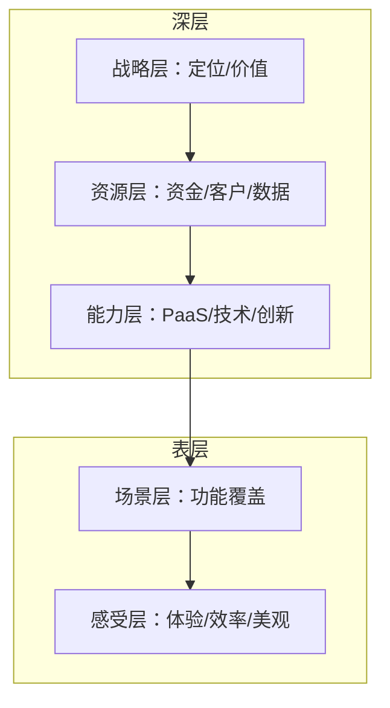

#### 产品规划结构
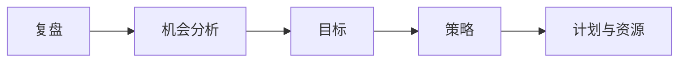

#### 多组织架构设计逻辑
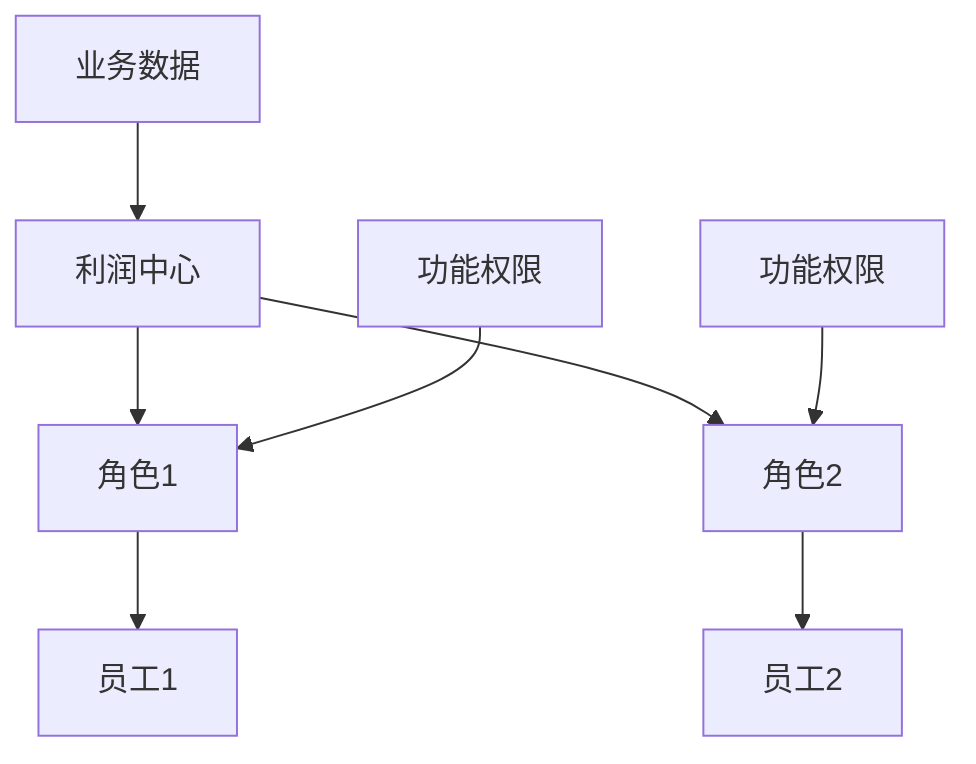

### 5. 经典金句/数据

> “学我者生，似我者死。”（p.85）

> “SaaS产品经理和内部B端产品经理的核心差异在于，SaaS产品经理可以直接为商业结果负责。”（p.184）

> “策略可以填平‘目标’和‘计划’之间的鸿沟。”（p.114）

> “焦虑+反思=进步”（引用自达利欧《原则》）（p.129）

---

## 第4章：从0到1规划一款SaaS标准化产品

### 1. 核心论点
本章通过小张的完整案例，演示从0到1规划SaaS标准化产品的全过程。作者强调：需求筛选（要不要做+优先级）、需求梳理（策略层+业务层）、整体方案（概要+流程图+架构+多组织）、详细方案（重点说明+流程+原型）四个阶段缺一不可。

### 2. 关键概念
- **RICE评估法**：优先级评估四因素——触达（Reach）、影响力（Impact）、信心度（Confidence）、努力（Effort）。
- **标准化判断两维度**：行业维度（是否有成型方法论）+ 产品维度（功能能否匹配方法论并兼容个性化）。
- **三类组织架构**：总部组织（全局权限）、内部业务组织（自身数据权限）、外部业务组织（挂靠在内部组织下）。
- **利润中心**：抽象的数据权限单元，所有业务数据必须归属于一个利润中心。
- **MVP阶段**：最小化可行产品，验证核心价值。

### 3. 逻辑推演
案例背景：A公司服务于快消品经销商，面临LTV不高和竞争激烈问题，小张寻找第二增长曲线。需求筛选：面对快消品厂商需求，用“是否匹配核心能力”和“是否能标准化”判断为“可做”，用RICE评估优先级。需求梳理：策略层梳理客户两种分销模式（KA直销+深度分销），业务层梳理业务重难点（App体验是核心）、组织架构、业务流程、管理报表、系统集成。整体方案：包含方案概要、整体流程图、应用架构设计（复用基础模块、开发新模块）、多组织架构设计（三类组织+利润中心）。详细方案：任务分工、重点方案（AI识别虚假照片）、详细流程、原型设计、管理报表方案、系统集成方案。

### 4. 流程图

#### 案例业务核心流程
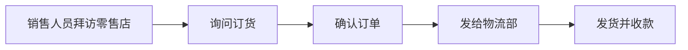

#### KA直销 vs 深度分销
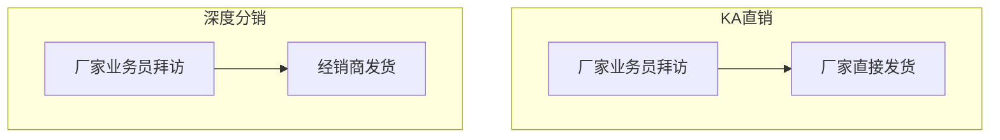

#### 整体方案流程图（深度分销）
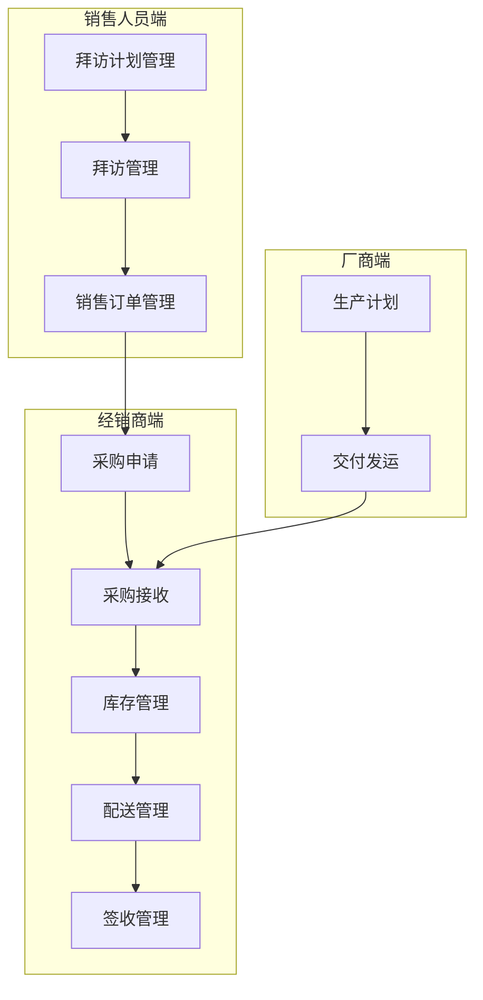

#### 应用架构设计
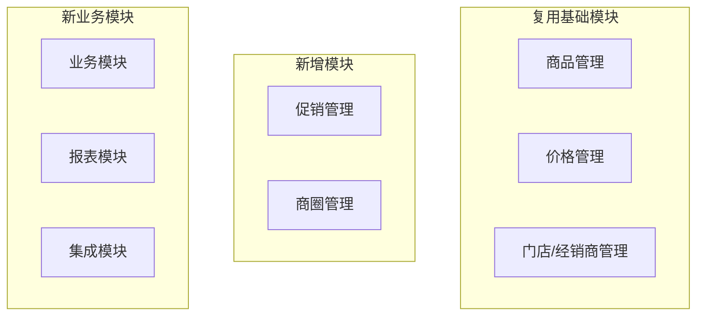

### 5. 经典金句/数据

> “永远要相信客户‘存在一个需求’，但永远不要轻信客户‘搞清楚了自己的需求’。”（p.140）

> “20%的功能将决定客户80%的口碑。”（p.142）

> “任何问题在调研阶段被发现，纠正的成本都是最低的。”（p.146）

> “SaaS产品经理需要承担起更多的责任——因为这个项目最重要的意义，并不在于服务好某一个特定的客户，而在于打造一个真正优秀的SaaS产品。”（p.149）

---

## 第5章：SaaS产品经理进阶

### 1. 核心论点
本章回答“如何从产品经理成长为与CEO平等对话的商业领袖”的问题。作者认为：SaaS产品经理必须具备商业思维，理解战略（市场战略+产品战略+运营战略）、策略（产品策略+增长策略+盈利策略）、护城河与陷阱，才能真正为产品商业结果负责。

### 2. 关键概念
- **市场战略两维度**：产品维度（业务垂直型 vs 行业垂直型）、客户维度（大企业 vs 小企业）。
- **产品战略四形态**：工具型SaaS（提高效率）、管理型SaaS（管理流程）、业务型SaaS（服务交易）、平台型SaaS（生态聚合）。
- **运营战略**：费用维度（免费 vs 收费）+ 服务维度（纯SaaS vs SaaS+ vs +SaaS）。
- **SaaS产品七策略**：切入策略（找传统软件薄弱点）、设计策略（标准化）、资源策略（单点突破）、规划策略（着眼长远）、原型阶段策略（与用户共创）、MVP阶段策略（需求管理）、PMF阶段策略（谨慎扩张）。
- **客户旅程七阶段**：需求萌生→深入认知→选择产品→上线使用→用户存活→产生黏性→续约增购。
- **SaaS七种护城河**：网络效应、数据沉淀、替换成本、品牌、规模效应、PaaS能力、生态。
- **SaaS创业六大陷阱**：传统软件经验陷阱、销售能力陷阱、产品定位错误陷阱、定制化陷阱、融资陷阱、扩张陷阱。

### 3. 逻辑推演
战略分析：战略=定位，回答客户是谁、痛点是什么、解决方案、为何选我们、是否愿意持续付费。市场战略从产品维度（业务垂直型vs行业垂直型）和客户维度（大企业vs小企业）展开。产品战略分为工具型、管理型、业务型、平台型。运营战略包括费用维度和服务维度。策略分析：产品策略七条，核心是标准化和单点突破。增长策略围绕客户旅程七阶段，拆解营销策略（触达客户→建立联系→培育线索→转交线索）和销售策略（销售组织→销售流程→CRM系统→部门协同）。盈利策略关注LTV、CAC、流失率等指标。护城河：中国SaaS面临巨头竞争、价格战、客户流失三大挑战，需构建7种护城河。陷阱：六大陷阱中“强大的销售能力”可能成为创业失败的加速器。未来预判：SaaS将成为企业标配、AI深度融入、行业垂直型崛起、平台生态成型。

### 4. 流程图

#### 客户旅程七阶段
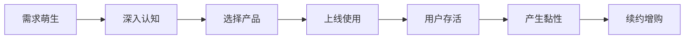

#### SaaS增长策略框架
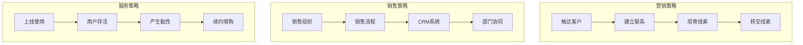

#### 触达客户三大渠道
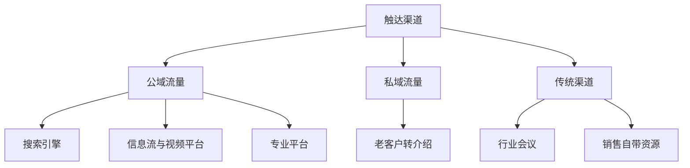

#### 产品扩张的一横一纵
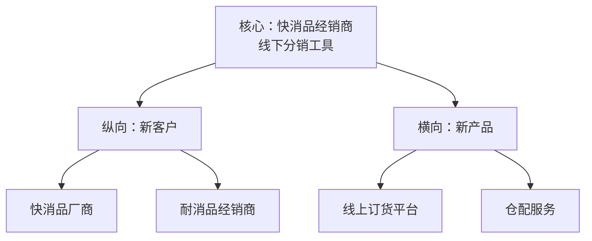

#### SaaS七种护城河
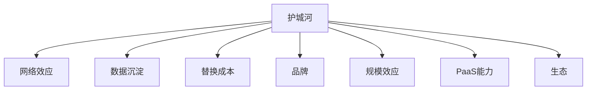

### 5. 经典金句/数据

> “战略就是定位。”（p.139）

> “SaaS产品研发的第一策略就是：从传统软件薄弱的点切入。”（p.178）

> “标准化是SaaS商业模式的精髓。”（p.179）

> “最糟糕的事情并不是产品定位错误，而是产品定位错误的同时拥有太强大的销售能力。”（推荐序，p.12）

> “如果我们做真正的SaaS产品，就应该按照MVP的原则，先验证产品价值，再招募销售团队。”（p.200）

> “创新，就是用新方法解决老问题。”（p.178）

> “把咨询工作服务化，把服务工作产品化。”（引用神策CEO桑文锋）（p.178）

---

## 后记

### 核心信息
作者回顾写作初心：帮助初学者更快成为优秀SaaS产品经理，帮助产品经理更快成为产品总监乃至产品合伙人。作者强调：SaaS产品经理“有人带”是特例，“没人带”才是常态，必须抱着“依靠自己华丽转身”的决心和信心。

### 经典金句

> “如果你不努力，再好的老师也帮不上忙；反之，就算没有老师，只要你努力学习，并且找对方法，也一样可以实现华丽转身。”（p.19）

> “并不是SaaS产品经理稀缺，而是具有商业思维的SaaS产品经理太少，特别是‘能与CEO平等对话’的SaaS产品经理太少。”（p.19）

---