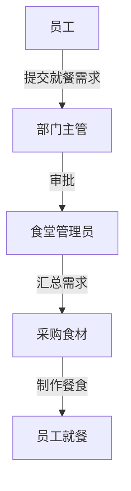
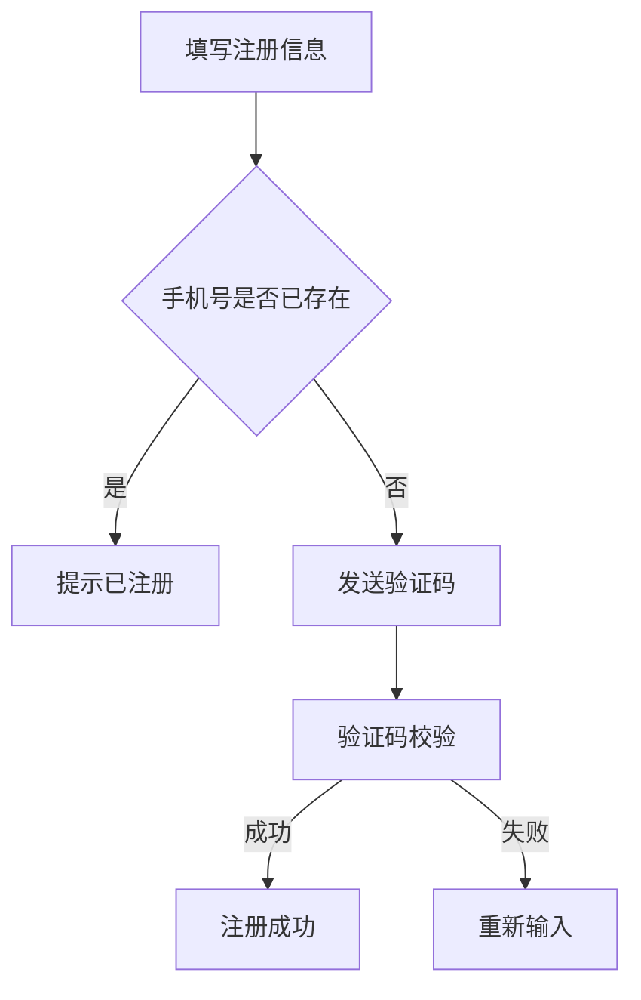
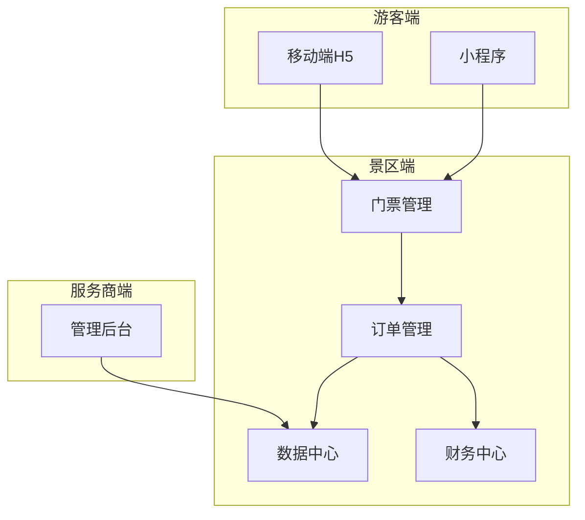
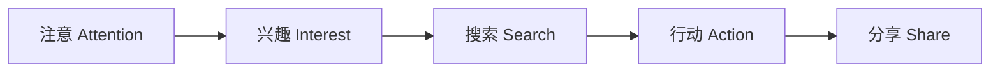
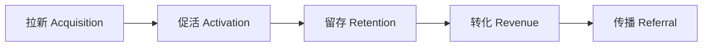
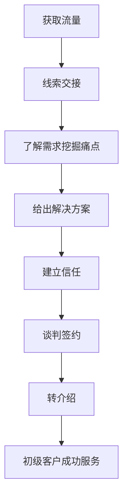
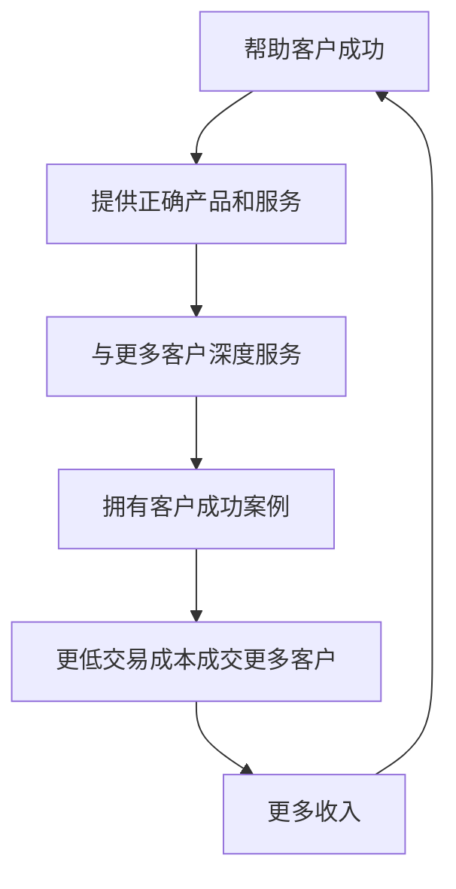

# 《SaaS创业之路：产品、营销、服务、经营实践与思考》章节总结

## 书籍信息
- 书名：SaaS创业之路：产品、营销、服务、经营实践与思考
- 作者：丰宪飞 编著
- 出版社：电子工业出版社
- 出版时间：2022年6月
- ISBN：9787121434150
- PDF 状态：基于完整epub文本识别，内容可读。
- OCR 状态：无需OCR修复，文本清晰。

## 目录说明
- 目录识别情况：完整识别，包含前言、绪论、第1-12章、后记。
- 章节对应依据：严格按原书目录顺序输出。
- OCR 修复说明：无。

## 全书核心主题
本书系统讲解了SaaS创业的完整知识体系，涵盖产品战略、规划、设计、研发管理，以及获客、销售、客户成功服务，再到商业模式、经营战略和创业实践反思。作者强调SaaS创业需要全局视角，从“帮助客户解决具体业务问题”出发，量化产品价值，并通过产品、市场、销售、客户成功四大体系的协同实现可持续增长。书中提供了大量方法论工具（如STP、PDCA、Scrum）和实际案例，总结了13种SaaS创业失败的关键原因，对SaaS从业者具有实操指导意义。

---

## 前言
### 核心论点
本书旨在为SaaS从业者提供产品、营销、服务、经营的体系化知识，帮助读者从全局理解SaaS创业的关键经营活动。作者基于自身公众号“小飞哥笔记”的积累和连续5年创业经验，系统输出方法论。

### 关键概念/事件
- **SaaS全生命周期知识**：产品、获客、转化、客户成功、战略、商业模式、经营。
- **写作动因**：获得公众号粉丝过万的正反馈，受电子工业出版社邀请。
- **读者对象**：产品经理、市场人员、销售人员、客户成功人员、创业者等。

---

## 绪论：SaaS概述及机遇
### 核心论点
问题：如何理解SaaS及其机遇？观点：SaaS是软件即服务，企业无需购买硬件和自建IT团队，按需租赁即可。中国SaaS机遇主要来自中小型企业、大型企业降本需求、产业链创新。

### 关键概念/事件
- **SaaS定义**：Software-as-a-Service，服务商提供网络基础设施、实施、维护，企业按租赁使用。
- **类比**：从每家自己挖井 → 集中供水（SaaS模式）。
- **分类一**：业务垂直型（解决某业务环节，如CRM）和行业垂直型（解决垂直行业问题，如餐饮SaaS）。
- **分类二**：工具型（降本增效，如钉钉）和商业型（营销销售一体化，如有赞）。
- **发展阶段**：2005年模仿 → 2010年创业增多 → 2015年技术竞争 → 2021年业务创新驱动。
- **机遇来源**：4000多万家中小型企业未数字化；大型企业降本需求；产业链上下游数据创新。

---

# 第1部分：SaaS产品整体规划、设计及管理

## 第1章：SaaS产品战略
### 核心论点
问题：如何制定SaaS产品战略？观点：战略的核心是STP（市场细分、目标市场选择、定位），并通过分析当前形势、制定指导方针、设计连贯性活动来落地。同时，产品必须解决具体业务问题并量化价值。

### 关键概念/事件
- **STP方法**：
  - 市场细分：按地理位置、业务、行业、客户类型、产品类型。
  - 目标市场选择：评估市场增长率、规模、获利性、竞争对手、激烈程度、垄断概率。
  - 定位：独特价值主张（替谁解决什么问题）。
- **制定指导方针框架**：分析当前形势（PEST、SWOT、3C）→ 发现重大问题 → 制定指导方针 → 设计连贯性活动（产品、市场、销售、客户成功等）。
- **产品核心价值四维度**：
  1. 解决某个业务问题（如CRM）。
  2. 完成业务目标（源于“落差”：现在与未来、过去与现在、预防未来问题）。
  3. 给出最优解决方案（优于传统方案和竞品）。
  4. 量化衡量（价值可量化，客户按效果付费）。

### 逻辑推演
作者从战略重要性出发，提出STP是选择战场的武器。市场细分后选择目标市场，再定位。然后通过PEST/SWOT/3C分析形势，找出客户问题作为重大问题，制定指导方针（如“通过软件+代运营助力餐饮企业业绩增长”），最后设计一系列经营活动。同时强调SaaS产品价值必须可量化，否则难以说服客户。

### 经典金句/数据
> “客户购买SaaS产品是为了让自己完成业务目标，所以找到客户的业务问题，并给出合适的SaaS产品解决方案才是正道。”
> “一款好的SaaS产品能给客户带来的价值是可以量化的。”

---

## 第2章：SaaS产品规划
### 核心论点
问题：如何进行SaaS产品规划？观点：从需求类型、收集、分析、管理出发，搭建产品架构，制定年度规划，并把握不同生命周期（MVP、PMF、成长期、成熟期）的重点。

### 关键概念/事件
- **需求三种类型**：
  - 战略需求：北极星指标。
  - 用户需求：通过访谈、调查、观察等收集。
  - 产品需求：功能性需求（业务流程/场景分析）和非功能性需求（ISO/IEC 25010标准）。
- **需求收集7维度**：客户画像、调研角色、核心关注点、工作职责、核心工作流、相关度、影响度。
- **需求分析**：业务流程梳理（部门级/个人级流程图）+ 业务场景分析（场景七要素：用户、环境、时机、目标、动作、载体、任务）。
- **需求管理**：全生命周期（收集→分析→确定→评审→推进→变更）；需求库要素（需求、优先级、评估、状态、变更）；需求取舍标准（战略方针、用户价值+商业价值、无必要不设计）。
- **产品架构搭建**：多端（前台、中台、后台）组合，功能分类整合，数据流转连接模块。
- **产品年度规划**：愿景 → 机会与问题分析 → 明确战略定位 → 战略路线图（产品组合、顺序）→ 产品路线图（架构+节奏）。
- **生命周期重点**：
  - MVP：产品可用。
  - PMF：产品可卖。
  - 快速成长期：持续迭代+增加产品矩阵。
  - 成熟期：探索第二条发展曲线（暗能力）。

### 逻辑推演
从需求入手，区分战略/用户/产品需求。收集时用7维度表，分析时用流程图和场景法。管理需求要建库、排序优先级。产品架构要体现业务理解，通过数据连接模块。年度规划要结合愿景和机会。不同阶段侧重点不同，MVP要可用，PMF要可卖，成长期要规模化，成熟期要创新。

### 流程图（重建）
#### 部门级流程图示例（食堂管理）

#### 个人级流程图示例（商家注册）

#### 产品架构图（某景区SaaS）

### 经典金句/数据
> “业务场景是产品往下设计的原点，如果这项工作没做好，设计出来的产品就可能没有使用价值。”
> “ToB业务的正确迭代思路应该是这样的：先造一个有轮子、有发动机可以跑的车；然后不断地补上窗户、座位、外壳等。”

---

## 第3章：SaaS产品设计
### 核心论点
问题：如何做好SaaS产品设计？观点：梳理信息架构图，进行产品交互，撰写PRD，采用多种方法满足个性化需求（功能可配置、业务系统可配置、模板、插件、二次开发等），并遵循9项设计原则。

### 关键概念/事件
- **信息架构图**：从功能模块拆解到最小数据单元（如房型模块包含房型名称、价格、图片等）。
- **产品交互**：梳理使用流程 → 确定页面数 → 绘制页面。
- **PRD要素**：项目概述、系统需求、设计方案、进度计划（建议用Axure附标注）。
- **个性化需求满足方法**：
  - 功能可配置（开关）
  - 业务系统可配置（服务商或客户配置）
  - 多套模板（店铺模板）
  - 插件/应用（引入第三方）
  - 支持二次开发
  - 角色权限可配置
  - 不提供标品，只提供能力（如自定义客户生命周期阶段）
  - 多个版本
- **产品设计9项原则**：
  1. 想清楚解决什么业务问题
  2. 能给客户带来价值（新体验-旧体验-替换成本 > 0）
  3. 能实现商业价值
  4. 产品架构可拓展
  5. 高内聚、低耦合
  6. 回到业务场景
  7. 系统稳定是底线
  8. 保持高效性
  9. 名词注释通俗易懂

### 逻辑推演
从信息架构开始，逐步细化到交互和文档。个性化需求是SaaS难点，提供了多种配置方案，但要把握好灵活度，避免过度设计。最后列出9项原则，强调客户价值公式（俞军公式）和系统稳定性。

### 经典金句/数据
> “客户价值 = 新体验 - 旧体验 - 替换成本”
> “如果个性化设计的灵活度过高、配置项多，就会造成页面不简洁且操作麻烦，增加客户的工作量，还会大大增加开发成本和延长开发周期。”

---

## 第4章：SaaS产品研发与管理
### 核心论点
问题：产品研发和项目管理怎么做？观点：研发要注意性能、稳定性、安全性；项目管理用PDCA循环保证质量，用Scrum保证效率，沟通是关键；上线后通过数据收集分析持续迭代。

### 关键概念/事件
- **研发注意问题**：性能负载、稳定容错、可持续维护性、业务安全性（风控、反垃圾等）。
- **项目管理全流程**：产品规划/设计 → UI设计/开发/测试 → 上线前/后。
- **PDCA循环**：计划(Plan)-执行(Do)-检查(Check)-处理(Act)。
- **Scrum框架**：
  - 3角色：产品负责人、Scrum专家、团队成员
  - 3物件：产品积压、冲刺积压、燃尽图
  - 4仪式：冲刺计划会、每日站会、冲刺评审会、冲刺回顾会
- **数据分析**：
  - 数据指标体系（业务经营数据+客户关心数据）
  - 收集方法（神策、友盟或自建）
  - 分析方法：拆解分析法、漏斗分析法（AISAS/AARRR）、对比分析法
  - 持续优化产品

### 逻辑推演
先提醒研发中易忽略的非功能性问题。然后详细介绍项目管理流程，通过PDCA循环检查各阶段产出，通过Scrum提高效率。沟通是项目管理的重点。最后强调数据驱动迭代，但数据只是发现问题视角，最终要回到客户现场。

### 流程图（重建）
#### AISAS模型

#### AARRR模型

### 经典金句/数据
> “设计数据指标体系，分析数据的价值不是让我们追逐数据、依赖数据，数据只是一个发现问题的视角，真正要解决问题、做好产品，还是要回到现场，面对真实的客户。”

---

## 第5章：综合案例：从0到1规划与设计SaaS产品
### 核心论点
问题：如何从0到1规划一款SaaS产品？观点：通过案例演示方向选择、破局点确定、产品路径规划、需求收集分析、架构搭建、页面设计、种子客户运营的全过程。

### 关键概念/事件
- **方向选择**：创始人李三选择“旅游资源方私域流量+SaaS信息化”，基于市场细分（旅游行业）、目标客户问题（依赖OTA、无数据、私域需求）、3C分析（自身行业资源、竞争对手少、市场增长快）。
- **破局点**：先服务景区，先做门票系统（最基础高频需求）。
- **产品路径规划**：门票系统 → 营销活动系统（部分）→ 客户关系管理系统 → 住宿/餐饮/特产系统 → 连接OTA系统。
- **需求收集分析**：以景区A为例，7维度调研，得到全场景需求表。
- **产品架构**：见图5-1（本文略，但逻辑同前章架构图）。
- **页面设计**：功能结构图 → 信息架构图 → 使用流程 → 页面绘制。
- **种子客户运营**：利用人脉、地推、商务合作获取客户，提供深度代运营服务，做重服务以弥补产品功能不足。

### 逻辑推演
通过一个虚构但真实的案例，逐步展示从方向到上线再到种子客户运营的完整流程。强调破局点要小、产品路径要排序、代运营服务在初期要做重。

### 经典金句/数据
> “再华丽的战略布局也需要用‘开鱼刀’来迅速开局，才有机会实现战略目标。”

---

# 第2部分：SaaS获客、转化、客户成功服务

## 第6章：SaaS如何搭建获客系统
### 核心论点
问题：如何搭建SaaS获客系统？观点：不同阶段北极星指标不同，拆解获客系统为市场、销售、客户成功三部门，梳理全流程，并根据客户类型（大/中/小）采用不同获客思路。

### 关键概念/事件
- **北极星指标**：
  - MVP/PMF阶段：找到目标客户，打磨产品（不关心成本利润）
  - 快速成长期：销售毛利润为正的前提下获取更多订单
  - 成熟期：全面实现盈利
- **营收公式**：营收 = 新客户营收 + 老客户营收 = (销售线索×线索转化率×客单价) + (客户续约+增购)
- **三大部门**：市场部门（有效线索数）、销售部门（付费客户数）、客户成功部门（续约+增购）
- **全流程**：获取客户 → 付费转化 → 客户服务（以地推营销SaaS为例）
- **不同客户类型获客思路**：
  - 大型客户：人脉 → 解决方案式面销 → 高级客户成功
  - 中型客户：渠道/广告/内容 → 电销/面销 → 中级客户成功
  - 小型客户：线上流量运营 → 自助交易 → 初级客户成功；或线下地推 → 线下成交 → 初级客户成功

### 逻辑推演
先明确各阶段目标，再拆解营收公式，将指标分配到三个部门。然后梳理通用获客流程（获取→转化→服务）。最后根据客户规模给出差异化打法。

### 经典金句/数据
> “销售毛利润 = 年度营收 - 销售部门的费用 - 市场部门的费用 - 客户成功服务费用”
> “如果年度营收小于销售部门的费用，那么笔者不建议公司扩大市场。”

---

## 第7章：SaaS如何进行线索拓展
### 核心论点
问题：如何获取有效销售线索？观点：线索定义应为市场部门验证后的有效线索；制作客户画像（行业、企业、关键人特征）；组建线索团队并按成交情况考核；通过内容运营、活动运营、渠道获客三种方法获取线索。

### 关键概念/事件
- **客户线索定义**：市场部门获取并验证后的有效线索（不是简单的联系方式）。
- **客户画像三维度**：行业特征、企业特征、关键人特征（职业属性+个人画像）。
- **线索团队考核**：最优方法按最终成交情况考核，绑定线索团队与销售团队利益。
- **内容运营**：
  - 本质：解决客户焦虑
  - 规划：内容切入点（战略与客户需求结合）+ 客户焦虑5阶段（认知→需求→考虑→选择方案→使用）
  - 内容类型：短文案、深度长文、电子书、音频、视频、直播等
  - 传播渠道：公众号、合作渠道、员工/客户分享
  - 获取线索：文末引导体验、留下联系方式
- **活动运营**：赞助峰会、自办沙龙、参加行业会议等，计算报名→参会→参会公司→有效线索的转化漏斗。
- **渠道获客**：自建渠道（公众号、官网、SEO等）、合作渠道（垂直媒体、异业合作）、付费渠道（信息流广告、SEM等）。

### 逻辑推演
先澄清线索定义，避免低质量线索。制作客户画像指导精准获客。团队考核要导向最终成交。三种获客方法各有侧重，内容运营解决焦虑，活动运营产生漏斗转化，渠道获客分免费与付费。

### 经典金句/数据
> “内容的本质在于解决客户的焦虑。”
> “更优的考核方法是，按照最终的成交情况进行考核。”

---

## 第8章：SaaS如何进行销售管理
### 核心论点
问题：如何管理SaaS销售？观点：思考框架包含潜在客户数、客户分布、拜访转化率；销售模式有网络销售、电话销售、地推、方案型销售；定目标、盯过程、拿结果；设计简单直接的提成；梳理可复制的销售流程；自建团队优先，后期发展代理商并赋能。

### 关键概念/事件
- **销售思考框架三要素**：潜在客户数、客户分布（集中度）、拜访转化率。
- **销售模式**：网络销售（低价分散）、电话销售（小型客户）、门店地推（集中、客单价<1万）、方案型销售（高价、复杂）。
- **目标管理**：定目标（老板+负责人一起定）、盯过程（每日）、拿结果（自我驱动）。
- **提成设计**：简单直接，固浮比合理（底薪保障+提成激励）。
- **可复制销售流程**：
  - 小型客户：线上自助或地推
  - 中型客户：获客→线索清洗→电销/面销
  - 大型客户：人脉→面销
  - 关键环节：线索交接、了解需求挖掘痛点、给出解决方案、建立信任
- **自建团队vs渠道**：创业初期自建团队，后期发展代理商。
- **代理商管理**：发现（已有代理商或新招募）、激活（让代理商赚钱，建立标杆，沉没成本压力）、赋能（培训、市场支持、服务支持、奖励）。

### 逻辑推演
从销售思考框架出发，选择合适的销售模式。目标制定要上下结合，过程管理要细致。提成设计简单才有激励。销售流程要标准化、可复制，尤其是关键环节（交接、挖痛点、方案、信任）。初期自建打磨方法，成熟后发展代理商并赋能。

### 流程图（重建）
#### 销售流程示例（某景区营销SaaS）

### 经典金句/数据
> “销售人员需要给自己换一个角色，让自己当一名教练，而不是销售人员。”
> “一旦样板打造好且被证明可行，SaaS服务商就要快速且坚决地复制。”

---

## 第9章：SaaS客户成功服务
### 核心论点
问题：如何做好客户成功服务？观点：客户成功是客户需求被满足、问题被解决的状态；通过客户交接、新手启动、客户成长、流失挽回四个阶段提供服务，最终挖掘客户生命周期价值。

### 关键概念/事件
- **客户成功定义**：客户需求被满足，问题被解决。成功标准由销售和客户决策人共同制定，做好预期管理。
- **客户交接**：按客户分类（新老、行业、重要性）提供合同、决策人、现状、问题、实施方案等资料。
- **新手启动阶段**：小型客户线上培训+手册；KA客户试点+培训。
- **客户成长阶段**：小型客户线上响应+定期电话+成功案例分享；KA客户高频率面对面+月报+月度沟通。
- **可能流失挽回**：分析流失原因（产品价值不足、服务不足、引导不清、激励缺失、标准不清晰、决策人未参与、使用复杂、管理层变更），针对性解决。
- **客户生命周期价值挖掘**：
  - 更多数据 → 智能服务
  - 衍生产品/服务（金融、物流）
  - 广告收入
  - 升级更贵版本
  - 交叉销售
  - 增值服务收费
  - 业绩提成
  - 推荐新客户
  - 复购

### 逻辑推演
定义客户成功并强调预期管理。客户交接要分类提供资料。新手期让客户尽快上手，成长期持续响应和沟通，流失期分析原因并挽回。最终目的是挖掘LTV，实现复购和增购。

### 经典金句/数据
> “客户成功的标准是由SaaS服务商的销售人员和客户的决策人共同制定的。”
> “在客户成长阶段，如果客户一直保持活跃，没有流失，就说明产品已经成为客户日常运营中不可或缺的组成部分。”

---

# 第3部分：关于战略、商业模式、业务经营的思考

## 第10章：对SaaS战略全貌的理解
### 核心论点
问题：如何全面理解SaaS战略？观点：战略有十大学派思想，各学派在不同阶段适用；构建战略势能的关键是帮助客户成功；坚持战略和制定战略同等重要。

### 关键概念/事件
- **战略十大学派**：
  1. 设计学派：战略是孕育过程（SWOT、PEST）
  2. 计划学派：战略是程序化计算
  3. 定位学派：战略是分析有限选择（成本领先、差异化、细分市场）
  4. 企业家学派：战略是构筑愿景
  5. 认知学派：战略是心智过程（受限于认知）
  6. 学习学派：战略是涌现过程（边走边学）
  7. 权力学派：战略是协商过程（博弈、联盟）
  8. 文化学派：战略是集体思维
  9. 环境学派：战略是适应性过程（适者生存）
  10. 结构学派：战略是变革过程（整合其他学派）
- **构建战略势能**：帮助客户成功 → 提供正确产品服务 → 与更多客户深度服务 → 拥有客户成功案例 → 更低交易成本成交更多客户 → 更多收入 → 势能提升。
- **坚持战略**：战略落地要经过多轮自下而上、自上而下过程，会遇到诱惑和困难，坚持与制定同等重要。

### 逻辑推演
介绍十大学派，并用一个SaaS创业案例说明不同阶段运用不同学派思想。然后提出战略势能模型：帮助客户成功是源头，形成正循环。最后强调坚持执行的重要性。

### 流程图（重建）
#### 战略势能模型

### 经典金句/数据
> “创业因创业团队的主导者失去战斗意志而失败。”
> “坚持战略和制定战略同等重要。”

---

## 第11章：SaaS商业模式的梳理
### 核心论点
问题：如何梳理SaaS商业模式？观点：商业模式包含认知客户价值、创造客户价值、传播客户价值、交付客户价值、创造企业价值、价值支撑活动、竞争壁垒七个模块。SaaS服务商要在细分市场建立竞争壁垒。

### 关键概念/事件
- **为什么要梳理商业模式**：好点子需闭环验证；判断项目是否值得坚持；业务饱和时找新突破口。
- **七模块逻辑**：
  1. 认知客户价值：市场调研发现需求
  2. 创造客户价值：产品+服务解决方案（差异化）
  3. 传播客户价值：市场+销售（内容、活动、渠道）
  4. 交付客户价值：客户成功部门（实施、培训、运营）
  5. 创造企业价值：盈利（收入-成本）
  6. 价值支撑活动：招聘、流程、合作、资源积累
  7. 竞争壁垒：细分市场（守得住的地盘）
- **成本构成**：产研成本、获客成本、服务成本、行政成本。
- **收入来源**：订阅式、按效果收费、混合收费。
- **竞争壁垒**：无形资产、网络效应、转换成本、成本领先，但对SaaS最有效的是“更细分的市场”。

### 逻辑推演
先讲梳理商业模式的必要性，然后给出七模块框架，从认知客户价值到创造企业价值，再到支撑活动和壁垒。强调盈利是目的，成本要平衡。最后指出SaaS真正的壁垒是细分市场。

### 经典金句/数据
> “只有切分一个自己守得住的细分市场，并在经营过程中逐渐形成成熟的商业模式和盈利模式，获得颠覆一个行业必须具有的种种资源和能力，才能去做更大的市场。”

---

## 第12章：SaaS业务经营的相关思考
### 核心论点
问题：SaaS业务经营有哪些关键思考？观点：制定经营计划（总目标、业务计划、成本利润、投资、融资、四大体系）；底层逻辑是现金流、利润、投资回报率；追求营利性增长；SaaS 2.0趋势是“服务即服务”；可持续创新来自“旧要素新组合”；搭建产业互联网平台需考虑结构、吸引、指标、盈利、壁垒；提高决策能力需预见和补救；总结13种失败原因。

### 关键概念/事件
- **经营计划6方面**：总目标（营收）、业务计划（老/新业务+老/新客户）、成本与利润计划、投资计划、融资计划、产品/市场/销售/客户成功四大体系重新梳理。
- **底层逻辑“三轮模型”**：现金流（生存前提）、利润（股东收益）、投资回报率（持续投资）。
- **营利性增长**：在可盈利基础上扩张，避免野蛮增长导致亏损扩大。
- **SaaS 2.0**：服务即服务（SaaS产品+代运营服务）。
- **可持续创新**：拆解要素（技术、载体、行业、规模、价值链、场景）→ 重新组合。也可从产业链维度（环节、交易主体、资源、业务活动）创新，如S2B2C模式。
- **搭建产业互联网平台**：
  - 结构：要素（供需方）+连接关系（供需匹配）+价值单元+精准匹配
  - 吸引发展：解决“先有鸡还是先有蛋”，促进前几次交易
  - 关键指标：合作频次、匹配度、转化率、客户满意度
  - 盈利方式：准入费、交易佣金、增值服务费
  - 壁垒：网络效应+数据价值
- **提高决策能力**：解决问题能力 + 预见和补救能力。
- **SaaS创业失败13关键原因**：
  1. 产品价值不足
  2. 被定制服务拖累
  3. 初期客户资源不足
  4. 现金流问题
  5. 不能盈利
  6. 外部经营环境变化
  7. 市场不够细分
  8. 产品入场时机不对
  9. 业务过于分散
  10. 融资能力不足
  11. 团队问题（失去战斗意志、能力不足、信任不足）
  12. 业务闭环链条太长
  13. 运营问题（不注重客户成功）

### 逻辑推演
从经营计划制定讲起，然后给出底层逻辑三轮模型。强调不要野蛮增长，要营利性增长。SaaS2.0趋势是产品+代运营。创新方法为“旧要素新组合”。平台搭建要关注网络效应和数据壁垒。决策能力不仅包括解决问题，还要预见后果。最后总结13种失败原因，帮助创业者避坑。

### 经典金句/数据
> “现金流是非常重要的，它是公司生存的前提。”
> “创新不是创造全新的事物，而是把不同的事物关联起来，形成新事物。”
> “战争以一方失去战斗意志为结束。同理，创业因创业团队的主导者失去战斗意志而失败。”

---

## 后记：连续创业5年的实践与反思
### 核心论点
作者总结5年创业心得：发现机会和持续学习的能力、心力（自我认知力、意志力、逆转力）、找到自己的生态位、在不确定时代拥抱不确定性并创造确定性、职场可持续发展的方法。

### 关键概念/事件
- **创业目的**：赚钱是结果，真正的目的是获取认知和能力。
- **心力三力**：
  - 自我认知力：认清自己能力和边界
  - 意志力：自觉确定目标并克服困难
  - 逆转力：低谷中控制情绪，寻找希望
- **生态位**：公司要做减法，找到细分市场；个人可做合伙人或核心业务负责人。
- **拥抱不确定性**：外界快速变化，要主动尝试；同时创造确定性（了解自己、持续学习、储备资金、长期主义）。
- **职场可持续发展六思路**：
  1. 先有一件事可做（踏上第一个台阶）
  2. 一张系统图看清全局（个人→部门→公司→行业→跨行业→所有机构）
  3. 自我价值的重新发现（暗能力）
  4. 积极的悲观主义者
  5. 终极状态是成为业务操盘手
  6. 解答常见职场困惑

### 经典金句/数据
> “立志要如山，行道要如水。不如山，不能坚定，不如水，不能曲达。”
> “高手与高手之间的终极竞争已经不再是能力、智力方面的比拼，而是意志力之间的较量。”
> “暗能力：你做一件事，会培养出其他的能力，这些能力虽然在眼下不能变现，但也许未来有一天，你能凭借这些能力找到新的业务和赛道。”

---

# 全书总结
本书为SaaS创业者提供了从0到1、从1到N的完整知识体系。作者强调SaaS创业必须从客户的具体业务问题出发，量化产品价值，并通过产品、市场、销售、客户成功四大体系的协同实现可持续增长。书中包含大量实用工具（STP、PDCA、Scrum、商业模式七模块等）和真实案例，最后总结了13种失败原因和创业者的心力修炼。适合SaaS产品经理、创业者、市场运营人员深度阅读和作为工具书使用。