# 《Skills+OpenClaw：从零打造个性化AI助理》章节总结

## 书籍信息
- 书名：Skills+OpenClaw：从零打造个性化AI助理
- 作者：王双；余锋
- 出版社：人民邮电出版社
- 出版时间：2026年4月
- ISBN：9787115695154
- 字数：160千字

## PDF状态
- 来源：扫描版（z-library）
- OCR状态：可识别文本，部分图表和页面边界可能存在识别误差，但核心内容完整

## 目录说明
- 目录结构完整可识别，共9章，外加前言、版权、资源支持及附录“养虾50问”
- 章节依据：PDF内页码及标题层级

## 全书核心主题
本书系统阐述 Skills 技术的概念、架构、创建方法及其在 OpenClaw 生态中的实践应用。Skills 是一种将专业知识、业务流程和确定性脚本封装为可复用、可动态加载的能力模块，使 AI 智能体能够处理需要专业经验的任务。全书通过企业报销审批、文档处理、程序开发、电商营销、企业管理等高频场景案例，手把手教读者从零打造个性化 AI 助理，实现从“只会聊天”到“懂业务、会干活”的跨越。

---

## 第1章：什么是Skills

### 1. 核心论点
问题：AI 在面对需要专业领域知识的任务（如企业报销审批）时，缺乏公司内部规则和流程知识，无法给出准确判断。  
观点：Skills 是一种按需加载的知识包，通过将专业知识、流程和资源封装为三层架构（元数据层、指令层、资源层），让 AI 获得特定领域的专业能力，实现标准化、自动化的任务处理。

### 2. 关键概念/事件
- **Skills**：基于提示的上下文修饰器，在需要时将专业知识注入 Agent 的上下文中，本质是动态的“专家插件”。
- **三层架构**：
  - 元数据层：SKILL.md 顶部的 YAML Front Matter，包含 name、description 等，用于轻量级发现与触发。
  - 指令层：SKILL.md 正文 Markdown，定义任务执行流程、决策规则和输出规范。
  - 资源层：scripts/（脚本）、standards/（标准数据）、policies/（政策文档）、assets/（素材模板）等，按需动态加载。
- **渐进式披露**：Skills 按“元数据 → 指令 → 资源”顺序按需加载，避免一次性占用过多上下文窗口。
- **企业报销审批案例**：通过封装住宿标准、发票连号风险规则等，Agent 能自动提取信息、匹配标准、判断超标比例并给出审批建议。

### 3. 逻辑推演/叙事脉络
作者首先以企业报销审批的困境切入：即使强大模型也无法回答“住宿费超标了吗”，因为缺乏公司内部规则。然后展示 Skills 解决方案：将审批流程、标准、风险信号封装为文件夹（含 SKILL.md、standards/expense_limits.json、policies/travel_policy.md）。接着详细剖析 Skills 的三层架构和渐进式披露机制，说明元数据始终加载、指令触发时加载、资源仅在需要时加载。最后对比使用 Skills 前后效果：审批周期从 3~5 天缩短到 4~8 小时，错误率从 15% 降至 2% 以下。

### 4. 流程图

#### Skills 三层架构图

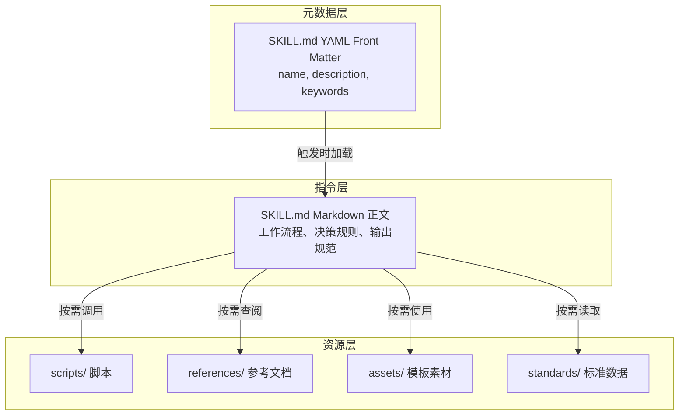

#### Skills 调用逻辑

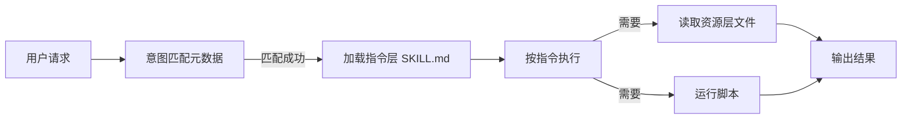

### 5. 经典金句/数据
> “Skills 是一种按需加载的知识包，它在需要的时候把专业知识注入 Agent 的上下文中。” (p.14)

> “Skills 更像你写好的 SOP——输入是什么、步骤怎么走、输出格式是什么、怎么自检、失败怎么回滚，将一次性的经验固化成可复用资产。” (p.15)

**效果对比数据**：
- 平均审批周期：传统 OA 约 3~5 个工作日 → 使用 Skills 约 4~8 小时
- 报销单错误率：约 15% → 低于 2%
- 合规问题检出率：约 60% → 超过 98%

---

## 第2章：为什么选择Skills

### 1. 核心论点
问题：传统 AI 交互存在效率低、标准不统一、专业知识缺失、使用门槛高等痛点。  
观点：Skills 通过封装知识、流程和工具，能够显著提升 AI 交互效率、实现工作流标准化、复用专业知识、降低使用门槛，是构建专业 AI 助理的核心技术。

### 2. 关键概念/事件
- **效率提升**：从重复沟通到一次定义。例如报销审批从每次补充标准（10~15分钟）变为直接询问（约3秒）。
- **标准化**：通过 SKILL.md 显式定义流程和决策规则，确保每次执行结果一致、可审计。
- **知识复用**：将专家隐性知识显式化、结构化、流程化，封装为 Skills，实现跨人员、跨时间、跨场景复用。
- **降低门槛**：隐藏复杂性，用户只需自然语言描述需求，Skills 自动引导补充信息并完成专业任务。

### 3. 逻辑推演/叙事脉络
作者从四个维度对比使用 Skills 前后的差异：
1. **效率**：传统方式需要多轮沟通补充上下文（如 PDF 处理需要反复询问水印位置、表格格式），使用 Skills 后一次定义即可。
2. **标准**：不同审批人尺度不一致，使用 Skills 后统一从 expense_limits.json 读取标准，输出格式统一。
3. **专业**：AI 缺乏领域知识（如发票连号是风险信号），Skills 显式封装这些规则，让 AI 获得专家能力。
4. **门槛**：普通员工难以指导 AI 完成复杂任务，Skills 通过智能引导和预设流程，让人人可用。

最后给出适用场景判断标准：有明确流程（SOP）、高重复性、依赖专业知识、追求稳定性与一致性的任务最适合使用 Skills。

### 4. 流程图

#### 传统方式 vs 使用Skills效率对比

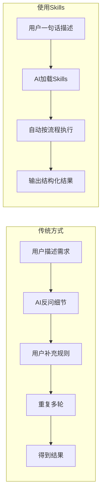

### 5. 经典金句/数据
> “Skills 将分散的、隐性的专业知识，转化为结构化、可复用的知识包。” (p.14)

> “一次定义，长期复用，是 Skills 效率提升的核心机制。” (p.49)

**对比表格数据**：
- 报销审批：传统每次补充标准 10~15 分钟 → Skills 约 3 秒得到答案
- PDF处理：传统反复沟通 20~30 分钟 → Skills 约 1 分钟开始处理
- 审批规则一致性：传统依赖个人 → Skills 统一标准自动判断

---

## 第3章：Skills的创建、使用、发布与管理

### 1. 核心论点
问题：如何从零开始创建、使用、发布和管理 Skills？不同平台（在线平台、本地编程工具、智能体开发平台）有何差异？  
观点：Skills 生命周期包括创建（AI辅助或手动）、使用（多种方式调用）、发布（打包规范与渠道）、版本管理（语义化版本）、私有化部署及日常维护。掌握完整流程是高效应用 Skills 的基础。

### 2. 关键概念/事件
- **三种创建方式**：
  - 在线平台（可学Skills）：AI 辅助生成或手动精细编辑，可视化操作。
  - 本地编程工具（CodeBuddy）：使用 SKILL-creator 辅助生成框架，拖拽式安装。
  - 智能体平台（Coze）：自然语言描述需求，平台自动生成 Skills 初稿，支持实时调试和一键部署。
- **打包规范**：标准目录结构必须包含 SKILL.md，可选 scripts/、references/、assets/。命名全小写+连字符。
- **发布渠道**：国际（Claude、OpenAI Plugin）、国内（Coze、智谱AI、百度文心、阿里通义）。
- **语义化版本**：主版本号.次版本号.修订版本号（如 1.2.3），主版本号表示不兼容变更，次版本号表示向下兼容的新功能，修订版本号表示向下兼容的问题修复。
- **私有化部署**：满足数据安全与合规要求，可设计单机、负载均衡或微服务架构。

### 3. 逻辑推演/叙事脉络
作者先介绍三种创建 Skills 的路径，分别以可学Skills、CodeBuddy、Coze 为例演示详细步骤。然后讲解使用方式：在线平台、本地工具、智能体平台以及综合使用（多 Skills 串联、并行、条件分支、循环迭代）。接着进入发布环节：打包规范（目录结构、命名、依赖锁定）、发布渠道对比、版本控制（语义化版本、变更日志、多版本并存）。对于企业，还介绍了私有化部署的架构设计、部署流程、权限与安全管理。最后总结 Skills 的管理、卸载与清理，以及辅助工具（开发、测试、打包、部署、监控）。

### 4. 流程图

#### Skills 打包目录结构

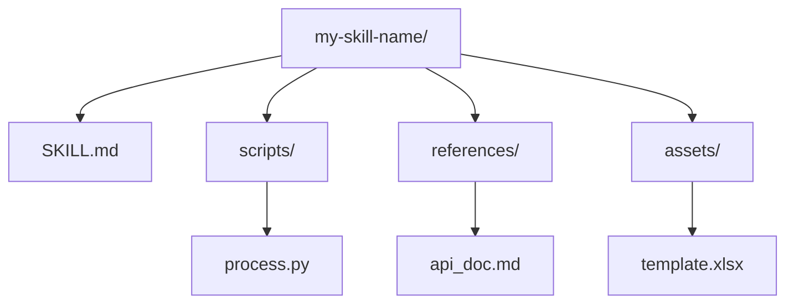

#### 语义化版本决策流程

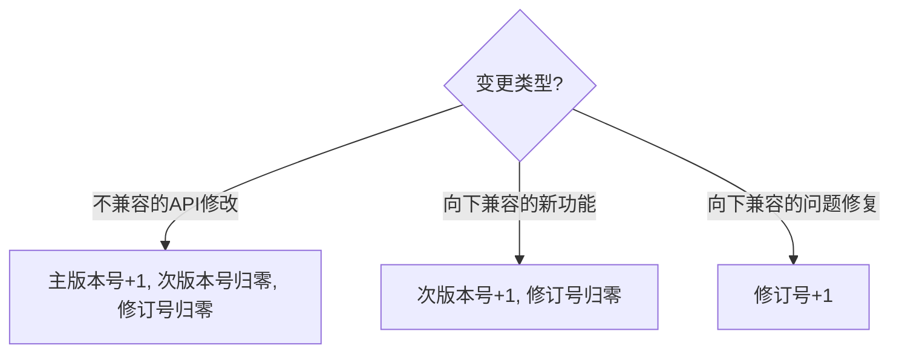

### 5. 经典金句/数据
> “Skills 包是一种标准化的压缩文件，包含 Skills 运行所需的所有资源和配置信息。” (p.132)

> “语义化版本由主版本号、次版本号、修订版本号 3 个部分组成，格式为‘主版本号.次版本号.修订版本号’。” (p.145)

> “私有化部署能够满足企业在数据安全、合规及定制化方面的需求，但也需要投入相应的技术与人力成本。” (p.157)

---

## 第4章：从0开始写Skills

### 1. 核心论点
问题：如何从零开始开发一个高质量的 Skills？需求分析、结构设计、元数据编写、指令层编写、资源层编写、测试调试分别需要注意什么？  
观点：成功的 Skills 始于清晰的需求分析和结构设计，遵循“单一职责”和“渐进式披露”原则，通过精心编写元数据、指令层和资源层，再经过系统的测试与调试，才能交付稳定、可靠的 AI 能力模块。

### 2. 关键概念/事件
- **需求分析三要素**：高重复性、强规则性、经验专属化。需定义输入、输出与边界。
- **结构设计**：将工作流程拆解为固化内容（SKILL.md 指令、assets 模板、scripts 脚本）和灵活空间。
- **元数据层编写**：name（全小写+连字符）、description（第三人称，描述功能+触发场景），可选 activation_keywords、metadata、tool_groups。
- **指令层编写**：包含核心目标与范围、工作流程与步骤、输出格式要求、示例、注意事项与边界、参考资料链接。采用结构化 Markdown，避免散文。
- **资源层编写**：scripts/（确定性执行脚本，零 token 消耗）、references/（静态参考文档）、assets/（可复用模板素材）。
- **测试与调试**：单元测试（验证独立模块）、集成测试（端到端流程）、边界测试（异常输入）、合规与安全检测（脚本审查、数据脱敏）。

### 3. 逻辑推演/叙事脉络
作者按照开发顺序逐步展开：先强调需求分析的重要性，给出自我判定清单（任务是否每周重复 N 次以上）。然后进行结构设计，以“文章转 PPT”为例，说明如何固化流程、规则和素材。接着详细讲解元数据层的编写规范，给出 name 和 description 的正确与错误示例。指令层部分提供标准结构模板（核心目标、工作流程、输出格式、示例、注意事项），并给出完整的 wechat-article-publisher 案例。资源层部分分别介绍 scripts、references、assets 的作用和实战示例（发票去重脚本、差旅政策文档、数据分析报告模板）。最后给出测试与调试的常见问题排查技巧，如 Agent 忽略指令、输出格式不符、脚本执行失败、引用不准确等。

### 4. 流程图

#### Skills 开发流程

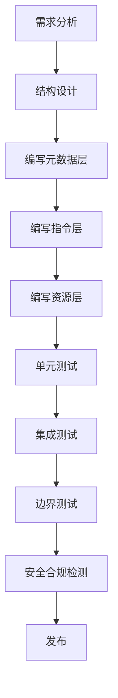

#### 指令层标准结构

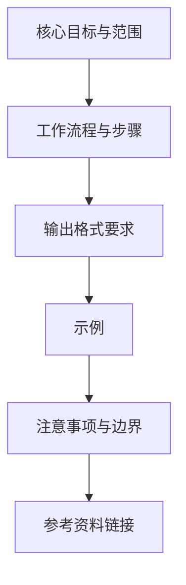

### 5. 经典金句/数据
> “Skills 的本质，是一份将工作交接给‘AI新员工’的‘数字化SOP大礼包’。” (p.171)

> “能固化的全固化，把反复强调的规则、高频使用的素材、日常运行的代码，都整理成标准化预置文件。” (p.172)

> “指令层绝非简单的提示词，而是一份可落地、可重复的工作流程说明书。” (p.179)

> “资源层是 Skills 从‘提示词’升级为‘专业解决方案’的核心。” (p.197)

---

## 第5章：Skills相关资源

### 1. 核心论点
问题：Skills 开发过程中有哪些优质的中外资源可以参考？  
观点：国内资源包括可学Skills平台、Coze、稀土掘金、思否、语雀、Gitee、美团技术博客等；国外资源包括 GitHub、Anthropic、OpenAI、Google、Vercel 等。建立个人资源库，持续关注技术动态，是保持竞争力的关键。

### 2. 关键概念/事件
- **国内平台**：
  - 可学Skills：一站式 Skills 生态系统，支持创建、使用、分享、商业化。
  - Coze：智能体开发平台，内置技能商店，支持低代码创建和发布。
  - 稀土掘金、思否、InfoQ：技术社区，提供实战经验和深度文章。
  - 语雀、飞书：文档和知识管理平台。
  - Gitee、开源中国：代码托管与开源资讯。
  - 美团技术团队、阿里云技术博客：企业实战分享。
- **国外资源**：
  - GitHub：开源代码和灵感宝库，awesome 系列仓库。
  - Anthropic：Claude AI 官方文档，提示词工程指南。
  - OpenAI：GPT 模型资源，Cookbook 代码示例。
  - Google：TensorFlow、Chrome DevTools、Google Cloud 文档。
  - Vercel：Next.js 框架、部署平台、Skills 资源网站。

### 3. 逻辑推演/叙事脉络
作者按国内和国外两大类分别介绍。国内部分细分为独立平台（可学Skills、Coze）、技术社区（稀土掘金、思否、InfoQ）、文档管理平台（语雀、飞书）、云服务文档（腾讯云、阿里云）、代码托管（Gitee、开源中国）、企业技术博客（美团、阿里云）、在线学习平台（极客时间、拉勾教育、牛客）。国外部分重点介绍 GitHub（代码和社区）、Anthropic（官方文档）、OpenAI（Cookbook）、Google（全栈技术文档）、Vercel（前端框架和部署）。最后用表格对比各平台的核心优势、适用场景和推荐指数。

### 4. 图表

#### 国内外资源对比表（提炼）

| 平台名称 | 核心优势 | 适用场景 | 推荐指数 |
|---------|---------|---------|---------|
| Coze | 官方Skills平台 | 开发和发布 Skills | ***** |
| 稀土掘金 | 技术文章质量高、社区活跃 | 查找实战经验 | ***** |
| 思否 | 问答质量高 | 技术问题求助 | **** |
| 语雀 | 文档编辑体验好 | 管理Skills文档 | ***** |
| Gitee | 访问速度快 | 托管代码、参考开源项目 | **** |
| GitHub | 开源代码和社区 | 寻找案例、学习最佳实践 | ***** |
| Anthropic | Claude API 文档 | 开发 Claude Skills | ***** |
| OpenAI | GPT 模型资源 | 函数调用、Skills开发 | ***** |

### 5. 经典金句/数据
> “建立一个自己的资源库，持续关注和学习最新的技术动态，是保持竞争力的关键。” (p.206)

> “GitHub 还有个‘隐藏宝藏’——awesome 系列仓库，是发现好工具的捷径。” (p.222)

---

## 第6章：文档处理：学习、办公与科研

### 1. 核心论点
问题：如何利用 Skills 高效处理 PDF、Excel、Word、PPT 等办公文档，并辅助科研论文写作和临床决策？  
观点：通过封装文档处理的专业知识和操作流程，Skills 能够实现文档的自动化处理（加水印、提取数据、生成报告）、学术论文辅助写作（生成初稿、框架整理）以及临床决策支持（患者队列分析），大幅提升学习、办公和科研效率。

### 2. 关键概念/事件
- **PDF Skills**：支持添加水印与页码、提取数据、合并 PDF、批量格式转换。
- **Excel Skills**：支持创建表格、公式计算、数据分析、错误扫描、生成图表和报告。
- **Word Skills**：支持会议纪要生成、规范化文档撰写、论文写作辅助。
- **PPT Skills**：根据主题自动生成结构完整、风格统一的演示文稿。
- **paper-writing Skill**：生成毕业论文初稿、调研报告，包含摘要、引言、文献综述、方法、数据分析、结论等完整结构。
- **scikit-bio Skill**：生物科研专用，支持序列分析、系统发育分析（Neighbor Joining 进化树）、群落多样性分析（Shannon 多样性）。
- **clinical-decision-support Skill**：为制药与临床研究生成患者队列分析报告，符合 HIPAA、ICH-GCP 等合规要求。

### 3. 逻辑推演/叙事脉络
作者以“可学Skills”平台为起点，演示如何下载并安装各类文档处理 Skills（pdf、xlsx、doc-coauthoring、pptx）。然后分别在 CodeBuddy 中展示使用过程：输入自然语言指令，Skills 自动加载并执行任务，最终生成结果文件。对于科研场景，展示了 paper-writing Skill 生成毕业论文初稿和调研报告，scikit-bio Skill 进行生物序列分析和进化树构建，clinical-decision-support Skill 生成肺癌临床试验患者队列分析报告。最后在 OpenClaw 中演示安装 pptx Skill 并完成“下雪活动策划 PPT”的制作，对比传统人工、AI 编程助手和 OpenClaw 三种模式的效果、Token 消耗和时间长度。

### 4. 流程图

#### Skills 辅助文档处理流程（以PDF加水印为例）

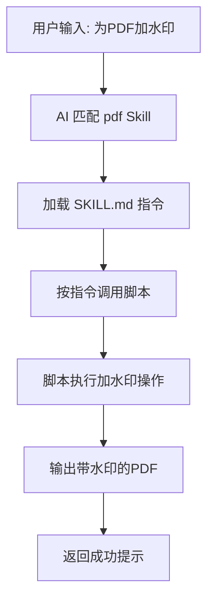

#### OpenClaw vs 传统方式对比

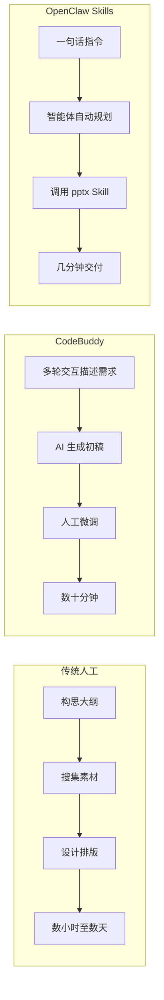

### 5. 经典金句/数据
> “Skills 依托其核心价值——以工程化、标准化的方式，将人类在特定领域的专业知识与操作流程封装为可动态加载的知识包。” (p.232)

**效果对比（制作PPT）**：
- 传统人工：数小时至数天
- AI编程助手（CodeBuddy）：数十分钟至一小时
- OpenClaw Skills：几分钟

> “OpenClaw Skills 模式在效率（时间长度）上具有显著优势，真正实现了‘一句话需求，几分钟得PPT’的自动化体验。” (p.276)

---

## 第7章：程序开发：从需求文档到代码版本管理

### 1. 核心论点
问题：如何利用 Skills 辅助程序开发的完整生命周期，包括需求文档写作、前端开发、SQL 数据库设计、代码测试与审查、版本管理？  
观点：Skills 能够将软件工程中的最佳实践和流程封装为可复用的模块，从需求分析到代码提交的全流程均可借助 Skills 实现自动化、标准化，显著提升开发效率和质量。

### 2. 关键概念/事件
- **需求文档 Skills（doc-coauthoring）**：通过交互式问答引导用户补充细节，自动生成结构完整的需求规格说明书。
- **前端开发 Skills（frontend-design）**：根据需求生成 HTML/CSS/JS 代码，支持分模块逐步开发（商品展示、购物车等），并能规范化拆分代码文件。
- **数据库设计 Skills（database-design）**：根据业务需求自动设计表结构、优化索引、进行范式设计、分库分表设计。
- **测试 Skills（webapp-testing）**：自动化执行功能测试、界面检查、性能评估，模拟用户操作验证功能正确性。
- **版本管理 Skills（Git-Pushing）**：通过自然语言指令完成 git add、commit、push 等操作，自动生成规范的提交信息。
- **OpenClaw 一体化开发 vs 多Skills独立开发**：对比两种模式的核心机制、开发流程、内容质量、适用场景。

### 3. 逻辑推演/叙事脉络
作者以“外卖点单系统”为贯穿案例，分步骤演示：
1. 使用 doc-coauthoring Skill 生成需求文档（通过问答补充功能模块、技术栈等）。
2. 使用 frontend-design Skill 分模块生成前端代码（先商品展示，再购物车，并优化代码结构）。
3. 使用 database-design Skill 根据前后端代码设计数据库表（user、order、product 等），并进行优化和范式设计。
4. 使用 webapp-testing Skill 测试购物车添加/减少商品功能。
5. 使用 Git-Pushing Skill 完成暂存、提交、推送等版本管理操作。
最后对比 OpenClaw 一体化开发模式与多 Skills 独立开发模式的差异，分析各自的优劣势和适用场景。

### 4. 流程图

#### 程序开发全流程 Skills 协作图

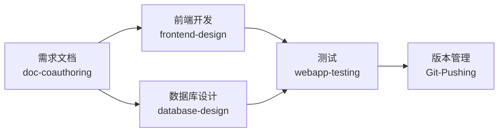

#### OpenClaw vs 多Skills独立开发对比

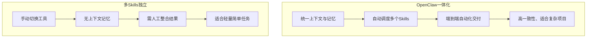

### 5. 经典金句/数据
> “使用 Skills 撰写需求文档，能够有效降低人力消耗，大幅提升开发效率。” (p.283)

> “OpenClaw 依托统一上下文与持续记忆能力，能够保证代码结构、接口规范、业务逻辑的高度一致性。” (p.312)

> “多 Skills 独立开发的优势主要体现在轻量化方面，它无须部署、初始化，即用即走，启动速度快。” (p.313)

---

## 第8章：电商与市场营销：全自动内容生成

### 1. 核心论点
问题：如何利用 Skills 实现电商与市场营销内容的自动化生成，包括微信推文、数据挖掘、营销理念、定价策略？  
观点：通过 Coze 平台集成各类营销 Skills，可以实现从市场分析、内容创作到客户洞察、定价决策的全流程自动化，大幅提升电商运营效率和营销效果。

### 2. 关键概念/事件
- **微信推文 Skills（wechat-article）**：根据产品信息、活动主题自动生成符合公众号风格的推文（标题、导语、正文、结尾、标签）。
- **数据挖掘 Skills（lead-research-assistant）**：用于目标客户发现、竞品客户挖掘、跨平台机会搜索、直播电商 BD。可生成电商线索研究报告、客户分析报告、达人筛选报告。
- **营销理念 Skills（marketing-ideas）**：生成营销理念、产品增长策略、推广策略、营销想法对比分析。
- **定价策略 Skills（pricing-strategy）**：设计多层定价结构、套餐设计、涨价决策分析、支付意愿研究。
- **Coze 平台集成 OpenClaw**：一键部署 OpenClaw，上传 Skills 包“饲养”专属 Agent，实现电商营销内容的全自动生成。

### 3. 逻辑推演/叙事脉络
作者首先在 Coze 平台演示 wechat-article Skill 的使用：上传 Skills 后，通过问答引导（主题、受众、卖点、风格），自动生成完整推文。接着用 lead-research-assistant Skill 完成三个任务：发现宠物用品目标客户、挖掘竞品商家、直播电商 BD 达人筛选。然后使用 marketing-ideas Skill 生成营销理念文档，并扩展生成增长策略、推广策略和营销想法对比分析。再用 pricing-strategy Skill 设计 SaaS 产品三层定价、套餐设计、涨价决策分析、支付意愿研究。最后展示如何在 Coze 中一键部署 OpenClaw，上传前述所有 Skills，形成电商营销专属 Agent，实现全自动内容生成。

### 4. 流程图

#### Coze 平台 Skills 使用流程

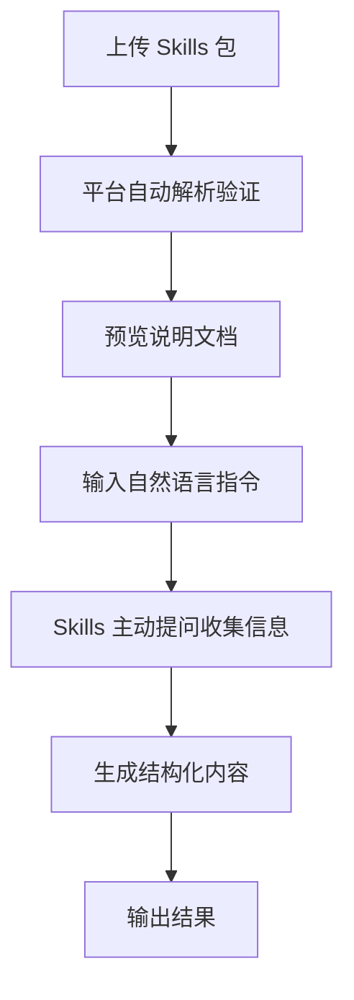

#### 电商营销自动化闭环

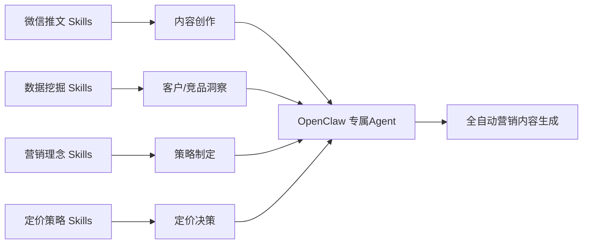

### 5. 经典金句/数据
> “Coze 的 Skills 功能能够快速创建、发布和发布自己的 Skills，而且不需要写代码。” (p.207)

> “OpenClaw 支持用户针对不同行业与业务场景进行高度定制化训练，通过上传专属 Skills 包，能够让 Agent 深度适配特定领域需求。” (p.341)

---

## 第9章：企业管理：办公流程自动化

### 1. 核心论点
问题：如何利用 Skills 辅助企业高层决策、产品管理、创业财务建模、风险管理，以及日常办公流程（会议纪要、工作汇报）的自动化？  
观点：Skills 能够封装商业分析、财务管理、风险识别、会议记录等专业知识，为 CEO、产品经理、创业者等不同角色提供科学决策支持，同时将重复性办公流程标准化、自动化，提升组织效率与决策质量。

### 2. 关键概念/事件
- **CEO 决策辅助（ceo-advisor）**：针对资金使用、融资选择、增长与财务平衡等复杂决策，提供多维度分析报告。
- **产品经理工具（product-manager-toolkit）**：自动生成产品需求文档（PRD），涵盖项目背景、用户角色、功能需求、非功能约束、流程图等。
- **创业财务建模（startup-financial-modeling）**：将收入模型、成本结构、现金流预测与增长假设整合，生成商业分析报告。
- **风险管理（risk-management-specialist）**：自动生成风险管理报告、系统风险治理方案，实现风险分析、文档生成与持续追踪的自动化。
- **会议纪要（meeting-notes）**：将非结构化会议记录转化为结构化纪要，包含讨论点、行动项、决策跟踪表。
- **提交工作（commit-work）**：根据工作描述自动生成日报、突发场景沟通方案等。
- **OpenClaw 安全使用准则**：权限最小化、来源可信审查、输出结果人工复核、流程整合与变更管理。

### 3. 逻辑推演/叙事脉络
作者依次展示六个企业级 Skills 的应用：
1. **ceo-advisor**：输入公司背景（1800 万资金 14 个月用完或 ARR 300 万但现金将耗尽），生成战略决策报告。
2. **product-manager-toolkit**：输入项目背景（6 个月交付 MVP 或 10 万 MAU 留存率 25%），生成完整 PRD。
3. **startup-financial-modeling**：输入创业项目背景，生成商业分析报告，涵盖收入预测、成本结构、现金流。
4. **risk-management-specialist**：输入产品背景，生成风险管理报告和系统风险治理方案。
5. **meeting-notes**：输入非结构化会议记录，输出结构化纪要、讨论点记录、行动项跟踪表。
6. **commit-work**：输入工作状况描述，生成每日工作汇报；输入突发背景，生成沟通方案。
最后在 OpenClaw 使用企业管理 Skills 的安全与风险管控建议：权限与数据安全、来源可信、输出结果可靠性、流程整合，以及获取优质 Skills 的渠道和质量评估方法。

### 4. 流程图

#### 企业管理 Skills 决策支持流程

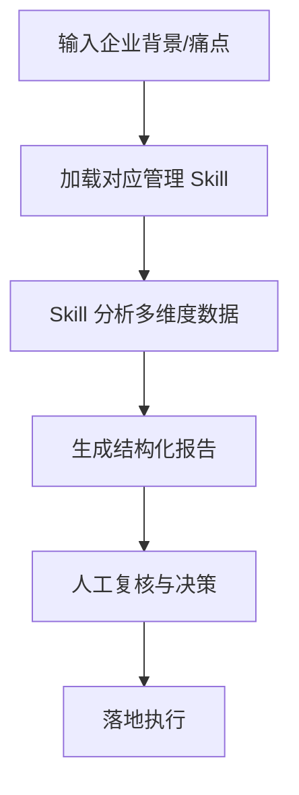

#### OpenClaw 企业管理 Skills 安全审查流程

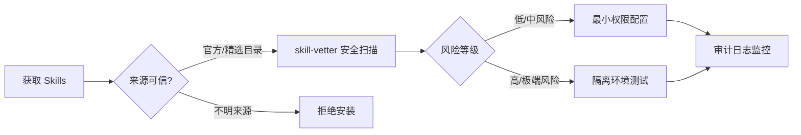

### 5. 经典金句/数据
> “Skills 可以通过系统化的分析框架和智能化的数据处理，为 CEO 提供科学、全面的决策支持。” (p.342)

> “Skills 不会替代产品经理进行判断，而是扩展产品经理的能力边界。” (p.352)

> “创业-财务-建模 Skills 并不仅仅是在‘算账’，而是在帮助创业者建立一套可持续的商业判断系统。” (p.357)

> “使用 Skills 时，应当将其视为分析助手。其输出必须由具备相应领域知识的员工进行关键事实核查、逻辑验证和最终审批。” (p.376)

---

## 附录：《“养虾”50问：OpenClaw入门手册》

### 说明
该部分位于书籍末尾（p.378-410），是一本独立的小手册，以问答形式解答新手在部署和使用 OpenClaw（昵称“龙虾”）过程中的常见问题。由于内容较多，此处提炼核心主题和典型问题，不逐条展开。

### 核心主题
- **概念入门**：什么是“养虾”？OpenClaw 与语音助手的区别？AI Agent 是什么？
- **免费与门槛**：是否免费？不懂编程能否使用？成本如何？老旧笔记本能否运行？
- **部署与云服务**：本地部署 vs 云端部署？云服务器选择建议？Windows 最简部署步骤？
- **模型与 API**：OpenClaw 是否有内置大模型？如何获取 API Key？如何配置本地模型？
- **Skills 与使用**：如何安装新 Skills？ClawHub 是什么？官方自带哪些 Skills？如何接入微信/飞书/钉钉？
- **安全与避坑**：隐私数据是否安全？恶意软件风险？责任归属？如何避免被“割韭菜”？

### 经典金句
> “我们把部署及使用 OpenClaw 的过程戏称为‘养虾’——既形象，又有烟火气。” (p.378)

> “OpenClaw 是一个开源的 AI 智能体项目，之所以被称为‘龙虾’，是因为它如同‘龙虾’有两只‘钳子’一般，可以一边抓取信息，一边执行具体操作。” (p.379)

> “建议：复杂任务用高性能模型，简单任务用轻量模型，可在配置中设置模型路由规则。” (p.386)

> “本地部署+本地模型：所有对话数据、操作记录均保存在你自己的电脑里，不会向外传输，数据安全性极高。” (p.406)

---

## 配套资源获取说明
- 配套资料包括教学视频、教学 PPT、Skills 资源大全、《“养虾”50问：OpenClaw入门手册》。
- 获取方式一：关注微信公众号“可学AI”，回复“Skills”自动获取下载链接。
- 获取方式二：在异步社区官方网站搜索本书名称，在本书页面下载。
- B 站 UP 主账号“可学AI”可在线观看配套教学视频。
- 配套资源验证码：260279 (p.377)

---