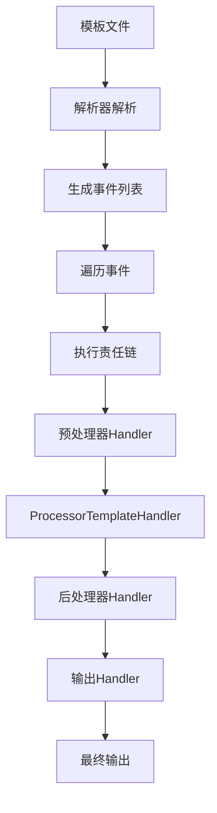
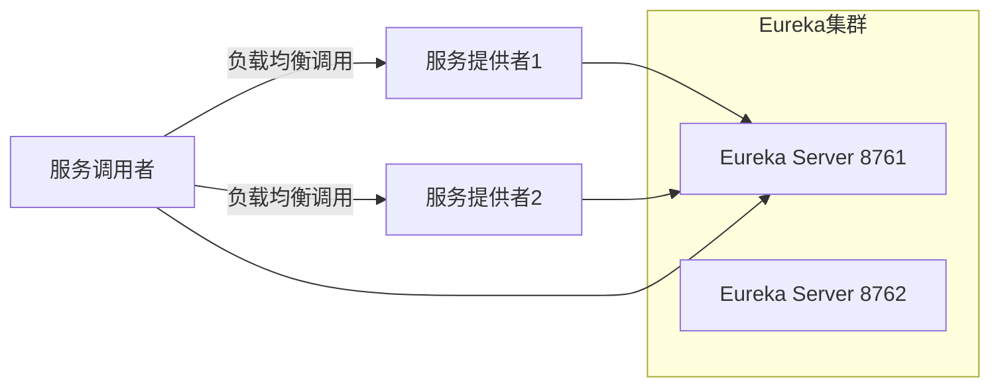
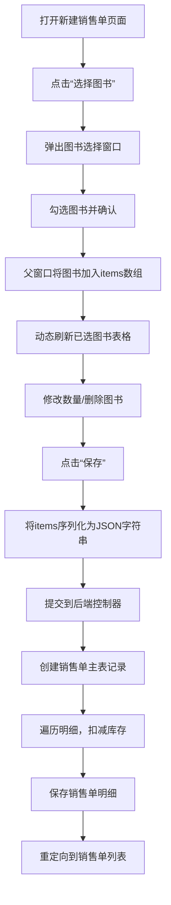

# 《Spring Boot 2+Thymeleaf企业应用实战》章节总结

## 书籍信息
- **书名**：Spring Boot 2+Thymeleaf企业应用实战
- **作者**：杨恩雄
- **出版信息**：电子工业出版社，2018年9月第1版
- **PDF状态**：扫描/OCR识别，内容基本完整，部分页码和图表存在识别不完整情况
- **OCR状态**：文本可读，但部分格式（如图片、表格）需手动整理

> 说明：该PDF为扫描版，部分内容（如图片、代码格式）识别存在偏差，以下总结基于可见文本整理，尽可能还原原书逻辑。

## 全书核心主题
本书以Spring Boot 2.0和Thymeleaf 3.0为核心，系统讲解企业级Java Web开发的全套技术方案。全书分为三大部分：第一部分介绍Spring Boot的基础与配置（第1-4章），第二部分深入讲解Thymeleaf模板引擎的语法、对象、原理与扩展（第5-9章），第三部分整合Spring Boot与Thymeleaf，并引入JavaScript库、Spring Data数据库操作、Spring Cloud微服务，最后以图书进销存系统实战收尾（第10-14章）。作者强调“看得懂、学得会、做得出”的实践导向，每行代码均有注释，案例贴近实际开发。

---

## 第1章：概述

### 1. 核心论点
本章主要解决“Java EE开发需要哪些技术栈”以及“如何搭建开发环境”的问题。作者认为，现代Java EE开发应采用Spring Boot + Thymeleaf + Spring Data的整合方案，并介绍了JDK、Maven、Eclipse的安装与配置。

### 2. 关键概念/事件
- **Java EE三层架构**：表现层、业务逻辑层、数据访问层。
- **MVC框架**：Struts2、Spring MVC等，本书使用Spring MVC。
- **数据访问层框架**：Hibernate、MyBatis，本书使用Spring Data。
- **视图技术**：JSP、Freemarker、Thymeleaf，本书以Thymeleaf为核心。
- **Maven构建工具**：用于依赖管理和项目构建，配置阿里云远程仓库加速下载。

### 3. 逻辑推演/叙事脉络
作者首先回顾Java EE的三层架构及主流框架（MVC、数据访问层、视图技术），指出传统开发中项目搭建的烦琐性。接着，逐步讲解JDK、Maven、Eclipse的安装与配置，特别强调Maven远程仓库的配置（使用阿里云镜像）。最后说明如何获取本书代码（百度网盘或公众号）。本章为后续学习奠定了环境基础。

### 4. 经典金句/数据
> “精通三层开发技术几乎成为Java程序员的标配。” (p.15)
> Spring Boot要求Maven版本为3.2或以上，本书使用3.5。 (p.17)

---

## 第2章：初试Spring Boot

### 1. 核心论点
本章解决“如何快速搭建第一个Spring Boot Web应用”的问题。作者观点：Spring Boot通过starter模块提供“一站式”依赖，极大简化项目搭建与配置，使开发者能专注于业务逻辑。

### 2. 关键概念/事件
- **starter模块**：如`spring-boot-starter-web`，自动引入Spring MVC和内嵌Tomcat。
- **@SpringBootApplication**：组合注解（@SpringBootConfiguration、@EnableAutoConfiguration、@ComponentScan）。
- **热部署**：引入`spring-boot-devtools`实现代码修改后自动重启。
- **单元测试**：使用`@SpringBootTest`、`@MockBean`等注解模拟Web环境和业务组件。
- **REST服务**：使用`@RestController`发布，用`RestTemplate`或Feign调用。

### 3. 逻辑推演/叙事脉络
作者从新建Maven项目开始，展示pom.xml继承`spring-boot-starter-parent`并添加web starter。随后编写启动类和控制器，运行main方法即启动Tomcat。接着介绍单元测试：测试Web服务（随机端口）、模拟Web测试（MockMvc）、测试业务组件（@SpringBootTest(webEnvironment=NONE)）以及使用@MockBean模拟依赖。最后讲解REST服务的发布与调用，包括RestTemplate和Feign两种客户端。

### 4. 流程图（无）

### 5. 经典金句/数据
> “使用SpringBoot后，使我们节省了很多搭建项目框架的时间。” (p.24)
> Feign使用JDK动态代理生成代理类，底层使用`java.net.HttpURLConnection`发送HTTP请求。 (p.32)

---

## 第3章：Spring Boot配置

### 1. 核心论点
本章解决“如何配置Spring Boot应用（尤其是Web容器）”的问题。作者观点：Spring Boot支持多种配置方式（application.properties/yml、profile、自定义配置），并能轻松修改内嵌服务器参数、启用压缩、SSL等。

### 2. 关键概念/事件
- **配置文件读取顺序**：项目根目录/config → 项目根目录 → classpath:/config → classpath:/。
- **yml文件**：使用缩进（空格）代替层级，支持profile分隔（---）。
- **Web配置**：`@ServletComponentScan`配合`@WebServlet`、`@WebListener`、`@WebFilter`注册Servlet组件。
- **可部署war包**：继承`SpringBootServletInitializer`并重写configure方法，packaging设为war。
- **JSP支持**：在war包中可使用JSP，需添加`tomcat-embed-jasper`依赖并配置视图前缀/后缀。
- **服务器配置**：压缩（Gzip）、SSL（自签名证书）、更换内嵌服务器（Jetty/Undertow）、访问日志、banner定制。
- **自定义配置**：使用`@Value`或`@ConfigurationProperties`绑定配置文件属性。

### 3. 逻辑推演/叙事脉络
作者先说明默认配置文件的加载顺序及profile的激活方式。然后讲解Web配置：如何注册Servlet/Listener/Filter，如何构建可部署的war包，如何在war包中使用JSP。接着介绍服务器常用配置（端口、上下文路径、超时）、响应压缩、SSL配置、更换内嵌服务器、访问日志、banner定制。最后重点讲解自定义配置的两种方式：`@Value`（适合少量属性）和`@ConfigurationProperties`（适合批量属性绑定，支持relaxed binding）。

### 4. 经典金句/数据
> “Spring Boot通用的配置项大约有一千多个。” (p.44)
> 使用`@ConfigurationProperties(prefix="jdbc")`时，属性`userName`可匹配`jdbc.userName`、`jdbc.user-name`、`jdbc.user_name`等。 (p.51)

---

## 第4章：Spring Boot的注解

### 1. 核心论点
本章解决“Spring Boot开发中常用注解及其原理”的问题。作者观点：Spring Boot大量使用注解替代XML配置，包括Spring核心注解（IoC/AOP）、Spring MVC注解以及Spring Boot特有的条件注解，理解这些注解是掌握自动配置的基础。

### 2. 关键概念/事件
- **bean定义**：`@Component`、`@Service`、`@Configuration`、`@Bean`。
- **依赖注入**：`@Resource`（JSR-250，默认按名称）、`@Autowired`（默认按类型，可结合`@Qualifier`）。
- **作用域**：`@Scope`（singleton、prototype、request、session等）。
- **方法注入**：`@Lookup`解决单例bean中注入原型bean实例不刷新问题。
- **AOP注解**：`@Aspect`、`@Before`、`@After`，默认使用CGLIB代理。
- **组件扫描**：`@ComponentScan`及其过滤器。
- **限定注解**：`@Qualifier`及自定义限定注解（如`@AnimalQualifier`）。
- **自定义Scope**：实现`Scope`接口并注册。
- **Spring MVC注解**：`@Controller`、`@RestController`、`@RequestMapping`、`@PathVariable`、`@MatrixVariable`、`@RequestParam`、文件上传。
- **条件注解**：`@ConditionalOnClass`、`@ConditionalOnMissingClass`等，以及自定义`@Conditional`。
- **自动配置原理**：Spring Boot读取`META-INF/spring.factories`中的`EnableAutoConfiguration`键，根据条件注解决定是否加载配置类。

### 3. 逻辑推演/叙事脉络
作者首先介绍Spring核心注解：定义bean、依赖注入（注意`@Autowired`多实例时的冲突及`@Primary`解决）、作用域、方法注入、AOP、ComponentScan。然后讲解高级注解：限定注解（`@Qualifier`）和自定义限定注解，以及自定义Scope（例如限制bean使用次数）。接着进入Spring MVC注解：控制器、请求映射、参数绑定（路径变量、矩阵变量、请求参数、文件上传）。最后重点分析Spring Boot的条件注解：类条件、Bean条件、属性条件等，并实现一个自定义条件注解，从而引出自动配置原理（以HibernateJpaAutoConfiguration为例）。

### 4. 经典金句/数据
> “@SpringBootApplication注解具有@SpringBootConfiguration、@EnableAutoConfiguration、@ComponentScan等功能。” (p.61)
> 自动配置项目中的依赖若使用`<optional>true</optional>`，则实际运行项目需手动引入该依赖才能触发自动配置。 (p.73)

---

## 第5章：初试Thymeleaf

### 1. 核心论点
本章解决“什么是Thymeleaf以及如何在不同Web框架中整合它”的问题。作者观点：Thymeleaf是一种支持HTML、XML、JS等模板的引擎，其语法以属性形式嵌入节点，不破坏原型页面，使前端设计师与后端开发者能协同工作。

### 2. 关键概念/事件
- **模板模式**：HTML、XML、TEXT、JAVASCRIPT、CSS、RAW。
- **模板解析器**：`StringTemplateResolver`、`ClassLoaderTemplateResolver`、`ServletContextTemplateResolver`。
- **Context**：存放变量，在模板中通过`${...}`读取。
- **遍历集合**：使用`th:each`。
- **前缀/后缀**：设置模板存放路径和扩展名。
- **Servlet整合**：使用`ServletContextTemplateResolver`，在`web.xml`中配置Servlet并调用`TemplateEngine.process()`。
- **Struts2整合**：通过`struts2-thymeleaf3-plugin`插件，在`struts.xml`中配置result类型为`thymeleaf`。
- **Spring Boot整合**：引入`spring-boot-starter-thymeleaf`，在`application.properties`中配置`spring.thymeleaf.prefix/suffix`等，控制器返回字符串即可匹配模板。

### 3. 逻辑推演/叙事脉络
作者先解释Thymeleaf是什么及其支持的文件类型。然后通过API示例展示如何使用`TemplateEngine`处理含Thymeleaf逻辑的字符串或文件，并演示变量设置、遍历集合、前缀后缀配置。接着，逐步讲解在纯Servlet应用、Struts2应用、Spring Boot应用中整合Thymeleaf的方法，重点比较了三种整合方式的配置差异。最后说明Spring Boot默认静态资源目录（`classpath:/static/`等）及引用方式。

### 4. 流程图（无）

### 5. 经典金句/数据
> “Thymeleaf的设计都是希望能不妨碍到页面设计人员、开发人员的工作，不破坏各个角色的工作成果。” (p.79)
> Spring Boot中只需加入`spring-boot-starter-thymeleaf`依赖，无需额外配置即可使用Thymeleaf。 (p.78)

---

## 第6章：Thymeleaf对象的使用

### 1. 核心论点
本章解决“在Thymeleaf模板中如何使用内置对象处理文本、数字、日期、集合等数据”的问题。作者观点：Thymeleaf提供了丰富的内置对象（如`#strings`、`#numbers`、`#dates`、`#lists`等），通过表达式调用这些对象的方法，可以完成常见的数据格式化与操作。

### 2. 关键概念/事件
- **文本表达式**：`#{...}`，用于读取外部properties文件中的消息，支持国际化（根据Locale读取不同语言文件）。
- **变量表达式**：`${...}`，使用OGNL（或SpringEL）读取上下文变量。
- **链接表达式**：`@{...}`，用于生成URL，支持绝对路径、上下文相对路径、服务器相对路径等，可带参数。
- **基本对象**：`#ctx`（模板引擎上下文）、`#locale`、`#request`、`#session`、`#servletContext`，以及内置变量`param`、`session`、`application`。
- **数字对象**：`#numbers`，提供整数/小数格式化、货币格式化、百分比格式化、序列生成（`sequence`）等方法。
- **字符串对象**：`#strings`，提供`toString`、`length`、非空判断、包含判断、截取、替换、拼接、分割、大小写转换、编解码（借助unbescape库）等方法。
- **日期对象**：`#dates`和`#calendars`，提供格式化（`format`、`formatISO`）、获取日期字段（年、月、日等）、创建日期等方法。
- **数组与集合对象**：`#arrays`、`#lists`、`#sets`、`#maps`，提供`toArray`、排序、包含判断等。
- **其他对象**：`#messages`（读取消息）、`#uris`（URI编码解码）、`#aggregates`（求和、平均）。

### 3. 逻辑推演/叙事脉络
本章按对象类型组织：先讲文本处理（外部文本、国际化、转义），再讲变量读取和链接表达式。然后逐一介绍`#numbers`（整数、小数、货币、百分比、序列）、`#strings`（大量字符串处理方法）、`#dates/#calendars`（日期格式化和字段获取）、数组与集合对象（`#arrays`等）、最后补充`#messages`、`#uris`、`#aggregates`。每部分均提供代码示例和运行结果，强调批处理方法的命名规则（arrayXxx、listXxx、setXxx）。

### 4. 经典金句/数据
> “Thymeleaf几乎为每个功能都提供了重载的方法，并且很多方法都支持批量操作。” (p.92)
> 使用`#strings.concatReplaceNulls('**', '123', null, 'abc')`在OGNL环境下会得到“123abc”，而在SpringEL下会得到“123**abc”。 (p.95)

---

## 第7章：Thymeleaf常用语法

### 1. 核心论点
本章解决“Thymeleaf表达式中运算符、条件判断、迭代、属性设置等常用语法”的问题。作者观点：Thymeleaf的语法设计类似于JSTL但更简洁，运算符、条件判断、迭代等都能以属性形式直接写在HTML节点上，保持模板的可读性。

### 2. 关键概念/事件
- **表达式常量**：字符串（单引号或“|”）、数字、布尔、null。
- **字符串拼接**：使用“+”或“|...|”符号（“|”内可包含表达式）。
- **算术运算符**：+、-、*、/、%，别名`div`、`mod`（注意在OGNL中别名不能用于`${}`内）。
- **关系运算符**：>、<、>=、<=、==、!=，别名`gt`、`lt`、`ge`、`le`、`eq`、`ne`/`neq`（不同表达式引擎有差异）。
- **条件运算符**：`(condition) ? then : else`，以及默认值表达式`(value) ?: (defaultValue)`。
- **无操作符**：`_`，表示不做任何操作，保留原型内容。
- **数据转换**：`${...}`表达式可配合自定义`IStandardConversionService`实现数据转换；在Spring Boot中可通过实现`Formatter`接口并注册为bean，在模板中自动转换。
- **表达式预处理**：`_${...}_`，先执行内部表达式再用其结果替换外层表达式。
- **表达式调用Java静态方法**：`@全限定类名@方法名(参数)`。
- **属性设置**：`th:attr`可设置任意属性，也可用具体`th:value`、`th:class`等；支持属性值拼接（`th:attrappend`、`th:attrprepend`）和class/style追加（`th:classappend`、`th:styleappend`）。
- **HTML5属性支持**：使用`data-th-*`代替`th:*`。
- **条件判断**：`th:if`（条件为true时显示）、`th:unless`（相反），判断规则灵活（非0数字、非false字符串等均视为true）。
- **switch-case**：`th:switch`和`th:case`，支持`*`作为默认。
- **迭代**：`th:each`，支持数组、List、Set、Map；可获取迭代状态对象（index、count、size、current、first、last、even、odd）。
- **数据延迟加载**：使用`LazyContextVariable`，只有在模板中真正访问变量时才会调用`loadValue()`加载数据。
- **星号表达式**：`*{...}`，与选定对象（`th:object`）配合使用，效果同`${...}`但作用域限定。

### 3. 逻辑推演/叙事脉络
作者从表达式常量开始，逐步介绍字符串拼接、算术/关系/条件运算符、无操作符。然后进入表达式进阶：数据转换（自定义转换服务）及在Spring Boot中的实现（Formatter），表达式预处理（解决动态key问题），调用Java静态方法。接着讲解属性设置的各种方式（`th:attr`、具体属性、属性拼接、class/style追加、HTML5自定义属性）。最后重点讲解条件判断（`th:if`/`th:unless`）、switch-case、迭代（`th:each`及迭代状态对象）以及延迟加载技巧，并以星号表达式收尾。

### 4. 经典金句/数据
> “使用无操作符，对原型界面的破坏是最小的。” (p.108)
> 在Spring Boot中，通过实现`Formatter`接口并注册为bean，模板中的`${...}`会自动调用`print`方法进行格式化。 (p.110-111)

---

## 第8章：深入Thymeleaf模板

### 1. 核心论点
本章解决“如何高效使用Thymeleaf的模板片断、逻辑分离、注释、内联语法和缓存”的问题。作者观点：Thymeleaf提供了强大的模板复用机制（片断、逻辑分离、片断块），并且通过内联语法和注释进一步保护原型界面，缓存机制则提升了性能。

### 2. 关键概念/事件
- **模板片断**：使用`th:fragment`定义，通过`th:insert`、`th:replace`、`th:include`引用。区别：insert保留宿主节点，replace替换宿主节点，include仅插入内容（不含片断节点本身）。
- **片断引用语法**：`~{template::selector}`，选择器支持XPath-like语法（如`//div[@id='xxx']`）及简化写法（`#id`、`.class`、`%ref`）。
- **带参数的片断**：`~{template::fragment(param1, param2)}`，也可使用`th:with`传递本地变量。
- **片断块**：`th:block`定义代码块，可在引用时传入动态内容。
- **空片断与无操作符**：`~{}`表示空片断，`_`表示无操作。
- **删除模板**：`th:remove`可取值`all`、`body`、`tag`、`all-but-first`、`none`。
- **模板与逻辑分离**：将Thymeleaf逻辑写在单独的`.th.xml`文件中（与模板同目录或通过配置指定），使用`attr`节点的`sel`属性选择HTML节点，设置`th:*`属性。需在模板解析器中开启`setUseDecoupledLogic(true)`。
- **注释**：解析层注释`<!-- ... -->`（模板处理后消失）；原型注释`<!--/* ... */-->`（只在浏览器中打开时隐藏，模板引擎解析时仍会处理）。
- **内联语法**：`[[...]]`（等价于`th:text`）、`[(...)]`（等价于`th:utext`）。可在JavaScript/CSS中使用，通过`th:inline="javascript"`或`th:inline="css"`启用，支持序列化Java对象为JSON。
- **模板缓存**：`TemplateResolver`的`setCacheable`控制缓存，`StandardCacheManager`可设置缓存大小和TTL。

### 3. 逻辑推演/叙事脉络
作者首先详细讲解模板片断的定义、引用、选择器语法，对比`insert`/`replace`/`include`的区别，并展示带参数片断、片断块、空片断和无操作符的使用。接着介绍`th:remove`删除模板节点。然后重点讲解模板与逻辑分离：如何编写`.th.xml`文件，配置逻辑文件的前缀/后缀，以及选择器的关联方法。之后介绍两种注释及其对原型保护的意义。再讲解内联语法，特别是JavaScript/CSS中的内联及序列化。最后介绍模板缓存机制（开启/关闭、大小设置、存活时间）。

### 4. 流程图（无）

### 5. 经典金句/数据
> “Thymeleaf的设计都是希望能不妨碍到页面设计人员、开发人员的工作。” (p.132)
> 使用逻辑分离时，在默认情况下Thymeleaf会到模板文件所在目录寻找“templateName.th.xml”文件。 (p.136)

---

## 第9章：Thymeleaf原理与扩展

### 1. 核心论点
本章解决“Thymeleaf内部处理机制以及如何扩展（自定义标签、属性、内置对象）”的问题。作者观点：Thymeleaf结合策略模式与责任链模式处理模板，理解这些设计模式后，可以轻松实现自定义方言、处理器和内置对象。

### 2. 关键概念/事件
- **方言（Dialect）**：`IDialect`及其子接口`IProcessorDialect`、`IPreProcessorDialect`、`IPostProcessorDialect`、`IExpressionObjectDialect`、`IExecutionAttributeDialect`。
- **处理器（Processor）**：`IProcessor`（一般处理器）、`IPreProcessor`（预处理器）、`IPostProcessor`（后处理器），各自提供`getHandlerClass()`返回`ITemplateHandler`实现类。
- **模板处理者（Handler）**：`ITemplateHandler`，组成责任链，处理模板事件（如`handleText`、`handleOpenElement`等）。
- **模板事件**：`IEngineTemplateEvent`的实现类，如`Text`、`OpenElementTag`、`CloseElementTag`等。
- **设计模式**：策略模式（事件作为策略，执行责任链）和责任链模式（Handler链）。
- **模板处理流程**：解析模板生成事件列表 → 遍历事件 → 每个事件执行责任链：预处理器Handler → `ProcessorTemplateHandler`（执行一般处理器） → 后处理器Handler → 输出Handler。
- **一般处理器子类型**：`ITextProcessor`、`IElementTagProcessor`（标签处理器）、`IElementModelProcessor`（模型处理器）、`ITemplateBoundariesProcessor`（边界处理器）等。
- **优先级**：方言优先级和处理器优先级影响执行顺序（值越小越先执行）。
- **扩展点**：
  - 自定义标签：实现`IElementTagProcessor`，在`process`中操作`IElementTagStructureHandler`（可删除节点、修改属性等）。
  - 自定义模板属性：同样实现`IElementTagProcessor`，匹配属性名，在`process`中处理。
  - 自定义内置对象：实现`IExpressionObjectDialect`和`IExpressionObjectFactory`，返回对象实例。
  - 自定义执行属性：实现`IExecutionAttributeDialect`，提供全局属性，可在处理器中获取。

### 3. 逻辑推演/叙事脉络
作者首先介绍Thymeleaf的核心接口（方言、处理器、模板处理者、模板事件）。然后通过简单代码示例讲解策略模式和责任链模式，并演示如何将两者结合（事件作为策略，每个事件执行整条责任链）。接着详细分析Thymeleaf模板处理过程（解析→事件→责任链），并给出流程图。之后分类讲解预处理器、后处理器、一般处理器的用法，重点说明一般处理器中的标签处理器、模型处理器和边界处理器。最后展示如何扩展Thymeleaf：自定义标签（实现`<c:if>`）、自定义模板属性（日期格式化）、自定义内置对象（`#crazy`工具类）和自定义执行属性。

### 4. 方法流程图

**Thymeleaf模板处理流程图（简化）**

### 5. 经典金句/数据
> “Thymeleaf的核心是策略与责任链这两个设计模式。” (p.177)
> 自定义标签时，若`<c:if test="true">`则调用`structureHandler.removeTags()`仅删除标签，保留内容；若`false`则调用`removeElement()`删除整个节点。 (p.171-172)

---

## 第10章：Spring Boot与Thymeleaf整合

### 1. 核心论点
本章解决“如何在Spring Boot中深度整合Thymeleaf，包括配置、表单处理、表单验证、片断使用和自定义标签”的问题。作者观点：Spring Boot的自动配置大大简化了Thymeleaf的整合工作，而`th:field`等属性与Spring MVC的绑定机制无缝配合，可以高效开发表单功能。

### 2. 关键概念/事件
- **模板引擎配置**：可通过`application.properties`中的`spring.thymeleaf.*`属性修改，也可通过`@Bean`自定义`SpringResourceTemplateResolver`和`SpringTemplateEngine`。
- **视图解析器**：`ThymeleafViewResolver`和`ThymeleafView`，可设置执行顺序（`setOrder`）和缓存。
- **数据转换**：在Spring Boot中，实现`Formatter`接口并注册为`@Bean`，模板中的`${...}`会自动调用`print`方法格式化。
- **国际化**：默认读取`messages.properties`，可通过`spring.messages.basename`修改；也可自定义`MessageSource` bean动态加载资源文件。
- **表单处理**：
  - `th:object`绑定表单对象，`th:field`自动生成`id`、`name`和`value`（支持text、textarea、select、checkbox、radio）。
  - `#ids`对象用于生成唯一的`id`，`#ids.seq('name')`生成`name1`、`name2`...，`prev`/`next`获取前后索引。
  - 自动处理checkbox的隐藏域（避免未选中时提交null）。
- **表单验证**：使用Hibernate Validator（JSR-303），在实体属性上添加`@NotBlank`、`@Email`、`@Size`等注解，控制器方法参数用`@Valid`和`BindingResult`接收错误。模板中使用`#fields`对象输出错误信息，`th:errorclass`为错误输入框添加样式。
- **片断使用**：除了模板中的`th:replace`，还可以在配置类中将`ThymeleafView`声明为`@Bean`，通过`setMarkupSelector`选择片断；控制器可直接返回`"template :: selector"`字符串。
- **自定义标签**：实现`IElementTagProcessor`和`IProcessorDialect`，在配置类中通过`@PostConstruct`为`TemplateEngine`添加方言。

### 3. 逻辑推演/叙事脉络
作者首先介绍Spring Boot中Thymeleaf的自动配置及自定义配置方式，然后通过模拟`View`和`ViewResolver`的实现深入理解Spring MVC视图处理机制。接着讲解数据转换（自定义Formatter）和国际化（动态加载properties文件）。重点转入表单处理：展示普通表单提交、`th:field`的用法（自动生成id/name/value）、checkbox/radio的选中逻辑以及`#ids`对象的使用。之后讲解表单验证（注解、BindingResult、模板中输出错误）。再介绍片断的几种引用方式（模板内、bean选择、控制器返回值）。最后演示自定义标签（c:if）在Spring Boot中的配置和使用。

### 4. 经典金句/数据
> “th:field属性会自动帮我们将相应的radio与checkbox选中。” (p.194)
> 使用`th:field`时，checkbox会自动生成一个同名的隐藏域，避免浏览器不发送未选中checkbox的值。 (p.192)

---

## 第11章：使用JavaScript库

### 1. 核心论点
本章解决“在Spring Boot + Thymeleaf项目中如何使用jQuery、Bootstrap和Vue.js开发前端功能”的问题。作者观点：这三个库/框架覆盖了DOM操作、UI组件和响应式数据绑定，结合Thymeleaf的模板能力，可以高效构建现代Web界面。

### 2. 关键概念/事件
- **jQuery**：
  - 选择器：`$("#id")`、`$(".class")`、`$("div[attr=value]")`等。
  - 事件：`click()`、`ready()`等。
  - AJAX：`$.get()`、`$.post()`、`$.ajax()`。
  - 表单验证：jQuery Validation插件，支持国际化消息。
- **Bootstrap**：
  - 布局与组件：表格（`.table`）、分页（`.pagination`）、表单（`.form-control`）、警告框（`.alert`）。
  - 轮播插件（carousel）：通过`data-ride`等属性初始化。
  - 依赖jQuery和Popper.js。
- **Vue.js**：
  - 数据绑定：`{{ }}`、`v-text`、`v-html`。
  - 指令：`v-if`、`v-for`、`v-on`（`@click`）、`v-bind`（`:`）、`v-model`。
  - 组件：`Vue.component`定义，`props`传递数据。
  - 表单验证：vee-validate插件。

### 3. 逻辑推演/叙事脉络
作者分别介绍三个库的核心用法。jQuery部分：选择器、事件、动态生成数据列表（遍历JSON创建表格行）、AJAX调用（GET/POST）、表单验证（jQuery Validation）。Bootstrap部分：组件使用（表格、分页、表单、警告框），并结合Thymeleaf遍历数据实现分页和轮播。Vue.js部分：声明式渲染、指令、组件、循环指令（`v-for`）和表单验证（vee-validate）。所有示例均在Spring Boot + Thymeleaf环境下运行，展示前后端协作的典型模式。

### 4. 经典金句/数据
> “使用Vue.js时，我们要改变以前使用jQuery等框架的习惯，不要直接操作HTML节点。” (p.222)
> Bootstrap 4.0.0提供了响应式布局，使用少量代码即可构建交互性界面。 (p.213)

---

## 第12章：数据库实战

### 1. 核心论点
本章解决“如何使用Spring Data统一访问MySQL、MongoDB、Redis等数据库”的问题。作者观点：Spring Data提供了通用的数据访问模型，通过继承`JpaRepository`、`MongoRepository`、`CrudRepository`等接口，自动实现CRUD、分页、排序，并支持方法名查询和`@Query`注解。

### 2. 关键概念/事件
- **Spring Data JPA**：
  - 实体映射：`@Entity`、`@Id`、`@GeneratedValue`。
  - Repository：继承`JpaRepository<Entity, ID>`，自动拥有`save`、`findAll`、`delete`等方法。
  - 自定义查询：方法名解析（`findByNameAndAge`）、`@Query`（JPQL或原生SQL）。
  - 自定义逻辑：定义`Custom`接口和`Impl`实现类。
- **Spring Data MongoDB**：
  - 实体：`@Document`、`@Id`。
  - Repository：继承`MongoRepository`。
  - 方法名查询支持MongoDB特定关键字（`After`、`GreaterThan`、`Like`等）。
  - 自定义逻辑：使用`MongoTemplate`执行复杂查询。
- **Spring Data Redis**：
  - 实体：`@RedisHash`、`@Id`、`@Indexed`。
  - Repository：继承`CrudRepository`。
  - 数据存储形式：id保存为Set，实体保存为Hash。
  - 自定义逻辑：使用`StringRedisTemplate`和`RedisCallback`。
- **通用特性**：分页（`Pageable`、`Page`）、排序（`Sort`）、条件查询（`Example`）。

### 3. 逻辑推演/叙事脉络
作者首先概述Spring Data的目标：为数据访问提供统一模型。然后分三节详细讲解JPA、MongoDB、Redis的整合：
- **JPA**：构建项目引入`spring-boot-starter-data-jpa`，配置数据源。实体类使用JPA注解，Repository继承`JpaRepository`。演示自定义查询（方法名、@Query）和自定义实现类（命名规则`XxxRepositoryImpl`）。
- **MongoDB**：安装配置，使用`spring-boot-starter-data-mongodb`，配置uri。实体使用`@Document`，Repository继承`MongoRepository`。演示方法名查询和自定义实现（`MongoTemplate`）。
- **Redis**：安装配置，引入`spring-boot-starter-data-redis`，配置连接。实体使用`@RedisHash`，Repository继承`CrudRepository`。演示自定义实现（`StringRedisTemplate`操作Hash和Set）。

每部分均提供完整的代码示例和测试方法。

### 4. 经典金句/数据
> “Spring Data的目标是为数据访问提供一个通用的模型。” (p.229)
> 使用`@Query`注解时，JPA的`@Query`和MongoDB的`@Query`是完全不同的两个注解。 (p.240)

---

## 第13章：开发微服务

### 1. 核心论点
本章解决“如何使用Spring Cloud Netflix组件（Eureka、Ribbon、Feign、Hystrix）快速构建微服务应用”的问题。作者观点：Spring Cloud封装了Netflix开源框架，通过注解和自动配置，使开发者能轻松实现服务注册与发现、负载均衡、声明式REST客户端和容错机制。

### 2. 关键概念/事件
- **微服务架构**：将单体应用拆分为小服务单元，通过HTTP API通信，与SOA的区别在于去中心化和更细的粒度。
- **Spring Cloud Netflix模块**：Eureka、Hystrix、Feign、Ribbon。
- **Eureka服务治理**：
  - 服务端：`@EnableEurekaServer`，配置`registerWithEureka: false`、`fetchRegistry: false`。
  - 客户端：`@EnableEurekaClient`，配置`eureka.client.serviceUrl.defaultZone`。
  - 服务提供者：注册自身，发布REST接口。
  - 服务调用者：通过`@LoadBalanced`的`RestTemplate`或Feign按服务名调用。
- **Ribbon负载均衡**：客户端负载均衡器，从服务列表中选取一个实例。Spring Cloud中`@LoadBalanced`自动集成Ribbon。
- **Feign客户端**：声明式REST客户端，使用`@FeignClient`注解接口，可用Spring MVC注解映射。支持与Eureka、Ribbon、Hystrix集成。
- **Hystrix容错**：实现断路器模式，当调用超时或失败时执行回退（fallback）逻辑。使用`@EnableCircuitBreaker`和`@HystrixCommand`（或Feign的`fallback`属性）。

### 3. 逻辑推演/叙事脉络
作者首先介绍微服务概念和Netflix/Spring Cloud关系。然后搭建Eureka服务器（8761端口），服务提供者（注册到Eureka，发布`/person/{id}`接口），服务调用者（使用`@LoadBalanced RestTemplate`按服务名调用）。接着演示Ribbon负载均衡：启动两个服务提供者实例，观察调用者轮询请求。再介绍Feign客户端：用`@FeignClient`声明接口，调用者直接注入使用。最后讲解Hystrix：在Feign客户端中设置`fallback`实现类，当服务提供者不可用时执行回退逻辑。所有示例均提供完整代码和启动顺序。

### 4. 架构图

**Eureka服务集群架构（简化）**

### 5. 经典金句/数据
> “Feign只是一个REST客户端，主要用于调用REST服务。” (p.260)
> Hystrix默认超时时间为1秒，超时后执行fallback方法。 (p.265)

---

## 第14章：实战案例

### 1. 核心论点
本章通过一个“图书进销存系统”综合运用Spring Boot、Thymeleaf、Spring Data JPA、jQuery、Bootstrap等技术，解决实际业务需求（图书管理、入库、销售）。作者观点：掌握这些框架后，可以快速开发出原型友好、功能完整的企业应用。

### 2. 关键概念/事件
- **系统模块**：图书管理（CRUD、图片上传）、入库管理（入库单、明细）、销售管理（销售单、明细、库存扣减）、首页（库存摘要、最新图书轮播）。
- **技术栈**：Spring Boot 2.0、Thymeleaf 3.0、Spring Data JPA、MySQL、jQuery 3.3.1、Bootstrap 4.0.0。
- **数据库设计**：用户表（USER）、图书表（BOOK）、库存表（BOOK_STOCK）、入库单主表（STORE）和明细表（STORE_ITEM）、销售单主表（SALE）和明细表（SALE_ITEM）。
- **关键实现**：
  - 分页组件：自定义`page.html`片断，接收URL参数，使用`#numbers.sequence`生成页码，根据`Page`对象的`number`、`totalPages`等属性控制样式。
  - 图片上传：AJAX上传，保存到本地目录，配置`WebMvcConfigurer`的`addResourceHandlers`映射静态资源访问路径。
  - 选择图书：弹出窗口，复选框选中后回调父窗口的`addBook`方法，父窗口维护`items`数组（JavaScript），动态添加表格行，支持修改数量、删除。
  - 库存操作：在销售单保存时调用`BookStockService.subtractStock`减少库存；入库时调用`addStock`增加库存。
  - 首页轮播：使用Bootstrap carousel，Thymeleaf遍历最新图书动态生成轮播项。
  - 排序：在列表页表头添加排序链接，通过`?sort=field,ASC/DESC`参数实现。

### 3. 逻辑推演/叙事脉络
作者首先介绍系统功能界面（登录、首页、图书管理、入库、销售），然后给出数据库设计。接着搭建项目框架（pom依赖、application.yml配置、实体类设计、登录功能、通用片断定义）。之后分模块实现：
- **图书管理**：数据列表（分页、自定义分页片断）、图片上传（AJAX、本地存储、静态资源映射）、新建/修改/查看/删除（软删除）。
- **销售模块**：列表（显示总金额和图书名称）、选择图书（弹窗、父窗口数组维护）、修改数量/删除图书、提交时将JSON转换为明细对象保存，同时扣减库存。
- **入库模块**：类似销售模块，但增加库存。
- **首页**：查询前10条库存、前3本最新图书，使用轮播组件展示。

最后给出运行说明和测试方法。

### 4. 流程图

**销售单新建流程**

### 5. 经典金句/数据
> “在开发各个模块时，应重点关注Thymeleaf的各项特性，例如列表、逻辑判断、片断的使用等。另外，在开发的过程中，尽量不要破坏原型界面。” (p.304)
> 首页轮播组件通过`th:each`遍历`books`集合，使用`bookStat.index`判断当前活动项。 (p.302)

---

## 结束语

本书从环境搭建到单体应用开发，再到微服务入门，最后以完整实战收尾，覆盖了Java EE企业级开发的主流技术栈。作者强调实践与代码可读性，每行代码均有注释，案例贴近实际。适合有一定Java基础、希望快速掌握Spring Boot + Thymeleaf开发的读者。