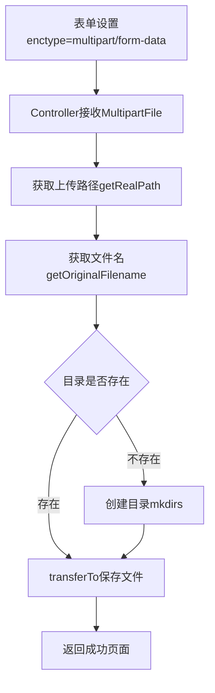
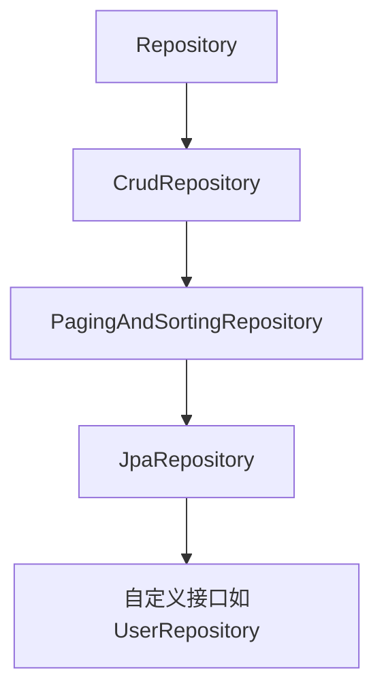
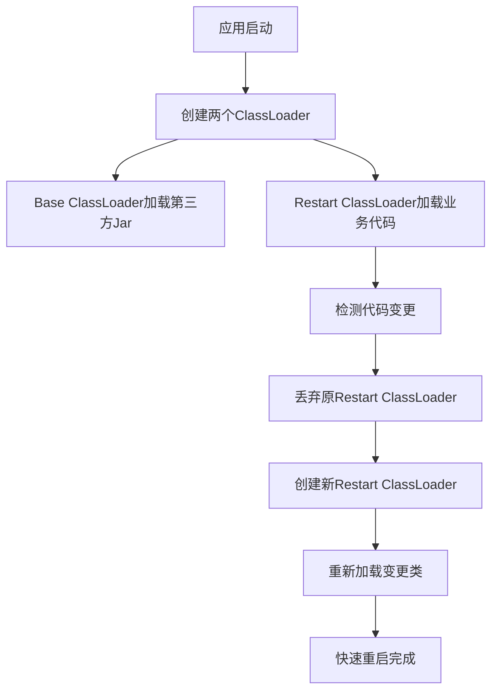
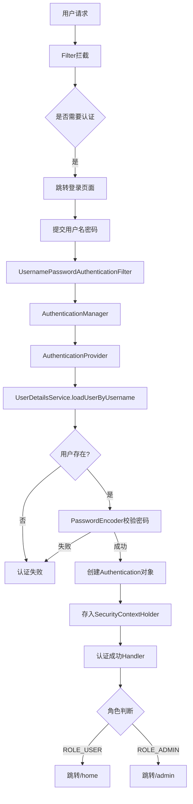
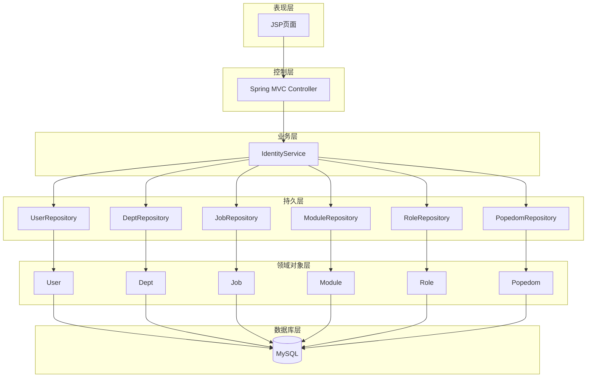
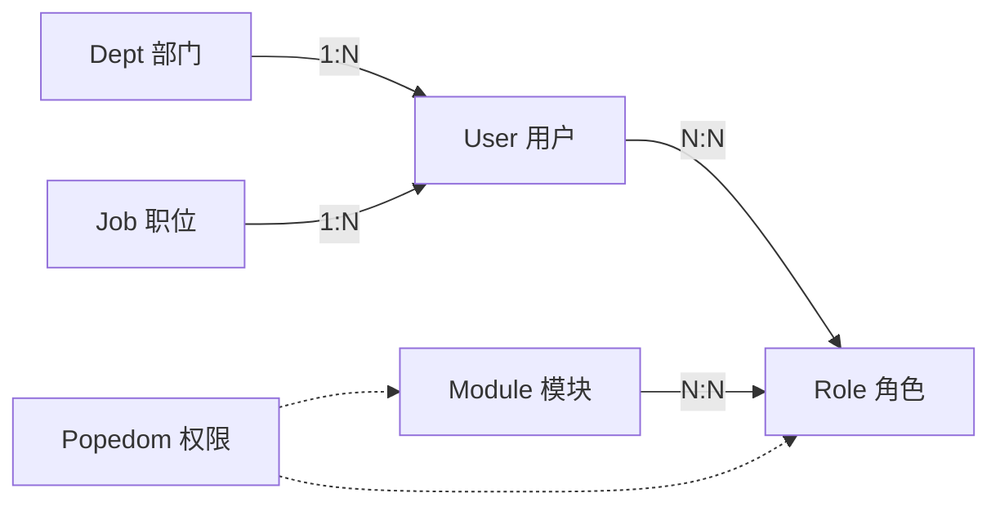

# 《Spring Boot 2企业应用实战》章节总结

## 书籍信息

- **书名**：Spring Boot 2 企业应用实战
- **作者**：疯狂软件 编著
- **出版信息**：电子工业出版社，2018年6月第1版
- **PDF状态**：完整扫描版，共260页
- **OCR状态**：已识别，部分页面识别存在少量错漏，但不影响主要内容理解

## 目录说明

- **目录识别情况**：PDF包含完整目录，共7章，从第9页开始展示
- **章节对应依据**：严格按PDF目录顺序输出
- **OCR修复说明**：部分代码段存在字符错乱，已基于上下文合理恢复

## 全书核心主题

本书系统介绍Spring Boot 2.0框架在企业级应用开发中的使用。全书遵循“约定优于配置”和“开箱即用”的理念，从Spring Boot的核心知识入手，逐步深入到Web开发、数据访问、安全控制等企业应用关键领域。书中通过大量代码示例和一个完整的信息管理系统实战项目，帮助读者掌握使用Spring Boot快速构建Java EE企业应用的方法。全书采用分层架构（DAO层、领域对象层、业务逻辑层、控制器层、视图层），强调松耦合设计。

---

## 第1章：Spring Boot入门

### 1. 核心论点

**问题 → 观点**：传统Spring框架开发存在大量配置文件和对第三方框架整合的复杂性。Spring Boot通过“约定优于配置”和“开箱即用”的设计理念，帮助开发者用更少的代码、更快地写出好的系统。

### 2. 关键概念

- **Spring Boot**：由Pivotal团队提供的全新框架，设计目的是简化Spring应用的创建、运行、调试、部署
- **spring-boot-starter模块**：基于“开箱即用”原则的自动配置依赖模块，以`spring-boot-starter-`为命名前缀
- **约定优于配置(COC)**：Spring Boot提供默认配置，开发者只需少量配置或直接使用默认配置
- **嵌入式Servlet容器**：Spring Boot可内嵌Tomcat、Jetty等Web容器，无需以war包形式部署
- **spring-boot-starter-web**：Web开发依赖模块，包含Tomcat和spring-webmvc，支持全栈式Web开发

### 3. 逻辑推演

本章从Spring框架的发展历程切入，指出Spring在企业Java开发中的标准地位，同时揭示其配置烦琐的痛点。接着介绍Spring Boot的诞生背景和核心特性，强调其解决配置问题的能力。随后详细讲解“开箱即用”的依赖模块体系，包括日志模块和Web开发模块。最后通过一个完整的“第一个Spring Boot应用”示例，演示了Maven安装配置、Eclipse集成、项目创建、代码编写和启动运行的全过程，让读者直观感受Spring Boot的便捷性。

### 4. 项目结构约定

```
src/main/resources/
├── static/          # 静态资源（css、js、image）
└── templates/       # 页面模板（html、jsp）
```

### 5. 经典金句

> “Spring框架的目标是帮助开发者写出更好的系统，那Spring Boot的目标就是帮助开发者用更少的代码，更快地写出好的系统。” (p.5)

> “Spring Boot遵循‘约定优于配置’原则，从而使开发人员不再需要定义样板化的配置。” (p.5)

---

## 第2章：Spring Boot核心

### 1. 核心论点

**问题 → 观点**：开发者需要理解Spring Boot的自动配置原理才能更好地使用该框架。Spring Boot的核心在于`@SpringBootApplication`注解和通过加载`META-INF/spring.factories`文件实现的自动配置机制。

### 2. 关键概念

- **@SpringBootApplication**：组合注解，包含`@SpringBootConfiguration`、`@EnableAutoConfiguration`、`@ComponentScan`
- **@EnableAutoConfiguration**：根据项目依赖的jar包自动配置项目相关配置项
- **spring.factories**：位于`META-INF/`目录下的配置文件，指导Spring Boot找到指定的自动配置类
- **application.properties**：全局配置文件，用于修改Spring Boot项目的默认配置值
- **banner定制**：可通过`banner.txt`文件自定义启动图案

### 3. 逻辑推演

本章首先解析`@SpringBootApplication`注解的源码组成，说明其三个核心注解各自的作用。接着通过源码追踪`SpringApplication.run()`方法的执行流程，揭示Spring Boot加载`META-INF/spring.factories`文件的过程。然后分析`spring.factories`中各类配置项（PropertySourceLoader、ApplicationListener、ApplicationContextInitializer等）的作用。最后以Web开发自动配置`WebMvcAutoConfiguration`为例，说明条件注解`@ConditionalOnClass`和视图解析器的自动配置原理。

### 4. 流程图

#### Spring Boot自动配置流程

```mermaid
graph TD
    A[启动SpringApplication.run()] --> B[创建SpringApplication实例]
    B --> C[调用initialize方法]
    C --> D[调用getSpringFactoriesInstances]
    D --> E[加载META-INF/spring.factories]
    E --> F[读取EnableAutoConfiguration配置项]
    F --> G[反射实例化@Configuration类]
    G --> H[加载到IoC容器]
    H --> I[完成自动配置]
```

### 5. 经典金句

> “精通一项技术一定要深入了解这项技术帮助我们做了哪些工作，深入理解它的底层运行原理，只有达到这个目标才可以熟练使用框架，最终才能融会贯通。” (p.30)

---

## 第3章：Spring Boot的Web开发

### 1. 核心论点

**问题 → 观点**：Spring Boot通过`spring-boot-starter-web`为Web开发提供支持，官方推荐使用Thymeleaf模板引擎完成动态页面，同时支持JSON处理、文件上传下载和多种异常处理方式。

### 2. 关键概念

- **Thymeleaf**：面向Web和独立环境的现代服务器端Java模板引擎，支持自然模板（在未处理时不污染HTML结构）
- **Thymeleaf标准方言**：核心库提供的方言，大多数处理器为属性处理器，使浏览器可正确显示未处理的模板
- **SpringEL表达式**：Thymeleaf与Spring整合后使用SpringEL替代OGNL
- **MultipartFile**：Spring MVC中处理文件上传的核心接口
- **@ControllerAdvice**：全局异常处理注解，统一处理所有Controller的异常
- **@ExceptionHandler**：注解处理异常的方法，value属性表示处理的异常类型

### 3. 逻辑推演

本章从Spring Boot的Web自动配置类介绍开始，然后详细讲解Thymeleaf模板引擎的语法（表达式、字符串操作、运算符、条件判断、循环、内置对象）。接着通过完整的登录示例演示Spring Boot Web开发流程，包括Controller创建、页面跳转、请求处理。之后分别展示JSP支持、JSON数据处理（含Java对象转JSON和集合转JSON）、文件上传下载（含单文件上传和对象方式接收）的实现方式。最后介绍三种异常处理方法：`@ExceptionHandler`局部处理、父类Controller统一处理、`@ControllerAdvice`全局处理。

### 4. 流程图

#### Thymeleaf表达式访问数据流程


#### 文件上传流程



### 5. 经典金句

> “Thymeleaf可以支持纯HTML浏览器展现（模板表达式在脱离运行环境下不污染HTML结构）。” (p.32)

> “具备这种能力的模板被称为自然模板。” (p.33)

---

## 第4章：Spring Boot的数据访问

### 1. 核心论点

**问题 → 观点**：Spring Boot通过Spring Data JPA极大地简化了数据库访问，开发者只需编写接口并继承特定Repository父接口即可实现CRUD操作，无需编写实现类。同时Spring Boot也支持JdbcTemplate和MyBatis等多种数据访问方式。

### 2. 关键概念

- **ORM (对象/关系映射)**：将面向对象编程语言与关系型数据库进行映射的规范
- **JPA (Java Persistence API)**：官方提出的Java持久化规范
- **Spring Data JPA**：Spring Data的子项目，进一步简化JPA写法
- **Repository接口体系**：Repository → CrudRepository → PagingAndSortingRepository → JpaRepository
- **CrudRepository**：提供最基本的增删改查操作
- **PagingAndSortingRepository**：继承CrudRepository，增加分页与排序功能
- **JpaRepository**：继承PagingAndSortingRepository，基于JPA的Repository接口
- **@Query注解**：直接在接口方法上声明JPQL语句进行查询
- **Specification接口**：封装JPA的Criteria查询条件，支持动态查询
- **JdbcTemplate**：Spring对JDBC封装的存取框架
- **MyBatis**：优秀的持久层框架，支持普通SQL查询、存储过程和高级映射

### 3. 逻辑推演

本章首先讲解ORM、JPA、Spring Data JPA三者的概念和关系。然后详细介绍Repository接口体系，通过CrudRepository示例演示基本的增删改查，通过PagingAndSortingRepository示例演示排序和分页查询。接着深入Spring Data JPA开发，依次展示：简单条件查询（通过方法名自动生成SQL）、关联查询和@Query查询（含JPQL、参数绑定、更新操作）、@NamedQuery查询（预定义查询语句）、Specification查询（动态条件查询和分页）。之后介绍JdbcTemplate的使用方法，最后演示Spring Boot整合MyBatis的开发案例。

### 4. Repository接口继承关系



### 5. 查询关键字示例

| 关键字 | 示例方法 | SQL效果 |
|--------|----------|---------|
| And | findByNameAndAddress | where name=?1 and address=?2 |
| Or | findByNameOrAddress | where name=?1 or address=?2 |
| Like | findByNameLike | where name like ?1 |
| Between | findByAgeBetween | where age between ?1 and ?2 |
| OrderBy | findByNameOrderByAgeDesc | where name=?1 order by age desc |

### 6. 经典金句

> “Spring Data JPA可以极大地简化JPA的写法，可以在几乎不用写实现的情况下，实现对数据的访问和操作。” (p.82-83)

> “ORM工具的唯一作用就是：把对持久化对象的保存、修改、删除等操作，转换成对数据库的操作。” (p.80)

---

## 第5章：Spring Boot的热部署与单元测试

### 1. 核心论点

**问题 → 观点**：开发过程中频繁重启应用会降低开发效率。Spring Boot通过`spring-boot-devtools`实现热部署，能在代码更改后自动重启应用；同时提供`@SpringBootTest`注解支持便捷的单元测试。

### 2. 关键概念

- **spring-boot-devtools**：为开发者服务的模块，最重要的功能是实现代码更改后的自动重启
- **双ClassLoader机制**：一个加载不会改变的类（第三方Jar包），另一个Restart ClassLoader加载会更改的类
- **@SpringBootTest**：Spring Boot 2.0官方推荐的测试类注解
- **MockMvc**：实现对HTTP请求的模拟，可直接测试Controller层接口而无需启动工程

### 3. 逻辑推演

本章首先说明热部署的必要性，然后介绍`spring-boot-devtools`的工作原理（双ClassLoader机制）和配置方法（添加依赖和Maven插件配置）。通过一个简单示例演示修改方法体代码后无需重启即可生效的效果。随后讲解Spring Boot单元测试，包括：添加`spring-boot-starter-test`依赖、使用`@SpringBootTest`和`@RunWith(SpringRunner.class)`定义测试类、使用MockMvc模拟HTTP请求进行Controller层测试、以及Service层的单元测试。

### 4. 流程图

#### Devtools热部署工作原理



### 5. 经典金句

> “开发热部署可以在改变程序代码的时候，自动实现项目的重新启动和部署，大大提高了开发调试的效率。” (p.143)

> “Spring Boot官方推荐使用@SpringBootTest定义测试类。” (p.147)

---

## 第6章：Spring Boot的Security安全控制

### 1. 核心论点

**问题 → 观点**：企业应用需要安全访问控制解决方案。Spring Security是一个基于Spring的企业应用安全框架，通过认证和授权两个核心操作为系统提供保护。Spring Boot对Spring Security提供了自动配置支持。

### 2. 关键概念

- **认证(Authentication)**：确认用户可以访问当前系统
- **授权(Authorization)**：确定用户在当前系统中是否能够执行某个操作
- **WebSecurityConfigurerAdapter**：Spring Security为Web应用提供的适配器，通过重写configure方法配置安全
- **UserDetailsService**：核心接口，通过loadUserByUsername()方法加载用户信息进行认证
- **PasswordEncoder**：密码加密接口，BCryptPasswordEncoder是推荐实现
- **Authentication**：表示用户认证信息的接口
- **SecurityContextHolder**：保存SecurityContext的容器，可获取当前用户信息
- **@EnableWebSecurity**：启用Spring Security功能的注解

### 3. 逻辑推演

本章先介绍Spring Security的概念和模块组成，然后讲解Security适配器WebSecurityConfigurerAdapter的两个核心方法：configure(HttpSecurity)用于用户授权，configure(AuthenticationManagerBuilder)用于用户认证。接着分析Spring Security的核心类（Authentication、SecurityContextHolder、UserDetails、UserDetailsService、GrantedAuthority等）和验证机制（Filter链）。通过一个简单示例演示基于内存用户的安全配置。最后分别用JPA、MyBatis和JDBC三种方式实现基于数据库的企业级Spring Security操作，包括：用户实体与角色实体的多对多关联、UserDetailsService的自定义实现、密码加密处理、登录成功后的角色跳转处理。

### 4. 流程图

#### Spring Security认证授权流程



### 5. 经典金句

> “在Spring的官方文档中明确指出，如果开发一个新的项目，BCryptPasswordEncoder是较好的选择。” (p.169)

> “Spring Security大体上是由一堆Filter实现的，Filter会在Spring MVC前拦截请求。” (p.169)

---

## 第7章：实战项目：信息管理系统

### 1. 核心论点

**问题 → 观点**：综合运用前面各章知识，开发一个包含用户管理、菜单管理、角色管理等功能的完整信息管理系统。系统采用严格的分层架构（表现层、控制层、业务层、持久层、领域对象层、数据库层），各层之间松耦合。

### 2. 关键概念

- **分层架构**：表现层(JSP) → 控制层(Spring MVC) → 业务层(Service) → 持久层(Repository) → 领域对象层(Domain) → 数据库(MySQL)
- **IdentityService**：业务逻辑组件，作为Repository组件的门面，封装用户管理、菜单管理、角色管理等业务逻辑
- **6个Repository对象**：UserRepository、DeptRepository、JobRepository、ModuleRepository、RoleRepository、PopedomRepository
- **6个持久化类**：User、Dept、Job、Module、Role、Popedom
- **实体关联关系**：Dept↔User(1:N)、User↔Job(N:1)、Module↔Role(N:N via Popedom)、User↔Role(N:N)

### 3. 逻辑推演

本章首先介绍项目功能和系统架构，说明系统管理包含用户管理、菜单管理、角色管理三个模块。然后展示配置文件(pom.xml和application.properties)的完整配置。接着设计6个持久化实体及其关联关系，创建对应的实体类（使用JPA注解配置映射和关联）。之后定义Repository接口继承JpaRepository实现持久层。然后实现IdentityService业务逻辑组件，封装所有业务逻辑功能，并使用@Transactional注解式事务管理。最后实现Web层的Controller控制器，包括系统登录、菜单管理、角色管理、用户管理等功能模块，所有查询页面统一使用分页处理。章节结尾预留功能扩展点（假期管理模块）。

### 4. 系统架构图



### 5. 实体关联关系图



### 6. 经典金句

> “Spring的容器负责管理业务逻辑组件、持久层组件及控制层组件，充分利用Spring的优势，进一步增强系统的解耦，提高应用的可扩展性，降低系统重构的成本。” (p.187)

> “通常建议按细粒度的模块来设计Service组件，让业务逻辑组件作为Repository组件的门面，这符合门面模式的设计。” (p.189)

---

## 总结

本书系统全面地介绍了Spring Boot 2.0企业应用开发的完整知识体系。从入门到核心原理，从Web开发到数据访问，从热部署到安全控制，最后通过完整实战项目将所有知识点融会贯通。全书强调“约定优于配置”的理念，以大量代码示例和完整的项目案例，帮助读者快速掌握Spring Boot开发技术并应用于实际企业项目开发中。