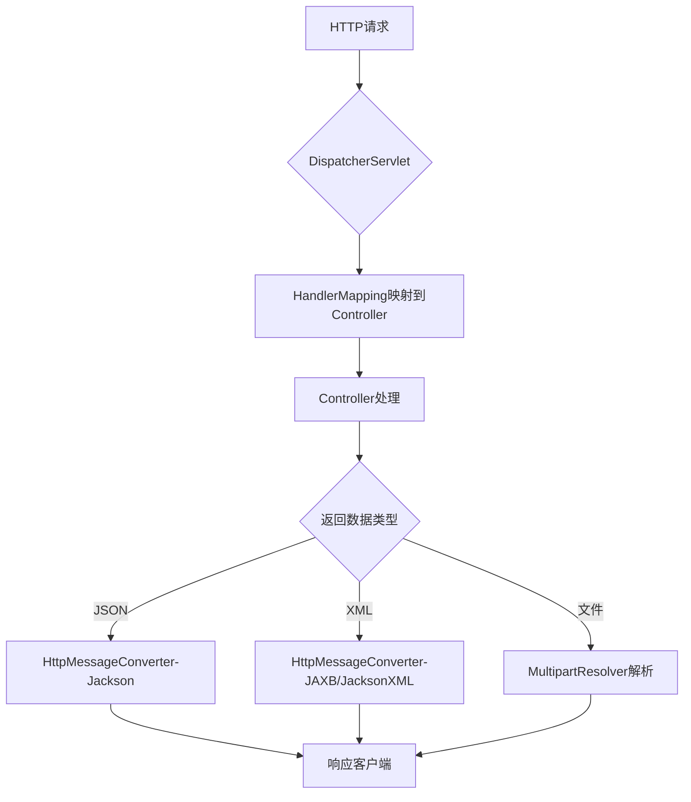
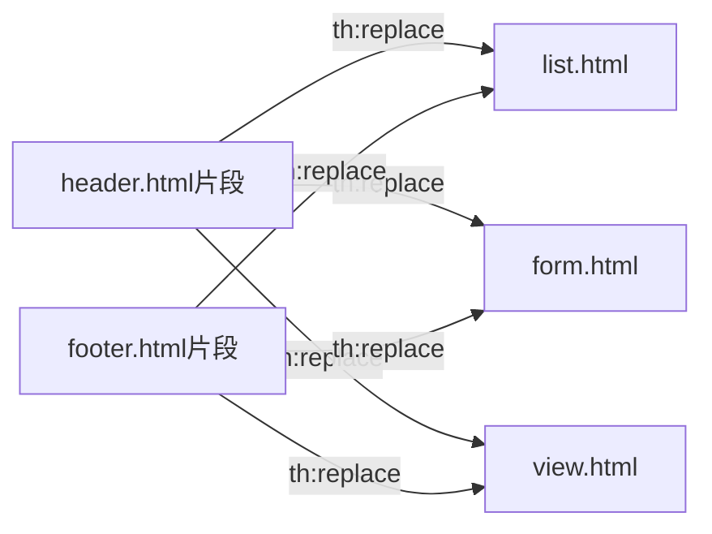
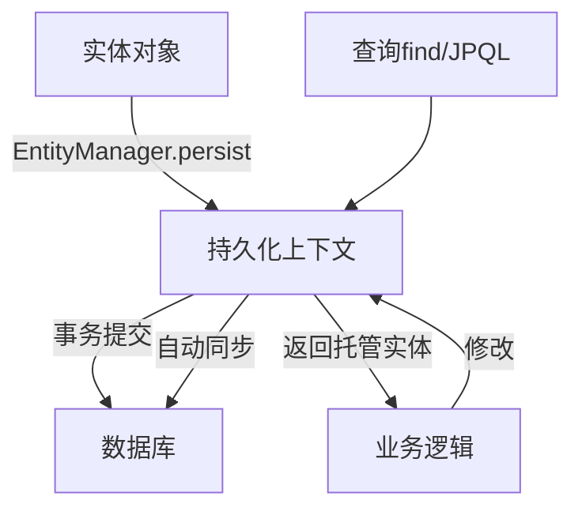
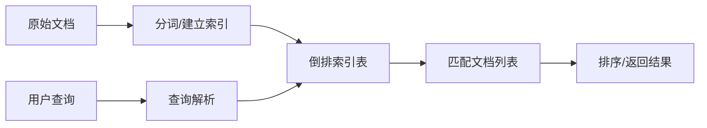
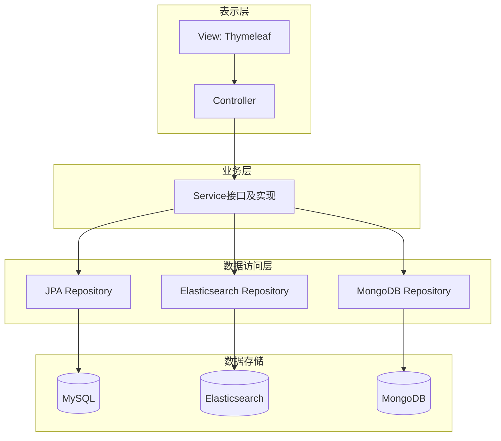
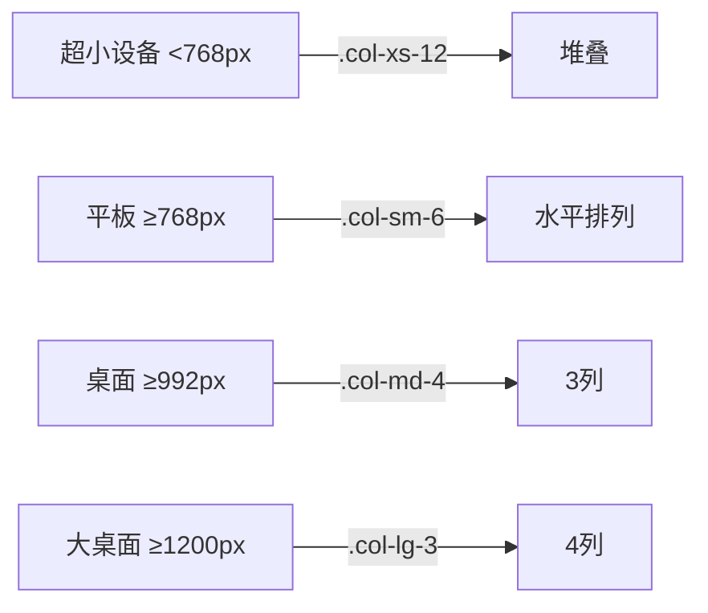
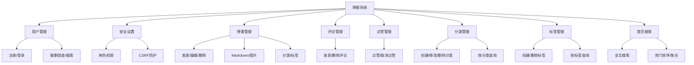
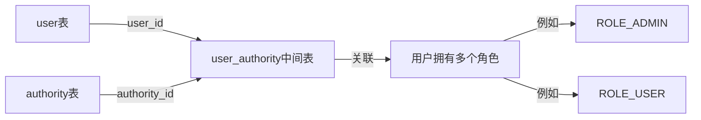
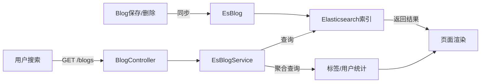

# 《Spring Boot企业级应用开发实战》章节总结

## 书籍信息
- **书名**：Spring Boot企业级应用开发实战
- **作者**：柳伟卫
- **PDF状态**：由多个PDF分卷拼接而成，文本通过OCR识别，部分页面存在识别错漏（如特殊字符、换行异常），但整体内容可读，章节结构完整。
- **OCR状态**：有少量字符识别错误（如“ρ”、“∂”等），但上下文可推断；部分代码块格式轻微错乱，不影响理解。

## 目录说明
- **目录识别情况**：完整识别了第1章至第22章及附录A~E的标题与起始页码。
- **章节对应依据**：严格依照原书PDF中的目录页（Page 9~12）及正文页眉章节名进行对应。
- **OCR修复说明**：对明显的错别字（如“口”、“∂”等）根据上下文进行了合理还原，但未改变原文语义；缺失的少量字符用“？”或合理推断补充，并标注“> 说明：该部分PDF识别不完整”。

## 全书核心主题
本书旨在帮助读者脱离“Hello World”级别的Spring Boot示例，通过一个完整的企业级博客系统实战项目，掌握从零开始构建企业级Java EE应用的全流程。全书围绕Spring Boot 2为核心，整合Spring、Spring MVC、Spring Security、Spring Data、Hibernate、Gradle、Bootstrap、jQuery、Thymeleaf、MySQL、H2、Elasticsearch、MongoDB等主流及前瞻技术，按照“实战入门—实战进阶—实战高级”三个阶段，逐步实现博客系统的需求分析、架构设计、分层实现、用户管理、角色权限、博客管理、评论点赞、分类标签、全文搜索等完整功能。通过理论结合大量案例，使读者不仅掌握技术用法，更理解企业级开发的完整流程与设计思想。

---

## 第1章：Spring Boot概述

### 核心论点
本章主要解决“传统企业级应用开发存在的问题以及Spring Boot如何革新”这一问题。
作者认为：传统Java EE开发（尤其是EJB）存在配置臃肿、依赖复杂、开发效率低等痛点；Spring Boot通过“约定大于配置”、自动化配置、内嵌容器、开箱即用等特性，极大简化了Spring应用的集成与开发，成为下一代企业级应用开发的首选框架。

### 关键概念/事件
- **约定大于配置**：通过合理的默认值（如代码结构、命名规范、注解）减少XML配置，实现零配置或极简配置。
- **Spring Boot Starter**：一组依赖描述集合，通过引入一个starter即可获得某个场景（如web、jpa）所需的所有依赖及自动配置。
- **Gradle Wrapper**：一种脚本（gradlew/gradlew.bat），使得项目成员无需预先安装Gradle，即可统一项目构建环境版本。
- **@SpringBootApplication**：组合注解，等同于@Configuration + @EnableAutoConfiguration + @ComponentScan，用于标注主类。
- **Spring Initializr**：可视化初始化Spring Boot项目的平台，可快速生成项目骨架。

### 逻辑推演/叙事脉络
1. 先回顾Java及企业级应用发展的痛点：EJB复杂、XML配置臃肿、依赖管理困难。
2. 提出“约定大于配置”思想，并从代码结构、注解替代XML、Gradle替代Maven等角度举例说明。
3. 介绍Spring Boot 2的诞生背景、目标和特性（内嵌容器、响应式编程、基于Java 8等）。
4. 通过一个“Hello World”项目，演示从Spring Initializr生成项目、Gradle构建、运行到浏览器访问的全过程。
5. 强调Spring Boot不是Spring的替代者，而是提升Spring开发体验的工具。

### 流程图


### 经典金句/数据
> “Spring Boot 可以说是近几年来 Spring 乃至整个 Java 社区比较有影响力的项目之一，也被视为 Java EE 开发的颠覆者。” (p.23)
> “零配置并不是完全没有配置，而是通过约定来减少配置，特别是减少 XML 文件的数量。” (p.17)
> “Spring Boot 主要的目标：(1)为所有Spring开发提供一个更快更广泛的入门体验。(2)开箱即用，不合适时也可以快速抛弃。(3)提供一系列大型项目常用的非功能性特征……” (p.24)

---

## 第2章：Spring框架核心概念

### 核心论点
本章解决“理解Spring框架中依赖注入（IoC）、控制反转、AOP等核心概念及其在Spring Boot中的应用”的问题。
作者认为：Spring IoC容器通过管理对象间的依赖关系（依赖注入）实现解耦；AOP通过切面实现横切关注点的模块化；Spring Boot大量使用了基于Java配置和注解的方式来管理Bean，简化了开发。

### 关键概念/事件
- **依赖注入与控制反转**：IoC是对象定义其依赖关系的过程由容器负责；DI是具体实现方式（构造器注入、setter注入）。
- **AOP（面向切面编程）**：将日志、事务等横切关注点模块化为切面，在连接点执行通知（前置、后置、环绕等）。
- **Bean的作用域**：默认singleton（单例），也可配置prototype、request、session等。
- **@SpringBootApplication**：实际包含@Configuration、@EnableAutoConfiguration、@ComponentScan。
- **JSR-330注解**：如@Inject、@Named，可与Spring原生注解替换使用。

### 逻辑推演/叙事脉络
1. 介绍Spring框架的模块化结构（核心容器、AOP、数据访问/集成、Web、Test等）。
2. 阐述依赖注入与控制反转的概念及其好处（降低耦合、提升可测试性）。
3. 讲解IoC容器的配置元数据（XML、注解、JavaConfig）及实例化方式。
4. 通过示例说明singleton bean依赖prototype bean时的陷阱及解决方案（使用ApplicationContextAware）。
5. 引入AOP的核心概念（切面、连接点、通知、切入点、代理、织入）及Spring AOP的实现方式（JDK动态代理、CGLIB）。
6. 总结Spring Boot中Bean的定义与自动装配方式，强调@SpringBootApplication的便捷性。

### 经典金句/数据
> “依赖注入”和“控制反转”其实就是一个事物的两种不同的说法而已，本质上是一回事。” (p.46)
> “Spring AOP 从来没有打算通过提供一种全面的 AOP 解决方案来取代 AspectJ。它们之间的关系应该是互补而不是竞争。” (p.61)

---

## 第3章：Spring MVC及常用MediaType

### 核心论点
本章解决“如何使用Spring MVC处理不同数据格式（JSON、XML、文件上传）的请求与响应”的问题。
作者认为：Spring MVC通过@RestController和HttpMessageConverter自动支持JSON；通过添加JAXB注解或Jackson XML扩展可支持XML；文件上传需配置MultipartResolver并用MultipartFile接收。

### 关键概念/事件
- **Spring MVC自动配置**：Spring Boot自动配置了ContentNegotiatingViewResolver、静态资源服务、HttpMessageConverters等。
- **JSON处理**：spring-boot-starter-web包含spring-boot-starter-json，默认使用Jackson2将对象转为JSON。
- **XML处理**：添加JAXB注解（@XmlRootElement）或使用jackson-dataformat-xml依赖。
- **Multipart文件上传**：配置CommonsMultipartResolver或StandardServletMultipartResolver，控制器方法使用@RequestParam MultipartFile参数。

### 逻辑推演/叙事脉络
1. 介绍Spring MVC的MVC模式及与三层架构的区别（强调业务层不应包含数据库连接等）。
2. 说明Spring Boot对Spring MVC的自动配置（HttpMessageConverter、静态资源、模板引擎等）。
3. 演示JSON类型的处理：创建实体User和控制器UserController，返回JSON数据，解释Jackson2的作用。
4. 演示XML类型的处理：在User上添加@XmlRootElement，并使用HttpRequester设置Accept为text/xml来测试。
5. 讲解文件上传的两种MultipartResolver实现及表单上传、RESTful API上传的不同处理方式。

### 流程图



### 经典金句/数据
> “Jackson2 库是非常流行的处理 JSON 的类库。只要将 Jackson2 放在 classpath 上，Spring Boot 应用程序中的任何使用了 @RestController 注解的类，都会默认呈现 JSON 格式数据的响应。” (p.60)
> “对于初学者来说，在使用MVC框架时，经常会将数据库连接放在控制器内……这是一个错误！” (p.66)

---

## 第4章：集成Thymeleaf

### 核心论点
本章解决“如何在Spring Boot中集成Thymeleaf模板引擎并实现用户管理基本功能”的问题。
作者认为：Thymeleaf的“原型即页面”特性使其开发效率高、与设计分离，尽管性能略低于JSP，但在企业级快速开发中综合优势明显。

### 关键概念/事件
- **Thymeleaf标准方言**：以`th:`开头的属性处理器，支持变量表达式（${}）、选择表达式（*{}）、消息表达式（#{}）、链接表达式（@{}）等。
- **自然模板**：模板文件即使不部署到服务器，也能直接在浏览器中作为静态原型打开。
- **模板片段**：使用`th:fragment`定义，用`th:insert`/`th:replace`引用，实现页面复用。
- **表达式基本对象**：如#ctx、#locale、#request、#session等。
- **迭代与条件**：`th:each`用于循环，`th:if`/`th:unless`/`th:switch`用于条件判断。

### 逻辑推演/叙事脉络
1. 对比常见Java模板引擎的性能（JSP最快，Thymeleaf较慢），但指出开发者效率更重要。
2. 通过对比JSP代码与Thymeleaf代码，说明Thymeleaf更接近HTML、无需启动服务器即可预览。
3. 详细介绍Thymeleaf标准方言的表达式语法、字面量、运算符、条件表达式、片段等。
4. 演示如何与Spring Boot集成：添加`spring-boot-starter-thymeleaf`依赖，配置application.properties（禁用缓存等）。
5. 实战一个简单的“用户管理”系统（增删改查），使用Thymeleaf模板+内存存储，展示CRUD页面实现。

### 流程图（模板片段引用）



### 经典金句/数据
> “所谓‘原型即页面’，是指 Thymeleaf 页面无须部署到 Servlet 开发服务器上，直接通过浏览器就能打开它。这种特点非常适合用于系统的界面原型设计。” (p.13)
> “界面的设计与实现相分离，这就是 Thymeleaf 广为流行的原因。” (p.13)

---

## 第5章：数据持久化

### 核心论点
本章解决“如何使用Spring Data JPA + Hibernate实现数据库持久化”的问题。
作者认为：JPA规范统一了ORM框架的接口；Spring Data JPA在此基础上进一步简化，开发者只需声明接口即可自动实现CRUD、分页、查询方法，极大提升数据访问层的开发效率。

### 关键概念/事件
- **JPA**：Java持久化API，通过注解（@Entity、@Id等）实现对象关系映射。
- **Spring Data JPA**：通过`JpaRepository`接口提供CRUD、分页、排序等功能，并根据方法名自动生成查询。
- **实体生命周期**：新建（New）、受管（Managed）、分离（Detached）、删除（Removed）。
- **级联操作**：CascadeType.ALL、PERSIST、MERGE、REMOVE等。
- **H2内存数据库**：用于开发阶段快速测试，无需安装MySQL。

### 逻辑推演/叙事脉络
1. 介绍JPA的背景、实体要求、主键、关系（一对一、一对多等）、继承策略等。
2. 讲解Spring Data JPA的特性（无需实现类、查询方法自动生成、分页支持等）。
3. 演示集成步骤：添加`spring-boot-starter-data-jpa`和MySQL驱动，配置数据源，定义User实体（@Entity），创建UserRepository继承`JpaRepository`。
4. 修改UserController，将原来基于内存的Repository替换为JPA实现，展示H2控制台查看表结构。
5. 切换到MySQL，配置spring.jpa.hibernate.ddl-auto=create-drop，观察自动建表及数据操作。

### 流程图（JPA持久化过程）



### 经典金句/数据
> “Spring Data JPA 对于 JPA 的支持则是更近一步。使用 Spring Data JPA 开发者无须过多关注 EntityManager 的创建、事务处理等 JPA 相关的处理……甚至让开发者连实现持久层业务逻辑的工作都省了。” (p.69~70)
> “默认情况下，Spring Boot 每个索引分配 5 个主分片和 1 个副本……” (p.163)

---

## 第6章：全文搜索

### 核心论点
本章解决“如何集成Elasticsearch实现全文搜索功能”的问题。
作者认为：Elasticsearch是一个基于Lucene的分布式RESTful搜索引擎，与Spring Boot集成后，可以通过Spring Data Elasticsearch快速实现文档索引、搜索、聚合等功能，适合实时搜索场景。

### 关键概念/事件
- **全文搜索原理**：建立倒排索引，将非结构化数据转为结构化索引，大幅提升搜索速度。
- **Elasticsearch核心概念**：集群（Cluster）、节点（Node）、索引（Index）、类型（Type）、文档（Document）、分片（Shard）、副本（Replica）。
- **近实时搜索**：索引文档后默认1秒内可搜索到，通过refresh_interval控制。
- **Spring Data Elasticsearch**：提供`ElasticsearchRepository`接口，自动实现CRUD及自定义查询方法。

### 逻辑推演/叙事脉络
1. 对比结构化数据搜索（SQL）与非结构化数据搜索（顺序扫描 vs 全文索引）。
2. 介绍Elasticsearch的特点、与Solr的对比（Elasticsearch更适用于实时搜索）。
3. 演示安装Elasticsearch 5.5.0，并测试服务是否启动。
4. 在Spring Boot项目中添加`spring-boot-starter-data-elasticsearch`依赖，配置集群节点。
5. 创建文档类EsBlog（@Document），创建EsBlogRepository继承`ElasticsearchRepository`。
6. 编写测试用例：保存文档，并通过自定义方法`findByTitleContainingOrSummaryContainingOrContentContaining`进行模糊搜索。

### 流程图（全文搜索原理）



### 经典金句/数据
> “全文检索的确加快了搜索的速度，但是多了创建索引的过程，两者加起来不一定比顺序扫描快多少。……然而两者还是有区别的，顺序扫描是每次都要扫描，而创建索引的过程仅仅需要一次，以后便是一劳永逸了。” (p.158)
> “Solr 在传统的搜索应用中表现好于 Elasticsearch，但在处理实时搜索应用时效率明显低于 Elasticsearch。” (p.159)

---

## 第7章：架构设计与分层

### 核心论点
本章解决“为什么要对应用程序进行分层以及如何设计三层架构”的问题。
作者认为：良好的分层（表示层、业务层、数据访问层）可以隔离关注点、提升可维护性、支持团队分工；每一层应职责明确，上层依赖下层，下层不依赖上层。

### 关键概念/事件
- **三层架构**：表示层（Controller/View）、业务层（Service）、数据访问层（Repository）。
- **分层原则**：每层独立、只与相邻层通信、可替换、不跨层调用。
- **不分层的弊端**：代码耦合度高、难以阅读、难以扩展、难以维护。
- **博客系统架构设计**：博客系统 + 文件管理系统，分别使用MySQL、Elasticsearch、MongoDB。

### 逻辑推演/叙事脉络
1. 以建筑学类比，说明软件分层的目的。
2. 展示一个早期JSP中混杂数据库操作的反例，指出不分层的问题。
3. 详细定义三层架构及各层职责，强调每一层需要不同的技能（前端、后端、DBA）。
4. 给出博客系统的具体架构图：前端Bootstrap+Thymeleaf，后端Spring MVC+Service+Repository，数据层MySQL+Elasticsearch+MongoDB。

### 架构图（Mermaid）



### 经典金句/数据
> “设计良好的架构分层是上层依赖于下层，而下层支撑起上层，但却不能直接访问上层，层与层之间通过协作来共同完成特定的功能。” (p.176)
> “表示层只能向业务层发送请求，并从业务层接收响应。它不能直接访问数据库或数据访问层。” (p.179)

---

## 第8章：集成Bootstrap

### 核心论点
本章解决“如何在Spring Boot项目中集成Bootstrap及常用前端框架实现响应式界面”的问题。
作者认为：Bootstrap提供响应式网格系统、丰富的UI组件，结合jQuery、FontAwesome等前端库，可以快速搭建美观的后台管理界面。

### 关键概念/事件
- **Bootstrap网格系统**：基于12列、响应式断点（xs/sm/md/lg），使用`.container`、`.row`、`.col-*`类。
- **媒体查询**：CSS3特性，根据视口宽度应用不同样式。
- **Thymeleaf与Bootstrap集成**：将CSS/JS文件放置在`resources/static`目录，通过`th:href`引用。
- **常用前端控件**：Tether、NProgress、toastr、chosen、tagsinput等。

### 逻辑推演/叙事脉络
1. 介绍Bootstrap的特点（响应式、移动优先、组件丰富）。
2. 给出Bootstrap基础模板（Doctype、meta viewport、Normalize.css）。
3. 演示将Bootstrap、jQuery等前端资源放入Spring Boot的`static`目录，并在header.html中通过`th:href`引入。
4. 修改footer.html，将JS脚本集中放置。
5. 对之前Thymeleaf的用户管理页面（list.html、form.html、view.html）进行Bootstrap美化，添加导航栏、卡片式布局、表格样式等。
6. 展示美化后的用户列表、编辑、查看界面效果。

### 流程图（Bootstrap网格系统响应式原理）



### 经典金句/数据
> “Bootstrap 让前端开发更快速、更简单。可以说所有开发者、所有应用场景都能适用于 Bootstrap。” (p.183)
> “Bootstrap 代码从小屏幕设备（如移动设备、平板电脑）开始，然后扩展到大屏幕设备（如笔记本电脑、台式电脑）上的组件和网格。” (p.185)

---

## 第9章：博客系统的需求分析与设计

### 核心论点
本章解决“博客系统应具备哪些功能模块以及如何进行原型设计”的问题。
作者认为：需求分析是开发的出发点；原型设计可以提前展示界面效果、指导开发；博客系统主要包括用户管理、安全设置、博客管理、评论管理、点赞管理、分类管理、标签管理、首页搜索八大核心模块。

### 关键概念/事件
- **需求调研**：参考现有博客系统（如WordPress）并加入微创新。
- **原型设计**：使用工具（如Axure）或HTML原型，体现“原型即页面”与Thymeleaf结合。
- **八大核心功能**：
  - 用户管理：注册、登录、增删改查、搜索。
  - 安全设置：角色权限、CSRF防护。
  - 博客管理：发表、编辑、删除、Markdown编辑器、分类、标签。
  - 评论管理：发表评论、删除评论。
  - 点赞管理：点赞、取消点赞。
  - 分类管理：创建、修改、删除分类，按分类查询。
  - 标签管理：创建、删除标签，按标签查询。
  - 首页搜索：全文检索、热门标签/用户/文章、最新发布。

### 逻辑推演/叙事脉络
1. 强调需求分析的重要性，以及如何获得需求（调研、参考现有系统）。
2. 列出博客系统的整体功能结构图。
3. 逐一详解8个核心功能模块的子功能。
4. 说明原型设计的必要性（展示效果、文字无法表达、指导开发、提升效率）。
5. 展示博客系统的原型设计效果图（首页、博主空间、博客展示、博客编辑等）。

### 整体功能结构图（Mermaid）



### 经典金句/数据
> “需求分析是非常重要的一个阶段。一切开发的出发点及前置条件都是要以需求为依据。” (p.197)
> “原型设计在敏捷开发中往往占有非常重要的地位。” (p.201)

---

## 第10章：集成Spring Security

### 核心论点
本章解决“如何集成Spring Security实现认证与授权”的问题。
作者认为：基于角色的隐式访问控制不够灵活，推荐基于资源的显式访问控制；Spring Security提供了强大的认证（支持多种机制）和授权（URL、方法、对象级别）功能，通过配置即可快速集成。

### 关键概念/事件
- **RBAC**：基于角色的访问控制，分为隐式（代码中硬编码角色字符串）和显式（基于资源/操作）。
- **显式访问控制优势**：更少的代码重构、直观、弹性、外部策略管理、运行时修改。
- **Spring Security核心**：`SecurityConfig`继承`WebSecurityConfigurerAdapter`，重写`configure(HttpSecurity)`定义URL规则，`configureGlobal(AuthenticationManagerBuilder)`定义认证源。
- **CSRF防护**：默认启用，需要POST/PUT/DELETE请求携带token。
- **Remember-Me**：基于散列或数据库存储token，实现自动登录。

### 逻辑推演/叙事脉络
1. 介绍角色的概念和基于角色的访问控制两种方式（隐式vs显式），通过项目报表权限例子说明隐式方式的脆弱性。
2. 引入Spring Security的功能和安装方式（Maven/Gradle依赖）。
3. 概述Spring Security的模块（core、web、config、ldap、acl等）及5.x新特性（OAuth2登录、响应式支持）。
4. 演示在Spring Boot中集成Spring Security：添加依赖，创建`SecurityConfig`，配置内存认证（用户waylau/123456/ADMIN）。
5. 设置URL授权：`/users/**`需要ADMIN角色，其他静态资源允许所有人。
6. 添加自定义登录页面和登录错误处理。
7. 使用Thymeleaf的sec命名空间显示用户信息及角色。

### 流程图（Spring Security过滤器链）


### 经典金句/数据
> “显式访问控制方式与隐式访问控制方式相比，具有以下优势：(1)更少的代码重构；(2)资源和操作更直观；(3)安全模型更有弹性；(4)外部安全策略管理；(5)运行时做修改。” (p.211)
> “自 Spring Security 3.2 起，启用了 CSRF 保护机制，所以 Form 表单提交必须满足以下条件：(1)HTTP 方法必须是 POST。(2)CSRF token 必须添加到请求。” (p.226)

---

## 第11章：博客系统的整体框架实现

### 核心论点
本章解决“如何设计博客系统的RESTful API以及实现后台整体控制层和前台布局”的问题。
作者认为：RESTful API通过URI标识资源、使用HTTP方法（GET/POST/PUT/DELETE）操作资源、无状态、支持多种表述；博客系统的控制层由MainController、BlogController、UserspaceController、AdminController等组成，前台布局采用Bootstrap + Thymeleaf实现响应式页面。

### 关键概念/事件
- **REST原则**：URI标识资源、统一接口（HTTP方法）、资源多重表述、无状态。
- **JAX-RS**：Java REST规范（Jersey是参考实现），但本书使用Spring MVC实现REST。
- **博客系统API设计**：定义了/index、/blogs、/u/{username}、/admins等端点的路径、参数和返回类型。
- **前台布局**：登录页、注册页、页首（导航+搜索）、页脚、分页组件、文章卡片列表。

### 逻辑推演/叙事脉络
1. 解释REST的含义、设计原则及与SOAP的区别。
2. 列出博客系统全部API（约30个端点），按模块划分。
3. 创建后台整体控制层：MainController（处理/、/index、/login、/register）、BlogController（处理/blogs列表）、UserspaceController（处理/u/{username}空间）、AdminController（处理/admins后台）。
4. 实现前台整体布局：登录界面（form）、注册界面、页首（最新/最热切换、搜索框）、分页组件（Bootstrap pagination）、文章列表（card布局）。
5. 展示原型项目blog-prototype的效果。

### 流程图（RESTful API请求处理）

```mermaid
graph TD
    A[客户端请求] --> B{URI + HTTP方法}
    B -->|GET /users| C[UserController.list]
    B -->|POST /users| D[UserController.save]
    B -->|DELETE /users/{id}| E[UserController.delete]
    B -->|GET /u/{username}| F[UserspaceController.getUserSpace]
    C --> G[返回HTML/JSON]
    D --> G
    E --> G
    F --> G
```

### 经典金句/数据
> “REST 并非标准，而是一种开发 Web 应用的架构风格，可以将其理解为一种设计模式。” (p.228)
> “通过超链接实现有状态交互，即请求消息是自包含的……服务器不需要记录任何 Session，所有的状态都通过 URI 的形式记录了客户端。” (p.229)

---

## 第12章：用户管理实现

### 核心论点
本章解决“如何实现博客系统的用户管理（注册、增删改查、分页、模糊搜索）”的问题。
作者认为：通过Spring Data JPA的JpaRepository和Pageable可轻松实现分页查询；前端采用异步Ajax加载，配合模态框实现新增/编辑，无需刷新整个页面。

### 关键概念/事件
- **分页查询**：使用`Pageable`接口和`Page`对象，前端配合自定义分页插件`thymeleaf-bootstrap-paginator.js`。
- **Bean Validation**：使用`@NotEmpty`、`@Size`、`@Email`等注解校验用户输入。
- **约束异常处理**：`ConstraintViolationExceptionHandler`提取校验错误信息。
- **异步加载**：`@RequestParam boolean async`控制返回完整页面还是片段，实现局部刷新。

### 逻辑推演/叙事脉络
1. 修改User实体，增加username、password、avatar字段，并添加Bean Validation注解。
2. 扩展UserRepository，增加`findByNameLike`和`findByUsername`方法。
3. 创建UserService接口及实现，封装CRUD和分页模糊查询逻辑。
4. 创建Response统一返回对象和ConstraintViolationExceptionHandler。
5. 修改UserController：`list`方法支持异步参数，返回页面或片段；`saveOrUpdateUser`处理POST请求，返回Response实体；`delete`映射DELETE请求；`/add`、`/edit/{id}`返回表单页面。
6. 增加AdminController，提供后台管理菜单。
7. 前台实现：修改users/list.html，使用Ajax加载数据，分页插件；增加add.html和edit.html模态框内容；编写main.js处理增删改查异步请求。
8. 解决Page对象的`isLast`属性EL解析错误（实际用`last`）。

### 经典金句/数据
> “Spring Data JPA 已经帮助用户做了实现，因此，用户不需要做任何实现，甚至都无须在 UserRepository 中定义任何方法。” (p.150)
> “分页组件是笔者写的一个插件，名字叫作 thymeleaf-bootstrap-paginator.js，适用于 Thymeleaf 与 Bootstrap 4 整合开发的项目。” (p.263)

---

## 第13章：角色管理实现

### 核心论点
本章解决“如何实现角色（权限）实体及用户与角色的关联”的问题。
作者认为：角色是权限的集合，通过`@ManyToMany`关系将用户与角色关联；使用Spring Security的`UserDetails`接口定制用户信息，并在初始化时导入基础角色数据。

### 关键概念/事件
- **Authority实体**：实现`GrantedAuthority`接口，代表角色（如ROLE_ADMIN、ROLE_USER）。
- **User实现UserDetails**：重写`getAuthorities()`、`isAccountNonExpired()`等方法。
- **多对多关系**：`@ManyToMany` + `@JoinTable`建立user_authority中间表。
- **初始化数据**：使用`import.sql`在启动时插入角色和默认用户。

### 逻辑推演/叙事脉络
1. 创建Authority实体，包含id和name，实现`GrantedAuthority`接口。
2. 修改User实体，增加`List<Authority> authorities`，并配置`@ManyToMany`映射。
3. 实现UserDetails接口的`getAuthorities()`方法，返回`SimpleGrantedAuthority`集合。
4. 创建AuthorityRepository和AuthorityService。
5. 修改UserController的saveOrUpdateUser方法，接收`authorityId`参数，为新建用户分配角色。
6. 修改MainController的registerUser方法，默认分配ROLE_USER角色（authorityId=2）。
7. 在application.properties中配置spring.datasource.initialization-mode=always，并创建import.sql初始化管理员（admin/ROLE_ADMIN）和博主（waylau/ROLE_USER）。
8. 启动项目，测试用户管理时显示角色下拉框。

### 流程图（用户-角色多对多关系）



### 经典金句/数据
> “角色是代表一系列行为或责任的实体，用于限定在软件系统中能做什么、不能做什么。” (p.207)
> “考虑到角色信息是基础数据，并且在项目运行中基本不会发生变更，所以，在项目启动时，就需要自动把相应的基础数据导入数据库。” (p.276)

---

## 第14章：权限管理实现

### 核心论点
本章解决“如何基于Spring Security配置URL权限、启用方法级安全、解决CSRF问题、使用BCrypt加密密码以及实现记住我功能”的问题。
作者认为：通过`HttpSecurity`配置可定义角色与URL的访问规则；`@PreAuthorize`注解可精细控制方法调用；CSRF防护需要前端在Ajax请求头中添加token；密码必须加密存储（如BCrypt）。

### 关键概念/事件
- **方法级安全**：`@EnableGlobalMethodSecurity(prePostEnabled=true)` + `@PreAuthorize("hasRole('ADMIN')")`。
- **BCrypt加密**：使用`BCryptPasswordEncoder`，对密码进行哈希加盐，提高安全性。
- **CSRF防护处理**：在HTML head中定义`_csrf` meta标签，Ajax请求前通过`beforeSend`设置请求头。
- **记住我**：`.rememberMe().key(KEY)`，基于cookie实现自动登录。
- **UserDetailsService**：从数据库加载用户信息（实现`loadUserByUsername`）。

### 逻辑推演/叙事脉络
1. 修改SecurityConfig：配置URL权限（`/admins/**`需要ADMIN角色），启用CSRF防护但放行H2控制台，启用remember me。
2. 定义PasswordEncoder为BCryptPasswordEncoder，配置AuthenticationProvider。
3. 修改UserServiceImpl实现UserDetailsService的`loadUserByUsername`方法。
4. 解决CSRF：在header.html中添加`_csrf`和`_csrf_header` meta，修改main.js的Ajax请求，通过`beforeSend`添加CSRF Token。
5. 密码加密：修改import.sql，将原始密码“123456”改为BCrypt加密后的密文。
6. 修改login.html增加“记住我”复选框。
7. 在header.html中根据认证状态显示用户菜单（个人主页、个人设置、写博客、退出）。
8. 测试：未登录访问/admin被重定向到登录页；登录admin后可访问；退出后“记住我”使下次自动登录。

### 经典金句/数据
> “自 Spring Security 3.2 起，启用了 CSRF 保护机制，所以 Form 表单提交必须满足以下条件……CSRF token 必须添加到请求。” (p.226)
> “一些敏感数据，如密码等，在数据库中如果是以明文进行存储的，那么就会具有极大的安全风险。” (p.277)

---

## 第15章：文件服务器实现

### 核心论点
本章解决“如何使用Spring Boot + MongoDB实现小型文件的存储、上传、下载、预览及删除”的问题。
作者认为：MongoDB的GridFS可存储大文件，但对于小于16MB的小文件，可直接使用BSON的Binary类型存储；通过`@CrossOrigin`注解支持跨域，对外提供RESTful API供博客系统调用。

### 关键概念/事件
- **MongoDB**：文档型NoSQL数据库，使用`@Document`注解映射实体，`MongoRepository`提供CRUD。
- **Binary存储**：文件内容用`org.bson.types.Binary`类型，适合小文件。
- **嵌入MongoDB**：开发阶段可使用`de.flapdoodle.embed.mongo`内嵌MongoDB，无需安装服务端。
- **文件上传限制**：通过`spring.http.multipart.max-file-size`设置单文件大小。
- **跨域支持**：`@CrossOrigin(origins = "*")`。

### 逻辑推演/叙事脉络
1. 分析文件服务器需求：存储小型文件（头像、博客插图），提供RESTful API。
2. 创建Spring Boot项目，添加`spring-boot-starter-data-mongodb`和`de.flapdoodle.embed.mongo`依赖。
3. 设计File实体：包含id、name、contentType、size、uploadDate、md5、content（Binary）、path等字段。
4. 创建FileRepository继承`MongoRepository`。
5. 实现FileService及FileServiceImpl，提供saveFile、removeFile、getFileById、listFilesByPage。
6. 编写FileController：`GET /files/{pageIndex}/{pageSize}`分页查询；`GET /files/{id}`下载；`GET /view/{id}`在线预览；`POST /upload`上传返回文件URL；`DELETE /{id}`删除。
7. 配置application.properties：服务器地址端口、文件大小限制、是否使用内嵌MongoDB。
8. 测试：启动后访问`http://localhost:8081`上传界面，上传图片后可预览。

### 流程图（文件上传与预览）

```mermaid
graph TD
    A[客户端] -->|POST /upload multipart| B[FileController]
    B --> C[保存至MongoDB]
    C --> D[返回文件URL]
    A -->|GET /view/{id}| B
    B --> E[从MongoDB获取Binary]
    E --> F[设置Content-Type]
    F --> G[浏览器预览/下载]
```

### 经典金句/数据
> “MongoDB 是一个介于关系数据库和非关系数据库之间的产品，是非关系数据库中功能最丰富、最像关系数据库的。” (p.286)
> “由于 MongoDB 的 BSON 文档对于数据量大小的限制（每个文档不超过 16MB），因此本文件服务器主要针对的是小型文件的存储。” (p.286)

---

## 第16章：博客管理实现

### 核心论点
本章解决“如何实现博客的发表、编辑、删除、查询、阅读量统计以及用户个人设置和头像上传”的问题。
作者认为：博客模型应包含标题、摘要、内容（Markdown格式）、HTML内容、创建时间、阅读量、评论量、点赞量、标签等；使用Markdown解析器（txtmark）将内容转为HTML；通过文件服务器上传头像，并使用cropbox.js实现头像裁剪。

### 关键概念/事件
- **Markdown转HTML**：使用`txtmark`库的`Processor.process(content)`。
- **@CreationTimestamp**：Hibernate注解，自动生成创建时间。
- **博客分页查询**：支持按最新（createTime）、最热（readSize,commentSize,voteSize）排序。
- **阅读量递增**：每次查看博客时`readingIncrease`方法增加readSize。
- **头像上传**：前端cropbox裁剪后转为base64，再转为Blob提交到文件服务器，返回URL保存到User.avatar。

### 逻辑推演/叙事脉络
1. 创建Blog实体，与User关联，包含title、summary、content、htmlContent、createTime、readSize等字段，`setContent`方法中调用`txtmark`转换为htmlContent。
2. 创建BlogRepository，定义`findByUserAndTitleLike`等查询方法。
3. 创建BlogService及实现，包含saveBlog、removeBlog、readingIncrease等方法，并在保存/删除时同步更新Elasticsearch（后续章节）。
4. 修改UserspaceController：
   - 个人设置：`/profile`（GET/POST），使用`@PreAuthorize`限制本人访问，密码变更需BCrypt加密。
   - 头像变更：`/avatar`（GET/POST），前端调用文件服务器上传，保存avatar URL。
   - 博客列表：`/{username}/blogs`支持order（new/hot）、catalog、keyword参数，返回分页数据。
   - 博客展示：`/{username}/blogs/{id}`，调用readingIncrease增加阅读量。
   - 博客编辑：`/blogs/edit`和`/blogs/edit/{id}`返回编辑页面，保存时更新博客及标签。
5. 前台实现：用户主页显示头像、用户名、邮箱；博客编辑页面集成Markdown编辑器（thinker-md）和图片上传按钮（调用文件服务器插入图片）；博客展示页面显示htmlContent。

### 经典金句/数据
> “博客正文是采用 Markdown 编辑器来编写的，因此需要 Markdown 格式的解析工具: Markdown parser for the JVM 0.16。” (p.304)
> “每次读取，简单地可以认为阅读量增加 1 次。” (p.321)

---

## 第17章：评论管理实现

### 核心论点
本章解决“如何实现博客的评论功能（发表评论、删除评论、统计评论数）”的问题。
作者认为：评论作为独立的实体Comment，与Blog和User关联；每次添加或删除评论时，需要同步更新Blog的评论数量字段commentSize，并通过`@PreAuthorize`控制删除权限（仅本人或管理员）。

### 关键概念/事件
- **评论实体**：包含content、user（@OneToOne）、createTime（@CreationTimestamp）。
- **Blog与Comment一对多**：`@OneToMany` + `@JoinTable`，提供addComment/removeComment方法并更新commentSize。
- **权限控制**：评论删除需要判断当前认证用户是否为评论的所有者或具有ADMIN角色。
- **异步加载评论列表**：通过Ajax GET /comments?blogId=xxx返回片段，实现无刷新。

### 逻辑推演/叙事脉络
1. 创建Comment实体，与User单向关联，包含content、createTime。
2. 修改Blog实体，添加`List<Comment> comments`及addComment/removeComment方法，方法内部更新commentSize。
3. 创建CommentRepository继承JpaRepository。
4. 创建CommentService及CommentServiceImpl，提供getCommentById和removeComment。
5. 在BlogService中添加createComment和removeComment方法，分别调用Blog的addComment/removeComment并保存。
6. 创建CommentController：
   - GET /comments：根据blogId返回评论列表片段，并传递当前用户的评论所有者标识。
   - POST /comments：接收blogId和commentContent，调用blogService.createComment，需认证。
   - DELETE /comments/{id}：需认证，检查评论所有者，调用removeComment。
7. 前台修改blog.html：添加评论输入框、评论列表展示区域；blog.js中增加getComment、提交评论、删除评论的事件，使用Ajax发送POST/DELETE并刷新评论列表。

### 经典金句/数据
> “评论是社交化软件的重要组成部分，可以让网友之间建立起交互和管理。” (p.198)
> “每次增加或移除一个评论之后，都要统计评论总数 commentSize。” (p.339)

---

## 第18章：点赞管理实现

### 核心论点
本章解决“如何实现博客的点赞与取消点赞功能，并防止重复点赞”的问题。
作者认为：点赞实体Vote与User关联，一个博客可以有多个Vote；在Blog中提供addVote方法，需检查用户是否已点赞（遍历Votes列表），避免重复；取消点赞时根据voteId删除。

### 关键概念/事件
- **Vote实体**：包含user（@OneToOne）、createTime（@CreationTimestamp），无额外字段。
- **Blog与Vote一对多**：`@OneToMany` + `@JoinTable`，addVote返回boolean表示是否重复，removeVote删除。
- **点赞权限**：发表点赞需要登录（`@PreAuthorize`），取消点赞需要检查是否为点赞的所有者。
- **前端状态**：根据当前用户是否已点赞显示“点赞”或“取消点赞”按钮。

### 逻辑推演/叙事脉络
1. 创建Vote实体，与User单向关联，包含createTime。
2. 修改Blog实体，添加`List<Vote> votes`及addVote/removeVote方法，addVote时遍历检查是否已存在同一用户的Vote。
3. 创建VoteRepository继承JpaRepository。
4. 创建VoteService及实现，提供getVoteById、removeVote。
5. 在BlogService中添加createVote和removeVote方法，createVote调用addVote，如果已点赞则抛出异常。
6. 创建VoteController：
   - POST /votes：接收blogId，调用blogService.createVote。
   - DELETE /votes/{id}：接收blogId和voteId，需检查当前用户是否为Vote的user，调用removeVote。
7. 修改UserspaceController中的getBlogById，增加逻辑判断当前用户是否已点赞，传递currentVote对象给前端。
8. 前台blog.html：根据currentVote是否为空显示“点赞”或“取消点赞”按钮；blog.js中绑定点击事件，发送Ajax请求并刷新页面（或局部刷新）。

### 经典金句/数据
> “点赞是另外一种社会化的交流方式。相对于评论而言，点赞可操作性更强，毕竟点赞只需要按一次，而评论就不得不输入大量的文字。” (p.351)
> “每次点赞或取消点赞后，都要统计点赞量 voteSize。” (p.353)

---

## 第19章：分类管理实现

### 核心论点
本章解决“如何实现博客分类（创建、修改、删除、按分类查询）”的问题。
作者认为：分类Catalog实体与User关联，一个博客属于一个分类；分类支持创建、修改、删除（需检查名称唯一性）；用户主页左侧展示分类列表，点击可查询该分类下的博客。

### 关键概念/事件
- **Catalog实体**：包含name、user（@OneToOne），名称在同一个用户下必须唯一。
- **Blog与Catalog多对一**：一个博客只能属于一个分类，在Blog中添加`Catalog catalog`字段。
- **分类删除**：需级联处理？本书中未实现级联，删除分类前应确保没有博客使用该分类（或者将博客的分类设为null）。代码中直接删除，可能产生外键问题，需读者自行完善。
- **前端实现**：用户主页左侧分类列表，提供添加、编辑、删除按钮，模态框编辑分类。

### 逻辑推演/叙事脉络
1. 创建Catalog实体，包含name和user，添加`@PrePersist`或业务方法校验名称唯一性。
2. 修改Blog实体，添加`Catalog catalog`字段，类型为`@OneToOne`（实际上应该是ManyToOne，原书可能是笔误，但逻辑上正确）。
3. 创建CatalogRepository，扩展JpaRepository，提供`findByUser`和`findByUserAndName`方法。
4. 创建CatalogService及实现，saveCatalog时检查重复，removeCatalog直接删除。
5. 创建CatalogVO用于接收前端JSON参数（username和catalog对象）。
6. 创建CatalogController：
   - GET /catalogs：根据username返回分类列表片段，并传递isOwner标识。
   - POST /catalogs：接收CatalogVO，调用catalogService.saveCatalog。
   - DELETE /catalogs/{id}：接收username参数，删除分类。
   - GET /catalogs/edit：返回空白编辑表单页面。
   - GET /catalogs/edit/{id}：返回指定分类的编辑表单页面。
7. 修改UserspaceController：在博客列表查询中增加对catalogId的处理；在博客编辑页面绑定当前用户的分类列表。
8. 前台：用户主页左侧动态加载分类，添加模态框编辑分类；博客编辑页面增加分类下拉选择。

### 经典金句/数据
> “分类管理可以方便地将自己的个人博客进行分门别类。分类后的博客更加容易管理和查找。” (p.199)
> “分类不但要与博客文章关联，还需要与用户关联。” (p.363)

---

## 第20章：标签管理实现

### 核心论点
本章解决“如何实现博客标签（添加、修改、删除、按标签查询）”的问题。
作者认为：标签本质上是Blog的一个字符串属性（以逗号分隔多个标签），通过前端jQuery Tags Input组件实现标签的增删改，按标签查询即对tags字段进行模糊搜索。

### 关键概念/事件
- **标签存储**：Blog实体中的`String tags`字段，多个标签用逗号分隔（如“Java,Spring Boot,微服务”）。
- **jQuery Tags Input**：一个将普通input转变为标签输入框的jQuery插件，支持添加、删除、自动完成等。
- **按标签查询**：复用之前的全文搜索或`findByTagsLike`方法，在前端将标签作为keyword传入即可。

### 逻辑推演/叙事脉络
1. 确认Blog中已有tags字段。
2. 修改blogedit.html：将标签输入框的class设置为`form-control-tag`，并添加初始化脚本调用`$('.form-control-tag').tagsInput()`。
3. 修改BlogService中保存博客的方法，确保tags字段被正确保存。
4. 修改博客展示页面blog.html，将tags字段按逗号分割，循环显示每个标签，并生成链接（`/blogs?keyword=标签名`），实现按标签查询。
5. 测试：创建博客时输入多个标签，展示页面显示为多个badge，点击某个标签可搜索出包含该标签的所有博客。

### 经典金句/数据
> “在社交化流行的今天，如何能让自己的博客跟其他人的博客关联起来呢？答案就是标签。” (p.199)
> “标签本身也是一类关键字。” (p.381)

---

## 第21章：首页搜索实现

### 核心论点
本章解决“如何基于Elasticsearch实现博客首页的多维度搜索（最新、最热、关键字）以及热门标签/用户/文章聚合统计”的问题。
作者认为：通过Spring Data Elasticsearch的`ElasticsearchRepository`和聚合查询（Aggregations），可以实现博客的全字段模糊搜索以及标签、用户的排名统计；使用IK分词器可解决中文分词问题。

### 关键概念/事件
- **文档同步**：在BlogService的saveBlog和removeBlog中，同步操作EsBlog（从Blog构造，调用esBlogService.updateEsBlog）。
- **分页模糊搜索**：`findByTitleContainingOrSummaryContainingOrContentContainingOrTagsContaining`。
- **聚合查询**：使用`ElasticsearchTemplate` + `NativeSearchQueryBuilder` + `terms`聚合，统计标签出现次数、用户名出现次数，返回Top30标签和Top12用户。
- **IK分词器**：安装elasticsearch-analysis-ik插件，在EsBlog的tags字段上指定`analyzer = "ik_smart"`，实现中文合理分词。

### 逻辑推演/叙事脉络
1. 添加Spring Data Elasticsearch依赖，配置集群地址。
2. 创建EsBlog文档类（与Blog字段对应），使用`@Document(indexName="blog")`。
3. 创建EsBlogRepository，定义模糊搜索方法。
4. 创建EsBlogService及实现，包含listNewestEsBlogs、listHotestEsBlogs、listTop5NewestEsBlogs、listTop5HotestEsBlogs、listTop30Tags、listTop12Users等。
5. 修改BlogServiceImpl，在saveBlog和removeBlog中同步维护EsBlog。
6. 修改BlogController：`/blogs`接口接收order、keyword、async参数，根据order调用不同服务，首次加载时还返回热门标签、热门用户、最新/最热前5博客。
7. 修改index.html：博客列表通过Ajax异步加载（分页），右侧边栏显示热门标签、热门用户、热门文章、最新发布。
8. 添加index.js处理分页、搜索、最新/最热切换。
9. 安装IK分词器，修改EsBlog的tags字段注解，重新索引后测试中文标签搜索效果。

### 流程图（Elasticsearch全文搜索流程）



### 经典金句/数据
> “对于博客系统来说，首页是整个博客系统的门面。首页所展示的博客内容大多都与搜索分不开。” (p.386)
> “ik_smart 会做最粗粒度的拆分，比如会将‘老卫的博客系统’拆分为‘老卫’‘的’‘博客系统’。” (p.407)

---

## 第22章：总结与展望

### 核心论点
本章总结全书所学内容，展望博客系统未来的可扩展点，并对读者提出学习建议。
作者认为：通过本书读者可以了解企业级开发的完整流程、熟悉主流及前瞻技术框架、做到理论联系实践；未来博客系统可进一步集成OAuth2、响应式编程、云原生等特性。

### 关键概念/事件
- **完整流程**：需求分析→技术选型→架构设计→框架搭建→功能实现。
- **技术栈回顾**：前端Bootstrap+Thymeleaf，后端Spring Boot全家桶，数据层MySQL+Elasticsearch+MongoDB。
- **未来方向**：OAuth2登录、响应式WebFlux、容器化部署（Docker/K8s）、微服务拆分等。
- **学习建议**：多看、多思考、多敲代码、善于总结、大胆质疑、多交流。

### 逻辑推演/叙事脉络
1. 总结全书覆盖的企业级开发完整流程。
2. 罗列所有涉及的技术及版本，强调其主流性和前瞻性。
3. 分析前端、后端、数据存储技术的选型理由。
4. 提出博客系统可继续优化的方向（安全、性能、用户体验）。
5. 给出读者编程成长建议（实践、总结、质疑、交流）。

### 经典金句/数据
> “本书揭示了企业级应用的完整流程。不管是刚刚入行的学生还是初级开发人员，抑或是资深的工程师，都能从本书中获益。” (p.409)
> “变化是软件行业唯一不变的定律。” (p.412)

---

## 附录A：开发环境的搭建

### 核心论点
本附录指导读者如何安装配置开发环境（JDK、Gradle、Eclipse）并将Spring Boot项目导入Eclipse。

### 关键概念/事件
- **JDK 8**：必须不低于Java 8。
- **Gradle 4.0**：推荐使用Gradle Wrapper统一版本。
- **Eclipse插件**：Buildship（Gradle插件）。
- **导入方式**：Existing Gradle Project，选择Gradle Wrapper distribution。

## 附录B：Thymeleaf属性

列出所有常用的`th:*`属性，如th:abbr、th:alt、th:action、th:each、th:if、th:switch等。

## 附录C：Thymeleaf表达式工具对象

详细介绍#execInfo、#messages、#uris、#conversions、#dates、#calendars、#numbers、#strings、#objects、#bools、#arrays、#lists、#sets、#maps、#aggregates、#ids等工具对象的常用方法。

## 附录D：Bean Validation内置约束

列出@AssertFalse、@AssertTrue、@DecimalMax、@DecimalMin、@Digits、@Future、@Max、@Min、@NotNull、@Null、@Past、@Pattern、@Size等约束的用法。

## 附录E：本书所涉及的技术及相关版本

详细列出全书使用的主要技术及版本号，如JDK8、Gradle4.0、Spring Boot 2.0.0.M2、Thymeleaf 3.0.6.RELEASE、Elasticsearch 5.5.0等，供读者搭建环境时参考。