# 《Spring Boot开发实战》章节总结

## 书籍信息
- 书名：Spring Boot开发实战
- 作者：陈光剑 编著
- PDF 状态：共4个部分，总计约81页（页码不连续，部分页面缺失）
- OCR 状态：文本可识别，部分图片模糊或缺失，图表以文本描述为主

## 目录说明
- 目录识别情况：基于PDF正文及目录页完整识别，共三大部分20章。
- 章节对应依据：严格按照书中目录顺序（前言、第I部分第1~3章、第II部分第4~17章、第III部分第18~20章）逐章整理。
- OCR 修复说明：少量OCR错漏（如字符乱码、表格格式错位）已根据上下文校正；缺失图表逻辑已用Mermaid重建；无法恢复的内容标注说明。

## 全书核心主题
本书系统介绍 Spring Boot 2.0 框架的极简化开发，结合 Kotlin 编程语言和 Gradle 构建工具，涵盖从基础入门到项目实战、系统监控与运维的完整知识体系。核心围绕“约定优于配置”理念，深入剖析自动配置原理，并针对企业级开发中的数据库层（MyBatis/JPA）、Web MVC、AOP、安全（Spring Security）、前后端分离、任务调度、响应式编程（WebFlux）、缓存、Session共享、API Gateway（Zuul）、日志、监控（Actuator/Admin）、测试及Docker容器化部署等关键模块，提供了大量实战案例与代码示例。本书旨在帮助开发者快速掌握 Spring Boot 高效开发技能，降低配置复杂度，提升应用可维护性与可扩展性。

---

## 前言
### 核心论点
Spring Boot 由 Pivotal 团队开发，旨在简化新 Spring 应用的初始搭建与开发过程，去除烦琐的 XML 配置，实现“极简化”开发。书中采用 Kotlin + Gradle 技术栈，强调学无止境与实践出真知。

### 关键概念/事件
- Spring Boot 2.0：本书使用的核心框架版本。
- Kotlin：JetBrains 开发的 JVM 语言，100% 兼容 Java，Spring Boot 2.0 对其提供一流支持。
- Gradle：项目自动化构建工具，基于 Groovy DSL，比 Maven 更灵活。
- 极简化配置：通过注解和 application.properties 避免 XML 配置文件。

### 逻辑推演/叙事脉络
作者从自身实践出发，指出传统 Spring 配置复杂、样板代码多的问题，引出 Spring Boot 的解决方案。本书按基础入门、综合实战、系统监控与运维三大部分递进，建议初学者按顺序阅读，有经验者可跳读。

### 经典金句/数据
> “Spring Boot 无它，唯 Spring 是也。” (p.38)
> “快乐生活，快乐学习，快乐分享，快乐实践出真知。” (p.10)

---

## 第I部分：Spring Boot框架基础

## 第1章：Spring Boot简介
### 核心论点
本章主要讨论从传统 Spring 框架到 Spring Boot 的演进原因。作者认为：Spring Boot 继承了 Spring 的优秀基因，通过“约定优于配置”理念，解决了 Spring 应用开发中配置复杂、依赖管理烦琐的问题。

### 关键概念/事件
- EJB：分布式应用设计，但过于臃肿，不适合中小型项目。
- Spring 框架：2003 年发布，提供 IoC 和 AOP 两大核心特性。
- Spring Boot：2014 年发布 1.0 版本，2018 年发布 2.0 版本。
- 约定优于配置（COC）：软件设计范式，减少开发人员需做决定的数量，获得简单的好处。
- Spring Boot 核心模块：spring-boot、starters、autoconfigure、actuator、tools、cli。

### 逻辑推演/叙事脉络
从 EJB 到 Spring 的历史回顾，指出 Spring 解决了 EJB 的臃肿问题，但随着功能扩展，Spring 自身的 XML 配置变得复杂。Spring Boot 应运而生，利用 JavaConfig 和 COC 理念实现“零 XML 配置”。最后通过核心模块介绍，展示 Spring Boot 在 Spring 生态中的位置（如图 1-4，未完整恢复）。

### 经典金句/数据
> “Spring Boot 是一个名词，反过来念就是‘Boot Spring’，意即：‘起飞吧，Spring！’” (p.28)
> “Spring Boot 充分利用了 JavaConfig 的配置模式以及‘约定优于配置’的理念。” (p.27)

---

## 第2章：快速开始HelloWorld
### 核心论点
本章解决如何用 Spring Boot 2.0 + Kotlin + Gradle 快速搭建第一个 HelloWorld RESTful 应用的问题。作者观点：通过 IDEA 的 Spring Initializr，数秒内即可创建项目，核心注解 @SpringBootApplication 整合了配置、自动扫描和自动配置功能。

### 关键概念/事件
- Spring Initializr：Spring 官方提供的项目初始化服务（https://start.spring.io/）。
- @SpringBootApplication：组合注解，包含 @SpringBootConfiguration、@EnableAutoConfiguration、@ComponentScan。
- @RestController：结合 @Controller 和 @ResponseBody，用于 REST API。
- @GetMapping：处理 HTTP GET 请求的路由注解。

### 逻辑推演/叙事脉络
按步骤展示：打开 IDEA → 选择 Spring Initializr → 设置项目元数据（Type: Gradle Project, Language: Kotlin）→ 选择 Web 依赖 → 完成创建。然后解释入口类中的 runApplication 内联函数，添加 HelloWorldController，最后运行并访问 http://127.0.0.1:8080 查看 JSON 输出。最后对比 XML 配置与注解配置的优缺点。

### 流程图
创建 Spring Boot 项目的核心流程：

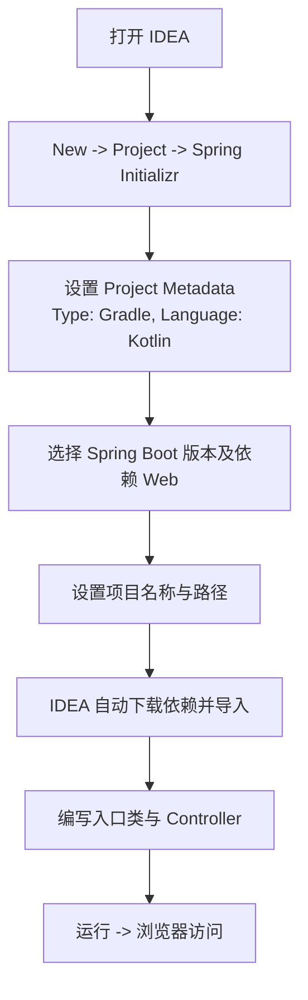

### 经典金句/数据
> “Spring Boot 可以说是 Spring 践行‘约定优于配置’理念的极佳范例。” (p.38)

---

## 第3章：深入理解Spring Boot自动配置
### 核心论点
本章解决 Spring Boot 自动配置原理及实现机制的问题。作者认为：自动配置基于 JavaConfig、条件化 Bean（@Conditional）和组合注解，通过 @EnableAutoConfiguration 配合 spring.factories 文件加载候选配置类。

### 关键概念/事件
- 条件化 Bean：通过 @Conditional 注解及其派生注解（@ConditionalOnClass、@ConditionalOnMissingBean 等）控制 Bean 的创建。
- JavaConfig：使用 @Configuration 和 @Bean 替代 XML 配置。
- 组合注解：将多个注解组合成一个新注解，如 @SpringBootApplication。
- EnableAutoConfiguration：核心注解，通过 @Import(AutoConfigurationImportSelector.class) 读取 META-INF/spring.factories 中的配置类。
- SpringFactoriesLoader：类似 SPI 机制，加载 classpath 下所有 JAR 中的 spring.factories 文件。

### 逻辑推演/叙事脉络
先回顾传统 SSM（Spring+SpringMVC+MyBatis）开发中繁杂的 XML 配置和依赖管理问题，引出 Spring Boot 的自动化。然后介绍 JavaConfig 示例，再深入条件化 Bean 的实现（自定义 MagicCondition 演示）。接着剖析 @EnableAutoConfiguration 的工作原理，通过 FreeMarkerAutoConfiguration 实例分析自动配置的加载过程。最后总结自动配置的核心是 spring.factories 中的配置类列表及条件注解的判断。

### 流程图
Spring Boot 自动配置原理图（重建自图 3-3）：

```mermaid
graph TD
    A[应用启动] --> B[@EnableAutoConfiguration]
    B --> C[AutoConfigurationImportSelector]
    C --> D[SpringFactoriesLoader.loadFactoryNames]
    D --> E[读取 META-INF/spring.factories]
    E --> F[获取所有 EnableAutoConfiguration 候选类]
    F --> G{条件注解判断<br>@ConditionalOnClass 等}
    G -->|满足| H[创建相应 Bean]
    G -->|不满足| I[跳过]
    H --> J[应用上下文加载完成]
```

### 经典金句/数据
> “Spring Boot 正是引入了一系列的约定规则，将样板化配置抽象内置到框架中去，用户连 Java 配置代码也将省去。” (p.27)

---

## 第II部分：Spring Boot 项目综合实战

## 第4章：Spring Boot集成MyBatis数据库层开发
### 核心论点
本章解决如何使用 Spring Boot 集成 MyBatis 进行数据库层开发的问题。作者认为：MyBatis 是“半自动化”ORM 框架，适合需要高度优化 SQL 或复杂查询的场景，结合 MyBatis Generator 和 PageHelper 分页插件可高效开发。

### 关键概念/事件
- MyBatis：半自动 ORM，需编写 SQL，通过映射配置将参数和结果映射到 POJO。
- MyBatis Generator（MBG）：自动生成 dao 层代码（Mapper.xml、Java 接口、实体类）。
- PageHelper：MyBatis 分页插件，通过拦截器机制动态添加 LIMIT 子句。
- @Select 注解：直接在方法上写 SQL，结合 @Results 和 @Many 实现多表关联查询。
- MyBatis 插件机制：基于拦截器动态代理，可拦截 Executor、StatementHandler 等。

### 逻辑推演/叙事脉络
先介绍分层架构和 MyBatis 框架组成（接口层、数据处理层、基础设施层）。然后通过 Spring Boot CLI 或 IDEA 创建项目，配置 application.properties 数据源，使用 IDEA 数据库客户端连接 MySQL。接着用 MBG 生成 dao 层代码，演示 @Select 注解和 Mapper.xml 混合使用。重点讲解 PageHelper 分页插件的配置与工作原理（源码级 Debug 分析），最后通过 @Results 和 @Many 注解实现多表级联查询。

### 流程图
PageHelper 分页工作原理（重建自图 4-6 及描述）：

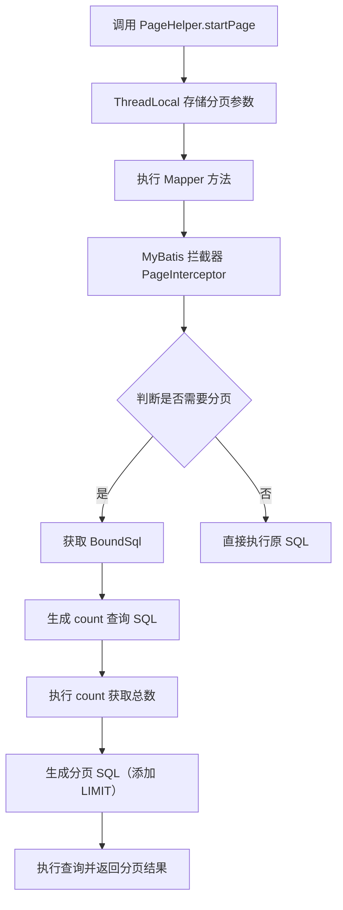

### 经典金句/数据
> “MyBatis 是一种‘半自动化’的 ORM 实现。” (p.43)

---

## 第5章：Spring Boot集成JPA数据库层开发
### 核心论点
本章解决如何使用 Spring Boot 集成 Spring Data JPA 进行数据库层开发的问题。作者认为：JPA 是 Java 持久化规范，Spring Data JPA 提供了极简的 Repository 层实现，支持自动生成 SQL，适合快速开发与通用场景。

### 关键概念/事件
- JPA：Java Persistence API，规范接口（javax.persistence.*），Hibernate 为其实现。
- Spring Data JPA：Spring 子项目，提供 Repository 接口及自动实现（如 JpaRepository）。
- 实体生命周期：New → Managed → Detached → Removed。
- JPQL：面向对象的查询语言，类似 HQL，支持 JOIN、子查询、函数等。
- 级联类型（CascadeType）：ALL、PERSIST、MERGE、REMOVE、REFRESH、DETACH。

### 逻辑推演/叙事脉络
先介绍 JPA 架构和 Spring Data JPA 在生态中的位置。然后通过 Spring Initializr 创建项目，添加 spring-boot-starter-data-jpa 依赖。配置数据库连接后，使用 IDEA Database 工具自动生成 Entity 实体类（并定制 Generate POJOs.groovy 脚本添加 JPA 注解）。实现 UserDao 继承 JpaRepository 即获得 CRUD 方法，演示分页查询（PageRequest）。接着通过 @Query 注解实现模糊搜索，详细讲解 JPQL 语法（函数、子查询、JOIN 等）。最后用 @ManyToMany 注解实现多表级联查询，并解释级联类型的使用。

### 经典金句/数据
> “使用 Spring Data JPA 可以用极简的代码快速实现功能丰富的 dao 层代码。” (p.109)

---

## 第6章：Spring Boot Gradle插件应用开发
### 核心论点
本章解决如何开发一个 Gradle 插件（kor）自动生成 entity、dao、service、controller 层样板代码的问题。作者认为：通过自定义 Gradle 插件可以极大简化重复性的编码工作，提升开发效率。

### 关键概念/事件
- Gradle 构建生命周期：初始化、配置、运行三个阶段。
- Gradle 插件：扩展 Gradle，添加自定义任务（Task）和配置。
- Groovy DSL：用于编写 build.gradle 和插件代码。
- 插件属性配置文件：在 src/main/resources/META-INF/gradle-plugins 中创建 .properties 文件，指定 implementation-class。
- KorPlugin：自定义插件，通过 project.extensions.create 接收参数，创建 korGenerate 任务，调用 Kotlin 代码生成模板文件。

### 逻辑推演/叙事脉络
先介绍 Gradle 基础（构建生命周期、常用插件如 java、application）。然后详细演示创建自定义 Gradle 插件项目的步骤（选择 Gradle + Java/Groovy/Kotlin 混合）。实现 KorPlugin.groovy 和 KorGenerateKotlin.kt，并解决 groovy-all 版本冲突。将插件上传到本地 Maven 仓库。最后在另一个 Spring Boot 项目中应用该插件，通过配置 korArgs { entity = 'Kor' } 执行 gradle korGenerate 自动生成四层代码。

### 经典金句/数据
> “在软件开发的过程中，会有很多重复性的手工劳动...如果我们能够通过自己开发工具、插件的方式来实现这些操作的自动化，想必会大大提升工作效率。” (p.128)

---

## 第7章：使用Spring MVC开发Web应用
### 核心论点
本章解决如何使用 Spring MVC（基于 Servlet 技术栈）结合 Spring Boot 开发 Web 应用的问题。作者认为：Spring MVC 是请求驱动的轻量级 Web 框架，通过注解和 FreeMarker 模板引擎可快速构建 MVC 应用。

### 关键概念/事件
- Servlet：Java Web 底层技术，每个请求由轻量级线程处理（对比 CGI 进程）。
- Spring MVC 流程：DispatcherServlet → HandlerMapping → HandlerAdapter → Controller → ModelAndView → ViewResolver → 响应。
- FreeMarker：模板引擎，使用 FTL 语法生成 HTML。
- @Controller、@RequestMapping、@PathVariable、@RequestParam 等注解。

### 逻辑推演/叙事脉络
先介绍 Servlet 和 MVC 模式，对比 Spring 5.0 架构图中的 Servlet Stack。然后讲解 Spring MVC 处理请求的完整流程（图 7-8）。列出常用注解表。接着通过实战实现一个基于 FreeMarker 的分页查询页面：创建项目添加 FreeMarker 依赖，实现后台分页接口（/api/category/search），编写路由 Controller（@GetMapping），设计 FreeMarker 模板（list.ftl、head.ftl），前端使用 Bootstrap Table 实现 Ajax 分页和搜索。最后演示文件下载功能。

### 流程图
Spring MVC 请求处理流程（重建自图 7-8）：

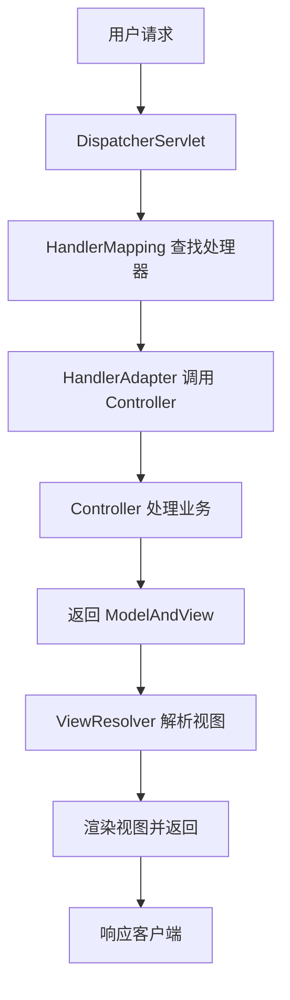

### 经典金句/数据
> “基于 Kotlin + Spring Boot 的技术栈无疑是 Java 企业级应用服务端开发的极佳选择。” (p.145)

---

## 第8章：Spring Boot自定义Web MVC配置
### 核心论点
本章解决如何通过 WebMvcConfigurationSupport 或 WebMvcConfigurer 自定义 Spring MVC 配置的问题。作者认为：Spring Boot 在提供默认配置的同时，支持通过 JavaConfig 灵活定制静态资源、拦截器、跨域、视图控制器、消息转换器、全局异常处理、嵌入式 Web 容器以及 Servlet/Filter/Listener 注册。

### 关键概念/事件
- WebMvcConfigurationSupport：Spring MVC 配置基类，重写方法可定制配置。
- @EnableWebMvc：启用 Spring MVC 配置。
- 全局异常处理：@ControllerAdvice + @ExceptionHandler 或实现 HandlerExceptionResolver。
- WebServerFactoryCustomizer：Spring Boot 2.0 中定制嵌入式 Web 容器（如 Tomcat）。
- Banner 定制：通过 banner.txt 或 banner.png 修改启动图案。
- @WebServlet、@WebFilter、@WebListener：Servlet 3.0 注解注册组件，需配合 @ServletComponentScan。

### 逻辑推演/叙事脉络
先介绍 WebMvcConfigurationSupport 常用配置方法（addCorsMappings、addInterceptors、addViewControllers 等）。然后分别展示静态资源配置、拦截器配置（登录态拦截）、跨域配置（CORS）、视图控制器（简化空方法）、消息转换器（FastJson）、数据格式化器（DateFormatter）、视图解析器（FreeMarker）。接着讲解全局异常处理的两种方式并给出实例。定制 Web 容器通过 WebServerFactoryCustomizer 修改端口、contextPath 等。定制 Banner 通过 resources 下添加文件。最后演示如何注册 Servlet、Filter 和 Listener（HelloServlet、HelloFilter、HelloListener）。

### 经典金句/数据
> “通常情况下，我们并不需要重新定义 Spring Boot 中的默认配置。但是，Spring Boot 在提供了一套默认的配置方案值之外，仍然完美支持灵活定制配置我们的应用。” (p.169)

---

## 第9章：Spring Boot中的AOP编程
### 核心论点
本章解决如何在 Spring Boot 中使用 AOP 实现横切关注点（如日志、权限控制）的问题。作者认为：AOP 是 OOP 的补充，通过预编译和动态代理将核心逻辑与非核心逻辑分离，降低耦合，提高复用性。

### 关键概念/事件
- AOP 核心概念：切面（@Aspect）、连接点（JoinPoint）、切入点（@Pointcut）、通知（@Before、@After、@Around 等）。
- Spring AOP 代理：默认使用 JDK 动态代理（接口），否则使用 CGLIB。
- 日志切面：通过 @Before 记录请求信息，@AfterReturning 记录返回值，@Around 计算耗时。
- 登录鉴权过滤器：自定义 @WebFilter 实现用户登录状态检查，白名单放行静态资源。
- 权限控制：AOP 切面拦截 /user/** 请求，检查当前用户角色是否为 ADMIN，若无权限则返回 403。

### 逻辑推演/叙事脉络
先介绍 AOP 基本概念（表 9-1）和 Spring AOP 代理机制。然后实现一个简单的日志切面（LogAspect），通过 @Pointcut 表达式拦截 controller 包下所有方法，记录请求地址、IP、参数、返回值和耗时。接着进入综合实战：使用 AOP + Filter 实现登录鉴权与权限控制系统。设计数据库表（user、role、user_roles），实现登录逻辑（POST /doLogin，MD5 加密）。编写 AuthenticationFilter 过滤器进行登录态检查，白名单过滤。编写 UserPermissionAspect 切面，拦截 /user 请求，通过 SecurityContext 或 Session 获取当前用户角色，若无权限则跳转 /error/403 或返回 JSON。同时实现用户注册和数据后端校验（@Valid、JSR303 注解）。

### 流程图
用户登录鉴权流程（重建自图 9-4、9-5）：

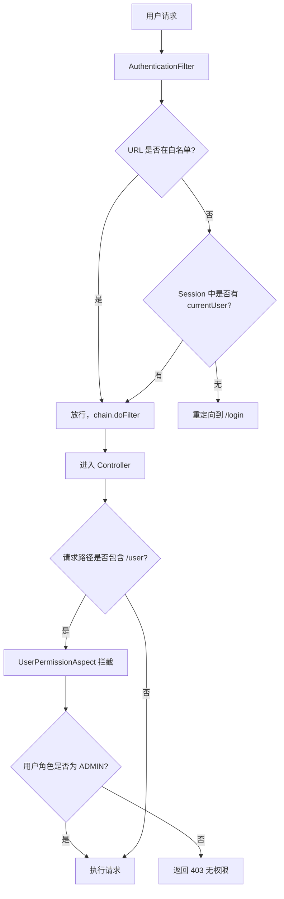

### 经典金句/数据
> “AOP 是一种编程范式，与具体的计算机编程语言无关。” (p.175)

---

## 第10章：Spring Boot集成Spring Security安全开发
### 核心论点
本章解决如何通过 Spring Security 实现 Web 应用的安全认证与授权问题。作者认为：Spring Security 是基于 Servlet 过滤器和 AOP 的安全框架，提供声明式访问控制，支持多种认证策略（内存、数据库）。

### 关键概念/事件
- Spring Security 核心组件：SecurityContextHolder、Authentication、AuthenticationManager、UserDetailsService、PasswordEncoder。
- 认证流程：UsernamePasswordAuthenticationFilter → AuthenticationManager → AuthenticationProvider → UserDetailsService → 密码比对。
- @EnableWebSecurity + WebSecurityConfigurerAdapter：自定义安全配置。
- @PreAuthorize：方法级权限控制，支持 Spring EL 表达式。
- CSRF：跨站请求伪造防护，Spring Security 默认开启，前后端分离需处理 token。

### 逻辑推演/叙事脉络
先介绍 Spring Security 的前身（Acegi Security）和基于表单的认证流程（图 10-2）。然后分三个阶段实战：
1. 初阶：添加 spring-boot-starter-security，默认生成用户名 user 和随机密码，访问任何路径弹出登录页。
2. 中阶：在内存中配置多个用户（user/ADMIN, admin/ADMIN），使用 BCryptPasswordEncoder。
3. 进阶：基于数据库的用户和角色权限。设计 User、Role 实体，实现 MyUserDetailService 从数据库加载用户。配置 WebSecurityConfig 开启 @EnableGlobalMethodSecurity，在 Controller 方法上使用 @PreAuthorize("hasRole('ADMIN')")。同时实现自定义 AccessDeniedHandler 处理无权限请求。最后实现一个 HTTP 接口测试平台（LightSword），集成 React.js 前端，处理 CSRF token 传递。

### 流程图
Spring Security 基于表单的认证流程（重建自图 10-2）：

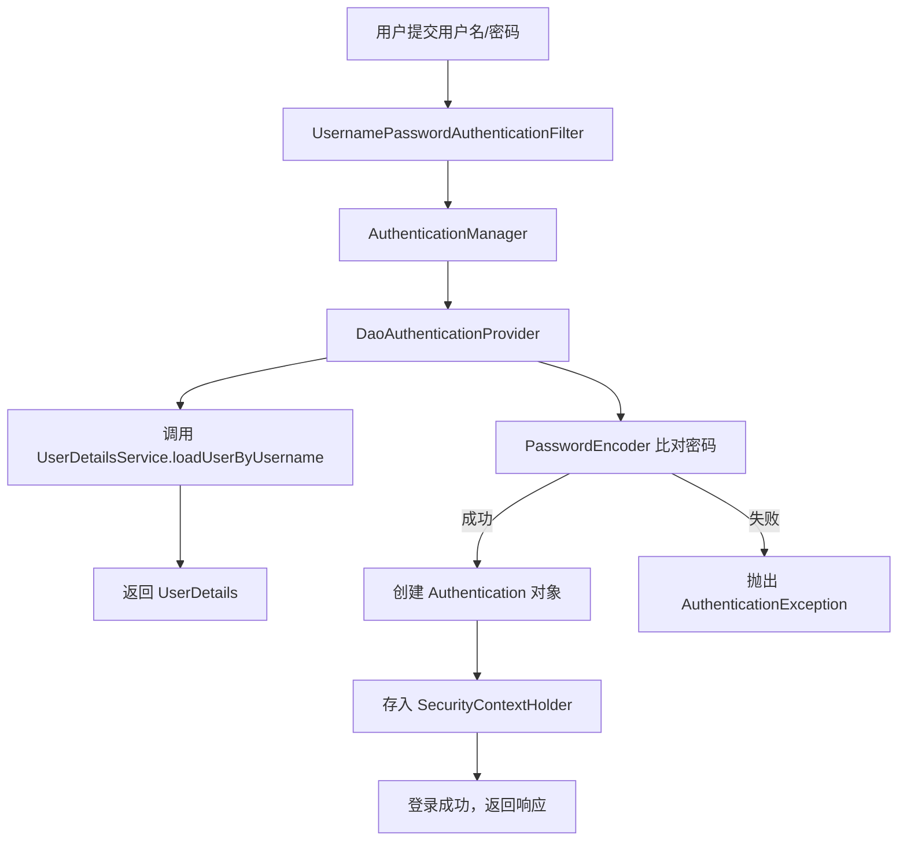

### 经典金句/数据
> “Spring Security 是一个强大的和高度可定制的身份验证和访问控制框架。” (p.225)

---

## 第11章：Spring Boot集成React.js开发前后端分离项目
### 核心论点
本章解决如何基于 React.js + Spring Boot 实现前后端分离架构的问题。作者认为：前后端分离可让前端专注于 UI，后端专注于 API，通过 JSON 数据接口通信，独立部署，并行开发。

### 关键概念/事件
- 前后端分离架构：前端独立服务器（Node.js），后端提供 REST API，通过跨域（CORS）或代理通信。
- React.js：前端框架，组件化开发。
- @CrossOrigin：Spring MVC 注解，解决跨域问题。
- 代理配置：前端开发服务器（Nowa）配置 proxy 将 API 请求转发到后端。

### 逻辑推演/叙事脉络
先回顾 Web 前端技术简史（ECMAScript、jQuery、Angular、React 等）和前后端分离优势（图 11-1）。然后实战：后端使用 Spring Security + JPA，提供登录接口（/login/success、/login/failure）并添加 @CrossOrigin。前端使用 Nowa 脚手架创建 React 项目，编写 LoginForm.jsx 组件，发送 Ajax 登录请求。实现 HTTP 接口测试列表页面，后端分页接口 /findAllUxCore 返回特定格式 JSON（适配 UXCore 表格组件），前端使用 bootstrap-table 展示。最后进行前后端联调，测试不同角色的权限访问。

### 经典金句/数据
> “前后端分离意味着，前后端之间使用 JSON 数据接口来通信，前端可以独立于后端项目的进度依赖。” (p.235)

---

## 第12章：任务调度与邮件服务开发
### 核心论点
本章解决如何在 Spring Boot 中开发定时任务和邮件服务的问题。作者认为：通过 @Scheduled 注解可快速实现静态定时任务，结合 SchedulingConfigurer 可实现动态 cron 任务；使用 JavaMailSender 可轻松发送纯文本、富文本及带附件的邮件。

### 关键概念/事件
- @Scheduled：支持 fixedRate、fixedDelay、cron 三种方式。
- Cron 表达式：6 个域（秒、分、时、日、月、周），特殊字符（*、/、?、L、# 等）。
- SchedulingConfigurer：动态添加 TriggerTask，从数据库读取 cron 表达式。
- 多线程执行定时任务：通过 taskRegistrar.setScheduler(Executors.newScheduledThreadPool(10)) 配置线程池。
- @Async：异步执行方法，需配合 @EnableAsync 和自定义线程池。

### 逻辑推演/叙事脉络
先介绍定时任务的三种实现方式（Timer、Quartz、Spring Schedule）。然后实现静态定时任务：在方法上添加 @Scheduled(cron="0/10 * * * * ?")，并在启动类加 @EnableScheduling。讲解 Cron 表达式语法。接着实现动态定时任务：实现 SchedulingConfigurer，在 configureTasks 中从数据库读取 cron 值，动态调整执行周期。演示多线程执行定时任务。然后介绍同步与异步的区别，实现 @Async 异步任务，配置 ThreadPoolTaskExecutor，并编写单元测试验证性能提升（同步耗时 6012ms，异步耗时 3125ms）。最后实现邮件服务：添加 spring-boot-starter-mail，配置 spring.mail.* 属性，使用 JavaMailSender 发送简单邮件、HTML 邮件和带附件的邮件。

### 流程图
动态定时任务执行流程：

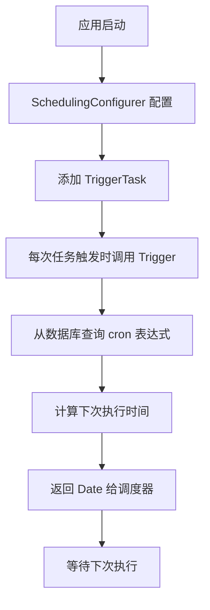

### 经典金句/数据
> “异步永远是非阻塞的。” (p.245)
> 异步任务总耗时 3125ms，同步任务总耗时 6012ms，性能提升约 48%。

---

## 第13章：Spring Boot集成WebFlux开发响应式Web应用
### 核心论点
本章解决如何使用 Spring 5 的 WebFlux 开发响应式 Web 应用的问题。作者认为：响应式编程基于 Reactive Streams（支持背压），适用于高并发场景，Spring WebFlux 提供了与 Spring MVC 类似的注解风格，但底层使用 Netty 和 Reactor。

### 关键概念/事件
- 响应式宣言：Responsive（可响应）、Resilient（可恢复）、Elastic（可伸缩）、Message Driven（消息驱动）。
- WebFlux：Spring 5 引入的响应式 Web 框架，支持 Router Functions 和注解两种方式。
- Reactor：实现 Reactive Streams 的库，提供 Flux（0..N 个元素）和 Mono（0..1 个元素）。
- 背压（Backpressure）：下游能够控制上游数据发送速度的机制。

### 逻辑推演/叙事脉络
先介绍响应式宣言和 Spring 5 架构图（图 13-1），对比传统 Servlet 栈和 WebFlux 栈。然后通过 start.spring.io 创建 Reactive Web 项目，添加 spring-boot-starter-webflux 依赖。编写 Person 模型、PersonService（使用 HashMap 模拟数据，返回 Mono/Flux）、PersonHandler（处理 ServerRequest）、RouterConfig（配置路由，如 GET("/api/person") → handler::listPeople）。最后配置 Netty 服务器，运行测试，curl 请求返回 JSON。指出 WebFlux 适合高可伸缩性场景，但调试相对复杂。

### 流程图
Spring WebFlux 处理请求流程（重建自图 13-1 右侧）：

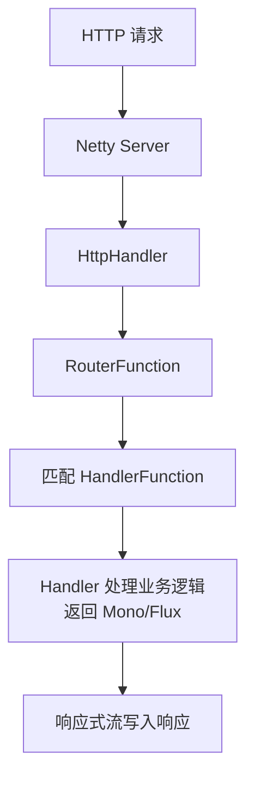

### 经典金句/数据
> “当我们的应用需要高可伸缩性，那么 Reactive 非堵塞方式是最适合的。” (p.262)

---

## 第14章：Spring Boot缓存
### 核心论点
本章解决如何在 Spring Boot 中使用 Spring Cache 抽象简化缓存开发的问题。作者认为：通过 @Cacheable、@CachePut、@CacheEvict 等注解，可以透明地将方法返回值缓存起来，减少数据库访问，提升性能。

### 关键概念/事件
- Spring Cache 抽象：CacheManager 和 Cache 接口，支持多种实现（ConcurrentMap、EhCache、Caffeine、Redis）。
- @Cacheable：读取缓存，若不存在则调用方法并存入缓存。
- @CachePut：每次都会调用方法，并将结果存入缓存。
- @CacheEvict：清除缓存，支持 key 或 allEntries。
- @EnableCaching：启用 Spring Cache 功能。

### 逻辑推演/叙事脉络
先介绍 Spring Cache 的诞生背景和常用 CacheManager（表 14-1）。然后创建项目，添加 spring-boot-starter-cache 和 spring-boot-starter-data-jpa。在 UserService 实现类的方法上添加缓存注解：findAll 用 @Cacheable("userList")，saveUser 用 @CachePut(cacheNames=["user"], key="#user.id")，updatePassword 用 @CacheEvict(cacheNames=["user"], key="#id")，findOne 用 @Cacheable(cacheNames=["user"], key="#id")。在启动类加 @EnableCaching。编写测试接口演示缓存效果：第一次查询数据库，第二次命中缓存；更新后缓存失效，再次查询重新加载。最后指出内置缓存适用于单体应用，分布式场景需用 Redis。

### 经典金句/数据
> “Spring Cache 的使用方法和原理类似于 Spring 对事务管理的支持，都是 AOP 的方式。” (p.264)

---

## 第15章：使用Spring Session集成Redis实现Session共享
### 核心论点
本章解决分布式系统中多个 Spring Boot 应用之间的 Session 共享问题。作者认为：Spring Session 提供了与容器无关的 Session 管理方案，通过 Redis 集中存储 Session，可实现水平扩展。

### 关键概念/事件
- 分布式 Session 共享方案：Session 复制（效率低）和集中式存储（推荐）。
- Spring Session：项目，支持将 Session 存储到 Redis、MongoDB、JDBC 等。
- Redis：高性能内存数据库，支持 String、Hash、List、Set、ZSet 等数据类型。
- @EnableRedisHttpSession：启用 Redis 存储 Session。

### 逻辑推演/叙事脉络
先介绍分布式架构中 Session 共享的两个问题（负载均衡、共享存储），对比 Session 复制与集中式存储，展示集中式架构图（图 15-1）。然后安装 Redis，介绍基本命令和数据类型。接着实战：创建两个 Spring Boot 应用（demo_microservice_api_book 和 demo_microservice_api_user），添加 spring-session-data-redis 依赖，配置 spring.session.store-type=redis 和 Redis 连接信息。编写 SessionController 获取 Session 信息并输出。分别启动两个应用（端口 9000、9001），访问 /session 发现 session id 相同。通过 redis-cli 查看存储的 key（spring:session:sessions:xxx）和 hash 内容。证明 Session 已共享。

### 流程图
Spring Session + Redis 共享 Session 架构（重建自图 15-1）：

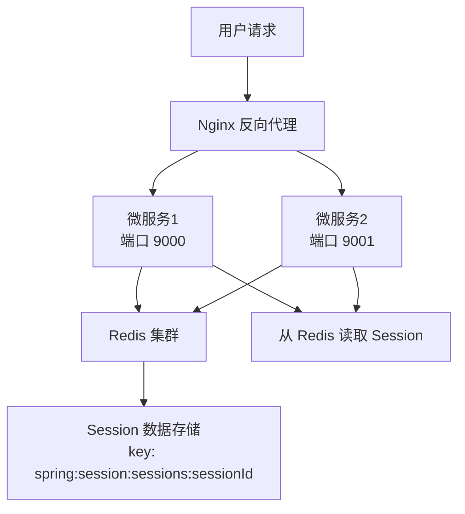

### 经典金句/数据
> “通过 Spring Boot + Redis 来实现 Session 的共享非常简单，而且用处也极大。” (p.285)

---

## 第16章：使用Zuul开发API Gateway
### 核心论点
本章解决如何通过 Netflix Zuul 实现微服务 API Gateway 的问题。作者认为：API Gateway 作为微服务架构的统一入口，可以完成路由转发、鉴权、监控、过滤等功能，Zuul 是 Spring Cloud 生态中的智能路由组件。

### 关键概念/事件
- API Gateway：介于客户端和服务器端之间的中间层，解决客户端多次请求、跨域、认证复杂等问题。
- Zuul：Netflix 开源的微服务网关，支持动态路由、过滤器（pre、route、post、error）。
- @EnableZuulProxy：启用 Zuul 代理，结合 Eureka、Ribbon 实现负载均衡。
- ZuulFilter：自定义过滤器，继承 ZuulFilter 并实现 filterType、filterOrder、shouldFilter、run 方法。

### 逻辑推演/叙事脉络
先介绍 API Gateway 的架构图（图 16-1）和 Zuul 的四种过滤器生命周期（图 16-2）。然后创建 Zuul Server 项目，添加 spring-cloud-starter-netflix-zuul 依赖，在启动类加 @EnableZuulProxy。配置 application.properties：zuul.routes.book_api.url=http://127.0.0.1:9000，zuul.routes.user_api.url=http://127.0.0.1:9001，server.port=8000。分别启动 book 微服务和 user 微服务，访问 http://localhost:8000/user_api/user/1 和 /book_api/book/1 验证转发成功。最后编写 SimpleFilter（继承 ZuulFilter），设置 filterType="pre"，打印请求日志，测试过滤器效果。

### 流程图
Zuul 过滤器生命周期（重建自图 16-2）：

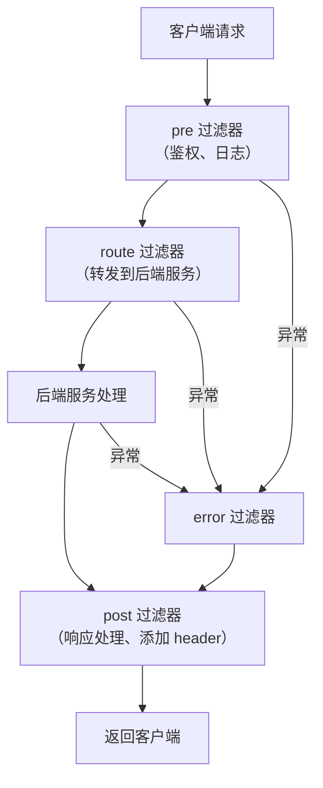

### 经典金句/数据
> “使用 API Gateway 可以将‘1 对 N’问题转换成了‘1 对 1’问题。” (p.294)

---

## 第17章：Spring Boot日志
### 核心论点
本章解决如何在 Spring Boot 中配置和使用 Logback 日志框架的问题。作者认为：Logback 是 SLF4J 的原生实现，性能优于 log4j，Spring Boot 默认支持，通过 logback.groovy（DSL 风格）可以简洁配置控制台输出、滚动文件、动态修改日志级别。

### 关键概念/事件
- Logback 模块：logback-core、logback-classic（实现 SLF4J）、logback-access。
- 日志级别：trace < debug < info < warn < error。
- 配置文件顺序：logback.groovy → logback-test.xml → logback.xml。
- RollingFileAppender：按时间滚动切分日志文件。
- jmxConfigurator：开启 JMX 管理，通过 JConsole 动态修改日志级别。

### 逻辑推演/叙事脉络
先介绍 Logback 架构和 Spring Boot 默认日志配置（输出到控制台）。然后展示如何通过 application.properties 配置 logging.file 或 logging.path 输出日志文件。接着重点讲解 logback.groovy 配置文件：使用 Groovy DSL 定义 appender（ConsoleAppender、RollingFileAppender）、设置 pattern、滚动策略（TimeBasedRollingPolicy，maxHistory=30）、filter（ThresholdFilter）。对比等价的 logback.xml 配置。最后通过 jconsole 演示动态修改日志级别（从 INFO 改为 TRACE），并展示 /log 接口输出级别变化。

### 经典金句/数据
> “推荐使用 Groovy DSL 作为 logback 日志配置文件的最佳实践。” (p.299)

---

## 第III部分：Spring Boot系统监控、测试与运维

## 第18章：Spring Boot应用的监控：Actuator与Admin
### 核心论点
本章解决如何通过 Spring Boot Actuator 和 Spring Boot Admin 监控和管理 Spring Boot 应用的问题。作者认为：Actuator 提供了丰富的生产级端点（health、metrics、info、env、beans 等），可以数据化度量应用状态；Admin 提供了可视化界面，方便运维。

### 关键概念/事件
- Actuator 端点：/health、/metrics、/info、/env、/beans、/threaddump、/trace 等。
- 自定义端点：实现 Endpoint 接口或继承 AbstractEndpoint，实现 HealthIndicator 添加健康检查，实现 PublicMetrics 添加度量指标。
- 统计方法调用次数：通过 AOP + CounterService 实现。
- Spring Boot Admin：服务端和客户端架构，客户端注册到服务端，提供 UI 展示。

### 逻辑推演/叙事脉络
先介绍 Actuator 的作用和启用方式（添加 spring-boot-starter-actuator）。在 Spring Boot 2.0 中默认只暴露 /health 和 /info，需通过 management.endpoints.web.expose=* 启用全部。然后列举常用端点并展示返回示例（/health 包含 diskSpace、db；/metrics 包含 jvm.memory.used 等；/trace 包含请求跟踪）。接着讲解自定义端点：实现 ServerEndpoint（展示主机、磁盘、内存信息）；实现 MyCustomHealthIndicator（添加自定义健康检查）；实现 CustomMetrics（统计 Bean 数量、Controller 数量）；通过 AOP + CounterService 统计方法调用次数。最后介绍 Spring Boot Admin：创建 Admin Server 项目，添加 @EnableAdminServer，配置 client 端注册 URL，访问可视化界面查看应用详情（health、metrics、JMX、日志级别管理等）。

### 流程图
Actuator 自定义端点实现结构：

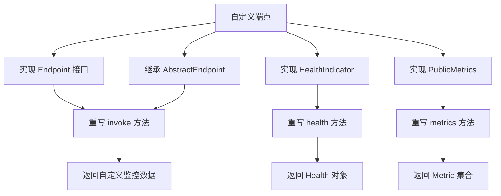

### 经典金句/数据
> “Actuator 提供了众多 HTTP 接口端点，其中包含了丰富的 Spring Boot 应用程序运行时的内部状态信息。” (p.308)

---

## 第19章：Spring Boot应用的测试
### 核心论点
本章解决如何对 Spring Boot 应用进行分层测试（dao、service、controller）的问题。作者认为：spring-boot-test 整合了 JUnit、MockMvc、Mockito、JsonPath 等工具，可以模拟 Web 请求、Mock 依赖、校验 JSON 响应，保证代码质量。

### 关键概念/事件
- @SpringBootTest：启动 Spring 容器进行集成测试。
- @Mock 和 @InjectMocks：Mockito 框架，用于 Mock 依赖对象。
- MockMvc：模拟 MVC 请求，无需启动 Web 服务器。
- JsonPath：类似 XPath，用于校验 JSON 响应字段。
- 测试报告：Gradle 执行 gradle test 后生成 build/reports/tests/test/index.html。

### 逻辑推演/叙事脉络
先创建分层架构的 Spring Boot 项目（controller、service、dao）。然后分别编写测试类：
1. dao 层测试：UserDaoTest，使用 @SpringBootTest + @Autowired 直接注入 UserDao，测试 findAll 方法。
2. service 层测试：UserServiceTest，类似注入 Service。
3. 使用 Mockito 测试 service：@RunWith(MockitoJUnitRunner.class)，@Mock UserDao，@InjectMocks UserServiceImpl，使用 when(...).thenReturn(...) 模拟 dao 返回，隔离数据库。
4. controller 层测试：UserControllerTest，使用 MockMvc 构建请求，执行 perform，使用 andExpect 校验状态码、内容字符串、JsonPath 表达式（$.id、$.roles[0].role）。
5. 运行所有测试，查看 Gradle 生成的测试报告。

### 流程图
MockMvc 测试 Controller 流程：

```mermaid
graph TD
    A[测试类] --> B[MockMvcBuilders.webAppContextSetup]
    B --> C[创建 MockMvc 实例]
    C --> D[perform(MockMvcRequestBuilders.get)]
    D --> E[andExpect 状态码]
    E --> F[andDo 打印结果]
    F --> G[andExpect JsonPath 校验]
    G --> H[测试通过]
```

### 经典金句/数据
> “Spring Boot 应用对 Web 层测试提供强大的支持：采用 MockMvc 方式测试 Web 请求。” (p.347)

---

## 第20章：Spring Boot应用Docker化
### 核心论点
本章解决如何将 Spring Boot 应用打包成 Docker 镜像并运行的问题。作者认为：Docker 实现了“一次封装，到处运行”，通过 Dockerfile 定义镜像，结合 gradle-docker 插件可一键构建镜像并推送到仓库。

### 关键概念/事件
- Docker 核心：镜像（Image）、容器（Container）、仓库（Repository）。
- Dockerfile 指令：FROM、VOLUME、ARG、ADD、ENTRYPOINT、EXPOSE 等。
- gradle-docker 插件（com.palantir.docker）：简化 Gradle 构建 Docker 镜像流程。
- bootJar 和 bootWar：Spring Boot 打包插件，支持可执行 jar/war。

### 逻辑推演/叙事脉络
先介绍传统部署方式（java -jar）的局限，引出 Docker 的优势（轻量级容器，对比传统虚拟机图 20-1）。然后演示将 Spring Boot 项目打包成可执行 jar（gradle bootJar），并支持通过 --spring.profiles.active 指定环境。接着介绍 Docker 安装和基本命令（docker pull java、docker images）。重点实战：在 build.gradle 中添加 com.palantir.docker 插件，配置 docker { name "${project.group}/${jar.baseName}" ... }。在项目根目录编写 Dockerfile：FROM java:latest，VOLUME /tmp，ARG JAR_FILE，ADD ${JAR_FILE} app.jar，ENTRYPOINT ["java", "-Djava.security.egd=file:/dev/./urandom", "-jar", "/app.jar"]。执行 gradle bootJar docker 构建镜像，然后 docker run -p 8080:9000 -t com.easy.springboot/demo_package_and_deploy 启动容器，访问 http://localhost:8080 验证。最后简单介绍 docker push 到 DockerHub。

### 流程图
Docker 化 Spring Boot 应用流程：

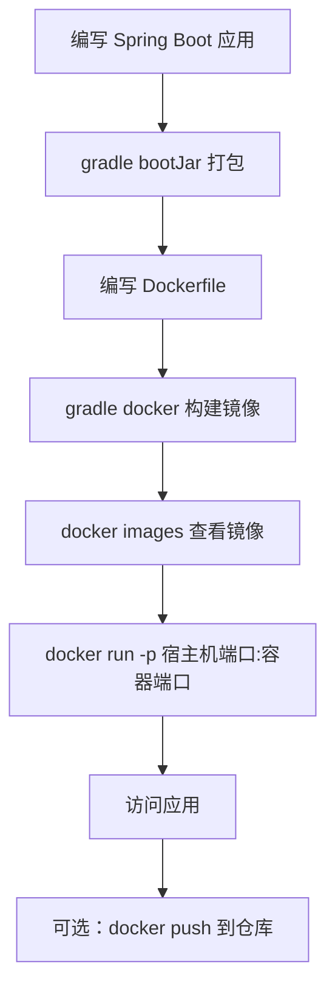

### 经典金句/数据
> “Docker 把交付运行环境比作‘海运’：OS 如同一个货轮，每一个在 OS 上运行的软件都如同一个集装箱。” (p.354)

---

## 后记（致谢）
作者感谢妻子和孩子、父母、编辑吴怡以及所有朋友和同事。联系方式：universsky@163.com。强调“快乐生活，快乐学习，快乐分享，快乐实践出真知”。

> 说明：本书无附录、跋等附加内容。部分图片因 PDF 扫描质量无法完全恢复，已用 Mermaid 重建逻辑关系。所有总结严格基于书中原文，未添加外部观点。