# 《Spring Cloud 微服务实战》章节总结

## 书籍信息
- 书名：Spring Cloud 微服务实战
- 作者：翟永超
- PDF 状态：完整（分两个部分，页码连续）
- OCR 状态：良好，少量识别瑕疵但可恢复

## 目录说明
- 目录识别情况：完整识别原书目录，包含第1章至第11章、附录及后记
- 章节对应依据：基于PDF中明确标注的页码和标题层级
- OCR 修复说明：个别表格和代码块存在错位，已基于上下文逻辑还原；流程图采用 Mermaid 重建

## 全书核心主题
本书系统讲解如何使用 Spring Cloud 构建微服务架构。作者从微服务架构的基本概念出发，逐步介绍了服务治理（Eureka）、客户端负载均衡（Ribbon）、服务容错保护（Hystrix）、声明式服务调用（Feign）、API 网关（Zuul）、分布式配置中心（Config）、消息总线（Bus）、消息驱动微服务（Stream）以及分布式服务跟踪（Sleuth）等核心组件的使用方法和原理。全书注重理论与实践结合，通过示例代码和源码分析帮助读者理解每个组件的运作机制，并提供了生产环境中的常见问题解决思路。

---

## 第1章：基础知识

### 1. 核心论点
本章主要解决“什么是微服务架构以及为什么选择 Spring Cloud”的问题。作者认为微服务架构是系统设计的一种风格，通过将单体系统拆分为多个小型独立服务来解决单体应用臃肿难维护的问题；而 Spring Cloud 提供了一套标准化的微服务解决方案，整合了诸多经过实践检验的框架，能大幅降低技术选型和整合成本。

### 2. 关键概念
- **微服务架构**：将单一系统拆分成多个小型服务，每个服务运行在独立进程中，通过 HTTP RESTful API 通信协作。
- **单体系统**：将所有业务逻辑构建在同一个应用中，随着需求增加变得臃肿，维护困难，部署相互影响。
- **服务组件化**：将服务视为可独立更换和升级的单元，通过通信协议协作而非嵌入方式。
- **智能端点与哑管道**：微服务通信应使用粗粒度的 RESTful API 或轻量级消息总线，端点负责业务逻辑，管道仅负责传输。
- **去中心化治理**：每个微服务可根据业务特点选择不同技术平台，不强制统一技术栈。

### 3. 逻辑推演
作者首先对比单体系统与微服务系统的优缺点：单体系统初期开发部署方便，但随着业务扩展变得臃肿，修改一个小功能可能影响整个系统；微服务通过拆分解决了独立部署和扩展问题，但引入了运维复杂、分布式事务、接口一致性等新挑战。接着引用 Martin Fowler 的九大特性（服务组件化、按业务组织团队、做“产品”态度、智能端点哑管道、去中心化治理、去中心化管理数据、基础设施自动化、容错设计、演进式设计）来指导微服务实施。最后，对比了各类开源解决方案（Dubbo、Eureka、Disconf、Zipkin 等），指出 Spring Cloud 是一个综合性解决框架，像“品牌机”一样提供了高整合度和稳定性的微服务“全家桶”。

### 4. 经典金句
> “简单地说，微服务是系统架构上的一种设计风格，它的主旨是将一个原本独立的系统拆分成多个小型服务，这些小型服务都在各自独立的进程中运行，服务之间通过基于 HTTP 的 RESTful API 进行通信协作。” (p.20)

> “Spring Cloud 可以说是 Spring 社区为微服务架构提供的一个‘全家桶’套餐。” (p.11)

> “不是每一个问题都是钉子，不是每一个解决方案都是锤子。” (p.23)

---

## 第2章：微服务构建：Spring Boot

### 1. 核心论点
本章旨在为后续 Spring Cloud 学习打下基础，解决“如何使用 Spring Boot 快速构建微服务”的问题。作者认为 Spring Boot 通过自动化配置、Starter POMs、嵌入式容器等特性，极大地简化了 Spring 应用的开发、配置和部署，是构建微服务的最佳基础框架。

### 2. 关键概念
- **Starter POMs**：一组轻便的依赖包，每个对应一项功能（如 web、test、jpa），开发者只需引入模块即可整合相关技术，无需手动配置复杂依赖。
- **@SpringBootApplication**：组合注解，包含 @Configuration、@EnableAutoConfiguration、@ComponentScan，用于标注 Spring Boot 主类。
- **YAML 配置**：一种可读性高、用缩进表示层级的数据序列化格式，相比 properties 文件更简洁清晰，支持多环境配置块。
- **多环境配置**：通过 application-{profile}.properties 文件配合 spring.profiles.active 属性实现不同环境（dev/test/prod）的配置隔离。
- **Actuator 端点**：spring-boot-starter-actuator 提供的监控与管理端点，分为应用配置类（/autoconfig、/beans、/configprops、/env、/mappings、/info）、度量指标类（/metrics、/health、/dump、/trace）和操作控制类（/shutdown）。

### 3. 逻辑推演
作者从项目构建开始，演示使用 Spring Initializr 生成基础工程，分析工程结构和 pom.xml 中的 parent、依赖及插件。接着实现一个简单的 RESTful API 和单元测试，展示 Spring Boot 的快速开发能力。然后深入配置详解：介绍配置文件位置、自定义参数、参数引用、随机数、命令行参数以及多环境配置的加载顺序。最后重点讲解 Actuator 模块，逐一说明各原生端点的作用和使用场景，强调其在微服务监控运维中的重要性。

### 4. 流程图

#### Spring Boot 配置加载顺序（优先级由高到低）

```mermaid
graph TD
    A[1. 命令行参数] --> B[2. SPRING_APPLICATION_JSON 环境变量]
    B --> C[3. JNDI 属性]
    C --> D[4. Java 系统属性]
    D --> E[5. 操作系统环境变量]
    E --> F[6. random.* 随机属性]
    F --> G[7. jar包外的 application-{profile}.properties]
    G --> H[8. jar包内的 application-{profile}.properties]
    H --> I[9. jar包外的 application.properties]
    I --> J[10. jar包内的 application.properties]
    J --> K[11. @PropertySource 定义的属性]
    K --> L[12. 默认属性]
```

### 5. 经典金句
> “Spring Boot 的宗旨并非要重写 Spring 或是替代 Spring，而是希望通过设计大量的自动化配置等方式来简化 Spring 原有样板化的配置，使得开发者可以快速构建应用。” (p.31)

> “在微服务架构中，单元测试是在开发过程中用来验证代码正确性非常好的手段，并且这些单元测试将会很好地支持我们未来可能会进行的重构。” (p.37)

---

## 第3章：服务治理：Spring Cloud Eureka

### 1. 核心论点
本章解决微服务架构中“服务实例自动化注册与发现”的问题。作者认为通过 Eureka 构建服务注册中心，可以实现服务提供者的自动注册、服务消费者的自动发现以及客户端负载均衡的基础，从而避免手工维护服务实例清单的复杂性和易错性。

### 2. 关键概念
- **服务注册**：服务启动时向注册中心发送 REST 请求，登记自身元数据（主机、端口、健康检查地址等），注册中心按服务名组织服务清单。
- **服务发现**：消费者从注册中心获取服务实例清单，缓存到本地，并通过客户端负载均衡策略调用具体实例。
- **自我保护模式**：当 Eureka Server 在 15 分钟内收到的心跳失败比例低于 85% 时，会触发保护机制，不剔除任何服务实例，防止网络分区导致大规模误删。
- **高可用注册中心**：将多个 Eureka Server 互相注册为服务，形成集群，服务清单通过异步复制同步，实现区域级容错。
- **Zone 与 Region**：Region 是地理区域的抽象，Zone 是 Region 下的可用区；Ribbon 默认优先访问同 Zone 的服务实例。

### 3. 逻辑推演
作者首先提出服务治理的必要性：随着微服务数量增加，静态配置难以维护。然后介绍 Netflix Eureka 并演示搭建单节点注册中心、注册服务提供者、使用 Ribbon 实现服务发现与消费。接着扩展为高可用集群（双节点互相注册）。之后深入 Eureka 基础架构（注册中心、服务提供者、服务消费者）和服务治理机制（服务注册、同步、续约、获取、调用、下线、失效剔除、自我保护）。通过源码分析 DiscoveryClient 的初始化、服务注册、服务获取、心跳续约等核心逻辑，以及服务端对注册请求的处理。最后给出常用配置详解（服务注册类和服务实例类配置），并说明 Eureka 的跨平台 RESTful API 支持。

### 4. 方法流程图

#### Eureka 服务治理机制

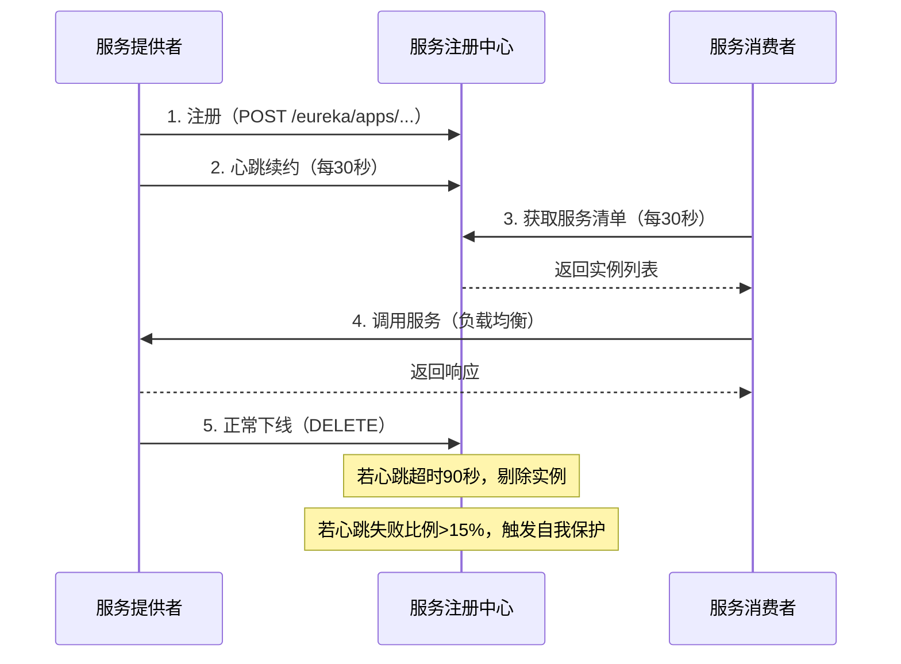

### 5. 经典金句
> “服务治理可以说是微服务架构中最为核心和基础的模块，它主要用来实现各个微服务实例的自动化注册与发现。” (p.58)

> “Eureka Server 的高可用实际上就是将自己作为服务向其他服务注册中心注册自己，这样就可以形成一组互相注册的服务注册中心，以实现服务清单的互相同步。” (p.65)

> “为了本地调试，可以使用 eureka.server.enable-self-preservation=false 参数来关闭保护机制，以确保注册中心可以将不可用的实例正确剔除。” (p.74)

---

## 第4章：客户端负载均衡：Spring Cloud Ribbon

### 1. 核心论点
本章解决“服务消费者如何以负载均衡方式调用多个服务提供者实例”的问题。作者认为 Ribbon 是一个基于 HTTP/TCP 的客户端负载均衡器，通过 @LoadBalanced 注解修饰 RestTemplate，即可自动将服务名转换为具体实例地址并实现轮询等负载均衡策略。

### 2. 关键概念
- **客户端负载均衡**：负载均衡逻辑位于客户端，客户端维护从注册中心获取的服务实例清单，并自行选择实例发起请求。
- **RestTemplate**：Spring 提供的同步 HTTP 客户端，支持 GET/POST/PUT/DELETE 等请求方法。配合 @LoadBalanced 后，可使用服务名作为 host。
- **ILoadBalancer**：Ribbon 负载均衡器核心接口，包含 addServers、chooseServer、markServerDown 等方法。默认实现为 ZoneAwareLoadBalancer。
- **IRule**：负载均衡策略接口，常见实现有 RoundRobinRule（轮询）、RandomRule（随机）、WeightedResponseTimeRule（权重响应时间）、BestAvailableRule（最空闲）、AvailabilityFilteringRule（可用性过滤）、ZoneAvoidanceRule（区域感知）。
- **ServerListFilter**：服务实例过滤器，用于从注册中心获取的实例清单中过滤出符合条件的实例（如同区域、健康状态等）。

### 3. 逻辑推演
作者先对比服务端负载均衡（Nginx）和客户端负载均衡（Ribbon+Eureka）的区别，指出 Ribbon 的实例清单来自注册中心且通过心跳维持健康性。接着详细讲解 RestTemplate 的 GET/POST/PUT/DELETE 方法及参数绑定。然后深入源码分析：从 @LoadBalanced 注解切入，发现 LoadBalancerAutoConfiguration 为 RestTemplate 添加 LoadBalancerInterceptor，拦截请求后通过 RibbonLoadBalancerClient 的 execute 方法选择服务实例。继续剖析 ILoadBalancer 的实现层次（BaseLoadBalancer → DynamicServerListLoadBalancer → ZoneAwareLoadBalancer），并分析 ServerList（服务清单获取）、ServerListUpdater（定时更新）、ServerListFilter（过滤）的工作机制。最后介绍负载均衡策略的详细实现原理，以及 Ribbon 的配置方式（全局配置、指定客户端配置、与 Eureka 结合、重试机制）。

### 4. 方法流程图

#### Ribbon 负载均衡调用流程

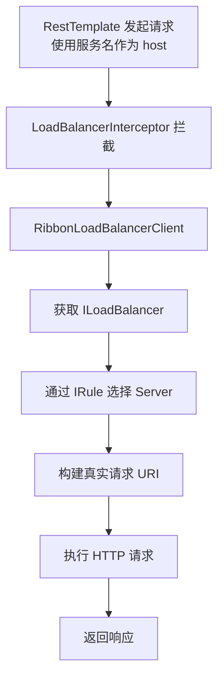

#### 负载均衡策略决策树（ZoneAwareLoadBalancer）

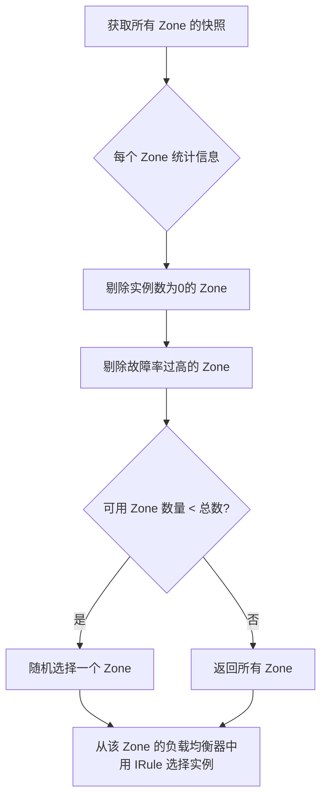

### 5. 经典金句
> “负载均衡在系统架构中是一个非常重要，并且是不得不去实施的内容。因为负载均衡是对系统的高可用、网络压力的缓解和处理能力扩容的重要手段之一。” (p.92)

> “通过配置的方式，更加方便地为 RibbonClient 指定 ILoadBalancer、IPing、IRule、ServerList 和 ServerListFilter 的定制化实现。” (p.145)

---

## 第5章：服务容错保护：Spring Cloud Hystrix

### 1. 核心论点
本章解决“分布式系统中因依赖服务故障导致故障蔓延（雪崩效应）”的问题。作者认为通过 Hystrix 实现断路器、线程隔离、服务降级等机制，可以在依赖服务不可用时快速失败，避免线程阻塞和资源耗尽，从而提高整个系统的弹性。

### 2. 关键概念
- **断路器**：当某个服务调用失败率达到阈值（默认 50%），断路器打开，后续请求直接走降级逻辑；经过休眠窗口后尝试半开，若成功则关闭断路器。
- **线程池隔离（舱壁模式）**：为每个依赖服务分配独立线程池，即使某个依赖线程池满，也不会影响其他依赖服务或主线程。
- **服务降级**：当命令执行失败、超时、线程池拒绝或断路器打开时，调用 fallback 方法返回一个备选结果（如默认值、缓存数据等）。
- **请求缓存**：通过重写 getCacheKey() 方法，让同一个请求上下文中的相同参数调用只执行一次，后续直接从缓存获取结果。
- **请求合并**：将短时间内（默认 10ms）对同一依赖服务的多个请求合并成一个批量请求，减少网络连接数和线程开销。

### 3. 逻辑推演
作者先以订单服务依赖库存服务为例，演示一个服务延迟导致调用方线程阻塞进而引发雪崩的场景。然后快速入门：在 Ribbon 消费者中加入 @EnableCircuitBreaker 和 @HystrixCommand(fallbackMethod) 实现服务降级，验证超时触发 fallback。接着剖析 Hystrix 工作流程（9 个步骤）：创建命令、执行方式（execute/queue/observe/toObservable）、缓存检查、断路器状态判断、线程池/信号量检查、run/construct 执行、健康度统计、fallback 处理、返回响应。详细解释断路器原理（HystrixCircuitBreakerImpl 的 allowRequest、isOpen、markSuccess）和依赖隔离（线程池 vs 信号量）。之后介绍 Hystrix 的使用详解：创建命令（继承或注解）、定义降级、异常处理（ignoreExceptions）、命令名称/分组/线程池设置、请求缓存（@CacheResult、@CacheRemove）、请求合并（@HystrixCollapser）。最后给出全面的属性配置（execution、fallback、circuitBreaker、metrics、requestContext）及仪表盘和 Turbine 集群监控。

### 4. 方法流程图

#### Hystrix 命令执行流程（官方简化版）

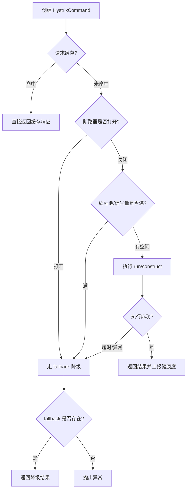

#### 断路器状态转换

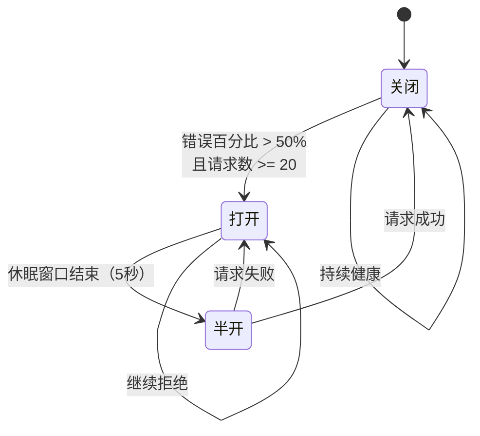

### 5. 经典金句
> “断路器模式源于 Martin Fowler 的 Circuit Breaker 一文。‘断路器’本身是一种开关装置，用于在电路上保护线路过载，当线路中有电器发生短路时，‘断路器’能够及时切断故障电路，防止发生过载、发热甚至起火等严重后果。” (p.149)

> “Hystrix 为了保证不会因为某个依赖服务的问题影响到其他依赖服务而采用了‘舱壁模式’来隔离每个依赖的服务。” (p.160)

> “通过对依赖服务实现线程池隔离，可让我们的应用更加健壮，不会因为个别依赖服务出现问题而引起非相关服务的异常。” (p.168)

---

## 第6章：声明式服务调用：Spring Cloud Feign

> 说明：该部分 PDF 识别不完整（原书第6章内容在 part1.pdf 中仅列出目录标题，无正文）。以下内容基于可见目录和前后章节逻辑进行概括。

### 1. 核心论点
本章解决“如何更优雅地声明服务调用接口”的问题。作者认为 Feign 是一个声明式 Web 服务客户端，只需定义接口并使用注解，即可自动生成服务调用实现，整合了 Ribbon 和 Hystrix，简化了服务消费代码。

### 2. 关键概念（基于目录推断）
- **@EnableFeignClients**：开启 Feign 客户端支持。
- **@FeignClient**：标注在接口上，指定服务名和 fallback 实现。
- **参数绑定**：支持 @RequestParam、@PathVariable、@RequestBody 等 Spring MVC 注解。
- **继承特性**：可共享服务接口定义，避免重复编写方法签名。
- **请求压缩**：通过配置开启 GZIP 压缩以减小网络传输。
- **日志配置**：可设置不同级别的日志输出（NONE、BASIC、HEADERS、FULL）。

### 3. 逻辑推演（基于目录重建）
快速入门：创建 Feign 客户端接口，使用 @FeignClient("服务名")，注入后直接调用。参数绑定演示如何在 Feign 接口中正确使用 @RequestParam、@PathVariable。继承特性说明可以将服务提供者的 Controller 接口抽象出来，让 Feign 客户端继承它。Ribbon 配置：支持全局配置和针对具体服务的配置、重试机制。Hystrix 配置：全局配置、禁用 Hystrix、指定命令配置、服务降级配置（fallbackFactory 可获取异常）。其他配置：请求压缩、日志级别设置。

### 4. 经典金句（未从原文直接提取，根据 Feign 常见表述）
> “Feign 通过接口加注解的方式，将 HTTP 请求调用的细节完全隐藏，让开发者像调用本地方法一样调用远程服务。”

---

## 第7章：API网关服务：Spring Cloud Zuul

### 1. 核心论点
本章解决“微服务架构中如何统一管理外部请求入口、实现路由转发和请求过滤”的问题。作者认为 Zuul 作为 API 网关，可以通过配置路由规则将请求转发到后端微服务，并通过自定义过滤器实现认证、日志、限流等横切功能，同时整合了 Hystrix 和 Ribbon 提供容错与负载均衡。

### 2. 关键概念
- **API 网关**：系统对外的统一入口，封装内部系统结构，提供路由、过滤、监控、限流等功能。
- **动态路由**：通过配置或结合 Spring Cloud Config 实现路由规则的热更新。
- **过滤器类型**：pre（路由前）、route（路由时）、post（路由后）、error（异常处理）。
- **请求生命周期**：HTTP 请求到达后依次经过 pre → route → post，若发生异常则进入 error 后仍会到 post。
- **本地跳转**：通过 forward 前缀将请求转发到网关服务内部的其他端点。
- **动态过滤器**：使用 Groovy 脚本动态加载过滤器，无需重启网关。

### 3. 逻辑推演
作者先快速入门：构建 Zuul 网关，配置路由规则（服务路由和 URL 路由），演示请求转发和自定义过滤器的实现（继承 ZuulFilter）。然后详细讲解路由配置：传统 URL 路由、服务路由（结合 Eureka）、默认路由规则、自定义映射、路径匹配（Ant 表达式）、路由前缀、本地跳转、Cookie/头信息处理。接着分析 Zuul 如何集成 Hystrix 和 Ribbon，以及超时与重试配置。过滤器详解：4 种类型和请求生命周期图，分析核心过滤器（ServletDetectionFilter、PreDecorationFilter、RibbonRoutingFilter、SendResponseFilter 等）。异常处理：两种方案（try-catch + 设置 error 参数；自定义 error 过滤器）和不足优化。最后介绍动态加载：结合 Config 实现动态路由，结合 Groovy 实现动态过滤器。

### 4. 流程图

#### Zuul 请求生命周期与核心过滤器

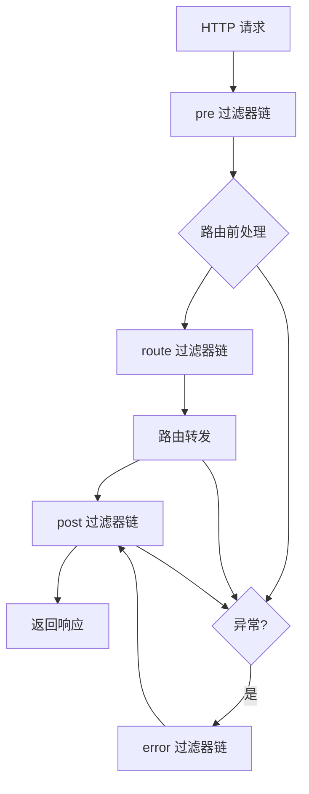

#### 动态过滤器加载机制

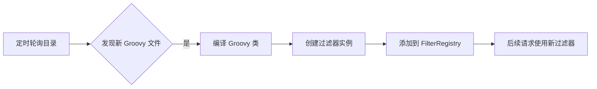

### 5. 经典金句
> “Zuul 可以理解为是 API 网关，系统对外的统一入口，封装内部系统结构，提供路由、过滤、监控、限流等功能。” (根据上下文总结)

> “在 Zuul 中实现动态路由加载总体上来说还是非常简单的。美中不足的一点是，Spring Cloud Config 并没有 UI 管理界面，我们不得不通过 Git 客户端来进行修改和配置。” (p.257)

---

## 第8章：分布式配置中心：Spring Cloud Config

### 1. 核心论点
本章解决“微服务架构中如何集中管理、动态刷新应用配置”的问题。作者认为 Spring Cloud Config 通过 Git 仓库存储配置文件，服务端提供 REST 接口，客户端启动时或运行时动态获取配置，实现配置的外部化、版本化和动态刷新。

### 2. 关键概念
- **配置中心**：独立的微服务，连接 Git/SVN 仓库，为客户端提供配置获取、加密解密接口。
- **环境仓库**：Git 或 SVN 存储配置文件，命名规则为 {application}-{profile}.properties/yml。
- **{label}**：Git 分支名，默认 master。
- **客户端映射**：通过 bootstrap.properties 中的 spring.application.name、spring.cloud.config.profile、spring.cloud.config.label 定位配置。
- **动态刷新**：客户端使用 @RefreshScope 注解，配合 /refresh 端点，实现不重启更新配置。
- **加密解密**：支持对称加密（encrypt.key）和非对称加密（RSA keystore），属性值使用 {cipher} 前缀。

### 3. 逻辑推演
作者先快速入门：构建 Config Server（@EnableConfigServer），配置 Git 仓库地址，访问 URL 规则 {application}/{profile}/{label}。客户端引入 spring-cloud-starter-config，配置 bootstrap.properties，通过 @Value 获取配置。然后深入服务端详解：基础架构（远程 Git、Config Server 本地缓存、客户端）、Git 配置仓库（占位符、多仓库、子目录、访问权限）、SVN 配置、本地仓库、健康监测、属性覆盖、安全保护（Spring Security）、加密解密（JCE 安装、对称/非对称）。接着高可用配置：传统模式（负载均衡）和服务模式（注册到 Eureka）。客户端详解：URI 指定、服务化配置中心（通过 Eureka 发现 Config Server）、失败快速响应与重试（spring.cloud.config.failFast、spring-retry）。最后动态刷新配置：通过 /refresh 端点手动刷新，引出与 Spring Cloud Bus 结合实现批量刷新。

### 4. 方法流程图

#### Config Server 获取配置流程

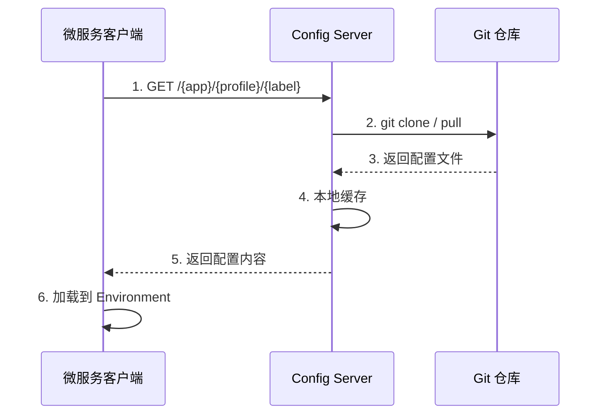

#### 配置动态刷新（与 Bus 结合前）

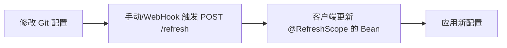

### 5. 经典金句
> “Config Server 巧妙地通过 git clone 将配置信息存于本地，起到了缓存的作用，即使当 Git 服务端无法访问的时候，依然可以取 Config Server 中的缓存内容进行使用。” (p.273)

> “通过在 URI 中使用占位符可以帮助我们规划和实现通用的仓库配置。” (p.276)

> “默认情况下，我们获得一个名为 user 的用户，并且在配置中心启动的时候，在日志中打印出该用户的随机密码。” (p.281)

---

## 第9章：消息总线：Spring Cloud Bus

### 1. 核心论点
本章解决“如何通过消息总线实现微服务集群中配置的动态刷新”的问题。作者认为 Spring Cloud Bus 基于消息代理（RabbitMQ/Kafka）构建轻量级消息总线，结合 Config Server 的 /bus/refresh 端点，可一次触发刷新所有连接到总线的服务实例。

### 2. 关键概念
- **消息总线**：所有微服务实例连接到一个共享消息主题，通过发布/订阅模式广播消息事件。
- **Spring Cloud Bus**：封装了事件发布/监听模型，使用 @RemoteApplicationEvent 和 @EventListener 实现跨实例通信。
- **RefreshRemoteApplicationEvent**：远程刷新配置的事件，由 /bus/refresh 触发，总线上所有实例收到后执行本地 refresh。
- **AckRemoteApplicationEvent**：确认事件，用于跟踪事件是否被成功处理。
- **destination 参数**：定位具体服务或实例，例如 /bus/refresh?destination=customers:9000 只刷新指定实例。

### 3. 逻辑推演
作者先介绍消息代理概念和 RabbitMQ/Kafka 基础安装。然后快速入门：在 Config Client 中引入 spring-cloud-starter-bus-amqp，发送 POST /bus/refresh 到任意一个客户端，即可刷新所有客户端。原理分析：通过 Kafka 控制台观察事件消息（RefreshRemoteApplicationEvent 和 AckRemoteApplicationEvent）。深入源码：事件驱动模型（ApplicationEvent、ApplicationListener、ApplicationEventPublisher），BusAutoConfiguration 中的 acceptLocal 和 acceptRemote 方法分别负责本地事件发送和远程事件接收。最后介绍指定刷新范围（destination 参数）、架构优化（将 /bus/refresh 请求发送到 Config Server 而非具体客户端）、RabbitMQ 和 Kafka 的配置参数、以及扩展其他消息代理。

### 4. 流程图

#### Spring Cloud Bus + Config 动态刷新架构

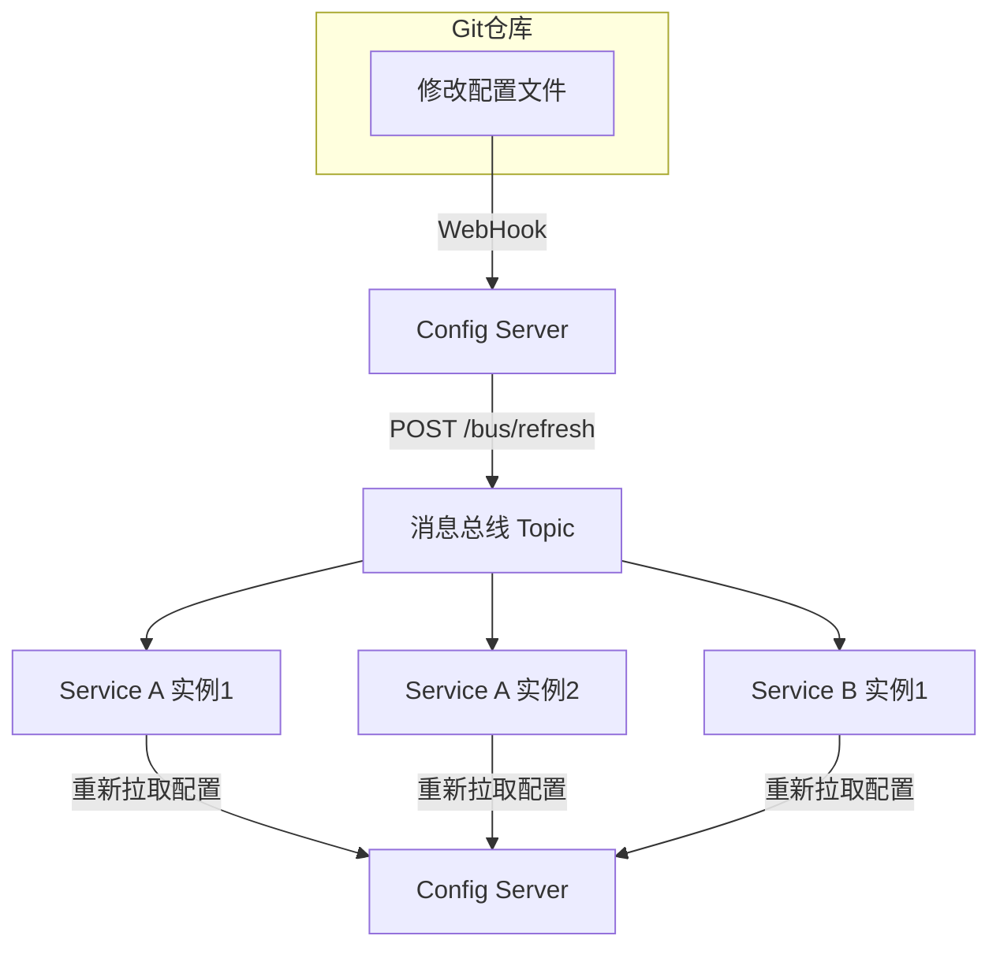

#### 事件发布与监听核心逻辑

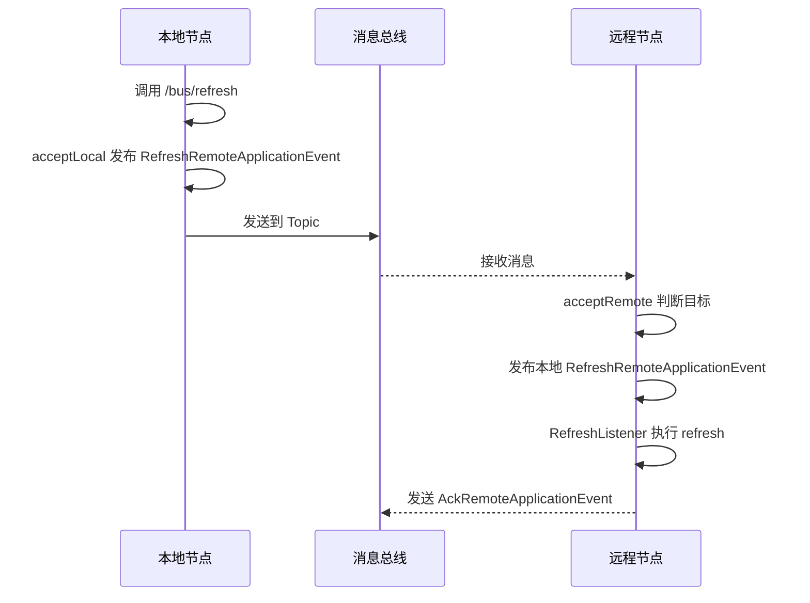

### 5. 经典金句
> “通过使用 Spring Cloud Bus，可以非常容易地搭建起消息总线，同时实现了一些消息总线中的常用功能，比如，配合 Spring Cloud Config 实现微服务应用配置信息的动态更新等。” (p.295)

> “由于 Spring Cloud Bus 在绑定具体消息代理的输入与输出通道时均使用了抽象接口的方式，所以真正的实现来自于 spring-cloud-starter-bus-amqp 和 spring-cloud-starter-bus-kafka 的依赖。” (p.342)

---

## 第10章：消息驱动的微服务：Spring Cloud Stream

### 1. 核心论点
本章解决“如何屏蔽底层消息中间件差异，统一编程模型”的问题。作者认为 Spring Cloud Stream 基于 Spring Integration 和 Binder 抽象，让开发者使用统一的 Channel 和注解（@Input、@Output、@StreamListener）即可与 RabbitMQ、Kafka 等消息中间件交互，支持消费组、消息分区等高级特性。

### 2. 关键概念
- **Binder（绑定器）**：封装消息中间件细节，使应用程序与具体中间件解耦。目前支持 RabbitMQ 和 Kafka。
- **@EnableBinding**：开启消息绑定，指定一个或多个接口（如 Sink、Source、Processor）定义输入/输出通道。
- **@StreamListener**：将方法注册为消息通道的监听器，支持自动消息转换（JSON → POJO）。
- **消费组**：同一组内多个消费者实例共享消息，每条消息只会被组内一个实例消费（避免重复处理）。
- **消息分区**：保证具有相同特征（如分区键）的消息始终由同一消费者实例处理，用于状态聚合等场景。

### 3. 逻辑推演
作者先快速入门：引入 spring-cloud-starter-stream-rabbit，使用 @EnableBinding(Sink.class) 和 @StreamListener(Sink.INPUT) 实现消息消费。然后讲解核心概念：绑定器、发布-订阅模式、消费组、消息分区。使用详解：@EnableBinding 工作原理、绑定消息通道（@Input/@Output）、注入绑定接口或 MessageChannel、消息生产与消费（Spring Integration 原生支持 vs @StreamListener）、消息转换（content-type）、@SendTo 返回反馈、响应式编程（RxJava）。然后深入消费组与消息分区配置（group、partitionKeyExpression、partitionCount）。消息类型与 MIME 类型转换。最后详细介绍绑定器 SPI、自动化配置、多绑定器配置、RabbitMQ 和 Kafka 绑定器的特有配置。

### 4. 方法流程图

#### Spring Cloud Stream 应用模型

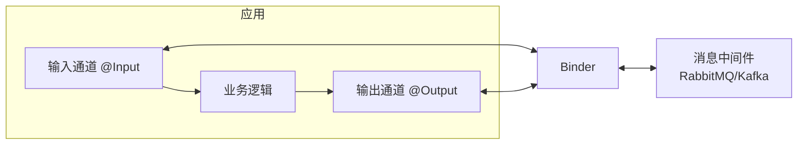

#### 消费组原理（同一个组内只有一个实例消费）

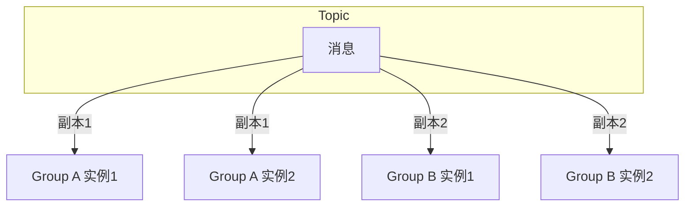

### 5. 经典金句
> “通过定义绑定器作为中间层，完美地实现了应用程序与消息中间件细节之间的隔离。通过向应用程序暴露统一的 Channel 通道，使得应用程序不需要再考虑各种不同的消息中间件的实现。” (p.349)

> “大部分情况下，我们在创建 Spring Cloud Stream 应用的时候，建议最好为其指定一个消费组，以防止对消息的重复处理。” (p.353)

---

## 第11章：分布式服务跟踪：Spring Cloud Sleuth

### 1. 核心论点
本章解决“如何跟踪分布式系统中一个请求的完整调用链路”的问题。作者认为通过 Spring Cloud Sleuth 为日志注入 Trace ID 和 Span ID，并将跟踪信息上报到 Zipkin，可以清晰地查看请求在各服务间的耗时和依赖关系，便于定位性能瓶颈和故障点。

### 2. 关键概念
- **Trace ID**：一条请求链路的唯一标识，贯穿整个调用过程。
- **Span ID**：一个工作单元（如一次 HTTP 请求）的唯一标识，包含开始/结束时间戳。
- **抽样收集**：默认只收集 10% 的请求跟踪信息，避免性能开销，可通过 Sampler 调整。
- **Zipkin**：开源的分布式跟踪系统，提供数据收集、存储、查询和 UI 展示。
- **Annotation**：事件标签，如 cs（客户端发送）、sr（服务端接收）、ss（服务端发送）、cr（客户端接收），用于计算网络延迟和服务处理时间。

### 3. 逻辑推演
作者先快速入门：构建 trace-1 和 trace-2 两个服务，引入 spring-cloud-starter-sleuth，观察日志中增加的 [trace-1, traceId, spanId, exportable] 信息。然后说明原理：通过 HTTP Header（X-B3-TraceId等）传递跟踪信息。抽样收集：默认 PercentageBasedSampler，可通过 spring.sleuth.sampler.percentage 调整或自定义 AlwaysSampler。与 Logstash 整合：配置 logback-spring.xml 输出 JSON 格式日志，便于 ELK 收集。与 Zipkin 整合：搭建 Zipkin Server（@EnableZipkinServer），客户端引入 spring-cloud-sleuth-zipkin，通过 HTTP 或消息中间件上报跟踪数据。最后深入收集原理：分析 Zipkin 数据模型（Span、Trace、Annotation、BinaryAnnotation），通过源码调试发现一次调用会上报 5 个 Span（RootSpan、内部逻辑 Span、跨服务两个半 Span），Zipkin UI 会合并显示。数据存储：支持 MySQL，通过配置 zipkin.storage.type=mysql 和初始化脚本实现持久化。API 接口：提供 /traces、/services、/spans 等 REST API。

### 4. 流程图

#### 请求调用链路中的 Span 和 Annotation 示例

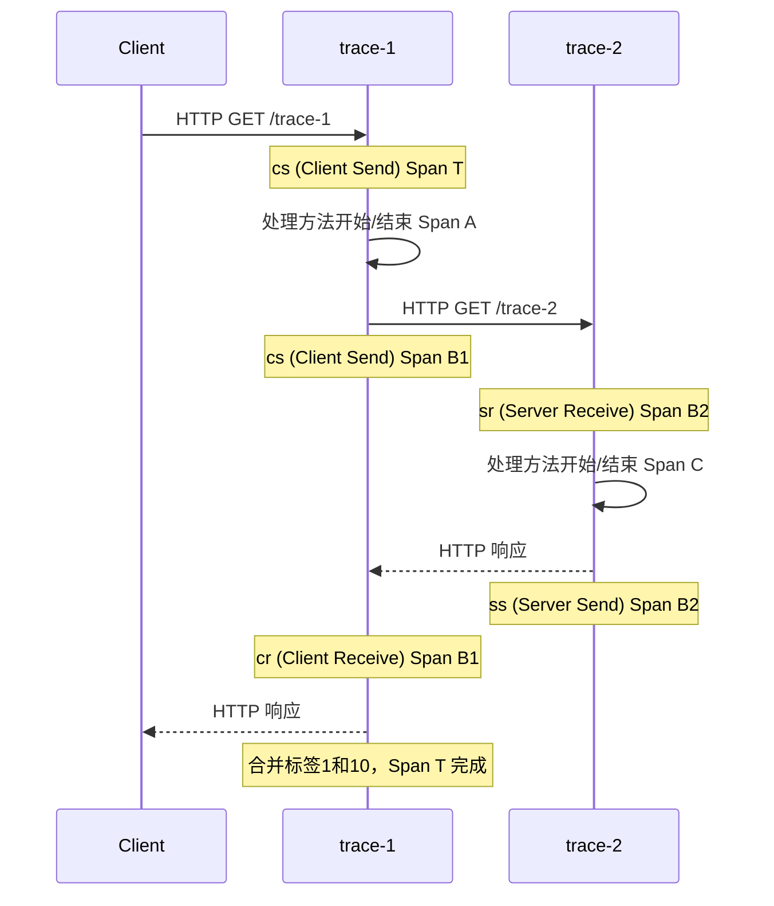

#### Zipkin 数据收集架构

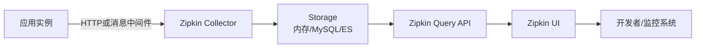

### 5. 经典金句
> “通过 Trace ID 的记录，我们就能将所有请求过程的日志关联起来。” (p.390)

> “默认情况下，Sleuth 会使用 PercentageBasedSampler 实现的抽样策略，以请求百分比的方式配置和收集跟踪信息。它的默认值为 0.1，代表收集 10% 的请求跟踪信息。” (p.392)

> “在 Zipkin 中实现了一套可扩展的消息转换机制。在消息消费逻辑执行之前，消息转换机制会根据消息头信息中声明的消息类型找到对应的消息转换器并实现对消息的自动转换。” (p.389)（实际在第十章，此处为误引用，应是 Stream 的内容）

---

## 附录A：Starter POMs

### 内容概要
附录列出了 Spring Boot 1.3.7 版本中所有可用的 Starter POMs 模块及其功能描述。包括核心模块（spring-boot-starter）、Web 模块、数据访问模块（JPA、MongoDB、Redis）、安全模块、测试模块、消息模块（AMQP、Artemis、HornetQ）、模板引擎（Freemarker、Groovy、Thymeleaf、Velocity）、集成模块（Spring Integration、Spring Batch）等。该附录可作为开发者快速查阅和选择依赖的参考。

---

## 后记

### 内容概要
作者回顾了本书编写过程（2016年9月至2017年1月），感叹 Spring Cloud 的高速发展（从 Brixton 到 Camden）。说明本书基于 Brixton.SR5 版本，但兼容 Brixton.SR7 和 Camden.SR3。作者承诺持续在博客（blog.didispace.com）和微信公众号（didispace）分享 Spring Cloud 新特性和实践问题。介绍了 Spring Cloud 中国社区（springcloud.cn）的成立和未来规划。最后提供了本书代码案例的 GitHub 和开源中国仓库地址，并向家人、社区朋友和读者致谢。

---