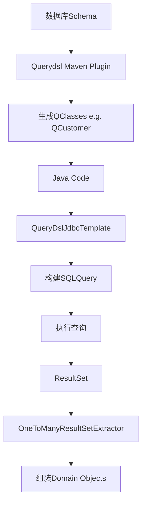
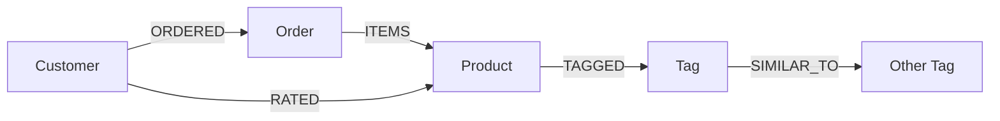

# 《Spring Data: Modern Data Access for Enterprise Java》章节总结

## 书籍信息
- **书名**：Spring Data: Modern Data Access for Enterprise Java
- **作者**：Mark Pollack, Oliver Gierke, Thomas Risberg, Jon Brisbin, Michael Hunger
- **出版年份**：2013 (O'Reilly Media)
- **PDF 状态**：完整文本可识别
- **OCR 状态**：良好，结构清晰

## 目录说明
- **目录识别情况**：已完全识别，包含前言、六个部分共14章及附录。
- **章节对应依据**：严格遵循原书 Part I 至 Part VI 的结构。
- **OCR 修复说明**：代码片段与配置XML已标准化格式，Mermaid图表基于文中描述重建。

## 全书核心主题
本书旨在解决Java企业在面对多样化数据存储（关系型数据库、NoSQL、大数据、数据网格）时，数据访问层代码冗余、API不一致以及学习曲线陡峭的问题。Spring Data项目通过提供统一的编程模型（Repository抽象、Template模式）和针对特定存储的优化模块，简化了数据访问层的开发。

全书核心观点包括：
1. **统一抽象**：通过`Repository`接口和查询衍生机制，减少 boilerplate code（样板代码）。
2. **保留特性**：在统一模型下，不牺牲底层数据存储的特有功能（如MongoDB的地理空间查询、Neo4j的图遍历）。
3. **类型安全**：集成Querydsl实现类型安全的查询构建。
4. **生态系统整合**：将Spring Batch、Spring Integration与Hadoop等大数据技术整合，构建完整的数据管道。

本书不仅涵盖了传统的JPA/JDBC，还深入介绍了MongoDB、Neo4j、Redis、GemFire以及Hadoop生态（HDFS, MapReduce, Hive, Pig, HBase）在Spring体系下的应用。

---

## 第1章：The Spring Data Project

### 核心论点
本章阐述了Spring Data项目的起源与使命，指出传统JPA无法有效抽象NoSQL存储，因此Spring Data采用“一致但非最低公分母”的策略，为不同存储提供熟悉且一致的Spring编程模型。

### 关键概念/事件
- **Spring Data使命**：为NoSQL和关系型存储提供熟悉且一致的Spring编程模型，同时保留存储特定的功能和能力。
- **NoSQL分类**：键值对（Key/Value）、列族（Column Family）、文档（Document）、图（Graph）。
- **BASE语义**：Basically Available, Scalable, Eventually Consistent，区别于传统RDBMS的ACID。
- **Template模式**：如`MongoTemplate`, `RedisTemplate`，处理资源管理和异常转换。
- **Repository抽象**：最高层抽象，通过接口定义减少DAO实现代码。

### 逻辑推演/叙事脉络
作者首先回顾了Spring在传统JDBC/JPA上的成功，指出随着NoSQL的兴起，Java开发者面临API碎片化的问题。接着分析了为何JPA不适合作为NoSQL的统一抽象（因为JPA深度绑定关系模型）。随后提出了Spring Data的设计哲学：不强行统一所有API，而是利用Spring已有的模式（Template, Repository）提供一致性体验。最后介绍了书中的示例领域模型（电商系统：Customer, Product, Order）。

### 经典金句/数据
> “Spring Data provides a familiar and consistent Spring-based programming model for NoSQL and relational stores while retaining store-specific features and capabilities.”

---

## 第2章：Repositories: Convenient Data Access Layers

### 核心论点
本章介绍了Spring Data的核心抽象——Repository，展示了如何通过定义接口而非实现类来完成CRUD和查询操作，极大降低了数据访问层的开发成本。

### 关键概念/事件
- **Repository接口**：标记接口，用于被Spring Data基础设施发现。
- **CrudRepository**：提供基本的保存、查找、删除方法。
- **PagingAndSortingRepository**：扩展CrudRepository，支持分页和排序。
- **查询衍生（Query Derivation）**：根据方法名（如`findByEmailAddress`）自动解析并生成查询语句。
- **@Query注解**：用于定义复杂的或无法通过方法名衍生的查询。
- **自定义Repository实现**：通过`Impl`后缀类手动实现复杂逻辑，并与代理合并。

### 逻辑推演/叙事脉络
从传统DAO实现的繁琐入手，引入`Repository`标记接口。逐步展示如何扩展`CrudRepository`获得通用功能。重点讲解了查询方法的两种定义方式：方法名衍生（简单查询）和`@Query`注解（复杂查询）。随后介绍了分页（Pageable）和排序（Sort）的支持。最后说明了当内置功能不足时，如何通过命名约定混合自定义实现。

### 流程图（如存在）

```mermaid
graph TD
    A[定义Repository接口] --> B{继承基础接口?}
    B -- 是 --> C[获得CRUD/分页能力]
    B -- 否 --> D[仅作为标记接口]
    A --> E[定义查询方法]
    E --> F{方法名符合规范?}
    F -- 是 --> G[自动衍生查询]
    F -- 否 --> H[使用@Query注解]
    A --> I[需要自定义逻辑]
    I -- 是 --> J[创建InterfaceCustom + InterfaceImpl]
    I -- 否 --> K[完成]
    J --> L[Spring Data代理合并实现]
```

### 经典金句/数据
> “The goal of the repository abstraction of Spring Data is to reduce the effort required to implement data access layers for various persistence stores significantly.”

---

## 第3章：Type-Safe Querying Using Querydsl

### 核心论点
为解决字符串拼接查询易出错且缺乏重构支持的问题，本章引入Querydsl，通过注解处理器生成元模型，实现类型安全的查询构建，并与Spring Data Repository无缝集成。

### 关键概念/事件
- **Querydsl元模型**：通过APT（Annotation Processing Tool）生成的Q类（如`QCustomer`），包含类型安全的属性路径。
- **Predicate**：布尔表达式，用于构建查询条件。
- **QueryDslPredicateExecutor**：Repository接口扩展，支持传入Predicate执行查询。
- **APT处理器**：针对不同存储（JPA, MongoDB等）有不同的处理器生成元模型。

### 逻辑推演/叙事脉络
首先指出String-based查询的痛点（易错、难维护）。介绍Querydsl如何通过生成元模型解决这一问题。演示如何在纯Java集合中使用Querydsl进行过滤。接着展示如何在不同存储（JPA, MongoDB）中执行Querydsl查询。最后重点讲解如何将其集成到Spring Data Repository中，通过扩展`QueryDslPredicateExecutor`接口，使Repository能够接受类型安全的Predicate参数。

### 经典金句/数据
> “Changing the domain class would cause the query metamodel class to be regenerated. Property references that have become invalidated by this change would become compiler errors.”

---

## 第4章：JPA Repositories

### 核心论点
本章详细讲解Spring Data JPA模块，展示其在标准JPA基础上提供的增强功能，包括自动查询衍生、分页支持以及与Querydsl的集成，同时保留了JPA的事务管理特性。

### 关键概念/事件
- **SimpleJpaRepository**：Spring Data JPA的默认实现类，处理CRUD操作。
- **事务管理**：默认情况下，写操作开启事务，读操作开启只读事务以优化性能。
- **@Entity映射**：回顾JPA基本映射（@Id, @OneToMany, @Embeddable等）。
- **Querydsl集成**：通过`JPAAnnotationProcessor`生成元模型，并在Repository中使用。

### 逻辑推演/叙事脉络
回顾传统JPA开发的样板代码。展示如何使用Spring Data JPA的Repository接口替代手动实现。解释Spring Data如何自动处理`EntityManager`的注入和事务边界。深入探讨查询衍生机制在JPA中的具体表现（JPQL生成）。介绍如何处理复杂关联查询和分页。最后演示如何配置Querydsl以在JPA环境中使用类型安全查询。

### 经典金句/数据
> “Enabling read-only transactions for reading methods results in a few optimizations... preventing it from checking each entity in the persistence context for changes (so-called dirty checking).”

---

## 第5章：Type-Safe JDBC Programming with Querydsl SQL

### 核心论点
针对直接使用JDBC的场景，本章介绍Spring Data JDBC Extensions结合Querydsl SQL模块，提供类型安全的SQL构建和执行能力，弥补原生JdbcTemplate在复杂查询构建上的不足。

### 关键概念/事件
- **Querydsl SQL模块**：基于数据库元数据生成Q类，而非注解。
- **QueryDslJdbcTemplate**：封装原生JdbcTemplate，提供类型安全的SQL构建器。
- **SQLTemplates**：适配不同数据库方言（如HSQLDB, MySQL）。
- **OneToManyResultSetExtractor**：处理一对多关联查询的结果集映射，避免N+1问题或重复数据。

### 逻辑推演/叙事脉络
指出原生JDBC/Hardcoded SQL的维护难题。介绍Querydsl SQL模块如何通过连接数据库生成元模型。展示`QueryDslJdbcTemplate`的使用，包括查询、插入、更新和删除。重点讲解如何处理复杂的一对多关系映射，通过自定义`ResultSetExtractor`将扁平化的SQL结果集组装成嵌套的对象结构。

### 流程图（如存在）



### 经典金句/数据
> “Instead of writing SQL queries and embedding them in strings in your Java program, Querydsl generates query types based on metadata from your database tables.”

---

## 第6章：MongoDB: A Document Store

### 核心论点
本章介绍Spring Data MongoDB，展示如何将Java对象映射到MongoDB文档，利用其文档模型优势简化聚合根的处理，并通过Repository抽象简化数据访问。

### 关键概念/事件
- **Document映射**：`@Document`, `@Id`, `@Field`。
- **嵌入 vs 引用**：默认嵌入值对象和集合，使用`@DBRef`进行跨集合引用。
- **MappingMongoConverter**：核心转换器，处理Java对象与DBObject之间的转换。
- **自定义Converter**：通过实现`Converter`接口定制特定类型的序列化（如将EmailAddress存为String而非子文档）。
- **GeoSpatial Indexing**：支持地理空间索引和查询。

### 逻辑推演/叙事脉络
介绍MongoDB的基本概念（BSON, Collections）。展示Spring Data如何配置MongoDB连接。深入讲解映射子系统，特别是如何处理嵌套对象和集合。对比嵌入模型与引用模型（@DBRef）的适用场景。演示如何使用`MongoTemplate`进行底层操作，然后过渡到更高级的Repository抽象。最后介绍如何自定义转换器以优化文档结构。

### 经典金句/数据
> “From a persistence point of view, storing the entire Customer alongside its Addresses and EmailAddresses becomes a single—and thus atomic—operation.”

---

## 第7章：Neo4j: A Graph Database

### 核心论点
本章探讨Spring Data Neo4j，展示如何利用图数据库处理高度互联的数据。通过注解将Java对象映射为节点和关系，并利用Cypher查询语言或衍生查询方法遍历图结构。

### 关键概念/事件
- **NodeEntity & RelationshipEntity**：映射节点和关系的注解。
- **@RelatedTo & @RelatedToVia**：定义节点间的关系。
- **Cypher查询语言**：Neo4j的声明式查询语言，类似SQL但针对图模式。
- **Fetch策略**：简单映射模式（ detached）与高级映射模式（AspectJ织入，live view）。
- **图算法**：利用图结构进行协同过滤、最短路径等计算。

### 逻辑推演/叙事脉络
介绍图数据库相比关系数据库在处理关联数据时的优势（常数时间遍历）。展示如何使用注解建模域对象为图结构。解释Spring Data Neo4j的两种映射模式及其优缺点。演示如何使用Repository执行基本的CRUD和基于方法名的衍生查询。深入介绍如何使用`@Query`注解执行复杂的Cypher查询，以及如何利用图结构实现推荐系统等高级功能。

### 流程图（如存在）



### 经典金句/数据
> “Graph databases are clearly post-relational data stores... moving the cost of relating entities (joins) to the insertion time... allows for constant time traversal.”

---

## 第8章：Redis: A Key/Value Store

### 核心论点
本章介绍Spring Data Redis，展示如何利用Redis的高性能键值存储特性，包括字符串、列表、集合、哈希的操作，以及发布/订阅和原子计数器功能。

### 关键概念/事件
- **RedisTemplate & StringRedisTemplate**：核心操作模板，后者专门处理字符串序列化。
- **Operations接口**：`ValueOperations`, `ListOperations`, `SetOperations`, `HashOperations`等，细分操作类型。
- **Serializer**：关键组件，决定Key和Value如何序列化为字节数组（JDK, String, JSON等）。
- **Pub/Sub**：轻量级消息发布/订阅机制。
- **Atomic Counters**：利用`RedisAtomicLong`实现分布式原子计数。

### 逻辑推演/叙事脉络
简述Redis的数据结构和优势。展示如何配置连接工厂和Template。重点讲解序列化器的重要性及其配置。演示各种数据结构的操作方法。介绍如何使用Redis实现分布式锁或原子计数器。最后展示如何集成Spring的Cache抽象，将Redis作为缓存后端。

### 经典金句/数据
> “What it lacks in complex querying functionality... it makes up for in speed and efficiency.”

---

## 第9章：Persistence Layers with Spring Roo

### 核心论点
本章介绍Spring Roo如何集成Spring Data，通过代码生成和AspectJ快速构建基于JPA或MongoDB的应用程序，包括实体、Repository和Web层。

### 关键概念/事件
- **Active Record vs Repository**：Roo支持两种持久化风格，推荐Repository风格。
- **Roo Shell**：命令行工具，用于执行生成命令。
- **ITD (Inter-Type Declarations)**：AspectJ机制，Roo用于向类中注入方法（如getter/setter, finder methods）。
- **Push-in Refactoring**：将生成的AspectJ代码推入Java源文件，移除Roo依赖。

### 逻辑推演/叙事脉络
介绍Roo的基本工作原理（监控文件系统，生成AspectJ ITDs）。演示如何使用Roo Shell创建项目、设置JPA/MongoDB持久化、创建实体和Repository。展示生成的代码结构。说明如何添加Web层（MVC Scaffold）。最后讨论如何从Roo项目中“毕业”（Push-in refactoring），使其成为标准的Java/Spring项目。

### 经典金句/数据
> “Roo works its magic using code generation combined with AspectJ for injecting behavior into your domain and web classes.”

---

## 第10章：REST Repository Exporter

### 核心论点
本章介绍Spring Data REST，它能够自动将Spring Data Repository暴露为RESTful Web服务，遵循HATEOAS原则，无需编写Controller即可实现CRUD的HTTP接口。

### 关键概念/事件
- **RepositoryRestExporterServlet**：核心Servlet，扫描Repository并发布资源。
- **HATEOAS**：Hypermedia as the Engine of Application State，响应中包含链接指引下一步操作。
- **资源映射**：Repository名称映射为URL路径，方法映射为HTTP动词（GET, POST, PUT, DELETE）。
- **投影与分页**：自动支持分页参数和JSON输出中的页面元数据。
- **关联资源处理**：通过URI List管理实体间的关联（如Order指向Customer）。

### 逻辑推演/叙事脉络
介绍REST基本原则。展示Spring Data REST如何自动发现Repository并生成对应的REST端点。演示如何通过curl访问资源、执行查询和处理分页。重点讲解如何处理实体间的关联（Links），以及如何通过PUT/DELETE修改关联关系。讨论如何处理序列化问题（如Jackson配置）。

### 流程图（如存在）

```mermaid
graph TD
    A[HTTP Request] --> B[RepositoryRestExporterServlet]
    B --> C[Find Repository]
    C --> D[Invoke Repository Method]
    D --> E[Convert to JSON/HAL]
    E --> F[Add Links (HATEOAS)]
    F --> G[HTTP Response]
```

### 经典金句/数据
> “The exporter mechanism will transparently expose a resource per repository, map CRUD operations onto HTTP methods for that resource, and provide a means to execute query methods exposed on the repository interface.”

---

## 第11章：Spring for Apache Hadoop

### 核心论点
本章介绍Spring for Apache Hadoop，旨在简化Hadoop应用的开发，通过Spring配置管理HDFS操作、MapReduce作业提交，并支持脚本化交互。

### 关键概念/事件
- **Hadoop Namespace**：XML配置简化Job、FileSystem的配置。
- **JobRunner**：管理MapReduce作业的生命周期，支持启动前后执行脚本。
- **FsShell**：Java API封装HDFS shell命令，支持脚本化（Groovy）。
- **Property Placeholder**：外部化配置，便于在不同环境（Dev/QA/Prod）切换。
- **TaskScheduler/Quartz**：调度Hadoop作业执行。

### 逻辑推演/叙事脉络
从传统的Hadoop命令行开发痛点入手（脚本碎片化、参数传递困难）。展示如何使用Spring配置一个WordCount Job。介绍如何通过`JobRunner`和`FsShell`脚本自动化数据准备和清理工作。演示如何使用SpEL和属性占位符实现配置外部化。最后介绍如何集成Spring TaskScheduler或Quartz进行作业调度。

### 经典金句/数据
> “Spring for Apache Hadoop aims to simplify creating Hadoop-based applications in Java. It builds upon the Spring Framework to provide structure when you are writing Hadoop applications.”

---

## 第12章：Analyzing Data with Hadoop

### 核心论点
本章深入Hadoop生态中的高级分析工具（Hive, Pig, HBase），展示Spring如何集成这些工具，提供更高级的抽象和模板类，简化数据分析应用的开发。

### 关键概念/事件
- **HiveTemplate**：封装Hive Thrift/JDBC客户端，简化HiveQL执行。
- **PigTemplate**：封装PigServer，支持参数化执行Pig Latin脚本。
- **HbaseTemplate**：封装HBase Java Client，提供回调接口进行RowMapper映射。
- **Embedded Servers**：支持在应用中嵌入Hive Server进行测试。
- **UDF Support**：支持注册和使用用户定义函数。

### 逻辑推演/叙事脉络
分别介绍Hive、Pig和HBase在Hadoop生态中的角色。展示Spring如何为每种技术提供Template支持。
- **Hive**：通过Thrift或JDBC连接，执行HiveQL，处理结果集。
- **Pig**：配置PigServer，执行Pig Latin脚本，处理参数替换。
- **HBase**：配置HBaseTemplate，使用Callback进行底层的Get/Put/Scan操作，并将Result映射为POJO。

### 经典金句/数据
> “Spring for Apache Hadoop makes it very easy to embed the PigServer in your application and to run Pig Latin scripts programmatically.”

---

## 第13章：Creating Big Data Pipelines with Spring Batch and Spring Integration

### 核心论点
本章展示如何结合Spring Integration（事件驱动、数据移动）和Spring Batch（批处理工作流）构建完整的大数据管道，实现从数据采集、处理到加载的全流程自动化。

### 关键概念/事件
- **Spring Integration Adapters**：File, FTP, TCP, UDP, Syslog等适配器，用于数据采集。
- **Message Channel & Handler**：构建数据流动的处理链。
- **Spring Batch Job/Step**：定义批处理工作流，支持Chunk-oriented处理。
- **Hadoop Tasklets**：Spring Batch的扩展，允许在Step中执行HDFS脚本、MapReduce、Hive、Pig作业。
- **ItemReader/Writer**：支持从HDFS读取数据写入DB，或从DB读取写入HDFS/MongoDB。

### 逻辑推演/叙事脉络
首先介绍大数据管道的典型需求（采集、清洗、分析、导出）。
1. **采集**：使用Spring Integration从文件系统、FTP或Syslog流式采集数据到HDFS。
2. **处理**：使用Spring Batch编排工作流。介绍如何自定义Tasklet来执行Hadoop作业。
3. **导出**：使用Spring Batch的ItemReader从HDFS读取分析结果，通过ItemWriter写入关系型数据库或MongoDB。
4. **管理**：介绍如何通过JMX和控制总线管理运行时的管道状态。

### 流程图（如存在）


### 经典金句/数据
> “Spring Integration provides the foundation to coordinate event-driven activities... Spring Batch provides the framework to coordinate coarse-grained steps in a workflow.”

---

## 第14章：GemFire: A Distributed Data Grid

### 核心论点
本章介绍Spring Data GemFire，展示如何配置和管理GemFire分布式数据网格，利用其内存计算能力实现低延迟、高吞吐的数据访问，并支持持续查询和WAN同步。

### 关键概念/事件
- **Cache & Region**：GemFire的核心概念，Region类似Map，支持Replicated和Partitioned类型。
- **Client-Server Topology**：客户端通过Locator发现服务器，建立连接池。
- **PDX Serialization**：GemFire的高效序列化格式，支持版本控制和跨语言互操作。
- **Continuous Queries (CQ)**：基于查询的事件通知机制，避免轮询。
- **WAN Gateway**：支持跨广域网的数据同步，实现异地多活或数据分发。

### 逻辑推演/叙事脉络
介绍GemFire的基本架构（Locator, Server, Client）。展示如何使用Spring XML命名空间配置Cache和Region。讲解客户端配置，包括连接池和订阅启用。介绍数据访问方式：GemfireTemplate和Repository支持。重点讲解PDX序列化的配置优势。最后介绍高级特性：持续查询（CQ）的实现方式和WAN网关的配置，用于地理分布系统。

### 经典金句/数据
> “GemFire provides an in-memory data grid that offers extremely high throughput, low latency data access, and scalability.”

---

## 附录与致谢
- **Bibliography**：列出了相关的参考书籍和资源，如《MongoDB: The Definitive Guide》, 《Spring Batch in Action》等。
- **Index**：详细的索引，方便查阅特定类和概念。
- **About the Authors**：介绍了五位作者在Spring社区、大数据和NoSQL领域的背景及贡献。