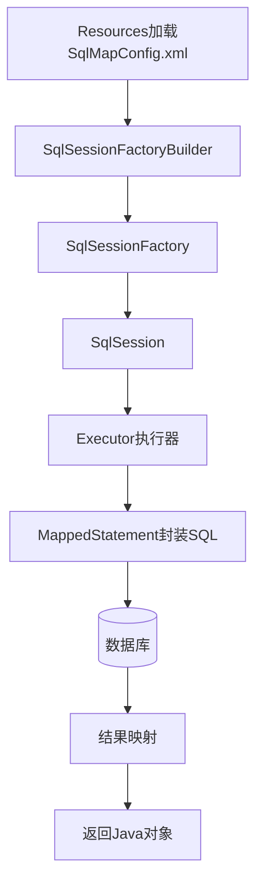
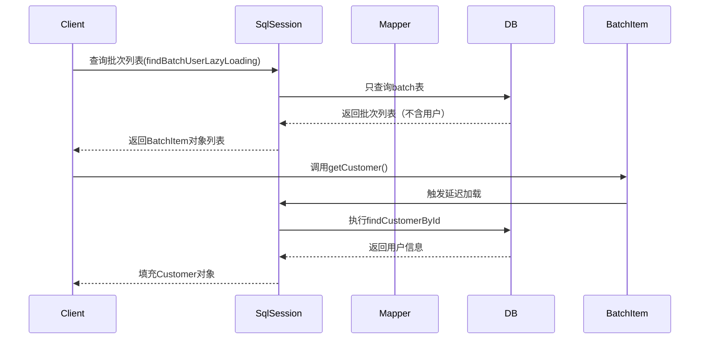
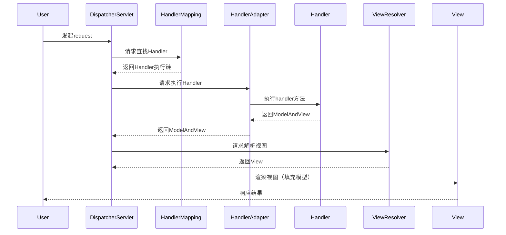
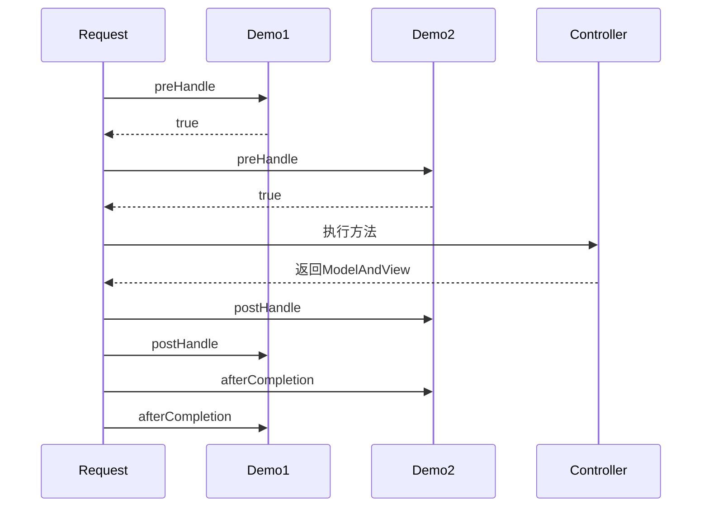
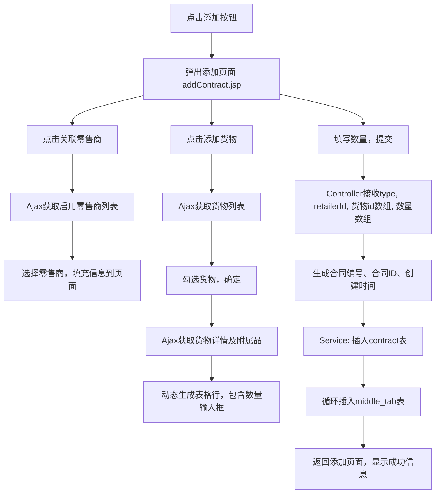

# 《Spring MVC MyBatis开发从入门到项目实战》章节总结

## 书籍信息
- **书名**：Spring MVC MyBatis开发从入门到项目实战
- **作者**：朱要光
- **PDF状态**：扫描版，由4个PDF文件拼接，内容完整
- **OCR状态**：基本完整，部分页面有轻微文本错位或乱码，但整体可读，不影响知识提取

## 目录说明
- **目录识别情况**：书籍提供了完整的目录结构（第1篇至第4篇，共19章）
- **章节对应依据**：严格按照PDF页码顺序及目录层级进行整理
- **OCR修复说明**：部分表格、代码片段存在格式错乱，已基于可见文本进行合理重组；流程图无法直接提取图像，根据文字描述用Mermaid语法重建

## 全书核心主题
本书是一本面向Java Web开发者的入门级实战教程，聚焦于两个主流框架——MyBatis和Spring MVC。全书分为四篇：第一篇为开发环境搭建（JDK、MyEclipse）；第二篇系统讲解MyBatis框架，从传统JDBC缺陷、MyBatis架构、入门程序、配置文件详解、高级映射（一对一、一对多、多对多）、延迟加载、缓存机制到逆向工程；第三篇深入Spring MVC，包括请求流程、处理器映射器与适配器、前端控制器、视图解析器、请求映射与参数绑定、校验（Validation）、异常处理、拦截器以及文件上传、JSON交互、RESTful风格等；第四篇为项目实战，以“水果网络销售平台”为例，完整展示了从需求分析、UML建模、数据库设计到框架整合、各模块（零售商管理、货物管理、附属品管理、购销合同管理）开发的全过程。全书强调“配置文件驱动开发”和“注解简化开发”两种模式，帮助读者掌握SSM（Spring MVC + Spring + MyBatis）整合开发的核心技能。

---

## 第1篇 准备工作

### 第1章 开发环境搭建

#### 1. 核心论点
**问题 → 观点**：本章解决如何搭建Java Web开发基础环境的问题。作者认为，学习Spring MVC和MyBatis之前，必须正确安装和配置JDK与MyEclipse，并能够编写运行第一个Java程序。

#### 2. 关键概念/事件
- **JDK（Java Development Kit）**：Java开发工具包，包含编译工具、常用工具类和基础类库，也包含JRE（Java Runtime Environment，运行环境）。
- **环境变量配置**：需要配置`JAVA_HOME`（指向JDK安装目录）、`CLASSPATH`（指向lib目录及tools.jar）和`Path`（指向bin目录），以便在任意目录下执行Java命令。
- **MyEclipse**：基于Eclipse的企业级集成开发环境，拓展了Web开发功能，适合Java EE项目。
- **第一个Java类**：在MyEclipse中创建Java工程、包、类，编写main方法并输出“Java,HelloWorld!”，通过Run As运行验证环境。

#### 3. 逻辑推演/叙事脉络
作者按照“下载→安装→配置→验证”的顺序展开。首先在Oracle官网下载JDK，安装后分别配置JAVA_HOME、CLASSPATH和Path三个环境变量，通过`java -version`、`java`、`javac`命令验证。然后下载安装MyEclipse，配置工作空间，并在Preferences中添加本地JDK。最后创建Java Project，编写HelloWorld类并运行，确认开发环境就绪。

#### 4. 经典金句/数据
> “盖房子最重要的是打好地基，这句话对程序开发人员来讲，也是一样的。”(p.9)
> 验证成功的标志：控制台输出“Java,HelloWorld!”

---

## 第2篇 MyBatis技术入门

### 第2章 了解MyBatis

#### 1. 核心论点
**问题 → 观点**：传统JDBC开发存在硬编码、频繁连接、结果集手动映射等缺陷。作者认为MyBatis作为持久层框架，通过XML配置文件管理SQL、数据库连接池和输入输出映射，可以大幅提升开发效率和程序可维护性。

#### 2. 关键概念/事件
- **传统JDBC缺陷**：①连接参数、SQL语句硬编码在Java类中；②数据库连接频繁开启和关闭，浪费资源；③结果集手动遍历和设置（如`rs.getString("name")`），字段名变动需修改源码。
- **MyBatis**：原名iBatis，支持动态SQL，将SQL配置在XML文件中，提供输入参数映射和输出结果自动映射，同时内置数据库连接池。
- **整体架构**：包括数据源配置文件（SqlMapConfig.xml）、SQL映射配置文件（Mapper.xml）、会话工厂（SqlSessionFactory）、会话（SqlSession）、执行器（Executor）和底层封装对象（MappedStatement）。
- **运行流程**：Resources加载SqlMapConfig.xml → SqlSessionFactory创建SqlSession → SqlSession通过Executor和MappedStatement执行SQL → 返回结果。

#### 3. 逻辑推演/叙事脉络
作者先分析传统JDBC代码示例（连接类DBConnection及增删改查方法），指出硬编码和频繁连接问题。然后介绍MyBatis如何优化：SQL外置、连接池管理、结果集自动映射。接着展示MyBatis整体架构图（图2-1）和运行流程，强调Mapper配置文件的核心地位。

#### 4. 流程图

> 参考图2-1 MyBatis运行流程结构图（p.29）

---

### 第3章 搭建MyBatis工作环境

#### 1. 核心论点
**问题 → 观点**：如何动手开发第一个MyBatis入门程序？作者通过“数据库准备→工程创建→依赖引入→配置文件编写→测试类编写”的步骤，让读者快速体验MyBatis的查询、新增、删除、修改操作。

#### 2. 关键概念/事件
- **数据库准备**：创建`mybatis_test`数据库及`user`表，插入测试数据。
- **工程结构**：Web工程，引入mybatis-3.4.1.jar及依赖、MySQL驱动、log4j。
- **核心配置文件**：
  - `log4j.properties`：设置日志级别为DEBUG，输出到控制台。
  - `SqlMapConfig.xml`：配置数据库连接池（driver、url、username、password）及日志实现。
  - `UserMapper.xml`：编写SQL映射（select、insert、delete、update）。
- **占位符区别**：
  - `#{}`：预编译占位符，防止SQL注入。
  - `${}`：字符串拼接，存在注入风险，模糊查询中谨慎使用。
- **自增主键获取**：通过`<selectKey>`或`useGeneratedKeys=true`获取插入后的主键值。

#### 3. 逻辑推演/叙事脉络
作者首先创建数据库和表。然后在MyEclipse中新建Web工程，添加jar包，创建包和配置文件。编写log4j.properties和SqlMapConfig.xml（含setting、environments）。接着编写UserMapper.xml（select findUserById），创建User实体类、DataConnection工具类（获取SqlSession）。最后编写MyBatisTest测试类，使用`sqlSession.selectOne("test.findUserById",1)`查询并打印结果。后续扩展模糊查询（`${value}`）、新增、删除、修改，并演示了获取自增主键的方法。

#### 4. 经典金句/数据
> “使用MyBatis的场景是，对SQL优化要求比较高，或是项目需求或业务经常变动。”(p.46)
> 自增主键配置：`<insert id="insertUser" useGeneratedKeys="true" keyProperty="id">`

---

### 第4章 MyBatis配置文件详解

#### 1. 核心论点
**问题 → 观点**：MyBatis全局配置文件（SqlMapConfig.xml）和映射文件（Mapper.xml）有哪些配置项？作者详细解析了properties、settings、typeAliases、typeHandlers、objectFactory、plugins、environments、mappers以及Mapper中的输入/输出映射、动态SQL。

#### 2. 关键概念/事件
- **properties**：引入外部属性文件（如db.properties），支持占位符`${}`及默认值。
- **settings**：全局行为配置，如`cacheEnabled`（二级缓存开关）、`lazyLoadingEnabled`（延迟加载）、`autoMappingBehavior`（自动映射模式）等。
- **typeAliases**：为Java类型起别名，简化配置（如`<package name="cn.com.mybatis.po"/>`）。
- **typeHandlers**：自定义类型处理器，实现Java类型与JDBC类型的转换。
- **objectFactory**：自定义对象工厂，用于实例化目标类（如执行有参构造前加init逻辑）。
- **plugins**：拦截器，可拦截Executor、ParameterHandler等核心组件方法。
- **environments**：多数据库环境配置，包含transactionManager和dataSource。
- **mappers**：加载Mapper映射文件的四种方式（resource、url、class、package）。
- **Mapper输入映射**：parameterType支持简单类型、包装类型（JavaBean/Map），`#{}`与`${}`区别。
- **Mapper输出映射**：resultType（自动映射）和resultMap（自定义映射，支持关联嵌套）。
- **动态SQL**：`<where>`、`<if>`、`<foreach>`、`<sql>`片段。

#### 3. 逻辑推演/叙事脉络
作者按SqlMapConfig.xml中配置标签的顺序逐一讲解，给出完整示例配置文件（p.49-50）。然后详细展开每个标签的作用和属性。对于Mapper文件，先总体介绍insert/update/delete/select/resultMap标签，再深入输入映射（基本类型、包装类、HashMap）、输出映射（resultType/resultMap，含association、collection、discriminator），最后讲解自动映射和动态SQL（where/if/foreach/sql片段）。

#### 4. 经典金句/数据
> “MyBatis的核心就是基于SQL配置的Mapper映射文件，所有数据库的操作都会基于该映射文件和配置的SQL语句。”(p.27)
> 动态SQL示例：`<foreach collection="ids" item="user_id" open="and id in(" close=")" separator=",">`

---

### 第5章 MyBatis高级映射

#### 1. 核心论点
**问题 → 观点**：如何处理多表之间的关联查询（一对一、一对多、多对多）以及延迟加载？作者通过银行购买理财产品的业务模型，演示了resultType、resultMap、association、collection的使用，并介绍了延迟加载配置。

#### 2. 关键概念/事件
- **业务模型**：用户（customer）、批次（batch）、批次明细（batchdetail）、理财产品（financial_products）。关系：用户-批次（一对多），批次-明细（一对多），明细-产品（多对一），用户-产品（多对多）。
- **一对一查询**：查询批次及创建用户。实现方式：①resultType（创建扩展类BatchCustomer）；②resultMap（BatchItem中包含Customer对象，使用association）。
- **一对多查询**：查询批次及其包含的理财产品明细。使用resultMap + collection（ofType=BatchDetail）。
- **多对多查询**：查询用户及其所有批次的理财详细信息。嵌套resultMap：Customer → collection(batchList) → collection(batchDetails) → association(financialProduct)。
- **延迟加载**：按需加载关联数据。配置`lazyLoadingEnabled=true`、`aggressiveLazyLoading=false`，在Mapper中通过association的select和column属性实现。

#### 3. 逻辑推演/叙事脉络
作者首先建立测试数据模型（四张表及关系），插入测试数据。然后分别演示：
- 一对一：编写SQL `SELECT BATCH.*, CUSTOMER.username ...`，对比resultType和resultMap两种实现。
- 一对多：在Batch实体中添加List<BatchDetail>，使用collection映射。
- 多对多：在Customer中添加List<Batch>，Batch中添加List<BatchDetail>，BatchDetail中添加FinancialProduct，使用多层collection/association。
- 延迟加载：配置settings，修改Mapper，测试发现只有调用getCustomer时才执行查询用户SQL。

#### 4. 流程图（延迟加载）

---

### 第6章 MyBatis缓存结构

#### 1. 核心论点
**问题 → 观点**：如何利用MyBatis的缓存机制提升查询效率？作者区分了一级缓存（SqlSession级别，默认开启）和二级缓存（Mapper级别，需手动配置），并通过测试验证缓存行为及清空条件。

#### 2. 关键概念/事件
- **一级缓存**：基于SqlSession。同一个SqlSession中执行相同查询，第二次从缓存获取；执行增删改（commit）后清空缓存。
- **二级缓存**：基于Mapper的namespace。多个SqlSession共享，需在SqlMapConfig.xml设置`<setting name="cacheEnabled" value="true"/>`，并在Mapper.xml中添加`<cache/>`。查询结果要求实现Serializable接口。
- **缓存清空**：执行增删改操作后清空该namespace下的所有缓存。
- **注意事项**：不同namespace可能缓存相同数据导致不一致，使用二级缓存需谨慎。

#### 3. 逻辑推演/叙事脉络
作者先画出一级缓存原理图（图6-2），然后编写测试：同sqlSession两次查询id为1的用户，控制台只输出一次SQL，证明一级缓存。再在两次查询之间执行更新并commit，第二次重新查询数据库，证明缓存清空。接着介绍二级缓存原理图（图6-5），配置并测试：不同Mapper代理（同namespace）多次查询，第一次查数据库，第二次从缓存获取。最后测试更新后缓存清空。

#### 4. 经典金句/数据
> “一级缓存是基于SqlSession类的实例对象的。”(p.103)
> “二级缓存是基于Mapper级别的，多个SqlSession类的实例对象可以共享一个Mapper缓存。”(p.105)

---

### 第7章 MyBatis技术拓展

#### 1. 核心论点
**问题 → 观点**：如何将MyBatis与Spring框架整合，以及如何使用逆向工程自动生成代码？作者通过创建整合工程，展示Spring管理数据源、SqlSessionFactory、事务以及Mapper代理扫描；同时演示mybatis-generator基于数据库表生成POJO、Mapper接口和XML文件。

#### 2. 关键概念/事件
- **整合步骤**：①创建Web工程及包结构；②添加Spring、MyBatis、整合包及数据库驱动等依赖；③编写db.properties、log4j.properties；④编写Spring配置文件applicationContext.xml（数据源、SqlSessionFactory、事务管理、Mapper扫描）；⑤编写MyBatis配置文件SqlMapConfig.xml（仅保留别名和mapper加载）；⑥编写DAO层（继承SqlSessionDaoSupport）或使用Mapper代理；⑦Service层；⑧测试。
- **Mapper代理开发**：定义接口，与Mapper.xml同包同名，namespace为接口全限定名，方法名与SQL id匹配。Spring中通过`MapperScannerConfigurer`扫描包生成代理bean。
- **逆向工程**：使用`mybatis-generator-core`，编写generatorConfig.xml（指定数据库连接、生成目标包、表名），运行GeneratorSqlMap类，自动生成实体类、Mapper接口和XML，以及Example条件查询类。

#### 3. 逻辑推演/叙事脉络
作者先搭建整合工程目录，列出所需jar包（Spring 4.2.5、MyBatis 3.2.7、mybatis-spring 1.2.2等）。编写applicationContext.xml：加载db.properties，配置c3p0数据源，配置SqlSessionFactoryBean（注入configLocation和dataSource），配置MapperScannerConfigurer。SqlMapConfig.xml仅配置typeAliases。然后演示传统DAO方式（继承SqlSessionDaoSupport）和Mapper代理方式（接口+自动扫描）。最后展示逆向工程配置和运行结果，生成UserMapper、UserMapper.xml、User.java、UserExample.java，并测试增删改查及条件查询。

#### 4. 经典金句/数据
> “使用逆向工程，可以大大减少重复的配置和创建工作，提升开发效率。”(p.121)
> Mapper代理规范：Mapper.xml的namespace等于Mapper接口全路径，接口方法名等于SQL的id。

---

## 第3篇 Spring MVC技术入门

### 第8章 Spring MVC

#### 1. 核心论点
**问题 → 观点**：什么是Spring MVC？它与Struts有什么区别？如何搭建第一个Spring MVC工程？作者解释了MVC模式，Spring MVC的请求流程，对比了Struts，并带领读者完成基础环境配置。

#### 2. 关键概念/事件
- **MVC模式**：Model（数据模型）、View（视图）、Controller（控制器），分离关注点。
- **Spring MVC请求流程**：用户请求 → DispatcherServlet（前端控制器）→ HandlerMapping（查找Handler）→ HandlerAdapter（执行Handler）→ 返回ModelAndView → ViewResolver（解析视图）→ 渲染返回。
- **与Struts区别**：Spring MVC基于方法开发（参数为方法形参），支持单例；Struts基于类开发（成员变量接收参数），只能多例；Spring MVC性能略优。
- **环境搭建**：创建Web工程，添加spring-webmvc依赖，配置web.xml中的DispatcherServlet（拦截*.action），编写springmvc.xml核心配置文件（处理器映射器BeanNameUrlHandlerMapping、适配器SimpleControllerHandlerAdapter、视图解析器InternalResourceViewResolver），编写实现Controller接口的Handler，配置Handler的bean。

#### 3. 逻辑推演/叙事脉络
作者首先介绍MVC模式及Spring MVC的体系结构（图8-2），然后通过图8-3详细描述11步请求流程。接着对比Struts的两个区别。最后实际操作：创建工程、添加jar包、配置web.xml、编写springmvc.xml、编写FruitsControllerTest实现Controller、创建fruitsList.jsp。部署后访问`/queryFruits_test.action`，显示水果列表。

#### 4. 流程图（Spring MVC请求流程）

---

### 第9章 处理器映射器和适配器

#### 1. 核心论点
**问题 → 观点**：处理器映射器（HandlerMapping）和适配器（HandlerAdapter）有哪些非注解和注解的配置方式？作者介绍了BeanNameUrlHandlerMapping、SimpleUrlHandlerMapping、ControllerClassNameHandlerMapping，以及适配器SimpleControllerHandlerAdapter、HttpRequestHandlerAdapter，并重点推荐注解方式（RequestMappingHandlerMapping + RequestMappingHandlerAdapter）。

#### 2. 关键概念/事件
- **非注解映射器**：
  - BeanNameUrlHandlerMapping：将bean的name作为url。
  - SimpleUrlHandlerMapping：通过properties配置url和handler的映射。
  - ControllerClassNameHandlerMapping：将类名xxxController映射为/xxx*。
- **非注解适配器**：
  - SimpleControllerHandlerAdapter：支持实现Controller接口的Handler。
  - HttpRequestHandlerAdapter：支持实现HttpRequestHandler接口的Handler（类似Servlet）。
- **注解映射器和适配器**：
  - Spring 3.1之前：DefaultAnnotationHandlerMapping + AnnotationMethodHandlerAdapter。
  - Spring 3.1之后：RequestMappingHandlerMapping + RequestMappingHandlerAdapter。
  - 简化配置：`<mvc:annotation-driven/>` 自动注册并支持数据绑定、校验、JSON转换等。
- **Handler开发**：使用@Controller和@RequestMapping，无需实现接口，方法返回ModelAndView或String。

#### 3. 逻辑推演/叙事脉络
作者先回顾第8章中非注解配置的例子，然后介绍其他非注解映射器和适配器，并演示SimpleUrlHandlerMapping配置多个url映射同一controller。接着演示HttpRequestHandlerAdapter，编写实现HttpRequestHandler的Handler，直接通过response输出JSON。最后引入注解方式，编写FruitsControllerTest3，使用@Controller和@RequestMapping，在springmvc.xml中配置`<context:component-scan>`和`<mvc:annotation-driven/>`，测试成功。

#### 4. 经典金句/数据
> “注解的处理器映射器和适配器，只需要在指定的地方声明一些注解信息即可，这是大部分开发人员使用的主流配置方式。”(p.151)

---

### 第10章 前端控制器和视图解析器

#### 1. 核心论点
**问题 → 观点**：DispatcherServlet的核心源码逻辑是什么？Spring MVC提供了哪些视图解析器？作者剖析了DispatcherServlet的doDispatch方法，并介绍了InternalResourceViewResolver、XmlViewResolver、BeanNameViewResolver、ResourceBundleViewResolver等多种视图解析器。

#### 2. 关键概念/事件
- **DispatcherServlet源码分析**：继承FrameworkServlet，核心方法doDispatch()。流程：checkMultipart → getHandler → getHandlerAdapter → applyPreHandle → ha.handle → applyPostHandle → processDispatchResult → render。
- **视图解析器（ViewResolver）**：
  - AbstractCachingViewResolver：缓存解析过的视图。
  - UrlBasedViewResolver：通过前缀、后缀拼接视图路径。
  - InternalResourceViewResolver：最常用，支持JSP，默认InternalResourceView。
  - XmlViewResolver：从外部XML配置视图bean。
  - BeanNameViewResolver：从Spring容器中根据bean id匹配视图。
  - ResourceBundleViewResolver：从properties文件配置视图。
  - FreeMarkerViewResolver / VelocityViewResolver：支持模板引擎。
- **ViewResolver链**：可配置多个，通过order属性指定优先级，建议将InternalResourceViewResolver放在最后（能解析所有视图）。

#### 3. 逻辑推演/叙事脉络
作者先列出DispatcherServlet的完整代码结构和方法表（表10-1），然后重点解释doDispatch方法的执行步骤。接着依次介绍各种ViewResolver的特点和配置示例，最后说明ViewResolver链的配置顺序。

---

### 第11章 请求映射与参数绑定

#### 1. 核心论点
**问题 → 观点**：如何使用@RequestMapping注解？Spring MVC如何进行参数绑定？作者讲解了@RequestMapping的属性（value、method、params、headers、consumes、produces），以及简单类型、包装类型（JavaBean）、集合类型（数组、List、Map）的参数绑定。

#### 2. 关键概念/事件
- **@Controller和@RequestMapping**：类上添加@RequestMapping提供前置路径，方法上添加具体URL。可限定请求方法、参数、请求头。
- **参数绑定默认支持的类型**：HttpServletRequest、HttpServletResponse、HttpSession、Model/ModelMap。
- **简单类型绑定**：方法参数名与请求参数名一致，或使用@RequestParam(value, required, defaultValue)。
- **包装类型绑定**：表单input的name属性对应JavaBean属性名，支持嵌套属性（如`user.name`）。
- **集合类型绑定**：
  - 数组：多选框name相同，用数组接收。
  - List：使用包装类，页面中`list[0].属性`，Controller参数用`@ModelAttribute`包装类。
  - Map：页面中`map['key']`，Controller参数用包装类，属性类型为Map。
- **乱码解决**：配置CharacterEncodingFilter。

#### 3. 逻辑推演/叙事脉络
作者先介绍@RequestMapping的各种属性用法，给出代码示例。然后讲解参数绑定过程，演示简单类型绑定（id），并展示@RequestParam处理参数名不一致、必填、默认值。接着重点演示包装类型绑定：创建查询页面findFruits.jsp，输入name和producing_area，Controller方法参数为Fruits实体类，成功绑定。最后演示数组、List、Map批量绑定，分别提供页面代码和Controller示例。

#### 4. 经典金句/数据
> “Spring MVC的控制层是基于方法开发的。”(p.171)
> 使用@RequestParam(defaultValue="1")为参数设置默认值。

---

### 第12章 Validation校验

#### 1. 核心论点
**问题 → 观点**：Spring MVC如何实现数据校验？作者介绍了Bean Validation（JSR-303）和Spring Validator接口两种方式，并演示了分组校验。

#### 2. 关键概念/事件
- **Bean Validation**：使用注解如@Size、@NotEmpty、@Email等，配置校验器LocalValidatorFactoryBean，在Controller方法参数前加@Validated，后跟BindingResult获取错误信息。
- **Hibernate Validation扩展**：@Email、@Length、@Range等。
- **分组校验**：定义空接口作为分组标识，在注解中指定groups，在@Validated中指定value分组。
- **Spring Validator接口**：实现Validator接口，重写supports和validate方法，使用ValidationUtils或Errors.rejectValue。在Controller中使用@InitBinder设置Validator。
- **错误信息国际化**：配置ReloadableResourceBundleMessageSource，在properties文件中配置错误码。

#### 3. 逻辑推演/叙事脉络
作者先搭建校验框架：添加依赖（validation-api、hibernate-validator等），在springmvc.xml中配置validator bean和messageSource，并在annotation-driven中引用validator。然后在Fruits实体类的name和producing_area上添加@Size和@NotEmpty，在Controller中添加@Validated和BindingResult，测试输出错误信息。接着演示分组校验：创建两个分组接口，将校验注解分配到不同组，Controller中指定分组。最后演示Spring Validator接口：编写UserValidator，在UserController中使用@InitBinder绑定，测试登录校验。

#### 4. 经典金句/数据
> “@Validated和BindingResult注解是成对出现的，并且在形参中出现的顺序是固定的（一前一后）。”(p.190)

---

### 第13章 异常处理和拦截器

#### 1. 核心论点
**问题 → 观点**：如何统一处理系统异常？如何拦截请求进行预处理和后处理？作者介绍了全局异常处理器（实现HandlerExceptionResolver）和两种拦截器接口（HandlerInterceptor、WebRequestInterceptor），并演示了登录拦截器。

#### 2. 关键概念/事件
- **全局异常处理器**：实现HandlerExceptionResolver，重写resolveException方法，根据异常类型返回自定义ModelAndView。
- **自定义异常**：继承Exception，用于封装业务异常信息。
- **异常信息外部化**：配置properties文件，读取异常代号对应的中文信息。
- **HandlerInterceptor接口**：三个方法preHandle（返回false则中断）、postHandle（执行Handler后，渲染前）、afterCompletion（渲染后）。
- **WebRequestInterceptor接口**：类似，但无response参数，方法无返回值。
- **拦截器链**：多个拦截器按order顺序执行，preHandle按正序，postHandle和afterCompletio按逆序（责任链模式）。
- **登录拦截器**：检查session中是否有user，若无则重定向到登录页。

#### 3. 逻辑推演/叙事脉络
作者首先画出Spring MVC异常处理流程图（图13-1）。然后编写自定义UserException和全局异常处理器UserExceptionResolver，在springmvc.xml中配置bean。在Controller中抛出异常，测试跳转到error页面并显示信息。接着讲解HandlerInterceptor接口，配置两个拦截器Demo1和Demo2，观察控制台输出和时序图（图13-5），说明执行顺序。最后实现LoginInterceptor，preHandle中判断URI是否包含login或是否为静态资源，否则检查session，若未登录则重定向。配置后测试：未登录访问商品列表被拦截跳转到登录页，登录后正常访问。

#### 4. 流程图（拦截器链时序图）

---

### 第14章 Spring MVC其他操作

#### 1. 核心论点
**问题 → 观点**：Spring MVC如何实现文件上传、JSON交互和RESTful风格？作者通过实例演示了MultipartFile、@RequestBody/@ResponseBody、@PathVariable的使用。

#### 2. 关键概念/事件
- **文件上传**：配置CommonsMultipartResolver，设置maxUploadSize。表单enctype="multipart/form-data"，Controller参数用MultipartFile。通过transferTo保存文件。虚拟目录配置（Tomcat的server.xml中添加Context）。
- **JSON交互**：依赖jackson，配置`<mvc:annotation-driven/>`自动注册MappingJackson2HttpMessageConverter。@RequestBody将JSON请求转换为Java对象，@ResponseBody将Java对象输出为JSON。
- **RESTful风格**：URL中不出现动词，使用HTTP方法表示操作。@RequestMapping的method属性指定GET/POST/PUT/DELETE，使用@PathVariable获取URL中的参数。需修改web.xml拦截所有请求，并配置静态资源处理（`<mvc:resources>`或`<mvc:default-servlet-handler/>`）。还需配置HiddenHttpMethodFilter支持PUT/DELETE。

#### 3. 逻辑推演/叙事脉络
作者分别演示三个功能：
- 文件上传：创建上传页面，编写uploadImg方法，使用MultipartFile，存储到G:/upload，配置虚拟目录/pic，测试回显。
- JSON交互：页面使用jQuery Ajax发送JSON，Controller使用@RequestBody和@ResponseBody，测试alert返回数据。
- RESTful：修改web.xml拦截所有请求，编写`/queryFruit/{id}`方法，使用@PathVariable，访问测试。配置静态资源访问解决404问题。

#### 4. 经典金句/数据
> “RESTful风格的请求简洁、规范，可以清晰地看出它所要表达的需求。”(p.231)

---

## 第4篇 Spring MVC与MyBatis项目实战

### 第15章 项目分析与建模

#### 1. 核心论点
**问题 → 观点**：如何对“水果网络销售平台”进行需求分析、UML建模和数据库设计？作者从果农与零售商的业务关系、经济关系出发，绘制用例图、功能模块图，并设计数据库表及物理模型。

#### 2. 关键概念/事件
- **业务关系**：果农与零售商通过采购合同进行交易，涉及水果成本、包装费、运输费。
- **功能模块**：零售商管理、商品（货物）管理、采购合同管理、用户设置。
- **数据库表**：user（用户）、commodities（水果商品）、accessory（附属品）、retailer（零售商）、contract（采购合同）、middle_tab（中间表，关联合同与商品及数量）。
- **数据库建模**：使用PowerDesigner绘制概念数据模型（CDM）和物理数据模型（PDM），生成SQL建表语句，在SQLyog中执行。

#### 3. 逻辑推演/叙事脉络
作者分析系统主要使用者（果农、零售商）的业务关系图（图15-1）和经济关系图（图15-2）。然后绘制系统用例图（图15-3）和系统功能结构图（图15-4）。接着分析数据关系，设计6张表的结构（字段、类型、主外键）。最后使用PowerDesigner进行概念模型和物理模型建模，导出SQL脚本，在SQLyog中创建数据库`fruit_manage`。

---

### 第16章 开发框架环境搭建

#### 1. 核心论点
**问题 → 观点**：如何使用Maven管理依赖，并搭建Spring MVC + MyBatis整合的开发环境？作者详细介绍了Maven的安装配置、创建Maven Web工程、添加依赖（Spring、MyBatis、数据库驱动、日志、JSON、文件上传等），以及配置Spring、MyBatis、web.xml并进行测试。

#### 2. 关键概念/事件
- **Maven**：项目管理工具，配置`MAVEN_HOME`和Path，在MyEclipse中集成。创建Maven工程（war包），转换为Dynamic Web Module。
- **pom.xml依赖**：列出Spring MVC、MyBatis、mybatis-spring、c3p0、jstl、junit、mysql-connector、log4j、jackson、commons-fileupload等。
- **配置文件**：
  - db.properties：数据库连接参数。
  - log4j.properties：日志配置。
  - SqlMapConfig.xml：仅配置typeAliases包扫描。
  - beans.xml（Spring核心）：加载db.properties，配置数据源（c3p0）、SqlSessionFactory、事务管理器、Mapper扫描器。
  - springmvc.xml：扫描Controller、配置视图解析器（前缀/WEB-INF/pages，后缀空）、annotation-driven、静态资源映射、拦截器。
  - web.xml：配置ContextLoaderListener加载beans.xml，配置DispatcherServlet拦截所有请求（RESTful风格），配置CharacterEncodingFilter。
- **测试**：编写DBConnectionTest测试数据库连接，编写User实体和Mapper，通过sqlSession查询成功。再编写DAO、Service、Controller，部署后访问`/user/findUser.action`测试模糊查询。

#### 3. 逻辑推演/叙事脉络
作者先下载配置Maven，在MyEclipse中创建Maven工程，修改pom.xml添加依赖。然后转换工程为Dynamic Web Module。接着依次编写db.properties、log4j.properties、SqlMapConfig.xml、beans.xml（数据源、sessionFactory、事务、扫描）、springmvc.xml（视图解析器、注解驱动、静态资源）、web.xml。最后通过测试类验证数据库连接和SSM整合，成功查询出用户列表。

---

### 第17章 核心代码以及登录模块编写

#### 1. 核心论点
**问题 → 观点**：如何编写DAO、Service、Controller的公共基类？如何实现用户登录和注册功能？作者提供了BaseDao、BaseDaoImpl（继承SqlSessionDaoSupport）、BaseController（日期转换），并完成登录验证和注册业务。

#### 2. 关键概念/事件
- **BaseDao/BaseDaoImpl**：泛型接口，定义get/find/insert/update/deleteById/delete方法。实现类继承SqlSessionDaoSupport，注入SqlSessionFactory，使用命名空间调用Mapper。
- **BaseController**：抽象类，@InitBinder方法注册日期编辑器，处理字符串到Date的转换。
- **User实体**：对应user表，字段userid、username、password、name、telephone。
- **登录功能**：UserMapper.xml配置find（条件查询）、get、insert等。UserDaoImpl继承BaseDaoImpl并设置命名空间。UserService接口及实现。UserController中编写toLogin、login方法。login中根据用户名密码查询，若存在则放入session并跳转home.jsp，否则返回login.jsp并显示错误。
- **注册功能**：register.jsp表单，Controller中register方法，先检查用户名是否已存在，若无则生成UUID作为userId，插入用户，返回login.jsp提示注册成功。
- **拦截器**：LoginInterceptor中preHandle判断URI，非登录且非静态资源且session无user则重定向。

#### 3. 逻辑推演/叙事脉络
作者先创建BaseDao接口和BaseDaoImpl实现类，利用泛型和命名空间简化DAO层。然后创建BaseController做日期转换。接着编写User实体、UserMapper.xml（包含resultMap、find、get、insert、update、delete等）、UserDao和UserDaoImpl、UserService和UserServiceImpl。UserController中实现toLogin（跳转登录页）、login（验证）、toRegister（跳转注册页）、register（注册）。主页home.jsp引入menu.jsp导航栏。配置登录拦截器，测试登录、注册、未登录拦截功能。

#### 4. 经典金句/数据
> “将登录成功的用户对象保存在session中，这不仅为以后的会话检测，也为加载当前用户信息提供了便利。”(p.286)

---

### 第18章 零售商及货物管理模块

#### 1. 核心论点
**问题 → 观点**：如何实现零售商管理模块（增删改查、分页、软删除）和货物管理模块（类似功能）以及附属品管理（与货物关联）？作者通过编写Controller、Service、DAO、Mapper、JSP页面，实现了完整的CRUD和分页、批量删除、关联删除。

#### 2. 关键概念/事件
- **Retailer实体**：继承PageEntity（分页属性），字段retailerId、name、telephone、address、status、createTime。
- **分页实现**：PageEntity包含currentPage、startPage、pageSize。Mapper中使用LIMIT #{startPage}, #{pageSize}，并提供count查询总记录数。JSP中使用隐藏域保存分页参数，js方法控制上一页、下一页、跳转。
- **编辑功能**：弹出浮动层（mask），通过Ajax获取零售商详情，填充表单，提交更新。
- **删除功能**：软删除？实际是物理删除，但表中有status字段（启用/停用），列表默认显示状态为-1（全部），可筛选启用/停用。
- **货物管理**：类似零售商，但增加价格区间查询、时间区间查询，使用HTML5 number和datetime-local控件。
- **附属品管理**：每个货物可有多个附属品（包装材料），在货物列表页增加“附属品”链接，弹出窗口显示附属品列表，支持增删和批量删除。删除货物时同时删除其附属品（通过deleteByFruitId）。

#### 3. 逻辑推演/叙事脉络
作者依次开发：
- 零售商管理：创建Retailer实体、RetailerMapper.xml（配置resultMap、find、count、insert、update、delete等）、RetailerDao和Impl、RetailerService和Impl、RetailerController。JSP页面包含搜索表单、列表table、分页、编辑/删除浮出层。实现分页js逻辑。测试成功。
- 货物管理：类似零售商，但增加价格区间和时间区间查询，Controller中接收startPrice、endPrice、startTime、endTime，Mapper中增加对应条件。
- 附属品管理：创建Accessory实体、AccessoryMapper.xml（find按fruitId查询、delete、deleteList）。Controller中list方法根据fruitId查询附属品列表，add方法插入，delete单个，deleteList批量删除。在货物列表页添加“附属品”链接，弹出新窗口展示附属品管理界面。修改货物删除方法，同时调用accessoryService.deleteByFruitId删除关联附属品。

#### 4. 经典金句/数据
> “分页的js方法‘toPrePage’、‘toNextPage’和‘toLocationPage’与之前模块的方法相同，这里不再赘述。”(p.346)

---

### 第19章 购销合同管理模块

#### 1. 核心论点
**问题 → 观点**：购销合同模块如何关联零售商、货物（含附属品），并自动计算合同编号和总金额？作者通过复杂的Mapper配置（多表关联查询、嵌套结果映射）、Service事务处理、前端动态添加货物列表，实现了合同的创建、列表分页、详情查看、删除。

#### 2. 关键概念/事件
- **Contract实体**：包含合同基本信息（contractId、barCode、type、createTime）、retailer对象（一对一）、commoditiesList（一对多，每个商品包含accessoryList）。
- **ContractVo**：用于列表展示，包含合同编号、类型、零售商名称、创建时间。
- **Mapper配置**：
  - `findContractList`：左连接contract和retailer，支持分页和条件查询。
  - `get`：关联查询合同、零售商、中间表、货物、附属品，使用嵌套resultMap（association + collection）。
  - `insert`：插入合同基本信息。
  - `insertMiddleTab`：插入中间表（合同-货物-数量）。
  - `deleteMiddleTab`：删除合同下所有货物关联。
  - `getMaxBarCode`：获取最大合同编号。
- **合同编号生成规则**：年月日 + 自增数字（不足四位补零）。通过getMaxBarCode判断当天最大编号后累加。
- **前端关联**：
  - 添加合同页面：通过“关联”按钮弹出零售商选择框（Ajax加载零售商列表），选择后填充零售商信息。
  - “添加”按钮弹出货物选择框（Ajax加载货物列表），勾选后确定，动态生成表格行，包含货物信息、附属品列表、数量输入框。
  - 提交时，表单携带type、retailerId、commoditiesIdArrays（货物id数组）、priceArrays（数量数组）。
- **事务**：Service层的insert方法中同时调用insert合同和循环insertMiddleTab，保证数据一致性。
- **删除**：先删除中间表关联，再删除合同基本信息。

#### 3. 逻辑推演/叙事脉络
作者首先编写ContractMapper.xml，实现复杂的嵌套查询和嵌套结果映射。然后编写ContractDao、ContractService。ContractController中实现list（列表分页）、toAddPage（跳转添加页面）、getAllRetailer（Ajax零售商列表）、getAllCommodities（Ajax货物列表）、getCommoditiesAndAccessory（根据选中货物id获取详情）、add（保存合同）、getContractDetail（详情）、delete（删除）。前端页面contractHome.jsp展示列表，addContract.jsp包含零售商关联浮出框和货物关联浮出框，通过js动态拼接HTML。最后测试新建合同（生成合同编号）、查看详情、打印、删除，验证关联数据的正确性和事务回滚。

#### 4. 流程图（合同新增流程）

---

## 全书总结

本书系统讲解了基于Spring MVC + MyBatis的企业级Web应用开发。从基础环境搭建到两大框架的独立使用，再到整合开发，最后通过完整项目实战，覆盖了持久层、控制层、视图层的主要技术点。读者可以学会：

- MyBatis的配置文件、Mapper动态SQL、高级映射、缓存、逆向工程。
- Spring MVC的请求流程、注解开发、参数绑定、校验、拦截器、RESTful、文件上传、JSON交互。
- SSM整合的Maven工程管理、事务配置、分页实现。
- 真实业务系统的需求分析、数据库设计、模块化开发流程。

书中大量代码示例和配置细节，适合Java Web开发初学者和希望转型SSM框架的开发者。项目实战部分提供了完整的业务逻辑，读者可在此基础上扩展权限管理、前端框架集成等高级功能。