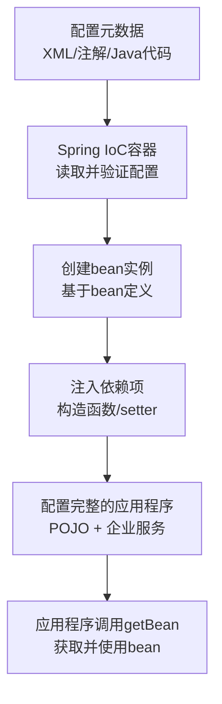
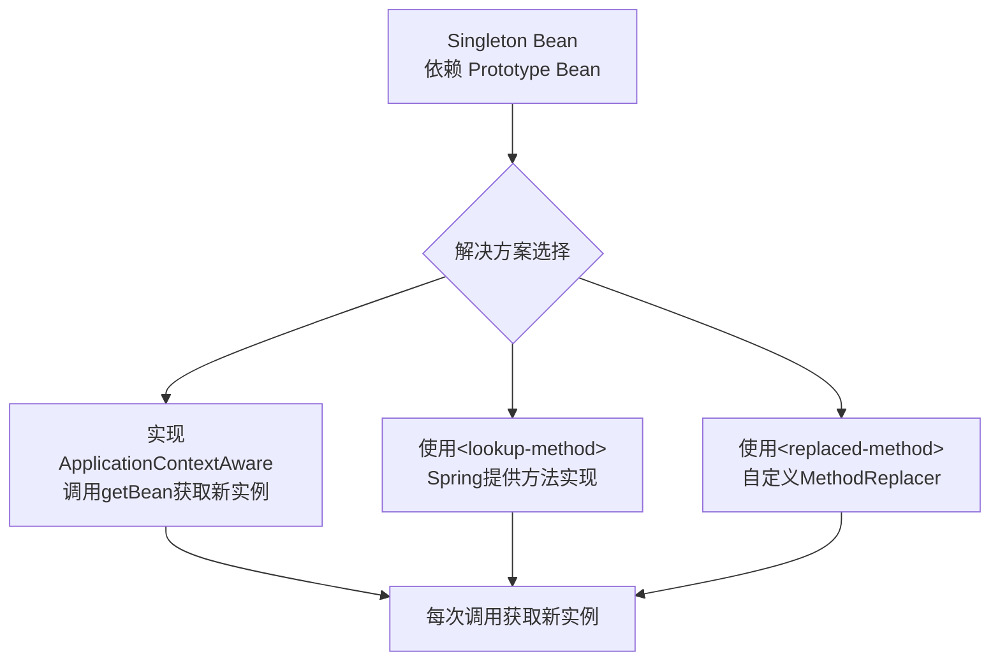
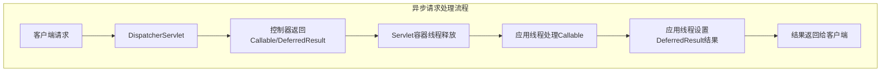
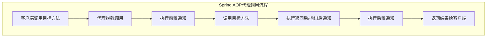

# 《Spring学习指南（第3版）》章节总结

## 书籍信息

- **书名**：Spring学习指南（第3版）
- **作者**：[印度] J.夏尔马（J.Sharma）、阿西施·萨林（Ashish Sarin）
- **译者**：周密
- **出版社**：人民邮电出版社
- **ISBN**：978-7-115-48237-2
- **出版时间**：2018年7月第1版
- **PDF状态**：完整（分4个文件）
- **OCR状态**：已识别，存在少量页码标记和图像占位符，但正文文本完整可读

## 目录说明

- **目录识别情况**：完整识别，共16章 + 2个附录
- **章节对应依据**：基于PDF中的目录页（第10-12页）
- **OCR修复说明**：部分页码标记、图片占位符（如`image[[x, y, w, h]]`）已保留或转换，正文内容完整

## 全书核心主题

本书是Spring框架的入门指南，系统介绍了Spring框架的设计思想、模块构成及实际应用。全书从Spring IoC容器和依赖注入的基本概念入手，逐步深入到bean配置、注解驱动开发、数据库交互、事务管理、AOP、Spring Web MVC、RESTful Web服务、Spring Security等核心模块。本书通过MyBank示例应用程序贯穿始终，演示了Spring框架在实际项目中的应用方式。作者强调“面向接口编程”、非侵入式设计和POJO开发等核心理念，旨在帮助读者掌握Spring框架并能将其应用于企业级Java开发。

---

## 第1章：Spring框架简介

### 1. 核心论点

本章主要解决“为什么要使用Spring框架”以及“Spring框架是什么”的问题。作者认为：Spring框架通过提供依赖注入（DI）和控制反转（IoC）容器，简化了Java企业级应用的开发，让开发者只需专注于业务逻辑，从而提高生产效率。Spring是一个非侵入式框架，支持以POJO形式开发应用。

### 2. 关键概念/事件

- **IoC/DI**：控制反转（Inversion of Control）和依赖注入（Dependency Injection）。Spring IoC容器负责创建应用程序对象并注入其依赖项，而不是由对象自身创建依赖。DI也称为IoC。
- **Spring IoC容器**：负责创建和管理应用对象（称为bean）的Spring核心组件。它读取配置元数据（XML、注解或Java代码），实例化对象并注入依赖。
- **POJO（Plain Old Java Object）**：简单的Java对象，不实现或继承框架特定的接口或类。Spring容器可以将企业服务（事务、安全等）透明地应用到POJO上。
- **Spring模块**：Spring框架由多个模块组成，包括Core Container（核心容器）、AOP、Messaging、Data Access/Integration、Web和Test等模块。
- **声明式事务管理**：使用`@Transactional`注解声明事务，由Spring透明地管理事务，无需编写事务管理API代码。

### 3. 逻辑推演/叙事脉络

本章首先介绍了Spring框架的模块构成（表1-1）和模块依赖关系（图1-1）。然后深入解释Spring IoC容器的概念和工作原理（图1-2）：配置元数据 → Spring容器 → 配置完整的应用程序。接着，通过多个示例（声明式事务、安全、JMX、JMS、缓存）说明使用Spring框架的好处。最后，通过一个简单的独立Spring应用程序（MyBank示例），完整演示了：1）确定应用对象及其依赖；2）创建POJO类；3）创建配置元数据（XML）；4）创建Spring容器实例；5）从容器访问bean。整个过程展示了基于setter的DI的工作原理（图1-5、1-6、1-7）。

### 4. 流程图



### 5. 经典金句/数据

> “Spring框架的核心是提供了依赖注入（Dependency Injection，DI）机制的控制翻转（Inversion of Control，IoC）容器。” (p.13)

> “Spring是一个非侵入性的框架，因为它不需要应用对象依赖于Spring特定的类或接口。” (p.16)

> “Spring负责应用程序对象的创建并注入它们的依赖项，简化了Java应用程序的组成。” (p.15)

---

## 第2章：Spring框架基础

### 1. 核心论点

本章深入Spring的基础概念，主要解决如何提高应用程序的可测试性和如何灵活创建bean的问题。作者观点：采用“面向接口编程”的设计方法可以实现类之间的松耦合，提高可测试性；Spring支持通过静态/实例工厂方法创建bean，支持基于构造函数的DI，并提供了singleton和prototype两种bean作用域。

### 2. 关键概念/事件

- **面向接口编程**：类依赖于其依赖项实现的接口，而非具体实现类。这样可以在替换依赖实现时无需修改依赖类，并便于单元测试（可以使用模拟对象）。
- **静态/实例工厂方法**：Spring可以调用类的静态工厂方法或实例工厂方法来创建bean，而不是仅通过构造函数。使用`factory-method`和`factory-bean`属性配置。
- **基于构造函数的DI**：将依赖项作为参数传递给bean类的构造函数，使用`<constructor-arg>`元素配置。
- **singleton作用域**：默认作用域。Spring容器为每个bean定义创建唯一实例，该实例由所有依赖它的bean共享。在创建Spring容器时创建（可通过`lazy-init="true"`延迟初始化）。
- **prototype作用域**：每次从Spring容器请求时都会创建一个新的bean实例。总是延迟初始化。

### 3. 逻辑推演/叙事脉络

本章从“面向接口编程”开始（图2-1、2-2），说明为何这是一种更优的设计实践，并通过MyBank示例展示其应用（图2-3）。接着介绍Spring如何通过静态工厂方法（程序示例2-3、2-4）和实例工厂方法（程序示例2-6、2-7）创建bean，以及如何为工厂方法创建的bean注入依赖。然后介绍基于构造函数的DI（程序示例2-14、2-15），并与基于setter的DI对比。最后详细介绍bean的作用域：singleton（图2-4、2-5、2-6、2-7）和prototype（程序示例2-28、2-29），并给出选择适当作用域的建议——无状态用singleton，有状态用prototype。

### 4. 经典金句/数据

> “如果一个bean不会保持任何会话状态（也就是说，它是无状态的），那么它应该定义为一个singleton范围的bean。如果一个bean保持对话状态，它应该定义为一个prototype范围的bean。” (p.35)

> “Spring容器确保在调用setter方法之前完全配置了一个bean的依赖关系。” (p.13)

> “实现ApplicationContextAware接口的缺点在于它将bean类与Spring Framework相耦合。” (p.87)

---

## 第3章：bean的配置

### 1. 核心论点

本章全面介绍Spring bean配置的各种高级技术，解决如何编写更简洁、更模块化、更灵活的bean定义的问题。作者观点：通过bean定义的继承可以减少冗余配置；通过p命名空间和c命名空间可以编写更简洁的bean定义；Spring的util模式简化了集合类型的配置；FactoryBean接口提供了创建复杂对象的工厂机制。

### 2. 关键概念/事件

- **bean定义的继承**：子bean定义可以从父bean定义继承属性、构造函数参数、方法覆盖等配置信息。使用`parent`属性指定父bean，抽象父bean（`abstract="true"`）不会被实例化。
- **p命名空间和c命名空间**：分别用于简化bean属性和构造函数参数的配置，将属性/参数作为`<bean>`元素的属性而非子元素。
- **util模式**：Spring的util模式提供`<list>`、`<map>`、`<set>`、`<properties>`、`<constant>`、`<property-path>`等元素，用于创建集合类型实例并将其暴露为bean。
- **PropertyEditor**：Spring内置属性编辑器，用于将XML中的字符串值转换为Java类型的属性（如将字符串转为`java.util.Date`、`java.util.Currency`等）。`CustomDateEditor`需要显式注册。
- **FactoryBean接口**：实现此接口的类可以创建复杂的bean实例。`getObject()`方法返回创建的bean，`getObjectType()`返回类型，`isSingleton()`指定是否为单例。

### 3. 逻辑推演/叙事脉络

本章首先介绍bean定义继承，通过MyBank示例展示如何使用`abstract`父bean和`parent`属性减少重复配置（图3-1、3-2、3-3）。然后介绍构造函数参数匹配的方式：基于类型、基于名称（需要调试信息或`@ConstructorProperties`）。接着详细说明如何配置不同类型的属性和构造函数参数：基本类型、集合类型（`<list>`、`<set>`、`<map>`、`<props>`）、数组、null值等。介绍Spring内置的PropertyEditor（`CustomCollectionEditor`、`CustomMapEditor`、`CustomDateEditor`等）及其注册方式（通过`PropertyEditorRegistrar`和`CustomEditorConfigurer`）。随后介绍p命名空间和c命名空间的简洁语法。然后详细介绍util模式的各种元素及其用法。最后介绍`FactoryBean`接口，通过EventSenderFactoryBean示例展示如何使用工厂bean创建复杂的对象实例（图3-7）。

### 4. 经典金句/数据

> “子bean定义从父bean定义继承以下配置信息：属性、构造函数参数、方法覆盖、初始化和销毁方法、工厂方法。” (p.38)

> “内部bean总是prototype范围。” (p.76)

> “建议你选择一种用于指定bean属性的样式，并始终使用它。” (p.62)

---

## 第4章：依赖注入

### 1. 核心论点

本章深入DI的高级话题，解决现实应用中依赖注入的复杂场景问题。作者观点：内部bean适用于不被共享的依赖；`depends-on`可以控制隐式依赖的初始化顺序；singleton bean依赖prototype bean时需要特殊处理（通过`ApplicationContextAware`、`<lookup-method>`或`<replaced-method>`）；自动装配可以简化配置，但会隐藏应用结构。

### 2. 关键概念/事件

- **内部bean**：在`<property>`或`<constructor-arg>`元素内定义的`<bean>`元素，只能由包含它的bean访问，匿名且为prototype范围。
- **depends-on**：`<bean>`元素的`depends-on`特性用于指定隐式依赖项，确保在创建当前bean之前先创建依赖的bean。
- **方法注入**：通过`<lookup-method>`或`<replaced-method>`元素，让singleton bean在每次方法调用时获取新的prototype bean实例。
- **`<lookup-method>`**：为抽象或具体方法提供实现，该方法从Spring容器获取指定名称的bean并返回。
- **`<replaced-method>`**：用实现了`MethodReplacer`接口的类的方法替换bean类中的方法。
- **自动装配**：Spring自动解析bean依赖项的方式。`autowire`特性可选值：`byType`（按类型）、`byName`（按名称）、`constructor`（按构造函数参数类型）、`default`/`no`（禁用）。

### 3. 逻辑推演/叙事脉络

本章首先介绍内部bean（程序示例4-2），说明其适用场景。然后通过EventSenderSelectorServiceImpl和FixedDepositServiceImpl的隐式依赖问题，说明`depends-on`特性的作用（程序示例4-4至4-7）。接着分析singleton bean依赖prototype bean的问题（图4-2）：singleton bean在整个生命周期中只注入一次prototype bean实例。解决方案有三种：1）实现`ApplicationContextAware`接口，通过`getBean()`显式获取（程序示例4-14）；2）使用`<lookup-method>`元素（程序示例4-15、4-16）；3）使用`<replaced-method>`元素配合`MethodReplacer`（程序示例4-18至4-22）。最后详细介绍自动装配的四种模式（byType、constructor、byName、default/no）及其局限性，以及如何通过`autowire-candidate`、`primary`等特性控制自动装配行为。

### 4. 流程图



### 5. 经典金句/数据

> “singleton范围的bean实例在依赖它的bean之间共享。” (p.30)

> “singleton范围bean实例的范围仅限于Spring容器实例。” (p.31)

> “不推荐在大型应用中使用自动装配。” (p.97)

> “实现ApplicationContextAware接口的缺点在于它将bean类与Spring Framework相耦合。” (p.87)

---

## 第5章：自定义bean和bean定义

### 1. 核心论点

本章解决如何自定义bean的初始化和销毁逻辑，以及如何与Spring容器管理的bean进行交互的问题。作者观点：通过`init-method`和`destroy-method`可以指定自定义的生命周期方法；`BeanPostProcessor`允许在bean初始化前后与bean实例交互；`BeanFactoryPostProcessor`允许在bean实例化前修改bean定义。

### 2. 关键概念/事件

- **`init-method` / `destroy-method`**：`<bean>`元素的特性，指定bean初始化和销毁时调用的自定义方法。可通过`default-init-method`/`default-destroy-method`设置默认值。
- **`@PostConstruct` / `@PreDestroy`**：JSR 250注释，标识初始化和销毁方法。需要配置`CommonAnnotationBeanPostProcessor`。
- **`BeanPostProcessor`**：允许在Spring容器调用bean初始化方法之前和/或之后与新创建的bean实例交互。定义`postProcessBeforeInitialization`和`postProcessAfterInitialization`方法。
- **`BeanFactoryPostProcessor`**：在Spring容器加载bean定义之后、任何bean实例创建之前执行，允许修改bean定义。定义`postProcessBeanFactory`方法。
- **`PropertySourcesPlaceholderConfigurer`**：一个`BeanFactoryPostProcessor`实现，允许在外部属性文件中指定bean属性的值，bean定义中使用`${...}`占位符。
- **`PropertyOverrideConfigurer`**：允许在外部属性文件中以`<bean-name>.<property-name>=<value>`格式覆盖bean属性的值。

### 3. 逻辑推演/叙事脉络

本章首先介绍如何使用`init-method`和`destroy-method`自定义初始化和销毁逻辑（程序示例5-1至5-3），以及如何在独立应用中通过`registerShutdownHook()`确保销毁方法被调用（图5-4、5-5）。然后介绍`@PostConstruct`和`@PreDestroy`注释（程序示例5-7、5-8）。接着深入`BeanPostProcessor`接口，通过InstanceValidationBeanPostProcessor（程序示例5-11）和DependencyResolutionBeanPostProcessor（程序示例5-15）两个示例，展示如何使用`BeanPostProcessor`验证bean实例和解析依赖。然后介绍`BeanFactoryPostProcessor`接口，通过ApplicationConfigurer示例展示如何修改bean定义：禁用自动装配并检测singleton bean依赖prototype bean的问题（程序示例5-22、5-23）。最后介绍Spring内置的`BeanFactoryPostProcessor`实现：`PropertySourcesPlaceholderConfigurer`（程序示例5-25至5-31）和`PropertyOverrideConfigurer`（程序示例5-32至5-34）。

### 4. 流程图

```mermaid
graph TD
    subgraph BeanFactoryPostProcessor执行时机
        A[加载bean定义] --> B[执行BeanFactoryPostProcessor]
        B --> C[创建bean实例]
    end
    
    subgraph BeanPostProcessor执行时机（针对单个bean）
        D[调用构造函数创建实例] --> E[设置属性]
        E --> F[postProcessBeforeInitialization]
        F --> G[调用init-method]
        G --> H[postProcessAfterInitialization]
        H --> I[bean完全初始化]
    end
```

### 5. 经典金句/数据

> “BeanFactoryPostProcessor在Spring容器加载bean定义之后且在任何bean实例尚未创建之前执行。” (p.114)

> “在prototype范围的bean的情况下，destroy-method特性会被Spring容器忽略。” (p.103)

> “BeanPostProcessor用于在Spring容器调用新创建的bean实例的初始化方法之前和/或之后，与其进行交互。” (p.105)

---

## 第6章：使用Spring进行注释驱动开发

### 1. 核心论点

本章解决如何使用注解代替XML配置Spring bean的问题。作者观点：注解驱动开发可以节省在XML中显式配置bean的工作量；`@Component`、`@Service`、`@Controller`、`@Repository`用于标识Spring bean；`@Autowired`、`@Inject`、`@Resource`用于自动装配依赖；SpEL提供强大的表达式语言能力。

### 2. 关键概念/事件

- **`@Component`**：标识一个类为Spring bean（组件）。其特化形式包括：`@Service`（服务层）、`@Controller`（Web层）、`@Repository`（DAO层）。
- **`<component-scan>`**：启用类路径扫描，自动注册使用`@Component`、`@Service`等注释的类。
- **`@Autowired` / `@Inject`**：按类型自动装配依赖项，可用于字段、构造函数和方法。`@Inject`是JSR 330标准。
- **`@Qualifier` / `@Named`**：按名称自动装配依赖项。`@Qualifier`可创建自定义限定符注释。
- **`@Value` + SpEL**：`@Value`用于为字段设置默认值，支持SpEL表达式（`#{...}`）从其他bean获取值。
- **JSR 349（Bean Validation）**：使用注释（如`@NotNull`、`@Min`、`@Max`、`@Size`）指定JavaBean的约束。Spring通过`LocalValidatorFactoryBean`集成支持。

### 3. 逻辑推演/叙事脉络

本章首先介绍`@Component`及其特化形式，以及`<component-scan>`的使用（程序示例6-1至6-4）。然后介绍`@Autowired`的三种使用方式：字段级、方法级、构造函数级（程序示例6-5至6-9）。接着介绍`@Qualifier`按名称装配及自定义限定符注释（程序示例6-10至6-18）。然后对比JSR 330的`@Inject`和`@Named`（程序示例6-19、6-20）以及JSR 250的`@Resource`（程序示例6-21、6-22）。接着介绍`@Scope`、`@Lazy`、`@DependsOn`、`@Primary`注释（表6-2）。然后深入`@Value`注释和SpEL表达式，包括数学/关系/逻辑运算符、正则表达式、列表/映射访问等（程序示例6-29至6-38）。随后介绍Spring的`Validator`接口（程序示例6-39至6-42）和JSR 349注释验证（程序示例6-43至6-51）。最后介绍bean定义配置文件（`@Profile`），通过dev/production环境切换和Hibernate/MyBatis DAO切换的示例展示其用法（程序示例6-52至6-59）。

### 4. 经典金句/数据

> “从Spring 4.3开始，如果bean类只定义了一个构造函数，则不需要使用`@Autowired`来注释构造函数。默认情况下，Spring容器将处理构造函数参数的自动装配。” (p.130)

> “@Resource注释的name特性指定要自动装配的bean的名称。注意，不能使用`@Resource`注释来自动装配构造函数参数和接受多个参数的方法。” (p.137)

> “SpEL是一种非常强大的表达式语言，它能提供比本书中的描述更多的功能。” (p.148)

---

## 第7章：基于Java的容器配置

### 1. 核心论点

本章解决如何使用纯Java代码（而非XML）配置Spring容器的问题。作者观点：`@Configuration`和`@Bean`注释提供了一种类型安全、重构友好的配置方式；`@Import`用于模块化配置；`@Profile`用于条件化配置；`@Enable*`注释（如`@EnableTransactionManagement`）用于启用特定功能。

### 2. 关键概念/事件

- **`@Configuration`**：标识一个类包含一个或多个`@Bean`方法。该类会被CGLIB子类化，以确保`@Bean`方法返回单例实例。
- **`@Bean`**：标注在方法上，表示该方法创建并返回一个由Spring容器管理的bean实例。`name`属性指定bean名称。
- **`AnnotationConfigApplicationContext`**：基于Java配置的Spring容器实现。可注册`@Configuration`类并刷新容器。
- **`@Import`**：在一个`@Configuration`类中导入其他`@Configuration`类，实现配置模块化。
- **`@ImportResource`**：在`@Configuration`类中导入XML配置文件，使XML中定义的bean可用。
- **`@EnableTransactionManagement`**、**`@EnableJpaRepositories`**等：启用Spring特定功能的`@Enable*`注释。

### 3. 逻辑推演/叙事脉络

本章首先介绍`@Configuration`和`@Bean`的基本用法（程序示例7-1至7-5），以及如何在`@Configuration`类中注入bean依赖项（通过调用`@Bean`方法、方法参数、`@Autowired`三种方式）（程序示例7-6至7-9）。然后介绍`AnnotationConfigApplicationContext`的使用（程序示例7-10至7-13）。接着介绍生命周期回调：`@PostConstruct`、`@PreDestroy`、`@Bean`的`initMethod`/`destroyMethod`特性（程序示例7-14、7-15）。然后介绍如何通过`@Import`模块化配置（程序示例7-16、7-17），以及如何通过覆盖`@Bean`方法实现配置覆盖（程序示例7-19至7-21）。接着介绍如何配置`BeanPostProcessor`和`BeanFactoryPostProcessor`（`@Bean`方法需为static）（程序示例7-22）。最后详细介绍`@ImportResource`的使用（程序示例7-23、7-24）和`@Profile`在Java配置中的使用（程序示例7-25至7-30）。

### 4. 经典金句/数据

> “由于`@Configuration`注释类被CGLIB子类化，所以不能将它们定义为`final`，而且必须提供无参数的构造函数。” (p.163)

> “建议使用`@Configuration`类定义`@Bean`注释方法。” (p.164)

> “如果一个bean实现了`ApplicationContextAware`接口，它可以使用`ApplicationContext`的`getBean`方法以编程方式获取bean实例。实现`ApplicationContextAware`接口会使应用程序代码与Spring耦合，因此，建议不要实现`ApplicationContextAware`接口。” (p.109)

---

## 第8章：使用Spring进行数据库交互

### 1. 核心论点

本章解决如何使用Spring简化数据库交互的问题。作者观点：Spring的JDBC模块（`JdbcTemplate`、`NamedParameterJdbcTemplate`、`SimpleJdbcInsert`）处理了连接管理和异常转换等样板代码；Spring支持声明式事务管理（`@Transactional`）和编程式事务管理（`TransactionTemplate`）；可以与Hibernate等ORM框架无缝集成。

### 2. 关键概念/事件

- **`JdbcTemplate`**：Spring JDBC的核心类，管理`Connection`、`Statement`、`ResultSet`，处理异常转换。线程安全，可共享。
- **`NamedParameterJdbcTemplate`**：支持SQL中使用命名参数（`:paramName`）而非`?`占位符。
- **`SimpleJdbcInsert`**：利用数据库元数据简化INSERT操作。
- **`DataSourceTransactionManager`**：用于管理JDBC事务的`PlatformTransactionManager`实现。
- **`@Transactional`**：声明式事务管理注解。可通过`rollbackFor`、`isolation`、`propagation`等属性配置事务行为。
- **`LocalSessionFactoryBean`**：用于创建Hibernate `SessionFactory`的FactoryBean。

### 3. 逻辑推演/叙事脉络

本章首先介绍MyBank应用程序的需求和数据库表结构（图8-1）。然后使用Spring JDBC模块开发：配置`BasicDataSource`（程序示例8-1）、`JdbcTemplate`（程序示例8-3）、`NamedParameterJdbcTemplate`（程序示例8-6）和`SimpleJdbcInsert`（程序示例8-8）。接着介绍使用Hibernate开发：配置`LocalSessionFactoryBean`（程序示例8-10、8-11）和使用Hibernate API的DAO（程序示例8-12）。然后重点介绍事务管理：编程式事务管理（`TransactionTemplate`）（程序示例8-13、8-14）；声明式事务管理（`<tx:annotation-driven>`和`@Transactional`）（程序示例8-16至8-18）；JTA事务管理（`JtaTransactionManager`和`<jta-transaction-manager>`）（图8-3）。最后介绍基于Java配置的数据库交互（程序示例8-20至8-22）。

### 4. 流程图

```mermaid
graph TD
    subgraph 声明式事务管理流程
        A[@Transactional方法] --> B[Spring AOP代理拦截]
        B --> C[事务管理器开始事务]
        C --> D[执行业务方法]
        D --> E{是否抛出RuntimeException?}
        E -->|是| F[事务回滚]
        E -->|否| G[事务提交]
    end
```

### 5. 经典金句/数据

> “Spring的JDBC模块通过处理开放和关闭连接的低层细节、管理事务、处理异常等工作来简化与数据源的交互。” (p.183)

> “编程式事务管理将应用程序代码与Spring特定的类相耦合。此外，声明式事务管理要求仅使用Spring的`@Transactional`注释来注释方法或类。” (p.195)

---

## 第9章：Spring Data

### 1. 核心论点

本章解决如何使用Spring Data简化数据访问层的开发问题。作者观点：Spring Data通过Repository接口抽象，减少了实现数据访问层所需的样板代码；只需定义接口并继承`Repository`、`CrudRepository`或`PagingAndSortingRepository`，Spring Data会自动提供实现；支持JPA、MongoDB等多种数据存储。

### 2. 关键概念/事件

- **`Repository`接口**：标记接口，Spring Data会自动创建其代理实现。`CrudRepository`提供CRUD操作，`PagingAndSortingRepository`提供分页和排序。
- **查询方法**：根据方法名派生查询，如`findByTenureLessThan`。支持`And`、`Or`、`LessThan`、`GreaterThan`等关键字。
- **`@Query`**：在查询方法上显式指定JPQL或SQL查询。
- **`@EnableJpaRepositories` / `<jpa:repositories>`**：启用Spring Data JPA，指定扫描Repository接口的包。
- **Querydsl集成**：通过`QueryDslPredicateExecutor`接口，可使用类型安全的Querydsl构建查询。
- **按示例查询（QBE）**：通过`Example`对象，使用填充的实体实例作为查询条件。

### 3. 逻辑推演/叙事脉络

本章首先介绍Spring Data的核心概念和接口：`Repository`、`CrudRepository`、`PagingAndSortingRepository`（图9-1）。然后通过FixedDepositRepository示例展示如何定义Repository接口、声明查询方法、使用`@RepositoryDefinition`、声明count/delete变体（程序示例9-2至9-5）。接着介绍Spring Data的工作原理（图9-2）：为每个Repository接口创建代理，将调用委托给默认实现。然后介绍如何提供自定义实现（`<接口名>Impl`类）（程序示例9-6）和添加自定义方法（程序示例9-7至9-9）。随后详细介绍Spring Data JPA的配置（`@EnableJpaRepositories`和`LocalContainerEntityManagerFactoryBean`）（程序示例9-10至9-13）。然后深入查询方法的多种用法：限制结果数量、排序、基于多个特性的查询、分页（`Pageable`、`Page`、`Slice`）、流式查询、异步查询（`@Async` + `CompletableFuture`）（程序示例9-14至9-17）。接着介绍Querydsl的使用（程序示例9-18至9-22）和按示例查询（QBE）（程序示例9-23、9-24）。最后介绍Spring Data MongoDB：域实体建模（`@Document`、`@Id`）、配置（`@EnableMongoRepositories`）、自定义Repository（程序示例9-29至9-33）。

### 4. 经典金句/数据

> “Spring Data提供了一个抽象层，减少了实现数据访问层所需的样板代码量。” (p.202)

> “Spring Data创建一个与在应用程序中定义的每个存储库接口相对应的代理。” (p.206)

> “Page包含查询返回的结果和数据存储中实体的总数。使用Page<T>的缺点是导致执行额外的查询以查找数据存储中的实体总数。” (p.212)

---

## 第10章：使用Spring进行消息传递、电子邮件发送、异步方法执行和缓存

### 1. 核心论点

本章解决企业级应用中的常见需求：消息传递、邮件发送、异步任务和缓存。作者观点：Spring通过`JmsTemplate`简化JMS消息发送和接收；通过`MailSender`和`JavaMailSender`简化邮件发送；通过`@Async`和`@Scheduled`简化异步执行和任务调度；通过`@Cacheable`、`@CacheEvict`等注解简化缓存操作。

### 2. 关键概念/事件

- **`JmsTemplate`**：简化JMS消息发送和同步接收。支持事务性JMS会话和消息转换。
- **`@JmsListener`**：标注方法作为消息监听器，异步接收JMS消息。
- **`JavaMailSender` / `MailSender`**：邮件发送接口。`JavaMailSenderImpl`是具体实现。
- **`@Async`**：标注方法异步执行。需配合`<task:annotation-driven>`或`@EnableAsync`。
- **`@Scheduled`**：标注方法按计划执行（fixedRate、fixedDelay、cron）。
- **`@Cacheable`**：标注方法返回值被缓存。`cacheNames`指定缓存区域，`key`指定缓存键。
- **`@CacheEvict`**：标注方法执行时清除缓存。`allEntries`清除所有条目，`beforeInvocation`指定清除时机。

### 3. 逻辑推演/叙事脉络

本章首先介绍MyBank应用程序的需求（图10-1、10-2）。然后详细讲解JMS消息发送：配置内嵌ActiveMQ代理（程序示例10-1）、`ConnectionFactory`（程序示例10-2）、`JmsTemplate`（程序示例10-3）和`JmsTransactionManager`（程序示例10-4），使用`JmsTemplate`发送消息（程序示例10-5）。接着介绍接收JMS消息：使用消息监听器容器（`<jms:listener-container>`）（程序示例10-10）和`MessageListener`实现（程序示例10-11）；使用`@JmsListener`简化配置（程序示例10-12、10-13）；使用spring-messaging模块的抽象（`JmsMessagingTemplate`、`Message`等）（程序示例10-14至10-16）。然后介绍邮件发送：配置`JavaMailSenderImpl`和`SimpleMailMessage`（程序示例10-17、10-19），使用`MailSender`发送简单邮件（程序示例10-21），使用`JavaMailSender`和`MimeMessageHelper`发送MIME邮件（程序示例10-22）。接着介绍任务调度和异步执行：`TaskExecutor`和`TaskScheduler`接口，使用`<task:executor>`和`<task:scheduled-tasks>`（程序示例10-24至10-28），以及`@Async`和`@Scheduled`注解（程序示例10-29至10-31）。最后介绍缓存：配置`CacheManager`（程序示例10-32），使用`@Cacheable`、`@CacheEvict`、`@CachePut`（程序示例10-34至10-36），以及使用cache模式配置缓存（程序示例10-37、10-38）。

### 4. 流程图



### 5. 经典金句/数据

> “Spring的缓存抽象屏蔽了开发人员和直接处理底层缓存实现的API。” (p.248)

> “@Async注释方法的返回类型可以是void或Future实例。” (p.247)

> “@Scheduled注释的方法必须返回void并且在定义中不能接受任何参数。” (p.248)

---

## 第11章：面向切面编程

### 1. 核心论点

本章解决如何将横切关注点（日志、事务、安全等）从业务逻辑中分离的问题。作者观点：AOP将分布在多个类中的职责封装到单独的“切面”中；Spring AOP是基于代理的，支持AspectJ注解样式和XML模式样式；切入点表达式用于标识通知适用的方法。

### 2. 关键概念/事件

- **切面（Aspect）**：封装横切关注点的类。使用`@Aspect`注解标识。
- **通知（Advice）**：切面中的具体实现。类型包括：`@Before`（前置）、`@AfterReturning`（返回后）、`@AfterThrowing`（抛出后）、`@After`（后置）、`@Around`（环绕）。
- **切入点（Pointcut）**：标识通知适用的方法。使用`@Pointcut`定义可重用的切入点表达式。
- **连接点（JoinPoint）**：通知适用的具体方法。
- **代理（Proxy）**：Spring AOP为每个目标对象创建代理，代理拦截方法调用并执行通知。
- **`<aop:aspectj-autoproxy>`**：启用AspectJ注解样式支持。

### 3. 逻辑推演/叙事脉络

本章首先通过一个简单的日志记录示例展示AOP的使用（程序示例11-1、11-2）。然后解释Spring AOP的工作原理（图11-1）：为每个目标对象创建代理，代理拦截方法调用并执行通知。接着介绍代理的创建方式：`<aop:aspectj-autoproxy>`启用自动代理，`proxy-target-class`决定使用JDK代理还是CGLIB代理。然后介绍`expose-proxy`特性的作用：使目标对象内部的方法调用也能通过代理进行（程序示例11-4、11-5）。接着深入切入点表达式：`execution`、`args`、`bean`、`@annotation`等切入点指示符，以及如何将目标方法参数传递给通知（程序示例11-6、11-7）。然后详细介绍五种通知类型：`@Before`、`@AfterReturning`、`@AfterThrowing`、`@After`、`@Around`（程序示例11-8至11-11）。最后介绍XML模式样式：将普通Java类配置为切面，使用`<aop:config>`、`<aop:aspect>`、`<aop:before>`等元素（程序示例11-12至11-15）。

### 4. 流程图



### 5. 经典金句/数据

> “Spring AOP框架是基于代理的；将为作为通知的目标对象创建一个代理对象。” (p.258)

> “AOP代理不会代理目标对象本身调用的方法。” (p.260)

> “围绕通知可以控制目标方法是否被执行。” (p.268)

---

## 第12章：Spring Web MVC基础知识

### 1. 核心论点

本章解决如何使用Spring Web MVC框架开发Web应用程序的问题。作者观点：`DispatcherServlet`作为前端控制器；`@Controller`和`@RequestMapping`用于创建带注释的控制器；`@RequestParam`用于绑定请求参数；`@ExceptionHandler`用于集中处理异常。Spring Web MVC是一种非侵入式框架。

### 2. 关键概念/事件

- **`DispatcherServlet`**：前端控制器，拦截请求并委派给适当的控制器。通过`web.xml`配置。
- **`HandlerMapping`**：将请求URL映射到控制器。`SimpleUrlHandlerMapping`是最简单的实现。
- **`ViewResolver`**：将逻辑视图名解析为实际视图。`InternalResourceViewResolver`用于JSP。
- **`@Controller`**：标识一个类为控制器。会被`<component-scan>`自动注册。
- **`@RequestMapping`**：将请求映射到控制器类或方法。支持指定HTTP方法（`method`）、请求参数（`params`）、请求头（`headers`）等条件。
- **`@RequestParam`**：将请求参数绑定到方法参数。
- **`@ExceptionHandler`**：标识处理控制器抛出的异常的方法。

### 3. 逻辑推演/叙事脉络

本章首先介绍示例Web项目的目录结构（图12-1）。然后通过“Hello World”Web应用程序详细讲解：`HelloWorldController`实现`Controller`接口（程序示例12-1）、`myapp-config.xml`配置`SimpleUrlHandlerMapping`和`InternalResourceViewResolver`（程序示例12-3）、`web.xml`配置`DispatcherServlet`（程序示例12-4）。图解了请求处理流程（图12-4、12-5）。然后介绍`DispatcherServlet`作为前端控制器的角色、`WebApplicationContext`的层次结构（图12-6）以及`ServletContextAware`/`ServletConfigAware`。接着重点介绍使用`@Controller`和`@RequestMapping`的注解控制器（程序示例12-6、12-7）。然后详细介绍`@RequestMapping`的各种特性：`method`（HTTP方法）、`params`（请求参数）、`consumes`/`produces`（MIME类型）、`headers`（请求头），以及`@RequestMapping`方法的参数和返回类型。介绍`@RequestParam`的用法（程序示例12-28至12-34）。然后介绍MyBank Web应用程序的验证实现（程序示例12-35至12-38）。最后介绍`@ExceptionHandler`（程序示例12-39、12-40）和`ContextLoaderListener`加载根Web应用程序上下文（程序示例12-41）。

### 4. 经典金句/数据

> “Spring Web MVC是一种非侵入式框架，可以清晰地分离构成Web层的应用程序对象之间的关系。” (p.273)

> “从Spring4.3开始，如果bean类只定义了一个构造函数，则不需要使用`@Autowired`来注释构造函数。” (p.130，与第12章内容相关但出现于第6章)

---

## 第13章：Spring Web MVC中的验证和数据绑定

### 1. 核心论点

本章解决如何简化表单数据的绑定和验证问题。作者观点：`@ModelAttribute`用于添加和获取模型特性；`@SessionAttributes`用于跨请求缓存模型特性；`WebDataBinder`负责将请求参数绑定到表单后台对象；Spring的`Validator`接口和JSR 349注解用于验证；Spring的form标签库简化JSP表单编写。

### 2. 关键概念/事件

- **`@ModelAttribute`**：方法级用于向Model添加模型特性；参数级用于从Model获取模型特性并绑定到方法参数。
- **`@SessionAttributes`**：将指定名称的模型特性临时存储在`HttpSession`中，跨请求共享。通过`SessionStatus.setComplete()`清除。
- **`WebDataBinder`**：负责将请求参数绑定到表单后台对象。可通过`@InitBinder`方法配置。
- **`BindingResult`**：存储数据绑定和验证错误的结果。必须紧跟在对应的模型特性参数之后。
- **`@Valid`**：JSR 349注解，触发模型特性的自动验证。
- **Spring form标签库**：提供`<form:form>`、`<form:input>`、`<form:errors>`等标签，简化表单绑定和错误显示。

### 3. 逻辑推演/叙事脉络

本章首先介绍`@ModelAttribute`在方法上的使用（添加模型特性）（程序示例13-1至13-6）和在参数上的使用（获取模型特性）（程序示例13-9）。图解了`@ModelAttribute`和`@RequestMapping`方法的调用顺序（图13-1）。然后介绍`@SessionAttributes`的使用（程序示例13-11、13-12），以及`SessionStatus.setComplete()`的作用。接着深入数据绑定：`WebDataBinder`的工作原理（图13-3），三种配置方式：`@InitBinder`方法（程序示例13-16）、`WebBindingInitializer`（程序示例13-17、13-18）、`@ControllerAdvice`中的`@InitBinder`（表13.3）。介绍`setAllowedFields`/`setDisallowedFields`防止字段非法绑定（程序示例13-20）。介绍`BindingResult`的使用（程序示例13-21至13-23）。然后介绍验证：使用Spring的`Validator`接口（程序示例13-24至13-26）；使用JSR 349注解（程序示例13-27至13-30）。接着介绍Spring form标签库的使用（程序示例13-31、表13.5）。最后介绍基于Java配置的Web应用程序（`@EnableWebMvc`、`WebMvcConfigurerAdapter`、`AbstractAnnotationConfigDispatcherServletInitializer`）（程序示例13-32至13-34）。

### 4. 经典金句/数据

> “强烈建议指定允许或禁止参与数据绑定过程的模型特性的字段，否则可能会损害应用程序的安全性。” (p.314)

> “@SessionAttributes注释的names特性指定了临时存储在HttpSession中的模型特性的名称。” (p.307)

> “BindingResult参数必须紧跟在模型特性参数之后。” (p.316)

---

## 第14章：使用Spring Web MVC开发RESTful Web服务

### 1. 核心论点

本章解决如何使用Spring Web MVC开发RESTful Web服务的问题。作者观点：RESTful Web服务通过URI标识资源，使用HTTP方法（GET、POST、PUT、DELETE）表示操作；`@RestController`是`@Controller`+`@ResponseBody`的组合；`ResponseEntity`用于控制HTTP响应状态和头；`RestTemplate`和`AsyncRestTemplate`用于客户端访问。

### 2. 关键概念/事件

- **`@RestController`**：`@Controller`和`@ResponseBody`的组合，所有`@RequestMapping`方法都隐式使用`@ResponseBody`。
- **`ResponseEntity<T>`**：表示完整的HTTP响应，包含状态码、头和体。`HttpEntity`是不包含状态码的基类。
- **`@RequestBody`**：将HTTP请求体绑定到方法参数。
- **`@ResponseBody`**：将方法返回值写入HTTP响应体。
- **`@PathVariable`**：将URI模板变量绑定到方法参数。
- **`@MatrixVariable`**：将URI中的矩阵变量（`;name=value`）绑定到方法参数。
- **`RestTemplate` / `AsyncRestTemplate`**：客户端访问RESTful Web服务的模板类。支持同步/异步调用。

### 3. 逻辑推演/叙事脉络

本章首先介绍REST架构风格和RESTful Web服务的基本概念（图14-1、14-2）。然后通过FixedDepositWS示例展示实现细节：`@Controller`和`@RequestMapping`将HTTP方法映射到方法（表14.2）；使用`ResponseEntity`返回响应（程序示例14-4）；使用`@ResponseBody`（程序示例14-8）；使用`@RequestBody`（程序示例14-9）；使用`@ResponseStatus`（程序示例14-10）；使用`@ExceptionHandler`处理异常（程序示例14-11）。然后介绍客户端访问：配置`RestTemplate`和自定义错误处理器（程序示例14-12、14-13）；使用`exchange`方法发送请求（程序示例14-15）；使用`postForEntity`发送POST请求（程序示例14-16）；异步访问使用`AsyncRestTemplate`和`ListenableFuture`（程序示例14-19、14-20）。接着介绍`HttpMessageConverter`的作用（表14.3）和默认注册的转换器。最后介绍`@PathVariable`（程序示例14-21至14-25）和`@MatrixVariable`（程序示例14-26、14-27）。

### 4. 经典金句/数据

> “在RESTful Web服务中，客户端用于与资源交互的HTTP方法指示了要在资源上执行的操作。GET获取资源状态，POST创建一个新资源，PUT修改资源状态，DELETE删除资源。” (p.329)

> “应该使用`ResponseEntity`（或`HttpEntity`）对象来提高控制器的可测试性，而不是直接将响应写入`HttpServletResponse`。” (p.333)

---

## 第15章：Spring Web MVC进阶——国际化、文件上传和异步请求处理

### 1. 核心论点

本章解决Web应用中的高级需求：请求拦截、国际化、异步请求处理、类型转换/格式化和文件上传。作者观点：`HandlerInterceptor`可以对请求进行预处理和后处理；`LocaleResolver`和`MessageSource`支持国际化；`Callable`和`DeferredResult`支持异步请求处理；`Formatter`接口提供比`PropertyEditor`更好的类型格式化能力。

### 2. 关键概念/事件

- **`HandlerInterceptor`**：拦截请求，实现`preHandle`、`postHandle`、`afterCompletion`方法。通过`<mvc:interceptors>`配置。
- **`LocaleResolver`**：解析用户的语言环境。`CookieLocaleResolver`将语言环境存储在cookie中。
- **`MessageSource`**：根据语言环境解析消息。`ReloadableResourceBundleMessageSource`支持热加载。
- **`Callable` / `DeferredResult`**：`@RequestMapping`方法的返回类型，支持异步请求处理。需在`web.xml`中启用`<async-supported>`。
- **`Converter<S,T>`**：类型转换器，将S类型转换为T类型。
- **`Formatter<T>`**：格式化器，将T类型与String相互转换，支持本地化。

### 3. 逻辑推演/叙事脉络

本章首先介绍`HandlerInterceptor`的实现和配置（程序示例15-1至15-3）。然后介绍国际化：配置`CookieLocaleResolver`、`ReloadableResourceBundleMessageSource`和`LocaleChangeInterceptor`（程序示例15-4），通过`lang`请求参数切换语言环境（程序示例15-5）。接着介绍异步请求处理：配置`<async-supported>`（程序示例15-6）；返回`Callable`（程序示例15-7）；返回`DeferredResult`（程序示例15-8至15-12）；设置默认超时（程序示例15-13）；配置拦截器（程序示例15-14）。然后介绍类型转换和格式化：`Converter`接口和自定义转换器（程序示例15-15、15-16）；`@RequestParam`自动使用注册的转换器（程序示例15-17）；`Formatter`接口和`AmountFormatter`示例（程序示例15-19、15-20）；`AnnotationFormatterFactory`和`@AmountFormat`自定义注解（程序示例15-21至15-23）。最后介绍文件上传：`CommonsMultipartResolver`配置（程序示例15-25）和控制器处理（程序示例15-26）；`StandardServletMultipartResolver`和`<multipart-config>`配置（程序示例15-27）。

### 4. 经典金句/数据

> “异步Web请求可以使用一个返回`java.util.concurrent.Callable`或Spring's `DeferredResult`对象的`@RequestMapping`注释方法处理。” (p.351)

> “`Formatter`接口提供了比`PropertyEditor`更强大的替代方案。” (p.362)

---

## 第16章：使用Spring Security保护应用程序

### 1. 核心论点

本章解决如何保护Spring应用程序的安全问题。作者观点：Spring Security提供全面的认证和授权功能；`<http>`元素配置Web请求安全；`@Secured`或`@PreAuthorize`实现方法级安全；ACL模块保护域对象实例；支持基于数据库的用户和权限存储。

### 2. 关键概念/事件

- **`DelegatingFilterProxy`**：将安全过滤委托给`springSecurityFilterChain` bean。
- **`<http>`**：配置Web请求安全。`<intercept-url>`定义访问规则；`<form-login>`配置登录页面；`<logout>`配置注销；`<remember-me>`配置记住我功能。
- **`<authentication-manager>`**：配置身份验证。可配置多个`AuthenticationProvider`。`<user-service>`提供内存中的用户。
- **`@Secured` / `@PreAuthorize`**：方法级安全注解。`@PreAuthorize`支持SpEL表达式（如`hasRole`、`hasPermission`）。
- **ACL（Access Control List）**：保护域对象实例。核心表：`ACL_CLASS`、`ACL_SID`、`ACL_OBJECT_IDENTITY`、`ACL_ENTRY`。
- **`MutableAclService`**：ACL条目的CRUD操作接口。`JdbcMutableAclService`是基于JDBC的实现。

### 3. 逻辑推演/叙事脉络

本章首先介绍MyBank Web应用程序的安全需求（图16-1至16-3）。然后介绍Spring Security的基础配置：`web.xml`配置`DelegatingFilterProxy`（程序示例16-1）；`<http>`配置Web请求安全（程序示例16-2）；`<authentication-manager>`配置内存中用户（程序示例16-3）。接着介绍JSP标签库的使用：`<security:authentication>`获取用户信息，`<security:authorize>`控制JSP内容显示（程序示例16-4）。然后介绍方法级安全：`<global-method-security>`启用（程序示例16-5），`@Secured`注解（程序示例16-6），`@PreAuthorize`（程序示例16-7），JSR-250注解（程序示例16-8）。接着介绍ACL模块的深入应用：数据库表结构（图16-9至16-15）；`JdbcDaoImpl`从数据库加载用户（程序示例16-9）；Web请求安全配置（程序示例16-10）；`JdbcMutableAclService`配置（程序示例16-12至16-16）；`@PreAuthorize`中使用`hasPermission`表达式保护域对象（程序示例16-17至16-20）；编程式管理ACL（`insertAce`、`deleteAcl`）（程序示例16-21至16-23）；`AclAuthorizationStrategy`保护`MutableAcl`。最后介绍基于Java配置的Spring Security（程序示例16-24至16-27）。

### 4. 经典金句/数据

> “`@PreAuthorize`注释指定了方法的基于角色的安全性约束。如果`@PreAuthorize`注释的方法接受域对象实例作为参数，则`@PreAuthorize`注释可以指定认证用户必须在域对象实例上具有ACL权限才能调用该方法。” (p.386)

> “默认情况下，CSRF保护是启用的。” (p.374)

> “`@PostFilter`注释中，Spring Security会遍历该方法返回的集合，并移除指定的安全性表达式返回false的元素。” (p.388)

---

## 附录A：下载和安装MongoDB数据库

### 核心内容

- 从MongoDB官网下载适用于操作系统的安装包。
- Windows上使用`mongod --dbpath <数据目录>`启动MongoDB服务器，默认端口27017。
- 可使用MongoDBclient等工具连接MongoDB数据库。

---

## 附录B：在Eclipse IDE（或IntelliJ IDEA）中导入和部署示例项目

### 核心内容

- 安装Eclipse IDE、Tomcat 8和Maven 3。
- 使用`mvn eclipse:eclipse`将Maven项目转换为Eclipse项目。
- 在Eclipse中配置`M2_REPO`类路径变量指向本地Maven仓库（`<home>/m2/repository`）。
- 在Eclipse中配置Tomcat 8服务器。
- 通过Run As → Run on Server部署Web项目。