# 《Vue.js设计与实现》章节总结

## 书籍信息
- 书名：Vue.js设计与实现
- 作者：霍春阳（HcySunYang）
- PDF 状态：完整，包含封面、版权、目录、正文、致谢、作者简介
- OCR 状态：文本可识别，少量页码标注错位，但内容完整

## 目录说明
- 目录识别情况：完整识别，共六篇18章，以及序言、前言、致谢
- 章节对应依据：PDF内置目录与正文标题一致
- OCR 修复说明：无实质性错漏，少量格式符号（如`\*`）已忽略

## 全书核心主题
本书系统讲解 Vue.js 3 框架的设计思想与实现原理。作者从框架设计概览入手，分析命令式与声明式、运行时与编译时的权衡；接着深入响应系统，基于 Proxy 实现响应式数据，并讨论 effect、computed、watch 等核心机制；然后详细阐述渲染器的设计、挂载更新、三种 Diff 算法；再讲解组件化实现、异步组件、内建组件（KeepAlive、Teleport、Transition）；之后介绍编译器核心技术，包括模板解析、AST 转换、代码生成及编译优化（Block、静态提升等）；最后探讨服务端渲染与同构渲染的原理与实践。全书以“由简入繁”的方式，从规范出发，还原 Vue.js 3 核心模块的实现逻辑。

---

## 第一篇 框架设计概览

### 第1章 权衡的艺术
#### 核心论点
本章解决“视图层框架在设计时如何权衡不同范式”的问题。作者认为：命令式框架关注过程，性能最优但心智负担大；声明式框架关注结果，可维护性强但性能有损耗；Vue.js 3 选择声明式，并借助虚拟 DOM 和编译时信息来最小化性能损失。

#### 关键概念/事件
- 命令式：直接操作 DOM，如 jQuery 或原生 JS，描述“做事的过程”。
- 声明式：提供结果，框架封装过程，如 Vue 模板。
- 虚拟 DOM：用 JS 对象描述 UI，通过 Diff 算法找出变更点，减少 DOM 操作。
- 运行时 + 编译时：Vue.js 3 既支持纯运行时（手写渲染函数），又支持编译时优化（模板编译）。
- 纯编译时框架（如 Svelte）：直接编译为命令式代码，无运行时开销，但灵活性降低。

#### 逻辑推演
作者首先对比命令式与声明式代码的性能公式：声明式 = 找出差异的性能消耗 + 直接修改的性能消耗。因此声明式性能不可能超越命令式，但可维护性更强。接着分析虚拟 DOM 与 innerHTML 的性能：创建页面时两者差异不大；更新页面时虚拟 DOM 只更新必要部分，innerHTML 全量销毁重建，因此虚拟 DOM 更优。最后讨论运行时与编译时：纯运行时无编译信息，难以优化；纯编译时灵活度低；Vue.js 3 采用运行时 + 编译时，既保持灵活性，又能利用编译信息进行优化（如标记动态节点）。

#### 流程图
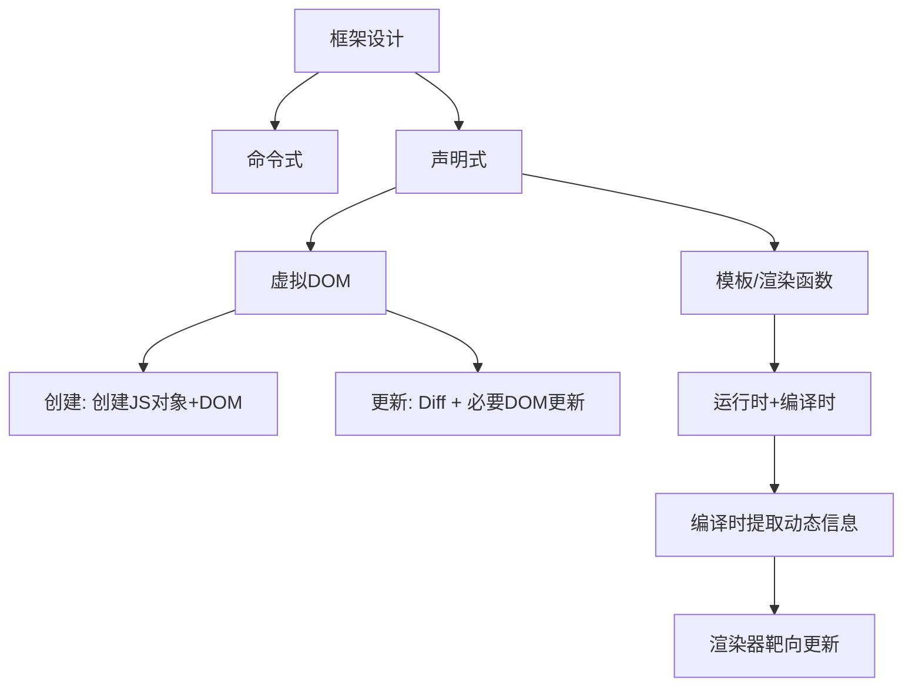

#### 经典金句/数据
> “声明式代码的性能不优于命令式代码的性能。”
> “虚拟 DOM 的意义就在于使找出差异的性能消耗最小化。”
> “Vue.js 3 是一个编译时 + 运行时的框架。”

---

### 第2章 框架设计的核心要素
#### 核心论点
本章探讨框架设计除功能外必须考虑的工程化要素：开发体验、代码体积、Tree-Shaking、构建产物、特性开关、错误处理、TypeScript 类型支持等。作者强调这些要素直接影响框架的可用性、可维护性和用户体验。

#### 关键概念/事件
- `__DEV__` 常量：通过构建工具（rollup）替换，开发环境为 true（包含警告），生产环境为 false（警告被 Tree-Shaking 移除）。
- Tree-Shaking：消除 dead code，依赖 ESM 静态结构。使用 `/*#__PURE__*/` 注释辅助识别无副作用的调用。
- 构建产物：IIFE（用于 `<script>` 标签）、ESM（用于浏览器和打包工具）、CommonJS（用于 Node.js）。带有 `-bundler` 的资源将 `__DEV__` 替换为 `process.env.NODE_ENV !== 'production'`。
- 特性开关：如 `VUE_OPTIONS_API`，用户可通过 webpack 的 DefinePlugin 关闭不需要的特性，减少打包体积。
- 统一错误处理：通过 `callWithErrorHandling` 和 `app.config.errorHandler` 提供全局错误处理接口。
- TypeScript 类型支持：使用 TS 编写框架不等于类型支持友好，需额外编写大量类型声明（如 `defineComponent`）。

#### 逻辑推演
作者先提出开发体验的重要性（警告信息、自定义 formatter），接着说明警告信息会增加体积，解决方案是借助 `__DEV__` 常量控制生产环境移除。Tree-Shaking 依赖 ESM 和副作用标记，Vue.js 在顶级调用中使用 `/*#__PURE__*/` 辅助。构建产物根据使用场景设计不同格式，并处理 `__DEV__` 的替换策略。特性开关让用户按需包含功能。错误处理封装统一接口，降低用户心智负担。最后强调类型支持需额外投入。

#### 经典金句/数据
> “框架的大小也是衡量框架的标准之一。”
> “使用 TS 编写框架与对 TS 类型支持友好是两件完全不同的事。”
> “在 Vue.js 3 的源码中，搜索 `/*#__PURE__*/` 可以看到大量使用。”

---

### 第3章 Vue.js 3 的设计思路
#### 核心论点
本章从全局视角介绍 Vue.js 3 的设计思路：如何声明式描述 UI（模板或虚拟 DOM），渲染器如何将虚拟 DOM 渲染为真实 DOM，组件的本质是返回虚拟 DOM 的函数或对象，以及编译器如何将模板编译为渲染函数。最后说明各个模块（渲染器、编译器、响应系统）是互相配合的有机整体。

#### 关键概念/事件
- 声明式描述 UI：模板（HTML-like）或虚拟 DOM（JS 对象）。
- 渲染器：接收虚拟 DOM，递归创建真实 DOM 并挂载，更新时通过 Diff 找出变更点。
- 组件的本质：一组 DOM 元素的封装，可以是一个返回虚拟 DOM 的函数，也可以是一个包含 `render` 函数的对象。
- 编译器：将模板编译为渲染函数（`h` 函数调用）。
- 模块间的信息交流：编译器可提取动态信息（如 `patchFlag`）附着到虚拟 DOM，渲染器据此进行靶向更新。

#### 逻辑推演
从如何描述 UI 开始，对比模板与虚拟 DOM 的灵活性。然后实现一个极简渲染器：创建元素、设置属性/事件、处理子节点。接着说明组件本质是返回虚拟 DOM 的函数，渲染器递归调用。最后介绍编译器将模板转为渲染函数，并通过 `patchFlag` 等元信息实现编译优化。

#### 流程图
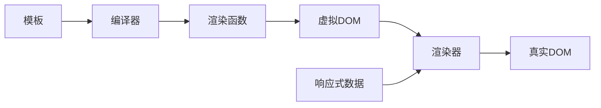

#### 经典金句/数据
> “组件就是一组 DOM 元素的封装。”
> “Vue.js 的各个模块之间是互相关联、互相制约的，共同构成一个有机整体。”
> “编译器会识别出哪些是静态属性，哪些是动态属性，在生成代码时附带 patchFlags。”

---

## 第二篇 响应系统

### 第4章 响应系统的作用与实现
#### 核心论点
本章实现一个完善的响应系统。核心思想：拦截对象的读取和设置操作，在读取时将副作用函数存储到“桶”中，在设置时取出并执行。并逐步解决分支切换、嵌套 effect、无限递归、调度执行、计算属性、watch 和过期副作用等问题。

#### 关键概念/事件
- 副作用函数（effect）：会产生副作用的函数，如修改 DOM。
- 响应式数据：当数据变化时，自动重新执行相关的副作用函数。
- 桶（bucket）的数据结构：`WeakMap<target, Map<key, Set<effectFn>>>`，精确建立依赖关系。
- 分支切换与 cleanup：每次执行前清除旧依赖，避免遗留副作用。
- effect 栈：解决嵌套 effect 时 activeEffect 被覆盖的问题。
- 调度执行（scheduler）：允许用户控制副作用函数的执行时机（如异步、去重）。
- 计算属性（computed）：懒执行的 effect，缓存结果，通过 dirty 标志和 scheduler 实现。
- watch：基于 effect 和 scheduler，可获取新旧值，支持 immediate、flush，以及过期回调（onInvalidate）解决竞态问题。

#### 逻辑推演
从最简单的拦截读写开始，发现硬编码副作用函数名的问题，引入 activeEffect 和 effect 注册函数。然后构建 WeakMap 桶结构，解决多属性依赖。接着处理分支切换：cleanup 清除旧依赖，并解决 Set 遍历时无限循环的问题。嵌套 effect 通过 effect 栈解决。无限递归通过判断 trigger 的副作用函数是否与当前 activeEffect 相同来避免。调度执行允许用户自定义 scheduler，并可实现任务去重。计算属性利用 lazy effect 和 dirty 标志，以及手动 track/trigger 实现。watch 利用 effect 的 scheduler 执行回调，通过 lazy 获取新旧值，通过 onInvalidate 处理过期。

#### 流程图
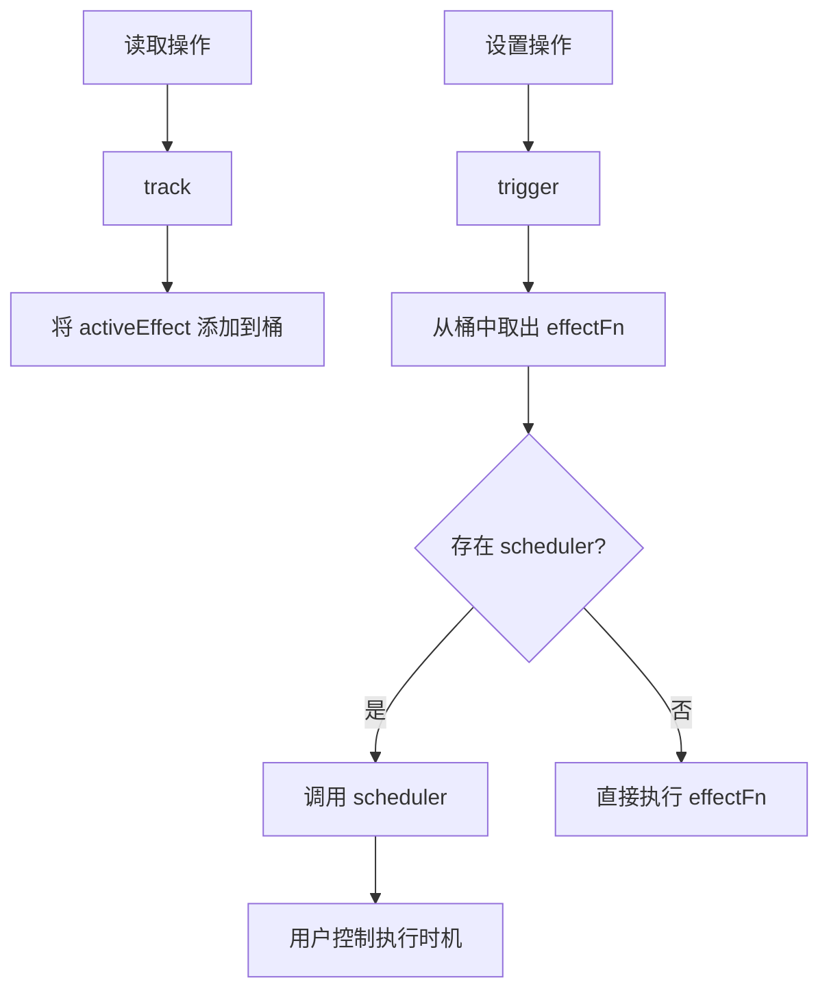

#### 经典金句/数据
> “响应式数据最基本的实现依赖于对‘读取’和‘设置’操作的拦截。”
> “WeakMap 对 key 是弱引用，不影响垃圾回收器的工作。”
> “可调度性指的是当 trigger 动作触发副作用函数重新执行时，有能力决定副作用函数执行的时机、次数以及方式。”
> “watch 的实现本质上就是利用了 effect 以及 options.scheduler 选项。”

---

### 第5章 非原始值的响应式方案
#### 核心论点
本章深入探讨如何使用 Proxy 代理非原始值（对象、数组、Set、Map 等）。从规范角度理解 Proxy 和 Reflect，代理普通对象时需处理 `in` 操作符、`for...in` 循环、属性删除等；代理数组时需处理索引与 length 的隐式关联、遍历、查找方法、栈方法等；代理 Set/Map 时需处理 size 属性、方法绑定、数据污染、迭代器等。

#### 关键概念/事件
- Proxy 与 Reflect：Proxy 拦截基本语义操作，Reflect 提供默认行为并正确传递 receiver。
- 常规对象与异质对象：常规对象符合规范定义，异质对象（如 Proxy、数组）有不同内部方法。
- 代理 object：需拦截 `in`（has）、`for...in`（ownKeys + ITERATE_KEY）、删除（deleteProperty）。
- 代理数组：索引设置可能改变 length，需区分 SET/ADD；length 修改可能影响元素，需触发相应依赖；查找方法（includes、indexOf）需重写以支持代理对象和原始对象混合查找；栈方法（push/pop 等）因同时读取和设置 length 会导致循环调用，需通过 shouldTrack 临时禁止追踪。
- 代理 Set/Map：size 是访问器属性，需修正 this；方法如 add、delete 需自定义实现并触发 trigger；避免数据污染：通过 raw 属性获取原始数据再设置；forEach 需包装回调参数为响应式；迭代器方法（entries、keys、values）需返回包装后的迭代器，并区别依赖 KEY（keys 方法使用 MAP_KEY_ITERATE_KEY）。

#### 逻辑推演
先介绍 Proxy 与 Reflect 的必要性，通过访问器属性 this 指向问题引出 Reflect.get 的 receiver 参数。然后根据 ECMAScript 规范分析对象内部方法，得出拦截方式。代理普通对象时，ownKeys 用 ITERATE_KEY 追踪，添加/删除属性需触发 ITERATE_KEY。代理数组时，根据索引是否小于 length 区分 ADD/SET，length 修改时需遍历所有索引触发依赖；重写查找方法以支持原始值；重写栈方法以防止循环依赖。代理 Set/Map 时，size 需返回原始对象；方法通过自定义实现，注意避免污染原始数据；forEach 和迭代器需包装值为响应式，keys 方法单独使用 MAP_KEY_ITERATE_KEY。

#### 经典金句/数据
> “Proxy 只能代理对象，无法代理非对象值。”
> “数组是一个异质对象，因为它的 [[DefineOwnProperty]] 内部方法与常规对象不同。”
> “数据污染指的是不小心将响应式数据添加到原始数据中。”
> “Set.prototype.size 是一个访问器属性，调用时需要正确的 this 指向。”

---

### 第6章 原始值的响应式方案
#### 核心论点
原始值（string、number 等）无法被 Proxy 代理，需通过“包裹对象”（ref）实现响应式。同时，ref 可用于解决响应丢失问题（展开 reactive 对象后失去响应性），并通过自动脱 ref（proxyRefs）提升开发体验。

#### 关键概念/事件
- ref：包裹对象 `{ value: val }`，通过 `reactive` 包装，并定义不可枚举属性 `__v_isRef: true` 以标识。
- 响应丢失：使用展开运算符 `...obj` 将 reactive 对象转为普通对象，失去响应性。
- toRef / toRefs：将 reactive 对象属性转换为 ref（访问器属性，读写原对象），保持响应性。
- 自动脱 ref：通过 `proxyRefs` 代理，读取时若属性是 ref 则返回 `value`，设置时若值是 ref 则设置其 `value`。Vue 组件的 setup 返回值会自动经过 `proxyRefs` 处理，因此模板中可直接使用 ref 而不需 `.value`。

#### 逻辑推演
由于 Proxy 无法代理原始值，创建 `ref` 函数返回包裹对象，并用 `reactive` 使其具备响应能力。通过 `__v_isRef` 区分 ref 和普通响应式对象。响应丢失问题源于展开 reactive 对象后失去代理，解决方案是将每个属性转换为 ref（toRef），批量转换用 toRefs。但 toRefs 后访问需要 `.value`，影响模板使用，因此 Vue 内部用 `proxyRefs` 自动脱 ref。reactive 也会自动脱 ref，进一步降低心智负担。

#### 经典金句/数据
> “ref 本质上是一个‘包裹对象’。”
> “toRefs 会把响应式数据的第一层属性值转换为 ref。”
> “自动脱 ref 的能力：如果读取的属性是一个 ref，则直接返回该 ref 的 value 属性值。”

---

## 第三篇 渲染器

### 第7章 渲染器的设计
#### 核心论点
本章介绍渲染器的整体设计：渲染器与响应系统结合实现自动更新；定义基本概念（renderer、vnode、mount、patch、container）；并实现自定义渲染器，通过配置项抽离平台特定 API，实现跨平台能力。

#### 关键概念/事件
- 渲染器与响应系统：通过 `effect` 包裹渲染函数，响应式数据变化时自动重新渲染。
- renderer、vnode、mount、patch、container：渲染器将 vnode 渲染为真实 DOM，挂载是首次创建，打补丁是更新。
- createRenderer：工厂函数，返回 `render` 和 `hydrate`（同构渲染激活）。
- 自定义渲染器：将 DOM 操作 API（createElement、setElementText、insert 等）作为配置项传入，核心逻辑不依赖特定平台。

#### 逻辑推演
先展示响应系统与渲染器结合的最小例子（effect + innerHTML）。然后定义渲染器基本结构，区分首次挂载和更新。接着通过抽象 DOM API 实现跨平台自定义渲染器，例子中打印操作流程。强调渲染器核心与平台解耦。

#### 流程图
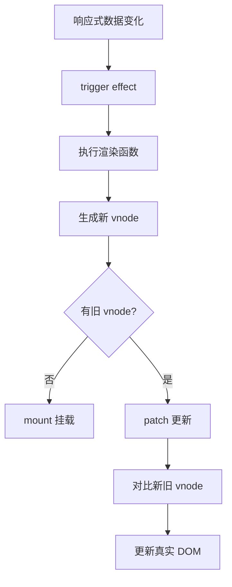

#### 经典金句/数据
> “渲染器不仅能够把虚拟 DOM 渲染为浏览器平台上的真实 DOM，通过可配置的‘通用’渲染器，可实现渲染到任意目标平台。”
> “自定义渲染器并不是‘黑魔法’，它只是通过抽象的手段，让核心代码不再依赖平台特有的 API。”

---

### 第8章 挂载与更新
#### 核心论点
本章详细讲解渲染器的挂载与更新逻辑：处理子节点、元素属性（包括 HTML Attributes 与 DOM Properties 的区别）、class 的特殊处理、事件绑定、事件冒泡与更新时机问题、多种子节点类型的更新，以及文本节点、注释节点和 Fragment 的渲染。

#### 关键概念/事件
- 挂载子节点：递归调用 `patch`，处理字符串或数组子节点。
- 属性设置：区分 HTML Attributes（初始值）和 DOM Properties（当前值），优先设置 DOM Properties，对布尔属性进行矫正（空字符串 → true），特殊属性（如 `form`）使用 `setAttribute`。
- class 处理：Vue 支持字符串、对象、数组，需 `normalizeClass` 归一化，设置时使用 `el.className`（性能最优）。
- 卸载操作：不能简单 `innerHTML = ''`，需通过 `vnode.el` 获取真实 DOM 并移除，以便调用生命周期钩子和自定义指令。
- 事件处理：以 `on` 开头的属性视为事件，使用 `invoker` 包装函数，避免频繁 `removeEventListener`，支持数组形式的多事件处理函数。
- 事件冒泡与更新时机：通过 `e.timeStamp` 与 `invoker.attached` 比较，屏蔽绑定时间晚于触发时间的事件。
- 子节点更新：规范子节点类型（null、字符串、数组），处理九种可能情况（新旧子节点均为数组时引入 Diff 算法）。
- 文本/注释节点：用 `Symbol` 标识，通过 `createTextNode` / `createComment` 创建。
- Fragment：用于多根节点组件，渲染时不产生包裹元素，仅渲染 children。

#### 逻辑推演
从挂载子节点开始，递归处理。属性设置时，先判断是否存在对应的 DOM Properties，存在则优先设置，并处理布尔属性的空字符串矫正。class 需归一化后用 `className` 设置。卸载操作封装为 `unmount`，通过 `vnode.el` 移除。事件绑定用 `invoker` 对象，更新时只修改 `invoker.value`，并处理事件数组。事件冒泡问题通过记录绑定时间解决。子节点更新分类型讨论，数组与数组时需 Diff。最后支持文本、注释、Fragment 等特殊 vnode 类型。

#### 经典金句/数据
> “HTML Attributes 的作用是设置与之对应的 DOM Properties 的初始值。”
> “使用 innerHTML 清空容器元素内容的另一个缺陷是，它不会移除绑定在 DOM 元素上的事件处理函数。”
> “el.className 的性能最优。”

---

### 第9章 简单 Diff 算法
#### 核心论点
本章介绍渲染器核心 Diff 算法的基础版本——简单 Diff 算法。通过 key 属性标识节点，在更新子节点时尽可能复用 DOM 元素，通过移动而非销毁重建来提升性能。算法逻辑：遍历新子节点，在旧子节点中寻找相同 key 的节点，打补丁，并根据索引判断是否需要移动。

#### 关键概念/事件
- key 的作用：标识节点，用于确定新旧子节点的对应关系。
- 最大索引（lastIndex）：记录遍历过程中遇到的最大索引，若当前节点索引小于 lastIndex，则需要移动。
- DOM 移动：通过 `insert(节点, 容器, 锚点)` 将节点移动到前一个节点后面。
- 新增节点：若在新子节点中找不到相同 key 的旧节点，则挂载新节点。
- 删除节点：更新完成后遍历旧子节点，若不存在于新子节点中，则卸载。

#### 逻辑推演
先展示无复用时的性能开销，然后引入 key 实现复用。通过双层循环找到可复用节点，打补丁。判断是否需要移动：记录 lastIndex，若当前旧节点索引小于 lastIndex，则需移动。移动时获取前一个新节点对应的真实 DOM 的下一个兄弟节点作为锚点。新增节点通过 find 标志和锚点挂载。最后删除不存在于新列表中的旧节点。

#### 流程图
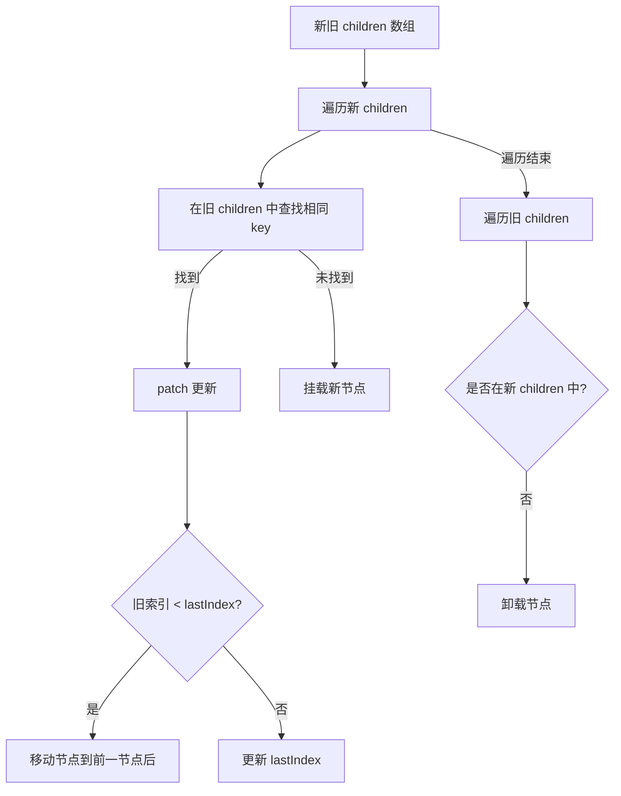

#### 经典金句/数据
> “key 属性就像虚拟节点的‘身份证’号。”
> “简单 Diff 算法的核心逻辑是，拿新的一组子节点中的节点去旧的一组子节点中寻找可复用的节点。”

---

### 第10章 双端 Diff 算法
#### 核心论点
本章介绍双端 Diff 算法，相比简单 Diff 算法，它在新旧两组子节点的四个端点之间进行比较，能够减少 DOM 移动次数。算法在每一轮比较中依次尝试：旧头 vs 新头、旧尾 vs 新尾、旧头 vs 新尾、旧尾 vs 新头，若找到可复用节点则进行相应移动，否则在旧节点中查找新头节点并移动。

#### 关键概念/事件
- 四个索引：oldStartIdx、oldEndIdx、newStartIdx、newEndIdx。
- 四种比较：旧头-新头、旧尾-新尾、旧头-新尾、旧尾-新头。
- 非理想情况：若四种比较都不匹配，则在旧节点中查找新头节点，将其移动到旧头位置。
- 添加新元素：循环结束后，若新子节点有剩余，则批量挂载。
- 移除不存在的元素：若旧子节点有剩余，则批量卸载。

#### 逻辑推演
双端比较的每一轮尝试四种匹配，根据匹配情况移动 DOM（旧头-新尾：将旧头移到旧尾之后；旧尾-新头：将旧尾移到旧头之前）。若四种都不匹配，则在旧节点中查找新头节点的位置，将其移到旧头之前。循环直到某一端索引越界。结束后处理新增或删除的剩余节点。

#### 流程图
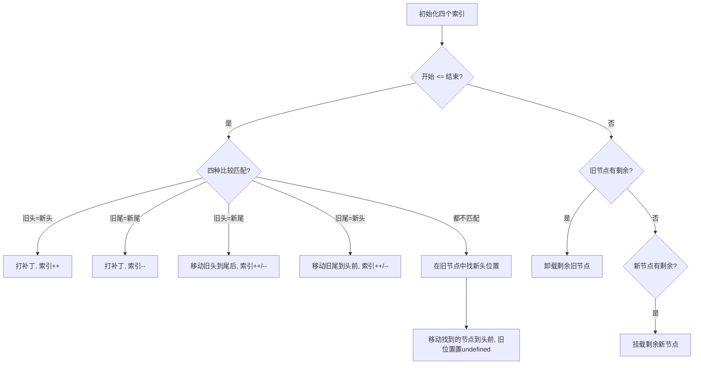

#### 经典金句/数据
> “双端 Diff 算法的优势在于，对于同样的更新场景，执行的 DOM 移动操作次数更少。”
> “双端 Diff 算法指的是，在新旧两组子节点的四个端点之间分别进行比较。”

---

### 第11章 快速 Diff 算法
#### 核心论点
快速 Diff 算法借鉴纯文本 Diff 的预处理思路，先处理相同的前置和后置节点，然后处理剩余部分。通过构建 source 数组（新节点在旧节点中的位置索引），并计算最长递增子序列，确定哪些节点不需要移动，从而最小化 DOM 移动次数。

#### 关键概念/事件
- 预处理：处理相同的前缀和后缀节点，减少后续处理范围。
- source 数组：存储新的一组子节点中剩余节点在旧节点中的位置索引，初始值为 -1（表示新增节点）。
- 索引表（keyIndex）：映射新节点的 key 到其索引，加速查找。
- 最长递增子序列（LIS）：source 数组中不需要移动的节点对应的索引序列。
- 移动操作：从后向前遍历新节点，若节点在 LIS 中则跳过，否则移动/挂载。

#### 逻辑推演
先处理相同的前置节点（j 递增），再处理后置节点（newEnd、oldEnd 递减）。若预处理后旧节点全部处理完，则挂载剩余新节点；若新节点全部处理完，则卸载剩余旧节点。否则进入核心部分：构建 keyIndex 映射，遍历旧节点，填充 source 数组，同时记录 moved 标志和最大索引 pos。若 moved 为 true，计算 source 的最长递增子序列 seq。然后从后向前遍历新节点，根据 source[i] 是否为 -1 决定挂载还是移动，若 i 不在 seq 中则移动节点。

#### 流程图
```mermaid
graph TD
    A[新旧 children] --> B[处理相同前缀]
    B --> C[处理相同后缀]
    C --> D{旧节点已完?}
    D -->|是| E[挂载剩余新节点]
    D -->|否| F{新节点已完?}
    F -->|是| G[卸载剩余旧节点]
    F -->|否| H[构建 source 数组]
    H --> I{需要移动?}
    I -->|是| J[计算最长递增子序列 seq]
    J --> K[从后向前遍历新节点]
    K --> L{source[i]==-1?}
    L -->|是| M[挂载新节点]
    L -->|否| N{i 在 seq 中?}
    N -->|否| O[移动节点]
    N -->|是| P[跳过]
```

#### 经典金句/数据
> “快速 Diff 算法在实测中性能最优。”
> “最长递增子序列所指向的节点即为不需要移动的节点。”

---

## 第四篇 组件化

### 第12章 组件的实现原理
#### 核心论点
本章讲解 Vue.js 组件的实现原理：如何渲染组件（vnode.type 为对象），组件状态与自更新（data 响应式 + effect），组件实例与生命周期，props 与被动更新，setup 函数，组件事件（emit），插槽（slots），以及生命周期注册（onMounted 等）。

#### 关键概念/事件
- 组件渲染：vnode.type 为组件对象，通过 `mountComponent` 获取 render 函数并执行，得到 subTree 再渲染。
- 组件状态：data 函数返回对象，通过 `reactive` 包装，在 effect 中执行 render，实现自更新。使用调度器（queueJob）缓冲更新任务。
- 组件实例：存储状态、是否挂载、subTree 等，用于区分首次挂载和更新。
- props 解析：结合组件定义的 props 选项和传入的 vnode.props，生成 props 和 attrs。父组件更新时，子组件被动更新通过比较 props 变化决定是否更新。
- 渲染上下文（renderContext）：组件实例的代理，优先读取 state，再读取 props。
- setup 函数：接收 props 和 setupContext，可返回渲染函数或数据对象。数据对象会暴露到渲染上下文。
- emit：根据事件名称生成 onXxx，从 props 中查找处理函数并调用。
- 插槽：编译为插槽函数，存储在 vnode.children 中，组件通过 `this.$slots` 调用执行。
- 生命周期注册：维护全局 `currentInstance`，在 setup 执行前设置，onMounted 等函数将回调存入当前实例的数组中，在对应时机执行。

#### 逻辑推演
从 vnode 描述组件开始，渲染器调用 mountComponent。组件自身状态通过 data + reactive 实现响应式，并用 effect 包裹 render，调度器避免多次更新。组件实例存储挂载状态，实现首次挂载和后续 patch。props 解析需考虑显式声明和 attrs 继承。父组件更新导致子组件被动更新时，通过比较 props 变化决定是否重新渲染。渲染上下文代理组件数据。setup 函数是组合式 API 入口，返回值决定渲染函数或暴露数据。emit 通过 props 中 onXxx 实现。插槽内容编译为函数，延迟执行。生命周期通过全局变量 currentInstance 收集。

#### 经典金句/数据
> “组件实例本质上就是一个状态集合（或一个对象），它维护着组件运行过程中的所有信息。”
> “emit 用来发射组件的自定义事件，本质就是根据事件名称去 props 数据对象中寻找对应的事件处理函数并执行。”

---

### 第13章 异步组件与函数式组件
#### 核心论点
异步组件通过高阶组件封装，支持加载超时、错误组件、延迟 Loading 组件、重试等机制。函数式组件是普通函数，返回虚拟 DOM，无状态，性能与有状态组件差距不大，主要优点在于简单性。

#### 关键概念/事件
- defineAsyncComponent：接收加载器或配置对象，返回包装组件。包装组件内部管理 loaded、error、loading 状态。
- 超时与 Error 组件：设置 timeout 定时器，超时时显示 errorComponent。
- 延迟与 Loading 组件：通过 delay 选项延迟展示 loadingComponent，避免快速加载时的闪烁。
- 重试机制：在加载错误时调用用户提供的 onError 回调，暴露 retry 函数，实现手动重试。
- 函数式组件：type 为函数，在 mountComponent 中检测 isFunctional，将函数作为 render，其静态 props 作为 props 选项。

#### 逻辑推演
异步组件核心是包装组件，根据加载状态渲染不同内容。加载超时和错误通过定时器和 catch 处理。延迟 Loading 通过 delay 定时器设置 loading 标志。重试通过封装 load 函数，在错误时返回新的 Promise，暴露 retry。函数式组件复用 mountComponent 逻辑，仅需将函数视为 render 即可。

#### 经典金句/数据
> “在 Vue.js 3 中使用函数式组件，主要是因为它的简单性，而不是因为它的性能好。”
> “异步组件的实现可以完全在用户层面实现，而无须框架支持。”

---

### 第14章 内建组件和模块
#### 核心论点
本章讲解三个内建组件的实现原理：KeepAlive（组件缓存）、Teleport（跨 DOM 层级渲染）、Transition（过渡动画）。它们都需要渲染器级别的底层支持。

#### 关键概念/事件
- KeepAlive：通过隐藏容器实现“假卸载”和“假挂载”，在 vnode 上添加 shouldKeepAlive、keepAliveInstance、keptAlive 等标记，渲染器在卸载/挂载时调用对应的 _deActivate/_activate 函数移动 DOM。支持 include/exclude 匹配组件 name，支持 max 缓存容量和自定义缓存策略。
- Teleport：通过 `__isTeleport` 标识和 process 函数将渲染逻辑分离。挂载时根据 to 属性获取目标容器，将 children 渲染到目标容器。更新时若 to 变化则移动内容。
- Transition：在虚拟节点上添加 transition 对象，包含 beforeEnter、enter、leave 等钩子。渲染器在挂载和卸载时调用这些钩子，通过 CSS 类（enter-from、enter-active 等）和 transitionend 事件实现过渡。

#### 逻辑推演
KeepAlive 组件需要渲染器在卸载时移动而非删除，因此添加特殊标记。Teleport 组件的渲染逻辑从 patch 函数中分离，通过 process 函数实现。Transition 通过为需要过渡的元素添加 vnode.transition，在 mountElement 和 unmount 中调用钩子，利用 nextFrame 和 transitionend 实现动画。

#### 流程图（Transition 过渡流程）
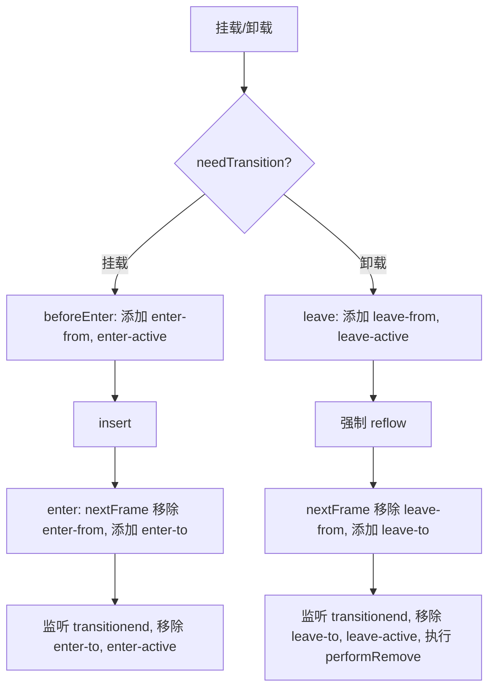

#### 经典金句/数据
> “KeepAlive 的本质是缓存管理，再加上特殊的挂载/卸载逻辑。”
> “Teleport 组件可以将指定内容渲染到特定容器中，而不受 DOM 层级的限制。”
> “Transition 组件的核心原理：当 DOM 元素被挂载时，将动效附加到该 DOM 元素上；当 DOM 元素被卸载时，等到动效执行完成后再卸载它。”

---

## 第五篇 编译器

### 第15章 编译器核心技术概览
#### 核心论点
本章介绍 Vue.js 模板编译器的工作流程：将模板字符串解析为模板 AST，将模板 AST 转换为 JavaScript AST，最后根据 JavaScript AST 生成渲染函数代码。重点讲解 parser（有限状态自动机）、AST 的构造、转换（插件化架构，进入/退出阶段）、以及代码生成。

#### 关键概念/事件
- 编译器流程：parse → transform → generate。
- 有限状态自动机：解析模板生成 Token。
- 构造 AST：扫描 Token，利用栈维护父子关系，构建树形结构。
- AST 转换：深度优先遍历，通过 context 共享状态，支持节点替换、删除。分为进入和退出阶段，便于处理子节点。
- 模板 AST → JavaScript AST：将模板节点转为 h 函数调用等。
- 代码生成：遍历 JavaScript AST，根据不同节点类型（FunctionDecl、ReturnStatement、CallExpression 等）拼接字符串，支持缩进换行。

#### 流程图
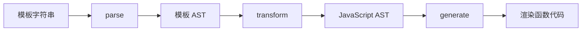

#### 经典金句/数据
> “编译器其实只是一段程序，它用来将‘一种语言 A’翻译成‘另外一种语言 B’。”
> “AST 的转换与插件化架构：通过回调函数机制解耦节点操作和访问。”

---

### 第16章 解析器
#### 核心论点
本章详细实现一个符合 WHATWG 规范的 HTML 解析器，用于将模板字符串解析为模板 AST。内容包括文本模式（DATA、RCDATA、RAWTEXT、CDATA）对解析的影响、递归下降算法构造 AST、状态机的开启与停止、解析标签节点、解析属性、解析文本与解码 HTML 实体、解析插值与注释。

#### 关键概念/事件
- 文本模式：DATA（解析标签）、RCDATA（不解析标签但支持实体，如 textarea）、RAWTEXT（不解析标签也不支持实体，如 style、script）、CDATA（任何字符都作为普通文本）。
- 递归下降：parseChildren 函数为核心，调用 parseElement 递归处理嵌套。
- 状态机停止条件：模板内容解析完毕或遇到结束标签且父级节点栈中存在同名标签。
- 解析标签：parseTag 处理开始/结束标签，消费标签名称，处理自闭合。
- 解析属性：parseAttributes 循环解析属性名称、等于号、属性值（支持引号或无引号）。
- 解析文本：找到下一个 < 或 {{，截取文本，然后对文本内容进行 HTML 实体解码。
- HTML 实体解码：命名字符引用（&lt; 等）按最短原则匹配；数字字符引用（&#60; 等）需验证码点合法性。
- 解析插值：{{ }} 之间内容作为表达式节点。
- 解析注释：<!-- --> 之间内容作为注释节点。

#### 流程图（文本模式状态迁移）
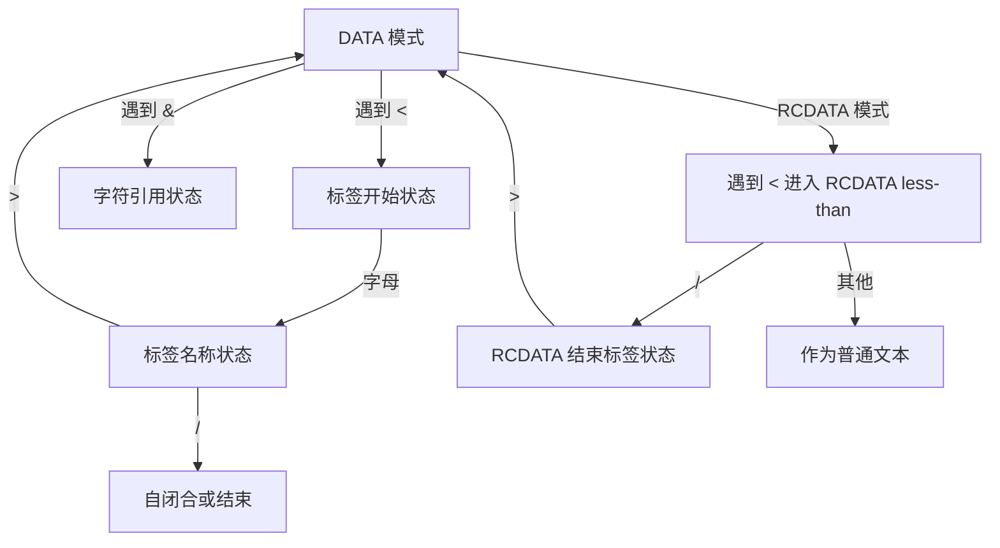

#### 经典金句/数据
> “文本模式指的是解析器在工作时所进入的一些特殊状态，在不同模式下，解析器对文本的解析行为会有所不同。”
> “parseChildren 函数是整个解析器的核心，每次调用 parseChildren 函数，就意味着新状态机的开启。”

---

### 第17章 编译优化
#### 核心论点
本章讨论 Vue.js 3 的编译优化策略：通过区分动态与静态内容，在编译时提取关键信息（补丁标志、Block 树），帮助渲染器跳过静态内容，实现靶向更新。其他优化包括静态提升、预字符串化、缓存内联事件处理函数、v-once 指令。

#### 关键概念/事件
- 传统 Diff 问题：无法区分动态静态，需全量比较。
- 补丁标志（PatchFlags）：标记动态节点类型（TEXT、CLASS、STYLE 等）。
- Block：带有 `dynamicChildren` 数组的 vnode，收集所有动态子代节点，更新时只对比 dynamicChildren。
- 收集动态节点：通过 openBlock/closeBlock 和 currentDynamicChildren 栈，在 createVNode 时收集。
- Block 树：v-if、v-for 等结构化指令会破坏 DOM 结构稳定性，需将这些节点也作为 Block，使得 dynamicChildren 中收集子 Block，保证 Diff 正确。
- Fragment 稳定性：v-for 产生的 Fragment 可能不稳定，需回退到传统 Diff。
- 静态提升：将静态节点提升到渲染函数外，避免重复创建。
- 预字符串化：将大量连续静态节点序列化为字符串，创建 Static VNode。
- 缓存内联事件处理函数：将内联函数缓存到 cache 数组，避免 props 变化导致子组件更新。
- v-once：缓存虚拟节点，并阻止被父 Block 收集，跳过 Diff。

#### 流程图（Block 收集动态节点）
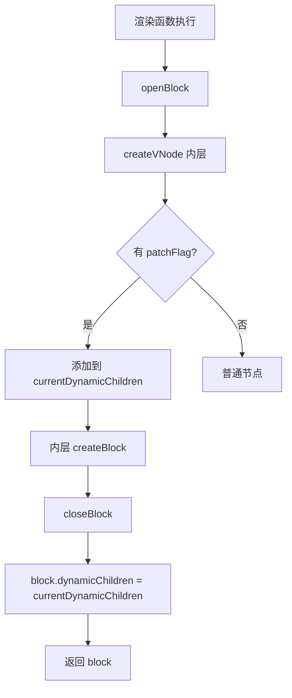

#### 经典金句/数据
> “编译优化指的是编译器将模板编译为渲染函数的过程中，尽可能多地提取关键信息，并以此指导生成最优代码的过程。”
> “Block 本质上也是一个虚拟节点，但与普通虚拟节点相比，会多出一个 dynamicChildren 数组。”
> “静态提升能够减少更新时创建虚拟 DOM 带来的性能开销和内存占用。”

---

## 第六篇 服务端渲染

### 第18章 同构渲染
#### 核心论点
本章比较 CSR、SSR 和同构渲染的异同，讲解如何将虚拟 DOM 渲染为 HTML 字符串，如何将组件渲染为 HTML 字符串，以及客户端激活（hydrate）的原理。最后给出编写同构代码的注意事项（生命周期、跨平台 API、状态污染、ClientOnly 组件等）。

#### 关键概念/事件
- CSR：客户端渲染，白屏问题，SEO 不友好。
- SSR：服务端渲染，SEO 友好，但服务端压力大，用户体验差（每次跳转刷新）。
- 同构渲染：首次访问 SSR，之后 CSR 接管，结合两者优点。需服务端序列化初始数据，客户端激活建立联系和事件绑定。
- 将虚拟 DOM 渲染为 HTML 字符串：处理自闭合标签、属性转义、HTML 实体转义。
- 将组件渲染为 HTML 字符串：执行组件 render 函数得到 subTree，递归渲染，注意服务端不需响应式数据、不调用生命周期钩子（beforeMount/mounted 等）。
- 客户端激活：递归遍历真实 DOM 与 vnode，建立 `vnode.el` 联系，添加事件绑定。在 mountComponent 中检查 `vnode.el` 存在则执行 hydrateNode。
- 同构代码注意事项：只使用 beforeCreate/created 钩子；避免使用平台特有 API（可用 `import.meta.env.SSR` 守卫）；条件引入模块；避免全局状态污染；使用 `<ClientOnly>` 组件包裹不兼容 SSR 的内容。

#### 流程图（同构渲染首次渲染与激活）
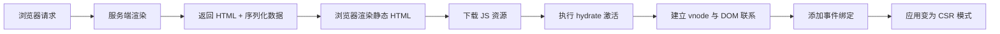

#### 经典金句/数据
> “同构渲染的‘同构’一词的含义是，同样一套代码既可以在服务端运行，也可以在客户端运行。”
> “服务端渲染时，所有数据都无须是响应式的，可以节省开销。”
> “激活操作可以总结为两个步骤：在虚拟节点与真实 DOM 元素之间建立联系；为 DOM 元素添加事件绑定。”

---

> 说明：本书还有致谢、作者简介等内容，因不涉及技术核心，故未纳入总结。所有流程图均基于书中描述重建，与原书逻辑一致。