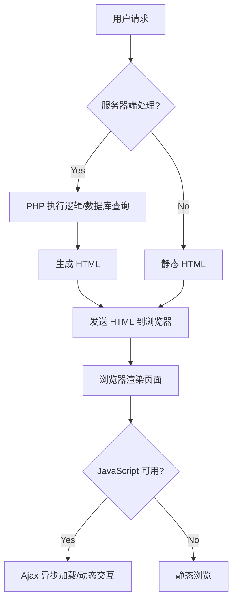
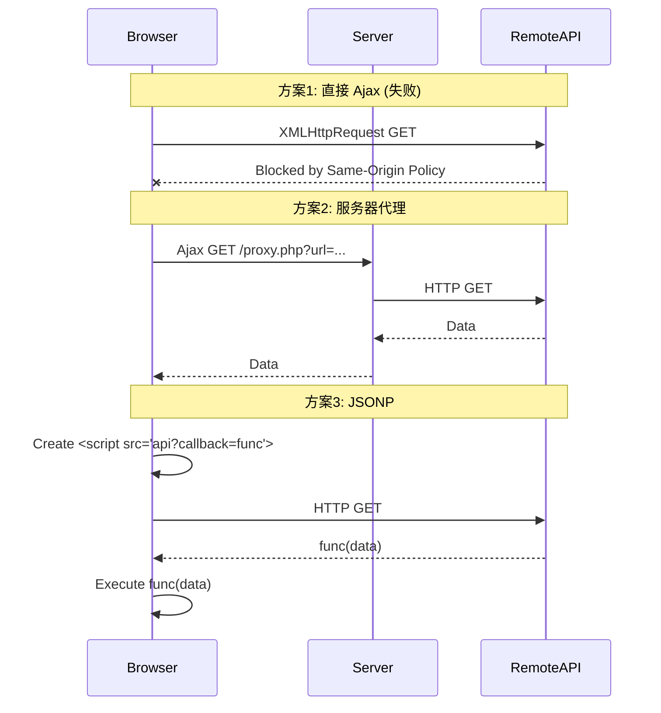
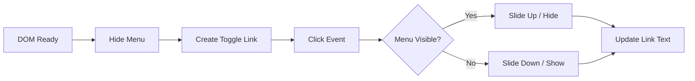

# 《Web Development Solutions》章节总结

## 书籍信息
- **书名**：Web Development Solutions: Ajax, APIs, Libraries, and Hosted Services Made Easy
- **作者**：Christian Heilmann, Mark Norman Francis
- **出版年份**：2007
- **PDF 状态**：文本可识别，结构清晰
- **OCR 状态**：良好，少量格式错位已修正

## 目录说明
- **目录识别情况**：完整识别，共10章及附录索引。
- **章节对应依据**：严格遵循原书 `CONTENTS` 结构。
- **OCR 修复说明**：修正了部分代码片段中的换行符错误和特殊字符显示问题。

## 全书核心主题
本书旨在指导开发者利用现有的免费网络工具、API、库和托管服务，以低成本、高效率的方式构建现代化的 Web 应用。作者反对“重复造轮子”，主张通过整合 Flickr、YouTube、Google Maps、del.icio.us 等 Web 2.0 服务，结合 Ajax、REST API 和 JavaScript 库（如 YUI、jQuery、MooTools），快速实现丰富的媒体内容和交互功能。书中强调了渐进增强（Progressive Enhancement）和无侵入式 JavaScript（Unobtrusive JavaScript）的重要性，确保网站在提供丰富体验的同时保持可访问性和兼容性。此外，本书还提供了从本地开发环境搭建（XAMPP/MAMP + WordPress）到 SEO 优化、故障排查及社区求助的全流程指南。

---

## 第1章：Stop the Web... You’re Getting On!

### 核心论点
本章探讨了建立个人网站的动机和价值。作者认为，无论是为了职业展示、兴趣归档还是商业盈利，拥有独立的 Web 存在至关重要，且借助现代工具，非专家也能轻松实现。

### 关键概念/事件
- **长尾理论 (The Long Tail)**：即使 niche（小众）内容也能在网络上找到受众并产生价值。
- **个人品牌与作品集**：网站作为简历和作品集的延伸，展示真实个性和技能。
- **成功案例**：Steve Pavlina（个人生产力博客）和 John Gruber（Daring Fireball）通过专注小众领域实现全职收入。

### 逻辑推演/叙事脉络
文章首先指出在互联网上找不到个人或公司信息的痛点，引出建立 Web 存在的必要性。接着列举了建立网站的多种理由：分享激情、销售产品、展示艺术、乐队宣传等。通过 Steve Pavlina 和 Daring Fireball 的案例，论证了即使是小众话题，只要内容优质，也能通过广告或订阅模式获得可观收入。最后总结，阻碍人们建站的主要不是缺乏灵感，而是对技术能力的恐惧，而本书将消除这种恐惧。

### 经典金句/数据
> “The Web is the perfect illustration of the Long Tail brought to life.”
> “You may be a great artist, but that won’t automatically translate into being a great web developer.”

---

## 第2章：The Dilemma of “Rolling Your Own” Solutions

### 核心论点
本章分析了自行开发网站的各种途径及其局限性，并介绍了 Web 开发的基础技术栈（HTML, CSS, JS, PHP），强调理解基本原理比依赖可视化工具更重要。

### 关键概念/事件
- **主页服务 (Homepage Services)**：如 Geocities, Google Pages，优点是简单，缺点是代码冗余、SEO 差、受限多。
- **WYSIWYG 编辑器**：如 Dreamweaver，容易产生 bloated（臃肿）代码，且“所见即所得”在不同浏览器中往往失效。
- **基础技术栈**：
    - **HTML**：定义结构和语义。
    - **CSS**：控制表现和布局。
    - **JavaScript**：提供行为和交互。
    - **PHP**：服务器端逻辑，处理数据和动态内容。

### 逻辑推演/叙事脉络
作者首先评估了非技术解决方案（主页服务、博客托管、朋友帮忙、WYSIWYG 工具），指出它们在灵活性、维护性和代码质量上的缺陷。随后，转入技术基础讲解，解释了 HTTP 协议、文件命名规范、图像优化（JPEG vs GIF vs PNG）、HTML 语义化、CSS 层叠机制以及 JavaScript 和 PHP 的作用。特别强调了 PHP 在服务器端处理数据的安全性优势，以及 JavaScript 在不刷新页面的情况下增强用户体验的能力。

### 流程图重建

### 经典金句/数据
> “WYSIWYG editors are the overly friendly used car salespeople of the Internet... the covered-up rust is starting to show through.”
> “HTML describes what a certain text is... CSS describes the presentation... JavaScript describes the behavior.”

---

## 第3章：What You Need to Get Started

### 核心论点
本章指导读者建立本地开发环境，安装 WordPress，并树立正确的 Web 开发心态：关注内容、共享、可访问性和沟通，而非过度追求技术炫技。

### 关键概念/事件
- **本地开发环境**：Windows 使用 XAMPP，Mac 使用 MAMP。包含 Apache, MySQL, PHP。
- **WordPress 安装与配置**：作为内容管理系统（CMS）的基础，易于扩展。
- **正确的心态**：
    - **内容为王**：没有好内容，设计再好也无用。
    - **可访问性 (Accessibility)**：确保所有人（包括残障人士）都能访问。
    - **避免的陷阱**：Flash 引导页、计数器、背景音乐、右键禁用脚本。

### 逻辑推演/叙事脉络
首先强调心态调整，指出许多网站失败是因为维护者失去了兴趣，因此应关注核心价值（内容、共享、可用性）。接着提供详细的技术教程，分别在 Windows 和 Mac 上安装本地服务器（XAMPP/MAMP），配置 PHP 扩展，并安装 WordPress。最后介绍如何通过插件（如 No more dead links）和主题来扩展 WordPress 功能，为后续章节打下基础。

### 经典金句/数据
> “It is about content: If you don’t have any interesting content... you will not reach many people no matter how much you polish the surface of your site.”
> “It is about access: If your content is made available to everyone on the Web regardless of ability... you are much more likely to be found.”

---

## 第4章：Spoiled for Choice—What the Web Offers You

### 核心论点
本章介绍了 Web 2.0 时代丰富的免费资源，包括 RSS feeds、REST APIs、CSS 模板、JS 库和托管服务，鼓励开发者利用这些现成资源而非从头构建。

### 关键概念/事件
- **RSS Feeds**：用于内容聚合和分发，减少邮件列表维护成本。
- **REST APIs**：通过 URL 参数获取特定数据（如 Yahoo! HotJobs API）。
- **JavaScript 库**：解决浏览器兼容性问题，简化开发（如 YUI, jQuery, MooTools）。
- **Web 2.0 托管服务**：Flickr (图片), YouTube (视频), del.icio.us (书签), Upcoming.org (事件)。

### 逻辑推演/叙事脉络
作者描述了 Web 从静态信息发布向动态数据交换的转变。介绍了 RSS 作为 syndicating 内容的标准，以及 REST API 如何通过简单的 URL 调用获取结构化数据。接着讨论了 CSS 模板和 JS 库的价值，它们解决了布局和跨浏览器脚本开发的难题。最后重点介绍了主要的 Web 2.0 服务，强调它们不仅存储数据，还构建了社区和聚合价值，开发者可以通过 API 将这些内容嵌入自己的网站。

### 经典金句/数据
> “The Web is full of free stuff you can use on your own sites.”
> “Libraries make our life a lot easier, but they are no replacement for at least a basic knowledge of what you do.”

---

## 第5章：Retrieving and Displaying Content with REST and Ajax

### 核心论点
本章深入讲解 Ajax 和 REST 的技术原理与实践，展示了如何使用 Yahoo! UI Library (YUI) 实现异步内容加载，并解决了跨域安全限制等问题。

### 关键概念/事件
- **Ajax (Asynchronous JavaScript and XML)**：在不刷新页面的情况下与服务器交换数据。
- **RESTful API**：通过 URL 结构定位资源。
- **跨域问题**：XMLHttpRequest 受同源策略限制。
- **解决方案**：
    - **服务器端代理 (Proxy)**：使用 PHP cURL 获取远程数据。
    - **JSONP**：利用 `<script>` 标签加载 JSON 数据，绕过跨域限制。

### 逻辑推演/叙事脉络
首先定义 REST 和 Ajax，解释 Ajax 如何提升用户体验（如 Flickr 的标签编辑）。接着指出 Ajax 的问题：JS 依赖、连接不稳定、背按钮失效、辅助技术支持差、跨域安全限制。然后通过三个示例逐步深入：
1. **同域 Ajax**：加载本地歌词文件，展示基本的 YUI Connection 用法。
2. **跨域代理**：使用 PHP 脚本作为代理获取 del.icio.us 的 RSS 数据，解决同源策略问题。
3. **JSONP**：直接通过动态创建 `<script>` 标签加载 del.icio.us 的 JSON 接口，无需服务器端代理，效率更高。

### 流程图重建

### 经典金句/数据
> “Ajax is about moving server-side logic one level up and thus making it possible to create interfaces that are less obstructing than traditional interfaces.”
> “Using JSON makes for much faster and shorter scripts... JSON is already JavaScript.”

---

## 第6章：Adding Media Files

### 核心论点
本章演示如何将多媒体内容（图片、视频、音频、地图）轻松集成到网站中，主要利用 Flickr、YouTube、Odeo 和 Google Maps 的 API 或插件。

### 关键概念/事件
- **Flickr 集成**：使用 WordPress 插件（WP Flickr Post Bar, flickrRSS, Flickr Photo Album）展示照片流或相册。
- **YouTube 集成**：使用 YouTube Brackets 插件，通过简短代码嵌入视频。
- **Odeo 集成**：嵌入音频和播客播放器。
- **Google Maps**：
    - **Lazy 方式**：使用在线 Map Maker 生成代码。
    - **WordPress 插件**：GEOPress。
    - **DIY 方式**：使用 Google Maps API，添加标记，处理经纬度，甚至使用微格式 (hCard/geo) 提高可访问性。

### 逻辑推演/叙事脉络
作者按媒体类型逐一介绍。对于图片，推荐 Flickr 并展示了几种不同深度的集成方式，从简单的最新照片侧边栏到完整的相册画廊。对于视频和音频，介绍了 YouTube 和 Odeo 的简单嵌入方法，强调不自动播放以尊重用户带宽。对于地图，从最简单的第三方生成器到 WordPress 插件，最后深入到直接使用 Google Maps API 编写 JavaScript，包括如何处理标记数据和提高可访问性（当 JS 不可用时显示地址文本）。

### 经典金句/数据
> “A picture is worth a thousand words.”
> “Maps are great visual aid... Be aware, though, that not every one of your visitors will be able to use or see the map.”

---

## 第7章：Promoting Your Content

### 核心论点
本章探讨如何通过 SEO、博客搜索引擎、标签系统和社交书签服务来推广网站内容，增加曝光度和 inbound links。

### 关键概念/事件
- **基本 SEO**：有意义的标题、 headings 结构、图片 alt 文本、定期更新。
- **博客搜索引擎**：Technorati, Bloglines。通过 Ping 服务自动通知更新。
- **标签 (Tagging)**：使用 `rel="tag"` 和 SimpleTags 插件，利用人类分类智慧。
- **社交书签与注意力服务**：del.icio.us, Digg, Reddit。通过展示出站链接和鼓励用户 bookmark 来增加互动。
- **事件推广**：使用 Upcoming.org 发布活动。

### 逻辑推演/叙事脉络
首先介绍传统的 SEO 最佳实践，强调内容结构和元数据的重要性。接着转向博客特有的推广方式，如 Ping 服务和标签系统，解释标签如何补充传统分类。然后重点讨论“注意力经济”，通过在网站上集成 del.icio.us 书签和 Digg 按钮，既展示了站长的品味，又鼓励访客参与传播。最后介绍了 Upcoming.org 用于线下活动的推广，利用其社交网络效应扩大影响。

### 经典金句/数据
> “The hyperlink is the most important part of the entire Web.”
> “Tags are a wonderful idea insofar as they are quite anarchic in structure.”

---

## 第8章：Layout and Navigation

### 核心论点
本章讨论网站的布局设计和导航系统，强调可用性、可访问性和灵活性，批判了固定布局和“首屏”迷思，推荐使用 CSS 框架和语义化 HTML。

### 关键概念/事件
- **导航原则**：始终告知用户位置，菜单明显，当前页不高亮链接，提供返回首页和搜索的路径。
- ** fallback 机制**：站点地图 (Sitemap) 和 FAQ 页面。
- **导航类型**：
    - **层级/树形菜单**：适合深层结构。
    - **下拉菜单**：节省空间，但需注意键盘可访问性。
    - **标签页 (Tabs)**：适合平级内容切换。
- **布局迷思**：
    - **“首屏”迷思**：滚动是自然的，不必将所有内容挤在上方。
    - **“固定字体”迷思**：允许用户调整字体大小。
    - **“屏幕分辨率”迷思**：使用流体或弹性布局适应不同视口。
- **工具**：YUI Grids, Listamatic。

### 逻辑推演/叙事脉络
作者首先确立导航的心理学基础：让用户感到安全和方向感。接着列出良好菜单的基本规则，并介绍辅助导航手段（搜索、 sitemap、FAQ）。随后详细分析各种菜单形式（树形、下拉、标签）的优缺点及实现注意事项，特别强调键盘导航和屏幕阅读器的支持。最后讨论布局的灵活性，驳斥了针对特定分辨率设计的观点，推荐使用 CSS 网格系统（如 YUI Grids）来构建健壮、适应性强的布局。

### 经典金句/数据
> “Navigation is not a matter of technology... it is a psychological matter.”
> “A pixel-perfect one-for-all layout and design is an archaic view of web design.”

---

## 第9章：Adding Special Effects

### 核心论点
本章介绍如何使用 JavaScript 库（jQuery, MooTools, YUI）为网站添加动画和交互效果，同时警告不要滥用特效，强调渐进增强和性能考量。

### 关键概念/事件
- **JavaScript 库的选择**：
    - **jQuery**：简洁、链式调用、选择器强大。
    - **MooTools**：面向对象、模块化、可扩展 DOM 元素。
    - **YUI**：企业级、稳定、组件丰富、命名空间避免冲突。
- **常见任务**：
    - **层级导航**：折叠/展开菜单。
    - **动画**：淡入淡出、滑动、缓动 (Easing)。
- **风险**：库的依赖性、性能开销（复杂的 CSS 选择器模拟）、无障碍障碍。

### 逻辑推演/叙事脉络
首先回顾 JavaScript 的作用和库的优势（屏蔽浏览器差异）。接着警告库的危险性（黑盒、性能陷阱、维护依赖）。然后通过两个具体任务（层级导航和菜单动画）对比三大库的实现方式：
1. **jQuery**：代码最简短，语法直观。
2. **MooTools**：面向对象风格，需要额外处理事件阻止默认行为。
3. **YUI**：代码较冗长，但结构清晰，稳定性高，动画控制更精细（支持 Easing）。
最后总结，特效应服务于用户体验，而非炫技，且必须提供无 JS 的 fallback。

### 流程图重建 (以 jQuery 动画为例)

### 经典金句/数据
> “jQuery is designed to change the way that you write JavaScript.”
> “Animation may pose an accessibility barrier... Make sure that if you use animation heavily... you also offer an option to turn it off.”

---

## 第10章：What to Do and Where to Find Help When Things Go Wrong

### 核心论点
本章提供了调试 Web 开发问题的系统化方法，以及如何有效地在社区（邮件列表、论坛、聊天室）寻求帮助，强调了自我排查和社区礼仪的重要性。

### 关键概念/事件
- **求助前的自查**：
    - **搜索**：先搜引擎和档案。
    - **验证代码**：使用 W3C Validator (HTML/CSS)，检查 DOCTYPE (Standards vs Quirks Mode)。
    - **JS 控制台**：查看错误信息 (Firefox Error Console, Firebug)。
    - **复现问题**：提供 URL、截图、环境信息（浏览器、OS、版本）。
- **沟通渠道**：
    - **邮件列表**：如 CSS-Discuss, thelist。适合深度讨论，需遵守礼仪（不顶贴、不 HTML 邮件）。
    - **论坛**：如 SitePoint。适合特定主题，注意版块选择。
    - **聊天室 (IRC)**：即时但短暂，适合快速提问，勿 flooding。

### 逻辑推演/叙事脉络
作者首先指出求助是学习的好机会，但需注意社区中的“ ego ”问题。接着详细列出了求助前必须做的步骤：搜索现有答案、验证代码合法性（特别是 DOctype 对渲染模式的影响）、检查 JS 错误、准备可复现的案例（截图、测试 URL）。随后分析了三种主要帮助渠道的特点和礼仪规范，强调了尊重志愿者时间、提供清晰信息和适当反馈的重要性。

### 经典金句/数据
> “To get good answers you have to ask good questions—it is as easy as that.”
> “Validating your code and making sure that it is standards-compliant makes debugging a lot easier because there will be no surprises.”