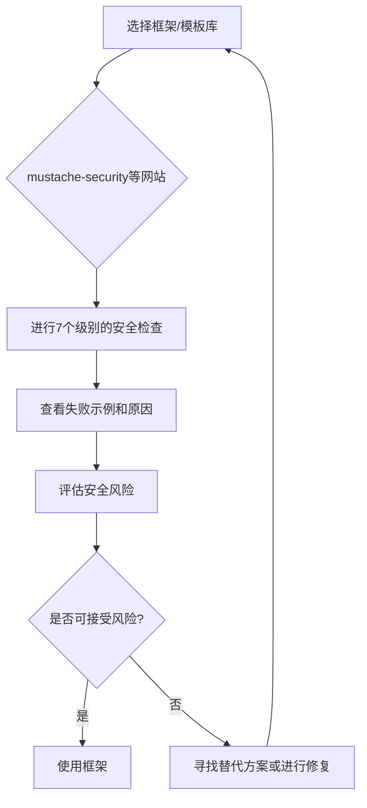
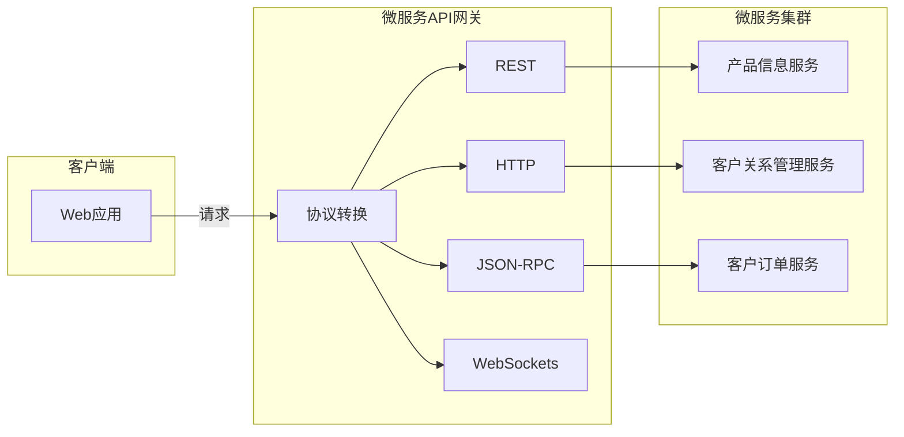
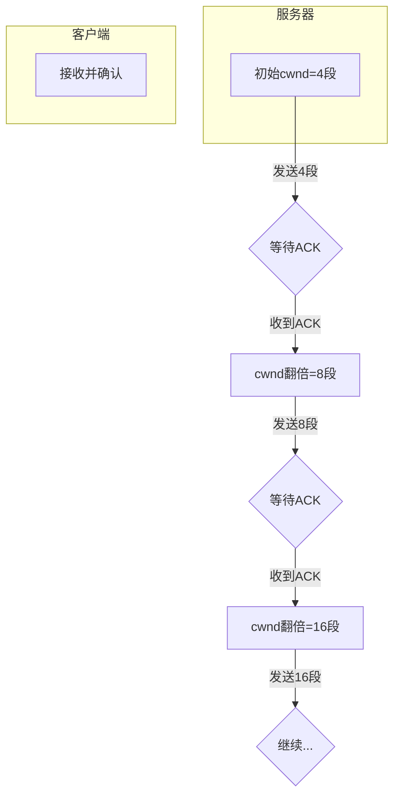
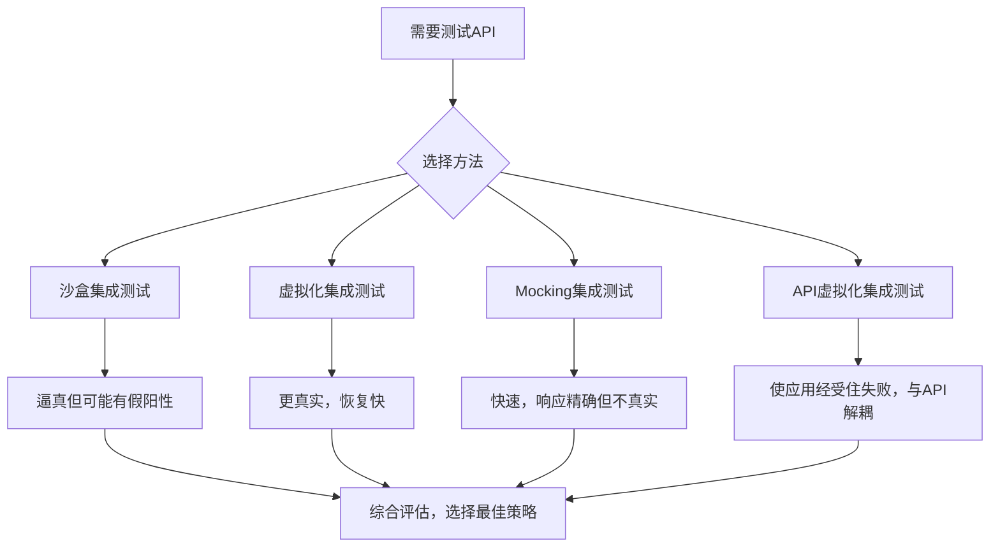
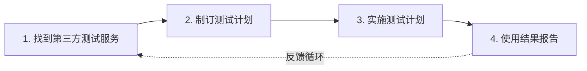

# 《Web安全开发指南》章节总结

## 书籍信息

- 书名：Web安全开发指南
- 作者：[美] John Paul Mueller
- 译者：温正东
- 出版信息：人民邮电出版社，2017年6月第1版
- PDF 状态：可识别
- OCR 状态：良好

## 目录说明

- 目录识别情况：完整识别，共17章，分为5个部分
- 章节对应依据：按原书目录页提取
- OCR 修复说明：无重大错漏

## 全书核心主题

本书聚焦于Web应用程序的安全开发，从安全计划制订、编码实践、测试策略、维护周期到安全资源查找五个维度，系统性地阐述了如何从源头消除安全隐患。核心观点是：安全不是后期添加的功能，而应贯穿软件开发生命周期的每一个环节。书中强调，开发人员需要像黑客一样思考，理解应用环境中的各类威胁，谨慎使用第三方库、API和微服务，并通过持续的测试和维护来保障应用安全。

---

## 第一部分：制订安全计划

---

## 第1章：定义应用环境

### 1. 核心论点

本章解决的核心问题是：在开始开发之前，如何全面理解应用程序的运行环境及其面临的安全威胁。作者认为，安全的核心是保护数据，而应用程序对数据执行四种操作（CRUD），理解应用环境是保障数据安全的第一步。

### 2. 关键概念

- **CRUD**：应用程序对数据执行的四种基本操作的缩写——创建（Create）、读取（Read）、更新（Update）、删除（Delete）。
- **软件安全保障（SSA）**：一种观点，认为软件需要某种监管来确保它不会导致其使用、控制和保护的数据及资源发生丢失、误差、篡改、不可用或误用。
- **开放Web应用安全项目（OWASP）**：一个重要的安全组织，其OSSAP流程描述了如何将SSA作为软件开发生命周期的一部分。
- **攻击面**：应用程序中可被黑客利用的漏洞总和。不必要的功能会增加攻击面，从而带来安全风险。
- **端点**：网络传输的目的地，如服务器或浏览器。端点安全是网络的主要入口点，分为预防、检测和修复三个阶段。

### 3. 逻辑推演

本章从明确Web应用威胁入手，列举了缓冲区溢出、代码注入、XSS、SQL注入等常见威胁类型，并强调了隐私安全的重要性。随后引入软件安全保障（SSA）的概念，将其分解为评估、分类、分析等8个步骤，并指出逻辑、数据、界面和约束是分析的重点。接着，作者探讨了HTML、CSS、JavaScript这三种Web前端语言各自的关键安全问题。最后，讨论了端点的防御要素（预防、检测、修复）、云存储的处理策略以及使用外部代码（库、API、微服务）和允许他人访问时需要权衡的安全问题。

### 4. 经典金句

> “谈到安全的时候，焦点不在于黑客、应用程序、网络或其他任何别人可能告诉过你的东西，而在于数据。”(p.2)
> “保证数据安全意味着要理解应用程序的运行环境，进而理解应用程序管理的数据所面临的威胁。”(p.2)
> “将不必要的功能移除或将它们移到另一个不同的应用中，可以减少应用的攻击面，从而让应用程序更安全。”(p.11)

---

## 第2章：迎合用户需求与期望

### 1. 核心论点

本章解决的核心问题是：如何在满足用户需求和期望的同时，确保应用程序的安全。作者认为，安全解决方案的成功离不开用户的协作，因此必须从用户视角看待应用，让安全措施既有效又易于使用。

### 2. 关键概念

- **自带设备（BYOD）**：用户使用自己的设备（如智能手机、平板）访问公司应用的现象。开发者需假定用户会依赖自己的设备，并以此为目标实现应用安全性。
- **双因素认证**：结合两种不同认证方式的方案（如密码+令牌、密码+生物识别），以降低认证过程被攻破的风险。
- **近场通信（NFC）**：无线射频识别技术的扩展，允许设备之间短距离安全交换信息，可用于实现无密码登录。
- **生物识别**：利用个人唯一特征（指纹、虹膜、声纹、心跳、人脸等）进行身份验证的方案。
- **USB Key**：一种包含密码或令牌的闪存驱动器，插入电脑即可用于登录系统。

### 3. 逻辑推演

作者首先强调，用户视角对安全策略至关重要。然后深入探讨BYOD环境下的安全问题，包括基于Web应用的安全性、原生应用的问题、定制化浏览器的使用、代码兼容性验证及设备更新的处理。接着，作者指出密码的局限性，并设计了多种替代方案，如口令、生物识别、钥匙卡、USB Key和令牌策略，其中重点介绍了NFC技术和双因素认证。最后，聚焦于用户的合理期望：应用应易于使用、快速运行、创建可靠环境，并指出安全是一个寻找平衡的行为。

### 4. 经典金句

> “如果一项安全措施对用户来说是麻烦的、繁重的、显而易见的或仅仅是令人厌烦的，那它就是失败的，即使其确实能保护用户数据。”(p.24)
> “用户真的不关心安全性，他们只想更快地获取数据。”(p.36)
> “安全是一个寻找平衡的行为。”(p.36)

---

## 第3章：获取第三方帮助

### 1. 核心论点

本章解决的核心问题是：如何有效地发现、评估和使用第三方安全解决方案。作者认为，重新造轮子通常是错误的，利用第三方解决方案可以节省时间和成本，但必须谨慎选择，并将其纳入整体安全计划。

### 2. 关键概念

- **Capterra**：一个点评网站，可用于过滤和发现第三方安全解决方案。
- **数据仓库**：集中式的数据存储位置，用于保存公司知识库信息。使用公开数据仓库时需注意其安全性。
- **SUNDR（安全不可信数据仓库）**：一种新型协议，允许客户端检测服务器上的文件修改，即使服务器不可信也能发现潜在安全漏洞。
- **数据孤岛**：一种数据存储方式，将不同部门的数据（如财务和人力资源）完全隔离开来。
- **全局命名空间**：允许任何有权限的人在任何地点用任何设备访问数据的存储方式。

### 3. 逻辑推演

作者首先指出发现第三方解决方案的困难，并推荐使用Capterra等点评网站或行业杂志来辅助筛选。随后，重点讨论了云安全方案，包括理解数据仓库、处理文件共享问题（如Dropbox API）以及考虑云存储（归档、设置信息、媒体存储）。最后，将产品类型分为库、API和微服务三类，分别阐述了每类产品的特点、安全优势和潜在风险，并提供了相关示例。

### 4. 经典金句

> “保守秘密的最佳方式是不要告诉任何人。”(p.40)
> “每次使用其他人的代码，就是在给黑客可乘之机，他们会找到方法来攻克那些代码所提供的安全措施。”(p.44)

---

## 第二部分：运用成功的编码实践

---

## 第4章：开发成功的界面

### 1. 核心论点

本章解决的核心问题是：如何开发既友好又安全的用户界面（UI）。作者认为，UI是安全的第一道防线，应采用“胡萝卜”（用户协作）和“大棒”（强制策略）相结合的方式，通过简洁、灵活、可访问的界面来引导用户正确操作，减少安全风险。

### 2. 关键概念

- **可访问性**：确保能力最差的用户也能很好地使用环境。约20%的网站访问者有某种特殊需求，缺乏可访问性会导致用户犯错，从而引发安全问题。
- **受控制的选择**：通过使用单选按钮、复选框、列表框、菜单等特定输入控件，限制用户的选择范围，从而减少非法输入。
- **HTML5专有控件**：如color、date、number、range、email、url等，提供自动校验功能，但黑客可能绕过，因此必须在服务器端再次校验。
- **输入校验**：始终假设所有接收到的数据都是恶意的，必须进行类型、范围、正则表达式、特殊字符等多重检查。
- **客户端和服务器端双层校验**：客户端校验提升用户体验，但数据可能被篡改，因此必须在服务器端进行二次校验以确保安全。

### 3. 逻辑推演

本章从评估UI开始，倡导创建简洁、灵活且具备可访问性的界面。随后，介绍了通过特定输入控件（单选按钮、复选框、HTML5新控件）提供受控制选择的策略。接着，比较了HTML、CSS和JavaScript三种不同级别的UI解决方案及其安全意涵。核心部分详细阐述了输入校验的重要性及方法（只允许特定输入、查找鬼祟输入、请求新输入），并强调了客户端和服务器端双重校验的必要性。最后，作者提醒开发人员要“期待意外”，因为用户和黑客总会做出意料之外的操作。

### 4. 关键数据

> “大约 20% 访问网站的人会有某种特殊需求：视觉、听觉、运动技能或认知。”(p.52)
> “用户的关注时间在1到5秒内”(p.60)

### 5. 经典金句

> “在所有你能做的确保应用程序安全的事项中，最重要的是要假设你接收到的所有数据都是恶意的。”(p.58)

---

## 第5章：构建可靠的代码

### 1. 核心论点

本章解决的核心问题是：可靠性与安全性之间的关系，以及如何平衡二者以达到应用程序的最佳状态。作者认为，可靠性和安全性是衡量应用程序性能的两个不同维度，二者相互影响，必须在速度、可靠性和安全性之间找到平衡。

### 2. 关键概念

- **可靠性**：对应用程序出现故障的频繁程度的统计学度量。高可靠性意味着应用程序在特定环境下不易出错。
- **安全性**：对应用程序出现故障时会造成多大影响的度量，依赖对破坏的可能性评估。
- **平均无故障时间（MTBF）**：故障事件间的平均时间，用于衡量软件可靠性。MTBF越高，维护成本越低。
- **宇宙射线**：高纬度地区计算机受宇宙射线影响可能出现不可重现的错误，解释了某些难以定位的软件故障。
- **成套解决方案**：指使用外部库、API、框架和微服务来构建应用程序，而非从头开始编写所有代码。

### 3. 逻辑推演

作者首先通过Knight Capital Group的例子说明缺乏可靠性的严重后果。然后，通过具体的代码示例（RangeCheck1.html和RangeCheck2.html）来区分可靠性和安全性：安全的代码不一定可靠，反之亦然。作者指出，开发团队需要从设计/执行错误、技术变更、恶意三个层面来制定协议。接着，介绍了创建“经验教训的反馈回路”以持续提升MTBF。最后，讨论了使用外部库、API、框架和微服务等成套解决方案对可靠性的影响及应对策略。

### 4. 经典金句

> “世界上最可靠的应用程序是在执行任务时不会出现任何中断的应用程序。”(p.71)
> “一个可靠的应用程序不一定是安全的，反过来也一样。”(p.71)

---

## 第6章：包含库

### 1. 核心论点

本章解决的核心问题是：如何在应用程序中安全地使用外部库。作者认为，使用库可以避免重复劳动，但必须充分理解其带来的安全风险，并通过严格的研究、精确的使用、定制化构建和充分测试来降低这些风险。

### 2. 关键概念

- **库**：添加到应用程序中的外部代码，作为应用程序的一部分在进程内运行（如jQuery）。
- **严格模式**：ECMAScript 5引入的一种安全特性，通过禁用某些易出错的语法（如with、未声明的变量）来使JavaScript代码更安全、更易于调试。
- **内容安全策略（CSP）**：一种通过创建白名单来防止XSS等注入攻击的机制，浏览器根据头部信息确定哪些脚本和内容是安全可加载的。
- **沙盒**：一种安全机制，让第三方代码在比自己创建的代码更低的权限级别上运行，降低安全漏洞的影响。
- **内部存储库 vs. 外部存储库**：内部库由公司拥有和维护，更安全但成本高；外部库由第三方提供，更新快但可能存在未知漏洞。

### 3. 逻辑推演

本章首先通过示例展示了库如何增强CSS、与HTML交互以及扩展JavaScript，并指出这些操作可能带来的安全问题（如隐藏元素、注入数据、伪造弹窗）。随后，区分了内部存储库和外部存储库的优劣。核心部分定义了库带来的安全威胁（尤其是XSS），并介绍了启用严格模式和开发CSP两种防御手段。最后，给出了安全包含库的四条建议：充分研究、精确定义使用、保持库的小规模和聚焦、执行必需的测试，并区分了库和框架在安全层面的不同。

### 4. 流程图

#### 框架安全检查方法

### 5. 经典金句

> “你维护的库不可能是完全安全的。”(p.86)
> “使用构建器意味着你创建的库只包含你确实需要的元素。”(p.92)

---

## 第7章：慎用API

### 1. 核心论点

本章解决的核心问题是：API带来的安全威胁及如何安全地使用API。作者认为，API与库不同，它以进程外服务的形式运行，虽然方便但会引入更大的安全风险，如中间人攻击、数据泄露等，必须通过验证、测试和防御性编码来谨慎使用。

### 2. 关键概念

- **API（应用程序编程接口）**：以进程外服务形式调用的代码，通过请求/响应方式工作，代码驻留在其他系统上（如Google Maps API）。
- **进程内调用 vs. 进程外调用**：库是进程内调用，作为应用一部分运行；API是进程外调用，在另一台服务器上运行，带来了额外的安全考虑。
- **中间人攻击**：黑客在客户端和服务器之间拦截并可能篡改数据流的攻击方式。
- **密钥**：访问API时通常需要提供的唯一标识符，用于验证身份和追踪使用情况。
- **防御性编码**：假设所有输入和输出都是错误的，用户会犯错，黑客在窥探，培养一种“偏执狂”意识来编写更安全的代码。

### 3. 逻辑推演

本章首先区分了API与库在流行速度（API因减少资源、编码和学习成本而更流行）和用法（数据查询、SCADA、监视、多媒体、定位）上的差异。随后，通过Google Maps API的示例展示了如何用JavaScript调用API。核心部分列举了四个真实的API安全威胁案例：MailPoet插件漏洞、阅后即焚图片应用的暴力破解、Find my iPhone的敲诈、Heartbleed和Shellshock漏洞，说明API漏洞的严重后果。最后，给出了安全访问API的建议：验证API安全性、测试输入和输出、保持数据局部性、进行防御性编码。

### 4. 经典金句

> “黑客在持续地试水来看看他们能得到些什么。”(p.83)
> “保持秘密的最好方式就是不告诉任何人。”(p.84)

---

## 第8章：考虑使用微服务

### 1. 核心论点

本章解决的核心问题是：什么是微服务，以及使用微服务会带来哪些安全威胁。作者认为，微服务是一种新的、细粒度的、语言独立的服务架构，能够提供比库和API更好的隔离性，但也存在缺少一致性、JSON传输风险和传输层安全等问题。

### 2. 关键概念

- **微服务**：一种将大应用程序分解成多个小模块的技术，每个模块独立运行并只执行单一任务，具有小、语言独立、数据传输独立、队列消息、笨管道、分散模式、与平台无关等特征。
- **REST（表述性状态转移）**：微服务常用的轻量级通信架构，比SOAP更简单，占用带宽更少。
- **JSON（JavaScript对象表示法）**：微服务传输数据的主要格式，比XML更轻量、更高效，是JavaScript原生的。
- **Node.js和Seneca**：用于创建微服务的工具组合，可在Mac、Windows和Linux平台上运行。
- **跨站请求伪造（CSRF）**：攻击者利用用户的认证凭据，诱使用户在不经意间执行非本意代码的攻击。

### 3. 逻辑推演

作者首先详细定义了微服务的特点，并将其与库和API区分开来。随后，通过Node.js和Seneca的示例展示了如何用JavaScript调用微服务，并解释了REST和JSON在其中的作用。核心部分分析了微服务带来的安全威胁，包括缺少一致性、虚拟机角色、JSON数据传输的隐患（eval()危险、防御CSRF）以及传输层安全（TLS）的必要性。最后，作者建议创建可替换的微服务路径，通过多个途径访问微服务以提高应用的弹性和可靠性。

### 4. 流程图

#### 微服务调用流程

### 5. 经典金句

> “微服务会提供更好的安全性，但这个安全也是不平衡且更难以处理的。”(p.48)
> “微服务的去中心化性质。每个微服务都是分开的。”(p.94)

---

## 第三部分：创建有用及高效的测试策略

---

## 第9章：像黑客一样思考

### 1. 核心论点

本章解决的核心问题是：如何从黑客的视角来审视和测试应用程序的安全性。作者认为，开发人员需要构建测试系统，了解最常见的漏洞源，并利用用户和第三方测试来发现自身难以察觉的安全漏洞。

### 2. 关键概念

- **Web安全扫描器**：用于检测网站潜在安全问题的工具，如Securi。但无法100%准确，且会误报，建议使用多个扫描器。
- **通用安全漏洞评分系统（CVSS）**：一种对潜在攻击途径进行打分排序的系统，帮助团队确定修复优先级。
- **SQL注入攻击**：攻击者通过修改应用程序创建的SQL查询来操控数据库的攻击方式。
- **跨站脚本攻击（XSS）**：攻击者将恶意脚本注入到应用程序的输出流中，当其他用户访问时，脚本会在其浏览器中执行。分为非持久型和持久型。
- **拒绝服务攻击（DOS）**：攻击者通过发送大量无意义的包来压垮服务器服务，使正常请求无法响应。

### 3. 逻辑推演

本章从定义Web安全扫描的需求开始，介绍了Securi等工具的作用和局限。然后，详细阐述了如何构建用于安全测试的系统，包括接受训练、创建环境、使用虚拟机、获取工具、配置和恢复系统。核心部分列出了最常见的漏洞源：SQL注入、XSS、DOS、可预测的资源定位和无意的信息泄露，并给出了防御方法。接着，讨论了在BYOD环境中的测试要点（配置远程访问区域、检查跨应用攻击、处理老旧设备）以及依靠用户测试的方法。最后，介绍了使用外部安全测试人员（渗透测试公司）的注意事项。

### 4. 流程图

#### TCP慢启动阶段示意图

### 5. 经典金句

> “开发人员把时间花在考虑事情应该如何运作上面……思考事情无法运转……的想法是有些异类的。”(p.99)
> “黑客会持续试探你的防御措施以找到入侵方法，直到有新的目标出现、黑客感到厌倦了或找到了入侵方法。”(p.64)

---

## 第10章：创建API安全区域

### 1. 核心论点

本章解决的核心问题是：如何使用沙盒和虚拟环境来保护API，降低其带来的安全风险。作者认为，将API放在沙盒或虚拟环境中可以实现精确控制，是测试和使用API时保障安全的关键策略。

### 2. 关键概念

- **API安全区域**：指沙盒和虚拟环境所要达到的目标，即提供一个安全且灵活的方法来测试或使用API。
- **沙盒**：一种隔离环境，API可以访问沙盒中的任何东西，但不能访问外部资源，使API即使被黑也难以造成大范围破坏。
- **虚拟环境**：一种提供隔绝其他软件方法的容器，可以模拟带有特定操作系统、开发工具、应用搭建和浏览器的完整环境。
- **Mocking**：创建模拟的API（mock），以脚本方式接收输入并提供输出，用于在真实API不可用时进行测试。
- **API虚拟化**：创建一个API的表现（黑盒）来替代真实的API，即使在API未完成或不稳定的情况下，也能提供一致的集成方法。

### 3. 逻辑推演

作者首先解释了API安全区域的概念，并列举了沙盒和虚拟环境各自的优缺点。随后，定义了API安全区域的需求：确保API可以工作、实现快速开发、证明最佳的集成（通过沙盒、虚拟化、mocking、API虚拟化）、在负载情况下验证API表现、使API远离黑客。接着，介绍了如何使用现成的沙盒解决方案（如AirGap、Sandboxie、Spoon.net）或其他供应商的沙盒。最后，探讨了虚拟环境（如Vagrant、Puppet）与沙盒的区别，以及应用程序虚拟化（如Cameo、Evalaze）的应用。

### 4. 流程图

#### API安全区域测试策略

### 5. 经典金句

> “使用沙盒不能确保应用程序是安全的，但它降低了应用程序出现安全漏洞的可能性。”(p.90)
> “隔绝可以让你拦截和清理数据，以及保持软件处于受控状态。”(p.118)

---

## 第11章：检查库和API的漏洞

### 1. 核心论点

本章解决的核心问题是：如何通过系统性的测试来发现库、API和微服务中的漏洞。作者认为，测试需要从单元测试到集成测试多级别进行，并且必须关注特定语言（HTML、CSS、JavaScript）的安全问题。

### 2. 关键概念

- **单元测试**：对单个代码块的测试，开发人员在编写完代码后不久执行。
- **集成测试**：将应用程序各部分组合在一起进行的测试。
- **测试框架**：能自动进行测试过程的测试程序，使测试更可靠和一致。
- **静态测试 vs. 动态测试**：静态测试测深度，反映开发人员对问题领域的理解；动态测试测宽度，反映处理极端输入的能力。
- **平均无故障时间（MTBF）**：故障事件间的平均时间，是衡量软件可靠性的关键统计指标。

### 3. 逻辑推演

本章首先强调了创建测试计划的必要性，并详细阐述了测试的目的（验证/校验、优先级覆盖、平衡、可跟踪、确定性）和目标（测试性能、可用性、平台类型、实现测试原则）。接着，分别讨论了如何测试内部库、内部API、外部库、外部API和微服务。然后，介绍了为库创建测试框架、为API创建测试脚本、开发响应策略（直接结果和模拟结果）的方法。最后，重点讨论了与HTML、CSS、JavaScript相关的特定语言问题的测试设计，并提供了相应的测试工具建议。

### 4. 经典金句

> “跳出常规思维的测试意味着，在开发代码的过程中每个人都能做出每片面包都在包装纸里的假设。安全漏洞常常是由于开发人员不应该做的假设引起的。”(p.123)
> “你永远不可能创建一个“防弹”的应用程序。每个应用程序都会包含缺陷和潜在的安全漏洞。”(p.134)

---

## 第12章：使用第三方测试

### 1. 核心论点

本章解决的核心问题是：如何有效利用第三方测试服务来提升应用程序的安全性。作者认为，第三方测试可以提供质量、成本、培训和专业技能方面的优势，但必须通过严格的筛选、计划、实施和结果分析来确保其有效性。

### 2. 关键概念

- **渗透测试**：依靠第三方服务，采用与黑客相同的技术来探测应用程序、网站或公司防御措施的安全性。
- **开源安全测试方法（OSSTMM）**：许多安全机构遵循的行业最佳实践测试方法。
- **保密协议（NDA）**：在允许第三方进行渗透测试前必须签署的法律文书。
- **道德黑客资格认证（CEH）**、**GIAC事故处理认证（GCIH）**：衡量渗透测试人员专业能力的常见证书。
- **APPLAUSE**：一家提供“众包”式测试服务的第三方测试商，让应用在真实互联网环境中被未知用户测试。

### 3. 逻辑推演

作者首先明确了聘请第三方测试的理由（质量、成本、培训、时间、专业技能），并详细列出了测试服务的范围和安全测试的具体事项。随后，指导读者如何确保第三方的合法性（检查认证、稳定性、客户评论）和进行面试。核心部分讲解了如何为第三方合作创建测试计划，包括指明目的、创建书面计划、枚举输出和报告要求、考虑测试需求。接着，描述了实施测试计划的四个步骤：确定参与程度、开始测试过程、执行监控、处理意外问题。最后，讨论了如何使用结果报告，包括与第三方讨论报告、向公司展示、根据建议采取行动。

### 4. 流程/方法论框架

#### 聘请第三方测试的四步流程

### 5. 经典金句

> “安全测试是你真的不想冒险的几个领域之一，所以要确保你聘请的第三方有所有必需的认证。”(p.131)
> “任何时候都不要假设，而要把所有东西都写下来。”(p.134)

---

## 第四部分：实现维护周期

---

## 第13章：明确定义升级周期

### 1. 核心论点

本章解决的核心问题是：如何为应用程序制定一个明确且有效的升级周期计划。作者认为，升级是为了提升可用性、修复错误、提升速度、修复功能、升级第三方组件，这需要详细的计划、充分的测试和谨慎的实施。

### 2. 关键概念

- **升级**：对应用程序进行的较大规模的变更，旨在提升可用性、修复编码错误、提升速度、修复功能性代码、升级第三方组件。
- **升级临界点**：不升级带来的风险，与升级的优先级成正比。安全升级通常优先级最高。
- **自然事件**：如线噪声导致的单比特错误，可以通过纠错码程序修复，通常优先级较低。
- **破坏性变更**：供应商在更新时引入的可能导致现有应用程序出现问题的变更。
- **预测试 vs. 集成测试**：预测试在升级代码过程中进行，包括单元、依赖、配置、安全性、数据连通性测试；集成测试关注新旧代码之间的接口。

### 3. 逻辑推演

作者首先强调了制订详细升级周期计划的重要性，并提供了一个包含“寻找升级→确定要求→定义临界点→检查问题→创建测试场景→实施变更”的流程图。随后，详细阐述了每个步骤的具体做法，如如何寻找升级（故障单、供应商网站、行业刊物）、如何确定资源、平台、时间和技能要求、如何定义优先级标准。接着，指导读者如何检查升级的问题（查看供应商网站、论坛、行业杂志、直接测试、获取专业建议）和创建测试场景。最后，讨论了实施变更和进行升级测试（预测试、集成测试）的要点，以及如何将升级安全地迁移到生产环境。

### 4. 经典金句

> “在单次包中进行多个升级会使得查找出错的过程变得复杂。使用阶段性的方法来引入变更通常是更好的方式。”(p.145)
> “用户很可能会比开发人员更早遇到由于界面改变而导致的潜在安全问题。”(p.148)

---

## 第14章：考虑更新选项

### 1. 核心论点

本章解决的核心问题是：如何区分升级与更新，并有效管理应用程序的更新过程。作者认为，更新侧重于添加新信息、特性或界面元素，可能不涉及代码变更，但同样需要测试和计划，紧急更新需要快速响应团队的介入。

### 2. 关键概念

- **更新**：将新的信息、特性或界面元素带给应用程序，可能不触及代码。例如，更改数据库、修改UI特性、增加语言支持。
- **升级 vs. 更新**：升级会创建重要的新功能并深入影响代码基础；更新则更微小，有时甚至不触及代码。
- **紧急更新**：当黑客刚刚暴露了可怕漏洞时，必须立即创建的临时修复。
- **快速响应团队**：随叫随到来处理紧急情况的一组成员，需要包含DBA、开发、运维等各类专家。
- **语言套件更新**：为应用程序添加多语言支持，需要创建语言支持清单、获得可靠语言专家、确保数据格式正确。

### 3. 逻辑推演

本章首先明确区分了升级和更新在范围和目标上的不同。接着，讨论了何时需要更新，包括处理库的更新（第三方和内部）、API和微服务的更新，以及接受自动更新的利弊。然后，重点介绍了更新语言套件的完整流程：创建语言支持清单、获得可靠语言专家、验证提示符起效、确保数据格式正确、定义测试特殊要求。之后，阐述了如何执行紧急更新：尽可能避免、组建快速响应团队、执行简化测试、制订持久更新计划。最后，强调了为更新制订测试计划的重要性，并列出需要执行的各级别测试。

### 4. 经典金句

> “某些公司错误地认为更新需要较少测试，或可能完全不需要测试。这种观点带来的问题是，将更新放到生产服务器上很可能会出问题。”(p.151)
> “发布更新最后几乎总是会导致问题。事实上，匆忙发布更新产生的问题通常比不进行更新带来的问题更糟糕。”(p.159)

---

## 第15章：考虑报告的需要

### 1. 核心论点

本章解决的核心问题是：如何创建和使用报告来支持应用程序的维护和安全决策。作者认为，报告是记录应用状态、触发行动的关键工具，应避免无用报告，创建一致的、可操作的内部和外部报告，并重视用户反馈。

### 2. 关键概念

- **无用报告**：无法依据其内容采取行动的报告。有用报告应能触发基于模式改变、状态改变、异常事件、意料之外的值的行动。
- **自动生成的报告**：由监控软件等工具提供的报告，提供一般性信息，是定制报告的起点。
- **定制的报告**：针对特定需求创建的报告，可从现成数据源生成或手动创建。手动创建可能引入日志开销、安全漏洞等新问题。
- **外部生成的报告**：由第三方（如测试商、API提供商）提供的报告，必须确保其完整性和数据验证。
- **用户反馈**：重要的报告形式，可通过反馈表单、集体讨论、软件检查、监控、外部跟踪等方式获取，但需注意其可用性和偏见。

### 3. 逻辑推演

作者首先强调了报告必须能促进行动，并指导如何避免无用报告。然后，建议在升级和更新期间安排报告时间，并区分了自动生成报告和定制化报告的优缺点。核心部分讨论了创建一致性报告的重要性，以及如何使用报告执行特定的应用任务。接着，分别介绍了创建内部报告时如何选择数据源和指定使用方式，以及依靠外部报告时如何获取完整报告、从原始数据创建报告和保持内部数据安全。最后，聚焦于用户反馈，探讨了获取用户反馈的方法（反馈表单、集体讨论、软件检查、监控、外部跟踪）以及如何确定其可用性。

### 4. 经典金句

> “报告是一种工具，所以你必须有用它来执行有用任务的需求。”(p.157)
> “没有免费的午餐。数据没有免费获取的，你总得付出点什么。”(p.160)

---

## 第五部分：查找安全资源

---

## 第16章：跟踪当前的安全威胁

### 1. 核心论点

本章解决的核心问题是：如何有效地跟踪当前的安全威胁，并据此决定采取升级还是更新行动。作者认为，面对信息泛滥，必须选择可靠的信息源，预判是否需要行动，并快速决定是升级还是更新。

### 2. 关键概念

- **安全威胁信息的来源**：专业文章（简洁、有链接）、安全网站（公司、政府、社区、供应商四种类型）、顾问意见（最贵但最具体）。
- **信息泛滥**：由于安全威胁信息过多导致的不堪重负。避免方法包括：仔细选择信息源、基于任务处理威胁、培养批判性思维、避免昙花一现的威胁。
- **零日攻击**：在供应商发布补丁之前就被公开或利用的安全威胁，需要最快的响应速度。
- **敏捷开发技术**：在面对安全威胁时，可用于比平时更快地开发代码和测试的方法。
- **紧急威胁判定标准**：零日攻击、进行中的攻击、直接针对公司或所依赖服务的可验证威胁。

### 3. 逻辑推演

作者首先指出跟踪安全威胁的重要性，并警告要避免行业的“炒作、歇斯底里和无助”。然后，详细介绍了三种信息源：专业文章、安全网站（公司、政府、社区、供应商四类）、顾问意见，并分析了各自的优劣。接着，提出了避免信息泛滥的6个技巧。核心部分为基于威胁的升级和更新分别制订了计划：预判不需要行动的情况、决定是升级还是更新、定义升级/更新计划。最后，强调了在紧急威胁面前，速度是阻挡黑客的关键因素。

### 4. 经典金句

> “头脑冷静才会无往不胜。”(p.168)
> “实际上你并不会无助，因为你有各种可以自由支配的资源。”(p.168)

---

## 第17章：获取必需的培训

### 1. 核心论点

本章解决的核心问题是：如何为公司内不同角色（开发人员、用户、管理层）制订和获取有效的安全培训。作者认为，安全培训不是“一刀切”的，需要根据群体需求，综合运用内部培训、第三方培训和用户安全意识教育，以构建整体的安全防线。

### 2. 关键概念

- **社会工程学攻击**：利用人的弱点而非技术漏洞进行的攻击，是入侵组织最有效的手段之一。
- **内部培训计划**：由公司内部员工担任培训师，成本低、针对性强，但可能缺乏专业培训师的技能和经验。
- **第三方培训**：包括内部安全顾问、网络学校、培训中心、学院和大学，能提供更专业和及时的培训，但成本较高。
- **书面指南**：培训的补充材料，必须简短、易记，有纸质版和电子版，方便员工随时查阅。
- **交叉培训**：教授其他人正确地执行任务，是评估培训成功与否的有效方法。

### 3. 逻辑推演

作者首先强调每个人都需要安全培训，并指出培训需要“专门制订”。随后，详细阐述了如何制订内部的安全培训计划，包括定义所需的培训、设置合理的目标、使用内部培训师（优缺点分析）和监控结果。接着，介绍了获取第三方培训的五种方式（内部安全顾问、网络学校、培训中心、学院和大学），并指出需要根据公司需求指定培训要求、聘请培训师。最后，专门讨论了如何确保用户有安全意识，包括制订专门培训、结合书面指南、创建替代的安全提醒、进行培训有效性检查。

### 4. 流程/方法论框架

#### 内部培训结果监控方法

### 5. 经典金句

> “安全培训不是...仅仅为了完成任务而进行的培训不会取得任何成果，除非知识经过反复检验，期间有过失败（或者成功）。”(p.174)
> “没有人能记住在培训课堂上听过的每一个词。”(p.182)
> “如果你经常告诉某些人他们是傻瓜，他们可能会相信你并开始表现得像傻瓜。”(p.183)

---

# 