# 《Web开发权威指南》章节总结

## 书籍信息

- 书名：Web开发权威指南
- 作者：[美] Chris Aquino, Todd Gandee
- 译者：奇舞团
- 出版信息：人民邮电出版社，2017年9月第1版
- PDF 状态：可识别
- OCR 状态：良好

## 目录说明

- 目录识别情况：完整识别，共26章，分为4个部分
- 章节对应依据：按原书目录页提取
- OCR 修复说明：无重大错漏

## 全书核心主题

本书通过四个完整的实战项目（Ottergram、CoffeeRun、Chattrbox、Tracker），循序渐进地教授现代Web开发的核心技术和工具。涵盖HTML5、CSS3、JavaScript、jQuery、Node.js、WebSocket、Babel、Ember.js等前端技术栈。本书强调“做中学”，每一章都在前一章的基础上为项目添加新功能，最终让读者掌握从简单的静态页面到复杂单页应用（SPA）的完整开发能力。

---

## 第一部分：浏览器编程基础

---

## 第1章：配置开发环境

### 1. 核心论点

本章解决的核心问题是：如何搭建一个高效的前端开发环境。作者认为，一个好的开发环境需要三大基本工具（浏览器、文本编辑器、参考文档）和一些提升效率的附加工具（如Node.js和browser-sync）。

### 2. 关键概念

- **Google Chrome**：前端开发中最推荐的浏览器，拥有强大的开发者工具。
- **Atom**：GitHub出品的文本编辑器，可通过安装插件（emmet、atom-beautify、linter等）极大提升编码效率。
- **Mozilla Developer Network (MDN)**：HTML、CSS和JavaScript最好的参考文档，可通过devdocs.io访问。
- **命令行（终端）**：使用pwd（或echo %cd%）、mkdir、cd、ls（或dir）、sudo、Control+C等命令进行文件操作和程序管理。
- **Node.js和npm**：Node.js允许在命令行运行JavaScript程序，npm是Node包管理器，用于安装开源开发工具（如browser-sync）。

### 3. 逻辑推演

本章从安装Google Chrome和Atom开始，指导读者安装并配置Atom的多款实用插件。随后，推荐了MDN、Stack Overflow、caniuse.com等必备文档资源。接着，为不熟悉命令行的读者提供了速成教程，涵盖查看目录、新建目录、切换目录、列出文件、获取权限、退出程序等常用命令。最后，指导读者安装Node.js和browser-sync，为启动第一个项目做好准备。

### 4. 经典金句

> “无论开发者的水平如何，选择最佳工具都极具挑战性。”(p.2)

---

## 第2章：开始第一个项目

### 1. 核心论点

本章解决的核心问题是：如何搭建第一个Web项目Ottergram的基础结构。作者认为，Web开发的核心是理解浏览器与服务器之间的请求/响应对话，以及HTML（结构）、CSS（样式）、JavaScript（行为）三者的分工。

### 2. 关键概念

- **浏览器-服务器对话**：浏览器发送请求，服务器响应文件（HTML、CSS、JS），浏览器解析并呈现给用户。
- **HTML骨架**：<!doctype html>定义文档类型，<html>、<head>、<body>构成基本结构。
- **<link>标签**：用于将外部CSS文件附加到HTML文档。
- **标签**：自闭合标签，src属性指定图片路径，alt属性提供替代文本。
- **Chrome开发者工具（DevTools）**：用于调试样式和布局，Elements面板可查看DOM树和样式。

### 3. 逻辑推演

作者首先通过浏览器与服务器的对话解释了Web的工作原理。然后，指导读者在Atom中创建项目文件夹和文件（index.html, styles.css），并编写HTML骨架。接着，通过添加<header>、<ul>、<li>、<span>、<a>、等标签，逐步构建页面内容和图片列表。随后，介绍了如何通过命令行使用browser-sync启动本地服务器，在浏览器中查看页面。最后，简要介绍了Chrome开发者工具的基本用法，并提出了添加favicon.ico的中级挑战。

### 4. 流程图

#### 浏览器与服务器对话流程

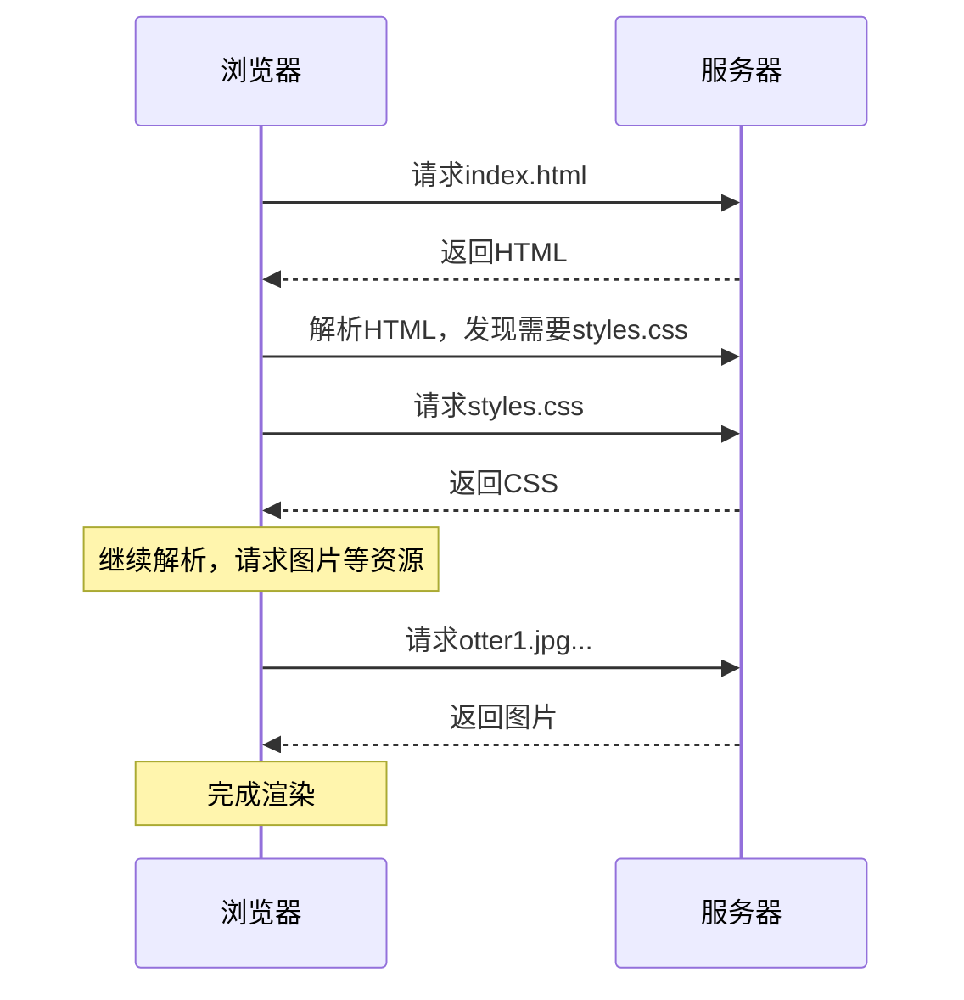

### 5. 经典金句

> “浏览器的工作是向服务器发送请求，解释从服务器收到的HTML、CSS和JavaScript，再将结果呈现给用户。”(p.17)
> “假若将网站比作生物，HTML就是骨骼与器官（结构），CSS是皮肤（可视层），而JavaScript则是其个性（行为举止）。”(p.17)

---

## 第3章：样式

### 1. 核心论点

本章解决的核心问题是：如何使用CSS为HTML页面添加样式。作者认为，通过理解选择器优先级、盒模型、样式继承和颜色等核心概念，可以有效地控制网页的视觉呈现。

### 2. 关键概念

- **CSS选择器优先级**：当多个样式规则应用于同一元素时，根据选择器的权重（ID > 类 > 元素）决定应用哪个样式。应尽量使用类名选择器，避免ID选择器。
- **盒模型**：每个HTML元素在页面中都是一个矩形盒子，由内容（content）、内边距（padding）、边框（border）、外边距（margin）组成。
- **样式继承**：许多CSS属性（如font-size）会被后代元素继承。可以通过在更近的祖先上设置相同属性来覆盖继承值。
- **@font-face**：CSS规则，用于加载自定义字体，需要提供多种格式（eot、woff、ttf、svg）以兼容不同浏览器。
- **normalize.css**：一个CSS库，用于消除不同浏览器默认样式的差异，提供一致的样式基准。

### 3. 逻辑推演

本章从引入normalize.css开始，为Ottergram提供跨浏览器一致的样式基准。然后，通过为<span>添加类名，创建了第一条样式规则，并详细讲解了选择器的构成和优先级。接着，通过盒模型、样式继承、颜色调整、空白处理、字体添加等步骤，逐步美化页面。作者特别介绍了关系选择器（后代、子、兄弟、相邻兄弟）的使用场景，以及如何通过开发者工具动态调试样式。最后，通过初级挑战（更改颜色）和延展阅读（优先级详解）巩固所学。

### 4. 经典金句

> “应尽量使用类名选择器。使用描述性较强的类名能够使代码的编写和维护更加方便。”(p.32)

---

## 第4章：flexbox响应式布局

### 1. 核心论点

本章解决的核心问题是：如何使用flexbox和CSS定位技术创建响应式、可动态调整的页面布局。作者认为，flexbox是现代CSS布局的核心工具，可以确保页面元素填满屏幕并保持相对比例。

### 2. 关键概念

- **flexbox（弹性盒布局）**：一种CSS布局模式，用于在容器内动态分配空间和对齐项目。flex容器控制其子元素（flex项目）沿主轴和侧轴的布局。
- **flex属性**：缩写属性，指定flex项目的拉伸程度。flex: 0 1 auto表示项目不拉伸，必要时收缩，基于自身大小。
- **flex-direction**：定义主轴方向，默认为row（水平），可改为column（垂直）。
- **order属性**：改变flex项目的绘制顺序，默认值为0，值越大越靠后。
- **绝对定位 vs. 相对定位**：绝对定位元素脱离常规文档流，相对于最近的已定位（position非static）祖先元素定位；相对定位元素仍在文档流中，相对于其正常位置偏移。

### 3. 逻辑推演

本章首先为Ottergram添加大图展示区域，并将缩略图改为水平滚动布局。然后，引入flexbox，通过将<body>设置为flex容器，并使用flex-direction: column和flex属性，解决了页面布局问题。接着，通过创建.main-content容器、使用flex缩写属性、修改order值，精确控制了页面元素的尺寸和排列顺序。最后，使用绝对定位和相对定位将大图标题定位到图片左下角，并通过text-shadow和自定义字体（Airstream）美化标题效果。

### 4. 流程图

#### flex项目空间分配（假设3个项目，总空间=4份）

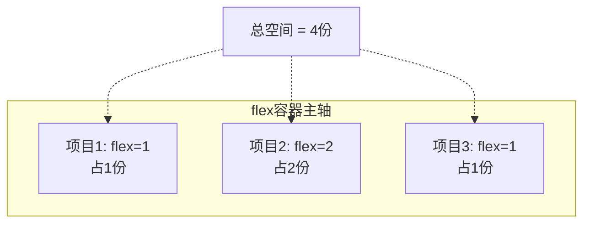

### 5. 经典金句

> “强烈建议直接使用flex替代具体属性，这能够避免因无意间遗漏某个属性而造成的不符合预期的结果。”(p.68)

---

## 第5章：使用媒体查询完成自适应布局

### 1. 核心论点

本章解决的核心问题是：如何使用媒体查询（Media Queries）让布局根据视口大小自动切换。作者认为，移动优先的设计方法是最佳实践，应先为小屏幕编写样式，再通过媒体查询为大屏幕添加覆盖样式。

### 2. 关键概念

- **响应式站点 vs. 自适应布局**：响应式设计常被误解为“速度很快”或“有动画”，更准确的术语是“自适应布局”，即根据浏览器条件切换样式。
- **布局视口 vs. 视觉视口**：布局视口是浏览器用来计算页面布局的“虚拟屏幕”；视觉视口是用户在设备屏幕上实际看到的部分，用户可以缩放。
- **理想视口**：特定设备上特定浏览器的最佳视口尺寸。通过<meta name="viewport" content="width=device-width, initial-scale=1">设置。
- **媒体查询**：CSS语法，允许根据设备特征（如min-width、orientation）应用不同的样式块。格式为@media all and (min-width: 768px) { ... }。
- **设备模式**：Chrome开发者工具中的功能，可模拟不同手机类型和屏幕尺寸，用于响应式测试。

### 3. 逻辑推演

作者首先解释了响应式设计的核心概念，并指出移动浏览器中存在布局视口和视觉视口两种视口。接着，指导读者添加viewport <meta>标签，将布局视口设置为理想视口。然后，在styles.css末尾添加媒体查询，当屏幕宽度≥768px时，改变.main-content的flex-direction为row，使缩略图与大图并排显示。同时，调整.thumbnail-list的flex-direction和order，以及缩略图项的样式，完成宽屏布局的适配。最后，提出了改变屏幕方向、实现圣杯布局等挑战。

### 4. 经典金句

> “推荐方式是先为最小屏幕书写样式，随后使用媒体查询，当视口大小超出一定阈值时，使用添加的重载样式。”(p.83)

---

## 第6章：JavaScript事件处理

### 1. 核心论点

本章解决的核心问题是：如何使用JavaScript为静态页面添加交互功能。作者认为，通过理解变量、函数、DOM操作和事件监听器，可以让页面响应用户的点击、按键等操作。

### 2. 关键概念

- **ECMAScript版本**：JavaScript的标准，本书涉及ES3（最广泛支持）、ES5（新增严格模式）、ES6（新语法）。
- **数据属性（data-*）**：自定义的HTML属性，用于JavaScript与HTML元素交互，属性名以data-开头。
- **变量声明**：使用var关键字，变量名全大写表示该值不应被改动（常量约定）。
- **控制台（Console）**：开发者工具的一部分，可输入JavaScript代码并立即执行，用于调试和测试。
- **DOM（文档对象模型）**：浏览器对HTML文档的内部表示。通过document对象及querySelector等方法与之交互。
- **事件监听器**：监听特定事件（如click、keyup），并在事件发生时触发回调函数。

### 3. 逻辑推演

本章首先为Ottergram添加data-*属性，为JavaScript提供交互“钩子”。然后，创建scripts/main.js文件，并为大图、标题、缩略图定义选择器变量。通过操作控制台，演示了如何访问DOM元素（document.querySelector）、修改属性（setAttribute、textContent）。接着，编写了setDetails、imageFromThumb、titleFromThumb、setDetailsFromThumb等函数，实现了从缩略图读取数据并更新大图的核心逻辑。最后，通过addEventListener为缩略图添加点击事件，通过遍历缩略图数组和调用initializeEvents函数，完成了整个交互功能的初始化，并添加了键盘（Esc键）隐藏大图的功能。

### 4. 流程图

#### 点击缩略图更新大图的执行流程

```mermaid
graph TD
    A[用户点击缩略图] --> B[click事件触发]
    B --> C[preventDefault阻止默认跳转]
    C --> D[调用setDetailsFromThumb(thumb)]
    D --> E[调用imageFromThumb获取图片URL]
    D --> F[调用titleFromThumb获取标题文本]
    E & F --> G[调用setDetails(imageUrl, titleText)]
    G --> H[更新大图的src属性]
    G --> I[更新大图<span>的textContent属性]
    H & I --> J[页面大图更新完成]
```

### 5. 经典金句

> “字符串是JavaScript的五个基本数据类型之一...“基本”意味着它们代表的都是简单值，这个简单是相对于...JavaScript复杂类型而言的。”(p.100)

---

## 第7章：使用CSS营造视觉效果

### 1. 核心论点

本章解决的核心问题是：如何使用CSS过渡（transition）和变形（transform）为页面添加平滑的视觉效果。作者认为，通过CSS过渡，可以创造从一种视觉状态平滑变化到另一种状态的效果，提升用户体验。

### 2. 关键概念

- **CSS过渡（transition）**：指定一个或多个CSS属性在变化时以动画形式呈现，包含属性名、持续时间、定时函数（ease、linear等）。
- **变形（transform）**：改变元素的形状、尺寸、角度或位置，而不影响其周围元素。常用值有scale()（缩放）、rotate()（旋转）。
- **伪类:hover**：当用户鼠标悬停在元素上时匹配，可用于触发过渡效果。
- **基于类的过渡**：通过JavaScript动态添加/删除类名来触发过渡效果，适用于没有对应伪类的事件（如点击）。
- **setTimeout**：JavaScript函数，用于在指定延迟后将一个函数加入执行队列。
- **自定义定时函数（cubic-bezier）**：通过三次贝塞尔曲线自定义过渡动画的速度变化规律，比内置的ease-in、ease-out等更灵活。

### 3. 逻辑推演

本章首先实现了按Esc键隐藏大图、点击缩略图重新显示大图的功能。然后，介绍了CSS过渡的基本概念，并为缩略图添加了鼠标悬停时放大到120%并平滑过渡的效果。接着，为.detail-image-frame添加了.is- tiny类，实现图片从小到大的“拉近”效果。通过JavaScript的setTimeout，巧妙地控制添加和移除.is- tiny类的时机，触发了平滑的放大动画。最后，使用cubic-bezier.com网站自定义了过渡效果的定时函数，让动画效果更加独特。

### 4. 流程图

#### CSS过渡效果触发流程（基于类）

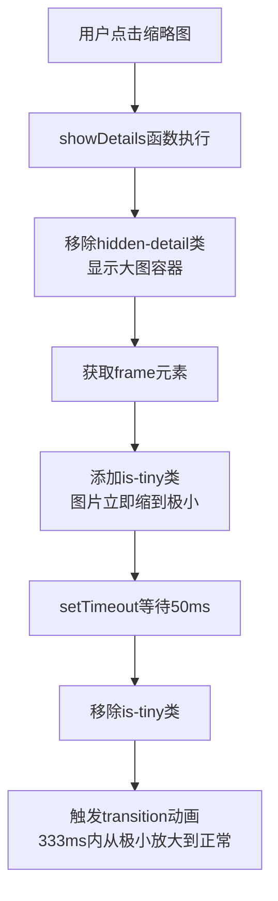

### 5. 经典金句

> “创建CSS过渡时需要告诉浏览器：‘我希望这个元素的样式变为这些新的属性。我一告诉你，你就给我变。’”(p.132)

---

## 第二部分：模块、对象及表单

---

## 第8章：模块、对象和方法

### 1. 核心论点

本章解决的核心问题是：如何使用模块模式和构造函数来组织和封装代码。作者认为，通过立即调用的函数表达式（IIFE）和原型链，可以在ES5中实现模块化，避免全局命名空间污染，并创建可复用的对象类型。

### 2. 关键概念

- **模块模式**：使用IIFE（立即调用的函数表达式）创建独立的作用域，将相关代码组织在一起，并通过修改全局对象（如window.App）暴露公共接口。
- **IIFE（立即调用的函数表达式）**：`(function(){ ... })();`，定义一个匿名函数并立即执行，用于创建私有作用域，避免全局污染。
- **构造函数**：用于创建和定制新对象的函数。约定首字母大写。使用new关键字调用时，会创建一个新对象，并将this指向它。
- **原型（prototype）**：每个构造函数都有一个prototype属性，所有通过该构造函数创建的实例都能共享原型上的属性和方法。
- **this关键字**：在函数内部指向函数的“所有者”。在构造函数和原型方法中，this指向当前实例；在回调函数中，this可能为undefined，需要用bind()绑定。

### 3. 逻辑推演

本章首先介绍了模块模式和IIFE的原理，并通过改造Ottergram的初始化代码进行演示。然后，开始搭建CoffeeRun项目，创建了DataStore模块，并讲解如何通过IIFE和window.App命名空间来组织代码。接着，深入讲解了构造函数和原型的概念，为DataStore添加了add、get、getAll、remove等方法。之后，创建了Truck模块，其构造函数接受truckId和db（DataStore实例）参数，并提供了createOrder、deliverOrder、printOrders等方法。最后，创建main.js模块，在页面加载时初始化Truck实例，并将其暴露到全局以便在控制台调试，同时演示了使用bind()修复printOrders中this指向错误的调试过程。

### 4. 流程图

#### IIFE模块模式结构

```mermaid
graph LR
    subgraph 模块文件 (datastore.js)
        A[(function(window) { ... })(window);]
    end
    subgraph 执行过程
        B[检查window.App是否存在]
        C[定义DataStore构造函数]
        D[将DataStore挂载到App]
        E[将App挂回window]
    end
    subgraph 结果
        F[window.App.DataStore可用]
    end
    A --> B --> C --> D --> E --> F
```

### 5. 经典金句

> “ES5没有提供正式的模块化方案，但通过将相关的代码（变量和函数）放在一个函数内，可以获得类似的效果。”(p.147)
> “JavaScript并没有类的概念，不过它允许我们自定义类型。”(p.154)

---

## 第9章：Bootstrap简介

### 1. 核心论点

本章解决的核心问题是：如何使用Bootstrap CSS框架快速为应用添加美观、响应式的UI样式。作者认为，Bootstrap提供了“开箱即用”的样式，可以让我们专注于应用逻辑，而不必从零开始设计UI。

### 2. 关键概念

- **Bootstrap**：Twitter开发的前端CSS框架，提供大量预定义的CSS类（如container、form-control、btn等），用于快速构建响应式网站。
- **container类**：Bootstrap的核心类，用于包裹所有需要适应视口大小的内容，提供基本的布局自适应功能。
- **form-group**：Bootstrap为表单元素提供一致垂直间距的类。
- **form-control**：Bootstrap为表单元素（input、select等）提供布局和排版样式的类。
- **radio按钮组**：通过相同的name属性实现单选功能，checked属性设置默认选中项。
- **range滑块**：<input type="range">，提供滑块控件，用于选择范围内的数值。

### 3. 逻辑推演

作者首先指导读者从cdnjs.com加载Bootstrap CSS，并在index.html中添加container类和页头。随后，逐步构建咖啡订单表单：添加文本输入字段（咖啡订单、邮箱地址），并设置autofocus、placeholder属性；添加单选按钮（杯型选择）；添加下拉菜单（口味选择）；添加范围滑块（咖啡浓度选择）；最后添加提交和重置按钮。整个过程展示了Bootstrap的标记模式和类名约定。

### 4. 经典金句

> “Bootstrap特别适合快速为应用程序添加样式，好让我们专注于应用程序逻辑。”(p.187)

---

## 第10章：使用JavaScript处理表单

### 1. 核心论点

本章解决的核心问题是：如何使用JavaScript捕获表单提交事件，提取数据，并将其传递给应用逻辑模块。作者认为，通过创建FormHandler模块和引入jQuery，可以拦截表单的默认提交行为，实现客户端数据处理。

### 2. 关键概念

- **jQuery**：一个流行的JavaScript库，提供简化的DOM操作、事件处理和Ajax功能。通过`$`函数访问。
- **FormHandler模块**：自定义模块，负责与表单交互，拦截submit事件，提取表单数据，并调用回调函数。
- **serializeArray()**：jQuery方法，将表单元素的值转换为一个对象数组，每个对象包含name和value属性。
- **事件委托**：通过为动态元素的父容器添加事件监听器，利用事件冒泡机制处理动态添加的子元素的事件。
- **原型方法**：在构造函数的prototype上定义的方法，供所有实例共享。

### 3. 逻辑推演

本章创建了FormHandler模块，通过IIFE和jQuery封装。FormHandler构造函数接受一个selector参数，并使用jQuery查找对应的<form>元素。原型方法addSubmitHandler注册表单的submit事件监听器，使用preventDefault阻止默认提交，并通过serializeArray和forEach遍历将表单数据转换为对象。addSubmitHandler接受一个回调函数fn，在数据提取完成后调用fn(data)。在main.js中，实例化FormHandler，并将myTruck.createOrder绑定后作为回调传入，实现了表单提交时创建咖啡订单的功能。最后，通过调用表单的reset和focus方法优化了用户体验。

### 4. 流程图

#### FormHandler处理表单提交流程

```mermaid
graph TD
    A[用户点击提交] --> B[submit事件触发]
    B --> C[preventDefault阻止页面刷新]
    C --> D[serializeArray获取表单数据]
    D --> E[遍历数组，构建data对象]
    E --> F[调用回调函数 fn(data)]
    F --> G[回调函数内部调用myTruck.createOrder]
    G --> H[this.reset() 重置表单]
    H --> I[this.elements[0].focus() 聚焦到第一个字段]
```

### 5. 经典金句

> “当使用jQuery的$函数来选择元素时，它并不会像document.querySelectorAll一样返回DOM元素的引用，而是返回单个对象，而该对象中会包含对所选元素的引用。”(p.192)

---

## 第11章：从数据到DOM

### 1. 核心论点

本章解决的核心问题是：如何将应用数据动态渲染到DOM中，并实现与用户的交互。作者认为，通过创建CheckList模块和Row构造函数，可以为每个咖啡订单动态生成DOM元素，并实现点击订单行将其删除的功能。

### 2. 关键概念

- **CheckList模块**：负责将待处理订单显示为页面清单，并提供删除订单行的功能。
- **Row构造函数**：用于创建表示单个咖啡订单的DOM元素子树，包含复选框和描述文本。
- **append方法**：jQuery方法，用于将DOM元素或jQuery封装集合添加为调用者的子元素。
- **call方法**：用于调用一个函数，并显式设置其内部的this值。与bind不同，call会立即执行函数。
- **事件委托模式**：通过为父容器添加单一事件监听程序，根据实际触发事件的元素执行相应的处理程序，适用于动态添加或删除元素的场景。

### 3. 逻辑推演

本章首先在index.html中添加了待处理订单清单的容器。然后，创建CheckList模块，并在其内部定义Row构造函数。Row构造函数使用jQuery动态创建<div>、<label>、<input type="checkbox">和描述文本，构建完整的DOM子树。CheckList.prototype.addRow方法使用Row构造函数创建新行，并将其附加到清单容器中。在main.js中，修改表单提交处理程序，使用call方法同时调用myTruck.createOrder和checkList.addRow。接着，实现CheckList.prototype.removeRow方法，根据邮箱地址查找并删除对应的清单行。最后，实现CheckList.prototype.addClickHandler，使用事件委托监听<input>的点击事件，调用deliverOrder并从UI中删除该行。

### 4. 流程图

#### Row构造函数构建DOM子树

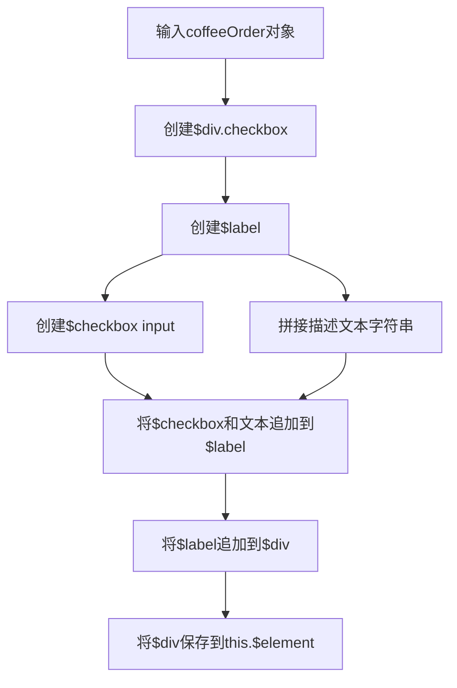

### 5. 经典金句

> “jQuery的设计允许我们像多步执行一样对一个对象进行多个方法调用，只需要在最后一个方法调用的末尾加上分号即可。”(p.214)

---

## 第12章：表单校验

### 1. 核心论点

本章解决的核心问题是：如何通过HTML5属性、正则表达式和约束校验API对表单输入进行验证。作者认为，应同时使用客户端校验（提升用户体验）和服务端/自定义校验（确保数据合法性），并通过CSS伪类美化有效/无效元素的样式。

### 2. 关键概念

- **required属性**：布尔属性，使表单字段成为必填项。只要属性存在，无论值是什么，都表示true。
- **pattern属性**：使用正则表达式限制输入内容的格式。如`[a-zA-Z\s]+`限制只能输入字母和空格。
- **约束校验API**：一组JavaScript API，用于触发内置的校验行为和自定义校验逻辑。核心方法是setCustomValidity()。
- **正则表达式**：用于模式匹配的字符串。`/.+@bignerdranch\.com$/`匹配以@bignerdranch.com结尾的邮箱地址。
- **input事件**：当用户输入时触发，比change或blur事件更适合实时校验。
- **伪类:invalid**：浏览器自动为校验失败的表单元素添加的CSS伪类，可用于高亮无效字段。

### 3. 逻辑推演

本章首先为咖啡订单和邮箱字段添加required属性，实现必填校验。然后，为订单字段添加pattern属性，限制只能输入字母和空格。接着，创建Validation模块，添加isCompanyEmail方法，使用正则表达式校验邮箱域名。在FormHandler模块中添加addInputHandler方法，监听input事件，并在邮箱字段上实时调用isCompanyEmail。校验失败时，通过setCustomValidity(message)设置自定义错误信息。最后，在CSS中使用`:focus:required:invalid`伪类为无效字段添加红色边框，提升视觉反馈。

### 4. 经典金句

> “记住，无须为布尔属性赋值。如果误写为required="false"，事实上它的值仍然为true，这个字段仍是必填项！”(p.219)

---

## 第13章：Ajax

### 1. 核心论点

本章解决的核心问题是：如何使用Ajax（异步JavaScript和XML）与远程RESTful Web服务通信，实现数据的远端存储和检索。作者认为，通过RemoteDataStore模块和jQuery的Ajax方法，可以在不刷新页面的情况下与服务器交互。

### 2. 关键概念

- **Ajax**：通过JavaScript在后台与服务器通信的技术，无需刷新页面即可更新数据。
- **XMLHttpRequest对象**：Ajax的核心API，用于向服务器发送请求并处理响应。
- **RESTful Web服务**：一种基于HTTP操作（GET、POST、PUT、DELETE）和URL的Web服务架构风格。
- **HTTP状态码**：服务器返回的响应状态，如200（成功）、404（未找到）、500（服务器错误）。
- **$.post、$.get、$.ajax**：jQuery提供的简化Ajax操作的方法。
- **回调函数**：Ajax请求完成后执行的函数，用于处理服务器返回的数据。

### 3. 逻辑推演

本章首先介绍了XMLHttpRequest对象和RESTful Web服务的基本概念。然后，创建RemoteDataStore模块，其构造函数接受服务器URL。原型方法add使用$.post向服务器发送POST请求；getAll使用$.get获取所有订单；get使用$.get + URL路径获取单个订单；remove使用$.ajax发送DELETE请求。通过浏览器的网络面板（NetWork），可以查看Ajax请求和响应的详细信息。最后，在main.js中用RemoteDataStore替换原有的DataStore，将咖啡订单数据保存到远端服务器，并从服务器加载已有订单。

### 4. 流程图

#### RESTful API操作与URL对应关系

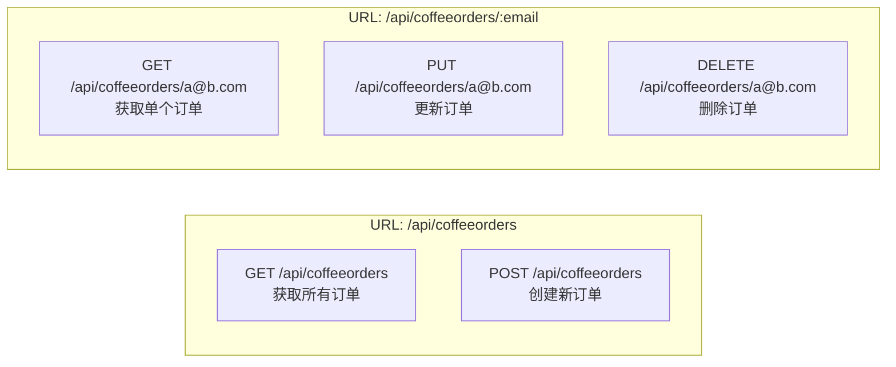

### 5. 经典金句

> “Ajax是通过JavaScript与远端服务器通信的技术。JavaScript可以在无须刷新页面的情况下，利用服务器返回的数据更新页面，这大大改善了Web应用的体验。”(p.230)

---

## 第14章：Deferred和Promise

### 1. 核心论点

本章解决的核心问题是：如何使用Promise和Deferred来管理复杂的异步操作，避免“回调地狱”。作者认为，Promise提供了一种更优雅的方式来处理异步代码，通过链式调用then和catch，可以清晰表达操作的依赖关系和错误处理。

### 2. 关键概念

- **Promise**：表示一个异步操作的最终完成（或失败）及其结果值的对象。有三种状态：pending（进行中）、fulfilled（已成功）、rejected（已失败）。
- **Deferred**：jQuery中对Promise的实现，由$.ajax等方法返回。拥有resolve()和reject()方法，以及then()方法用于注册回调。
- **回调地狱**：多层嵌套的回调函数导致代码难以阅读和维护的现象。
- **then方法**：Promise对象的方法，用于注册当Promise状态变为fulfilled时执行的回调函数。可以链式调用。
- **catch方法**：用于注册当Promise状态变为rejected时执行的回调函数。
- **Promise化**：将基于回调函数的异步操作转换为返回Promise对象的操作。

### 3. 逻辑推演

本章首先通过对比“回调地狱”和Promise链，直观展示了Promise的优势。然后，修改RemoteDataStore模块，让add、get、getAll、remove方法返回$.ajax生成的Deferred对象。接着，修改Truck模块的createOrder、deliverOrder、printOrders方法，也返回Deferred。在main.js中，使用.then将addRow的调用链接在createOrder之后，确保只有在远端保存成功后才更新UI。同时，为addSubmitHandler添加错误处理回调，在Ajax失败时弹出警告。最后，为了保持DataStore的兼容性，使用原生的Promise构造函数将其方法也“Promise化”，并提供了一个promiseResolvedWith辅助函数。

### 4. 流程图

#### Promise链式调用 vs. 回调地狱

```mermaid
graph LR
    subgraph Promise链
        A[formHandler.addSubmitHandler] --> B[.then(myTruck.createOrder)]
        B --> C[.then(saveOnServer)]
        C --> D[.catch(handleServerError)]
        D --> E[.then(checkList.addRow)]
        E --> F[.catch(handleDomError)]
    end
    subgraph 回调地狱
        G[表单提交] --> H[try...嵌套try...嵌套try...]
        H --> I[...]
    end
```

### 5. 经典金句

> “Promise提供了一种管理复杂异步操作的方法。”(p.245)
> “最好的做法就是将Deferred返回，这能让调用createOrder或者deliverOrder的对象所注册的回调函数在异步操作完成后被调用。”(p.248)

---

## 第三部分：实时数据传输

---

## 第15章：Node.js入门

### 1. 核心论点

本章解决的核心问题是：如何使用Node.js构建一个简单的Web服务器。作者认为，Node.js让JavaScript可以在服务器端运行，通过内置的http、fs、path等模块，可以轻松创建处理HTTP请求、读取文件、路由分发的Web服务器。

### 2. 关键概念

- **Node.js**：一个开源项目，允许JavaScript代码在浏览器之外运行，可访问硬盘驱动器、数据库和网络。
- **npm**：Node包管理器，用于安装开源工具和模块。`npm init`创建package.json文件。
- **package.json**：Node项目的配置文件，包含项目名称、版本、依赖和脚本命令。
- **http模块**：Node内置模块，提供创建HTTP服务器和客户端的功能。`http.createServer()`创建服务器。
- **fs模块**：Node内置文件系统模块，提供读写文件的功能。`fs.readFile()`读取文件。
- **path模块**：Node内置路径模块，用于处理和转换文件路径，解决不同操作系统的路径分隔符差异。
- **module.exports**：Node中用于导出模块内容的全局变量，供其他模块通过require引入。
- **nodemon**：一个开发工具，监听文件变化并自动重启Node程序，提升开发效率。

### 3. 逻辑推演

本章首先通过`npm init`创建package.json，并添加start和dev脚本。然后编写index.js，使用http模块创建基本的“Hello, World”服务器。接着，引入fs模块，让服务器能够读取app/index.html文件并返回。为了处理不同的请求URL，使用req.url获取路径，并路由到对应的文件。为了增强代码的模块性，创建extract.js模块，封装提取文件路径的逻辑，并通过module.exports导出。最后，添加错误处理，当文件不存在时返回404状态码。

### 4. 流程图

#### Node.js 服务器处理HTTP请求流程

```mermaid
graph TD
    A[浏览器发起请求] --> B[http.createServer回调触发]
    B --> C[获取req.url]
    C --> D[调用extract函数<br>解析文件路径]
    D --> E[fs.readFile读取文件]
    E --> F{文件是否存在?}
    F -- 是 --> G[res.end(data) 返回文件内容]
    F -- 否 --> H[handleError: res.writeHead(404) 返回404]
    G & H --> I[响应返回浏览器]
```

### 5. 经典金句

> “Node环境下的JavaScript代码能够访问硬盘驱动器、数据库和网络。”(p.262)
> “永远不要默默地丢弃错误。”(p.274)

---

## 第16章：使用WebSocket进行实时通信

### 1. 核心论点

本章解决的核心问题是：如何使用WebSocket在客户端和服务器之间建立实时、双向的通信通道。作者认为，与传统的Ajax请求相比，WebSocket提供了一个单独的、持久的连接，适合聊天应用等需要实时数据交换的场景。

### 2. 关键概念

- **WebSocket**：一个提供HTTP之上的双向通信协议，创建一个单独的连接并保持打开，用于实时通信。
- **ws模块**：Node.js中实现WebSocket协议的流行模块，性能好。
- **回声服务器**：一个简单的WebSocket服务器，将接收到的消息原样返回给客户端，用于测试。
- **wscat**：一个命令行工具，用于测试WebSocket服务器，可作为聊天客户端。
- **messages数组**：在服务器端用于记录所有聊天消息的数组，新用户连接时会收到所有历史消息。

### 3. 逻辑推演

本章首先安装ws模块，并创建websockets-server.js。该模块创建WebSocket.Server实例，监听3001端口。通过监听connection事件，获取每个客户端的socket对象。首先实现回声服务器（socket.on('message')中调用socket.send(data)）。然后，使用wscat工具进行测试。接着，添加messages数组记录所有消息，当新用户连接时，遍历数组并发送所有历史消息。最后，为了广播新消息，在收到消息时遍历ws.clients数组，向所有已连接的客户端发送消息，实现多人聊天的基本功能。

### 4. 流程图

#### WebSocket聊天服务器广播消息

```mermaid
graph TD
    A[客户端A发送消息] --> B[服务器收到message事件]
    B --> C[将消息push到messages数组]
    C --> D[遍历ws.clients]
    D --> E{对每个clientSocket}
    E --> F[clientSocket.send(data)]
    F --> G[客户端B、C...收到消息]
```

### 5. 经典金句

> “WebSocket提供了HTTP之上的双向通信协议。它创建一个单独的连接，而且保持连接打开，用来进行实时通信。”(p.277)

---

## 第17章：借助Babel使用ES6

### 1. 核心论点

本章解决的核心问题是：如何在当前浏览器尚未完全支持ES6的情况下，使用Babel将ES6代码编译为兼容性更好的ES5代码。作者认为，通过Babel、Browserify和Watchify等工具，可以搭建自动化的构建流程，在享受ES6新语法（如class、let、箭头函数、模块）的同时，确保应用能在多种浏览器中运行。

### 2. 关键概念

- **ES6 (ECMAScript 2015)**：JavaScript语言的重要更新，引入了class、let、const、箭头函数、模块等新特性。
- **Babel**：一个编译器，将ES6语法翻译成等价的ES5代码。
- **Browserify**：一个打包工具，将Node.js风格的模块（require/module.exports）打包成浏览器可用的单文件。
- **Babelify**：Browserify的转换插件，让Browserify在打包前先使用Babel编译代码。
- **Watchify**：监听源文件变化，自动触发Browserify重新编译，提升开发效率。
- **class语法**：ES6中定义类的语法糖，底层仍是构造函数和原型。
- **箭头函数**：ES6中匿名函数的缩写，`() => {}`，并且不会改变this的指向。
- **let和const**：ES6中新的变量声明方式，具有块级作用域。const声明常量，let声明可变变量。
- **模块导入/导出**：使用`import ... from ...`和`export default ...`实现模块化。

### 3. 逻辑推演

本章首先介绍了ES6的浏览器支持现状，并说明了使用Babel的原因。然后，安装babel-cli、babel-core、babel-preset-es2015等工具，并配置.babelrc文件。接着，创建Chattrbox客户端应用的目录结构和文件（app.js, dom.js, main.js, ws-client.js）。在app.js中，用ES6的class关键字定义ChatApp类和ChatMessage类，并使用export default导出。在main.js中用import导入ChatApp并实例化。为了将这些模块打包，配置package.json的browserify字段，并添加build和watch脚本。最终，通过npm run build或npm run watch完成ES6到ES5的编译和打包。

### 4. 流程图

#### ES6到ES5编译打包流程

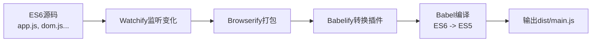

### 5. 经典金句

> “ES6非常棒，你值得拥有，不必等到所有浏览器都支持它的时候才开始使用。”(p.286)
> “箭头函数是匿名函数的一种缩写方式。除了写起来更简单，箭头函数与一般的匿名函数一模一样。”(p.300)

---

## 第18章：继续ES6探索之旅

### 1. 核心论点

本章解决的核心问题是：如何使用ES6的更多特性（如模板字符串、解构赋值、类继承、Promise）完成Chattrbox客户端应用的全部功能。作者认为，通过综合运用ES6新语法和第三方库（jQuery、moment、Gravatar），可以构建一个功能完善的实时聊天应用。

### 2. 关键概念

- **模板字符串**：使用反引号(\`)定义的字符串，可通过`${expression}`嵌入JavaScript表达式。
- **解构赋值**：从数组或对象中提取值并赋值给变量的简洁语法。
- **类继承（extends/super）**：ES6中通过extends关键字实现类继承，子类构造函数中必须调用super()。
- **sessionStorage**：浏览器API，用于在浏览器会话期间存储键值对数据，会话结束（关闭标签页/窗口）时清除。
- **闭包动作（closure action）**：Ember 2.0中引入的语法，用于将函数作为属性传入组件。
- **moment.js**：一个流行的JavaScript日期处理库，用于格式化和解析日期。

### 3. 逻辑推演

本章首先通过npm安装jQuery，并使用import导入。然后，创建ChatForm类，管理消息表单的提交，并处理用户输入。创建ChatList类，负责将消息渲染到UI中。为了实现用户头像，使用crypto-js/md5生成邮箱哈希，拼接Gravatar URL。添加promptForUsername函数请求用户名，并将其存入sessionStorage中，实现会话记忆。为了格式化时间戳，安装moment库，并在ChatList的drawMessage和init方法中使用moment(timestamp).fromNow()格式化时间。最后，通过定时器（setInterval）动态更新时间戳，完成完整的聊天应用。

### 4. 流程图

#### 用户加入聊天室流程

```mermaid
graph TD
    A[页面加载] --> B[检查sessionStorage中是否有用户名]
    B -- 有 --> C[直接使用保存的用户名]
    B -- 无 --> D[调用promptForUsername]
    D --> E[用户输入用户名]
    E --> F[存入UserStore (sessionStorage)]
    C & F --> G[使用用户名初始化ChatList]
    G --> H[建立WebSocket连接]
    H --> I[开始聊天]
```

### 5. 经典金句

> “模板字符串。在反引号里使用${...}语法，就可以直接在字符串中包含JavaScript表达式的值。”(p.313)

---

## 第四部分：应用架构

---

## 第19章：初识MVC和Ember

### 1. 核心论点

本章解决的核心问题是：如何安装和配置Ember.js框架，并创建第一个Ember应用。作者认为，Ember是一个强大的MVC框架，通过Ember CLI工具可以快速生成项目结构、管理依赖、编译资源，并启动本地开发服务器。

### 2. 关键概念

- **MVC（模型-视图-控制器）**：一种软件设计模式，模型管理数据，视图管理用户界面，控制器处理应用逻辑。
- **Ember.js**：一款优秀的MVC框架，规定了概念和命名习惯，提供脚手架工具Ember CLI。
- **Ember CLI**：Ember的命令行接口工具，用于新建项目、生成代码、加载依赖、构建和运行应用。
- **Bower**：另一个前端资源管理工具，与npm类似，但专注于浏览器端库（如Bootstrap）。
- **Ember Inspector**：Chrome浏览器插件，用于调试Ember应用，可查看路由、数据、组件等。
- **ember-cli-sass**：Ember插件，用于将SCSS文件编译为CSS文件。
- **ember-cli-build.js**：Ember CLI的配置文件，用于添加外部依赖和修改编译配置。

### 3. 逻辑推演

本章首先概述了MVC模式各层的职责。然后，指导读者安装Ember CLI、Bower、Watchman和Chrome的Ember Inspector插件。接着，通过`ember new tracker`命令创建新的Ember应用，并用`ember serve`启动开发服务器。之后，安装Bootstrap和ember-cli-sass插件，配置ember-cli-build.js以引入Bootstrap的样式和脚本。最后，修改app/templates/application.hbs，添加Bootstrap的NavBar组件，并修改app/styles/app.css为app.scss，引入Bootstrap样式，完成第一个Ember应用的雏形。

### 4. 流程图

#### MVC模式数据流

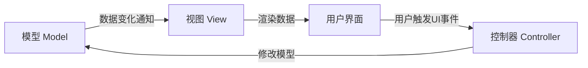

### 5. 经典金句

> “模型负责管理数据...视图负责管理用户界面...控制器负责应用程序逻辑。”(p.324)

---

## 第20章：路由选择、路由表、模型

### 1. 核心论点

本章解决的核心问题是：如何在Ember应用中定义路由、嵌套路由和模型。作者认为，路由是Ember应用的“交通指挥”，通过Router.map定义URL到路由的映射，每个路由负责通过model钩子为模板准备数据。

### 2. 关键概念

- **路由**：监听URL变化，根据路由表找到对应的路由对象，调用生命周期钩子（beforeModel, model, afterModel），为页面准备数据。
- **Ember生成器（ember generate）**：用于快速创建路由、组件、模型等文件的脚手架工具。`ember g route [name]`创建路由。
- **嵌套路由**：在父级路由内部通过回调函数定义子路由，父级模板中的{{outlet}}是子模板的渲染位置。
- **model钩子**：路由对象的方法，用于获取渲染模板所需的数据，以Promise对象形式返回。
- **beforeModel钩子**：model钩子之前执行，常用于检查用户权限或重定向。`this.transitionTo()`进行重定向。
- **Ember Inspector - Routes菜单**：可查看应用中所有路由的嵌套结构和自动生成的loading/error路由。

### 3. 逻辑推演

本章首先介绍了路由选择的概念和Ember的命名约定。然后，使用`ember g route`命令创建Tracker应用所需的一系列路由（index, sightings, sightings/index, sightings/new等）。通过修改生成的模板文件，观察嵌套路由的渲染效果。接着，在app/routes/sightings.js的model钩子中添加模拟数据，并在app/templates/sightings/index.hbs中使用{{#each}}循环渲染数据列表。最后，在app/routes/index.js的beforeModel钩子中使用`this.transitionTo('sightings')`，将访问首页的用户重定向到目击记录列表页。

### 4. 流程图

#### Ember路由生命周期

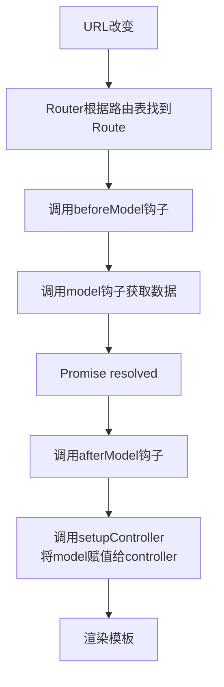

### 5. 经典金句

> “路由选择就像交警指挥交通，它会根据用户输入的URL选择要渲染的页面。”(p.337)

---

## 第21章：模型和数据绑定

### 1. 核心论点

本章解决的核心问题是：如何在Ember中定义模型、创建记录以及使用计算属性。作者认为，通过Ember Data的DS.Model和DS.attr，可以定义模型的结构和属性类型；通过store对象的createRecord和get/set方法，可以创建和操作模型实例；通过Ember.computed，可以创建依赖其他属性的动态计算属性。

### 2. 关键概念

- **Ember Data**：基于Ember.Object构建的库，用于开发模型相关的功能，提供store用于增删改查。
- **模型定义**：使用`DS.Model.extend({ ... })`定义模型。属性用`DS.attr('type')`定义，关联关系用`DS.belongsTo`和`DS.hasMany`定义。
- **store**：Ember Data提供的基于内存的存储，通过`this.store`访问。方法有`createRecord`、`findAll`、`findRecord`、`peekAll`等。
- **get和set**：Ember对象强制使用的方法，用于读取和设置属性。使用getter/setter可以确保属性变化时触发相关事件和计算属性更新。
- **计算属性**：使用`Ember.computed()`定义，依赖其他属性，当依赖属性变化时会重新计算。用于数据装饰和派生属性。

### 3. 逻辑推演

本章首先使用`ember g model`命令创建cryptid、sighting、witness三个模型，并定义它们的属性和关联关系。然后，在app/routes/sightings.js的model钩子中使用this.store.createRecord创建目击记录实例，并返回数组。通过在控制台中使用get和set方法，演示了如何读取和修改模型属性。接着，为目击者模型添加fullName计算属性，拼接fName和lName。最后，修改app/templates/witnesses.hbs模板，使用{{#each}}循环展示目击者列表和计算属性生成的姓名。

### 4. 流程图

#### Ember Data模型关联关系

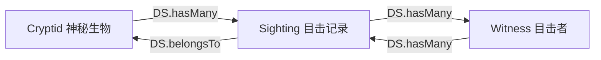

### 5. 经典金句

> “模型的本质就是可以创建包含特殊属性和方法的对象的函数。”(p.349)

---

## 第22章：数据——适配器、序列化器和变换器

### 1. 核心论点

本章解决的核心问题是：如何配置Ember应用的适配器（Adapter）、序列化器（Serializer）和变换器（Transform），以便与后端API进行数据交互。作者认为，适配器负责连接数据源，序列化器负责转换数据格式，变换器负责类型转换，三者协同工作，让应用数据层与API解耦。

### 2. 关键概念

- **适配器（Adapter）**：应用的“译者”，负责与数据源通信。Ember Data内置JSONAPIAdapter和RESTAdapter。
- **JSONAPI规范**：一种可预测且可扩展的数据交换格式标准，用于连接不同语言的服务端。
- **JSONAPIAdapter**：默认适配器，需要API遵循JSONAPI规范。可配置host和namespace属性。
- **序列化器（Serializer）**：适配流程中的转化层，负责在API的JSON格式与应用内部模型格式之间进行转换。
- **变换器（Transform）**：将API提供的数据强制转化成模型所期望的类型。Ember内置了string、number、boolean、date变换器，也可自定义。
- **内容安全策略（CSP）**：一个安全层，用于检测和阻止跨站攻击。Ember CLI提供插件配置白名单。
- **Ember CLI Mirage**：一个插件，用于模拟API，在API不可用时进行开发和测试。

### 3. 逻辑推演

本章首先创建application适配器，配置host和namespace指向本书提供的API。然后，修改app/routes/witnesses.js和cryptids.js，用this.store.findAll替换模拟数据，从真实API获取数据。由于API符合JSONAPI规范，无需额外配置即可正常工作。接着，简要介绍了内容安全策略的配置和序列化器的作用（如keyForAttribute方法用于转换属性键名）。最后，介绍了变换器的定义方法和Ember CLI Mirage插件在API不可用时的用途。

### 4. 流程图

#### 适配器、序列化器、变换器协作流程

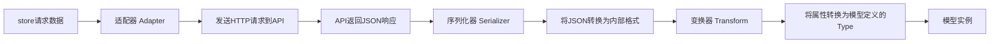

### 5. 经典金句

> “适配器是应用的译者。在与数据源通信时，应用可能需要以多种方式发送和接受数据。”(p.360)

---

## 第23章：视图与模板

### 1. 核心论点

本章解决的核心问题是：如何使用Ember的模板语言Handlebars来渲染视图。作者认为，Handlebars模板通过双大括号{{}}访问模型属性，通过内置辅助方法（如{{#if}}、{{#each}}、{{#link-to}}）实现条件判断、循环和链接，并可自定义辅助方法来封装视图逻辑。

### 2. 关键概念

- **Handlebars**：Ember使用的模板语言，通过双大括号{{}}作为分隔符。
- **HTMLBars**：Ember更新的Handlebars解释器，性能更好。
- **辅助方法（Helper）**：模板中可调用的函数。有行级（如{{input}}）和块级（如{{#if}}...{{/if}}）两种。
- **条件语句**：`{{#if condition}}`...`{{else}}`...`{{/if}}`；`{{#unless condition}}`...`{{/unless}}`。
- **{{#each}}循环**：遍历数组，`{{#each model as |item|}}`...`{{/each}}`。支持{{else}}处理空数组。
- **{{#link-to}}**：创建指向路由的链接，生成`<a>`标签。
- **自定义辅助方法**：使用`ember g helper [name]`生成，通过`Ember.Helper.helper()`注册。

### 3. 逻辑推演

本章首先介绍了Handlebars模板的基本概念。然后，修改app/templates/sightings/index.hbs，使用{{#if}}条件语句判断目击记录是否有location，有则显示地点，无则显示“Bogus Sighting”。接着，修改app/templates/cryptids.hbs，使用{{#each}}循环和{{else}}处理空列表情况。为了动态设置图片src，使用行内{{if}}辅助方法实现三元运算。使用{{#link-to}}替换导航栏和神秘生物图片的链接。最后，为了解决日期格式问题，创建moment-from自定义辅助方法，使用moment库将日期格式化为“2 months ago”等友好字符串。

### 4. 经典金句

> “在Ember中，模板是由模型数据支撑的。”(p.371)

---

## 第24章：控制器

### 1. 核心论点

本章解决的核心问题是：如何在Ember应用中使用控制器处理用户动作（Action），实现数据的创建、编辑和删除。作者认为，控制器负责应用逻辑，通过actions属性定义动作处理函数，在模板中通过{{action}}辅助方法触发。

### 2. 关键概念

- **控制器（Controller）**：MVC中的C，负责应用逻辑，获取模型实例并将其传递给视图。Ember会自动生成控制器，也可自定义。
- **动作（Action）**：在控制器或路由中定义的函数，通过模板中的{{action}}触发。格式：`{{action "actionName"}}`。
- **Ember.RSVP.hash**：用于并行处理多个Promise，返回一个Promise，其resolve值为包含所有结果的哈希对象。
- **emberx-select**：一个Ember插件，提供比原生<select>更易用的{{x-select}}和{{x-option}}组件。
- **transitionToRoute**：控制器或路由的方法，用于跳转到指定路由。
- **hasDirtyAttributes**：模型实例的属性，表示记录是否有未保存的更改。
- **rollbackAttributes**：模型实例的方法，放弃本地修改，恢复到上次保存的状态。
- **destroyRecord**：模型实例的方法，从store和服务器端删除记录。

### 3. 逻辑推演

本章首先修改app/routes/sightings/new.js的model钩子，使用Ember.RSVP.hash返回包含新目击记录、神秘生物列表和目击者列表的Promise。然后，修改模板，使用{{x-select}}和{{input}}创建表单，并通过{{action "create" on="submit"}}绑定提交动作。在控制器中定义create和cancel动作，create中调用model.sighting.save()并跳转，cancel中调用deleteRecord()并跳转。接着，为编辑功能添加路由动态参数，创建edit路由和控制器，实现update和delete动作。最后，演示了如何将动作定义从控制器移到路由中，并解释了两者的区别。

### 4. 经典金句

> “控制器负责应用逻辑，获取模型实例并将其传递给视图。它还包含一些处理程序，可以对模型实例进行修改。”(p.384)

---

## 第25章：组件

### 1. 核心论点

本章解决的核心问题是：如何使用Ember组件创建可重用的、独立的UI元素。作者认为，组件是包含视图和控制器属性的对象，遵循“数据向下，动作向上”的原则，通过属性接收数据，通过动作向上传递事件，实现了UI逻辑的封装和复用。

### 2. 关键概念

- **组件（Component）**：可重用的DOM元素，拥有独立的作用域和上下文。通过`ember g component [name]`创建。
- **数据向下，动作向上**：组件设计原则。父模板通过属性向组件传递数据（数据向下），组件通过闭包动作将事件发送回父组件/控制器（动作向上）。
- **{{yield}}**：在组件模板中标识子元素渲染位置，实现组件内容的自定义。
- **类名绑定（classNameBindings）**：组件属性，将计算属性的值作为类名添加到组件根元素上。
- **闭包动作（closure action）**：将父作用域的函数作为属性传入组件，组件内部可调用该函数，实现动作向上传递。
- **Ember.computed.alias**：为深层嵌套的属性创建别名，简化代码。

### 3. 逻辑推演

本章首先创建listing-item组件，将目击记录列表中每个条目的HTML代码封装起来。通过属性（imagePath、name）传递数据，通过{{yield}}允许父模板自定义内容。接着，将listing-item组件也应用到神秘生物列表，展示了组件的复用性。然后，创建flash-alert组件，用于显示提示信息。通过classNameBindings动态绑定alertType对应的Bootstrap样式类，通过typeTitle计算属性格式化标题。在application控制器中设置alertMessage、alertType、isAlertShowing属性，在application路由中定义flash动作。最后，通过闭包动作将组件的close事件与控制器中的removeAlert动作关联，实现点击提示框关闭的效果。

### 4. 流程图

#### 组件“数据向下，动作向上”原则

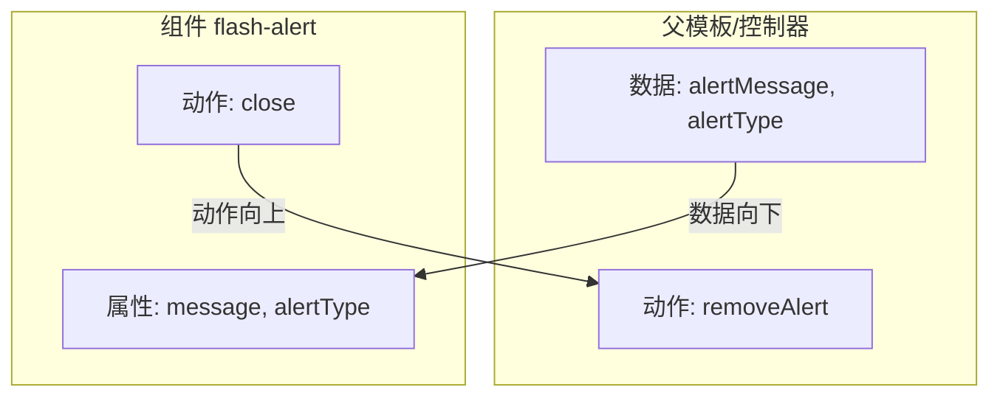

### 5. 经典金句

> “组件有一个非常重要的原则，就是“数据（或状态）向下，动作向上”。”(p.404)
> “组件与控制器不同，它不能直接修改应用的状态，所以它需要以动作的形式向上传递变化。”(p.404)

---

## 第26章：后记

### 1. 核心论点

本章是对全书学习的总结和对读者未来发展的建议。作者认为，完成本书的学习后，读者已经成为一个前端开发者，但成为一个优秀的前端开发者还需要持续学习、与人交流、探索开源社区。

### 2. 关键概念

- **最后的挑战**：成为一个优秀的前端开发者，找到自己的方式。
- **建议**：写代码、学习、与人交流、探索开源社区。

### 3. 逻辑推演

作者鼓励读者，完成本书的学习已经是一个了不起的成就。然后，给出了成为一个优秀前端开发者的四条建议：坚持写代码以防遗忘；持续学习，阅读文档和听播客；参加线下交流会或线上Twitter讨论；探索GitHub上的开源项目，并积极分享自己的代码。最后，作者感谢读者的阅读。

### 4. 经典金句

> “你马上就要读完本书了。不是所有人都像你一样自律，能够坚持学习并完成书中的项目。给自己点个赞吧！”(p.413)

---

# 