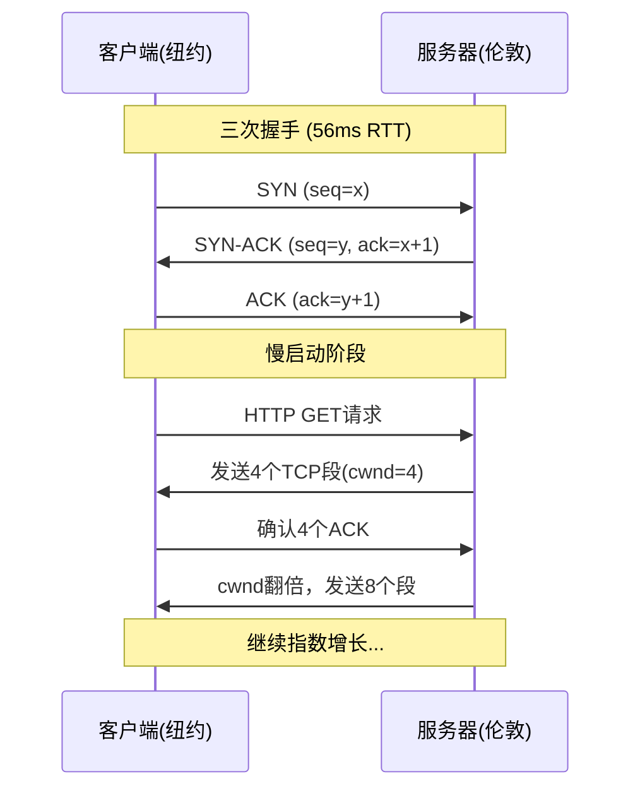
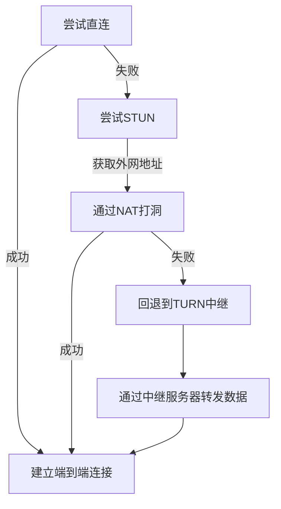
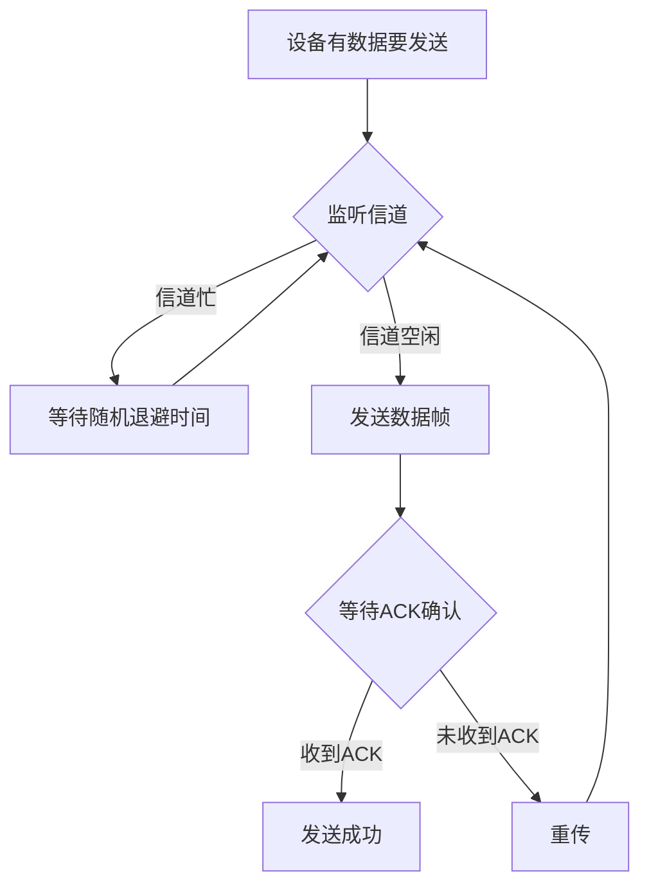
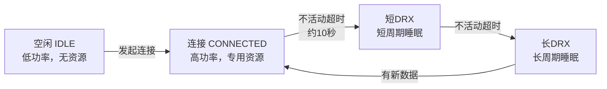
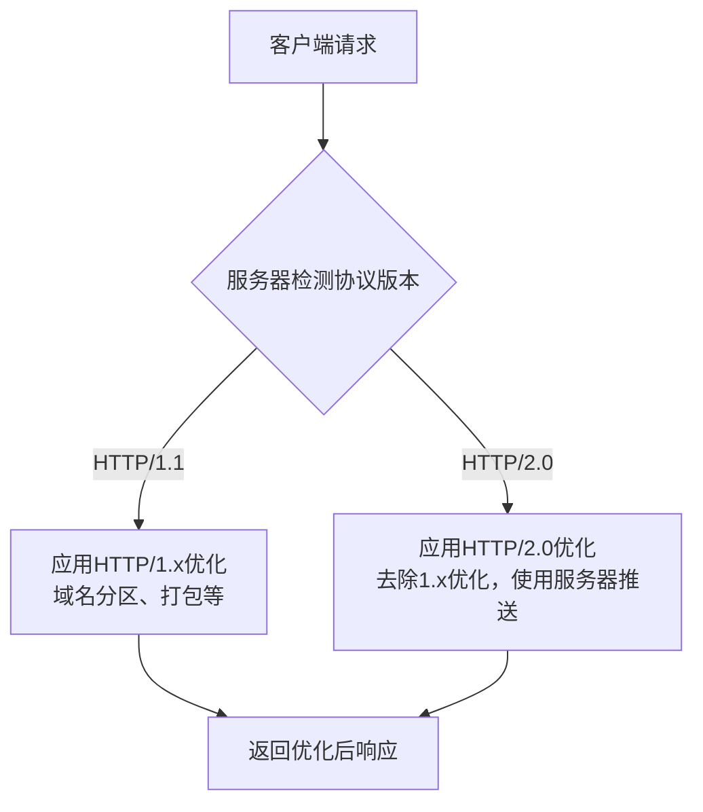
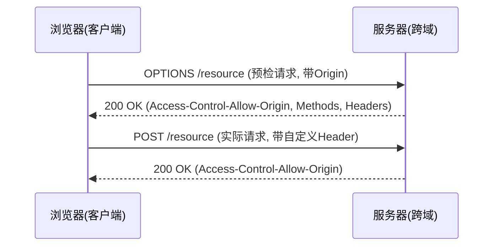
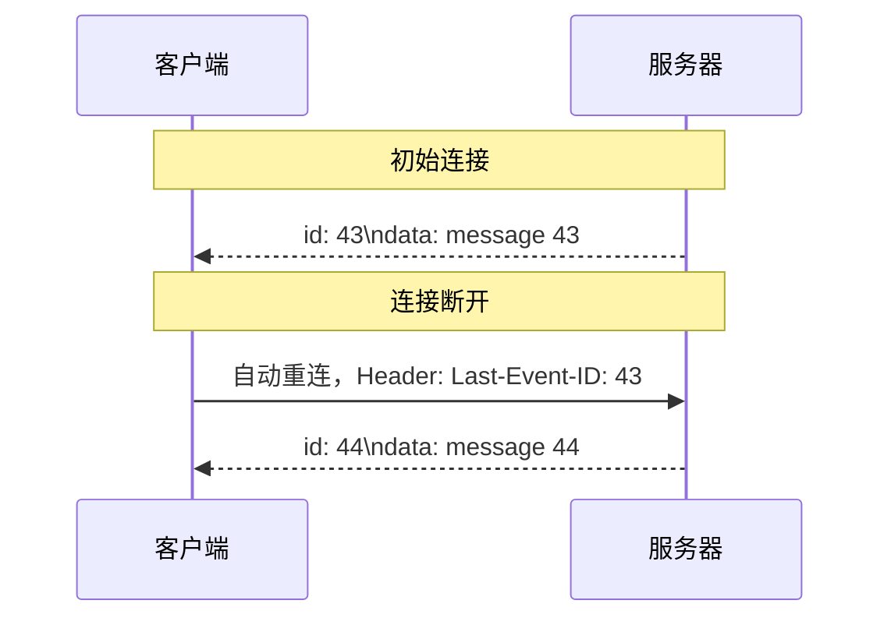
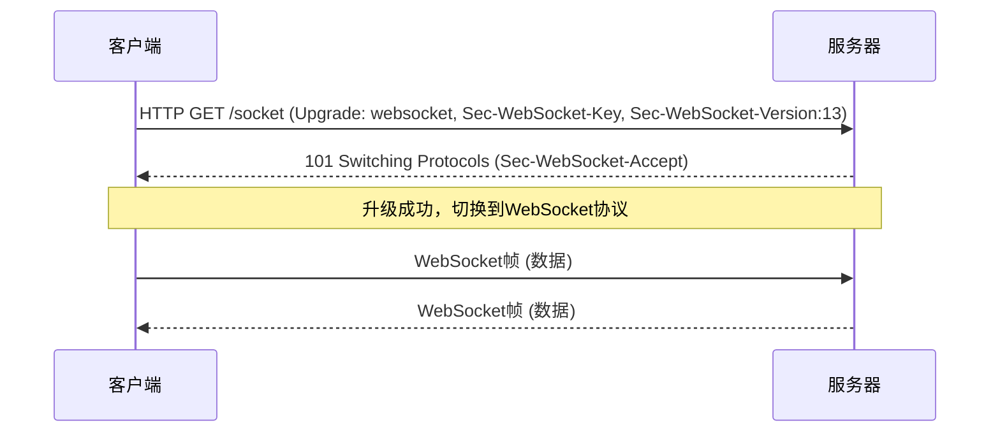
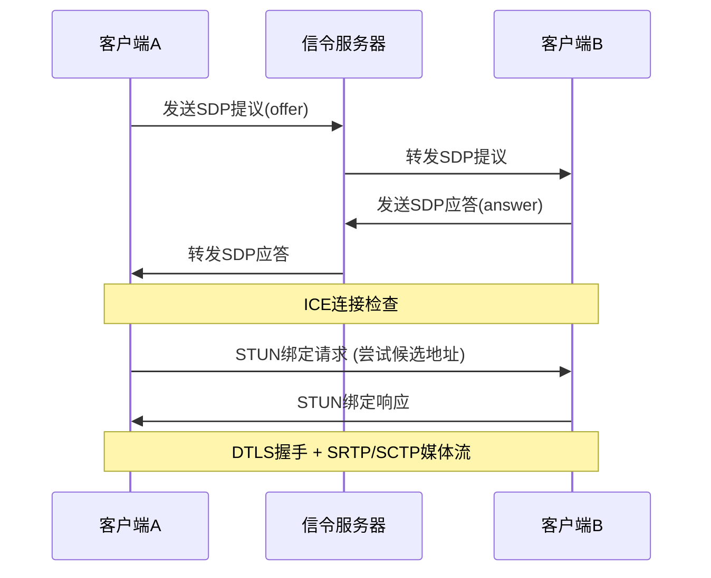

# 《Web性能权威指南》章节总结

## 书籍信息

- 书名：Web性能权威指南
- 作者：[加] Ilya Grigorik
- 译者：李松峰
- 出版信息：人民邮电出版社，2014年4月第1版
- PDF 状态：可识别
- OCR 状态：良好，部分图表文字需注意

## 目录说明

- 目录识别情况：完整识别，共18章，分为4个部分
- 章节对应依据：按原书目录页提取
- OCR 修复说明：部分示意图依赖文字描述重建

## 全书核心主题

本书全面剖析了影响Web性能的各个层面，从物理层的延迟与带宽，到传输层的TCP、UDP和TLS协议，再到无线网络（Wi-Fi、3G/4G）的特殊性，最后深入到应用层的HTTP协议演进（HTTP/1.x到HTTP/2.0）和浏览器API（XHR、SSE、WebSocket、WebRTC）。核心论点是：延迟而非带宽才是大多数Web应用的性能瓶颈，理解底层协议的内部工作原理是进行有效性能优化的前提。本书为开发者提供了从理论到实践的完整性能优化知识体系。

---

## 第一部分：网络技术概览

---

## 第1章：延迟与带宽

### 1. 核心论点

本章解决的核心问题是：什么是延迟和带宽，它们如何影响网络性能。作者认为，速度是Web应用竞争力的关键，而延迟（尤其是传播延迟和最后一公里延迟）往往比带宽更成为性能瓶颈。

### 2. 关键概念

- **延迟**：消息或分组从信息源发送到目的地所需的时间。构成包括传播延迟、传输延迟、处理延迟、排队延迟。
- **带宽**：逻辑或物理通信路径的最大吞吐量。
- **传播延迟**：信号传播距离和速度的函数，受光速限制（约200,000 km/s在光纤中）。
- **最后一公里问题**：延迟中相当大的一部分花在本地ISP网络中，可达18-43ms。
- **带宽延迟积（BDP）**：数据链路的容量与其端到端延迟的乘积，代表在途未确认的最大数据量。
- **CDN（内容分发网络）**：通过把内容部署在全球各地，让用户从最近的服务器加载内容，大幅降低传播延迟。

### 3. 逻辑推演

本章从“速度是关键”的论点出发，详细解释了延迟的四个构成部分。然后，通过光速物理极限和Hibernia Express海底光缆的例子，说明了传播延迟的不可消除性。接着，用FCC报告和traceroute命令展示了“最后一公里”延迟的普遍存在。在讨论带宽时，指出网络核心带宽巨大（Tbit/s级），但网络边缘带宽有限（全球平均3.1 Mbit/s）。最后得出结论：提高带宽对减少页面加载时间帮助不大，而降低延迟则效果显著，因此延迟是Web性能的核心瓶颈。

### 4. 关键数据

> “光纤中的往返时间（RTT）：纽约到旧金山42ms，纽约到伦敦56ms，纽约到悉尼160ms。”(p.6)
> “光纤入户服务的平均往返时间为18ms，有线电视线路上网平均为26ms，DSL专线平均为43ms。”(p.7)
> “Akamai 2012年中全球平均宽带速度为3.1 Mbit/s，韩国最高14.2 Mbit/s，美国8.6 Mbit/s。”(p.9)

### 5. 经典金句

> “速度是关键！事实上，对某些应用来说，速度决定命运。”(p.3)
> “大多数网站性能的瓶颈都是延迟，而不是带宽！”(p.8)

---

## 第2章：TCP的构成

### 1. 核心论点

本章解决的核心问题是：TCP协议的核心机制（三次握手、慢启动、拥塞控制）如何影响网络性能。作者认为，理解TCP的握手延迟、慢启动和窗口大小是优化所有TCP应用（包括HTTP）性能的关键。

### 2. 关键概念

- **三次握手**：建立TCP连接需要客户端和服务器交换SYN、SYN-ACK、ACK三个分组，耗时一次完整的RTT。
- **慢启动**：新TCP连接的拥塞窗口（cwnd）从较小的初始值（RFC 2581为4段，RFC 6928为10段）开始，每收到一个ACK就翻倍，直到达到阈值。
- **拥塞窗口（cwnd）**：发送端对从客户端接收确认（ACK）之前可以发送数据量的限制。
- **接收窗口（rwnd）**：接收端通告的其缓冲区大小，用于流量控制。
- **带宽延迟积（BDP）**：窗口大小至少需要达到BDP才能充分利用带宽。公式：`窗口大小 = 带宽 × RTT`。
- **队首阻塞（HOL blocking）**：TCP要求按序交付，一个丢失的分组会阻塞后续所有分组，导致额外延迟。
- **TCP快速打开（TFO）**：一种新机制，允许在SYN分组中发送应用数据，减少一次RTT。

### 3. 逻辑推演

本章首先介绍了TCP/IP协议的历史。然后，详细解析了三次握手的过程及其带来的RTT开销。核心部分讲解了拥塞预防及控制机制：流量控制（rwnd）、慢启动（cwnd指数增长）和拥塞预防（丢包后调整窗口）。通过纽约到伦敦传输20KB文件的例子，定量证明了重用TCP连接比新建连接性能提升275%。接着，引入带宽延迟积概念，说明窗口过小会限制吞吐量。最后，分析了队首阻塞问题，并给出了服务器配置调优（升级内核、增大初始cwnd、启用窗口缩放）和应用行为调优（重用连接、压缩数据）的建议。

### 4. 流程图

#### TCP三次握手与数据传输



### 5. 经典金句

> “三次握手带来的延迟使得每创建一个新TCP连接都要付出很大代价。而这也决定了提高TCP应用性能的关键，在于想办法重用连接。”(p.14)
> “大多数情况下，TCP的瓶颈都是延迟，而非带宽。”(p.28)

---

## 第3章：UDP的构成

### 1. 核心论点

本章解决的核心问题是：UDP协议的特点、它与NAT的兼容性问题，以及优化建议。作者认为，UDP是一个“无协议”，它省略了TCP的可靠性、顺序、拥塞控制等功能，提供了灵活性，但也将复杂性留给了上层应用，尤其是在NAT穿透方面。

### 2. 关键概念

- **UDP（用户数据报协议）**：在IP之上提供应用程序多路复用机制的简单协议，不保证交付、顺序、连接状态和拥塞控制。
- **NAT（网络地址转换器）**：解决IPv4地址耗尽的临时方案，维护本地IP/端口到外网IP/端口的映射表。
- **NAT穿透**：由于UDP无状态，NAT需要维护映射记录，且记录会超时。穿透技术包括STUN、TURN和ICE。
- **STUN（NAT会话穿越工具）**：让客户端发现自己的外网IP和端口。
- **TURN（中继NAT穿越）**：在STUN失败时，通过中继服务器转发数据，保证连接。
- **ICE（交互式连接建立）**：综合使用直连、STUN、TURN，建立最有效的端到端通道。

### 3. 逻辑推演

本章首先介绍了UDP协议的极简设计（8字节首部）。然后，重点讨论了UDP与NAT的冲突：UDP无状态导致NAT必须维护映射，且映射会超时，需要keep-alive维持。接着，介绍了NAT穿透的三件套：STUN（发现外网地址）、TURN（中继转发）、ICE（综合决策）。最后，引述RFC 5405给出了UDP应用的优化建议，包括必须实现拥塞控制、处理丢包和重排、支持路径MTU发现等，并强调设计新传输协议应尽可能利用现有库（如WebRTC）。

### 4. 流程图

#### ICE连接建立流程



### 5. 关键数据

> “谷歌libjingle统计：92%的时间可以直接连接（STUN），8%的时间要使用中继器（TURN）。”(p.37)

### 6. 经典金句

> “UDP的主要功能和亮点并不在于它引入了什么特性，而在于它忽略的那些特性。”(p.31)
> “设计新传输协议必须经过周密的考虑、规划和研究，否则就是不负责任。”(p.39)

---

## 第4章：传输层安全（TLS）

### 1. 核心论点

本章解决的核心问题是：TLS协议如何提供加密、身份验证和完整性，以及如何优化TLS部署以减少性能损失。作者认为，TLS的性能开销主要在于握手延迟，通过会话恢复、尽早完成（CDN）、优化证书链等措施，可以大幅降低TLS对性能的影响。

### 2. 关键概念

- **TLS（传输层安全）**：SSL的继任者，在TCP之上提供加密、身份验证和完整性服务。
- **TLS握手**：完整的TLS握手需要2次RTT（加上TCP握手的1次RTT，共3次）。内容包括协商版本/加密套件、证书交换、密钥交换。
- **会话恢复**：通过会话标识符（Session ID）或会话记录单（Session Ticket）重用之前协商的会话参数，将握手缩短为1次RTT。
- **ALPN（应用层协议协商）**：TLS扩展，允许在TLS握手的同时协商应用协议（如HTTP/2.0），省去额外的HTTP Upgrade RTT。
- **SNI（服务器名称指示）**：TLS扩展，允许客户端在握手时指明要连接的主机名，使一个IP可服务多个TLS证书。
- **证书链**：从站点证书到根CA证书的信任链。链长度和大小会影响握手性能。
- **OCSP封套**：服务器在证书链中包含OCSP响应，避免浏览器实时查询证书状态，减少一次额外请求。

### 3. 逻辑推演

本章首先介绍了TLS的三项基本服务。然后，详细解析了TLS握手过程，指出完整的TLS握手（包含TCP握手）最多需要3次RTT。接着，介绍了会话恢复机制（Session ID和Session Ticket）可将其缩短为2次RTT。核心部分给出了详细的优化建议：尽早完成握手（使用CDN）、启用会话缓存、优化TLS记录大小（约1400字节）、禁用TLS压缩、缩短证书链、启用OCSP封套和HSTS。最后，提供了使用openssl s_client命令测试和验证TLS配置的方法。

### 4. 流程图

#### 完整TLS握手 vs. 简短TLS握手

```mermaid
graph TD
    subgraph 完整TLS握手 (2次RTT + TCP 1次RTT = 3次RTT)
        A[TCP握手] --> B[ClientHello]
        B --> C[ServerHello + Certificate]
        C --> D[ClientKeyExchange + ChangeCipherSpec]
        D --> E[Finished (加密)]
    end
    subgraph 简短TLS握手 (1次RTT + TCP 1次RTT = 2次RTT)
        F[TCP握手] --> G[ClientHello + SessionID]
        G --> H[ServerHello + ChangeCipherSpec + Finished]
    end
```

### 5. 经典金句

> “SSL/TLS计算只占CPU负载的不到1%，每个连接只占不到10KB的内存。”(p.56) - 谷歌
> “延迟是瓶颈，最快的速度莫过于什么也不传输。”(p.203)

---

## 第二部分：无线网络性能

---

## 第5章：无线网络概览

### 1. 核心论点

本章解决的核心问题是：无线网络的性能基础是什么。作者认为，所有无线网络（Wi-Fi、蜂窝）的性能都受限于香农定理的三个基本因素：带宽、信号强度和调制方式，且无线性能具有高度不稳定性和不确定性。

### 2. 关键概念

- **香农定理**：信道容量 C = BW × log₂(1 + S/N)。带宽（BW）和信噪比（S/N）是决定无线信道最大信息速率的两大物理因素。
- **远近效应**：接收端捕获较强信号，会“挤出”较弱的信号。
- **小区呼吸效应**：干扰级别越高，信号有效传输距离越短，小区覆盖范围收缩。
- **ISM频段**：工业、科研和医疗无线电频段（2.4GHz、5.7GHz），免许可使用，Wi-Fi工作于此。
- **调制**：将数字信号转换为模拟信号（无线电波）的过程。高阶调制传输更多数据，但抗干扰能力差。

### 3. 逻辑推演

本章首先介绍了无线网络的类型（PAN、LAN、MAN、WAN）。然后，基于香农定理，阐述了影响无线性能的两个物理因素：带宽（频率范围）和信号强度（信噪比）。通过“吵闹的聚会”的比喻，解释了远近效应和小区呼吸效应。接着，介绍了调制算法对吞吐量的影响。最后，强调所有广告中的“峰值速率”都是在理想条件下测得的，现实中的无线性能因距离、噪声、干扰、设备差异而高度不稳定。

### 4. 关键数据

> “FCC 700MHz频段拍卖，698-806MHz的频率范围被以195.92亿美元的价格售出。”(p.73)

### 5. 经典金句

> “无线的便捷总得有点代价。”(p.77)
> “本质上，无线性能具有高度不稳定性。”(p.77)

---

## 第6章：Wi-Fi

### 1. 核心论点

本章解决的核心问题是：Wi-Fi网络的性能特点及优化建议。作者认为，Wi-Fi工作于免许可频段，部署简便，但这也导致了严重的干扰问题（邻近网络、微波炉等），带宽和延迟无法保证，需要应用主动适应。

### 2. 关键概念

- **CSMA/CA（冲突避免）**：Wi-Fi的媒体访问控制协议，发送前先监听信道，空闲则发送，且需要接收方确认。
- **2.4GHz vs. 5GHz**：2.4GHz频段拥挤（只有3个不重叠信道），5GHz频段相对空闲，提供更好的性能。
- **WMM（Wi-Fi多媒体）**：扩展，为语音、视频等提供基本的QoS。
- **自适应比特流**：通过连续测量网络条件，动态调整视频/音频流比特率的技术，适应Wi-Fi带宽的不稳定性。
- **ping测量**：通过ping第一跳路由器，可估算Wi-Fi延迟。2.4GHz频段中值6.2ms，但95%分位可达34.8ms。

### 3. 逻辑推演

本章首先回顾了Wi-Fi从以太网（CSMA/CD）到无线（CSMA/CA）的演进。然后，列出了802.11b/g/n/ac标准及峰值速率。通过inSSIDer截图展示了2.4GHz频段的重叠网络，说明干扰的普遍性。通过个人测试数据对比了2.4GHz（高延迟、高抖动）和5GHz（低延迟、低抖动）的性能差异。最后，给出了优化建议：利用不计流量的带宽（大数据迁移到Wi-Fi）、适应可变带宽（使用自适应比特流）、适应可变的延迟时间。

### 4. 流程图

#### Wi-Fi CSMA/CA基本流程



### 5. 经典金句

> “Wi-Fi不保证带宽和延迟时间。”(p.85)
> “根本不存在什么“典型的”Wi-Fi性能。”(p.84)

---

## 第7章：移动网络

### 1. 核心论点

本章解决的核心问题是：移动网络（2G/3G/4G）的技术演进、架构特点及其对性能的影响。作者认为，移动网络与Wi-Fi有根本不同，其核心是无线电资源控制器（RRC）管理的状态机，这导致了“能量尾”、高延迟抖动和电池消耗问题。

### 2. 关键概念

- **3GPP vs. 3GPP2**：两个主导的移动通信标准组织，分别制定GSM/UMTS/LTE和CDMA/EV-DO标准。
- **LTE（长期演进）**：3GPP第8版标准，核心网络简化为全IP分组交换，用户面单向延迟<5ms。
- **HSPA+**：3GPP第7版及以后的标准，在3G基础上演进，性能接近LTE，全球部署广泛。
- **RRC（无线电资源控制器）**：移动网络中负责调度协调设备与基站之间通信的装置，控制设备功率状态。
- **RRC状态机**：设备无线电模块的功率状态，包括空闲（低功耗）和连接（高功耗）状态，以及中间的DRX（不连续接收）状态。
- **能量尾**：数据传输完成后，无线电模块仍保持高功率状态一段时间的现象（等待超时计时器），浪费电量。
- **UE类别**：用户设备的分类，决定了其最大吞吐量能力。

### 3. 逻辑推演

本章首先梳理了移动网络从1G到4G的演进历史，重点介绍了3GPP和3GPP2两大标准体系。然后，介绍了UE类别和RRC状态机，详细对比了LTE、HSPA+和EV-DO的RRC状态切换延迟。通过Pandora的例子（周期性信标消耗46%电量仅传输0.2%数据），说明了低效周期性传输的危害。接着，剖析了端到端的运营商架构（RAN、核心网络、回程容量）。最后，通过真实测量数据对比了3G、4G和Wi-Fi的性能，表明LTE在吞吐量和延迟稳定性上已可媲美甚至超过Wi-Fi。

### 4. 流程图

#### LTE RRC状态机



### 5. 经典金句

> “46%的电量消耗仅传输0.2%的数据！”(p.108)
> “移动网络不变的只有变化。”(p.129)

---

## 第8章：移动网络的优化建议

### 1. 核心论点

本章解决的核心问题是：针对移动网络的特点，应用开发者应采取哪些优化策略。作者认为，优化移动应用必须三管齐下：节约用电、预测网络延迟、适应多网络接口并存，核心原则是“爆发传输数据并转为空闲”。

### 2. 关键概念

- **节约用电**：少用无线电接口，合并请求，使用推送而非轮询，推迟非关键请求。
- **消除周期性传输**：轮询在移动网络中代价极高，应使用推送和通知，聚合出站/入站请求。
- **预测网络延迟**：考虑到RRC状态切换（4G最多100ms，3G可达2500ms），应解耦用户交互与网络通信。
- **NetInfo API**：浏览器API，用于查询和监听网络连接类型的变化。
- **预取模型**：爆发性下载数据，然后让无线模块转为空闲。渐进加载在移动网络中弊大于利。

### 3. 逻辑推演

本章首先强调移动优化必须考虑延迟、吞吐量和电池使用时间三个维度。然后，给出了节约用电的具体策略：消除周期性信标、使用推送、推迟非关键请求。通过计算，1分钟一次的轮询每小时消耗约3%的电量。接着，建议预测网络延迟上限，考虑到RRC状态切换，一个HTTP请求在3G网络可能耗时200-3500ms。解耦用户交互与网络通信，提供即时UI反馈。最后，提出“爆发传输并转为空闲”是移动网络的最佳实践，预取内容，避免渐进加载，并在可能时将负载转移到Wi-Fi网络。

### 4. 关键数据

> “一个HTTP请求在3G网络总延迟可能达200-3500ms，4G网络为100-600ms。”(p.127)
> “1分钟一次的轮询，1小时耗能600J，相当于电池容量的约3%。”(p.125)

### 5. 经典金句

> “渐进加载资源在移动网络中弊大于利。”(p.130)

---

## 第三部分：HTTP

---

## 第9章：HTTP简史

### 1. 核心论点

本章解决的核心问题是：HTTP协议从0.9到1.1再到2.0的演进历程及其核心改进。作者认为，HTTP的简单性是它成功的关键，但1.x版本的局限性促使了2.0的诞生，后者专注于改进传输性能。

### 2. 关键概念

- **HTTP 0.9**：只有一行的协议，仅支持GET方法，响应只有HTML，连接立即关闭。
- **HTTP 1.0**：引入请求/响应首部、状态码、内容类型协商、缓存等，但连接每次请求后关闭。
- **HTTP 1.1**：互联网标准，默认持久连接（Connection: keep-alive），引入管道（pipelining）、分块传输编码、缓存机制改进等。
- **HTTP 2.0**：主要目标是改进传输性能，实现低延迟和高吞吐量，但不改动高层语义（方法、状态码、URI等）。

### 3. 逻辑推演

本章简要回顾了HTTP的发展史。从Tim Berners-Lee最初的一行协议开始，到1996年RFC 1945（HTTP 1.0）标准化了首部、状态码等。1999年RFC 2616（HTTP 1.1）成为互联网标准，引入了持久连接、管道等关键性能特性。最后，指出由于1.x的局限性（队首阻塞、高开销），HTTP 2.0应运而生，目标是在保持语义不变的前提下，通过新的二进制分帧层提升性能。

### 4. 经典金句

> “HTTP的简单本质是它最初得以采用和后来快速发展的关键。”(p.141)

---

## 第10章：Web性能要点

### 1. 核心论点

本章解决的核心问题是：现代Web应用的性能瓶颈到底在哪里。作者通过数据和分析指出，延迟是Web性能的主要瓶颈，而非带宽。平均页面已超过90个请求、1.3MB大小，而用户期望在几百ms内获得响应。

### 2. 关键概念

- **页面加载时间（PLT）**：浏览器加载旋转图标停止的时间，即onload事件触发的时间。
- **DOM、CSSOM和JavaScript**：浏览器处理流水线，脚本执行会阻塞DOM构建，CSSOM构建会阻塞脚本执行。
- **资源瀑布图**：分析网络性能的强大工具，展示每个HTTP请求的DNS、TCP、TLS、请求、响应等各阶段耗时。
- **带宽不（太）重要**：Mike Belshe的试验表明，带宽从5Mbit/s增加到10Mbit/s，页面加载时间仅降低5%；而延迟从200ms降到100ms，加载时间降低约40%。
- **Navigation Timing API**：W3C标准，提供页面导航和加载的详细计时数据，用于真实用户性能度量（RUM）。

### 3. 逻辑推演

本章首先通过HTTP Archive数据揭示了现代Web应用的规模（平均90个请求、1.3MB）。然后，分析了用户对速度的感知（100ms内感觉快，1秒以上感觉慢）。通过Yahoo!的资源瀑布图，展示了DNS、TCP、TLS等各阶段的耗时。核心部分引用Mike Belshe的研究，用图表证明带宽对页面加载时间的影响边际递减，而延迟的影响是线性的。最后，介绍了Navigation Timing API和性能度量方法（人造测试和RUM）。

### 4. 关键数据

> “2013年，一个普通的Web应用由90个请求、总下载量1311KB、15个主机构成。”(p.146)
> “页面加载时间增加1秒，会导致转化率损失7%，页面浏览量减少11%。”(p.148)

### 5. 经典金句

> “限制Web性能的主要因素是客户端与服务器之间的网络往返延迟。”(p.151)
> “更多带宽其实不（太）重要。”(p.152)

---

## 第11章：HTTP 1.x

### 1. 核心论点

本章解决的核心问题是：HTTP 1.x的性能优化策略及其局限性。作者认为，持久连接是1.x最重要的优化，管道因实现复杂和支持度低而基本失败，开发者不得不使用多个连接、域名分区、连接与拼合等“权宜之计”。

### 2. 关键概念

- **持久连接**：HTTP 1.1默认，重用TCP连接消除多次握手和慢启动，N个请求节省(N-1)×RTT。
- **HTTP管道**：允许客户端在收到响应前发送多个请求，但服务器必须按FIFO顺序返回响应，导致队首阻塞，支持度低。
- **多个TCP连接**：浏览器为突破限制，每个主机打开6个连接，可并行请求，但消耗资源。
- **域名分区**：将资源分散到多个子域名（shard1.example.com等），突破每主机6连接的限制，但有DNS查询和慢启动代价。
- **连接与拼合**：将多个JS/CSS文件合并为一个，多张图片拼合为精灵图，减少请求数，但损害缓存粒度和执行速度。
- **嵌入资源**：通过data URI将小资源嵌入HTML，减少请求，但增加页面大小（Base64编码增加33%）。

### 3. 逻辑推演

本章通过纽约到伦敦传输2个文件的例子，量化了非持久连接（284ms）、持久连接（228ms）和HTTP管道（172ms）的性能差异。然后，解释了管道为何失败（队首阻塞、代理兼容性）。接着，分析了浏览器使用多个TCP连接的利弊，以及域名分区作为变通方案的代价。最后，详细讨论了连接、拼合和嵌入等“应用层”优化手段的权衡，指出它们是对协议缺陷的“权宜之计”。

### 4. 关键数据

> “每个主机最多6个连接的浏览器限制。”(p.169)
> “连接与拼合：将多个JS/CSS文件合并为一个；图片精灵；嵌入小资源（<1-2KB）。”(p.174)

### 5. 经典金句

> “最快的请求是不用请求。”(p.174)

---

## 第12章：HTTP 2.0

### 1. 核心论点

本章解决的核心问题是：HTTP 2.0的核心设计和技术目标如何解决1.x的性能问题。作者认为，HTTP 2.0通过二进制分帧层实现多路复用、请求优先级、服务器推送和首部压缩，让每个来源一个连接成为可能，并淘汰了1.x时代的诸多“权宜之计”。

### 2. 关键概念

- **二进制分帧层**：HTTP 2.0的核心，将HTTP消息分解为独立的帧，交错发送，在另一端重组。
- **流、消息、帧**：流是连接中的虚拟信道（有唯一ID），消息由一或多个帧组成，帧是最小通信单位。
- **多路复用**：多个请求和响应可以在一个TCP连接上并行交错发送，消除了HTTP层的队首阻塞。
- **请求优先级**：每个流有31比特的优先值（0最高），服务器可根据优先级决定资源分配和交付次序。
- **服务器推送**：服务器可以对一个请求发送多个响应（PUSH_PROMISE帧），主动推送资源，客户端可缓存或拒绝。
- **首部压缩**：客户端和服务器维护首部表，只发送变化的键值对，显著减少首部开销。

### 3. 逻辑推演

本章首先介绍了HTTP 2.0与SPDY的渊源。然后，阐述了设计和技术目标：二进制分帧、多路复用、优先级、每个来源一个连接、流量控制、服务器推送、首部压缩。通过图文详细解释了帧格式、流ID、HEADERS帧和DATA帧的结构。最后，通过一个例子展示了在同一连接上多个流交错传输的场景，强调了多路复用如何消除队首阻塞。作者指出，HTTP 2.0将淘汰域名分区、连接拼合等1.x优化，应专注于使用服务器推送和利用单个连接。

### 4. 流程图

#### HTTP/2.0 多路复用

```mermaid
graph TD
    subgraph 单一TCP连接
        A[流1: 请求HTML]
        B[流3: 请求CSS]
        C[流5: 请求JS]
        D[流1: 响应HTML的DATA帧(部分1)]
        E[流3: 响应CSS的HEADERS帧]
        F[流1: 响应HTML的DATA帧(部分2)]
        G[流5: 请求JS的DATA帧]
    end
    D -- 交错发送 --> E
    E -- 交错发送 --> F
    F -- 交错发送 --> G
```

### 5. 经典金句

> “HTTP 2.0可以把很多以前我们针对HTTP 1.1想出来的“歪招儿”一笔勾销。”(p.179)
> “每个来源一个连接显著减少了相关的资源占用。”(p.188)

---

## 第13章：优化应用的交付

### 1. 核心论点

本章解决的核心问题是：如何综合运用各类优化手段（经典、HTTP 1.x专用、HTTP 2.0专用）来交付高性能应用。作者认为，优化是多层的，从物理层到应用层，都需要持续度量、迭代改进，并针对协议版本采取不同策略。

### 2. 关键概念

- **经典优化最佳实践**：减少DNS查找、重用TCP连接、减少HTTP重定向、使用CDN、去掉不必要的资源、缓存资源、压缩传输、消除不必要的请求开销（如cookie）、并行处理请求和响应。
- **针对HTTP 1.x的优化**：管道（可控环境）、域名分区、打包资源、嵌入小资源。这些都是“权宜之计”，应适度使用。
- **针对HTTP 2.0的优化**：去掉对1.x的优化（域名分区、打包）、每个来源一个连接、利用服务器推送。
- **双协议应用策略**：在过渡期，应用可能需要同时支持1.x和2.0，可通过相同代码双协议部署、分离代码部署或动态优化（如PageSpeed）实现。
- **PageSpeed**：谷歌的动态Web优化库，可根据协议版本自动应用不同的优化过滤器。

### 3. 逻辑推演

本章首先总结了经典的优化最佳实践。然后，针对HTTP 1.x，重申了管道、域名分区、连接拼合等“权宜之计”的适用场景和代价。核心部分是针对HTTP 2.0的建议：坚决去掉对1.x的优化（域名分区、打包反而有害），利用每个来源一个连接和服务器推送。接着，讨论了双协议并存时期的部署策略。最后，提到了负载均衡器和代理在2.0部署中的注意事项。

### 4. 流程图

#### 双协议部署策略



### 5. 经典金句

> “成功的、可持续的Web性能优化策略其实很简单：先度量，然后拿业务目标与性能指标进行比较，采取优化措施，紧了松点，松了紧点，如此反复。”(p.203)

---

## 第四部分：浏览器API与协议

---

## 第14章：浏览器网络概述

### 1. 核心论点

本章解决的核心问题是：现代浏览器网络组件提供了哪些自动化的服务。作者认为，浏览器不仅是套接字管理器，它通过套接字池、安全沙箱、资源缓存等机制，自动优化连接管理，并向应用暴露XHR、SSE、WebSocket等高级API。

### 2. 关键概念

- **套接字池**：浏览器为每个来源（协议+域名+端口）维护一组套接字（最多6个），自动管理连接重用、优先级和生命周期。
- **推测性优化**：浏览器通过学习用户导航模式，进行DNS预解析、TCP预连接、页面预渲染，消除未来请求的延迟。
- **安全沙箱**：浏览器限制应用直接访问原始套接字，强制执行同源策略、TLS协商、证书检查。
- **资源缓存**：浏览器自动管理HTTP缓存，根据Cache-Control等指令存储和复用资源。
- **cookie管理**：浏览器为每个来源维护独立的cookie容器，自动处理cookie的存储和HTTP首部追加。

### 3. 逻辑推演

本章概述了浏览器网络组件的高层架构。介绍了套接字池管理和推测性优化（DNS预取、TCP预连接、预渲染）如何自动提升性能。然后，讨论了安全沙箱和同源策略对应用的限制。接着，阐述了浏览器自动的资源缓存和cookie管理。最后，用一张表对比了XHR、SSE、WebSocket在请求流、响应流、分帧机制、二进制传输等方面的差异，为后续章节做铺垫。

### 4. 经典金句

> “最好最快的请求是没有请求。”(p.222)

---

## 第15章：XMLHttpRequest

### 1. 核心论点

本章解决的核心问题是：XHR（XMLHttpRequest）的能力、演进（XHR2）及其性能特点。作者认为，XHR是浏览器中数据交换的“瑞士军刀”，支持文本/二进制上传下载、进度监控、跨域请求（CORS），但不适合流式数据处理和高效实时通知。

### 2. 关键概念

- **CORS（跨源资源共享）**：安全机制，允许服务器通过Access-Control-Allow-Origin首部选择同意跨域请求。复杂请求需要先发送OPTIONS预检请求。
- **XHR2新功能**：支持请求超时、二进制数据传输（ArrayBuffer、Blob）、进度事件、文件上传、CORS。
- **进度事件**：loadstart、progress、error、abort、load、loadend，可用于监控上传和下载进度。
- **XHR流**：XHR规范不支持流，只能通过监听readystatechange和手动截取responseText来模拟，效率低且有限制。
- **轮询 vs. 长轮询**：轮询（定时请求）有固定延迟和高开销；长轮询（请求挂起直到有数据）延迟低，但每次更新仍有HTTP开销。

### 3. 逻辑推演

本章回顾了XHR从IE5诞生到成为W3C标准的历史。介绍了XHR2新增功能：CORS（跨域请求）、二进制数据类型（ArrayBuffer、Blob）、进度事件。通过代码示例演示了下载和上传二进制数据、监控进度。然后，指出XHR不支持流式数据传输，只能通过hack方式模拟，效率低。最后，探讨了通过XHR实现实时通知的两种方式：轮询（开销大，有延迟）和长轮询（延迟低，但每次更新仍有HTTP开销），并认为SSE或WebSocket是更好的选择。

### 4. 流程图

#### CORS复杂请求流程（带预检）



### 5. 经典金句

> “XHR 是让我们从制作网页转换为开发交互应用的根本技术。”(p.225)

---

## 第16章：服务器发送事件

### 1. 核心论点

本章解决的核心问题是：SSE（Server-Sent Events）如何实现服务器到客户端的实时文本数据流。作者认为，SSE提供了简单高效的EventSource API和事件流协议，支持自动重连和消息ID恢复，是服务器向客户端推送通知的理想选择。

### 2. 关键概念

- **EventSource API**：浏览器端SSE接口，通过`new EventSource(url)`建立连接，监听onmessage、onopen、onerror事件。
- **事件流协议**：Content-Type为text/event-stream，消息格式为`data: ...\n\n`，可包含event、id、retry字段。
- **自动重连**：连接断开后，EventSource会自动重新连接，并可发送上一次收到的Last-Event-ID。
- **SSE vs. WebSocket**：SSE是单向（服务器→客户端）文本流，协议简单；WebSocket是双向，支持二进制。
- **腻子脚本**：在不支持SSE的浏览器中，可用基于XHR轮询/长轮询的库模拟EventSource API。

### 3. 逻辑推演

本章首先介绍了SSE的两个组件：EventSource API和事件流协议。通过代码示例展示了如何建立连接、处理消息和错误。然后，详细解释了事件流协议的格式（data、event、id、retry字段）。通过一个示例展示了SSE如何支持断线重连和消息恢复（通过Last-Event-ID）。最后，总结了SSE的使用场景：服务器向客户端推送实时文本消息（如通知、股票价格），并指出其局限：单向、不支持二进制。通过TLS发送SSE流可避免中间设备干扰。

### 4. 流程图

#### SSE断线重连与消息恢复



### 5. 经典金句

> “SSE 提供的是一个高效、跨浏览器的XHR 流实现。”(p.243)

---

## 第17章：WebSocket

### 1. 核心论点

本章解决的核心问题是：WebSocket如何实现客户端与服务器间的双向、基于消息的实时通信。作者认为，WebSocket提供了最接近套接字的API，支持文本和二进制数据，通过HTTP升级握手协商连接，是自定义应用协议的最佳传输层。

### 2. 关键概念

- **WebSocket API**：通过`new WebSocket(url)`建立连接，支持ws://（非加密）和wss://（加密）协议。监听onopen、onmessage、onclose、onerror事件。
- **WS vs. WSS**：wss是基于TLS的安全WebSocket，可绕过中间代理，是生产环境推荐部署方式。
- **子协议协商**：客户端通过Sec-WebSocket-Protocol首部发送支持的协议列表，服务器选择一个返回。
- **二进制分帧**：每个WebSocket帧有2-14字节开销（客户端多4字节掩码）。支持文本和二进制数据。
- **WebSocket协议扩展**：可扩展协议，例如多路复用扩展（共享TCP连接）和压缩扩展。
- **bufferedAmount**：监控客户端排队数据量的属性，用于避免队首阻塞。

### 3. 逻辑推演

本章首先介绍了WebSocket API，对比了ws和wss，演示了接收/发送文本和二进制数据。然后，通过WireShark截图详细解析了WebSocket帧格式（FIN、Opcode、Mask、Payload len等）。接着，解释了HTTP升级握手过程，包括Sec-WebSocket-Key、Sec-WebSocket-Accept等首部。最后，讨论了WebSocket的性能特点：消息开销低（2-14字节），但不支持多路复用（有扩展），需要应用自己实现压缩。部署时建议使用WSS穿透中间设备，并配置较长的超时时间（如60分钟）。

### 4. 流程图

#### WebSocket握手流程



### 5. 经典金句

> “WebSocket 是浏览器中最通用最灵活的一个传输机制。”(p.251)

---

## 第18章：WebRTC

### 1. 核心论点

本章解决的核心问题是：WebRTC如何实现浏览器间的实时音频、视频和数据共享。作者认为，WebRTC是一组标准、协议和API的集合，通过getUserMedia、RTCPeerConnection、RTCDataChannel三大API，在UDP之上构建了包含加密、NAT穿透、拥塞控制的复杂传输层。

### 2. 关键概念

- **WebRTC三大API**：MediaStream（获取音视频）、RTCPeerConnection（音视频数据通信）、RTCDataChannel（任意应用数据通信）。
- **getUserMedia**：获取用户麦克风/摄像头的媒体流，可指定分辨率、帧率等约束。
- **ICE（交互式连接建立）**：集成了STUN（发现外网地址）和TURN（中继转发）的NAT穿透框架。
- **SDP（会话描述协议）**：描述端到端连接参数（媒体类型、编解码器、IP/端口等）的文本协议。
- **DTLS（数据报传输层安全）**：为UDP提供加密的TLS变种，WebRTC强制使用。
- **SRTP/SRTCP**：安全实时传输协议，用于传输加密的音视频流。
- **SCTP（流控制传输协议）**：用于DataChannel，提供可配置的可靠性和有序交付。
- **DataChannel交付语义**：可配置为可靠/部分可靠、有序/乱序，通过maxRetransmits或maxRetransmitTime控制。

### 3. 逻辑推演

本章首先介绍了WebRTC的标准发展。然后，逐一讲解三大API。getUserMedia部分介绍了音视频引擎和Opus/VP8编解码器。RTCPeerConnection部分详细阐述了建立端到端连接的复杂过程：发信号（SDP交换）、NAT穿透（ICE/STUN/TURN）、安全加密（DTLS）、媒体传输（SRTP/SRTP）。RTCDataChannel部分介绍了基于SCTP的数据通道，可配置不同的可靠性和交付语义。最后，讨论了多方通信架构（网状 vs. 星形）、基础设施规划（STUN/TURN服务器容量）和数据效率优化。

### 4. 流程图

#### WebRTC端到端连接建立流程



### 5. 经典金句

> “WebRTC 使得实时通信变成一种标准功能，任何Web 应用都无需借助第三方插件和专有软件。”(p.271)
> “实时通信讲究的就是及时、当下。”(p.276)