# 《一本书讲透数据治理：战略、方法、工具与实践》章节总结

## 书籍信息
- 书名：一本书讲透数据治理：战略、方法、工具与实践
- 作者：用友平台与数据智能团队（罗小江、石秀峰等）
- PDF 状态：可识别，存在部分页码错位和扫描痕迹
- OCR 状态：基本完整，文本可读

## 目录说明
- 目录识别情况：完整识别，共31章，分为六大部分
- 章节对应依据：基于PDF原始目录和正文页码
- OCR 修复说明：部分图表和页码标记存在偏移，但核心内容完整

## 全书核心主题
本书以“道、法、术、器”四个维度系统阐述数据治理的完整体系：
- **道（战略层面）**：数据战略、组织机制、数据文化
- **法（管理层面）**：8项关键举措（理现状定目标、成熟度评估、路线图规划、保障体系、技术体系、策略执行与监控、绩效考核、长效运营）
- **术（技术层面）**：7种核心能力（数据梳理与建模、元数据管理、数据标准管理、主数据管理、数据质量管理、数据安全治理、数据集成与共享）
- **器（工具层面）**：7把利剑（模型管理、元数据管理、标准管理、主数据管理、质量管理、安全治理、集成共享工具）

作者核心观点：数据治理是企业数字化转型的必经之路，不是对“数据”的治理，而是对“数据资产”的治理，是对数据资产所有利益相关方的协调与规范。

---

## 第一部分 数据治理概述

### 第1章：全面认识数据治理

#### 1. 核心论点
**问题**：数据治理是什么？它为什么重要？
**观点**：数据治理是对数据资产行使权力和控制的活动集合，最终目标是提升数据利用率和数据价值，实现数据的“看得见、找得到、管得住、用得好”。

#### 2. 关键概念

- **数据治理定义**：所有为提高数据质量而展开的技术、业务和管理活动都属于数据治理范畴。它是一个涉及企业战略、组织、文化、方法、制度、流程、技术和工具的综合体。
- **数据资产**：数据资产是指企业过去的交易或者事项形成的，由企业拥有或者控制的，预期会给企业带来经济利益的数据资源，并且其价值和成本是可计量的。
- **数据治理的6个价值**：降低业务运营成本、提升业务处理效率、改善数据质量、控制数据风险、增强数据安全、赋能管理决策。
- **数据治理的5类问题**：黑暗数据（睡眠数据）、数据孤岛、数据“巴别塔”（定义不清）、糟糕的数据质量、数据的安全风险。
- **诺兰模型**：信息系统进化的6个阶段（起步、扩展、控制、集成、数据管理、成熟阶段），说明数据资源整合是信息化建设的必经途径。

#### 3. 逻辑推演

作者首先通过管理者、业务人员、技术人员三个不同视角阐释数据治理的多面性，然后给出统一定义。接着，通过“数据资产”概念的界定，明确数据治理的对象不是所有数据，而是有经济利益预期的数据资产。之后，通过6个价值、3个现状、5类问题、6个挑战层层递进，论证数据治理的必要性和紧迫性。最后指出：无治理，不数据。

#### 4. 经典金句

> “数据治理不是对‘数据’的治理，而是对‘数据资产’的治理，是对数据资产所有利益相关方的协调与规范。” (p.62)

> “无治理，不数据。” (p.90)

> “数据是具备复用性的资源，我们不应用完即舍弃，它的再利用价值也许你现在不清楚，但在未来的某一刻，它会迸发出来，变‘废’为宝。” (p.80)

---

### 第2章：数据治理框架和标准

#### 1. 核心论点
**问题**：有哪些成熟的数据治理框架和标准可供参考？
**观点**：国际上有ISO/IEC38505、DGI、DAMA-DMBOK2等框架；国内有GB/T 34960和DCMM。企业应结合自身现状选择参考。

#### 2. 关键概念

- **ISO/IEC38505**：提出数据治理的E-D-M方法论（评估-指导-监督），包含6个基本原则（职责、策略、采购、绩效、符合、人员行为）。
- **DGI数据治理框架**：采用5W1H法则，分为人员与治理组织、规则、流程3个层次，共10个组件。
- **DAMA-DMBOK2**：车轮图定义了11个知识领域，数据治理位于中央，是数据资产管理的权威性和控制性活动。
- **DCMM（数据管理能力成熟度评估模型）**：国家标准GB/T 36073—2018，包含8个过程域（数据战略、治理、架构、应用、安全、质量、标准、生存周期），28个过程项，5个成熟度等级。

#### 3. 逻辑推演

作者先介绍国际三大主流框架（ISO、DGI、DAMA），分析各自特点和方法论；再介绍国内标准（GB/T 34960、DCMM）。通过对比说明：这些框架为企业提供了方法论指导，但企业必须“量体裁衣”，建立适合自己的治理体系。

#### 4. 经典金句

> “他山之石，可以攻玉。” (p.91)

---

### 第3章：企业数据怎么治

#### 1. 核心论点
**问题**：企业数据治理体系如何构建？
**观点**：作者提出“道、法、术、器”四层体系，包含9个要素、3个机制、8项举措、7种能力、7把利剑。

#### 2. 关键概念

- **数据治理、数据管理、数据管控的关系**：数据治理是顶层策略（指导），数据管理是流程机制（执行），数据管控是具体措施（操作），形成金字塔模型。
- **9个要素**：数据战略、组织机制、数据文化、管理流程、管理制度、数据、人才、技术、工具。
- **4个层面（道法术器）**：
  - 道：战略、组织、文化
  - 法：8项举措（理现状定目标、成熟度评估、路线图规划、保障体系建设、技术体系建设、策略执行与监控、绩效考核、长效运营）
  - 术：7种能力（数据梳理与建模、元数据管理、数据标准管理、主数据管理、数据质量管理、数据安全治理、数据集成与共享）
  - 器：7把利剑（模型管理、元数据管理、标准管理、主数据管理、质量管理、安全治理、集成共享工具）

#### 3. 逻辑推演

本章是全书总纲。作者先厘清数据治理、管理、管控的关系，再列出9个关键要素，最后用“道法术器”框架整合全书内容，为后续章节设定逻辑主线。

#### 4. 流程图

```mermaid
graph TD
    A[企业数据治理体系] --> B[道：战略层面]
    A --> C[法：管理层面]
    A --> D[术：技术层面]
    A --> E[器：工具层面]
    
    B --> B1[数据战略]
    B --> B2[组织机制]
    B --> B3[数据文化]
    
    C --> C1[理现状定目标]
    C --> C2[成熟度评估]
    C --> C3[路线图规划]
    C --> C4[保障体系]
    C --> C5[技术体系]
    C --> C6[策略执行监控]
    C --> C7[绩效考核]
    C --> C8[长效运营]
    
    D --> D1[数据梳理与建模]
    D --> D2[元数据管理]
    D --> D3[数据标准管理]
    D --> D4[主数据管理]
    D --> D5[数据质量管理]
    D --> D6[数据安全治理]
    D --> D7[数据集成与共享]
    
    E --> E1[模型管理工具]
    E --> E2[元数据管理工具]
    E --> E3[标准管理工具]
    E --> E4[主数据管理工具]
    E --> E5[质量管理工具]
    E --> E6[安全治理工具]
    E --> E7[集成共享工具]
```

#### 5. 经典金句

> “方向对了，走一些弯路，当前痛一点没什么；而方向错了，哪怕方法再好，技术再强，工具再全，都是枉然。” (p.135)

> “工欲善其事，必先利其器。” (p.132)

---

## 第二部分 数据治理之道

### 第4章：数据战略：数字化转型的灯塔

#### 1. 核心论点
**问题**：数据战略是什么？如何制定和实施？
**观点**：数据战略必须来自对业务战略中固有数据需求的理解，包含战略定位、实施策略、行动计划三个要素，通过5个步骤实施。

#### 2. 关键概念

- **数据战略定义**：一组选择和决定，共同制定了实现高级目标的高级行动方案（DAMA）。包含愿景、商业案例、指导原则、使命目标、关键措施、路线图等。
- **数据战略的3个要素**：战略定位（做什么/不做什么）、实施策略（怎么做/由谁做）、行动计划（谁/什么时间/做什么事/达成什么目标）。
- **数据战略的3个层次**：短期目标（基本管理决策和业务协同）、中期目标（创新与转型）、长期目标（定义在数字化竞争生态中的角色和地位）。
- **实施数据战略的5个步骤**：环境因素分析、确定战略目标、制定行动方案、落实保障措施、战略评估与优化。
- **5W1H分析法**：用于数据治理战略规划（Why/What/How/Who/When/Where）。

#### 3. 逻辑推演

作者先给出DAMA和DCMM对数据战略的定义，再提出自己的理解。然后阐述数据战略与企业战略、数据架构的关系（承上启下）。接着详述3个要素和5个步骤，并用商业银行、装备制造企业、能源企业等多个案例说明战略落地的实践。

#### 4. 流程图

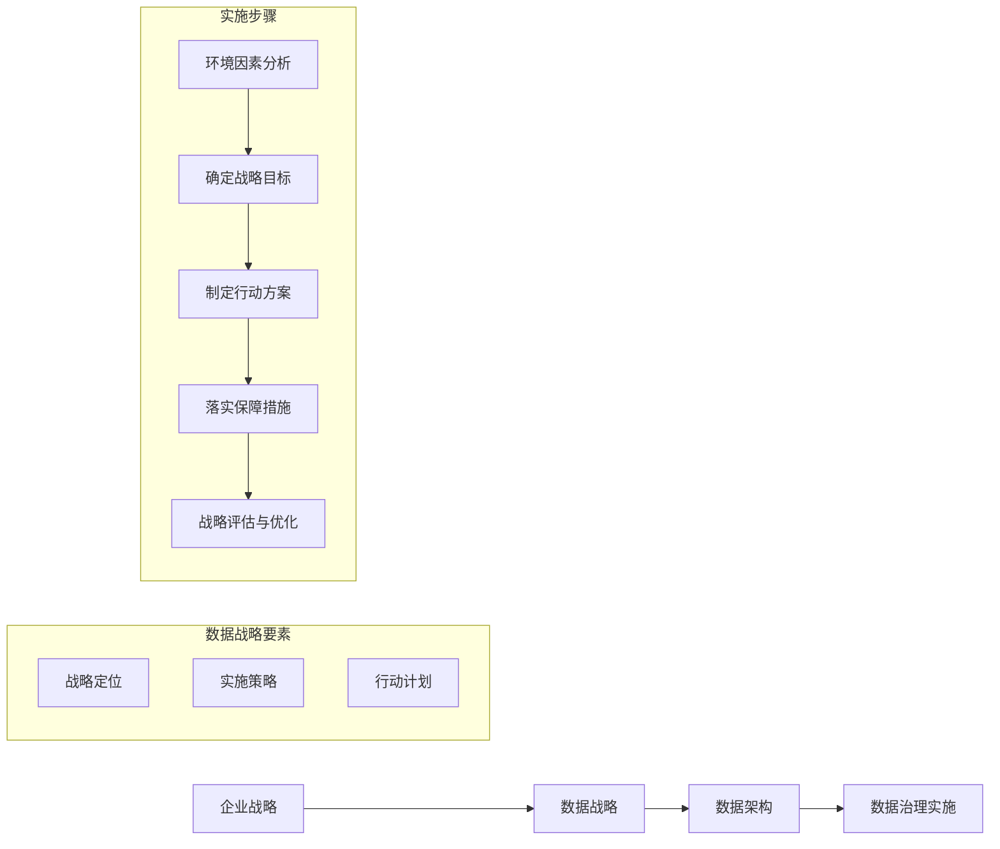

#### 5. 经典金句

> “数据战略是企业数据管理活动的总体策略，是企业数字化转型的灯塔。” (p.197)

> “什么样的战略，决定了什么样的未来。” (p.174)

---

### 第5章：组织机制：敏捷的治理组织

#### 1. 核心论点
**问题**：为什么数据治理需要敏捷组织？如何构建？
**观点**：数据治理需要扁平化、自驱动的敏捷组织，核心是以客户为中心、以数据驱动、重新定义IT、业务与IT深度融合、培养复合型人才。

#### 2. 关键概念

- **敏捷组织**：能灵敏感知环境并迅速应对的组织，具有架构灵活、数据驱动、员工能动、领导作用、动态资源五个特点。
- **数字化转型的三座大山**：数据、组织、软件平台。组织是决定能否翻越其他两座大山的核心要素。
- **重新定义IT**：从传统职能部门转变为赋能平台，从成本中心转变为利润中心。核心是“IT即业务，IT即管理”。
- **复合型人才**：既懂业务、又懂数据、还懂技术的人才。

#### 3. 逻辑推演

作者先对比传统金字塔结构与敏捷扁平结构，然后论证数据治理需要敏捷组织的5个理由。接着从5个方面给出构建方法：以客户为中心、以数据驱动（如某车企“一次触达”案例）、重新定义IT（夯实基础、技术业务两手抓、打造能力中心）、业务与IT深度融合（设立桥梁岗位）、培养复合型人才。

#### 4. 流程图

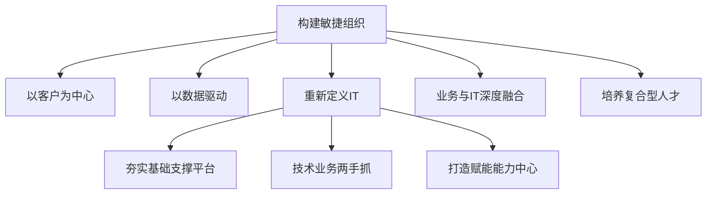

#### 5. 经典金句

> “数据治理本质上关注的既不是治理，也不是数据，而是如何获得数据中蕴含的商业价值。” (p.203)

> “IT即业务，IT即管理。” (p.210)

---

### 第6章：数据文化：数据思维融入企业文化

#### 1. 核心论点
**问题**：如何建立数据思维、培养数据文化？
**观点**：数据文化从建立数据思维开始，通过打破数据孤岛、建立制度体系、推行数据治理三个办法培养。数据文化要“内化于心，外化于行，固化于制”。

#### 2. 关键概念

- **数据思维**：用数据思考，用数据说话，用数据决策。三个特点：善于简化、注重量化、追求真理。
- **数据文化培养的3个办法**：打破数据孤岛（技术屏障+部门墙）、建立制度体系（固化数据文化）、推行数据治理（增强数据文化）。
- **数据驱动的4个步骤**：持续产生数据 → 让数据用起来 → 数据思维内化于心 → 驱动业务决策。

#### 3. 逻辑推演

作者先引用研究数据（60%的人认为缺乏数据文化是数字化转型的主要障碍），说明文化先行的重要性。然后定义数据思维及其三个特点，给出建立数据思维的4步法（自上而下推动、营造数据驱动氛围、建立培训机制、实践求真知）。最后详述培养数据文化的三个办法。

#### 4. 经典金句

> “资源是会枯竭的，而文化会生生不息。” (p.220)

> “企业数据治理治的不仅是数据，更是企业全员的思维方式。” (p.238)

> “知不知，尚矣；不知知，病也。”——老子 (p.225)

---

## 第三部分 数据治理之法

### 第7章：理现状，定目标

#### 1. 核心论点
**问题**：如何理清企业数据治理现状并确定目标？
**观点**：通过信息化摸底、业务部门调研、高层领导调研三种方式，从数据思维、IT系统、数据分布、数据管理、数据质量五个维度评估现状，最终确定与业务目标对齐的数据治理目标。

#### 2. 关键概念

- **三种调研方式**：信息化摸底（IT视角）、业务部门调研（业务视角）、高层领导调研（战略视角）。
- **五维现状评估**：数据思维和认知现状、IT系统现状、数据分布现状、数据管理现状、数据质量现状。
- **目标制定方法**：综合企业战略理解、业务需求分析、IT需求分析，确定数据治理目标。

#### 3. 逻辑推演

作者强调：任何企业都不会为了治理数据而治理数据，背后都是管理和业务目标在驱动。因此第一步是理清现状、明确目标。通过问卷设计示例、人力资源域调研示例、数据资源分布图等方法，展示如何系统化调研。最后给出目标制定的四步法。

#### 4. 经典金句

> “任何企业都不会为了治理数据而治理数据，其背后都是管理和业务目标在驱动。” (p.240)

---

### 第8章：数据治理能力成熟度评估

#### 1. 核心论点
**问题**：如何评估企业数据治理能力成熟度？
**观点**：推荐使用DMM模型（国际）或DCMM（国内国家标准）进行成熟度评估，通过启动、宣贯、评估、报告四个阶段完成。

#### 2. 关键概念

- **DMM模型**：卡耐基·梅隆CMMI研究所开发，25个过程域分布在数据战略、数据治理、数据质量、数据运营、平台与架构、支撑流程6个分类中，5个成熟度等级。
- **DCMM**：国家标准，8个过程域、28个过程项、5个等级（初始级、受管理级、稳健级、量化管理级、优化级）。
- **DCMM评估4个阶段**：启动阶段（建立工作小组、制定计划、召开启动会）、宣贯阶段（培训、资料收集、自评估）、评估阶段（现场分析、面对面访谈、打分）、报告阶段（输出报告、专家评审）。

#### 3. 流程图

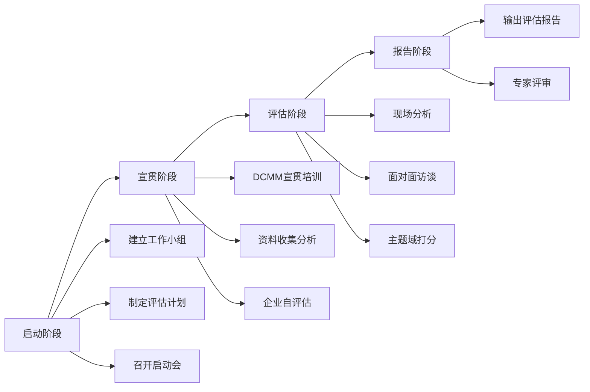

#### 4. 经典金句

> “重要的是通过评估，企业能够发现问题，找出差距，明确改进方向。” (p.298)

---

### 第9章：数据治理路线图规划

#### 1. 核心论点
**问题**：如何制定数据治理路线图？
**观点**：按照“大处着眼，小处入手”原则，先确定优先级，再绘制分阶段实施路线图，每个阶段包含目标、时间节点、资源投入、预期收益。

#### 2. 关键概念

- **数据治理路线图的5个要素**：目标任务、需求分析、技术路径、建设步骤、实施保障。
- **优先级评估维度**：业务影响范围、数据共享程度、数据管理成熟度、统一难度、业务紧迫度。
- **技术路径选择**：自主研发、采购平台、PaaS服务（如阿里云DataWorks、华为云DAYU、亚马逊AWS）。

#### 3. 流程图

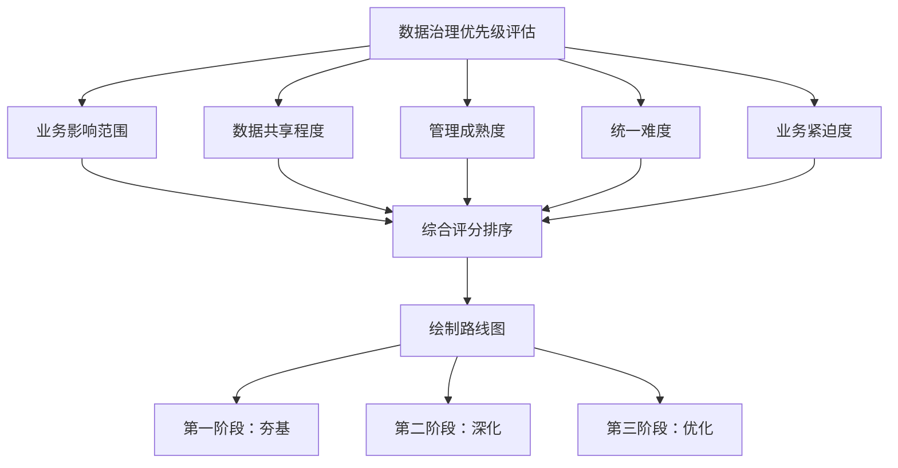

#### 4. 经典金句

> “数据治理不是一蹴而就的，需要对治理目标进行分解，对治理任务进行排序。” (p.312)

> “大处着眼，小处入手。” (p.303)

---

### 第10章：数据治理保障体系建设

#### 1. 核心论点
**问题**：如何建立数据治理的组织保障？
**观点**：建立数据治理委员会、数据治理办公室、数据所有者等组织架构，明确职责分工，打造“一把手工程”，获得高层领导支持。

#### 2. 关键概念

- **数据治理组织3原则**：从企业利益出发、合理分工、各方通力合作。
- **5类角色**：数据治理委员会（决策）、数据治理办公室（管理协调）、数据所有者（拥有/控制）、数据生产者（提供）、数据使用者（使用）。
- **“一把手工程”**：强调高层领导的深度参与和授权。需要4类人的支持（倡导者、跟随者、观望者、抵制者）。
- **保龄球效应**：正面积极的激励比负面消极的激励效果更好。

#### 3. 逻辑推演

作者先给出设置数据治理组织的三个原则，然后详述五类角色的职责分工。特别强调“谁该对数据负责”——数据质量人人有责（谁生产谁负责、谁拥有谁负责、谁管理谁负责、谁使用谁负责）。接着论述数据治理需要“一把手工程”的五个理由，以及如何获得高层支持的五个方法。

#### 4. 经典金句

> “数据质量人人有责：谁生产谁负责，谁拥有谁负责，谁管理谁负责，谁使用谁负责。” (p.330)

> “没有高层领导的支持，切勿启动数据治理计划。” (p.322)

---

### 第11章：数据治理技术体系建设

#### 1. 核心论点
**问题**：有哪些典型的数据治理技术架构？
**观点**：通过5个实战案例介绍以元数据为核心、以主数据为主线、混合云架构、大数据架构、微服务架构下的数据治理技术体系。

#### 2. 关键概念

- **以元数据为核心**（S银行案例）：元数据采集→数据标准体系→全生命周期质量保障→敏感数据识别与安全策略。
- **以主数据为主线**（H公司案例）：统一主数据标准→主数据管理平台→主数据清洗→主数据集成。
- **混合云架构**（A公司案例）：数据连接器→数据融合治理→融合数据应用→数据运营监控。
- **大数据架构**（X报社案例）：元数据管理→数据标准化→数据资产化→数据应用监控。
- **微服务架构**（M酒店案例）：微服务分层设计→微服务数据质量保证→数据赋能。

#### 3. 经典金句

> “凡是有关提高数据质量、保证数据安全、促进数据应用的策略和活动，都属于数据治理的范畴。” (p.352)

---

### 第12章：数据治理策略执行与监控

#### 1. 核心论点
**问题**：如何执行和监控数据治理策略？
**观点**：数据治理有4个过程（发现、定义、执行、监控）。执行的关键是召开成功的项目启动会，做好沟通管理（借势和造势），通过项目例会和报告推动进展。

#### 2. 关键概念

- **数据治理的4个过程**：发现（发现问题、识别需求）、定义（制定标准、制度、流程、章程）、执行（启动项目、发布策略、沟通协调）、监控（执行情况监控、有效性和价值监控）。
- **数据治理策略内容**：业务术语表、元数据标准、主数据标准、参考数据标准、业务规则、治理制度、评估指标。
- **项目启动会要点**：必须有高层领导参与、必须正式、议程控制（主持人开场→甲乙双方项目经理介绍→业务部门承诺→资源保障承诺→高层领导讲话）。
- **沟通管理5字诀**：借势（数字化大势、高层权势、数据供需局势）和造势（请外部专家、让价值显而易见、撕开“遮羞布”）。

#### 3. 流程图

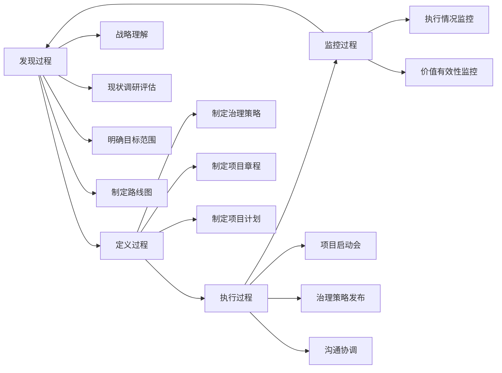

#### 4. 经典金句

> “战略是一种商品，执行是一门艺术。”——彼得·德鲁克 (p.378)

> “失败的数据治理项目往往不是在结束时才失败的，而是开头就没开好。” (p.393)

---

### 第13章：数据治理绩效考核

#### 1. 核心论点
**问题**：如何考核数据治理效果？
**观点**：遵循公平公正、严格、公开透明、客观评价4个原则，从人员、质量问题、标准贯彻、策略执行、技术达成、业务价值6个维度建立考核指标。

#### 2. 关键概念

- **4个考核原则**：公平公正、严格、公开透明、客观评价。
- **6类考核指标**：数据治理人员、数据质量问题、数据标准贯彻、治理策略执行、技术达成、业务价值实现。
- **6种数据质量检查办法**：记录数检查法、关键指标总量分析法、历史数据对比法、值域判断法、经验审核法、匹配判断法。
- **4种考核方式**：日常考核、定期考核（抽样/全面）、系统自动考核、人工考核。

#### 3. 经典金句

> “数据治理既要严抓过程，更要注重结果。” (p.407)

> “当一切业务正常且没有数据问题时，数据治理的努力就会被忽略；而当出现业务问题且是由数据问题引起时，大家首先责怪的是数据治理没有做好。” (p.410)

---

### 第14章：数据治理长效运营

#### 1. 核心论点
**问题**：如何实现数据治理的长效运营？
**观点**：建立组织领导、标准规范、培训教育、人才培养、绩效考评、持续优化6大机制，实现从“一次性项目”到“持续运营”的转变。

#### 2. 关键概念

- **长效运营机制**：能长期保证数据治理策略、制度正常运行并发挥预期效能的制度体系。包含“长效”“运营”“机制”三个关键词。
- **6大机制**：组织领导机制（确权、一把手工程、组织保障、业务IT协同）、标准规范机制（数据标准、流程规范、管理规范）、培训教育机制（分层培训、定制化、多样化）、人才培养机制（挖掘内部数据工匠、吸收外部人才）、绩效考评机制、持续优化机制（业务需求驱动、完善标准规范、优化业务流程）。
- **三大挑战**：来自组织的挑战（部门墙、权本位）、来自文化认知的挑战、来自项目转产的挑战（将数据治理视为纯IT项目或一次性项目）。

#### 3. 经典金句

> “数据治理绝对不是一蹴而就的，需要建立起长效的运营机制，培养一批具有工匠精神的数字化人才。” (p.446)

> “数据治理的长效运营，要达到‘标本同治’‘长治久安’的目标。” (p.446)

---

## 第四部分 数据治理之术

### 第15章：数据梳理与建模

#### 1. 核心论点
**问题**：数据建模与数据治理是什么关系？
**观点**：数据建模是数据治理的开端。数据模型是数据的“骨架”，向上承接业务需求，向下对接数据库系统，与元数据、数据标准、主数据、数据质量、数据安全、数据集成等密不可分。

#### 2. 关键概念

- **数据模型的3个要素**：数据结构（静态特征）、数据操作（动态特征）、数据约束（完整性规则）。
- **数据模型的3种类型**：概念模型（业务模型）、逻辑模型（系统实现）、物理模型（数据库实现）。
- **ER模型（实体关系模型）**：由实体、属性、关系构成，关系类型有1:1、1:M、M:N。
- **数据模型管理的3个问题**：变更随意、辅助工具缺失、共享不及时。
- **数据模型管理的3个有效措施**：严控变更、使用辅助工具、共享模型。

#### 3. 流程图（ER建模步骤）

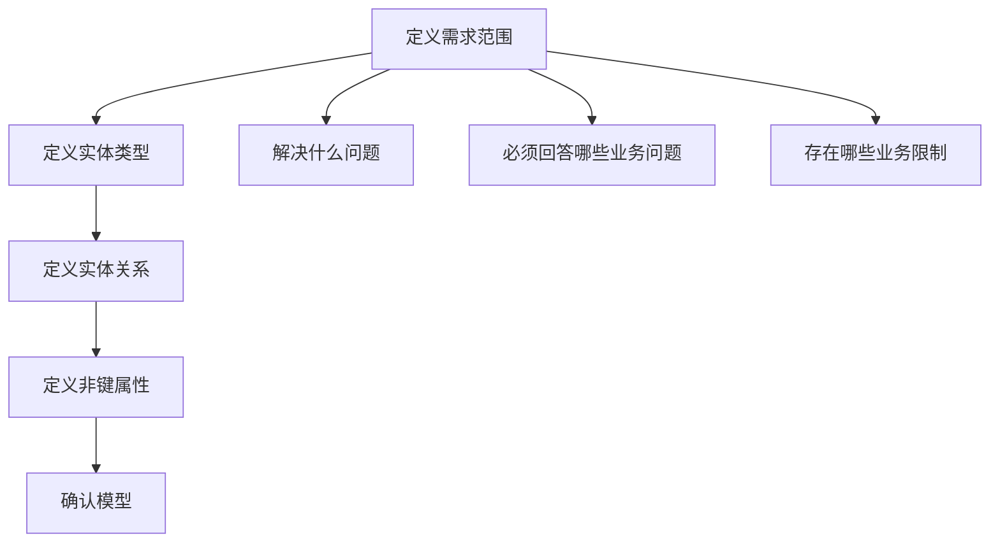

#### 4. 经典金句

> “如果把企业数字化比作人体的话，那么数据模型就是骨架，数据之间的关系和流向是血管和脉络，数据是血液。” (p.145)

> “差程序员关心的是代码，好程序员关心的是数据结构以及它们之间的关系。”——Linux创始人Linus Torvalds (p.465)

---

### 第16章：元数据管理

#### 1. 核心论点
**问题**：什么是元数据？如何管理？
**观点**：元数据是描述数据的数据，分为业务元数据、技术元数据、操作元数据三类。元数据管理是企业数据治理的基础，核心目标是建立指标解释体系、提高数据溯源能力、建立数据质量稽核体系。

#### 2. 关键概念

- **元数据的3种类型**：业务元数据（业务定义、规则）、技术元数据（库表结构、字段、ETL）、操作元数据（所有者、访问权限、日志）。
- **元数据的6个作用**：描述、定位、检索、管理、评估、交互。
- **元数据管理的4个阶段**：分布式桥接阶段、中央存储库阶段、元数据仓库阶段（基于CWM标准）、智能化管理阶段（AI+机器学习）。
- **元数据管理4个挑战**：局部的元数据管理、手动的元数据管理、日趋复杂的数据环境、数据的频繁变化。
- **元数据核心应用**：数据资产地图、血缘分析（向上追溯）、影响分析（向下追踪）、冷热度分析、关联度分析。

#### 3. 流程图（元数据管理平台架构）

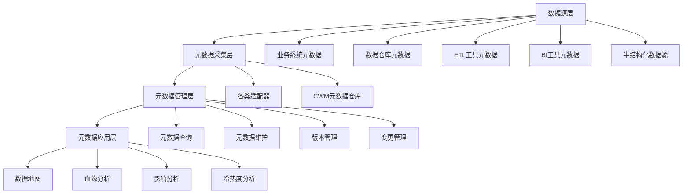

#### 4. 经典金句

> “没有元数据，数据就毫无意义，只不过是一堆数字或文字而已。” (p.529)

> “如果说数据是物料，那么元数据就是仓库里的物料卡片。” (p.52)

---

### 第17章：数据标准管理

#### 1. 核心论点
**问题**：什么是数据标准？如何管理？
**观点**：数据标准是保障数据内外部使用与交换的一致性和准确性的规范性约束。数据标准管理是数据治理的基础性工作，包含数据模型标准、基础数据标准、主数据与参考数据标准、指标数据标准四方面内容。

#### 2. 关键概念

- **数据标准4类内容**：数据模型标准、基础数据标准、主数据与参考数据标准、指标数据标准。
- **数据标准管理流程5阶段**：标准梳理（BOR法：Business-Object-Relationship）→标准编制→标准审查→标准发布→标准贯彻。
- **数据标准编制6大原则**：共享性、唯一性、稳定性、可扩展性、前瞻性、可行性。
- **数据标准管理4个最佳实践**：业务主导、循序渐进、动态管理、应用为王。

#### 3. 流程图（数据标准管理流程）

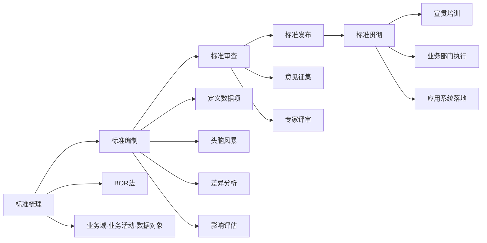

#### 4. 经典金句

> “无规矩，不成方圆。” (p.561)

> “无标准，不治理；无治理，不数据。” (p.146)

---

### 第18章：主数据管理

#### 1. 核心论点
**问题**：什么是主数据？如何管理？
**观点**：主数据是企业的“黄金数据”，具有高价值、高共享、相对稳定3个特征，超越业务、部门、系统、技术4个方面。主数据管理是集方法、标准、流程、制度、技术和工具为一体的解决方案。

#### 2. 关键概念

- **主数据的3个特征**：高价值性、高共享性、相对稳定性。
- **主数据的4个超越**：超越业务、超越部门、超越系统、超越技术。
- **主数据管理4个阶段（12字诀）**：摸家底（调研、识别、评估）、建体系（组织、标准、制度、技术、安全）、接数据（接入、清洗、分发）、抓运营（管理、推广、质量、变现）。
- **主数据识别方法**：特征识别法（6大特征）、业务影响和共享程度分析矩阵。
- **主数据编码原则**：唯一性、稳定性、简易性、扩展性、适用性、规范性、统一性。
- **主数据管理的7个最佳实践**：大目标小步骤、业务驱动技术引领、重视编码设计、数据清洗（AI+人工）、标准平滑落地、小数据融合社会大数据（DaaS）、运营平凡但不简单。

#### 3. 流程图（主数据管理4阶段）

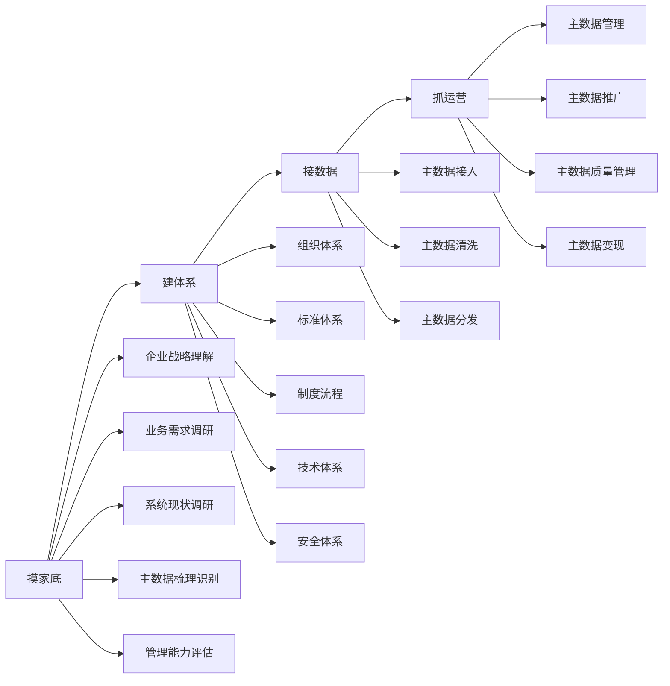

#### 4. 经典金句

> “主数据被誉为企业的‘黄金数据’，具有高价值性、高共享性、相对稳定性。” (p.146)

> “主数据不仅是实现企业各部门之间、各信息系统之间、企业与企业之间数据互联互通的基础，也是数据分析、数据挖掘的基础。” (p.684)

---

### 第19章：数据质量管理

#### 1. 核心论点
**问题**：什么是数据质量？如何管理？
**观点**：数据质量指数据满足人们期望的程度，从7个维度测量。数据质量管理应采用“事前预防、事中控制、事后补救”策略，基于ISO 9001或六西格玛DMAIC模型建立闭环管理体系。

#### 2. 关键概念

- **数据质量7个维度**：一致性、完整性、唯一性、准确性、真实性、及时性、关联性。
- **数据质量差的后果**：经济损失、成本增加、名誉受损、无形成本、运营风险。
- **根因分析4步骤**：定义问题→找出主要因素→确认根本原因→制定解决方案。
- **根因分析4工具**：鱼骨图、5Why图、故障树图、帕累托图（80/20法则）。
- **数据质量管理3大体系框架**：ISO 9001（以客户为中心、PDCA）、六西格玛（DMAIC：定义、测量、分析、改进、控制）、DQAF（数据质量评估框架）。
- **数据质量管理3大策略**：事前预防（组织建设、数据标准、制度流程）、事中控制（源头控制、流转控制、持续监控）、事后补救（定期监控、问题补救、持续改进）。

#### 3. 流程图（六西格玛DMAIC模型）

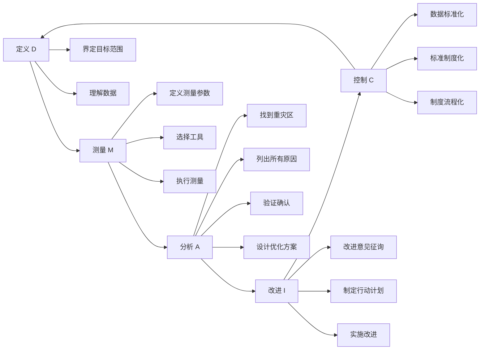

#### 4. 经典金句

> “垃圾进，垃圾出。” (p.690)

> “没有好的数据质量，就无法得出有价值的分析结果，分析界面再炫酷、数据算法再优秀也没有用。” (p.261)

> “数据质量管理的最佳时机就是现在！” (p.771)

---

### 第20章：数据安全治理

#### 1. 核心论点
**问题**：什么是数据安全治理？如何实施？
**观点**：数据安全治理以数据为中心，目标是实现数据的“可见、可控、可管”，确保数据的保密性、完整性、可用性（CIA三要素）。核心策略包括身份认证、授权、访问控制、安全审计、资产保护（5A方法论）。

#### 2. 关键概念

- **数据安全CIA三要素**：保密性（Confidentiality）、完整性（Integrity）、可用性（Availability）。
- **数据安全风险4类来源**：有目标性攻击的外部人员（黑客）、第三方（合作商/供应商）、恶意的内部人员、操作失误的内部人员。
- **数据安全治理5A方法论**：身份认证（Authentication）、授权（Authorization）、访问控制（Access Control）、安全审计（Auditable）、资产保护（Asset Protection）。
- **数据分类分级**：分类按业务主题，分级按敏感程度（通常3~5级）。
- **4道数据安全防线**：设施层（网络安全）、存储层（加密存储）、管控层（5A）、应用层（安全文化）。
- **重要法律法规**：欧盟GDPR（史上最严）、美国CCPA、中国《数据安全法》（2021年发布）。

#### 3. 流程图（数据安全治理体系）

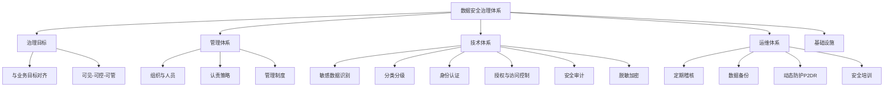

#### 4. 经典金句

> “数据安全是买不到的，即插即用并能提供足够安全防护能力的产品根本不存在。” (p.773)

> “一方面人们为大数据时代即将发生的革命性进步而激动难眠，一方面人们也在为数据安全和隐私保护问题担心得睡不着觉。”——杜跃进 (p.786)

---

### 第21章：数据集成与共享

#### 1. 核心论点
**问题**：如何实现数据集成与共享？
**观点**：数据集成架构经历了点对点→EDI→SOA→微服务的演进。典型应用模式有基于中间件交换共享、主数据集成、数据仓库、数据湖四种。实施分为集成需求分析、制定方案、接口开发与联调、部署运行四步。

#### 2. 关键概念

- **应用集成的4个层面**：门户集成（统一入口）、服务集成（Web服务/SOA/微服务）、流程集成（BPM）、数据集成（复制/联邦/接口）。
- **数据集成架构演进4阶段**：点对点集成（网状混乱）、EDI集成（Hub星型）、SOA集成（ESB总线）、微服务集成（API网关，去中心化）。
- **4种典型应用模式**：基于中间件交换共享（ETL工具）、主数据应用集成（单一视图）、数据仓库应用模式（面向主题、集成、稳定、历史变化）、数据湖应用模式（原始格式存储、读时模式）。
- **数据湖 vs 数据仓库**：数据湖写时模式（存储时不结构化），数据仓库读时模式（存储前结构化）。

#### 3. 流程图（SOA集成架构）

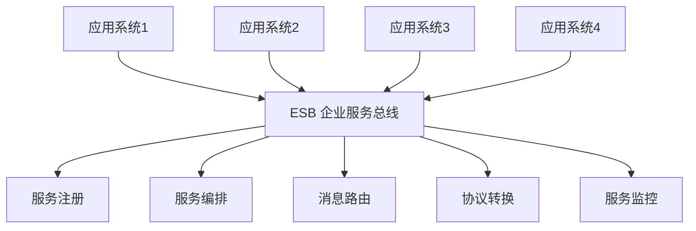

#### 4. 经典金句

> “企业80%的应用集成是数据集成。” (p.867)

---

## 第五部分 数据治理之器

### 第22-28章：数据治理7把利剑（工具）

#### 1. 核心论点（综合）
**问题**：数据治理需要哪些工具？
**观点**：7把利剑分别是数据模型管理工具、元数据管理工具、数据标准管理工具、主数据管理工具、数据质量管理工具、数据安全治理工具、数据集成与共享工具。

#### 2. 各工具核心功能汇总

| 工具 | 核心功能 |
|------|----------|
| 数据模型管理工具 | 可视化建模、模型查询、模型管理、模型对比与稽查、模型驱动应用开发 |
| 元数据管理工具 | 元数据采集（适配器）、元数据管理（查询/维护/版本/变更）、元数据分析（血缘/影响/冷热度）、数据地图 |
| 数据标准管理工具 | 标准需求管理、标准采集、标准制定、标准审核发布、标准变更管理、标准对标 |
| 主数据管理工具 | 主数据建模（分类/编码/属性/界面/审核模型）、主数据管理（申请/审核/变更/冻结/归档）、质量、安全、集成 |
| 数据质量管理工具 | 质量指标定义、质量测量（定期/持续）、质量剖析（结构/内容/关系）、问题分析与改进 |
| 数据安全治理工具 | 四道防线（设施/存储/管控/应用）、5A（身份认证/授权/访问控制/审计/资产保护）、分类分级、脱敏加密 |
| 数据集成与共享工具 | 交换共享系统（桥接/前置/传输/加工/监控）、目录服务系统（编目/注册/发布/查询）、数据管理系统（元数据/质量） |

---

### 第29章：数据治理工具选型建议

#### 1. 核心论点
**问题**：如何选择数据治理工具？
**观点**：考察供应商综合实力、产品架构（数据/技术/应用/安全/部署）、功能（自动化程度、数据类型支持、来源支持、产品路标、配套文档）、性能（性能/可靠性/易用性/安全性/扩展性）、成本（TCO总体拥有成本）。

#### 2. 关键概念

- **5大考察维度**：供应商综合实力、产品架构、产品功能、产品性能、成本预算。
- **TCO（总体拥有成本）**：不仅包括购买费用，还包括运营和维护费用。

#### 3. 经典金句

> “永远不要指望用买单车的钱买到轿车。” (p.1020)

> “数据治理都是‘重实施’的项目。” (p.1021)

---

## 第六部分 数据治理实践与总结

### 第30章：企业数据治理实践案例

#### 1. 核心论点
**问题**：数据治理在实践中有哪些成功案例？
**观点**：案例1（电线电缆集团）展示以主数据驱动的治理模式；案例2（新能源汽车公司）展示全面数据资产管理的治理模式。

#### 2. 案例1：某电线电缆集团的主数据管理实践

**关键内容**：
- **背景**：多系统独立应用，数据标准不一致，“一物多码”严重。
- **解决方案**：
  - 建立三层组织架构（决策层/管理层/执行层）
  - 制定物料分类标准、编码规则（分类码+流水码）、命名标准、描述规范
  - 主数据清洗（10万多条物料数据）
  - 单源头管理方案（ERP为唯一来源）和多源头归集方案（CRM+ERP双来源）
- **成效**：促进业务数字化、集成化、规范化、精细化、决策科学化。

#### 3. 案例2：某新能源汽车公司的数据资产管理实践

**关键内容**：
- **背景**：100多个信息系统，数据复杂、质量堪忧、缺乏标准。
- **解决方案**：
  - 数据资产管理总体蓝图（元数据+标准+质量）
  - 数据管理成熟度评估（DMM模型，处于主动管理阶段）
  - 数据资产梳理（28个业务域、57个数据主题）
  - 四大核心域试点（营销/采购/财务/生产）
  - 建设数据资产管理平台
- **成效**：建立管理体系、数据资产地图、数据标准体系、数据质量闭环管理。

#### 4. 经典金句

> “传统企业的数字化转型进程中，数据治理是必经之路。” (p.1062)

---

### 第31章：企业数据治理总结与展望

#### 1. 核心论点
**问题**：数据治理需要做哪些准备？有哪些误区？未来如何发展？
**观点**：6项准备、6个误区、5个技术展望。数据治理是企业数字化转型的必经之路，将成为企业的一项常态工作。

#### 2. 关键概念

**6项准备**：
1. 管理层对数据治理价值的理解
2. 合理评估企业数据管理的现状
3. 选定数据治理“领头羊”
4. 业务与IT的深度融合
5. 数据治理工具的选型
6. 数据治理咨询与实施专家

**6个误区**：
1. 技术部门主导的盲目治理（驱动力不足、目标不聚焦、需求失控）
2. 业务部门牵头的局部治理（缺乏全局观）
3. 重项目建设，轻持续运营
4. 唯工具论（工具不是万能的）
5. 重结果，轻过程（数据标准不统一）
6. 数据多源，适配困难（一刀切）

**5个技术展望**：
1. **主数据管理未死**：主数据+人工智能（自动识别、智能清洗、自动化运营）
2. **大数据治理六字方针**：采、存、管、看、找、用
3. **微服务下的数据治理**：在线处理（微服务接口）和离线处理（数据湖）两种方案
4. **区块链助力数据资产管理**：确权、安全、质量、共享
5. **人工智能赋能数据治理**：采集、建模、元数据、主数据、标准、质量、安全、分析全环节智能化

#### 3. 经典金句

> “数据治理企业数字化转型的必经之路，将会成为企业的一项常态工作。” (p.1103)

> “数据是数字化时代的‘新石油’。” (p.1097)

> “垃圾进，垃圾出。” (p.1100)

---

## 全书核心方法论总结

### 道法术器框架

```mermaid
graph TD
    A[数据治理之道] --> A1[数据战略：数字化转型的灯塔]
    A --> A2[组织机制：敏捷的治理组织]
    A --> A3[数据文化：数据思维融入企业文化]
    
    B[数据治理之法] --> B1[理现状定目标]
    B --> B2[成熟度评估]
    B --> B3[路线图规划]
    B --> B4[保障体系建设]
    B --> B5[技术体系建设]
    B --> B6[策略执行监控]
    B --> B7[绩效考核]
    B --> B8[长效运营]
    
    C[数据治理之术] --> C1[数据梳理与建模]
    C --> C2[元数据管理]
    C --> C3[数据标准管理]
    C --> C4[主数据管理]
    C --> C5[数据质量管理]
    C --> C6[数据安全治理]
    C --> C7[数据集成与共享]
    
    D[数据治理之器] --> D1[模型管理工具]
    D --> D2[元数据管理工具]
    D --> D3[标准管理工具]
    D --> D4[主数据管理工具]
    D --> D5[质量管理工具]
    D --> D6[安全治理工具]
    D --> D7[集成共享工具]
```

### 核心公式

> **数据治理 = 战略（道）+ 管理（法）+ 技术（术）+ 工具（器）**

> **数据治理成功 = 9个要素 × 4个层面 × 持续运营**

---

*文档完成*