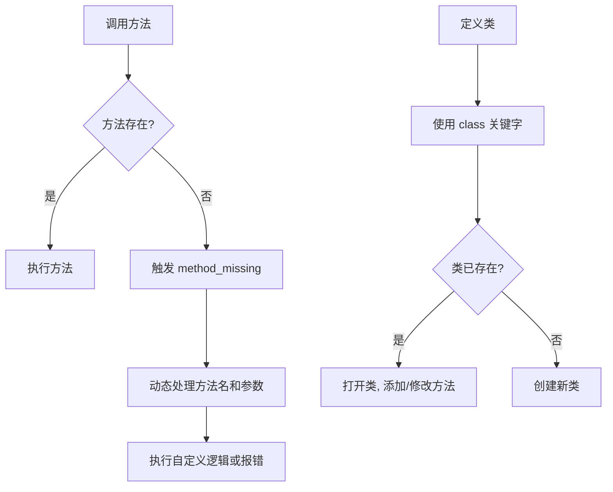
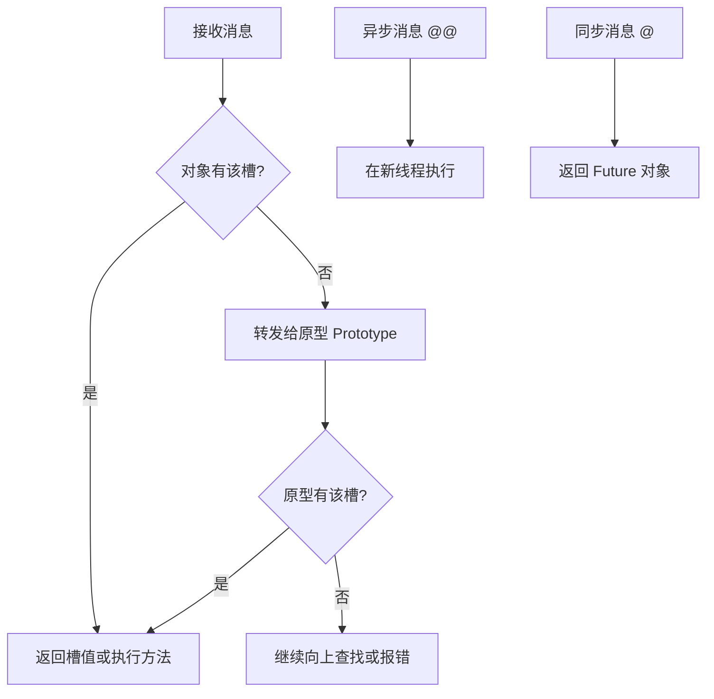
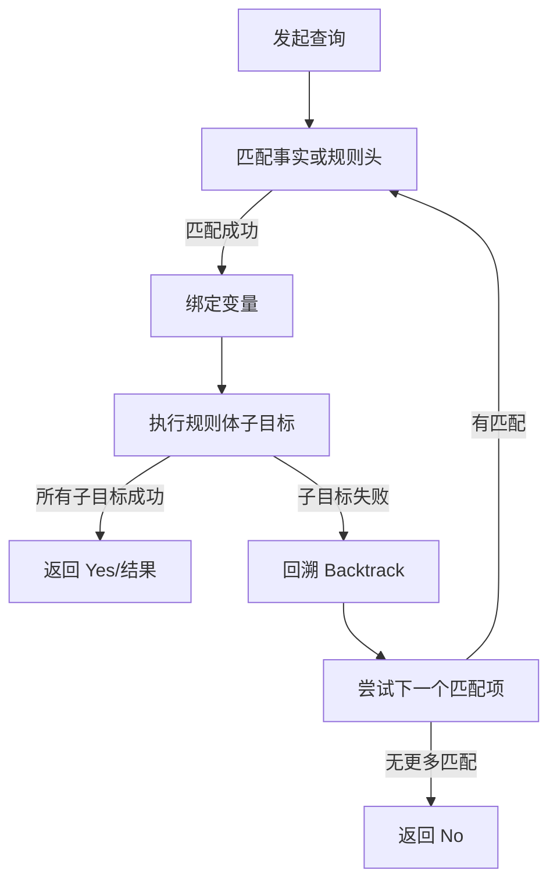
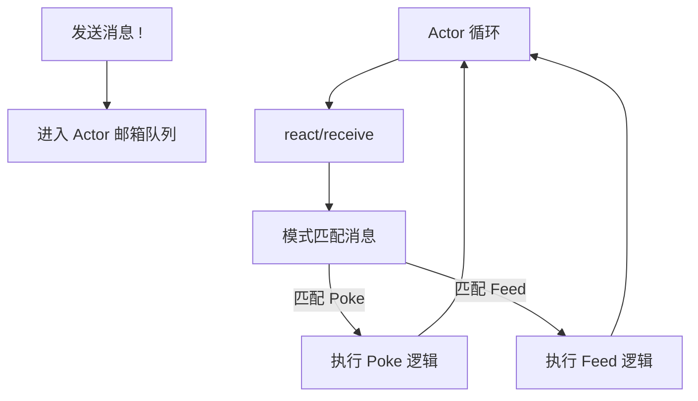
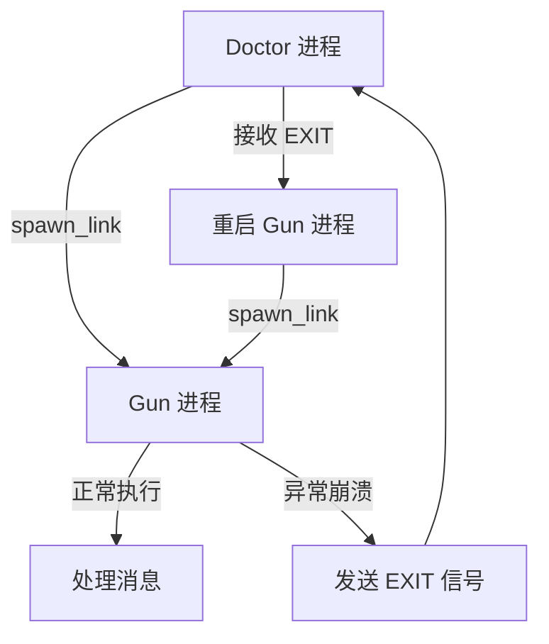
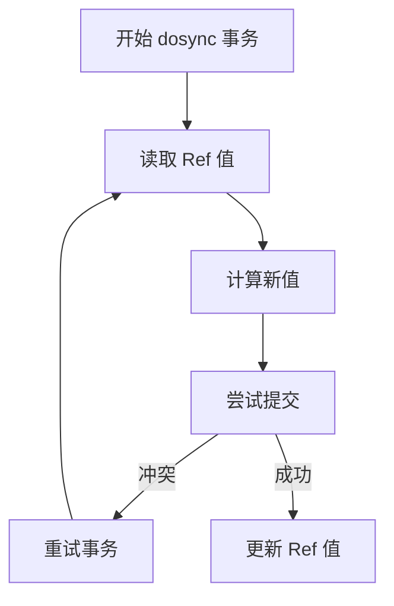
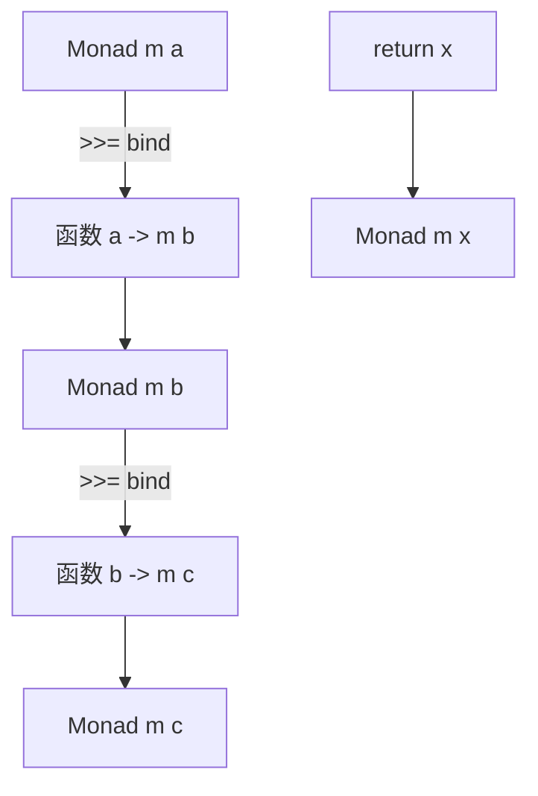

# 《七周七语言：理解多种编程范型》章节总结

## 书籍信息
- **书名**：七周七语言：理解多种编程范型 (Seven Languages in Seven Weeks)
- **作者**：[美] Bruce A. Tate
- **译者**：戴玮、白明、巨成
- **出版社**：人民邮电出版社
- **PDF 状态**：文本可识别，结构清晰
- **OCR 状态**：良好，部分页眉页脚水印已过滤

## 目录说明
- **目录识别情况**：完整识别，包含序言、致谢、第1-9章及附录。
- **章节对应依据**：严格遵循原书目录结构，按“天”（Day）划分学习进度。
- **OCR 修复说明**：已修正部分代码片段中的特殊符号显示问题，保留了核心逻辑。

## 全书核心主题
本书旨在通过介绍七种截然不同的编程语言（Ruby, Io, Prolog, Scala, Erlang, Clojure, Haskell），帮助读者跨越单一编程范型的局限，理解面向对象、原型编程、逻辑编程、函数式编程等多种范型的核心思想。作者认为，学习新语言不仅是掌握语法，更是重塑思维方式，特别是如何应对现代软件开发中日益重要的并发性和复杂性挑战。每门语言通过“三天”的学习计划，从基础语法到核心特性，再到解决特定领域难题，层层递进，最终引导读者发现适合自己的编程“旋律”。

---

## 序言 & 引言

### 核心论点
编程学习如同游泳，理论不如实践重要。通过接触不同范型的语言，程序员可以拓宽思维边界，更好地选择适合当前问题的工具。

### 关键概念
- **编程范型多样性**：包括面向对象、函数式、逻辑式、原型式等。
- **思维重塑**：每学一门新语言，思维方式都会发生改变。
- **实践导向**：强调通过编写代码和解决实际问题来掌握语言精髓，而非仅仅阅读语法手册。

### 经典金句
> “学编程就好比学游泳，再好的理论也不如一头扎下水，扑腾着呼吸新鲜空气管用。” —— Joe Armstrong (Erlang 之父)

---

## 第1章：简介

### 核心论点
本章介绍了本书的目标受众和学习方法，强调了超越语法、深入理解语言设计哲学的重要性。

### 关键概念
- **不走寻常路**：不追求成为某门语言的专家，而是通过对比不同语言的特性，理解其背后的权衡。
- **类型模型**：强/弱类型，静态/动态类型对开发体验的影响。
- **编程范型**：面向对象、函数式、逻辑式、原型式等范型的混合与纯粹性。

### 逻辑推演
作者首先阐述了学习多门语言的必要性，即应对不断变化的技术环境和复杂性问题。接着，简要介绍了入选的七门语言及其选择理由，最后明确了本书不是安装指南或参考手册，而是一次启迪心智的探索之旅。

---

## 第2章：Ruby

### 核心论点
Ruby 是一门以程序员快乐为核心设计理念的动态、面向对象语言，通过元编程和优雅的语法糖极大提高了开发效率。

### 关键概念
- **鸭子类型 (Duck Typing)**：关注对象能做什么（方法），而不是它是什么（类）。
- **代码块 (Blocks)**：作为一等公民传递的代码片段，是 Ruby 灵活性的核心。
- **元编程 (Metaprogramming)**：在运行时修改类和方法的能力，如 `method_missing` 和开放类。
- **Mixin**：通过模块（Module）实现行为的多重继承替代方案。

### 逻辑推演
第一天介绍 Ruby 的基础语法、对象模型和判断结构；第二天深入集合操作、代码块和类的定义；第三天展示 Ruby 的强大之处——元编程，通过开放类和 `method_missing` 实现领域特定语言（DSL），如 ActiveRecord 的风格。

### 经典金句
> “Ruby 所做的也同样如此，但它用的不是食用糖，而是语法糖。”

### 方法流程图 (Ruby 元编程机制)

---

## 第3章：Io

### 核心论点
Io 是一门基于原型的极简语言，所有事物都是对象，通过消息传递进行交互，具有极高的灵活性和强大的并发模型。

### 关键概念
- **原型编程 (Prototyping)**：没有类，对象通过复制其他对象（原型）创建。
- **消息传递 (Message Passing)**：一切皆为消息，方法调用即发送消息。
- **槽 (Slots)**：对象存储数据和方法的容器。
- **并发原语**：Actor、Future 和协程，提供轻量级且安全的并发模型。

### 逻辑推演
第一天介绍 Io 的对象模型、原型继承和基本语法；第二天探讨控制结构、运算符重载和消息反射；第三天展示 Io 在 DSL 构建和并发编程上的优势，通过 Actor 模型实现简单的并行处理。

### 经典金句
> “问题不是‘我们要干点儿什么’而是‘我们有什么不能干’。” —— Ferris Bueller (比喻 Io 的自由度)

### 方法流程图 (Io 消息处理流程)

---

## 第4章：Prolog

### 核心论点
Prolog 是一门声明式逻辑编程语言，通过定义事实和规则，让引擎自动推导答案，特别适合解决约束满足问题和逻辑推理任务。

### 关键概念
- **事实 (Facts) 与规则 (Rules)**：知识库的基本构成单元。
- **合一 (Unification)**：使两个项匹配的过程，是 Prolog 的核心机制。
- **回溯 (Backtracking)**：当一条路径失败时，自动尝试其他可能性。
- **递归**：处理列表和树结构的主要手段。

### 逻辑推演
第一天介绍 Prolog 的基本语法、事实、规则和简单查询；第二天深入递归、列表处理和数学运算，重点讲解合一机制；第三天通过解决数独和八皇后问题，展示 Prolog 在约束求解方面的强大能力。

### 经典金句
> “你无需描述问题的解决方案。你只需描述问题即可。”

### 方法流程图 (Prolog 查询执行流程)

---

## 第5章：Scala

### 核心论点
Scala 是一门运行在 JVM 上的混合范型语言，无缝融合了面向对象和函数式编程，提供了强大的类型推断和并发支持。

### 关键概念
- **混合范型**：同时支持 OO 和 FP，允许渐进式采用函数式特性。
- **不可变性 (Immutability)**：推荐使用 `val` 而非 `var`，利于并发安全。
- **Trait**：类似 Java 接口但可包含实现，用于行为混入。
- **Actor 模型**：基于消息传递的并发模型，避免共享可变状态。
- **模式匹配**：强大的数据解构和控制流工具。

### 逻辑推演
第一天介绍 Scala 的基础语法、类型系统和面向对象特性；第二天深入函数式编程特性，如高阶函数、集合操作和不可变数据；第三天展示 Scala 的高级特性，包括 XML 处理、模式匹配和基于 Actor 的并发编程。

### 经典金句
> “我们不是绵羊。” —— 剪刀手 Edward (比喻 Scala 的独特性和非主流地位)

### 方法流程图 (Scala Actor 消息处理)

---

## 第6章：Erlang

### 核心论点
Erlang 是为高并发、分布式和容错系统而生的函数式语言，其“任其崩溃”哲学和轻量级进程模型使其在电信和互联网基础设施中表现卓越。

### 关键概念
- **轻量级进程**：极低的创建开销，独立内存空间，通过消息通信。
- **消息传递**：进程间唯一的交互方式，异步默认。
- **链接 (Link) 与监控 (Monitor)**：进程间的错误传播机制。
- **热代码升级**：在不停止服务的情况下更新代码。
- **OTP**：开放电信平台，提供构建健壮系统的标准库和行为模式。

### 逻辑推演
第一天介绍 Erlang 的基础语法、模式匹配和递归；第二天深入列表操作和高阶函数；第三天重点讲解并发原语（spawn, send, receive）、错误处理策略（链接、监控）以及构建容错系统的“医生-病人”模式。

### 经典金句
> “你听到了吗？安德森先生。这是命运的轰隆声。” —— 特工 Smith (比喻 Erlang 的强大与不可抗拒)

### 方法流程图 (Erlang 容错监控机制)

---

## 第7章：Clojure

### 核心论点
Clojure 是一门运行在 JVM 上的 Lisp 方言，强调不可变数据和软件事务内存（STM），为并发编程提供了全新的视角。

### 关键概念
- **Lisp 语法**：前缀表示法，代码即数据，宏系统强大。
- **持久化数据结构**：不可变集合，通过结构共享实现高效更新。
- **软件事务内存 (STM)**：通过 `ref` 和 `dosync` 管理协调的多引用状态变更。
- **Agent 和 Atom**：分别用于异步独立状态更新和同步独立状态更新。
- **序列 (Sequences)**：统一的集合抽象层，支持延迟计算。

### 逻辑推演
第一天介绍 Clojure 的基础语法、数据类型和函数定义；第二天深入序列操作、延迟计算和宏；第三天重点讲解并发模型，包括 Ref (STM)、Atom 和 Agent 的使用场景和区别。

### 经典金句
> “做或不做，不要尝试。” —— Yoda (比喻 Clojure 的简洁与深刻)

### 方法流程图 (Clojure STM 事务流程)

---

## 第8章：Haskell

### 核心论点
Haskell 是一门纯函数式、静态强类型语言，通过惰性求值和 Monad 处理副作用，提供了极高的代码正确性和抽象能力。

### 关键概念
- **纯函数式**：无副作用，相同输入必得相同输出。
- **惰性求值 (Lazy Evaluation)**：仅在需要时计算表达式，支持无限数据结构。
- **类型类 (Type Classes)**：支持特设多态，类似接口但更强大。
- **Monad**：一种设计模式，用于序列化计算和处理副作用（如 I/O、状态、异常）。
- **柯里化 (Currying)**：多参数函数转换为单参数函数链。

### 逻辑推演
第一天介绍 Haskell 的基础语法、类型系统和递归；第二天深入高阶函数、柯里化和惰性求值；第三天重点讲解类型类和 Monad，通过实例展示如何用 Monad 处理 I/O 和错误，体现其纯函数式编程的威力。

### 经典金句
> “逻辑是草地上几只吱吱作声的小鸟在鸣叫。” —— Spock (比喻 Haskell 的逻辑纯洁性)

### 方法流程图 (Monad 绑定流程)

---

## 第9章：落幕时分

### 核心论点
总结七门语言的编程模型、并发策略和核心结构，鼓励读者根据问题域选择合适的工具，并形成自己的编程风格。

### 关键概念
- **编程模型演进**：从过程式到面向对象，再到函数式和并发导向。
- **并发策略对比**：
    - **Actor**：Io, Erlang, Scala (消息传递，隔离状态)
    - **STM**：Clojure (事务内存，协调状态)
    - **Immutable**：Haskell (消除可变状态)
- **通用结构**：列表解析、Monad、模式匹配、合一在不同语言中的体现。

### 逻辑推演
作者回顾了七门语言所属的范型（面向对象、原型、逻辑、函数式），对比了它们处理并发的不同哲学，并提炼出跨语言的通用编程结构。最后，鼓励读者将这些新知融入日常编程，找到属于自己的“旋律”。

### 经典金句
> “发现自己的旋律……你通过代码表达自我的方式，就是你独一无二的旋律。”

---

## 附录：参考书目

列出了本书引用的主要参考文献，包括各语言的经典著作和相关论文，如《Programming Erlang》、《Hackers and Painters》、《Programming Clojure》等。