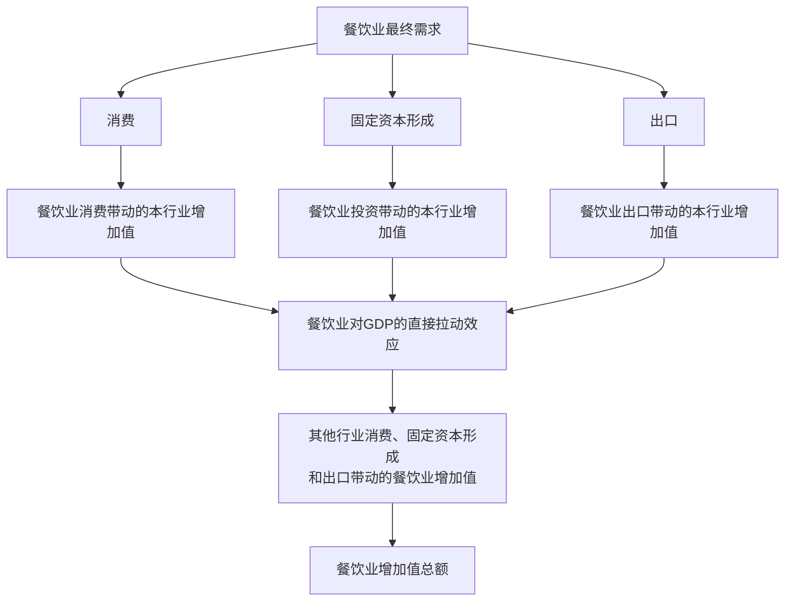
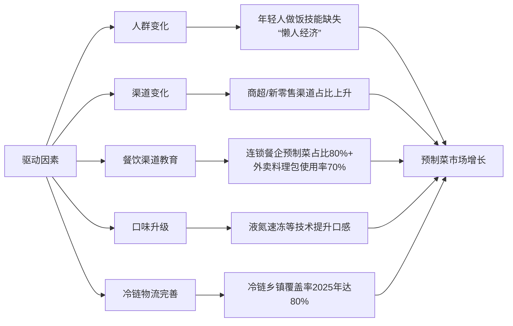
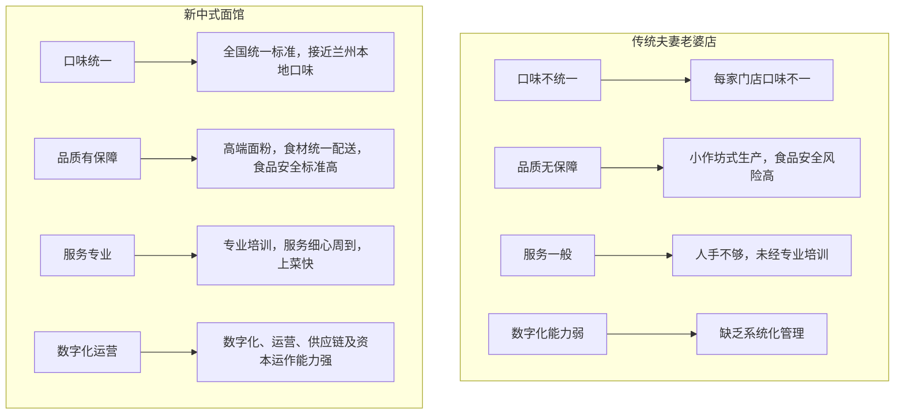
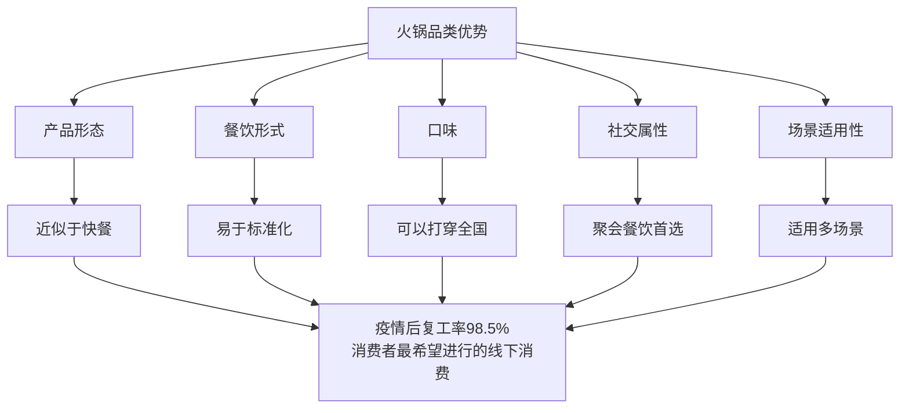
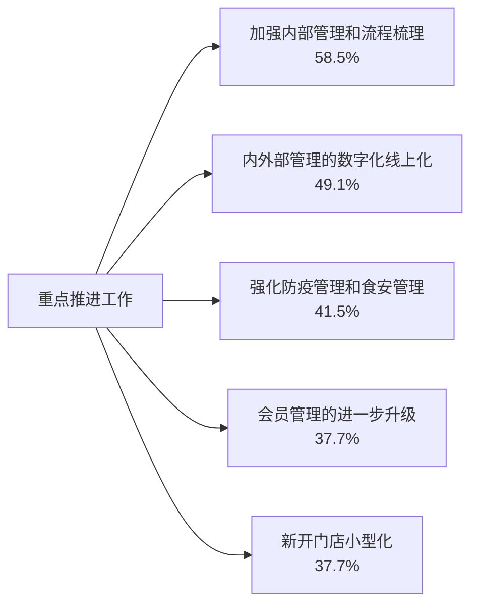

# 《中国连锁餐饮行业报告》章节总结

## 书籍信息
- **书名**：2022年中国连锁餐饮行业报告
- **作者**：中国连锁经营协会（CCFA）与华兴资本联合发布
- **PDF状态**：完整，共73页
- **OCR状态**：可识别，部分图表识别不完整

## 目录说明
- 目录识别情况：报告未提供独立目录页，正文共四章
- 章节对应依据：基于PDF页码顺序梳理
- OCR修复说明：部分图表数据已根据文本描述整理

## 全书核心主题

本报告系统分析了2021年中国连锁餐饮行业的整体发展态势。报告指出，尽管受到疫情冲击，2021年餐饮市场规模已恢复至4.7万亿，同比增长18.6%。连锁化率持续提升，中小规模连锁品牌增长迅速，饮品、烧烤及快餐品类连锁化率增速位居前三。报告深入分析了预制菜、中式面馆、火锅三大细分品类的发展现状、驱动因素及融资情况。同时，通过问卷调查和典型企业访谈，揭示了餐饮企业在疫情下的经营现状、成本结构、人力管理和未来预判。最后，报告梳理了外卖佣金下调、灵活用工、优惠贷款、税收优惠等近期出台的餐饮扶持政策。

---

## 第一章：中国大餐饮行业概况

### 1. 核心论点

本章主要回答中国餐饮行业在疫情后的整体恢复情况与结构性变化问题。作者认为：2021年餐饮市场规模已恢复至疫情前水平（4.7万亿），连锁化率持续提升，中小规模连锁品牌成为增长主力，饮品、烧烤品类表现尤为突出。

### 2. 关键概念

- **连锁化率**：连锁品牌门店数占该品类总门店数的比例。2021年饮品连锁化率突破40%，烧烤、小吃快餐连锁化率增速位居前三。
- **灵活用工**：小时工、兼职工、智能排班等多种用工形式。疫情后部分连锁饮品企业灵活用工占比可达40%。
- **预制菜**：以农、畜、禽、水产品为原料，配以辅料预加工而成的成品或半成品。85%以上销售集中于B端。
- **新运营模式**：以新服务客群需求为核心，以新产品服务和新技术为突破口，实现门店数字化管理，引入智能技术设备的运营模式。

### 3. 逻辑推演

报告首先通过国家统计局数据确认2021年餐饮市场规模恢复至4.7万亿，线上订单保持稳定恢复性增长。接着，基于企查查数据分析企业注册情况：2021年1-11月注册301.3万家（+24.9%），注销85万家（-1.7%），注册量是吊注销的3.5倍，表明创业者仍看好餐饮行业，竞争将加剧。

在连锁化方面，报告引用美团数据指出：门店数涨幅最大的是规模在3-10家店的连锁品牌（+23.0%），其次是11-100家店（+16.8%）。分品类看，饮品连锁化率从2019年的31.5%提升至2021年的41.8%，增速最快；烧烤、小吃快餐分别增长3.9和3.7个百分点。

在就业与GDP贡献方面，报告引用国家信息中心测算：2020年餐饮业直接拉动GDP 5,329亿元，完全拉动就业约2,300万人，完全带动居民劳动者报酬近8,400亿元。

### 4. 流程图

#### 餐饮业对GDP的拉动机制

### 5. 经典金句/数据

> “2021年餐饮规模达4.7万亿，线上订单保持稳定的恢复性增长。” (p.3)

> “2021年1月至11月餐饮企业注册数量达到了301.3万家，同比增长24.9%。” (p.3)

> “饮品的连锁化率已经突破40%。” (p.4)

> “餐饮业完全拉动就业约2300万人。”（2020年数据）(p.8)

---

## 第一部分：预制菜品类分析

### 1. 核心论点

本章主要回答预制菜行业的市场规模、驱动因素及竞争格局问题。作者认为：预制菜行业正处快速发展初期，2025年市场规模有望突破8,300亿元，B端仍是主流场景，C端还需时间教育市场。

### 2. 关键概念

- **预制菜四大类别**：即食食品、即热食品、即烹食品、即配食品。即烹和即配食品将迎来快速发展。
- **料理包**：在中央厨房/工厂里做好的菜品，以料理包形式配送到各大门店。连锁餐饮企业预制菜占比高达80%以上。
- **液氮速冻技术**：超快冷冻速度保持食材口感，避免长途运输损耗，广泛应用于各类预制食品冷冻。

### 3. 逻辑推演

报告首先界定预制菜定义与分类。数据显示2021年中国预制菜市场规模约3,100亿元（+24.1%），预计2025年突破8,300亿元，其中C端占比接近30%。目前85%以上销售集中于B端，存在销售区域小、参与者众多、行业集中度低等特点。

**五大驱动因素**：
1. **人群变化**：年轻人做饭技能缺失、工作时间长，“懒人经济”盛行。调研显示超过一半的Z世代厨艺属于“略知一二”。
2. **渠道变化**：消费者采购食材从传统菜市场转向现代商超和新零售渠道，商超渠道从2015年的26.1%增至2020年的28.1%。
3. **餐饮渠道教育**：连锁门店使用预制菜已是行业内公开的秘密，乡村基、真功夫、西贝等预制菜占比高达80%以上，全国70%的外卖商家使用料理包。
4. **口味升级**：研发水平和冷冻技术进步使预制菜口味已接近餐厅水平。
5. **冷链物流完善**：预计2025年中国冷链乡镇覆盖率可达八成。

竞争格局方面，行业以中小规模企业为主，主要龙头达10亿规模。融资活跃，2021-2022年上半年融资事件20余起，融资金额达数百亿元。

### 4. 方法流程图

#### 预制菜五大驱动因素模型

### 5. 经典金句/数据

> “目前我国预制菜行业市场规模超3,000亿元，到2025年行业规模有望增长至8,300亿左右。” (p.11)

> “头部连锁餐饮企业中预制菜使用比例已经较高。乡村基、真功夫、吉野家、西贝等连锁餐饮企业预制菜占比高达80%以上。” (p.15)

> “第三方机构估计全国70%的外卖商家使用料理包。” (p.16)

> “预制菜品类融资金额占餐饮行业融资金额的10%左右。” (p.18)

---

## 第二部分：中式面馆品类分析

### 1. 核心论点

本章主要回答中式面馆行业的发展现状、融资情况及未来天花板问题。作者认为：面食品类具有易于标准化、可复制性强、群众基础大等特点，天生具备“万店基因”，2024年市场规模预计突破4,300亿元。

### 2. 关键概念

- **万店基因**：指面食品类具有的易于标准化、可复制性强、运营模式轻、群众基础大、消费频次高、市场空间大、生命周期长等优势。
- **新中式面馆**：以兰州牛肉面为核心的连锁品牌（如张拉拉、陈香贵、马记永），打破夫妻店模式，在口味、品质、服务、价格和环境方面均有提升。
- **夫妻老婆店**：数十万家小作坊式面馆，行业分散程度高，食品安全无统一标准，连锁化率仅5%-7%。

### 3. 逻辑推演

报告首先指出2020年全国快餐店中40%是面馆，2021年中式面馆市场规模约3,100亿元，预计2024年突破4,300亿元。面食烹饪流程简单、用料简单，除青菜外所有原料均能以半成品形式规模化生产。

在竞争格局方面，报告指出面品类“大而散”：门店数500家以上的品牌占比不足2%，门店数50家以内的品牌超过70%。目前只有五爷拌面门店数突破千店，和府捞面和味千拉面均未破千。面馆连锁化率仅5%-7%，显著低于火锅（21%）、烧烤（14%）、饮品（42%）。

融资方面，2021年中式面馆融资事件总数仅次于茶饮和咖啡。和府捞面、遇见小面、五爷拌面、陈香贵4家品牌近6年共获18轮融资，金额超25亿元。

消费者调研显示：77.4%受访者喜好兰州拉面；90%的受访者单次消费控制在50元以内，16-30元区间占比最高（43.9%）；选择面馆时最关注面条味道和门店环境卫生，品牌效应影响不大。

**新中式面馆的突破**：打破了夫妻店模式，口味接近兰州本地口味且全国统一标准，食材统一配送，服务员经过专业培训，数字化、运营、供应链及资本运作能力远高于夫妻老婆店。

### 4. 方法流程图

#### 新中式面馆 vs 传统夫妻老婆店对比

### 5. 经典金句/数据

> “2021年初中国中式面馆总量约为110万家，大部分以快餐业态为主。” (p.21)

> “面馆连锁化率低至5%-7%。火锅、烧烤、面包甜点和饮品等其他餐饮品类的连锁化率分别为21%、14%、26%和42%。” (p.23)

> “喜好兰州拉面的中国受访者最多，高达77.4%。” (p.25)

> “该品类具有易于标准化、可复制性强、运营模式轻、群众基础大、消费频次高、市场空间大、生命周期长等优势，天生具备‘万店基因’。” (p.30)

---

## 第三部分：火锅品类分析

### 1. 核心论点

本章主要回答火锅品类的发展现状、竞争格局及未来趋势问题。作者认为：火锅是中国餐饮中规模最大且最具发展前景的品类，但行业竞争激烈、同质化严重，异质化将成为未来必然趋势。

### 2. 关键概念

- **川渝火锅**：占据火锅市场主要份额（40%），辣味具有成瘾性，广受消费者喜爱。
- **小火锅**：“一人食”火锅，以小锅取代大锅，吧台取代桌椅。2021年底中国小火锅企业数量达4.16万家。
- **CR3/CR5**：行业集中度指标。2020年我国火锅行业CR3仅为7.3%，CR5为7.9%，竞争激烈。

### 3. 逻辑推演

报告指出2019年火锅行业市场规模已达5,295亿元，预计2024年达6,413亿元，市场份额占餐饮总市场的13.7%，位居榜首。

从门店规模看，11-100家店区间的火锅连锁门店数占比最高（42.0%）。从地域看，重庆火锅门店数约3.2万家，位居全国第一；成都2.4万家。

**火锅企业的经济模型优势**：运营利润率14%，高于快餐（11%）、西餐（11%）、正餐（6%）。主要因为人工成本较低（前台员工月薪约3,700元，低于其他业态）。

在竞争方面，报告指出火锅业态关店率排第一（约5.9%）。2016年和2019年成立的火锅企业倒闭率分别约50%和30%，约一半火锅企业活不过5年。

消费者调研显示：59.1%偏好川渝火锅，毛肚、虾滑、鸭血是前三菜品；48.2%的单次花费51-100元；57.1%尝试过火锅外卖。

### 4. 方法流程图

#### 火锅品类优势分析

### 5. 经典金句/数据

> “火锅是中国多数人喜欢吃的餐饮品类...火锅是所有菜系中市场规模最大的品类，市场份额达13.7%。” (p.31)

> “火锅企业的运营利润率在14%，快餐、西餐和正餐企业的运营利润率分别在11%、11%和6%。” (p.33)

> “2020年我国火锅行业CR3仅为7.3%。” (p.35)

> “59.1%的中国消费者偏好川渝火锅。” (p.39)

---

## 第二章：近期餐饮行业有支撑政策推出

### 1. 核心论点

本章主要回答近期有哪些政策支持餐饮行业发展的问题。作者认为：外卖平台下调佣金、灵活用工、优惠贷款、税收优惠、限塑令、促进餐饮业恢复发展扶持政策等一揽子措施，为餐饮行业带来了新的活力。

### 2. 关键政策

- **外卖平台下调佣金**：2022年2月，国家发改委等14部门印发通知，引导外卖平台下调餐饮业商户服务费标准。美团推行费率透明化试点，将技术服务费和履约服务费分别计算。
- **灵活用工政策**：2021年7月，国务院办公厅发布《关于支持多渠道灵活就业的意见》，鼓励个体经营、非全日制及新就业形态。
- **优惠贷款政策**：2021年《政府工作报告》提出推广“随借随还贷款”，降低小微企业融资成本。我国餐饮企业中个体工商户占比超过95%。
- **税收优惠政策**：委员提案建议放开纸质发票属地管辖、推广增值税专用发票电子化、实行存量留抵退税等。
- **限塑令**：2021年1月1日起正式实施，禁限不可降解塑料袋、一次性塑料餐具、一次性塑料吸管。
- **促进餐饮业恢复发展扶持政策**：2022年6月，商务部等11部门联合印发通知，从补贴、社保缓缴、融资、担保、保险、老年助餐等六方面落实扶持政策。

### 3. 逻辑推演

报告系统梳理了2021-2022年出台的餐饮扶持政策。外卖佣金方面，美团和饿了么均响应政策推出佣金减免措施，美团进一步推进佣金费率透明化。灵活用工方面，报告指出灵活用工可有效降低用工成本、节省员工房租、实现人员灵活调控。

优惠贷款方面，推广“随借随还贷款”对小微餐饮企业是重大利好。税收优惠方面，多项提案建议旨在降低企业经营成本。限塑令方面，塑料吸管年均使用量约400吨（仅麦当劳中国），纸质环保打包盒成为新趋势。

2022年6月出台的一揽子政策包括：增值税留抵退税、社保费缓缴、减免房租、降低用水用电用网成本、加大稳岗支持力度、加大普惠小微贷款支持等。

### 4. 经典金句/数据

> “2022年2月18日，国家发改委等14部门印发《关于促进服务业领域困难行业恢复发展的若干政策》的通知，引导外卖等互联网平台企业，进一步下调餐饮业商户服务费标准。” (p.44)

> “灵活用工模式可以及时有效的缓解餐饮行业的用工难题，降低企业的用工成本。” (p.44)

> “我国目前共有超过1000万家餐饮企业，其中个体工商户占比超过95%。” (p.45)

> “北京全市塑料购物袋销售量比去年12月（‘限塑10条’发布前）平均下降35%。” (p.46)

---

## 第三章：典型连锁餐饮企业调研

### 1. 核心论点

本章主要回答餐饮企业在疫情下的实际经营状况、成本结构、人力管理及未来预期问题。作者认为：样本企业对2022年总体持谨慎乐观态度，九成以上关注食品安全政策，企业普遍开始使用预制菜，灵活用工比例持续提升。

### 2. 关键概念

- **餐饮企业家信心指数**：反映餐饮行业企业家对行业发展形势的综合判断和对未来发展的心理预期。
- **灵活用工比例**：样本企业平均灵活用工比例从2020年的13.9%提升至2021年的17.5%。
- **员工年自然流失率**：2021年基层员工年自然流失率38%，管理层15%。
- **净菜/预加工食材**：50%的样本企业表示门店每日进货食材总金额中有25%是净菜或预加工食材。

### 3. 逻辑推演

调研覆盖52位餐饮企业创始人或高层管理者，84%为餐饮业大型企业（年销售额>1亿元且从业人员>300人）。样本企业2021年平均拥有823家门店（+21.6%），加盟店占比近63%。门店主要集中在一线城市（83%）和二线城市（81.1%）。

**经营情况**：90%以上样本企业单店销售额有增长，77%增长率在0%-20%区间。2021年重点推进的工作前五项为：加强内部管理和流程梳理（58.5%）、内外部管理数字化线上化（49.1%）、强化防疫管理和食安管理（41.5%）、会员管理进一步升级（37.7%）、新开门店小型化（37.7%）。

**融资计划**：36%的样本企业表示2022年上半年有融资计划，64%暂无融资计划，主要与消费投融资环境持续降温有关。

**预制菜使用**：50%的样本企业表示净菜或预加工食材占门店每日进货食材总金额的25%，81%的样本企业表示预包装食品及半成品销售额增长在25%以内。

**人力情况**：基层员工年自然流失率38%，管理层15%。人均薪酬增长率基层7%、管理层8%。灵活用工比例从13.9%提升至17.5%。培训覆盖率从69.5%提升至75.7%，年度人均培训时长从59.5小时提升至70.2小时。

**政策关注**：九成以上特别关注食品安全相关政策，近八成关注税收政策，近七成关注灵活用工政策。

**未来预判**：52%的样本企业表示2022年是谨慎乐观的一年，72%预计总销售额会增长，77%预计门店总数会增长。

### 4. 方法流程图

#### 样本企业2021年重点推进工作Top5

### 5. 经典金句/数据

> “样本企业在2021年平均拥有823家门店，门店数量较2020年的677家同比增长了21.6%。” (p.50)

> “九成以上样本企业特别关注食品安全相关政策，近八成样本企业特别关注税收相关政策。” (p.56)

> “72%的样本企业表示2022年总销售额会增长，77%的样本企业表示2022年门店总数会增长。” (p.58)

> “基层员工年自然流失率是38%，管理层员工自然流失率是15%。” (p.54)

---

## 第四部分：典型餐饮及茶饮企业微观访谈

### 1. 核心论点

本章通过四家典型企业（披萨品牌、粥品品牌、茶饮品牌、新兴茶饮品牌）的创始人/管理层访谈，从微观角度呈现餐饮品牌发展历程及疫情下的经营现状。

### 2. 关键案例

**某披萨品牌**：
- 创始人1973年出生，2002年创建披萨连锁品牌，现有190多家餐厅
- 定位自助披萨模式，目标年轻人和学生，菜单采用“7+2+1”定位（70%西餐+20%中餐+10%地域特色）
- SKU控制在100个左右，是正餐自助餐品牌的一半
- 单店模型优化：350平米→280平米，25个员工→减少5-6个
- 2016-2019年每年保持20-30%同店增长，2020年亏损，2021年恢复盈利
- 客单价79元，具备下沉三四线城市的能力

**某粥品品牌**：
- 创始人1972年出生，2004年开创粥品连锁品牌，现有近200家门店
- 疫情导致外卖增长：2020年外卖收入较2019年增长170%，2021年较2020年增长70%
- 2006年建立第一代中央厨房，2012年投资1.5亿建智能化中央厨房
- 未来重点强化供应链和数字化能力
- 2022年目标新开200家门店

**某知名茶饮品牌**：
- “茶饮+软包”新式茶饮，截至2022年3月有101家直营门店
- 18-35岁女性用户占70%
- 标准店面积100-150㎡，单店稳定营业额120-160万元
- 客单价65元，行业最高水平
- 外卖销售占比30%-35%
- 产品SKU约50-60个，能做到周周上新

**某新兴茶饮品牌**：
- 2015年厦门成立，2018年开出第一家店，现28个城市120余家门店
- 产品客单价24元，产品毛利75%，优秀门店利润率可达30%
- 特色：无限DIY（用户可自选添加多种小料）
- 外卖订单收入占比约70%
- 疫情导致净利润下滑50%以上

### 3. 经典金句/数据

> “创始人认为一个真正的品牌是需要具备上下通杀的能力的，就是既可以进入一二线城市也可以下沉到三四线城市。” (p.62)

> “数据不会说谎，数据的背后都是有原因的，企业可以通过数据看未来。” (p.63)

> “公司完全以内容营销和价值营销进行驱动，结合线上线下打造营销闭环。” (p.64)

> “疫情期间公司净利润下滑50%以上，目前集团层面是盈利的。” (p.65)