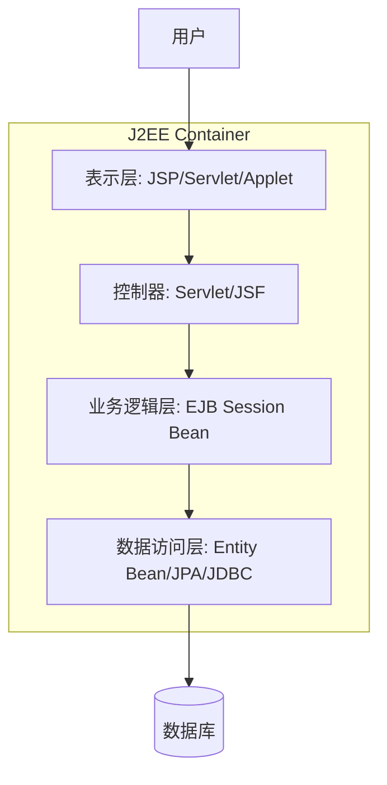
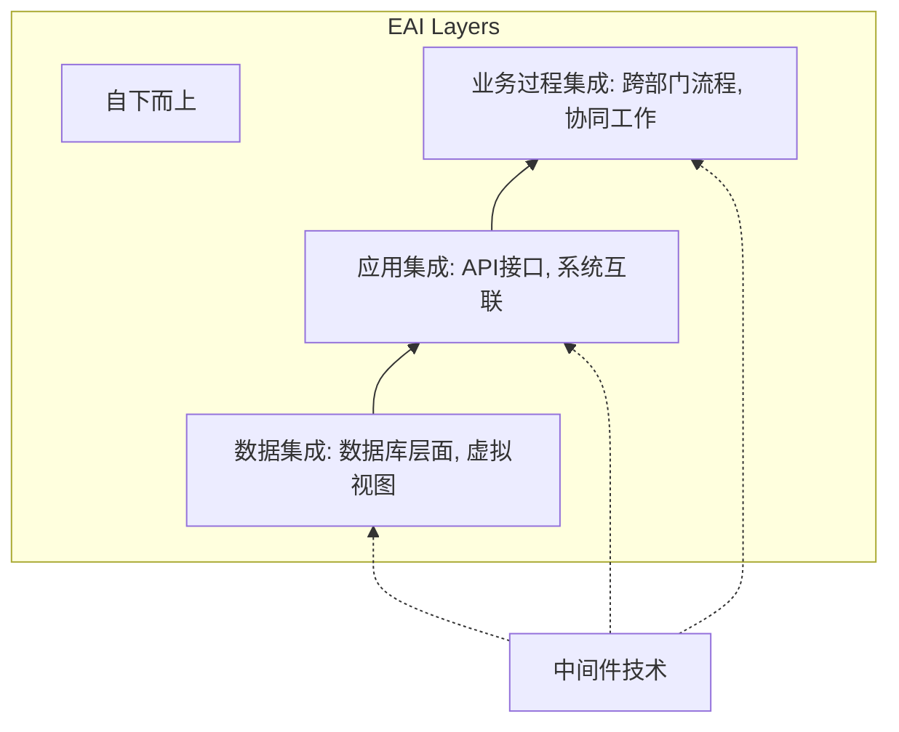
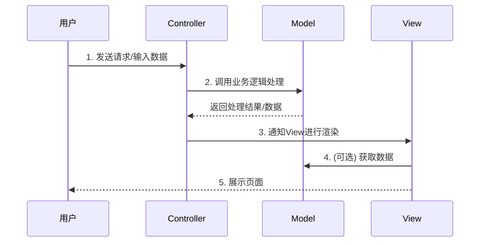

# 《中间件技术与企业应用架构》章节总结

## 书籍信息

- **书名**：中间件（基于上传文件内容推断，可能为《软件设计师》或《系统架构设计师》考试辅导资料中的“中间件”章节）
- **作者**：未明确标注（内容涉及Sun, Microsoft, BEA, IBM等厂商技术及典型真题，推测为计算机技术与软件专业技术资格水平考试辅导教材）
- **PDF 状态**：文本可识别，结构清晰
- **OCR 状态**：良好，少量格式需整理

## 目录说明

- **目录识别情况**：文档无传统图书目录，但具有清晰的层级标题，包括：中间件的功能、中间件的类型、应用服务器、EJB、.NET、企业应用集成、Java企业应用框架。
- **章节对应依据**：按照文档内容的逻辑板块划分为7个主要章节。
- **OCR 修复说明**：内容完整，无需重大修复。

## 全书核心主题

本书（或本章）系统阐述了中间件在分布式系统中的核心地位、功能分类及主流技术实现。首先定义了中间件作为连接操作系统与应用软件的桥梁作用，详细列举了其六大基本功能如通信管理、互操作、屏蔽异构差异等。接着，将中间件细分为消息、事务、数据存取、Web、安全、跨平台架构等八类，并重点介绍了应用服务器（特别是J2EE体系）和.NET平台的技术架构。深入解析了EJB组件模型（Session, Entity, Message-Driven Bean）及其在多层架构中的应用，对比了Hibernate与MyBatis持久层框架的优劣。最后，探讨了企业应用集成（EAI）的三个层次以及Java主流开发框架（MVC, Struts, Spring, Hibernate/MyBatis）的原理与优势，旨在构建高可用、可扩展的企业级分布式应用系统。

---

## 第1章：中间件概述与功能

### 1. 核心论点

本章主要解决“什么是中间件及其核心价值”的问题。
作者认为：中间件是位于操作系统之上、应用软件之下的独立系统软件，其核心价值在于屏蔽底层异构性，实现分布式应用间的资源共享、互操作及高效通信。

### 2. 关键概念

- **中间件定义**：一种独立的系统软件或服务程序，分布式应用软件借助它在不同技术间共享资源。
- **互操作性**：实现应用层不同服务之间以及应用与数据库之间的连接和控制。
- **屏蔽差异**：隐藏硬件、操作系统、网络和数据库的具体实现细节，提供统一接口。
- **负载均衡与高可用**：提供交易管理机制，保证交易一致性，支持系统的高可靠性运行。

### 3. 逻辑推演

文章首先从宏观定义入手，指出中间件位于OS与应用之间。随后，通过六个具体方面细化其功能：从基础的客户端-服务器通信，到应用层的互操作，再到提供开发平台、屏蔽底层差异、提供系统级保障（安全、负载、事务），最后归结为提供通用服务以避免重复开发。这一逻辑由底向上，由基础通信到高级服务，层层递进地展示了中间件的全貌。

### 4. 经典金句

> “中间件位于操作系统之上，管理计算资源和网络通信，实现应用之间的互操作。”

> “屏蔽硬件、操作系统、网络和数据库的差异。”

---

## 第2章：中间件的分类

### 1. 核心论点

本章解决“中间件有哪些类型及其各自职责”的问题。
作者通过“城市交通系统”的类比，将中间件划分为八类，强调不同类型中间件在分布式系统中承担的不同职责，其中消息中间件市场份额最大，事务中间件增长率最高。

### 2. 关键概念

- **消息中间件**：负责可靠、高效、实时的跨平台数据传输（如IBM MQSeries, TongLINK）。类比交通规则和管理机构。
- **事务处理中间件**：负责大量事务的并发运行、负载均衡及故障恢复，保证高可用性（如BEA Tuxedo）。类比运载汽车及交通监视。
- **数据存取管理中间件**：处理网络上虚拟缓冲存取、格式转换、解压等，适应多种数据格式。
- **Web服务器中间件**：扩充浏览器会话能力，克服HTTP限制（如SilverStream）。
- **安全中间件**：解决安全保密问题，适应灵活多变的安全要求，常需国产化替代。
- **跨平台和架构中间件**：集成不同平台构件，如CORBA（功能最强但庞大）、JavaBeans（灵活但效率待改善）、COM+（适合Windows）。
- **专用平台中间件**：针对特定领域（如电子商务）建立参考模式和构件库。
- **网络中间件**：包括网管、接入、测试等。

### 3. 逻辑推演

作者采用类比法引入，将网络比作马路，中间件比作交通设施。随后逐一介绍八类中间件，每类都结合了其解决的问题（如通信可靠性、事务一致性、数据格式差异、安全性、平台异构性等）及代表性产品。逻辑上涵盖了从底层通信到上层应用集成，从通用服务到专用领域的完整谱系。

### 4. 经典金句

> “中间件系统就相当于这些配套的交通设施。”

> “消息中间件，也是市面上销售额最大的中间件产品。”

> “BEA的 Tuxedo由此而著名，它成为增长率最高的厂商。”

---

## 第3章：应用服务器与J2EE架构

### 1. 核心论点

本章解决“应用服务器在企业级应用中的作用及J2EE规范构成”的问题。
作者认为：应用服务器提供了“企业级应用的操作系统”，J2EE通过多层分布式模型解决了传统C/S模式的弊端，实现了部署无关性和资源生命周期管理。

### 2. 关键概念

- **应用服务器**：提供开发、部署、运行、管理平台，支持集群、异构协同、备份，满足高可用、高性能、可伸缩性。
- **J2EE规范**：一组针对Web Service、业务对象、数据访问和消息传送的API标准。
- **多层架构**：
    - **表示层**：显示数据，接收输入。
    - **业务逻辑层**：核心价值链，处理业务规则，常用EJB。
    - **数据访问层**：负责数据库访问（Select/Insert/Update/Delete），ORM映射。
- **J2EE核心组件与服务**：
    - **容器**：Applet, Application, Web, EJB Container。
    - **组件**：Applet, Application, JSP/Servlet, EJB。
    - **服务API**：RMI-IIOP, Java IDL, JTA, JDBC, JMS, Java Mail, JNDI, JAXP, JCA, JAAS, JSF, JSTL, SAAJ, JAXR。

### 3. 逻辑推演

首先定义应用服务器为电子商务的关键中间件，强调其“操作系统”般的地位。接着引入J2EE规范，解释其设计初衷是解决两层模式（C/S）的臃肿和难维护问题。随后详细拆解J2EE的多层架构（表示、业务、数据），并列举其定义的构件和核心服务API。最后总结多层架构的八大优点（分工、替换、解耦、标准化、复用、扩展、安全、维护）。

### 4. 流程图：J2EE多层架构

### 5. 经典金句

> “从某种意义上说，应用服务器提供了一个‘企业级应用的操作系统’。”

> “J2EE注重两件事，一是建立标准，使 Web 应用的部署与服务器无关；二是使服务器能控制构件的生命周期和其他资源。”

---

## 第4章：EJB企业级JavaBean

### 1. 核心论点

本章解决“EJB组件模型的分类及其在分布式系统中的职责”的问题。
作者指出：EJB封装了业务逻辑，由容器管理事务、安全等琐碎任务，分为会话Bean（交互）、实体Bean（持久化）和消息驱动Bean（异步处理）。

### 2. 关键概念

- **EJB (Enterprise JavaBean)**：J2EE服务器端组件模型，用于部署分布式应用程序。
- **会话Bean (Session Bean)**：
    - **有状态**：保存客户端状态，生命周期随用户会话结束。
    - **无状态**：不保存特定用户状态，实例可被池化复用，注意属性共享风险。
    - **职责**：负责服务端与客户端交互，实现业务逻辑。
- **实体Bean (Entity Bean)**：
    - **职责**：数据持久化，O/R映射，代表数据库记录。
    - **特点**：具有持久性，状态与数据库同步。（注：EJB3.0后发展为JPA）。
- **消息驱动Bean (Message Driven Bean)**：
    - **职责**：基于JMS消息，异步处理请求，适用于订单处理等场景。
    - **特点**：异步无状态，客户端调用后立即返回，无需等待。

### 3. 逻辑推演

首先介绍EJB的定义和目标（部署分布式应用，屏蔽底层复杂性）。然后详细阐述三种Bean类型：实体Bean侧重数据映射和持久化；会话Bean侧重业务逻辑和客户交互，区分有状态和无状态的区别；消息驱动Bean侧重异步消息处理。最后通过典型真题分析，强化了对三种Bean职责的理解（会话-交互，实体-持久，消息-异步）。

### 4. 经典金句

> “EJB构件用于封装业务逻辑，使开发人员无须再担心数据访问、事务处理支持、安全性、高速缓存和迸发等琐碎任务的编程。”

> “消息驱动Bean实际上是一个异步的无状态会话Bean... 这样就能避免客户端长时间的等待一个方法调用直到返回结果。”

---

## 第5章：.NET平台技术

### 1. 核心论点

本章解决“.NET平台的核心构成及其关键技术特性”的问题。
作者认为：.NET基于通用语言运行时（CLR）和基础类库（BCL），通过ADO.NET、ASP.NET等技术实现了跨语言、跨平台的Web服务和应用开发。

### 2. 关键概念

- **CLR (Common Language Runtime)**：.NET框架底层，提供统一运行环境、内存管理、多语言交互、简化发布（解决DLL地狱）。
- **受控代码执行流程**：源代码 -> 编译器生成MSIL（微软中间语言）+ 元数据 -> JITC（即时编译器）生成机器码执行。
- **BCL (Base Class Library)**：统一的面向对象编程接口，如System, System.Data。
- **ADO.NET**：
    - **革新**：强大XML支持，引入DataSet（内存数据缓冲区，关系型视图），替代Recordset。
    - **对象**：DataReader（高效只读读取）。
- **ASP.NET**：网络编程结构，方便建造、运行和发布网络应用。
- **WinForms**：Windows GUI开发，基于System.Windows.Forms命名空间。

### 3. 逻辑推演

从.NET的整体定位（XML Web services平台）出发，深入到底层CLR的工作原理（MSIL, JITC）。接着介绍开发者直接使用的BCL。随后重点对比ADO.NET与传统ADO的区别，突出其对XML的支持和DataSet的创新。最后简要提及ASP.NET和WinForms作为应用层开发技术。

### 4. 经典金句

> “Microsoft.NET正是基于通用语言运行时，实现了这些开发人员梦寐以求的功能。”

> “ADO.NET对XML的支持也为 XML成为 Microsoft.NET中数据交换的统一格式提供了基础。”

---

## 第6章：企业应用集成 (EAI)

### 1. 核心论点

本章解决“如何打破企业信息孤岛，实现系统间协同工作”的问题。
作者认为：EAI通过中间件技术连接异构应用，分为数据集成、应用集成和业务过程集成三个层次，其中数据集成是基础。

### 2. 关键概念

- **EAI (Enterprise Application Integration)**：将多种应用系统集成在一起，实现信息共享和相互调用。
- **中间件在EAI中的作用**：兼容开放、平台透明、保护交易一致性、缩短开发周期。
- **集成层次**：
    - **数据集成**：基础层。将不同数据库集成，提供单一虚拟数据库，直接读写数据库。
    - **应用集成**：通过API接口集成应用系统（如ERP, CRM）。
    - **业务过程集成**：跨部门、跨系统的流程共用和整合。

### 3. 逻辑推演

首先指出企业系统普遍存在“点对点”连接的弊端和信息孤岛问题。引入EAI概念，并阐述中间件在其中的四大优势。接着，按照从底向上的顺序，详细划分了EAI的三个层次：数据集成（解决数据不一致）、应用集成（通过API连接功能）、业务过程集成（优化业务流程）。

### 4. 流程图：EAI集成层次

### 5. 经典金句

> “数据集成的目的是将不同的数据库集成起来，提供一种单一的虚拟数据库，这样就不会出现与核心业务不一致的多个数据库。”

> “中间件产品可以缩短开发周期 50%～75%，从而大大地降低了开发成本。”

---

## 第7章：Java企业应用框架

### 1. 核心论点

本章解决“Java EE开发中主流框架的设计模式与技术选型”的问题。
作者认为：MVC模式是Web应用的基础，Struts、Spring、Hibernate/MyBatis等框架通过分层、解耦、ORM等技术，简化了企业级开发的复杂性。

### 2. 关键概念

- **MVC模式**：
    - **Model**：业务逻辑与数据保持。
    - **View**：数据显示。
    - **Controller**：接收输入，控制Model与View交互。
- **Struts框架**：基于J2EE的MVC框架，使用ActionServlet作为前端控制器，整合Servlet/JSP/标签库。
- **Spring框架**：
    - **核心**：IoC（控制反转，对象创建权交给容器）和AOP（面向切面编程，权限、监控等）。
    - **优点**：解耦、声明式事务、方便测试、集成其他框架、降低JavaEE API难度。
- **Hibernate框架**：
    - **类型**：全自动ORM框架。
    - **特点**：POJO与表映射，自动生成SQL，屏蔽数据库差异，非侵入式。
- **MyBatis框架**：
    - **类型**：半自动持久层框架。
    - **特点**：支持定制化SQL，SQL与代码分离（XML/注解），灵活，需手动管理映射。
- **Hibernate vs MyBatis**：
    - **开发速度**：Hibernate快（自动SQL），MyBatis稍慢（手写SQL）。
    - **SQL优化**：MyBatis优（可控），Hibernate略逊（自动生成可能繁琐）。
    - **对象管理**：Hibernate完整ORM，MyBatis需自行管理。
    - **缓存**：配置方式不同，MyBatis更灵活针对表配置。

### 3. 逻辑推演

首先介绍MVC设计模式及其在J2EE Web应用中的体现。接着依次介绍三大主流框架：Struts作为早期的MVC实现；Spring作为轻量级一站式框架，通过IoC和AOP解决耦合问题；持久层框架对比Hibernate（全自动ORM）和MyBatis（半自动SQL映射）。最后通过对比表格形式，分析了Hibernate和MyBatis在开发效率、SQL优化、对象管理和缓存方面的差异，指导技术选型。

### 4. 流程图：MVC工作流程

### 5. 经典金句

> “Spring的核心是控制反转（IoC）和面向切面（AOP）。”

> “Hibernate是一个开源的对象关系映射框架... 程序员可以随心所有地使用对象编程思维来操纵数据库。”

> “Mybatis避免了几乎所有的JDBC代码和手动设置参数以及获取结果集。”