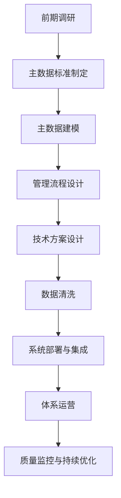
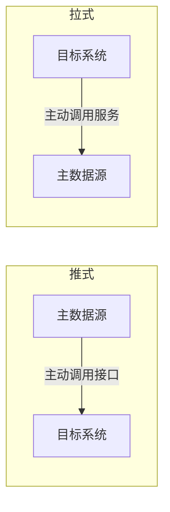
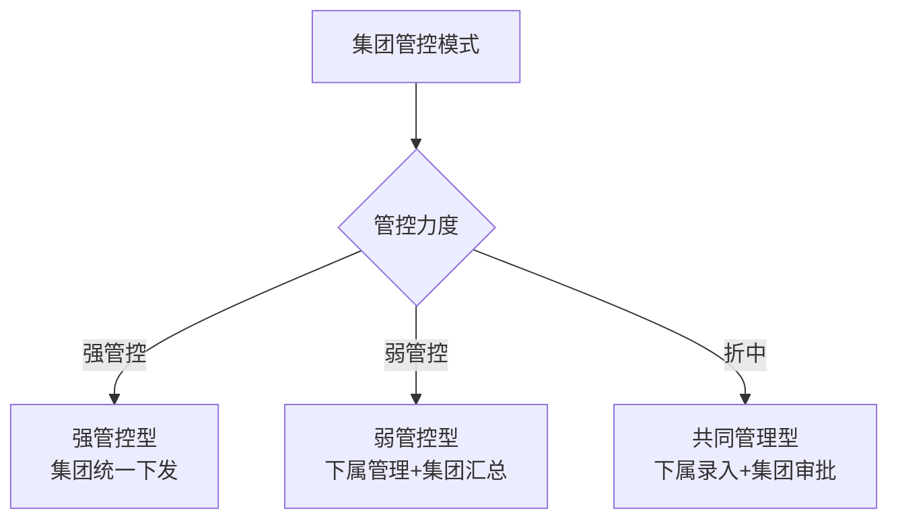

# 《主数据管理——企业数据化建设基础》章节总结

## 书籍信息
- **书名**：主数据管理——企业数据化建设基础
- **作者**：张旭
- **PDF状态**：可识别，部分页面存在扫描/OCR痕迹，部分图表内容不完整
- **OCR状态**：正文基本可识别，部分表格和图表内容存在错位或缺失

## 目录说明
- **目录识别情况**：完整识别，书籍分为四大篇：认知篇、方法篇、数据篇、产品篇，共18章+附录
- **章节对应依据**：基于PDF页面顺序和目录结构逐章整理
- **OCR修复说明**：部分表格内容存在识别错位，已基于上下文进行合理结构化整理；部分流程图原文中仅有图号标注，无具体图形内容，已标注说明

## 全书核心主题

本书系统阐述了主数据管理（MDM）在企业数据化建设中的定位、方法论和实践路径。作者张旭从认知、方法、数据、产品四个维度，完整呈现了主数据管理的理论框架与实施体系。

核心观点包括：
1. **主数据是企业数据化的基础**——主数据描述客观实体，是交易数据、行为数据的基础层，主数据管理解决的核心问题是跨系统数据的一致性与权威性。
2. **主数据管理是“体系”而非“产品”**——包含数据模型、管理组织、管理流程、技术支撑、数据清洗五大组成部分，缺一不可。
3. **主数据管理是数据治理的重要组成部分**——与数据标准、数据组织、数据质量、数据安全紧密关联。
4. **不同类型主数据管理策略各异**——人员、账户、组织等通用主数据相对成熟；产品、物料、资产、项目等业务主数据复杂度高，需要针对性设计。

---

## 认知篇

### 第1章：主数据的认知

#### 1. 核心论点

**问题**：为什么企业需要主数据管理？主数据在企业数据化建设中扮演什么角色？

**作者观点**：主数据管理是企业数据化建设的基石。企业信息化建设产生了大量异构系统，导致基础数据不一致、业务割裂。主数据管理通过构建统一、权威的基础数据体系，解决系统间数据交换困难、数据分析不准确等核心问题。

#### 2. 关键概念/事件

- **两个世界**：客观世界与虚拟世界（数据模型）。虚拟世界是对真实世界的映射，可以用于通信、记录信息、了解过去与预测未来。
- **数字化企业特征**：业务线上化、企业透明化、数据化思维、智慧大脑端倪、数据驱动。
- **主数据定义**：在计算机系统之间分享的数据，描述客观实体（如客户、产品、员工等），与交易数据/行为数据相对存在。
- **主数据分类**：
  - 内生主数据 vs 外生主数据
  - 单体主数据 vs 类别主数据
  - 单部门单入口 vs 多部门多入口
- **主数据管理定义**：构建一套体系管理主数据，包括清晰的数据模型、完整的管理体系、技术支撑体系。

#### 3. 逻辑推演/叙事脉络

本章从“两个世界”的哲学思考切入，说明虚拟世界（数据模型）是对真实世界的映射。企业信息化建设将业务线上化，但产生了大量孤立系统。作者指出，企业数据化建设需要完整的信息化前提、数据治理体系、数据平台、员工数据化理念、AI应用场景五大条件。主数据管理之所以成为核心环节，是因为：（1）业务本身需要统一的数据模型；（2）系统间数据交换需要一致的实体描述；（3）跨系统数据分析需要统一的基础数据。

#### 4. 经典金句/数据

> “主数据就是在计算机系统之间分享的数据。分享是关键词。” (p.17)

> “主数据管理最直观的成果是：一份黄金数据——业务上最值得信任的数据。” (p.21)

> “主数据管理能够解决企业中90%的主数据管理需求。” (p.18)

---

### 第2章：主数据管理前期调研

#### 1. 核心论点

**问题**：如何有效开展主数据管理项目的前期调研工作？

**作者观点**：前期调研是主数据管理项目成功的基础，需要从企业业务情况、信息化现状、主数据管理成熟度三个维度进行全面摸底，以此确定项目切入点和实施策略。

#### 2. 关键概念/事件

- **企业业务调研**：
  - 静态内容：组织、部门、岗位、职责
  - 动态内容：业务流程、业务场景
  - 制度规范：公司制度、规范、战略资料
- **信息化现状调研**：
  - 主要信息系统及技术框架
  - 供应商情况
  - 主数据在系统中的定义、表结构、数据量、完整性
- **主数据管理成熟度评估指标**：
  - 是否有清晰的数据模型定义
  - 是否有完整的管理制度和流程
  - 是否有系统支撑
  - 是否可在各系统方便共享
  - 是否有质量监控体系
  - 管理体系的适应性

#### 3. 逻辑推演/叙事脉络

作者提出，主数据管理项目开始时需要对客户企业进行全面了解。首先通过公开资料了解企业概况（行业、营收、战略）；其次通过组织架构、业务流程、制度规范梳理业务情况；再次了解信息化现状，特别是与主数据相关的系统；最后进行主数据管理情况摸底，包括数据状况、管理状况、共享状况，并给出成熟度评估。这一系列调研为后续建模、流程设计、技术方案提供依据。

#### 4. 经典金句/数据

> “如果没有大量异构信息系统的存在，主数据也就失去了存在的土壤和价值。” (p.42)

> “主数据管理成熟度评估有利于确定该主数据进行数据管理的切入点和重点关注内容。” (p.46)

---

### 第3章：主数据建模

#### 1. 核心论点

**问题**：如何设计科学合理的主数据模型？

**作者观点**：主数据建模是用元数据描述业务实体的过程，需遵循“参考用户业务系统模型”“满足应用系统需求”“颗粒度宁细勿粗”“纳入关联参照数据”四大原则。模型设计是取舍过程，建议优先获取80%的核心价值。

#### 2. 关键概念/事件

- **主数据模型要素**：明确定义、常规属性项、引用属性项、编码
- **主数据定义**：描述客观实体，明确数据范围
- **编码作用**：
  - 实现“一物一码”或“一类一码”
  - 获得数据信息
  - 高效性和可读性
  - 便于管理
- **属性分类**：
  - 基本属性：各系统都需要，如性别、年龄
  - 业务属性：专业系统特定信息，如入职时间
  - 统计属性：因业务产生，建议不作为主数据属性
- **分类属性**：用于查找和统计分析，需避免多视角混淆

#### 3. 逻辑推演/叙事脉络

本章按“定义→编码→属性→分类→颗粒度”的逻辑展开。作者强调，主数据建模首先要有明确定义；其次制定编码规范，建议采用流水码+助记码方案；再次确定属性内容，建议优先选择基础属性，避免贪大求全；最后处理分类属性和颗粒度问题。对于类别主数据，作者提出“唯一性属性”概念作为颗粒度控制手段。

#### 4. 经典金句/数据

> “设计其实是一个取舍的过程，我们的策略永远都是二八原则，即优先获取八成的价值。” (p.59)

> “对于有些主数据而言，无论我们怎么划分，都不可能做到‘一物一码’，而只能做到‘一类一码’。” (p.64)

#### 5. 颗粒度问题说明

| 主数据类型 | 是否存在颗粒度问题 | 说明 |
|-----------|-------------------|------|
| 人员/客户/供应商/组织 | 不存在 | 一个客观对象对应一条数据 |
| 物料/产品/资产 | 普遍存在 | 类别主数据，需用“唯一性属性”界定 |

---

### 第4章：主数据管理业务支撑体系建设

#### 1. 核心论点

**问题**：如何从组织和流程层面保障主数据管理的落地？

**作者观点**：主数据业务管理体系并非全新体系，而是在现有管理体系基础上的优化。核心目标是：在主数据全生命周期内，对于每一个属性能明确回答——由哪个部门、哪个岗位、在什么场景、依据什么进行管理和维护。

#### 2. 关键概念/事件

- **业务支撑体系建设目标**：
  - 明确管理职责
  - 明确管理依据
  - 明确管理时间点
  - 建立错误考核机制
- **主数据管理组织**：
  - 标准管理组织：管理模型标准、填报规范
  - 数据管理组织：对主数据全生命周期负责
- **管理流程维度**：
  - 管理内容：增加、修改、删除
  - 管理范围：单条数据、多个属性、某个主数据
- **外生主数据特点**：
  - 企业权限有限
  - 数据质量依赖外部条件
  - 涉及多部门
  - 获取难度高

#### 3. 逻辑推演/叙事脉络

作者首先指出当前管理体系可能存在的问题（职责不明确、依据不明确、时间点不明确、无考核机制），然后提出建设目标。接着讨论管理组织的确定方法——通用主数据对应现有部门，复杂主数据建议成立标准化组织。最后给出管理流程制定方法和外生主数据的应对策略。本章强调：组织保障是主数据管理最基础的条件。

---

### 第5章：主数据管理技术支撑体系建设

#### 1. 核心论点

**问题**：如何从技术层面支撑主数据管理体系的运转？

**作者观点**：技术支撑方案以主数据在信息化系统中的数据流向图为核心，包括数据入口、数据汇聚、数据分发三大环节。技术方案需与组织职责和管理流程匹配。

#### 2. 关键概念/事件

- **数据入口形式**：
  - 单入口：由一个专业系统承担管理职责
  - 多入口：多个系统共同承担，主数据系统作为判重裁判
  - 主数据系统作为入口：承担管理功能
- **数据汇聚目的**：清洗、管理、分发、统计、质量监控
- **数据分发方式**：
  - 推式（实时性强，需异常处理）
  - 拉式（稳定可靠，实时性差）
  - 数据库层面拷贝（开发量小，需谨慎）
- **目标系统获取数据后的处理**：数据转换、审批流程、私有属性维护、私有数据补充

#### 3. 逻辑推演/叙事脉络

作者按“入口→汇聚→分发→消费”的技术链路展开。首先讨论三种入口模式的适用场景；其次说明汇聚的五大目的；再次比较推式和拉式两种分发方式的特点；最后说明目标系统获取主数据后可能需要的四种处理。对于集团型企业，作者区分了强管控型（集团统一下发）、弱管控型（下属企业管理、集团汇总）、共同管理型三种技术方案。

#### 4. 经典金句/数据

> “主数据管理系统的构建，最后要让基础数据在全局得到统一。” (p.81)

#### 5. 集团型企业集成方案对比

| 类型 | 管控力度 | 数据流向 | 适用场景 |
|-----|---------|---------|---------|
| 强管控型 | 高 | 集团统一下发 | 集团要求统一标准 |
| 弱管控型 | 低 | 下属管理→集团汇总 | 集团管控要求不高 |
| 共同管理型 | 中 | 下属录入→集团审批 | 责权分配折中方案 |

---

### 第6章：主数据的历史数据清洗

#### 1. 核心论点

**问题**：如何高效完成主数据的历史数据清洗工作？

**作者观点**：数据清洗是主数据管理工作中一次性投入工作量最大的部分。清洗目的是找全数据、剔除重复、修改错误、补充缺失、建立关联。策略上可根据数据类型选择清洗全部、清洗在建数据或不清洗历史数据。

#### 2. 关键概念/事件

- **数据清洗四大目的**：
  - 找全范围内所有数据
  - 剔除重复数据
  - 修改错误属性、补充缺失属性
  - 将当前数据与其他数据关联对应
- **清洗范围选择**：
  - 清洗所有数据：工作量最大、效果最好
  - 清洗在建数据：效果可接受
  - 不清洗历史数据：工作量小、见效慢
- **高耗时操作**：数据排重、格式转换、内容校验、缺失补录
- **清洗工具辅助**：计算机可辅助排重、格式转换、初级校验，但缺失补录主要依赖人工

#### 3. 逻辑推演/叙事脉络

作者首先明确清洗工作的四大目的，强调清洗需要甲方业务人员大量参与。然后讨论清洗责任部门的指定和清洗范围的约定——对于已完成生命周期的主数据可不做清洗。接着分析高耗时操作，说明计算机可辅助的部分。最后提出“集中办公+短期迭代”的组织策略，以及二次/三次迭代保证数据与业务最终一致。

---

### 第7章：主数据管理项目实施及体系运营

#### 1. 核心论点

**问题**：主数据管理项目有何特点？如何保证体系持续健康运营？

**作者观点**：主数据管理从项目开始，但不终止于项目。项目特点是综合性强、涉及业务部门多、涉及信息系统多。项目核心成果是一套可顺畅运转的管理体系，运营就是要保证这套体系持续健康。

#### 2. 关键概念/事件

- **项目特点**：
  - 综合性强（模型、组织、流程、技术、清洗）
  - 涉及业务部门多
  - 涉及信息系统多
  - 需要持续健康运转
- **项目交付物**：
  - 主数据管理成熟度评估报告
  - 主数据模型标准、管理标准、技术标准
  - 主数据管理体系设计
  - 可运行的软件系统
  - 集成代码
- **运营健康判断维度**：
  - 数据标准是否满足需求并得到执行
  - 管理体系是否运转正常
  - 产品平台是否承担对应功能
  - 数据质量是否符合预期

#### 3. 逻辑推演/叙事脉络

作者首先对比主数据项目与传统IT项目的差异，强调其综合性和复杂性。然后提供完整的项目实施流程表，列出各阶段的工作内容、交付物和参与角色。最后重点讨论体系运营——从日常管理视角判断体系是否健康，并论证建立数据质量监控体系的必要性。作者指出，数据质量问题是能最直接反映体系问题的监控点。

---

## 数据篇

### 第8章：参照数据和枚举数据

#### 1. 核心论点

**问题**：参照数据和枚举数据在主数据体系中如何管理？

**作者观点**：参照数据和枚举数据应统一纳入主数据管理范畴，按类型采用不同管理方法：国家/行业标准数据从权威渠道获取；企业内部公共数据由责任部门管理；从属于主数据的参照数据纳入该主数据管理体系。

#### 2. 关键概念/事件

- **参照数据特点**：基本不引用别的表、被主数据/业务数据引用、属性少、内容少且变动不频繁
- **枚举数据**：属性中固定几个选项，如性别字段
- **参照数据分类**：
  - 国家/行业基础编码规范（如地理信息、行业分类）
  - 企业基础编码规范（如经营区域划分）
  - 主数据业务领域数据（如岗位、职级）
- **获取途径**：政府网站、第三方数据服务、爬虫（不推荐）

#### 3. 逻辑推演/叙事脉络

作者首先定义参照数据和枚举数据，说明其在主数据体系中的位置。然后按三种类型区分管理方法：国家/行业标准数据可定期从公开渠道获取；企业内部公共数据需确定责任部门并在主数据系统中管理；从属于主数据的参照数据纳入对应主数据的管理体系。最后简要说明技术支撑要求——支持新增、变更、封存流程。

---

### 第9章：人员主数据管理

#### 1. 核心论点

**问题**：人员主数据如何有效管理？

**作者观点**：人员主数据是企业核心基础数据，数据质量相对较高，管理重点在于数据共享和模型匹配。需明确区分人员（自然人）与账户（系统使用者）的定义。

#### 2. 关键概念/事件

- **人员定义要点**：明确是否包含股东、员工、临时员工、实习生、离退休人员、服务人员
- **模型核心属性**：编码、姓名、性别、证件信息、联系方式、人员状态、岗位、职级、所属组织
- **管理要点**：
  - 数据质量高，重点是数据共享
  - 需与账户主数据区分
  - 集团型企业需识别唯一自然人
  - 支持多岗位/多部门（多值域）
- **清洗手段**：数据质量检查、自助平台动员、集中填写核对、数据查重

#### 3. 逻辑推演/叙事脉络

作者先给出人员定义的范围说明，然后提供模型示例。接着提出五大管理要点——数据质量、共享、模型匹配、重复识别、多岗位问题。然后说明管理组织（人力资源部门）和流程（入职、转正、调动、离职、自助维护）。技术方案上，建议以人力资源管理系统为源头，通过主数据系统分发。FAQ部分解答了人员范围、与账户关系、属性边界等常见问题。

#### 4. 经典金句/数据

> “人员主数据包括80000条人员主数据、43000条账户主数据……明显可以看出，人员主数据和账户主数据在定义和使用上各自为政。” (p.123)

#### 5. 人员 vs 账户区分

| 维度 | 人员主数据 | 账户主数据 |
|-----|-----------|-----------|
| 定义 | 自然人 | 信息系统使用者 |
| 范围 | 企业内人员 | 人员+角色+外部人员 |
| 数量关系 | 80000人 | 43000账户（示例） |

---

### 第10章：账户主数据管理

#### 1. 核心论点

**问题**：账户主数据如何与人员主数据联动管理？

**作者观点**：账户定义是“企业信息系统的使用者”，与人员有明显区别但需紧密联动。账户主数据管理的目标是全局账户统一，通常与统一认证系统配合，采用两级授权（系统级权限+系统内部权限）。

#### 2. 关键概念/事件

- **账户定义**：企业信息系统的使用者（可以是自然人、角色、组织、系统）
- **账户分类**：本企业人员账户、本企业角色账户、非本企业人员账户
- **管理要点**：
  - 账户与人员定义区分
  - 全局账户统一
  - 与统一认证系统配合
  - 两级授权管理
- **联动方案**：
  - 入职自动生成账户
  - 信息调整同步
  - 离职自动冻结/失效
- **统一认证系统功能**：统一用户中心、统一认证中心、统一审计管理

#### 3. 逻辑推演/叙事脉络

作者先给出账户定义和模型示例，强调模型中冗余了部分人员属性以适应现有系统。然后提出五大管理要点，核心是区分账户与人员但保持联动。接着说明管理组织（信息管理部门）和流程（入职开通、自助维护、冻结解冻、注销）。技术方案包括数据流转、联动方案、统一认证三大模块。清洗步骤按“角色账户→人员账户→外部账户→导入→匹配→集成”顺序展开。

#### 4. 经典金句/数据

> “账户主数据管理希望做到全局账户的唯一和统一，不再以信息系统为视角各自为政。” (p.128)

> “建议账户统一管理及认证系统只管到系统级权限……两级授权方式。” (p.128)

---

### 第11章：组织主数据管理

#### 1. 核心论点

**问题**：多组织视角下（行政、财务、股权、法人）如何管理组织主数据？

**作者观点**：不同管理视角会产生不同版本的组织结构，建议采用“多组织”概念——每种组织主数据分开设计、分开管理，通过行政组织驱动其他组织，并建立关联关系。

#### 2. 关键概念/事件

- **组织定义**：企业为实现一定目标，互相协作结合而成的团体
- **组织视角类型**：行政组织、财务组织、股权组织、法人组织
- **多组织管理原则**：
  - 分开设计、分开管理
  - 行政组织作为核心驱动其他组织
  - 建立组织间关联关系
- **模型特点**：树形结构、包含公司/部门层级、关联人员主数据、需版本管理
- **组织变动处理**：历史数据终结 + 新数据开始

#### 3. 逻辑推演/叙事脉络

作者首先说明企业存在多种组织视角，指出“凑合用”的做法会导致问题。核心观点是采用“多组织”概念——每种组织主数据独立管理。虽然增加了设计复杂度，但保证了模型的清晰性。然后提出通过行政组织驱动其他组织，建立关联关系以减少重复维护。最后给出管理组织（组织部门/人力资源部门/IT部门分工）和技术方案。

---

### 第12章：客商主数据管理

#### 1. 核心论点

**问题**：客商（客户、供应商、渠道、外部交易实体）主数据如何管理？

**作者观点**：客商主数据是一类复杂主数据。“客”和“商”是否合并管理取决于企业规模和业务重合度——规模小、业务清晰时分开；集团型、多业态、重合度高时合并为“外部交易实体”。

#### 2. 关键概念/事件

- **客商范畴**：客户、渠道、供应商、外部交易实体
- **管理决策点**：客户与供应商是否合并？
  - 分开：规模小、角色清晰、交集小
  - 合并：集团型、多业态、重叠度高
- **管理特点**：
  - 供应商相对严格（企业有主动权）
  - 客户强调服务（获取数据困难）
- **属性多态性问题**：同一属性在不同场景可能需要不同值（如税号在项目执行中不应变更）
- **清洗模式**：
  - 单源头：集团统一管理
  - 多源头：集团定标准，各单位执行

#### 3. 逻辑推演/叙事脉络

作者首先定义客商范畴，然后重点讨论“客”和“商”是否合并管理的问题，给出判断依据。接着分析供应商和客户在管理上的差异。然后讨论管理颗粒度和属性多态性问题。最后给出三种组织视角（客户、供应商、集团型客商）的流程方案和技术解决方案（单源头/多源头）。

#### 4. 经典金句/数据

> “客商主数据相关的数据管理组织和流程基本上要依靠业务部门来完成。” (p.170)

> “如果设计内容为主数据管理的必需要求，且内容合理、不影响业务，则业务部门应做必要的增加和投入。” (p.171)

---

### 第13章：顾客主数据管理

#### 1. 核心论点

**问题**：2C行业中顾客主数据如何管理？

**作者观点**：顾客是所有2C行业的核心资产。管理难点在于多入口、唯一标示属性不确定、OneID拟合复杂。建议业务先行，通过技术手段汇聚和拟合，可反向推动业务打通。

#### 2. 关键概念/事件

- **顾客定义**：所有2C行业中的最终消费者
- **管理要点**：
  - 多入口问题（线上/线下/渠道/自营）
  - 唯一标示属性不确定（微信号/手机号/身份证）
  - OneID问题（同一自然人一个编码）
  - 关系链管理（同住人、家庭成员）
  - 属性边界（区分属性、指标、标签）
- **CRM系统**：顾客业务全生命周期管理
- **清洗原则**：顾客数据敏感，不建议自动合并

#### 3. 逻辑推演/叙事脉络

作者首先强调顾客主数据的资产价值。然后提出五大管理要点，其中OneID是技术难点。接着说明管理组织分散（网店/门店/不同顾客分类），需明确分工。技术方案上，CRM系统是主要来源，主数据系统负责汇聚和拟合。清洗方面强调“不建议自动合并”，避免用户数据泄露。FAQ中特别指出：如果业务上没有打通，仍可先做数据汇聚，用数据结果反向推动业务。

#### 4. 经典金句/数据

> “建议业务先行，建立企业全局视角的顾客主数据体系，再启动顾客主数据治理工作。” (p.180)

> “顾客主数据非常敏感，即使出现一个合并错误也有可能造成用户的使用问题。” (p.179)

#### 5. 属性 vs 指标 vs 标签

| 类型 | 定义 | 示例 |
|-----|------|------|
| 属性 | 客观实体的性质 | 姓名、性别、年龄 |
| 指标 | 业务活动的统计结果 | 购买数额、退货数量 |
| 标签 | 基于行为的画像 | 价格敏感型顾客 |

---

### 第14章：产品（商品）主数据管理

#### 1. 核心论点

**问题**：产品主数据作为成熟度最低的主数据，如何有效管理？

**作者观点**：产品主数据行业特点明显、管理成熟度低、复杂度高。核心难点在于：不同部门对“产品”定义不同、产品形态在生命周期中变化、缺乏专业管理系统。建议采用“分业务段建模+关联汇总”的策略。

#### 2. 关键概念/事件

- **产品定义**：能满足人们需要的载体（实物产品+无形服务）
- **行业差异明显**：家具、医药流通、农业种业模型差异巨大
- **产品特点**：
  - 类别主数据，需处理颗粒度问题
  - 可能出现子类（继承+扩展）
  - 分类属性重要（多视角独立）
  - 避免多业务段融合
- **成熟度判断模型**：
  - 数据定义是否清晰
  - 数据管理是否规范
  - 技术支撑是否完善
  - 是否能提供权威主数据
  - 是否有质量监控体系
- **填报规范内容**：模型说明、字段解读、管理流程、责任岗位、判断依据

#### 3. 逻辑推演/叙事脉络

作者通过家具、医药流通、农业种业三个行业的模型示例，展示产品主数据的行业差异。然后提出六大管理要点，其中“产品定义在各部门不一致”是最核心问题。接着引入主数据成熟度判断模型，评估产品主数据通常成熟度最低。然后讨论管理流程的制定规则（以不影响业务为前提）。最后在FAQ中详细说明主数据实施团队的能力模型和项目风险控制策略。

#### 4. 经典金句/数据

> “我们到企业中去问‘你们的产品到底是什么？’结果好几个业务部门给出的答案都不一样。” (p.196)

> “对于‘主数据的五加四’，前‘五’个是相对好解决的通用主数据，后‘四’个是相对较难或管理成熟度低的主数据。” (p.200)

#### 5. 主数据成熟度判断模型

| 维度 | 评估内容 |
|-----|---------|
| 数据定义清晰度 | 各岗位理解是否一致 |
| 管理规范性 | 是否有完善流程并执行 |
| 技术支撑完善度 | 是否有清晰入口和共享机制 |
| 权威主数据 | 是否能提供公认的黄金数据 |
| 质量监控 | 是否有监控体系和处理流程 |

---

### 第15章：项目主数据管理

#### 1. 核心论点

**问题**：项目主数据如何管理？有何特点？

**作者观点**：项目主数据是项目型企业的核心业务主体（如房地产、建筑、道路等）。项目管理的特点是：涉及时间长、参与部门多、项目状态变化频繁。需重点关注项目分类、状态管理、里程碑管理等。

> 说明：该章节PDF识别不完整（p.196-205内容缺失），以下内容基于目录和可见文本整理。

#### 2. 关键概念/事件（基于目录）

- 项目主数据的定义及模型
- 项目主数据管理的要点
- 项目主数据管理的组织及流程
- 项目主数据管理技术解决方案
- 项目主数据清洗
- FAQ

---

### 第16章：资产主数据管理

#### 1. 核心论点

**问题**：资产主数据如何管理？重资产企业为何特别关注？

**作者观点**：资产是重资产企业的核心业务主体（所有资金押在资产上，业务围绕资产展开）。资产主数据管理需关注资产全生命周期（采购、使用、维护、报废）和资产分类。

> 说明：该章节PDF识别不完整（p.207-217内容缺失），以下内容基于目录和可见文本整理。

#### 2. 关键概念/事件（基于目录）

- 资产主数据的定义及模型
- 资产主数据管理的要点
- 资产主数据管理的组织及流程
- 资产主数据管理技术解决方案
- 资产主数据清洗
- FAQ

---

### 第17章：物料主数据管理

#### 1. 核心论点

**问题**：物料主数据如何管理？能源化工企业为何重点关注？

**作者观点**：物料是能源化工等企业的核心（物料价格波动、物料管理、备品备件）。物料主数据普遍存在颗粒度问题，需用“唯一性属性”界定物料分类。管理成熟度普遍较低。

> 说明：该章节PDF识别不完整（p.218-230内容缺失），以下内容基于目录和可见文本整理。

#### 2. 关键概念/事件（基于目录）

- 物料主数据的定义及模型
- 物料主数据管理的要点
- 物料主数据管理的组织及流程
- 物料主数据管理技术解决方案
- 物料主数据清洗
- FAQ

---

## 产品篇

### 第18章：主数据管理系统

#### 1. 核心论点

**问题**：主数据管理系统应具备哪些核心功能？

**作者观点**：主数据管理系统是主数据管理体系的IT承载平台，应具备数据模型管理、采集与分发、内容管理、质量管理、关系与稽核、移动端支持、系统与安全管理七大功能模块。

#### 2. 关键概念/事件（基于目录）

- **主数据模型**：模型定义、版本管理、属性扩展
- **采集与分发**：多源采集、数据清洗、分发策略、集成适配
- **管理内容**：增删改查、流程管理、权限控制、版本管理
- **质量管理**：质量规则、质量检查、质量报告
- **数据关系与稽核**：主数据间关联关系、数据稽核
- **移动端支持**：移动审批、移动查询
- **系统与安全管理**：用户管理、权限控制、审计日志、数据加密

> 说明：该章节PDF识别不完整（p.232-250内容缺失），以上基于目录整理。

---

### 附录

#### 附录A：主数据服务标准规范示例

> 说明：PDF识别不完整（p.255-257），仅保留标题。

#### 附录B：企业主数据管理规范示例

> 说明：PDF识别不完整（p.258-260），仅保留标题。

---

## 全书核心方法论总结

### 主数据管理五要素框架

```
主数据管理体系 = 数据模型 + 管理组织 + 管理流程 + 技术支撑 + 数据清洗
```

### 主数据分类图谱

```
主数据
├── 通用主数据（成熟度高）
│   ├── 人员主数据
│   ├── 账户主数据
│   ├── 组织主数据
│   └── 客商主数据
└── 业务主数据（成熟度低）
    ├── 产品/商品主数据
    ├── 项目主数据
    ├── 资产主数据
    └── 物料主数据
```

### 主数据实施流程框架



### 数据分发方式对比



### 集团型集成方案决策树



---

## 文档说明

- **整理时间**：基于PDF文件内容提取
- **完整性声明**：PDF第15-18章及附录部分识别不完整，已基于目录结构保留框架，具体内容需参考原书
- **图表说明**：部分原文图表（图号标注）未提供具体图形，已基于文字描述重建逻辑关系
- **页码标注**：经典金句部分保留原书页码，其余页码未单独标注