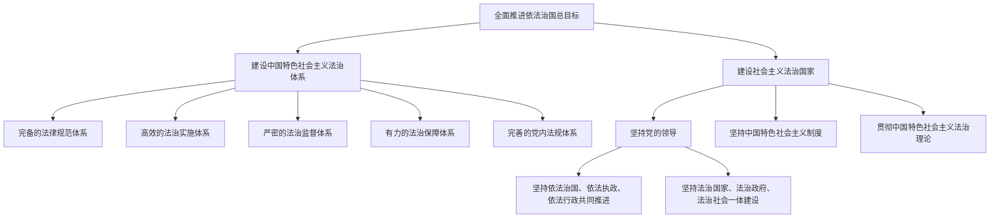
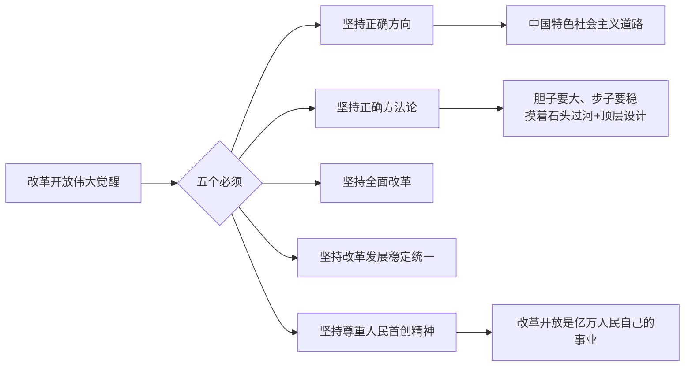
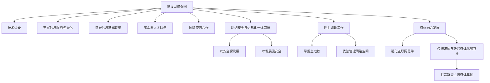
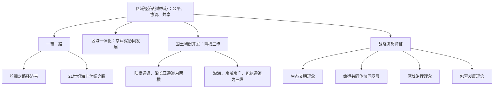
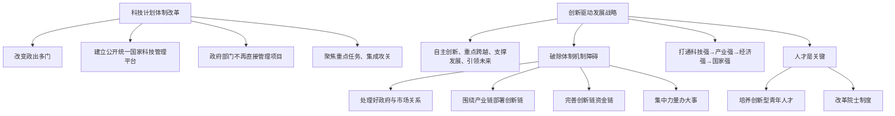
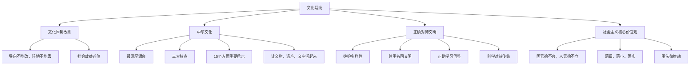

# 《习近平总书记系列重要讲话思维导图》章节总结

## 书籍信息
- 书名：习近平总书记系列重要讲话思维导图（或《学习习近平总书记系列重要讲话》）
- 作者：未署名（官方学习材料）
- PDF 状态：两份文件内容相同，均为文本层可识别的思维导图格式
- OCR 状态：良好，文本识别完整，无严重错漏

## 目录说明
- 目录识别情况：原思维导图无传统目录，按主题板块划分。以下章节基于导图一级标题及内容逻辑整理。
- 章节对应依据：按照原导图出现的主题顺序，依次为：坚持和发展中国特色社会主义、法治建设、中国梦、党的建设、关于党的作风、干部人事、宣传工作、党的纪律建设、党员干部学习、国防与军队建设、生态建设、改革开放、外交、互联网观、经济建设、区域经济战略思想、农业现代化、新国家安全观、亚洲安全观、教育事业、科学技术、反腐倡廉、文化建设、智库建设、文艺工作、民生。
- OCR 修复说明：无修复需要。

## 全书核心主题
该思维导图系统梳理了习近平总书记系列重要讲话的核心内容，涵盖中国特色社会主义、法治、中国梦、党的建设、改革开放、外交、互联网、经济、生态、教育、科技、反腐、文化、民生等国家治理的各个领域。全书强调坚持和发展中国特色社会主义是根本道路，党的领导是本质特征，法治建设与依宪治国是基本方略，中国梦是民族复兴的奋斗目标，全面从严治党是长期任务，改革开放是关键一招，和平发展与人类命运共同体是外交理念，科技创新与网络强国是发展动力，生态文明与民生改善是人民福祉。整体呈现了习近平新时代中国特色社会主义思想的基本框架和关键论断。

---

## 第一章：坚持和发展中国特色社会主义

### 核心论点
本章解决“为什么要坚持和发展中国特色社会主义”的问题。作者认为：中国特色社会主义是中国共产党和中国人民团结的旗帜、奋进的旗帜、胜利的旗帜，是科学社会主义理论逻辑与中国社会发展历史逻辑的辩证统一，是实现中华民族伟大复兴的必由之路。

### 关键概念/事件
- **总体论述**：道路问题是根本问题，30多年发展成就的根本原因是走对了道路。
- **理论渊源**：一百多年来科学社会主义理论与实践发展的结晶。
- **历史渊源**：只有社会主义才能救中国，只有中国特色社会主义才能发展中国。
- **发展的观点**：坚持马克思主义、社会主义必须有发展的观点。

### 逻辑推演/叙事脉络
首先提出道路的根本性，指出中国特色社会主义是历史与人民的选择；接着从理论和历史两个维度论证其必然性；最后强调必须用发展的观点坚持和拓展这条道路，推动其越走越宽广。

### 经典金句/数据
> “中国特色社会主义是中国共产党和中国人民团结的旗帜、奋进的旗帜、胜利的旗帜。”
> “只有社会主义才能救中国，只有中国特色社会主义才能发展中国，这是历史的结论、人民的选择。”

---

## 第二章：法治建设

### 核心论点
本章讨论如何推进法治中国建设。作者提出：坚持依法治国、依法执政、依法行政共同推进，法治国家、法治政府、法治社会一体建设；依宪治国、依宪执政是核心；公正司法是最后一道防线。

### 关键概念/事件
- **推进法治建设的基本思路**：三者共同推进，三者一体建设。
- **依宪治国、依宪执政**：保证宪法实施，维护宪法权威。
- **法治建设目标**：建设社会主义法治国家。
- **法治建设的总体布局**：科学立法、严格执法、公正司法、全民守法。
- **全面推进依法治国的总目标**：建设中国特色社会主义法治体系，建设社会主义法治国家。
- **五大体系**：法律规范体系、法治实施体系、法治监督体系、法治保障体系、党内法规体系。
- **两个“三位一体”**：依法治国、依法执政、依法行政共同推进；法治国家、法治政府、法治社会一体建设。

### 逻辑推演/叙事脉络
从基本思路入手，强调依宪治国的首要地位，明确法治建设的目标与总体布局。然后展开全面推进依法治国的总目标、体系构成、基本原则（党的领导、人民主体、法律平等、德法结合、从实际出发）。最后论述党的领导与社会主义法治的一致性关系，以及法治政府的标准。

### 流程图

#### 全面推进依法治国总目标框架

### 经典金句/数据
> “维护宪法权威，就是维护党和人民共同意志的权威。”
> “努力让人民群众在每一个司法案件中都感受到公平正义。”
> “社会主义法治必须坚持党的领导，党的领导必须依靠社会主义法治。”

---

## 第三章：中国梦

### 核心论点
本章回答“什么是中国梦以及如何实现”的问题。作者定义：中国梦是中华民族伟大复兴的梦想，基本内涵是国家富强、民族振兴、人民幸福。实现路径为中国道路、中国精神、中国力量。

### 关键概念/事件
- **历史逻辑**：近代以来最伟大的梦想，凝聚几代中国人夙愿。
- **基本内涵**：国家富强、民族振兴、人民幸福。
- **实现路径**：走中国道路（中国特色社会主义）、弘扬中国精神（爱国主义为核心的民族精神+改革创新为核心的时代精神）、凝聚中国力量（各族人民大团结）。
- **世界历史意义**：中国发展带给世界机遇，中国梦与世界人民梦想相通。
- **奋斗目标**：2020年翻一番全面建成小康社会；本世纪中叶建成现代化国家。

### 逻辑推演/叙事脉络
从历史逻辑出发，说明中国梦的必然性；接着界定其内涵；然后提出三条实现路径；最后阐述其世界意义和具体奋斗目标。

### 经典金句/数据
> “国家好、民族好，大家才会好。”
> “中国梦归根到底是人民的梦，是每个中国人的梦。”
> “实现中国梦必须走中国道路，必须弘扬中国精神，必须凝聚中国力量。”

---

## 第四章：党的建设

### 核心论点
本章讨论“办好中国的事情，关键在党”。作者强调：要坚定理想信念，管好党治好党，以改革创新精神推进党的建设新的伟大工程，坚持党要管党、从严治党。

### 关键概念/事件
- **坚定理想信念**：共产党人精神上的“钙”。
- **总体要求**：全面提高党的建设科学化水平，使每个基层党组织成为战斗堡垒。
- **关键在党、关键在人**：实现十八大目标的关键。
- **党要管党、从严治党**：首先管好干部，从严治吏。

### 逻辑推演/叙事脉络
首先指出党的核心地位和理想信念的重要性；然后提出总体要求，强调党要管党必须落实到党员队伍管理；最后聚焦干部管理和基层建设。

### 经典金句/数据
> “理想信念就是共产党人精神上的‘钙’，没有理想信念，理想信念不坚定，精神上就会‘缺钙’，就会得‘软骨病’。”
> “中国要出问题，还是出在共产党内部。”

---

## 第五章：关于党的作风

### 核心论点
本章讨论作风问题的极端重要性。作者认为：作风问题绝对不是小事，关系到党的生死存亡；集中表现在“四风”（形式主义、官僚主义、享乐主义、奢靡之风）上；必须反对“四风”，坚持艰苦奋斗，以人民满意为标准。

### 关键概念/事件
- **作风问题严重性**：无形的墙隔开党和人民群众，失去根基、血脉、力量。
- **反对“四风”**：
  - 形式主义 → 解决工作不实
  - 官僚主义 → 解决不维护、不作为
  - 享乐主义 → 克服及时行乐和特权
  - 奢靡之风 → 狠刹挥霍骄奢
- **群众路线**：生命线和根本工作路线，核心是密切血肉联系。
- **总要求**：照镜子、正衣冠、洗洗澡、治治病。
- **公私分明**：公款一分一厘不能乱花，公权一丝一毫不能私用。

### 逻辑推演/叙事脉络
先指出作风问题的危害性，然后分析“四风”的具体表现和危害，提出反对措施。强调作风建设要常抓不懈，以人民满意为检验标准，最后将作风问题归结到公私关系上。

### 经典金句/数据
> “作风问题绝对不是小事，如果不坚定纠正不良风气，任其发展下去，就会像一堵无形的墙把我们党和人民群众隔开。”
> “公款姓公，一分一厘都不能乱花；公权为民，一丝一毫都不能私用。”

---

## 第六章：干部人事

### 核心论点
本章解决“怎样是好干部、怎样成长为好干部、怎样把好干部用起来”的根本问题。作者提出好干部的五条标准：信念坚定、为民服务、勤政务实、敢于担当、清正廉洁；并强调“三严三实”新要求。

### 关键概念/事件
- **干部工作的根本问题**：三个“怎样”。
- **好干部的五条标准**：
  - 信念坚定（道路、理论、制度自信）
  - 为民服务
  - 勤政务实
  - 敢于担当
  - 清正廉洁
- **“三严三实”**：
  - 三严：严以修身、严以用权、严以律己
  - 三实：谋事要实、创业要实、做人要实

### 逻辑推演/叙事脉络
提出党要管党首先管好干部，从严治关键是从严治吏。然后依次回答三个根本问题：什么是好干部（五条标准），如何成长（从严管理），如何用好（保护党性强的同志）。最后加入“三严三实”作为新要求。

### 经典金句/数据
> “当干部就必须付出更多辛劳、接受更严格的约束。”
> “理想信念就是共产党人精神上的‘钙’。”

---

## 第七章：宣传工作

### 核心论点
本章讨论宣传思想文化工作的根本任务。作者提出“两个巩固”：巩固马克思主义在意识形态领域的指导地位，巩固全党全国人民团结奋斗的共同思想基础。强调经济建设是中心工作，意识形态是极端重要的工作。

### 关键概念/事件
- **根本任务**：“两个巩固”。
- **工作重点**：人在哪儿重点就在哪儿。
- **创新要求**：理念创新、手段创新、基层工作创新。
- **责任要求**：全党动手，守土有责、守土负责、守土尽责。

### 逻辑推演/叙事脉络
先明确根本任务，然后指出宣传思想工作的对象是人，必须紧跟人群变化。强调创新和全党责任，最后点明意识形态工作与经济建设的辩证关系。

### 经典金句/数据
> “经济建设是党的中心工作，意识形态工作是一项极端重要的工作。”
> “宣传思想工作是做人的工作的，人在哪儿重点就应该在哪儿。”

---

## 第八章：党的纪律建设

### 核心论点
本章讨论严明党的纪律，首要的是严明政治纪律。作者要求：遵守和维护党章，同党中央保持高度一致，不允许“上有政策、下有对策”。强调组织纪律，使纪律成为带电的高压线。

### 关键概念/事件
- **严明政治纪律**：从遵守和维护党章入手。
- **最核心要求**：坚持党的领导，同党中央保持高度一致。
- **禁止行为**：不允许有令不行、有禁不止，打折扣、做选择、搞变通。
- **组织纪律**：增强党性，严格执行民主集中制、请示报告制度。
- **纪律刚性**：有纪必执，有违必查，使纪律成为带电的高压线。

### 逻辑推演/叙事脉络
首先强调政治纪律的首要地位和具体内容，特别是与中央保持一致。然后扩展到组织纪律，要求增强党性、严格执行各项制度。最后重申纪律的刚性执行。

### 经典金句/数据
> “遵守党的纪律是无条件的，要说到做到，有纪必执，有违必查。”
> “使纪律真正成为带电的高压线。”
> “全党同志要强化党的意识，牢记自己的第一身份是共产党员，第一职责是为党工作。”

---

## 第九章：党员干部学习

### 核心论点
本章讨论在全党大兴学习之风的重要性、紧迫性、内容与方法。作者认为：中国共产党人依靠学习走到今天，也必然要依靠学习走向未来。领导干部的学习水平决定工作水平和领导水平。

### 关键概念/事件
- **学习的重要性**：学习是文明传承之途、人生成长之梯、政党巩固之基、国家兴盛之要。
- **学习的紧迫性**：本领适应面下降，新办法不会用，老办法不管用。
- **学什么**：马克思主义理论、党的路线方针政策、法律法规、经济政治历史文化等。
- **怎样学**：全面系统、向书本实践群众专家学习、干中学学中干、理论联系实际。
- **学习型政党的特征**：高举旗帜、推进中国化、目光远大、善于吸收、勇于变革、学以立德增智创业。

### 逻辑推演/叙事脉络
从历史经验说明学习的重要性，接着指出当前本领恐慌的紧迫性，批评不良学风，然后具体指出学什么、怎样学，最后提出建设马克思主义学习型政党的目标和从严治学的要求。

### 经典金句/数据
> “中国共产党人依靠学习走到今天，也必然要依靠学习走向未来。”
> “空谈误国，实干兴邦。”
> “领导干部应该把学习作为一种追求、一种爱好、一种健康的生活方式。”
> “中国要永远做一个学习大国。”

---

## 第十章：国防与军队建设

### 核心论点
本章提出建设一支听党指挥、能打胜仗、作风优良的人民军队的强军目标。强调听党指挥是首要，能打胜仗是根本，作风优良是政治优势。

### 关键概念/事件
- **听党指挥**：作为军队建设的首要。
- **能打胜仗**：军队首先是一个战斗队，坚持战斗力这个唯一根本标准。
- **作风优良**：鲜明特色和政治优势，基础性长期性工作。
- **强军目标落实**：抓转化运用、抓党委班子和高中级干部。

### 逻辑推演/叙事脉络
明确强军目标的三方面内容，分别阐述各自的重要性和要求，最后提出落实强军目标的关键点。

### 经典金句/数据
> “我军作为执行党的政治任务的武装集团，必须把听党指挥作为军队建设的首要。”
> “始终坚持战斗力这个唯一的根本的标准。”

---

## 第十一章：生态建设（美丽中国）

### 核心论点
本章强调生态文明建设的重要性。作者指出：生态兴则文明兴，良好生态环境是最公平的公共产品、最普惠的民生福祉。要重视生态文明建设，保护生态环境，实现人与自然和谐发展。

### 关键概念/事件
- **生态与文明关系**：生态兴则文明兴，生态衰则文明衰。
- **生态价值**：蓝天白云、青山绿水是长远发展的最大本钱；良好生态环境是最公平的公共产品、最普惠的民生福祉。
- **生态文明定位**：工业文明发展到一定阶段的产物，实现人与自然和谐发展的新要求。
- **目标**：山清水秀但不贫穷落后，生活富裕但环境不退化。

### 逻辑推演/叙事脉络
先提出生态决定文明兴衰的论断，然后阐明良好生态环境的民生价值，最后指出生态文明是人类发展的新阶段和中国的目标。

### 经典金句/数据
> “生态兴则文明兴，生态衰则文明衰。”
> “良好的生态环境是最公平的公共产品，是最普惠的民生福祉。”
> “山清水秀但贫穷落后不是我们的目标，生活富裕但环境退化也不是我们的目标。”

---

## 第十二章：改革开放

### 核心论点
本章阐述改革开放的伟大意义、历史经验、总要求和方法论。作者认为：改革开放是决定中国当代命运的关键一招，只有进行时没有完成时。必须坚持正确方向、正确方法论、全面改革、改革发展稳定统一、尊重人民首创精神。

### 关键概念/事件
- **伟大意义**：一次伟大觉醒，当代中国发展进步的活力之源，关键一招。
- **五个必须经验**：正确方向（中国特色社会主义道路）、正确方法论、全面改革、改革发展稳定统一、尊重人民首创精神。
- **总要求**：坚定信心（道路、理论、制度自信），凝聚共识。
- **方法论**：胆子要大、步子要稳；摸着石头过河与顶层设计相结合；统筹谋划、协同推进。
- **正确认识改革开放前后两个历史时期**：相互联系又有重大区别，本质都是社会主义建设实践探索，不能相互否定。

### 逻辑推演/叙事脉络
先阐述改革开放的伟大意义，然后总结历史经验（五个必须），提出总要求（坚定信心、凝聚共识），强调只有进行时。接着提出方法（胆子大、步子稳，摸着石头过河+顶层设计），最后要求正确认识两个历史时期的关系。

### 流程图

#### 改革开放的历史经验与方法论

### 经典金句/数据
> “改革开放只有进行时，没有完成时。”
> “实践发展永无止境，解放思想永无止境，改革开放也永无止境，停顿和倒退没有出路。”
> “中国是一个大国，决不能在根本性问题上出现颠覆性错误。”

---

## 第十三章：外交（始终不渝走和平发展道路）

### 核心论点
本章阐述中国的外交指导思想：走和平发展道路，倡导人类命运共同体，坚持正确义利观。作者认为：和平发展是战略抉择，实现中国梦需要和平国际环境。中国决不放弃核心利益，但推动合作共赢。

### 关键概念/事件
- **和平发展道路**：根据时代发展潮流和根本利益作出的战略抉择。
- **人类命运共同体**：提出持久和平、共同繁荣的世界梦。
- **正确义利观**：义（共产党人理念，共同快乐幸福）与利（互利共赢，有时重义轻利）。
- **对非政策**：真、实、亲、诚。
- **底线**：决不放弃正当权益和核心利益，不指望拿核心利益做交易。

### 逻辑推演/叙事脉络
从时代潮流和民族传统说明走和平发展道路的必然性，提出人类命运共同体理念。然后阐述如何走：统筹两个大局，宣传和平战略，互利共赢。接着提出正确义利观和对发展中国家的政策。最后强调底线：不能牺牲核心利益。

### 经典金句/数据
> “没有和平，中国和世界都不可能顺利发展；没有发展，中国和世界也不可能有持久和平。”
> “我们要坚持走和平发展道路，但决不能放弃我们的正当权益，决不能牺牲国家核心利益。”
> “任何外国不要指望我们会拿自己的核心利益做交易，不要指望我们会吞下损害我国主权、安全、发展利益的苦果。”
> “对待非洲朋友我们讲一个‘真’字，开展对非合作我们讲一个‘实’字，加强中非友好我们讲一个‘亲’字，解决合作中的问题我们讲一个‘诚’字。”

---

## 第十四章：互联网观（建设网络强国）

### 核心论点
本章讨论建设网络强国的战略部署和措施。作者强调：没有网络安全就没有国家安全，没有信息化就没有现代化。要掌握网上舆论主动权，依法管理网络，推动传统媒体与新兴媒体融合发展。

### 关键概念/事件
- **建设网络强国的措施**：拥有过硬技术、丰富信息服务、良好信息基础设施、高素质人才队伍、开展国际交流合作。
- **战略部署**：与“两个一百年”奋斗目标同步推进。
- **信息是生产要素和社会财富**：信息流引领技术流、资金流、人才流。
- **网络宣传工作**：重中之重，掌握舆论战场主动权。
- **依法管理网络**：确保互联网可管可控，使网络空间清朗起来。
- **互联网管理领导体制**：整合职能，克服多头管理、职能交叉。
- **建设新型主流媒体**：强化互联网思维，推动传统媒体和新兴媒体融合发展。
- **国际互联网治理体系**：多边、民主、透明，尊重信息主权。

### 逻辑推演/叙事脉络
先提出建设网络强国的目标和措施，强调信息的重要性。然后重点讨论网络舆论工作，要求掌握主动权。接着分析现行管理体弊端，提出依法管理和整合职能。再提出推动媒体融合发展，打造新型主流媒体。最后强调网络安全与发展的关系，以及参与国际互联网治理体系建设。

### 流程图

#### 建设网络强国框架

### 经典金句/数据
> “没有网络安全就没有国家安全，没有信息化就没有现代化。”
> “很多人特别是年轻人基本不看主流媒体，大部分信息都从网上获得。必须正视这个事实，加大力量投入，尽快掌握这个舆论战场上的主动权。”
> “使我们的网络空间清朗起来。”
> “网络安全和信息化是一体之两翼、驱动之双轮。”

---

## 第十五章：经济建设

### 核心论点
本章讨论经济发展的核心要求和奋斗目标。作者强调：坚持发展是硬道理的战略思想，以经济建设为中心，稳中求进，提高质量和效益，消除贫困、改善民生、实现共同富裕是社会主义的本质要求。

### 关键概念/事件
- **全面发展与中国梦**：夯实实现中国梦的物质文化基础。
- **新阶段新要求**：稳中求进，提高质量和效益，稳中求好、稳中求优。
- **消除贫困、改善民生、实现共同富裕**：社会主义的本质要求。
- **四大功夫**：总结成功经验、把握客观要求、了解意见建议、了解基层探索。
- **奋斗目标**：人民对美好生活的向往，学有所教、劳有所得、病有所医、老有所养、住有所居。
- **发展的重要意义**：发展仍然是解决我国所有问题的关键。

### 逻辑推演/叙事脉络
将发展与中国特色社会主义、中国梦联系起来，强调以经济建设为中心。提出新阶段要稳中求进、提高质量效益。指出消除贫困等是本质要求。然后列出四大功夫和具体民生奋斗目标，最后重申发展的关键地位。

### 经典金句/数据
> “人民对美好生活的向往就是我们的奋斗目标。”
> “消除贫困、改善民生、实现共同富裕，是社会主义的本质要求。”
> “发展仍然是解决我国所有问题的关键。”

---

## 第十六章：区域经济战略思想

### 核心论点
本章提出区域经济战略的核心思想：公平、协调、共享。具体包括“一带一路”构想、京津冀协同发展、国土均衡开发等。强调生态文明理念、命运共同体、区域治理、包容发展。

### 关键概念/事件
- **核心思想**：公平是前提，协调是路径和手段，共享是目标。
- **“一带一路”构想**：丝绸之路经济带（2013.9）、21世纪海上丝绸之路（2013.10）。
- **区域一体化**：京津冀协同发展上升为国家战略，打破“一亩三分地”思维。
- **国土均衡开发**：“两横三纵”城市化战略格局，一张蓝图干到底。
- **战略思想的主要特征**：
  - 强调生态文明理念（国土是生态文明建设的空间载体，划定生态红线）
  - 强调命运共同体、利益共同体基础上的协同发展
  - 强调区域治理（系统治理、依法治理、源头治理、综合施策）
  - 强调包容发展（不同种族、信仰、文化背景的国家共享和平、共同发展）

### 逻辑推演/叙事脉络
先提出公平、协调、共享的核心思想。然后分别展开：多层次区域开放（一带一路），区域一体化（京津冀），区域协调发展（中央经济工作会议任务），国土均衡开发（两横三纵）。最后总结战略思想的四个主要特征。

### 流程图

#### 区域经济战略框架

### 经典金句/数据
> “要打破‘一亩三分地’的思维定式。”
> “让居民望得见山、看得见水、记得住乡愁。”
> “把绿水青山保留给城市居民。”
> “两千多年的交往历史证明，只要坚持团结互信、平等互利、包容互鉴、合作共赢，不同种族、不同信仰、不同文化背景的国家，完全可以共享和平、共同发展。”

---

## 第十七章：农业现代化

### 核心论点
本章讨论农村土地制度改革与农业现代化。作者提出：在坚持农村土地集体所有的前提下，促使承包权和经营权分离，形成所有权、承包权、经营权三权分置、经营权流转的格局。发展农业规模经营要与城镇化、科技进步、社会化服务相适应。

### 关键概念/事件
- **三权分置**：所有权、承包权、经营权分置，经营权流转。
- **规模经营**：与城镇化进程、劳动力转移、科技进步、社会化服务水平相适应；不能强迫命令，坚持依法自愿有偿。
- **对工商企业租赁**：严格门槛，资格审查、项目审核、风险保障金制度。
- **农民股份合作**：赋予集体资产股份权能改革，探索赋予农民更多财产权利。
- **防止侵吞农民利益**：试点工作严格限制在集体经济组织内部。

### 逻辑推演/叙事脉络
先提出农业现代化必须处理好农业和农民问题，核心是土地制度改革。然后提出三权分置的格局。接着阐述规模经营的条件和原则，强调不能损害农民权益。再针对工商企业租赁提出监管要求。最后说明农民股份合作试点的方向和底线。

### 经典金句/数据
> “既要解决好农业问题，也要解决好农民问题，走出一条中国特色农业现代化道路。”
> “要让农民成为土地适度规模经营的积极参与者和真正受益者。”

---

## 第十八章：新国家安全观

### 核心论点
本章提出总体国家安全观。作者认为：当前国家安全内涵、时空领域、内外因素比历史上任何时候都要丰富、宽广、复杂。必须坚持总体国家安全观，以人民安全为宗旨，以政治安全为根本，以经济安全为基础，走中国特色国家安全道路。

### 关键概念/事件
- **总体国家安全观**：以人民安全为宗旨，以政治安全为根本，以经济安全为基础，以军事、文化、社会安全为保障，以促进国际安全为依托。
- **内外兼顾**：既重视外部安全又重视内部安全；内求发展、求变革、求稳定，外求和平、求合作、求共赢。
- **核心利益底线**：决不放弃正当权益，决不牺牲国家核心利益。
- **网络安全**：牵一发而动全身。
- **民族宗教政策**：坚决遏制分裂、渗透、破坏活动。

### 逻辑推演/叙事脉络
先指出国家安全形势的新特点，提出总体国家安全观的定义和五方面内容。然后强调内外安全的统一性，以及处理外部关系的原则（让别人也发展、安全、过得好）。接着重申核心利益底线，最后具体涉及网络安全、民族宗教等领域。

### 经典金句/数据
> “坚持总体国家安全观，走出一条中国特色国家安全道路。”
> “当前我国国家安全内涵和外延比历史上任何时候都要丰富，时空领域比历史上任何时候都要宽广，内外因素比历史上任何时候都要复杂。”
> “既重视国土安全，又重视国民安全，坚持以民为本、以人为本。”
> “中国是一个大国，决不能在根本性问题上出现颠覆性错误。”

---

## 第十九章：亚洲安全观

### 核心论点
本章提出亚洲安全观：共同、综合、合作、可持续的安全观。创新安全理念，搭建地区安全合作新架构，走共建、共享、共赢的亚洲安全之路。

### 关键概念/事件
- **共同**：尊重和保障每一个国家安全。
- **综合**：统筹维护传统领域和非传统领域安全。
- **合作**：通过对话合作促进各国和本地区安全。
- **可持续**：安全和发展并重，实现持久安全。

### 逻辑推演/叙事脉络
简明提出亚洲安全观的四个维度及其内涵，强调创新安全理念，搭建新架构。

### 经典金句/数据
> “共同、综合、合作、可持续的亚洲安全观。”
> “努力走出一条共建、共享、共赢的亚洲安全之路。”

---

## 第二十章：教育事业

### 核心论点
本章讨论深化考试招生制度改革和教师队伍建设。作者提出：形成分类考试、综合评价、多元录取的考试招生模式，构建终身学习立交桥。强调教育是民族振兴、社会进步的重要基石，教师是打造中华民族“梦之队”的筑梦人。

### 关键概念/事件
- **考试招生制度改革总目标**：分类考试、综合评价、多元录取；构建终身学习立交桥。
- **教育的重要意义**：提高人民综合素质，促进人的全面发展；对中华民族伟大复兴具有决定性意义。
- **教师的重要作用**：塑造灵魂、塑造生命、塑造人的工作；是“太阳底下最崇高的职业”。
- **好老师的四个标准**：
  1. 有理想信念（传道为先）
  2. 有道德情操（以德施教）
  3. 有扎实学识（一潭水）
  4. 有仁爱之心（爱是灵魂）

### 逻辑推演/叙事脉络
先提出考试招生制度改革的目标和要求。然后阐述教育的重大意义，接着重点论述教师的重要作用和好老师的四个标准，引用古今名言论证。

### 经典金句/数据
> “百年大计，教育为本。教育大计，教师为本。”
> “教师是太阳底下最崇高的职业。”
> “一个人遇到好老师是人生的幸运，一个学校拥有好老师是学校的光荣，一个民族源源不断涌现出一批又一批好老师则是民族的希望。”
> “过去讲，要给学生一碗水，教师要有一桶水，现在看，这个要求已经不够了，应该是要有一潭水。”
> “三寸粉笔，三尺讲台系国运；一颗丹心，一生秉烛铸民魂。”

---

## 第二十一章：科学技术

### 核心论点
本章讨论科技计划体制改革和创新驱动发展战略。作者认为：科技是国家强盛之基，创新是民族进步之魂。实施创新驱动发展战略，最根本的是增强自主创新能力，破除体制机制障碍。要深化科技体制改革，打通科技强到产业强、经济强、国家强的通道。

### 关键概念/事件
- **科技计划体制改革**：
  - 问题：科技计划碎片化、科研项目取向聚焦不够。
  - 措施：改变政出多门，建立公开统一的国家科技管理平台，政府部门不再直接管理项目。
  - 目标：形成聚焦重点任务配置资源、集成攻关的新体制。
- **新科技革命**：新一轮科技革命和产业变革正在孕育兴起。
- **创新驱动发展战略**：自主创新、重点跨越、支撑发展、引领未来；把科技创新摆在国家发展全局的核心位置。
- **自主创新**：自力更生是奋斗基点，自主创新是必由之路，但不排斥学习先进。
- **科技体制改革**：处理好政府和市场的关系，打通创新链条，解决科技成果转化不畅。
- **人才**：人是科技创新最关键的因素，创新的事业呼唤创新的人才。
- **改革院士制度**：突出学术导向，改进遴选机制等。

### 逻辑推演/叙事脉络
先指出科技计划体制存在的问题和改革措施，强调新科技革命的机遇。然后阐述创新驱动发展战略的重要性和自主创新的必要性。接着重点论述科技体制改革的具体要求，包括打通转化通道、围绕产业链部署创新链等。最后强调人才的重要性和院士制度改革。

### 流程图

#### 科技体制改革与创新驱动

### 经典金句/数据
> “科技是国家强盛之基，创新是民族进步之魂。”
> “不能总是用别人的昨天来装扮自己的明天。”
> “自力更生是中华民族自立于世界民族之林的奋斗基点，自主创新是我们攀登世界科技高峰的必由之路。”
> “如果把科技创新比作我国发展的新引擎，那么改革就是点燃这个新引擎必不可少的点火系。”
> “盖有非常之功，必待非常之人。”
> “千秋基业，人才为先。”

---

## 第二十二章：反腐倡廉

### 核心论点
本章讨论反腐败斗争的极端重要性。作者认为：腐败是社会毒瘤，任凭腐败问题越演越烈，最终必然亡党亡国。必须坚持零容忍态度，把权力关进制度的笼子里，形成不敢腐、不能腐、不易腐的机制。坚持“老虎”、“苍蝇”一起打。

### 关键概念/事件
- **重要性**：腐败是社会毒瘤，亡党亡国。
- **新认识**：“赶考”远未结束，反腐倡廉必须常抓不懈。
- **新做法**：把权力关进制度的笼子，形成不敢腐、不能腐、不易腐的机制。
- **惩治和预防腐败体系**：国家战略和顶层设计；强化制约、监督、公开。
- **目标**：坚持“老虎”、“苍蝇”一起打。
- **新要求**：反对特权思想、特权现象；落实党委主体责任和纪委监督责任。

### 逻辑推演/叙事脉络
先强调腐败的严重危害和坚决反腐的决心。然后提出“赶考”远未结束的新认识，接着提出制度反腐的具体做法（三个机制）。进一步阐述惩治和预防腐败体系的建设，包括制约、监督、公开。最后提出“老虎苍蝇一起打”的目标和反对特权、落实责任的新要求。

### 经典金句/数据
> “腐败是社会毒瘤，如果任凭腐败问题越演越烈，最终必然亡党亡国。”
> “以猛药去疴、重典治乱的决心，以刮骨疗毒、壮士断腕的勇气，坚决把党风廉政建设和反腐败斗争进行到底。”
> “把权力关进制度的笼子里。”
> “要坚持‘老虎’、‘苍蝇’一起打。”
> “手莫伸，伸手必被捉。”

---

## 第二十三章：文化建设

### 核心论点
本章讨论文化体制改革、中华文化传承、社会主义核心价值观。作者强调：无论怎么改，导向不能改，阵地不能丢。中华文化是提高国家文化软实力的深厚源泉。要大力培育和弘扬社会主义核心价值观，使核心价值观融入日常生活。

### 关键概念/事件
- **文化体制改革**：把握好意识形态属性和产业属性、社会效益和经济效益的关系；导向不能改，阵地不能丢。
- **文化发展道路**：走中国特色社会主义文化道路，让一切文化创造源泉充分涌流。
- **中华文化**：提高文化软实力的源泉；让收藏在禁宫里的文物、陈列在广阔大地上的遗产、书写在古籍里的文字都活起来。
- **中华核心思想文化的三大特点**：对立统一、与时迁移、经世致用。
- **中国优秀传统文化中的15个重要启示**（如道法自然、天下为公、自强不息、以民为本等）。
- **正确对待不同文明**：维护文明多样性、尊重各国文明、正确学习借鉴、科学对待传统。
- **社会主义核心价值观**：国无德不兴，人无德不立；在落细、落小、落实上下功夫；用法律推动核心价值观建设。

### 逻辑推演/叙事脉络
先提出文化体制改革的底线和原则，强调导向不能改。然后阐述中华文化的重要价值和传播方式，分析中华传统文化的三大特点和15个启示。接着论述如何正确对待不同国家和民族的文明。最后重点讨论社会主义核心价值观的培育和弘扬，要求融入日常生活、用体制机制和法律法规保障。

### 流程图

#### 文化建设框架

### 经典金句/数据
> “无论改什么、怎么改，导向不能改，阵地不能丢。”
> “让收藏在禁宫里的文物、陈列在广阔大地上的遗产、书写在古籍里的文字都活起来。”
> “国无德不兴，人无德不立。”
> “如果没有自己的精神独立性，那政治、思想、文化、制度等方面的独立性就会被釜底抽薪。”

---

## 第二十四章：智库建设

### 核心论点
本章强调建设中国特色新型智库的重大意义和紧迫任务。作者认为：智力资源是国家、民族最宝贵的资源。改革发展任务越是艰巨繁重，越需要强大的智力支持。要坚持党的领导，体现中国特色、中国风格、中国气派。

### 关键概念/事件
- **建设意义**：智力资源最宝贵，治国理政需要集中智慧，改革需要智力支持。
- **建设要求**：重大而紧迫的任务；坚持党的领导，把握正确导向；体现中国特色、中国风格、中国气派；坚持科学精神，鼓励大胆探索；围绕大局，服务中心。
- **目标体系**：定位明晰、特色鲜明、规模适度、布局合理的中国特色新型智库体系；重点建设一批高端智库。

### 逻辑推演/叙事脉络
先指出智力资源的重要性，然后结合改革发展任务说明智库建设的紧迫性，最后提出建设的具体要求和目标。

### 经典金句/数据
> “智力资源是一个国家、一个民族最宝贵的资源。”
> “改革发展任务越是艰巨繁重，越需要强大的智力支持。”

---

## 第二十五章：文艺工作

### 核心论点
本章讨论文艺工作的重大意义和原则。作者认为：文艺是时代前进的号角，最能代表一个时代的风貌。社会主义文艺本质上是人民的文艺。文艺工作者要坚持以人民为中心的创作导向，创作无愧于时代的优秀作品，弘扬中国精神，不能当市场的奴隶。

### 关键概念/事件
- **重大意义**：文艺作用不可替代，文艺事业是党和人民的重要事业。
- **工作原则**：以人民为中心的创作导向，弘扬中国精神，凝聚中国力量。
- **对文艺工作者的要求**：创作是中心任务，作品是立身之本；德艺双馨；讲品位，重艺德；扎根人民、扎根生活。
- **社会主义文艺的本质和方向**：人民的文艺，为人民服务、为社会主义服务。
- **文艺创作要求**：不能当市场的奴隶；追求真善美；爱国主义是主旋律；传承中华优秀传统文化。
- **加强党的领导**：各级党委要纳入议事日程，尊重创作个性，加强文艺评论。

### 逻辑推演/叙事脉络
先阐述文艺工作的重大意义，然后提出以人民为中心的创作原则。接着对文艺工作者提出具体要求（创作优秀作品、德艺双馨）。进一步明确社会主义文艺的本质是为人民服务，强调扎根生活、不能当市场奴隶。最后提出加强党对文艺工作的领导。

### 经典金句/数据
> “文艺是时代前进的号角，最能代表一个时代的风貌，最能引领一个时代的风气。”
> “社会主义文艺，从本质上讲，就是人民的文艺。”
> “文艺不能当市场的奴隶，不要沾满了铜臭气。”
> “艺术的最高境界就是让人动心，让人们的灵魂经受洗礼。”
> “中华优秀传统文化是中华民族的精神命脉。”

---

## 第二十六章：民生

### 核心论点
本章讨论民生的奋斗目标、重要意义和具体事项。作者强调：人民对美好生活的向往就是我们的奋斗目标。保障和改善民生没有终点站。就业是民生之本，食品安全是重大考验，要推动养老事业多元化，努力实现学有所教、劳有所得、病有所医、老有所养、住有所居。

### 关键概念/事件
- **奋斗目标**：人民对美好生活的向往。
- **重要意义**：民生改善是“中国梦”的最好诠释，是复兴之本、梦想之基。
- **民生事项**：
  - 就业是民生之本，解决就业根本要靠发展。
  - 住房保障：经得起实践、人民、历史检验的德政工程。
  - 养老事业：多元化、多样化发展，让所有老年人老有所养、老有所依、老有所乐、老有所安。
  - 食品安全：用最严谨的标准、最严格的监管、最严厉的处罚、最严肃的问责，确保“舌尖上的安全”。

### 逻辑推演/叙事脉络
先提出奋斗目标，然后阐述民生改善与中国梦的关系，强调保障和改善民生没有终点。最后具体列出就业、住房、养老、食品安全等民生事项的要求。

### 经典金句/数据
> “保障和改善民生没有终点站，只有连续不断的新起点。”
> “一切工作出发点、落脚点都是让人民过上好日子。”
> “用最严谨的标准、最严格的监管、最严厉的处罚、最严肃的问责，确保广大人民群众‘舌尖上的安全’。”
> “就业是民生之本，解决就业问题根本要靠发展。”